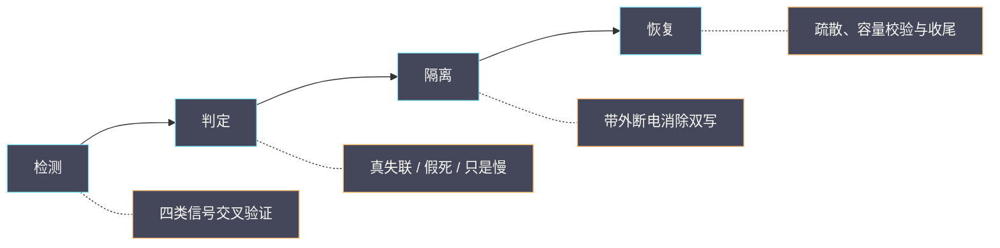

# 04 宿主机失联——故障检测、Fencing、Masakari 与恢复决策

**摘要：**

宿主机失联是云平台上最需要「当机立断」的一类故障：检测慢了会拖长业务中断，判断错了会把一次故障变成两次。本文把这件事拆成四步——检测、判定、隔离、恢复，逐段讲清信号长什么样、误判从哪里来、为什么恢复前必须先隔离，以及实例高可用机制在其中扮演什么角色。全文回答两个问题：怎样在噪声里可靠地判定一台宿主机真的失联，以及判定之后应该等、应该隔离还是应该疏散。文中的现场事实取自 2026 年 9 月的脱敏记录，涉及具体数值处标注口径。

---

## 第 1 章 失联的三种含义

「宿主机失联」是一个被过度简化的说法。在平台内部，它至少可能指三件不同的事，而三者的处置方式完全不同。

第一种是**管理面失联**：宿主机的监控采集器或管理 agent 不再上报，控制面因此认为它「不可达」。这可能是采集器本身被杀死、网络被阻断，也可能是整机真的挂了。它是最常见的告警形态，也是最容易误判的一种。

第二种是**控制面服务失联**：宿主机上的计算服务、网络 agent 状态被标记为异常。它意味着这台机器不再能承接新的调度，但已有的虚机可能仍在正常运行。

第三种是**整机失联**：宿主机彻底不可达，上面所有虚机随之中断。这是唯一一种需要立即决策的形态，也是本文的重点。

**三种含义的区别不在现象，而在证据。** 只看「心跳丢了」无法区分它们，必须结合控制面服务状态、虚机实际可达性、带外管理口是否可用等证据一起判断。把三者混为一谈，是宿主机故障处置中最常见的起点错误。

### 1.1 为什么区分很重要

区分的意义在于代价的不对称。如果把「管理面失联」误判为「整机失联」并执行疏散，会在虚机其实还活着的情况下在别处重建一份，造成同一实例出现两个运行副本的风险；反过来，如果把「整机失联」误判为「管理面失联」而一直等待，业务中断会被拖长，且等待毫无收益。

**误判的两个方向都有代价，而方向不同、代价不同。** 因此检测的目标不是「尽快下结论」，而是「用足够的证据下正确的结论」。这也是为什么恢复之前要先隔离——隔离的本质，是把「误判方向二」的风险消掉。

### 1.2 失联的影响面

宿主机失联的影响面取决于三个变量：这台机器上跑了多少虚机、这些虚机承载什么业务、以及恢复能力有多强。一台只跑测试虚机的机器失联，与一台承载核心业务的机器失联，处置的紧迫程度完全不同。因此**判定「是否需要立即恢复」之前，先要判定「影响了什么」**。

影响面的评估可以从两个方向做。一是自下而上：从故障宿主机出发，列出它上面的虚机与业务归属；二是自上而下：从业务告警出发，反查受影响的实例落在哪些宿主机上。两个方向的结果应当一致，不一致说明映射关系（资产、业务标签）有缺失，这本身就是需要修复的问题。**映射缺失会在每一次故障里重复消耗排查时间**，这也是后面运维工程化篇要专门建设的能力。

### 1.3 处置的四步框架

本文把宿主机失联的处置整理成四步：检测、判定、隔离、恢复。这四步是串联的，顺序不能颠倒——**没有检测就没有判定，没有判定就没有隔离，没有隔离就没有安全的恢复**。很多事故处置失当，不是某一步做得不好，而是跳过了某一步：直接恢复，跳过了隔离；或者直接判定，跳过了检测的交叉验证。

把四步记牢的收益是，在高压环境下仍能按顺序推进，而不是凭直觉乱撞。**高压环境最需要的不是灵感，而是清单**。接下来的四章，分别展开这四步。



四步的顺序不可颠倒：**没有检测就没有判定，没有判定就没有隔离，没有隔离就没有安全的恢复**。图下方的注释是每一步的核心问题，也是后面四章各自的落点。

### 1.4 与相邻主题的边界

宿主机失联与相邻主题有清晰边界，分清它们能避免把不同问题混在一个流程里。与「实例故障」的边界是：实例故障时宿主机健康，属于实例级恢复，不由宿主机流程处理。与「存储故障」的边界是：存储后端异常时宿主机健康，虚机可能只是 I/O 变慢而非中断。与「控制面故障」的边界是：控制面异常时宿主机与虚机可能都健康，只是无法变更。

**边界的作用是选对流程**。用错流程的代价不只是低效，还可能引入不必要的动作（如为存储变慢而疏散虚机），把可控问题变成事故。这与 03 篇「不要拿一层的证据去下另一层的结论」是同一条纪律，只是从「诊断」延伸到了「处置」。

## 第 2 章 检测：信号从哪来

宿主机是否还活着，平台有多个独立的观测源。它们的可靠性不同，组合起来才能形成可靠的判断。

### 2.1 四类信号

| 信号源 | 判据 | 可靠性 | 失效场景 |
| :--- | :--- | :--- | :--- |
| 监控采集心跳 | 周期性上报是否连续 | 中 | 采集器被杀、网络阻断 |
| 控制面服务状态 | 计算与网络 agent 是否在线 | 中高 | 消息链路故障 |
| 虚机可达性 | 虚机网络是否仍可通信 | 高 | 虚机本身故障 |
| 带外管理 | 电源与硬件管理口是否可达 | 高 | 管理网独立故障 |

四类信号里，**带外管理是唯一不依赖宿主机操作系统的通道**。它的价值在整机失联时最为突出：操作系统已经挂了，但只要带外管理口还在，就能确认机器的供电与硬件状态，甚至执行强制断电。这也是后面 Fencing 一节的基础。

### 2.2 心跳的语义

心跳是最常用的信号，也是最容易被误读的信号。心跳丢失只说明「采集通道断了」，可能的原因包括：宿主机资源枯竭导致采集器被内核清理、网络不通、采集器自身故障、采集器正在重启。**心跳丢失是「采集不可用」，不是「业务不可用」**，这两者之间隔着若干种可能。

这一点在 2026 年 9 月的一次混布主机批量异常里体现得非常清楚：现场大量宿主机的心跳同时丢失，看起来像大面积网络故障，但物理网络层是干净的，真正的原因是宿主机内存枯竭，采集器被内核反复清理。**把心跳当作唯一判据，会把内存问题误读成网络问题**。

### 2.3 控制面服务状态的语义

控制面的服务状态由计算服务与网络 agent 的上报驱动，它比心跳更接近「这台机器还能不能干活」，但也有自己的失效场景。当消息链路本身出问题时，服务状态的上报会中断，表现为「服务异常」而机器其实健康。

判断的方法是**交叉验证**：如果服务状态异常、但该机上的虚机仍能正常通信，说明机器本身没死，异常更可能来自上报链路。这个判据与第 1 章的三种含义一一对应，是区分「管理面失联」与「整机失联」的关键。

```bash
# 控制面视角：计算与网络服务的状态
openstack compute service list --service nova-compute -f value -c Host -c State -c Status
openstack network agent list -f value -c Host -c Alive -c State

# 带外视角：确认供电与硬件管理口是否可达
ipmitool -I lanplus -H <bmc-ip> -U <user> -P <pass> chassis power status
```

### 2.4 信号的频率与时间特性

不同信号的时间特性不同，这决定了它们在判定中的角色。心跳类信号频率高、延迟低，适合快速触发关注，但也容易受瞬时抖动影响；控制面服务状态由上报驱动，通常有几分钟的判定延迟，适合确认趋势；虚机可达性依赖业务探针，准确但频率取决于探针设计；带外管理是即时查询，但需要主动发起。

**快信号用来触发，慢信号用来判定**，这是信号组合的基本原则。把快信号直接当判据，会被抖动误导；把慢信号当作唯一来源，会拖长恢复时间。理解了这一点，就不会纠结「到底该信哪个信号」，而是知道每个信号各自适合回答什么问题。

### 2.5 采集链路自身的失败语义

检测的可靠性最终取决于采集链路。采集链路有自己的失败语义，忽略它会把「没有数据」误读为「一切正常」或「机器已死」。常见的失败语义有三类：采集器被资源压力清理，表现为心跳中断但机器健康；网络阻断，表现为心跳中断且伴随大量其他主机同时中断；采集器重启，表现为短暂缺口后自行恢复。

**区分它们的方法是把「中断的分布」作为证据**：单台中断与批量中断的原因不同，集中中断与分散中断的原因也不同。这与 01 篇讲的「影响半径」是同一种思路——**分布本身就是信息**。把分布画出来，往往比读十条日志更快接近答案。

### 2.6 一个可靠的检测组合

把信号组合起来，可以设计一个更可靠的检测方案：以心跳作为第一触发，触发后自动发起带外查询与虚机可达性探测，三者结果汇总后再判定。这个组合的好处是，它把「快」与「准」分开——快信号负责不漏，慢信号负责不误。

组合检测的另一个收益是它天然产出判定依据。当告警触发时，判定所需的证据已经在采集，值班人不必再临时去查。**把判定所需证据前置到检测阶段，是缩短恢复时间最有效的设计之一**。这与后面运维工程化篇要讲的「取证自动化」是同一件事的两个视角：检测是为了决策，取证是为了复盘，而两者的数据来源可以共用。

### 2.7 检测能力的建设顺序

检测能力的建设有先后顺序，不是把所有信号都接上就完事。合理的顺序是：先接心跳，保证「有异常能被发现」；再接控制面服务状态，保证「能区分是机器问题还是服务问题」；然后接带外管理，保证「能确认机器是否真的活着」；最后接虚机可达性，保证「能确认业务是否真的中断」。

这个顺序的逻辑是**从「发现问题」到「确认问题」再到「定性问题」**。跳过中间步骤直接上最细的探测，会得到大量信号却没有判定能力——**信号多不等于判断准**。这也解释了为什么有些平台监控面板很丰富，故障时却依然手忙脚乱：缺的不是信号，是判定链。

### 2.8 带外管理为什么常常被忽略

带外管理在检测链里角色特殊：它最可靠，却最常被忽略。原因有二。第一，它需要独立的网络与凭据，建设成本高，容易在项目里被降级为「以后再说」。第二，它在平时几乎不用，运维手感缺失，真要用时可能发现凭据过期、网段不通。

**一个能力的价值，等于「它有多可靠」乘以「它在需要时有多可用」**。带外管理的可靠性很高，但如果需要时不可用，乘积就是零。因此带外能力必须定期演练：随机抽取机器验证管理口可达、凭据有效、断电指令可用。这比增加更多业务监控更能提升真实的恢复能力，因为它守的是恢复链上最不可替代的一环。

## 第 3 章 判定：失联、慢与假死

检测拿到信号之后，还要做判定。判定的核心难题是**区分「真的挂了」「很慢」与「看起来挂了」**，因为它们的处置完全不同。

### 3.1 三种状态

| 状态 | 特征 | 处置方向 |
| :--- | :--- | :--- |
| 真失联 | 多类信号同时消失，带外可达 | 隔离后疏散 |
| 假死（僵死） | 信号部分消失，进程仍在但不响应 | 先取证，谨慎处置 |
| 只是慢 | 信号延迟，但最终仍上报 | 观察，不疏散 |

「假死」是最难处理的一种：宿主机进程还在，但由于资源枯竭或锁死，无法响应任何请求。它的表现与真失联非常相似，区别在于带外管理口能看到系统仍在运行、CPU 仍在活动。**对假死执行疏散而不隔离，风险最高**，因为虚拟机进程可能还活着。

### 3.2 判定需要的时间窗

判定需要时间，但时间越长业务中断越久。这个矛盾靠**分层的判定标准**来平衡：先用快速信号（心跳）触发告警与关注，再用慢速但可靠的信号（带外、虚机可达性）做最终判定。

具体的时间窗取决于业务对中断的容忍度：对中断敏感的业务，判定窗口要短，代价是误判概率上升；对中断不敏感的业务，判定窗口可以长一些，换取更准的判断。**没有普适的窗口，只有与业务 SLO 匹配的窗口**——这一点会在运维工程化篇展开。

### 3.3 判定中最常见的错误

最常见的错误是**用单一信号下结论**。心跳丢了就疏散，会把假死误判为真失联；服务状态异常就重启，会把上报链路问题误判为服务问题。第二常见的错误是**忽略带外证据**，明明管理口可以确认机器还在运行，却凭操作系统内的信号做决定。

第三常见的错误是**把批量现象当成单机现象的反面**：当多台宿主机同时异常时，正确做法不是逐台判定，而是先找它们的共享层（详见 [[SRE/CVM集群可靠性工程/01 CVM 服务地图——用户操作、控制面与数据面依赖|01 CVM 服务地图]] 与 05 篇）。**批量异常的第一反应应当是「它们共享什么」，而不是「它们各自怎么了」**。

### 3.4 判定阈值怎么定

判定阈值的设计要回答三个问题：用哪个信号触发、等多久、由谁确认。触发信号应当选频率高、延迟低的（如心跳）；等待时长应当与业务中断容忍度匹配；确认环节应当引入第二类独立信号，避免单一信号误判。

阈值不是越短越好。**把阈值调短会提高误判概率，而误判的代价可能高于多等几分钟**。反过来，阈值过长会让业务中断被拖长。两者的平衡点取决于业务的 SLO：中断一分钟的损失与误判一次的损失，哪个更大，就偏向哪一边。这也说明判定阈值不是纯技术参数，而是业务决策的技术投影。

### 3.5 一个判定实例

设想一台宿主机心跳丢失，同时计算服务状态异常。带外查询显示电源正常、系统在运行；虚机探测显示上面的虚机仍能通信。三个证据合起来指向「管理面失联」——机器健康，只是上报通道出了问题。此时正确动作是排查上报链路与宿主机资源，而不是疏散。

反过来，如果带外查询无响应、虚机探测全部失败、控制面服务状态异常，三个证据指向「整机失联」，此时才进入隔离与疏散流程。**同一组现象，因为第三、四个证据不同，走向完全不同的处置**，这正是交叉验证的价值。它同时说明，检测能力的建设不只是「加一个告警」，而是「让判定所需的每个问题都有一个证据源」。

## 第 4 章 Fencing：为什么恢复前必须先隔离

判定为真失联之后，下一步不是立刻疏散，而是隔离。这一步最容易被跳过，也最不能跳过。

### 4.1 什么是 Fencing

隔离（Fencing）指的是在恢复动作之前，确保故障宿主机**确实不再运行任何东西**，通常通过带外管理口执行强制断电。它的目的只有一个：消除「同一实例在两处同时运行」的可能性。

为什么这个可能性必须消除？因为虚机的磁盘通常挂在共享存储上。如果故障宿主机其实没死（只是失联），而你在另一台机器上把它重建起来，两份虚机进程会同时读写同一块盘，后果是数据损坏。**共享存储带来的可迁移性，同时带来了双写风险**，隔离就是为此付出的成本。

### 4.2 隔离的代价与边界

隔离不是免费的。强制断电会丢失宿主机上的未落盘数据，也可能让一些本来可以通过重启自愈的场景失去机会。因此隔离有一个前提：**确认故障宿主机的失联是「真」的，或者至少确认让它继续运行的风险大于断电的风险**。

在共享存储的场景下，这个前提通常成立——双写的风险远大于断电的代价。在本地盘的场景下，情况更复杂：即使隔离成功，虚机的数据也随宿主机一起失去，疏散无法恢复业务，此时隔离的意义只是保证「不会有两份」。**隔离与疏散是两个独立的决策**，前者关于安全，后者关于恢复。

### 4.3 隔离与检测的关系

隔离依赖带外管理，因此它天然要求带外通道的可用性。如果带外管理网与业务网共享链路，那么业务网故障时带外也可能不可用，隔离就做不了。**这时唯一安全的做法是等待**，而不是在没有隔离能力的情况下贸然疏散。

这条约束在设计阶段就要考虑：**带外管理网的独立性，是实例高可用能力的前提**。很多平台在建设时把带外管理当作附属设施，等到故障时才发现隔离做不了，只能眼睁睁看着恢复窗口错过。

### 4.4 隔离的几种实现

隔离的实现方式不止一种，按可靠性从高到低大致是：带外电源管理（通过管理口强制断电）、电源分配单元控制（切断整机供电）、存储层隔离（把故障机从共享存储的访问中移除）。三者可以组合使用，越靠前越彻底。

选择实现方式时要考虑通道独立性：带外管理网与业务网是否独立、电源控制是否独立。**如果所有通道都共享同一条链路，那么链路故障时隔离能力同时失效**，这是设计缺陷，不是运维问题。识别这类缺陷的方法很简单：画一张「隔离通道」与「业务通道」的重叠图，重叠越多，隔离能力越脆弱。

### 4.5 隔离失败时怎么办

隔离可能失败：管理口不可达、权限不足、断电指令无响应。此时有几个选择。第一，等待——如果业务中断可以承受，等待带外恢复或机器自行恢复是最安全的选择。第二，用替代通道——电源分配单元、存储层隔离往往独立于带外管理，可以作为备选。第三，在评估双写风险后承担风险执行恢复，但这应当是预案里预先授权的例外，而不是临场拍板。

**隔离失败不是死局，但它把「技术问题」变成了「决策问题」**：谁有权在无法隔离的情况下决定恢复，这个权限必须在平时定义清楚。临场找不到决策人，往往会导致两种坏结果——要么一直等，要么有人擅自恢复。

### 4.6 双写风险的后果

双写的后果不是「两份虚机」这么简单。共享存储上的块设备没有为并发写设计，两份虚机进程同时写同一块盘，会导致文件系统元数据损坏、数据块互相覆盖。**损坏往往是不可逆的**，且发现时间可能滞后很久——等到业务读写时才发现数据已经错乱。

这解释了为什么隔离是「必须」而不是「最好」。在共享存储架构下，**没有隔离的恢复不是恢复，而是数据损坏的开始**。把这句话写进预案，能避免大量侥幸操作。它也从反面说明：共享存储带来的可迁移性，其代价被推迟到了「故障恢复的那一刻」才显现，因此很容易在设计阶段被低估。

## 第 5 章 Masakari：把疏散自动化

隔离之后是恢复。手工疏散在大规模场景下不可行，因此平台通常引入实例高可用服务来自动化这一过程。这类服务在本平台的角色由 Masakari 承担。

### 5.1 它解决什么问题

实例高可用服务要解决的问题是：当宿主机故障时，把上面的虚机自动迁移到其他健康宿主机上，让业务尽快恢复，而不必等运维发现并手动操作。它把「检测 → 判定 → 隔离 → 疏散」这条链自动化，缩短了业务中断时间。

### 5.2 组成与分工

| 组件 | 职责 | 部署位置 |
| :--- | :--- | :--- |
| 监控组件 | 检测宿主机与实例故障并上报 | 计算节点 |
| 引擎 | 接收通知、编排恢复流程 | 控制面 |
| 接口 | 提供查询与手动触发能力 | 控制面 |

监控组件通常借助集群通信机制感知节点故障，把通知发给引擎；引擎根据配置的恢复策略决定动作。这里的「恢复策略」是关键配置，它决定故障时是自动疏散还是仅通知人工。

### 5.3 分段与策略

实例高可用服务通常引入「分段」的概念，把宿主机按可用性边界分组，恢复时只在同段内寻找目标宿主机。这样做的原因是：**迁移目标必须在业务可接受的范围内**，把一台虚机从可用区 A 疏散到可用区 B 可能违反业务的容灾设计。

恢复策略有两种典型形态：**自动**，检测到故障立即疏散；**保留**，只标记故障并通知人工决策。自动策略响应快，但误判时影响大；保留策略更稳，但依赖人值守。**选择哪一种取决于业务对中断的容忍度与平台对判定准确度的信心**，没有统一答案。

```bash
# 查看实例高可用服务配置的分段与主机
openstack ha segment list
openstack ha host list

# 查看服务状态
openstack ha service list
```

### 5.4 自动化的边界

实例高可用服务不能替代 Fencing。它做的是「把虚机搬走」，而不是「确保源端不再运行」。因此一个成熟的恢复流程是「先隔离、后疏散」，自动化只覆盖后半段。**把疏散自动化当成完整方案，会留下双写的隐患**。

另一个边界是共享存储。疏散的前提是虚机的磁盘不依赖本地盘；如果虚机的根盘在本地，疏散只能重建一个空盘，业务数据无法恢复。**这也是为什么共享存储是弹性平台的前提而非可选项**，这一点在 [[云原生/OpenStack/05 实例生命周期与迁移实战|05 实例生命周期与迁移]] 里已从状态机角度讲过。

### 5.5 一次恢复流程的时序

把自动恢复拆成时序，大致是：监控组件感知节点故障并发出通知；引擎接收通知，读取该节点所属分段与恢复策略；若策略为自动，引擎调用计算服务接口，在分段内的健康宿主机上重建实例；重建过程中，计算服务读取实例的磁盘（共享存储）并重新拉起进程；引擎记录恢复结果并更新状态。

这条时序里有两个关键点。第一，**重建依赖共享存储**，本地盘的实例无法完整恢复。第二，**恢复目标的选择依赖分段与容量**，分段过小或目标资源不足会导致恢复失败。这两个关键点，也决定了实例高可用能力的两条前提：共享存储可用、分段内有富余容量。两条前提缺一，自动化就会在关键时刻失效。

### 5.6 与计算服务的关系

实例高可用服务不重复实现计算逻辑，它复用的是计算服务已有的重建能力。因此它的成败与计算服务的可用性强相关：如果控制面本身在故障中受损（如数据库或消息链路异常），实例高可用也无法工作。**实例高可用保护的是「宿主机故障」，不保护「控制面故障」**，这是它的能力边界。

这个边界在实践中很重要：当故障同时波及宿主机与控制面时（混布场景下并不罕见），不要指望自动化能解决问题，而要先恢复控制面底座。控制面底座的可用性设计与排查顺序，在 [[云原生/OpenStack/02 控制面三件套——MariaDB、RabbitMQ 与 Keystone|02 控制面三件套]] 与 01 篇里都有展开。这也是 05 篇要讨论的「共享故障域恢复顺序」的核心问题。

### 5.7 分段与容量规划的关系

分段不只是恢复时的约束，它也反过来约束容量规划。如果分段划分得很细，每段内都要预留恢复空间，总容量需求会上升；如果分段很粗，恢复空间可以共用，但迁移范围可能超出业务容忍度。**分段粒度是「容量成本」与「迁移可控性」之间的权衡**。

规划时应当先确定业务的容灾边界（哪些虚机可以互相迁移），再据此划分分段，最后按「段内可容纳最坏情况」预留容量。**顺序反了——先按现状划段再补容量——往往会导致某些段永远没有恢复空间**。这一条与 06 篇的容量规划直接相关，是把「高可用」落到「资源账」上的接口。

### 5.8 恢复策略的选择

自动与保留两种策略的选择，可以用三个问题来定：这类虚机的业务中断容忍度是多少？平台对失联判定的准确度有多高？有没有人在故障时能及时介入？三个问题的答案决定倾向：容忍度低、判定准、无人值守，倾向自动；反之倾向保留。

需要注意的是，**策略可以按业务分组配置**，不必全平台统一。核心业务用自动、边缘业务用保留，是很常见的组合。分段机制天然支持这种分组——按业务边界划段，段内配置各自的策略。**把「恢复策略」与「业务等级」绑定**，比一刀切更符合实际，也更容易解释给业务方。

## 第 6 章 恢复决策：等、隔离还是疏散

把前面几章合起来，恢复决策可以整理成一条清晰的路径。

### 6.1 决策路径

1. **是批量异常吗**？是，先找共享层，不要逐台决策。
2. **多类信号是否同时消失**？否，倾向于「管理面失联」或「只是慢」，继续观察并补证据。
3. **带外管理是否可达**？否，无法隔离，倾向于等待；是，进入下一步。
4. **是否确认不再运行**？是，进入疏散；否，先隔离。
5. **虚机是否使用共享存储**？否，疏散无法恢复数据，需评估是否值得；是，执行疏散。

### 6.2 等待也是一种决策

决策路径里有一个容易被忽略的选项是「等」。等待不是无所作为，而是**在隔离条件不具备或判定证据不足时的正确选择**。强行疏散的代价可能是数据损坏，而等待的代价只是时间——两者的不对称决定了在证据不足时应当等待。

当然，等待有边界。如果业务中断不可接受，而隔离条件又不具备，就需要在「等待」与「承担双写风险」之间做权衡。**这个权衡不应该由值班人临场决定，而应该在预案里预先定义**：什么情况下等、等多久、谁来拍板。

### 6.3 恢复后的收尾

疏散完成不等于恢复结束。收尾包括：确认目标宿主机资源充足、确认虚机网络与磁盘正常、确认业务探针恢复、确认故障宿主机在修好后不会自动把虚机「拉回去」。最后一点容易被忽略——**如果故障宿主机恢复后仍持有旧的虚机记录，可能出现状态冲突**，需要在维护流程里显式处理。

### 6.4 疏散目标怎么选

疏散目标的选择不是随意的，它要同时满足三个条件：在业务允许的分段内、有足够的资源、不与原宿主机共享同一个故障域。第三个条件容易被忽略——如果目标宿主机与原宿主机在同一机架、同一电源、同一网络出口下，那么下一次同类型故障会同时影响两者。

**疏散的本质是「换一个故障域」**，如果换到的还是同一个故障域，疏散只是把中断推迟了。这也是为什么容量规划里要留出「跨故障域的空余」，而不是只看总量。总量充足但分布集中，遇到整机架故障时同样无处可去。

### 6.5 等待的边界与预案

等待需要边界。没有边界的等待会退化成「不作为」，而没有预案的等待会让值班人陷入两难。预案应当回答：什么条件下等、最长等多久、超时后谁决策、以及承担风险恢复需要谁的授权。

把这些写清楚，等待就从一个被动动作变成了一个主动选择。**主动等待与被动拖延的区别，就在于有没有定义退出条件**。这也是把经验沉淀为流程的意义——它让不同的人在同一个场景下做出一致的决策，而不必依赖某个人当时的判断力。

### 6.6 决策的常见组合

把决策要素组合起来，实践中常见四类场景，各自的处置倾向不同。

| 场景 | 判定倾向 | 处置倾向 |
| :--- | :--- | :--- |
| 单机真失联、带外可达、共享存储 | 整机失联 | 隔离后疏散 |
| 单机假死、带外可见 | 假死 | 先取证，谨慎重启 |
| 批量异常、带外可达 | 共享资源故障 | 找共享层，限制新增 |
| 带外不可达 | 无法隔离 | 等待或按预案决策 |

这张表把第 6 章的决策路径具体化为四类场景。**它的用途是让值班人在高压下有一个默认方向**，而不是每次从零推理。默认方向不一定最优，但它比「凭直觉」稳定得多——**流程的价值恰恰在于它不依赖当班者的状态**。

## 第 7 章 一次真实的批量异常

下面用一次脱敏的真实事故，演示前六章的方法在批量场景下怎么用。事故发生在 2026 年 9 月，一批弹性混布节点在数小时内陆续出现内存枯竭。

### 7.1 现象

最初的现象是多台宿主机的心跳与监控上报丢失，随后计算服务与网络 agent 状态陆续异常，部分虚机出现重启或迁移。信号看起来像网络故障，但影响面按物理主机聚合后，集中在少数机架的一组机器上。

### 7.2 判定

按第 2 章的四类信号交叉：物理网络层干净，排除链路故障；心跳丢失集中在资源紧张的机器上；带外管理口可达，说明机器并未断电；虚机侧部分仍在运行。综合判断，这不是整机失联，而是**资源枯竭导致的假死与部分虚机重启**，属于「宿主机共享资源故障域」，而不是「网络故障」。

### 7.3 处置

既然不是整机失联，疏散就不是第一选项。处置的重点回到资源层：隔离高水位机器、避免继续在上面新增虚机、保留现场证据。同时确认虚机侧的迁移与疏散记录，避免在故障未清时把虚机回迁到仍在高水位的机器上——**回迁本身就是一次二次伤害的风险**。

### 7.4 教训

这次事故留下三条教训。第一，**批量心跳丢失不等于网络故障**，先按物理维度聚合、再找共享层。第二，**假死场景下疏散风险最高**，必须先用带外证据确认机器状态。第三，**恢复期的容量门禁不可省**，否则回迁会把故障重新引燃。这三条与 01 篇的「先定影响半径、再定位故障域」是同一套方法。

### 7.5 证据链与时间线

这次事故的复盘之所以能得出可靠结论，靠的是一条完整的时间线：哪台机器先出现异常、哪些信号在什么时刻出现、虚机在什么时刻重启或迁移。把这些事件按时间排列后，可以清楚地看到「资源压力先于信号异常、信号异常先于虚机迁移」这个顺序。

**时间线的价值在于确定因果方向**。仅凭「心跳丢失」与「虚机重启」两个事实，无法判断哪个是原因；但加上时间顺序，就能确定心跳丢失发生在前、虚机重启发生在后，从而把资源压力识别为上游。这也是 03 篇反复强调的「先看时间线」在宿主机场景下的应用。**把时间线当作第一类证据，而不是事后补写的叙事**，是复盘质量的分水岭。

### 7.6 三个可迁移的判据

这次事故给出三个可迁移的判据。第一，**分布判据**：异常按物理主机聚合后集中，指向宿主机或共享资源；分散且均匀，指向控制面底座。第二，**顺序判据**：资源压力信号早于服务异常信号，说明前者是上游。第三，**可达性判据**：虚机仍可通信而 agent 异常，说明是 agent 被清理而非网络中断。

三个判据都不依赖具体技术栈，换一个平台依然成立。**判据比结论更值得沉淀**——结论只适用于一次故障，判据适用于一类故障。这也是知识库写作的一条原则：与其记录「这次是什么问题」，不如记录「这类问题怎么看」。

### 7.7 从事故到治理项

这次事故的治理项应当覆盖三层：资源层（给大数据进程设上限、给大页与普通内存设总量门禁）、观测层（把内存水位、PSI、不可中断进程数纳入告警，并把逻辑节点与物理机的映射补齐）、流程层（恢复期设置容量门禁，禁止在根因未清时回迁虚机）。

三层治理项缺一不可。只做资源层，下次换个触发源还会重演；只做观测层，能看见但防不住；只做流程层，靠人守。**治理的本质是把「这一次的教训」变成「下一次的约束」**，而约束要落在资源、观测与流程三处才完整。这也是后面 08 篇「运维工程化」要系统展开的主题。

### 7.8 这次事故的处置复盘

这次事故的处置有得有失。得在于：没有把批量心跳丢失误判为网络故障，避免了大规模疏散；失在于：早期对宿主机资源的关注不足，导致部分机器在高压下持续被 OOM 冲击。**处置评价应当区分「决策正确」与「执行及时」**——这次决策正确，但及时性可以更好，而及时性靠的是观测能力的前置。

把这次处置写成一句话的经验：**面对批量异常，先按物理维度聚合、再交叉验证信号、最后才谈动作**。这句话看似简单，但在高压下能坚持执行，需要的是流程而不是记性。

## 第 8 章 恢复顺序与门禁

宿主机故障的恢复不是单点动作，而是一串有顺序的步骤。顺序错了，会把一次故障拖成两次。

### 8.1 恢复顺序

| 顺序 | 动作 | 目的 | 门禁 |
| :--- | :--- | :--- | :--- |
| 1 | 确认影响半径 | 判断是否批量 | 按物理主机聚合 |
| 2 | 交叉验证信号 | 区分失联与假死 | 四类信号对照 |
| 3 | 隔离（如需） | 消除双写风险 | 带外可达 |
| 4 | 疏散 | 恢复业务 | 共享存储可用 |
| 5 | 容量校验 | 避免目标过载 | 目标资源余量 |
| 6 | 业务验证 | 确认真的恢复 | 业务探针 |
| 7 | 故障机修复与纳管 | 防止状态冲突 | 显式维护流程 |

### 8.2 门禁为什么重要

门禁的价值在于**把「想当然」变成「必须确认」**。第 5 步的容量校验最容易被跳过：故障时急着恢复，把虚机一股脑疏散到少数几台机器上，结果目标机器被压垮，故障范围反而扩大。**恢复动作本身是负载**，它会在短时间内给剩余宿主机带来额外压力，这个压力必须在恢复前评估。

### 8.3 恢复清单

把恢复流程固化成清单，可以避免高压下的遗漏。

- 确认影响半径，判断是否批量。
- 交叉验证四类信号，确认失联类型。
- 评估影响面（虚机数、业务归属）。
- 检查隔离条件（带外、电源、存储通道）。
- 按决策路径选择等、隔离或疏散。
- 校验恢复目标的容量与故障域。
- 执行恢复并记录动作与时间。
- 用业务探针确认恢复，而非只看状态字段。
- 处理故障机状态冲突后再纳管。

清单的价值不在于它列了什么，而在于**它强制把「确认」与「动作」分开**。跳过确认直接动作，是事故处置中最常见的失手方式。清单还有一个附带作用：它把处置过程记录成时间线，为后续复盘留下素材——**处置与取证可以是同一套动作**。

### 8.4 恢复演练

恢复能力必须演练，否则无法确认它是否真的可用。演练要覆盖的不仅是「能不能恢复」，还有「恢复需要多久」「恢复过程中有哪些人工步骤」「哪些前提条件必须成立」。

演练的设计要点有三：用接近真实的场景（真故障域、真数据量）、记录时间线（把恢复过程拆成可度量的阶段）、以及暴露人工环节（凡是要人操作的步骤都是风险点）。**演练的目标不是证明系统可用，而是找出不可用的地方**——抱着前者心态演练，往往会不自觉地绕开难点。演练的另一个收益是，它把「纸面预案」变成「肌肉记忆」，在真实故障时能显著降低操作失误。

### 8.5 恢复与治理的关系

恢复解决的是「这一次」，治理解决的是「这一类」。一次故障处置得再漂亮，如果不做治理，同类故障还会再来。两者的关系可以概括为：**恢复是止血，治理是防复发，缺了后者，前者的价值会随时间衰减**。

判断是否需要治理有一个简单标准：如果这次故障的根因是「配置缺失」「能力缺失」或「流程缺失」，就需要治理项；如果纯粹是「随机硬件故障」，则可能不需要。**把随机故障与系统性缺陷分开**，能避免在随机事件上过度投入，也避免把系统性缺陷当成运气。这条判断标准会贯穿后面几篇的复盘部分。

## 第 9 章 误判与反例

第一，**把心跳丢失当成整机失联**。心跳只是采集通道的信号，丢了不等于机器死了。

第二，**不隔离就疏散**。这是最危险的错误，可能造成同一实例双写共享存储。

第三，**在假死场景下强制疏散**。进程可能还活着，疏散会造成两份运行副本。

第四，**把批量异常逐台处理**。批量异常应当先找共享层，逐台处理既慢又容易漏掉根因。

第五，**忽略恢复动作的负载**。疏散与回迁都是负载，会给剩余宿主机带来压力，必须在恢复前评估容量余量。

第六，**故障机修好后自动纳管**。未处理干净状态冲突就把故障机放回集群，可能引发状态不一致。

第七，**把状态字段当成恢复完成**。控制面状态恢复不代表业务恢复，必须有业务探针的证据。

第八，**忽视故障域重叠**。疏散目标与原宿主机落在同一故障域时，疏散没有真正解决问题，只是把中断推迟。

第九，**把存储变慢当成宿主机失联处理**。宿主机健康而存储变慢时，疏散虚机只会把问题带到新宿主机上，属于用错流程。

第十，**不记录处置时间线**。处置过程本身就是最好的复盘素材，不记录等于放弃了一次学习机会。

第十一，**在根因未清时回迁虚机**。把虚机迁回仍处于高水位或未修复的宿主机，等于把故障重新引燃。

## 第 10 章 边界与反例

第一，**Fencing 不是万能的**。它依赖带外管理通道，通道不可用时无法执行，此时只能等待或承担风险。

第二，**自动疏散不是免费的**。它缩短中断时间，代价是误判时的影响面更大，因此需要与判定准确度匹配。

第三，**共享存储是前提不是保证**。有了共享存储，疏散才能恢复数据；但共享存储本身故障时，疏散同样无从谈起，此时属于存储共享故障域的问题。

第四，**没有普适的判定窗口**。窗口长短取决于业务 SLO 与平台判定能力，抄别人的数值没有意义。

第五，**单机故障的处置不能替代根因治理**。疏散解决了「这一次」，但如果故障源于共享资源（如混布内存账），不做治理就会复发。

第六，**把实例高可用当成万能**。它保护宿主机故障，不保护控制面故障，也不替代隔离，能力边界必须清楚。

第七，**把预案写成文档就完事**。预案的价值在于被演练与更新，写完不练等于没有；演练不更新，等于演练一份过期的预案。

### 10.1 五条纪律

把本篇的边界收成五条纪律，便于记忆。

- 先交叉验证，再下判定。
- 先隔离，再疏散。
- 先找共享层，再逐台处置。
- 先校验容量与故障域，再执行恢复。
- 先记录时间线，再谈复盘。

五条纪律的共同点是**把「确认」放在「动作」之前**。它们不依赖具体技术栈，也不依赖当班者是谁，因此可以作为流程固化下来。

这五条纪律也可以用一句话概括：**先把问题看准，再把动作做对**。宿主机失联的处置之所以难，难的不是技术动作，而是高压下仍能坚持先确认后动作。把这份坚持交给流程，而不是交给记性，是这一篇想留下的东西。

行文至此，把本篇落点收在两条原则上。其一，出错是必然，可靠系统由「会死会重生」的部件构成——宿主机的价值不在于永不故障，而在于故障后能被安全地隔离与重建。其二，架构即权衡——自动化疏散换来了响应速度，代价是必须先把判定与隔离做扎实，否则快就是错。下一篇处理一个更复杂的问题：当网络、存储与控制面同时异常时，恢复应该从哪里开始。已有的真实复盘可先到 [[SRE/故障排查与复盘/00 故障排查索引|故障排查与复盘索引]] 对照。

---

## 速查卡：宿主机失联处置

这张表把宿主机失联的判定与处置压缩成速查形式，用于值班时快速定向；判定有疑问时，回到第 2、3 章交叉验证信号，不要凭单一信号下结论。表中「动作」是默认方向，不是唯一答案——带外不可达时，「等待」本身就是正确动作。

| 判断 | 依据 | 动作 |
| :--- | :--- | :--- |
| 管理面失联 | 心跳丢失但虚机可达 | 观察、补证据 |
| 控制面服务失联 | 服务状态异常但虚机可达 | 查上报链路 |
| 假死 | 带外可见、进程仍在 | 先取证，谨慎处置 |
| 真失联 | 多类信号消失、带外可达 | 隔离后疏散 |
| 批量异常 | 异常按物理主机聚集 | 先找共享层 |
| 带外不可达 | 隔离条件不具备 | 等待或预案决策 |

## 口径与事实说明

- 现场事实与数值取自 2026 年 9 月的脱敏记录，属于某时点快照，不构成永久资产事实。
- 机制描述（心跳语义、Fencing、实例高可用分段与策略、疏散前提）属于平台与 OpenStack 的稳定行为。
- 判定阈值、恢复策略与分段划分属于业务决策，需与业务方共同确定，本文不给固定数值。
- 带外管理、电源控制与存储隔离的具体实现随机房与硬件而异，文中只描述能力要求。
- 平台规模与集群名称按脱敏口径处理，不代表完整资产清单。
- 文中涉及的实例高可用组件名称以平台实际部署为准。
- 文中命令均为只读查询类操作，隔离、疏散与重启等写操作不在本文范围，须走审批。

---

## 参考资料

1. OpenStack 官方文档，Masakari 实例高可用：<https://docs.openstack.org/masakari/latest/>
2. OpenStack 官方文档，Nova 实例疏散与主机故障：<https://docs.openstack.org/nova/latest/admin/>
3. OpenStack 官方文档，Nova 服务状态与下线：<https://docs.openstack.org/nova/latest/admin/configuration/>
4. Ceph 官方文档，RBD 与共享存储：<https://docs.ceph.com/en/latest/rbd/>
5. Linux 内核文档，内存压力与 OOM：<https://www.kernel.org/doc/html/latest/admin-guide/mm/concepts.html>
6. 内部现场素材：Pallas/OpenStack 混布主机批量异常事故初步分析（2026-09-01，脱敏）
7. 内部现场素材：CVM 集群 hypervisor 监控交付记录（2026-09-01，脱敏）
8. OpenStack 官方文档，高可用与 Fencing 概念：<https://docs.openstack.org/ha-guide/>

---

> [!note] 思考题
> 1. 心跳丢失与整机失联之间隔着哪些可能性，你会用哪些证据区分。
> 2. 为什么恢复之前要先隔离，跳过隔离的风险具体是什么。
> 3. 自动疏散与人工决策各适合什么业务，判断依据是什么。
> 4. 批量宿主机异常时，为什么应当先找共享层而不是逐台处置。
> 5. 疏散与回迁都是负载，你会如何在恢复前评估容量余量。
