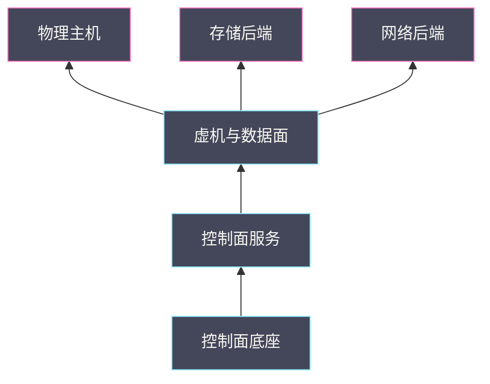

# 05 共享故障域——网络、存储和控制面同时异常时的恢复顺序

**摘要：**

当监控、控制面、存储与网络同时报错时，最危险的不是故障本身，而是把它当成四个独立故障去逐个处理。本文引入「共享故障域」这个概念，说明为什么多个看似无关的异常往往来自同一个共享层，给出识别共享层的三种方法与四类共享故障域，并系统讨论恢复顺序——为什么必须先底层后上层、为什么恢复动作本身是负载、以及为什么恢复需要门禁与观察窗口。全文回答两个问题：多个异常同时出现时怎样找到那个共享层，以及找到之后恢复应该从哪里开始、按什么顺序推进。文中的现场事实取自 2026 年 9 月的脱敏记录，涉及具体数值处标注口径。

---

## 第 1 章 什么是共享故障域

先看一个典型场景。某个深夜，监控平台同时报出四类异常：一批宿主机的心跳丢失、部分计算与网络 agent 状态异常、若干虚机的业务探针超时、管理面的配置下发大面积超时。值班人面对的第一个问题是：这是一次大故障，还是四次小故障？

正确的答案是：**它们很可能是一次故障的四个投影**。因为这几个看似无关的组件，恰好共享同一个物理资源——宿主机。宿主机内存枯竭时，跑在它上面的采集器、控制面 agent、虚机进程会被内核陆续清理，于是四类异常同时出现，而根因只有一个。

### 1.1 共享故障域的定义

**共享故障域（Shared Failure Domain）指的是被多个逻辑组件共同依赖、因而其故障会同时波及这些组件的物理或逻辑资源。** 它与「单点故障」有联系也有区别：单点故障强调「只有一个实例」，共享故障域强调「多个组件共用同一个底座」。一个高可用的数据库集群可能不是单点，但只要它被十个服务共用，它仍然是一个共享故障域。

这个定义的关键词是「共用」。共用带来效率——十个服务不必各建一套数据库；共用也带来耦合——数据库抖动会同时影响十个服务。**共享故障域是资源复用的必然产物，无法消除，只能识别与治理。**

### 1.2 为什么它最难处理

共享故障域难处理，有三个原因。

第一，**症状与根因距离远**。根因在一个物理资源上，症状却分散在多个逻辑组件上，两者之间没有直接的名字对应关系。看到「网络 agent 异常」，很难联想到「宿主机内存」。

第二，**症状看起来互相独立**。四个组件的异常在监控上是四条互不相关的告警，如果按告警逐条处理，会同时开四条排查线，每条都查不到根因。

第三，**处置动作会互相干扰**。如果按四条线分别处置，对 A 组件的处置可能加重 B 组件的压力，把一次故障拖成多次。

**三个原因合起来，指向同一个应对方式：先找共享层，再谈处置。** 这也是本篇与 01 篇一脉相承的主线。

### 1.3 共享故障域与影响半径

把共享故障域与 01 篇的「影响半径」放在一起看，会更清楚。影响半径描述的是「一次故障波及多广」，共享故障域解释的是「为什么能波及这么广」。**影响半径是现象，共享故障域是机制**。

一个实用的推论是：当影响半径大到「跨越多个逻辑组件」时，几乎必然存在一个共享故障域。反过来说，如果排查半天找不到共享层，那么「一次故障」的判断可能本身就有问题——也可能是真的同时发生了多个独立故障，只是概率较低。

### 1.4 共享故障域不总是坏事

共享故障域听起来像缺点，但它其实是资源复用的另一面。没有共享，就没有复用；没有复用，成本与复杂度都会成倍上升。十个服务各建一套数据库，确实消除了「数据库共享」这个故障域，代价是十套数据库的运维、容量与一致性成本。

因此正确的态度不是「消除共享」，而是「让共享在故障时可控」。可控的手段包括：为共享资源设置限额与隔离、为共享故障域建立独立的观测、为恢复预设顺序与门禁。**共享本身是效率的来源，可控性才是治理的目标**。把这一点想清楚，就不会在事故复盘时把矛头指向「当初为什么共用」，而是转向「怎么让共用更稳」。

### 1.5 本篇与 01/04 篇的关系

本篇是 01 篇「服务地图」与 04 篇「宿主机失联」的交叉延伸。01 篇给出地图，告诉你组件之间怎么依赖；04 篇给出单机故障的处置流程；本篇处理的是「多个故障域同时出问题」的场景——它需要 01 篇的依赖关系来判断层次，也需要 04 篇的处置纪律来约束动作。

三篇合起来，构成一条从「看清结构」到「处置单点」再到「处置叠加」的进阶路径。**单独读任何一篇都能解决一类问题，连起来读则能应对最复杂的现场**。这也是专栏把这三篇放在相邻位置的原因。

## 第 2 章 四类共享故障域

共享故障域不是一个抽象概念，在云平台上它具体表现为四类资源。理解这四类，识别就有了方向。

### 2.1 物理主机共享

第一类是物理主机。在混布部署下，同一台机器同时承载 OpenStack 虚机与大数据负载，还承载着监控采集器、配置管理 agent 与日志采集器。宿主机是**最典型、也最容易被忽略**的共享故障域：它的资源（内存、CPU、磁盘、网络）被所有共居者共享。

宿主机共享故障的特征是「症状集中在少数几台机器上，但涉及多种组件」。识别方法是按物理主机维度聚合告警，看是否聚集。宿主机资源治理的三个口径（大页与普通页分账、NUMA 分节点、cgroup 限额）在 01 篇已有展开。

### 2.2 存储后端共享

第二类是存储后端。多个宿主机上的虚机可能挂载同一个存储集群的卷，因此存储后端异常时，影响范围会跨越宿主机边界。这类故障的特征是「多台不同宿主机上的虚机同时磁盘异常」。

存储后端共享还有一层内部结构：卷分布在不同的存储池与磁盘上，因此后端故障未必是全局的，可能只影响某个池或某几块盘。**定位时要先确认受影响的卷是否落在同一个池或同一组盘上**，这决定了影响范围是「全后端」还是「部分磁盘」。相关机制在 [[中间件/Ceph/00 专栏导览|Ceph 专栏]] 与 03 篇里有系统展开。

### 2.3 网络后端共享

第三类是网络后端。多台宿主机可能共用同一个机架交换机、同一条上联链路、同一个网络出口，因此网络后端异常时，影响范围按网络拓扑而非按主机划分。

网络后端共享的一个隐蔽形态是**带外管理网与业务网共享链路**。此时网络故障会同时让业务与带外不可用，隔离能力随之丧失（详见 04 篇）。识别这类共享的方法是画出网络拓扑的重叠关系，而不是只看告警分布。

### 2.4 控制面底座共享

第四类是控制面底座。数据库、消息队列、认证服务被所有 OpenStack 组件共用，因此底座异常时，多个服务会同时出现症状。这类故障的特征是「错误高度同质、影响所有类型操作」，与前三类「影响集中在某些资源上」形成对照。

控制面底座共享故障的排查顺序在 01 篇已给出：先确认认证，再确认数据库，然后确认消息队列，最后才逐个服务看。**底座问题与业务问题的区分判据是「影响是否同质」**。

### 2.5 四类对照

| 共享域 | 影响分布特征 | 识别维度 | 恢复起点 |
| :--- | :--- | :--- | :--- |
| 物理主机 | 集中在少数机器，多组件 | 按物理主机聚合 | 释放宿主机资源 |
| 存储后端 | 跨宿主机，集中在某些卷 | 按池/盘聚合 | 恢复后端健康 |
| 网络后端 | 按网络拓扑分布 | 按机架/链路聚合 | 恢复链路连通 |
| 控制面底座 | 全局均匀，错误同质 | 按操作类型聚合 | 恢复底座服务 |

这张表的用法是**先看影响分布特征，再选识别维度**。分布是「集中」还是「均匀」，决定了嫌疑在宿主机/后端一侧，还是在控制面底座一侧。这是识别共享层的第一步。



图中自下而上是影响传播的方向：底层（物理主机、存储后端、网络后端）故障向上传导，而恢复顺序与之相反——**自底向上恢复，正是为了顺应这条传播方向**。

### 2.6 共享故障域的层次关系

四类共享故障域不是并列的，它们之间存在层次。物理主机在最底层，它承载虚机，虚机的磁盘依赖存储后端、网络依赖网络后端，而所有控制面组件又依赖控制面底座。**层次决定了影响传播的方向**：底层故障向上层传播，反过来一般不成立。

层次也解释了为什么恢复顺序要「自底向上」。当底层（如宿主机）故障时，上层（虚机、控制面 agent）会连带异常；如果先修上层，底层会再次把上层打垮。**恢复顺序与影响传播方向相反，正是为了顺应层次**。把这张层次图记在脑子里，多共享层叠加时就不容易乱。

### 2.7 一个共享层可能同时属于多类

四类共享故障域不是互斥的，同一个物理对象可能同时属于多类。一台混布宿主机既是「物理主机共享」，它的网络出口可能又是「网络后端共享」，它的磁盘可能又接入「存储后端共享」。**当一个对象跨越多类时，它的故障会同时具备多种特征**，识别难度更高。

处理方法是**分层识别**：先按最外层的分布特征定位到「集中在少数机器」，再逐台检查它们各自还共享什么（同机架？同存储池？同网络出口？）。把「共享」一层层剥开，直到找到那个能解释全部症状的层。这个过程与 03 篇的「四层归因」是同一种思路，只是对象从「延迟」换成了「故障分布」。

### 2.8 四类共享故障域的观测缺口

四类共享故障域里，控制面底座与存储后端通常有较成熟的观测，物理主机与网络后端反而容易出现缺口。原因在于前两者的观测是「服务自带」的（数据库、消息队列、存储集群都有内建指标），而后两者需要运维自己补齐——宿主机维度的内存水位与不可中断进程、网络维度的拓扑与链路质量，往往不在默认监控里。

**观测缺口决定了识别能力**：缺什么观测，就识别不出什么共享层。补齐顺序建议从「影响最大、最容易缺」开始，通常是宿主机资源维度。这与 04 篇「检测能力建设顺序」是同一种排序逻辑：先保证能发现，再保证能定性。指标采集与存储的整体设计可参见 [[可观测/指标/00 专栏导览|指标专栏]]。

### 2.9 共享故障域与故障域隔离

共享故障域的反面是故障域隔离。隔离的目标是让一个共享层的故障不波及另一个——把虚机分布到不同机架、把卷分布到不同存储池、把控制面底座做成高可用。隔离做得好，共享故障域的影响半径就被限制住了。

但隔离有成本：分布越散，资源利用率的调度难度越高，跨域通信的开销也越大。**隔离程度是「可用性」与「效率」之间的又一个权衡**，与超分是同一类问题。因此不存在「隔离得越彻底越好」，只存在「隔离到什么程度与业务等级匹配」。这也是后面容量篇要讨论预留空间的动机之一。

## 第 3 章 识别：怎样找到那个共享层

识别共享层有一套可执行的方法，核心是「换一个维度看同一批告警」。

### 3.1 按物理维度聚合

第一步是把告警按物理维度重新聚合。默认视图里，告警按组件分类（计算、网络、存储、监控）；换一个视图，按物理主机、机架、存储池、链路聚合，往往能立刻看出聚集性。

**这一步的价值在于它把「四个故障」变成了「一个故障」。** 如果按物理维度聚合后发现异常集中在少数几台机器上，那么「共享层是宿主机」的判断就有了一半证据。

### 3.2 看时间相关性

第二步是看时间相关性。共享故障域引发的多个异常，在时间上应当高度相关——它们由同一个事件触发，因此出现时间接近。如果几类异常出现时间相差很大（比如相隔几小时），那么它们更可能是独立的。

时间相关性还能帮助确定方向：**先出现的那个异常更可能是上游**。这与 03 篇、04 篇反复强调的「时间线定因果」是同一条方法。

### 3.3 用依赖图反查

第三步是用依赖图反查。把受影响的组件在依赖图上标出来，看它们的共同上游是谁。宿主机共享故障域的上游是「物理主机」，存储共享故障域的上游是「存储后端」，以此类推。

依赖图不必是精确的拓扑图，一张「组件 → 依赖的共享资源」的对照表就够用。**这张表本身值得提前画好**，因为它把识别工作从「故障时临时推演」变成了「平时查表」。

### 3.4 识别清单

把三步固化成清单：

- 按物理维度聚合，看是否有聚集。
- 看时间相关性，确认是否同源。
- 用依赖图反查共同上游。
- 对候选共享层做一次直接验证（查它的指标或状态）。
- 若候选层健康，则回到「可能是多个独立故障」的假设。

最后一步很重要：**共享层假设也要被证伪**。如果候选共享层（如宿主机内存）的指标完全正常，就不能强行把它当根因，而应当考虑多个独立故障并发的可能。

### 3.5 识别工具与查询

识别共享层可以借助已有的观测工具，把「按物理维度聚合」变成几条查询。

```promql
# 按物理主机聚合异常数量，看是否聚集
count by (instance) (up == 0)

# 宿主机内存水位：确认是否触及共享资源瓶颈
node_memory_MemAvailable_bytes / node_memory_MemTotal_bytes < 0.1

# 不可中断进程数：磁盘或 I/O 瓶颈的指纹
rate(node_procs_blocked[5m])

# 虚机维度：确认受影响实例的宿主机分布
count by (compute_host) (libvirt_up{job="openstack-libvirt-exporter"} == 0)
```

```bash
# 存储后端：确认受影响卷是否落在同一池
ceph osd df tree
ceph osd pool stats

# 网络后端：确认异常是否按拓扑聚集
ip -s link show <uplink>
ovs-vsctl show
```

这几条查询的共同思路是**换维度聚合**：把按组件的告警，换成按主机、按池、按链路的聚合，聚集性就会显现。指标体系的整体设计可参见 [[可观测/指标/00 专栏导览|指标专栏]]。

### 3.6 一个识别实例

设想一批告警：若干虚机网络异常、部分宿主机 agent 状态异常、存储延迟上升。看起来像三个独立问题。按物理维度聚合，发现异常虚机集中在少数宿主机上；按时间相关性看，存储延迟上升最早出现；用依赖图反查，这些宿主机上的虚机卷恰好落在同一个存储池。

三条线索合起来，共享层是「存储池」，而不是网络。网络与 agent 的异常是存储变慢的次生结果——存储慢导致 I/O 等待堆积，进而让 agent 与网络表现异常。**这个实例的价值在于它演示了「症状最显眼的层未必是共享层」**：网络看起来最像问题，实际是下游。判断谁在上游，靠的是时间顺序，而不是症状的显眼程度。

### 3.7 识别能力的三层

识别共享层的能力可以分三层。第一层是**有数据**：相关指标被采集且可查；第二层是**会聚合**：能把告警按物理维度重新分组；第三层是**能验证**：能对候选共享层做一次直接检查。三层缺一，识别就会卡住。

多数平台的短板在第三层——有数据、也能聚合，但缺少「对候选层做直接验证」的便捷入口，导致假设无法被证实或证伪。**补齐第三层的投入产出比最高**，因为它把「猜测」变成了「确认」，直接决定排查能否收敛。这也是后面 08 篇把「巡检与取证自动化」列为独立主题的原因：它们正是第三层的工程化实现。

## 第 4 章 恢复顺序的三条约束

找到共享层之后，下一步是恢复。恢复不是「修好就行」，而是有顺序的。顺序由三条约束决定。

### 4.1 依赖方向约束

第一条是依赖方向：**被依赖者先恢复，依赖者后恢复**。网络没通，恢复控制面没有意义，因为控制面之间的通信也依赖网络；宿主机资源没释放，恢复虚机没有意义，因为虚机会被再次压垮。

这条约束看起来显然，但在多共享层叠加时容易被违反。当网络与存储同时异常时，先恢复哪一个？答案取决于两者是否互为依赖——如果存储访问依赖网络，就先恢复网络。

### 4.2 资源释放约束

第二条是资源释放：**共享资源故障必须先释放压力，再恢复上层**。宿主机内存枯竭时，直接重启虚机只会让它再次被 OOM 清理；正确做法是先释放内存压力（停止新增、隔离高水位机器），再逐步恢复。

这条约束的实践含义是：**恢复动作本身要消耗资源**。在资源已经紧张时执行恢复，等于给火上浇油。因此恢复的第一步往往不是「恢复」，而是「减压」。

### 4.3 验证约束

第三条是验证：**每一层恢复都要有独立的回读证据，不能因为上层恢复就假定下层也好了**。心跳恢复不代表业务恢复，API 恢复不代表数据面恢复，这些判据在 01 篇与 04 篇都讲过。

验证约束的实践含义是：**恢复过程要被拆成若干「可验证的小步」**，每步都有通过条件。这样即使中途出问题，也能准确定位停在哪一步，而不是从头再来。

### 4.4 一个统一的恢复顺序

三条约束合起来，给出一个统一的恢复顺序：

| 顺序 | 层次 | 通过条件 |
| :--- | :--- | :--- |
| 1 | 物理与链路 | 网络连通、供电正常 |
| 2 | 共享资源 | 宿主机资源水位回落、后端健康 |
| 3 | 控制面底座 | 认证、数据库、消息队列正常 |
| 4 | 控制面服务 | 各服务状态正常、队列消费正常 |
| 5 | 数据面业务 | 虚机运行、网络与磁盘正常 |
| 6 | 业务验收 | 业务探针通过、稳定观察 |

这个顺序不是死板的，遇到具体场景要按依赖关系微调；但它提供了一个默认路径，避免在混乱中漏掉某一层。

### 4.5 三条约束的冲突与取舍

三条约束在多数情况下一致，但也会冲突。典型冲突是「依赖方向」与「资源释放」矛盾：某个被依赖的服务本身运行在资源紧张的宿主机上，此时先恢复它（满足依赖方向）会加重宿主机压力（违反资源释放）。

处理冲突的原则是**先满足资源释放约束**，因为资源压力是物理上限，不解决它，任何恢复动作都会被推翻。具体做法是先把被依赖服务迁移到资源健康的宿主机上，再恢复它——**用一次迁移把冲突化解成顺序**。这类「用中间动作化解冲突」的思路，在多共享层叠加时很常用。

### 4.6 恢复顺序的失败模式

恢复顺序有两种典型失败模式。第一种是**顺序倒置**：先修上层，结果被下层反复打垮，表现为「修了又坏」。第二种是**顺序僵化**：严格照搬统一顺序，遇到依赖关系与顺序冲突时卡住，表现为「不敢动」。

两种模式的应对方式不同。顺序倒置要靠「先找共享层」来纠正——先确认底层是否健康；顺序僵化要靠「理解约束背后的目的」来化解——三条约束的目的是「不被打垮」，而不是「必须按这个顺序」。**理解目的才能灵活，记住步骤只能照搬**。这也是本篇既给顺序又给约束原因的原因。

### 4.7 恢复顺序与演练

恢复顺序必须被演练，否则它只是纸面顺序。演练要验证的是「按这个顺序走，能否真的恢复」，而不是「每一步单独能否执行」。两者的区别在于：单步演练无法暴露顺序问题——比如某一步依赖前一步的产物、或某两步互相冲突。

演练的设计应当**从最复杂的叠加场景入手**，而不是从最简单的单共享层开始。因为单共享层的恢复顺序几乎是显然的，真正的难点在叠加；只演练简单场景，会在真实叠加故障时暴露出「顺序没有验证过」的窘境。

演练还要记录每一步的实际耗时，与第 5 章的时间预算对照。**预算与实测的差距，本身就是改进清单**。这与 04 篇「演练的目标是找出不可用的地方」是同一条原则，只是对象从单机恢复扩展到了多层顺序。

## 第 5 章 分场景的恢复顺序

统一顺序是骨架，具体到四类共享故障域，各有需要注意的地方。

### 5.1 宿主机共享资源故障

宿主机共享资源故障（典型是内存枯竭）的恢复要点是「先减压、再恢复」。减压手段包括：停止在该区域新增虚机、隔离高水位机器、必要时迁移部分负载。恢复要点是**容量门禁**——在根因未清时禁止回迁，否则会把故障引燃（详见 04 篇）。

这类故障还有一个特点：它可能不需要「恢复动作」，而是需要「等待资源自然回落」。此时正确的做法是控制新增、观察水位，而不是急于操作。**不作为有时也是正确的恢复策略**，前提是它被明确选择而不是被动拖延。

### 5.2 存储后端共享故障

存储后端共享故障的恢复要点是「先止住放大、再补齐数据」。后端异常往往伴随数据重建，而重建会与业务争抢资源（详见 03 篇）。因此恢复顺序是：先控制重建流量（限速）、确认业务可用，再逐步放开重建。

这里有一个权衡：**重建越快，数据冗余恢复越早，但业务受影响越大**。恢复顺序的目标不是「最快恢复冗余」，而是「在业务可接受的范围内恢复冗余」。

### 5.3 网络后端共享故障

网络后端共享故障的恢复要点是「先通主路、再修旁路」。当机架交换机或上联链路故障时，如果有多路径，应当先确认流量是否已经切换到备用路径，再修复故障链路。**如果切换机制本身也失效，则要先恢复切换能力**，因为它是保障业务的第一道防线。

网络故障还要特别注意**惊群效应**：链路恢复的瞬间，所有断开的连接会同时重连，产生瞬时流量尖峰，可能把刚恢复的链路再次压垮。缓解手段是让重连带随机退避，而不是所有客户端同时重试。

### 5.4 控制面底座共享故障

控制面底座共享故障的恢复要点是「先底座、后服务、再对账」。底座恢复后，积压的消息需要被消费，处于中间态的请求需要被收尾，账实不符需要被对账。**对账这一步最容易被省略，但它是「账本」类系统恢复的必要环节**。

对账的内容包括：Placement 的资源账与宿主机实际、数据库记录与数据面实际、卷状态与后端实际。不对账就宣布恢复，会在后续的创建或迁移中暴露问题。

### 5.5 多共享层叠加

最复杂的情况是多层叠加：网络异常导致存储访问变慢，存储变慢导致宿主机 I/O 等待堆积，I/O 堆积又让控制面 agent 异常。此时恢复顺序应当**从最底层开始，逐层向上**，每层用回读证据确认。

叠加场景的难点在于因果链较长，容易在中途误判。应对方法是**把因果链显式画出来**，标出每一环的证据，然后从最上游那一环开始处置。**画链条的过程本身就是排查过程**，它把「一团乱麻」变成「一串环节」。

### 5.6 恢复顺序的时间预算

恢复顺序还需要时间预算：每一步预期花多久、超时怎么办。没有时间预算的恢复会陷入「无限等待」——某一步卡住，既不敢跳过，也不确定要等多久。

时间预算的确定方法是**按层给上限**，而不是给总时长。底层（物理与资源）允许较长的观察，因为它是后续所有恢复的前提；上层（业务）则要快速验证，因为它是用户可感知的部分。**把预算按层分配，比给一个总时长更可执行**，因为卡住的位置决定了后续该怎么调整。这与 04 篇「等待需要边界」是同一条纪律，只是从单机扩展到了多层。

### 5.7 恢复顺序与业务等级的对应

不同业务的恢复优先级不同，这会影响恢复顺序的执行方式。核心业务需要尽早恢复，因此它的资源释放可以优先安排；边缘业务的恢复可以延后，为关键业务腾出余量。

**恢复顺序里应当包含一个「业务优先级」维度**，而不只是技术层次。具体做法是在每一层内部，按业务等级排序恢复动作。这样既满足技术顺序，又满足业务诉求。把技术顺序与业务优先级分开处理，是恢复规划里容易遗漏的一环，而它恰恰是业务方最关心的部分。

### 5.8 一个分场景恢复的顺序实例

设想存储后端与网络后端同时异常：网络抖动导致存储访问超时，存储超时又触发了部分数据重建，重建流量进一步加剧了网络压力。这是一个典型的互相放大。

恢复顺序应当是：先稳定网络（抑制抖动或切换路径），再控制重建流量（限速），然后确认业务恢复，最后放开重建。顺序的关键在于**先切断放大回路，再恢复功能**——网络抖动与重建流量构成了正反馈，不先切断它，任何单向修复都会被回路抵消。

这个实例说明，多共享层叠加时的恢复顺序不只是「自底向上」，还要**识别并优先切断正反馈回路**。回路是叠加场景特有的难点，也是它比单共享层更复杂的原因。识别回路的方法是把各层之间的相互影响画成有向图，找出其中的环。

## 第 6 章 恢复期的二次伤害

恢复期的动作本身可能造成新的伤害，这是共享故障域恢复中最容易被忽视的部分。

### 6.1 回迁放大

第一个二次伤害是回迁放大。故障缓解后，把虚机迁回原宿主机或原区域，如果该区域的资源压力尚未真正解除，回迁会把故障重新引燃。**回迁是一种集中式负载，它会在短时间内给目标区域带来额外压力**。

避免方法是为回迁设置门禁：目标区域资源水位低于阈值、根因已确认清除、回迁分批执行并观察。

### 6.2 惊群与重连风暴

第二个二次伤害是惊群与重连风暴。链路或服务恢复的瞬间，大量客户端同时重连或重试，产生瞬时尖峰。这在网络故障与控制面故障恢复时都很常见。

缓解方法是让重试带随机退避、分批放量、以及在恢复初期保留一部分容量余量。**恢复期不是「回到常态」，而是「从异常回到常态的过程」**，这个过程本身需要额外的容量。

### 6.3 恢复动作是负载

前两点可以概括为一句话：**恢复动作是负载**。疏散、回迁、重建、重连，每一项都会消耗资源。因此恢复规划必须把「恢复所需的资源」算进去，而不是假设恢复是「免费」的。

这条认知的实践价值是：在资源紧张时，恢复应当**分批、渐进、可暂停**，而不是一次性全量。分批恢复即使中途出问题，也不会让整个系统再次崩溃。

### 6.4 容量门禁

容量门禁是防止二次伤害的核心手段。它的形式可以很简单：在恢复脚本或流程里加一个前置检查——目标区域的水位是否低于阈值，未达标则拒绝执行。

门禁的价值在于**它把「判断」变成了「条件」**，不依赖操作者的临场判断。这与 04 篇的恢复门禁是同一种设计思路。

### 6.5 二次伤害的三种形态对照

| 形态 | 触发时机 | 表现 | 缓解 |
| :--- | :--- | :--- | :--- |
| 回迁放大 | 故障缓解后集中回迁 | 目标区域资源再次紧张 | 回迁门禁与分批 |
| 惊群重连 | 链路或服务恢复瞬间 | 瞬时流量尖峰 | 随机退避与分批放量 |
| 重建争抢 | 数据重建启动后 | 业务 I/O 延迟上升 | 重建限速与窗口 |

三种形态的共同点是**它们都发生在「恢复期」而非「故障期」**，因此容易被忽视——故障期的紧张过去后，注意力下降，二次伤害恰好在这个窗口发生。识别它们的办法是把「恢复期」当成一个需要独立监控的阶段，而不是当成故障的尾巴。

### 6.6 恢复期的观测

恢复期需要独立的观测，因为故障期的观测指标（如错误率）在恢复期会快速回落，掩盖恢复期特有的风险（如资源水位、重连压力）。恢复期应当重点观察三类指标：目标区域资源水位、重连与重试速率、以及关键服务的队列深度。

**把恢复期当作一个需要独立仪表盘的阶段**，是成熟度的一个标志。它同时也为观察窗口提供了判据——窗口内这些指标是否稳定，直接决定能否宣布恢复。这与 03 篇「建立基线比记住阈值更重要」是同一条纪律的延伸：恢复期的稳定，也要相对于基线来判断。

### 6.7 恢复期的沟通

恢复期还有一项容易被忽视的工作是沟通。故障期大家注意力集中在技术上，恢复期反而容易出现信息真空——业务方不知道恢复到哪一步，团队内部对「是否已恢复」的理解也不一致。

沟通的要点有三个：**明确当前处于哪一层、下一层是什么、预计何时进入下一层**。把恢复顺序作为沟通框架，业务方就能理解「为什么还没好」以及「还需要多久」。这与 04 篇「恢复顺序即清单」是同一种思路的对外延伸：**对内是流程，对外是预期**。把沟通也纳入恢复流程，能显著减少恢复期的额外压力。

## 第 7 章 恢复门禁与验收

恢复不是「做完动作」就结束，而是要通过验收。

### 7.1 门禁设计

门禁设计要回答三个问题：什么条件下允许进入下一步、由谁确认、确认的证据是什么。三个问题都应当有明确答案，否则门禁会退化成「看起来差不多就行」。

门禁的另一个要点是**自动化程度**：能自动校验的条件尽量自动校验，减少人工判断。人工判断在高压下容易出错，而机器不会。

### 7.2 验收判据

验收判据应当覆盖四层：资源层（水位正常）、控制面层（服务与队列正常）、数据面层（虚机与网络正常）、业务层（探针通过）。**只验收一层就宣布恢复，是常见的过早乐观**。

判据的设计要避免「自证清白」：不能用恢复动作本身的结果作为验收证据（比如「迁移命令返回成功」），而要用独立的观测（比如「业务探针在目标机器上通过」）。

### 7.3 观察窗口

验收之后还需要观察窗口。窗口的长度取决于故障类型与业务容忍度，但原则是：**窗口内持续正常才算恢复**，而不是「某一刻正常」。观察窗口还能捕获恢复期的二次伤害——如果回迁引发了新的压力，窗口内会暴露出来。

### 7.4 门禁清单

把门禁固化成清单，可以在高压下逐条核对。

- 根因是否已确认清除，而不是暂时不报错。
- 目标区域资源水位是否低于阈值。
- 目标是否与原故障域重叠。
- 恢复动作是否分批、是否可暂停。
- 每步是否有独立回读证据。
- 是否有观察窗口，窗口内是否持续正常。

清单的最后两条最容易被省略。**「是否有观察窗口」这一条，是把恢复从「动作完成」变成「状态稳定」的关键**。把这份清单与 04 篇的恢复清单合并使用，可以覆盖从单机到多层的完整恢复流程。

### 7.5 验收的组织方式

验收的组织方式决定它是否真的有效。有效的验收应当是「独立验证」——由不参与恢复操作的人或系统，用独立的数据源验证。让执行恢复的人自己验收，容易不自觉地选择「能证明成功」的证据。

如果人力有限，退而求其次的办法是**用自动化脚本做验收**，因为脚本不会选择性取证。无论哪种方式，验收的核心都是「独立」二字：**证据的来源必须独立于动作的执行**。这也是为什么验收判据不能使用「命令返回成功」这类动作自证的结果。

### 7.6 恢复完成的定义

「恢复完成」需要被定义，否则会各自理解。一个可操作的定义是：**四层验收全部通过，且在观察窗口内持续稳定**。这个定义把「完成」从主观判断变成了客观条件。

定义恢复完成还有一层意义：它让「什么时候可以关闭事故」有据可依。事故关闭过早，会让团队放松警惕，二次伤害容易在此时发生；关闭过晚，会占用不必要的注意力。**用条件而不是感觉来关闭事故**，是成熟处置流程的标志。

## 第 8 章 一次真实的共享故障域事故

下面用一次脱敏的真实事故演示本篇的方法。事故发生在 2026 年 9 月，一批弹性混布节点在数小时内陆续出现内存枯竭。

### 8.1 现象

监控、控制面、虚机三类信号同时异常：多台宿主机心跳丢失、部分计算与网络 agent 状态异常、若干虚机重启或迁移、管理面与监控推送大面积超时。表面看像网络故障，也像控制面故障。

### 8.2 识别共享层

按物理维度聚合后，异常集中在少数机架的一组机器上，且都是混布节点。按时间相关性看，资源压力信号早于服务异常信号。用依赖图反查，这些机器的共同上游是「宿主机资源」。直接验证发现，这些机器的内存水位极高、swap 接近耗尽、不可中断进程数远超核数。

四个证据合起来，共享层是宿主机内存，而不是网络或控制面。

### 8.3 恢复顺序的取舍

既然根因是宿主机资源，恢复的第一动作不是重启服务，而是减压：停止在受影响区域新增虚机、隔离高水位机器、观察水位回落。待水位回落后，再逐步恢复控制面服务状态，最后才是虚机层面的处置。

如果按最初的现象去恢复（比如重启网络 agent、重启控制面服务），不仅无效，还会因为重启动作本身消耗资源而加重压力。**用错恢复顺序，比不恢复更糟。**

### 8.4 教训

这次事故留下三条教训。第一，**先识别共享层，再谈恢复顺序**，否则恢复动作会打在下游症状上。第二，**恢复动作是负载**，在资源紧张时尤其要分批与可暂停。第三，**恢复需要门禁与观察窗口**，回迁必须等根因清除。

### 8.5 证据链

这次事故的证据链可以整理成五条：物理网络层干净（排除链路）、异常按物理主机聚集（指向宿主机）、资源压力信号早于服务异常（确定方向）、内存水位与不可中断进程异常（确认共享层）、虚机重启晚于资源压力（确认影响路径）。

五条证据中，前两条用于排除，后三条用于确认。**排除与确认同等重要**：没有前两条，无法排除网络；没有后三条，无法锁定宿主机。这也是「证据链」与「证据堆」的区别——链条里的每条证据都有明确作用，而不是越多越好。把证据按「排除项」与「确认项」分类整理，是复盘时最实用的组织方式。

### 8.6 与 03 篇的分工

这次事故在 03 篇与 04 篇里都出现过，三处的视角不同：03 篇从「延迟四层」角度分析存储恢复风暴，04 篇从「宿主机失联判定」角度分析批量异常，本篇从「共享故障域识别与恢复顺序」角度分析。**同一素材的三种切法，正好演示了「同一现象可以有多个正确的观察框架」**。

三篇不重复的原因在于它们回答的问题不同：03 篇回答「慢在哪一层」，04 篇回答「这台机器是不是死了」，本篇回答「这么多异常为什么同时出现、恢复从哪开始」。**框架的选择取决于你要回答的问题**，这也是把知识组织成专栏而非单篇的价值所在。

### 8.7 这次事故的恢复门禁

这次事故的恢复门禁有三条：受影响区域的内存水位回落到安全线以下；根因（重建或混布负载）已确认清除；回迁分批执行并逐批观察。三条门禁的共同点是**它们都是可校验的条件，而不是判断**——值班人只需查水位与状态，不需临场权衡。

把门禁写成条件而非判断，还有一个好处是它可以被自动化。当条件满足时自动放行、不满足时自动拒绝，既减少人工负担，也避免高压下的误判。**门禁的终点是自动化，而不是清单**，这也是 08 篇要展开的方向。

## 第 9 章 误判与反例

第一，**把共享故障域当成多个独立故障**。多个组件同时异常时，先找共享层，而不是逐条开排查线。

第二，**按症状而非按依赖顺序恢复**。先修症状（如重启 agent）往往无效，还可能加重压力。

第三，**忽略恢复动作的负载**。疏散、回迁、重建都是负载，恢复规划必须把它们算进去。

第四，**把某一刻的正常当成恢复完成**。恢复需要观察窗口，窗口内持续正常才算数。

第五，**跳过对账**。控制面底座恢复后，账实对账是必要环节，跳过它会在后续暴露问题。

第六，**在根因未清时回迁**。回迁放大是共享故障域恢复中最典型的二次伤害。

第七，**把共享层验证当成可选步骤**。候选共享层必须被直接验证，否则「共享层假设」只是一个猜测，随时可能被推翻。

第八，**恢复顺序一刀切**。统一顺序是骨架，遇到具体依赖关系必须微调，照搬会在约束冲突处卡住。

第九，**忽略观测缺口**。识别能力受观测覆盖限制，缺观测的共享层会在故障时成为盲区，事后必须补上。

第十，**在叠加场景下忽略正反馈回路**。多共享层互相放大时，不先切断回路，单向修复会被抵消。

第十一，**用感觉判断恢复完成**。恢复完成应当由四层验收与观察窗口共同定义，而不是「看起来没事了」。

## 第 10 章 边界与反例

第一，**共享层假设也要被证伪**。候选共享层健康时，要考虑多个独立故障并发的可能。

第二，**不是所有故障都有唯一共享层**。有些故障确实由多个原因叠加，此时恢复顺序要在链条上找「最小有效干预点」。

第三，**统一恢复顺序是骨架不是教条**。遇到具体依赖关系，要按依赖方向微调。

第四，**恢复能力不等于恢复速度**。能恢复但很慢，与不能恢复在业务上可能一样糟，因此恢复时间也要被度量与演练。

第五，**共享故障域无法消除**。资源复用必然带来耦合，治理的目标是让耦合在故障时可控，而不是让它不存在。

第六，**把共享故障域当成人祸**。资源复用是架构选择，共享故障域是它的必然代价，治理而非追责才是正解。

第七，**只做恢复不做对账**。账实对账是底座类系统恢复的必要环节，跳过它会在后续的创建或迁移中暴露问题。

第八，**把观测缺口留到故障时才发现**。共享层的观测应当在平时补齐，而不是等故障暴露盲区。

行文至此，把本篇落点收在两条原则上。其一，复杂性不会消失只会转移——共享资源把建设成本转移成了故障耦合，这份耦合要靠识别与顺序来管理。其二，没有放之四海皆准的恢复顺序，只有因地制宜地先找共享层、再按依赖推进。下一篇从「恢复」转向「容量」：当集群要扩容或缩容时，超分、碎片与预留这三个变量如何共同决定「还能放多少」。已有的真实复盘可先到 [[SRE/故障排查与复盘/00 故障排查索引|故障排查与复盘索引]] 对照。

---

## 速查卡：共享故障域识别与恢复

这张表把识别与恢复压缩成速查形式，用于多组件同时异常时快速定向；识别出共享层之后，再回到第 4、5 章确定恢复顺序。表中「恢复起点」是第一步，不是全部动作。

| 现象 | 嫌疑共享层 | 验证方法 | 恢复起点 |
| :--- | :--- | :--- | :--- |
| 异常集中在少数机器、多组件 | 物理主机 | 查内存水位与 D 态 | 减压 |
| 多台宿主机上的卷同时异常 | 存储后端 | 查 OSD 与恢复状态 | 限速重建 |
| 异常按网络拓扑分布 | 网络后端 | 查链路与交换机 | 先通主路 |
| 全局均匀、错误同质 | 控制面底座 | 查认证/数据库/队列 | 先底座后对账 |

## 口径与事实说明

- 现场事实与数值取自 2026 年 9 月的脱敏记录，属于某时点快照，不构成永久资产事实。
- 机制描述（共享资源耦合、恢复顺序约束、惊群与重连、对账）属于分布式系统与 OpenStack 的稳定行为。
- 恢复顺序、门禁与时间预算的具体取值属业务决策，需与业务方共同确定。
- 文中涉及的平台集群名称与规模按脱敏口径处理。
- 文中不包含任何写操作命令，恢复动作须走审批并回读。

---

## 参考资料

1. OpenStack 官方文档，高可用与故障域设计：<https://docs.openstack.org/ha-guide/>
2. OpenStack 官方文档，Nova 服务与主机故障：<https://docs.openstack.org/nova/latest/admin/>
3. Ceph 官方文档，恢复与回填：<https://docs.ceph.com/en/latest/rados/operations/>
4. Linux 内核文档，内存压力与 PSI：<https://www.kernel.org/doc/html/latest/accounting/psi.html>
5. 分布式系统原理与协议专栏，一致性与共识：<https://docs.openstack.org/>
6. 内部现场素材：Pallas/OpenStack 混布主机批量异常事故初步分析（2026-09-01，脱敏）
7. 内部现场素材：存储恢复风暴导致混布节点冻结的根因分析（2026-09-18，脱敏）

---

> [!note] 思考题
> 1. 多个看似无关的组件同时异常时，你会用哪三步找到共享层。
> 2. 为什么恢复顺序要先底层后上层，违反它会付出什么代价。
> 3. 「恢复动作是负载」这句话对恢复规划意味着什么。
> 4. 网络故障恢复时的惊群效应如何产生，你会怎么缓解。
> 5. 恢复验收为什么要覆盖四层，只验收一层会漏掉什么。
