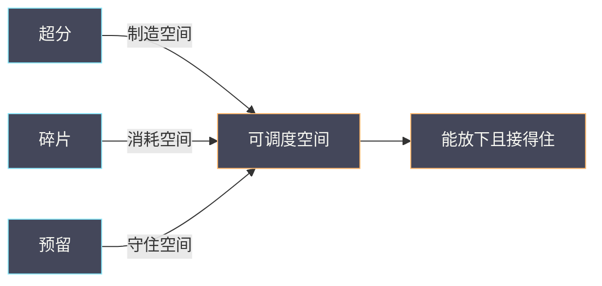

# 06 容量与缩容——超分、资源碎片、故障预留和恢复空间

**摘要：**

容量问题在云平台上有一个反直觉的特征：监控面板显示资源利用率不高，用户却反馈「创建不了」。本文把容量问题拆成三个变量——超分、碎片与预留，说明为什么「总量够」与「放得下」是两回事，为什么恢复空间必须在平时预留而不能临时腾挪，以及缩容为什么比扩容更难。全文回答两个问题：为什么有空闲却放不下，以及一个集群到底应该留多少余量。文中的平台事实与指标名称取自 2026 年 9 月的脱敏记录，涉及具体数值处标注口径。

---

## 第 1 章 容量的三个问题

「容量不够」是一个笼统的说法，它至少包含三个不同的问题：总量不足、结构不合适、以及没有余量。三者听起来相似，处置方式却完全不同。

### 1.1 三种形态

**总量不足**是最好理解的形态：集群的物理资源确实少于需求，加机器就能解决。**结构不合适**指的是总量够，但资源分布不满足约束——某台宿主机放不下一个大规格实例，即使集群整体还有大量空闲。**没有余量**指的是平时够用，但一旦发生故障需要疏散时，剩余容量接不住被疏散的负载。

三种形态的区别在于：前两种影响「能否创建」，第三种影响「故障时能否恢复」。**很多人只盯着前两种，直到故障发生才发现第三种是致命的**。

### 1.2 利用率是个骗人的指标

集群利用率是容量管理里最常用、也最容易误导的指标。它的定义通常是「已分配资源 / 总资源」，这个定义有两个问题。

第一，**「已分配」不等于「已使用」**。一台虚机分配了 8 核，实际可能只用了 1 核；超分场景下，已分配量可以远超物理量，利用率自然超过 100%。因此利用率高低不能直接说明「还能不能放」。

第二，**利用率忽略了分布**。集群利用率 60%，可能意味着所有宿主机都用了 60%，也可能意味着 40% 的机器满载而 60% 空置。前者的可调度空间很小，后者很大。**同一个数字，两种完全不同的现实**。

结论是：利用率可以作为趋势指标，但不能作为「能否创建」的判据。判据要回到资源账与调度器，也就是后面第 3 章的内容。

### 1.3 三层视角

容量问题应当从三层看：**资源账**（控制面认为有多少、已分配多少）、**实际用量**（宿主机与虚机真实消耗多少）、以及**可调度空间**（在满足约束的前提下还能放下什么）。三层的关系是：账是控制面的记忆，用量是物理现实，可调度空间是两者的交集减去约束。

**三层缺一，容量判断就会失真**。只看账，会被账实不符误导；只看用量，会忽略调度约束；只看可调度空间，会不知道为什么空间这么小。这也解释了为什么容量问题常常需要跨角色协作——它天然是「控制面 + 宿主机 + 业务约束」三方的交叉问题。

### 1.4 容量问题的责任边界

容量问题天然跨角色：控制面团队管资源账与调度，宿主机团队管物理资源与隔离，业务团队管实际用量与规格选择。三者的边界不清，就会出现「都以为别人在管」的空白区，而容量问题往往就出在空白区。

**明确边界的办法是把「容量问题」拆成可归属的子问题**：账实不符归控制面，物理碎片归宿主机，规格与用量归业务，预留口径归平台。拆开之后，每个子问题都有明确的负责人与验证方式。这与 05 篇「共享故障域要先识别归属」是同一种思路——**先定位责任，再谈处置**。

### 1.5 一个可复用的容量判断顺序

把前面几节收成一条判断顺序：先看「能不能放」（候选查询），再看「为什么不能放」（约束与碎片），最后看「该不该放」（预留与业务优先级）。

第三条最容易被忽略。「该不该放」问的是：放下去之后，故障时还接得住吗？如果不接得住，那么这次创建虽然成功，却降低了整个集群的可用性。**把「该不该放」纳入判断，是容量管理从「满足需求」升级为「守住承诺」的标志**。这条顺序会在第 8 章的推演里被完整走一遍。

### 1.6 三个问题之间的关系

三种形态不是并列的，它们之间存在因果：超分提高利用率，同时制造了「总量看似充足」的假象；碎片让「看似充足」的总量无法被使用；而预留不足则让「能用」的部分在故障时失效。**超分制造空间，碎片消耗空间，预留守住空间**——三者的关系可以这样概括。

理解这条因果，就能明白为什么容量问题常常「突然」出现：超分在前期提高了利用率，碎片在中期慢慢积累，等到某次故障需要疏散时，才发现预留早被前两者挤没了。**容量问题的时间尺度很长，这正是它容易被忽视的原因**。



三个变量作用于同一份「可调度空间」：超分把它做大，碎片把它切碎，预留把它锁住一部分。**容量管理的全部工作，就是让这三者与业务等级匹配**。

### 1.7 容量问题的两层时间尺度

容量问题有两个时间尺度。**短尺度**是「现在能不能放」，由资源账与碎片决定，分钟级可判断；**长尺度**是「未来还够不够」，由趋势与业务规划决定，周月级才能看清。两个尺度对应不同的角色与动作：短尺度归运营，长尺度归规划。

混用两个尺度会出问题：用短尺度回答规划问题（「现在还有余量」不能说明「明年够不够」），或用长尺度回答运营问题（「按趋势还能撑三个月」不能回答「今天这个请求能不能满足」）。**把尺度分开，容量沟通会顺畅很多**——业务问的往往是短尺度，而平台准备的往往是长尺度，两者之间需要一次翻译。

这两层尺度也解释了为什么容量管理需要「双线」：一条线做日常的资源账与碎片治理，另一条线做趋势与规划。两条线共用同一套数据，但输出与节奏不同。**把它们混成一个流程，会让日常运营被规划节奏拖慢，也会让规划被日常噪音干扰**。

## 第 2 章 超分：效率与风险的交换

超分是提高资源利用率的主要手段，也是容量风险的主要来源。理解超分，先要理解它为什么成立。

### 2.1 超分的原理

超分成立的依据是**统计复用**：绝大多数虚机不会同时跑满自己的配额。CPU 的复用最普遍——大部分业务是「突发型」而非「持续满载型」，因此把物理核超分给更多虚机，整体吞吐往往更高。内存与存储也可以超分，但它们的性质不同。

**CPU 超分是常态，内存超分要谨慎，存储超分要看后端的可靠性设计**。三者的风险不对等，因为它们的「超了会怎样」不同：CPU 超了表现为变慢，内存超了可能触发 OOM 或虚机被强制回收，存储超了可能导致写入失败。

### 2.2 内存超分的红线

内存超分有一个明确的红线：**不能超过「虚机能接受被回收」的程度**。虚机的内存有两种处理方式——一种是「承诺多少就给多少」，另一种是「允许宿主机在压力下回收一部分」（通过气球机制或页共享）。前者不能超分，后者可以，但回收会影响虚机性能。

因此内存超分的比例应当与业务对内存的敏感度绑定：数据库这类对内存敏感的业务不应超分，缓存类业务可以适度超分。**把超分比例按业务分级**，是内存超分安全的前提。

### 2.3 存储超分与后端设计

存储超分的依据是「卷不会同时写满」。三副本的存储后端，有效容量是物理容量的一部分；如果再叠加「卷的分配量大于实际写入量」的超分，实际可用容量还要再打折。存储超分的风险在于**写满的那一刻**：卷写满时，业务直接受损，且扩容需要时间。

因此存储超分必须与后端的告警绑定——水位告警要提前，留出扩容窗口。**存储超分的安全边界不是「能不能超」，而是「超了之后能不能及时扩」**。

### 2.4 超分比例怎么定

超分比例没有统一答案，它取决于业务构成与故障容忍度。定比例的思路是：先统计业务的实际使用分布（P50、P95、P99），再按「大部分时间不冲突」的原则取一个比例，最后用压力测试验证。

| 资源 | 超分风险 | 建议取向 |
| :--- | :--- | :--- |
| CPU | 表现为变慢 | 可较积极，配合调度与限额 |
| 内存 | 可能 OOM 或回收 | 按业务分级，敏感业务不超 |
| 存储 | 写满即受损 | 谨慎，配合水位告警 |

**比例是结果而不是目标**。为了达到某个利用率数字去调比例，是把因果搞反了；正确的做法是让比例服务于业务的实际分布。

### 2.5 超分与邻居效应

超分的直接后果是「邻居效应」：同一个物理资源上的虚机互相影响。一台虚机突发占用，会让同宿主机上的其他虚机变慢。这与 03 篇讲的限速是配套的两件事——**超分决定共享的强度，限速决定共享的公平性**。

邻居效应无法消除，但可以度量与缓解：度量靠宿主机维度的延迟与队列指标，缓解靠限速、绑核与资源分级。**把邻居效应当成一个需要管理的常态，而不是需要消灭的缺陷**，是超分治理的成熟态度。

### 2.6 超分的观测与止损

超分需要观测，否则它会在不知不觉中积累风险。观测的核心是「邻居效应的强度」：宿主机维度的 CPU 就绪等待、内存压力、I/O 延迟，都是邻居效应的直接体现。这些指标上升，说明超分带来的共享已经开始影响业务。

止损的手段有三：**限额**（限制单个虚机的影响上限）、**绑核**（把关键业务固定在特定核上，避免被抢）、**迁移**（把高影响虚机迁到负载更低的宿主机）。三者可以组合，但都要有代价意识：限额牺牲突发能力，绑核牺牲调度灵活性，迁移带来负载。

**超分的治理目标不是「不超」，而是「超了之后影响可控」**。这个目标决定了观测指标的选择——看的是影响，而不是比例。

```promql
# 邻居效应的直接信号：宿主机 CPU 就绪等待与内存压力
rate(node_pressure_cpu_waiting_seconds_total[5m])
rate(node_pressure_memory_stalled_seconds_total[5m])

# 宿主机维度的 I/O 等待：超分与共享盘竞争的体现
rate(node_disk_io_time_weighted_seconds_total[5m])
```

### 2.7 超分与绑核、大页的关系

超分不是孤立的手段，它与绑核、大页等资源控制机制互相影响。绑核把虚机固定在特定物理核上，牺牲了调度的灵活性，换来的是稳定的性能——但它也让超分的空间变小，因为被绑定的核不能再被别的虚机复用。

大页同理：大页预留会从普通内存池里划走一块，减少可超分的内存。**这些机制都在「用灵活度换确定性」，而超分是在「用确定性换利用率」**。两者方向相反，因此配置时必须一起考虑，不能各调各的。

实践中常见的错误是：一边提高超分比例，一边要求关键业务绑核——结果是关键业务的核被固定，可超分的资源被压缩，整体容量反而更紧张。**把资源控制机制当成一个整体来设计**，才能避免互相抵消。

### 2.8 超分比例的复核

超分比例应当定期复核，复核的触发条件有三：业务构成发生明显变化（如大量新增计算密集业务）、邻居效应指标持续上升、以及硬件代际更新（新硬件的性能特征不同，可承受的超分比例也不同）。

复核的方法不是拍脑袋，而是**用实际数据验证**：统计业务的实际使用分布，模拟在不同比例下的冲突概率，再用压测确认。**比例是数据推导出来的结论，不是经验值**。这与第 2.4 节的结论一致，但强调了「定期」二字——一次推导的结论会随环境变化而失效。

### 2.9 超分与故障的叠加

超分与故障会叠加，产生比单独任一项更严重的问题。平时超分运行良好，是因为负载被摊平在多个宿主机上；一旦某台宿主机故障，被疏散的负载要落到剩余机器上，而剩余机器本身就是超分的。**故障让超分从「统计复用」变成「确定冲突」**——原本「大部分时间不冲突」的假设，在疏散瞬间失效。

这就是故障预留必须存在的深层原因：它不只是「留一点余量」，而是**为超分在故障时的失效准备缓冲**。没有预留的超分，等于在故障时把所有余量一次性透支。理解了这一层，预留的必要性就不再是「保险思维」，而是超分逻辑的必然要求。

## 第 3 章 资源账：Placement 与账实不符

资源账是控制面判断「能不能创建」的依据，它的准确性直接决定调度成功率。

### 3.1 清单、分配与用量

资源账里有三个概念：**清单**（这台宿主机有多少资源）、**分配**（已经承诺出去多少）、**用量**（实际消耗多少）。调度时看的是「清单减分配」，而监控上看到的是「用量」。**两者的差异就是账实不符的空间**。

```bash
# 查看资源提供者的清单与已用量
openstack resource provider list -f value -c uuid -c name
openstack resource provider inventory list <rp-uuid>
openstack resource provider usage show <rp-uuid>

# 查询候选宿主机：直接回答「还能放下什么」
openstack allocation candidate list --resource VCPU=4 --resource MEMORY_MB=8192
```

### 3.2 账实不符的三种成因

账实不符通常来自三个地方。第一，**异常终止的操作留下残留**：删除或迁移中途失败，资源已释放但账上未减，或账上已减但资源未释放。第二，**宿主机侧的资源变化未被上报**：譬如内存条故障导致容量减少，控制面仍按旧值记账。第三，**超分口径不一致**：控制面按物理量记账，而实际可用量受预留与隔离影响。

**这三种成因的排查方式不同**：残留要靠对账脚本，容量变化要靠硬件巡检与容量校验，口径不一致要靠统一口径。把它们混在一起，就会得出「账不对但不知道哪里不对」的结论。

### 3.3 对账方法

对账的核心是**用两条独立的数据源比对同一件事**。控制面的账与宿主机上报的实际，是天然的一对。

对账的节奏有两种：定期全量对账（适合低频、可作为巡检项）与事件驱动对账（适合高频、在关键操作后触发）。**事件驱动对账的价值在恢复期特别高**——疏散与回迁之后，账最容易出现偏差。

### 3.4 一个对账实例

设想一次对账发现，某宿主机在控制面账上显示已分配 60 核，而宿主机实际运行虚机合计只有 50 核。差额来自哪里？

排查路径是：先在控制面列出该宿主机上的实例，与实际运行的虚机列表比对，找出「账上有、实际没有」的实例。逐个查看它们的操作历史，往往能发现某次删除或迁移操作中途失败，状态停留在了中间态。这类残留会持续占用资源账，直到被清理。

**对账的价值不只是发现差额，更是定位差额的来源**。只报「差额 10 核」，运维无法处置；报出「这 10 核来自三个残留实例，操作时间分别是……」，才能直接处置。因此对账脚本应当输出差异明细，而不只是汇总数字。

### 3.5 资源账的三个常见误区

资源账的排查有三个常见误区。第一，**把用量当账**：用量是实际消耗，账是分配承诺，两者不是一回事，混用会得出错误的剩余空间。第二，**只看总数不看维度**：vCPU 有余量不代表内存有余量，账要按资源类分别看。第三，**忽略约束**：账上有的资源可能因为约束无法使用，账的可用性要减去约束。

三个误区的共同点是「把账简单化」。**账是带约束的多维数据结构，不是一组标量**。理解这一点，才能读懂 Placement 的输出。资源提供者、特征与聚合的完整模型，在 02 篇第 4 章有系统展开。

### 3.6 对账的自动化

对账的价值取决于它能否常态化，而常态化取决于自动化程度。手动对账只能偶尔做，自动化对账才能成为巡检项。

自动化对账的要点有三：**数据源独立**（控制面与宿主机各取一份）、**输出可操作**（差异明细而非汇总）、以及**触发时机明确**（定期加事件驱动）。三条缺一，对账就会退化成人肉比对。

对账脚本本身也应当被纳入版本管理与评审——它是对「账本正确性」的判定，其逻辑错误会带来比不检查更坏的后果：**错误的对账会给出虚假的安全感**。这也是自动化工具的一条通用纪律：判定类工具的可靠性要求高于执行类工具。

## 第 4 章 资源碎片：为什么有空闲却放不下

碎片是容量问题里最反直觉的一种：明明有空闲，就是放不下。

### 4.1 碎片的两类

碎片分两类。**物理碎片**指的是资源在物理上被切分得不连续，譬如内存被大页预留切走一块、磁盘被分区切得不连续。**逻辑碎片**指的是资源在约束维度上不匹配，譬如某台宿主机剩 4 核但剩余内存不足以支撑一个 4 核规格的实例。

逻辑碎片更常见，也更难治，因为它涉及规格与约束的组合。**碎片不是「资源少了」，而是「资源形状不对」**。

### 4.2 碎片如何形成

碎片由长期的增删形成。小规格实例被反复创建删除，留下许多「小空洞」；大规格实例需要连续的大块，于是放不进去。如果集群里长期只创建小规格，突然要创建大规格，碎片问题就会暴露。

**碎片的形成是渐进的，暴露是突发的**。平时看不出来，直到有一次创建失败，才发现「空闲很多但放不下大实例」。这也是容量管理容易被忽视的原因——没有告警，直到用户报错。

### 4.3 碎片治理

碎片治理有三种思路。第一，**规格引导**：鼓励业务使用与碎片匹配的规格，减少「大规格打不进小空洞」的情况。第二，**整理**：通过迁移把资源重新排布，代价是迁移本身有成本与风险。第三，**预留**：为大规格实例预留专门的宿主机或聚合，避免与碎片混在一起。

三种思路可以组合，但都要有代价意识：整理会产生负载，预留会降低利用率。**碎片治理同样是权衡**，不是「消灭碎片」。

### 4.4 碎片的一个实例

设想集群有 100 台宿主机，每台 64 核，整体已分配约 60%。某业务申请一个 32 核的大规格实例，却连续失败。

排查发现，剩余空间虽然总量可观，但分散在大量宿主机上，每台只剩 10 到 20 核；而调度要求单个实例的资源必须落在一台宿主机上。这就是典型的逻辑碎片——**空闲是真实的，但形状不对**。

处置方式有三种：整理（迁移部分小实例腾出连续空间）、放宽约束（如果有多个可用域，扩大候选范围）、以及长期方案（为大规格设专门聚合）。三者的成本依次递减但见效时间递增，实际选择取决于这次需求的紧急程度。**把三种处置方式的成本与时效摆在一起，决策就不再靠直觉**。

### 4.5 碎片与规格设计

碎片与规格设计密切相关。规格的种类越多、越零碎，碎片越容易形成；规格越集中，资源越容易排布整齐。因此**规格治理是碎片治理的上游**：与其事后整理，不如事前控制规格的多样性。

规格治理的手段包括：收敛规格数量、为大规格设专门聚合、以及为常见规格预留标准化的资源块。这些手段的目标都是**让资源以「可预测的形状」被分配**，从而减少空洞。

这条认知也解释了为什么成熟平台往往规格很少——不是业务不需要多样性，而是多样性会以碎片的形式收费。把这句话讲给业务方，比单纯要求「少建规格」更容易获得配合。

### 4.6 碎片治理的时机

碎片治理有一个时机问题。平时整理碎片成本低（负载轻、窗口多），但缺乏紧迫性；等到创建失败时再整理，成本高（要迁移线上业务、要抢窗口）。**理想的做法是在碎片达到临界之前主动整理，而临界点是可预测的**——通过大规格创建成功率这个指标可以间接观测。

把「大规格创建成功率」作为碎片的水位指标，是一个实用的做法：它直接反映「形状是否还够用」，比抽象的碎片率更贴近业务感知。**用业务可感知的指标做水位，比用技术指标更容易推动治理**。这也是本篇反复强调的一点：指标的选择本身就是一种管理手段。

## 第 5 章 故障预留：N+1 与恢复空间

故障预留是容量管理里最容易被忽略、后果最严重的一项。

### 5.1 为什么需要预留

预留的动机来自 04、05 篇讨论过的恢复场景：当一台宿主机或一个故障域失效时，被疏散的虚机需要有地方去。如果集群平时把资源用到极限，故障时就没有承接空间，疏散会失败或把目标机器压垮。

**预留的本质是「为故障准备的空房间」**。它与「利用率」天然矛盾：预留越多，利用率越低。因此预留的比例是一个明确的权衡，而不是「越安全越好」。

### 5.2 预留多少

预留的规模取决于「最坏情况下要接住多少」。常见口径有三种：**N+1**（能接住一台宿主机失效）、**N+2**（能接住两台或两个故障域同时失效）、以及**按故障域预留**（能接住一个机架或一个可用区失效）。

选择哪一种取决于业务等级与故障模型：单机故障频繁但影响小，机架故障罕见但影响大。**预留口径要与业务承诺的可用性匹配**，而不是照抄行业惯例。

| 口径 | 接住的对象 | 代价 | 适用 |
| :--- | :--- | :--- | :--- |
| N+1 | 一台宿主机 | 中 | 一般业务 |
| N+2 | 两台宿主机 | 高 | 核心业务 |
| 按故障域 | 一个机架或可用区 | 最高 | 关键业务 |

### 5.3 预留与故障域

预留不只是「总量上的余量」，还要满足「故障域上的余量」。如果预留的空间与原故障负载落在同一个故障域里，那么该故障域失效时，预留同时失效。

因此预留要按故障域计算：**每个故障域都要有能接住本域失效负载的余量**，而不是全集群总量够就行。这与 04 篇「疏散目标是换一个故障域」是同一条要求。

### 5.4 预留的代价

预留的代价直接体现为成本：需要多买机器，或接受更低的利用率。这笔成本必须被业务方理解，否则会出现「先提高利用率、故障时再说」的短视决策。

**把预留写成明确的容量策略**（预留多少、为什么、谁批准动用）是必要的。预留最怕的不是成本，而是「被悄悄用掉」——一旦某个紧急创建绕过了预留，预留就名存实亡。

### 5.5 预留的动态维护

预留不是一次设定就永久有效。随着集群规模变化、业务结构调整、故障模型更新，预留口径需要定期复核。复核的内容包括：预留量是否仍满足当前故障模型、预留是否被绕过使用、以及预留的分布是否覆盖了所有故障域。

**预留最容易失效的方式是「被悄悄用掉」**。一次紧急扩容、一次临时调度放宽，都可能占用预留空间。因此预留需要有「水位」概念——它自己也是一个需要监控的资源。把预留纳入容量水位，才能真正守住它。这也解释了为什么预留必须写成明确策略：**没有明文的预留，等于没有预留**。

### 5.6 预留与缩容的联动

预留与缩容是一对需要联动的概念。缩容会压缩预留空间，因此缩容决策必须同时回答两个问题：缩完之后还能接住什么故障？以及是否需要调整预留口径（如从 N+2 降为 N+1）？

**降口径是一个需要业务确认的决策**，因为它直接改变可用性承诺。技术上降口径很容易（少留一点就行），但它的后果是故障时接不住，因此不能由平台单方面决定。

把预留与缩容放在一起讨论，能避免「缩容时只看利用率、忘了可用性」的常见失误。这也是第 6.4 节从另一个角度讲过的同一件事。

### 5.7 预留的三个常见误解

预留有三个常见误解。第一，**以为预留是「空着不用」**——实际上预留是可以被日常负载使用的，只是在故障时需要能腾出来；关键是「可腾出」，而不是「不可用」。第二，**以为预留只要总量够**——前面讲过，预留必须按故障域分布。第三，**以为预留是一次性配置**——它会随规模与故障模型变化，需要动态维护。

三个误解的根源是把预留看成一个静态数字，而它实际是一个动态策略。**把预留写成有水位、有口径、有维护周期的策略，才是真正守住了它**。这也解释了为什么「预留」在术语上更像一种制度，而不是一个配置项。

## 第 6 章 缩容：为什么难，怎么安全缩

扩容是加法，缩容是减法。减法比加法难，因为减法不可逆。

### 6.1 缩容为什么难

缩容难在三处。第一，**负载分布不均**：要缩的那部分可能承载着关键业务，缩掉它就要迁移，而迁移有风险。第二，**时间窗口难找**：迁移需要窗口，而业务未必愿意给。第三，**缩容后的余量计算变化**：缩容会降低总容量，可能同时压缩了故障预留空间，使可用性下降。

**缩容不只是「减少机器」，它同时改变了故障模型**。这一点必须在决策时明确。

### 6.2 缩容的前提

安全缩容的前提有三：目标机器的负载可以迁移（依赖共享存储）、有足够的剩余容量承接（缩容后仍满足预留口径）、以及迁移过程可回滚（出问题能退回）。

三个前提缺一不可。**最容易忽略的是第二个**——缩容时只算了「承接当前的负载」，没算「缩容后还要留出故障余量」，结果可用性在缩容后悄悄下降。

### 6.3 缩容的顺序

缩容的顺序应当是：先缩「影响最小」的部分（空闲节点、边缘业务节点），再缩「需要迁移」的部分；先缩「单个节点」，再缩「整个故障域」。**从易到难、从边缘到核心**，是缩容的安全顺序。

每一步都要有验证：迁移完成、业务正常、容量账更新。缩容的验证与扩容同样重要，因为缩容的失败更隐蔽——业务可能只是变慢，而不是立刻报错。

### 6.4 缩容与恢复空间的关系

缩容最需要警惕的是它对恢复空间的影响。缩掉一个节点，不只是少了一份算力，也可能少了一个「接住故障的容器」。因此缩容决策必须回答：**缩完之后，最坏故障发生时还接得住吗？**

如果接不住，那么缩容节省的成本，是用可用性换来的。这个交换必须显式化、必须由业务方知情同意，而不是在容量报表里悄悄完成。

### 6.5 缩容的验证

缩容的验证比扩容更重要，因为它的失败更隐蔽。验证内容应包括：被迁移业务的探针是否通过、目标宿主机的水位是否仍在安全线内、以及缩容后的故障预留是否仍然满足口径。

验证的组织方式与 05 篇一致——**独立验证，而不是动作自证**。「迁移命令返回成功」不是验证，「业务探针在目标机器上通过」才是。

缩容还应设置回滚点：保留被缩节点的纳管信息与配置，一旦业务异常可以快速恢复。**缩容的不可逆性，靠回滚能力来对冲**。

### 6.6 缩容的组织方式

缩容的组织方式影响它的风险。建议的做法是：先做容量评估（缩完之后是否仍满足预留）、再做迁移演练（用非关键业务验证流程）、然后分批执行（每批观察）、最后复核容量与可用性。

**缩容应当有明确的发起条件与验收标准**，而不是「机器闲置了就缩」。闲置是一个信号，但是否该缩，取决于它对故障模型的影响。这与扩容的组织方式对称：扩容看「是否缺」，缩容看「缩了是否仍安全」。

### 6.7 缩容与业务沟通

缩容是少数必须与业务沟通的容量动作，因为它会改变业务的运行环境（迁移）与平台的可用性承诺（预留变化）。沟通的内容应当包括：涉及哪些业务、迁移窗口与影响、缩容后的可用性变化、以及回滚方案。

**把「可用性变化」明确告诉业务方，是缩容沟通里最关键的一条**。很多争议源于业务方以为「缩容只是换个地方跑」，而实际上故障时的接住能力下降了。把这条讲清楚，缩容决策才是有依据的，而不是「平台单方面决定」。

## 第 7 章 容量水位与告警

容量管理靠的是提前发现，而提前发现靠的是水位与趋势。

### 7.1 水位指标的选取

水位指标要能回答「还剩多少可调度空间」，而不只是「用了多少」。因此指标应当取自资源账而非用量：清单减分配，是调度器实际能用的空间。

同时，水位要**分维度、分故障域**统计：总水位可能充足，但某个故障域的水位已经见底。**只看总水位是容量告警最常见的盲区**。

```promql
# 分故障域统计在线宿主机：只看总量会漏掉局部见底
count by (cluster) (libvirt_up{job="openstack-libvirt-exporter"} == 1)

# 资源账剩余空间（示意）：以分配量与清单之比观察
# 具体指标名以平台实际 exporter 为准
1 - (allocation_vcpu / inventory_vcpu)
```

### 7.2 分层告警

容量告警应当分层：**趋势告警**（按增长率预测何时触顶，用于提前扩容）、**水位告警**（接近阈值时提醒，用于启动流程）、**阻塞告警**（已经放不下时报警，用于止损）。

三层的用途不同：趋势告警面向规划，水位告警面向运营，阻塞告警面向应急。**只有阻塞告警而没有趋势告警，就会一直在救火**；只有趋势告警而没有阻塞告警，就会在预测失灵时毫无准备。

### 7.3 容量趋势与业务节奏

容量趋势要结合业务节奏看。业务有明显峰谷时，容量要按峰值而非均值规划；有季节性增长时，趋势线要按周期修正。**用一条直线拟合有周期的数据，会得出错误的扩容时间点**。

趋势分析的价值不在于精确预测，而在于**给出足够的提前量**。扩容需要采购、上架、纳管，这些都有周期，因此趋势告警必须比实际触顶早很多。

### 7.4 容量巡检清单

- 总水位与分故障域水位是否都在安全线以上。
- 故障预留是否完整，是否被占用。
- 资源账与宿主机实际是否一致。
- 是否存在长期残留的中间态实例。
- 碎片是否在积累（大规格创建成功率）。
- 趋势线是否指向某个维度即将触顶。
- 超分带来的邻居效应指标是否在上升。

这份清单的价值在于**把容量管理从「出问题才看」变成「定期看」**。容量问题几乎没有突发，只有积累到临界才暴露；定期巡检正是针对这个特征。

### 7.5 容量与 SLO 的关系

容量最终服务于可用性承诺（SLO）。一个集群的容量策略，应当能从它的 SLO 推导出来：承诺 99.9% 可用性，意味着一年允许的中断时间有限，因此预留必须能接住常见故障；承诺 99.99%，则要接住更罕见的叠加故障。

**把容量与 SLO 挂钩，能避免两个极端**：一是「为省钱把余量压到极限」，二是「为了绝对安全无限预留」。SLO 给出了一个可计算的中间点。这也是后面 08 篇要展开的主题——SLO 不只用于衡量，也用于指导资源配置。

### 7.6 容量报告的要素

容量报告是容量管理的对外输出，它的要素应当包括：各维度的水位（总量与分故障域）、预留状态、账实一致性、碎片趋势、以及按趋势预测的触顶时间。

报告的对象不同，侧重不同：**面向运营的侧重水位与阻塞**，**面向规划的侧重趋势与触顶时间**，**面向业务的侧重预留与承诺**。一份报告面向所有对象，往往谁都不满意。

把容量报告分层输出，是容量管理走向规范化的标志。它同时解决了容量管理的一个老问题——**技术侧觉得业务不关心，业务侧觉得技术没说清**，而分层报告正是两者的接口。

### 7.7 告警的去噪

容量告警最容易变成噪音——每个维度、每台宿主机都设阈值，告警量会迅速失控。去噪的关键是**按「可操作性」设置告警**：只有能触发明确动作的告警才保留，其余降级为报表。

举例来说，「某台宿主机内存剩余 15%」未必可操作（可能只是暂时波动），而「某故障域的故障预留不足」直接对应「需要扩容或调整策略」，是可操作的。**把告警数量压下来，剩下的每一条才有分量**。这与后面 08 篇要讲的告警治理是同一件事。

## 第 8 章 一次容量相关推演

下面用一个推演把前面的概念串起来。

### 8.1 场景

某集群监控显示整体利用率不高，但业务反馈「创建大规格实例失败」。排查发现，失败原因是「无可用宿主机」。

### 8.2 定位

按第 3 章的方法查资源账：先用候选查询确认，确实没有宿主机能满足该规格。再看分布：可用宿主机大多是「剩余内存不足」或「不在允许的可用域」，而不是「完全没有空闲」。这说明问题不是总量不足，而是**逻辑碎片加上约束限制**。

进一步看约束：该规格要求某个宿主机特征，具备该特征的宿主机恰好都被小规格实例占用了部分资源，剩余空间不足以放下大规格。

### 8.3 处置与长期方案

短期处置是整理——把具备该特征的宿主机上的部分小规格实例迁移走，腾出连续空间；或临时放宽可用域限制（需业务确认）。长期方案是**为这类大规格需求预留专门的宿主机聚合**，避免与碎片混在一起。

这个推演说明：**容量问题的答案往往不在「加机器」，而在「看清约束与碎片」**。这也是本篇从「利用率」讲到「碎片」再到「预留」的原因——它们共同构成容量问题的完整图景。

### 8.4 这个推演的一般化

这个推演可以一般化为一个判断顺序：**先问「能不能放」，再问「为什么不能放」，最后问「怎么才能放」**。

「能不能放」用候选查询回答；「为什么不能放」用约束逐条验证与剩余空间形状分析回答；「怎么才能放」则是在整理、放宽、预留三条路里选一条。**这个顺序避免了「一上来就加机器」的条件反射**——加机器只对「总量不足」有效，对碎片与约束无效。

把顺序固化下来，容量问题的处置就能从「凭经验」变成「按步骤」。这也是本篇与前几篇一以贯之的写作方式：**先给判断框架，再给证据与动作**。

### 8.5 推演中的预留判断

回到第 1.5 节的顺序，这次推演走完了前两步（能不能放、为什么不能放），第三步「该不该放」还需要补充：如果为了放下这个大规格而占用了故障预留空间，那么这次创建会降低集群的可用性。此时正确的做法是**先确认预留是否充足，再决定是否放行**。

这个判断把容量问题从「用户需求」提升到「平台承诺」。**用户的创建请求与平台的可用性承诺之间，需要一个仲裁机制**，而这个机制的依据就是预留。没有预留概念的容量管理，只能被动地满足需求，无法守住承诺。

### 8.6 推演之外的常见容量问题

除了大规格打不进碎片，容量问题还有几种常见形态值得记住。**单维度触顶**：vCPU 还有余量但内存已满，表现为「小规格能建、大内存规格建不了」。**约束收紧**：新增了宿主机特征要求或可用域限制，导致候选集合突然缩小。**账实漂移累积**：残留实例长期未清理，账上空间持续虚高。

三种形态的共同点是它们都不会立刻报错，而是逐渐让「可调度空间」缩小。**这正是容量巡检必须常态化的原因**——它们只有通过定期核对才能发现，而不是靠告警。把它们列进第 7.4 节的巡检清单，容量管理的覆盖面就基本完整了。

## 第 9 章 误判与反例

第一，**用利用率判断能否创建**。利用率是趋势指标，判据要回到资源账与候选查询。

第二，**只算总量不算分布**。总量够不代表每个故障域都够，分布决定了实际可调度空间。

第三，**忽略故障预留**。平时把资源用到极限，故障时无处疏散，可用性会以最意外的方式下降。

第四，**把缩容当成扩容的逆运算**。缩容会改变故障模型，必须重新校验预留口径。

第五，**只看水位不看趋势**。只有水位告警，会在触顶时才发现，来不及扩容。

第六，**把碎片当成资源不足**。碎片需要整理或引导，加机器未必有效。

第七，**把超分比例当成固定值**。比例应当随业务构成变化而复核，长期不动会积累风险。

第八，**对账只报总额不报明细**。对账的输出必须能直接指向处置对象，否则只是增加困惑。

第九，**把预留口径调整当成技术决策**。降口径直接改变可用性承诺，必须由业务确认。

第十，**把容量与 SLO 分开管理**。容量策略应当从可用性承诺推导，两者分开会导致「资源够了但可用性没达到」。

第十一，**把缩容当成纯技术动作**。缩容改变可用性承诺与业务运行环境，必须与业务沟通并获得确认。

十一条误判可以归成三类：**把指标当判据**（利用率、单一水位）、**把静态当动态**（超分比例、预留口径、缩容前提）、**把技术当全部**（忽略业务确认与分层沟通）。三类分别对应「看什么」「多久看一次」「谁来定」三个问题，把这三问回答清楚，误判会少一大半。

## 第 10 章 边界与反例

第一，**超分不是免费的**。它提高利用率，代价是邻居效应与故障时的连锁，比例必须与业务匹配。

第二，**预留不是越多越好**。预留挤占利用率，比例要与业务承诺的可用性对齐，而不是追求「绝对安全」。

第三，**对账不是一次性工作**。账实不符会反复出现，对账要成为常态化巡检项。

第四，**容量规划不是纯技术问题**。它涉及成本、业务等级与可用性承诺，必须由技术与业务共同决策。

第五，**没有一劳永逸的容量公式**。业务构成、硬件代际与故障模型都在变，容量策略需要定期复核。

第六，**把容量问题归为单一团队的职责**。容量天然跨控制面、宿主机与业务，边界不清就会留下空白区。

第七，**用历史峰值外推未来需求而不修正**。业务结构会变，历史外推必须结合业务节奏与规划。

第八，**把容量报告只输出给技术团队**。容量涉及业务承诺与成本，报告必须分层输出给对应对象。

这八条边界的共同指向是：**容量是承诺的技术表达**。它不是「有多少资源」的事实描述，而是「在什么条件下能满足什么需求」的约定。把容量当成事实，就会在故障时才发现约定落空；把它当成约定，才会在平时就去维护它。理解这一点，容量管理就从「报表工作」变成了「可靠性工作」。

行文至此，把本篇落点收在两条原则上。其一，架构即权衡——超分与预留是一对相反的取舍，任何一端走极端都会付出代价，比例要与业务等级匹配。其二，没有放之四海皆准的容量方案，只有因地制宜地按业务分布、故障模型与成本约束共同确定。下一篇从「平时」转向「最坏情况」：当数据真的丢了或坏了，备份与恢复演练能救回多少，以及 RPO 与 RTO 到底意味着什么。已有的真实复盘可先到 [[SRE/故障排查与复盘/00 故障排查索引|故障排查与复盘索引]] 对照。

---

## 速查卡：容量问题定位

这张表把容量问题定位压缩成速查形式，用于值班与巡检时快速定向；表中「优先怀疑」是排查入口，确认之后回到对应章节取判据。

| 现象 | 优先怀疑 | 验证方法 |
| :--- | :--- | :--- |
| 创建失败、提示无可用宿主机 | 碎片或约束 | 候选查询 + 约束逐条验证 |
| 利用率不高但创建不了 | 逻辑碎片 | 看剩余空间的形状 |
| 账上有资源、实际放不下 | 账实不符 | 账与宿主机实际对账 |
| 故障时疏散失败 | 预留不足 | 校验故障域余量 |
| 缩容后可用性下降 | 预留被压缩 | 重新计算故障模型 |
| 水位突降为 0 | 阻塞告警缺失 | 补齐分层告警 |

## 口径与事实说明

- 平台事实与指标名称取自 2026 年 9 月的脱敏记录，属于某时点快照，不构成永久资产事实。
- 机制描述（超分统计复用、资源账三概念、碎片成因、预留口径）属于 OpenStack 与容量工程的稳定行为。
- 超分比例、预留口径与缩容顺序的具体取值属业务决策，需与业务方共同确定。
- 容量水位、预留与告警阈值的具体数值属平台与业务共同决策，本文不给固定值。
- 文中涉及的平台集群名称与规模按脱敏口径处理。
- 文中命令均为只读查询类操作，扩容、缩容与迁移等写操作须走审批。

---

## 参考资料

1. OpenStack 官方文档，Placement 资源提供者与分配：<https://docs.openstack.org/placement/latest/>
2. OpenStack 官方文档，Nova 调度与超分：<https://docs.openstack.org/nova/latest/admin/scheduling.html>
3. OpenStack 官方文档，配额与资源管理：<https://docs.openstack.org/nova/latest/admin/quotas.html>
4. Ceph 官方文档，容量与均衡：<https://docs.ceph.com/en/latest/rados/operations/>
5. Linux 内核文档，cgroup 资源控制：<https://www.kernel.org/doc/html/latest/admin-guide/cgroup-v2.html>
6. 内部现场素材：CVM 集群 hypervisor 监控交付记录（2026-09-01，脱敏）
7. 内部现场素材：Pallas/OpenStack 混布主机批量异常事故初步分析（2026-09-01，脱敏）

---

> [!note] 思考题
> 1. 为什么集群利用率不能作为「能否创建」的判据，你会用什么替代。
> 2. CPU、内存、存储三种超分的风险为何不对等，各自的红线是什么。
> 3. 逻辑碎片与物理碎片的区别是什么，治理方式有何不同。
> 4. 故障预留为什么要按故障域计算，只算总量会漏掉什么。
> 5. 缩容为什么会改变故障模型，你会如何重新校验预留口径。
