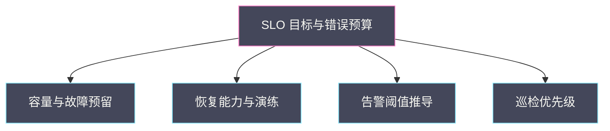

# 08 运维工程化——巡检、维护预检、SLO 与故障取证自动化

**摘要：**

前面七篇讲的是「怎么判断」，这一篇讲「怎么让判断不必每次重来」。运维工程化的目标是把一次性的排查经验，沉淀成常态化的能力：巡检让问题在爆发前被发现，维护预检让变更在动手前被拦住，SLO 让资源与告警有了统一的判据，故障取证自动化让现场在处置之前就被完整记录。全文回答两个问题：哪些运维动作值得被工程化，以及自动化应当做到哪一步、在哪里必须停下来等人。文中的平台事实与工具名称取自 2026 年 9 月的脱敏记录，涉及具体数值处标注口径。

---

## 第 1 章 从救火到工程化

先看两种运维状态的对比。救火模式下，问题出现、告警响起、人扑上去查、恢复、写报告，然后等下一次；工程化模式下，同样的问题出现时，巡检早已发现征兆，取证脚本自动留档，处置按预案执行，恢复后用同一套数据复盘。

### 1.1 救火模式的三个代价

救火模式有三个代价，它们不一定立刻显现，但会持续累积。

**第一是经验无法沉淀**。每次排查的结论散落在个人的记忆与聊天记录里，换一个人、过一段时间，同样的故障要从零查起。**第二是响应依赖当班者**。故障处置的质量取决于当班人的状态与经验，波动很大。**第三是改进没有依据**。没有常态化的数据，改进只能凭感觉，容易在错误的点上投入。

三个代价的共同点是：**救火模式把「能力」存放在了人身上，而不是系统里**。工程化的本质，就是把这些能力从人转移到系统。

### 1.2 工程化的四个方向

本篇覆盖四个工程化方向，它们对应前面七篇留下的四类「未闭环」：

| 方向 | 解决的问题 | 对应篇章 |
| :--- | :--- | :--- |
| 巡检 | 问题只能等爆发才发现 | 01 / 03 / 06 |
| 维护预检 | 变更的风险靠临场判断 | 02 / 04 / 06 |
| SLO | 资源与告警没有统一判据 | 06 / 07 |
| 故障取证自动化 | 现场在处置中被破坏 | 01 / 03 / 05 |

四个方向的共同特征是：**它们都在「故障发生之前」或「故障处置之前」起作用**。工程化的价值不在于让故障不发生，而在于让每一次故障的代价更低、收获更多。

这张图是「可靠性能力地图」的简化版：SLO 是中心，容量、恢复、告警与巡检是四条支撑。**哪条支撑最弱，投入就补哪条**，这也让工程化有了可解释的优先级。

### 1.3 工程化的边界

工程化不是「把所有事都自动化」。它有三个边界。

第一，**工程化不消除判断**。它把判断所需的证据准备好，把重复的动作自动化，但「该不该做」仍然需要人。第二，**工程化不能替代预案**。自动化执行的是预案里定义好的流程，没有预案就没有可自动化的东西。第三，**工程化本身需要维护**。巡检脚本、预检清单、SLO 定义都会随环境失效，需要定期复核。

**把工程化当成一次建设、而不是持续维护，是它最常见的失败方式**。这一点会贯穿本篇的每一节。

### 1.4 工程化的收益曲线

工程化的收益不是线性的。初期投入大、收益小（要建工具、要写清单、要改流程），中期收益快速上升（重复劳动减少、故障代价下降），后期趋于平缓（剩余问题零散、边际收益低）。

**这条曲线解释了为什么工程化容易半途而废**：前期看不到明显收益，容易被「还是先救火吧」打断。理解曲线的形状，能帮助在初期坚持，也能帮助在后期不再追求「更高覆盖」。

曲线的后期还有一个特征：**剩下的往往是「低频但高影响」的问题**，投入产出比下降，此时应当转向「用预案兜底」而不是「用自动化消灭」。这是工程化成熟度的一个判断点。

### 1.5 工程化与自动化的区别

工程化与自动化经常被当作同义词，但它们的层次不同。**自动化是手段，工程化是目标**：工程化的目标是「让能力沉淀在系统里」，自动化只是实现它的一种方式。

有些工程化不需要自动化——例如一份写得清楚、定期更新的预案，就是工程化的产物，尽管它没有代码。反过来，有些自动化不属于工程化——例如一个临时的、没有文档、没有归属的脚本，它提高了效率，但没有沉淀能力。

**判断一项工作是「工程化」还是「临时自动化」，标准是「它是否在人员变动后仍然有效」**。这个标准也能指导投入方向：优先做那些能被交接、能被维护的东西。

### 1.6 工程化的三个前提

工程化要能落地，需要三个前提。**第一，可观测**：没有数据，工程化就无从下手——巡检要有指标、预检要有状态、SLO 要有 SLI。**第二，可执行**：流程要能被自动化或半自动化执行，否则只能停留在文档。**第三，有归属**：每项能力有明确的负责人与维护周期。

三个前提缺一，工程化都会退化成「一次性项目」。**其中「可观测」是基础中的基础**——本专栏前七篇反复强调的证据与指标，正是工程化的原材料。

这也解释了为什么工程化通常要在可观测建设之后推进：**没有观测，就没有可工程化的对象**。

### 1.7 工程化的两个常见起点

工程化的起点通常有两类。**一类从痛出发**：某类故障反复出现，团队决定把它工程化。**另一类从规范出发**：按行业最佳实践，先建工具再找用途。

两类起点各有优劣。从痛出发的工程化**动力足、收益明确**，但容易零散、缺乏体系；从规范出发的工程化**体系完整**，但容易做出没人用的工具。

**更稳妥的做法是两者结合**：用规范（本篇的四件套）作为框架，用痛点作为推进顺序。框架保证不遗漏，痛点保证有动力。这也解释了为什么本篇先给四个方向，再在落地路径里强调「从最痛的点开始」——**框架与顺序是两件事**。

从实践看，绝大多数成功的工程化都是从痛出发、用框架兜底的。**先解决一个真实问题，再把它归入框架，逐步补齐其余方向**，比一开始就按框架全面推进更容易坚持。

## 第 2 章 巡检：把检查变成常态

巡检是工程化里最容易上手、回报也最直接的一项。

### 2.1 巡检的对象

巡检的对象应当是「会缓慢劣化、且劣化后影响可用性」的状态。典型的有四类：**容量水位**（是否会触顶）、**覆盖完整性**（该装的 agent 是否都装了）、**账实一致性**（资源账与实际是否相符）、以及**恢复能力前提**（凭据、备份、依赖是否就绪）。

四类的共同点是它们不会立刻报错，而是逐渐逼近临界。**这正是巡检存在的理由**——告警管的是「已经异常」，巡检管的是「正在变差」。

### 2.2 巡检与告警的区别

巡检与告警经常被混为一谈，但它们的机制不同。

| 维度 | 告警 | 巡检 |
| :--- | :--- | :--- |
| 触发方式 | 指标越界即触发 | 定期主动检查 |
| 覆盖对象 | 已定义阈值的指标 | 需要比对与推理的状态 |
| 典型内容 | CPU、内存、延迟 | 覆盖率、账实一致性、前提就绪 |
| 输出 | 事件流 | 报告与待办 |

**告警擅长发现「越界」，巡检擅长发现「缺失与不一致」**。账实不符、覆盖缺口这类问题，很难用单指标阈值表达，只能靠巡检。

### 2.3 巡检清单的设计

巡检清单的设计有三条原则。**第一，可操作**：每一项都要能对应一个明确的处置动作，否则会变成「看一眼就忘」。**第二，有基线**：检查结果要与基线比对，而不是看绝对值。**第三，可追溯**：每次巡检的结果要留档，才能看出趋势。

三条原则里，「可操作」最重要。**一份无法推动动作的巡检清单，只会消耗注意力**。

### 2.4 巡检的自动化

巡检必须自动化，否则无法常态化。自动化的要点有三：**数据源明确**（从哪里取数）、**判定逻辑清晰**（什么算异常）、**输出可消费**（报告或工单）。

巡检自动化与告警自动化有一个区别：巡检的输出往往需要「比对」与「聚合」，逻辑比单指标阈值复杂。因此**巡检脚本的可靠性要求更高**——判定逻辑错误会给出错误结论，比不做检查更糟。这一点在 06 篇「对账的自动化」里也强调过。

### 2.5 巡检报告的要素

巡检报告应当包含：**检查项与结果**、**与基线的差异**、**待办项与责任人**、以及**趋势**。四项里，最后一项最容易被省略，但它决定了巡检能否从「周期性检查」升级为「趋势预警」。

**把巡检结果连成趋势线，就能提前看到劣化速度**，从而把「什么时候会出问题」从猜测变成推算。这与 06 篇「容量趋势告警」是同一思路。

### 2.6 巡检的一个实例

设想一次容量巡检。检查项包括：各故障域的 CPU 与内存水位、故障预留是否完整、资源账与宿主机实际是否一致、大规格创建成功率、以及是否有长期残留的中间态实例。

巡检结果发现两项异常：某个故障域的水位已接近阈值，以及有若干残留实例持续占用资源账。前者触发扩容流程，后者触发清理流程。**两项都不是告警能发现的**——水位没越界、残留实例没有任何错误日志。

这个实例的价值在于它演示了巡检的定位：**它补的是告警的盲区**，而不是告警的重复。

### 2.7 巡检与 SLO 的关系

巡检与 SLO 是互补的：巡检检查「达成 SLO 的前提是否成立」，SLO 定义「什么算达成」。例如容量水位巡检检查的是「有没有足够余量达成可用性目标」，而可用性目标由 SLO 定义。

**把巡检项与 SLO 关联，能让巡检有优先级**：直接影响 SLO 达成的巡检项优先，其余可降低频率。这与第 2.3 节「可操作」的原则一致——可操作的判据之一，就是它与目标的关系是否明确。

### 2.8 巡检清单的一个模板

一份巡检清单可以按四类组织，每类给出检查项与判据：

**容量类**：各故障域水位（低于阈值）、故障预留完整性（未被占用）、碎片情况（大规格创建成功率）。
**覆盖类**：该装的采集器与 agent（全部在线）、配置版本（与期望一致）、目标清单与实际（无差集）。
**账实类**：资源账与宿主机实际（一致）、残留中间态实例（无长期残留）。
**恢复前提类**：备份独立性（跨故障域）、凭据有效性（未过期）、演练时效（未超期）。

四类的判据都应当是**可校验的条件**，而不是「是否正常」这类模糊表述。**判据越具体，巡检越能被自动化**。

### 2.9 巡检的失败模式

巡检有三种常见失败模式。**第一，清单膨胀**：检查项越来越多，报告越来越长，最终没人看。**第二，判据模糊**：用「是否正常」这类表述，无法自动化也无法判定。**第三，结果无处置**：发现问题但不进入待办，巡检变成仪式。

三种模式的应对分别是：**按可操作性裁剪清单**、**把判据写成可校验条件**、以及**让巡检结果强制进入待办流程**。

三种模式的共同点是它们都指向「巡检是否真的在起作用」。**判断标准很简单：过去一个月，巡检推动了哪些具体动作**。如果答案是「没有」，巡检就需要重构。

### 2.10 巡检与取证的复用

巡检与取证在数据来源上高度重合，可以复用同一套采集能力。区别在于触发方式与用途：巡检定时触发、用于发现劣化；取证事件触发、用于定位根因。

**复用采集能力的好处是维护成本低**：一套采集脚本，两种触发方式，避免了两套逻辑各自失修。代价是采集内容要同时满足两种用途，清单会稍长。

实践中的做法是「一套采集、两种组织」：底层采集统一的原始数据，上层按用途组织成巡检报告或取证包。**这种分层设计让复用成为可能**，也是本篇「工程化」思路在工具层面的体现。

## 第 3 章 维护预检：变更前的检查

巡检面向「平时的状态」，维护预检面向「即将发生的变更」。

### 3.1 变更为什么需要预检

变更的风险往往不在变更动作本身，而在它的前提条件。重启一台宿主机之前，如果上面还有未迁移的虚机，重启就会造成中断；升级存储版本之前，如果没有确认后端健康，升级可能放大已有的问题。

**预检的作用是把「前提条件」显式化**，让变更在动手前就被拦住。它与 04 篇「恢复前先隔离」是同一种思路：**先确认条件，再执行动作**。

### 3.2 预检的内容

预检的内容可以按四类组织：**容量**（目标是否有足够空间承接）、**依赖**（变更涉及的服务依赖是否健康）、**状态**（是否有进行中的任务会与变更冲突）、以及**回滚**（回滚路径是否可用）。

四类里，「回滚」最容易被忽略。**没有回滚路径的变更，风险是无限的**——出问题时只能硬扛。因此预检必须确认回滚可行，而不只是确认「变更可行」。

### 3.3 预检与回滚

预检与回滚是一对配套机制：预检保证「变更前提成立」，回滚保证「变更失败可退」。两者的关系是：**预检降低变更失败的概率，回滚降低变更失败的代价**。

把两者都做扎实，变更就从「赌一把」变成了「有边界的尝试」。这也是运维工程化里最能直接降低事故率的组合。

### 3.4 预检的自动化与门禁

预检的价值在于它能否成为门禁——**不满足条件就不放行**。如果预检只是「建议」，它会在赶进度时被跳过；只有成为门禁，才真正起作用。

门禁的自动化形式可以很简单：变更流程的第一步自动跑预检脚本，未通过则拒绝进入下一步。这与 04、05 篇反复提到的「门禁」是同一个设计：**把判断变成条件**。

### 3.5 维护预检的一个实例

设想一次宿主机维护。预检清单包括：该机上的虚机是否已迁移、该机上的存储卷是否已切走、该机的服务是否已从调度中排除、以及回滚路径是否可用。

预检发现一台机器上仍有一个虚机未迁移——原因是该虚机的卷在本地盘上，无法在线迁移。**这个发现把一次可能的中断变成了一个需要提前决策的问题**：要么推迟维护，要么与业务确认后执行。

预检的价值正在于此：**它把「执行时才发现的问题」提前到「执行前」**，留出决策时间。

### 3.6 预检与变更审批的关系

预检与变更审批是配套的：预检提供「条件是否满足」的事实，审批据此判断「是否放行」。**没有预检的审批只能凭印象**，而有了预检，审批就变成了对事实的确认。

因此预检的输出应当直接进入审批材料：哪些条件满足、哪些不满足、不满足项的风险是什么。**把预检结果作为审批的一部分**，能显著提升审批质量，也能减少「审批走过场」。

### 3.7 预检清单的一个模板

预检清单可以按四类组织：

**容量**：目标区域是否有足够余量承接（含故障预留）。
**依赖**：变更涉及的服务依赖是否健康、队列是否积压。
**状态**：是否有进行中的任务会冲突（迁移、重建、升级）。
**回滚**：回滚路径是否可用、回滚需要多久、回滚是否会丢数据。

四类里，「回滚」的判断最难也最重要。**把「回滚需要多久」写进预检**，能让变更决策者知道最坏情况下的代价，而不只是知道「可以回滚」。这与 07 篇「RTO 要实测」是同一种要求。

### 3.8 预检的失败模式

预检有三种常见失败模式。**第一，形同虚设**：预检做了但不拦人，未通过也能继续。**第二，清单失修**：环境变化后清单没有更新，检查项与实际脱节。**第三，只查技术不查业务**：检查了资源与依赖，却没检查业务侧的准备（如通知、窗口确认）。

三种模式的应对分别是：**做成门禁**、**纳入维护周期**、以及**把业务侧检查项写进清单**。

第三种最容易被忽略。**维护预检不只是技术检查，也是协作检查**——业务是否知情、窗口是否确认、应急联系人是否就位，这些都属于预检范围。

## 第 4 章 SLO：从衡量到指导

SLO 是本篇里最容易被写成「口号」的一项，也最容易被误解为「只是统计」。

### 4.1 SLO 的三个概念

SLO 体系有三个层次的概念：**服务等级指标（SLI）**是可测量的量（如请求成功率、延迟分位）；**服务等级目标（SLO）**是对 SLI 设定的目标（如 99.9% 成功）；**服务等级协议（SLA）**是对外的承诺（含后果条款）。

**三者的关系是：SLI 是尺子，SLO 是内部目标，SLA 是外部承诺**。内部目标通常严于外部承诺，留出缓冲。把三者混用，会出现「用对外承诺当内部目标」，导致内部没有任何余量。

### 4.2 错误预算

SLO 最有价值的衍生概念是**错误预算（Error Budget）**：允许的失败量。99.9% 的可用性目标，意味着一个月允许约 43 分钟的不可用。

错误预算的价值在于它把「可靠性」变成了一笔可花的预算。**预算够用，就可以承担变更风险；预算耗尽，就应当停止变更、优先修复**。它把「要不要发布」这个争论，转成了「预算还剩多少」这个事实。

### 4.3 SLO 如何指导资源配置

SLO 不只用于衡量，也用于指导资源配置——这是 06、07 篇都提到过的一点。可用性目标越高，需要的故障预留越多、恢复能力越强、备份越严格。

**把 SLO 作为资源配置的输入**，能避免两个极端：一是「为省钱把余量压到极限」，二是「为了绝对安全无限投入」。SLO 给出了一个可计算的中间点。

### 4.4 SLO 与告警、容量的关系

SLO 与前面几篇的能力可以串成一条链：**SLO 定义目标 → 容量规划保证有足够余量达成目标 → 恢复能力保证故障时能回到目标 → 告警保证偏离时被及时发现**。

这条链的价值在于它把「技术指标」与「业务承诺」连了起来。**没有这条链，告警阈值只能靠经验拍**；有了它，阈值可以从目标反推。

### 4.5 SLO 的常见误用

SLO 有三种常见误用。第一，**只统计不行动**：把 SLO 做成报表，但预算耗尽时不停变更。第二，**目标定得过高**：99.99% 的目标在没有对应投入时无法达成，反而让指标失去意义。第三，**用单一 SLO 覆盖所有业务**：不同业务的容忍度不同，一刀切会让目标既不合理也难落地。

三种误用的共同点是**把 SLO 当成数字，而不是机制**。SLO 是机制：它约束变更节奏、指导资源投入、定义告警阈值。

### 4.6 SLO 落地的一个实例

设想为一个云平台定义 SLO。做法是先选 SLI：控制面 API 成功率、虚机创建成功率、以及存量虚机的网络可用率。然后定目标：控制面 API 成功率 99.9%，创建成功率 99%，网络可用率 99.95%。

再定错误预算与约束：当某个月的预算消耗超过一半时，暂停非必要变更，优先修复。最后把目标反推到告警：控制面 API 成功率低于某个水平持续若干分钟即告警。

**这个实例的关键在于最后一步——从 SLO 反推告警阈值**。它把告警从「凭经验拍」变成了「从目标推导」，这正是第 4.4 节讲的链条。

### 4.7 SLO 与告警阈值的推导

从 SLO 推导告警阈值，大致分三步：**先算预算**（目标对应的允许失败量），**再定消耗速率**（多快消耗预算算异常），**最后定阈值**（对应的指标水平与持续时间）。

举例来说，可用性目标 99.9%，月度预算约 43 分钟。如果希望「单次故障最多消耗预算的十分之一」，那么单次中断不应超过约 4 分钟，对应的告警阈值就应当让问题在远早于 4 分钟时被发现。

**这条推导链把「告警灵敏度」变成了「可计算的设计参数」**，而不是凭经验调。这也是 SLO 从衡量走向指导的具体体现。

### 4.8 SLO 与其他能力的衔接

SLO 与本专栏其他能力有多处衔接：与容量（06 篇）衔接在「预留口径从可用性目标推导」；与恢复（07 篇）衔接在「RTO 实测值反馈到预算消耗」；与告警衔接在「阈值从目标反推」；与巡检（本篇）衔接在「巡检项按对目标的影响排优先级」。

**把这些衔接画成一张图，就是「可靠性能力地图」**：目标是中心，容量、恢复、告警、巡检是四条支撑。这张图的价值在于它让投入有依据——哪条支撑最弱，就补哪条。

这也是本专栏最后一篇的一个总结：前七篇讲的判断方法，最终都要落到这四条支撑上。

### 4.9 错误预算的用法

错误预算有三种典型用法。**第一，约束变更节奏**：预算充足时正常发布，预算紧张时收紧变更范围，预算耗尽时冻结非必要变更。**第二，指导投入方向**：某条 SLI 的预算总是最先耗尽，说明它是系统短板，应当优先投入。**第三，作为沟通语言**：用「本月预算还剩多少」替代「系统稳不稳定」，把主观争论转成客观事实。

三种用法里，第三种最容易被忽视，但它的价值最大。**预算是一种不需要争论的语言**——它把「要不要发布」从立场之争变成了数据之判。

需要提醒的是，预算冻结不应当是「一刀切禁止一切变更」。**安全相关的修复、故障处理类的变更不应被冻结**，否则会出现「为了保可用性而放弃必要的修复」的悖论。

## 第 5 章 故障取证自动化

取证是故障处置里最容易被牺牲的一环——压力之下，人们倾向于先动手恢复，而现场在恢复动作中消失。

### 5.1 取证为什么难

取证难有三个原因。**第一，时间压力**：故障时业务在受损，取证看起来像「浪费时间」。**第二，现场易失**：重启、清理、迁移都会破坏现场，而恢复动作恰恰包含这些。**第三，缺乏习惯**：没有把取证写进流程，就只能靠个人自觉。

三个原因合起来，指向同一个应对方式：**把取证自动化，让它不依赖人的自觉与时间**。

### 5.2 取证清单

取证的内容应当覆盖本篇前几篇用到的证据源：宿主机资源水位与不可中断进程、容器与虚机状态、网络计数与丢包位置、存储后端延迟与恢复状态、控制面服务状态与队列积压、以及相关日志的关键片段。

清单的设计原则与巡检一致：**每一项都要对应一个可能的根因**。不服务于判断的证据，不必采集——**采集过多会淹没关键信号**。

### 5.3 取证的自动化

取证自动化的关键设计有三点。**第一，触发时机**：在告警触发时、处置动作之前自动采集。**第二，只读**：取证动作本身不得改变系统状态，否则会二次破坏现场。**第三，留档**：采集结果要保存到独立位置，避免随故障环境一起丢失。

**「处置之前自动取证」是最高价值的一条**。它把「先保存现场」从纪律变成了机制，不需要靠人记得。

### 5.4 取证的边界

取证有明确边界：**只读、最小权限、脱敏**。只读避免破坏现场；最小权限避免取证工具本身成为风险；脱敏避免把敏感信息带入报告与知识库。

**取证工具本身也要被纳入安全治理**——它有读取系统内部信息的能力，权限与审计要求不低于其他运维工具。

### 5.5 取证清单的一个实例

设想一份故障取证清单，覆盖宿主机、虚机、网络、存储与控制面五类：宿主机的内存水位与不可中断进程、虚机的状态与最近重启记录、网络的物理层计数与内口丢弃、存储后端的延迟与恢复进度、以及控制面的服务状态与队列积压。

清单在使用时的顺序应当是「先取最易失的」：内存水位、进程状态、网络计数这类现场，重启后会消失；而配置类信息相对持久，可以稍后取。**易失性排序是取证清单的一个实用技巧**，它保证在时间有限时优先保住最关键的现场。

### 5.6 取证与复盘的关系

取证与复盘是同一件事的两端：**取证在故障时采集证据，复盘在故障后使用证据**。没有取证的复盘，只能靠回忆；没有复盘的取证，等于白采。

因此两者应当一起设计：取证清单里的每一项，都应当对应复盘时要回答的问题。**「这份证据用来回答什么」应当写在清单里**，这样既避免采集无关内容，也保证复盘时有据可依。

### 5.7 取证的技术实现

取证的技术实现要点有三：**采集器的部署位置**（宿主机侧还是中心侧）、**采集的触发方式**（告警驱动还是定时快照）、以及**存储位置**（与故障环境隔离）。

采集器部署在宿主机侧的好处是能取到本地现场（如进程状态、内核日志），代价是需要覆盖所有节点；部署在中心侧的好处是易维护，代价是取不到节点本地细节。**实践中往往是两者结合**：中心侧负责协调与聚合，宿主机侧负责本地采集。

存储位置必须与故障环境隔离——**取证结果随故障环境一起丢失，是取证最常见的失效方式**。

### 5.8 取证的失败模式

取证有三种常见失败模式。**第一，采在处置之后**：现场已被恢复动作破坏。**第二，采集不全**：缺少关键维度，导致复盘时无法确定因果。**第三，随环境丢失**：取证结果存放在故障环境内，一起消失。

三种模式的应对分别是：**触发即采**、**清单覆盖五类维度**、以及**异地留档**。三者中，第一条最关键，也最依赖自动化——靠人的自觉，在故障压力下几乎必然被跳过。

**把「触发即采」写进告警处理流程的第一步**，是成本最低、收益最高的一条工程化改进。

### 5.9 取证与自动化的结合

取证与自动化的结合点在于「触发」。理想形态是：告警触发时，自动执行取证脚本，采集结果落盘并附带在告警详情里。**这让值班人在打开告警时，证据已经就位**，不必再花时间采集。

实现这个形态需要两个前提：告警系统能触发外部动作、以及取证脚本足够快（不能拖慢告警处理）。前者靠告警平台的扩展能力，后者靠取证的限流与抽样（第 6.5 节）。

**把取证嵌入告警链路，是工程化里收益最直接的一件事**——它把「记得取证」变成了「自动取证」，把纪律变成了机制。

## 第 6 章 自动化的边界与审批

工程化的核心是自动化，但自动化不是无边界的。这一章讨论「做到哪一步、在哪里停下」。

### 6.1 只读自动化与写入自动化

自动化可以按风险分成两类：**只读自动化**（查询、检查、取证、对账）与**写入自动化**（变更、重启、迁移、发布）。

**只读自动化可以更激进，写入自动化必须更保守**。原因是只读操作的失败后果是「结论错误」，可纠正；写入操作的失败后果是「系统状态改变」，可能不可逆。这个区分是本篇所有自动化设计的基线。

### 6.2 dry-run

对写入自动化，dry-run 是必备环节。它让操作在「不真正执行」的前提下暴露计划，供人核对。

**dry-run 的价值在于把「操作的结果」变成「可审阅的文本」**。审核一个文本计划，比审核一个脚本或一个按钮要可靠得多。

### 6.3 审批与回读

写入自动化需要审批与回读：**审批**确认范围与风险，**回读**确认执行结果与预期一致。两者缺一，自动化就变成了「盲操作」。

回读的意义在于它不依赖「命令返回成功」。**命令返回成功只说明动作被执行，不说明结果符合预期**——这一点在前几篇反复出现，是同一个纪律的延续。

### 6.4 自动化的失败模式

自动化有三种常见失败模式。**第一，静默失败**：脚本出错但未报警，结果被当成成功。**第二，误判**：判定逻辑错误，给出错误结论（巡检与对账脚本的高危模式）。**第三，越权**：自动化执行了超出预期的动作。

三种模式的应对分别是：**失败必须可见**（脚本的退出码与告警）、**判定逻辑要评审**、以及**权限最小化加 dry-run**。

### 6.5 一个只读自动化的边界

只读自动化也有边界。它可以查询、比对、汇总，但**不应主动触发大规模查询**——一次对全集群的并发查询可能给控制面或存储后端带来压力，在故障时尤其危险。

因此只读自动化也要有「限流与分级」：日常巡检可以全量，故障时的取证应当限流或抽样。**「只读」不等于「无影响」**，这是设计只读自动化时最容易忽略的一点。

### 6.6 自动化分级

自动化可以按风险分级，每级对应不同的审批要求：

| 级别 | 动作类型 | 审批要求 |
| :--- | :--- | :--- |
| L1 | 只读查询、检查、取证 | 无需审批，限流即可 |
| L2 | 生成计划、dry-run | 无需审批，输出需留档 |
| L3 | 单对象变更 | 需审批，执行后回读 |
| L4 | 批量或跨故障域变更 | 需审批加分批，逐批回读 |

四级划分的价值在于**让审批聚焦在高风险动作上**，而不是对一切自动化都要求审批。**对只读也要求审批，会让人绕过流程；对批量变更不要求审批，会放大事故**。分级的边界要与风险匹配。

### 6.7 自动化与人的分工

自动化与人的分工，可以按「判断」与「执行」划分：**机器负责执行与检查，人负责判断与决策**。这个划分不是绝对的，但它给出了一个默认边界。

具体到本篇的四件套：巡检由机器执行、人决定处置；预检由机器检查、人决定放行；SLO 由人设定、机器度量与约束；取证由机器采集、人用于判断。**四件套里没有一件是「机器全权负责」的**，这正是「工程化不消除判断」的具体体现。

把分工画清楚，还能避免两种极端：**过度自动化**（机器做了该由人决策的事）与**自动化不足**（人做了机器能做的事）。

## 第 7 章 落地路径

工程化不可能一次做完，落地的顺序很重要。

### 7.1 从最痛的点开始

落地应当从「最痛且最容易做」的点开始。判断「最痛」的依据是故障数据：哪类问题重复出现、哪类问题排查最耗时。判断「最容易做」的依据是数据可得性：相关的指标与日志是否已经采集。

**两者的交集就是起点**。从别处开始，容易做出「看起来很完整但没人用」的工具。

### 7.2 优先级排序

一个实用的排序框架是：**先只读、后写入；先巡检、后自动处置；先高频、后低频**。

三条排序的理由分别是：只读风险低见效快；巡检不改状态、能在任何阶段推进；高频问题的收益最直接。**按这个顺序，工程化能在每个阶段都产出可见价值**，而不是长期投入后才见效。

### 7.3 组织与协作

工程化最终要落到职责上。巡检谁负责、预检谁执行、SLO 谁定、取证谁维护，都需要明确。**没有归属的工程化，会在第一次人员变动后失效**。

组织协作还有一个要点：**让工程化的产出被使用**。巡检报告没人看、预检被绕过、SLO 只在评审时被提起，都说明工程化没有真正嵌入流程。

### 7.4 一个落地节奏

一个可行的落地节奏是四步。**第一步**：把最痛问题的证据采集自动化（只读取证），立刻降低排查时间。**第二步**：把巡检清单固化并自动化，覆盖容量、覆盖、账实与恢复前提。**第三步**：把维护预检做成门禁，接入变更流程。**第四步**：建立 SLO 与错误预算，用它约束变更节奏与指导资源投入。

四步的顺序与第 7.2 节的原则一致：先只读、先巡检、先高频。**每一步都能独立产出价值**，因此不必等四步都完成才见效。

### 7.5 工程化的度量

工程化本身也需要被度量，否则无法判断投入是否有效。可用的度量有四个：**平均排查时间**（从告警到定位根因）、**变更回滚率**（预检是否有效）、**预算消耗速率**（SLO 是否在约束行为）、以及**巡检发现的提前量**（问题在爆发前多久被发现）。

四个度量的共同点是它们都指向「能力是否在提升」，而不是「做了多少工作」。**用「产出」而不是「工作量」度量工程化**，能避免做出很多没人用的工具。

### 7.6 工程化的组织阻力

工程化会遇到组织阻力，常见的有三种。**第一，短期压力**：业务在赶进度，工程化被当作「不紧急的事」。**第二，归属不清**：工具由谁维护、清单由谁更新没有明确。**第三，收益难量化**：工程化的收益体现在「没发生的事故」，不容易被看见。

三种阻力各有应对：**短期压力**靠把工程化拆成「每步都有独立价值」的小步（第 7.4 节）；**归属不清**靠把职责写进岗位与流程；**收益难量化**靠第 7.5 节的四个度量，用「排查时间下降」「回滚率下降」这类可测指标呈现收益。

**组织阻力往往比技术难度更决定工程化的成败**。技术方案可以借鉴，组织推进只能因地制宜。

## 第 8 章 一次工程化实践

下面用一次脱敏的真实交付，演示本篇方法如何落地。交付内容是把 hypervisor 侧的可观测能力铺到一批计算节点上，并配套建立巡检与告警。

### 8.1 需求与约束

需求是让宿主机维度的虚机指标可见，用于容量与性能判断。约束有三：计算节点的运行环境不完全一致（不能强依赖容器运行时）、节点数量较多（不能逐台配置采集）、以及制品必须可复现（版本与哈希固定）。

### 8.2 落地方式

方案选择了「systemd 加二进制」而非容器，回避了运行时不一致的问题；目标清单由资产系统生成，避免逐台维护；制品通过固定地址与哈希绑定，保证可复现。采集采用主动推送而非逐节点拉取，减少配置维护量。

**每一个选择都对应一个约束**，这是工程化方案设计的典型形态：不是选「最好的技术」，而是选「最贴合约束的技术」。

### 8.3 分阶段上线与门禁

上线按「单节点 → 小批同构节点 → 单集群剩余 → 其他集群」推进，每阶段都有回读验收。目标清单生成器带有多道 fail-closed 门禁：设备状态不符、目标数过少、映射冲突时停止生成，避免错误清单覆盖正确配置。

**fail-closed 是工程化里一个关键设计**：出错时停止，而不是用错误的数据继续。这与第 6.4 节的「静默失败」正好相反。

### 8.4 验证与遗留

上线后的验证不依赖「流水线成功」，而是对账三件事：资产系统的目标数、配置管理的成功数、以及时序库中实际活跃的实例数。三者不一致时，差额就是待处理清单。

**这个交付留下的最重要经验是：执行成功不等于目标达成**。这与本篇第 6.3 节的「回读」、07 篇的「能力可用」是同一条纪律——**验收要看目标状态，而不是动作结果**。

### 8.5 这次交付的可迁移经验

这次交付留下四条可迁移经验。**第一，方案要贴合约束**，而不是追求技术先进性。**第二，目标清单要由系统生成**，而不是人工维护。**第三，上线要分批并逐批回读**，避免一次性铺开。**第四，验收要看目标状态**（实际覆盖），而不是动作结果（流水线成功）。

四条经验与本篇的四个方向一一对应：贴合约束对应预检思维，系统生成对应自动化，分批回读对应门禁，目标状态验收对应回读纪律。**一次好的交付，本身就是工程化方法的一次演示**。

### 8.6 交付后的巡检与告警

这次交付在部署完成后，配套建立了巡检与告警。巡检检查覆盖完整性——资产系统的目标数与时序库中实际活跃的实例数是否一致，差额即待处理清单。告警则只保留业务健康指标，暂不启用性能类规则，先积累基线。

**「先积累基线、后启用规则」是一个值得记住的做法**。性能类告警的阈值依赖基线，基线不足时启用会产生大量误报；先观察、再定阈值，能显著提高告警质量。这与 03 篇「建立基线比记住阈值更重要」是同一条纪律。

## 第 9 章 误判与反例

第一，**把工程化当成一次性项目**。巡检、预检、SLO、取证都需要持续维护，否则会随环境失效。

第二，**把巡检当告警**。巡检擅长发现缺失与不一致，告警擅长发现越界，两者不可互替。

第三，**预检只做建议不做门禁**。建议在赶进度时会被跳过，只有门禁才真正起作用。

第四，**把 SLO 做成报表**。只统计不行动，SLO 就失去了约束变更、指导投入的作用。

第五，**取证放在处置之后**。恢复动作会破坏现场，取证必须在处置之前自动完成。

第六，**让自动化静默失败**。脚本出错但不报警，会被当成成功，比没有自动化更危险。

第七，**判定逻辑不经评审**。巡检与对账脚本的错误结论，会给出虚假的安全感。

第八，**验收用动作结果自证**。「命令返回成功」不是验收，「目标状态达成」才是。

第九，**把只读自动化当成无影响**。全量并发查询会给控制面与后端带来压力，故障时尤其危险。

第十，**追求覆盖率的数字而不问有效性**。覆盖 100% 但没人看的报告，价值为零。

第十一，**对只读也要求审批、对批量却不要求**。分级与风险不匹配，会让流程被绕过、事故被放大。

第十二，**用「一切变更冻结」来保可用性**。安全修复与故障处理类变更不应被冻结，否则会为了保可用性而放弃必要修复。

## 第 10 章 边界与反例

第一，**自动化不能替代判断**。它把证据与动作准备好，但「该不该做」仍需要人。

第二，**工程化不能消除故障**。它降低故障的代价与收获，不承诺故障不发生。

第三，**只读与写入自动化的标准不同**。用只读的标准做写入，或反之，都会出问题。

第四，**SLO 不是越高越好**。目标要与投入匹配，过高会让指标失去意义。

第五，**工具不能替代流程**。没有预案，自动化就没有可执行的内容；没有归属，工具会随人员变动失效。

第六，**工程化的收益是渐进的**。它不会在某一天突然让运维变轻松，而是让每次故障的代价缓慢下降。

第七，**把工程化当成技术团队的独角戏**。巡检、预检与 SLO 都涉及业务，缺少业务参与会让目标与阈值失去依据。

第八，**用工具替代流程**。没有预案与归属，再好的工具也会随人员变动失效。

第九，**把工程化的收益当成不可量化**。排查时间、回滚率、预算消耗速率与巡检提前量都是可测的，量化才能争取到投入。

第十，**把预检只当成技术检查**。业务知情、窗口确认、应急联系人等协作项，同样属于预检范围。

第十一，**把巡检与取证做成两套逻辑**。两者数据来源重合，统一采集、分层组织能显著降低维护成本。

第十二，**把取证结果放在故障环境里**。取证结果必须异地留档，否则会随故障环境一起丢失。

这十二条边界的共同指向是：**工程化把能力从人转移到系统，但不是让人退场**。系统负责不漏、不慢、不失忆，人负责判断、取舍与担责。把两者的边界画清楚，工程化才不会走向「什么都自动化」或「什么都靠人」两个极端。

这也回应了本篇开头的问题：哪些运维动作值得被工程化——答案是那些「重复、可判定、易失」的动作；而「一次性、需权衡、需担责」的判断，仍应留给人。

行文至此，把本篇落点收在两条原则上。其一，复杂性不会消失只会转移——工程化把人从重复劳动中解放出来，代价是把复杂度转移到了工具与流程的维护上。其二，架构即权衡——自动化程度越高，出错时的暴露面越大，因此只读与写入、自动与审批必须有明确的边界。至此，本专栏八篇正文告一段落：从服务地图到运维工程化，主线始终是「先看清结构、再定位故障、最后把方法沉淀下来」。已有的真实复盘可先到 [[SRE/故障排查与复盘/00 故障排查索引|故障排查与复盘索引]] 对照。

---

## 速查卡：运维工程化四件套

这张表把工程化四件套的关键设计与常见失效并列，用于自查与规划。

| 能力 | 面向 | 关键设计 | 常见失效 |
| :--- | :--- | :--- | :--- |
| 巡检 | 平时的状态 | 可操作、有基线、留趋势 | 只看不办 |
| 维护预检 | 变更前的条件 | 门禁化、含回滚检查 | 只建议不拦截 |
| SLO | 目标与投入 | 错误预算约束变更 | 只统计不行动 |
| 故障取证 | 处置前的现场 | 触发即采、只读、留档 | 采在处置之后 |

## 口径与事实说明

- 平台事实与工具名称取自 2026 年 9 月的脱敏记录，属于某时点快照，不构成永久资产事实。
- 机制描述（SLO 三概念、错误预算、dry-run、fail-closed、回读验收）属于运维工程与 SRE 的稳定实践。
- SLO 目标值、巡检频率与门禁阈值属业务决策，需与业务方共同确定。
- 文中所有自动化示例均为只读或受控演练类操作，生产写入须走 dry-run、审批与回读。

---

## 参考资料

1. Google SRE 工作手册，SLO 与错误预算：<https://sre.google/workbook/implementing-slos/>
2. OpenStack 官方文档，运维与升级指南：<https://docs.openstack.org/operations-guide/>
3. SaltStack 官方文档，状态管理与目标匹配：<https://docs.saltproject.io/en/latest/>
4. Prometheus 官方文档，告警规则与记录规则：<https://prometheus.io/docs/prometheus/latest/configuration/alerting_rules/>
5. Kubernetes 官方文档，运维与健康检查：<https://kubernetes.io/docs/tasks/configure-pod-container/configure-liveness-readiness-startup-probes/>
6. 内部现场素材：CVM 集群 hypervisor 监控交付记录（2026-09-01，脱敏）
7. 内部现场素材：Pallas/OpenStack 混布主机批量异常事故初步分析（2026-09-01，脱敏）

---

> [!note] 思考题
> 1. 巡检与告警各擅长发现什么问题，为什么二者不可互替。
> 2. 维护预检为什么必须做成门禁，只做建议会发生什么。
> 3. 错误预算如何约束变更节奏，预算耗尽时你会做什么。
> 4. 故障取证为什么要自动化并放在处置之前，只靠纪律有什么问题。
> 5. 只读自动化与写入自动化的标准为何不同，各自的边界在哪里。
