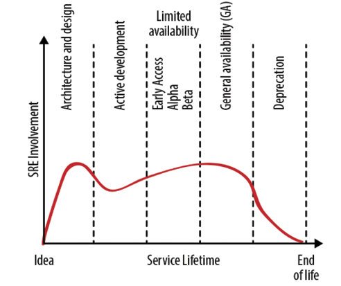
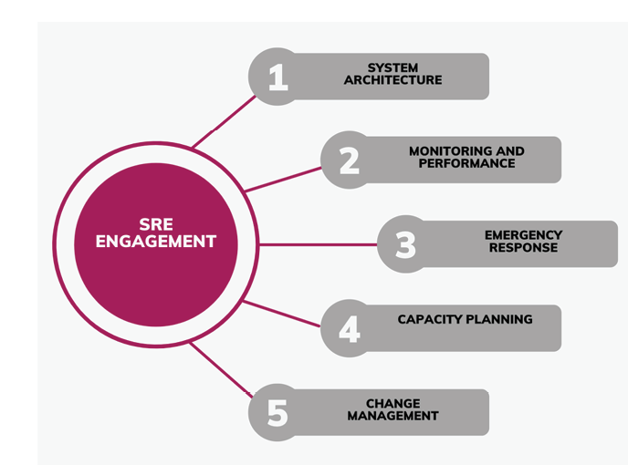
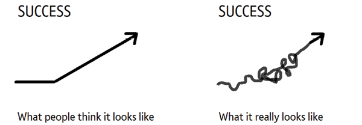

# 2 从 DevOps 到站点可靠性工程

## 引言

过去几年中，IT 世界发生了巨大变化。新的方法和实践被引入，用以提高软件发布的速度和质量。[[DevOps]] 和[[站点可靠性工程]]（Site Reliability Engineering，[[SRE]]）是其中两种备受关注的方法。这两种方法的目标都是帮助组织快速、准确地交付软件，但实现这一目标的路径不同。DevOps 是一套帮助开发团队和管理团队更好协作的实践集，其核心是自动化软件发布管道并促进团队间的协作。而 SRE 则是一个将软件工程概念应用于运维领域，以构建可扩展且可靠的系统的学科。SRE 团队的工作是确保系统可靠、可用且能够增长。

在本章中，我们将考察 DevOps 和 SRE 角色的不同之处，以及它们如何演变以满足高性能 SRE 的需求。我们将讨论 DevOps 团队面临的挑战以及 SRE 角色如何帮助解决其中一些问题。我们还将探讨 SRE 在理念和实践上与 DevOps 的区别，以及让 DevOps 和 SRE 团队协作的利弊。此外，我们还将讨论 SRE 在高性能 SRE 中的角色，以及它如何帮助持续软件发布、事件响应和持续改进。

最终，本章旨在帮助你理解 DevOps 角色以及它如何演变为 SRE 角色。我们将讨论这些团队协作以实现高性能 SRE 的重要性及其对组织的益处。

## 本章结构

在本章中，我们将涵盖以下主题：

- 从 DevOps 到站点可靠性工程
- 站点可靠性工程的需求
- 站点可靠性工程的参与模型
- 站点可靠性工程的策略采纳
- 站点可靠性工程的挑战
- 站点可靠性工程的最佳实践
- 站点可靠性工程的最佳实践工具

## 学习目标

本章将讨论 SRE 团队在构建可靠系统以及通过增强信任和可靠性来扩展业务规模方面的贡献。我们将探讨 SRE 团队如何与拥有应用程序的应用团队协作。虽然 SRE 的参与通常围绕一个或多个服务展开，但其涉及的范围远远超出了它所关注的服务本身。

了解应用的要点后，开发者可以找到支持它们的最佳方式。在本章结束时，读者将能够理解 SRE 在[[软件开发生命周期]]（SDLC）每个阶段的责任。

## 从 DevOps 到站点可靠性工程

DevOps 和 SRE 是两种互补的软件开发和运维方法，旨在提高软件系统的效率、可靠性和整体质量。这两种方法的目标都是弥合开发与运维团队之间的鸿沟，以改善协作和简化流程。我们将在本章后续部分讨论这些区别和常见方法。

DevOps 是一套强调 IT 运维与软件开发人员之间沟通、协作和自动化的实践。它结合了软件开发（Dev）和 IT 运维（Ops），以确保软件更快地交付，缺陷更少，且对故障具有更强的弹性。DevOps 原则强调[[持续集成]]、[[持续交付]]和[[持续部署]]，使团队能够响应不断变化的需求并快速迭代。

SRE 由 Google 首创，是一种将软件工程原则应用于运维领域的方法。SRE 的任务是开发和维护支撑软件应用的基础设施。他们使用自动化、监控和其他工具来确保系统的高可用性、可扩展性和性能。SRE 还负责制定[[服务级别目标]]（Service Level Objectives，[[SLO]]）和[[服务级别指标]]（Service Level Indicators，[[SLI]]），以评估系统的性能和可靠性。

SRE 强调将软件工程原则应用于基础设施管理，而 DevOps 则侧重于开发与运维团队之间的协作。这两种方法高度互补，SRE 通常被视为 DevOps 的延伸，SRE 担任专门的运维工程师，将他们的软件工程知识应用于运维挑战。DevOps 和 SRE 共同努力，有助于开发更可靠、高效和敏捷的软件系统。

建立扎实的计算机科学基础、编程技能、云平台、[[基础设施即代码]]（Infrastructure as Code，[[IaC]]）管理、监控与可观测性、事件管理、CI/CD 管道、Linux/Unix 系统以及 SRE 原则和实践，是成为一名合格 SRE 的关键。

## 站点可靠性工程的需求

在软件行业，停机和服务中断可能带来严重的财务和声誉损失。SRE 正是在这里发挥作用。SRE 团队保证系统和服务的可靠、可扩展和高效，以最大限度地减少停机和中断。SRE 使用软件工程实践来解决运维问题并自动化流程。他们对系统可靠性的主动方法有助于预防和减轻服务中断，从而提升整体客户体验。随着软件系统日益复杂，对 SRE 的需求也在增加，因为他们帮助企业满足客户需求、改善服务交付并实现高性能 SRE。

### 站点可靠性工程团队结构

从本质上讲，SRE 是开发与运维的结合。人们经常混淆 SRE 和 DevOps。虽然两者在理论上有所重叠，但 DevOps 是理论，而 SRE 是实践。

以下是帮助任何企业将站点可靠性工程引入组织的七项指南：

**1. 从小处着手，从内部开始：** 即使不需要专门的部门，你的企业也会从建立 SRE 团队中受益。通过告警生成、事件调查、根因解决和事件事后复盘，站点可靠性管理有助于保持在线服务的可用性和稳定性。

即使是稳定的 IT 公司，偶尔也必须处理一些问题。在过去，当软件或服务出现问题时，运维和开发团队会一起合作寻找解决方案。而在 SRE 策略中，两者合二为一。

从 SRE 开始，你可以组建一个由运维和技术团队人员组成的小团队，让他们负责服务的正常运行时间。

- **寻找合适的候选人：** 当你准备好扩展时，你可能最终需要招聘额外的站点可靠性工程人员。知道你在寻找什么是找到合适 SRE 团队成员的关键。以下是站点可靠性工程师应具备的一些资质：

  - **问题解决和故障排查能力：** SRE 团队主要处理软件事件和问题。通常，这些问题与他们没有开发的系统或程序有关。因此，能够在没有深入系统知识的情况下快速调试是一项基本技能。

  - **自动化天赋：** 劳动力通常是众多技术服务中的主要问题。理想的站点可靠性工程师会寻求自动化繁琐任务的方法，最大限度地减少手工劳动，使开发者能够专注于高优先级问题。

  - **持续学习：** 随着系统的演变，问题也会随之变化。因此，高效的 SRE 必须不断更新他们对不断演变的系统、代码和流程的理解。

  - **团队合作：** 响应事件很少是单打独斗，因此 SRE 必须善于与他人协作。协作和沟通是需要寻找的基本技能。

  - **全局视角：** 在解决问题时，如果深陷其中，很容易被错误的事情所困扰。因此，高效的 SRE 必须能够看到全局，并在更广泛的背景下制定解决方案。一个称职的站点可靠性工程师会找出根本原因并制定全面的解决方案。

- **建立全面的事件管理系统：** 站点可靠性工程中最关键的部分之一是事件管理。根据 Catchpoint 的一项调查，49% 的受访者表示在过去一周左右处理过事件。在处理情况时，必须有一个机制来保持调试和维护流程尽可能高效。

  跟踪值班职责是事件管理系统中最关键的部分之一。如果没有有效的方法来控制值班事件流，SRE 团队的职责可能会变得非常繁重。

**2. 定义你的 SLO：** 通过设定服务级别目标，SRE 团队可以增加成功的机会。SLO 是衡量站点成功的主要指标。SLO 可能根据公司提供的服务性质而变化。[[可用性]]、[[延迟]]和[[吞吐量]]是每个面向用户的服务系统都应使用的三个指标。在基于存储的系统中，延迟、可用性和持久性通常被赋予更高的权重。

  在制定 SLO 时，重要的是确定组织希望在指标方面维护的值。你的 SLO 应该显示系统必须达到的绝对最小值。不要将 SLO 建立在现有性能的基础上（这可能导致无法实现的目标），而应从零开始。尽量减少目标中的绝对数量。保持 SLO 最少，并专注于对组织最重要的指标。

**3. 接受失败是常态：** 大多数人不喜欢失败，但如果你的公司想要维持一个健康和高效的 SRE 团队，每个成员都必须习惯失败是工作的一部分。在任何系统中，完美都是罕见的，尤其是在开发的早期阶段。

  大多数 SRE 团队最初将标准设得太高，错误地制定了不切实际的 SLO 定义和目标。最佳运维策略始终是追求最小可行产品，并随着团队和组织获得信心而逐步扩展标准。

**4. 事件事后复盘/根因分析：** 俗话说，死人不会说话。但对于系统事件而言，情况并非如此。即使问题得到解决，仍然可以从事件中学到很多东西。因此，SRE 团队的最佳实践是进行事件事后复盘，从错误中学习。一个合适的 SRE 策略将包含最佳的复盘流程。

  站点可靠性人员在执行事后分析或[[根因分析]]（Root Cause Analysis，[[RCA]]）时必须评估特定参数。首先，他们应该调查故障的原因和触发因素——是什么导致系统故障？然后，团队应尽可能多地确定后果——系统故障的影响是什么？例如，支付网关问题可能导致已支付或已收款的差异，如果即使几天不解决，也可能令人沮丧。成功的事后复盘还应考虑可能的解决方案和防止类似错误的建议。

**5. 保持事件管理系统简单：** 仅采用 SRE 团队结构不足以保证团队成功，还必须建立项目和事件管理结构。如今，IT 管理软件的服务和用例多种多样，SRE 团队可以使用。团队领导应考虑使用的复杂程度、可用的集成数量、沟通的难度以及团队协作的效率。

### 站点可靠性工程规程

每个 SRE 团队成员都负责系统维护、事件管理、自动化和混沌工程的某些方面。团队成员的行为能提高系统的稳定性和可访问性就是可接受的，而不能直接提高利润的行为则无关紧要。在招聘 SRE 时，某些公司（如 Google）会优先考虑候选人是否适合公司的 SRE 文化，以及他们的特定技能集看起来有多丰富和有用。入职后，SRE 团队的新成员通常会被安排到能最大程度发挥其专业知识的团队。

SRE 必须遵循一套流程和程序，这些流程和程序必须定期检查和更新以确保最佳性能。在首次值班之前，必须完成一系列规程。每种可能收到的告警类型都有其对应的运维手册（runbook），通常也称为行动手册（playbook），其中包含响应的高级指引。

SRE 不仅因其智慧、创造力和能力而受到追捧，还因其对大规模分布式系统的热情和兴趣而受到重视。只要个人渴望学习并进一步发展技能，以下领域的技术专长将对 SRE 团队有所帮助。

在首次值班之前，需要学习和掌握一些事项清单。来自 Google 的 *The Site Reliability Workbook* 包含了以下条目：

- 管理生产任务
- 理解调试信息
- 将流量从集群中引流出去
- 回滚有问题的软件推送
- 拦截或限流不需要的流量
- 启动额外的服务容量
- 使用监控系统（用于告警和仪表板）
- 描述服务的架构、各种组件和依赖关系

### 未言明的承诺

这个角色伴随着某些职责。我们也可以将这些称为未言明的责任。如果一个人愿意提前掌握一些事情，就可以变得非常高效。这些包括：

- **分享业务目标：** 要帮助他人，你必须首先了解他们需要什么。因此，SRE 必须了解产品开发人员希望通过 SRE 参与实现什么目标。SRE 在与开发团队互动之前，应花时间了解产品和公司的目标。SRE 必须解释他们做什么以及他们的参与如何帮助开发者实现目标。

  团队之间应经常讨论业务优先级。在理想情况下，SRE 和开发者领导团队将作为一个整体协作，定期举行会议讨论技术和优先级问题。SRE 高管成为产品开发管理团队不可或缺的成员的情况并不少见。

- **对齐目标：** 开发和运维团队关注功能、发布速度、可扩展性和效率。另一方面，SRE 受到不同激励的驱动，即优先考虑服务的可持续性而非引入新功能。

  我们发现，最高效的开发者和 SRE 团队通过继续在自己的专业领域工作的同时公开支持对方的目标来实现这种平衡。SRE 可以努力确保所有已批准的发布取得成功，同时协助开发团队的发布速度。在这种情况下，"安全"通常意味着保持在错误预算范围内，因此 SRE 可能会说："我们将支持你尽可能快速且安全地发布。" 然后，开发者应承诺将大部分工程时间用于解决和预防损害可靠性的问题，例如纠正现有服务的设计和实现层面的问题、消除技术债务，以及在开发新功能早期就让 SRE 参与，以便他们能在设计讨论中提供意见。

- **识别风险：** 凭借其专业知识，系统可靠性工程团队将能够发现任何潜在威胁。中断正常的开发和功能流程对产品和从事该工作的工程师来说代价高昂。因此，准确了解这些风险的可能性和潜在影响至关重要。

- **准备与行动：** SRE 团队实现目标和产品目标、优化运维以及节省运维成本的能力取决于他们计划和协调行动的能力。我们建议采用两层规划方法：

  - 根据开发者的意见确定产品和服务的优先级，并每年分享你的计划。目标（季度或其他频率）应从路线图中衍生出来，并经常审查以确保一致性以获得最佳结果。

  - **根据错误预算重新评估优先级：** 要有效设定优先级，团队必须掌握制定明确定义的 SLO 的微妙艺术。如果服务有错过 SLO 的风险或已用完所有错误预算，则任一团队可以立即以最高优先级处理该问题。他们可以采取短期措施（如过度配置以解决由峰值流量引起的性能回退）或长期措施（如实施战略性软件补丁/热修复）来处理问题。

  如果某个服务已经在 SLO 范围内良好运行并且有大量剩余错误预算，我们建议将剩余的错误预算用于提高功能发布速度，而不是过度关注服务改进。

## 站点可靠性工程参与模型

Google 的 SRE 团队在解释其 SRE 参与模型方面做得非常出色。假设你处于一个拥有许多处于不同完成阶段的现有服务的环境中，你的 SRE 团队可能会花费大量时间处理一个优先队列中的接入任务，直到团队完成最高价值目标的接入。

在软件工程中，越早发现 Bug，修复速度越快、成本越低。SRE 团队咨询越早进行，服务越好、越快。当 SRE 在设计阶段早期参与时，接入时间会缩短，服务更可靠，这通常是因为我们不必撤销不充分的设计或实现。在本章后面，我们将努力理解在各应用开发阶段让 SRE 团队参与的最有效技术以及如何最好地实施它们。我们将讨论的模型由 Google SRE 团队明确定义，并结构化地呈现在 Google SRE 书籍中。

SRE 和 DevOps 密切相关，它们都朝着相同的目标努力。然而，SRE 对系统有着与传统 DevOps 思维不同的独特视角。

### 站点可靠性工程实施 DevOps

在理解了组织中 SRE 的需求之后，建立最佳的团队结构至关重要。在过去的几年中，根据组织结构的需求，我们已经看到了相当多的结构。在决定团队结构之前，请问：组织中为什么需要 SRE？你对专门资源有什么期望？你试图解决什么问题？

SRE 在服务生命周期中的理想参与程度如图 2.1 所示。然而，SRE 团队可以在任何时候开始参与服务。例如，如果开发团队正在开发一个替代 SRE 支持的服务的方案，那么 SRE 可能会参与新服务的规划阶段。

另一方面，一个服务可能在其向公众开放一段时间后，但现在正遇到可靠性或扩展问题时，才正式引入 SRE 团队。本节提供指导，帮助 SRE 团队在整个过程中有效贡献。下图来自 Google SRE 书籍，请参考以下图示：

**图 2.1：功能生命周期**

**阶段 1：架构与设计规划**

SRE 在软件开发生命周期的架构与设计规划阶段至关重要。SRE 与开发者协作构建可靠和可扩展的系统与应用。他们帮助构建系统架构以管理预期的流量和使用量。SRE 还识别和缓解潜在的故障点，以减少停机和服务中断。这种主动的系统设计和规划减少了软件故障并改善了用户体验。一些主要职责包括：

- SRE 可以影响软件系统的架构和设计
- 创建最佳实践（如单点故障容错），供开发团队在设计新产品时使用
- 记录基础设施系统的注意事项（基于经验），使开发者能够明智地选择、正确使用并避免已知问题
- 提供早期参与咨询，讨论架构和设计选择，并通过有针对性的原型验证假设
- 参与开发团队
- 服务协同设计

在开发后期，架构缺陷更难修复。SRE 早期介入有助于避免系统在与真实用户交互并需要扩展时进行代价高昂的重新设计。

**阶段 2：开发**

在开发阶段，SRE 可能会开始将服务生产化或准备部署，以确保其可以上线。容量规划、冗余资源配置、峰值和过载处理策略、负载均衡实施以及建立长期运维流程（包括监控、告警和性能调优）都是将应用部署到生产环境的常见组成部分。

**阶段 3：有限可用**

随着服务接近 Beta 阶段，用户、用例、使用强度、可用性和性能期望都在上升。SRE 可以在这一级别评估可靠性。我们建议在[[通用可用]]（General Availability，GA）之前创建 SLO，以便服务团队能够客观地监控可靠性。产品团队可以撤回不可靠的产品。在此阶段，SRE 团队可以通过构建容量模型、获取上线资源以及自动化扩容和服务扩展来帮助系统扩容。SRE 可以提供足够的监控覆盖，并创建与 SLO 匹配的告警。服务使用情况仍在演变，因此 SRE 团队可能期望更多的事件响应和运维工作，因为他们了解服务如何运行以及如何管理其故障模式。开发者和 SRE 应在此协作。这样，开发团队和 SRE 都能获得服务经验。运维工作和事件管理将为 GA 前的系统更新提供信息。

**阶段 4：通用可用**

服务已通过生产就绪审查，正在接收所有用户。虽然 SRE 承担大部分运维职责，但开发团队应处理一小部分以避免失去视角。他们可以永久性地将一名开发者纳入值班轮换以监控负载，或让不同的人员轮流值班以提供预期的体验。

随着开发团队专注于成熟服务和引入新功能，还必须监控真实需求下的系统参数。在最后阶段，开发团队在应用上线后添加微小增量功能和修复。

**阶段 5：弃用**

没有什么能永远存在，即使是最好的系统也是如此。当更好的替代方案出现时，当前系统将对新用户关闭，所有工程资源都用于帮助现有客户过渡。虽然开发团队不直接参与日常运维，但 SRE 运行系统并在过渡期间提供运维和开发支持。尽管维护当前系统所需的 SRE 工作量较少，但 SRE 正在支持两个完整的系统。预算和人员配置水平必须进行相应的重新平衡。

**阶段 6：废弃**

一旦服务退役，开发团队通常会恢复提供运维支持。SRE 在尽力而为的基础上支持服务事件，系统在一段时间后退出市场。

**阶段 7：不再支持**

服务器不再接受新连接，因为没有活跃用户。SRE 协助从生产设置和文档中移除对服务的引用。

主要职责如图 2.2 所示：

**图 2.2：SRE 参与模型**

## 站点可靠性工程策略采纳

许多人仅将 SRE 视为问题的解决方案，而不是公司的总体战略。组织必须确定 SRE 如何适合其现有流程和组织结构，然后相应地调整 Google SRE 模型。

让我们看看构成成功策略的一些基础要素：

- **可靠性的成本：** 要开启 SRE 之路，必须接受完全可靠是幻想，服务中断是不可避免的。SRE 的理念是为不可避免的系统故障做好准备，同时牢记这些故障不必产生严重后果。构建具有快速可靠故障恢复能力的容错系统是可能的。激活 SRE 后，管理公司技术的成本将会上升。即便如此，你可以放心，你的软件将在所有网络、基础设施或 API 故障的情况下继续正常运行，从而降低重大崩溃的可能性。

- **争取公司支持：** 采用 SRE 策略对任何公司来说都是关键的第一步。可能需要对企业进行各种内部调整才能成功实施 SRE 策略。这就是为什么赢得整个公司利益相关者的支持至关重要，以帮助你建立适当的结构并投入适当的资源。

  由于系统可观测性在 SRE 范式中的重要性，当你为团队提供全面的审计日志和跟踪时，你会发现他们更有责任感。可观测数据对于发现网络安全问题和提高软件效率至关重要。

- **服务级别协议：** 获得公司认可后，决定要跟踪的 KPI 和可接受的故障率。[[服务级别]]是一种度量，[[SLI]] 捕获服务级别的值范围。[[SLO]] 捕获这些服务级别的目标值。

- **做好文档：** 当然，可观测性和自动化很有帮助，但这还不够。最终，需要人工来检查代码中的 Bug。对于 SRE 代码库，也需要人来负责维护。因此，在 SRE 的文档上投入资金是有帮助的，包括入职文档、技术栈、架构、流程图等。此外，记录常见故障情况下该怎么做将是一个巨大的帮助。

  除了技术文档外，组织还应有透明的文档，概述每个职能的职责和权限，以及网络安全、合规和审计等主题的流程。在某些情况下，一个小时的停机时间和几分钟的差异可以归因于文档的质量。然而，尽一切努力减少停机时间是至关重要的。

- **逐步增强可靠性：** 快速引入一套新工具和流程不会带来可靠的系统。相反，它应该是一个经过深思熟虑的、增量式的过程，在迭代中逐步推进。在为应用建立可观测性后，让自动化发挥作用，这样你就可以将注意力转移到改进和新项目上。永远不要将服务和值班时间与正常工作混为一谈。当 SRE 流程成熟后，就可以开始整合服务并寻找将 SRE 投入使用的新方法。

- **自动化至关重要：** 自动化驱动 SRE，使工程师能够专注于主观和创造性的问题解决，而工具则观察应用以帮助他们更好地完成工作。自动化至关重要，但你还需要公司的认可。自动化可以显著提高性能和降低成本；如果配置得当，人无法像服务器那样扩展。

- **评估你的 SRE 成熟度：** 最后，在制定了 SRE 策略之后，必须监控实施进度并定期评估进展。SRE 的成功需要时间才能到来。你不应该试图立即实现五个九的可用性和可靠性；相反，应该以增量方式构建 SRE 体系，考虑不断变化的业务需求、技术栈、更好的支持文档以及对最终用户体验的更深入了解。

## 站点可靠性工程的挑战

SRE 应对这些挑战的一种方式是实施 DevOps 原则和实践。DevOps 强调开发和运维团队之间的协作和沟通，SRE 在这种协作中扮演着关键角色。通过与开发团队紧密合作，确保代码在开发时就考虑到可靠性和可扩展性，SRE 帮助弥合了开发与运维之间的鸿沟。此外，SRE 帮助开发和实施自动化测试和部署流程，这些是 DevOps 的关键组成部分。通过利用 DevOps 原则和实践，SRE 可以提高系统可靠性和效率，同时确保新功能和更新快速交付且影响最小。一些挑战列举如下：

- **缺乏足够合格的 SRE 工程师：** 你已经组建了一个致力于实施 SRE 并共享其价值的核心团队。这个团队可能由工程、运维或 DevOps 团队成员组成，甚至可能是一个完整的 SRE 团队。这是一个很好的开始，但你需要警惕未能从其他团队获得足够的支持。我们已经看到一些公司只为整个组织分配了一两名 SRE 工程师，这已被证明是不够的。SRE 的成功需要运维、工程和产品的支持。在处理高严重性的生产问题时，让开发团队、一线联系人和合适的 SRE 参与进来非常重要。SRE 人才的短缺可能导致更高的成本、更长的系统更新和变更周期，以及系统可靠性和性能的下降。因此，组织必须专注于培训和培养现有员工，以及与学术机构合作，培养下一代 SRE 人才。

- **RCA 无人跟进：** 你的组织纪律严明，每次事件后都会进行事后复盘。由于准备 RCA 报告非常耗时，许多团队未能做到这一点。如果你的团队无法编写带有时间戳和关键事件的详尽事后复盘，你可能需要自动化这个流程。假设你已经避免了这个问题，下一个关键问题是编写了事后复盘但没有后续审查。如果问题在第一次出现时没有得到处理，事件可能会重复发生。此外，所学经验的深度和每次回顾的内容也不一致且不充分。

  通常，一次事件至少会改变响应团队的一个观点。通常，这些障碍源于 RCA 的非结构化性质。这个 RCA 之后可以被检查。一些常用的问题包括：停机持续了多长时间？有多少客户受到影响？我们的哪些监控工具检测到了这个问题？我们的自动化测试是否检测到了这个问题？灾难恢复方案花了多长时间生效？这影响到带有行动项的事后复盘，从而实现最佳优先级划分和有意义的讨论。

- **SLO 不是奖金：** 尽管 SRE 取得了初步成功，但团队经常陷入下一个陷阱。通过实施 SRE 的基础，你可以更好地响应事件并使用调查报告从中学习。然而，如果 SLO 被视为事后考虑而不是学科的基础，SRE 的进展将停滞不前。尽管 SLO 受到的批评比 SLA 少，但如果 SLO 过于笼统、难以实施或无法衡量，则可能导致问题。让你的工程师感到困惑的 SLO 很容易理解。与 SLA 一样，SLO 应始终考虑客户端延迟等问题；只有最重要的指标才应考虑用于 SLO 状态，并且目标应以清晰的语言陈述。

- **复杂流程：** 复杂的流程需要更长的时间来响应事件。如果你的事件响应流程引用了大量文档和行动手册，那就太繁琐了。研究（如多页 Confluence）已经表明，当人们处于压力下时，他们应该做最简单的任务。大问题也是如此。在压力下，即使是最编写得最好的流程文档也难以遵循。然而，对于复杂的任务和团队活动，仅仅一个检查清单是不够的。在最成功的 SRE 实施中，检查清单被使用，但会根据每个角色进行调整。最好的系统知道如何在保持任务尽可能小的同时，在正确的时间显示正确的信息和详细程度。从整体上看系统时，检查清单上的每个项目都可以衡量其效果，以便将来改进。

**图 2.3：通往最终成功的实际路径**

组建一个新的 SRE 团队并确保组织拥有正确的标准和目标是很困难的。到达你想要的位置需要付出很多努力。图 2.3 展示了人们对软件发布的看法与实际情况的对比。

## 站点可靠性工程的最佳实践

站点可靠性工程的最佳实践如下：

- 展示积极参与并为服务开发的整体进展做出贡献，从概念和设计阶段开始，一直延伸到实施、运营和持续改进
- 在服务上线前提供帮助和支持，包括系统设计咨询、软件框架和平台的开发、容量规划的执行以及全面的上线评估
- 通过定期监控和评估可用性、延迟和整体状况，确保运维服务的持续支持
- 通过实施自动化和引入提高速度和可靠性的变革性举措，实现可持续的系统扩展
- 执行可持续的事件响应协议，并进行公正的事后复盘调查，目的是汲取经验教训并改进未来流程

## 站点可靠性工程的最佳实践工具

SRE 在任何时候使用的工具将取决于组织在 SRE 旅程中所处的阶段；因此，在开发 SRE 工具链时，选择正确的工具非常重要。与更成熟的企业相比，刚踏上 SRE 之路的组织更可能使用专门的运维工具。尽管如此，SRE 团队会尝试新事物并修改现有技术，因为他们寻求更好、更高效的方法来提高整体可靠性。这些工具说明如下：

**源代码控制工具**

- **Git：** Git 是一个免费开源的分布式版本管理系统，被广泛使用。各种规模的组织通常采用 Git 来保持源代码的最新状态，并将其存储在 GitHub 上。
- **Bitbucket：** Bitbucket 是一个基于 Web 的版本控制仓库托管服务，由 Atlassian 拥有，主要用于源代码和开发项目。它提供 Git 仓库，并为团队提供了一个协作、管理和跟踪代码库的平台。Bitbucket 具有拉取请求、分支权限和内联评论等功能，实现无缝的代码审查和协作。与 Jira、Trello 和 Bamboo 等流行工具的集成简化了工作流程，而其内置的 CI/CD 功能有助于自动化部署过程。Bitbucket 适用于各种规模的团队，提供基于云和自托管两种解决方案。

**CI/CD 工具**

Jenkins、CircleCI、GoCD、GitLab CI、Bamboo、Semaphore、Codeship

**数据存储工具**

MySQL、PostgreSQL、MongoDB、Apache Hive、Apache Hadoop、Solr、Firebird、Apache Cassandra、Redis

**配置管理工具**

Ansible、Chef、Puppet、Terraform、Saltstack

**编排工具**

Docker、Kubernetes、Swarm、Podman、Apache Mesos

**日志聚合工具**

Splunk、Fluentd、Sentry、Graylog、Logstash、ELK（Elasticsearch、Logstash、Kibana）

**监控与可观测性工具**

Datadog、Prometheus、Splunk Dashboard、InfluxDB、Sensu Go

**应用性能监控工具**

Dynatrace、New Relic、AppDynamics、Stackify

**仪表板工具**

Power BI、Grafana、Metabase、Redash、Stashboard

**事件管理工具**

PagerDuty、xMatters、Opsgenie、Squadcast

## 结论

从 DevOps 到 SRE 的转变代表了软件开发和基础设施管理的一个演进阶段。本章展示了 SRE 如何在 DevOps 核心原则的基础上构建，强调协作、自动化和持续改进，同时提供更专注、可衡量的方法来交付可靠的高性能系统。通过使用 SRE 的核心原则，组织可以受益于开发与运维团队之间改善的沟通和协作、简化的流程，以及更高效地识别和解决问题的能力。错误预算和 SLO 使团队能够平衡风险、可靠性和创新，从而产生更具弹性和可持续的系统。此外，SRE 对自动化和监控的投入培养了一种数据驱动决策和持续学习的文化。

在组织从 DevOps 到 SRE 的演进过程中，需要记住的是，SRE 不是一种一刀切的解决方案。相反，它应被视为一个灵活的框架，可以根据每个组织的特定需求和要求进行量身定制。通过拥抱 SRE 的核心原则并采用协作文化，组织可以为未来铺平道路——提高系统可靠性、改善客户体验，并最终实现更大的业务成功。

总的来说，从 DevOps 到 SRE 的转变代表着在追求工程卓越方面迈出的重要一步，为团队提供了在当今快速发展的技术环境中蓬勃发展所需的工具和方法论。

在下一章中，读者将了解监控在维护高可靠性和高性能系统中的重要性概述。该章将介绍关键概念，如指标收集、可视化和告警。它还将讨论各种监控工具、技术以及建立有效监控策略的最佳实践。通过理解这些概念，读者将能更好地实施能够主动发现和解决基础设施问题的稳健监控解决方案。

## 选择题

1. SRE 如何扩展 DevOps 的原则？
   a. 专注于软件开发
   b. 强调运维中的自动化和可靠性
   c. 消除对运维团队的需求
   d. 将新功能开发置于系统稳定性之上

2. DevOps 和 SRE 之间共同的概念是什么？
   a. 手动系统监控
   b. 孤立的团队结构
   c. 持续集成和持续部署
   d. 避免自动化

3. SRE 与传统 DevOps 实践的区别是什么？
   a. SRE 忽视监控和日志记录的重要性
   b. SRE 更加强调 SLO 和错误预算
   c. SRE 不涉及软件工程师参与运维任务
   d. SRE 仅关注软件开发，而非运维效率

4. 以下哪项是与 DevOps 原则一致的 SRE 关键职责？
   a. 仅在问题出现时修复生产问题
   b. 增强系统的可扩展性和可靠性
   c. 与软件开发团队的其他成员隔离工作
   d. 仅关注成本削减策略

5. 在从 DevOps 过渡到 SRE 的过程中，自动化扮演什么角色？
   a. 不鼓励自动化，因为它可能引入新的复杂性
   b. 对两种实践都至关重要，但在 SRE 中更强调可靠性和效率
   c. 仅与 DevOps 相关，不是 SRE 的一部分
   d. 仅用于软件部署，不用于系统运维

**答案**
1. b 2. c 3. b 4. b 5. b
