# 3 监控

## 引言

在技术世界不断演变的今天，系统日益复杂，用户期望不断提高，有效的监控已成为[[站点可靠性工程]]（Site Reliability Engineering，SRE）不可或缺的组成部分。本章将帮助你理解监控在构建和维护高弹性、高性能系统中的重要性。监控是对系统性能、可靠性和安全性各方面进行实时系统性观察和度量的实践。它使 SRE 能够快速识别问题、诊断根本原因，并采取纠正措施，确保系统达到或超过其[[服务级别目标]]（SLO）。在本章中，我们将探讨监控的核心原则、实施的最佳实践，以及如何利用监控工具和技术为你所用。通过理论概念与实际案例的结合，你将理解监控的关键方面，如数据收集、可视化和告警。我们还将讨论监控在事件管理、容量规划和事后复盘中的关键作用。

## 本章结构

在本章中，我们将讨论以下主题：

- 监控的需求
- 监控的四大支柱
  - 延迟
  - 流量
  - 错误
  - 饱和度
- 阈值监控
- 监控与可观测性
- 应用监控
- 监控最佳实践

## 学习目标

学习本章后，读者应能理解 SRE 工程师对可观测性的核心重要性。可观测性是 SRE 角色职责的关键方面之一。从可观测性的含义开始，到以正确方式实施可观测性后业务可以取得的成果。监控是 SRE 的关键组成部分，使团队能够快速主动地识别、诊断和解决问题，确保软件系统的可靠性和可用性。通过本章的学习，你将掌握必要的知识，能够为你的系统设计和实施有效的监控策略，从而提高可靠性、减少停机时间并改善用户体验。

## 监控的需求

软件行业正在呈指数级增长，行业间的竞争也在加剧。科技公司正竞相参与这场竞赛，以拥有最佳的基础设施和平台来维持业务运行，并尽可能降低应用故障的风险。现代应用的需求与十多年前大不相同。系统是分布式的，远比以往复杂，包含多个服务和组件。要保持应用正常运行，每个服务的健康都至关重要。所有服务的健康状况共同决定了应用的最终健康结果，直接影响客户满意度和公司收入。

**更高的复杂度 = 更多的故障空间**

现代 IT 基础设施由于涉及多种且广泛连接的技术而非常复杂。复杂度确实为故障提供了更多空间。每天我们都在探索新技术，并将其添加到已有架构中，这同样为宕机创造了空间。可以说，如果我们管理不善，可以预见到动荡。根据 Splunk 分享的一份调查报告，我们看到 2017 年至 2022 年间宕机事件有所增加，这直接或间接导致了重大的财务损失、声誉损害和合规违规。

近期的一些相关案例包括 Google 宕机和 Atlassian 宕机。我们将在本章后面将这些宕机作为案例进行讨论。

在下图中，你将看到任何基本计算系统的主要组件，以及它们在告警状态下的表现。请参考下图：

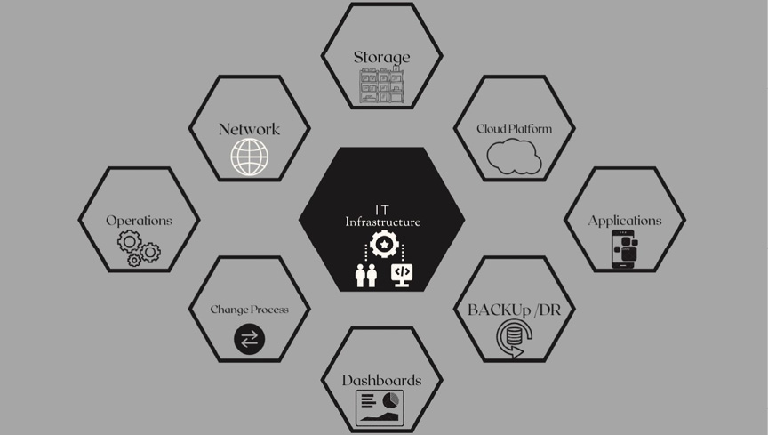
**图 3.1：IT 基础设施**

假设你是一个应用的所有者，收到了一条告警，提示你遇到了延迟问题。你的应用对业务至关重要，因此你需要快速找到根本原因。然而，由于你身处复杂的微服务拓扑中，很难确定根本原因来自何处。更复杂的是，你所有的依赖可能基于不同的技术。比如，一个服务构建在 Node.js 上，一个是数据库，另一个是用 Java 编写的，等等。请参考下图：

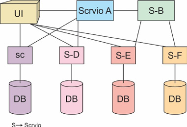
**图 3.2：示例服务概览**

现在，所有这些技术都有各自通常需要监控的不同指标，你可能并非这些不同技术的专家，因此你可能很难找出问题所在。所以，你需要为每种技术请一位专家。可以想象，让每个人逐个检查他们的服务、判断是否存在问题、或者是否需要继续向下游排查，这是非常耗时的。而在此期间，你的用户仍然在经历延迟问题。我们需要一种更好的方法来解决这个问题。SRE 学科告诉我们，只需要监控四个关键性能指标，而不是每种技术的所有不同指标。

我们将这些性能指标称为**黄金信号**（Golden Signals）。它们分别是：

- 延迟（Latency）
- 流量（Traffic）
- 错误（Error）
- 饱和度（Saturation）

黄金信号描述了延迟（即我们的利用率与最大容量的对比）和饱和度（即请求错误率、流量以及服务请求所花费的时间）。

现在，回到我们最初的例子，看看如何应用黄金信号。在服务 A 中，我们知道遇到了延迟问题。我们知道延迟本质上是一个症状，如果我们检查服务本身，不会看到任何原因。我们知道需要继续向下游查找；但是我们不想回到复杂的微服务拓扑中去逐一排查。一些 APM 工具可以通过仅识别与问题服务相隔一跳的服务来帮助我们。假设服务 B、C 和 D 连接到服务 A（存在问题的那个）。无论这些服务基于什么技术构建，我们只需要查看黄金信号。依次追踪所有服务，我们先检查服务 B 的黄金信号（延迟），但没有发现问题。这让我们不必在服务 B 上花费更多时间。下一个直接连接到服务 A 的是服务 C。检查黄金信号后，服务 C 也没有发现问题。接下来是服务 D，我们追踪了所有黄金信号，发现服务 D 的饱和度呈上升趋势。请参考下图：

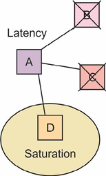
**图 3.3：错误追踪**

在这里，仅仅几分钟后，我们就确定服务 D 很可能是根本原因。现在，不需要让每个服务的专家都参与进来，我们可以直接找到服务 D，让专家知道我们已识别的根本原因，以便他们修复。这也为整个问题和解决方案提供了另一个视角。如果上述服务是为可调试性而设计的——这意味着每一行代码在执行时都有注册记录，那么它就是完全可调试的。将来如果出现任何问题，你可以直接找到那一行并检查问题。这也使得追踪系统的瓶颈变得更加容易。当我们检查服务 B，确认所有日志都存在且没有发现任何异常、超时信息和错误时，我们就完全确定服务 B 运行正常。服务 C 也是如此。我们将在本章后面讨论日志发送的问题。现在，让我们回到监控话题。

根据上述用例，使用监控的理由包括：

- 缩短问题解决时间
- 更好的业务规划
- 容量规划
- 改进的性能指标

### 监控什么

IT 基础设施监控涉及跟踪与支持应用或服务的底层硬件、软件和网络组件性能、可用性和可靠性相关的各种指标。以下是 SRE 团队在 IT 基础设施中通常监控的一些关键领域：

- **健康状态**（设备在线/离线）
- **性能**（RAM 和 CPU 利用率）
- **容量**（监控资源使用情况）

监控一直是通往可靠系统的途径。不了解系统的健康状况，就无法提高其可靠性。系统会产生大量数据，但我们需要理解哪些数据是相关的，以及应该采取什么行动。你可能遇到的一些用例示例包括：

- 系统是否对命令有响应？
- 系统是否没有意外和异常行为？
- 响应时间是否在正常范围内且没有延迟？
- 系统能否在高峰时段承受压力？
- 如果某个服务发生故障，系统能否自愈？

## 监控的四大支柱

监控的四大支柱是一个框架，帮助企业谨慎跟踪和评估其基础设施、应用和系统的各种要素。虽然没有一套被普遍认可的四大支柱，但一个常用的框架包括以下支柱：

- **指标（Metrics）**：指标是监控系统或应用功能、维护状态和行为的定量度量。它们揭示了关键性能指标（KPI），如资源使用情况、延迟、吞吐量、错误率等。指标经常被收集，可用于实时监控、历史分析和预测。

- **日志（Logs）**：日志是系统、程序和基础设施元素执行的操作、通信或交易的记录。它们提供有关组件内部工作和交互的深度、带时间戳的信息，对于调试、识别问题和理解问题的根本原因不可或缺。日志可以存储和分析，以协助故障排查、合规和安全。

- **追踪（Traces）**：追踪提供了每个请求或事务在分布式系统中移动的完整图景。它们让组织全面了解请求是如何跨不同服务、组件或节点处理的，从而能够发现瓶颈、延迟问题和其他与性能相关的问题。在当代微服务架构中，请求通常跨越多个服务，追踪尤其重要。

- **事件（Events）**：事件是系统中值得跟踪的显著事件或变更。它们可能由多种因素产生，包括用户操作、系统状态变更或告警。事件帮助组织更好地理解其应用和系统的状态，识别趋势并处理事件。

这四大支柱提供了一种全面的监控策略，使企业能够定位和修复问题、提升性能，并保证其系统和应用的可靠性和安全性。组织通过从这四方面收集数据，可以获得其基础设施的全面图景，并做出明智决策以提升性能。

根据公司提供的服务和应用的差异（无论是电商商店还是金融科技服务），我们用于了解服务健康状况的指标会有所不同。我们需要检查并关注与客户相关的指标。

黄金信号应适用于所有类型公司的日志监控，例如电商、教育科技、金融科技等。这四种黄金信号不仅是相关的度量指标，而且在资源异常或需要回溯问题时，正是我们需要开始寻找的方向。

正如 Google 所述，还有两个与黄金信号密切相关的支持性指标：

- **RED 方法**：速率（Rate）、错误（Errors）、持续时间（Duration）——性能监控
- **USE 方法**：利用率（Utilization）、饱和度（Saturation）、错误（Errors）——服务监控

让我们详细了解这些指标以及它们与黄金信号的关联。

### 延迟

延迟是处理一个请求所花费的时间。你需要为合理的延迟率定义一个阈值。选择的目标阈值可能因应用类型而异。接下来，我们必须监控成功请求相关的延迟，并与失败请求的延迟进行对比。失败请求的延迟率总是低于成功请求，因为失败的请求通常快速失败，无需额外处理。按前一节和图 2.3 中定义的方式逐个追踪整个网络的延迟，有助于识别哪些服务没有阻碍性能或拖慢流程。一旦找到受影响的微服务，我们就有了下一步的重点区域。

### 流量

流量是流经网络的请求数量的度量。这些可以是 Web 服务器上的 HTTP 请求，也可以是使用 Kafka 或消息队列发送到消息队列的消息。流量会随时间、季节和各种其他因素而变化。为了详细说明，我们以 Flipkart（在线电商商店）的 Big Billion Sale 为例。在这些日子里，公司预计服务器将承受更大的压力，可能需要扩容服务器。我们将在后续章节讨论服务器的自动扩容以及它们如何通过监控来帮助避免宕机。

### 错误

错误表示请求失败或返回不正确结果的比率。这是请求失败的比率，也反映了应用的真实健康状况。借助正确的监控器，可以在系统级别或微服务级别识别错误率。错误率的飙升可能表明数据库或网络发生故障。

错误也可能表明代码中存在的 Bug——它们以某种方式逃过了测试，或仅在生产环境中暴露出来——进而影响其他度量指标，如降低延迟或增加饱和度。

### 饱和度

饱和度定义了网络和服务器资源上的负载。每种资源都有一个极限，超过该极限性能将下降或变得不可用。它定义了你的服务有多繁忙。这适用于内存使用、CPU 利用率、磁盘容量和每秒操作数。其结果是，用户对你服务可靠性的信任会下降。

通过监控分析应用后，我们可以获得正确的指标，并在性能下降之前调整容量。

一些示例如下：

- 服务的繁忙程度
- 数据库和流式应用的磁盘 I/O 速率

> [!NOTE]
> 许多系统在达到 100% 利用率之前性能就会下降，因此设定利用率目标至关重要。建议根据系统利用率设置告警，并针对你的用例定义阈值。

## 阈值监控

阈值监控是一种跟踪系统和应用的方法，其中为某些性能指标设定限制或阈值。当这些限制被突破时，告警或通知会发送给相应的人员，告知他们可能存在的问题。这使他们能够找出问题并修复它，以保持系统的稳定和良好运行。

阈值监控在 SRE 中尤其有用，其目标是使系统或服务保持所需的可靠性和性能水平。在 SRE 中，阈值监控的一些示例如下：

- **错误率阈值**：在 SRE 中，可以使用 SLO 来确定可接受的错误率。如果错误率超过此预定阈值，可能意味着存在需要调查的问题。可以触发告警，让 SRE 团队知道问题所在，以便他们修复并防止服务质量下降。

- **延迟阈值**：你可以根据期望的服务响应速度来设置延迟阈值。如果平均响应时间或百分位（如第 95 或第 99 百分位）延迟超过此阈值，可以发送告警。然后 SRE 团队可以找出延迟增加的原因，并采取措施改善性能。

- **CPU 使用率阈值**：可以通过设置阈值来限制服务或服务器的 CPU 使用率。如果 CPU 使用率超过此限制，可能意味着资源不足、应用运行不佳或可能存在瓶颈。告警通知 SRE 团队调查情况，优化应用运行或增加更多资源。

- **饱和度阈值**：你可以为资源（如内存、磁盘空间或网络带宽）的使用程度设置饱和度阈值。如果这些资源中的任何一个超过预定阈值，可能意味着服务性能可能下降或停止工作。告警通知 SRE 团队调查并解决问题，可能通过释放资源或扩容基础设施来实现。

## 监控与可观测性

根据麦肯锡的报告，十二月是零售商一年中最繁忙的月份，节假日期间人们蜂拥而至。为了说明这一点，我们可以考虑圣诞节、新年以及更多地域性的节庆日。根据麦肯锡 2021 年的报告，人们在节假日期间的购买意愿比 2020 年高 7%，比 2019 年高 9%。那么回到业务层面，我们如何让客户获得高质量的购物体验，并确保系统不会崩溃？因为一旦崩溃，将导致收入损失、品牌形象受损和 SEO 排名下降。我们将通过几个每个 SRE 工程师在其职业生涯中都必须遇到过的例子，来解释业务收入与系统技术方面的联系。

假设有 2 台服务器，每台 8 GB RAM，两台的使用率都是 55%，分别是服务器 A 和服务器 B。其中服务器 A 是主服务器，服务器 B 是备份服务器，这也意味着流量目前由服务器 A 处理。请参考下图：

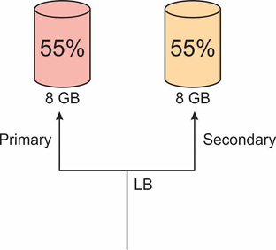
**图 3.4：负载均衡**

让我们分析一下：服务器 A 运行良好，还有一半的空间可用；服务器 B 也有充足的空间。所以，如果发生什么事，它们有足够的空间来处理灾难。现在，假设服务器 A 发生故障，我们的灾难恢复被激活，服务器 B 成为新的主服务器。服务器 A 必须将其 55%（4.4 GB）的负载转移给服务器 B，但服务器 B 已经使用了 55% 的空间。简单计算一下，4.4 GB + 4.4 GB > 8 GB。通过这个简单的观察，我们可以说问题描述中的系统并不可靠，只是在等待故障发生。请参考下图：

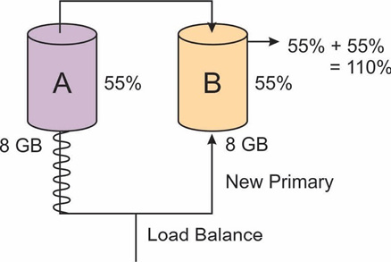
**图 3.5：负载均衡 2**

让我们考虑另一个场景来简化这个概念。假设有三台服务器，每台当前承载 60% 的负载。请参考下图：

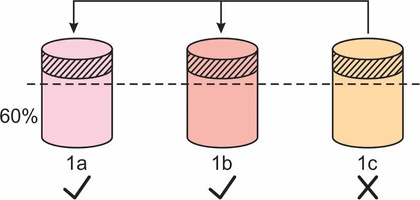
**图 3.6：服务器崩溃排查**

所有三台服务器都在处理流量，突然服务器 C 崩溃，我们需要服务器 A 和服务器 B 平稳接管负载，且没有报告故障。对于服务器 A、B 和 C，我们知道 60 < 100。

现在，服务器 C 崩溃了，我们需要看看如果将服务器 C 的负载平均分配给服务器 A 和 B，它们是否能够管理：

服务器 A = (60 + 30) < 100  服务器 B = (60 + 30) < 100

每台服务器的负载仍将小于 100，我们可以得出结论，需要恐慌的临界点大约在初始负载的 60% 到 66% 之间。如果初始负载超过 66%，那么就有问题了，系统将不再被认为是可靠的。这是一个非常小的例子，说明在设计复杂系统时所需的基本可观测性。在讨论完监控之后，我们将回到可观测性，并在两者之间建立联系。

前面我们讨论了监控的核心含义、为什么需要监控以及不同的监控方法。在这里，我们将讨论监控与可观测性的不同之处。我们经常听到 SRE 是 DevOps 2.0，可观测性是监控 2.0，但我觉得事实并非如此，相反可观测性是监控的超集。我想带你回到最初，再次从问题开始：我们对监控的理解是什么？目前市场上有多种工具，如 Prometheus 用于监控，Datadog 用于监控，但在这里，我们需要理解它们具体监控什么、如何监控以及背后的一切流程。我们将在本章后面讨论这些工具，以及我们可以通过这些工具进行的仪表板操作和数据钻取。现在，让我们关注监控的核心概念。我们正在监控一个系统，我们知道某个特定场景会在 6:00 发生故障。有些条件是我们已知的，我们不希望系统达到饱和状态以防止任何故障。但是那些未知的故障呢？我们没有阈值、没有 X 百分比，我们目前不知道那些未知的东西。我们需要找出这些未知数。这就是可观测性的用武之地。只有对系统进行清晰的观察，我们才能设置相关的监控和告警。你一定听说过银行系统声称他们的系统不是 100% 可用，而是 99.9999%。这意味着我们仍然给系统留出了在那 0.001% 的时间里发生未知故障的机会。这个缓冲区间是必要的，以便改进随时可能发生的未知故障。最好的解决方案是适当的测试以及相关的监控和告警。

> 可观测性是在寻找未知的未知（unknown unknowns）——Chaos Genius

监控侧重于一组预定义的系统健康指标及其随时间的变化。日志提供单独的数据，但通常是孤立查看的。监控帮助人们理解**什么**在变化。当系统的故障点被充分理解且未知数较少时，这种方法很有帮助。

**可观测性**是通过分析系统生成的数据（如日志、指标和追踪）来理解系统内部状态的能力。可观测性将监控提升到了下一个层次，不仅突出了**什么**在变化，还分析了相关的数据集，以回答**为什么**某些指标会变化，并识别根本原因。可观测性在分布式系统中变得尤为重要，因为分布式系统中可能存在许多故障，且无法预先预见所有的故障点。请参考下图：

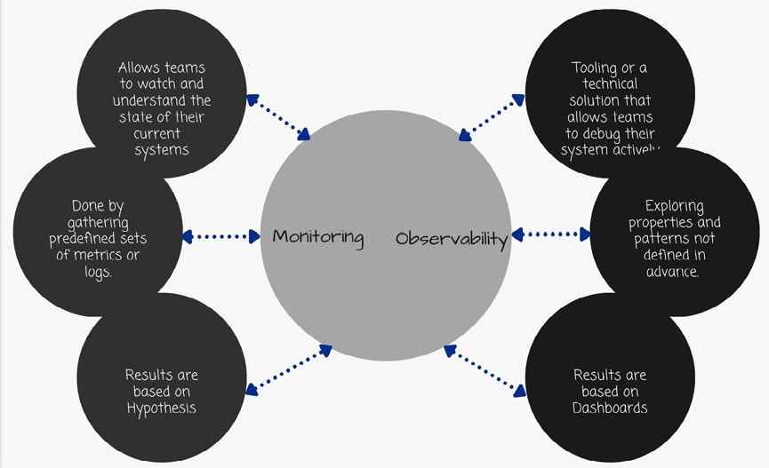
**图 3.7：监控与可观测性**

让我们将监控和可观测性的过程分解为具体流程，看看它们各自如何被预测。既然我们现在知道监控是可观测性的子集，系统的可观测性就是通过可观测性的传统三大支柱来观察系统性能和基础设施：日志、指标和追踪。

- **日志（Logs）**：日志条目包括应用针对代码中发生的某些事件所发出的结构化和非结构化数据。日志是对指标的补充，因为它们提供了捕获指标时应用事件的上下文。记录什么日志完全取决于应用团队。有些应用由于存在信息性日志，在出现问题时被认为是高度可调试的。

- **指标（Metrics）**：指标是一组通常随时间捕获的测量值，用于指示系统的健康状况。指标包含一组属性（例如名称、值、标签和时间戳），传递有关系统状态的信息。指标支持更轻松的查询和更长的数据保留时间。最常见的基础设施指标包括延迟、流量、查询时间、错误、利用率等。

- **追踪（Traces）**：追踪帮助你理解请求在分布式系统中经过多个节点的整个生命周期。通过正确使用追踪，可以极大地帮助发现系统中的瓶颈，并理解哪个服务正在拖累系统的整体性能。我们在图 3.3 中看到了一个例子，并追踪出应用 D 是系统中的故障点，这让我们立即知道有问题的服务是服务 D，其余服务运行正常。

可观测性的领域非常丰富且信息量大，详见 Gartner 2022 年 6 月发布的可观测性报告。请参考下图：

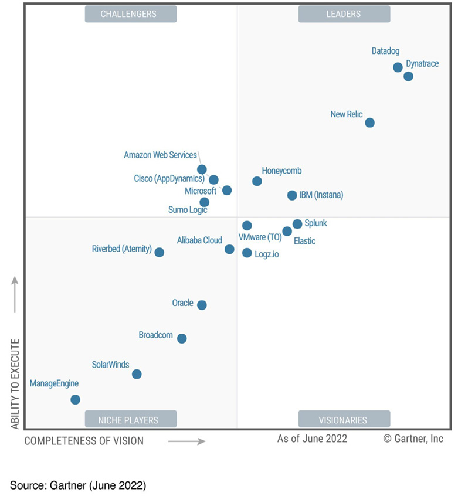
**图 3.8：应用监控与可观测性的魔力象限**

为了更好地理解这些术语：

- **利基玩家（Niche Players）**：在某个小细分市场或行业细分领域相对成功，但不创新或超越其他厂商。
- **远见者（Visionaries）**：理解市场发展方向，或有远见改变市场规则。
- **挑战者（Challengers）**：当前执行得相对较好，或主导着一个大的细分市场，但没有与 Gartner 对市场演变的看法一致的路线图。
- **领导者（Leaders）**：当前执行得相对较好，且为未来做好了充分准备。

> [!NOTE]
> 这里没有推广任何工具；结果严格基于国际公认的 Gartner 报告。

## 应用监控

SRE 在应用监控中发挥着重要作用，因为这与其确保数字服务和应用可靠性和可用性的核心职责相一致。以下是他们在应用监控中参与的最重要组成部分：

- **设计监控系统**：SRE 负责创建和执行监控系统和应用策略。他们指定必须监控程序的哪些特性，如性能指标、错误率和延迟。他们确保监控是全面的，并与 SLO 保持一致。

- **实施监控工具**：SRE 识别并部署相关的监控工具和框架。这些工具被配置为从各种来源收集和分析数据，包括服务器、容器、数据库、网络设备和应用日志。

- **设置告警阈值**：基于 SLO 和错误预算，SRE 设置告警阈值。他们指定何时应触发告警，并确保告警有用、可操作且无误报。

- **实时监控**：SRE 持续实时监控应用的健康和性能。他们关注偏离正常行为的偏差，并快速响应异常或事件。此方法通常包括自动告警和值班轮换。

- **事件响应**：当通过监控检测到问题时，SRE 负责事件响应。他们调查事件的根本原因，减轻服务中断，并努力防止将来发生类似问题。

- **容量规划**：SRE 使用监控数据进行容量规划。他们分析趋势和使用模式，确保资源适当扩展以满足需求，而不过度配置。

- **性能优化**：监控帮助 SRE 识别应用中的性能瓶颈和低效问题。他们利用这些信息优化代码、配置和基础设施，以提升应用性能。

- **安全监控**：SRE 在安全监控中也发挥作用，确保应用免受安全威胁。他们监控未经授权的访问、漏洞和可疑活动，并响应安全事件。

- **文档与报告**：SRE 保留监控安装、配置和流程的记录。他们生成报告和仪表板，以提供应用健康状况和可靠性的洞察，并使这些信息对团队其他成员可用。

- **持续改进**：SRE 通过分析监控数据来识别可以提升可靠性的领域，推动持续改进的文化。他们利用事后审查和回顾总结从过往事件中学习，并完善监控策略。

## 监控最佳实践

日志记录和监控的概念并不新鲜，但组织仍然发现制定和实施面向安全的日志记录和监控策略很困难。主动收集和分析信息的方法可以帮助多个利益相关者（如开发人员、系统管理员）在很多方面受益，例如通过应用级日志记录检测代码中的问题，通过基础设施日志（如 AWS/Azure）识别网络流量异常。可以通过采用以下日志记录和监控最佳实践来应对这些挑战：

- 明确你需要记录和监控的内容
- 列出需要记录的内容
- 为你的问题找到合适的监控工具
- 不要过度告警（否则你会被告警淹没，错过最重要的那些）
- 根据告警建立事件响应计划（行动手册）

## 监控与可观测性工具示例

目前有多种监控和可观测性工具可用，各具特色和功能。以下是一些示例：

**Prometheus**：Prometheus 是一个流行的开源监控和告警系统，用于收集和存储时间序列数据。Prometheus 以其可扩展性和对复杂部署的支持而闻名。它还拥有强大的查询语言，允许用户查看指标并观察其随时间的变化。

**Grafana**：Grafana 是一个开源的数据可视化和监控平台，支持多种数据源，如 Prometheus、Graphite、Elasticsearch 等。Grafana 允许用户创建自定义仪表板和告警，并提供了多种数据可视化工具。

**Nagios**：Nagios 是一个广泛使用的开源监控工具，提供主机和服务状态的实时告警和信息。Nagios 非常灵活，可以通过大量插件和附加组件进一步增强。

**命令行工具**：如今大多数 Linux 发行版都附带了一组监控系统性能的工具。这些工具帮助你测量和理解各种子系统统计数据（CPU、内存、网络等）。我们各举一个例子。

**top 命令**：top 命令是一个 Linux 实用工具，提供 Linux 系统上运行进程的实时动态信息，包括系统资源使用情况和 CPU 活动。它是一个强大的工具，允许用户监控系统性能并识别性能瓶颈或问题。请参考下图：

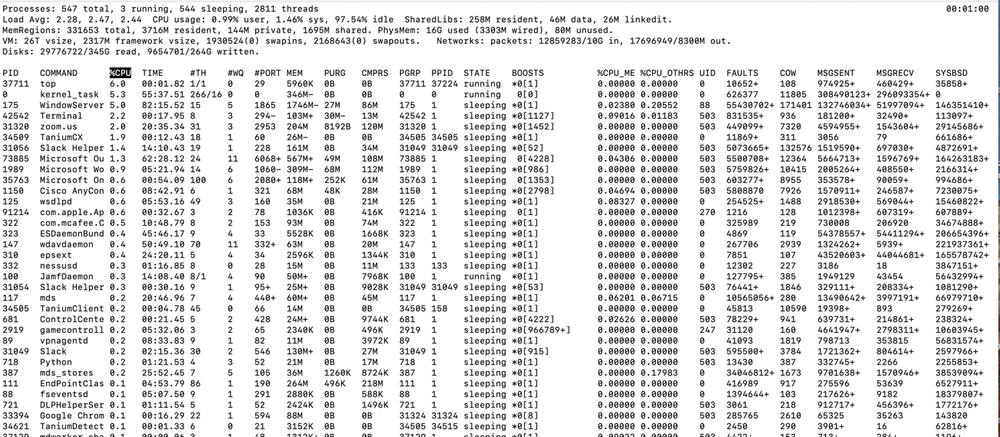
**图 3.9：top 命令输出示例**

**netstat 命令**：显示活动的 TCP 连接、计算机正在监听的端口、以太网统计信息、IP 路由表、IPv4 统计信息（针对 IP、ICMP、TCP 和 UDP 协议）以及 IPv6 统计信息（针对 IPv6、ICMPv6、TCP over IPv6 和 UDP over IPv6 协议）。在不带参数的情况下使用，netstat 显示活动的 TCP 连接。请参考下图：

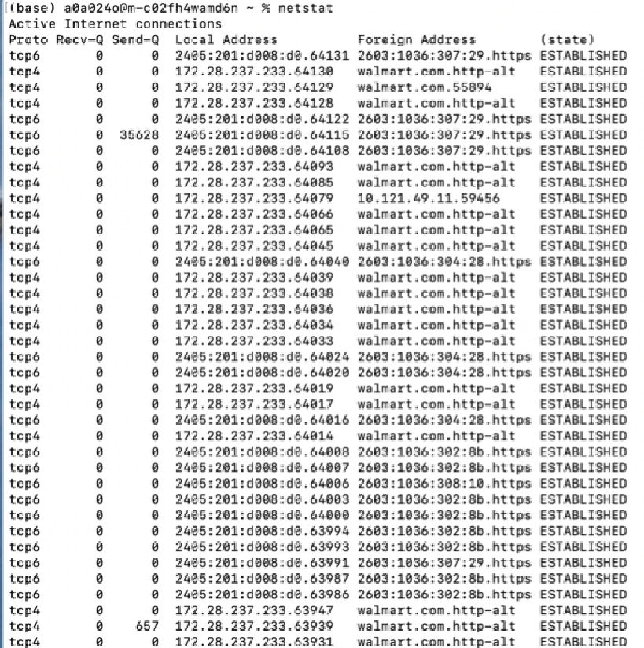
**图 3.10：netstat 命令输出示例**

**df 命令**：要查看磁盘空间使用情况，可以不带任何参数运行 df 命令。它将以下表格式显示磁盘空间消耗。

df 命令可用于确定机器或文件系统上的可用空间量。请参考下图：

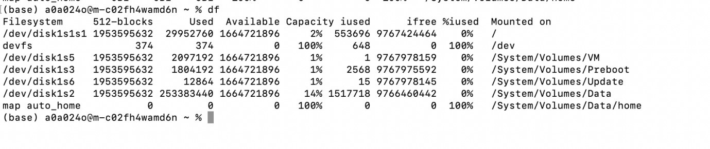
**图 3.11：df 命令输出示例**

此命令可与多个标志一起使用，如 -h、-T 等。请将此部分视为更好地理解监控形式的一个示例。

## 结论

SRE 高度依赖于监控和告警。通过密切监控，SRE 团队可以在性能问题影响客户之前发现它们。当问题出现时，SRE 团队需要尽快收到告警，以便他们能够响应并尽快修复问题。选择合适的监控工具和指标对于 SRE 团队实施有效的监控和告警至关重要。为确保告警有意义且可操作，他们还必须建立明确的阈值和告警策略。最后，SRE 团队需要定期审查和改进其监控和告警流程，确保它们随着业务需求的变化而不断演进。

在下一章中，读者将学习这些流程的基础知识、它们的目标以及在维护系统可靠性方面的重要性。关键主题包括事件管理生命周期、角色与职责、沟通、响应计划、风险评估、缓解策略、监控和持续改进。通过理解这些概念，读者将能够更好地制定和实施有效的策略，以增强组织的 IT 弹性，培养主动响应的文化，并保障业务连续性和运营效率。

通过主动的事件管理来维护服务可靠性和可用性需要一套独特的技能，包括技术知识、出色的沟通能力和主动性。利用本章的指导方针，SRE 团队可以构建有效的事件管理流程，保护用户免受不必要的服务中断，并降低未来宕机的可能性。

## 选择题

1. 应该处理什么类型的故障？
   a. 逻辑故障
   b. 操作故障
   c. 程序故障
   d. 功能故障

2. 应该调试什么类型的故障？
   a. 逻辑故障
   b. 操作故障
   c. 程序故障
   d. 功能故障

3. 监控允许用户做什么？
   a. SLO 度量
   b. 报告宕机原因
   c. 了解系统健康状况
   d. 安全

4. Google 建议用四个黄金信号做什么？
   a. 自动化功能
   b. 改善安全
   c. 减少平均修复时间
   d. 监控系统

**答案**
1. c
2. a
3. c
4. d
