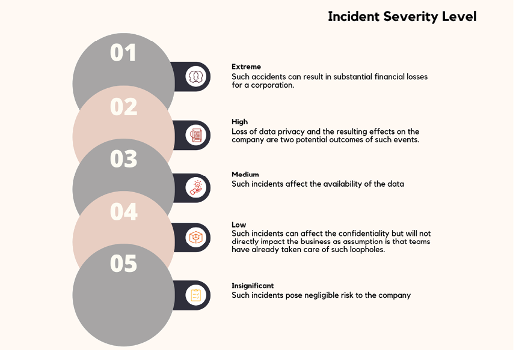
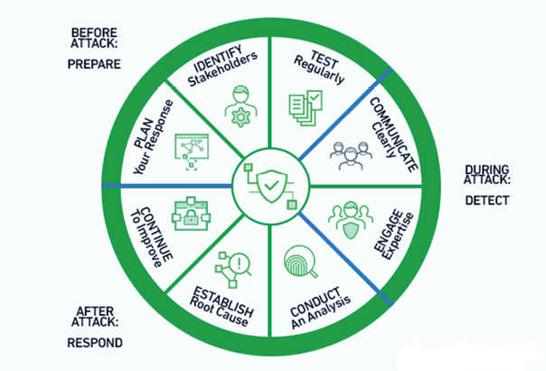
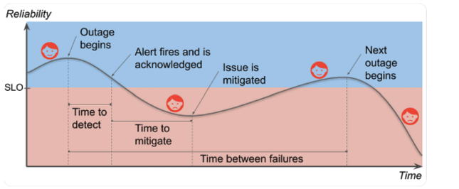
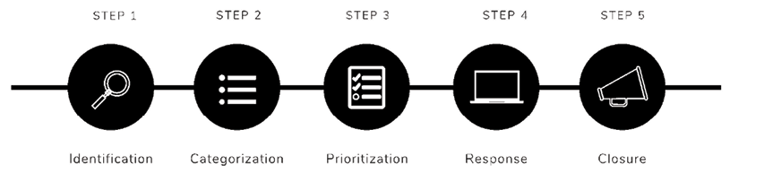

# 4 事件管理与风险缓解

## 引言

现代技术系统非常复杂，这带来了许多可能影响其功能、可靠性和安全性的潜在问题。[[站点可靠性工程师]]（SRE）最重要的职责之一是确保这些事件得到快速解决，同时将其对用户的影响降至最低。在本章中，我们将考察 SRE 背景下事件管理和风险缓解的关键概念。

事件管理是指识别、分析和解决系统事件，以尽可能快速有效地使系统恢复正常运行。它涉及各种任务，如识别和分类事件、协调响应工作以及实施纠正措施。我们将审视成功的事件管理流程的各个要素，以及结构化团队协作和沟通的重要性。

另一方面，风险缓解侧重于主动识别和解决系统中的潜在威胁和弱点，以阻止或减轻事件的影响。本章将教你如何评估风险、确定优先级、缓解风险，并建立一种促进弹性的持续改进文化。通过本章的学习，你将掌握管理事件和降低系统风险所需的知识和能力，确保为用户提供可靠和安全的服务。

## 本章结构

在本章中，我们将涵盖以下主题：

- 事件管理的目的
- 事件优先级划分
- 事件严重级别
- 事件响应计划
- 需要考虑的风险
- 风险分析
- 减少生产事件的最佳实践
- 风险与缓解
- 风险缓解的最佳实践

## 学习目标

在本章中，我们将讨论事件管理流程，以便在尽可能短的时间内恢复服务正常运行，同时限制对业务运营的影响并将服务质量维持在约定水平。

## 事件管理的目的

事件管理流程的目标是尽可能快地恢复正常的服务运营，同时最小化对业务运营的负面影响，并保持约定的服务质量水平。

任何管理过在线服务的人都知道，生产环境中可能出现意外问题。无论你的设计多么容错，或者发布流程多么细致，总会出现问题，导致你的用户无法正常使用你的服务。

你付出了大量努力来创建一个受欢迎的服务。你添加新功能来取悦现有客户并吸引潜在新客户。部署一个新功能（或任何变更）都会增加事件发生或最终用户可见问题的可能性。生产环境中的事故会损害与客户的关系。在可靠性与产品速度之间找到平衡对于企业增长和用户留存至关重要。好处是，一旦你找到了这个平衡点，你就可以同时提高可靠性和功能发布速度。

### 更多关于软件风险

你可能期望 Google 设计一个万无一失的服务。但在某个临界点之后，提高服务的可靠性对于服务和用户来说都不再是推荐的做法。极端的可靠性会限制新功能开发的速度。产品可以交付给用户，但会大幅增加成本，减少团队能够提供的功能数量。用户其实感受不到高可靠性与极端可靠性之间的区别，因为他们的体验更多受到蜂窝网络或设备等可靠性较低的组件的影响。智能手机用户无法区分 99.99% 和 99.999% 的可靠性。SRE 将不可用的风险与快速创新和高效服务运营结合起来，以增强用户的功能、服务和性能。

## 事件优先级划分

为事件分配优先级不仅有助于推动响应过程的决策，还为其他人提供了有用的上下文。在审查事件时，优先级提供了先前评估的即时且明确的指示。事件首次创建或触发后，其优先级可以更改。作为参考，我们将考虑在任何 SRE 中都非常常见的几种情况，以及如何通过适当分类来处理它们。请参考下表：

| 事件优先级    | 严重程度       |                                          |             |     |     |
| -------- | ---------- | ---------------------------------------- | ----------- | --- | --- |
| 影响：人员和服务 |            |                                          |             |     |     |
| 严重程度：时间  | 3-低        | 2-中                                      | 1-高         |     |     |
|          | 用户无法执行部分职责 | 用户无法执行关键时效功能                             | 关键服务的大部分不可用 |     |     |
| 影响       | 低-3        | 一名或两名人员；服务水平下降但仍符合 SLA                   | 低           | 低   | 中   |
|          | 中-2        | 多个在同一地点的人员；服务水平下降，达到或低于 SLA；事件原因涉及多个职能领域 | 中           | 中   | 高   |
|          | 高-1        | 特定区域的所有用户；多个区域的人员受到影响；面向客户的服务不可用         | 高           | 高   | 高   |

**表 4.1：事件优先级划分**

现在让我们讨论前面提到的场景。作为 SRE，理解事件的性质及其对业务的影响非常重要。考虑一个例子：一些人无法执行某些任务。这会导致重大的业务损失吗？会影响公司形象吗？答案是否定的。我们可以轻松地将此类事件归入低类别。但尽快解决问题也很重要，因为到目前为止我们还不清楚出了什么问题以及以后可能有多少人受到影响。再考虑另一个场景：多个在同一地点的人员受到影响，主要流程已失败。这显然是业务损失；我们将其归类为高优先级事件，必须在服务级别协议（SLA）内修复。

## 事件严重级别

事件严重级别用于衡量事件对公司的影响。严重级别帮助 IT 和 DevOps 团队理解影响并确定修复的优先级。你的严重性评估值（SEV）级别定义得越清晰，团队中的每个人就越有可能达成共识并正确响应问题。有了明确定义的严重级别，就可以节省原本用于识别和解释事件紧急程度的时间，将其用于解决问题。

### 严重级别的使用

对大多数团队来说，SEV 级别的主要好处在于节省时间。一个定义了严重级别以及如何应对每个级别计划的团队可以快速行动以实施解决方案。通过预先确定的严重级别，团队可以在重大危机的头几分钟内节省宝贵时间，无需试图判断情况的严重性、分配责任和制定计划。

计划好的事件解决和沟通流程，以及明确定义的 SEV 和优先级，在处理重大事件时可以显著缩短响应时间。

### 严重程度与优先级的区别

乍一看，事件严重性和事件优先级可能是同义词。似乎生命威胁的紧急情况应该优先于不那么紧急的事情，对吧？

但对于大多数公司来说，这要复杂得多。损害由其严重性来量化。用户受事件影响有多严重？整个基础设施是否有风险？是否阻止了他们完成必要的工作？可能会让他们烦恼并增加额外的工作。

相反，优先级是对某事物重要性进行排序的方式。我们需要在多长时间内解决这个问题？哪个问题应该首先解决？

但优先级和严重性并不总是一致的。例如，假设网站上的"关于我们"页面显示对齐不正确。这不是一个大问题，因为它不影响网站的工作方式。用户可以继续做他们需要做的事情。专业人员仍然可以做他们的工作。

但企业可能认为修复它很重要，因为它影响品牌、引起混淆，或者只是让企业看起来不专业。所以，这可能是一个低严重性但高优先级的事件。

### 定义事件严重级别

每个公司对事件的响应方式都不同。在确定严重级别及相关流程和期望时，不仅要考虑事件的影响，还要考虑以下几点：

- 你的技术团队有多少人
- 值班安排
- 服务一天中最繁忙和最空闲的时间
- 考虑事件发生率

让我们进一步探讨可能考虑的严重级别范围，以及它们对组织和领域专家的意义。请参考下图：

**图 4.1：事件严重级别**

## 事件响应计划

不同组织的流程细节可能略有不同，但基本框架是相同的。图 4.2 展示了以下流程：

**图 4.2：事件响应计划流程**

如 Exambeam 所述，事件响应计划通常包括以下内容：

- 公司如何处理事件及其与总体目标的关系
- 事件响应的角色和职责
- 处理事件每个阶段的详细说明
- 危机响应人员、公司其他部门和外部各方之间共享信息的协议
- 如何利用过去事件的经验教训来加强当前和未来的安全

## 需要考虑的风险

在讨论风险时，重要的是尝试将它们映射到不同的类别，例如与依赖关系、监控、容量、运营和发布流程相关的风险。针对每个类别，思考如果某些事情出错会发生什么，比如第三方宕机或应用或配置中出现 Bug。因此，在思考风险时，你应该问自己以下问题：

- 是否存在明显的漏洞？
- 你是否已为此 SLI 设置告警？
- 你现在是否仍在收集这些指标？

同时，确保映射对监控和告警的任何依赖关系。例如，如果你使用的某个托管系统宕机了会怎样？

在关键的用户旅程中，你应该尝试找出每个组件的每个故障点的风险。一旦找到这些风险，你需要衡量以下内容：

- 有多少客户受到了问题的影响？
- 你认为问题多久会发生一次？
- 花了多长时间才找出问题所在？

了解过去一年中发生的任何事件也很有帮助。使用历史数据而不是凭感觉可以为你提供准确的估计和为真实事件提供良好的起点。例如，你可能需要考虑以下情况：

- 系统配置方式的错误减少了它可以处理的请求数量
- 新版本破坏了一小部分请求，但问题过了一天才被发现。当问题被发现时，很容易回滚
- 云服务提供商的单可用区 VM/网络宕机
- 云服务提供商的多可用区 VM/网络宕机
- 操作员意外删除了数据库，需要从备份中恢复

另一个思考主题是风险因素。这些是影响总体检测时间（TTD）和修复时间（TTR）的全局因素。大多数情况下，这些是运营因素，可能延长发现宕机的时间（如使用基于日志的指标时）或通知值班工程师的时间。缺乏行动手册、文档或自动化程序可能是另一个例子。除此之外，还有：

由于运营过载（如告警噪音过大），预计检测时间（ETTD）增加 30 分钟以上。如果没有事后复盘或行动项跟踪，问题发生的可能性会高出 17%。

## 风险分析

本节概述了在事件期间分析风险的方法。缓解风险最有效的方法是缩小潜在的业务影响范围。

### 生产事件生命周期

当服务的最终用户受到不利影响时，就发生了生产事件。你的服务运行的环境及其性质总是在不断变化。例如，大量好奇的新用户的涌入或基础设施故障（坏消息）可能会危及服务的可靠性。生产事件是你不断变化的流程或配置所导致的不可避免的、不受欢迎的结果。根据 Google 进行的一项调查，客户满意度会在某些时候下降甚至恶化。请参考下图：

**图 4.3：生产事件生命周期**

### 可靠性的成本

如果你的可靠性维持在[[服务级别目标]]（SLO）以上能让大多数客户满意，那么你应该将目标设定得比 SLO 高多少？你越低于 SLO，用户就越不满意。然而，令人惊讶的是，当你的 SLO 超过期望水平时，用户会逐渐对你的可靠性变得漠不关心。你仍然会遇到事件，你的客户也会注意到它们。但只要你的服务平均而言高于其 SLO，事件发生的频率就足够低，你的用户仍然感到满意。换句话说，一旦你达到了 SLO，提高可靠性就不再对用户有益。可靠性是昂贵的。除了工程工时之外，还有错失的机会成本。例如，产品的上市时间可能会因可靠性要求而延迟。此外，可靠性成本通常是指数级的。这意味着运行一个可靠 10 倍的服务可能贵 100 倍。你的 SLO 建立了一个低于 100% 的最低可靠性标准。然而，如果你高于 SLO，则意味着你为可靠性支付了超出必要的成本。好消息是，你可以将错误预算（即多余的可靠性）花在比维护用户不可见的过剩可靠性更有价值的事情上。例如，你可以更频繁地发布、针对生产基础设施运行压力测试以发现隐藏问题，或者让你的工程师专注于功能而非可靠性。高于 SLO 的可靠性仅作为缓冲，防止用户看到你的不稳定。稳定你的可靠性以最大化错误预算的投资回报。

### 响应计划

事件响应团队在安全漏洞事件中应遵循以下五个流程：

- **识别（Identification）**：当事件被识别时，团队应能够快速发现组织系统中的异常，收集更多证据，确定事件的严重性，并记录谁、什么、哪里、为什么和如何。

- **分类（Categorization）**：在进行任何形式的恢复之前，必须将故障类型分类为次要、中等或严重。

- **优先级划分（Prioritization）**：一旦发现安全漏洞，团队的首要任务是止血并恢复正常运营。临时隔离措施包括移除受损的生产服务器或隔离网络部分。永久隔离措施包括暂时使用不完善的系统进行生产，同时从头开发更好的解决方案。

- **响应（Response）**：团队谨慎地恢复受损的生产系统，以防止问题再次发生。此步骤的关键决策包括确定运营恢复的时间和日期，以及确定验证受影响系统和活动已恢复正常的方法。

- **关闭（Closure）**：根除应为生产事件的关闭提供支持因素。建议在事件结束后的两周内完成此步骤，此时细节在每个人的脑海中仍然清晰。

记录事件、进行更多研究以确定其全部范围、找出响应团队表现出色的地方以及识别他们可以改进的地方，都是总结阶段的目标。请参考下图：

**图 4.4：响应计划**

## 减少生产事件的最佳实践

最佳实践如下：

**建立并持续更新 SLO**：当 SRE 讨论可靠性时，SLO 通常被频繁提及。它们构成了错误预算的基础，并指定了你希望服务达到的可衡量的可靠性水平。SLO 影响整个生产事件周期，因为它们决定了你在准备工作中需要投入多少精力。这意味着 SLO 影响着整个周期。你的客户是否需要高于 90% 的 SLO？可能你目前使用的全版本发布策略就足够了。你需要 99.95% 的 SLO 吗？如果是这样，可能是时候考虑投资渐进式发布和自动回滚了。在事件发生时，SLO 为你提供了量化影响的基础。也就是说，它们让你知道什么时候情况糟糕，而且更重要的是，糟糕到什么程度，用你的整个组织——从值班人员到高层管理人员——都能理解的语言来表达。

**撰写事后复盘报告**：Google Cloud CRE 负责人 Dave Rensin 喜欢将生产事件视为预先支付了所有成本的意外投资。你可能需要用生产力的损失来弥补收入损失。你总是用用户的好感来支付。你从中学到的关于避免（或至少减轻）未来生产事件影响的教训，是你从这笔投资中获得的回报。事后复盘是从事件中汲取宝贵经验教训的方法。它们记录了发生的事情及其原因，并指明了需要改进的领域。撰写一份详尽的事后复盘可能需要一天或更长时间，但这是值得花的时间，因为它让你能够收回意外投资的价值，而不是让它白白流失。

**确定个人职责**：确立问责制是实现这一目标的第一步。首先分析数据，根据已建立的参数对事件进行分类，并为每个类别找到负责人。在整个组织中保持一致的度量标准有助于减少事件数量，而处理这些事件的负责人因成功降低事件数量而获得适当的奖励。

**预防由变更引发的事件**：最后，鼓励有效的变更管理系统。每次你对应用或基础设施进行修改时，都有可能出现问题。例如，发布测试覆盖不充分的更新可能导致严重事故。作为专业人员，他们有责任预测变更的负面影响并制定策略来减轻这些影响。应分析与变更相关的事件，识别变更管道中的潜在风险驱动因素，跟踪趋势，并将变更优先排序到适当的类别中。数据挖掘是一种好方法。访问大量数据可能是有利的，许多企业现在正在使用超越常规报告操作的方法。对事件的简单分析可能无法揭示全部情况。通过将事件数据与邻近数据源匹配来获取事件的完整图景。审计记录、故障报告和修订历史等数据可能已经大量存在。利用这些数据来了解事件减少背后的原因。

企业可以利用的另一项宝贵资源是文本分析。为了理解事件数据，分析自由格式的数据（如描述、评论、工作笔记等）以发现关键字是很有用的。例如，假设搜索 Webex 发现了数十个事件。然而，解决这些情况所需的时间被发现出奇地短。

## 风险与缓解

SRE 学科致力于确保复杂系统的性能、安全和可靠性。有效的事件管理和风险缓解——针对系统故障、性能下降和安全漏洞——是 SRE 的基本组成部分。在本节中，我们将深入探讨事件管理背景下风险和缓解的细微差别，强调这两个概念的相互关联性，并提供创建弹性系统的有见地的建议和方法。

为了最小化系统事件对用户的影响并快速恢复正常运营，事件管理需要快速定位、分析和解决事件。另一方面，风险缓解涉及主动识别和解决系统中的潜在威胁和漏洞，以预防或减轻事件的可能性和影响。事件管理和风险缓解之间的重叠在于它们共同的目标是维护系统安全和可靠性，其中事件管理更侧重于主动策略，而风险缓解更侧重于被动策略。

SRE 必须首先识别可能影响其系统的潜在威胁和漏洞，才能有效管理风险和事件。风险评估涉及对系统架构、组件、依赖关系、周围环境以及潜在外部因素的彻底检查。全面的风险分析应考虑各种因素，包括硬件故障、软件 Bug、人为错误和安全漏洞。通过主动识别风险，SRE 可以预见潜在事件并采取预防措施，以避免或减轻它们对系统性能和可靠性的影响。

在识别潜在风险之后，下一步是根据它们可能再次发生的可能性以及对系统的潜在影响进行评估和排序。这种优先级排序使 SRE 能够更有效地分配资源，并首先集中精力解决最重要的风险。风险矩阵和定量风险评估是常见的风险优先级排序技术，它们为每个风险的可能性和影响分配数值，以便进行客观比较。

确定风险优先级后，SRE 可以制定有效的缓解计划，以降低其可能性或影响。有几种重要的风险缓解方法，包括：

- **预防**：实施策略以消除风险的根本原因或降低其可能性。修补已知的软件漏洞、实施严格的访问控制和使用冗余硬件组件是一些预防措施。

- **检测**：实施监控和告警系统，以尽早发现事件和潜在风险。早期发现能够实现更快速的响应和解决，减少对系统可靠性和性能的影响。

- **遏制**：建立流程和控制措施，以在事件发生时降低其影响。可以采用流量限制、隔离受影响的组件或使用备用系统等技术。

- **恢复**：确保有适当的策略和工具，以便在事件后快速有效地恢复正常运营。这意味着要有明确的事件响应协议、备份计划和灾难恢复计划，并定期测试这些流程。

## 风险缓解的最佳实践

以下是作为 SRE 的一些风险缓解最佳实践：

- **风险评估**：定期进行全面风险评估，以发现系统中潜在的漏洞和威胁。作为 SRE，要考虑各种因素，如硬件故障、软件 Bug、人为错误和安全漏洞。随着系统的演进和新信息的出现，必须审查和更新风险评估。

- **风险优先级排序**：根据风险发生的概率和潜在的系统影响来评估和排序风险。优先考虑高风险因素的缓解，并相应分配资源。使用风险矩阵或定量风险评估以实现公正的比较。

- **实施预防措施**：作为 SRE，主动实施预防措施以消除或降低风险的可能性。你的职责可能包括修补软件漏洞、实施严格的访问控制、使用冗余硬件组件以及执行安全的编码实践。

- **建立监控和告警系统**：作为 SRE，建立强大的监控和告警系统以便及时识别事件和潜在风险。早期发现能够实现更快速的响应和解决，减少对系统性能和可靠性的影响。

- **制定遏制和恢复计划**：制定流程和控制措施以限制事件的影响，例如流量限制、隔离受影响的组件或利用备用系统。建立明确的事件响应流程、备份和灾难恢复策略，并定期测试以确保其有效性。

- **培养持续改进的文化**：鼓励拥抱持续改进和从事件中学习的文化。进行事后复盘以分析事件、确定根本原因并实施纠正措施。在团队之间分享经验教训，以防止将来发生类似事件。

- **跨职能协作**：促进开发、运维、安全和其他利益相关者之间的协作，确保风险管理是一项集体责任。鼓励开放的沟通和知识共享，并邀请相关团队参与风险评估和缓解工作。

- **拥抱自动化**：自动化重复性和易出错的任务，以最大限度地降低人为错误的风险。使用自动化测试、部署和监控工具来保证一致和可靠的流程。

- **容量和可扩展性规划**：预见未来的容量需求并相应地扩展系统，以最小化性能下降和宕机的风险。使用容量规划技术和工具来预测需求，并部署自动扩缩容解决方案以管理意外的流量峰值。

- **评估第三方依赖的风险**：第三方依赖（如库、框架和服务提供商）可能构成严重威胁。作为 SRE，选择可靠且维护良好的解决方案，同时避免对任何单一依赖的过度依赖。

- **制定风险转移策略**：在某些情况下，可能需要通过将风险转移给第三方来实施风险转移策略。这可能是一种更高效、更具成本效益的方法。作为 SRE，你可以考虑购买保险、将特定系统组件委托给专业供应商，或利用提供冗余和故障转移能力的云服务等选项。

通过将这些实践纳入 SRE 流程，你可以有效管理和缓解风险，确保你的系统持续为用户提供可靠、安全和高性能的服务。

## 结论

总之，本章全面概述了站点可靠性工程中事件管理和风险缓解的关键方面。我们探讨了事件管理的复杂性，强调了快速识别、分析和解决系统事件对于维护运营稳定和用户满意度的重要性。此外，我们强调了结构化团队协作和有效沟通在确保事件管理流程成功中的重要性。

此外，本章深入探讨了风险缓解的主动方法，其中重点是识别和解决潜在威胁和漏洞，以防止它们破坏系统功能。通过这里提供的指导，读者已经获得了评估风险、优先排序缓解工作以及培养持续改进文化以增强系统弹性的见解。

在第 5 章"错误预算"中，读者将学习错误预算的概念，它代表了基于预定义 SLO 的可接受的系统不可靠性水平。该章强调了平衡可靠性和创新的重要性，并教授如何定义、测量和管理 SLO 和 SLI。读者还将学习有效的错误预算管理策略、SRE 与开发团队之间的协作，以及将错误预算融入组织文化以推动更好的决策制定并保持对用户满意度和系统性能关注的重要性。

## 选择题

1. 以下哪项不是有效事件管理流程的关键组成部分？
   a. 事件检测和分类
   b. 事件响应和解决
   c. 将风险转移给第三方
   d. 事件后审查和改进

2. SRE 风险缓解的主要目标是什么？
   a. 增加事件频率
   b. 最小化事件的可能性和影响
   c. 最大化系统停机时间
   d. 忽略潜在威胁和漏洞

3. 哪种风险缓解策略涉及实施措施以消除或降低风险的可能性？
   a. 检测
   b. 预防
   c. 遏制
   d. 恢复

4. 在事件管理和风险缓解中，主动措施和被动措施的主要区别是什么？
   a. 主动措施侧重于预防事件，而被动措施侧重于事件发生后处理事件
   b. 主动措施涉及团队协作，而被动措施由个人执行
   c. 主动措施由管理层实施，而被动措施由技术人员执行
   d. 主动措施需要使用外部工具，而被动措施可以手动执行

5. 在事件后进行事后复盘分析的主要目的是什么？
   a. 为事件追究责任
   b. 识别根本原因并实施纠正措施
   c. 评估事件的财务影响
   d. 评估个别团队成员的表现

6. 哪种技术通常用于根据风险发生的可能性和对系统的潜在影响来确定优先级？
   a. 风险矩阵
   b. 事件分类
   c. 容量规划
   d. 告警阈值设置

**答案**
1. c
2. b
3. b
4. a
5. b
6. a
