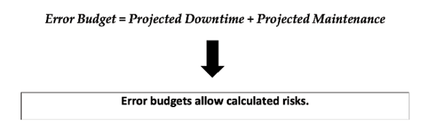
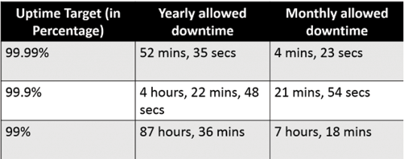
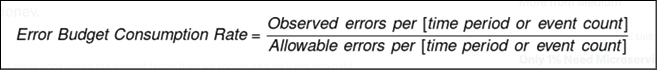
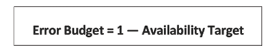
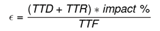
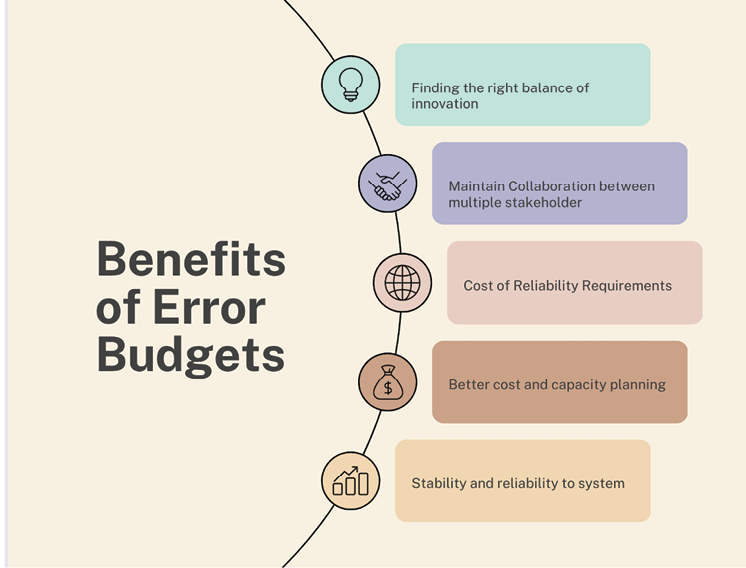

# 5 错误预算

## 引言

在本章中，我们将深入探讨[[错误预算]]（Error Budgets），这是[[站点可靠性工程]]（SRE）理论的重要组成部分。如果你曾思考过 Google、Netflix 或其他大型科技公司如何在快速交付的同时保持创新和稳定，本章将为你提供一些好的思路。

在我们这个快节奏的世界里，人们期望服务全天候可用，企业总是在快速开发新想法和确保系统稳定之间左右为难。找到这种微妙的平衡就像一项艰巨的任务，尤其是在宕机或减速真实可能发生的情况下。错误预算的概念正是在这里发挥作用。

错误预算是一种衡量系统稳定性的方法，可用于做出关于添加功能、改进系统和处理技术债务的决策。本质上，它们平衡了可靠性和变更速度，允许一定数量的错误或停机时间——这仍然是可接受的。它们在[[服务级别目标]]（SLO）范围内定义了可允许的服务错误或中断水平，并通过量化在违反 SLO 之前可以牺牲多少可靠性，作为计划外事件的阈值。监控错误预算帮助团队有效响应意外事件，确保他们保持在可接受的服务质量限制内。

在本章中，我们将分解错误预算的概念，确定是什么让它起作用以及为什么起作用。我们将讨论错误预算以及如何描述和计算它。我们还将考察[[服务级别目标]]、[[服务级别指标]]（SLI）和错误预算如何协同工作。本章还将展示现实世界的案例，说明不同组织如何在他们的 SRE 计划中成功使用这一概念。最后，你将看到错误预算如何将可靠性的抽象概念转化为系统创建和维护中真实、可管理的部分。

## 本章结构

在本章中，我们将涵盖以下主题：

- 错误预算的目的
- 定义错误预算
  - 错误预算公式
  - 优先开发而非最终用户体验
- 错误预算与 SLI 和 SLO 的关系
- 设置正确错误预算的益处
- 宕机策略
- 超出预算后的行动项
- 获取正确错误预算的最佳实践

## 学习目标

错误预算的主要目标是在组织内建立对系统可靠性的共同理解和共同责任。它提供了一种清晰、可衡量的方式来评估变更对系统的影响，并鼓励团队优先考虑可靠性改进。

错误预算也是一种平衡可靠性与创新竞争需求的工具。通过为可接受的停机时间或错误设定预算，团队可以做出关于分配资源和优先改进的明智决策。这有助于确保系统保持可靠，同时允许快速开发和部署新功能。

错误预算的另一个重要目标是改善组织内的沟通和透明度。团队可以使用错误预算向利益相关者传达系统状态，并定期更新他们在提高可靠性方面的进展。这有助于确保每个人都清楚了解系统的性能以及正在采取的改进措施。

## 错误预算的目的

SRE 中错误预算的目的是设定系统可靠性的期望，并提供一个平衡可靠性与创新之间权衡的框架。在 SRE 中，错误预算用于定义系统可接受的停机时间或错误水平，并优先考虑可靠性改进。

错误预算是一种衡量和管理风险的方式。通过为可接受的停机时间或错误分配预算，SRE 团队可以做出关于分配资源和优先改进的明智决策。这有助于确保系统保持可靠，同时允许快速开发和部署新功能。

SRE 中错误预算的另一个目的是改善组织的沟通和透明度。团队可以使用错误预算向利益相关者传达系统状态，并定期更新他们在提高可靠性方面的进展。这有助于确保每个人都清楚了解系统的性能以及正在采取的改进措施。简而言之，SRE 中的错误预算提供了一个平衡可靠性与创新之间权衡的框架，增强了沟通和透明度，并为系统可靠性建立了共同理解和共同责任。请参考下图：

**图 5.1：错误预算公式**

## 定义错误预算

SRE 团队通常负责定义错误预算。在 SRE 中，错误预算设定了系统可靠性的期望，并提供了一个平衡可靠性与创新之间权衡的框架。

这是 SRE 团队与组织内其他为系统设计、开发和维护做出贡献的团队之间的共同责任。SRE 团队与其他团队协作，定义系统可接受的停机时间或错误水平，并在不同系统组件之间分配错误预算。

在某些组织中，错误预算可能由一个负责确保系统可靠性的中央团队定义和管理。在其他组织中，错误预算可能是分散的，由负责特定系统组件的各个团队管理。

可接受的错误预算水平可能因系统类型、其功能的关键性以及用户的期望而有很大差异。例如，提供紧急服务的系统可能比提供非关键服务的系统具有更低的错误预算。通常，可接受的错误预算基于系统的期望可靠性水平、用于可靠性改进的资源的可用性以及停机时间或错误对系统用户的潜在影响来定义。

SRE 团队使用数据和分析来确定可接受的错误预算水平，并在系统的不同组件之间分配它们。随着时间的推移，错误预算可能会根据系统需求或性能变化进行调整。

以下是一些错误预算的示例：

- **99.99% 可用性**：此错误预算每年最多允许 52.56 分钟的停机时间。这种可靠性水平通常用于对业务运营至关重要的系统，如金融系统或电商网站。
- **99.95% 可用性**：此错误预算每年最多允许 4.38 小时的停机时间。这种可靠性水平通常用于重要但不关键的系统，如邮件服务器或内容管理系统。
- **99.0% 可用性**：此错误预算每年允许 87.6 小时的停机时间。这种可靠性水平通常用于不那么关键的系统，如信息类网站或内部工具。
- **自定义错误预算**：此错误预算根据系统的特定需求和约束量身定制，可以设置为任何适当的可靠性水平。例如，自定义错误预算可能允许每周一定的停机时间或每天一定数量的错误。

在上述每个示例中，错误预算都提供了一种清晰、可衡量的方式来设定系统可靠性期望和优先考虑可靠性改进。实际的停机时间或错误水平可能取决于多种因素，包括系统的规模和复杂性、用于可靠性改进的资源可用性，以及停机时间或错误对系统用户的潜在影响。正如 SentinelOne 博客所解释的，100% 的可用性是任何公司都无法兑现的承诺。因此，你需要设定一个允许系统故障的时间长度。下图中引用了错误预算及其常见术语的含义。我们试图通过给出示例使表述更容易理解。请参考下图：

**图 5.2：错误预算参考**

这就像家庭预算的原理一样。如果我们有额外的现金，我们可以将其用于更多功能；如果没有，我们必须缩减对新创意的投入。

关注错误预算消耗率与管理超支同样有用。理解消耗率对于管理服务的可靠性以及做出关于如何改进系统或添加新功能的明智选择非常重要。以下公式提供了一种计算方法。请参考下图：

**图 5.3：错误消耗率计算公式**

如果错误预算大于 1，那么我们知道我们消耗预算的速度超过了应有的速度。我们可能会陷入债务并推迟新功能的计划，想法是修复现有功能并使系统可靠。错误预算公式可以帮助我们理解如何减少不可用性和增加可用性。请参考下图：

**图 5.4：错误预算**

例如，如果可用性目标 SLO 是 99.95%（或表示为比例 0.9995），则错误预算计算如下：

**错误预算 = 1 - 0.9995 = 0.0005**

这意味着服务可以在不违反 SLO 的情况下有 0.05% 的时间不可用。根据你考虑的时间范围，这可以转化为一定分钟数或小时数的可接受停机时间。

### 错误预算公式

跟踪错误预算促进了可靠性与创新速度之间的平衡，使得能够就系统变更做出明智的决策，允许在错误预算充足时进行更冒险的举措，并在错误预算耗尽时鼓励谨慎行事。错误预算由[[服务级别协议]]（SLA）规范定义。如果你的 SLA 保证 99.99% 的可用性，你的错误预算就是 0.01%。它表示在不违反 SLA 的前提下允许的停机时间或缺陷数量。其计算方法是从合同 SLA 中减去实际系统可用时间。请参考下图：

**图 5.5：错误预算公式**

在继续之前，让我们理解以下术语：

- **检测时间（TTD）**：从用户受问题影响到有人被告知问题所花费的时间。
- **解决时间（TTR）**：从有人被告知问题到问题得到解决所花费的时间。
- **故障间隔时间（TTF）**：特定故障发生的频率。当它们前面带有 M 时表示平均值，也称为平均 X 时间。

保持错误预算值较低对于维持可管理的错误预算至关重要。这可以通过调节几个变量来实现。详情如下：

- **减少 TTD**：通过监控和告警更快地发现宕机。
- **减少 TTR**：通过良好的开发人员行动手册加快故障排查速度；改进用于紧急处理的日志；添加追踪；自动化故障转移，如重定向流量或备份。
- **减少影响**：通过渐进式发布限制受影响的用户数量；使用功能标志增加可逆性；实施优雅降级，例如断路器模式、限流请求、使用指数退避限制重试调用、设置客户端超时和限制队列。
- **增加 TTF**：分析并理解故障原因；进行主动维护工作。

## 优先开发而非最终用户体验

大多数人可能会认为问"我们能处理多少不可靠性"是一个奇怪的问题。然而，这句话是业务每个部分的关键。一个盈利的企业旨在为客户提供他们想要的服务水平，同时控制成本和管理风险。这个等式的很大一部分是询问不可靠性。尽管如此，仍然可能觉得这是一个懒惰的问题。我们从小就被教育要尽力做到最好。我们想要一切：质量、效率、速度和性能。卓越意味着超越期望。意味着以一致的方式反复做到这一点，这就是我们将要提到的"卓越的边缘"。它还讨论了最终用户能承受多少不可靠性以及如何衡量性能。最重要的决定是开发团队应该在何时以及多大程度上将应用可靠性和性能优先于最终用户体验、功能或其他业务目标。

错误预算为这类决策提供了可衡量的方式。持续错过 SLO 的团队应该投入更多精力使他们的应用更可靠。同时，当可靠性改进的投资导致未来错误减少时，敏捷的 DevOps 团队可以证明主动可靠性改进是值得的。

错误预算还可以帮助 DevOps 团队更有效地利用时间。接近错过 SLO 的团队可能会选择优先响应事件、处理升级的支持请求或修复 Bug。相反，远低于错误预算的团队可能不会追求完美，而是继续完成他们的冲刺、发布和功能部署的战略路径。

给 DevOps 团队更多权力来决定哪些运维问题需要优先处理似乎有悖常理，但追求完美代价高昂。相反，IT 领导者应建立 SLO 策略，帮助团队知道当低于错误预算或 SLO 面临风险时该怎么做。领导者还可以决定团队如何使用错误预算，或在 SLO 未达到时建议采取的行动。

SLO 影响开发和运维，它们还可以使质量保证的角色更加重要。当生产缺陷导致错误时，这表明应增加测试自动化，并应重新调整 SLO。

## 错误预算与 SLI 和 SLO 的关系

回到本章前面讨论的错误预算定义。错误预算定义了系统可接受的停机时间或错误水平，并提供了一个平衡可靠性与创新之间权衡的框架。错误预算帮助 SRE 团队管理风险并优先考虑可靠性改进。

为了更好地理解 SLI 和 SLO 之间的联系，我们将回顾它们各自的含义：

- **SLI** 是用于监控系统性能和跟踪达到错误预算进展的特定可衡量指标。SLI 可以包括响应时间、错误率或可用性指标。
- **SLO** 是基于系统可靠性定义的系统可靠性目标，代表了系统性能的期望水平，并用于向利益相关者传达系统状态。例如，SLO 可能规定系统必须达到 99.95% 的可用性，由运行时间的 SLI 来衡量。

## 设置正确错误预算的益处

错误预算的主要优势在于它为产品开发和 SRE 提供了一个共同的激励，专注于找到创新和可靠性的正确平衡。如果系统的 SLO 得到满足，多个产品的发布可以继续进行。假设 SLO 违规频繁发生，足以耗尽错误预算。在这种情况下，发布将暂时停止，额外的资源将投入到系统测试和开发中，以使系统更具弹性、改善性能等。

之前已经多次提到过。所有不是绝对必要的发布都已暂停，因为我们已经超出了错误预算。如果产品开发不顾 SRE 的意愿决定减少测试或增加推送速度，错误预算将作为决定因素。当预算充裕时，产品开发人员有更大的自由度进行实验。当资源紧张时，产品开发人员通常要求额外的时间进行测试或降低推送速度。他们无法在预算或发布日期上冒险。从某种意义上说，产品开发团队变成了自我监督的，了解预算并能够处理自己的风险。为了实现这一结果，SRE 团队必须有权在发生 SLO 违规时阻止发布。在确定错误预算时，SRE 团队会考虑宕机策略。以下是错误预算的众多好处中的一些：

**图 5.6：错误预算的益处**

## 宕机策略

宕机策略是一组用于管理和响应系统宕机的指南和流程。它们是更广泛的可靠性策略的一部分，旨在确保宕机得到一致和有效的处理。

宕机策略通常包括以下要素：

- **角色和职责**：定义参与响应宕机的不同团队和个人的角色和职责，如事件响应团队、系统管理员和沟通团队。
- **沟通计划**：包含概述如何将宕机信息传达给利益相关者（包括客户、合作伙伴和员工）的沟通计划。
- **响应流程**：涉及概述必须采取哪些步骤来减轻宕机影响的响应流程，如识别根本原因、恢复服务和记录宕机。
- **升级计划**：包含概述如果在定义的响应流程内无法解决事件将如何升级的升级计划。
- **宕机后审查**：包含一个宕机后审查流程，用于评估对宕机的响应并识别改进机会。

## 超出错误预算后的行动项

如果超出错误预算，必须采取行动解决问题，并确保系统以最高可靠性水平运行。SRE 团队应系统性地处理问题，包括投资可靠性改进、重新评估错误预算、与利益相关者沟通、实施危机管理计划，以及审查流程和程序。让我们将其分解为不同的部分，并尝试在基本层面上理解：

- **投资可靠性改进**：这可能表明系统不够可靠，必须投入更多资源。这可以包括修复 Bug、改善系统性能和升级硬件。
- **重新评估错误预算**：可能需要重新评估错误预算并调整系统可靠性的目标和指标。这可能涉及设定一个更现实的、反映系统当前状态的错误预算。
- **与利益相关者沟通**：必须与利益相关者（包括客户和员工）沟通，解释情况并提供解决问题步骤的最新信息。
- **实施危机管理计划**：如果系统正在经历重大宕机，可能需要实施危机管理计划，以确保局势迅速得到控制，并尽快将系统恢复正常运行。
- **审查流程和程序**：可能需要审查流程和程序，以识别任何需要改进的领域，并确保系统的设计和运营能够最大限度地降低宕机风险。

## 获取正确错误预算的最佳实践

设定错误预算需要结合技术理解和业务策略。以下是一些最佳实践，以确保你的错误预算适当：

- **设定清晰可衡量的目标**：错误预算应清晰且可量化，具有具体的系统可靠性目标。这有助于确保所有利益相关者充分理解错误预算，并为做出关于系统可靠性的决策提供清晰的框架。
- **优先考虑可靠性改进**：根据错误预算优先考虑可靠性改进并分配资源是一种好做法。这有助于保证最重要的系统获得尽可能高的可靠性水平。
- **持续监控和跟踪进展**：应持续监控和跟踪错误预算。这有助于确保错误预算是最新和相关的，并且所有创新都能及时进行必要的调整。
- **考虑宕机的潜在影响**：在制定错误预算时，应考虑它们可能如何影响用户和业务。这有助于确保错误预算设定在可靠的水平，并且最重要的系统获得最多的关注。
- **保持透明**：所有利益相关者，包括客户和员工，都必须以清晰透明的方式了解错误预算。这确保了每个人都理解系统可靠性的目标和期望，并能就资源分配和优先级做出明智的决策。
- **持续审查和调整**：必须定期评估和修订错误预算，考虑公司当前状态、客户需求和技术进步的新信息。这样才能使错误预算和系统可靠性与公司不断变化的需求保持一致。

## 结论

总之，错误预算的概念是 SRE 最重要的部分之一。它以有用的方式连接了通常不同的开发和运维世界。它给可承担的风险赋予了一个数字，因此每个人都知道多少系统可靠性是可接受的。这创造了一个环境，可以在不影响系统稳定性的情况下安全地进行更快的开发和部署周期。错误预算帮助团队在创造性和可靠性之间找到良好的平衡，将潜在的冲突点转化为合作的机会。它们为系统变更决策提供了框架，允许在预算充足时进行更冒险的举措，并在预算紧张时提醒人们谨慎行事。

然而，提出一个正确的错误预算并不容易。它需要与业务目标保持一致、了解用户能承受的范围、使用正确的数据并持续监控。同时，设定和调整错误预算应该是一个持续的过程，随着系统、用户需求和业务目标的变化而变化。错误预算可以作为指导，但并不意味着是一个严格的规则。目标不是阻止所有错误发生，而是确保从错误中学到最多东西。这将激发创造力并确保服务水平良好。错误预算是一种为用户和业务提供最大价值的工具。

在下一章中，我们将考察系统可靠性的核心指标，以及它们如何帮助系统可持续运行。我们将学习如何将 SLI 描述为服务中可衡量的部分，如何将 SLO 设定为这些 SLI 的目标，以及如何将 SLA 作为对客户的书面承诺来沟通。该章还将讨论跟踪这些指标的方法，以及当需要达到这些数值时如何行动。此外，还将讨论这些指标在沟通、规划和决策中的重要性。

## 选择题

1. SRE 中错误预算的目的是什么？
   a. 为系统升级分配财务资源
   b. 定义可接受的系统停机时间
   c. 衡量 SRE 团队的绩效
   d. 跟踪用户可能犯的错误数量

2. 错误预算通常如何计算？
   a. 通过估计错误造成的潜在财务损失
   b. 通过确定新功能可接受的风险水平
   c. 通过设定可接受的服务不可靠性水平
   d. 通过开发环境中遇到的错误数量

3. 谁负责管理错误预算？
   a. 财务部门
   b. 客户支持团队
   c. 站点可靠性工程团队
   d. 营销团队

4. 超出错误预算可能产生什么后果？
   a. 公司将增加营销预算
   b. 新功能的开发可能会暂停以提高稳定性
   c. 错误预算将立即重置
   d. SRE 团队获得财务奖金

5. 错误预算和功能发布之间有什么关系？
   a. 错误预算限制仅在工作日发布功能
   b. 错误预算决定新功能的财务成本
   c. 错误预算用于平衡功能发布速度与系统可靠性
   d. 没有关系，它们是独立的概念

**答案**
1. b
2. c
3. a
4. b
5. c

> 注意：第 3 题答案依据原文答案为 a（财务部门），但实际 SRE 实践中通常由 SRE 团队管理。此处保留原文答案。
