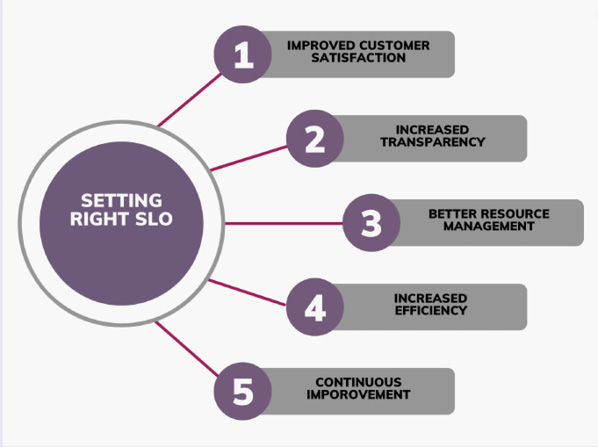
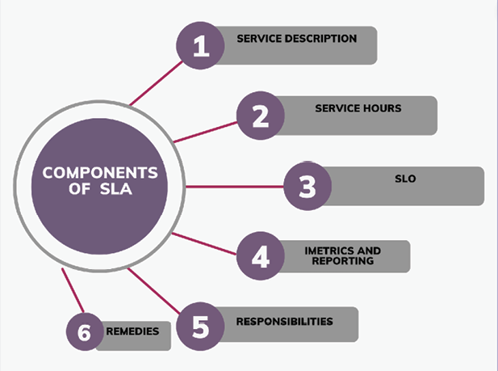
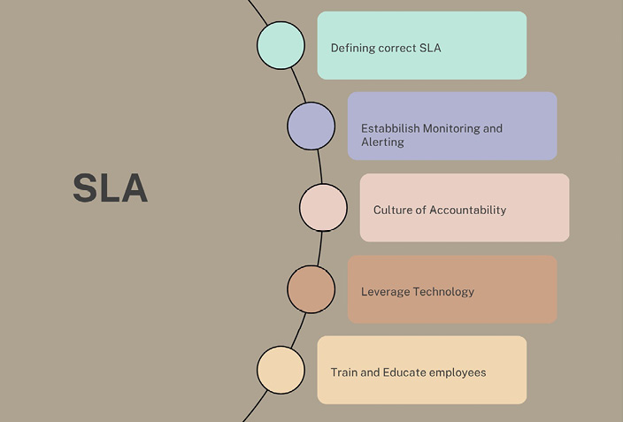

# 6 SLI/SLO/SLA

## 引言

在[[站点可靠性工程]]（SRE）领域中，三个缩写词频繁出现：SLI、SLO 和 SLA。这些术语描述了一种衡量和管理服务可靠性的方法论。理解并正确应用它们对于任何寻求确保其产品和服务可靠性和可用性，同时保持健康功能开发节奏的组织来说至关重要。

在当今竞争激烈的市场中，服务可靠性与服务质量同等重要。然而，我们如何量化可靠性？我们如何在内部以及与客户沟通并承诺这些可靠性标准？

让我们深入探讨这些概念，以理解它们的含义、为什么它们重要，以及它们如何融入 SRE。当我们阅读本章时，重要的是要认识到 SLI、SLO 和 SLA 不仅仅是数字和目标。它们是重要的工具，帮助将技术团队与业务目标对齐，使主动事件管理更容易，并确保客户标准得到满足。在本章结束时，读者将全面理解这些概念以及如何在站点可靠性工程中很好地使用它们。

## 本章结构

在本章中，我们将涵盖以下主题：

- 服务级别管理简介
- 服务级别管理概述
- SLM 的关键组成部分：SLI、SLO 和 SLA
- 实施 SLM 计划的益处
- 理解服务级别指标
  - SLI 的目的
  - SLI 的类型及其用例
  - 选择合适的 SLI
  - SLI 在监控和衡量服务性能中的重要性
- 设定服务级别目标
  - SLO 设定的目的
  - 设定适当的 SLO
- 创建服务级别协议
  - SLA 的目的
  - SLA 的组成部分
  - SLA 的谈判
- 实施和管理 SLM 计划
  - 实施 SLM 计划的步骤
  - 管理 SLI、SLO 和 SLA 的最佳实践
  - 常见挑战及其克服方法
- 技术在自动化 SLM 中的作用
- 案例研究和现实世界示例
  - Netflix
  - Adobe
  - LinkedIn

## 学习目标

本章的主要目标是清晰地阐明这些关键的站点可靠性工程概念的各种细微差别。在阅读内容时，你将获得对服务度量、可靠性目标和正式化服务协议的全面考察。在本章中，我们将解构这些定义，你还将了解它们在现实世界中的实际应用，并辅以行业案例研究。我们将讨论 SLI、SLO 和 SLA 之间的相互联系和依赖关系，重点强调它们在确保服务可靠性方面的协作作用。到本章结束时，读者不仅将对概念区别有深刻的理解，还将具备在组织中战略性地实施这些概念的能力。

## 服务级别管理简介

**服务级别管理**（Service Level Management，SLM）是定义、监控和管理 IT 服务性能和可用性以满足业务需求的过程。SLM 的主要目标是确保 IT 服务以良好的质量水平交付，并且与服务相关的风险得到良好管理。SLM 是 IT 服务管理（ITSM）的重要组成部分。它包括多项任务，如定义服务级别、监控服务性能、报告服务性能，以及采取纠正措施以确保服务达到约定的性能和可用性水平。

### 服务级别管理概述

SLM 是一个持续的过程，涉及定期审查 IT 服务，以确保它们满足业务需求，并且业务或技术环境中的任何变化都能反映在服务级别中。

为了使 SLM 有效运作，IT 与业务之间的协作至关重要。需要有效的沟通和就满足业务需求所需的基本服务级别达成共识。它还需要对持续改进的高度关注，定期审查服务级别和流程，以确保它们是最新的并满足业务需求。

### SLM 的关键组成部分：SLI、SLO 和 SLA

这些工具非常重要，因为它们帮助你判断系统是否工作良好、易于使用以及是否有用。如果它们没有直接连接到公司的目标，你将没有任何信息来判断你所做的选择对公司是好是坏。SLM 的关键组成部分是**服务级别指标**（Service Level Indicators，SLI）、**服务级别目标**（Service Level Objectives，SLO）和**服务级别协议**（Service Level Agreements，SLA）。

**SLI** 是代表服务性能的指标，例如可用性、响应时间或错误率，这些对于监控服务健康状况和发现可能影响客户体验的问题至关重要。SLI 通常使用监控工具来衡量，并以百分比或比率表示。例如，网站可用性的 SLI 可以是网站在给定时间段内可用的时间百分比。

**SLO** 用于定义客户期望的服务级别，并使服务与业务目标保持一致。SLO 通常以百分比或比率表示，由服务提供商与客户协作设定。例如，网站可用性的 SLO 可能是每月 99.9% 的运行时间。

SLO 通过以下方式改进 SLI：
- 设定清晰的性能目标
- 提供持续评估的反馈循环
- 指导工作优先排序，使 SLI 与用户期望保持一致

**SLA** 是定义服务提供商与客户之间关于将要提供的服务级别的正式协议的合同。SLA 基于 SLO，并规定了如果服务提供商未能达到约定的服务水平将产生的后果。SLA 是服务级别管理的关键组成部分，因为它们为衡量和报告服务性能以及管理客户期望提供了基础。SLA 通常包括服务范围、服务级别、指标、报告要求，以及未达到约定服务级别的处罚和补救措施等细节。

### 实施 SLM 计划的益处

SLM 的关键益处包括：

- **IT 服务与业务需求对齐**：SLM 确保服务级别与业务需求保持一致，这有助于与客户建立信任和信誉。
- **提高服务质量**：SLM 提供了衡量和改进服务质量的框架，有助于提升客户体验和满意度。
- **主动的问题识别和解决**：SLI 提供服务性能的实时监控，有助于在问题影响客户体验之前发现问题。这使得能够主动识别和解决问题，最大限度地减少服务中断和停机时间。
- **降低运营成本**：SLM 有助于优化 IT 资源的使用，从而降低运营成本并提高效率。

## 理解服务级别指标

我们在前一节中简要讨论了 SLI。现在，让我们详细讨论。

SLI 是显示特定服务运行状况的度量。换句话说，它用于衡量服务质量，并判断是否达到用户的期望。

### SLI 的目的

SLI 是 SLM 的关键组成部分，在确保服务满足用户期望方面发挥着重要作用。SLI 的目的是提供服务性能的量化度量。它们帮助服务提供商监控其服务质量并识别改进领域。

SLI 通常衡量可用性、响应时间、吞吐量和错误率。这些指标提供了一种清晰、客观的方式来衡量服务质量，使服务提供商能够满足其 SLA 的要求，并确保满足客户的期望。

通过跟踪 SLI，服务提供商可以主动监控其服务健康状况，并在问题影响用户体验之前发现问题。这使得提供商能够识别改进领域并优先安排工作以改善服务。它还帮助提供商做出关于如何分配资源的明智决策，并确保其服务满足客户需求。SLA 使用 SLI 来告知服务提供商他们需要满足的目标和期望。可用性、响应时间、吞吐量和错误率是一些最常见的 SLI 类型。

### SLI 的类型及其用例

不同的 SLI 关注服务的不同部分，提供了服务运行情况的完整图景。在本节中，我们将讨论不同种类的 SLI 及其使用方式。

- **可用性（Availability）**：可用性 SLI 显示服务可用的时间段。此 SLI 用于跟踪服务的可用性，并确保其满足 SLA 的可用性要求。
- **响应时间（Response Time）**：响应时间 SLI 衡量服务响应用户请求所花费的时间。它用于监控服务的速度和性能，使提供商能够发现并修复可能对用户体验产生负面影响的问题。
- **吞吐量（Throughput）**：吞吐量 SLI 衡量服务在特定时间内可以处理的数据量或业务量。此 SLI 用于监控服务的容量和可扩展性，确保其能够处理预期负载并满足 SLA 的要求。
- **错误率（Error Rate）**：错误率 SLI 衡量失败或返回错误的请求数量。此 SLI 用于检查服务的可靠性和稳定性，使提供商能够发现问题并加以修复，以免影响用户体验。
- **延迟（Latency）**：延迟 SLI 衡量用户请求从开始到结束完成所花费的时间。它用于监控服务的整体性能，使提供商能够发现并修复可能影响用户体验的瓶颈。

### 选择适当 SLI 的关键因素

选择适当的 SLI 是 SLM 中的关键步骤。正确的 SLI 使服务提供商能够衡量和跟踪其服务性能，帮助他们发现问题并改善用户体验。在本节中，我们将讨论选择适当 SLI 时需要考虑的关键因素：

- **业务需求**：SLI 必须与服务业务需求保持一致。例如，如果任务是关键性的，可用性 SLI 可能是优先事项。如果服务面向用户，响应时间 SLI 可能更重要。
- **用户期望**：SLI 必须反映用户对服务的期望。例如，如果用户期望快速响应时间，则必须跟踪响应时间 SLI 以确保服务满足用户期望。
- **技术能力**：SLI 必须在技术上可跟踪和监控。例如，某些 SLI 可能难以准确测量，或者其监控可能需要大量资源。
- **服务组件**：SLI 必须反映服务的不同组件。例如，如果服务依赖多个后端系统，吞吐量 SLI 可能对衡量每个系统的性能至关重要。
- **SLA**：SLI 必须与服务的 SLA 要求保持一致。例如，如果 SLA 要求 99.9% 的运行时间，则必须跟踪可用性 SLI 以确保服务满足 SLA 要求。
- **趋势**：SLI 必须随时间跟踪以识别趋势和模式。例如，如果错误率 SLI 增加，服务提供商必须识别根本原因并采取适当行动。

对用户期望的全面理解、与业务目标的一致性以及随时间衡量和监控 SLI 的能力，是选择适当 SLI 的必要条件。服务提供商可以通过仔细选择应使用的 SLI、持续监控这些 SLI 并根据需要进行调整，来确保其产品符合客户设定的标准并提供高质量的用户体验。

### SLI 的重要性

SLI 对于监控和衡量服务性能至关重要，提供了用户体验的客观度量，并使服务提供商能够持续改善服务性能。通过衡量对用户最重要的关键性能指标，SLI 帮助服务提供商识别服务不足之处并采取行动以增强用户体验。此外，SLI 是 SLA 的重要组成部分，确保服务提供商满足 SLA 中概述的要求，避免因不合规而受到处罚。

## 设定服务级别目标

SLO 是服务提供商希望在一段时间内针对特定 SLI 达到的目标。它通常定义为有效请求总数的百分比或比率，用于设定服务提供商希望达到的具体性能目标。

### SLO 的目的

SLO 是 SLM 的重要组成部分，用于明确服务提供商希望实现的目标。通过设定 SLO，服务提供商可以确保其性能目标符合客户和其他利益相关者的需求。通常，SLO 用于建立关键性能指标（KPI），以跟踪和衡量服务随时间推移的性能。

例如，服务提供商可能为其服务设定 99.9% 运行时间的 SLO。这意味着他们希望确保用户在 99.9% 的时间内可以访问该服务。SLO 可以随着服务提供商获得更多关于服务运作方式的经验和知识而随时间变化。它们通常与 SLA 一起使用，以确保服务提供商达到约定的性能目标。

### 设定适当的 SLO

作为 SLM 的一部分，为每个服务选择合适的 SLO 非常重要。SLO 的选择应基于多个因素，例如服务在业务中的重要性、资源的可用性以及用户对服务的需求。以下是为不同服务选择 SLO 时需要考虑的一些重要事项：

- **了解服务**：在选择 SLO 之前，你应该对服务有充分的了解，包括其目的、运作方式和目标受众。这将帮助你确定哪些关键性能指标对目标受众和利益相关者最重要。
- **确定关键性**：确定服务的重要性。并非所有服务都是相同的，有些服务对业务来说比其他服务更重要。在选择 SLO 时，确定哪些服务对业务最重要并按重要性排序很重要。
- **分析历史表现**：查看服务过去的表现，分析可能影响 SLO 选择的任何趋势或模式。这可以帮助你设定可实现的目标。
- **现实的目标**：设定在可用资源下可以实现的现实目标。不切实际的目标可能使团队成员感到沮丧和疲惫，从而长期影响服务性能。
- **定期审查**：SLO 应根据服务变化、用户反馈和性能趋势定期审查和更改。这确保了 SLO 仍然有用并且可以随着时间的推移达到。

设定正确期望的建议：

- **定义 SLO 涵盖和不涵盖的内容**：这有助于确保用户确切知道 SLO 涵盖的内容并相应使用。
- **SLO 应易于理解**：避免使用技术术语或复杂语言。这确保每个人，即使是非技术背景的用户，也能理解 SLO。
- **SLO 应与业务目标一致**：SLO 应对组织中的每个人都重要且相关。它应与业务的总体目标和目标以及用户的期望保持一致。
- **提供清晰的信息**：定期更新服务与 SLO 对比的表现，包括任何问题或宕机。这表明服务提供商致力于达到 SLO，并帮助用户信任和理解它。
- **保持现实**：确保 SLO 基于服务过去的表现、可用资源和其他重要因素是合理且可行的。不切实际的 SLO 可能使用户和服务提供商都感到失望和不满意。

设定正确 SLO 的益处如下图所示：

**图 6.1：设定正确 SLO 的益处**

## 创建服务级别协议

SLA 是服务提供商与其客户或其他相关方之间描述所提供服务级别的正式合同。SLA 解释了对服务质量和可用性的期望，并提供了一种衡量和报告提供商表现的方法。

### SLA 的目的

签署 SLA 的原因如下：

- **设定期望**：SLA 有助于在服务提供商与其客户或其他利益相关者之间设定关于服务级别和质量的清晰期望。这有助于确保双方就服务范围和预期的性能水平达成一致。
- **衡量和改善性能**：SLA 为提供商提供了衡量和报告其性能的方法。这让提供商能够注意到改进空间并采取措施解决问题。它还提供了一种随时间跟踪进度并客观确保提供商履行承诺的方法。
- **保持服务提供商的责任**：SLA 是服务提供商与其客户或其他利益相关者之间的正式合同。这为客户和利益相关者提供了一种追究服务提供商责任的方式。如果提供商未达到约定的服务，这可能包括罚款或其他措施。
- **提高客户满意度**：SLA 可以通过明确定义将提供的服务水平并对照该标准衡量性能来提高客户满意度。这确保了客户的需求得到满足，并且任何问题都能得到快速处理。

### SLA 的组成部分

SLA 可能因所提供的服务以及组织、其客户或其他利益相关者的需求而有所不同。不过，大多数 SLA 包含以下部分或全部组成部分：

- **服务描述**：对所提供服务的描述，包括其目的、范围和任何重要的技术细节。
- **服务时间**：服务可用的时间，包括任何计划的维护窗口或服务将关闭的时间。
- **SLO**：服务提供商必须为每个 KPI 达到的具体性能目标，如运行时间、响应时间或解决时间。
- **指标和报告**：用于衡量服务性能的指标，以及性能数据的报告频率和形式。
- **升级流程**：将问题或事件升级的步骤，包括在每个级别联系谁以及他们的角色是什么。
- **责任**：服务提供商和客户或利益相关者的具体责任，包括与安全、数据隐私或其他监管要求相关的任何义务。
- **补救和处罚**：如果服务提供商未达到约定的 SLO，将产生的任何经济处罚或其他后果。
- **终止和续约**：终止或续约 SLA 的条款和条件。

通过将上述部分纳入 SLA，服务提供商及其客户或其他利益相关者可以为服务性能设定清晰期望，衡量和报告性能，并拥有追究服务提供商不履行承诺责任的方法。请参考下图：

**图 6.2：SLA 的组成部分**

### SLA 的谈判

服务提供商和客户或利益相关者必须就 SLA 的条款和条件达成一致。在谈判过程中，需要识别利益相关者，定义要提供的服务，并设定 KPI 来衡量服务性能。然后，为每个 KPI 设定性能目标。这些目标应可实现、对双方都有意义，并基于历史数据、行业基准和客户的具体需求。指标和报告方式也要确定，包括用于共享性能信息的任何仪表板或其他工具。升级程序需要达成一致，包括在每个升级级别联系谁以及他们的角色是什么。服务提供商和客户或利益相关者的责任都要明确，包括与安全、数据隐私或其他监管要求相关的任何义务。如果服务提供商未达到约定的性能目标，则设定后果或处罚。通过遵循这些步骤，谈判过程可以帮助为持续的服务关系奠定坚实基础，确保 SLA 满足双方的需求和期望。

## 实施和管理 SLM 计划

实施和管理 SLM 计划涉及几个阶段和持续活动，以确保满足 SLA 并且服务满足客户和利益相关者的需求。实施监控和测量工具、定义角色和职责、建立沟通渠道、进行定期审查、持续改进服务以及管理事件、升级和合同是重要的步骤。持续的监控、沟通和持续改进对计划的长期成功至关重要。

### 实施 SLM 计划的步骤

根据组织和所提供的服务，建立 SLM 计划的步骤可能有所不同。但总体而言，需要采取以下步骤：

1. 确定你提供的服务以及你想要实现的目标。
2. 识别参与提供和管理服务的人员。
3. 决定对确保服务良好运行最重要的事项。
4. 为每个任务设定目标，以便你知道目标是什么。
5. 决定如何衡量和报告实现目标的进展。
6. 规划如何处理在此过程中出现的任何问题。
7. 确保所有相关人员知道他们在提供服务中的角色。
8. 建立一种让所有人都能轻松沟通的方式，以便保持信息同步。
9. 定期审查服务表现，并在必要时进行更改。
10. 始终根据反馈和出现的任何问题寻找改进服务的方法。

### 管理 SLI、SLO 和 SLA 的最佳实践

在管理 SLI、SLO 和 SLA 时，可以遵循一些实践以确保成功：

- 确保所有参与流程的人都理解期望。对计划和目标要清晰。
- 使用使衡量进展更容易的工具。有很多工具可以帮助你了解进展。
- 密切关注情况。定期审查并在必要时进行更改。
- 定期与所有相关利益相关者沟通。确保每个人都知道自己的责任和计划的进展。
- 制定处理出现的问题或事件的计划。确保每个人都知道在出现问题时自己的责任。
- 确保每个人都知道自己在流程中的角色。这有助于避免混淆，并确保每个人都朝着相同的目标共同努力。
- 保持灵活，愿意根据需要调整。情况可能快速变化，因此适应新情况很重要。

通过遵循这些实践，你可以帮助确保你的 SLI、SLO 和 SLA 是有效的，并且你提供的服务满足客户和利益相关者的需求。

### 常见挑战及其克服方法

设定正确的 SLA 可能很困难，一些常见问题包括：

- **对所提供服务缺乏清晰度**：如果对所提供服务、其范围和目标缺乏清晰度，则难以建立清晰的 SLA。
- **不切实际的性能目标**：利益相关者可能对服务水平有不切实际的期望，使得制定可达成的 SLA 变得困难。
- **数据或历史性能信息不足**：获取准确的数据和历史性能信息对于制定有意义的 SLA 至关重要。如果缺乏这些信息，设定现实的目标就会很困难。
- **对 KPI 缺乏共识**：利益相关者可能对哪些 KPI 更重要存在分歧，使得建立有效的 SLA 变得困难。
- **资源有限**：缺乏资源，如预算、人员或技术有限，可能使达到期望的服务性能水平和设定现实的 SLA 变得困难。
- **缺乏沟通和协作**：有效的 SLA 需要服务提供商和利益相关者之间的开放沟通和协作。如果缺乏沟通或协作，就很难建立满足每个人需求的有效 SLA。
- **监控和测量工具不足**：没有合适的工具和资源，监控和衡量服务性能可能很困难。

组织可以通过意识到这些常见挑战并建立有意义、可实现且有效的 SLA 来满足所有利益相关者的需求。

## 技术在自动化 SLM 中的作用

技术是自动化 SLM 的关键部分。它提供了有助于以更简单、更快速的方式建立、跟踪和报告 SLA 的工具和资源。技术可以通过以下方式提供帮助：

- **自动化数据收集和分析**：有了正确的技术工具，可以自动收集和分析服务性能数据。这使得跟踪和报告 SLA 更加容易。
- **实时跟踪服务性能并发送告警**：技术可以实时跟踪服务性能，甚至在 SLA 面临被违反的风险时发送告警。
- **简化协作和沟通**：技术工具可以使服务提供商和利益相关者更容易地协同工作和相互沟通，从而使建立和管理 SLA 更加容易。
- **改进报告和可视化**：技术可以通过提供数据可视化工具来帮助提高 SLA 报告的准确性和清晰度，使理解和分析服务性能更加容易。
- **提高效率和生产力**：自动化可以帮助减少管理 SLA 所需的时间和精力，释放资源用于其他重要任务。
- **实现持续改进**：通过提供定期性能数据和数据分析的技术工具，服务提供商可以发现改进领域并对 SLA 进行更改以满足利益相关者的需求。

通过使用技术来自动化 SLM，组织可以提高满足客户和其他利益相关者需求的能力，提供高质量的服务，并提高效率和生产力。

有多种工具可以帮助自动化 SLM，使建立、跟踪和报告 SLA 更加容易：

- **监控和告警工具**：用于监控服务性能，并在 SLA 面临被违反的风险时发送实时告警。例如 Nagios、Zabbix、Splunk、Dynatrace 和 Datadog。
- **服务台和工单系统**：管理客户请求和问题，并跟踪服务性能指标。例如 Jira Service Desk 和 Zendesk。
- **分析和报告工具**：帮助服务提供商和利益相关者了解服务表现如何，并发现改进领域。例如 Tableau、Power BI 和 Google Analytics。
- **协作和沟通工具**：使服务提供商和决策者更容易进行对话和协作。例如 Slack、Microsoft Teams 和 Trello。
- **自动化和工作流工具**：帮助自动化日常任务和工作流，使管理 SLA 更容易且耗时更少。例如 Zapier、IFTTT 和 Microsoft Flow。

通过使用这些工具，组织可以自动化和简化其服务级别管理流程，使其更容易满足 SLA、提供高质量服务以及满足客户和利益相关者的需求。

## 案例研究和现实世界示例

许多不同行业的组织已成功实施 SLM 计划，以改善其服务交付并满足客户需求。以下是一些示例：

### Netflix

Netflix 的 SLM 计划是其流媒体体验卓越的原因。该计划确保其流媒体质量、可用性、可靠性和速度满足客户期望。它使用自动化工具来跟踪和改善服务性能。他们甚至有一个名为 Chaos Monkey 的工具，故意使 IT 系统故障，以便他们能够在客户受到影响之前快速发现和修复问题。这是一种混沌工程工具，我们将在第 10 章中讨论。

Netflix 收集客户对其流媒体体验的反馈，以便不断改进服务。他们利用这些反馈来调整 SLA，并将视频质量和缓冲时间置于优先位置。Netflix 还拥有一个公开仪表板，显示流媒体速度、错误数量和服务可用时间等性能指标，让客户了解服务的运行情况以及 Netflix 是否在满足其 SLA。少数公司为此使用 Grafana 仪表板。

总的来说，SLM 计划是 Netflix 业务计划的重要组成部分。它帮助他们为客户提供出色的流媒体体验并保持竞争力。Netflix 通过关注服务性能和客户感受，确保始终满足客户的需求和期望。

### Adobe

Adobe 是另一家高度重视 SLM 以确保其产品和服务满足客户需求的公司。Adobe 的 SLA 旨在为客户提供对其 Creative Cloud 应用的可靠访问，以及及时的支持和问题解决服务。

Adobe 使用多个数据中心和内容分发网络（CDN）来确保其产品和服务始终可用且性能良好，这是其 SLM 计划的关键部分。通过在多个地点分布服务，Adobe 可以减少停机时间，并使全球客户在需要时更容易获得帮助。Adobe 还拥有一支 7x24 小时的技术支持工程师团队，帮助客户解决任何问题。公司有一个工单系统来跟踪客户问题并确保问题得到快速解决。

Adobe 的 SLM 计划的另一个重要部分是致力于对客户保持开放和沟通。公司通过公共仪表板定期更新服务可用性和性能信息，在出现服务问题或其他问题时直接与客户沟通。

总的来说，Adobe 的 SLM 计划是其业务战略的关键部分。它帮助公司确保其产品和服务可靠且高质量。通过使用多个数据中心和 CDN、拥有专门的支持资源以及将透明度和与客户的沟通放在首位，Adobe 可以确保满足其 SLA 并且客户对其产品和服务感到满意。

### LinkedIn

LinkedIn 是使用 SLA 的一个很好的例子，它非常注重 SLM 以确保其平台始终可靠且易于用户使用。LinkedIn 的 SLM 计划的目标是确保用户始终可以访问平台并在需要时获得帮助。

他们使用多个数据中心和 CDN 来确保高可用性和性能。通过在多个地点分布服务，LinkedIn 可以减少停机时间，并使全球用户随时获得帮助。这有助于确保满足 SLA 并且用户对所获得的服务感到满意。

LinkedIn 的 SLM 计划的另一个重要部分是致力于对用户保持开放和沟通。公司通过公共仪表板定期更新服务可用性和性能信息。在出现服务问题或其他问题时，公司也会直接与用户沟通。这有助于用户信任服务，并确保他们始终了解情况。

## 结论

实施 SLM 计划可以朝着确保组织服务达到或超越客户期望迈出的重要一步。以下是一些为希望实施 SLM 计划的组织提供的建议：

**图 6.3：SLA 建议**

总的来说，设定 SLA 的目标是建立一个清晰一致的服务交付框架，有助于确保客户获得他们所期望的服务质量水平，并且服务提供商能够始终如一地交付该服务质量。

在下一章中，我们将讨论在 SRE 中预测和控制系统资源的重要方法和工具。该章深入探讨了准确预测未来服务需求并使其与当前基础设施能力相匹配的方法。我们将考察容量规划如何在保持成本效益的同时确保系统可扩展性、性能和可靠性。重点将放在将技术需求与业务目标相结合、利用数据驱动的方法以及增加自动化以实现动态可扩展性。通过本章的学习，读者将理解主动资源管理在维持完美服务交付中的必要性。

## 选择题

1. SLI 在 SRE 中代表什么，它衡量什么？
   a. 服务级别推断（Service Level Inference）：对服务可靠性的预测
   b. 服务级别指标（Service Level Indicator）：用于衡量服务性能的特定指标
   c. 服务许可证实施（Service License Implementation）：详述服务权限的法律文件
   d. 系统负载指数（System Load Index）：系统资源使用情况的度量

2. 以下哪项最好地描述了 SLO？
   a. 服务提供商和客户之间的法律合同
   b. 服务旨在达到的目标性能水平
   c. 指示服务当前性能的指标
   d. 概述拟议服务增强的内部文件

3. SLO 和 SLA 之间的主要区别是什么？
   a. SLO 定义预期利润，而 SLA 定义预期服务水平
   b. SLO 是服务提供商设定的目标，而 SLA 是与客户约定的承诺
   c. SLO 用于外部，而 SLA 仅用于内部
   d. 没有区别，它们是可互换的术语

4. 未能满足 SLA 可能产生什么后果？
   a. 提高客户满意度
   b. 降低运营成本
   c. 可能产生经济处罚或其他合同后果
   d. 增加服务的错误预算

5. SRE 团队如何使用 SLI 和 SLO？
   a. 计算他们的年度奖金
   b. 确保符合国际标准
   c. 指导服务开发和运营的决策
   d. 监控团队成员的个人表现

**答案**
1. b
2. b
3. b
4. c
5. c
