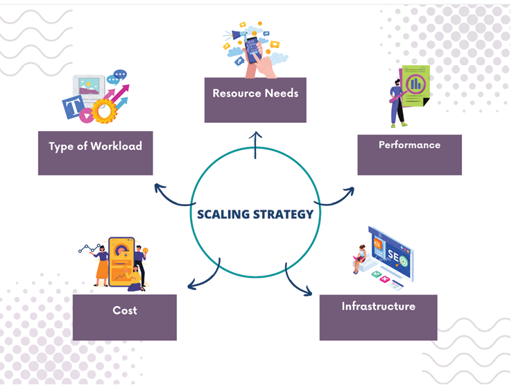

# 7 容量规划

## 引言

**容量规划**（Capacity Planning）是确定为满足组织 IT 基础设施当前和未来需求所需资源的过程。在[[站点可靠性工程]]（SRE）的背景下，容量规划对于确保应用和服务在保持合理成本结构的同时满足其性能和可用性要求至关重要。

容量规划涉及分析历史使用数据、预测未来使用模式以及确定每个应用或服务的资源需求。这些信息用于进行容量分析，帮助 SRE 团队理解性能、可用性和成本之间的权衡。基于此分析，SRE 团队可以制定扩展策略，确保有足够的资源来满足需求。

有效的容量规划需要深入了解每个应用或服务所需的资源，以及实时监控和分析使用模式的能力。随着云计算和分布式架构的日益普及，容量规划变得更加复杂，因为组织必须优化跨多个环境和服务的资源利用。

在本章中，我们将探讨 SRE 容量规划中的关键概念和技术。我们将涵盖理解资源需求、进行容量分析、制定扩展策略、监控与告警、云中容量规划以及灾难恢复容量规划等主题。在本章结束时，你将扎实理解容量规划如何融入更广泛的 SRE 背景，以及确保你的应用和服务在保持合理成本结构的同时满足性能和可用性要求所需的工具和技术。

## 本章结构

在本章中，我们将涵盖以下主题：

- SRE 中容量规划的重要性
  - 容量管理的原则
- 理解资源需求
  - 识别关键资源
  - 分析历史使用数据
  - 预测未来使用模式
- 容量分析
  - 容量分析以确定工作负载资源
  - 性能、可用性和成本之间的权衡
- 扩展策略
  - 为每个应用/服务选择合适的扩展策略
  - 自动扩缩容和负载均衡的考虑因素
- 监控与告警
  - 设置监控工具
  - 定义关键指标的告警阈值
  - 主动容量规划策略
- 云中容量规划
  - 理解云资源分配模型
  - 利用云提供商工具
- 灾难恢复的容量规划
  - 灾难恢复容量需求
  - 制定灾难恢复容量计划
  - 灾难恢复计划与容量

## 学习目标

在本章中，我们的目标是理解并有效实施策略，确保系统资源满足当前和未来的需求。我们打算研究预测流量模式和资源利用率的方法，从而实现主动调整。本章将专注于结合业务目标与技术需求，并确保容量规划与组织发展和用户期望保持一致。我们还将考察自动化在动态资源分配和扩展中的作用。在本章结束时，读者应能够优化资源利用、平衡成本与性能，并在 SRE 实践中保持高服务可靠性。

## 容量规划的重要性

估算系统或应用最佳运行所需的资源被称为容量规划，这是 SRE 的关键组成部分。容量规划是确定应用或系统需要多少容量才能满足其需求。这确保了资源的有效利用，并使应用或系统满足性能要求。

通过使用容量规划，组织可以为潜在的需求增长做好准备、避免资源浪费并确保最佳系统性能，这在 SRE 中至关重要。容量规划使 SRE 团队能够预测增长模式并预见满足预期需求所需的资源。它使他们能够预测应用或系统将经历的流量和使用模式，确保基础设施可扩展并能处理预期负载。通过确保资源的有效利用，容量规划有助于成本优化。它帮助组织避免过度配置资源（这可能是昂贵且浪费的）和配置不足（这可能导致系统性能不佳和未来的停机）。容量规划在维护系统可靠性方面至关重要。它确保系统有足够的资源来处理预期负载，减少系统过载、性能不佳甚至崩溃的可能性。容量规划帮助组织保持高水平的服务可靠性和可用性。

容量规划使组织能够最有效地利用资源。它有助于识别和消除未充分利用的资源，并确保所有资源以最佳方式使用以满足系统需求。容量规划确保用户在使用系统或应用时获得流畅的体验。它确保系统始终可用、性能最佳，并能处理突然的需求激增。

### 容量管理的原则

成功的容量管理需要从两个复杂的角度分配资源：**资源供应**（提供当前运行服务的初始容量）和**容量规划**（确保服务未来的可靠性）。

容量管理基于三条基本规则，这些规则必须遵循，服务才能可扩展、可用和可管理：

1. **服务必须充分利用其拥有的资源**。需要大量资源的大型服务，其建立和运行成本很高。
2. **服务必须始终工作**。限制资源容量以使服务更高效可能导致服务崩溃或对用户不可用。服务效率和可靠性并不总是一回事。
3. **服务增长需要规划**。为服务添加资源可能需要很长时间，并且在实际部署中受到限制。这可能意味着购买和设置新硬件或数据中心。还可能有必要增加服务所依赖的其他软件系统和基础设施的容量。

## 理解资源需求

SRE 容量规划必须考虑资源需求。这涉及识别支持给定工作负载所需的资源，如 CPU、内存、存储、网络带宽和其他硬件和软件资源。

### 识别关键资源

理解资源需求需要几个步骤：

1. **定义工作负载**：在识别资源需求之前，必须了解工作负载的性质。这意味着了解请求的种类和数量、请求的到来频率以及响应所需的时间。
2. **识别每个组件的资源需求**：一旦定义了工作负载，必须识别构成系统或应用的每个组件的资源需求。这包括确定应用服务器、数据库服务器、负载均衡器、网络设备等部分对资源的需求。
3. **测量资源利用率**：一旦识别了每个组件的资源需求，必须测量当前的资源利用率水平。这为确定所需资源数量提供了起点。
4. **估计未来资源需求**：基于工作负载、组件资源需求和当前资源利用率水平，可以估计未来的资源需求。这涉及预测未来的工作负载量，并预测系统或应用在不同需求水平下的表现。
5. **确定资源的最佳使用方式**：一旦估计了未来的资源需求，找出满足它们的最佳方式很重要。这包括确定处理工作负载所需的服务器、存储空间和网络带宽的数量，以及如何在各个部分之间分配资源。

定期监控和调整资源分配至关重要。这涉及定期审查资源需求并调整资源分配，以确保最佳的性能和效率。

### 分析历史使用数据

在 SRE 中，容量规划的关键部分是分析过去的使用数据。它涉及检查过去的使用模式和趋势，以准确预测未来的需求和资源需求。

分析过去使用数据的步骤：

1. **收集使用数据**：第一步是从各种来源（如应用日志、系统日志和监控工具）收集使用数据。这些数据应包括资源利用率、请求量、响应时间和其他相关指标的信息。
2. **识别模式和趋势**：收集数据后，必须识别使用中的模式和趋势。这意味着寻找请求数量、资源使用方式和响应时间中的模式。例如，如果在一年中的某些时候（如假日季节）需求有规律地增加，应该识别这个模式并在容量规划中考虑。
3. **预测未来需求**：通过查看历史使用数据，可以准确预测未来需求。这需要使用统计方法，如时间序列分析和回归分析，以发现趋势并预测未来的使用模式。
4. **估计资源需求**：预测未来需求后，可以计算满足该需求所需的资源。使用容量模型、外推法、模拟和基准测试来确定满足未来需求所需的资源。
5. **规划容量**：估计资源需求后，可以通过分配资源、更改配置和根据需要规划额外基础设施来规划容量。
6. **监控和调整**：最后，必须持续监控使用模式，并根据需要调整资源分配和容量规划流程，以确保最佳的系统性能和可靠性。

### 预测未来使用模式

预测未来使用模式是 SRE 中容量规划的一个重要方面。它涉及使用历史数据准确预测未来的使用模式，使组织能够为未来需求进行规划并相应分配资源。

预测未来使用模式的几种方法：

- **时间序列分析**：分析过去的使用数据以识别随时间变化的趋势和模式。使用移动平均、指数平滑和趋势分析等技术，这些数据可用于预测未来的使用情况。
- **回归分析**：分析过去的使用数据以识别不同变量之间的关系，如请求量和一天中的时间。这些信息可用于通过基于一个变量的值预测另一个变量的值来预测未来的使用模式。
- **模拟**：创建系统或应用的模型，并基于各种场景模拟未来的使用模式。这些信息可用于估计未来的资源需求并相应规划容量。
- **外推法**：使用过去的使用数据，通过将当前趋势延伸到未来来预测未来的使用模式。这种方法对于短期预测很有用，但对于长期预测可能不那么准确。
- **基准测试**：将使用模式与类似系统或应用进行比较，以识别潜在的改进领域。这些数据可用于规划未来需求和优化资源利用。

一旦预测了未来的使用模式，就可以估计支持该需求所需的资源。使用容量模型、外推法、模拟和基准测试来确定满足未来需求所需的资源。为了确保最佳的系统性能和可靠性，持续监控使用模式并根据需要对资源分配和容量规划流程进行调整至关重要。

## 容量分析

容量分析的目标是在潜在性能瓶颈发生之前发现它们，并规划容量需求，以确保系统可靠且可用。SRE 通常使用负载测试、基准测试和预测等工具和方法来收集数据，并基于可靠信息做出容量规划决策。

通过定期进行容量分析和规划资源需求，SRE 可以确保其系统能够跟上不断增长的需求，并保持用户和企业期望的高可靠性水平。

SRE 要进行容量分析，需要对系统架构和组件有深入了解，包括它们如何协同工作以及与底层基础设施的关系。在确定所需资源时，还必须考虑流量模式、用户行为和业务需求等因素。

### 容量分析以确定工作负载资源

任何系统要成功管理预期负载，必须首先进行彻底的容量分析。要开始容量分析，需要确定系统的预期工作负载。收集来自利益相关者（如业务所有者和产品经理）的意见是这个过程的重要部分，还包括分析历史使用数据以及基于趋势或业务预测预测预期使用模式。一旦确定了预期工作负载，就可以规划必要的资源。识别可能限制系统处理工作负载能力的瓶颈或约束，需要分析系统架构，包括硬件和软件组件。

为了了解系统对各种负载的响应，SRE 可以使用负载测试、基准测试和性能监控等工具。通过这些信息，可以精确定位潜在的性能瓶颈，如 CPU 或内存限制、网络拥塞或 I/O 约束。SRE 可以通过分析历史数据来计算工作负载所需的容量。为此，可能需要扩展（添加更多服务器）或缩减（关闭部分）系统中的硬件资源。有时，这意味着更改运行系统的软件，如将最近使用的数据存储在缓存中或调整数据库查询以提升性能。

容量研究的目的是保证系统在预期负载下最佳运行。SRE 可以通过预测资源需求和消除潜在瓶颈，确保其系统即使在需求高峰期也能继续为用户和公司服务。

### 性能、可用性和成本之间的权衡

在进行容量分析时，SRE 需要了解性能、可用性和成本之间的相互影响。这三个因素是相互关联的，优化其中一个往往以牺牲其他为代价。

- **性能**：关于系统工作的速度和效率。为了获得高性能，SRE 可能需要添加 CPU、内存或存储等资源。但这些额外资源需要成本，无论是硬件还是运营成本。
- **可用性**：指系统保持运行并可供用户访问的能力。SRE 可能需要添加故障转移或冗余机制，如集群或负载均衡，以实现高可用性。但这些机制在硬件和运营工作量方面也有成本。
- **成本**：指系统的总成本，包括硬件和运营费用。为最小化成本，SRE 可能需要在性能和可用性方面做出权衡。例如，减少硬件资源或消除冗余机制可以降低成本，但也可能导致性能或可用性下降。

在进行容量分析时，SRE 必须理解这些权衡才能做出正确的决策。他们必须找到平衡业务和用户需求与硬件和运营成本的方法。例如，如果系统对业务非常重要，可能值得花钱购买额外的硬件或备份系统以确保其始终可用。相反，如果系统不太重要或者成本是一个大问题，SRE 可能不得不优化成本而非性能或可用性。

最终，容量分析的目标是在性能、可用性和成本之间找到最佳平衡，同时确保系统能够满足业务和用户的需求。通过理解这些权衡并做出明智的决策，SRE 可以确保其系统既可靠又具有成本效益。

## 扩展策略

扩展策略是扩大系统以处理更多工作量的方法。这些策略是容量分析的关键部分，因为它们有助于确保系统即使在工作量增加时也能保持良好的运行状态。

在容量分析期间，SRE 可能使用以下一些扩展策略：

- **水平扩展（Horizontal Scaling）**：通过添加更多服务器或实例来增加系统容量。这可能意味着向数据中心添加更多物理服务器，或向基于云的基础设施添加更多虚拟机。水平扩展更灵活、可扩展性更强，因为它允许系统通过将工作负载分布在多个实例上来处理不断增长的工作量。
- **垂直扩展（Vertical Scaling）**：向单个服务器或实例添加更多资源以使其更大。这可以通过给服务器增加内存、CPU 或存储空间来实现。垂直扩展是增加容量的快速简便方法，但由于服务器硬件的限制，有其局限性。
- **自动扩缩容（Auto Scaling）**：根据当前工作量自动添加或移除实例。自动扩缩容和水平扩展可以结合使用，以确保系统始终有足够的容量来处理负载。
- **分片（Sharding）**：将系统的数据或工作负载分割到多个服务器或实例上。这种方法常用于数据库和 Web 应用，其中数据或工作可以分解成更小、更易于管理的部分。分片有助于将负载分布在多个服务器上并增加系统的容量。
- **缓存（Caching）**：存储常用数据或计算结果，以减少系统的工作量。通过将数据存储在内存或磁盘中，系统可以更快地响应请求，并减少对支撑基础设施的压力。
- **混合扩展（Hybrid Scaling）**：同时使用多种扩展策略来达到所需容量水平。例如，系统可以同时使用垂直和水平扩展，以及缓存和分片，以确保其能够跟上不断增长的工作量。

通过在容量分析中使用这些扩展策略，SRE 可以确保系统拥有处理当前和未来工作负载需求所需的容量，同时保持高性能、高可用性和成本效益。

### 选择合适的扩展策略

需要仔细考虑多个因素才能为每个应用或服务选择合适的扩展策略。以下是一些选择扩展策略时需要考虑的重要因素。请参考下图：

**图 7.1：容量规划的扩展策略**

理解以下扩展策略的术语：

- **工作负载类型**：应用或服务所做工作的类型会极大地影响最佳扩展策略。例如，收到大量读取请求的应用可能受益于缓存以减少基础设施负载。相反，收到大量写入请求的应用可能受益于分片以将负载分布在多个实例上。
- **资源需求**：应用或服务的资源需求也会在选择合适的扩展策略中起作用。例如，需要大量内存的应用可能更受益于垂直扩展，而需要始终可用的应用可能更受益于水平扩展，后者将工作负载分布在多个实例上。
- **性能**：在选择扩展策略时，还应考虑应用或服务的期望性能水平。例如，需要低延迟的应用可能受益于缓存或分片以减少系统负载并改善性能。
- **成本**：在选择扩展策略时，还应考虑扩展应用或服务的成本。例如，对于需要高可用性的大规模应用，水平扩展可能比垂直扩展更具成本效益；而对于小规模应用，垂直扩展可能更合适。
- **基础设施约束**：在选择扩展策略时，还应考虑底层基础设施的限制，如硬件或云服务提供商。

### 自动扩缩容和负载均衡的考虑因素

在 SRE 中，容量规划是确定满足服务、应用或系统当前和未来需求所需资源的过程。自动扩缩容和负载均衡是容量规划的重要组成部分，因为它们确保服务始终可用、运行良好并能处理不同数量的流量。

**自动扩缩容**是根据当前需求自动更改分配给服务的资源（如服务器或容器）数量的能力。这确保了服务能够处理突发的流量高峰而不会过载。当需求低时，它通过减少资源数量来帮助节省成本。

**负载均衡**是容量规划的另一个重要部分。这是将传入流量分布到服务或应用的多个实例上的过程，以便没有单个实例过载。负载均衡可以通过不同的方式实现，如轮询、IP 哈希或最少连接数。它有助于确保服务始终可用并以最佳状态运行。

实施自动扩缩容和负载均衡时需要考虑的几点：

- **指标**：设置触发自动扩缩容的指标，如 CPU 使用率、内存使用率或网络流量。这些指标将根据所使用的服务或应用而有所不同。
- **扩缩容策略**：设置自动扩缩容的策略，如最小和最大实例数、扩缩容增量以及扩缩容事件之间的时间间隔。这些规则将帮助确保服务以适当的方式增长或缩减。
- **负载均衡算法**：根据服务的特性（如流量类型、实例数量和网络设置方式）选择合适的算法。这将有助于确保所有实例获得相同数量的流量。
- **健康检查**：通过设置健康检查确保只有健康的实例被添加到负载均衡池中。这将有助于防止流量被发送到无法处理的实例。
- **成本**：考虑自动扩缩容和负载均衡对成本的影响，因为添加更多实例可能会增加服务成本。在资源成本与可用性和性能需求之间取得平衡很重要。

总的来说，自动扩缩容和负载均衡是 SRE 容量规划中最重要的两个考虑因素。它们帮助确保服务能够处理不同数量的流量，同时保持高可用性和良好性能。通过有效使用这些策略，SRE 团队可以确保他们的服务始终可用，即使在高需求时期。

## 监控与告警

监控和告警是 SRE 容量规划中的关键环节。它们提供对服务或应用性能的实时可见性，使有效的自动扩缩容和负载均衡成为可能，并通过提供使用模式和趋势的数据为容量规划决策提供信息。SRE 团队通过实施强大的监控和告警策略，可以确保其服务始终可用、性能最佳，并能处理不同级别的流量。

### 设置监控工具

设置监控工具以跟踪资源利用率和性能指标是 SRE 容量规划的一个关键方面。通过跟踪关键指标和设置告警，SRE 团队可以在潜在容量问题影响用户之前识别它们并采取措施解决，确保服务或应用保持可用并以最佳状态运行。

SRE 团队通常采取以下步骤为资源使用和性能指标设置监控工具：

1. **找到关键指标**：第一步是找到需要跟踪的关键指标，以监控资源的使用情况和性能。根据所监控的服务或应用类型，这些指标可能包括 CPU 使用率、内存使用率、磁盘 I/O、网络流量和响应时间。
2. **选择监控工具**：一旦选择了关键指标，下一步是选择能够跟踪这些指标的监控工具。Prometheus、Grafana、Nagios 和 Zabbix 是 SRE 中常用的监控工具。每个工具都有其优缺点，因此选择最适合组织需求的工具很重要。
3. **安装和设置监控工具**：决定监控工具后，下一步是安装和设置它，以便能够跟踪所选指标。这通常意味着在运行服务或应用的服务器上安装代理或导出器，并设置监控工具来收集和存储指标。
4. **设置告警**：一旦监控工具被设置为跟踪所需指标，下一步是设置告警，当某些阈值被超过时通知 SRE 团队。例如，可以设置告警在 CPU 使用率超过一定百分比或响应时间超过一定阈值时通知团队。

### 定义关键指标的告警阈值

SRE 中的容量规划在很大程度上依赖于明确定义关键指标的告警阈值。当指标超过或低于告警阈值时，将生成告警。SRE 团队通过为关键指标设置告警阈值，可以主动监控服务或应用的性能，并采取措施防止可能导致停机或性能下降的潜在容量问题。

定义用于容量规划的关键指标的告警阈值可以遵循以下步骤：

1. 确定哪些指标对衡量服务或应用的健康状况最重要。关键指标的示例包括 CPU 利用率、内存消耗、网络流量、响应时间和错误率。
2. 一旦识别了关键指标，下一步是为每个指标建立可接受的范围。在此过程中，应确定系统的最佳运行范围，包括每个指标的上限和下限。这个范围不是固定的，可以根据服务性质或应用需求而变化。
3. 确定每个指标的 acceptable values 后，SRE 团队可以决定哪些值应触发告警。例如，当 CPU 利用率或服务响应时间达到某个阈值时，可能会生成告警。
4. 确定告警阈值后，SRE 团队必须设置告警系统，以便在阈值被超过时通知他们。告警可以通过电子邮件、短信以及专门的监控工具（如 PagerDuty 和 OpsGenie）等方式传递。
5. 最后，SRE 团队需要定期监控服务或应用的运行状况，并根据需要对告警阈值进行调整。根据数据和性能趋势，这可能涉及调整触发告警的阈值或调整关键指标的可接受范围。

### 主动容量规划策略

提前预测和安排潜在需求变化是主动容量规划的示例。有 SRE 团队支持的服务和应用，随着需求增长，出现停机或性能下降的可能性要小得多。以下概述了几种预见未来需求和有效分配资源的方法：

- **定期进行性能测试**：主动容量规划依赖于定期的性能测试。SRE 团队通过运行模拟不同需求水平的测试，可以在潜在瓶颈和容量问题影响用户之前发现它们。
- **实时监控性能指标**：帮助 SRE 团队在潜在容量问题出现时尽快识别。SRE 团队通过设置基于预定义阈值的告警，可以快速响应问题。
- **预测模型**：帮助预见未来需求并相应分配资源。SRE 团队通过分析历史数据和性能趋势来创建预测模型，可以准确预测未来需求并调整容量。
- **发现并修复系统低效**：是优化资源利用的关键部分。SRE 团队通过分析性能指标和定位浪费领域，可以优化资源利用并确保系统高效运行。

SRE 团队如果使用自动化和自动扩缩容，可以更快速、更有效地响应需求波动。SRE 团队通过自动化流程和使用自动扩缩容工具，可以根据需求波动自动调整资源分配。

定期性能测试、监控、预测、优化和自动化都是主动容量规划的组成部分。通过采取预防措施，SRE 团队可以确保其服务或应用无论负载如何，始终平稳可靠地运行。

根据 Luis Quesada Torres 和 Doug Colish 在其论文《SRE 容量管理最佳实践》中的定义，SRE 展示了估算使用量和发现盲点的方法。我们还讨论了构建冗余以防止故障的好处。你将利用这些信息来规划架构，以便向服务的每个部分添加资源与向整个服务添加资源具有相同的效果。请参考下表：

| 硬件 | 规格 |
|------|------|
| 处理器 | CPU 类型和数量（核心数） |
| 图形处理单元 | GPU 类型和数量 |
| 存储 | HDD 和 SSD；存储容量（TB）；带宽；IOPS |
| 网络 | 数据中心内、数据中心间、ISP 接入：延迟、带宽 |
| 后端 | 所需服务和容量 |
| 其他 | AI 加速器、其他特殊硬件 |

**表 7.1：资源评估**

你可能需要进行负载测试以评估：

- 峰值使用量
- 最大峰值利用率
- 冗余
- 延迟不敏感的流程
- 为未知情况预留的资源

考虑以下方面：优先级、区域、服务组件。

## 云中容量规划

云中的容量规划涉及管理和扩展基础设施资源以满足波动的需求。传统的本地容量规划需要预测未来需求并投资额外的硬件或基础设施。然而，在云中，容量规划涉及使用云服务动态地配置和扩展资源以满足需求。云服务提供商提供大量服务，使用户能够根据需求快速配置和扩展或缩减资源。例如，云提供商提供可以按需快速扩展或缩减的虚拟机、存储和网络服务。此外，云服务提供商还提供自动扩缩容工具，可根据预定义的阈值自动配置额外资源。

除了优化资源利用率以降低成本，云中的容量规划还涉及优化资源利用率。云服务提供商为用户提供监控和分析资源利用率、识别低效以及优化资源分配以降低成本的手段。

### 理解云资源分配模型

用于分配和使用云资源（如虚拟机、存储和网络）的模型称为云资源分配模型。理解这些模型对于优化资源分配和降低费用是必要的。以下是一些最常见的云资源分配模型：

- **预留实例（Reserved Instances）**：在特定时间段（通常为一到三年）内预留的虚拟机类型。它们适合具有可预测需求的工作负载，因为与按需实例相比，它们提供大幅折扣。
- **按需实例（On-demand Instances）**：可临时配置和取消配置的虚拟机。由于它们的适应性强且无长期承诺，适合具有不可预测需求的工作负载。
- **竞价实例（Spot Instances）**：以比按需实例显著降低的成本提供的虚拟机。但是，它们的可用性取决于市场需求，并且可能随时终止。它们适合具有可变开始和结束时间的任务，如批处理和数据分析。
- **专用实例（Dedicated Instances）**：分配给单个用户或组织的虚拟机。与共享实例相比，它们提供更高的控制和安全，但价格更高。

**无服务器计算（Serverless Computing）** 是一种云提供商管理基础设施并自动配置资源以处理传入请求的模型。这种模型适合具有不可预测和不规则需求的工作负载，如事件驱动的应用。

理解云资源分配模型对于优化资源分配和降低费用至关重要。每种模型都有其优缺点，最佳模型取决于工作负载的需求和特性。

### 利用云提供商工具

使用各种公有云（如 AWS、Azure Cloud 和 GCP）的公司开发了一些最重要和最有用的工具，包括：

**Azure**：

Azure 定价受多种因素影响，包括服务类型、所需容量、位置和管理级别。Azure 有一个免费层，允许在头 12 个月内免费使用某些服务，并永久免费使用某些服务。

Azure 开发的工具包括：

- **Azure 成本管理和计费**：提供对 Azure 使用情况和支出的可见性，允许你识别和管理所有 Azure 资源的成本。
- **Azure Advisor**：提供针对成本优化和资源利用率最佳实践的个性化建议。
- **Azure 预算**：允许你为 Azure 资源设置和管理自定义预算，并在支出超过设定限制时提供告警。

**AWS**：

AWS 价格受多种因素影响，组织必须检查这些因素以有效管理成本。这些因素包括资源利用率、实例类型和区域费用。定价还受关于预留实例、数据传输、存储类型以及使用补充服务的决策影响。有效管理这些变量、利用弹性以及监控消费对于优化 AWS 费用和确保云架构保持高效和成本效益至关重要。

AWS 开发的工具包括：

- **AWS Cost Explorer**：提供用于分析和优化 AWS 使用情况和随时间变化的成本的图形界面。
- **AWS Trusted Advisor**：提供针对成本优化和资源利用率最佳实践的个性化建议。
- **AWS 预算**：允许你为 AWS 资源设置和管理自定义预算，并在支出超过设定限制时提供告警。
- **AWS Auto Scaling**：允许你根据需求自动调整 EC2 容量，确保在正确的时间拥有正确数量的资源。

**GCP**：

Google Cloud Platform（GCP）的定价由多个变量决定，企业需要考虑这些变量来控制其云费用。可抢占实例的选择、持久磁盘类型和数据传输量是重要因素，资源消耗、实例类型和区域差异也是如此。使用 GCP 的广泛服务、承诺使用协议和支持计划也会影响总成本。企业通过使用成本管理工具、自动扩缩容策略和谨慎的服务配置选择，同时关注消费、了解 GCP 定价变化并持续监控费用，可以保持具有成本效益的云基础设施。

GCP 开发的工具包括：

- **GCP 定价计算器**：根据你的使用情况和资源选择提供每月账单估算。
- **GCP 成本管理**：提供对 GCP 使用情况和支出的可见性，允许你识别和管理所有 GCP 资源的成本。
- **GCP Recommender**：提供针对成本优化和资源利用率最佳实践的个性化建议。
- **GCP Auto Scaling**：允许你根据需求自动调整 VM 容量，确保在正确的时间拥有正确数量的资源。

总的来说，这些成本优化工具可以帮助你高效、有效地管理云资源，使你能够优化使用并降低成本。

## 灾难恢复的容量规划

灾难恢复的容量规划是用于确定为在灾难发生时确保企业最关键系统和应用能够恢复所需的资源、基础设施和容量的过程。灾难恢复容量规划的目标是为恢复过程设定合理的**恢复时间目标**（RTO）和**恢复点目标**（RPO），并确保这些目标能够实现。

### 灾难恢复容量需求

灾难恢复容量规划对于确保公司在灾难发生时能够快速有效地恢复至关重要，从而限制停机时间、数据丢失和其他负面影响。组织通过确保拥有充足的物资和设施，可以减少对灾难的脆弱性并保持运营的顺利运行。

灾难恢复容量规划通常包括以下步骤：

1. 评估灾难对组织关键系统和应用的影响，包括潜在的数据、系统和基础设施损失。
2. 确定灾难恢复所需的最低基础设施和资源，包括备份系统、冗余网络连接和电源供应。
3. 估计支持恢复过程所需的备份系统和基础设施的容量需求。
4. 确定每个关键系统和应用的 RTO 和 RPO。
5. 测试灾难恢复计划，确保其满足组织的 RTO 和 RPO，并且必要的容量可用于恢复。

### 制定灾难恢复容量计划

为了保证关键系统和应用在灾难发生时能够恢复，企业必须通过全面和迭代的过程制定灾难恢复容量计划。该过程的典型步骤如下：

1. 确定哪些系统和应用对组织的日常运营至关重要，并给予更高的优先级。
2. 通过识别所有可能影响最关键计算机程序和系统的潜在危险，并评估每种危险可能造成的严重程度，来确定风险水平。
3. 基于业务需求和风险评估，为每项关键任务系统和应用设定 RTO 和 RPO。
4. 通过建立数据备份和恢复流程、辅助数据中心站点以及冗余的硬件和软件来规划系统和应用的可恢复性。流量切换是灾难恢复情况中的重要因素之一。**双活**（Active-Active）和**主备**（Active-Passive）是公司处理流量的两种重要模式。
5. 确定实施每个恢复计划所需的时间、资金和人员。
6. 基于已确定的恢复策略和资源需求，创建符合 RTO 和 RPO 目标的恢复环境。

灾难恢复计划应经过测试，以确保其可以实施并且 RTO 和 RPO 将得到满足。应对所有备份、恢复和故障转移流程进行全面测试。

通过记录计划并定期更新来保持计划的最新状态。

### 灾难恢复计划与容量

为了保证组织能够从灾难中快速有效地恢复，测试其灾难恢复计划和分析其容量需求非常重要。

模拟灾难然后执行组织的恢复计划，以查看其是否有效以及是否满足业务的 RTO 和 RPO，这就是测试灾难恢复计划的含义。可以进行几种不同类型的测试：

- **桌面演练（Tabletop Exercise）**：与关键利益相关者一起演练灾难恢复计划，以发现缺陷或改进方法。
- **功能测试（Functional Test）**：验证所有关键任务系统和应用是否可以在恢复环境中成功恢复并正常运行。
- **全面模拟（Full-scale Simulation）**：运行灾难的全面模拟并实施恢复计划，以评估恢复计划的有效性。

**混沌测试（Chaos Testing）** 可用于覆盖上述每个领域。我们将在本书后面讨论混沌条件下的测试。

通过分析容量需求，你可以计算必须分配多少资源来支持灾难恢复计划，并保证你的恢复环境能够跟上 RTO 和 RPO 的要求。

考虑以下几点：

- 有足够的空间来存储备份和数据副本。
- 数据复制和故障转移依赖于足够的网络带宽。
- 确保充足的计算能力以支持恢复环境并达到 RTO 和 RPO。
- 电力和冷却要足以维持合适的恢复环境。

灾难恢复计划的有效性以及组织从灾难中恢复时最小化停机时间和数据丢失的能力，取决于定期的测试和容量需求分析。为了保持计划的最新和有效，企业应定期进行测试，包括对容量需求的全面检查和一系列测试运行。

容量管理最佳实践包括负载测试、资源分配评估、宕机影响缓解、优雅降级、拒绝服务（DoS）攻击防护、有效超时、负载削减、配额管理和限流等要素。要进行负载测试，需要在预期负载水平下运行服务的小型版本，并模拟各种故障和发布场景。评估资源分配以确保其足以满足特定需求至关重要。限制服务与后端之间发送和接收的数据量是使其与共享后端的其他服务保持隔离的一种方法。

为满足云、边缘和容器化环境等现代计算范式的特定需求，容量规划将越来越依赖尖端技术来提高容量规划流程的精度和效率。

人工智能和机器学习也可以自动化容量规划流程，如预测需求和高效分配资源。边缘计算的兴起（将计算资源部署在更接近最终用户的位置）以及容器化和微服务的兴起（帮助企业更轻松地部署和管理应用）正在影响容量规划。

## 结论

SRE 中的容量规划是一个至关重要的前瞻性过程，确保服务能够高效处理当前和未来的负载。通过分析趋势和使用预测模型，SRE 团队将基础设施可扩展性与用户需求和业务增长对齐，避免过度配置和意外停机。自动化通过促进实时资源调整来增强这一过程，从而优化成本并保持服务可靠性。最终，容量规划是一项战略性任务，在财务审慎和技术远见的框架内支持强大、不间断的服务交付并推动业务成功。

在下一章中，我们将讨论确保服务持续运行的重要职能和义务。这包括值班轮换的框架、高效事件响应的策略，以及促进快速解决的资源。我们将考察管理值班职责中人为因素的最佳实践，确保团队健康并防止职业倦怠。此外，该章将强调第一时间准备的响应在防止问题升级中的重要性，从而维护服务可靠性和用户信心。这是 SRE 中的第一道防线，在这里健壮的工程与快速响应相遇。

## 选择题

1. SRE 中容量规划的主要目标是什么？
   a. 防止因资源不足导致的服务故障
   b. 最大化可用资源的利用率
   c. 最小化资源成本
   d. 改善服务性能

2. 在估算容量需求时应考虑以下哪些因素？
   a. 历史使用模式
   b. 用户群的预期增长
   c. 服务特性或功能的变化
   d. 以上全部

3. 容量规划中负载测试的目的是什么？
   a. 确定系统的最大容量
   b. 验证服务能够处理预期的流量水平
   c. 识别系统中的性能瓶颈
   d. 以上全部

4. 垂直扩展和水平扩展有什么区别？
   a. 垂直扩展涉及向单个节点添加更多资源，而水平扩展涉及向系统添加更多节点
   b. 垂直扩展涉及向系统添加更多节点，而水平扩展涉及向单个节点添加更多资源
   c. 垂直扩展比水平扩展更昂贵
   d. 水平扩展比垂直扩展更难实现

5. 容量计划文档的目的是什么？
   a. 概述实施容量规划所需的步骤
   b. 记录特定服务或系统的容量需求和计划
   c. 提供如何排查容量相关问题的指导
   d. 估算容量规划工作的成本

**答案**
1. a
2. d
3. d
4. a
5. b
