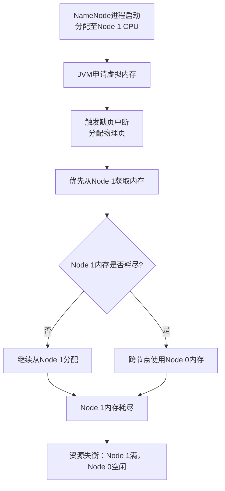
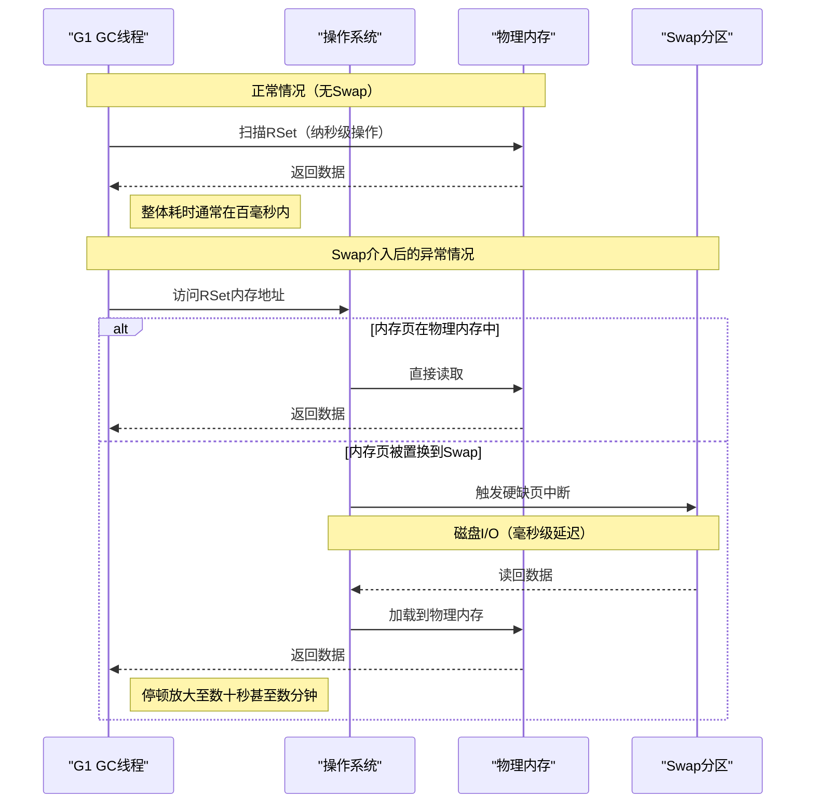
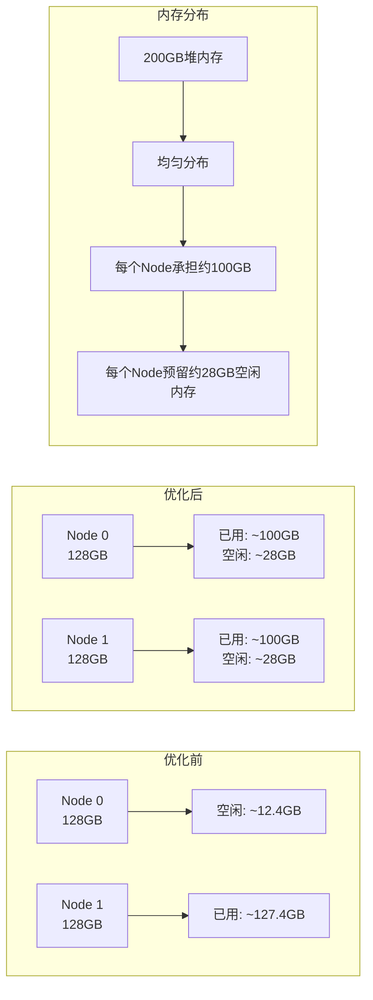

## 一、背景与现象

### 1.1 硬件与配置环境
- **硬件基础**：服务器物理内存总计256GB，划分为两个NUMA节点（Node 0和Node 1，各约128GB容量）
- **进程配置**：HDFS NameNode的JVM堆内存配置为200GB（`-Xms204800m -Xmx204800m`），采用JDK 8的G1垃圾回收器
- **系统状态特征**：
  - Node 1空闲内存接近枯竭（剩余约0.6GB）
  - Node 0存在较多空闲内存（约12.4GB）
  - 系统出现明显的Swap使用
  - NameNode进程伴随随机性的长时间GC停顿（数十秒级别）

### 1.2 问题本质
上述现象表明，NameNode的内存分配模式与底层操作系统的NUMA调度策略可能存在冲突，引发了严重的性能劣化。

## 二、核心冲突分析：大内存JVM与NUMA默认策略的错配

### 2.1 NUMA架构的核心特性
NUMA（Non-Uniform Memory Access，非一致性内存访问）架构中，CPU访问本地节点（Local Node）的内存延迟低于访问远程节点（Remote Node）的内存延迟。

### 2.2 Linux的默认内存分配策略


1. **默认本地分配策略**：Linux内核在进行内存分配时，默认遵循本地化原则。当NameNode进程启动并由调度器分配至某一组CPU核心（例如Node 1所属的CPU）执行时，JVM向操作系统申请的虚拟内存，在实际触发缺页并分配物理页时，会优先从Node 1获取。

2. **单节点容量超载**：由于NameNode申请的堆内存高达200GB，这远超单一NUMA节点（128GB）的物理上限。在默认分配策略下，系统会首先填满执行线程所在的Node 1，随后再跨节点使用Node 0的内存。这种机制导致：
   - Node 1的内存长期处于高水位或耗尽状态
   - Node 0相对空闲
   - 造成了物理层面的资源失衡

3. **内核回收机制介入**：
   - 当Node 1的内存被JVM进程占满后，若该节点上的其他进程或系统自身（如文件系统Page Cache）需要内存，内核会触发内存回收机制
   - 在`vm.zone_reclaim_mode`和`vm.swappiness`的共同作用下，内核倾向于在本地节点回收内存
   - 这会导致JVM中部分被判定为"非活跃"的内存页（通常是老年代对象或G1的RSet数据结构）被置换到磁盘Swap分区中

## 三、级联影响：Swap机制对G1 GC耗时的放大效应

### 3.1 G1 GC的关键数据结构
NameNode维护着整个HDFS的目录树和数据块映射，对象引用关系极其复杂。JDK 8下的G1回收器为了实现增量回收，维护了庞大的**RSet（Remembered Set）来记录跨Region引用。在200GB的堆内存中，RSet本身可能会占用十几个GB的空间。

### 3.2 Mixed GC的扫描过程
在G1触发Concurrent Mark后，会进入Mixed GC阶段。此阶段的核心操作之一是扫描老年代Region的RSet（Scan RS）。



### 3.3 Swap对GC性能的影响机制
1. **正常情况**：在物理内存中扫描，属于纳秒级（ns）操作，整体耗时通常在百毫秒内
2. **Swap介入后的异常情况**：
   - 若RSet所在的内存页或其引用的老年代对象已被置换至Swap，GC线程访问这些内存地址时将触发操作系统的**硬缺页中断（Major Page Fault）**
   - CPU需挂起当前线程，等待磁盘将数据读回物理内存
3. **耗时突变**：
   - 磁盘I/O的延迟是毫秒级（ms），比内存访问慢数个数量级
   - 一次Mixed GC过程中数以万计的缺页中断，会将原本的短暂停顿放大至数十秒甚至数分钟（STW）
   - 最终表现为NameNode失去响应

## 四、解决方案与参数调整

### 4.1 修改NameNode启动参数（引入numactl）
在Hadoop的启动脚本（如`hadoop-env.sh`）中，为NameNode的启动命令添加NUMA交叉分配指令：

```bash
export HADOOP_NAMENODE_OPTS="numactl --interleave=all -Xms204800m -Xmx204800m ..."
```

#### 原理解析
`--interleave=all`策略覆盖了Linux默认的本地分配机制。它强制操作系统在为JVM分配物理内存页时，以轮询（Round-Robin）的方式在Node 0和Node 1之间交替分配。

#### 预期效果


- 200GB的堆内存将被均匀分布，每个Node承担约100GB
- 每个Node（总容量128GB）都会预留出约28GB的空闲物理内存供OS和Page Cache使用
- 从根本上消除了因单节点内存耗尽而触发Swap的基础条件
- **权衡**：跨节点访问带来的微小CPU延迟增加（约10%-20%访存延迟），相比于消除长GC停顿的收益，是完全可以接受的

### 4.2 调整Linux内核内存回收参数
在操作系统级别固化以下内核参数，以降低误回收风险：

```bash
# 永久生效需写入/etc/sysctl.conf
sysctl -w vm.zone_reclaim_mode=0
sysctl -w vm.swappiness=1
```

#### 参数原理解析

| 参数 | 默认值 | 优化值 | 作用机制 |
|------|--------|--------|----------|
| `vm.zone_reclaim_mode` | 通常为1 | 0 | 指示内核在某个NUMA节点内存不足时，优先从其他节点借用空闲内存，而不是激进地在本地节点执行回收（清理Cache或Swap出匿名页） |
| `vm.swappiness` | 60 | 1 | 指示内核在面临内存压力时，极力倾向于回收文件缓存（Page Cache），不到极端情况不对匿名页（JVM堆）进行Swap操作 |

## 五、扩展参考与技术演进背景

### 5.1 JEP-345 (NUMA-Aware Memory Allocation for G1 GC)
- **背景**：JDK 8时代的G1 GC并不具备NUMA感知能力
- **解决方案**：OpenJDK社区在Java 14引入了JEP-345提案
- **特性**：使G1能够在堆初始化时，主动在各个NUMA节点间均匀分配Region并在创建对象时优化本地性
- **意义**：这表明NUMA适配是大内存JVM长期存在的行业共识

### 5.2 AlwaysPreTouch防御机制
**当前问题**：启动参数中未观察到`-XX:+AlwaysPreTouch`

**建议配置**：
```bash
export HADOOP_NAMENODE_OPTS="numactl --interleave=all -Xms204800m -Xmx204800m -XX:+AlwaysPreTouch ..."
```

**作用机制**：
1. 强制JVM在启动时实际写入并提交所有配置的物理内存
2. 避免运行时的Minor Page Fault
3. 配合`numactl --interleave`使用时，能确保内存在服务上线前就严格按照既定策略均匀锁定在各个Node上

### 5.3 Linux内存管理基础
- **匿名页（Anonymous Pages）**：JVM堆内存属于无文件后备的匿名页，其换出代价远高于拥有后备文件的Page Cache
- **通用运维准则**：在大数据基础设施中，应"尽量避免Swap"操作
- **内存回收优先级**：文件缓存（Page Cache）的回收成本远低于匿名页的Swap操作

## 六、总结与最佳实践

### 6.1 核心问题总结
1. **资源失衡**：默认NUMA策略导致大内存JVM集中占用单一节点
2. **Swap触发**：单节点内存耗尽引发内核回收，将JVM匿名页置换到Swap
3. **GC停顿放大**：Swap导致的硬缺页中断将毫秒级GC停顿放大至分钟级

### 6.2 推荐配置方案
```bash
# 1. 启动参数优化
export HADOOP_NAMENODE_OPTS="numactl --interleave=all -Xms204800m -Xmx204800m -XX:+AlwaysPreTouch -XX:+UseG1GC ..."

# 2. 内核参数优化（写入/etc/sysctl.conf）
vm.zone_reclaim_mode = 0
vm.swappiness = 1
vm.dirty_background_ratio = 5
vm.dirty_ratio = 10

# 3. 监控指标
# - 各NUMA节点内存使用率
# - Swap使用情况
# - Major Page Fault频率
# - GC停顿时间
```

### 6.3 监控与验证
1. **内存分布验证**：使用`numastat -p <pid>`检查进程在各NUMA节点的内存分布
2. **Swap监控**：定期检查`/proc/meminfo`中的Swap使用情况
3. **GC日志分析**：启用GC日志（`-Xloggc:`）分析GC停顿时间变化
4. **缺页中断监控**：使用`perf`或`/proc/<pid>/stat`监控Major Page Fault频率

### 6.4 技术演进建议
1. **JDK版本升级**：考虑升级至JDK 11+，获得更好的NUMA支持和G1优化
2. **内存配置优化**：根据实际负载调整堆内存大小，避免过度配置
3. **架构演进**：考虑NameNode高可用（HA）部署，分摊单节点压力

## 参考资料

1. **JEP-345 (NUMA-Aware Memory Allocation for G1 GC)**：JDK 8时代的G1 GC并不具备NUMA感知能力。针对大内存分配不均的问题，OpenJDK社区在Java 14引入了JEP-345提案。该特性使G1能够在堆初始化时，主动在各个NUMA节点间均匀分配Region并在创建对象时优化本地性。这表明NUMA适配是大内存JVM长期存在的行业共识。

2. **AlwaysPreTouch的防御机制**：当前启动参数中未观察到`-XX:+AlwaysPreTouch`。该参数可强制JVM在启动时实际写入并提交所有配置的物理内存，不仅能避免运行时的Minor Page Fault，配合`numactl --interleave`使用时，能确保内存在服务上线前就严格按照既定策略均匀锁定在各个Node上。建议将其加入标准配置。

3. **Linux MM (Memory Management) 与Anon Pages**：由于JVM堆内存属于无文件后备的匿名页（Anonymous Pages），其换出代价远高于拥有后备文件的Page Cache。这确立了大数据基础设施中"尽量避免Swap"的通用运维准则。