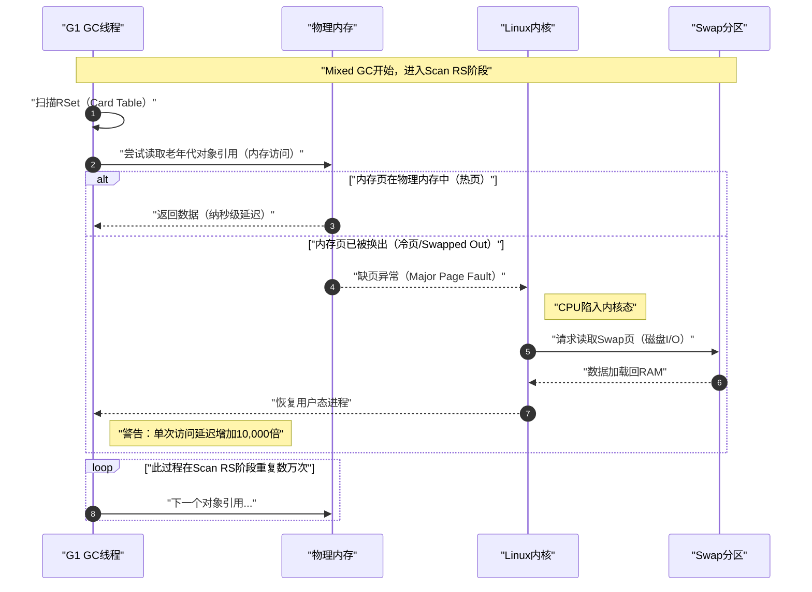
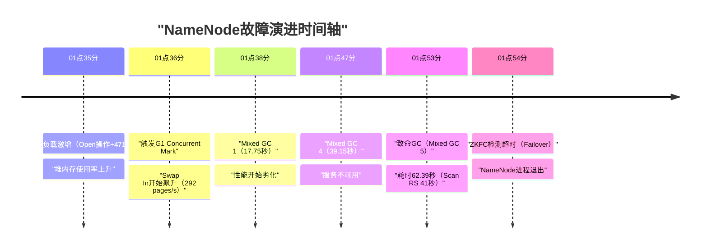
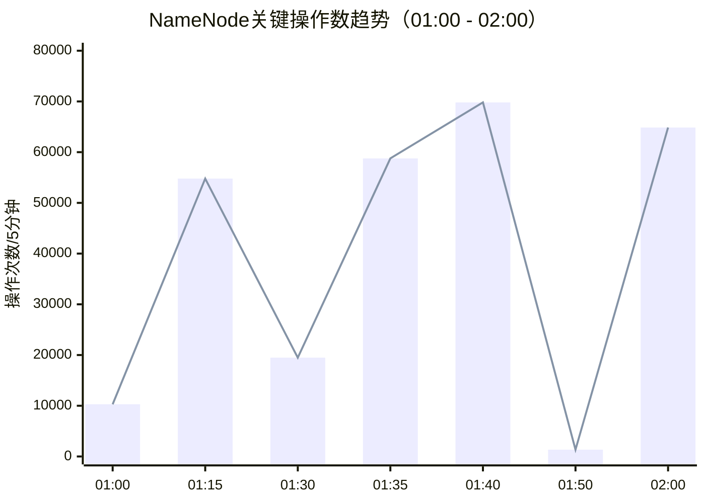
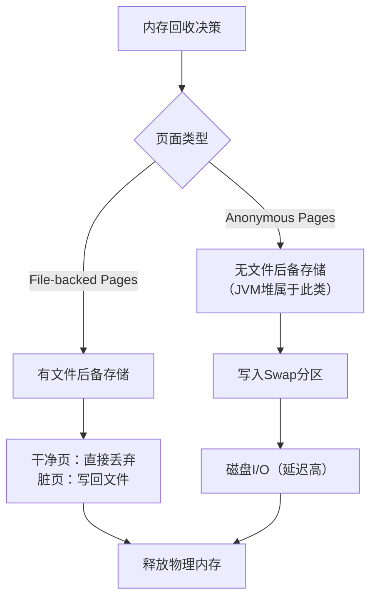
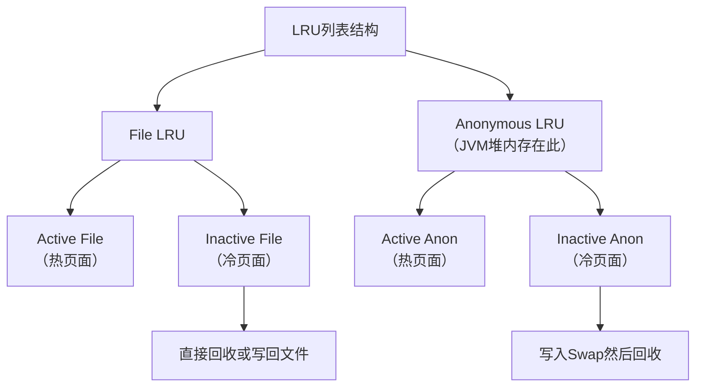
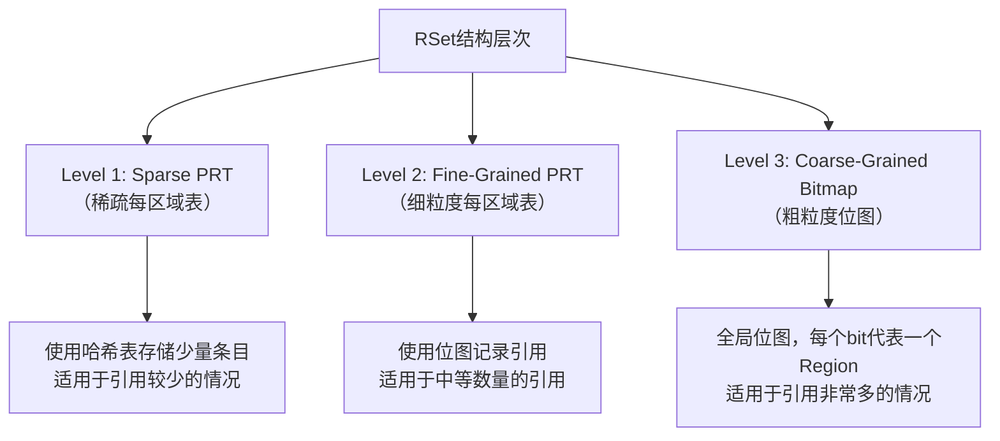
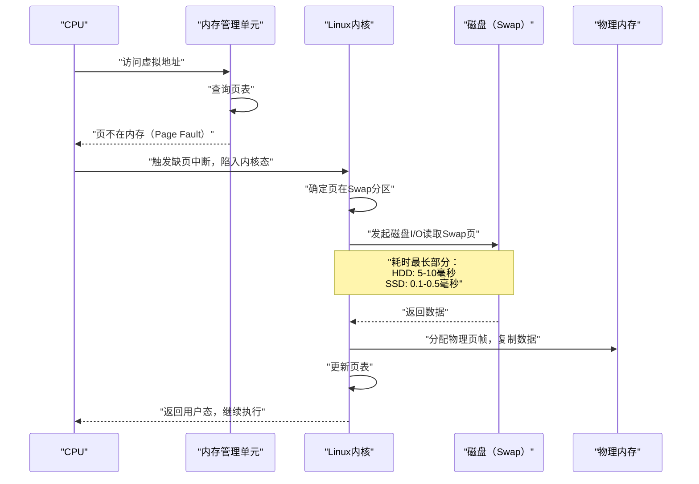
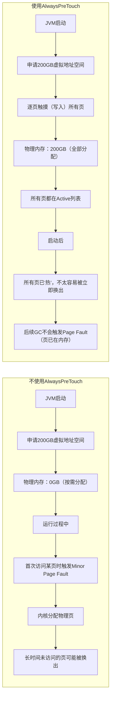
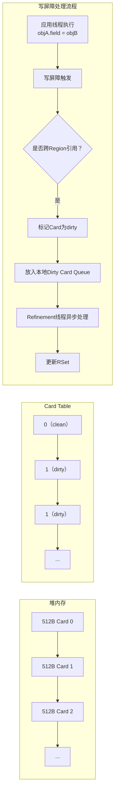

## 引言

在大数据平台的核心组件中，NameNode作为HDFS的元数据管理中心，其稳定性直接关系到整个集群的可用性。然而，当JVM的内存管理机制与Linux内核的内存回收机制发生冲突时，即使物理内存充足，也可能引发灾难性的性能劣化。本文通过一次真实的NameNode主备切换事故，深入剖析G1垃圾回收器与Linux Swap机制的交互原理，揭示大内存场景下的隐藏陷阱，并提供完整的解决方案和监控策略。

## 一、事故概览

### 核心结论

事故的根本原因在于JVM内存管理与Linux内核内存回收机制的冲突。

1. **长期积累**：NameNode老年代中长期未访问的内存页（Cold Pages）被Linux内核的LRU算法换出至Swap分区。
2. **触发诱因**：突发的大规模读取作业触发G1并发标记，进而引发Mixed GC。
3. **致命放大**：Mixed GC的Scan RS（Remembered Set）阶段需要随机访问全堆（包括被Swap出去的页），导致大量Major Page Faults。
4. **灾难结果**：单次内存访问延迟从纳秒级劣化为毫秒级（磁盘I/O），导致GC暂停时间膨胀500倍（62秒），最终触发ZKFC脑裂保护机制，引发主备切换。

### 事故详情

- **事故时间**：2025-12-04 01:54
- **事故主机**：`dnn014026`（10.18.14.26）
- **严重等级**：P1（核心组件主备切换）
- **关键指标**：Mixed GC耗时62秒（正常<100毫秒），其中Scan RS阶段耗时41秒。

## 二、事故现场可视化

### 2.1 致命交互原理机制

Scan RS阶段成为性能杀手的关键原因在于内存页被换出到Swap分区后的访问延迟爆炸。



### 2.2 故障时间轴演进



### 2.3 负载特征分析



**图表解读**：
- **01:35 - 01:40**：`open`操作呈现爆炸式增长，这是导致内存压力和触发并发标记的直接诱因。
- **01:50**：操作数骤降至地板（1,345次），标志着致命GC期间NameNode完全失去响应能力（STW）。

## 三、深度技术归因

### 3.1 Scan RS阶段的时间爆炸

从GC日志中捕捉到的数据对比揭示了问题的本质：

| **指标** | **正常Young GC** | **异常Mixed GC** | **放大倍数** | **根本原因** |
|----------|-----------------|-----------------|-------------|-------------|
| **Scan RS时间** | **4.4毫秒** | **41,111毫秒** | **10,000倍** | **Page Faults** |
| 对象复制时间 | 10毫秒 | 15,000毫秒 | 1,500倍 | 内存页换入延迟 |
| 用户态时间 | 2.65秒 | 1859.51秒 | 700倍 | 内核态处理缺页消耗 |

#### 技术背景
G1的Mixed GC需要回收部分老年代Region。为了确定存活对象，它必须扫描**Remembered Set（RSet）**。RSet记录了"谁引用了我"的数据结构，使得GC时只需扫描RSet而非整个老年代。

#### 致命逻辑
当G1遍历RSet中的Card时，必须读取对应的内存页来解析具体引用。如果该页被Swap Out，每一次内存读取都变成了一次磁盘I/O，延迟从纳秒级劣化为毫秒级。

### 3.2 内存充足却发生Swap的原因分析

**关键疑问**：机器拥有256GB内存，JVM配置200GB，且实际使用仅100GB，为何发生Swap？

1. **虚拟内存提交与实际使用**：JVM向操作系统申请了200GB虚拟内存（Committed），但实际只写入了100GB。
2. **缺少AlwaysPreTouch参数**：JVM启动时没有预先"触摸"所有内存页，物理页是按需分配的。
3. **Linux LRU策略**：Linux内核认为那些分配了但长期未访问的内存页是"冷数据"（Anonymous Pages）。为了给Page Cache（文件缓存）腾出空间以应对大量文件读取，内核积极地将这些"冷页"换出到Swap。

## 四、技术原理深度解析

### 4.1 Linux内存管理基础

#### 4.1.1 虚拟内存与物理内存

Linux使用虚拟内存机制，每个进程拥有独立的虚拟地址空间。JVM堆内存属于**Anonymous Pages**类型，这类内存页没有文件作为后备存储，只能通过Swap才能被换出。

#### 4.1.2 内存页的类型与回收



#### 4.1.3 LRU算法机制

Linux使用双LRU列表管理内存页：



页面老化过程：新分配的页面进入Active列表，长时间未访问则移至Inactive列表，最终被回收。

### 4.2 G1垃圾回收器核心机制

#### 4.2.1 G1设计目标与架构

G1（Garbage First）是JDK 7引入、JDK 9成为默认的垃圾回收器，其设计目标包括：
- 可预测的暂停时间
- 高吞吐量
- 支持大堆内存（数十GB到数百GB）
- 避免Full GC

G1将堆内存划分为多个大小相等的Region（区域）。对于本案例：
- 堆大小：200GB
- Region大小：32MB
- Region总数：200GB / 32MB = 6400个Region

#### 4.2.2 Remembered Set（RSet）机制详解

RSet的作用是记录"谁引用了我"，使得GC时只需扫描RSet而非整个老年代。RSet采用多级数据结构：



#### 4.2.3 Scan RS过程与Swap的致命交互

Scan RS阶段需要遍历Collection Set中每个Region的RSet，找出所有指向Collection Set的引用。如果RSet或相关对象所在的页面被Swap Out，整个过程将变为：

```
正常情况：
  Scan RS → 访问RSet数据结构 → 内存访问 → 纳秒级延迟

Swap介入：
  Scan RS → 访问RSet数据结构 → Page Fault → 磁盘I/O → 毫秒级延迟
                                     ↑
                                 延迟放大100万倍
```

### 4.3 vm.swappiness参数深度解析

`vm.swappiness`参数控制内核在回收内存时对Anonymous Pages与File Pages的偏好：

| 值 | 行为 | 推荐场景 |
|----|------|----------|
| 0 | 尽量避免Swap Anonymous Pages，除非绝对必要 | 运行JVM的服务器 |
| 1-59 | 倾向于回收File Pages | 文件服务器 |
| 60（默认） | 平衡回收File和Anonymous Pages | 通用服务器 |
| 61-99 | 倾向于回收Anonymous Pages | 特定工作负载 |
| 100 | 同等对待File和Anonymous Pages | 很少使用 |

**重要澄清**：`swappiness = 0`不等于禁用Swap！它只是告诉内核尽量只回收File Pages，但在内存压力很大或File Pages很少时，仍然会Swap Anonymous Pages。

### 4.4 Page Fault（缺页中断）机制

#### 4.4.1 缺页中断类型

| 类型 | 英文 | 触发条件 | 处理时间 |
|------|------|----------|----------|
| Minor Page Fault | 软缺页 | 页已在内存，只需更新页表 | 微秒级 |
| Major Page Fault | 硬缺页 | 页不在内存，需从磁盘读取 | 毫秒级 |

#### 4.4.2 Major Page Fault的处理流程与代价



**总耗时**：毫秒级（vs内存访问的纳秒级）
**放大倍数**：约100,000～1,000,000倍

## 五、解决方案与参数调优

### 5.1 操作系统层面调优

目标：告诉内核，除非物理内存真的耗尽，否则绝不要动JVM堆内存。

```bash
# 1. 临时生效：将swappiness降至最低
sysctl -w vm.swappiness=0

# 2. 永久生效：写入配置文件
echo "vm.swappiness = 0" >> /etc/sysctl.conf

# 3. （可选但推荐）禁用Swap
# 在核心计算节点，OOM挂掉通常比慢死（GC几分钟）要好，因为主备切换更快
swapoff -a
# 并注释/etc/fstab中的swap条目
```

### 5.2 JVM层面调优

目标：防止内存被换出，并优化G1在大堆下的表现。

**核心参数变更对比**：

```diff
HADOOP_NAMENODE_OPTS="...
-XX:+UseG1GC 
-Xms204800m -Xmx204800m 
+ -XX:+AlwaysPreTouch                # 关键：启动时填零预热所有页面，防止惰性分配
+ -XX:InitiatingHeapOccupancyPercent=35  # 提前启动并发标记，避免堆满
- -XX:NewSize=20480m                 # 删除：允许G1动态调整年轻代
- -XX:MaxNewSize=20480m              # 删除
- -XX:-ResizePLAB                    # 删除：允许PLAB自适应
+ -XX:G1MixedGCCountTarget=16        # 将老年代回收分散到更多次GC中，降低单次暂停
+ -XX:G1HeapRegionSize=32m           # 适配200G大堆
..."
```

### 5.3 完整推荐参数配置

```bash
# 基础参数
-XX:+UseG1GC
-Xms204800m -Xmx204800m
-XX:MaxGCPauseMillis=500
-XX:ParallelGCThreads=30

# 关键新增参数
-XX:+AlwaysPreTouch              # 启动时预热所有堆内存
-XX:InitiatingHeapOccupancyPercent=35  # 更早开始并发标记
-XX:G1HeapRegionSize=32m         # 明确指定Region大小
-XX:G1MixedGCCountTarget=16      # 分散Mixed GC，每次处理更少Region
-XX:G1HeapWastePercent=10        # 允许更多堆浪费，减少激进回收
-XX:G1ReservePercent=15          # 增加预留空间
-XX:ConcGCThreads=8              # 并发GC线程数

# 诊断参数
-XX:+PrintGCApplicationStoppedTime
-XX:+PrintAdaptiveSizePolicy
-XX:+G1SummarizeRSetStats
-XX:G1SummarizeRSetStatsPeriod=1
```

### 5.4 AlwaysPreTouch的作用机制



**注意**：`AlwaysPreTouch`会显著增加JVM启动时间（200GB可能需要几分钟），但这是防止内存被Swap的关键措施。

## 六、监控与诊断策略

### 6.1 关键监控指标

```bash
# 1. Swap使用情况
free -h
cat /proc/meminfo | grep -i swap

# 2. Swap I/O活动
sar -W 1          # pswpin/s, pswpout/s
vmstat 1          # si, so列

# 3. 进程级内存信息
cat /proc/<pid>/status | grep -E "VmSwap|VmRSS|VmSize"
# VmSwap: 被换出的内存量

# 4. Page Fault统计
sar -B 1          # majflt/s
ps -o min_flt,maj_flt -p <pid>

# 5. 磁盘I/O（识别Swap分区）
iostat -xz 1
# 注意Swap分区的r/s, w/s, await
```

### 6.2 诊断Swap是否影响GC

```bash
# 1. 检查GC前后的Swap活动
# 在GC发生前后采集sar数据

# 2. 分析GC日志中的real vs user时间
# 正常情况：real ≈ user / ParallelGCThreads
# Swap影响：real >> user / ParallelGCThreads（等待I/O）

# 3. 使用perf追踪Page Fault
perf record -e major-faults -p <pid> -g
perf report

# 4. 使用strace追踪系统调用
strace -f -e trace=memory -p <pid>
```

### 6.3 本案例的SAR数据分析

**原始数据**：
```
时间          pswpin/s  pswpout/s
01:10-01:20     0.31      0.00    # 正常
01:20-01:30     0.02      2.60    # 正常，少量换出
01:30-01:40   292.58      0.00    # Swap In激增！
01:40-01:50    24.93    262.90    # 恢复，Swap Out增加
```

**时间线对照分析**：
- **01:30-01:40**：GC事件（01:36:30触发Concurrent Mark），Swap In达到292.58 pages/s，磁盘读1170 KB/s。解释：Concurrent Mark需要遍历整个堆，访问被换出的页。
- **01:38:54 - 01:54:17**：5次Mixed GC，Scan RS时间爆炸。解释：扫描RSet时持续触发Page Fault。
- **01:40-01:50**：Swap Out达到262.90 pages/s。解释：GC完成后，内存释放，内核将部分页换出以平衡内存。

## 七、经验总结与最佳实践

### 7.1 核心要点总结

1. **Swap的本质认知**：Swap不是紧急内存，而是Linux内存管理机制的一部分。内核会主动将"冷"的Anonymous Pages换出，即使物理内存充足也可能发生。
2. **JVM堆的特殊性**：JVM堆属于Anonymous Pages，只能通过Swap回收。GC时需要访问整个堆，可能触发大量Page Fault。
3. **延迟放大效应**：Page Fault的代价是灾难性的，延迟放大100万倍，能将毫秒级的GC暂停变成秒级甚至分钟级。
4. **LRU算法的不友好性**：老年代的"冷"对象容易被换出，但GC时必须访问它们，这种矛盾导致了性能灾难。

### 7.2 最佳实践指南

#### 7.2.1 系统级配置
- 设置`vm.swappiness=0`
- 考虑完全禁用Swap（需评估OOM风险）
- 确保物理内存充足，为系统预留足够空间

#### 7.2.2 JVM级配置
- **必须使用**`-XX:+AlwaysPreTouch`参数
- 考虑使用大页内存（Huge Pages）配置
- 对于JDK 11+用户，G1有重大性能改进
- 对于JDK 17+用户，可考虑ZGC或Shenandoah等低延迟GC

#### 7.2.3 监控策略
- 持续监控`pswpin/pswpout`速率
- 监控`majflt/s`（每秒Major Page Fault数）
- 关联分析GC日志与系统监控数据
- 建立Swap使用告警机制

#### 7.2.4 架构考虑
- 对于核心组件如NameNode，考虑物理内存隔离
- 评估使用CGroup内存限制的可能性
- 定期进行压力测试，验证内存配置的合理性

### 7.3 后续排查指令参考

```bash
# 1. 检查Swap换入换出频率（非0即异常）
vmstat 1

# 2. 检查特定进程的Swap情况
grep VmSwap /proc/<PID>/status

# 3. 检查系统内存页大页分布
cat /proc/meminfo | grep Huge

# 4. 查看系统级Page Fault
sar -B 1

# 5. 查看进程级Page Fault
ps -o min_flt,maj_flt -p <pid>
```

## 八、补充知识：G1垃圾回收器进阶

### 8.1 G1的GC类型详解

#### 8.1.1 Young GC（年轻代垃圾回收）
- **触发条件**：Eden区域被填满时触发
- **回收范围**：所有Eden和Survivor Region
- **正常耗时**：几十毫秒到几百毫秒

#### 8.1.2 Mixed GC（混合垃圾回收）
- **触发条件**：并发标记周期完成后，G1选择一些老年代Region与年轻代一起回收
- **回收范围**：所有Eden、Survivor Region + 部分Old Region
- **关键参数**：
  - `-XX:G1MixedGCCountTarget=8`：一次并发周期后Mixed GC的目标次数
  - `-XX:G1HeapWastePercent=5`：允许的堆内存浪费百分比
  - `-XX:G1MixedGCLiveThresholdPercent=85`：Region中存活对象超过此比例则不回收

#### 8.1.3 并发标记周期（Concurrent Marking Cycle）
- **触发条件**：堆使用率达到IHOP（Initiating Heap Occupancy Percent，默认45%）
- **阶段**：
  1. Initial Mark（STW）：标记GC Roots直接可达的对象
  2. Root Region Scan（并发）：扫描Survivor区域对Old区域的引用
  3. Concurrent Mark（并发）：并发遍历整个堆，标记存活对象
  4. Remark（STW）：处理SATB队列中的引用变更
  5. Cleanup（STW/并发）：统计存活对象，识别可回收Region

### 8.2 Card Table（卡表）机制

Card Table是RSet的基础设施，将堆内存划分为512字节的Card，每个Card用1字节表示其状态（clean/dirty）。当发生跨Region引用时，对应的Card被标记为dirty。



### 8.3 NameNode的特殊性分析

NameNode在内存中维护整个HDFS的命名空间，其内存对象特征包括：

1. **INode对象**（文件/目录元数据）
   - 数量：数千万到数亿
   - 每个INode包含多个引用（父目录、子节点、Block信息等）

2. **Block对象**
   - 数量：数千万到数亿
   - 每个Block包含副本位置引用

3. **DataNode信息**
   - 每个DataNode的Block列表

4. **复杂的引用关系**
   - 目录树结构
   - Block到DataNode的映射
   - 租约信息

**结果影响**：
- 大量长期存活的对象 → 巨大的老年代
- 复杂的对象引用图 → 大量跨Region引用
- RSet规模巨大 → Scan RS时间长

### 8.4 JDK版本差异与改进

#### JDK 8中G1的已知问题
- Refinement线程效率问题：在高负载下可能跟不上dirty card生成速度
- RSet扫描是线性的：扫描时间与RSet大小成正比
- 粗粒度位图退化：当跨Region引用过多时，RSet退化为Coarse-Grained，扫描开销剧增

#### JDK 11+的改进
- 并行RSet扫描
- 更高效的RSet数据结构
- 更好的Refinement线程调度

#### JDK 17+的替代方案
- ZGC：亚毫秒级暂停时间，支持TB级堆
- Shenandoah：低延迟GC，与G1类似但暂停时间更短

## 九、结论

本次NameNode长GC事故揭示了在大内存场景下，JVM与操作系统内存管理机制交互的复杂性。关键教训包括：

1. **大内存不等于安全**：即使物理内存充足，不当的配置仍可能导致性能灾难。
2. **防御性配置的必要性**：`-XX:+AlwaysPreTouch`和`vm.swappiness=0`是大内存JVM应用的必须配置。
3. **监控的全面性**：不仅要监控内存使用率，还要监控Swap活动、Page Fault等底层指标。
4. **理解系统原理的重要性**：只有深入理解Linux内存管理和JVM GC机制，才能有效预防和解决此类问题。

通过本次事故分析，我们不仅解决了具体的技术问题，更重要的是建立了一套完整的大内存JVM应用运维方法论，为后续的系统稳定性保障提供了坚实基础。

---

**参考资料**：
1. Oracle G1 GC Tuning Guide
2. Linux Kernel Documentation: Memory Management
3. Cloudera: GC Pauses in NameNode
4. Red Hat: Understanding vm.swappiness
5. JVM Anatomy Quark: GC Design and Pauses

---

## 关联专栏

- [[Java/JVM/00 专栏导览|JVM]]：G1 GC 的内存管理与调优
- [[Linux/内存管理/00 专栏导览|内存管理]]：Swap 机制与 vm.swappiness 的内核原理
- [[大数据/Hadoop/HDFS/00 专栏导览|HDFS]]：NameNode 的架构与元数据管理
- [[Linux/性能优化/00 专栏导览|性能优化]]：JVM + OS 层面的性能诊断方法