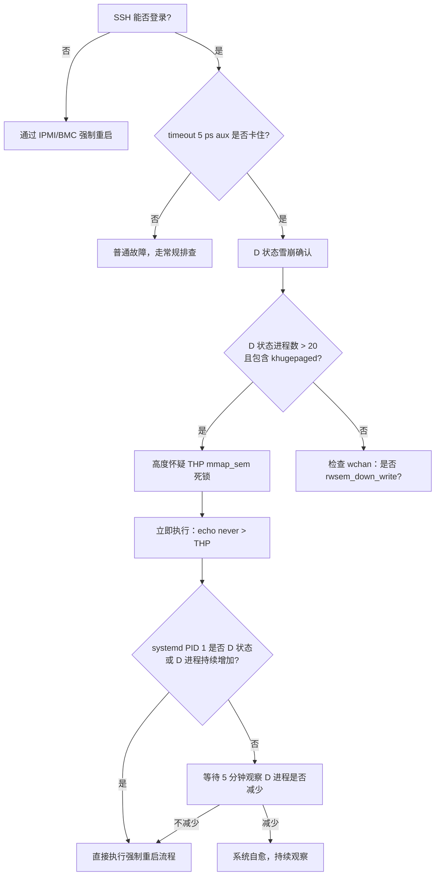

# SOP：THP khugepaged 死锁 / 系统级 D 状态雪崩排查手册

> **适用场景**：节点出现大量进程 D 状态、load 异常升高、`ps`/`top` 挂死，但 SSH 仍可登录，且怀疑与 THP / khugepaged / cgroup 内存 / 内核锁相关。
>
> 本 SOP 基于 dn-018 2026-05-06 故障提炼，详见关联 RCA：[dn-018-THP-khugepaged-死锁-根因分析-20260506.md](dn-018-THP-khugepaged-死锁-根因分析-20260506.md)

---

## 适用场景特征

以下现象**同时出现**时启动本 SOP：

1. Zabbix Agent 不可达，但 SSH 仍可登录
2. `ps`/`top`/`w` 等命令执行后卡住无响应
3. `ps -eo pid,stat,wchan,comm | grep ' D '` 显示大量进程处于 D 状态
4. 系统 load average 异常升高并在某个值停止增长
5. 特定 CPU 的 iowait 持续高位（通常是单核 ≈ 100%）

---

## 快速决策树



---

## 第一阶段：快速确认死锁类型（5 分钟内）

### Step 1：确认 SSH 可用且进程挂死

```bash
# 超时保护，若 5s 内无输出说明 /proc 读取已卡死
timeout 5 ps aux | wc -l || echo ">>> ps 挂死，D 状态雪崩确认"
```

SSH 能登录而 Zabbix 不可达，说明是进程级 D 状态死锁，而非网络故障或系统宕机。

### Step 2：不用 ps 命令，直接从 /proc 统计 D 状态进程

> ⚠️ 在死锁场景下，`ps` 命令本身可能因遍历 `/proc/[dead-pid]/` 而卡住，**必须用 timeout 保护或避开 ps**。

```bash
# 方法 A：timeout 保护
timeout 10 ps -eo pid,stat,wchan,comm | grep ' D ' | tee /tmp/d_state.txt | wc -l

# 方法 B：直接读 /proc（不依赖 ps，最安全）
for f in /proc/[0-9]*/status; do
    st=$(grep -m1 '^State:' "$f" 2>/dev/null | awk '{print $2}')
    [ "$st" = "D" ] && echo "D: $f"
done | wc -l
```

**判断标准**：D 状态进程 > 10 且包含内核线程 → 高概率内核锁死锁。

### Step 3：快速看 CPU iowait 和 load

```bash
# 不用 top，直接读 /proc/stat
awk '/^cpu[0-9]+/{
    iowait=$6; total=0
    for(i=2;i<=NF;i++) total+=$i
    printf "%s iowait=%.1f%%\n", $1, iowait/total*100
}' /proc/stat | sort -t= -k2 -rn | head -5

# load
cat /proc/loadavg
```

**判断标准**：单个 CPU iowait ≈ 100% 且 load ≈ D 状态进程数 → 典型锁持有者阻塞于 IO。

### Step 4：判断是否需要立即重启

**满足以下任一条件，跳过后续排查步骤，直接进入第三阶段（重启）**：

| 条件 | 原因 |
| ---- | ---- |
| systemd（PID 1）处于 D 状态 | 系统服务管理完全失效，无法在线修复 |
| D 状态进程 > 50 且持续增加 | 死锁已完全扩散，在线干预无效 |
| 已持续 > 15 分钟且 load 持续上涨 | 系统无法自愈 |
| 任何新执行命令立即进入 D 状态 | 死锁路径已覆盖所有新进程 |

---

## 第二阶段：根因定位（采集现场证据）

> 若需要立即重启，本阶段可与重启准备**并行执行**，目的是采集事后分析所需的证据。

### Step 5：识别 wchan 类型，确认死锁模式

```bash
timeout 15 ps -eo pid,stat,wchan,comm | grep ' D ' > /tmp/d_state.txt 2>/dev/null
cat /tmp/d_state.txt
```

**wchan 模式识别表**：

| wchan 值                    | 含义                                       | 角色              |
| --------------------------- | ------------------------------------------ | ----------------- |
| `collap`（collapse\_huge\_page） | khugepaged 等待 mmap\_sem **写锁**        | 写锁等待者（放大器） |
| `do_use`（do\_user\_addr\_fault） | 进程等待 mmap\_sem **读锁**（缺页处理）   | 读锁等待者         |
| `io_schedule` / `wait_on`   | 进程阻塞于磁盘 IO，**可能正持有读锁**      | 锁持有者（根因）   |
| `access` / `__access`       | access\_remote\_vm，读 /proc/cmdline 被阻塞 | 受害者             |
| `try_to`（try\_to\_unmap）  | swapoff 操作，争抢 mmap\_sem               | 加剧者             |
| `rwsem_down_read_slowpath`  | 等待 mmap\_sem 读锁（writer 已排队）       | 受害者             |

### Step 6：读取关键进程的 kernel stack

```bash
# khugepaged stack
PID_KHUGE=$(pgrep khugepaged)
echo "=== khugepaged ===" && cat /proc/$PID_KHUGE/stack

# 找出卡在 io_schedule 的进程（真正的锁持有者）
for pid in $(awk '$2~/D/{print $1}' /tmp/d_state.txt 2>/dev/null); do
    stack=$(cat /proc/$pid/stack 2>/dev/null)
    if echo "$stack" | grep -q 'io_schedule\|wait_on_page'; then
        echo "=== 疑似锁持有者 PID $pid ===" 
        cat /proc/$pid/comm 2>/dev/null
        echo "$stack"
        echo ""
    fi
done | tee /tmp/lock_holder.txt

# 找出卡在 do_user_addr_fault 的进程
for pid in $(awk '$2~/D/{print $1}' /tmp/d_state.txt 2>/dev/null); do
    stack=$(cat /proc/$pid/stack 2>/dev/null)
    if echo "$stack" | grep -q 'do_user_addr_fault'; then
        echo "=== 缺页阻塞 PID $pid ($(cat /proc/$pid/comm 2>/dev/null)) ==="
        echo "$stack"
    fi
done | tee /tmp/page_fault_blocked.txt
```

**THP + cgroup 死锁的典型 stack 特征**：

```
# 锁持有者（lock holder）特征 — 这是根因
io_schedule
wait_on_page_bit
try_to_free_mem_cgroup_pages  ← cgroup 内存回收路径
try_charge
mem_cgroup_swapin_charge_page ← 换入时向 cgroup 申请内存
do_swap_page                  ← 正在换入 swap 页
do_user_addr_fault            ← 已持有 mmap_sem 读锁

# khugepaged（写锁等待者）特征
rwsem_down_write_slowpath
collapse_huge_page

# 受害者特征（/proc/cmdline 读取）
__access_remote_vm
proc_pid_cmdline_read
```

### Step 7：确认 THP 配置和 cgroup 内存

```bash
# THP 配置
cat /sys/kernel/mm/transparent_hugepage/enabled
# [always] 或 [madvise] → THP 是放大器

# Swap 状态（注意：Swap 未耗尽 ≠ 没问题，瓶颈可能在 cgroup）
free -h && swapon -s

# 找出死锁中心进程（do_user_addr_fault）的 cgroup 内存状态
STUCK_PID=$(awk '$3=="do_use"{print $1}' /tmp/d_state.txt | head -1)
if [ -n "$STUCK_PID" ]; then
    CGROUP_PATH=$(cat /proc/$STUCK_PID/cgroup 2>/dev/null | grep ':memory:' | awk -F: '{print $3}')
    echo "cgroup: $CGROUP_PATH"
    MEM_LIMIT=$(cat /sys/fs/cgroup/memory${CGROUP_PATH}/memory.limit_in_bytes 2>/dev/null)
    MEM_USED=$(cat /sys/fs/cgroup/memory${CGROUP_PATH}/memory.usage_in_bytes 2>/dev/null)
    echo "Limit: $(echo $MEM_LIMIT | awk '{printf "%.0fMB\n", $1/1024/1024}')"
    echo "Used:  $(echo $MEM_USED  | awk '{printf "%.0fMB\n", $1/1024/1024}')"
fi
```

**判断标准**：cgroup used ≈ cgroup limit → **cgroup 内存耗尽是锁持有者阻塞的根因**（即使系统 swap 未满）。

### Step 8：查看 hung_task 日志（黄金线索）

```bash
grep -i 'blocked for more than\|hung_task' /var/log/messages | tail -30
# 输出示例：
# INFO: task alloy:879756 blocked for more than 120 seconds.
# 这精确定位了死锁开始时间和相关 goroutine
```

### Step 9：保存完整现场（事后分析用）

```bash
# 保存所有 D 状态进程的 stack
mkdir -p /tmp/incident_$(date +%Y%m%d_%H%M%S)
DIR=/tmp/incident_$(date +%Y%m%d_%H%M%S)

for pid in $(awk '$2~/D/{print $1}' /tmp/d_state.txt 2>/dev/null); do
    {
        echo "=== PID $pid ($(cat /proc/$pid/comm 2>/dev/null)) ==="
        cat /proc/$pid/stack 2>/dev/null
        echo ""
    } >> $DIR/all_stacks.txt
done

dmesg -T --level=err,warn > $DIR/dmesg.txt
cp /var/log/messages $DIR/ 2>/dev/null
free -h > $DIR/memory.txt
swapon -s >> $DIR/memory.txt
cp /tmp/d_state.txt $DIR/

echo "现场数据已保存到 $DIR"
```

---

## 第三阶段：止损操作（按顺序执行）

### Step 10：立即关闭 THP（阻止新增受害者）

```bash
echo never > /sys/kernel/mm/transparent_hugepage/enabled
echo never > /sys/kernel/mm/transparent_hugepage/defrag

# 验证
cat /sys/kernel/mm/transparent_hugepage/enabled
# 期望：always madvise [never]
```

> ⚠️ 此操作**不能解除已存在的死锁**（已在 `rwsem_down_write_slowpath` 等待的 khugepaged 无法中断），只能阻止新的 collapse 任务启动，防止情况继续恶化。

### Step 11：【禁忌操作警告】不要执行 swapoff

```
❌ 严禁执行：swapoff /dev/XXX
```

原因：`swapoff` 需要对每个 swap 页执行 `try_to_unmap`，此操作需竞争 mmap\_sem，会**增加等待队列中的竞争者数量**，加重死锁（本次故障中 PID 1728089 的 D 状态即为此操作的直接后果）。

### Step 12：尝试停止上游服务，间接减轻 cgroup 内存压力

```bash
# 停止产生大量日志/IO 的服务，减轻节点内存压力
# 注意：不要直接 kill D 状态进程（无效）
# 不要直接 systemctl stop 死锁中心进程（可能也卡住）

systemctl stop hiveserver2   # 停止产生大量 GC 日志的服务
systemctl stop hbase-master  # 停止其他重度内存/IO 服务
```

> 停止上游服务可以减少 cgroup 内存压力，有一定概率使 lock holder 的 cgroup 内存回收 IO 完成，进而释放 mmap\_sem 读锁，让系统自愈。

### Step 13：观察是否自愈（等待 5 分钟）

```bash
# 每 30 秒观察一次 D 状态进程数变化
watch -n 30 "for f in /proc/[0-9]*/status; do
    grep -l '^State:.*D' \$f 2>/dev/null
done | wc -l"
```

**判断标准**：
- D 状态进程数**减少** → 系统正在自愈，继续等待
- D 状态进程数**不变或增加** → 无法自愈，执行强制重启

---

## 第四阶段：强制重启

### Step 14：评估重启前提条件

```bash
# 确认没有进行中的 HDFS 写操作（可能导致数据丢失）
# 通知 oncall，告知即将重启原因
# 检查节点上是否有正在运行的 Flink / Spark 作业（YARN 会自动迁移）
```

### Step 15：执行强制重启（sysrq 方式）

```bash
# 方式一：先同步文件系统，再重启
# （如果 echo s 本身卡住，直接跳到方式二）
echo 1 > /proc/sys/kernel/sysrq        # 确保 sysrq 已启用
echo s > /proc/sysrq-trigger            # 同步文件系统
sleep 3
echo b > /proc/sysrq-trigger            # 立即重启

# 方式二：直接强制重启（文件系统可能需要 fsck，但数据丢失风险极低）
echo b > /proc/sysrq-trigger

# 方式三：对于物理机，通过 IPMI/BMC 远程强制重启
# ipmitool -H <bmc-ip> -U admin -P <pass> chassis power cycle
```

---

## 第五阶段：重启后验证

### Step 16：系统状态验证

```bash
# 1. 确认无 D 状态进程
ps -eo pid,stat | awk '$2~/D/' | wc -l
# 期望：0

# 2. 确认 THP 关闭（如未永久化则需重新设置）
cat /sys/kernel/mm/transparent_hugepage/enabled
# 若重启后恢复默认，立即执行：
echo never > /sys/kernel/mm/transparent_hugepage/enabled
echo never > /sys/kernel/mm/transparent_hugepage/defrag

# 3. 确认 swap 正常
free -h

# 4. 确认 load 正常
cat /proc/loadavg
```

### Step 17：关键服务验证

```bash
# alloy
systemctl status alloy
journalctl -u alloy --since "10 minutes ago" | grep -iE 'error|429|batch'

# zabbix agent
systemctl status zabbix-agent
zabbix_agentd -t system.uptime

# HiveServer2（如果已停止，重新启动）
systemctl start hiveserver2
```

### Step 18：根因确认 Checklist（重启后执行）

| 检查项                     | 命令                                                         | 期望结果             |
| -------------------------- | ------------------------------------------------------------ | -------------------- |
| THP 是否关闭               | `cat /sys/kernel/mm/transparent_hugepage/enabled`           | `[never]`            |
| 是否有超大 Loki batch       | `journalctl -u alloy \| grep "lines totaling"`              | 单批次 < 5MB         |
| GC 日志大小                | `ls -lh /var/log/hive/hiveserver2-gc*.log*`                 | 单文件 < 50MB        |
| alloy MemoryLimit          | `systemctl cat alloy \| grep MemoryLimit`                   | ≥ 2048M              |
| alloy MemorySwapMax        | `systemctl cat alloy \| grep MemorySwapMax`                 | = 0                  |
| alloy batch\_size 配置     | `grep -r batch_size /etc/alloy/`                            | 有配置，建议 4MiB    |
| alloy WAL 是否启用         | `grep -r wal /etc/alloy/`                                   | `enabled = true`     |
| swap 使用率                | `free -h`                                                   | swap used < 50%      |
| vm.swappiness              | `sysctl vm.swappiness`                                      | 建议 ≤ 1             |

---

## 附录 A：核心内核机制速查

### mmap\_sem 与 rwsem 写优先

`mmap_sem`（Linux 5.8+ 重命名为 `mmap_lock`）是保护进程地址空间（VMA）的读写信号量。RHEL8 内核 rwsem 实现采用**写优先**策略：

- 写者排队后，**新的读者也被阻塞**（进入等待队列），防止写者饥饿
- 后果：一个正在等待写锁的 khugepaged 会导致所有需要该 mm 读锁的操作（缺页处理、/proc 读取）全部阻塞

### cgroup 内存换入死锁路径

当 cgroup 内存满时，进程的缺页换入路径会触发内存回收：

```
do_swap_page
→ mem_cgroup_swapin_charge_page
  → try_charge（申请 cgroup 内存配额）
    → try_to_free_mem_cgroup_pages（cgroup 内存不足，尝试回收）
      → shrink_lruvec → wait_on_page_bit → io_schedule
```

这个过程发生在**已持有 mmap\_sem 读锁**的状态下，形成 lock holder blocking，是本死锁的核心。

**关键点**：系统 swap 未耗尽 ≠ 没问题。cgroup 内存满同样会触发此路径。

### THP 与 Go 进程

Go runtime 在分配堆内存时调用 `madvise(MADV_HUGEPAGE)`，将整个 Go heap 标记为 THP eligible，使其成为 khugepaged 的扫描目标。**在 cgroup 内存受限的 Go 进程所在的节点上，THP 是内核级死锁的放大器。**

### D 状态进程与 load average

- D 状态（TASK\_UNINTERRUPTIBLE）进程计入 load average
- `kill -9` 对 D 状态进程**无效**，信号在进程被调度时才处理，D 状态进程不可调度
- load 停止增长：等于死锁扩散路径上的最大 D 状态进程数（"饱和"）

---

## 附录 B：其他可能触发 mmap\_sem 死锁的场景

| 场景                              | 触发路径                         | 预防措施                                    |
| ------------------------------- | ---------------------------- | --------------------------------------- |
| THP + cgroup 内存满（本案例）           | khugepaged + cgroup 换入阻塞     | 关闭 THP + 放宽 cgroup 限制 + MemorySwapMax=0 |
| gdb/perf attach 目标进程            | ptrace → mmap\_sem 写锁        | 调试完成后及时 detach                          |
| `/proc/pid/mem` 大量并发读写          | access\_remote\_vm           | 限制并发访问                                  |
| `madvise(MADV_HUGEPAGE)` + fork | COW + THP collapse 竞争        | 关闭 THP                                  |
| 内存热插拔 / NUMA balance            | offline\_page → mmap\_sem 写锁 | 维护期间才操作                                 |

---

*文档版本：v2.0 | 作者：SRE 团队 | 基于 dn-018 2026-05-06 故障提炼*
*关联 RCA：[dn-018-THP-khugepaged-死锁-根因分析-20260506.md](dn-018-THP-khugepaged-死锁-根因分析-20260506.md)*
