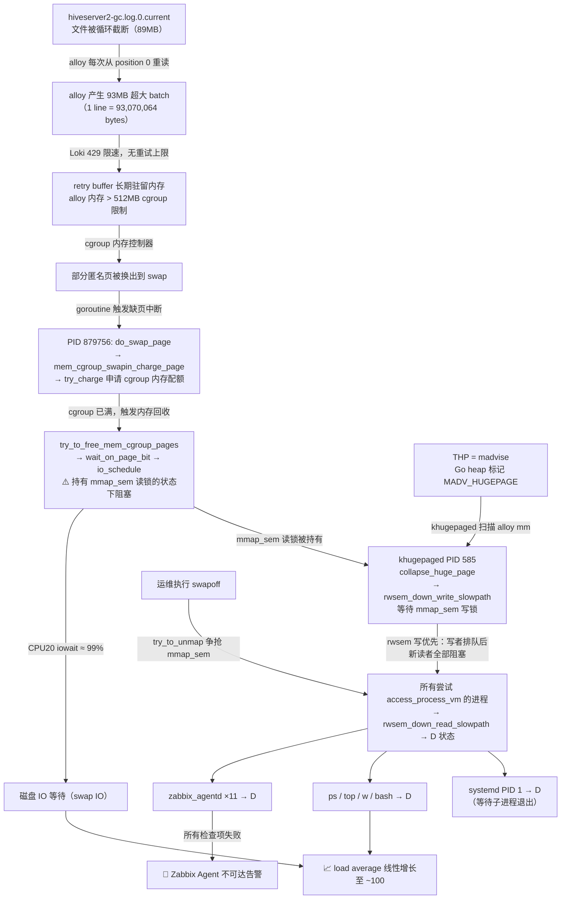

# dn-018 THP khugepaged 死锁 — 根因分析报告

## 一、事件概要

| 字段     | 内容                                                                                            |
| ------ | --------------------------------------------------------------------------------------------- |
| 故障主机   | dn-018.hadoop.example.com（离线集群，HiveServer2 / HBase 节点）                                   |
| 内核版本   | 4.18.0-425.3.1.el8.x86\_64（RHEL 8）                                                            |
| 故障开始   | 2026-05-06 约 19:00                                                                            |
| 故障结束   | 2026-05-07，通过 `echo b > /proc/sysrq-trigger` 强制重启恢复                                           |
| 直接现象   | Zabbix Agent 不可达；SSH 可登录；`ps`/`top`/`w` 全部卡死；CPU20 iowait ≈ 99%；load average 线性增长至 ~100 后停止上涨 |
| 根因分类   | **内核级联死锁**：cgroup 内存换入路径与 THP khugepaged 争抢 mmap\_sem，叠加 rwsem 写优先语义，引发全系统 D 状态雪崩             |
| 错误排查操作 | 排查过程中执行了 `swapoff`，**加重了死锁**（详见第六节）                                                           |
| 最终恢复   | 停止 HBase Master + HiveServer2 后执行 sysrq-b 强制重启                                                |

---

## 二、故障时间线

```
19:00  alloy 开始持续输出 Loki 429 Too Many Requests
       单批次尝试写入 ~93MB 数据（1 line，93,070,064 bytes）
       retry buffer 开始在内存中累积

19:08  alloy 检测到 hiveserver2-gc.log.0.current 被截断
19:16  Re-opening truncated file（第二次）
19:23  Re-opening truncated file（第三次）
19:30  Re-opening truncated file（第四次）
       每次重读整个 89MB 文件 → 累积约 93MB in-memory batch

19:00～19:34  alloy cgroup 内存持续承压（MemoryLimit=512M 被逼近）
              系统 swap_free 从 ~3.4G 缓慢降至 ~3.25G（cgroup 压出少量匿名页）

19:34  内核 hung_task watchdog 触发（默认阈值 120s）
       /var/log/messages 记录大量 "task alloy blocked for more than 120 seconds"
       涉及 alloy goroutine：879745、879756、879791、879798、879829、879987、
                              880169、880170、880240

19:34+ 系统进入级联死锁
       所有读 /proc/[alloy-pid]/cmdline 的进程全部进入 D 状态
       CPU20 iowait 持续 99%，load average 线性爬升

~20:05  load average 在 ~100 处平台，D 状态雪崩"饱和"

排查中  手动执行 swapoff（加重死锁）
排查中  echo never > THP（阻止新扫描，但已有死锁无法解除）

最终    systemctl stop hbase-master; systemctl stop hiveserver2
        echo b > /proc/sysrq-trigger → 强制重启 → 恢复
```

---

## 三、五问根因分析（5 Whys）

### Q1：为什么 Zabbix Agent 不可达？

zabbix_agentd 所有工作进程（PID 3293439–3293449，共 11 个）全部进入 D 状态。

zabbix_agentd 的进程发现监控项需要枚举系统进程、读取 `/proc/[pid]/cmdline`。以 PID 3293439 为例，其 kernel stack：

```
__access_remote_vm+0x52/0x2f0
proc_pid_cmdline_read+0x162/0x3e0
vfs_read+0x91/0x150
ksys_read+0x4f/0xb0
```

`proc_pid_cmdline_read` 调用 `access_process_vm`，需要对目标进程（alloy，PID 879745）的 `mm_struct` 获取 **mmap\_sem 读锁**，但该操作被内核阻塞，进程进入 D 状态。

---

### Q2：为什么 mmap\_sem 读锁获取被阻塞？

内核线程 khugepaged（PID 585）正在等待对 alloy mm 的 **mmap\_sem 写锁**。其 kernel stack：

```
rwsem_down_write_slowpath+0x30c/0x5c0
collapse_huge_page+0x17a/0x1010
khugepaged+0xed0/0x11e0
kthread+0x10b/0x130
ret_from_fork+0x1f/0x40
```

Linux rwsem（读写信号量）在 RHEL8 内核中采用**写优先（writer-biased）**策略：一旦有 writer 进入等待队列，所有后续的新 reader 均被阻塞（通过将 reader 加入等待队列而非直接累加读者计数），目的是防止 writer 无限饥饿。

因此，任何进程（zabbix_agentd、ps、top、w 等）只要尝试通过 `access_process_vm` 读取 alloy 的内存映射，都会在 `rwsem_down_read_slowpath` 处阻塞，立即进入 D 状态。

这也解释了 **load average 在 ~100 处停止增长**的现象：等于当时所有积压的 D 状态进程数，新进程一旦创建并尝试执行 ps/w/top 就立刻进入 D 态，最终达到饱和。

---

### Q3：为什么 khugepaged 拿不到 mmap\_sem 写锁？

因为 alloy 的某个 goroutine（**PID 879756**）**持有 mmap\_sem 读锁**，但该 goroutine 自身阻塞在 **swap IO + cgroup 内存申请**路径上，无法运行、无法释放锁。

PID 879756 的 kernel stack（来自 `/var/log/messages` hung_task 输出）：

```
io_schedule+0x12/0x40
wait_on_page_bit+0x123/0x220
shrink_page_list+0x6c7/0xca0
shrink_inactive_list+0x19e/0x3e0
shrink_lruvec+0x474/0x6c0
shrink_node+0x22e/0x700
do_try_to_free_pages+0xc9/0x3e0
try_to_free_mem_cgroup_pages+0xf8/0x200    ← cgroup 内存回收
try_charge+0x236/0x670
__mem_cgroup_charge+0x39/0xa0
mem_cgroup_swapin_charge_page+0x50/0xe0    ← 换入时向 cgroup 申请内存
__read_swap_cache_async+0x1d5/0x2a0
read_swap_cache_async+0x28/0x70
swap_cluster_readahead+0x26b/0x300
swapin_readahead+0x58/0x4f4
do_swap_page+0x45b/0x710
__handle_mm_fault+0x453/0x6c0
handle_mm_fault+0xc1/0x1e0
do_user_addr_fault+0x1b9/0x450             ← 已持有 mmap_sem 读锁
do_page_fault+0x37/0x130
page_fault+0x1e/0x30
```

解读：该 goroutine 触发缺页中断，发现目标页在 swap 分区（`do_swap_page`），尝试换入（`swapin_readahead`）。换入时需向 cgroup 申请内存配额（`mem_cgroup_swapin_charge_page → try_charge`），但 alloy cgroup 已满（MemoryLimit=512M），内核被迫执行 cgroup 内存回收（`try_to_free_mem_cgroup_pages`），回收过程中需等待页 IO（`wait_on_page_bit → io_schedule`）。

**此时该 goroutine 持有 mmap\_sem 读锁**（`do_user_addr_fault` 在获取读锁后、释放之前卡住），形成**锁持有者阻塞（lock holder blocking）**。CPU20 99% iowait 即为此处的磁盘等待。

> ⚠️ 注意：**系统 swap 并未耗尽**（`mem_swap_free` 监控显示全程保持 ~3.25G 以上可用）。真正耗尽的是 **alloy cgroup 的 512MB 内存配额**。阻塞发生在 cgroup 内存控制器层面，而非系统 swap 物理满。

alloy 其他 goroutine（879791、879798、879829、879987、880169、880170、880240）的 stack 均为：

```
rwsem_down_read_slowpath+0x345/0x3a0
do_user_addr_fault+0x396/0x450
do_page_fault+0x37/0x130
page_fault+0x1e/0x30
```

这些 goroutine 各自触发了缺页���断，但尝试获取 mmap\_sem 读锁时，因 khugepaged 正等待写锁，被 rwsem 公平策略拦截，阻塞于 `rwsem_down_read_slowpath`，不参与实际 swap IO。

alloy 主线程（PID 879745）的 `/proc/879745/stack`：

```
do_user_addr_fault+0x396/0x450
do_page_fault+0x37/0x130
page_fault+0x1e/0x30
__get_user_8+0x21/0x32
futex_cleanup+0x96/0x4c0
futex_exit_release+0x4d/0x70
exit_mm_release+0x12/0x20
do_exit+0x1e6/0xb10
```

alloy 进程正在被终止（`do_exit`，可能是 cgroup OOM kill），退出流程调用 `futex_cleanup` 尝试释放用户态 futex 锁，需要访问被换出的用户态内存（`__get_user_8`），触发缺页中断，同样卡在等待 mmap\_sem 读锁上。

---

### Q4：为什么 alloy goroutine 阻塞在 swap IO，且 cgroup 内存耗尽？

因为 alloy 的内存使用量超过了 systemd cgroup MemoryLimit（512M），内核将 alloy 的匿名页换出到 swap 分区。

**alloy 内存为什么超过 512M？**

alloy 在内存中持有一个约 **93MB** 大小的、等待重试发送到 Loki 的 batch buffer（无 WAL，无磁盘持久化，全部驻留内存）。加上 Go runtime 的堆内存（goroutine 栈、filepoller、pipeline 缓冲等），总内存轻松超过 512M。

**这个 93MB 的 batch 来自哪里？**

来自 `hiveserver2-gc.log.0.current`（89MB）。alloy 采集该文件时，每次检测到文件被循环截断（`Re-opening truncated file`），就从 position 0 重新读取整个文件内容。由于 `offline_hs2_gc` job 没有配置 multiline，alloy 将整个文件内容合并为**一条 93MB 的超大日志条目**送入 pipeline。

**为什么 batch 一直留在内存中不释放？**

Loki 有速率限制（约 9MB/s），93MB 单批次远超限制，Loki 持续返回 429 Too Many Requests。alloy 配置中未设置 `max_backoff_retries`（无重试上限），按指数退避无限重试，**retry buffer 长期占用 ~93MB 内存不释放**。

---

### Q5：为什么 khugepaged 会扫描 alloy？

THP（Transparent Huge Pages）配置为 `madvise` 模式（非 `never`）。

**Go 运行时**会对其堆内存调用 `madvise(MADV_HUGEPAGE)`，将整个 Go heap 标记为 THP eligible。khugepaged 内核线程持续扫描所有标记了 THP 的内存区域，尝试将连续的 4KB 普通页合并为 2MB 大页（`collapse_huge_page`）。

alloy 持有约 93MB+ 的内存缓冲区，对 khugepaged 而言是理想的合并目标，于是 khugepaged 尝试对 alloy 的 mm 执行 `collapse_huge_page`，需要获取 **mmap\_sem 写锁**。

---

## 四、根因链全景图



---

## 五、锁链分析（Lock Dependency）

```
状态快照（19:34 后）：

┌─────────────────────────────────────────────────────────────┐
│  alloy mm → mmap_sem                                        │
│                                                             │
│  持锁者（HOLDER）：                                            │
│    PID 879756  持有读锁（do_user_addr_fault 路径中）           │
│                → 阻塞于 io_schedule（cgroup 内存回收 IO）      │
│                → 无法释放读锁                                 │
│                                                             │
│  写锁等待者（WRITER WAITER）：                                  │
│    PID 585  khugepaged                                      │
│             → rwsem_down_write_slowpath                     │
│             → 等待 879756 释放读锁                            │
│                                                             │
│  读锁等待者（READER WAITERS，被写优先策略阻塞）：                  │
│    PID 879745  alloy 主线程（futex_cleanup 缺页）             │
│    PID 879791/879798/... alloy 其他 goroutine（缺页）         │
│    PID 3293439-3293449  zabbix_agentd（/proc/cmdline 读取）  │
│    PID 1728089  swapoff（try_to_unmap）                     │
│    所有执行 ps/top/w 的进程                                   │
└─────────────────────────────────────────────────────────────┘

解锁条件：
  879756 的 cgroup 内存回收 IO 完成
  → 879756 释放 mmap_sem 读锁
  → khugepaged 获得写锁 → 完成 collapse → 释放写锁
  → 所有读锁等待者依次获锁 → 系统逐步恢复

但由于 cgroup 已满 + IO 持续等待，879756 实际上永远无法自行解锁
→ 需要外部干预（重启 or 停止上游服务释放内存）
```

---

## 六、错误排查操作：swapoff 为何加重死锁

排查过程中执行了 `swapoff /dev/sda3`，**该操作是 mmap\_sem 死锁场景下的禁忌操作**。

`swapoff` 的语义是将 swap 分区上的所有页面（约 960MB）全部迁移回 RAM。内核对每个 swap 页调用 `try_to_unmap`，该函数需通过反向映射（RMAP）找到所有引用该物理页的进程并更新页表，这个过程需要持有对应 mm 的 mmap\_sem（读锁或写锁）以及页表锁。

这进一步增加了对 alloy mm 的 mmap\_sem **读锁等待者数量**，使等待队列变长，死锁更难自行解除（PID 1728089 进入 D 状态即为此操作的直接后果）。

---

## 七、观测数据汇总

### 7.1 关键进程 D 状态（节选）

| PID         | STAT | wchan                       | 角色         |
| ----------- | ---- | --------------------------- | ------------ |
| 1           | Ds   | —                           | systemd（受害者） |
| 585         | DN   | `collap`（collapse_huge_page） | khugepaged（写锁等待者，放大器） |
| 879745      | Dsl  | `do_use`（do_user_addr_fault） | alloy 主线程（读锁等待者） |
| 879756      | D    | `io_schedule`               | alloy goroutine（**真正的锁持有者**） |
| 1728089     | D    | `try_to`（try_to_unmap）      | swapoff（排查误操作） |
| 3293439–449 | D    | `__access_remote_vm`        | zabbix_agentd（受害者） |
| 多个 bash/ps  | Ds   | —                           | 受害者 |

### 7.2 内存 & Swap 状态

| 指标               | 值                           | 说明                                 |
| ------------------ | ---------------------------- | ------------------------------------ |
| 物理内存总量       | 251 GiB                      | 充裕，不是问题                       |
| 物理内存已用       | 65 GiB                       | 正常                                 |
| Swap 分区（sda3）  | 4 GiB 总量，~960 MB 已用     | 未耗尽，~3.25 GiB 持续可用           |
| alloy cgroup 限制  | 512 MB（MemoryLimit）        | **真正耗尽的资源**                   |
| 阻塞根因           | cgroup 内存配额满 → 换入失败 | 非系统 swap 物理满                   |

### 7.3 监控指标

| 指标           | 表现                           | 关联分析                         |
| -------------- | ------------------------------ | -------------------------------- |
| CPU20 iowait   | 19:30 突刺 → 持续 ≈ 99%        | PID 879756 swap IO 等待          |
| system\_load1  | 19:30 线性增长 → 20:05 平台于 ~100 | D 状态进程数饱和                 |
| mem\_swap\_free | 从 3.4G 缓慢降至 ~3.25G，未耗尽 | 系统 swap 充足，cgroup 是瓶颈    |

### 7.4 alloy 日志关键条目

```
19:00  level=warn msg="final error sending batch" status=429
       component=loki.write url=http://loki.xxx bytes=93070064 lines=1
19:08  level=info msg="Re-opening truncated file"
       path=/var/log/hive/hiveserver2-gc.log.0.current
19:16  level=info msg="Re-opening truncated file" ...
19:23  level=info msg="Re-opening truncated file" ...
19:30  level=info msg="Re-opening truncated file" ...
```

### 7.5 /var/log/messages hung\_task

```
May  6 19:34:xx kernel: INFO: task alloy:879756 blocked for more than 120 seconds.
May  6 19:34:xx kernel: INFO: task alloy:879745 blocked for more than 120 seconds.
May  6 19:34:xx kernel: INFO: task alloy:879791 blocked for more than 120 seconds.
...（共 9 个 goroutine）
```

---

## 八、根本原因（一句话）

> hiveserver2 GC 日志文件被循环截断后，alloy 每次重读整个 89MB 文件形成 93MB 超大 batch，Loki 429 限速叠加无重试上限导致 batch 永久驻留内存，alloy cgroup 512MB 内存配额耗尽，某个 Go goroutine 在**持有 mmap\_sem 读锁**的状态下阻塞于 cgroup 内存换入 IO；THP（khugepaged）此时竞争同一 mm 的 mmap\_sem 写锁，Linux rwsem 写优先语义屏蔽了所有后续读锁请求，导致系统上所有读取 `/proc/[alloy-pid]/cmdline` 的进程全部进入 D 状态，引发内核级联死锁，系统表面可用（SSH 正常）但所有进程管理功能失效。

---

## 九、修复与预防措施

### 9.1 本次已执行

| 操作 | 效果 |
| ---- | ---- |
| `echo never > /sys/kernel/mm/transparent_hugepage/enabled` | 阻止 khugepaged 产生新 collapse 任务；已有死锁无法解除 |
| 停止 HBase Master + HiveServer2 | 释放节点内存压力，为 cgroup 回收创造空间 |
| `echo b > /proc/sysrq-trigger` | 强制重启，完全恢复 |

### 9.2 永久修复（重启后待落地）

#### A. 关闭 THP（最高优先级）

```bash
# 临时（立即生效）
echo never > /sys/kernel/mm/transparent_hugepage/enabled
echo never > /sys/kernel/mm/transparent_hugepage/defrag

# 永久（追加到 rc.local，或通过 Ambari tuning 全局下发）
cat >> /etc/rc.d/rc.local << 'EOF'
echo never > /sys/kernel/mm/transparent_hugepage/enabled
echo never > /sys/kernel/mm/transparent_hugepage/defrag
EOF
chmod +x /etc/rc.d/rc.local
```

#### B. 修复 alloy 配置（三处）

```hcl
// /etc/alloy/config.alloy

// 1. 限制单批次大小，防止 93MB 超大 batch
loki.write "default" {
  endpoint {
    url = "http://loki-gateway/loki/api/v1/push"
    batch_size    = "4MiB"       // 新增：单批次上限
    batch_wait    = "5s"
  }
  // 2. 启用 WAL，retry buffer 持久化到磁盘，不占内存
  wal {
    enabled           = true
    max_segment_age   = "1h"
  }
}

// 3. 限制重试次数，避免无限 retry
// （Alloy 0.4+：在 loki.write endpoint 块中配置）
// max_backoff_retries = 10
```

```ini
# /etc/systemd/system/alloy.service

[Service]
# 原：MemoryLimit=512M
MemoryLimit=2048M     # 提升：系统有 251GB，无需苛刻限制
MemorySwapMax=0       # 新增：禁止 alloy swap out，从根本上消除 lock holder blocking 风险
```

```bash
systemctl daemon-reload && systemctl restart alloy
```

#### C. GC 日志采集策略

```hcl
// 针对 hiveserver2-gc.log，增加 multiline 解析
// 避免将整个文件合并为单条超大日志

local.file_match "hs2_gc" {
  path_targets = [{"__path__" = "/var/log/hive/hiveserver2-gc.log.0.current"}]
}

loki.source.file "hs2_gc" {
  targets    = local.file_match.hs2_gc.targets
  forward_to = [loki.process.hs2_gc.receiver]
}

loki.process "hs2_gc" {
  // GC 日志以时间戳开头，按行独立处理即可，不需要 multiline
  // 关键：确保 batch_size 限制在上游 loki.write 中生效
  forward_to = [loki.write.default.receiver]
}
```

#### D. 调整 swappiness

```bash
# 降低 swappiness，减少内核主动将匿名页换出的积极性
echo 'vm.swappiness=1' >> /etc/sysctl.conf
sysctl -p
```

### 9.3 修复优先级汇总

| 措施                          | 优先级 | 防止什么                             |
| ----------------------------- | ------ | ------------------------------------ |
| THP 永久关闭（全集群）        | P0     | khugepaged 写锁竞争（死锁放大器）    |
| alloy MemoryLimit 提升至 2G   | P0     | cgroup 内存满 → lock holder blocking |
| alloy MemorySwapMax=0         | P0     | alloy 匿名页被换出，从根本消除缺页死锁 |
| alloy batch\_size = 4MiB      | P0     | 93MB 超大 batch，Loki 429 积压       |
| alloy WAL 启用                | P1     | retry buffer 占用内存                |
| alloy max\_backoff\_retries   | P1     | 无限重试耗尽内存                     |
| vm.swappiness=1               | P1     | 减少内核主动 swap out 行为           |

---

## 十、经验教训

1. **cgroup 内存限制 ≠ 系统内存充裕就没问题**：物理内存 251GB、swap 3.25G 充裕，但 alloy 的 512MB cgroup 配额仍然可以触发内核级死锁。
2. **THP 是 Go 进程的隐患**：Go runtime 主动调用 `madvise(MADV_HUGEPAGE)`，使 heap 成为 khugepaged 扫描目标。在大内存节点上，**所有运行 Go 进程的主机都应关闭 THP**。
3. **swapoff 在 mmap\_sem 死锁场景是禁忌**：直觉上"清空 swap 能缓解"，实际上 `try_to_unmap` 会增加更多 mmap\_sem 竞争者，加重死锁。
4. **hung\_task watchdog 是黄金线索**：`/var/log/messages` 中的 120s 超时报告精确定位了死锁起点（19:34）和具体的锁持有者 goroutine（PID 879756）。
5. **日志采集器的内存隔离必须严格**：alloy 作为基础设施组件运行在每台节点上，其内存失控会通过内核路径影响整机稳定性，需要严格的 batch\_size + WAL 配置。

---

## 十一、影响范围

| 组件 | 影响 |
| ---- | ---- |
| Grafana Alloy 日志采集 | 该节点日志中断，Loki 无数据，持续约 12 小时 |
| Zabbix 监控 | Agent 不可达，所有监控项失效，可能产生误告警 |
| HiveServer2 | 节点不可用（被迫停止以辅助重启） |
| HBase Master | 节点不可用（被迫停止以辅助重启） |
| SSH 访问 | 正常，未受影响 |

---
