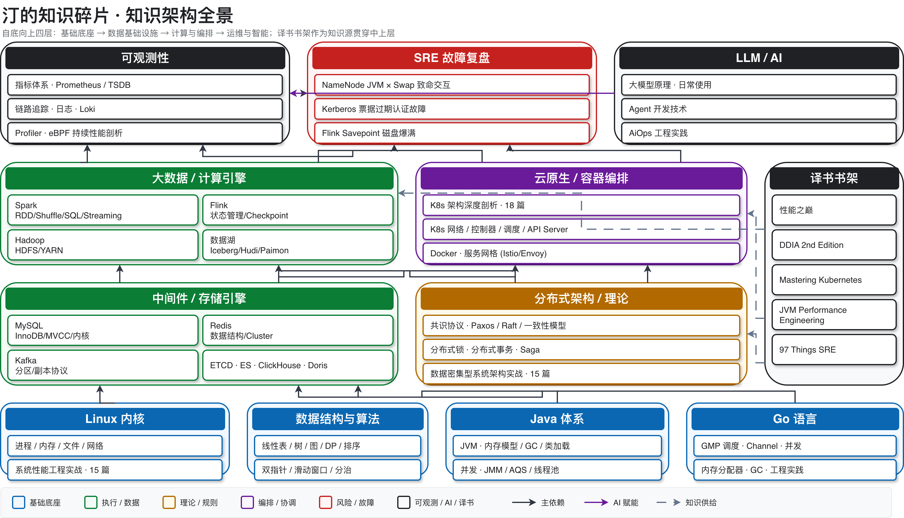

  <h1>关于我</h1>
  
<strong>Data Infra SRE</strong> — 在大数据基础设施上搬砖，顺带把每一块砖的纹理都记录下来。从 Linux 内核调度到分布式共识协议，从 Spark Shuffle 到 K8s 控制器循环，凡是踩过的坑、读过的源码、翻过的事故，都沉淀在这里。

这不是一个教程站，也不是一个搬运笔记的仓库。它是我自己的知识图谱——每篇文章都是我先吃透一个东西，再用自己的话讲一遍的产物。写的时候遵循一个朴素的判断标准：如果三年后的自己回来看，还能不能看懂？如果能，就留下；如果连自己都觉得糊弄，就删掉重写。

左侧的资源管理器按目录折叠，全局搜索在右上角，顶部有随机碎片入口可以碰碰运气。下面按领域把主要专栏列出来，方便你直接跳到感兴趣的地方。

---

<h2>知识领域</h2>

<h3>操作系统与底层原理</h3>

内核机制与系统级性能工程

- [[Linux/进程管理/00 专栏导览|进程生命周期与调度器]]
- [[Linux/内存管理/00 专栏导览|虚拟内存与 Slab 分配器]]
- [[Linux/文件系统/00 专栏导览|VFS、Page Cache 与 IO]]
- [[Linux/网络协议栈与IO/00 专栏导览|TCP/IP 协议栈与 epoll]]
- [[Linux/性能优化/00 专栏导览|Linux 性能优化体系]]
- [[Linux/系统性能工程实战/00 专栏导览|系统性能工程实战 · 15 篇]]

<h3>编程语言与并发原理</h3>

底层运行时机制与高并发工程实践

- [[Golang/Go并发编程/00 专栏导览|Go GMP 调度与 Channel]]
- [[Golang/Go语言核心/00 专栏导览|Go 内存分配器与 GC]]
- [[Java/JVM/00 专栏导览|JVM 内存模型与 GC 算法]]
- [[Java/并发编程/00 专栏导览|JMM 与 AQS 并发锁原理]]
- [[数据结构与算法/排序与查找/00 专栏导览|数据结构与算法专栏]]

<h3>中间件与存储引擎</h3>

数据存储、复制与高可用架构核心

- [[中间件/MySQL/MySQL架构与底层原理/00 专栏导览|MySQL InnoDB 与 MVCC]]
- [[中间件/Redis/Redis设计与实现/00 专栏导览|Redis 数据结构与 Cluster]]
- [[中间件/Kafka/00 专栏导览|Kafka 分区机制与副本协议]]
- [[中间件/ETCD/00 专栏导览|ETCD 与 Raft 共识算法]]
- [[中间件/Clickhouse/00 专栏导览|ClickHouse 列式存储引擎]]
- [[中间件/Elasticsearch/00 专栏导览|Elasticsearch 倒排索引与集群]]

<h3>分布式架构与大数据</h3>

计算引擎、数据湖与分布式理论

- [[分布式架构/分布式系统原理与协议/00 专栏导览|Paxos、Raft 与一致性模型]]
- [[分布式架构/数据密集型系统架构实战/00 专栏导览|数据密集型系统架构实战 · 15 篇]]
- [[大数据/Spark/Spark-RDD核心原理解析/00 专栏导览|Spark 核心原理与调优]]
- [[大数据/Flink/Flink原理深度解析与性能优化/00 专栏导览|Flink 状态管理与计算框架]]
- [[大数据/Hadoop/HDFS/00 专栏导览|HDFS NameNode 与数据节点]]
- [[大数据/数据湖/Iceberg/00 专栏导览|数据湖：Iceberg / Hudi / Paimon]]

<h3>云原生与容器编排</h3>

K8s 架构、服务网格与容器运行时

- [[云原生/Kubernetes/Kubernetes架构深度剖析/00 专栏导览|K8s 架构深度剖析 · 18 篇]]
- [[云原生/Kubernetes/kubernetes架构原则和对象设计/00 专栏导览|K8s 架构原则与对象设计]]
- [[云原生/Kubernetes/kubernetes之API Server/00 专栏导览|K8s API Server 深度解析]]
- [[云原生/Kubernetes/kubernetes控制器和调度器/00 专栏导览|K8s 控制器与调度器]]
- [[云原生/Kubernetes/kubernetes网络原理与插件/00 专栏导览|K8s 网络模型与 CNI 插件]]
- [[云原生/服务网格/00 专栏导览|Istio 服务网格与数据面]]
- [[云原生/Docker/00 专栏导览|Docker 容器与运行时]]

<h3>可观测性与 SRE</h3>

监控、追踪、剖析与生产故障复盘

- [[可观测/00 可观测性全景导览|可观测性全景导览]]
- [[可观测/指标/00 专栏导览|Prometheus 指标体系与 TSDB]]
- [[可观测/链路追踪/00 专栏导览|分布式链路追踪]]
- [[可观测/Profiler/00 专栏导览|eBPF 持续性能剖析]]
- [[可观测/AIOps与可观测性实战/00 专栏导览|AIOps 与可观测性实战]]
- [[SRE/故障排查与复盘/00 故障排查索引|故障排查与复盘索引]]

<h3>LLM 与 AI 工程</h3>

大模型原理、Agent 开发与 AiOps 实践

- [[LLM/LLM原理/00 专栏导览|大模型原理与架构]]
- [[LLM/大模型日常使用/00 专栏导览|大模型日常使用]]
- [[LLM/Agent开发技术/00 专栏导览|AI Agent 开发技术]]
- [[LLM/AiOps/00 专栏导览：大数据集群 SRE 的 AiOps 工程实践|AiOps 工程实践]]

<h3>译书与精读</h3>

英文技术书翻译、结构化精读与主题检索

- [[译书/00 译书索引|译书书架总览]]
- [[译书/Linux/性能之巅/00 专览导读|Systems Performance / 性能之巅]]
- [[译书/Java/JVM-Performance-Engineering/_index|JVM Performance Engineering]]
- [[译书/云原生/Mastering-Kubernetes/_index|Mastering Kubernetes]]
- [[译书/分布式/Designing Data-Intensive Applications, 2nd Edition/1 数据系统架构中的权衡|Designing Data-Intensive Applications]]
- [[译书/SRE/97 Things Every SRE Should Know/00 前言|97 Things Every SRE Should Know]]

---

## 知识架构全景

如果按系统的依赖关系把整个知识体系画成一张图，大概长这样。自底向上四层：底层操作系统和编程语言是地基，中间件和分布式理论是数据基础设施，大数据和云原生是计算与编排层，最上面是可观测、故障复盘和 AI。译书书架作为知识源贯穿中上层——很多专栏的灵感就来自翻译时反复读到的某一段。

> 图中实线箭头表示主依赖方向（下层是上层的运行时基础），紫色箭头是 AI 对运维的赋能，灰色虚线是译书作为知识源对各领域的供给。每个色块对应一个责任域，颜色语义见底部图例。

---

## 怎么逛

这个知识库没有严格的阅读顺序，但如果你刚进来不知道从哪开始，可以试试这几条路线：

- **想看底层**：从 [[Linux/进程管理/00 专栏导览|进程管理]] 入手，顺着调度器 → 内存 → 文件系统 → 网络协议栈往下走，最后用 [[Linux/系统性能工程实战/00 专栏导览|系统性能工程实战]] 把它们串起来
- **想看分布式**：先读 [[分布式架构/分布式系统原理与协议/00 专栏导览|分布式系统原理与协议]] 打底，再进 [[分布式架构/数据密集型系统架构实战/00 专栏导览|数据密集型系统架构实战]] 看工程权衡
- **想看 K8s**：直接从 [[云原生/Kubernetes/Kubernetes架构深度剖析/00 专栏导览|K8s 架构深度剖析]] 的第一篇开始，18 篇按从设计哲学到生产化管理的顺序铺开
- **想看事故复盘**：去 [[SRE/故障排查与复盘/00 故障排查索引|故障排查索引]]，三个真实生产事故的完整复盘都在那
- **随便逛**：顶部菜单有随机碎片入口，碰上什么看什么
