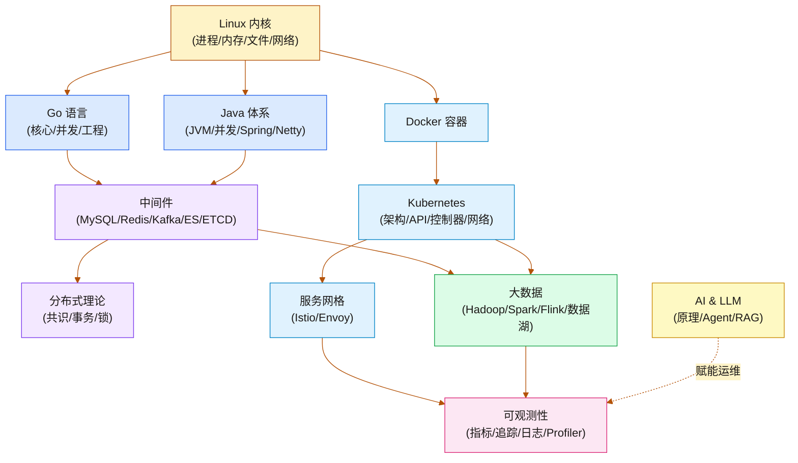

  <h1>汀的知识碎片</h1>
  
<strong>Senior Data Infra SRE</strong> / 探索系统底层的运转逻辑，从内核调优到分布式计算引擎的核心原理，构建稳如磐石的基础设施。

欢迎来到这片不断生长的赛博空间。这里的知识没有严格的线性顺序，你可以通过左侧的资源管理器自由探索，或者通过全局搜索直达目标。

---

## 🧭 知识领域全景

### 操作系统与底层原理
内核调度、内存分配机制与协议栈的深度剖析。

- [[Linux/进程管理/00 专栏导览|进程生命周期与调度器]]
- [[Linux/内存管理/00 专栏导览|虚拟内存与 Slab 分配器]]
- [[Linux/文件系统/00 专栏导览|VFS、Page Cache 与 IO]]
- [[Linux/网络协议栈与IO/00 专栏导览|TCP/IP 协议栈与 epoll]]
- [[Linux/性能优化/00 专栏导览|Linux 性能优化体系]]

### 编程语言与并发原理
底层机制与高并发工程实践。

- [[Golang/Go并发编程/00 专栏导览|Go GMP 调度与 Channel]]
- [[Golang/Go语言核心/00 专栏导览|Go 内存分配器与 GC]]
- [[Java/JVM/00 专栏导览|JVM 内存模型与 GC 算法]]
- [[Java/并发编程/00 专栏导览|JMM 与 AQS 并发锁原理]]

### 中间件存储引擎
数据存储与高可用架构核心。

- [[中间件/MySQL/MySQL架构与底层原理/00 专栏导览|MySQL InnoDB 与 MVCC]]
- [[中间件/Redis/Redis设计与实现/00 专栏导览|Redis 数据结构与 Cluster]]
- [[中间件/Kafka/00 专栏导览|Kafka 分区机制与副本协议]]
- [[中间件/ETCD/00 专栏导览|ETCD 与 Raft 共识算法]]

### 分布式与大数据系统
计算引擎与海量数据处理架构。

- [[分布式/分布式系统原理与协议/00 专栏导览|Paxos、Raft 与一致性模型]]
- [[大数据/Spark/Spark-RDD核心原理解析/00 专栏导览|Spark 核心原理与调优]]
- [[大数据/Flink/Flink原理深度解析与性能优化/00 专栏导览|Flink 状态管理与计算框架]]
- [[中间件/Clickhouse/00 专栏导览|ClickHouse 列式存储引擎]]

### 云原生与可观测性
容器编排、流量治理与系统画像。

- [[云原生/Kubernetes/kubernetes架构原则和对象设计/00 专栏导览|Kubernetes 架构与调度器]]
- [[云原生/服务网格/00 专栏导览|Istio 服务网格与数据面]]
- [[可观测/指标/00 专栏导览|Prometheus 指标体系与 TSDB]]
- [[可观测/Profiler/00 专栏导览|eBPF 持续性能剖析 (Profiling)]]

### 硬核故障排查与 AI
真实生产事故复盘与前沿工程。

- [[Trouble-shooting/NameNode长GC事故深度分析：JVM内存管理与Linux Swap的致命交互|NameNode JVM x Swap 致命交互]]
- [[Trouble-shooting/HiveServer2 Kerberos 认证故障深度分析报告|Kerberos 票据过期认证故障]]
- [[Trouble-shooting/Flink Savepoint 磁盘打满事故分析与最佳实践|Flink Savepoint 磁盘爆满分析]]
- [[LLM/Agent开发技术/00 专栏导览|AI Agent 开发技术与应用]]

---

## 🗺️ 知识拓扑概览

如果按系统的生命周期来划分我的思考域，它大概呈现如下的拓扑结构：

