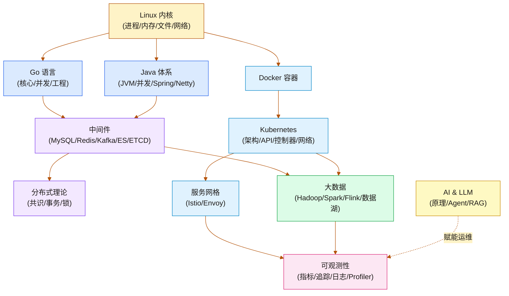

# 欢迎来到汀的知识碎片

> [!quote] 保持敏锐，持续观测
> 这里是我的个人数字花园。我是一名为大数据集群基础设施护航的 SRE，热衷于探索系统底层的运转逻辑。这里沉淀了从 Linux 内核到分布式计算、从 JVM 调优到服务网格、从 LLM 原理到 Agent 工程的完整知识体系。

欢迎来到这片还在不断生长的赛博空间。这里的知识没有严格的线性顺序，你可以通过左侧的资源管理器自由探索，或者通过全局搜索直达目标。

---

## 🧭 知识领域全景

你可以把这里当作我的个人 Runbook 和思考沉淀池，目前主要分为以下几个可用区：
### 操作系统与底层原理

| 专栏 | 核心内容 |
| :--- | :--- |
| **[[Linux/进程管理/00 专栏导览\|Linux 进程管理]]** | 进程生命周期、调度器、信号机制、进程间通信 |
| **[[Linux/内存管理/00 专栏导览\|Linux 内存管理]]** | 虚拟内存、页表、slab 分配器、OOM Killer、NUMA |
| **[[Linux/文件系统/00 专栏导览\|Linux 文件系统]]** | VFS、ext4/XFS、Page Cache、IO 调度器 |
| **[[Linux/网络协议栈与IO/00 专栏导览\|Linux 网络协议栈与 IO]]** | TCP/IP 内核实现、epoll、零拷贝、IO 模型 |
| **[[Linux/性能优化/00 专栏导览\|Linux 性能优化]]** | perf、strace、BPF 工具集、性能分析方法论 |

### 编程语言

| 专栏 | 核心内容 |
| :--- | :--- |
| **[[Golang/Go语言核心/00 专栏导览\|Go 语言核心]]** | 类型系统、interface、slice/map 底层、内存分配器、GC |
| **[[Golang/Go并发编程/00 专栏导览\|Go 并发编程]]** | Goroutine、GMP 调度、Channel、sync 包、netpoller |
| **[[Golang/Go工程实践/00 专栏导览\|Go 工程实践]]** | 项目结构、Module、错误处理、测试、性能剖析 |
| **[[Java/JVM/00 专栏导览\|JVM 深度解析]]** | 运行时数据区、GC 算法（G1/ZGC/Shenandoah）、JIT、类加载 |
| **[[Java/并发编程/00 专栏导览\|Java 并发编程]]** | JMM、锁机制、AQS、线程池、并发容器 |
| **[[Java/OOP设计模式/00 专栏导览\|OOP 设计模式]]** | 创建型/结构型/行为型模式、SOLID 原则 |

### Java 框架生态

| 专栏                                           | 核心内容                             |
| :------------------------------------------- | :------------------------------- |
| **[[Java/SpringCore/00 专栏导览\|Spring Core]]** | IoC 容器、AOP、Bean 生命周期、事件机制        |
| **[[Java/SpringBoot/00 专栏导览\|Spring Boot]]** | 自动配置原理、Starter 机制、Actuator       |
| **[[Java/Mybatis/00 专栏导览\|MyBatis]]**        | SqlSession、动态 SQL、缓存机制、Mapper 代理 |
| **[[Java/Netty/00 专栏导览\|Netty]]**            | Reactor 模型、ByteBuf、Pipeline、编解码器 |

### 中间件

| 专栏 | 核心内容 |
| :--- | :--- |
| **[[中间件/MySQL/MySQL架构与底层原理/00 专栏导览\|MySQL 底层原理]]** | InnoDB 存储引擎、B+ 树索引、事务与 MVCC、锁机制 |
| **[[中间件/MySQL/MySQL进阶使用/00 专栏导览\|MySQL 进阶使用]]** | 慢查询优化、分库分表、高可用架构 |
| **[[中间件/Redis/Redis设计与实现/00 专栏导览\|Redis 设计与实现]]** | 数据结构底层、持久化、复制、Cluster |
| **[[中间件/Redis/Redis进阶教程/00 专栏导览\|Redis 进阶教程]]** | 缓存策略、分布式锁、Lua 脚本、性能调优 |
| **[[中间件/Kafka/00 专栏导览\|Kafka]]** | 分区机制、副本协议、消费者组、Exactly-Once |
| **[[中间件/Elasticsearch/00 专栏导览\|Elasticsearch]]** | 倒排索引、分片路由、DSL 查询、集群管理 |
| **[[中间件/ETCD/00 专栏导览\|ETCD]]** | Raft 共识、MVCC、Watch 机制、K8s 状态存储 |
| **[[中间件/Zookeeper/00 专栏导览\|ZooKeeper]]** | ZAB 协议、临时节点、分布式协调 |
| **[[中间件/Dubbo/00 专栏导览\|Dubbo]]** | RPC 框架、服务治理、SPI 机制 |
| **[[中间件/Leveldb/00 专栏导览\|LevelDB]]** | LSM-Tree、Compaction、WAL |
| **[[中间件/Milvus/00 专栏导览\|Milvus]]** | 向量数据库、ANN 索引、混合查询 |

### OLAP 与存储

| 专栏 | 核心内容 |
| :--- | :--- |
| **[[中间件/Clickhouse/00 专栏导览\|ClickHouse]]** | 列式存储、MergeTree 引擎、向量化执行 |
| **[[中间件/Doris/00 专栏导览\|Doris]]** | MPP 架构、物化视图、实时分析 |
| **[[中间件/Trino/00 专栏导览\|Trino]]** | 联邦查询、Connector、内存管理 |
| **[[中间件/Ceph/00 专栏导览\|Ceph]]** | CRUSH 算法、OSD、RBD/CephFS |
| **[[中间件/JuiceFS/00 专栏导览\|JuiceFS]]** | 云原生文件系统、元数据引擎、对象存储 |

### 分布式系统

| 专栏 | 核心内容 |
| :--- | :--- |
| **[[分布式/分布式系统原理与协议/00 专栏导览\|分布式系统原理与协议]]** | CAP/FLP 定理、Paxos、Raft、Gossip、一致性模型 |
| **[[分布式/分布式事务/00 专栏导览\|分布式事务]]** | 2PC/3PC、TCC、Saga、消息最终一致性、Seata |
| **[[分布式/分布式锁/00 专栏导览\|分布式锁]]** | Redis 锁、Redlock 争议、ZooKeeper 锁、数据库锁 |

### 大数据

| 专栏                                    | 核心内容                                                                                                                                                                                                                                                                                                                                                                                                   |
| :------------------------------------ | :----------------------------------------------------------------------------------------------------------------------------------------------------------------------------------------------------------------------------------------------------------------------------------------------------------------------------------------------------------------------------------------------------- |
| **[[大数据/Hadoop/HDFS/00 专栏导览\|HDFS]]** | NameNode 架构、Block 副本策略、联邦与高可用                                                                                                                                                                                                                                                                                                                                                                          |
| **[[大数据/Hadoop/Yarn/00 专栏导览\|YARN]]** | 资源调度、容量调度器、ApplicationMaster                                                                                                                                                                                                                                                                                                                                                                           |
| **[[大数据/Hive/00 专栏导览\|Hive]]**        | 元数据管理、执行引擎、分区分桶、UDF                                                                                                                                                                                                                                                                                                                                                                                    |
| **[[大数据/HBase/00 专栏导览\|HBase]]**      | LSM-Tree、Region Split、Compaction、协处理器                                                                                                                                                                                                                                                                                                                                                                  |
| **Spark 系列**                          | [[大数据/Spark/Spark-RDD核心原理解析/00 专栏导览\|RDD 原理]]、[[大数据/Spark/Spark-SQL深度解析与性能调优/00 专栏导览\|Spark SQL]]、[[大数据/Spark/Spark-Shuffle与内存管理机制深度解析/00 专栏导览\|Shuffle 与内存]]、[[大数据/Spark/Spark-调度系统与执行模型深度解析/00 专栏导览\|调度系统]]、[[大数据/Spark/Spark-Structured-Streaming流处理深度解析/00 专栏导览\|Structured Streaming]]、[[大数据/Spark/Spark-容错与状态管理深度解析/00 专栏导览\|容错与状态]]、[[大数据/Spark/Spark-on-Kubernetes工程实践/00 专栏导览\|Spark on K8s]] |
| **Flink 系列**                          | [[大数据/Flink/Flink从入门到实战/00 专栏导览\|入门到实战]]、[[大数据/Flink/Flink原理深度解析与性能优化/00 专栏导览\|原理与性能优化]]                                                                                                                                                                                                                                                                                                               |
| **数据湖**                               | [[大数据/数据湖/Iceberg/00 专栏导览\|Iceberg]]、[[大数据/数据湖/Hudi/00 专栏导览\|Hudi]]、[[大数据/数据湖/Delta-Lake-Lakehouse架构深度解析/00 专栏导览\|Delta Lake]]、[[大数据/数据湖/paimon/00 专栏导览\|Paimon]]                                                                                                                                                                                                                                      |
| **[[大数据/安全与认证/00 专栏导览\|大数据安全与认证]]**   | Kerberos、Ranger、数据脱敏                                                                                                                                                                                                                                                                                                                                                                                   |

### 云原生

| 专栏 | 核心内容 |
| :--- | :--- |
| **[[云原生/Docker/00 专栏导览\|Docker 深度解析]]** | Namespace、Cgroups、UnionFS、容器网络、安全边界 |
| **[[云原生/Kubernetes/kubernetes架构原则和对象设计/00 专栏导览\|K8s 架构与对象设计]]** | 设计哲学、GVR 体系、Label Selector、etcd 存储 |
| **[[云原生/Kubernetes/kubernetes之API Server/00 专栏导览\|K8s API Server]]** | 认证、RBAC 授权、准入控制、List-Watch、Informer |
| **[[云原生/Kubernetes/kubernetes控制器和调度器/00 专栏导览\|K8s 控制器与调度器]]** | 协调循环、Deployment/StatefulSet/DaemonSet、Scheduler、Operator |
| **[[云原生/Kubernetes/kubernetes网络原理与插件/00 专栏导览\|K8s 网络原理与插件]]** | CNI、Flannel、Calico、Cilium、kube-proxy/IPVS、NetworkPolicy、CoreDNS |
| **[[云原生/Kubernetes/kubernetes生产实践与集群管理/00 专栏导览\|K8s 生产实践]]** | 集群规划、资源管理、故障排查、升级策略 |
| **[[云原生/服务网格/00 专栏导览\|服务网格（Istio）]]** | Sidecar 模式、Envoy 代理、流量管理、mTLS 安全、可观测性、Ambient Mesh |

### 可观测性

| 专栏 | 核心内容 |
| :--- | :--- |
| **[[可观测/00 可观测性全景导览\|可观测性全景导览]]** | 三大支柱总览与工程方法论 |
| **[[可观测/指标/00 专栏导览\|指标体系]]** | Prometheus 数据模型、PromQL、TSDB、高可用、Grafana、SLO |
| **[[可观测/链路追踪/00 专栏导览\|链路追踪]]** | OpenTelemetry、SkyWalking Agent、OAP 流处理 |
| **[[可观测/日志/00 专栏导览\|日志体系]]** | 采集架构、Elasticsearch、Loki、日志与追踪联动 |
| **[[可观测/Profiler/00 专栏导览\|Profiler]]** | 持续性能剖析、火焰图、eBPF Profiling |

### AI 与大模型

| 专栏 | 核心内容 |
| :--- | :--- |
| **[[LLM/LLM原理/00 专栏导览\|LLM 原理]]** | Transformer、GPT 架构、预训练、RLHF、LoRA、推理优化、模型部署 |
| **[[LLM/Agent开发技术/00 专栏导览\|Agent 开发技术]]** | Prompt 工程、RAG、MCP 协议、Agent 推理与工具调用、多 Agent 系统 |

### 故障案例库

| 文章 | 核心内容 |
| :--- | :--- |
| **[[Trouble-shooting/NameNode长GC事故深度分析：JVM内存管理与Linux Swap的致命交互\|NameNode 长 GC 事故]]** | JVM 内存管理与 Linux Swap 的致命交互 |
| **[[Trouble-shooting/HiveServer2 Kerberos 认证故障深度分析报告\|HS2 Kerberos 认证故障]]** | Kerberos 票据过期与续约机制分析 |
| **[[Trouble-shooting/HiveServer2 Redis UDF 文件描述符泄漏故障报告\|HS2 Redis UDF FD 泄漏]]** | 文件描述符泄漏根因与修复 |
| **[[Trouble-shooting/Flink Savepoint 磁盘打满事故分析与最佳实践\|Flink Savepoint 磁盘打满]]** | Savepoint 管理与磁盘容量规划 |

---

## 🗺️ 知识拓扑概览

如果按系统的生命周期来划分我的思考域，它大概呈现如下的拓扑结构：

