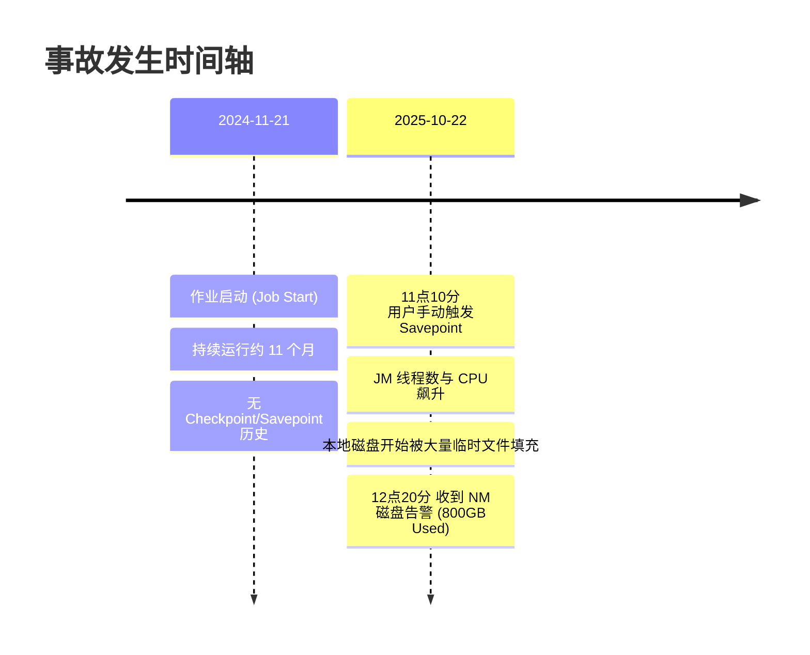
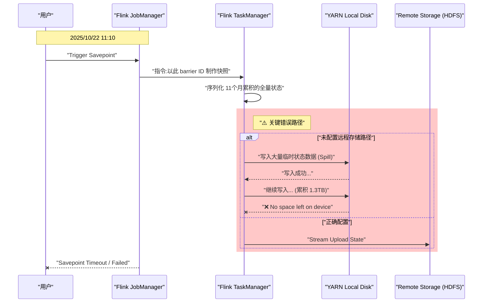

## 引言

> [!NOTE] 在大规模流处理系统中，状态管理是核心挑战之一。Apache Flink 凭借其强大的状态管理和精确一次（Exactly-Once）语义，成为实时计算领域的事实标准。然而，不正确的状态配置可能导致灾难性后果。
> 本文将深入分析一起由 Flink Savepoint 操作引发的生产事故，揭示其根本原因，并提供一套完整的预防和最佳实践方案。这起事故不仅涉及技术细节，更暴露出配置管理、监控预警和运维规范等深层次问题，对于所有运行关键流处理作业的团队都具有重要的借鉴意义。

## 事故现象与时间线

### 告警详情
- **告警指标**：NodeManager（NM）节点本地磁盘存储使用率在短时间内急剧上升。
- **数据表现**：在1小时内，单块磁盘的可用空间减少**15%**，累计消耗超过**800GB**。
- **问题定位**：通过排查，在YARN的 `usercache` 目录下发现异常巨大的临时文件，路径为 `/data_i/hadoop/yarn/local/usercache/mbadp/appcache/application_1724243239726_2684`，总大小达到**1.3TB**。

### 现场还原
- **文件特征**：问题目录下存在大量名为 `temp-00000000` 格式的临时文件，每个文件大小约为11GB，并且在监控期间持续生成。
![[Pasted image 20260122101927.png]]
- **操作记录**：监控系统显示，在 `2025/10/22 11:10:07`，用户通过管理界面手动触发了 **Savepoint** 操作。
![[Pasted image 20260122101952.png]]
- **资源异常**：自11:10分之后，对应的Checkpoint操作一直处于“进行中”状态，未能完成。同时，JobManager的活跃线程数激增，CPU负载飙升，系统性能严重下降。
![[Pasted image 20260122102001.png]]
### 事件时间轴


## 深度根因分析

### 核心问题：为何一次 Savepoint 操作会耗尽磁盘？

#### 1. 状态积压（State Accumulation）
- **长期未做快照**：该作业已持续运行**11个月**，在此期间从未成功执行过任何 Checkpoint 或 Savepoint 操作。
- **Savepoint 的全量性质**：Savepoint 在语义上通常是**全量（Canonical）** 快照。它需要捕获作业在某个时间点的完整、一致的状态，以便未来能够精确恢复到该点。这与**增量Checkpoint**（Incremental Checkpointing）有本质区别，后者只保存自上次Checkpoint以来的状态变化。
- **状态规模膨胀**：对于运行近一年的流作业，尤其是那些包含窗口聚合（Window）、键控状态（KeyedState）或复杂状态逻辑的作业，其状态数据量可能从最初的几百MB膨胀到TB级别。当触发全量Savepoint时，Flink需要遍历并序列化所有这些累积的状态。

#### 2. 关键配置缺失（Configuration Drift）
- **致命错误**：用户提交的作业代码中，**没有配置 `state.savepoints.dir` 或 `state.checkpoints.dir`** 参数。这两个参数用于指定快照数据应持久化到的远程分布式存储路径（如HDFS、S3）。
- **默认行为的陷阱**：当没有显式指定远程存储路径时，Flink的状态后端（State Backend）会将快照过程中生成的中间数据（如RocksDB的SST文件或Heap状态序列化后的字节）写入**本地临时目录**。这个目录通常是 `java.io.tmpdir` 或YARN分配给该容器的本地工作目录。
- **在YARN模式下的具体表现**：在 Flink on YARN 的部署模式下，TaskManager运行在YARN容器内，其本地目录就是NodeManager管理的 `local-dir`（例如 `/data_i/hadoop/yarn/local`）。因此，巨大的临时状态文件直接写入了物理节点的本地磁盘。

#### 3. 流程死锁与资源耗尽
- **磁盘空间不足**：需要保存的状态数据总量（1.3TB）远超过了本地磁盘的剩余可用空间。
- **恶性循环**：Savepoint 过程因磁盘空间不足而无法完成。由于过程未完成，系统不会自动清理已写入的临时文件。这进一步占用了磁盘空间，最终导致磁盘被完全写满。
- **后果**：磁盘写满可能引发TaskManager进程崩溃（Crash），或导致NodeManager将该节点标记为“不健康”，影响节点上运行的所有其他作业。

### 流程可视化分析
下面的序列图清晰地展示了在配置缺失的情况下，一次Savepoint操作如何导致本地磁盘被打满。



## 解决方案与长期治理

### 临时处置措施
- **紧急止血**：立即通过YARN命令终止（Kill）该Flink Application。ApplicationMaster被终止后，YARN会回收其占用的所有容器资源，并自动清理容器本地工作目录（包括 `usercache` 下的文件），从而释放被占用的磁盘空间。
- **增强监控**：在监控系统（如Zabbix或Prometheus）中，增加对YARN关键本地目录（例如 `/data_*/hadoop/yarn/local/usercache/`）的**目录大小监控**。设定合理的告警阈值（如500GB），以便在问题发生的早期阶段就能及时发现并干预，避免影响扩散。

### 长期治理策略
为了从根本上防止此类问题复发，需要从平台和流程层面进行治理：
1.  **作业提交强校验**：在作业提交网关或平台入口，增加配置校验逻辑。检查作业配置中是否包含了有效的远程状态存储路径（`state.checkpoints.dir`）。如果未配置，则拒绝作业提交，或在后台自动为作业注入一个平台级的默认HDFS路径。
2.  **功能熔断**：对于平台上已经存在的、未配置远程存储路径的存量作业，在其Web UI或管理界面上，**禁用“Trigger Savepoint”按钮**。这可以防止用户无意中触发可能导致灾难的操作，同时引导用户先去完善作业配置。

### 最佳实践代码示例
以下Java代码展示了在Flink作业中，如何正确配置状态后端和Checkpoint策略，这是防止此类问题的标准做法。核心是**明确指定远程存储路径**和**启用增量Checkpoint**。

```java
import org.apache.flink.streaming.api.environment.StreamExecutionEnvironment;
import org.apache.flink.contrib.streaming.state.EmbeddedRocksDBStateBackend;
import org.apache.flink.streaming.api.CheckpointingMode;
import org.apache.flink.streaming.api.environment.CheckpointConfig;

public class FlinkStateConfig {
    public static void configureState(StreamExecutionEnvironment env, String jobName, String user) {
        // 1. 明确指定远程 HDFS 路径，避免写本地
        // 这是最关键的一步，确保快照数据直接写入分布式文件系统
        String checkPointPath = String.format("hdfs:///user/%s/flink/checkpoint/%s", user, jobName);
        
        // 2. 启用 RocksDB State Backend (适合大状态作业)
        // 第二个参数 `true` 表示开启增量 Checkpoint，这对于大状态作业至关重要，
        // 因为它每次只上传新增或修改的状态文件，而非全量，能极大减少IO和网络开销。
        env.setStateBackend(new EmbeddedRocksDBStateBackend(true));
        
        // 3. 配置 Checkpoint 存储路径
        env.getCheckpointConfig().setCheckpointStorage(checkPointPath);

        // 4. Checkpoint 策略详细配置
        // 开启 CP，间隔 60秒。频率需要根据业务容忍度和状态大小权衡。
        env.enableCheckpointing(60000); 
        
        // 语义保证：使用 EXACTLY_ONCE 模式，确保端到端的一致性。
        env.getCheckpointConfig().setCheckpointingMode(CheckpointingMode.EXACTLY_ONCE);
        
        // 两个 CP 之间的最小暂停时间为30秒，防止 CP 过于频繁导致反压。
        env.getCheckpointConfig().setMinPauseBetweenCheckpoints(30000);
        
        // 单次 Checkpoint 的超时时间设为5分钟，避免耗时过长的 CP 拖死整个作业。
        env.getCheckpointConfig().setCheckpointTimeout(5 * 60 * 1000); 
        
        // 容忍的连续 Checkpoint 失败次数为2次，避免因临时问题导致作业频繁重启。
        env.getCheckpointConfig().setTolerableCheckpointFailureNumber(2);
        
        // 最大并发 Checkpoint 数设为1，避免多个 CP 同时进行时对磁盘IO和网络造成争抢。
        env.getCheckpointConfig().setMaxConcurrentCheckpoints(1);
        
        // 关键配置：作业被 Cancel 后保留 CP 数据。
        // 这可以防止因误操作取消作业后，恢复时找不到快照的尴尬局面。
        env.getCheckpointConfig().setExternalizedCheckpointCleanup(
            CheckpointConfig.ExternalizedCheckpointCleanup.RETAIN_ON_CANCELLATION
        );
        
        // 配置重启策略：失败后尝试重启3次，每次间隔10秒。
        env.setRestartStrategy(org.apache.flink.api.common.restartstrategy.RestartStrategies.fixedDelayRestart(3, 10000));
    }
}
```
**使用方法**：在作业的 `main` 函数中，创建 `StreamExecutionEnvironment` 后，调用此方法进行配置。
```java
StreamExecutionEnvironment env = StreamExecutionEnvironment.getExecutionEnvironment();
FlinkStateConfig.configureState(env, "MyFlinkJob", "zhangsan");
// ... 定义数据源、转换逻辑、数据汇
env.execute("MyFlinkJob");
```

## 关联知识点与补充说明

### State Backend 详解
Flink 提供了多种状态后端，用于定义状态数据的存储、访问和备份方式。选择合适的后端对作业性能和稳定性至关重要。
- **HashMapStateBackend**：将状态存储在JVM堆内存中。适用于状态较小、要求低延迟的作业。它的快照会将状态序列化后写入指定存储。**缺点**：状态大小受限于TaskManager的堆内存，大状态易导致OOM；全量快照开销大。
- **EmbeddedRocksDBStateBackend**：将状态存储在本地磁盘上的嵌入式RocksDB实例中。RocksDB是一种高性能的嵌入式键值存储。
    - **优点**：状态容量仅受本地磁盘大小限制，非常适合**大状态**场景（如本文的TB级状态）。它天然支持**增量Checkpoint**，每次快照只需上传RocksDB中新生成的文件，效率极高。
    - **缺点**：由于涉及磁盘IO，读写速度通常比纯内存慢。
- **选择建议**：对于状态明确会增长到较大规模（例如超过几百MB）的作业，**必须**使用 `EmbeddedRocksDBStateBackend` 并开启增量Checkpoint。

### Flink on YARN 的磁盘隔离机制
- **YARN Local Directory**：YARN的NodeManager会配置一系列本地目录（`yarn.nodemanager.local-dirs`），用于存放容器运行所需的临时文件，如作业的jar包、分布式缓存文件以及容器的中间输出。
- **容器工作目录**：每个YARN容器（包括Flink的JobManager和TaskManager容器）都会在其中一个 `local-dir` 下创建一个专属的工作目录。容器内进程看到的“当前目录”或 `java.io.tmpdir` 就指向这里。
- **风险点**：YARN本身对单个容器能使用的本地磁盘空间有软限制（通过 `yarn.nodemanager.localizer.cache.target-size-mb` 等参数控制），但主要是针对缓存文件。对于容器运行时自己产生的文件（如Flink的临时状态文件），如果没有在Flink层面配置远程存储，**这些文件会直接写入容器工作目录，可能打满整个物理磁盘**，从而影响同一节点上运行的所有其他容器。
- **最佳实践**：除了在Flink中配置远程存储，也应在YARN层面考虑使用cgroups等技术对容器的磁盘使用进行更严格的隔离和限制。

## 总结与反思
本次事故是一起典型的技术债务引发的生产故障。根本原因在于对Flink状态管理机制理解不深，以及配置管理的缺失。它给我们带来以下几点重要启示：

1.  **配置即代码，规范大于一切**：关键配置（如状态存储路径）必须有强制性的规范和校验，不能依赖开发者的自觉。平台应提供安全的默认值并防止危险配置。
2.  **监控需要覆盖“非标准”路径**：监控不仅要看CPU、内存、网络，对于存储，不仅要监控HDFS，更要监控所有可能被写入临时数据的本地目录。预警阈值应设置在远低于灾难发生的水平。
3.  **理解默认行为的代价**：在使用任何框架时，必须深入了解其各项默认设置。Flink将临时状态写入本地目录是合理的默认行为（为了效率），但在生产环境的大状态场景下，这变成了一个陷阱。
4.  **定期维护与演练**：对于长期运行（Long-Running）的流作业，应建立定期执行Savepoint的运维制度。这不仅能验证恢复流程的有效性，也能及早发现像状态无限增长这类潜在问题。

通过实施上述的代码规范、平台强校验和增强监控，可以构建一个更健壮、可靠的Flink流处理生产环境，确保数据处理的稳定性和连续性。