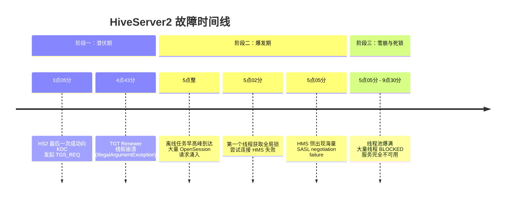
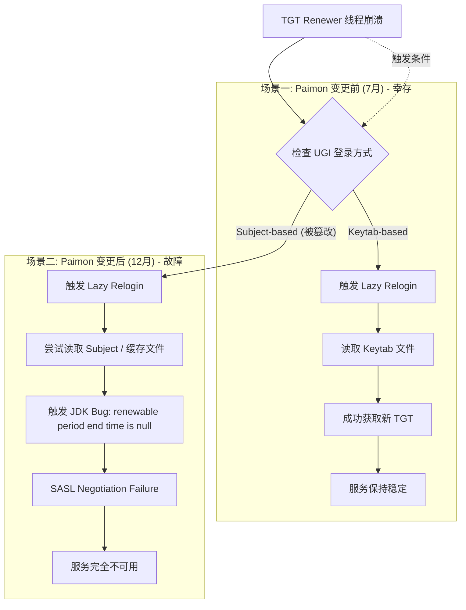

## 1. 摘要

近期 HiveServer2 (HS2) 发生大规模 SASL 认证失败，导致集群服务不可用。经深度排查，确认该事故由环境配置隐患与代码变更两个核心因素叠加导致：

*   **环境配置隐患（静态因素）**：Linux 系统工具 (`kinit`) 与 JDK 在解析 `krb5.conf` 配置时存在行为差异。`kinit` 会根据 `renew_lifetime` 智能推断并生成带有 RENEWABLE 标记的票据，而 JDK 严格要求配置文件中显式设置 `renewable = true`。这种不一致导致 JDK 在尝试续期时无法解析续期截止时间，引发 TGT Renewer 守护线程因参数异常崩溃。
*   **代码变更触发（动态因素）**：Paimon Connector 引入了不当的登录逻辑 (`loginUserFromSubject`)。该操作不仅触发了上述 JDK Bug，更致命的是篡改了 Hadoop UGI (UserGroupInformation) 的内部状态，将登录上下文从 Keytab-based 强制切换为 Subject-based，导致原本健壮的 Keytab 自动兜底机制失效。

## 2. 背景知识补充

在深入分析故障之前，有必要理解涉及的关键 Kerberos 和 Hadoop 安全概念。

### 2.1 核心概念
*   **TGT (Ticket Granting Ticket)**：票据授予票据。由 KDC 颁发，是用户获取特定服务票据的“通行证”。TGT 有有效期，通常默认为 24 小时。
*   **TGT Renewal (续期)**：在不重新进行身份验证（即不重新输入密码或使用 Keytab）的情况下，延长 TGT 的有效期。这对于长时间运行的服务（如 HiveServer2）至关重要。
*   **UGI (UserGroupInformation)**：Hadoop 中用于管理用户信息和凭证的类。它维护了当前的登录用户状态，包括登录方式（Keytab 或 Subject）以及相关的 Kerberos 凭证。
*   **Keytab vs. Subject**：
    *   **Keytab**：包含加密的 Principal 密钥，允许无人值守地获取或续期 TGT。这是服务端进程的标准登录方式。
    *   **Subject**：Java 安全层面的用户身份集合，包含凭证。
*   **Delegation Token (委托令牌)**：Hadoop 引入的机制，允许后续作业（如 MapReduce/Spark Task）在不直接访问 KDC 的情况下，以用户身份访问 HDFS 等服务。这解释了为何 HDFS 读写在 HS2 故障期间仍能短暂工作。

### 2.2 认证流程简述
1.  HS2 启动时，通过 Keytab 登录 KDC 获取 TGT。
2.  后台线程定期尝试续期 TGT。
3.  客户端连接 HS2 时，HS2 通过 `doAs` 逻辑模拟用户身份。
4.  HS2 连接 Hive Metastore (HMS) 时，需要先向 HMS 获取 Delegation Token 或进行 Kerberos 认证。

## 3. 故障详细时间线与证据链

本次故障经历了潜伏、爆发和雪崩三个阶段。



### 3.1 阶段一：潜伏期
在此阶段，HS2 表面看似正常，但内部的 Kerberos 续期机制已经失效。

*   **T-Days**：HS2 持续运行，由于代码或业务逻辑问题，到 HMS 的连接数缓慢泄露至 4.9 万+。
*   **12-31 03:05**：KDC 日志显示，这是 HS2 最后一次成功向 KDC 发起 TGS_REQ。此后长达 7 小时无续期请求。
*   **12-31 04:43:08 (关键节点)**：HS2 内部 TGT Renewer 线程崩溃。

**关键报错日志**：
```java
ERROR [TGT Renewer for hive/hs2.venus.sohurdc.com@VENUS.SOHURDC.COM]: security.UserGroupInformation - TGT is destroyed. Aborting renew thread for hive/hs2.venus.sohurdc.com@VENUS.SOHURDC.COM.
org.apache.hadoop.security.KerberosAuthException: Login failure for user: hive/hs2.venus.sohurdc.com@VENUS.SOHURDC.COM 
javax.security.auth.login.LoginException: java.lang.IllegalArgumentException: The renewable period end time cannot be null for renewable tickets.
    at javax.security.auth.kerberos.KerberosTicket.init(KerberosTicket.java:317)
    ...
    at org.apache.hadoop.security.UserGroupInformation$TicketCacheRenewalRunnable.relogin(UserGroupInformation.java:1066)
    at org.apache.hadoop.security.UserGroupInformation$AutoRenewalForUserCredsRunnable.run(UserGroupInformation.java:975)
```

**定性**：这是故障的“零号时刻”。此时 HS2 进入“无政府状态”，内存中的 TGT 被标记为销毁或不可续期。

### 3.2 阶段二：爆发期
随着早高峰流量到来，潜在的认证问题迅速转化为服务不可用。

*   **12-31 05:00:00**：离线任务早高峰到达。大量 `OpenSession` 请求涌入，触发 `doAs` 逻辑，需要向 HMS 申请 Delegation Token。
*   **12-31 05:02:00**：
    *   **现象**：第一个线程抢到了 CLIService 全局锁。
    *   **动作**：尝试连接 HMS。由于 TGT 状态异常（已被标记 Destroyed）或文件句柄不足，触发底层异常。
    *   **HMS 侧**：收到海量积压连接的冲击（惊群效应），Thrift Server 线程池爆满，无法处理 SASL 握手。

**HMS 侧证据**：
```text
ERROR ... Peer indicated failure: GSS initiate failed
```

### 3.3 阶段三：雪崩与死锁
*   **12-31 05:05 - 09:30**：
    *   **死循环**：持有锁的线程进入 `RetryingMetaStoreClient` 逻辑 -> 报错 -> 持有锁休眠 (`Thread.sleep`) -> 重试。
    *   **死亡接力**：一个线程超时/失败退出 -> 释放锁 -> 下一个线程拿到锁 -> 瞬间掉入同样的坑 -> 继续持有锁休眠。

**Thread Dump 证据**：
```text
3 Blocked by 81 (hiveserver2-web-81-acceptor-3...)
792 Blocked by 3718368 (HiveServer2-Handler-Pool: Thread-3718368)

Stack trace:
org.apache.hive.service.cli.CLIService.getDelegationTokenFromMetaStore(CLIService.java:570)
...
State: BLOCKED
Blocked by 3718368 (HiveServer2-Handler-Pool: Thread-3718368)
```

**HDFS 幸存之谜**：HDFS 客户端之所以能用，是因为它使用的是长效的 Delegation Token（7天有效期），不需要每次都跟 KDC 交互；而 HMS 连接需要实时的 Kerberos 认证。

## 4. 根因深度技术分析

### 4.1 根因一：JDK 与 OS 对 Kerberos 协议理解的偏差

#### 原理描述
Linux 系统的 Kerberos 库（MIT Kerberos）与 Java 的实现 (`sun.security.krb5`) 在解析 `/etc/krb5.conf` 时存在逻辑不一致。

*   **OS 行为**：当配置 `renew_lifetime = 7d` 时，`kinit` 智能推断用户需要续期能力，自动为生成的凭证缓存（`/tmp/krb5cc_xxx`）打上 `RENEWABLE` (R) 标记。
*   **JDK 行为**：Java 实现严格依赖显式配置。如果 `[libdefaults]` 中未显式设置 `renewable = true`，JDK 默认认为不可续期。

#### 异常触发链
1.  HS2 尝试读取由 `kinit` 生成的缓存文件。
2.  JDK 读取文件流，解析出 Ticket 包含 R 标记。
3.  在构建 `KerberosTicket` 对象时，JDK 根据 `krb5.conf` 配置（默认为 false）未计算/填充 `renewTill`（续期截止时间）字段，导致该字段为 `null`。
4.  **Crash Point**：`KerberosTicket` 构造函数执行严格校验，抛出异常。

#### JDK 8 源码分析
```java
// javax.security.auth.kerberos.KerberosTicket.java:317
// 如果票据有 Renewable 标记 (从文件读入)
if (flags != null && flags[RENEWABLE]) {
    // 但 renewTill 时间为空 (因配置未开启)
    if (renewTill == null) {
        // 抛出致命异常，导致 Renewer 线程退出循环
        throw new IllegalArgumentException("The renewable period end time cannot be null for renewable tickets.");
    }
    this.renewTill = new Date(renewTill.getTime());
}
```

#### 配置对比证据
*   **krb5.conf**：未显式配置 `renewable=true`，仅配置了 `renew_lifetime=7d`。
*   **klist 输出**：显示 Flags 包含 `R` (Renewable)。
*   **Java 获取的配置**：缺失 `renewable=true` 项。

### 4.2 根因二：Paimon 代码修改导致的 UGI 状态篡改

#### 问题代码
Paimon 引入了如下逻辑来处理 Proxy User 登录，这是导致服务瘫痪的直接导火索。

```java
// 修改后的 Paimon KerberosLoginProvider.java
} else if (!isProxyUser(UserGroupInformation.getCurrentUser())) {
    // ...
} else {
    // 致命修改：对 Proxy User 强行尝试基于 Subject 的登录
    UserGroupInformation.loginUserFromSubject(null);
}
```

#### 技术危害分析

1.  **触发异常**：
    该调用强制 UGI 重新加载凭证。由于回退机制，UGI 尝试读取 `/tmp/krb5cc_xxx` 缓存文件，直接触发了 4.1 中描述的 JDK Bug，导致 TGT Renewer 线程从 `TIMED_WAITING`（正常休眠）状态转变为 `TERMINATED`（异常退出）。

2.  **破坏 Keytab 兜底机制（核心死因）**：
    *   **正常状态**：HS2 启动时通过 `loginUserFromKeytab` 初始化，UGI 内部标记为 Keytab-based。当 TGT 过期且 Renewer 线程死亡时，Hadoop 安全框架会触发 lazy relogin，自动使用 Keytab 文件重新申请票据。
    *   **篡改后状态**：`loginUserFromSubject(null)` 的调用将当前 UGI 的登录上下文重置为 Subject-based。
    *   **后果**：UGI 丢失了“我是通过 Keytab 登录”的记忆。当 TGT 最终过期时，惰性重登逻辑不再尝试读取 Keytab，而是错误地再次尝试读取缓存或 Subject，最终因凭证无效导致 SASL 认证全面失败。

## 5. 故障逻辑全景图

下图展示了 7月30日（幸存）与 12月31日（宕机）的逻辑分支对比：



## 6. 结论与风险评估

### 6.1 结论
本次事故是环境配置缺陷与不当代码变更共同作用的结果。
1.  JDK Bug 导致了 TGT 自动续期线程的死亡（这是长期存在的隐患）。
2.  Paimon 的代码修改不仅诱发了该 Bug，更关键的是它卸载了 HS2 的安全防御机制，导致系统失去容错能力。

### 6.2 潜在风险
如果不进行修复，当前集群面临以下风险：
*   **定时炸弹**：每次 HS2 重启或重新登录后，服务寿命仅等于 TGT 的有效期（24小时）。一旦到期，服务必挂。
*   **权限混乱**：Paimon 的修改可能导致 Proxy User 身份丢失，引发 HDFS 文件 Owner 错误（变为 hive 用户而非业务用户）。