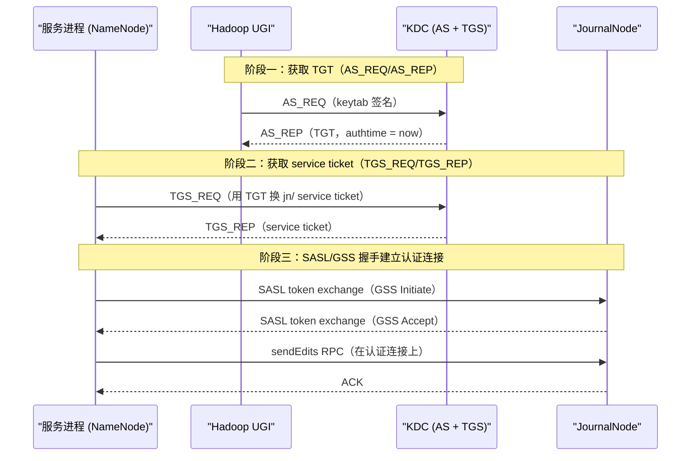
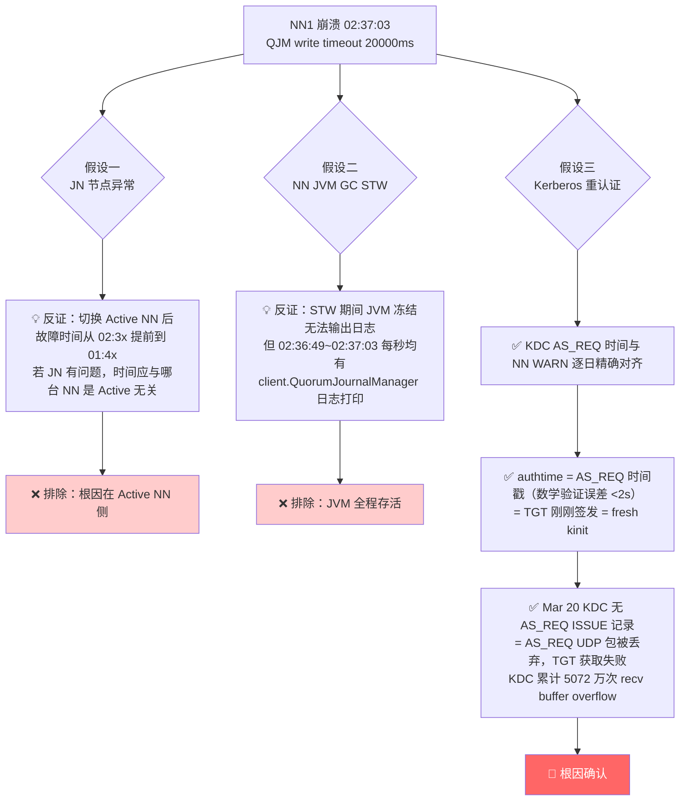
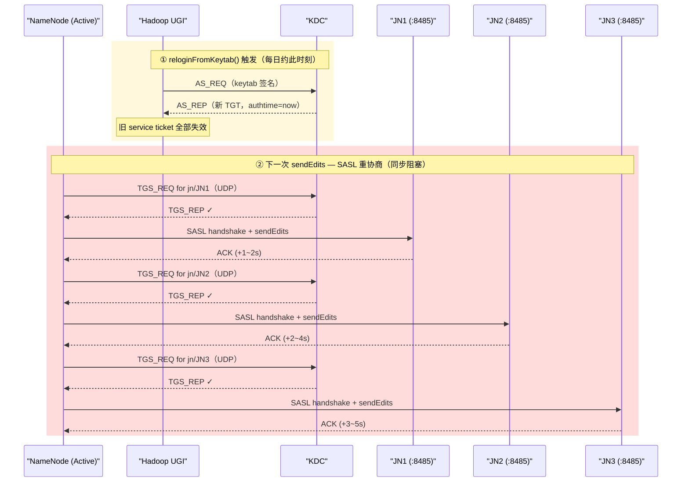
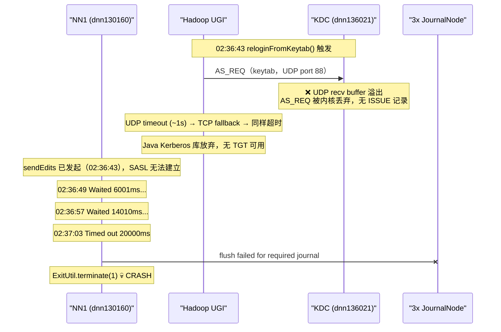

## 摘要

2026-03-20 02:37，NN1（dnn130160）因 HDFS QJM（QuorumJournalManager）写超时触发 `ExitUtil.terminate(1)`，ZKFC 随即将 NN2（dnn130161）切换为 Active。

排查耗时约一周，先后排除了 JournalNode 异常、NameNode JVM GC STW 两个假设，最终通过 KDC 日志时序与 authtime 字段分析，将根因锁定为：

> **Active NN 每日执行一次 Kerberos `reloginFromKeytab()`（fresh kinit）。3月20日 02:36:43，NN1 的 AS_REQ UDP 包被 KDC recv buffer 丢弃——NN1 无法完成 TGT 获取，所有 JournalNode 的 SASL 握手全部阻塞，20 秒内无响应触发 QJM 超时，NN1 崩溃。根本背景是 KDC 主机 UDP 接收缓冲区长期仅 208KB（Linux 默认最小值），累计 5072 万次溢出丢包。**

此外，事后分析发现一个**加剧因素**：部署在 yz-100-109（10.18.100.109）上的 [[hadoop-exporter]] 存在两处实现缺陷——每次 Prometheus scrape 时对所有 DataNode 无并发限制地同时发起 TGS_REQ，且每次 scrape 都重建 Kerberos 客户端丢弃 ticket 缓存——导致其在崩溃前 **02:35:43 的 10 秒窗口内向 KDC 集中发出 1309 条请求**（正常背景流量的 54 倍），将 UDP recv buffer 打满，为 NN1 的 AS_REQ 被丢弃创造了直接条件。该行为自 2026-01-31 开始出现，是 1 月底以来 KDC 负载暴增约 3 倍的根本原因。

---

## 1. 背景知识

### 1.1 HDFS QJM 写入机制

[[HDFS]] HA 模式下，Active NN 的每一条 edit log 都通过 [[QuorumJournalManager]] 同步写入三个 JournalNode（JN）。写入使用 QJM 的多数派（quorum）语义：至少 2/3 个 JN 返回 ACK 才算成功，否则等待直到 `dfs.qjournal.write-txns.timeout.ms`（默认 20000ms）超时。

```
Active NN
  └── IPCLoggerChannel (per JN)
        └── call() → sendEdits RPC
              └── SASL/GSS authenticated IPC connection
```

`IPCLoggerChannel.call()` 测量的是**端到端的挂钟时间**，包含了 IPC 连接建立、SASL 握手、实际 RPC 传输的所有时间。WARN 阈值为 1000ms。

### 1.2 Kerberos 认证流程：AS_REQ / TGS_REQ / SASL



**KDC 日志中的关键字段 `authtime`**：记录的是签发本次 TGS_REQ 所用 TGT 的原始认证时间（即 AS_REQ 发生时刻）。

- `authtime ≈ TGS_REQ 时间` → TGT 刚刚新签发 → **fresh kinit**（`reloginFromKeytab`）
- `authtime` 远早于请求时间 → 在续期旧 TGT → TGT renewal（`kinit -R`）

### 1.3 Hadoop UGI 重新登录机制与 Active/Standby 行为差异

Hadoop UGI 的 `checkTGTAndReloginFromKeytab()` 在每次 IPC 调用前被动检查。根据代码路径不同，存在两种触发模型：

- **近期满检查**（新版本热路径）：TGT 剩余有效期 < `hadoop.kerberos.min.seconds.before.relogin`（默认 60s）时触发；对 24h TGT，即 T + 24h - 60s 后的第一次 IPC 时触发
- **80% 窗口检查**（后台刷新线程）：TGT 生命周期达到 `TICKET_RENEW_WINDOW = 0.80` 时触发；对 24h TGT，即 T + 0.80 × 86400s = T + **19h12m** 后触发

**KDC 实测数据揭示的 Active/Standby 差异**（Mar 1~24 完整 AS_REQ 序列）：


| NN 角色                  | 主机                  | kinit 间隔                   | 触发路径                  |
| ---------------------- | ------------------- | -------------------------- | --------------------- |
| **Active**（Mar 1~20）   | dnn130160 (NN1)     | ~24h（+49s/天漂移）             | 近期满检查，IPC 热路径驱动       |
| **Standby**（Mar 1~20）  | dnn130161 (NN2)     | **19h12m ± 30s**（23次，极其精确） | 80% 窗口，后台刷新线程驱动       |
| **Active**（Mar 20~24）  | dnn130161 (NN2，接管后） | ~24h（从 01:41 基准续延）         | 接管后切换为近期满检查           |
| **Standby**（Mar 20~24） | dnn130160 (NN1，重启后） | **19h12m**（重启后立即切回）        | 退回 Standby 后切回 80% 路径 |

> [!note] 角色驱动路径切换
> Active NN 处理密集 IPC 写请求，`checkTGTAndReloginFromKeytab()` 被频繁调用，最终由"剩余 < 60s"触发，时间点随执行开销每日后移约 49s。Standby NN 的某个后台刷新线程（`DelegationTokenRenewer` 或 Spnego filter）使用 80% 逻辑，间隔精确固定为 19h12m00s。**角色切换后间隔模式立即跟随切换，与物理主机无关。**

> [!warning] 关键副作用
> `reloginFromKeytab()` 生成的是**全新凭证缓存**，旧的 service ticket（包括所有 JN 的 `jn/hostname@REALM`）全部失效。下一次 `sendEdits` 调用必须对每个 JN 重新走 TGS_REQ → SASL 握手全流程，而这个过程是**同步阻塞**在 `IPCLoggerChannel.call()` 的挂钟时间内的。

---

## 2. 故障时间线

| 时间                  | 事件                                                                |
| ------------------- | ----------------------------------------------------------------- |
| Mar 1 ~ Mar 19      | NN1 每日 02:20~02:36 出现 JN 写 WARN（1~5s），与 KDC AS_REQ 时间完全吻合        |
| Mar 20 01:41:27     | NN2（Standby）正常 AS_REQ，KDC ISSUE 成功，TGT 刷新                        |
| Mar 20 **02:35:43** | **yz-100-109（hadoop-exporter）触发 Prometheus scrape，在 10s 内向 KDC 集中发出 1309 条 TGS_REQ**（正常背景流量 ~24 条/秒 的 54 倍）；其中 946 条因用裸 IP 构造 SPN（`HTTP/10.18.x.x`）而 `LOOKING_UP_SERVER`，363 条成功；UDP recv buffer 被打满 |
| Mar 20 **02:36:43** | NN1 触发 `reloginFromKeytab()`，AS_REQ (UDP) 发出；**KDC recv buffer 仍满，包被内核丢弃，无 ISSUE 记录** |
| Mar 20 02:36:43~    | Java Kerberos 库 UDP timeout → TCP fallback → 同样超时；无 TGT，SASL 握手无法建立 |
| Mar 20 02:36:49     | `Waited 6001ms for sendEdits. No responses yet.`（首条 INFO）         |
| Mar 20 02:37:03     | `Timed out waiting 20000ms` → `flush failed for required journal` |
| Mar 20 02:37:03     | `ExitUtil.terminate(1)` → **NN1 进程退出**                            |
| Mar 20 **02:37:05** | NN2 ZKFC 检测到 NN1 宕机，切换 Active，**立即 fresh kinit（KDC ISSUE 成功，2s 内完成）** |
| Mar 20 02:37:10     | NN2 开始 `recoverUnfinalizedSegments`，接管 Active                     |
| Mar 20 02:51:45     | NN1 重启后 AS_REQ，KDC ISSUE 成功（KDC 已恢复响应）                           |

---

## 3. 排查过程：如何逐步排除两个错误假设



### 3.1 假设一：JournalNode 异常（已排除）

**初始怀疑**：JN 节点存在周期性问题（GC、磁盘 IO 抖动）。

**决定性反证**：

> 2026-03-20 NN1 崩溃后，NN2 接管为 Active。此后每日出现 JN 写 WARN 的时间**从 02:3x 提前到了 01:4x**。
>
> 如果根因在 JN 侧（JN 本身的周期性抖动），则故障时间应由 JN 决定，与哪台 NN 是 Active 无关。但实际上时间跟着 Active NN 变了——说明触发源在 NN 侧。

### 3.2 假设二：NN JVM GC Stop-The-World（已排除）

**初始怀疑**：Active NN 遭遇 Full GC，STW 导致无法处理 JN 的 ACK 包。

**决定性反证**：

NN1 崩溃期间（02:36:49 ~ 02:37:03）的日志逐秒打印，以下为节选：

```
02:36:49,844 INFO  client.QuorumJournalManager - Waited 6001 ms ...
02:36:50,845 INFO  client.QuorumJournalManager - Waited 7002 ms ...
02:36:51,846 INFO  client.QuorumJournalManager - Waited 8004 ms ...
...（每秒一条，连续 14 条）
02:37:03,843 WARN  client.QuorumJournalManager - Timed out waiting 20000ms
```

GC STW 会冻结整个 JVM，任何线程均无法执行，日志在 STW 期间必然断档。**而此处 JVM 每秒都在输出日志，说明进程完全正常——它只是在等一个永远不会到来的 KDC 响应。**

### 3.3 确认根因：Kerberos fresh kinit 触发 SASL 重认证

**AS_REQ 时间与 JN WARN 的逐日精确对齐（NN1 样本）**：

| 日期 | KDC AS_REQ ISSUE 时间（NN1） | NN1 JN WARN 时间 | WARN 最大延迟 |
|---|---|---|---|
| Mar 16 | 02:33:06 | 02:33:10 | 4098ms |
| Mar 17 | 02:34:33 | 02:34:35 | 1573ms |
| Mar 18 | 02:36:12 | 02:36:15 | 2983ms |
| Mar 19 | 02:36:21 | 02:36:23 | 4947ms |
| Mar 20 | **KDC 无 AS_REQ ISSUE 记录** | 02:36:49~02:37:03 | **>20000ms（崩溃）** |

**`authtime` 数学验证（Mar 1）**：

```
KDC 日志：Mar 01 02:20:32 CST，authtime = 1772302830

Jan 1, 2026 00:00:00 UTC = 1767225600
Feb 28, 2026 18:20:30 UTC = 1767225600 + 58×86400 + 66030 = 1772302830 ✓

即 authtime = Mar 1 02:20:30 CST，与日志时间相差 2s（网络 RTT）
→ TGT 在 AS_REQ 发出前 2 秒内刚刚签发 → fresh kinit
```

**正常日发生 WARN 时的完整调用链**：



**Mar 20 崩溃序列（AS_REQ 本身被丢弃，失败在认证链最前端）**：



**Fresh kinit 多维验证汇总**

| 判据 | 观测值 | 结论 |
|---|---|---|
| `authtime` 字段 | = AS_REQ 时间戳（数学验证误差 <2s） | TGT 在 AS_REQ 发出前 2 秒内刚刚签发 = fresh kinit |
| authtime 逐日递增 | 每天 authtime 变化约 +86400s | TGT 是全新签发（续期不改变 authtime） |
| NN1 Active 期间漂移 | +49s/天（每日递迟） | 与 near-expiry 触发模型（60s 阈值）完全吻合 |
| NN2 Standby 间隔 | **精确 19h12m = 80% × 24h**，23 次连续测量 ±30s | Standby 后台刷新线程使用 TICKET_RENEW_WINDOW=0.80 |
| NN2 接管后间隔 | 立即切换为 ~24h | 角色切换驱动 relogin 路径切换，与主机无关 |
| krb5.conf `renew_lifetime` | 注释状态（`#renew_lifetime = 7d`） | Java kinit 不携带 RENEWABLE 标志，KDC 签发非续期 TGT |
| Mar 20 崩溃证据 | KDC 日志 02:36:43~02:37:03 无 nn/ AS_REQ ISSUE | AS_REQ 本身被丢弃，TGT 阶段就已失败 |
| NN2 02:37:05 对比 | NN1 崩溃后 2s，NN2 AS_REQ 立即成功 | KDC 在 02:37:03 后迅速恢复，瞬时不可用而非设备故障 |

---

## 4. KDC UDP 接收缓冲区溢出——系统级隐患

```
[@dnn136021 /var/log]# netstat -su | grep -iE "packet receive errors|receive buffer errors"
    50720417 packet receive errors
    50720417 receive buffer errors

[@dnn136021 /var/log]# sysctl net.core.rmem_max net.core.rmem_default
net.core.rmem_max = 212992      # 208 KB — Linux 内核默认最小值
net.core.rmem_default = 212992
```

> [!warning] 208 KB 的 UDP 缓冲区——KDC 长期丢包的根因
>
> KDC 进程自 2024-01-04 持续运行（约 800 天），累计 **5072 万次** UDP 接收缓冲区溢出，平均每天约 63,000 次。
> 212992 字节 ÷ ~1KB/KRB5包 ≈ **最多只能缓冲 ~200 个 UDP 请求包**。
> 大集群中多节点同时发起 kinit（如凌晨定时任务）时，这个缓冲区在毫秒级就会打满。

**为什么 UDP 丢包导致 Kerberos 超时？**

MIT Kerberos 默认使用 **UDP 端口 88** 通信。客户端先发 UDP 请求，若超时则 fallback 到 TCP。完整行为链如下：

```
客户端发出 AS_REQ (UDP)
  → KDC recv buffer 满，内核直接丢弃（无任何通知）
  → 客户端等待 ~1s timeout
  → fallback 尝试 TCP
  → TCP 如果也超时（KDC 繁忙）→ 整个 AS_REQ 阻塞 >>20s
  → reloginFromKeytab() 无法返回 → sendEdits 超时 → crash
```

**为何平时 WARN 只有 1~5s，3月20日却超过 20s？**

平时：AS_REQ 成功（或偶发 UDP 丢包后 TCP fallback 成功）→ 拿到 TGT → TGS_REQ 成功 → SASL + sendEdits 总耗时 1~5s，超过 1000ms 阈值但不致崩溃。

3月20日：KDC 在 02:36:43 时刻对 NN1 的 AS_REQ（UDP + TCP 均）无响应超过 20s。**KDC 日志在 02:36:43~02:37:03 期间，没有任何 NN1(130160) 的 AS_REQ ISSUE 记录**，而 NN2 在崩溃后 2s（02:37:05）的 AS_REQ 立即成功——说明是 02:36:43 特定时刻的瞬时不可用，而非持续故障。

**加剧因素：retry storm 维持 KDC 高压**

KDC 日志显示，从 130160 发出的 `ambari-server-ec@` AS_REQ 在 02:48~02:49 的 1 分钟内出现 30+ 条密集请求——这是 Kerberos 客户端 retry storm：KDC 无响应 → 快速重试 → 每次重试再占一个 UDP buffer slot → 加剧溢出 → 更多超时 → 更多重试。dnn130160 上运行多个服务进程（`hdfs@`、`HTTP/`、`jhs/`、`ambari-server-ec@`、`nn/` 等），各自维护独立 TGT，并发 kinit 风暴是 208KB 缓冲区长期处于临界状态的直接成因。

---

## 4.1 加剧因素：hadoop-exporter 并发 TGS_REQ 雷群效应

KDC 日志在崩溃前 **02:35:43** 的 10 秒窗口内，记录到来自 **10.18.100.109（yz-100-109，hadoop-exporter 部署主机）** 的 1309 条 TGS_REQ，是同期正常背景流量（~24 条/秒）的 **54 倍**。

**行为特征**：

| 类型 | 数量 | 原因 |
|---|---|---|
| 成功（ISSUE） | 363 条 | `HTTP/ddn130120`、`HTTP/ecdn138011` 等 hostname 形式，KDC 正常处理 |
| 失败（LOOKING_UP_SERVER） | 946 条 | `HTTP/10.18.138.156` 等裸 IP 形式，KDC 无对应 principal |

**两处代码缺陷**共同导致了这次雷群效应：

**缺陷一：每次 scrape 无限并发**。`DataNodeCollector.Collect()` 对所有 DataNode URL 各启动一个 goroutine，无任何信号量限制。200+ 台 DataNode 在同一秒内同时发起 SPNEGO 握手，gokrb5 对每个请求独立调用 `SetSPNEGOHeader()` → 各自触发 TGS_REQ，集中打出 200+ 个 UDP 包。

**缺陷二：每次 scrape 丢弃 ticket 缓存**。`Collect()` 每次新建 `Scraper` → 新建 `http.Client` → 新建 `SPNEGOTransport` → 新建 `krb5Client`。gokrb5 的 service ticket 缓存存在 `krb5Client` 的内存 sessions map 中，对象销毁缓存即消失。每 60 秒 scrape 一次 = 每 60 秒重申请 200+ 张 TGS_REQ，而非 ticket 过期（10h）才重申请。

**缺陷三：SPNEGO SPN 使用裸 IP**。NameNode `NameNodeInfo` JMX 返回的 `LiveNodes` 列表中，未配置 `dfs.datanode.hostname` 的 DataNode 以 IP 形式注册。`SPNEGOTransport.RoundTrip()` 直接取 `req.URL.Hostname()` 构造 SPN，`HTTP/10.18.x.x` 在 KDC 无对应 principal → `LOOKING_UP_SERVER`，这 946 条无效请求占用了大量 KDC UDP buffer 处理能力。

**该行为自 2026-01-31 开始出现**（与集群可观测建设新增 DataNode 采集时间吻合），是 1 月底以来 KDC TGS_REQ 负载暴增约 3 倍的根本原因，也是使 208KB recv buffer 长期处于溢出临界状态的持续压力来源。

> [!warning] 时序关系
> 02:35:43 exporter 打出 1309 条请求 → buffer 被打满 → 约 80 秒后（02:36:43）NN1 的 AS_REQ 恰好命中满载的 buffer 被丢弃。两个事件之间有因果关系，但 exporter 的 scrape 触发是定时任务，与 NN1 的 kinit 时刻并非主动配合——这是一次典型的**时序巧合触发的系统级故障**：两个独立设计缺陷在特定时刻叠加，突破了 208KB 这条红线。

---

## 5. 改进措施

### 5.1 立即止血：扩大 QJM 超时（不需要重启）

修改 `hdfs-site.xml`，调大 QJM 写超时，使短暂的 KDC 响应延迟（<1 min）不触发 NN 崩溃：

```xml
<!-- 从默认 20000ms 提升到 60000ms -->
<property>
  <name>dfs.qjournal.write-txns.timeout.ms</name>
  <value>60000</value>
</property>
```

滚动重启 NN 生效。此措施仅扩大了容忍窗口，不解决根因。

### 5.2 根治 KDC UDP 丢包问题

**调大 KDC 主机的 UDP 接收缓冲区**（在 dnn136021 上执行）：

```bash
# 临时生效（立即）
sysctl -w net.core.rmem_max=16777216
sysctl -w net.core.rmem_default=4194304

# 永久生效
cat >> /etc/sysctl.conf << 'EOF'
net.core.rmem_max = 16777216
net.core.rmem_default = 4194304
EOF
sysctl -p
```

**增加 KDC worker 线程数**，处理并发认证请求：

```bash
# /etc/sysconfig/krb5kdc
KRB5KDC_ARGS=-w 4
# 然后 systemctl restart krb5kdc
```

**监控 UDP 丢包**，及时告警：

```bash
# 采集方式：每分钟取 delta
netstat -su | grep "receive buffer errors"
```

### 5.3 修复 hadoop-exporter 的 KDC 雷群效应（已完成，待上线验证）

针对 4.1 节分析的三处缺陷，已在代码层完成修复：

**修复一：并发限速（channel 信号量）**

在 `Scraper.Scrape()` 中加入信号量，默认最大并发 20，将单次 scrape 的 TGS_REQ 从 200+ 并发降为分批串行：

```bash
# 通过启动参数调整（对应 200+ 节点集群建议 10~20）
./hadoop-exporter -scrape-max-concurrency 20
# 或环境变量
export SCRAPE_MAX_CONCURRENCY=20
```

**修复二：ticket 缓存复用**

`DataNodeCollector` / `NodeManagerCollector` 改为长期持有 `Scraper` 实例（不再每次 `Collect()` 新建），gokrb5 的 service ticket 缓存随之长期存活。TGS_REQ 仅在冷启动时批量申请一次，之后每 10h（ticket 过期）才触发，正常 scrape 的 TGS_REQ 数量从 200+/次 降为 0。

**修复三：SPNEGO SPN IP→hostname 反向解析**

`SPNEGOTransport.RoundTrip()` 在构造 SPN 前检测 IP，自动执行 `net.LookupAddr()` 反向解析，将 `HTTP/10.18.138.156` 纠正为 `HTTP/ddn130120`，消除 `LOOKING_UP_SERVER` 错误。

> 根治方案：在所有 DataNode 的 `hdfs-site.xml` 中显式配置 `dfs.datanode.hostname`，从源头保证 NameNode 返回 hostname 而非 IP。

### 5.4 减少 kinit 对 JN 写路径的冲击

在 NN 的 `hadoop-env.sh` 或 `core-site.xml` 中

```xml
<property>
  <name>hadoop.kerberos.min.seconds.before.relogin</name>
  <value>120</value>
</property>
```

### 5.5 利用已有的 Slave KDC 基础设施实现 KDC HA（成本最低）

`kdc.conf` 中 `iprop_enable = true`、`iprop_slave_poll = 300s` 说明**集群已有 Slave KDC 在运行**，principal 数据库每 5 分钟同步一次。当前唯一缺少的只是把 Slave KDC 地址告诉客户端。

**Step 1**：确认 Slave KDC 地址：

```bash
# 在 KDC 主机上查看传播授权
cat /var/kerberos/krb5kdc/kpropd.acl
```

**Step 2**：通过 Ambari / Salt 批量更新集群所有节点的 `krb5.conf`（无需重启任何服务）：

```ini
[realms]
  VENUS.SOHURDC.COM = {
    kdc = dnn136021.venus.sohurdc.com    # Primary
    kdc = <slave-kdc-hostname>            # Slave（从 kpropd.acl 查得）
    admin_server = dnn136021.venus.sohurdc.com
  }
```

MIT Kerberos 客户端按顺序尝试列表中的 KDC，Primary 不可达时在 ~3s 内自动切换 Slave。

---

## 6. krb5kdc 日志管理

### 6.1 当前问题

`/var/log/krb5kdc.log` 体积已达 **14~40GB**，MIT Kerberos 原生不支持日志滚动，只能通过外部机制解决。

### 6.2 方案一：logrotate（推荐）

krb5kdc 支持 `SIGHUP` 信号重新打开日志文件（`systemd` 的 `ExecReload` 已配置 `kill -HUP $MAINPID`）。

创建 `/etc/logrotate.d/krb5kdc`：

```
/var/log/krb5kdc.log {
    daily
    rotate 30
    compress
    delaycompress
    missingok
    notifempty
    dateext
    dateformat -%Y%m%d
    postrotate
        /bin/kill -HUP $(cat /var/run/krb5kdc.pid 2>/dev/null) 2>/dev/null || true
    endscript
}
```

手动测试：

```bash
logrotate -vf /etc/logrotate.d/krb5kdc
ls -lh /var/log/krb5kdc.log*
```

### 6.3 方案二：切换为 syslog/journald

修改 `krb5.conf` 的 `[logging]` 段，将 KDC 日志输出到 syslog：

```ini
[logging]
  kdc = SYSLOG:INFO:daemon
  admin_server = SYSLOG:INFO:daemon
```

重启 krb5kdc 后，日志由 rsyslog/journald 管理，可直接复用现有的日志轮转配置，并支持 `journalctl -u krb5kdc` 查询。

> [!note] 注意事项
> 切换 syslog 模式后，现有的 `grep` 提取方式需要改为 `journalctl -u krb5kdc --since "..." | grep ...` 或查询 `/var/log/daemon.log`（取决于 rsyslog 配置）。

---

## 7. 验证项汇总（均已闭环）

| 项目                  | 观测值                                                                                                 | 结论                                                                    |
| ------------------- | --------------------------------------------------------------------------------------------------- | --------------------------------------------------------------------- |
| TGT ticket lifetime | KDC 默认 24h，`kadmin getprinc` 未单独设置                                                                  | kinit 周期以 24h 为基准                                                     |
| TGT 可续期性            | `Maximum renewable life: 7 days`（kdc.conf `renewable=true`）；krb5.conf `#renew_lifetime = 7d`（注释）    | Java kinit 不携带 RENEWABLE 标志，KDC 签发非续期 TGT；authtime 逐日更新证实 fresh kinit |
| UDP 接收缓冲区           | `net.core.rmem_max = 212992`（208 KB，Linux 默认最小值）                                                    | ~200 个 KRB5 包即可打满，严重不足                                                |
| KDC 侧配置             | `iprop_enable=true`，`iprop_slave_poll=300s`                                                         | Slave KDC 已在运行，数据库每 5min 同步                                           |
| AS_REQ 时序验证         | NN1 Mar 2~19 每日一次 AS_REQ ISSUE（authtime 与时间戳差 <2s）；Mar 20 崩溃窗口 02:36:43~02:37:03 无 nn/ AS_REQ ISSUE | Fresh kinit 直接证据闭环；AS_REQ 本身被 KDC 丢弃，失败在认证链最前端（TGT 阶段）                |
| Active/Standby 差异   | NN1 Active：~24h（+49s/天）；NN2 Standby：19h12m ± 30s（= 80% × 24h，23次测量）                                 | kinit 路径由角色决定，接管后 NN2 切换为 24h，NN1 重启后切回 19h12m                        |

**AS_REQ 验证命令**（MIT Kerberos 日志格式：`AS_REQ` 在前，IP 在后）：

```bash
# 提取 NN1 的 nn/ principal AS_REQ 完整序列
ionice -c 3 nice -n 19 grep "AS_REQ" /var/log/krb5kdc.log \
  | grep "nn/dnn130160"

# 验证 Mar 20 崩溃窗口无 AS_REQ（关键证据）
ionice -c 3 nice -n 19 grep "AS_REQ" /var/log/krb5kdc.log \
  | grep "nn/dnn130160" \
  | grep "Mar 20"
# 预期：仅 02:51:45 和 02:52:46（崩溃后重启），无 02:36:xx 记录

# 对比 NN2 Standby 期间 19h12m 间隔规律
ionice -c 3 nice -n 19 grep "AS_REQ" /var/log/krb5kdc.log \
  | grep "nn/dnn130161" \
  | awk '{print $1,$2,$3}'
```

**结果输出**：

```bash
[@dnn136021.venus.sohurdc.com /var/log]#  ionice -c 3 nice -n 19 grep "AS_REQ" /var/log/krb5kdc.log   | grep "10\.18\.130\.160"   | grep "nn/dnn130160"
Mar 02 02:22:26 dnn136021.venus.sohurdc.com krb5kdc[123563](info): AS_REQ (2 etypes {18 17}) 10.18.130.160: ISSUE: authtime 1772389346, etypes {rep=18 tkt=18 ses=18}, nn/dnn130160.venus.sohurdc.com@VENUS.SOHURDC.COM for krbtgt/VENUS.SOHURDC.COM@VENUS.SOHURDC.COM
Mar 03 02:23:48 dnn136021.venus.sohurdc.com krb5kdc[123563](info): AS_REQ (2 etypes {18 17}) 10.18.130.160: ISSUE: authtime 1772475828, etypes {rep=18 tkt=18 ses=18}, nn/dnn130160.venus.sohurdc.com@VENUS.SOHURDC.COM for krbtgt/VENUS.SOHURDC.COM@VENUS.SOHURDC.COM
Mar 04 02:25:23 dnn136021.venus.sohurdc.com krb5kdc[123563](info): AS_REQ (2 etypes {18 17}) 10.18.130.160: ISSUE: authtime 1772562323, etypes {rep=18 tkt=18 ses=18}, nn/dnn130160.venus.sohurdc.com@VENUS.SOHURDC.COM for krbtgt/VENUS.SOHURDC.COM@VENUS.SOHURDC.COM
Mar 05 02:26:53 dnn136021.venus.sohurdc.com krb5kdc[123563](info): AS_REQ (2 etypes {18 17}) 10.18.130.160: ISSUE: authtime 1772648813, etypes {rep=18 tkt=18 ses=18}, nn/dnn130160.venus.sohurdc.com@VENUS.SOHURDC.COM for krbtgt/VENUS.SOHURDC.COM@VENUS.SOHURDC.COM
Mar 06 02:27:32 dnn136021.venus.sohurdc.com krb5kdc[123563](info): AS_REQ (2 etypes {18 17}) 10.18.130.160: ISSUE: authtime 1772735252, etypes {rep=18 tkt=18 ses=18}, nn/dnn130160.venus.sohurdc.com@VENUS.SOHURDC.COM for krbtgt/VENUS.SOHURDC.COM@VENUS.SOHURDC.COM
Mar 07 02:27:57 dnn136021.venus.sohurdc.com krb5kdc[123563](info): AS_REQ (2 etypes {18 17}) 10.18.130.160: ISSUE: authtime 1772821677, etypes {rep=18 tkt=18 ses=18}, nn/dnn130160.venus.sohurdc.com@VENUS.SOHURDC.COM for krbtgt/VENUS.SOHURDC.COM@VENUS.SOHURDC.COM
Mar 08 02:28:53 dnn136021.venus.sohurdc.com krb5kdc[123563](info): AS_REQ (2 etypes {18 17}) 10.18.130.160: ISSUE: authtime 1772908133, etypes {rep=18 tkt=18 ses=18}, nn/dnn130160.venus.sohurdc.com@VENUS.SOHURDC.COM for krbtgt/VENUS.SOHURDC.COM@VENUS.SOHURDC.COM
Mar 09 02:30:02 dnn136021.venus.sohurdc.com krb5kdc[123563](info): AS_REQ (2 etypes {18 17}) 10.18.130.160: ISSUE: authtime 1772994602, etypes {rep=18 tkt=18 ses=18}, nn/dnn130160.venus.sohurdc.com@VENUS.SOHURDC.COM for krbtgt/VENUS.SOHURDC.COM@VENUS.SOHURDC.COM
Mar 10 02:30:23 dnn136021.venus.sohurdc.com krb5kdc[123563](info): AS_REQ (2 etypes {18 17}) 10.18.130.160: ISSUE: authtime 1773081023, etypes {rep=18 tkt=18 ses=18}, nn/dnn130160.venus.sohurdc.com@VENUS.SOHURDC.COM for krbtgt/VENUS.SOHURDC.COM@VENUS.SOHURDC.COM
Mar 11 02:30:57 dnn136021.venus.sohurdc.com krb5kdc[123563](info): AS_REQ (2 etypes {18 17}) 10.18.130.160: ISSUE: authtime 1773167457, etypes {rep=18 tkt=18 ses=18}, nn/dnn130160.venus.sohurdc.com@VENUS.SOHURDC.COM for krbtgt/VENUS.SOHURDC.COM@VENUS.SOHURDC.COM
Mar 12 02:31:39 dnn136021.venus.sohurdc.com krb5kdc[123563](info): AS_REQ (2 etypes {18 17}) 10.18.130.160: ISSUE: authtime 1773253899, etypes {rep=18 tkt=18 ses=18}, nn/dnn130160.venus.sohurdc.com@VENUS.SOHURDC.COM for krbtgt/VENUS.SOHURDC.COM@VENUS.SOHURDC.COM
Mar 13 02:32:16 dnn136021.venus.sohurdc.com krb5kdc[123563](info): AS_REQ (2 etypes {18 17}) 10.18.130.160: ISSUE: authtime 1773340336, etypes {rep=18 tkt=18 ses=18}, nn/dnn130160.venus.sohurdc.com@VENUS.SOHURDC.COM for krbtgt/VENUS.SOHURDC.COM@VENUS.SOHURDC.COM
Mar 14 02:32:22 dnn136021.venus.sohurdc.com krb5kdc[123563](info): AS_REQ (2 etypes {18 17}) 10.18.130.160: ISSUE: authtime 1773426742, etypes {rep=18 tkt=18 ses=18}, nn/dnn130160.venus.sohurdc.com@VENUS.SOHURDC.COM for krbtgt/VENUS.SOHURDC.COM@VENUS.SOHURDC.COM
Mar 15 02:32:57 dnn136021.venus.sohurdc.com krb5kdc[123563](info): AS_REQ (2 etypes {18 17}) 10.18.130.160: ISSUE: authtime 1773513177, etypes {rep=18 tkt=18 ses=18}, nn/dnn130160.venus.sohurdc.com@VENUS.SOHURDC.COM for krbtgt/VENUS.SOHURDC.COM@VENUS.SOHURDC.COM
Mar 16 02:33:06 dnn136021.venus.sohurdc.com krb5kdc[123563](info): AS_REQ (2 etypes {18 17}) 10.18.130.160: ISSUE: authtime 1773599586, etypes {rep=18 tkt=18 ses=18}, nn/dnn130160.venus.sohurdc.com@VENUS.SOHURDC.COM for krbtgt/VENUS.SOHURDC.COM@VENUS.SOHURDC.COM
Mar 17 02:34:33 dnn136021.venus.sohurdc.com krb5kdc[123563](info): AS_REQ (2 etypes {18 17}) 10.18.130.160: ISSUE: authtime 1773686073, etypes {rep=18 tkt=18 ses=18}, nn/dnn130160.venus.sohurdc.com@VENUS.SOHURDC.COM for krbtgt/VENUS.SOHURDC.COM@VENUS.SOHURDC.COM
Mar 18 02:36:12 dnn136021.venus.sohurdc.com krb5kdc[123563](info): AS_REQ (2 etypes {18 17}) 10.18.130.160: ISSUE: authtime 1773772572, etypes {rep=18 tkt=18 ses=18}, nn/dnn130160.venus.sohurdc.com@VENUS.SOHURDC.COM for krbtgt/VENUS.SOHURDC.COM@VENUS.SOHURDC.COM
Mar 19 02:36:21 dnn136021.venus.sohurdc.com krb5kdc[123563](info): AS_REQ (2 etypes {18 17}) 10.18.130.160: ISSUE: authtime 1773858981, etypes {rep=18 tkt=18 ses=18}, nn/dnn130160.venus.sohurdc.com@VENUS.SOHURDC.COM for krbtgt/VENUS.SOHURDC.COM@VENUS.SOHURDC.COM
Mar 20 02:51:45 dnn136021.venus.sohurdc.com krb5kdc[123563](info): AS_REQ (2 etypes {18 17}) 10.18.130.160: ISSUE: authtime 1773946305, etypes {rep=18 tkt=18 ses=18}, nn/dnn130160.venus.sohurdc.com@VENUS.SOHURDC.COM for krbtgt/VENUS.SOHURDC.COM@VENUS.SOHURDC.COM
Mar 20 02:52:46 dnn136021.venus.sohurdc.com krb5kdc[123563](info): AS_REQ (2 etypes {18 17}) 10.18.130.160: ISSUE: authtime 1773946366, etypes {rep=18 tkt=18 ses=18}, nn/dnn130160.venus.sohurdc.com@VENUS.SOHURDC.COM for krbtgt/VENUS.SOHURDC.COM@VENUS.SOHURDC.COM
Mar 20 22:04:12 dnn136021.venus.sohurdc.com krb5kdc[123563](info): AS_REQ (2 etypes {18 17}) 10.18.130.160: ISSUE: authtime 1774015452, etypes {rep=18 tkt=18 ses=18}, nn/dnn130160.venus.sohurdc.com@VENUS.SOHURDC.COM for krbtgt/VENUS.SOHURDC.COM@VENUS.SOHURDC.COM
Mar 21 17:16:40 dnn136021.venus.sohurdc.com krb5kdc[123563](info): AS_REQ (2 etypes {18 17}) 10.18.130.160: ISSUE: authtime 1774084600, etypes {rep=18 tkt=18 ses=18}, nn/dnn130160.venus.sohurdc.com@VENUS.SOHURDC.COM for krbtgt/VENUS.SOHURDC.COM@VENUS.SOHURDC.COM
Mar 22 12:29:07 dnn136021.venus.sohurdc.com krb5kdc[123563](info): AS_REQ (2 etypes {18 17}) 10.18.130.160: ISSUE: authtime 1774153747, etypes {rep=18 tkt=18 ses=18}, nn/dnn130160.venus.sohurdc.com@VENUS.SOHURDC.COM for krbtgt/VENUS.SOHURDC.COM@VENUS.SOHURDC.COM
Mar 23 07:41:38 dnn136021.venus.sohurdc.com krb5kdc[123563](info): AS_REQ (2 etypes {18 17}) 10.18.130.160: ISSUE: authtime 1774222898, etypes {rep=18 tkt=18 ses=18}, nn/dnn130160.venus.sohurdc.com@VENUS.SOHURDC.COM for krbtgt/VENUS.SOHURDC.COM@VENUS.SOHURDC.COM
Mar 24 02:54:06 dnn136021.venus.sohurdc.com krb5kdc[123563](info): AS_REQ (2 etypes {18 17}) 10.18.130.160: ISSUE: authtime 1774292046, etypes {rep=18 tkt=18 ses=18}, nn/dnn130160.venus.sohurdc.com@VENUS.SOHURDC.COM for krbtgt/VENUS.SOHURDC.COM@VENUS.SOHURDC.COM
[@dnn136021.venus.sohurdc.com /var/log]#  ionice -c 3 nice -n 19 grep "AS_REQ" /var/log/krb5kdc.log   | grep "10\.18\.130\.161"   | grep "nn/dnn130161"
Mar 01 15:55:42 dnn136021.venus.sohurdc.com krb5kdc[123563](info): AS_REQ (2 etypes {18 17}) 10.18.130.161: ISSUE: authtime 1772351742, etypes {rep=18 tkt=18 ses=18}, nn/dnn130161.venus.sohurdc.com@VENUS.SOHURDC.COM for krbtgt/VENUS.SOHURDC.COM@VENUS.SOHURDC.COM
Mar 02 11:08:13 dnn136021.venus.sohurdc.com krb5kdc[123563](info): AS_REQ (2 etypes {18 17}) 10.18.130.161: ISSUE: authtime 1772420893, etypes {rep=18 tkt=18 ses=18}, nn/dnn130161.venus.sohurdc.com@VENUS.SOHURDC.COM for krbtgt/VENUS.SOHURDC.COM@VENUS.SOHURDC.COM
Mar 03 06:20:43 dnn136021.venus.sohurdc.com krb5kdc[123563](info): AS_REQ (2 etypes {18 17}) 10.18.130.161: ISSUE: authtime 1772490043, etypes {rep=18 tkt=18 ses=18}, nn/dnn130161.venus.sohurdc.com@VENUS.SOHURDC.COM for krbtgt/VENUS.SOHURDC.COM@VENUS.SOHURDC.COM
Mar 04 01:33:09 dnn136021.venus.sohurdc.com krb5kdc[123563](info): AS_REQ (2 etypes {18 17}) 10.18.130.161: ISSUE: authtime 1772559189, etypes {rep=18 tkt=18 ses=18}, nn/dnn130161.venus.sohurdc.com@VENUS.SOHURDC.COM for krbtgt/VENUS.SOHURDC.COM@VENUS.SOHURDC.COM
Mar 04 20:45:12 dnn136021.venus.sohurdc.com krb5kdc[123563](info): AS_REQ (2 etypes {18 17}) 10.18.130.161: ISSUE: authtime 1772628312, etypes {rep=18 tkt=18 ses=18}, nn/dnn130161.venus.sohurdc.com@VENUS.SOHURDC.COM for krbtgt/VENUS.SOHURDC.COM@VENUS.SOHURDC.COM
Mar 05 15:57:59 dnn136021.venus.sohurdc.com krb5kdc[123563](info): AS_REQ (2 etypes {18 17}) 10.18.130.161: ISSUE: authtime 1772697479, etypes {rep=18 tkt=18 ses=18}, nn/dnn130161.venus.sohurdc.com@VENUS.SOHURDC.COM for krbtgt/VENUS.SOHURDC.COM@VENUS.SOHURDC.COM
Mar 06 11:10:28 dnn136021.venus.sohurdc.com krb5kdc[123563](info): AS_REQ (2 etypes {18 17}) 10.18.130.161: ISSUE: authtime 1772766628, etypes {rep=18 tkt=18 ses=18}, nn/dnn130161.venus.sohurdc.com@VENUS.SOHURDC.COM for krbtgt/VENUS.SOHURDC.COM@VENUS.SOHURDC.COM
Mar 07 06:22:59 dnn136021.venus.sohurdc.com krb5kdc[123563](info): AS_REQ (2 etypes {18 17}) 10.18.130.161: ISSUE: authtime 1772835779, etypes {rep=18 tkt=18 ses=18}, nn/dnn130161.venus.sohurdc.com@VENUS.SOHURDC.COM for krbtgt/VENUS.SOHURDC.COM@VENUS.SOHURDC.COM
Mar 08 01:35:27 dnn136021.venus.sohurdc.com krb5kdc[123563](info): AS_REQ (2 etypes {18 17}) 10.18.130.161: ISSUE: authtime 1772904927, etypes {rep=18 tkt=18 ses=18}, nn/dnn130161.venus.sohurdc.com@VENUS.SOHURDC.COM for krbtgt/VENUS.SOHURDC.COM@VENUS.SOHURDC.COM
Mar 08 20:47:57 dnn136021.venus.sohurdc.com krb5kdc[123563](info): AS_REQ (2 etypes {18 17}) 10.18.130.161: ISSUE: authtime 1772974077, etypes {rep=18 tkt=18 ses=18}, nn/dnn130161.venus.sohurdc.com@VENUS.SOHURDC.COM for krbtgt/VENUS.SOHURDC.COM@VENUS.SOHURDC.COM
Mar 09 16:00:02 dnn136021.venus.sohurdc.com krb5kdc[123563](info): AS_REQ (2 etypes {18 17}) 10.18.130.161: ISSUE: authtime 1773043202, etypes {rep=18 tkt=18 ses=18}, nn/dnn130161.venus.sohurdc.com@VENUS.SOHURDC.COM for krbtgt/VENUS.SOHURDC.COM@VENUS.SOHURDC.COM
Mar 10 11:12:47 dnn136021.venus.sohurdc.com krb5kdc[123563](info): AS_REQ (2 etypes {18 17}) 10.18.130.161: ISSUE: authtime 1773112367, etypes {rep=18 tkt=18 ses=18}, nn/dnn130161.venus.sohurdc.com@VENUS.SOHURDC.COM for krbtgt/VENUS.SOHURDC.COM@VENUS.SOHURDC.COM
Mar 11 06:25:18 dnn136021.venus.sohurdc.com krb5kdc[123563](info): AS_REQ (2 etypes {18 17}) 10.18.130.161: ISSUE: authtime 1773181518, etypes {rep=18 tkt=18 ses=18}, nn/dnn130161.venus.sohurdc.com@VENUS.SOHURDC.COM for krbtgt/VENUS.SOHURDC.COM@VENUS.SOHURDC.COM
Mar 12 01:37:23 dnn136021.venus.sohurdc.com krb5kdc[123563](info): AS_REQ (2 etypes {18 17}) 10.18.130.161: ISSUE: authtime 1773250643, etypes {rep=18 tkt=18 ses=18}, nn/dnn130161.venus.sohurdc.com@VENUS.SOHURDC.COM for krbtgt/VENUS.SOHURDC.COM@VENUS.SOHURDC.COM
Mar 12 20:50:19 dnn136021.venus.sohurdc.com krb5kdc[123563](info): AS_REQ (2 etypes {18 17}) 10.18.130.161: ISSUE: authtime 1773319819, etypes {rep=18 tkt=18 ses=18}, nn/dnn130161.venus.sohurdc.com@VENUS.SOHURDC.COM for krbtgt/VENUS.SOHURDC.COM@VENUS.SOHURDC.COM
Mar 13 16:02:50 dnn136021.venus.sohurdc.com krb5kdc[123563](info): AS_REQ (2 etypes {18 17}) 10.18.130.161: ISSUE: authtime 1773388970, etypes {rep=18 tkt=18 ses=18}, nn/dnn130161.venus.sohurdc.com@VENUS.SOHURDC.COM for krbtgt/VENUS.SOHURDC.COM@VENUS.SOHURDC.COM
Mar 14 11:15:03 dnn136021.venus.sohurdc.com krb5kdc[123563](info): AS_REQ (2 etypes {18 17}) 10.18.130.161: ISSUE: authtime 1773458103, etypes {rep=18 tkt=18 ses=18}, nn/dnn130161.venus.sohurdc.com@VENUS.SOHURDC.COM for krbtgt/VENUS.SOHURDC.COM@VENUS.SOHURDC.COM
Mar 15 06:27:48 dnn136021.venus.sohurdc.com krb5kdc[123563](info): AS_REQ (2 etypes {18 17}) 10.18.130.161: ISSUE: authtime 1773527268, etypes {rep=18 tkt=18 ses=18}, nn/dnn130161.venus.sohurdc.com@VENUS.SOHURDC.COM for krbtgt/VENUS.SOHURDC.COM@VENUS.SOHURDC.COM
Mar 16 01:40:19 dnn136021.venus.sohurdc.com krb5kdc[123563](info): AS_REQ (2 etypes {18 17}) 10.18.130.161: ISSUE: authtime 1773596419, etypes {rep=18 tkt=18 ses=18}, nn/dnn130161.venus.sohurdc.com@VENUS.SOHURDC.COM for krbtgt/VENUS.SOHURDC.COM@VENUS.SOHURDC.COM
Mar 16 20:52:50 dnn136021.venus.sohurdc.com krb5kdc[123563](info): AS_REQ (2 etypes {18 17}) 10.18.130.161: ISSUE: authtime 1773665570, etypes {rep=18 tkt=18 ses=18}, nn/dnn130161.venus.sohurdc.com@VENUS.SOHURDC.COM for krbtgt/VENUS.SOHURDC.COM@VENUS.SOHURDC.COM
Mar 17 16:04:54 dnn136021.venus.sohurdc.com krb5kdc[123563](info): AS_REQ (2 etypes {18 17}) 10.18.130.161: ISSUE: authtime 1773734694, etypes {rep=18 tkt=18 ses=18}, nn/dnn130161.venus.sohurdc.com@VENUS.SOHURDC.COM for krbtgt/VENUS.SOHURDC.COM@VENUS.SOHURDC.COM
Mar 18 11:17:03 dnn136021.venus.sohurdc.com krb5kdc[123563](info): AS_REQ (2 etypes {18 17}) 10.18.130.161: ISSUE: authtime 1773803823, etypes {rep=18 tkt=18 ses=18}, nn/dnn130161.venus.sohurdc.com@VENUS.SOHURDC.COM for krbtgt/VENUS.SOHURDC.COM@VENUS.SOHURDC.COM
Mar 19 06:29:17 dnn136021.venus.sohurdc.com krb5kdc[123563](info): AS_REQ (2 etypes {18 17}) 10.18.130.161: ISSUE: authtime 1773872957, etypes {rep=18 tkt=18 ses=18}, nn/dnn130161.venus.sohurdc.com@VENUS.SOHURDC.COM for krbtgt/VENUS.SOHURDC.COM@VENUS.SOHURDC.COM
Mar 20 01:41:27 dnn136021.venus.sohurdc.com krb5kdc[123563](info): AS_REQ (2 etypes {18 17}) 10.18.130.161: ISSUE: authtime 1773942087, etypes {rep=18 tkt=18 ses=18}, nn/dnn130161.venus.sohurdc.com@VENUS.SOHURDC.COM for krbtgt/VENUS.SOHURDC.COM@VENUS.SOHURDC.COM
Mar 20 02:37:05 dnn136021.venus.sohurdc.com krb5kdc[123563](info): AS_REQ (2 etypes {18 17}) 10.18.130.161: ISSUE: authtime 1773945425, etypes {rep=18 tkt=18 ses=18}, nn/dnn130161.venus.sohurdc.com@VENUS.SOHURDC.COM for krbtgt/VENUS.SOHURDC.COM@VENUS.SOHURDC.COM
Mar 21 01:41:36 dnn136021.venus.sohurdc.com krb5kdc[123563](info): AS_REQ (2 etypes {18 17}) 10.18.130.161: ISSUE: authtime 1774028496, etypes {rep=18 tkt=18 ses=18}, nn/dnn130161.venus.sohurdc.com@VENUS.SOHURDC.COM for krbtgt/VENUS.SOHURDC.COM@VENUS.SOHURDC.COM
Mar 22 01:42:10 dnn136021.venus.sohurdc.com krb5kdc[123563](info): AS_REQ (2 etypes {18 17}) 10.18.130.161: ISSUE: authtime 1774114930, etypes {rep=18 tkt=18 ses=18}, nn/dnn130161.venus.sohurdc.com@VENUS.SOHURDC.COM for krbtgt/VENUS.SOHURDC.COM@VENUS.SOHURDC.COM
Mar 23 01:42:55 dnn136021.venus.sohurdc.com krb5kdc[123563](info): AS_REQ (2 etypes {18 17}) 10.18.130.161: ISSUE: authtime 1774201375, etypes {rep=18 tkt=18 ses=18}, nn/dnn130161.venus.sohurdc.com@VENUS.SOHURDC.COM for krbtgt/VENUS.SOHURDC.COM@VENUS.SOHURDC.COM
Mar 24 01:42:55 dnn136021.venus.sohurdc.com krb5kdc[123563](info): AS_REQ (2 etypes {18 17}) 10.18.130.161: ISSUE: authtime 1774287775, etypes {rep=18 tkt=18 ses=18}, nn/dnn130161.venus.sohurdc.com@VENUS.SOHURDC.COM for krbtgt/VENUS.SOHURDC.COM@VENUS.SOHURDC.COM
[@dnn136021.venus.sohurdc.com /var/log]# 
```
---

## 相关文档

- [[HiveServer2 Kerberos 认证故障深度分析报告]]
- [[HDFS HA 架构与 QJM 原理]]
