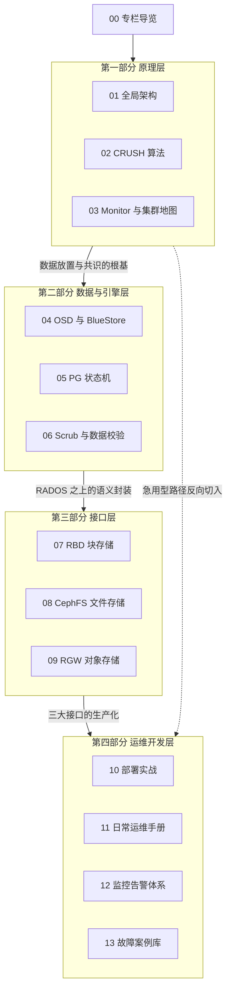

# 00 专栏导览

## 专栏定位

先设想一个场景：凌晨两点，告警电话把你叫醒，`ceph -s` 的输出里赫然躺着 `HEALTH_WARN`，几十个 PG 卡在 `degraded` 状态，业务方在群里追问什么时候恢复。这时候你敢不敢直接登上集群，敲下第一条排查命令？敢与不敢的分界线，不在于你背过多少条运维命令，而在于你是否理解这条告警背后，数据正在经历什么——**原理深到能排障，运维细到能上手**，正是本专栏想帮你抵达的位置。

Ceph 常被比作存储界的瑞士军刀，但这个比喻只说对了一半。刀刃上的三口——块存储（RBD）、文件存储（CephFS）、对象存储（RGW）——固然是它「统一存储」的名片，可真正决定你能不能用好它的，是刀柄里的那套机械结构：RADOS 分布式对象存储层、CRUSH 数据放置算法、BlueStore 存储引擎、PG 状态机。只背命令的运维，遇到的是一堆互不相关的报错；理解结构的运维，看到的是同一套机制在不同场景下的投影。本专栏因此按「原理 → 数据与引擎 → 接口 → 运维开发」四层展开，每一层都为下一层铺垫：不懂 CRUSH，就看不懂 PG 为什么要迁移；不懂 PG 状态机，就看不懂恢复流量为什么打满了盘；不懂这些，告警调优就只剩抄别人阈值的碰运气。

顺带回答一个常见疑问：有了云厂商的对象存储与各类托管数据库，为什么还要学 Ceph。因为私有化环境里的块设备需求、AI 训练数据的共享文件系统、自建 S3 兼容平台，这些需求在可预见的未来仍要有人用开源方案兜底，而 Ceph 几乎是每个候选名单上的常客。学它不是为了炫技，而是为了让它在需要兜底的人手里是一件被理解过的工具，而非黑盒。

笔者不打算把这篇导览写成目录的复述。接下来的几节，分别回答三个问题：你（读者）是谁、这 13 篇文章按什么顺序读、它们与知识库里的哪些专栏互相勾连。

行文约定也在此交代：专栏各篇独立成文，但共享同一条叙事纪律——每篇先交代技术从哪来、为什么长成这样，再拆解机制与权衡，最后落在适用边界与选型建议上；文中出现的命令与配置，只为解释机制服务，不构成操作手册，生产操作请以第四部分与官方文档为准。版本方面，专栏以 Ceph Reef 系列为基准展开讨论，涉及历史行为时会在文中标注版本分野。

## 读者画像与前置知识

本专栏为**运维开发工程师**而写——你可能是存储/平台团队的一员，正在运维一套 Ceph 集群或基于它构建存储服务；也可能负责 Kubernetes 集群的持久化存储，RBD 与 CephFS 是你每天打交道的对象；抑或是在 Ceph、HDFS、JuiceFS 之间做选型的架构师，需要理解各家的边界而非仅看跑分。如果你只是对分布式存储的算法感兴趣（譬如 CRUSH 与一致性哈希的取舍），第一部分也可以单独当作算法读物来读。

前置知识方面，不要求你有 Ceph 使用经验，但以下三样最好有所准备：

- **操作系统基础**：块设备、文件系统与 POSIX 接口的基本概念，可参考 [[Linux/文件系统/00 专栏导览|Linux 文件系统专栏]]；
- **分布式系统常识**：副本、一致性、共识这些词不要求精通，但至少知道它们大致在说什么，[[分布式架构/分布式系统原理与协议/00 专栏导览|分布式系统原理与协议专栏]]可以随时补课；
- **一点耐心**：Ceph 的复杂度是真实存在的，第二部分的引擎与状态机章节信息密度较高，快进阅读的收益有限。

读完本专栏，你应当能独立完成三件事：看懂 `ceph -s` 输出中绝大多数健康告警的含义并判断严重程度；为一块新盘、一台新主机规划它在 CRUSH 拓扑中的位置；在 RBD、CephFS、RGW 之间为具体业务做出有依据的选型。至于更深的内核调优与源码级改造，超出了专栏的边界，笔者会在相应篇章给出继续深入的线索，而不假装在一本书里讲完一个生态。

## 专栏目录

全专栏 13 篇正文，按四个部分组织。每篇的一句话简介，说明它在整条叙事线里的位置；篇名链接直达正文，建议先扫一遍四部分的引导段，再决定从哪里进入。

### 第一部分 原理层——集群为什么长成这样

三个基本问题（容量、性能、可靠性）贯穿全篇。读完这一部分，你应当能回答：Ceph 为什么坚持去中心化，CRUSH 如何在客户端本地算出数据位置，以及没有中心节点的集群靠什么维持一致。

- [[中间件/Ceph/01 Ceph 全局架构——RADOS、CRUSH 与三大存储接口|01 Ceph 全局架构]]——从存储的容量、性能、可靠性三个基本问题出发，拆解 RADOS 分层架构与 Monitor/OSD/MDS 的职责边界，交代「去中心化」设计哲学与三大存储接口的由来，是全专栏的总纲。
- [[中间件/Ceph/02 CRUSH 算法——去中心化的数据放置|02 CRUSH 算法]]——一致性哈希解决不了异构拓扑下的数据放置，CRUSH 用树形集群地图与放置规则，让客户端在本地就算出数据在哪，故障域隔离也由此而来。
- [[中间件/Ceph/03 Monitor 与集群地图——Paxos、Quorum 与 MON 运维|03 Monitor 与集群地图]]——没有中心节点，不等于没有权威：Monitor 集群靠 Paxos 维护集群地图的版本演进，Quorum 的存亡直接决定集群的读写命运。

### 第二部分 数据与引擎层——数据在磁盘上如何安放

这一部分回答「一个对象从写入到落盘，中间经历了什么」。读完你应当能解释：为什么 BlueStore 要绕过本地文件系统、PG 状态机的每次跃迁对应集群里的什么动静、以及 Scrub 为什么值得为它专门安排调度窗口。

- [[中间件/Ceph/04 OSD 与 BlueStore——存储引擎深度解析|04 OSD 与 BlueStore]]——从 FileStore 的双写之痛讲到 BlueStore 的裸设备直管，RocksDB 管元数据、写时复制保一致性，理解 Ceph 性能特征的根源。
- [[中间件/Ceph/05 PG 状态机与数据一致性——Peering、Recovery 与 Backfill|05 PG 状态机与数据一致性]]——Placement Group 是数据放置与恢复的基本单位，Peering 达成共识、Recovery 与 Backfill 补齐数据，读懂状态机就读懂了集群的自愈。
- [[中间件/Ceph/06 Scrub 与数据校验——静默错误的防线|06 Scrub 与数据校验]]——比特腐烂（bit rot）不会触发任何告警，Scrub 与深度的数据校验是发现副本不一致、拦截静默错误的最后防线。

### 第三部分 接口层——三大存储服务怎么用

原理与引擎都理解之后，这一部分把视角转到使用侧：三种接口各自的客户端栈、语义边界与典型场景。读完你应当能为「虚拟机磁盘、共享目录、应用对象」三类需求分别指出合适的接口，并说清每种接口的代价。

- [[中间件/Ceph/07 RBD 块存储——快照、克隆与 Kubernetes CSI|07 RBD 块存储]]——块设备语义、快照与写时复制克隆，以及 Kubernetes 如何经由 CSI 动态供给持久卷，是云原生场景最常用的接口。
- [[中间件/Ceph/08 CephFS——MDS、多活元数据与实践边界|08 CephFS]]——MDS 管理元数据并支持多活部署，动态子树分区负载均衡，但 POSIX 语义的实现有其边界与代价。
- [[中间件/Ceph/09 RGW 对象存储——S3 兼容网关与多租户|09 RGW 对象存储]]——以 S3 兼容网关的姿态接入对象存储生态，多租户与权限模型是自建对象存储平台的地基。

### 第四部分 运维开发层——把集群真正跑在生产上

前三层回答「为什么」，这一部分回答「怎么做」：从部署规格、日常操作到监控告警与故障排查。它是全专栏的实战出口，也是急用型读者的入口。

- [[中间件/Ceph/10 集群部署实战——cephadm 与生产规格设计|10 集群部署实战]]——cephadm 容器化部署只是手段，主机、网络、磁盘的生产规格设计才是部署的正文，部署完成后的验收同样不可省略。
- [[中间件/Ceph/11 日常运维手册——健康检查、扩缩容与版本升级|11 日常运维手册]]——健康检查的日常清单、扩容与缩容的标准动作、版本升级的流程与回退预案，接手集群后每天要用的一篇。
- [[中间件/Ceph/12 监控告警体系——Prometheus exporter 与关键指标|12 监控告警体系]]——mgr 的 prometheus 模块让集群原生说出 Prometheus 方言，四层核心指标的含义、健康区间与告警规则的去噪设计。
- [[中间件/Ceph/13 故障案例库——从告警到根因|13 故障案例库]]——以真实故障案例为线索，演练从告警现象出发、层层收敛到根因的完整排查路径，是前三层知识的实战检验场。

## 两条阅读路径

13 篇不必从头读到尾，两条路径对应两种处境，你按自己的处境取用即可。选择之前不妨先问自己一个问题：我读这个专栏，是为了解决眼前的运维任务，还是为了建立对分布式存储的系统认知——两种目的都正当，但对应的走法完全不同。

**急用型路径（10 → 11 → 12 → 13）**：明天就要接手一套在跑的集群，没有时间从原理读起。四篇各有分工——

- 从部署实战（10）入手，建立对集群形态的手感；
- 用日常运维手册（11）守住健康检查、扩缩容与版本升级这些高频动作；
- 用监控告警体系（12）给集群装上眼睛和耳朵；
- 最后拿故障案例库（13）练手，把前三篇的知识在真实案例里过一遍。

这条路径的代价是原理欠账——遇到反直觉的现象时容易知其然不知其所以然，等火灭了我建议回头补第一、二部分。

**原理型路径（01 → 09）**：按第一到第三部分的顺序精读，从全局架构到 CRUSH 算法，再到 BlueStore 引擎与 PG 状态机，最后落到三大接口。这条路径走完，你不只知道每个组件怎么配，更知道它们为什么这样设计——第四部分此时变成水到渠成的应用题，而非需要死记的操作手册。

两条路径的取舍，可以用一张表说清：

| 维度 | 急用型路径 | 原理型路径 |
| :--- | :--- | :--- |
| 适合处境 | 明天就要接手在跑的集群 | 系统学习、选型评估、面试备战 |
| 阅读顺序 | 10 → 11 → 12 → 13 | 01 → 09 顺序精读 |
| 建议节奏 | 每篇半天，一周内过完 | 每篇精读做笔记，三到四周 |
| 主要代价 | 原理欠账，遇反直觉现象易卡壳 | 远水不解近渴，救不了眼前的火 |

两条路径没有高下之分，只有处境不同：救火的人先要活下来，建楼的人先要看图纸。倘若时间充裕，不妨先走原理型、再以急用型的四篇做实战校验，理解与手感兼得。

## 关联专栏

Ceph 不是孤岛，它与知识库里的几个专栏互为注脚：

- [[中间件/JuiceFS/00 专栏导览|JuiceFS 专栏]]——Ceph 的对象存储接口（RGW）可以作为 JuiceFS 的数据后端，两者是上下层的配合关系；
- [[中间件/Leveldb/00 专栏导览|LevelDB/RocksDB 专栏]]——BlueStore 使用 RocksDB 存放对象元数据，理解 LSM-Tree 的读写放大，就理解了 BlueStore 的性能脾气；
- [[Linux/文件系统/00 专栏导览|Linux 文件系统专栏]]——CephFS 对外提供 POSIX 文件语义，其实现边界恰好与本地文件系统形成对照；
- [[大数据/Hadoop/HDFS/00 专栏导览|HDFS 专栏]]——同为分布式文件系统，HDFS 专精大文件顺序读写，CephFS 追求通用 POSIX，选型对比在 01 与 08 两篇均有展开；
- [[分布式架构/分布式系统原理与协议/00 专栏导览|分布式系统原理与协议专栏]]——Monitor 的 Paxos、Quorum 与脑裂处理，都能在那里找到理论源头。

这些链接都指向知识库中真实存在的专栏，但交叉阅读不必求全：譬如读 04 时顺手翻一翻 LSM-Tree 的读写放大即可，不必把整个 LevelDB 专栏读完再回来。关联阅读的价值在于互为注脚，而非互相绑架进度。

## 专栏结构总览

最后用一张图收拢全专栏的骨架：四个部分自底向上叠成一条主线，原理层是地基，数据与引擎层深入 RADOS 内部，接口层站在 RADOS 之上对外服务，运维开发层则把前三层的理解落到生产现场。

图中实线是原理型路径的顺承关系：原理层回答「集群为什么长成这样」，数据与引擎层回答「数据在磁盘上如何安放」，接口层回答「三大存储服务怎么用」，运维开发层回答「怎么把它跑在生产上」——四问层层递进，也正是四部分标题的由来。

虚线则是急用型路径的反向切入。从运维开发层倒着进专栏的人，迟早会在某个深夜的故障里，被推回第一部分补上原理的课——这不是坏事，带着真实故障的困惑去读原理，往往比空对空地精读记得更牢。

存储系统没有银弹，Ceph 用复杂度换来了统一与扩展，这笔交易的账怎么算，取决于你的数据规模、故障频率与团队能力。带着这个问题进入正文，是笔者能给出的最好阅读建议。
