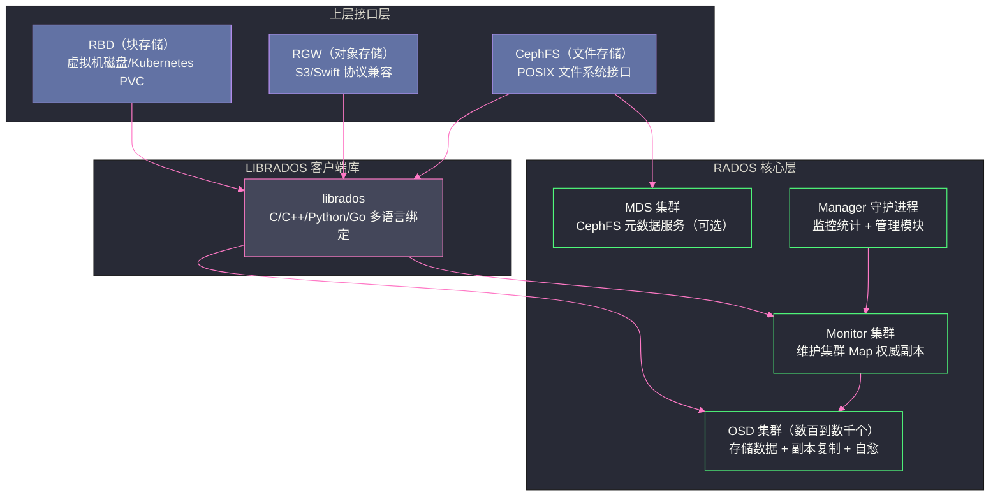

# 01 Ceph 全局架构——RADOS、CRUSH 与三大存储接口

## 摘要

Ceph 是业界唯一同时提供块存储（RBD）、对象存储（RGW）和文件存储（CephFS）三大接口的统一分布式存储系统。其核心创新在于 RADOS（Reliable Autonomic Distributed Object Store）层——一个无中心节点的分布式对象存储基础，以及 CRUSH（Controlled Replication Under Scalable Hashing）算法——一种无需查表的去中心化数据放置算法。本文从 Ceph 诞生的历史动因出发，拆解其分层架构，剖析 Monitor/OSD/MDS 三类守护进程的职责边界，阐明 RADOS 如何实现去中心化自愈，并分析三大存储接口的设计选择与适用场景。

---

## 第 1 章 为什么需要 Ceph——分布式存储的演进困境

### 1.1 传统存储的天花板

在理解 Ceph 之前，需要先理解它出现之前的存储世界面临什么问题。

2000 年代初，企业存储的主流方案是 **SAN（Storage Area Network）** 和 **NAS（Network Attached Storage）**。SAN 通过光纤通道将磁盘阵列挂载为服务器的本地块设备，NAS 通过 NFS/CIFS 提供文件访问接口。这两种方案都依赖**专用存储硬件**——高端存储阵列（如 EMC VMAX、NetApp FAS），价格极为昂贵。

更严重的问题是**扩展性**：传统存储阵列通过添加磁盘扩展容量，但控制器（存储头）是单点，当 IO 请求足够多时，控制器 CPU 成为瓶颈。无论添加多少块磁盘，性能不会线性增长——因为所有 IO 都要经过同一个控制器。这种架构的扩展上限通常在百 TB 到 PB 级别，且价格随容量呈非线性增长。

**Google 的 GFS（2003）** 和 **HDFS** 给出了一个不同的思路：用廉价的商品服务器构建分布式文件系统，将数据分片分布在大量节点上，通过副本机制保证可靠性。但 GFS 和 HDFS 都是专为**大文件顺序读写**优化的系统，不支持随机读写，不提供 POSIX 文件接口，也不适合块存储或对象存储场景。

存储系统的需求是多样的：

- **虚拟机**需要块设备（像挂载本地磁盘一样使用远程存储）
- **应用程序**需要 POSIX 文件接口（挂载目录，像操作本地文件一样操作远程文件）
- **对象存储场景**（图片、视频、备份文件）需要 HTTP 接口，支持海量小文件

传统上，块存储、文件存储、对象存储是三个独立的产品，背后是三套完全不同的存储系统，运维复杂度极高。

### 1.2 Ceph 的诞生与设计目标

Ceph 诞生于 UC Santa Cruz，由 Sage Weil 在其博士论文中提出（2007 年），最初的动机就是解决上述问题：**用一套统一的底层系统，同时支持块存储、文件存储和对象存储，并具备 PB 级线性扩展能力**。

Ceph 的几个核心设计目标：

**去中心化（No Single Point of Failure）**：传统分布式文件系统（GFS、HDFS）都有元数据服务单点（Master/NameNode），这个单点决定了整个系统的元数据吞吐上限，也是高可用的最大隐患。Ceph 通过 CRUSH 算法实现**数据放置的去中心化**——客户端自己计算数据应该放在哪个 OSD，不需要查询中心节点，彻底消除了元数据瓶颈。

**自愈（Self-Healing）**：OSD 故障是常态而非例外。Ceph 的设计假设磁盘会坏、节点会宕机，系统必须能够自动检测故障并恢复数据副本，不需要人工干预。

**自管理（Self-Managing）**：随着集群规模增大（数百到数千个 OSD），手工管理每块磁盘的数据分布是不现实的。CRUSH 算法通过拓扑感知的数学计算自动决定数据放置，当节点加入或离开时，自动重新均衡数据。

**统一底层（Unified Storage）**：通过分层架构，在同一个 RADOS 对象存储层之上，抽象出 RBD（块）、CephFS（文件）、RGW（对象）三大接口。运维一套集群，提供三种存储服务。

> [!note] 设计哲学
> Ceph 的本质是：**将分布式系统的复杂性从客户端转移到存储集群内部**。
> 传统方案是用昂贵的专用硬件和集中式控制器来保证可靠性；Ceph 的思路是用廉价的商品硬件 + 去中心化的算法来实现同等甚至更高的可靠性。
> 这种"复杂性内化"的代价是 Ceph 本身非常复杂，运维门槛高——但这个代价只需要存储团队承担一次，而不是每个使用存储的业务团队都要面对。

---

## 第 2 章 Ceph 的分层架构

### 2.1 架构总览

Ceph 的架构是严格的层次化设计，从下到上分为三层：



**RADOS 层**是 Ceph 的核心，是一个**完全自治的分布式对象存储系统**。它不是文件系统、不是块设备、也不是 S3，它是一个底层的对象存储原语——提供"存储和检索带有任意元数据的可变长字节串"的能力，并保证强一致性和高可靠性。

**LIBRADOS** 是 RADOS 的客户端库，暴露 C API，上层的 RBD、RGW、CephFS 都是 RADOS 的客户端，通过 librados 与集群交互。

**上层接口层**是 RADOS 的语义封装：
- **RBD** 将 RADOS 对象映射为块设备——一个 RBD image 被切分成多个固定大小的 RADOS 对象（默认 4MB），提供块设备语义（随机读写）
- **RGW** 在 RADOS 之上实现 S3 和 Swift API，将 S3 对象存储为一个或多个 RADOS 对象
- **CephFS** 将文件系统语义（目录树、文件、inode）映射到 RADOS 对象，并引入 MDS（Metadata Server）管理文件系统元数据

### 2.2 三类核心守护进程

理解 Ceph 架构，首先要理解三类核心守护进程的职责边界。

**Monitor（mon）**

Monitor 是 Ceph 集群的"地图中心"，维护以下几种关键的集群 Map：

- **Monitor Map**：集群中所有 Monitor 节点的地址和状态
- **OSD Map**：所有 OSD 节点的地址、状态（up/down/in/out）和集群拓扑
- **CRUSH Map**：集群的硬件拓扑（机柜、主机、OSD 的层次关系），以及 CRUSH 算法使用的故障域规则
- **PG Map**：所有 Placement Group（PG）的状态和 OSD 映射关系
- **MDS Map**：CephFS 的 MDS 节点状态（如果有）

Monitor 集群采用 **Paxos 共识**维护这些 Map 的一致性。通常部署奇数个（3 或 5），保证高可用。

**Monitor 不存储数据**——这是 Ceph 去中心化设计的关键。客户端的读写请求**不经过** Monitor，Monitor 只提供集群拓扑信息（Map）。客户端拿到 OSD Map 和 CRUSH Map 后，**本地计算**数据应该在哪些 OSD 上，直接与 OSD 通信，完全绕过 Monitor。

这与 HDFS 的 NameNode 形成鲜明对比：HDFS 的每次文件访问都需要查询 NameNode 获取 Block 位置，NameNode 是 IO 路径上的必经节点；Ceph 的 Monitor 是控制面，不在数据面的 IO 路径上。

**OSD（Object Storage Daemon）**

每块物理磁盘对应一个 OSD 进程（通常一一对应，也支持一个 OSD 管理多块磁盘）。OSD 的职责远不止简单存储数据：

1. **存储对象数据**：将 RADOS 对象持久化到本地存储引擎（BlueStore）
2. **副本复制**：作为 Primary OSD，将写入的数据复制到 Replica OSD
3. **心跳检测**：OSD 之间相互发送心跳，检测对方是否存活，并将结果上报给 Monitor
4. **数据恢复（Recovery）**：当 Monitor 通知某个 OSD 故障，其他 OSD 自动将受影响 PG 的数据复制到新的 OSD
5. **数据校验（Scrub）**：定期扫描本地数据，检测静默数据损坏（bit rot）

OSD 的这种"自治"能力是 Ceph 自愈特性的实现基础——Monitor 只需要维护集群状态，具体的数据恢复工作完全由 OSD 集群自主完成。

**MDS（Metadata Server）**

MDS 仅在使用 CephFS 文件系统接口时才需要部署。MDS 管理文件系统的元数据（目录树、文件的 inode 信息、权限、时间戳等），实际的文件数据仍然存储在 RADOS 对象中，MDS 不直接存储文件内容。

MDS 支持多 Active 部署（将目录树分成多个子树，分别由不同的 MDS 处理），实现元数据的水平扩展。

**Manager（mgr）**

Manager 是较新引入的守护进程（Ceph Luminous 以后），负责：
- 汇聚和暴露监控指标（Prometheus 格式）
- 运行管理模块（Dashboard Web UI、RESTful API、均衡器 Balancer）
- 处理一些需要全局状态的管理操作（如 PG 自动调整 `pg_autoscaler`）

---

## 第 3 章 RADOS——去中心化分布式对象存储

### 3.1 RADOS 的对象模型

RADOS 的基本存储单元是**对象（Object）**，每个对象包含：
- **OID（Object ID）**：全局唯一的对象标识符（字符串）
- **Data**：可变长的字节串（对象数据，最大通常为几 MB 到几百 MB）
- **xattrs（Extended Attributes）**：键值对形式的对象级元数据（类似文件系统的扩展属性）
- **omap**：一个持久化的 KV 映射（存储在 OSD 的 RocksDB 中，用于存储大量小元数据）

RADOS 对象操作是原子的，支持读（read）、写（write）、删除（remove）、CAS（compare-and-swap）等操作。

**对象如何映射到 OSD？这正是 RADOS 去中心化设计的精髓，通过两步映射完成：**

```
Object OID → 哈希取模 → Placement Group (PG) → CRUSH 计算 → OSD 列表
```

**第一步：OID → PG**

```python
# 伪代码
pg_id = hash(OID) % pg_num  # pg_num 是该 Pool 的 PG 总数
```

通过对 OID 做哈希并对 PG 数取模，将对象映射到一个 PG（Placement Group，放置组）。PG 是 RADOS 中的**逻辑分组单元**——多个对象归属于同一个 PG，一个 PG 被整体放置在同一组 OSD 上。

为什么要引入 PG 这个中间层，而不是直接将对象映射到 OSD？

原因在于**管理粒度**。如果一个集群有 10 亿个对象和 3000 个 OSD，直接维护"对象→OSD"的映射表需要存储 10 亿条记录，当 OSD 变化时需要更新数亿条记录。引入 PG 后，10 亿对象被分组到（通常）几百到几千个 PG，Monitor 只需要维护 PG→OSD 的映射（几千条记录），PG 内部的对象→PG 映射由确定性哈希计算，不需要持久化存储。

**第二步：PG → OSD（CRUSH 算法）**

```
CRUSH(PG_ID, CRUSH_MAP) → [Primary_OSD, Replica_OSD_1, Replica_OSD_2]
```

给定 PG 的 ID 和 CRUSH Map（集群拓扑），通过 CRUSH 算法计算出该 PG 应该放置在哪些 OSD 上。这个计算是纯数学的（不查表），任何人（客户端、OSD、Monitor）用同样的输入得到同样的结果。

这两步映射完全在**客户端本地**完成，不需要查询 Monitor 或任何中心节点——这就是 Ceph 去中心化的核心。

### 3.2 Pool：租户隔离与存储策略单元

Pool 是 RADOS 的**逻辑命名空间**，相当于数据库中的 Schema。Ceph 集群中可以创建多个 Pool，每个 Pool 独立配置：

- **副本策略**：Replicated Pool（3 副本）或 Erasure Code Pool（纠删码，如 4+2）
- **PG 数量（pg_num）**：影响数据分布的均匀度和并行度
- **故障域策略**：副本是否必须分布在不同机架（通过 CRUSH Rule 配置）
- **应用标注**：标记该 Pool 用于 RBD/CephFS/RGW，方便管理工具识别

实际操作中，RBD 使用一个 Pool 存储块设备镜像，CephFS 使用两个 Pool（一个存元数据，一个存文件数据），RGW 使用多个 Pool（用于对象数据、用户信息、bucket 索引等）。

> [!info] 核心概念：Erasure Code Pool
> Erasure Code（纠删码）是 3 副本之外的另一种可靠性方案。以 4+2 纠删码为例：原始数据分成 4 个数据块（data chunks）+ 2 个校验块（coding chunks）。任意 2 个块损坏，都能通过其他 4 个块恢复原始数据。
> 与 3 副本相比，4+2 纠删码的存储开销是 1.5x（6 个块存储 4 块的数据）远优于 3 副本的 3x，适用于冷数据存储（对象存储归档）。但纠删码 Pool 不支持部分写（需要读-修改-写），所以不适合随机小 IO 的 RBD 块设备，主要用于 RGW 对象存储。

---

## 第 4 章 CRUSH 算法概览

CRUSH（Controlled Replication Under Scalable Hashing）是 Ceph 最核心的技术创新，也是实现去中心化数据放置的关键。这里先给出直觉性理解，详细分析见 [[02 CRUSH 算法——去中心化的数据放置]]。

### 4.1 传统一致性哈希的局限

在分布式存储领域，**一致性哈希（Consistent Hashing）**是常见的数据分布方案（[[Redis]] Cluster 使用它）。基本思想是：将所有节点映射到一个哈希环上，每个数据项根据其哈希值落在环上的某个位置，顺时针找到的第一个节点即为负责节点。

一致性哈希的优点是节点增减时只需迁移相邻数据。但对于 Ceph 这样需要感知**物理拓扑**（机柜、机架、数据中心）的系统，一致性哈希有致命缺点：它无法保证副本分布在不同的故障域。

如果两个 OSD 在同一个机架，一致性哈希可能将同一份数据的两个副本放在这两个 OSD 上——一旦机架发生断电，两个副本同时丢失，数据不可用。真正需要的是：**3 副本必须分布在 3 个不同的机架上**，确保任意一个机架故障，其他两个机架仍然有完整的数据副本。

### 4.2 CRUSH 的直觉

CRUSH 将集群拓扑建模为一棵树（CRUSH Map）：

```
Root
├── Datacenter-1
│   ├── Rack-01
│   │   ├── Host-01 → OSD.0, OSD.1, OSD.2
│   │   └── Host-02 → OSD.3, OSD.4, OSD.5
│   └── Rack-02
│       ├── Host-03 → OSD.6, OSD.7, OSD.8
│       └── Host-04 → OSD.9, OSD.10, OSD.11
└── Datacenter-2
    └── ...
```

CRUSH 算法接受 PG ID 作为输入，沿着这棵树自上而下，在每个层级（Bucket）用一个确定性的哈希函数选择子节点，最终在叶子节点选出 N 个不同的 OSD（N = 副本数），并且这 N 个 OSD 分布在不同的指定故障域（如不同的机架）。

这种树形选择的设计使 CRUSH 能够**同时保证随机均匀分布和故障域隔离**，而且是纯计算，不需要查询中心状态。

---

## 第 5 章 三大存储接口

### 5.1 RBD（块存储）——给虚拟机的磁盘

**RBD（RADOS Block Device）**将 RADOS 对象封装成块设备语义。从使用者角度看，一个 RBD image 就像一块插在服务器上的本地磁盘——可以格式化文件系统、可以随机读写任意扇区。

RBD 的实现原理：一个 RBD image 被逻辑切分成多个**固定大小的对象**（默认 4MB），每个对象有一个 OID（格式：`{image_id}.{chunk_index}`）。读写某个偏移量时，RBD 客户端将块偏移转换为对应的 RADOS 对象 ID 和对象内偏移，通过 librados 直接操作对应的 RADOS 对象。

**RBD 的三种访问方式**：

1. **内核 RBD（krbd）**：Linux 内核模块，将 RBD image 挂载为 `/dev/rbd0` 等块设备，适合虚拟机磁盘
2. **QEMU/libvirt 直接驱动**：QEMU 通过 librbd 直接访问 Ceph，不需要内核模块，性能更好（避免了一次内核-用户态拷贝），是虚拟化场景的主流选择
3. **Kubernetes CSI（Container Storage Interface）**：通过 ceph-csi 插件，为 Kubernetes Pod 提供 PVC（PersistentVolumeClaim），动态创建和挂载 RBD 块设备

**RBD 的关键特性**：

- **精简配置（Thin Provisioning）**：创建一个 1TB 的 RBD image，不会立即占用 1TB 的实际存储，只有在写入数据时才实际分配 RADOS 对象
- **快照（Snapshot）**：在某时刻对 image 创建快照，快照是写时复制（Copy-on-Write）的，几乎是瞬间完成
- **克隆（Clone）**：基于快照创建新的 image（也是 COW），常用于从模板快速创建大量虚拟机

RBD 与 [[JuiceFS]]、HDFS 的定位完全不同：RBD 提供块设备语义（适合数据库、虚拟机），JuiceFS/HDFS 提供文件系统语义（适合大数据处理）。

### 5.2 CephFS（文件存储）——POSIX 兼容的分布式文件系统

CephFS 在 RADOS 之上实现了完整的 POSIX 文件系统接口——挂载后就像一个普通的 Linux 目录，支持 `ls`、`mkdir`、`cp`、`chmod` 等所有文件系统操作。

CephFS 的架构比 RBD 复杂，需要额外引入 **MDS（Metadata Server）**管理文件系统元数据（目录树、inode 等）。文件数据本身仍然直接存储在 RADOS 中。

**CephFS 的数据流**：

```
写文件请求 → CephFS 客户端
    ├── 更新 inode 元数据 → MDS（最终写入 RADOS 元数据 Pool）
    └── 写文件数据 → 直接写入 RADOS 数据 Pool（绕过 MDS）
```

这种"元数据走 MDS，数据直接走 RADOS"的设计，使得文件数据的读写吞吐不受 MDS 限制，只有元数据操作（创建文件、列目录等）才经过 MDS。

**CephFS 的挂载方式**：

1. **内核 CephFS 客户端（kcephfs）**：Linux 内核模块，通过 `mount -t ceph` 挂载，POSIX 兼容性最好
2. **FUSE 客户端（ceph-fuse）**：用户态 FUSE 实现，兼容性更好但性能略低于内核客户端

CephFS 与 NFS 的主要区别：NFS 是集中式的，所有请求都经过 NFS Server；CephFS 是真正分布式的，文件数据直接从 Ceph OSD 读写，不经过任何集中式代理。

> [!warning] 生产避坑：CephFS 的 MDS 单点风险
> 虽然 CephFS 支持多 Active MDS，但配置和调优较复杂。在生产中，单 Active MDS + 多 Standby MDS 是更常见的部署方式（Active 故障时自动切换到 Standby，通常在数秒内完成）。
> MDS 的内存容量是一个关键约束——MDS 将热点目录的元数据缓存在内存中。文件系统中的文件数量极多时（亿级别），MDS 的内存压力会很大。这种场景下，应当考虑 [[JuiceFS]] 等专门为海量小文件优化的文件系统。

### 5.3 RGW（对象存储）——S3 协议兼容的 HTTP 接口

**RGW（RADOS Gateway）**是 Ceph 的对象存储网关，提供与 Amazon S3 和 OpenStack Swift 协议兼容的 HTTP API。从用户视角看，Ceph RGW 就是一个私有部署的 S3——可以用 AWS SDK、s3cmd、MinIO Client 等任何 S3 兼容工具访问。

RGW 本身是无状态的 HTTP 服务器（基于 Beast HTTP 库），直接将 S3 请求转换为 librados 操作：

- **S3 对象** → 存储为一个或多个 RADOS 对象（大对象分片存储）
- **S3 Bucket** → 对应 RADOS 中的一个命名空间
- **Bucket 索引**（对象列表）→ 存储在专用 RADOS Pool 的 omap 中

RGW 的典型使用场景：

- **应用程序的图片/视频/文档存储**：替代 AWS S3，用于私有云环境
- **数据备份存储**：Velero（Kubernetes 备份工具）、数据库备份都可以对接 RGW
- **大数据存储层**：通过 S3A 接口，Spark/Hive 可以直接读写 Ceph RGW 上的数据，实现存算分离

> [!info] RGW vs MinIO
> MinIO 也是 S3 兼容的对象存储，但 MinIO 是独立的存储系统，而 RGW 是构建在 Ceph 之上的接口层。
> 如果已经有 Ceph 集群，RGW 是提供对象存储接口的自然选择（复用同一套集群）。
> 如果只需要简单的对象存储，MinIO 部署更轻量、运维更简单。
> 两者在 S3 协议兼容性上都很好，选择主要取决于是否有现有 Ceph 集群和对统一存储的需求。

---

## 第 6 章 Ceph 与 HDFS 的定位差异

Ceph 和 [[HDFS]] 经常被放在一起比较，因为都是分布式存储，但两者的设计目标和适用场景有本质差异：

| 维度 | Ceph | HDFS |
| :--- | :--- | :--- |
| **存储接口** | 块存储/文件存储/对象存储（三合一） | 仅文件系统（类 POSIX，但不完全兼容） |
| **元数据架构** | 去中心化（CRUSH 计算 + MDS 可水平扩展） | 集中式 NameNode（内存存储全部 inode） |
| **适用场景** | 通用存储（VM 磁盘/容器存储/对象存储） | 大数据批处理（MapReduce/Spark 的存储层） |
| **IO 模式** | 支持随机读写（RBD/CephFS） | 主要优化顺序读写，随机写性能差 |
| **文件大小** | 通用（小文件/大文件均可） | 优化大文件（> 128MB），小文件不友好 |
| **Kubernetes 集成** | 原生 CSI 支持，可提供 PVC | 需要额外的 CSI 驱动（alluxio/juicefs 代理） |
| **数据本地性** | 不强调数据本地性 | 计算任务调度感知 Block 位置，优化本地计算 |
| **运维复杂度** | 高（多种守护进程，CRUSH 配置复杂） | 相对低（主要是 NameNode HA 配置） |

**选型建议**：

- 已有 [[Hadoop]] 生态（Spark/Hive/MapReduce）且不打算存算分离 → **HDFS**
- 需要为虚拟机/容器提供块存储 → **Ceph RBD**
- 需要私有部署的 S3 对象存储 → **Ceph RGW**
- 需要 POSIX 文件系统且文件量不是海量小文件 → **CephFS**
- 已有 Ceph 集群，需要为 Spark/Hive 提供存算分离的存储层 → **CephFS 或 RGW（通过 S3A）**
- 海量小文件 + 存算分离 + 对象存储后端 → **[[JuiceFS]]**（底层可使用 Ceph RGW）

---

## 第 7 章 小结

Ceph 的架构可以用三个关键词概括：**统一**、**去中心化**、**自愈**。

**统一**：RADOS 提供通用的分布式对象存储原语，RBD/CephFS/RGW 是其上的语义封装，一套集群提供三种存储服务。

**去中心化**：CRUSH 算法消除了 IO 路径上的中心节点，客户端本地计算数据位置，直连 OSD，Monitor 不参与数据 IO；OSD 之间相互心跳和协作，自主完成数据恢复。

**自愈**：OSD 故障触发 PG 的自动重新映射，OSD 集群自主发起 Recovery 流程，不需要人工干预。

理解了这三个关键词，就理解了 Ceph 设计的精髓。后续章节将深入展开 CRUSH 算法的数学原理（[[02 CRUSH 算法——去中心化的数据放置]]）、BlueStore 存储引擎的裸设备直管（[[03 OSD 与对象存储——BlueStore 引擎]]）、PG 状态机与数据恢复流程（[[04 数据一致性——PG、副本策略与 Recovery]]）。

---

**延伸阅读**：
- [[02 CRUSH 算法——去中心化的数据放置]]
- [[03 OSD 与对象存储——BlueStore 引擎]]
- [[JuiceFS]] 专栏（基于 Ceph RGW 的上层文件系统）

---

> [!note] 思考题
> 1. Ceph 提供块存储（RBD）、对象存储（RGW）和文件存储（CephFS）三种接口，底层共享同一个 RADOS 集群。这种'统一存储'架构相比为每种存储类型部署独立系统（如 iSCSI + MinIO + NFS），在运维复杂度和资源利用率方面有什么优劣？在什么规模下统一存储的优势开始显现？
> 2. CRUSH 算法是 Ceph 数据分布的核心——它通过确定性计算（而非中心化的元数据服务器）将对象映射到 OSD。CRUSH Map 描述了集群的物理拓扑（机架、主机、OSD）。如果你需要保证同一个 PG 的三个副本分布在不同机架上，CRUSH Rule 应该如何编写？CRUSH 的故障域（failure domain）设计哲学是什么？
> 3. Ceph 的 Monitor（MON）通过 Paxos 协议维护集群状态（Cluster Map）。当 MON 集群出现脑裂（如 3 个 MON 网络分区为 1+2）时，少数派 MON 无法形成法定人数（quorum），集群变为只读。在生产环境中，MON 应该部署多少个？为什么不建议使用偶数个 MON？
