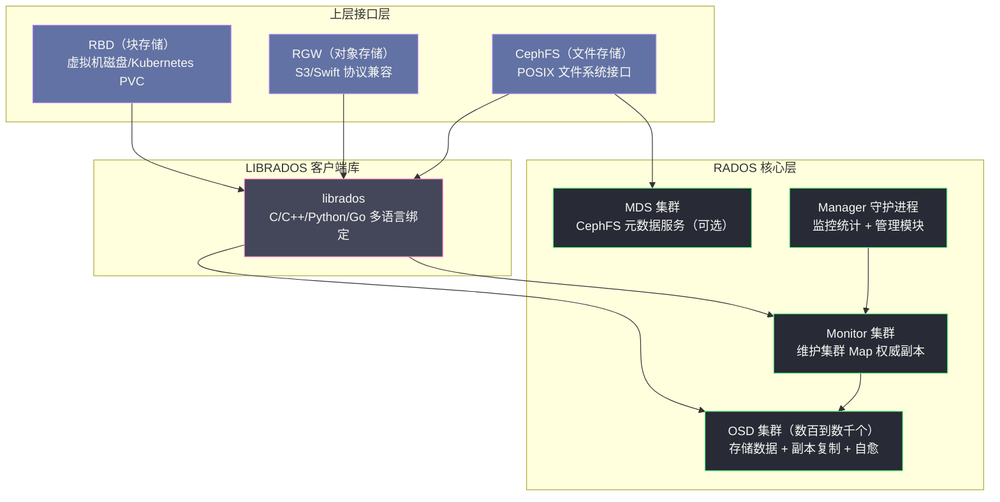
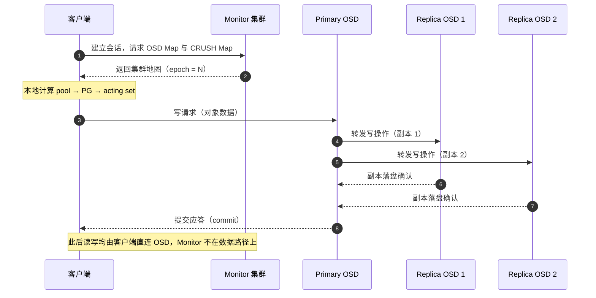
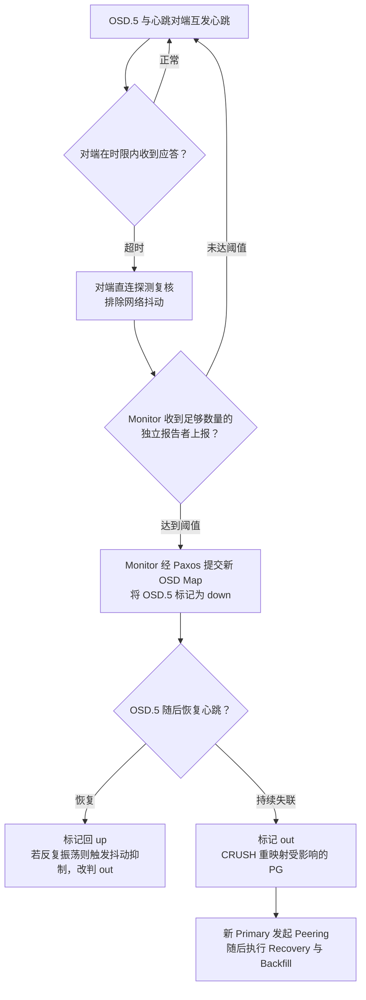

# 01 Ceph 全局架构——RADOS、CRUSH 与三大存储接口

**摘要：**

Ceph 是业界唯一同时提供块存储（RBD）、对象存储（RGW）和文件存储（CephFS）三大接口的统一分布式存储系统。其核心创新在于 RADOS（Reliable Autonomic Distributed Object Store）层——一个无中心节点的分布式对象存储基础，以及 CRUSH（Controlled Replication Under Scalable Hashing）算法——一种无需查表的去中心化数据放置算法。本文从存储系统的三个基本问题与传统存储的演进困境出发，交代 Ceph 诞生的历史动因与"没有单点故障"的设计哲学；随后拆解其分层架构，剖析 Monitor/OSD/MDS 三类守护进程的职责边界，阐明 RADOS 的对象模型与两步映射；在此之上补齐两条贯穿日常使用的主线——一次读写如何在无中心集群里完成定位与副本传播，以及故障如何被心跳机制发现并触发自愈；最后分析三大存储接口的客户端栈、对象条带化与适用场景，并给出 Ceph 与 HDFS 的选型决策依据。全文试图回答两个问题：Ceph 为什么长成这样（去中心化），以及这套架构在你使用它时究竟如何运转。

---

## 第 1 章 为什么需要 Ceph——存储的三个基本问题与演进困境

### 1.1 一切存储系统都要回答的三个问题

把市面上任何一款存储系统拆到最简，它都在回答同样三个问题：**容量**——数据放得下吗，涨了怎么办；**性能**——数据取得快吗，并发高了还扛得住吗；**可靠性**——磁盘坏了、机器宕了、机房断电了，数据还在吗。这三个问题彼此纠缠，譬如为了可靠性做三副本，容量成本立刻翻三倍；为了性能把数据打散到更多节点，故障面又随之扩大。存储架构的绝大部分权衡，都是在这三者之间挪动砝码。

不妨把存储系统想象成一座城市的粮仓体系：容量是仓容够不够，性能是进出仓的装卸速度，可靠性是火灾、水患之后账本和存粮还在不在。传统存储与分布式存储的分野，本质上是用两种完全不同的方式回答这三个问题——前者靠更贵的仓库和更专业的管理员，后者靠数量众多的小仓库加一套调度规则。

三个问题还有一个共同的放大器：**规模**。单机存储几十 TB 时，磁盘年化故障率哪怕高达百分之几，也不过是偶尔换块盘的小事；而当集群铺到上万块盘，同样的故障率意味着平均每天都有磁盘在坏——譬如一万块磁盘按 2% 的年化故障率估算，每天就有约半块盘报修。在这个规模上，"磁盘会坏"不再是风险，而是日常；可靠性设计从"尽量避免故障"变成"假设故障时刻都在发生"。Ceph 的全部设计，正是站在这个假设之上展开的。

### 1.2 从 DAS 到 SAN/NAS——传统存储的演进与天花板

最早的服务器存储是**直连存储（Direct-Attached Storage, DAS）**——磁盘就插在服务器机箱里，通过 SCSI/SATA 线缆直连主板。DAS 简单、延迟低，但容量与计算绑死在同一台机器上：磁盘满了只能停机加盘，或者整机换成更大的，多台服务器之间的数据共享更是无从谈起。

业务对共享的需求催生了网络存储。2000 年代初，企业存储的主流方案是 **SAN（Storage Area Network）** 和 **NAS（Network Attached Storage）**。SAN 通过光纤通道将磁盘阵列挂载为服务器的本地块设备，NAS 通过 NFS/CIFS 提供文件访问接口。这两种方案都依赖**专用存储硬件**——高端存储阵列（如 EMC VMAX、NetApp FAS），价格极为昂贵。

更严重的问题是**扩展性**：传统存储阵列通过添加磁盘扩展容量，但控制器（存储头）是单点，当 IO 请求足够多时，控制器 CPU 成为瓶颈。无论添加多少块磁盘，性能不会线性增长——因为所有 IO 都要经过同一个控制器。这种架构的扩展上限通常在百 TB 到 PB 级别，且价格随容量呈非线性增长。

从 DAS 到 SAN/NAS，演进的方向是"共享"，但共享的枢纽始终是一个集中式的控制器。容量可以靠堆磁盘解决，性能与可靠性的天花板却焊死在控制器上——这正是后来分布式存储要拆掉的那堵墙。

价格曲线同样值得单独一看：专用存储阵列的报价随容量近似线性甚至超线性增长，而商品服务器的单位容量价格则随通用硬件的规模效应持续下探。数据量到了 PB 级，两条曲线的差距就不再是"贵一点"与"便宜一点"的百分比问题，而是买得起与买不起的分界线——这是后来 Google、Amazon 们转向自建 commodity 硬件分布式存储最原始的动机，也是 Ceph"用廉价商品硬件 + 算法换可靠性"这条路线的起点。

### 1.3 分布式对象存储的岔路——GFS、HDFS 与它们的边界

**Google 的 GFS（2003）** 和 **HDFS** 给出了一个不同的思路：用廉价的商品服务器构建分布式文件系统，将数据分片分布在大量节点上，通过副本机制保证可靠性。但 GFS 和 HDFS 都是专为**大文件顺序读写**优化的系统，不支持随机读写，不提供 POSIX 文件接口，也不适合块存储或对象存储场景。

存储系统的需求是多样的：

- **虚拟机**需要块设备（像挂载本地磁盘一样使用远程存储）
- **应用程序**需要 POSIX 文件接口（挂载目录，像操作本地文件一样操作远程文件）
- **对象存储场景**（图片、视频、备份文件）需要 HTTP 接口，支持海量小文件

传统上，块存储、文件存储、对象存储是三个独立的产品，背后是三套完全不同的存储系统，运维复杂度极高。一套 iSCSI/SAN 阵列给虚拟机供盘，一套集群 NAS 给应用共享文件，再配一套对象存储放图片与备份——三套硬件、三套运维体系、三份采购预算，数据却可能在三者之间来回拷贝。

### 1.4 Ceph 的诞生——Sage Weil 与他的章鱼

2006 年 11 月，OSDI 学术会议在美国西雅图举行，一位来自加州大学圣克鲁兹分校（UC Santa Cruz）的博士生 Sage Weil 宣读了论文《Ceph: A Scalable, High-Performance Distributed File System》；2007 年，他又在博士论文《Ceph: Reliable, Scalable, and High-Performance Dynamic Storage》中把整套设计系统化地固定了下来。最初的动机就是解决上述问题：**用一套统一的底层系统，同时支持块存储、文件存储和对象存储，并具备 PB 级线性扩展能力**。

这个名字取自头足纲动物（Cephalopod）——章鱼与乌贼所属的类群，项目的吉祥物正是一只章鱼。这个选择并非偶然：章鱼大约三分之二的神经元分布在八条触手里，每条触手都能独立感知与反应，中央大脑只做少量协调。Ceph 的架构抱有同样的野心——把数据面的智能下放到每一个 OSD，让成千上万个"触手"各自计算、相互协作，而不是等待一个中央大脑的指令。项目后来进入 Linux 内核主线（2010 年），并经由 Inktank（2012 年成立）与 Red Hat（2014 年收购）走向企业级生产环境，成为 OpenStack 与 Kubernetes 生态中持久化存储的主流选择之一。

Ceph 的几个核心设计目标：

**去中心化（No Single Point of Failure）**：传统分布式文件系统（GFS、HDFS）都有元数据服务单点（Master/NameNode），这个单点决定了整个系统的元数据吞吐上限，也是高可用的最大隐患。Ceph 通过 CRUSH 算法实现**数据放置的去中心化**——客户端自己计算数据应该放在哪个 OSD，不需要查询中心节点，彻底消除了元数据瓶颈。

**自愈（Self-Healing）**：OSD 故障是常态而非例外。Ceph 的设计假设磁盘会坏、节点会宕机，系统必须能够自动检测故障并恢复数据副本，不需要人工干预。

**自管理（Self-Managing）**：随着集群规模增大（数百到数千个 OSD），手工管理每块磁盘的数据分布是不现实的。CRUSH 算法通过拓扑感知的数学计算自动决定数据放置，当节点加入或离开时，自动重新均衡数据。

**统一底层（Unified Storage）**：通过分层架构，在同一个 RADOS 对象存储层之上，抽象出 RBD（块）、CephFS（文件）、RGW（对象）三大接口。运维一套集群，提供三种存储服务。

> [!note] 设计哲学
> Ceph 的本质是：**将分布式系统的复杂性从客户端转移到存储集群内部**。
> 传统方案是用昂贵的专用硬件和集中式控制器来保证可靠性；Ceph 的思路是用廉价的商品硬件 + 去中心化的算法来实现同等甚至更高的可靠性。
> 这种"复杂性内化"的代价是 Ceph 本身非常复杂，运维门槛高——但这个代价只需要存储团队承担一次，而不是每个使用存储的业务团队都要面对。

### 1.5 没有单点故障的代价

值得追问一句：如果 Ceph 像 HDFS 一样保留一个中心元数据节点，事情会简单多少？答案是工程上会容易很多——一致性好维护、语义好推理，HDFS 正是这么做的。但那个中心节点会成为三样东西的集合体：元数据吞吐的上限、故障爆炸的半径、以及规模增长时最先被顶住的天花板。NameNode 把全部文件系统元数据放在内存里，集群容量每翻一倍，这块内存就跟着翻一倍；Federation 之类的补丁能缓一缓，却拆不掉这个架构假设。

Ceph 的答案是干脆不让数据路径上有中心节点，但这个选择并非免费：数据放置从"查一张表"变成"算一道题"（第 4 章的 CRUSH），集群状态从"一处权威"变成"版本化地图的持续传播"（第 5 章），故障检测从"中心探测"变成"邻居互查"（第 6 章）。**去中心化不是消除了复杂性，而是把复杂性从单点搬进了算法与协议**——这是理解 Ceph 一切设计的总纲，也是它运维门槛高的根源。存储团队承担一次这份复杂性，换取所有业务团队不再各自面对它，这笔账是否划算，取决于你的规模与团队形态，后文会反复回到这个判断。

还有一个常被忽略的细节：Ceph 并没有教条地消灭所有中心组件。CephFS 的 MDS、维护监控指标的 Manager，都是"必要的中心"——区别在于它们要么不在数据路径上，要么被设计成可水平扩展的。**去中心化是一种工程判断，不是宗教信条**——该中心化的地方（全局共识、监控汇聚）保留中心但让它可扩展，能去中心化的地方（数据放置、数据 IO、故障检测）坚决下放。这条"哪里中心化、哪里去中心化"的分界线，比"去中心化"三个字本身更值得你记住。

---

## 第 2 章 Ceph 的分层架构

### 2.1 架构总览

Ceph 的架构是严格的层次化设计，从下到上分为三层：



**RADOS 层**是 Ceph 的核心，是一个**完全自治的分布式对象存储系统**。它不是文件系统、不是块设备、也不是 S3，它是一个底层的对象存储原语——提供"存储和检索带有任意元数据的可变长字节串"的能力，并保证强一致性和高可靠性。

**LIBRADOS** 是 RADOS 的客户端库，暴露 C API，上层的 RBD、RGW、CephFS 都是 RADOS 的客户端，通过 librados 与集群交互。

**上层接口层**是 RADOS 的语义封装：
- **RBD** 将 RADOS 对象映射为块设备——一个 RBD image 被切分成多个固定大小的 RADOS 对象（默认 4MB），提供块设备语义（随机读写）
- **RGW** 在 RADOS 之上实现 S3 和 Swift API，将 S3 对象存储为一个或多个 RADOS 对象
- **CephFS** 将文件系统语义（目录树、文件、inode）映射到 RADOS 对象，并引入 MDS（Metadata Server）管理文件系统元数据

这种分层带来的好处是语义的解耦：RADOS 只关心"把字节串可靠地存起来"，块、文件、对象三种语义全部作为客户端侧的封装叠加其上。底层的一次改进（譬如更换存储引擎、调整副本策略）自动惠及三种接口，这是"统一存储"在架构上能够成立的前提。librados 的多语言绑定也值得一笔：C/C++/Python/Go 的绑定让上层生态不必各自重复实现协议细节——ceph-csi、RGW、各类备份工具走的都是同一条与集群对话的路径；副本策略与故障域规则以 Pool 为单位统一实施，三种接口共享同一套可靠性语义，而不是各自为政。

### 2.2 三类核心守护进程

理解 Ceph 架构，首先要理解三类核心守护进程的职责边界。

**Monitor（mon）**

Monitor 是 Ceph 集群的"地图中心"，维护以下几种关键的集群 Map：

- **Monitor Map**：集群中所有 Monitor 节点的地址和状态
- **OSD Map**：所有 OSD 节点的地址、状态（up/down/in/out）和集群拓扑
- **CRUSH Map**：集群的硬件拓扑（机柜、主机、OSD 的层次关系），以及 CRUSH 算法使用的故障域规则
- **PG Map**：所有 Placement Group（PG）的状态和 OSD 映射关系
- **MDS Map**：CephFS 的 MDS 节点状态（如果有）

Monitor 集群采用 **Paxos 共识**维护这些 Map 的一致性。通常部署奇数个（3 或 5），保证高可用。奇数并非迷信：Paxos 的法定人数（Quorum）要求多数派存活，3 个 Monitor 容忍 1 个故障，5 个容忍 2 个；偶数部署只会多花一台机器的成本，却不增加任何容错能力——4 个 Monitor 与 3 个一样只能容忍 1 个故障。

**Monitor 不存储数据**——这是 Ceph 去中心化设计的关键。客户端的读写请求**不经过** Monitor，Monitor 只提供集群拓扑信息（Map）。客户端拿到 OSD Map 和 CRUSH Map 后，**本地计算**数据应该在哪些 OSD 上，直接与 OSD 通信，完全绕过 Monitor。

这与 HDFS 的 NameNode 形成鲜明对比：HDFS 的每次文件访问都需要查询 NameNode 获取 Block 位置，NameNode 是 IO 路径上的必经节点；Ceph 的 Monitor 是控制面（Control Plane），不在数据面（Data Plane）的 IO 路径上。打个比方，Monitor 像是地图出版社——它印刷交通图，却不承运任何货物；你手握一张地图就可以直接去找货主，用不着每次都先跑一趟出版社。

**OSD（Object Storage Daemon）**

每块物理磁盘对应一个 OSD 进程（通常一一对应，也支持一个 OSD 管理多块磁盘）。OSD 的职责远不止简单存储数据：

1. **存储对象数据**：将 RADOS 对象持久化到本地存储引擎（BlueStore）
2. **副本复制**：作为 Primary OSD，将写入的数据复制到 Replica OSD
3. **心跳检测**：OSD 之间相互发送心跳，检测对方是否存活，并将结果上报给 Monitor
4. **数据恢复（Recovery）**：当 Monitor 通知某个 OSD 故障，其他 OSD 自动将受影响 PG 的数据复制到新的 OSD
5. **数据校验（Scrub）**：定期扫描本地数据，检测静默数据损坏（bit rot）

OSD 的这种"自治"能力是 Ceph 自愈特性的实现基础——Monitor 只需要维护集群状态，具体的数据恢复工作完全由 OSD 集群自主完成。如果说 Monitor 是只画地图不送货的出版社，那么每个 OSD 就是身兼数职的一线员工：既是仓库管理员（存数据），又是快递员（复制与转发），还是质检员（心跳与校验）。

**MDS（Metadata Server）**

MDS 仅在使用 CephFS 文件系统接口时才需要部署。MDS 管理文件系统的元数据（目录树、文件的 inode 信息、权限、时间戳等），实际的文件数据仍然存储在 RADOS 对象中，MDS 不直接存储文件内容。

MDS 支持多 Active 部署（将目录树分成多个子树，分别由不同的 MDS 处理），实现元数据的水平扩展。

**Manager（mgr）**

Manager 是较新引入的守护进程（Ceph Luminous 以后），负责：
- 汇聚和暴露监控指标（Prometheus 格式）
- 运行管理模块（Dashboard Web UI、RESTful API、均衡器 Balancer）
- 处理一些需要全局状态的管理操作（如 PG 自动调整 `pg_autoscaler`）

---

## 第 3 章 RADOS——去中心化分布式对象存储

### 3.1 RADOS 的对象模型

RADOS 的基本存储单元是**对象（Object）**，每个对象包含：
- **OID（Object ID）**：全局唯一的对象标识符（字符串）
- **Data**：可变长的字节串（对象数据，最大通常为几 MB 到几百 MB）
- **xattrs（Extended Attributes）**：键值对形式的对象级元数据（类似文件系统的扩展属性）
- **omap**：一个持久化的 KV 映射（存储在 OSD 的 RocksDB 中，用于存储大量小元数据）

RADOS 对象操作是原子的，支持读（read）、写（write）、删除（remove）、CAS（compare-and-swap）等操作。

omap 值得单独一提：它让每个 RADOS 对象都能附带一张小型的 KV 表，上层接口因此可以把"索引类"数据直接落在 RADOS 上——RGW 的 bucket 索引、CephFS 的部分元数据都存放在 omap 里。换句话说，RADOS 提供的不只是"存一个字节串"，而是"存一个带元数据能力的字节串"，上层接口的很多设计空间都由此而来。

### 3.2 两步映射——从对象到 OSD

**对象如何映射到 OSD？这正是 RADOS 去中心化设计的精髓，通过两步映射完成：**

```
Object OID → 哈希取模 → Placement Group (PG) → CRUSH 计算 → OSD 列表
```

**第一步：OID → PG**

```python
# 伪代码
pg_id = hash(OID) % pg_num  # pg_num 是该 Pool 的 PG 总数
```

通过对 OID 做哈希并对 PG 数取模，将对象映射到一个 PG（Placement Group，放置组）。PG 是 RADOS 中的**逻辑分组单元**——多个对象归属于同一个 PG，一个 PG 被整体放置在同一组 OSD 上。

为什么要引入 PG 这个中间层，而不是直接将对象映射到 OSD？

原因在于**管理粒度**。如果一个集群有 10 亿个对象和 3000 个 OSD，直接维护"对象→OSD"的映射表需要存储 10 亿条记录，当 OSD 变化时需要更新数亿条记录。引入 PG 后，10 亿对象被分组到（通常）几百到几千个 PG，Monitor 只需要维护 PG→OSD 的映射（几千条记录），PG 内部的对象→PG 映射由确定性哈希计算，不需要持久化存储。

不妨用快递系统类比：10 亿个包裹如果逐件登记"哪个网点负责"，登记簿本身就会压垮系统；先按邮编把包裹划进几千个"分区"（PG），再决定每个分区由哪个网点（OSD）承运，登记簿只剩几千行，包裹与邮编的对应关系则由规则现算，根本不用记。

PG 的价值还不止于省下这张登记簿。当一块 OSD 故障时，受影响的不是 10 亿个对象，而是它承载的几十个 PG——**恢复以 PG 为单位并行展开**，恢复的进度、流量、优先级都以 PG 为粒度调度。没有 PG 这个中间层，"数据恢复"这个动作连描述的单位都没有；有了它，故障恢复才能既并行又不失序。

**第二步：PG → OSD（CRUSH 算法）**

```
CRUSH(PG_ID, CRUSH_MAP) → [Primary_OSD, Replica_OSD_1, Replica_OSD_2]
```

给定 PG 的 ID 和 CRUSH Map（集群拓扑），通过 CRUSH 算法计算出该 PG 应该放置在哪些 OSD 上。这个计算是纯数学的（不查表），任何人（客户端、OSD、Monitor）用同样的输入得到同样的结果。

这两步映射完全在**客户端本地**完成，不需要查询 Monitor 或任何中心节点——这就是 Ceph 去中心化的核心。

### 3.3 Pool：租户隔离与存储策略单元

Pool 是 RADOS 的**逻辑命名空间**，相当于数据库中的 Schema。Ceph 集群中可以创建多个 Pool，每个 Pool 独立配置：

- **副本策略**：Replicated Pool（3 副本）或 Erasure Code Pool（纠删码，如 4+2）
- **PG 数量（pg_num）**：影响数据分布的均匀度和并行度
- **故障域策略**：副本是否必须分布在不同机架（通过 CRUSH Rule 配置）
- **应用标注**：标记该 Pool 用于 RBD/CephFS/RGW，方便管理工具识别

实际操作中，RBD 使用一个 Pool 存储块设备镜像，CephFS 使用两个 Pool（一个存元数据，一个存文件数据），RGW 使用多个 Pool（用于对象数据、用户信息、bucket 索引等）。

Pool 与 PG 的关系值得再强调一次：pg_num 是 Pool 级别的参数，数据分布的均匀度与恢复的并行度都由它决定——PG 太少，单个 PG 承载的对象过多，恢复时牵一发而动全身；PG 过多，地图维护与 Peering 的固定开销随之上升。PG 数量的计算与 pg_autoscaler 的权衡，留待部署实战一篇展开。

> [!info] 核心概念：Erasure Code Pool
> Erasure Code（纠删码）是 3 副本之外的另一种可靠性方案。以 4+2 纠删码为例：原始数据分成 4 个数据块（data chunks）+ 2 个校验块（coding chunks）。任意 2 个块损坏，都能通过其他 4 个块恢复原始数据。
> 与 3 副本相比，4+2 纠删码的存储开销是 1.5x（6 个块存储 4 块的数据）远优于 3 副本的 3x，适用于冷数据存储（对象存储归档）。但纠删码 Pool 不支持部分写（需要读-修改-写），所以不适合随机小 IO 的 RBD 块设备，主要用于 RGW 对象存储。

---

## 第 4 章 CRUSH 算法概览

CRUSH（Controlled Replication Under Scalable Hashing）是 Ceph 最核心的技术创新，也是实现去中心化数据放置的关键。这里先给出直觉性理解，详细分析见 [[中间件/Ceph/02 CRUSH 算法——去中心化的数据放置|02 CRUSH 算法]]。

### 4.1 传统一致性哈希的局限

在分布式存储领域，**一致性哈希（Consistent Hashing）** 是常见的数据分布方案（[[中间件/Redis/Redis设计与实现/00 专栏导览|Redis]] Cluster 使用它）。基本思想是：将所有节点映射到一个哈希环上，每个数据项根据其哈希值落在环上的某个位置，顺时针找到的第一个节点即为负责节点。

一致性哈希的优点是节点增减时只需迁移相邻数据。但对于 Ceph 这样需要感知**物理拓扑**（机柜、机架、数据中心）的系统，一致性哈希有致命缺点：它无法保证副本分布在不同的故障域。

如果两个 OSD 在同一个机架，一致性哈希可能将同一份数据的两个副本放在这两个 OSD 上——一旦机架发生断电，两个副本同时丢失，数据不可用。真正需要的是：**3 副本必须分布在 3 个不同的机架上**，确保任意一个机架故障，其他两个机架仍然有完整的数据副本。

### 4.2 CRUSH 的直觉

CRUSH 将集群拓扑建模为一棵树（CRUSH Map）：

```
Root
├── Datacenter-1
│   ├── Rack-01
│   │   ├── Host-01 → OSD.0, OSD.1, OSD.2
│   │   └── Host-02 → OSD.3, OSD.4, OSD.5
│   └── Rack-02
│       ├── Host-03 → OSD.6, OSD.7, OSD.8
│       └── Host-04 → OSD.9, OSD.10, OSD.11
└── Datacenter-2
    └── ...
```

CRUSH 算法接受 PG ID 作为输入，沿着这棵树自上而下，在每个层级（Bucket）用一个确定性的哈希函数选择子节点，最终在叶子节点选出 N 个不同的 OSD（N = 副本数），并且这 N 个 OSD 分布在不同的指定故障域（如不同的机架）。

这种树形选择的设计使 CRUSH 能够**同时保证随机均匀分布和故障域隔离**，而且是纯计算，不需要查询中心状态。

不妨把 CRUSH 想象成一位对组织架构了如指掌的调度员：你报出一个工单号，他不翻花名册，而是沿着"公司—园区—楼层—工位"的组织树逐级点名，每一级都用工单号做种子掷一颗确定性的骰子——同样的工单号，无论谁来掷、掷多少次，落点都一模一样。花名册（映射表）会过期、会被写坏、会成为瓶颈，而掷骰子的规则不会；规则要升级时（譬如机架扩容），改的也只是规则里的拓扑描述，而不是任何一张记录数据位置的表。

---

## 第 5 章 读写全链路——一次写入的完整旅程

### 5.1 第一步：获取集群地图

前四章备齐了所有零件，现在不妨把它们组装起来，跟着一次写入走完全程。第一个问题是：客户端凭什么知道数据该放在哪？

答案是一份被称为集群地图（Cluster Map）的拓扑数据，也就是第 2 章列出的那几份 Map 的合称。客户端启动时先连接 Monitor 集群（奇数个节点组成法定人数，Quorum），通过 Paxos 读取当前最新的 OSD Map 与 CRUSH Map，此后便可以完全脱离 Monitor 行动。这份地图描述的是"路"，不是"货"——它告诉客户端集群里有哪些 OSD、如何组成机架与主机、每个 PG 归属哪组 OSD，但数据本身从不流经 Monitor。

顺带一提，客户端配置里只需要一组 Monitor 的地址（monmap），Monitor 集群自身的成员变化也由同一套 Paxos 维护——地图出版社连自己的营业网点变动，都是用同一套流程记录在案的。

这就引出一个值得停下来想一想的问题：让客户端自己算数据位置，难道不怕算错吗？答案藏在 CRUSH 的确定性里：只要地图一致，客户端、Primary OSD、Monitor 三方各自独立计算，必然得到完全相同的结果。既然结果一致，就不需要任何一方去"询问"另一方，中心化的查表服务自然也就不需要存在了。

### 5.2 第二步：本地计算定位 PG 与 Primary

拿到地图后，定位过程完全在客户端本地完成，复用第 3 章的两步映射：

1. 客户端把读写目标换算成 RADOS 对象（譬如 RBD 把块偏移换算成 `{image_id}.{chunk_index}` 形式的 OID）
2. 计算 `pg_id = hash(OID) % pg_num`，得到对象所属的放置组
3. 以 PG ID 与 CRUSH Map 为输入跑一遍 CRUSH，得到该 PG 的 acting set——例如 `[OSD.7, OSD.23, OSD.41]`
4. acting set 中的第一个 OSD 即为 Primary OSD，其余为 Replica

这里有一对容易混淆的概念值得一提：CRUSH 直接算出的是 up set，而实际负责读写的 acting set 在绝大多数时候与之重合，只有在 PG 临时迁移等场景下两者才会短暂不一致，其间的状态机流转留待 [[中间件/Ceph/05 PG 状态机与数据一致性——Peering、Recovery 与 Backfill|PG 状态机一篇]] 展开。对使用者的关键结论是：**定位一个对象，客户端只需要 pool、pg_num、CRUSH Map 三样东西，全程零查询**。

### 5.3 第三步：写入与副本传播

定位完成之后，客户端把写请求交给 Primary，剩下的工作由 Primary 主导：



这条链路有两个关键设计。其一，**每个 PG 只有一个 Primary**，所有写入顺序由它串行决定，副本之间因此不会出现顺序分叉——PG 内的一致性由唯一的主本天然保证。其二，客户端自始至终只和 Primary 打交道，完全不知道（也不需要知道）副本散落在哪些节点上，副本放置的全部复杂性都被 Primary 与 CRUSH 吸收了。控制面与数据面的分离在这里落到实处：Monitor 宕掉多数派，集群退化为只读但数据不丢；而只要 OSD 活着，数据路径就畅通无阻。

### 5.4 epoch——集群地图的版本号

集群地图不是一成不变的：OSD 加入退出、权重调整、PG 重映射，都会让地图过时。Ceph 的做法是给每份地图盖上一个单调递增的版本号——**纪元（Epoch）**，OSD Map 每变更一次，epoch 就加一。

传播机制是"懒传播"与事件推送的混合：Monitor 不向全集群广播每份新地图，而是等客户端或 OSD 在交互中暴露出版本落后——任何一方的应答消息里都带着自己持有的 epoch，一旦发现对方更新，落后的一方就去 Monitor 拉取新图。譬如客户端拿着 epoch=100 的旧地图把请求发到了一个刚被标记 down 的 OSD 上，该 OSD（或 MON）会在应答中附上更新版本的地图，客户端更新后重试即可，整个过程不需要任何中心仲裁。

这套设计的取舍很清楚：Monitor 卸掉了"向数千节点实时推送"的负担，换来的是故障切换后一个短暂的不一致窗口——旧地图上的请求可能打到已下线的 OSD，被拒绝、换图、重试，通常在毫秒到秒级内收敛。Ceph 认为这笔交易划算，因为地图变更在稳态下是低频事件，而中心化推送的代价却随集群规模线性增长。

### 5.5 读路径——一致性优先的另一个取舍

读请求的定位与写完全同构：客户端同样用本地计算找到 PG 与 Primary，把读交给 Primary 完成。区别在于传播——读不需要副本参与，Primary 从本地 BlueStore 取出数据即可应答。

这个设计里藏着 Ceph 的一致性立场。理论上，读可以摊给任意副本以分散负载，但那样就必须回答"哪个副本的数据是最新的"；Ceph 的回答是不回答——**读永远走 Primary，读到的永远是 Primary 认可的最新版本**。对块设备与文件系统语义而言，读到旧数据往往比读得慢更不可接受，数据库的页缓存、文件系统的元数据都建立在"读己之写"的假设上。Ceph 把读收敛到 Primary，等于用一点负载集中的代价，换掉了整个副本一致性证明的复杂性。至于 Primary 自身故障时的接管与状态机流转，正是 [[中间件/Ceph/05 PG 状态机与数据一致性——Peering、Recovery 与 Backfill|PG 状态机一篇]] 的主题。

---

## 第 6 章 心跳与故障检测——自愈的起点

### 6.1 邻居互敲门——OSD 间的心跳

去中心化架构里有一个绕不开的问题：Monitor 不在数据路径上，那谁来发现"某个 OSD 挂了"？让 Monitor 主动轮询数千个 OSD 显然不可扩展，Ceph 的答案是把探测责任下放给 OSD 自己——**OSD 之间互为心跳对端，彼此监视**。

每个 OSD 会从与自己共同承载 PG 的 OSD 中挑选一组心跳对端，周期性地互发心跳（Heartbeat）消息并等待应答。这就像同一栋楼里的邻居互相留意：谁家连续几天没亮灯、门口的报纸没人取，邻居总会先发现，而不是等物业（Monitor）挨家挨户查房。选择共同承载 PG 的对端也很有讲究——它们恰恰是最需要知道"邻居死了"的节点，因为邻居的死亡直接意味着自己负责的 PG 副本数不足。

这个设计的反事实很直观：如果改由 Monitor 主动轮询数千个 OSD，MON 集群要么扩成一个大机房，要么在故障高峰时排队误事；把探测下放之后，检测算力随集群规模线性增长，Monitor 只在结论已经成形时介入裁决——这与第 5 章"地图出版社只印图不送货"是同一个哲学在不同层面的两次落笔。

### 6.2 从怀疑到报案——上报 Monitor

单个 OSD 的怀疑并不直接作数。心跳超时后，发现异常的 OSD 会先做一轮直连探测以排除网络抖动，确认可疑后再向 Monitor 上报"我认为 OSD.5 状态异常"。Monitor 不会凭一份报告就宣判死亡，而是要求在报告时限内收到足够数量的**独立报告者**（由 `mon_osd_min_down_reporters` 等参数控制）的相同结论，才采信这份"群证"。

除了邻居报案，OSD 还有自报渠道：磁盘读写错误、文件系统异常、本地心跳超时等自身可感知的问题，OSD 会主动向 Monitor 自报（self-report）。两条渠道合起来，构成一个事实上的分布式故障检测网络——检测的算力来自 OSD 集群自身，Monitor 只负责仲裁。

Monitor 采信报告时还有一道防串证的闸门：报告者数量与报告份数是两个独立的阈值——前者要求证词来自足够多的不同节点，后者要求证词在时限内达到足够的份数。单个 OSD 的网络抖动、或者一小撮同机架节点的同时误判，都会被这道闸门挡下；参数的默认值在多数发行版中已经调得偏保守，通常不需要你动它，但你需要知道它的存在——排查"OSD 被误标 down"类问题时，这是第一块要看的表盘。

### 6.3 Monitor 判死与标记 out

Monitor 采信报告后，走 Paxos 提交一份新的 OSD Map，完成判死与重映射的完整链路：



标记 out 意味着 CRUSH 会把这些 PG 重新映射到新的 OSD 上，数据恢复随即启动——这条链路的状态机细节，正是 [[中间件/Ceph/05 PG 状态机与数据一致性——Peering、Recovery 与 Backfill|PG 状态机与数据一致性]] 一篇的主题。

这里值得把 down 与 out 两个状态辨析清楚，它们在运维里经常被混为一谈：down 只说明进程不在了，数据还躺在那块盘上；out 才意味着 CRUSH 不再把这台 OSD 视为数据的合法居所，副本必须迁走。一台机器重启，OSD 会经历 down 再 up，数据纹丝不动；一块盘彻底损坏，OSD 被标记 out，恢复流程才真正启动。运维中看到 down 不必紧张，看到 out 才需要估算恢复的流量与时长——这两个状态的区分，是读懂集群健康状态的第一课。

### 6.4 灵敏与稳定的权衡

故障检测永远在两种错误之间摇摆：判得太急，会把一次网络抖动当成节点死亡，触发大规模数据迁移，恢复流量挤占业务 IO，严重时形成"越忙越乱、越乱越忙"的恶性循环；判得太慢，副本数不足的窗口被拉长，下一块磁盘恰好故障时数据就可能真丢。Ceph 用一组可调参数在这两端之间取平衡：心跳超时时限决定"多久没消息算可疑"，独立报告者数量阈值决定"几个人说坏话才定罪"，抖动抑制（Flap Suppression）则专门对付那些反复 up/down 的"病秧子"节点——对它直接标记 out 并告警，宁可让它彻底退出，也不允许它反复牵动全集群的 PG 迁移。

这些参数没有放之四海而皆准的最优值：网络质量差、维护频繁的环境需要放宽时限，硬件可靠、追求恢复速度的环境则可以收紧。理解这条链路的意义在于，当你看到集群里某个 OSD 被标记 out 时，你能够判断这背后是真实的硬件故障，还是一次被放大的网络抖动——这是后续运维与故障排查篇章的基本功。

---

## 第 7 章 三大存储接口

### 7.1 RBD（块存储）——给虚拟机的磁盘

**RBD（RADOS Block Device）**将 RADOS 对象封装成块设备语义。从使用者角度看，一个 RBD image 就像一块插在服务器上的本地磁盘——可以格式化文件系统、可以随机读写任意扇区。

RBD 的实现原理：一个 RBD image 被逻辑切分成多个**固定大小的对象**（默认 4MB），每个对象有一个 OID（格式：`{image_id}.{chunk_index}`）。读写某个偏移量时，RBD 客户端将块偏移转换为对应的 RADOS 对象 ID 和对象内偏移，通过 librados 直接操作对应的 RADOS 对象。

**RBD 的三种访问方式**：

1. **内核 RBD（krbd）**：Linux 内核模块，将 RBD image 挂载为 `/dev/rbd0` 等块设备，适合虚拟机磁盘
2. **QEMU/libvirt 直接驱动**：QEMU 通过 librbd 直接访问 Ceph，不需要内核模块，性能更好（避免了一次内核-用户态拷贝），是虚拟化场景的主流选择
3. **Kubernetes CSI（Container Storage Interface）**：通过 ceph-csi 插件，为 Kubernetes Pod 提供 PVC（PersistentVolumeClaim），动态创建和挂载 RBD 块设备

**RBD 的关键特性**：

- **精简配置（Thin Provisioning）**：创建一个 1TB 的 RBD image，不会立即占用 1TB 的实际存储，只有在写入数据时才实际分配 RADOS 对象
- **快照（Snapshot）**：在某时刻对 image 创建快照，快照是写时复制（Copy-on-Write）的，几乎是瞬间完成
- **克隆（Clone）**：基于快照创建新的 image（也是 COW），常用于从模板快速创建大量虚拟机

RBD 与 [[中间件/JuiceFS/00 专栏导览|JuiceFS]]、HDFS 的定位完全不同：RBD 提供块设备语义（适合数据库、虚拟机），JuiceFS/HDFS 提供文件系统语义（适合大数据处理）。

### 7.2 CephFS（文件存储）——POSIX 兼容的分布式文件系统

CephFS 在 RADOS 之上实现了完整的 POSIX 文件系统接口——挂载后就像一个普通的 Linux 目录，支持 `ls`、`mkdir`、`cp`、`chmod` 等所有文件系统操作。

CephFS 的架构比 RBD 复杂，需要额外引入 **MDS（Metadata Server）** 管理文件系统元数据（目录树、inode 等）。文件数据本身仍然直接存储在 RADOS 中。

**CephFS 的数据流**：

```
写文件请求 → CephFS 客户端
    ├── 更新 inode 元数据 → MDS（最终写入 RADOS 元数据 Pool）
    └── 写文件数据 → 直接写入 RADOS 数据 Pool（绕过 MDS）
```

这种"元数据走 MDS，数据直接走 RADOS"的设计，使得文件数据的读写吞吐不受 MDS 限制，只有元数据操作（创建文件、列目录等）才经过 MDS。

**CephFS 的挂载方式**：

1. **内核 CephFS 客户端（kcephfs）**：Linux 内核模块，通过 `mount -t ceph` 挂载，POSIX 兼容性最好
2. **FUSE 客户端（ceph-fuse）**：用户态 FUSE 实现，兼容性更好但性能略低于内核客户端

CephFS 与 NFS 的主要区别：NFS 是集中式的，所有请求都经过 NFS Server；CephFS 是真正分布式的，文件数据直接从 Ceph OSD 读写，不经过任何集中式代理。

> [!warning] 生产避坑：CephFS 的 MDS 单点风险
> 虽然 CephFS 支持多 Active MDS，但配置和调优较复杂。在生产中，单 Active MDS + 多 Standby MDS 是更常见的部署方式（Active 故障时自动切换到 Standby，通常在数秒内完成）。
> MDS 的内存容量是一个关键约束——MDS 将热点目录的元数据缓存在内存中。文件系统中的文件数量极多时（亿级别），MDS 的内存压力会很大。这种场景下，应当考虑 [[中间件/JuiceFS/00 专栏导览|JuiceFS]] 等专门为海量小文件优化的文件系统。

### 7.3 RGW（对象存储）——S3 协议兼容的 HTTP 接口

**RGW（RADOS Gateway）** 是 Ceph 的对象存储网关，提供与 Amazon S3 和 OpenStack Swift 协议兼容的 HTTP API。从用户视角看，Ceph RGW 就是一个私有部署的 S3——可以用 AWS SDK、s3cmd、MinIO Client 等任何 S3 兼容工具访问。

RGW 本身是无状态的 HTTP 服务器（基于 Beast HTTP 库），直接将 S3 请求转换为 librados 操作：

- **S3 对象** → 存储为一个或多个 RADOS 对象（大对象分片存储）
- **S3 Bucket** → 对应 RADOS 中的一个命名空间
- **Bucket 索引**（对象列表）→ 存储在专用 RADOS Pool 的 omap 中

RGW 的典型使用场景：

- **应用程序的图片/视频/文档存储**：替代 AWS S3，用于私有云环境
- **数据备份存储**：Velero（Kubernetes 备份工具）、数据库备份都可以对接 RGW
- **大数据存储层**：通过 S3A 接口，Spark/Hive 可以直接读写 Ceph RGW 上的数据，实现存算分离

面向多租户场景，RGW 还内置了用户与配额体系：每个 S3 用户拥有独立的 Access Key 与容量配额，bucket 归属用户，访问权限通过 S3 签名体系校验。这使 RGW 可以直接作为企业内部的"私有 S3"对外提供服务，而不需要在网关外再套一层租户管理——多租户与桶策略的细节，留待对象存储专篇展开。

> [!info] RGW vs MinIO
> MinIO 也是 S3 兼容的对象存储，但 MinIO 是独立的存储系统，而 RGW 是构建在 Ceph 之上的接口层。
> 如果已经有 Ceph 集群，RGW 是提供对象存储接口的自然选择（复用同一套集群）。
> 如果只需要简单的对象存储，MinIO 部署更轻量、运维更简单。
> 两者在 S3 协议兼容性上都很好，选择主要取决于是否有现有 Ceph 集群和对统一存储的需求。

### 7.4 客户端栈对比

三大接口各自衍生出用户态库与内核态客户端两条路径，选型时值得把整张客户端栈的地图铺开看：

| 客户端栈 | 形态 | 运行位置 | 对应接口 | 典型场景 |
| :--- | :--- | :--- | :--- | :--- |
| librbd | 用户态 C/C++ 库（含 Python/Go 绑定） | QEMU、ceph-csi 等应用进程内 | RBD | 虚拟机磁盘、Kubernetes PVC（主流路径） |
| krbd | Linux 内核模块 | 内核态 | RBD | 将 image 挂载为 `/dev/rbdX` 块设备直接使用 |
| libcephfs | 用户态库 | ceph-fuse 等用户态进程 | CephFS | FUSE 挂载、自研元数据密集型应用 |
| kcephfs | Linux 内核客户端 | 内核态 | CephFS | `mount -t ceph`，POSIX 兼容性与性能最佳 |
| RGW | 无状态 HTTP 网关 | 独立守护进程 | 对象存储 | S3/Swift 兼容访问，任意语言 SDK 直连 |

内核态与用户态的分野值得多说一句：内核客户端（krbd/kcephfs）吃页缓存与 VFS 生态的红利，挂载即用、对应用透明，但受制于内核版本的发布节奏；用户态库（librbd/libcephfs）跟随应用升级、少一次内核-用户态切换，QEMU 与 ceph-csi 因此默认走 librbd。没有绝对的优劣，只有与运维形态的匹配——这是典型的因地制宜。

### 7.5 对象条带化——大文件如何铺满集群

一个 100GB 的 RBD image 按 4MB 切分后得到 25600 个对象，它们被哈希均匀撒到全集群的 OSD 上，读写吞吐因此随 OSD 数量近乎线性扩展——这正是**条带化（Striping）** 的功劳。条带化由两个参数刻画：**条带单元（Stripe Unit）** 决定切多细，**条带数量（Stripe Count）** 决定铺多宽。CephFS 的 file layout 允许按目录自定义这两个参数，譬如为视频库配置大条带单元以提升顺序吞吐，为小文件目录配置小单元以减少空间放大。

不过条带化是双刃剑：它让大文件的并行读写成为可能，也让"一个文件"与"多个 OSD"深度绑定——恢复一个被条带化的大对象需要同时读多个 OSD，小文件则可能因为不足一个条带单元而浪费空间。RGW 对大对象的处理是同样的思路：超过阈值的 S3 对象被切分成多个 RADOS 对象分片存储。理解了条带化，你才能理解为什么 Ceph 对"海量小文件"场景始终不够友好，以及为什么第 7.2 节的避坑提示里会出现 JuiceFS 的名字。

---

## 第 8 章 Ceph 与 HDFS 的定位差异

### 8.1 一张表看懂定位差异

Ceph 和 [[大数据/Hadoop/HDFS/00 专栏导览|HDFS]] 经常被放在一起比较，因为都是分布式存储，但两者的设计目标和适用场景有本质差异：

| 维度 | Ceph | HDFS |
| :--- | :--- | :--- |
| **存储接口** | 块存储/文件存储/对象存储（三合一） | 仅文件系统（类 POSIX，但不完全兼容） |
| **元数据架构** | 去中心化（CRUSH 计算 + MDS 可水平扩展） | 集中式 NameNode（内存存储全部 inode） |
| **适用场景** | 通用存储（VM 磁盘/容器存储/对象存储） | 大数据批处理（MapReduce/Spark 的存储层） |
| **IO 模式** | 支持随机读写（RBD/CephFS） | 主要优化顺序读写，随机写性能差 |
| **文件大小** | 通用（小文件/大文件均可） | 优化大文件（> 128MB），小文件不友好 |
| **Kubernetes 集成** | 原生 CSI 支持，可提供 PVC | 需要额外的 CSI 驱动（alluxio/juicefs 代理） |
| **数据本地性** | 不强调数据本地性 | 计算任务调度感知 Block 位置，优化本地计算 |
| **运维复杂度** | 高（多种守护进程，CRUSH 配置复杂） | 相对低（主要是 NameNode HA 配置） |

### 8.2 元数据架构的分野——无中心计算与中心查表

表里"元数据架构"一行的差异，值得单独展开，因为它是两个系统几乎所有其他差异的根源。

HDFS 的 NameNode 把整个文件系统的目录树和所有块的位置信息放在内存里，每次文件访问都要先查 NameNode 拿到 Block 位置。这个设计简单直接，代价是三重的：元数据容量受限于单机内存（亿级文件意味着数百 GB 内存），元数据吞吐受限于单台机器，NameNode 的高可用（QJM + ZooKeeper）成为运维的重头戏。HDFS Federation 让多个 NameNode 分管不同的命名空间，算是对内存天花板的横向补救，但"查表才能拿到数据位置"这一步始终存在。

Ceph 的数据面压根没有这张表：对象到 PG 由哈希算出，PG 到 OSD 由 CRUSH 算出，客户端拿着集群地图自己就能定位，Monitor 只在地图变化时提供新版本。唯一的例外是 CephFS——文件系统语义终究需要有人管理目录树，于是有了 MDS；但 Ceph 对这个"必要的中心"的回答不是消除它，而是让它可水平扩展（多 Active 分管子树）且不承载文件数据。一句话概括：**HDFS 用中心查表换简单，Ceph 用算法计算换扩展**，两条路线各有代价，没有免费的午餐。

### 8.3 场景决策

| 你的场景 | 更合适的选择 | 关键理由 |
| :--- | :--- | :--- |
| Hadoop 生态批处理，存算一体 | HDFS | 数据本地性与生态深度绑定，运维心智成熟 |
| 虚拟机/容器需要块设备 | Ceph RBD | 块语义 + 随机读写 + 快照克隆 + CSI 原生支持 |
| 私有化 S3 对象存储 | Ceph RGW 或 MinIO | 已有 Ceph 则 RGW 复用集群，否则 MinIO 更轻量 |
| 通用 POSIX 共享文件系统 | CephFS | 真正分布式挂载，元数据可扩展 |
| 海量小文件 + 存算分离 | [[中间件/JuiceFS/00 专栏导览|JuiceFS]]（后端可接 Ceph RGW） | 元数据引擎专为海量小文件设计 |

**选型建议**：

- 已有 [[大数据/Hadoop/HDFS/00 专栏导览|Hadoop]] 生态（Spark/Hive/MapReduce）且不打算存算分离 → **HDFS**
- 需要为虚拟机/容器提供块存储 → **Ceph RBD**
- 需要私有部署的 S3 对象存储 → **Ceph RGW**
- 需要 POSIX 文件系统且文件量不是海量小文件 → **CephFS**
- 已有 Ceph 集群，需要为 Spark/Hive 提供存算分离的存储层 → **CephFS 或 RGW（通过 S3A）**
- 海量小文件 + 存算分离 + 对象存储后端 → **[[中间件/JuiceFS/00 专栏导览|JuiceFS]]**（底层可使用 Ceph RGW）

---

## 第 9 章 小结

Ceph 的架构可以用三个关键词概括：**统一**、**去中心化**、**自愈**。

**统一**：RADOS 提供通用的分布式对象存储原语，RBD/CephFS/RGW 是其上的语义封装，一套集群提供三种存储服务。

**去中心化**：CRUSH 算法消除了 IO 路径上的中心节点，客户端本地计算数据位置，直连 OSD，Monitor 不参与数据 IO；OSD 之间相互心跳和协作，自主完成数据恢复。

**自愈**：OSD 故障触发 PG 的自动重新映射，OSD 集群自主发起 Recovery 流程，不需要人工干预。

理解了这三个关键词，就理解了 Ceph 设计的精髓。回望全文的论述主线：传统存储用集中式控制器回答容量、性能与可靠性三个基本问题，代价是天花板与价格曲线；GFS/HDFS 用分布式换扩展，却把元数据压在一个中心节点上；Ceph 的回答是把数据面的智能彻底下放——放置靠 CRUSH 计算，读写靠客户端直连，故障靠邻居互查，恢复靠 PG 状态机自主推进。每一步下放都换来了扩展性，每一步也都付出了复杂性的代价，这笔账最终是否划算，取决于你的数据规模、故障频率与团队能力——存储选型从来只有权衡，没有银弹。

后续章节将深入展开 CRUSH 算法的数学原理（[[中间件/Ceph/02 CRUSH 算法——去中心化的数据放置|02 CRUSH 算法]]）、OSD 与 BlueStore 存储引擎的裸设备直管（[[中间件/Ceph/04 OSD 与 BlueStore——存储引擎深度解析|04 OSD 与 BlueStore]]）、PG 状态机与数据恢复流程（[[中间件/Ceph/05 PG 状态机与数据一致性——Peering、Recovery 与 Backfill|05 PG 状态机与数据一致性]]），以及 CephFS 的元数据管理（[[中间件/Ceph/08 CephFS——MDS、多活元数据与实践边界|08 CephFS]]）。

---

## 参考资料

1. Sage A. Weil, Scott A. Brandt, Ethan L. Miller, Darrell D. E. Long, Carlos Maltzahn. *Ceph: A Scalable, High-Performance Distributed File System*. Proceedings of OSDI '06, 2006.
2. Sage A. Weil. *Ceph: Reliable, Scalable, and High-Performance Dynamic Storage*. PhD Dissertation, University of California, Santa Cruz, 2007.
3. Sage A. Weil, Scott A. Brandt, Ethan L. Miller, Darrell D. E. Long. *CRUSH: Controlled, Scalable, and Incremental Placement of Replicated Data*. Proceedings of SC '06, 2006.
4. Ceph Documentation — Architecture（RADOS、CRUSH、Monitor、心跳与故障检测）: https://docs.ceph.com/en/latest/architecture/
5. 相关篇章：[[中间件/Ceph/00 专栏导览|专栏导览]] · [[中间件/Ceph/02 CRUSH 算法——去中心化的数据放置|02 CRUSH 算法]] · [[中间件/Ceph/04 OSD 与 BlueStore——存储引擎深度解析|04 OSD 与 BlueStore]] · [[中间件/Ceph/05 PG 状态机与数据一致性——Peering、Recovery 与 Backfill|05 PG 状态机与数据一致性]] · [[中间件/Ceph/08 CephFS——MDS、多活元数据与实践边界|08 CephFS]] · [[中间件/JuiceFS/00 专栏导览|JuiceFS 专栏]]

---

> [!note] 思考题
> 1. Ceph 提供块存储（RBD）、对象存储（RGW）和文件存储（CephFS）三种接口，底层共享同一个 RADOS 集群。这种'统一存储'架构相比为每种存储类型部署独立系统（如 iSCSI + MinIO + NFS），在运维复杂度和资源利用率方面有什么优劣？在什么规模下统一存储的优势开始显现？
> 2. CRUSH 算法是 Ceph 数据分布的核心——它通过确定性计算（而非中心化的元数据服务器）将对象映射到 OSD。CRUSH Map 描述了集群的物理拓扑（机架、主机、OSD）。如果你需要保证同一个 PG 的三个副本分布在不同机架上，CRUSH Rule 应该如何编写？CRUSH 的故障域（failure domain）设计哲学是什么？
> 3. Ceph 的 Monitor（MON）通过 Paxos 协议维护集群状态（Cluster Map）。当 MON 集群出现脑裂（如 3 个 MON 网络分区为 1+2）时，少数派 MON 无法形成法定人数（quorum），集群变为只读。在生产环境中，MON 应该部署多少个？为什么不建议使用偶数个 MON？
