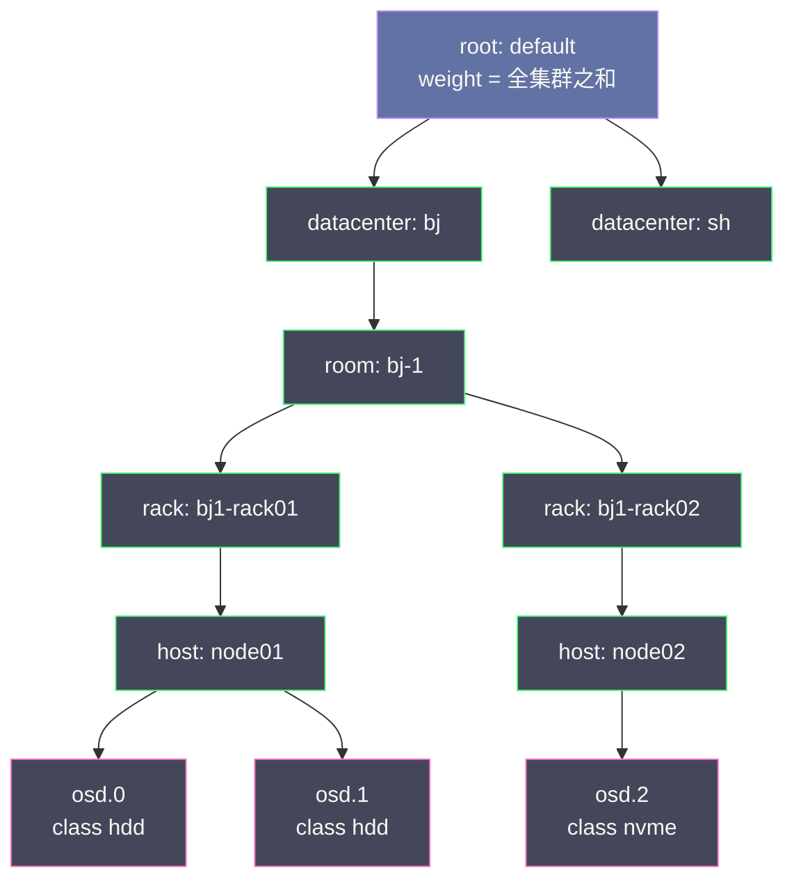
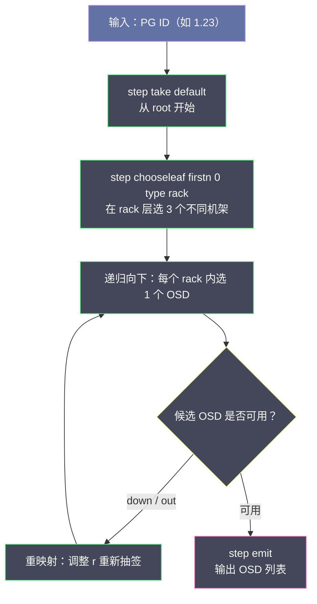
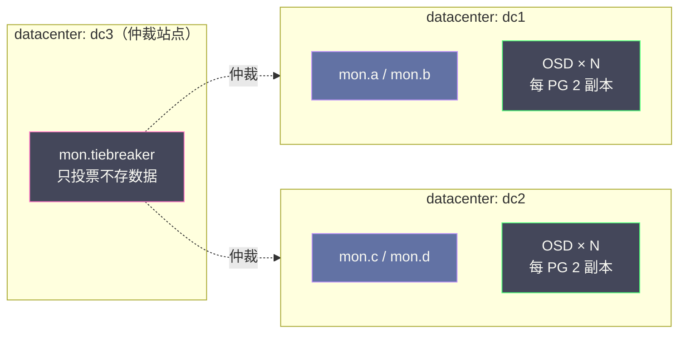

# 02 CRUSH 算法——去中心化的数据放置

**摘要：**

CRUSH（Controlled Replication Under Scalable Hashing，受控复制可扩展哈希）是 Ceph 最核心的技术创新，它回答了分布式存储最根本的问题：在不依赖任何中心查表服务的前提下，把海量数据均匀地摊到成千上万块磁盘上，同时让每一份副本都落在不同的故障域（Fault Domain）里。本文从传统数据放置方案（静态哈希取模、中心映射表、一致性哈希）的缺陷出发，沿一条主线展开：CRUSH Map 如何把机房画成一棵加权树，Bucket 的五种选择算法如何演进到 straw2，Tunables 如何在算法改进与老客户端兼容之间走钢丝，CRUSH Rule 如何把故障域约束写成声明式规则，以及权重体系与在线运维控制如何落地。全文回答两个问题：**数据应该放在哪里，以及为什么放在那里**。理解 CRUSH，是理解 Ceph 去中心化自治能力的钥匙，也是阅读后续 Monitor、PG 状态机与 BlueStore 各篇的前提。

---

## 第 1 章 数据放置问题的本质

### 1.1 分布式存储要解决的核心矛盾

2006 年 11 月，SC'06 超级计算大会上，加州大学圣克鲁兹分校（UCSC）的博士生 Sage Weil 发表了一篇题为《CRUSH: Controlled, Scalable, Decentralized Placement of Replicated Data》的论文。同年秋天的 OSDI '06 会议上，同一个团队拿出了 Ceph 的整体设计。两篇论文合起来，勾勒出一个野心勃勃的目标：为美国能源部的超算中心支撑 PB 级、数万块磁盘规模的存储，而且这个系统要能随时增减节点、随时承受磁盘损坏。在这样的规模下，任何一台负责「登记数据放在哪」的中心服务器，都会先于磁盘阵列本身达到极限。

十几年过去，CRUSH 的核心设计几乎没有伤筋动骨，这在一个迭代迅速的领域里相当罕见。要看懂它为什么长寿，不妨先看它要解决的问题有多别扭。

还有一段前史值得交代：CRUSH 并非凭空出现。它的直接前身是 RJ Honicky 与 Ethan Miller 在 2004 年提出的 RUSH（Replication Under Scalable Hashing）算法家族，那批算法第一次系统地回答了「如何用纯哈希、不查表地放置多副本数据」。Weil 后来在复盘 straw2 的文章里坦言，CRUSH 早期的多数桶算法都是对 RUSH 家族的模仿，只有 straw 是他新造的一种。CRUSH 真正的增量贡献在两处：把 RUSH 的哈希树推广成**任意深度的加权桶树**，让物理拓扑可以按机房的真实层级建模；以及引入声明式的 Rule，让「副本隔多远」从算法内部参数变成运维可声明的策略。站在巨人的肩膀上，再把肩膀垫高一层——这是对 CRUSH 由来最准确的描述。

任何分布式存储系统都需要回答一个问题：**一份数据应该存在哪里？**

这个问题看似简单，但在生产场景中需要同时满足几个互相制约的目标：

**均匀性（Uniformity）**：数据应该尽可能均匀地分布在所有存储节点上，避免某些节点过载而另一些节点空闲。如果分布不均，热点节点会成为性能瓶颈，而冷节点的资源浪费。

**故障域隔离（Fault Domain Isolation）**：对于 3 副本策略，3 个副本不能都放在同一台机器、同一个机架或同一个交换机下面。真正的高可用要求每个副本在不同的故障域——一台机器宕机不影响数据可用性，一个机架断电不影响数据可用性。

**最小化迁移（Minimal Migration）**：当集群扩容（添加新节点）或缩容（移除节点）时，需要重新分布数据以维持均匀性，但迁移数据量应当尽量小——只迁移受影响的数据，不需要全量重新洗牌。

**去中心化（Decentralization）**：数据放置决策不依赖中心节点查表。客户端、OSD 都能独立计算出任意数据应该在哪个 OSD 上，不需要向 Master/NameNode 查询，消除单点瓶颈。

这四个目标在实际工程中很难同时满足。传统方案通常只能满足其中两三个，而 CRUSH 通过精妙的算法设计实现了四者的统一。

### 1.2 传统方案的局限性

**方案一：静态哈希取模（`OSD = hash(OID) % N`）**

最简单的方案：对对象 ID 哈希后取模，得到目标 OSD 编号。这满足均匀性，也不需要中心查表，但致命缺陷是**扩展性极差**：当节点数 N 变化时，几乎所有对象都需要迁移（因为 `N` 的改变导致大多数取模结果变化），迁移量接近 100%。

**方案二：中心化映射表（`Map: OID → OSD`）**

维护一张全局映射表，记录每个对象存在哪个 OSD。这满足故障域隔离（可以在分配时检查），迁移时只需更新表项。但这张表的大小与对象数量成正比——10 亿对象就需要 10 亿条记录，且所有读写操作都需要查表，中心节点成为性能瓶颈。

这正是 HDFS NameNode 的模式（Block → DataNode 映射存在内存中），导致 NameNode 内存成为 HDFS 的规模瓶颈（通常支撑不超过 3 亿个文件/Block）。这笔账不难算：每条映射哪怕只占几十字节，十亿对象也是几十 GB 起步的常驻内存，而且随对象数线性增长、永远没有到头的一天。

**方案三：一致性哈希（Consistent Hashing）**

一致性哈希将所有节点映射到一个虚拟哈希环上，每个数据项根据哈希值顺时针找最近的节点。节点增减时只需迁移该节点相邻的数据，迁移量约为 `1/N`（N 为节点数），接近最优。

但一致性哈希**无法感知物理拓扑**。它只知道节点的哈希值，不知道节点在哪个机架、哪个数据中心。无法保证 3 个副本分布在 3 个不同机架——两个副本可能落在哈希环上相邻位置，而这两个节点恰好在同一个机架。

打个比方：一致性哈希像一个只认门牌号分信的邮差，效率很高，但他不知道 7 号楼和 8 号楼共用同一个配电房——一旦配电房跳闸，两栋楼的信一起遭殃。[[中间件/Redis/Redis设计与实现/10 Redis Cluster 分布式架构|Redis Cluster]] 采用的是 16384 个 Hash Slot 的固定分配（并非一致性哈希），适合 Redis 这种不强调副本跨机架分布的缓存场景，但不适合需要强故障域隔离的块存储系统。

> [!note] 设计哲学
> CRUSH 的设计思路是：**将物理拓扑信息内嵌到数据放置算法中，而不是外部查表**。通过在算法层面感知「这两个节点在同一机架」，CRUSH 在选择副本时主动避开共同故障域，同时保持均匀分布和最小化迁移的特性。中心映射表像机场总服务台，每个乘客都要去问一次「我的行李在哪」；CRUSH 则像给每个快递员发了一张全城地图和一套口算规则，谁也不用打电话回总部。

---

## 第 2 章 CRUSH Map——集群拓扑的数学建模

### 2.1 树形结构：把机房画成一棵加权树

CRUSH 将整个集群的物理拓扑建模为一棵加权树，称为 **CRUSH Map**。树的叶子节点是 **OSD**（实际的存储设备），内部节点称为 **Bucket**（桶），代表物理拓扑中的各级聚合单元（Host、Rack、Row、Datacenter 等）。

```
Root（根，代表整个集群）
├── Datacenter-BJ（数据中心）
│   ├── Rack-01（机架）
│   │   ├── Host-01（主机）
│   │   │   ├── OSD.0（weight=1.0，1TB NVMe）
│   │   │   ├── OSD.1（weight=1.0，1TB NVMe）
│   │   │   └── OSD.2（weight=1.0，1TB NVMe）
│   │   └── Host-02
│   │       ├── OSD.3（weight=2.0，2TB HDD）
│   │       └── OSD.4（weight=2.0，2TB HDD）
│   └── Rack-02
│       ├── Host-03
│       │   └── OSD.5, OSD.6, OSD.7
│       └── Host-04
│           └── OSD.8, OSD.9, OSD.10
└── Datacenter-SH
    └── ...
```

每个节点（OSD 或 Bucket）都有一个 **Weight（权重）**：

- OSD 的权重通常对应其磁盘容量（1TB NVMe → 权重 1.0，2TB HDD → 权重 2.0）
- 内部 Bucket 的权重是其所有子节点权重之和

权重决定了数据分配的比例：权重 2.0 的 OSD 会比权重 1.0 的 OSD 存储大约两倍的数据量，从而在混合容量集群中实现按容量比例的均匀分布。

这棵树的组织架构图意味很浓：OSD 是士兵，Host 是班组，Rack 是连队，再往上是营、团、师。CRUSH 后面所有的选择动作，本质上都是「先选连队、再选班组、最后点兵」的逐级抽签。一个常被忽略的细节是：**每个桶自带算法与哈希函数**（反编译文本里的 `alg` 与 `hash` 字段），也就是说同一棵树的不同层级可以用不同的选择算法——host 层用 straw2 精细控权重，root 层成员太多时换 tree 省计算，互不干扰。`hash 0` 指的是 Jenkins 哈希（rjenkins1），CRUSH 全程只用这一种哈希原语，伪随机的可复现性全靠它。Ceph 默认预定义了完整的层级类型，从下到上依次是：

| 层级类型 | 对应物理实体 | 说明 |
|---|---|---|
| osd | 单块磁盘 | 树的叶子，唯一存数据的节点 |
| host | 一台服务器 | OSD 部署时默认自动挂到同名 host 桶下 |
| chassis / rack | 机箱 / 机架 | 中型集群最常用的故障域 |
| row / pdu / pod | 机排 / 配电单元 / 走线仓 | 大型机房按供电与布线切分 |
| room / datacenter | 机房 / 数据中心 | 跨机房部署的故障域 |
| zone / region | 可用区 / 地域 | 云上部署语义 |
| root | 集群根 | 所有规则的起点，权重为全树之和 |

类型可以自定义（譬如把「楼层」定义成一种类型），但大多数集群用到 rack 或 room 就够了。下图是一棵典型的多级树：



每个 OSD 在树中的位置称为 CRUSH location（位置），可以用 `root=default datacenter=bj room=bj-1 rack=bj1-rack01 host=node01` 这样的键值对描述。OSD 启动时若未显式声明，默认只登记 `root=default host=主机名`——这也是很多集群「机架隔离不生效」的根源：树里根本没有 rack 这一层，规则自然无从谈起。

### 2.2 Device Class：混合介质的分流阀

真实机房几乎都是混合介质的：NVMe 扛数据库、SATA HDD 扛冷数据。Ceph Luminous（12.2，2017 年）引入了设备类（Device Class）机制，让 CRUSH 能在同一棵树里区分介质：

- OSD 启动时会根据后端设备类型自动打上 `hdd`、`ssd` 或 `nvme` 标签
- 也可以手动设置或清除：

```bash
# 给指定 OSD 打 class 标签（设置后不能直接改成别的 class，必须先 rm）
ceph osd crush set-device-class nvme osd.0 osd.1
ceph osd crush rm-device-class osd.2
# 查看某个 class 下有哪些 OSD
ceph osd crush ls-device-class nvme
```

实现上，Ceph 会为每个 class 生成「影子根」与「影子桶」（反编译 CRUSH Map 时看到的 `default~hdd` 就是它），规则里则写作 `step take default class hdd`。你可以把 class 理解为高速公路的车道分流：小客车与货车各走各道，规则只认车道，不认具体哪辆车。有了 class，一套物理集群就能同时承载高性能池与大容量池，而不必拆成两套 Ceph。

### 2.3 CRUSH Rule——故障域约束的声明

CRUSH Rule 是数据放置策略的声明性描述，告诉 CRUSH 算法「从树的哪个层级开始选择，在哪个层级做故障域隔离」。

一条典型的 CRUSH Rule 包含以下步骤：

```
rule replicated_rack {
    # 1. 从哪个 Bucket 开始（通常是 Root）
    take default

    # 2. 第一次选择：在 Rack 层级选 N 个不同的 Rack
    #    'chooseleaf' 意味着选到 Rack 后继续向下选到叶子（OSD）
    #    'firstn 0' 中的 0 表示选副本数个（副本数由 Pool 配置决定）
    chooseleaf firstn 0 type rack

    # 3. 结束
    emit
}
```

上面的 Rule 声明的含义是：**从 Root 开始，在 Rack 层级选择 N 个不同的 Rack（N = 副本数），然后在每个 Rack 内继续向下选择一个具体的 OSD**。

这就实现了「3 副本分布在 3 个不同机架」的故障域隔离——无论集群如何变化，CRUSH 都保证副本分布满足这个约束。

如果需要更严格的隔离（如副本必须在不同数据中心），只需将 `type rack` 改为 `type datacenter`：

```
chooseleaf firstn 0 type datacenter
```

### 2.4 实战：CRUSH Map 的获取、反编译、编译与注入

CRUSH Map 是集群里少有的「可以拿下来改完再放回去」的活图纸。改 CRUSH Map 的标准流程是四步，值得每个运维背下来：

```bash
# 第 1 步：导出当前 CRUSH Map（得到的是二进制格式，不可直接编辑）
ceph osd getcrushmap -o /tmp/crushmap.bin

# 第 2 步：反编译为可读文本
crushtool -d /tmp/crushmap.bin -o /tmp/crushmap.txt

# （编辑 /tmp/crushmap.txt：调整层级、权重或规则）

# 第 3 步：把文本编译回二进制
crushtool -c /tmp/crushmap.txt -o /tmp/crushmap.new

# 第 4 步：注入集群，立即生效
ceph osd setcrushmap -i /tmp/crushmap.new
```

注入之前，务必先用 `crushtool --test` 做干跑模拟，确认新地图能产出合法映射：

```bash
# 用 rule 0 对 1 万个输入值做映射模拟，检查是否有 PG 选不出 OSD
crushtool -i /tmp/crushmap.new --test \
  --show-mappings --rule 0 --num-rep 3 \
  --min-x 0 --max-x 9999 > /tmp/mappings.txt
```

反编译出来的文本有固定的四段结构，读懂它就读懂了 CRUSH Map 的全部：

有人会问：`ceph osd crush` 家族命令已经能加桶、挪位置、调权重，为什么还要学手工编辑？因为命令行只覆盖常见动作，自定义层级类型、多根拓扑、精细的 EC 规则与 tunables 微调，都只能落到文本上改。手工编辑是低频技能，但它是命令行的兜底——图纸级的能力，平时用不上，用上就是救场。

```
# begin crush map
tunable choose_local_tries 0          # tunables 序列：算法行为开关（见第 4 章）
tunable choose_total_tries 50
...

# devices
device 0 osd.0 class hdd              # 叶子：每块盘一个 device，附带 class
device 1 osd.1 class hdd

# types
type 0 osd
type 1 host
type 2 rack                           # 层级类型定义
...

# buckets
host node01 {
	id -3                             # 桶 ID（负数，与 OSD 的非负 ID 区分）
	id -4 class hdd                   # class 影子桶
	# weight 2.000                    # 桶权重 = 子项权重之和
	alg straw2                        # 该桶使用的选择算法（见第 3 章）
	hash 0  # rjenkins1               # 哈希函数
	item osd.0 weight 1.000
	item osd.1 weight 1.000
}
root default {
	id -1
	alg straw2
	item node01 weight 2.000
}

# rules
rule replicated_rule {
	id 0
	type replicated                   # 副本池规则（EC 池为 erasure）
	min_size 1
	max_size 10
	step take default
	step chooseleaf firstn 0 type host
	step emit
}
# end crush map
```

> [!warning] 生产避坑：注入即生效，回滚靠备份
> `ceph osd setcrushmap` 没有确认环节，注入的瞬间 MON 就会把新地图分发给全集群，映射结果变化的 PG 立刻进入迁移队列。所以第 1 步导出的 `/tmp/crushmap.bin` 就是你的回滚点——一旦新地图引发意外迁移，立刻把它注回去。变更务必放在业务低峰，并配合第 7 章的 `norebalance` 等限流手段。

---

## 第 3 章 CRUSH 算法的选择过程

### 3.1 算法的输入与输出

CRUSH 算法的函数签名（概念上）：

```
function CRUSH(x, rule, n) → [OSD_1, OSD_2, ..., OSD_n]
```

- `x`：输入值，通常是 PG ID（整数）
- `rule`：CRUSH Rule，定义数据放置策略
- `n`：需要选择的副本数（通常等于 Pool 的 size 配置）
- 输出：一个 OSD 列表，长度为 n

关键属性：**给定相同的 `x`、`rule` 和 CRUSH Map，任何节点（客户端、OSD、Monitor）计算的结果完全一致**。这是 CRUSH 去中心化的根本保证。

还要补上拼图的另一块：`x` 从哪来。一个对象（Object）并不直接进 CRUSH，而是先经过一次简单哈希——`hash(对象名) mod pg_num`——归入某个放置组（Placement Group，PG），CRUSH 的输入 `x` 就是这个 PG 的编号。把「对象 → PG」与「PG → OSD」拆成两段是精妙的解耦：前者只依赖 pg_num，后者只依赖拓扑与规则，于是十亿级对象的放置问题被压缩成千级规模的 PG 放置问题，CRUSH Map 里永远不需要出现对象的名字。

### 3.2 Bucket 内的选择：按权重抽签

CRUSH 算法在每个 Bucket 内部使用哈希函数选择子节点。对于一个 Bucket B，需要从其子节点中选择第 r 个副本，选择公式为：

```
c(r, x) = argmax_i { hash(x, id_i, r) / weight_i }
```

其中：

- `x` 是 PG ID（输入值）
- `id_i` 是第 i 个子节点的 ID
- `r` 是副本编号（选第几个副本）
- `weight_i` 是第 i 个子节点的权重

直观解释：对每个子节点，计算 `hash(x, id_i, r)` 并除以该节点权重，选取结果最大的节点。

**为什么除以权重？** 如果所有子节点权重相同，`hash(x, id_i, r)` 是均匀分布的，选出的节点分布均匀。如果某个节点权重是其他节点的 2 倍，除以权重后它的「得分」变小，但由于它被选中的概率与权重成正比（期望上），最终数据量与权重成正比。这是 **Straw2 算法**（Ceph 默认使用），它在保证按权重比例分配数据的同时，在节点增减时实现最小化迁移。

参数 `r` 还承担着另一个职责：**副本去相关**。同一个 PG 的第 1、2、3 个副本分别以 r=1、2、3 去抽签，哈希输入不同，抽出的成员自然不同；再叠加 Rule 在故障域层级的「不重复」约束，副本就被推到了不同的子树里。换句话说，权重决定「分多少」，r 与 Rule 共同决定「隔多远」。

### 3.3 五种 Bucket 算法：同一问题的五种解法

「桶内怎么选子节点」这个问题，CRUSH 论文给出了好几种答案，它们在复杂度、权重要求和迁移行为上各不相同。下表是五种算法的横向对比：

| 算法 | 选择复杂度 | 权重要求 | 成员/权重变化时的行为 | 典型场景 |
|---|---|---|---|---|
| uniform | O(1) | 所有成员必须等权 | 成员集不可变，不支持增删 | 早期同构集群，如今极少使用 |
| list | O(n) | 任意权重 | 追加成员几乎不迁移；删成员或改权重代价大 | 只增不减的集群 |
| tree | O(log n) | 任意权重（内部节点带权） | 树重组会带来部分迁移 | 成员数巨大的桶（数千 OSD） |
| straw | O(n) | 任意权重 | 改一个成员的权重可能引发不相关迁移（缺陷） | straw2 出现前的默认算法 |
| straw2 | O(n) | 任意权重 | 权重变化只影响该成员自身的数据进出 | 2015 年起新建桶的默认 |

uniform 是「人人等权」的特例，一次哈希取模就出结果，快但僵化；list 像排队报名，新来的站队首，先问他要不要接活（按权重比例决定），不要就问下一个，所以集群扩张时几乎不迁移老数据，但删人或改权重就伤筋动骨；tree 把成员组织成二叉哈希树，从根往下走 O(log n) 步，适合单桶数千成员的超大集群，代价是树内部节点也带权重，重组时会有一些本可避免的迁移；straw 与 straw2 则是「抽签」——每个成员抽一根长度与权重相关的麦秆，最长者胜出，分布质量最好，代价是每次选择都要遍历全桶。straw2 修正了 straw 的一个关键缺陷，值得单独展开。

### 3.4 straw 与 straw2：迟到八年的修正

straw 家族值得单独一章笔墨，因为 straw2 的故事是 CRUSH 演进史上最有代表性的一课：**一个埋了八年才被发现的算法缺陷，如何催生了今天 Ceph 的默认放置算法**。

Sage Weil 在 2015 年的邮件列表文章《straw is dead, long live straw2》里复盘过当年设计 straw 时给自己立的三条目标：成员可以有任意权重；O(n) 就能选出一个成员；调整某个成员的权重时，数据只会在「被调整的成员」与其他成员之间移动，绝不会在其他未改动的成员之间移动。前两条都做到了，第三条他一直以为也做到了——毕竟直觉上，每个成员的抽签值只由自己的哈希和权重决定，彼此独立。

但第三个性质其实不成立。straw 的抽签长度要乘一个缩放因子，而这个因子是桶内其他成员权重的函数。换句话说，改 C 的权重，A 和 B 的相对抽签值也会跟着变，于是 A 和 B 之间开始出现与这次调整毫无关系的数据迁移。这个缺陷在 Ceph Tracker #10214 里有完整记录：起因是一位客户对某个 OSD 做了一次极小的权重微调，却观察到海量数据迁移，顺藤摸瓜才挖出这个埋了八年的问题。Weil 在帖子里自嘲，事后看这本该是显而易见的，但八年来没有人仔细看过这段代码。

straw2 的修正思路干净利落：把抽签值改成 `ln(均匀随机数) / weight`，取最大者。这在数学上等价于一场指数分布竞赛——每个成员独立抽一个指数随机变量，获胜概率恰与自身权重成正比，而且每个成员的抽签分布只依赖自己的权重，不再存在那个牵一发动全身的中间缩放因子。效果用一句话概括：调整 C 的权重（包括新增、删除 C），数据只在 C 与其他成员之间移动，A 与 B 之间纹丝不动。

打个比方，straw 的缩放因子像按全组平均分调薪——任何一个人涨薪都会改变所有人的相对排名；straw2 则是各算各的账，你考多少分只取决于你自己。

straw2 于 2015 年随 Hammer（0.94）版本合入，此后新建的 Bucket 默认使用 straw2；存量 straw 桶需要管理员手动迁移（反编译、替换算法名、编译、注入，正是第 2.4 节那四步）。迁移代价与桶内权重差异正相关：等权重桶几乎零迁移，权重差异越大迁移越多——实测权重为 1、2、3、4 的场景下，一万个映射里约有 1360 个发生变化。等权桶零迁移并不神秘：straw2 的抽签值只依赖成员自身权重，等权时所有成员的分布完全相同，换算法等于换了个等价的骰子，点数分布不变，赢家自然也不变。

> [!info] 为什么运维在乎 straw2
> straw2 让「调权重」从不可控的黑盒变成可精确评估的动作：改谁，动谁，一目了然。Ceph 敢把 reweight 作为常规运维手段、balancer 敢自动微调权重，算法前提都是 straw2 的「无关迁移为零」。如果今天你还在跑 straw 桶的存量集群，把它迁到 straw2 几乎总是值得的。

### 3.5 完整选择流程示例

以 3 副本、Rack 级故障域隔离为例，选择 PG 100 的 OSD 列表：

**Step 1：从 Root 开始，在 Rack 层级选 3 个不同的 Rack**

```
副本 1：hash(100, Rack-01的ID, 1) / weight(Rack-01) → 得分 0.73
        hash(100, Rack-02的ID, 1) / weight(Rack-02) → 得分 0.41
        选择得分最高的 Rack-01

副本 2：需要选不同于 Rack-01 的 Rack
        继续计算各 Rack 的得分，选择 Rack-02

副本 3：继续选不同的 Rack，选择 Rack-03
```

**Step 2：在每个选中的 Rack 内，继续向下选择 OSD**

```
Rack-01 → 选择 Rack-01 内得分最高的 OSD → OSD.5
Rack-02 → 选择 Rack-02 内得分最高的 OSD → OSD.12
Rack-03 → 选择 Rack-03 内得分最高的 OSD → OSD.20
```

最终结果：PG 100 → [OSD.5, OSD.12, OSD.20]

这整个计算过程是**纯数学计算**，不需要查询任何外部存储或网络请求，每个知道 CRUSH Map 的节点都能独立重现这个结果。把规则步骤画成流程图，就是下面这样：



### 3.6 重映射（Remapping）——处理 OSD 故障

如果 CRUSH 选择的某个 OSD 标记为 `down`（故障），CRUSH 不会简单地放弃这个选择，而是进行**重映射**——调整副本编号 r，继续在同一 Bucket 内选择下一个备选 OSD：

```
# 原始选择 OSD.5 故障，r 自增，重新选择
r = 1 → OSD.5（故障，跳过）
r = 2 → hash(100, ..., 2) / weight → 选择 OSD.7（同一 Rack 内的另一个 OSD）
```

这种重映射保证了：即使 OSD 故障，CRUSH 仍然能够计算出有效的 OSD 列表，不需要人工干预或中心协调。

> [!warning] 生产避坑：CRUSH 重映射的副作用
> 当 OSD 故障导致大量 PG 需要重映射时，「替代 OSD」会承受大量数据写入（数据恢复流量）。如果大量 OSD 在同一 Rack，且该 Rack 的某个 OSD 故障，Rack 内其他 OSD 会接收所有需要重映射的 PG 的数据，可能短暂造成 IO 热点。
> 生产中应合理规划每个 Rack 内的 OSD 数量，确保单 OSD 故障时，数据能够分散到足够多的其他 OSD 上。

---

## 第 4 章 CRUSH Tunables 与兼容性

### 4.1 行为开关为什么存在

反编译 CRUSH Map 时，最顶上那一排 `tunable` 行就是本章的主角。CRUSH 的映射行为在十几年里被反复修正——修 bug、优化分布、减少迁移——但每一次行为变更都面临同一个两难：新算法更好，可老客户端只认识老算法。客户端（librbd、内核 RBD、ceph-fuse）与守护进程各自内置了「自己认识的」CRUSH 行为版本，如果服务端悄悄换了算法，老客户端算出来的位置就会与服务端不一致，数据直接读错地方。

Ceph 的解法是把这组行为开关（Tunables）**编译进 CRUSH Map**，随地图一起分发，并按引入版本打包成 profile。MON 与 OSD 拿到新地图后，会拒绝不支持新特性的客户端建立新连接；不过已经连上的老客户端会被「祖父条款」豁免，它们不会掉线，但可能行为异常——这比直接拒绝更危险，因为故障是静默的。

### 4.2 Profile 的演进：从 legacy 到 jewel

每个 profile 以引入它的 Ceph 版本命名，演进脉络如下：

| Profile | 引入版本（年份） | 关键 tunable 与修正 | 切换的迁移代价 |
|---|---|---|---|
| legacy（argonaut） | Argonaut 及更早（2012 年前） | choose_local_tries=2、choose_local_fallback_tries=5、choose_total_tries=19、chooseleaf_descend_once=0 | — |
| bobtail（CRUSH_TUNABLES2） | Bobtail 0.56（2013 年） | 本地重试归零、choose_total_tries 提到 50、chooseleaf_descend_once=1 | 中等迁移 |
| firefly（CRUSH_TUNABLES3） | Firefly 0.80（2014 年） | chooseleaf_vary_r=1，修复大量 OSD out 时 chooseleaf 映射结果过少的问题；straw_calc_version=1 修正 straw 权重计算 | vary_r 从 0 改 1 在大数据量集群会触发大量迁移（取 4 或 5 可折中） |
| hammer（CRUSH_V4） | Hammer 0.94（2015 年） | 引入 straw2 并成为新建桶的默认算法 | 改 profile 本身不动存量映射；straw 桶迁 straw2 按权重差异小量迁移 |
| jewel（CRUSH_TUNABLES5） | Jewel 10.2（2016 年） | chooseleaf_stable=1，OSD 被 out 时映射变化大幅减少 | 在存量集群上开启会导致几乎所有 PG 重新映射，迁移量巨大 |
| optimal | 随当前版本 | 当前版本认为最优的组合 | 视与现状的跨度而定 |


这条演进线里有两条暗线值得注意。其一，firefly 修复的 chooseleaf 问题（大量 OSD out 后映射不出足够副本）与 jewel 引入的 chooseleaf_stable，都是在「故障场景下的映射质量」上做文章——CRUSH 的成熟过程，就是不断压低故障时数据迁移量的过程。其二，hammer 是唯一「改 profile 不动存量映射」的节点，因为它的核心变化（straw2）只作用于新建桶；而 jewel 的 chooseleaf_stable 恰恰相反，几乎所有 PG 都会重排。

### 4.3 兼容性：老客户端是真正的约束

切换 profile 的门槛不在服务端，而在客户端。官方文档给出的支持矩阵很明确：CRUSH_TUNABLES2 需要 v0.55 以上客户端或 3.9 以上内核；CRUSH_TUNABLES3 需要 v0.78（Firefly）以上或内核 3.15 以上；CRUSH_V4 需要 v0.94（Hammer）以上或内核 4.1 以上；CRUSH_TUNABLES5 需要 v10.0.2（Jewel）以上或内核 4.5 以上。

最麻烦的是内核 RBD 客户端（krbd）：用户态的 librbd 你可以随应用升级，但内核模块版本由发行版决定，不是想升就能升的。老内核挂载的 RBD 卷遇上新 tunables，轻则被拒绝连接，重则直接崩溃。笔者见过最典型的困境是虚拟化平台：宿主机跑着发行版自带的旧内核，上面挂了几十个生产虚机的 RBD 卷，升级内核意味着逐台迁移虚机，窗口以月计——这类集群的 tunables 只能停在旧 profile 上，直到平台整体换代。所以切 profile 之前先跑 `ceph features`，它会列出当前连接的客户端各自支持到哪个版本；从 v0.74 起，集群还会主动报 `HEALTH_WARN crush map has non-optimal tunables` 提醒你升级。

### 4.4 调整的风险与操作纪律

```bash
# 切换 profile 的命令本身只有一行，代价全在后面
ceph osd crush tunables jewel
```

> [!warning] 生产避坑：tunables 切换的纪律
> 切到 optimal 在存量集群上可能带来最多约 10% 的数据迁移，jewel 级别的变更甚至可能重排几乎所有 PG。纪律只有四条：滚动升级全部完成、`ceph features` 确认所有客户端（尤其 krbd）就位之后再切；切换前用 `crushtool --test` 评估迁移规模并安排在低峰；一旦集群用过非 legacy 的 tunables，就不要再让老版本 `ceph-osd` 加入集群——peering 需要读取历史地图，回退 legacy 也救不了；`mon_warn_on_legacy_crush_tunables = false` 只是消音，不是解决问题。

如果出于兼容原因暂时切不了新 profile，non-optimal 告警会一直挂着，此时正确的姿势是把它登记成技术债、排期升级客户端，而不是一消了之。另一条路径是在反编译文本里手工修改 tunable 值再编译注入——不过对部分旧值组合，crushtool 会要求附加 `--enable-unsafe-tunables` 标志才肯执行，这个参数名本身就是 Ceph 在提醒你慎用。

---

## 第 5 章 故障域与 Rule 设计实战

### 5.1 故障域选在哪一层

Rule 设计的第一个决策是：副本之间隔多远。隔得太近，一个故障域塌了带走多个副本；隔得太远，写延迟和集群规模成本上升。这个决策没有标准答案，只有规模对应的常识：

| 集群规模 | 推荐故障域 | 理由 |
|---|---|---|
| 十几台以内、单机架 | host | 机架本身就是单点，隔离 host 已是全部所能 |
| 几十台、跨多机架 | rack | 机架断电、交换机故障是现实风险 |
| 数百台、多房间或多机房 | room / datacenter | 供电、空调、网络按房间与机房切分 |

老生常谈的「鸡蛋不要放在一个篮子里」，在 CRUSH 这里的精确含义是：篮子必须真的分属不同货架，而不是同一货架上的三个格子。**Rule 引用的故障域类型必须真实存在于 CRUSH Map 中**——如果规则写 `type rack` 而树里根本没有 rack 层，PG 将无法完成映射，集群会大面积 stuck。这也是第 2.4 节强调先 `crushtool --test` 干跑的原因。

不过故障域不是选得越远越好。副本隔到 room 或 datacenter 层，写路径就要跨机房网络，延迟从亚毫秒涨到几毫秒，对 RBD 这类强一致写是实打实的代价；隔离层级每升一级，集群在该层级所需的成员数也要相应增加（room 级隔离至少要三个房间才放得下三副本）。故障域的选择本质上是「可靠性收益」与「延迟成本」的交换，按集群的真实物理边界选，而不是照抄别人的大配置。

### 5.2 副本池的 Rule 模板

三级故障域（host / rack / room）下的副本池规则模板如下，差异只在最后一步的 `type`：

```
# 模板一：host 级故障域（小集群默认）
rule repl-host {
	id 1
	type replicated
	min_size 1
	max_size 10
	step take default
	step chooseleaf firstn 0 type host
	step emit
}

# 模板二：rack 级故障域（几十台以上推荐）
rule repl-rack {
	id 2
	type replicated
	min_size 1
	max_size 10
	step take default
	step chooseleaf firstn 0 type rack
	step emit
}

# 模板三：room 级故障域（跨机房部署）
rule repl-room {
	id 3
	type replicated
	min_size 1
	max_size 10
	step take default
	step chooseleaf firstn 0 type room
	step emit
}
```

日常操作中通常不必手写，一条命令即可生成等价规则：

```bash
# 在 root=default 下创建 rack 级故障域、限 hdd 介质的副本池规则
ceph osd crush rule create-replicated repl-rack default rack hdd
```

`firstn 0` 里的 0 表示「取池的副本数」；若写成正整数 N，则固定选 N 个。`min_size` 与 `max_size` 声明该规则支持的池尺寸范围，超出范围时 CRUSH 拒绝映射。还有一对容易混淆的动词值得辨析：`choose` 与 `chooseleaf`。前者在指定层级选出 N 个桶就停手；后者选完桶还要递归向下选到叶子（OSD）才罢休。副本池规则几乎总是用 chooseleaf——毕竟数据最终要落在磁盘上，而不是机架上。日常查看与核对规则用两条命令即可：`ceph osd crush rule ls` 列名字，`ceph osd crush rule dump` 看完整步骤与编号。

### 5.3 EC 池的 Rule：indep 与 firstn 的分野

纠删码（Erasure Coding，EC）池的规则长得像副本池，但有两处本质不同。先看一条真实的 EC 规则（k=3，m=2）：

```
rule ec32 {
	id 4
	type erasure                      # 类型是 erasure，不是 replicated
	min_size 3
	max_size 5
	step set_chooseleaf_tries 5       # indep 模式默认只试 1 次，必须显式加重试
	step set_choose_tries 100
	step take default
	step chooseleaf indep 0 type host # indep，而非 firstn
	step emit
}
```

核心差异在选择模式：副本池用 `firstn`，EC 池用 `indep`。`firstn` 的语义是「顺延补位」——某个候选选不出来时，后面的候选整体前移一位顶上，这对副本无所谓（副本之间没有位置概念）；但对 EC 是灾难，因为 EC 的恢复依赖「第几个分片在哪个 OSD」的固定账目，位置漂移会让 k+m 个分片的对应关系错乱。`indep` 则是「对号入座」：每个分片位置独立映射，某个 OSD 故障时只重映射缺失的那个位置，其余分片原地不动。顺带解释规则开头那两行 `set_chooseleaf_tries 5` 与 `set_choose_tries 100`：indep 模式下 chooseleaf 默认只尝试一次，选不出就放弃该位置，所以 EC 规则生成器都会显式放大重试预算——这也是手工写 EC 规则时最容易漏、漏了之后故障恢复会变慢的一行。

| 维度 | 副本池（firstn） | EC 池（indep） |
|---|---|---|
| rule 类型 | replicated | erasure |
| 选择模式 | chooseleaf firstn，顺延补位 | chooseleaf indep，对号入座 |
| OSD 故障时 | 该副本顺延到其他 OSD，其余副本不动 | 仅重映射缺失分片的位置，其余分片不动 |
| 失败重试 | 继承 choose_total_tries | 默认仅尝试 1 次，故生成器都写 set_chooseleaf_tries 5 |
| min/max size | 默认规则为 min_size 1、max_size 10 | min_size=k、max_size=k+m |
| 容量开销 | 1/size（3 副本即 1/3） | m/(k+m)（4+2 即 1/3） |

### 5.4 EC Profile 与 crush-root/class 的指定

EC 池的放置参数不直接写在池上，而是打包在 EC profile（纠删码配置档）里，其中三个 `crush-` 前缀的参数就是给 CRUSH 的指令：

```bash
# 定义 EC profile：k=4 m=2，数据限定在 nvme 介质，机架级故障域
ceph osd erasure-code-profile set ec42-nvme \
     k=4 m=2 \
     crush-root=nvme-root \
     crush-failure-domain=rack \
     crush-device-class=nvme

# 用该 profile 创建 EC 池（PG 数与 PGP 数均为 128）
ceph osd pool create ec-pool 128 128 erasure ec42-nvme
```

`crush-root` 指定从树的哪个根开始选（配合多根拓扑做物理分区），`crush-device-class` 指定介质（等价于规则里的 `take <root> class <class>`），`crush-failure-domain` 决定分片之间的隔离层级。

> [!warning] 生产避坑：故障域数量必须 ≥ k+m
> `crush-failure-domain=rack` 意味着 k+m 个分片必须落在 k+m 个不同机架上。如果集群只有 4 个机架却配了 k=4 m=2，PG 将永远无法完整映射，池会卡在 undersized 状态。同理，EC 池不支持 stretch mode（跨站点双活），跨站点场景只能用副本池。

### 5.5 完整案例：混合介质集群的双池设计

把本章与第 2 章串起来，走一遍真实场景：12 台服务器、每台 2 块 NVMe 加 6 块 HDD、3 个机架，需要一块 RBD 高性能池与一块冷数据归档池。

```bash
# 1. 确认设备类已自动识别（Luminous 起 OSD 启动时自动打标）
ceph osd crush ls-device-class nvme
ceph osd crush ls-device-class hdd

# 2. 两条规则：RBD 池走 NVMe、host 级故障域；归档池走 HDD、rack 级故障域
ceph osd crush rule create-replicated rbd-nvme default host nvme
ceph osd erasure-code-profile set ec42-hdd \
     k=4 m=2 crush-device-class=hdd crush-failure-domain=rack

# 3. 创建池
ceph osd pool create rbd-pool 256 256 replicated rbd-nvme
ceph osd pool create archive-pool 128 128 erasure ec42-hdd

# 4. 上线前干跑：导出地图，模拟两个规则的映射，确认无选不出的 PG
ceph osd getcrushmap -o /tmp/cm.bin
crushtool -i /tmp/cm.bin --test --show-mappings \
  --rule 1 --num-rep 3 --min-x 0 --max-x 9999 | head
```

> [!info] 规则是声明式的
> 注意这套流程里没有任何一行代码描述「某个 PG 放在哪」——你只声明了「从哪棵子树、按什么介质、隔多远」，剩下的全部交给 CRUSH 的数学。先模拟、后上线，是声明式系统给运维的最大红利：图纸错了改图纸，而不是拆房子。

---

## 第 6 章 CRUSH 的均匀性与迁移量

### 6.1 为什么 CRUSH 能保证均匀分布

CRUSH 使用哈希函数的输出决定选择，哈希函数的输出在统计上是均匀分布的。当 PG 数量足够多时，每个 OSD 被选中的概率与其权重成正比，从而实现按容量比例均匀分布数据。

**但 CRUSH 的均匀性是概率性的，不是确定性的。** 对于较少的 PG 数量（< 100），PG 在 OSD 间的分布可能不均匀（某些 OSD 可能分到更多 PG）。PG 数量越大，统计均匀性越好。这就像撒豆子：撒十粒难免东一堆西一堆，撒一万粒，地面自然平整。

这也是为什么 Ceph 强调**合理设置 pg_num**（每个 Pool 的 PG 数量）：过少的 PG 导致数据分布不均，过多的 PG 增加 Monitor 的元数据管理开销。通常建议每个 OSD 对应 100-200 个 PG（考虑副本后），具体计算公式：

```
pg_num = (OSD 数量 × 100) / 副本数
```

例如，60 个 OSD，3 副本：`pg_num = 60 × 100 / 3 = 2000`，取最近的 2 的幂次方 = 2048。

还有一点容易被忽略：PG 预算是全集群共享的。三个池各自 2048 个 PG，落在同一批 OSD 上就是三倍的 peering 与内存开销，所以多池集群规划 pg_num 时要按全集群总量计算，再按各池的数据占比分摊，而不是每个池都按满配公式各算各的。

### 6.2 集群扩容时的数据迁移

当向集群添加新的 OSD 时，需要重新均衡数据。CRUSH 的 Straw2 算法在这方面表现接近理论最优。

**理论最小迁移量**：向 N 个 OSD 的集群添加 1 个新 OSD，至少需要迁移 `1/(N+1)` 的数据（因为新 OSD 应该分担 `1/(N+1)` 的数据量，这些数据必须从旧 OSD 迁移过来）。

**CRUSH 的实际迁移量**：Straw2 算法在添加新节点时，理论上只迁移需要迁移的数据——即 `weight_new / total_weight` 比例的数据，接近理论最优，不会迁移那些本不需要迁移的数据。

举个具体的数：100 个等权 OSD 的集群加入 1 块新盘，理论下限是迁移约 1/101 的数据，straw2 的实际迁移量就贴着这条线走；换成静态取模，迁移量会接近全量。这就是为什么 Ceph 集群可以做到「白天加盘、业务无感」——前提是配合好第 7 章的限速参数。

这与静态哈希取模形成鲜明对比（取模方案在添加节点时迁移量可能接近 100%）。

### 6.3 PG 分裂——pg_num 增加时的平滑迁移

随着集群容量增大，原有的 pg_num 可能导致每个 OSD 的 PG 数量过多，影响 Recovery 性能。Ceph Nautilus（14.2，2019 年）引入了 pg_autoscaler 管理模块，支持 PG 数量的自动调整（Octopus 起默认以 warn 模式开启），池侧还有 `pg_num_min` 作为数量下限。

PG 分裂的原理：将 PG `1.a` 分裂为 `2.a` 和 `2.(a + old_pg_num)`，两个新 PG 的 CRUSH 选择结果与原 PG 重叠，分裂过程只需要迁移大约一半数据（另一半保持原位），最大化复用已有数据。

与 pg_num 成对出现的还有 pgp_num，两者分工不同：pg_num 决定 PG 的数量（对象哈希的模数），pgp_num 才是 CRUSH 放置时真正使用的输入规模。只增 pg_num 不动 pgp_num，PG 会分裂但对象原地不动——因为放置输入没变；把 pgp_num 提上来，数据才开始按新 PG 数重新分布。这也是「先分裂、再迁移」两步走的实现机制：分裂是零成本的账面动作，迁移被推迟到你显式调整 pgp_num 的那一刻。

---

## 第 7 章 CRUSH 的高级特性

### 7.1 三种「权重」：crush weight、reweight 与 in/out

Ceph 运维的高频混淆点之一，是三个都叫「权重」的东西。它们分属两层、语义不同，混用是很多「改了个参数、迁了一堆数据」事故的根源：

| 名称 | 命令 | 所在层 | 取值 | 变更后果 | 典型场景 |
|---|---|---|---|---|---|
| CRUSH weight | `ceph osd crush reweight osd.X W` | CRUSH Map | 通常≈容量（TiB） | 改变放置概率，父桶权重联动，触发全局再平衡 | 换大盘、混合容量集群 |
| reweight（in weight） | `ceph osd reweight osd.X W` | OSDMap | 0 ~ 1.0 | 等效把 (1−W) 的 PG 挪走，不修改 CRUSH Map | 利用率纠偏、退役前抽空 |
| in/out 状态 | `ceph osd in` / `ceph osd out` | OSDMap | 1.0 / 0 | `in` 会把 reweight 复位为 1.0；`out` 等效 reweight=0 | 维护窗口、退役 |

在混合容量集群中，可以通过调整 CRUSH weight 来控制数据分配比例：

```bash
# 将 OSD.5 的权重从 1.0 调整为 2.0（表示其容量变为原来 2 倍）
ceph osd crush reweight osd.5 2.0

# 查看当前权重分布
ceph osd df tree
```

调整权重后，CRUSH 会逐渐将数据迁移到权重更高的 OSD，这个过程是在线完成的，不需要停机。

`ceph osd reweight`（注意：没有 `crush`）是另一个命令，它调整的是 OSDMap 层的覆盖权重（官方文档称之为 in weight），取值 0 到 1，含义是「强制把 (1−W) 比例、本该落在这个 OSD 上的数据挪走」。它不修改 CRUSH Map，纯粹是纠偏手段——譬如某个 OSD 利用率 90% 而其他只有 50% 时，把它调低让数据流走。逐个手调太笨，配套的批量命令是 `ceph osd reweight-by-utilization`：默认对利用率偏离均值 ±20% 的 OSD 调整覆盖权重，可用参数控制阈值、单次最大调整量与受影响的 OSD 数上限，加 `--no-increasing` 可以只降不升、避免来回震荡。两点纪律：其一，它与 balancer 冲突，启用 balancer 的集群必须把所有 reweight 复位到 1.0；其二，`ceph osd in` 会把 reweight 重置回 1.0，别指望 out 再 in 之后还保留你调过的值。

打个比方：CRUSH weight 是编制，决定这个岗位分多少活；reweight 是临时调岗，编制不动、先少干点；in/out 则是离职与复职，复职时编制自动恢复满额。

### 7.2 noin/noout：数据迁移的闸门

围绕「要不要动数据」，Ceph 提供了一组集群级标志（flag），它们是维护窗口的标准工具：

| 标志 | 作用 | 典型场景 |
|---|---|---|
| noout | down 的 OSD 不被自动标 out，不触发恢复与迁移 | 滚动重启、换盘、网络抖动排查 |
| noin | 恢复或新增的 OSD 不被自动标 in | 扩容灰度、控制加入节奏 |
| norecover | 暂停 recovery | 把恢复流量让给业务高峰 |
| nobackfill | 暂停 backfill | 同上 |
| norebalance | 暂停因权重或 CRUSH 变更引发的再平衡 | 调整 CRUSH Map 期间保业务 |
| noscrub / nodeep-scrub | 暂停轻量/深度校验 | 高峰期让路（校验体系见后续篇章） |

```bash
# 典型的批量换盘窗口
ceph osd set noout          # 盘拔了也不触发全集群恢复
# ……逐块换盘、逐块 ceph osd in，观察回填……
ceph osd unset noout
```

把几个标志串起来，就是一套完整的变更节奏：扩容时先 `noin`，让新 OSD 就位但不接活，确认稳定后分批 `ceph osd in` 放量；调 CRUSH Map 时先 `norebalance`，改完地图、模拟无误再放开；故障恢复风暴时 `nobackfill` 加 `norecover` 止血，业务低峰再逐类放开。这些标志的共同哲学是：**把「集群想做什么」与「允许它现在做什么」分开**——CRUSH 的意图永远正确，节奏由运维掌握。

> [!warning] 生产避坑：noout 不是常驻配置
> noout 挂着时，坏盘不触发数据迁移，故障域在悄悄变薄——多块盘同时坏又没有恢复动作，丢数据的风险是累积的。默认情况下 down 超过 `mon_osd_down_out_interval`（600 秒）的 OSD 会被标 out，noout 抑制的正是这道保险。维护结束务必 `ceph osd unset noout`，并把它写进操作清单而不是靠记忆。

### 7.3 CRUSH Location——故障域感知的 OSD 标记

每个 OSD 在 CRUSH Map 中都有一个位置（Location），描述它在哪个层级的哪个 Bucket 下面。这个信息在 OSD 启动时自动注册，也可以在配置里显式声明：

```ini
# /etc/ceph/ceph.conf
[osd.5]
# 显式声明物理位置；OSD 每次启动都会校验并自动搬到正确位置
crush_location = root=default datacenter=bj room=r1 rack=rk01 host=node01

# 若不希望 OSD 启动时自动校正位置，可关闭（多数情况无需关闭）
osd_crush_update_on_start = false
```

当机架号这类信息在部署时未知（譬如一套配置铺多个数据中心）时，可以用位置钩子（location hook）在启动时动态生成：

```ini
crush_location_hook = /usr/local/bin/ceph-crush-location
```

```bash
#!/bin/sh
# 位置钩子：从机房资产文件读取机架号，输出一行 CRUSH location
echo "root=default rack=$(cat /etc/rack) host=$(hostname -s)"
```

通过 CRUSH location，管理员把每个 OSD 的物理坐标（机柜、机架、机房）显式交给集群，CRUSH 在选择副本时依据这些信息做故障域隔离——树画得对，规则才有意义。现代部署工具会在部署时把位置信息一并登记，手写 `crush_location` 的场景越来越少，但原理没有变：自动化只是替你填这张表，表填错了，CRUSH 会一丝不苟地按错误的拓扑做隔离，故障域形同虚设。

### 7.4 Stretch Cluster——跨数据中心的双活

Ceph 的 Stretch Cluster 特性（Pacific 16.2 起）支持将集群跨两个数据站点部署，保证两个站点都有完整数据副本，实现机房级双活：

```
数据中心 A：OSD 若干（每个 PG 2 副本）
数据中心 B：OSD 若干（每个 PG 2 副本）
仲裁站点：1 个 tiebreaker Monitor（只投票，不存数据）

CRUSH Rule：pool size 强制为 4（每站点 2 副本），min_size=2
Monitor：至少 5 个（每站点 2 个 + 仲裁站点 1 个）
```



这种部署下，任意一个数据中心整体宕机，存活站点进入降级的 stretch 模式（degraded stretch mode）：`min_size` 临时降为 1，集群以单站点继续服务并发出告警；故障站点恢复后，集群按既定副本策略收敛，`min_size` 回到 2，重新要求跨站点 peering。两个站点都活着但网络断了（脑裂场景）时，由 tiebreaker Monitor 裁决谁赢——所以仲裁站点必须放在第三个物理位置，一台低配云主机即可。启用入口是 `ceph mon enable-stretch-mode <仲裁MON> <规则> <切分桶类型>`，其中切分桶通常就是 `datacenter`——stretch 模式本质上是让 CRUSH 规则与 MON 仲裁围绕同一个层级类型协同工作。

需要清醒的是代价：副本数从 3 涨到 4，容量成本上升三分之一；EC 池在 stretch 模式下不受支持；而且按 Red Hat 文档的说法，进入 stretch mode 之后没有官方的退出路径。它解决的是「站点级容灾」这个特定问题，不是普通集群的默认形态。

---

## 第 8 章 CRUSH 的局限性与调优

### 8.1 小集群的均匀性问题

CRUSH 的均匀性依赖于 PG 数量足够多（统计规律生效）。对于小集群（< 5 个 OSD），即使 PG 数量足够，CRUSH 的分布也可能明显不均。

Ceph 的 `ceph osd df` 命令可以查看每个 OSD 的实际数据占用比例（`VAR` 列，理想值为 1.0）：

```
ceph osd df
# 输出示例：
# OSD    SIZE   AVAIL   USE%   VAR
# osd.0  1.0T   850G    15%    0.98
# osd.1  1.0T   830G    17%    1.12  ← 数据偏多（VAR > 1.1 需要关注）
# osd.2  1.0T   860G    14%    0.93
```

VAR 偏高（> 1.1 或 < 0.9）说明 CRUSH 分布不够均匀，可以通过调整 `pg_num` 或使用 `ceph osd reweight-by-utilization` 命令进行微调。

### 8.2 CRUSH 变更的代价

修改 CRUSH Map（调整拓扑结构、添加 Bucket 层次）会触发大规模数据迁移。在生产中变更 CRUSH Map 必须谨慎：

- 变更前使用 `crushtool --test` 模拟变更后的 PG 分布，评估迁移量
- 用 `ceph osd set norebalance`、`nobackfill` 暂停迁移，或调低 `osd_max_backfills`、`osd_recovery_max_active` 限制恢复并发，防止 Recovery 流量影响正常 IO
- 用 `ceph osd set-backfillfull-ratio 0.85` 设置回填水位线：迁移目标盘接近该利用率时停止 backfill，防止把盘写满
- 分批次逐步调整（如分多次调整 OSD 权重），而非一次性大幅变更

### 8.3 CRUSH 不看负载：热点与 Balancer

CRUSH 的均匀性是按容量权重定义的，它不知道某块盘此刻正在被谁打。一个极热的 PG（譬如某个热点块设备的热区，或对象存储里一个被疯狂访问的桶索引）可以单枪匹马打满一块盘，而它邻居安然无恙——这是概率性分布的天然盲区，CRUSH 只回答「该在哪」，不回答「现在挤不挤」。监控上表现为：VAR 接近 1.0 的两块盘，延迟却差出一个数量级。

工程上的补救分三层：`ceph osd primary-affinity` 调低某 OSD 当主的概率，缓解读热点；Luminous 起的 `pg-upmap` 在 OSDMap 里对个别 PG 精确指定 OSD 列表，直接覆盖 CRUSH 的计算结果；再往上是 balancer（mgr 模块），以 `crush-compat` 或 `upmap` 两种模式自动寻找并纠正偏斜。`upmap` 模式精确、迁移量最小，但要求客户端足够新且 OSDMap 记录会膨胀；`crush-compat` 兼容性好，收敛也慢一些。

不妨这样分工理解：CRUSH 负责静态的合理，balancer 负责动态的纠偏，两者是分工而非替代。把 balancer 关掉、指望 CRUSH 一劳永逸，和把 balancer 开到激进、无视 CRUSH 规则的语义，都是失衡的。

---

## 第 9 章 小结

CRUSH 算法的精髓在于**将物理拓扑融入数据放置的数学计算**——它不是一个简单的哈希函数，而是一个能够感知树形拓扑结构、满足故障域约束、按权重比例分配数据的伪随机函数。

CRUSH 解决了分布式存储中最难的权衡问题：
- 均匀分布 + 最小化迁移（Straw2 算法）
- 故障域隔离 + 去中心化计算（CRUSH Rule + 树形拓扑）
- 按容量比例分配 + 在线调整（Weight 机制）

理解 CRUSH 的关键是理解它的「树形选择」直觉：从根节点开始，在每个层级用哈希函数选择子节点，当遇到故障域约束时，在同一层级选择不同的子树。这个简单的直觉对应了一套严谨的数学设计。

回望全文的五问：CRUSH 是什么——一个把拓扑当输入的伪随机放置函数；为什么出现——中心查表撑不住 PB 级规模，一致性哈希看不见机架；不这样会怎样——要么 NameNode 式的内存瓶颈，要么副本同机架的伪高可用；如何落地——画对树（CRUSH Map 与 class）、写对规则（firstn 与 indep）、管住变更（tunables 纪律与限流）；边界在哪——概率性均匀不看负载、小集群失准、变更即迁移，需要 balancer 与运维纪律补位。

由此可见，CRUSH 的设计哲学是**复杂性不会消失，只会转移**：它把一张会随对象数无限膨胀的运行时映射表，换成了一份需要认真设计、谨慎变更的静态地图，把查表的复杂性转移成了建模的复杂性，再由基础设施替所有客户端与运维动作隐藏掉计算细节。但建模的责任终究交给了你——树画错了，再好的算法也救不回来。小集群用默认的 host 域加默认规则足矣，大集群才值得上 room 分层、多 class 与多 rule 的精细设计；不必照搬任何人的配置，因地制宜地画自己的树，才是 CRUSH 给架构者的真正考题。

---

## 参考资料

1. Sage A. Weil, Scott A. Brandt, Ethan L. Miller, Carlos Maltzahn. *CRUSH: Controlled, Scalable, Decentralized Placement of Replicated Data*. Proceedings of SC '06（超级计算大会），2006 年 11 月。
2. Sage A. Weil, Scott A. Brandt, Ethan L. Miller, Darrell D. E. Long, Carlos Maltzahn. *Ceph: A Scalable, High-Performance Distributed File System*. OSDI '06，2006 年。
3. Sage A. Weil. *Ceph: Reliable, Scalable, and High-Performance Distributed Storage*. 加州大学圣克鲁兹分校（UCSC）博士论文，2007 年。
4. Ceph Documentation — *CRUSH Maps*（Tunables、Device Classes、Rules）与 *Manually editing the CRUSH Map*，docs.ceph.com。
5. Ceph Tracker #10214：*crush: straw buckets do not have expected/desired properties*，及 Sage Weil 邮件列表文章《straw is dead, long live straw2》（2015 年，straw2 随 Hammer 0.94 发布）。
6. Ceph Documentation — *Stretch Mode* 与 *Control Commands*（reweight、balancer、集群标志），docs.ceph.com。

---

> [!info] 专栏导航
> 本文是 [[中间件/Ceph/00 专栏导览|Ceph 专栏]] 的第 2 篇。上一篇 [[中间件/Ceph/01 Ceph 全局架构——RADOS、CRUSH 与三大存储接口|01 全局架构]] 交代了 RADOS 的分层与 CRUSH 在其中的位置，本文深入 CRUSH 本体。下一篇 [[中间件/Ceph/03 Monitor 与集群地图——Paxos、Quorum 与 MON 运维|03 Monitor 与集群地图]] 讨论这份地图由谁维护、如何通过 Paxos 保持全集群一致；再往后，[[中间件/Ceph/04 OSD 与 BlueStore——存储引擎深度解析|04 OSD 与 BlueStore]] 与 [[中间件/Ceph/05 PG 状态机与数据一致性——Peering、Recovery 与 Backfill|05 PG 状态机与数据一致性]] 会大量用到本文的权重、重映射与迁移量概念。

---

> [!note] 思考题
> 1. CRUSH 的均匀性是统计意义上的：PG 数量过少时分布失准，过多时元数据开销上升。请为一个 120 OSD、3 副本的集群计算合适的 pg_num（按每 OSD 100 个 PG 的经验值与 2 的幂取整），并说明 Ceph Nautilus 引入的 pg_autoscaler 是依据什么信号自动调整 PG 数量的、为什么 PG 分裂只需迁移约一半数据。
> 2. 一个 60 OSD 的 straw2 集群中，你把某台机器上 4 块 OSD 的 CRUSH weight 从 1.0 调到 1.1。对比 straw 与 straw2，其他 OSD 之间的数据分布分别会发生什么？为什么说 straw2 的「无关迁移为零」是 reweight 与 balancer 成为常规运维手段的算法前提？
> 3. 一个 12 台机器、每台 8 盘、3 个机架的集群要建 k=4 m=2 的 EC 池：failure-domain 选 host 还是 rack？若选 rack 会发生什么？请描述如何用 `ceph osd getcrushmap`、`crushtool --test` 与 `ceph osd setcrushmap` 这套四步流程在上线前完成验证与回滚准备。
