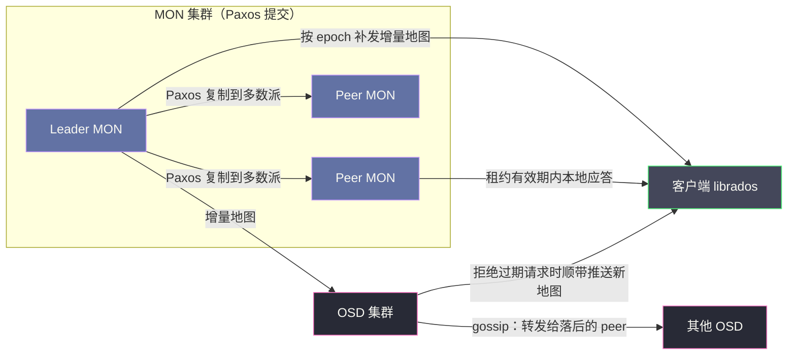
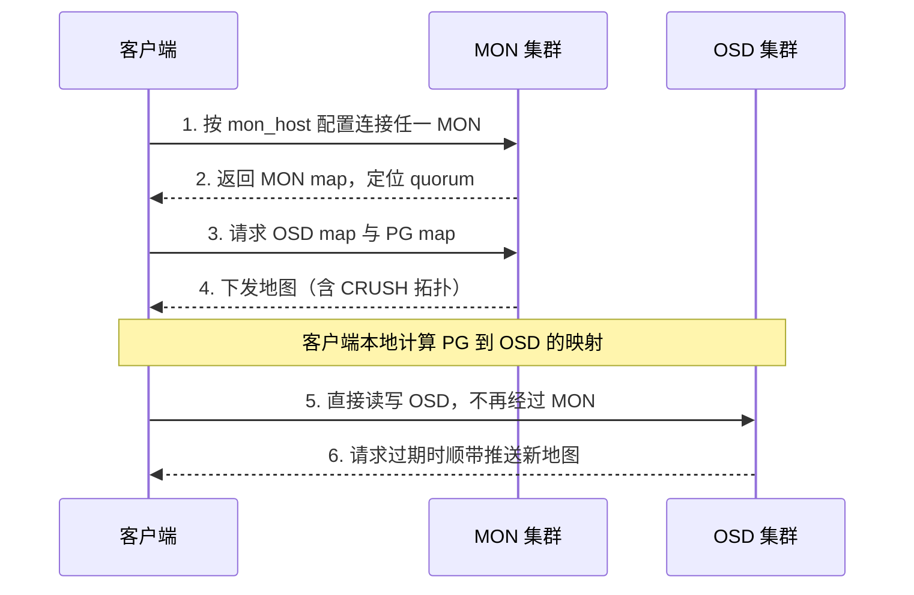
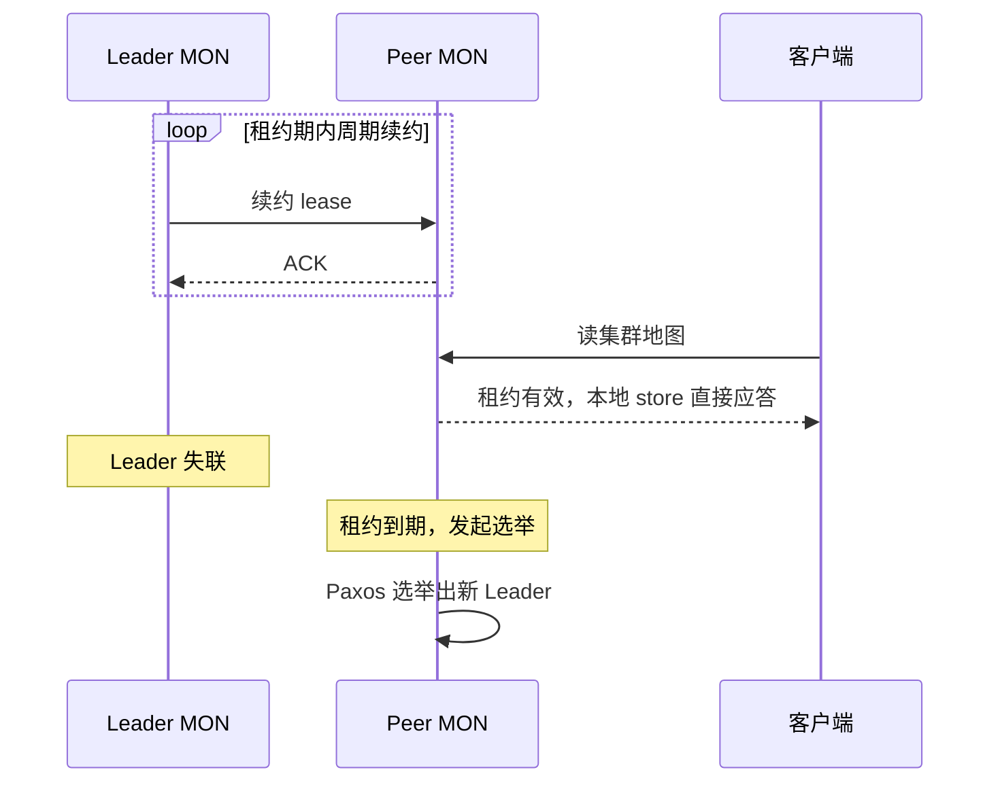

# 03 Monitor 与集群地图——Paxos、Quorum 与 MON 运维

**摘要：**

[[中间件/Ceph/02 CRUSH 算法——去中心化的数据放置|上一篇]]讲清了数据放置如何做到"不查表"，但一个更根本的问题被我们留到了现在：CRUSH 是纯计算，计算总得有输入——集群的拓扑、OSD 的生死、放置组（Placement Group，PG）的归属，这些状态由谁维护、由谁发布、又如何保证一致？本文围绕 Monitor（MON）回答两个问题：其一，MON 凭什么可以不在数据路径上，却依然是集群的第一优先级组件；其二，MON 集群如何用 Paxos 与租约（Lease）在一致性与可用性之间取衡，以及运维上如何守住这张"集群地图"。行文从设计动因讲到五张地图与 epoch 版本机制，再深入 Paxos、法定人数（Quorum）与 lease 的取舍，最后落到 MON 运维实战、标志位体系与故障恢复场景。

---

## 第 1 章 为什么需要 Monitor——拓扑总要有人维护

### 1.1 被我们略过的那个问题

2007 年，Sage Weil 在 UC Santa Cruz 完成博士论文，同年在 PDSW 研讨会上发表了 RADOS 论文，为 Ceph 奠定两块基石：一是 RADOS（Reliable Autonomic Distributed Object Store）这个自治的分布式对象存储层，二是后来被无数文章称道的 CRUSH 数据放置算法。有意思的是，论文里着墨最多的是数据如何分布、如何自愈，而"集群状态由谁维护"这个问题的答案，只占了很小的篇幅——一个被称为 monitor cluster 的小型组件，用 Paxos 维护集群地图。

这个详略安排本身就是一种表态：在 Ceph 设计者眼里，集群状态服务是"不得不有的东西"，应当被压缩到最小、推到数据路径之外。要理解这个表态，不妨先回答一个问题：CRUSH 把"查表"干掉了，可计算总得有输入——集群的拓扑本身，又是谁来记录、谁来发布的？

回顾 [[中间件/Ceph/02 CRUSH 算法——去中心化的数据放置|02 CRUSH 算法]]：客户端拿到 PG ID 后，用 CRUSH 算法沿拓扑树选出 OSD 列表，全程纯计算。但那棵树不是凭空存在的——哪台主机在哪个机架、哪个机架在哪个机房、每块盘的权重是多少、哪些 OSD 此刻 up 而哪些 down，这些事实必须有人记录，而且记录必须权威、必须一致。你不妨想象一座没有测绘局的城市：每个司机都揣着一套自己的地图，修路封路无人通报，用不了几天交通就会瘫痪。**CRUSH 是司机脑中的导航算法，而 MON 就是那座测绘局——它不运一吨货，但没有它，所有导航算法都失去了输入。**

### 1.2 中心化元数据服务的老路

"集群状态需要一个权威记录者"，这个需求并非 Ceph 独有。HDFS 的答案是 NameNode：整个文件系统的目录树、每个文件的块列表、每个块落在哪些 DataNode 上，全部存在 NameNode 的内存里。客户端每次打开一个文件，都要先问 NameNode 拿块位置，然后才去 DataNode 读数据（详见 [[大数据/Hadoop/HDFS/02 HDFS 整体架构全景——NameNode、DataNode 与 Client 三角关系|HDFS 整体架构]]）。

严格说，NameNode 也不在"数据流"上——文件内容的传输是客户端与 DataNode 直连的。但它卡在每一次 IO 的元数据环节上：打开文件要问它，写满一个块要问它分配新块，它一挂，所有新 IO 立刻停摆。HDFS 后来用 QJM（Quorum Journal Manager）给 NameNode 做了主备高可用（见 [[大数据/Hadoop/HDFS/06 NameNode 高可用——QJM 协议与 Active-Standby 切换机制|NameNode 高可用]]），但那是对"单点"做补救，而不是消灭单点——主备切换有窗口，切换期间元数据服务不可用，NameNode 的内存天花板也依然限制着集群规模。

Ceph 的选择不同：不是给中心节点做高可用，而是把中心节点从数据路径上彻底移走。客户端不是"每次 IO 查一次位置"，而是"持有完整地图，自己算位置"；MON 不是"每次 IO 的必经节点"，而是"地图变更时的必要节点"。这两个差别看似只是查询频率的量级之差，实际是架构的分野——前者决定了元数据服务的负载与 IO 吞吐正相关，后者把它解耦成只与"状态变化频率"相关。

把两者的定位差异摆到一张表里看更清楚：

| 维度 | HDFS NameNode | Ceph MON |
| :--- | :--- | :--- |
| 数据放置决策 | 查表：客户端每次打开文件都问 NameNode 要块位置 | 计算：客户端持地图本地跑 CRUSH |
| 元数据查询频率 | 与文件打开/块分配次数成正比 | 与地图变更次数成正比，与 IO 吞吐无关 |
| 故障时的爆炸半径 | 无法打开任何文件，新 IO 全停 | 已接入客户端照常读写，控制面冻结 |
| 负载随集群规模 | 内存随文件数增长，规模天花板明确 | 基本不随数据量增长，只随抖动频率波动 |
| 高可用方式 | 主备切换（QJM），切换有窗口 | 多数派（Paxos），无切换动作 |
| 组件规格 | 大内存、高规格 | 小规格，但对磁盘延迟敏感 |

这张表里最扎眼的一行是"高可用方式"：NameNode 的 HA 是"给单点配替身"，切换瞬间元数据服务不可用；MON 的多数派是"没有替身概念，任何一台 leader 倒下，剩下的多数派直接继续工作"。前者是补救，后者是设计——这也是本篇想立住的第一个论点。

### 1.3 MON 的定位：控制面，不在数据路径上

把 MON 的职责摊开看，其实只有四件事：维护五张集群地图的权威副本；仲裁 OSD 的生死；给新客户端发放地图（引导，Bootstrap）；执行管理命令——建池删池、改 CRUSH、设置标志位，这些操作本质上都是"修改地图"。同样重要的是 MON 不做的事：不存一份数据、不转发一个 IO、不参与副本复制、不做数据恢复。

这个"不做清单"决定了 MON 的负载画像：它的压力与集群 IO 吞吐无关，只与集群状态变化的频率成正比。一块盘抖动、一个节点重启、一次扩容，才会让 MON 忙起来；业务侧每秒几十万次读写，MON 一概不知情。由此 MON 的规格可以很小——几 GB 内存、几个 CPU 核就够用——但它对磁盘延迟敏感，原因我们到第 3 章讲 Paxos 提交时再展开。

MON 的第二项职责值得单独说：仲裁生死是一件必须慎重的事。OSD 之间互相发送心跳，某台 OSD 发现邻居失联后上报 MON，但 MON 不会轻信一家之言，而是汇总多方证据、等待超时（`mon_osd_report_timeout`，默认 900 秒）才裁定 down；裁定 out（把失联者移出数据分布）更加保守，甚至有一条硬性保险——`mon_osd_min_in_ratio`（默认 0.75）规定，当集群中 in 状态的 OSD 比例跌破 75% 时，MON 拒绝继续标记 out。为什么要这么谨慎？因为标错一个 out，几百 GB 数据立刻开始向其他 OSD 搬运；标错一串 out，全集群数据洗牌。**测绘局同时还是裁判所，而裁判的每一次误判，代价都是数据面的真金白银。**

### 1.4 不这样会怎样——一次反事实推演

要讲透 MON 的定位，笔者不妨做两次反事实推演。

第一次推演：假如 MON 像 NameNode 一样站在数据路径上会怎样？那么 MON 的负载将随 IO 吞吐线性增长，MON 集群不得不跟着数据面一起扩；MON 故障的爆炸半径是全集群停摆，而不是"控制面冻结"；CRUSH 去中心化的意义也就被架空——查表只是从 NameNode 换到了 MON，瓶颈原地踏步。Ceph 把 MON 移出数据路径，等于宣告：控制面的规模不必跟随数据面增长，三五个小节点就够服务上千个 OSD 的集群。

第二次推演反过来：假如干脆不要 MON 会怎样？拓扑无人记录，新客户端不知道该连谁；OSD 生死无人仲裁，一块盘坏了，它的副本永远不会被重建；两半网络各自为政时（脑裂，Split-brain），没有任何一方能裁定"我才是权威"——CRUSH 的输入失去唯一来源，不同节点各算各的，数据就写散了。由此可见，MON 不是可以省掉的组件，而是"去中心化"这个承诺的成本：**去中心化不是没有中心，而是把中心压缩到最小、并且挪出数据路径。**

MON 集群整体失联时的真实表现，恰好能验证这个设计的精妙：已经拿到地图的客户端照常与 OSD 读写，业务 IO 不中断；但集群同时失去一切演化能力——新客户端无法接入，OSD 故障无法确认，PG 停在降级状态无法恢复，扩缩容与管理命令全部无法执行。控制面冻结不等于数据面停摆，但控制面冻结会慢慢侵蚀数据面的健康：故障无人处理，降级的 PG 越积越多，冗余被一点点吃掉，下一次故障就可能击穿冗余。这就是为什么 MON 不参与数据路径，却依然是集群的第一优先级组件。

> [!info] 核心概念：控制面与数据面的分离
> MON 与 OSD 的分工可以概括为：MON 负责"世界是什么样的"（集群地图），OSD 负责"世界如何运转"（数据读写与恢复）。MON 故障不会立刻中断业务 IO，但会让集群失去对变化的响应能力——故障无法确认、恢复无法启动、扩容无法进行。判断一个组件是不是第一优先级，看的不是它挂了会不会立刻停业务，而是它挂了之后系统还能不能演化。MON 挂掉，集群就从"活的"变成"冻结的"，这是比停机更隐蔽的风险。

### 1.5 部署形态与资源规格——小而稳的组件

把上面的定位落到部署上，MON 的规格设计可以总结成三句话：数量按容错定，位置按故障域定，规格按延迟定。

数量按容错定，指的是 3 个还是 5 个只取决于"你能容忍几个 MON 同时失联"，与集群规模无关——上千 OSD 的集群用 3 个 MON、几十 OSD 的小集群用 5 个 MON，都是合理选择。位置按故障域定，指的是 MON 应当分散在不同机柜、不同供电回路甚至不同机房，避免"一个机柜断电带走两个 MON"这种一锅端的损失；同时尽量与 OSD 密集的节点分开，不与高 IO 组件抢同一块盘。规格按延迟定，指的是 MON 的 CPU 与内存需求很小（几 GB 内存、几个 CPU 核即可），但对磁盘延迟敏感——这个要求来自 Paxos 提交的持久化语义，第 3 章展开。

你不妨把 MON 想象成一家小而精的公证处：员工不多、办公室不大，但必须位于交通便利、供电稳定的地段，而且档案柜的抽屉必须顺滑——每次公证都要当场落笔存档，抽屉卡一下，排队的队伍就会越积越长。这个比喻的后半句，正是第 3 章与第 4 章要展开的主题：MON 的存储延迟如何决定整个控制面的响应速度。

---

## 第 2 章 cluster map 全集——五张地图与 epoch 版本

### 2.1 五张地图各管什么

上一章说 MON 维护"集群地图"，准确说是一套地图，共五张，各管一层：

| 地图 | 装什么 | epoch 何时递增 | 主要消费者 |
| :--- | :--- | :--- | :--- |
| MON map | MON 成员列表（名字、IP、端口）与选举状态 | MON 成员增减 | 所有组件——找到 MON 是一切的前提 |
| OSD map | 所有 OSD 的编号、地址、up/down、in/out、权重；内嵌 CRUSH map（拓扑与规则） | 任何 OSD 状态或 CRUSH 变化 | 客户端（计算放置）、OSD（互相寻址） |
| PG map | 各 PG 的版本、acting set、primary、健康状态 | PG 状态变化 | 客户端（确认该找哪个 OSD） |
| MDS map | MDS 成员与状态 | MDS 变化 | CephFS 客户端（见 [[中间件/Ceph/08 CephFS——MDS、多活元数据与实践边界|08 CephFS]]） |
| mgr map | Manager 守护进程成员与状态 | mgr 变化 | Dashboard、监控等管理工具 |

有一个细节值得点破：CRUSH map 在逻辑上是独立的一张图（拓扑树加规则），但在物理上它内嵌在 OSD map 里，随 OSD map 一起打包分发。你在 `ceph osd dump` 里能看到 CRUSH 信息，原因就在这里——所以严格说集群地图是"五张"，而不是"六张"。

五张地图里，OSD map 与 PG map 是理解数据路径的关键，值得多说两句。OSD map 回答"有哪些 OSD、它们活着吗、拓扑长什么样"——客户端做 CRUSH 计算用的就是它；PG map 回答"每个 PG 现在由哪组 OSD 负责、谁是 primary、状态健不健康"——客户端算出 PG 之后，还要靠 PG map 确认该把请求发给谁。两步合起来，才是完整的"数据该去哪"的答案：CRUSH 算出的是"应该在哪"，PG map 告诉你"现在在哪"。当两者不一致时（譬如故障后 CRUSH 结果已变、PG 尚未完成迁移），以 PG map 为准——这也是客户端请求偶尔被 OSD 拒绝并重定向的原因。

五张地图的分工，像一套分层的航海图：MON map 是"港口与导航台名录"，告诉你去哪里问路；OSD map 是"海图本体"，标清每条航道与水深（拓扑与权重）；PG map 是"实时航行动态"，告诉你这批货此刻由哪条船承运。客户端出海前把图配齐，之后自己导航，不必事事请示岸上。

### 2.2 epoch：地图的版次

地图会变，持有地图的人（客户端、OSD、MON 自己）就必须能判断"我手里这张是不是最新的"。Ceph 的办法朴素而有效：每张地图带一个单调递增的世代号（Epoch），每次变更加一，比较数字大小即知新旧——不问"你的地图新不新"，只问"你的 epoch 是多少"。

这个设计把"一致性"问题转化成了"版本号"问题。客户端发起任何请求都带着自己持有的 epoch；OSD 发现请求里的 epoch 落后，就把新地图附在响应里推回去；MON 收到查询，按 epoch 补发差量。没有人需要维护"谁手里的地图是新的"这张额外的表，版本号本身就是答案。

OSD map 的 epoch 是集群里变化最频繁的计数器之一：一块盘抖动一次，epoch 就涨一次；一次网络闪断让几十块盘集体抖动，epoch 一口气涨几十。长期运行的生产集群里，这个数字涨到数万乃至数十万并不罕见——它像树的年轮，忠实记录着集群经历过的每一次风吹草动。

### 2.3 地图如何传播——增量更新与 gossip

地图的传播有两条链路，一条从 MON 出发，一条在 OSD 之间横向流动：



第一条链路是官方渠道：地图变更经 Paxos 提交后，客户端与 OSD 向 MON 拉取增量。增量更新是这套机制的关键设计——客户端只报自己的 epoch，MON 只发缺失的那段差异（一条条 diff 记录），而不是每次都发全量地图。几千个 OSD 的集群，全量 OSD map 本身就有可观的体积，若每次抖动都全量推送，MON 的带宽与 CPU 都会被地图分发吃掉。只有当对端落后太多（增量链条太长）或初次接入时，才退化为全量同步。

第二条链路是 OSD 之间的 gossip：一个 OSD 拿到新地图后，会主动转发给还没跟上的 peer，让地图在数据面内部扩散，MON 只需要喂给少数几个节点。还有一条更巧妙的"便车"路径：客户端拿着旧 epoch 的请求打到 OSD，OSD 拒绝时会顺手把新地图附在响应里——控制面信息搭着数据面的顺风车完成了传播。这三条路径叠加起来，MON 的地图分发压力被摊薄到近乎忽略不计，这正是"MON 可以很小"的另一半原因。

> [!note] 设计哲学：地图即共识
> MON 集群内部用 Paxos 保证"同一时刻只有一张权威地图"，对外用 epoch 让每个持有者都能自行判断新旧——共识的成果被打包成"可增量分发的版本化快照"。这个"共识 + 版本号 + 增量分发"的三件套，是控制面设计里非常值得借鉴的一手：共识解决权威性，版本号解决可比较性，增量分发解决规模化传播。三者缺一，要么退回查表模式，要么陷入"各自持有过期地图"的混乱。

### 2.4 客户端引导流程

把五张地图和传播链路串起来，一个客户端从零接入集群的完整流程如下：



初始地址从哪里来，取决于部署形态：传统方式写在 ceph.conf 的 `mon_host` 里；较新版本支持通过 DNS SRV 记录发现 MON；Kubernetes 场景下则封装在外部集群的 secret 中。无论哪种，这里都藏着一个容易被忽略的依赖：**客户端至少要"猜中"一个还活着的 MON 地址才能完成引导**——这就是为什么 MON 的地址变更需要同步更新到所有客户端配置，也是为什么第 4 章会强调 MON 扩缩容后要检查配置一致性。

引导完成之后，客户端与 MON 的联系退化为低频的地图增量同步，IO 全部直连 OSD。地图的更新时机主要有三个：一是收到 OSD 的拒绝响应时，响应里附带了更新的地图；二是客户端周期性地向 MON 询问增量，兜住那些没有触发拒绝的静默变化；三是连接重建时（譬如 MON 或 OSD 集群发生过抖动），重新对齐 epoch。三个时机共同保证客户端手里的地图"最终"跟上权威版本，而在这个最终一致的过程中，CRUSH 的确定性计算保证了新旧地图的使用者不会把数据写到互相看不见的地方——顶多是被 OSD 拒绝后重试。

你可以把这条引导流程读成 Ceph 架构的缩影：MON 只在"进门前"和"地图过期时"出现，进门之后的世界，由 CRUSH 与 OSD 自治。

---

## 第 3 章 MON 集群与 Paxos——共识、租约与存储演进

### 3.1 为什么必须奇数个

MON 自己也是一个分布式系统：五张地图的每一次变更，都要在 MON 集群内部达成一致。这个问题正是分布式共识问题的教科书场景——多副本状态如何在异步网络中保持一致。Lamport 在 1989 年写成、1998 年正式发表的《The Part-Time Parliament》给出了 Paxos 算法，2001 年又用《Paxos Made Simple》把它重写到常人能读懂的程度（算法细节见 [[分布式架构/分布式系统原理与协议/04 Paxos 算法原理深度解析|Paxos 算法原理深度解析]]）。Ceph 的 MON 集群就是 Paxos 的一个工程实例：地图变更必须经过多数派确认才算生效。

"多数派"（Majority）的数学含义是 quorum = n/2 取整加一，由此推出 MON 数量的选择依据：

| MON 数量 | quorum 大小 | 容忍故障数 | 点评 |
| :--- | :--- | :--- | :--- |
| 1 | 1 | 0 | 单点，活着就能用，挂了全瘫 |
| 2 | 2 | 0 | 比 1 更差：多花一台的钱，任何一台失联即丢 quorum |
| 3 | 2 | 1 | 最小的高可用配置，生产默认起点 |
| 4 | 3 | 1 | 容错与 3 相同，白白多一台的写延迟与运维成本 |
| 5 | 3 | 2 | 跨机柜/机房部署时的推荐配置 |

这张表解释了"为什么必须奇数"的真正原因——不是奇数有什么魔力，而是**偶数不增加容错却增加成本**。2 台 MON 挂一台就丢 quorum，可用性反而不如 1 台（1 台至少活着就能用）；4 台与 3 台的容忍度相同，却多付一台的代价。偶数还有一个隐性陷阱：4 台 MON 网络对半分区成 2+2 时，谁也凑不出多数派，集群僵死——这比"少数派安静退出"更难排查。打个比方，MON 集群像董事会，重大决议必须过半数董事到场签字；偶数董事会迟早遇到 2:2 的僵局，决议谁也批不了。

不过奇数也不是越大越好。每次地图提交都要等多数派确认，MON 数量增加，提交的往返成本与磁盘 fsync 次数随之上升；而 MON 数量本该由容错需求决定，与集群规模无关——这条在第 1.5 节已经说过，此处从共识的角度再补一层：多数派协议的写放大随成员数线性增长，MON 每多一台，每次提交就多一份持久化与一次往返。cephadm 在主机充足时默认部署 5 个，图的是一个省心的默认值；资源敏感的小集群收回 3 个，也完全站得住。

### 3.2 写路径：每次变更都是一轮 Paxos

MON 集群上的所有状态变更——一块 OSD 被标 down、一个 Pool 被创建、一条 CRUSH 规则被修改、一个标志位被设置——都走同一条路：请求先到 leader，leader 发起提案，过半数 peer 接受（accept），提交（commit）后写入本地 store，然后对外生效。Ceph 的实现是自研 Paxos（源码在 src/mon/Paxos.cc），每个 MON 同时扮演 proposer、acceptor、learner 三种角色，省去了角色分配的复杂度。

这条路径有两个工程后果。其一，每次提交都要持久化到磁盘，MON 的磁盘延迟直接决定控制面的响应速度——MON 盘慢，OSD 标记、地图分发、管理命令全都慢，表现为集群"反应迟钝"。其二，leader 是写路径的必经点，leader 失联时，peer 检测到租约过期便发起选举，选举期间 MON 集群拒绝服务（读也不行，原因见下一节）；选举完成后，Paxos 从中断的提案处继续，已提交的状态不会丢失。

再往实现层看一步，Ceph 的每轮提案其实分读、写两个阶段：leader 先做一轮"读"，把所有 peer 已接受的状态同步过来，确认没有遗漏前任 leader 留下的半成品提案；然后才发起"写"，让多数派接受新变更。两阶段各是一次多数派往返，这就是 MON 上一次状态变更的延迟下限——也是为什么 MON 数量越多、磁盘越慢，管理操作越迟钝。值得一提的是，纯异步模型中确定性共识无法保证终止（FLP 不可能定理，见 [[分布式架构/分布式系统原理与协议/03 FLP 不可能定理与共识问题|FLP 不可能定理]]），所以一切工程化的 Paxos 都依赖超时与重试兜底，MON 的租约与选举超时正是这一妥协的具体体现。较新版本还引入了 connectivity 选举策略（按连接质量选 leader，Pacific 版本起提供），让跨机柜部署时选出的 leader 更"近"一些。

### 3.3 lease 机制：读为什么可以不走多数派

写走多数派没有争议，真正的精妙处在读。设想如果每次读地图都要凑齐多数派，MON 集群的读吞吐会被 quorum 往返死死拖住，"轻量控制面"的定位也就无从谈起。Ceph 的解法是租约（Lease）机制：



leader 向每个 peer 发放租约，租约有效期内，peer 可以直接用本地 store 回答读请求，不必询问 leader，更不必凑多数派。默认参数下，租约时长 5 秒（`mon_lease`），续约周期为其 0.6 倍即 3 秒，若 2 倍即 10 秒内未收到确认则判定 leader 失联。leader 失联后，租约自然过期，peer 们发起选举，期间读服务短暂中断——这就是租约换来的故障切换窗口。

本地读为什么是安全的？因为租约本质上是 leader 的一句承诺："在我续约或租约过期之前，不会有绕过我提交的新状态。"只要这句承诺成立，peer 本地的已提交状态就是全集群最新的已提交状态，读它等价于读权威。你不妨把租约想象成董事长开给各位董事的授权书：授权有效期内，董事可以自行答复客户的查询，不必每次开会；授权一到期，一切答复作废，必须重新开会选出新董事长。**lease 是用"时间窗口"换"读路径的多数派开销"——窗口内的读是零共识成本的，代价是 leader 故障后要等窗口关闭。**

这个取舍的两端都可以推演：租约调长，续约消息变少、读路径更稳，但 leader 故障后读服务的中断窗口拉长；租约调短，故障切换更快，续约流量上升，时钟稍有不稳就可能出现租约震荡。Ceph 选择了秒级（默认 5 秒），与 Google Chubby 的工程经验同源——Chubby 团队在 2006 年的 OSDI 论文中披露了用租约支持本地读的做法，2007 年的《Paxos Made Live》报告将其总结为 Paxos 工程化的标准动作之一。可见"读走租约、写走多数派"不是 Ceph 的发明，而是共识系统工程化的通用范式，Ceph 把它用在了集群地图这个最合适的位置上。

从客户端视角看，这套机制意味着：读地图可以打到任意一台 MON，拿到的是租约保护下的最新已提交状态；写地图（管理命令）则必须找到 leader，没有捷径。运维上的对应现象是——MON 集群抖动、租约过期重建的几秒钟里，客户端读地图可能短暂失败后重试成功，而已建立的 IO 会话几乎无感；如果客户端频繁报"连不上 MON"，先别急着查网络，看看是不是 MON 集群在反复选举。

### 3.4 MON store 演进：从 LevelDB 到 RocksDB

地图要持久化，持久化就要选存储引擎。MON 的 store 演进是一条清晰的时间线：早期版本用 LevelDB——Google 2011 年开源的 LSM-Tree 键值存储（见 [[中间件/Leveldb/00 专栏导览|LevelDB 专栏]]）；Luminous（12.2，2017）起默认切换为 RocksDB——2013 年 Facebook 基于 LevelDB 分叉、针对服务器级 SSD 与多核场景优化的后继者（演进脉络见 [[中间件/Leveldb/05 从 LevelDB 到 RocksDB——优化与演进|从 LevelDB 到 RocksDB]]），旧的 LevelDB 后端随后被弃用。

为什么这个切换值得单独立一小节？因为 MON 对存储引擎的敏感度远超一般组件。每次 Paxos 提交都要落盘，存储引擎的写放大直接决定控制面的延迟上限；地图版本不断累积又不断清理（trim），读写混合的负载形态对 KV 引擎的 compaction 策略相当挑剔。RocksDB 在 SSD 上的写吞吐与可调优性明显优于老迈的 LevelDB，这次切换让 MON 在大集群频繁抖动时稳了很多。无独有偶，BlueStore 也选择 RocksDB 存放对象元数据（见 [[中间件/Ceph/04 OSD 与 BlueStore——存储引擎深度解析|04 OSD 与 BlueStore]]）——在 Ceph 的世界里，RocksDB 是"元数据引擎"的标准答案，MON 与 OSD 只是先后采用了它。

> [!warning] 生产避坑：MON 盘的延迟是控制面的地板
> MON 的规格要求可以总结为一句话：算力和内存可以小，磁盘延迟不能大。把 MON 与高负载 OSD 放在同一块盘上、或放在过载的虚拟机上，Paxos 提交的 fsync 延迟会拖长租约确认，轻则 clock skew 告警频发，重则选举震荡、quorum 反复重建。生产环境的 MON 应当使用独立的 SSD 或 NVMe，并与高 IO 组件物理隔离——这是花小钱办大事的典型位置。

---

## 第 4 章 MON 运维实战——诊断、时钟、磁盘与扩缩容

### 4.1 诊断三板斧

MON 出问题时的第一反应，应当是确认 quorum 状态而不是重启进程：

```bash
# 第一板斧：quorum 是否完整、leader 是谁
# 命令本身挂起或超时，本身就是"quorum 丢失"的信号
ceph quorum_status -f json-pretty

# 成员概览与地图内容
ceph mon stat
ceph mon dump

# 单个 MON 进程视角：同步状态、store 情况
ceph daemon mon.a status
ceph daemon mon.a sync_status
```

`quorum_status` 的输出里能直接看到 quorum 成员列表与 leader 是谁；如果命令长时间挂起，说明连多数派都凑不齐，此时 `ceph health` 之类的命令同样会挂起——**命令挂起不是工具坏了，而是集群在告诉你控制面已经冻结**。配合 `ceph health detail` 中 MON 相关的告警条目与 `/var/log/ceph/` 下的 MON 日志，绝大多数 MON 问题可以定位到"磁盘、时钟、网络、内存"四类之一。

常见的 MON 相关告警与第一动作可以整理成一张速查表：

| 告警 | 含义 | 第一动作 |
| :--- | :--- | :--- |
| `mon.<id> (no quorum)` 或命令挂起 | 该 MON 不在多数派中，或 quorum 整体丢失 | `quorum_status` 确认缺口，查该 MON 日志与磁盘 |
| `clock skew detected on mon.<id>` | 时钟偏差超过阈值 | 检查 chrony/NTP 与链路延迟（见 4.2） |
| `mon.<id> store is getting too big` | store 膨胀 | 确认 quorum 完整性，手动 compact（见 4.3） |
| `mon.<id> has low disk space` | MON 盘水位低于告警线 | 清理或迁移，别等写满（见 4.3） |
| 选举频繁（`mon stat` 中 election epoch 快速增长） | MON 间网络或延迟不稳 | 查 MON 间链路、时钟与磁盘延迟 |

这张表的用法是"由表及里"：告警告诉你哪个方向出了问题，日志与进程状态告诉你为什么。四类根因里，磁盘与时钟占了大头，而且两者会互相伪装——磁盘慢会表现为租约迟到，看起来像时钟问题；时钟乱会表现为续约超时，看起来像磁盘问题。排查时先看日志里的时间线，再下结论。

### 4.2 clock skew：成因与处置

clock skew（时钟偏差）是 MON 运维中最常见的告警之一：`HEALTH_WARN: clock skew detected on mon.b`。它的机制值得说透——MON 之间的租约续约依赖消息往返，时钟偏差叠加网络延迟会让续约消息"看起来迟到"；偏差超过 `mon_clock_drift_allowed`（默认 0.05 秒）就触发告警，严重时 MON 被移出 quorum，甚至引发选举震荡。

成因通常有三类：时间同步服务（chrony/NTP）失效或指向了不同上游；MON 跑在虚拟机上，暂停恢复导致时钟漂移；MON 跨机房部署，链路延迟高，延迟被误判为钟差。处置的优先级也按此排列：所有 MON 指向同一组时间源；虚拟机安装时钟同步代理或改用物理机；MON 尽量同机房部署——MON 之间要求低延迟，跨数据中心的延伸集群（stretch cluster）是专门设计的高级形态，绝不能简单把三个 MON 扔进三个机房了事。确实收不紧时才放宽 `mon_clock_drift_allowed`，但要清楚那是治标：阈值放宽只是让告警闭嘴，租约机制的稳定性并没有变好。

在笔者看来，一支节拍不齐的乐队是贴切的类比：指挥的拍点本身没错，但各乐手对"现在几点"的感知不一致，合奏就会乱。租约的续约节奏依赖的正是"大家的时间感一致"——这也是为什么时钟同步在 MON 运维中的地位，比在一般服务里高得多。

### 4.3 MON 磁盘满：store db 膨胀的扩容与迁移

MON store 的膨胀机制值得每个运维者理解：正常情况下，MON 会清理过期的地图版本（trim），但清理需要 quorum 配合——quorum 不完整时，旧版本无法回收，数据只进不出。于是出现一个反直觉的连锁反应：MON 挂得越久、越多，幸存 MON 的 store 越膨胀；而 store 膨胀又让 MON 更慢、更容易挂。膨胀最常见的推手是 OSD flapping（反复 up/down）——每抖一次，OSD map epoch 涨一次，地图版本就多存一份。

处置按顺序走四步：

```bash
# 1. 确认占用：MON 数据目录与 store.db 的大小
du -sh /var/lib/ceph/mon/ceph-*/store.db

# 2. 手动压缩 KV 存储，回收空间（对正在运行的 MON 安全）
ceph daemon mon.a compact

# 3. 治本：消除 flapping（检查交换机、网卡、电源），恢复完整 quorum
#    quorum 完整后 trim 恢复工作，store 才能自动瘦身

# 4. 仍不够则迁移：cephadm 下先加新 MON、稳定后摘旧 MON（先加后减）
ceph orch apply mon "host2,host3,host4"   # 新盘上的主机入列
# 等待 quorum 稳定、健康恢复后，从列表移除旧 MON 所在主机
```

监控上要盯住 MON 数据盘的可用空间，`mon_data_avail_warn`（默认 30%）给出的告警阈值是最后一道防线——但更好的做法是把 MON 盘水位纳入独立告警，别等到 30% 才知道。预防端还有两个抓手：一是盯 OSD map epoch 的增长速度，正常集群里它是平缓爬升的，一旦出现陡增，几乎必然意味着有 OSD 在 flapping，趁早处理比等 store 膨胀再收拾便宜得多；二是盯 quorum 完整性告警，任何一台 MON 掉出 quorum 都值得当天处理——它不只是"少了个冗余"，还在悄悄阻止全集群的地图清理。

还要强调一层：**MON 盘满从来不是"MON 自己的问题"**——store 写不进去，Paxos 提交失败，全集群的状态变更（OSD 标记、地图分发、管理命令）全部卡死，数据面随后也会因为故障无法处理而慢慢劣化。

### 4.4 MON 扩缩容：ceph orch apply mon

cephadm 把 MON 管理做成了声明式：你声明"MON 应该在哪些主机上"，编排器负责收敛：

```bash
# 声明式调整：直接改目标主机列表（注意保持奇数）
ceph orch apply mon "host1,host2,host3"

# 临时追加一台
ceph orch daemon add mon --placement=host4

# 缩容：从 placement 列表移除，或直接删除 daemon
ceph orch daemon rm mon.host4
```

手工部署的老集群则繁琐得多：加一台 MON 要走"准备数据目录、用 monmap 初始化（`ceph-mon --mkfs`）、启动守护进程、`ceph mon add` 登记"四步，之后还必须同步更新所有客户端 ceph.conf 里的 `mon_host` 与 `mon_initial_members`、分发新的 keyring——漏掉任何一步，都会留下"新客户端引导失败"的隐患（回忆第 2 章的引导流程：客户端至少要猜中一个活着的 MON）。cephadm 的价值在这里体现得很直白：它把这四步连同配置分发全部封装掉，你只面对一个主机列表。无论哪种方式，纪律是同一条：**一次只动一台，等 quorum 稳定、健康告警清零，再动下一台**；缩容完成后确认剩余数量为奇数、且仍满足容错目标。

扩缩容的决策依据也值得说清。扩 MON 的理由是容错与故障域：MON 应当分散在不同机柜甚至不同机房供电域下，避免"一个机柜断电丢掉两个 MON"；缩 MON 的理由是成本：5 个 MON 的写放大对小集群是纯负担，3 个足够。唯独不要因为"集群变大"而扩 MON——MON 的负载与数据量无关，这条在第 1 章已经论证过。

### 4.5 关键配置清单

| 配置 | 默认值 | 作用 | 运维建议 |
| :--- | :--- | :--- | :--- |
| `mon_allow_pool_delete` | false | 是否允许删除 Pool | 保持 false；删除时临时开启，删完立即关回 |
| `mon_osd_min_in_ratio` | 0.75 | in 比例低于该值时拒绝继续标 out | 保持默认，这是防止误杀全集群的保险 |
| `mon_osd_report_timeout` | 900 | OSD 失联多久可被上报判定 down | 网络抖动大的环境谨慎调小 |
| `mon_clock_drift_allowed` | 0.05 | 时钟偏差告警阈值（秒） | 优先修时间同步，而非放宽阈值 |
| `mon_data_avail_warn` | 30 | MON 盘可用空间告警百分比 | 纳入独立监控，别等告警才看 |
| `mon_lease` | 5 | 租约时长（秒） | 一般不动；跨高延迟链路部署时重新评估 |

这张表里最值得展开的是 `mon_allow_pool_delete`。删除 Pool 意味着其中所有数据不可逆消失，所以新版本默认把这条保险栓关上；需要删除时，临时开启配置执行删除，然后立刻关回。与之配套的还有命令行的双重确认参数——两道锁锁的是同一件事：**让"删除一个 Pool"这类不可逆操作，必须同时跨过配置与命令两道门槛，防止脚本里的一个变量错误清空整个池子。**

### 4.6 MON 的监控指标与告警设计

运维实战的最后，把 MON 应当纳入监控的指标整理成一份清单。MON 的指标可以从两个来源取：Prometheus exporter 暴露的 MON 指标，与 `ceph daemon mon.<id> perf dump` 里的运行时计数器。

| 指标 | 看什么 | 异常意味着什么 |
| :--- | :--- | :--- |
| quorum 成员数 | 是否始终等于 MON 总数 | 有 MON 掉队，冗余在消耗 |
| Paxos 提交延迟 | 状态变更的耗时趋势 | 磁盘延迟劣化，控制面变迟钝 |
| lease 续约状态 | 是否频繁过期重建 | MON 间网络或时钟不稳 |
| store.db 大小与增速 | 是否持续膨胀 | flapping 风暴或 trim 失效 |
| OSD map epoch 增速 | 抖动频率的代理指标 | 陡增即有 OSD 在反复上下线 |
| MON 盘水位 | 可用空间百分比 | 逼近 `mon_data_avail_warn` 阈值 |

设计告警时的取舍值得一提：quorum 成员数与 MON 盘水位应当是"立即告警"级别——前者是可用性边界，后者是不可逆故障的前夜；而 epoch 增速与 store 大小更适合"趋势告警"——它们是慢性病指标，单点读数没有意义，斜率才有意义。把这两类告警混在一个级别里，结果要么是告警疲劳，要么是慢性病拖成急症。监控体系的具体搭建（exporter 部署、指标口径、告警规则）在 [[中间件/Ceph/12 监控告警体系——Prometheus exporter 与关键指标|12 监控告警篇]] 中有更完整的展开，此处只立 MON 视角的原则。

---

## 第 5 章 标志位体系——维护窗口的挂牌制度

### 5.1 十个标志位逐个说

Ceph 提供一组全局标志位（Flag），用于在维护窗口期间暂时关闭集群的某些自动行为。它们通过 `ceph osd set <flag>` 与 `ceph osd unset <flag>` 操作，逐个的语义、典型场景与风险如下：

| 标志位 | 语义 | 典型场景 | 挂着不管的风险 |
| :--- | :--- | :--- | :--- |
| `noout` | 不把失联 OSD 标 out（不触发向其他 OSD 的数据迁移） | 节点重启、换盘 | 真故障不处理，降级堆积，再坏一块可能丢数据 |
| `nodown` | 不把 OSD 标 down | 极少使用 | 掩盖真实故障，MON 心跳仲裁被架空 |
| `noup` | 不允许 OSD 标 up | 控制维护后 OSD 逐批回归 | 忘记 unset，OSD 永远起不来 |
| `noin` | OSD 可以 up 但不许 in | 分批回归数据面 | 同上，容量虚高 |
| `norebalance` | 暂停 CRUSH 变化引发的迁移（不影响故障恢复） | 扩容、调权重窗口 | 新盘空转，数据分布不均 |
| `norecover` | 暂停降级副本的恢复 | 业务高峰保护 IO | 降级窗口拉长，冗余裸奔 |
| `nobackfill` | 暂停 backfill（全量重映射恢复） | 同上 | 恢复欠账越滚越大 |
| `noscrub` | 暂停轻量校验（scrub） | 业务高峰 | 校验欠账累积 |
| `nodeep-scrub` | 暂停深度校验（deep scrub） | 业务高峰 | 静默错误无人发现 |
| `pause` | 暂停全部客户端 IO | 冻结现场排障 | 忘记 unset，全集群"存储故障" |

查看当前生效的标志位用 `ceph osd dump | grep flags` 或 `ceph health detail`——后者会把已设置的标志位直接列在健康告警里。要特别注意一点：**标志位是集群级的，set 一次影响整个集群**，不存在"只对某台 OSD 生效的 noout"；想精细控制单台 OSD 的进出，用的是 `ceph osd out` / `ceph osd in` 这类针对具体 OSD 的命令，两者不要混为一谈。

单看每个标志位的语义只是入门，生产上更常用的是"按场景组合挂牌"。几个典型组合如下：

| 场景 | 建议挂牌组合 | 说明 |
| :--- | :--- | :--- |
| 节点重启 / 换盘 | `noout` | 最小干预，只防误标 out |
| 集群扩容 | `norebalance`（必要时加 `nobackfill`） | 先让新盘入列，错峰再迁移数据 |
| 业务高峰保护 | `noscrub` + `nodeep-scrub` | 暂停校验 IO，高峰过后恢复 |
| 大版本升级 | `noout` + `noscrub` + `nodeep-scrub` | 逐台滚动升级，减少并发干扰 |
| 紧急冻结排障 | `pause` | 核弹级，冻结现场，用完立即摘 |

组合的原则是"最小够用"：挂牌越多，掩盖的自动行为越多，摘牌后的补偿动作也越多。能用一个 `noout` 解决的维护，不要顺手把 `norecover`、`nobackfill` 一起挂上——每多挂一块牌子，都是在给未来的自己埋一笔要还的债。

### 5.2 标准维护操作序列

标志位体系里使用频率最高的是 `noout`，围绕它形成了一套标准的维护操作序列：

```bash
# 1. 先挂牌：防止维护期间的失联被当成永久离开
ceph osd set noout

# 2. 执行维护：停节点、换盘、重启（此间 OSD 会 down，但不会被标 out）

# 3. 确认 OSD 回归
ceph osd tree

# 4. 等 PG 全部回到 active+clean
ceph -s

# 5. 摘牌
ceph osd unset noout
```

为什么必须先挂 `noout`？回忆第 1 章的仲裁机制：OSD 失联超过判定时限就会被标 out，CRUSH 随即重算放置，数据开始向其他 OSD 搬运。换块盘、重启个节点，几分钟的"临时失联"若被当成"永久离开"，触发的是几十上百个 PG 的 backfill——你只是想换块盘，集群却搬了几百 GB 的家。`noout` 的价值正在于把"临时失联"与"永久离开"区分开：维护期间 OSD 照常被标 down（PG 会短暂降级，见 [[中间件/Ceph/05 PG 状态机与数据一致性——Peering、Recovery 与 Backfill|05 PG 状态机]]），但不会被移出数据分布，OSD 回来后一切如旧。


这套序列的完整流程如上：挂牌、维护、确认回归、等待干净、摘牌、复核。顺序不能乱——先维护后挂牌，数据搬家已经开始；维护完不摘牌，风险转入下一节所说的慢性积累。还有一个容易做错的判断点：摘牌的标准不是"OSD 起来了"，而是"PG 干净了"。OSD 进程 up 只说明服务在跑，PG 可能还在 peering 或恢复中；此时摘牌，后续若再有 OSD 抖动，集群会立刻把失联者标 out，等于白挂。正确姿势是等 `ceph -s` 里所有 PG 回到 active+clean、健康告警清零，再执行 unset。大规模维护（譬如一次升级半个机柜）则应当分批走完整个序列，而不是一口气挂一个超长窗口的 noout。

### 5.3 滥用的代价：noout 长期挂着会怎样

标志位最大的风险不是"不会用"，而是"挂上就忘"。笔者在不少事故复盘中见过同一条滑坡，以 `noout` 为例：一块 OSD 真的坏了，因为 `noout` 挂着，MON 不会把它标 out——它的数据继续占着 PG 的 acting set，这些 PG 永远停在 degraded 状态；集群容量统计里那块盘的份额还在，实际可用容量已经缩水，水位虚高，某天 nearfull/full 告警响起时你才发现"账面容量"是假的；更要命的是冗余已经击穿——此时同一故障域再坏一块盘，部分 PG 的全部副本同时消失，数据真丢。从"挂了个 noout 图省事"到"丢数据"，中间只隔一次运气不好的故障。

`norecover`、`nobackfill` 长期挂着是同构的滑坡：恢复欠账持续累积，unset 的那一刻，积压的恢复流量集中爆发，反而冲击业务。`pause` 忘记 unset 则最富戏剧性——全集群 IO 停摆，故障台上一片"存储不可用"，所有人排查网络、排查 OSD、排查客户端，最后发现根因是自己挂的牌。

> [!warning] 生产避坑：挂牌必须登记，摘牌必须清点
> 把标志位类比成电气检修的上锁挂牌制度（LOTO，Lockout/Tagout）：检修前挂牌上锁，防止别人误合闸——这是挂牌制度的价值；但每一块牌子都必须登记在册，检修完成后逐块清点摘除——忘了摘的牌子比没有牌子更危险，因为它让"保护机制"变成了"故障伪装"。落到 Ceph 运维上就是三条纪律：挂牌必须记录在变更单里并注明预期摘除时间；维护结束立即 `ceph osd unset` 并清点；把"存在 active 标志位"本身纳入监控告警，让忘摘的牌子自己浮出水面。

工程上还可以再加两道保险。其一，把挂牌与摘牌写进维护 runbook 的固定模板——runbook 的第一步永远是 `ceph osd set noout`，最后一步永远是 `ceph osd unset noout` 加清点，让流程本身携带纪律，而不是依赖执行者的记性。其二，能自动化的收尾就自动化：维护脚本在成功分支末尾自动 unset 并输出当前 flags，人工只负责确认输出——脚本不会忘事，人会。

---

## 第 6 章 MON 故障场景——从单点失联到全损重建

### 6.1 单 MON 故障：冗余的日常消耗

3 个或 5 个 MON 的集群挂掉一个，是运维中最不需要慌张的场景：quorum 完整，读写、仲裁、地图分发一切照旧，只是冗余下降了一档。处理动作也很平静：查 `/var/log/ceph/` 下的 MON 日志定位原因——磁盘满、目录权限、内存 OOM、端口冲突是四大常见根因；cephadm 环境下 `ceph orch daemon restart mon.<id>` 重启进程；确认修复不了就摘除重建（前提是剩余 MON 仍构成 quorum，重建的 MON 会从 quorum 同步全部地图）。

单 MON 故障的排查可以按"现象到根因"整理成一张清单：

| 现象 | 可能根因 | 第一动作 |
| :--- | :--- | :--- |
| 进程退出，重启后又退出 | 数据目录权限、磁盘满、配置错误 | 看日志末尾的报错行，`df` 查盘，查目录属主 |
| 进程在跑但不在 quorum | 时钟偏差、网络不通、store 损坏 | `quorum_status` 看缺口，`sync_status` 看同步 |
| 选举震荡、quorum 反复重建 | MON 间链路抖动或磁盘延迟过大 | 查 MON 间网络质量与磁盘 IO 延迟 |
| 内存持续上涨后 OOM | 地图版本堆积、flapping 风暴 | 先解决 flapping，再评估迁移扩容 |

单 MON 故障真正值得警惕的点在于"拖"：挂着一个不修，集群就长期运行在容错边界上，下一次故障就是第 6.2 节的场景。

### 6.2 quorum 丢失：双 MON 挂的表现与恢复

3 个 MON 挂掉 2 个，性质完全不同——quorum 丢失，控制面冻结。此时的集群表现是一组很典型的症状：所有 `ceph` 命令挂起直至超时；已经接入的客户端按旧地图继续读写，业务 IO 表面上"看起来没事"；新客户端无法完成引导；OSD 故障无法被确认，降级的 PG 无法恢复；任何管理操作（建池、扩容、set flag）全部无法执行。从各组件的视角细看：OSD 们仍在互相心跳、仍在服务已映射的 PG，只是它们上报的生死判定无人裁决，地图更新无人发布；librados 客户端对已有会话照常重试，新会话则在引导阶段反复失败。**数据面按旧地图惯性运转，控制面彻底停摆——这正是第 1 章反事实推演的现实版本。**

恢复的钥匙藏在多数派语义里：不需要把挂掉的两台都修好，修好任意一台即可恢复 quorum。所以处置的第一原则是"先修轻的"——两台故障里挑问题最轻的那台（比如只是磁盘满、进程退出），而不是按编号顺序死磕重的那台。若两台的 store 都已损坏、只剩一台幸存，单台无法形成 quorum（它会一直等待 peer），此时需要借助官方的恢复工具链：用 `ceph-monstore-tool` 从幸存 MON 的 store.db 中导出 monmap、keyring 与键值数据，据此重建第二台 MON，凑齐多数派。这套流程操作繁琐且容易出错，但它是"只剩一台"场景下的官方路径。

| 场景 | 集群表现 | 恢复动作 |
| :--- | :--- | :--- |
| 单 MON 失联（3/5 集群） | quorum 完整，功能无损，冗余降档 | 修复重启，或摘除重建 |
| 双 MON 失联（3 挂 2） | quorum 丢失，命令挂起，数据面按旧地图惯性运转 | 修复任意一台即恢复；优先修问题最轻的 |
| 幸存 MON store 损坏 | 重启无效，单台无法成 quorum | ceph-monstore-tool 导出数据后重建其余 MON |
| MON 全损 | 控制面彻底消失 | 从 OSD 侧地图副本重建（最后手段） |

### 6.3 MON 数据损坏的重建路径

MON 数据损坏的重建，按严重程度分三级。第一级：单个 MON 的 store 损坏但 quorum 仍在——直接摘除重建，cephadm 下 redeploy 或手工 `ceph-mon --mkfs` 后重新加入，地图从 quorum 全量同步回来，几乎无痛。第二级：quorum 丢失且部分 store 损坏——即上一节的 ceph-monstore-tool 导出重建路径。第三级：MON 集群全损——这是最后手段，思路是"从数据面反推控制面"。不妨把它想象成总档案馆失火后凭分馆抄本重编目录：每个 OSD 本地都保留着最近的地图副本，官方排障文档提供了基于 ceph-monstore-tool 的重建流程，从 OSD 的存储中提取地图与关键键值，重建出一个可用的 MON 集群；前提是 OSD 数据完好、且能拿到集群的 keyring。

第三级路径的存在本身就说明了一件事：**地图的权威副本在 MON，但地图的"抄本"散布在每一个 OSD 手里**——这与第 2 章的传播机制一脉相承，gossip 让抄本无处不在，全损时也就有了重建的原料。不过不要因为存在重建路径就放松警惕：全损重建是停机级别的操作，耗时且依赖对流程的熟练程度。真正的防线仍然是架构性的——按多数派部署 MON、分散故障域、把 MON 数据目录纳入备份。三个 MON 同时全损的概率，远低于"单点 MON + 一份备份"方案里"备份失效与单点损坏同时发生"的概率，这笔账在部署设计时就该算清。

> [!info] 恢复优先级：先保 quorum，再保新鲜
> MON 故障恢复的优先级排序是：先恢复多数派，再追求地图最新。一个"略旧但完整"的 quorum 意味着控制面立刻恢复工作——故障仲裁、地图分发、管理操作全部回来，地图版本很快会通过正常的变更流程追上来；而执着于抢救"最新"的那台 MON，只会让控制面多冻结一分钟，数据面就多劣化一分钟。这个排序背后的逻辑与第 5 章的挂牌纪律同源：控制面冻结的时间，才是最贵的成本。

### 6.4 把 MON 的可用性设计收拢成一份清单

六章讲下来，MON 的可用性设计可以收拢成一份部署与运维清单，交付前逐项打勾：

1. 数量为奇数（3 或 5），由容错需求决定，不随集群规模膨胀；
2. 成员分散在不同机柜、不同供电回路，跨机房部署要走专门的延伸集群设计；
3. 使用独立 SSD/NVMe，不与高负载 OSD 共盘；
4. 全部 MON 指向同一组时间源，clock skew 告警当天清零；
5. MON 盘水位与 store 大小纳入趋势告警，OSD map epoch 增速作为抖动的前哨指标；
6. MON 数据目录纳入备份，但防线主体是多数派架构本身；
7. 任何一台 MON 掉出 quorum 都当天处理，不让集群运行在容错边界上；
8. 标志位挂牌登记、摘牌清点，active flags 纳入监控。

这份清单没有一条涉及高深技巧，全是朴素纪律——但 MON 恰恰是那种"架构上已经替你想好了，运维上却总有人栽跟头"的组件。它平时安静得让人忘记存在，出事时又快得让人来不及翻文档；把纪律前置到部署与监控里，是唯一划算的应对。

---

## 参考资料

1. Ceph Documentation — Monitor 配置参考（mon-config-ref）：https://docs.ceph.com/en/latest/rados/configuration/mon-config-ref/
2. Ceph Documentation — Monitor 与 OSD 的交互（心跳、故障判定与报告）：https://docs.ceph.com/en/latest/rados/configuration/mon-osd-interaction/
3. Ceph Documentation — 添加与删除 Monitor：https://docs.ceph.com/en/latest/rados/operations/add-or-rm-mons/
4. Ceph Documentation — 故障场景处理（OSD 与 Monitor）：https://docs.ceph.com/en/latest/rados/operations/failure-scenarios/
5. Ceph Documentation — Monitor 排障（含 store 恢复流程）：https://docs.ceph.com/en/latest/rados/troubleshooting/troubleshooting-mon/
6. Ceph Documentation — cephadm 部署与主机管理：https://docs.ceph.com/en/latest/cephadm/
7. Sage A. Weil, Scott A. Brandt, Ethan L. Miller, Darrell D. E. Long. RADOS: A Scalable, Reliable Storage Service for Petabyte-scale Storage Clusters. PDSW 2007.
8. Sage A. Weil. Ceph: Reliable, Scalable, and High-Performance Dynamic Storage. UC Santa Cruz 博士论文，2007.
9. Leslie Lamport. The Part-Time Parliament. ACM Transactions on Computer Systems, 1998；Paxos Made Simple. 2001.
10. Tushar Chandra, Robert Griesemer, Joshua Redstone. Paxos Made Live — An Engineering Perspective. PODC 2007.

---

> [!note] 思考题
> 1. MON 不参与数据路径，MON 集群整体失联时已接入的客户端仍能照常读写。既然如此，为什么 MON 仍被视为第一优先级组件？请从"控制面冻结对数据面的慢性侵蚀"角度推演：quorum 丢失 24 小时后，集群会处于什么状态？
> 2. Ceph MON 的读请求在租约有效期内走本地 store，不必每次走多数派。如果租约时长从 5 秒改成 50 秒，读路径与故障切换各发生什么变化？反过来改成 0.5 秒呢？再进一步：如果 MON 之间时钟不同步，lease 机制可能出什么问题？
> 3. `noout` 挂了一周忘记 unset，期间一块 OSD 真的损坏。请推演数据面状态：PG 会处于什么状态、容量水位如何变化、此时同一故障域再坏一块盘会怎样？为什么"维护完忘记摘牌"是生产事故的常见根因？
