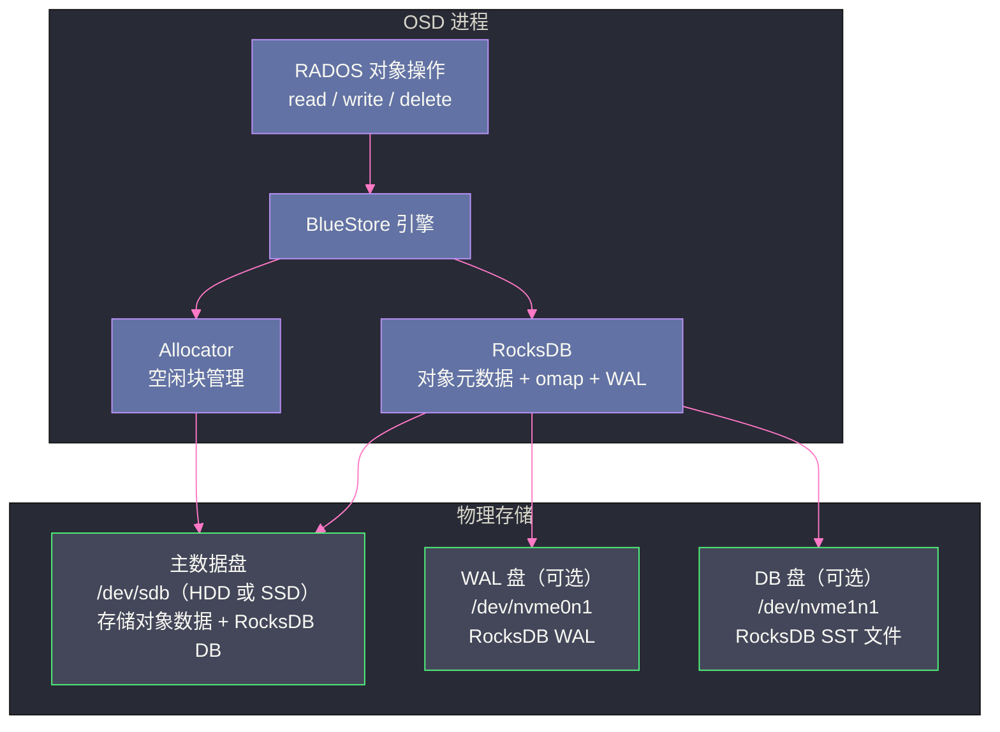

# 03 OSD 与对象存储——BlueStore 引擎

## 摘要

BlueStore 是 Ceph 从 Luminous 版本开始替代 FileStore 的新一代本地存储引擎，其核心设计是**绕过本地文件系统，直接管理裸块设备**。这一看似激进的决定，源于 FileStore 在处理 COW 文件系统时的双写问题、对象元数据查询性能瓶颈、以及异步写带来的数据安全隐患。本文深入剖析 FileStore 的历史局限，BlueStore 如何通过裸设备直管、RocksDB 元数据引擎、写时 CRC 校验和等机制，将 Ceph OSD 的写性能提升 1-2x，并实现更可靠的数据完整性保护。

---

## 第 1 章 FileStore 的历史局限——为什么要重写存储引擎

### 1.1 FileStore 的设计思路

在 BlueStore 出现之前，Ceph OSD 使用 **FileStore** 作为本地存储引擎。FileStore 的思路非常直觉：**复用操作系统的本地文件系统**（ext4、XFS、btrfs）来存储 RADOS 对象。

每个 RADOS 对象在 FileStore 中对应本地文件系统上的一个或多个文件：
- 对象数据（data）存储为文件内容
- 对象的小元数据（xattrs）存储为文件的扩展属性（Linux xattr）
- 对象的 omap 数据存储在一个专用的 LevelDB/RocksDB 数据库中

这种设计的直觉是：文件系统已经是久经考验的软件，不需要重新实现，只需在其上构建 RADOS 语义。

### 1.2 FileStore 的三大痛点

**痛点一：双写问题（Double Write）**

FileStore 使用一个**journal（日志）**实现事务语义——写操作先写 journal，journal 完成后再写数据文件。如果使用 XFS 等非 COW 文件系统，这个两步过程产生**双写**：数据被写两次（一次写 journal，一次写数据文件），实际写吞吐只有磁盘顺序写带宽的一半。

这个问题在机械硬盘时代就已存在，在 SSD 时代更加突出——SSD 的写寿命（P/E 次数）有限，双写显著缩短 SSD 使用寿命。

**痛点二：文件系统元数据开销**

FileStore 存储的 RADOS 对象最终是文件系统上的文件。当一个 Pool 中有数百万个对象（小文件）时，文件系统的目录层级、inode 表、目录项等元数据开销非常显著。

XFS 在处理大量小文件时，`ls` 一个包含百万文件的目录需要数秒，删除文件需要更新多个元数据结构。这些文件系统级别的开销在对象存储场景下完全是不必要的——RADOS 对象的"目录结构"和命名规则与文件系统完全不同。

**痛点三：校验和覆盖不完整**

FileStore 写数据时，先写 journal，journal 完成后异步（background）写数据文件。这个异步过程中：
1. 数据在 journal 中是正确的
2. journal 回放写数据文件时，如果发生磁盘故障或 bit rot，数据文件可能写入了损坏的数据
3. journal 写成功后就被认为"提交"，应用层看到的是成功

这意味着 FileStore 的数据校验只覆盖了写入 journal 这一步，journal → 数据文件的回放过程缺乏端到端的校验。

> [!note] 设计哲学
> FileStore 的这些问题，根源都在于**在已有的文件系统抽象之上构建另一个存储语义**。文件系统为通用场景设计，它的元数据结构（inode、目录、dentry）并不匹配 RADOS 的对象模型；它的可靠性机制（journal/WAL）不能完整覆盖 RADOS 的语义需求。
> BlueStore 的决策是：**不复用已有抽象，直接面向 RADOS 对象的需求设计**。付出的代价是实现复杂度大幅上升，但换来的是性能、可靠性、功能的全面提升。

---

## 第 2 章 BlueStore 的整体架构

### 2.1 直接管理裸设备

BlueStore 直接操作**裸块设备**（`/dev/sdb`、`/dev/nvme0n1` 等），不通过任何文件系统（不 mkfs、不 mount）。它在块设备上自己管理：

- **数据空间**：存储 RADOS 对象的数据（data），用自定义的 Block Allocator 管理空闲空间
- **元数据**：存储在内嵌的 RocksDB 中（对象名、Extent 映射、对象属性、omap 等）
- **WAL（Write-Ahead Log）**：可选地存储在独立的 NVMe 设备上（与数据盘分离）



### 2.2 三盘部署模式

BlueStore 将一个 OSD 的存储分为最多三个部分，可以分别放在不同的设备上：

**主数据盘（data）**：存储 RADOS 对象的实际数据（块数据）和 RocksDB 的 SST 文件（如果没有单独的 DB 盘）。通常使用 HDD 或 SATA SSD。

**DB 盘（可选）**：存储 RocksDB 的 SST 文件（元数据的冷数据）。如果不配置，SST 文件存储在主数据盘上。使用 NVMe SSD 可以大幅提升元数据查询性能（RocksDB 的 L0→L1 Compaction 也会受益）。

**WAL 盘（可选）**：存储 RocksDB 的 WAL（Write-Ahead Log）。WAL 是顺序写，对 IOPS 不敏感但对延迟敏感，用小容量 NVMe 即可。如果不配置，WAL 存储在 DB 盘或主数据盘上。

**典型的高性能部署**：

```
主数据盘：1 × 8TB HDD（存储冷数据）
DB 盘：1 × 512GB NVMe SSD（存储 RocksDB SST，通常 1 个 NVMe 对应 4-8 个 HDD OSD）
WAL 盘：与 DB 盘共用，或使用更小的 Optane NVMe
```

---

## 第 3 章 BlueStore 的写入流程

### 3.1 小写与大写的区分

BlueStore 对小写（< min_alloc_size，通常 4KB 或 64KB）和大写（>= min_alloc_size）采用不同的写入路径，这是一个重要的性能优化。

**min_alloc_size** 是 BlueStore 的最小分配单元：
- HDD 默认 64KB（HDD 的 4KB 随机写代价极高，64KB 顺序写效率更好）
- SSD 默认 4KB（SSD 随机写性能好）

### 3.2 大写路径（New Write Path）

对于写入大小 >= min_alloc_size 的写操作：

1. **分配新块**：通过 Allocator 在数据盘上分配新的空闲块（不覆盖旧数据，而是分配新位置）
2. **写数据到新块**：将数据写入新分配的块（异步，非 WAL）
3. **写 RocksDB WAL**：将"新块地址 → 对象 Extent 映射的更新"写入 RocksDB WAL（同步，确保持久化）
4. **数据写完后更新 RocksDB 元数据**：RocksDB 的 WAL 回放，更新 Extent 映射

这个流程消除了 FileStore 的双写问题：对象数据只写一次（直接写到最终位置），RocksDB WAL 只记录元数据变更（而不是数据本身），WAL 写入量极小。

### 3.3 小写路径（WAL Write Path）

对于小于 min_alloc_size 的写操作，如果直接按大写路径处理，会产生 Write Amplification（写放大）——4KB 的数据需要分配 64KB 的块，浪费 60KB 空间。

BlueStore 对小写使用 **WAL 写**路径：

1. 将小写数据**直接写入 RocksDB WAL**（RocksDB 本身是 append-only 的日志结构，WAL 写是顺序写，性能好）
2. WAL 在 RocksDB 的后台 Compaction 中最终合并到 SST 文件，或者在下次对同一块的大写时将 WAL 中的数据合并到数据块

这种方式对小写非常高效，但对读取有影响——读取时可能需要从 RocksDB 中读取 WAL 合并的数据，增加读路径的复杂度。

### 3.4 数据校验和（Checksum）

BlueStore 在**写入数据时计算 Checksum**，在读取时验证，实现端到端的数据完整性保护。这是 FileStore 不具备的能力。

Checksum 覆盖范围：
- 对象数据的每个 block（默认 4KB 或 64KB 粒度）
- Checksum 值存储在 RocksDB 中（与对象的 Extent 映射一起）

读取时，BlueStore 从磁盘读取数据，重新计算 Checksum，与 RocksDB 中存储的 Checksum 对比。如果不匹配，说明数据损坏（静默错误，磁盘未报告错误但数据实际已损坏），BlueStore 将尝试从其他副本读取正确数据。

支持的 Checksum 算法（可配置）：

| 算法 | 计算速度 | 检测能力 | 适用场景 |
| :--- | :---: | :---: | :--- |
| **none** | 最快 | 无 | 不需要数据完整性检查 |
| **crc32c** | 快（硬件加速） | 好 | 默认，推荐 HDD |
| **xxhash32** | 极快 | 好 | 推荐高速 SSD |
| **xxhash64** | 极快 | 更好 | 推荐 NVMe，高并发场景 |
| **sha1** | 慢 | 极好 | 有密码学安全需求时 |

> [!info] 核心概念：静默数据损坏（Silent Data Corruption）
> 磁盘（尤其是 HDD）存在一种故障模式：磁盘硬件不报告错误，但返回的数据实际上与写入时不同（bit rot、磁头错位等）。操作系统和上层应用无法感知，数据悄无声息地损坏。
> BlueStore 的端到端 Checksum 是检测这类问题的关键手段。配合 Scrub（定期扫描），可以在数据被用户读到之前发现并自动修复静默损坏。

---

## 第 4 章 RocksDB 在 BlueStore 中的角色

### 4.1 RocksDB 存储什么

BlueStore 内嵌一个 [[Leveldb|RocksDB]] 实例（不是独立进程，而是库形式内嵌），用于存储所有对象的元数据：

**对象 Extent 映射**：对象数据在磁盘上存储的物理位置（Extent 列表），格式类似：
```
object_key → [(offset_in_object, length, disk_offset), ...]
```

**对象属性（xattrs）**：RADOS 对象的扩展属性（键值对），如 Ceph 内部使用的 `_`（标准属性）、`snap`（快照信息）等。

**omap 数据**：对象的持久化 KV 映射（对象头部存储 omap 的 RocksDB key 前缀）。CephFS 的文件目录 inode 大量使用 omap。

**空间分配信息（Allocator 状态）**：记录数据盘上哪些块已使用、哪些块空闲。Ceph Nautilus 引入了基于 Bitmap 的 Allocator，状态直接存储在 RocksDB 中（不需要单独的文件）。

### 4.2 RocksDB 的性能是 BlueStore 的关键

由于几乎所有对象的读写都需要查询 RocksDB（获取 Extent 映射），RocksDB 的性能直接决定了 OSD 的 IO 性能。

**为什么 DB 盘（NVMe）能显著提升性能**：

RocksDB 是 LSM-Tree 结构（参见 [[01 LevelDB 全局架构——LSM-Tree 的写优化设计]]），写入数据时先写内存 MemTable，再刷新到磁盘 SST 文件。SST 文件在后台定期 Compaction（合并）。Compaction 会产生大量随机读 + 顺序写，如果 SST 文件在 HDD 上，Compaction 期间的 IO 竞争会导致对象读写延迟显著升高（因为 HDD 的随机 IO 能力有限）。

将 RocksDB 的 SST 文件（DB 盘）放在 NVMe SSD 上：
- Compaction 的 IO 发生在 NVMe 上，不干扰 HDD 上的对象数据 IO
- 元数据查询（Extent 查找）的延迟从 HDD 的 ms 级降至 NVMe 的 μs 级
- 整体 OSD 的 4KB 随机写延迟可以降低 30-50%

### 4.3 BlueFS——给 RocksDB 的轻量级文件系统

一个有趣的细节：RocksDB 需要一个文件系统接口来管理它的 SST 文件和 WAL。但 BlueStore 直接管理裸块设备，没有文件系统。

为此，BlueStore 实现了一个极简的、专门给 RocksDB 使用的"文件系统"——**BlueFS**。BlueFS 不是通用文件系统，只支持 RocksDB 需要的操作（创建文件、顺序追加写、随机读），以最小化实现复杂度，同时避免 ext4/XFS 的元数据开销。

BlueFS 管理 DB 盘和 WAL 盘（如果有），这些设备也是直接以裸块设备方式访问的。

---

## 第 5 章 BlueStore 的性能对比

### 5.1 BlueStore vs FileStore 的性能提升

官方基准测试数据（Ceph Luminous）：

| 场景 | FileStore | BlueStore | 提升 |
| :--- | :---: | :---: | :---: |
| 4KB 随机写 IOPS | 100 | 200 | 2× |
| 4MB 顺序写带宽 | 200 MB/s | 250 MB/s | 1.25× |
| 4KB 随机读 IOPS | 150 | 200 | 1.3× |
| 延迟（P99，4KB 写） | 15ms | 8ms | 降低 47% |

BlueStore 在写密集场景（小 IO 随机写）的提升最显著，主要得益于消除了双写。

### 5.2 BlueStore 的写放大

BlueStore 的存储效率并非完美。由于 RocksDB 的 LSM-Tree 特性，元数据存在写放大（Write Amplification）：

- **RocksDB WAL**：每次对象写操作都有一次 RocksDB WAL 写入（记录 Extent 映射变更）
- **RocksDB Compaction**：LSM-Tree 的多层 Compaction 会将每条元数据记录重写多次

对于元数据密集型工作负载（如 RGW 的海量小对象），RocksDB 的写放大是需要关注的问题。Ceph 提供了 `bluestore_prefer_deferred_size` 等参数来调整小写的处理方式，平衡延迟和写放大。

---

## 第 6 章 Scrub——主动数据完整性校验

### 6.1 Scrub 的作用

静默数据损坏（bit rot）是分布式存储系统面临的真实威胁，尤其在大规模机械硬盘集群中。一块 8TB HDD 的不可恢复读错误率（URE）约为 1 per 10^14 比特——对于 PB 级集群，统计上每年会有数十次不可恢复读错误。

Scrub 是 Ceph 的主动数据校验机制：OSD 定期扫描自己管理的 PG，比较所有副本的数据和 Checksum，发现并修复静默数据损坏。

**两种 Scrub 类型**：

**Scrub（轻量级）**：比较同一 PG 的 Primary OSD 和 Replica OSD 上的对象元数据（对象列表、大小、修改时间、xattrs），不读取对象完整数据。速度快，通常每天执行一次。

**Deep Scrub（深度）**：读取对象的完整数据，计算 Checksum 并与存储的 Checksum 对比。速度慢（需要读取全部数据），通常每周或每月执行一次，对 IO 影响较大，建议在业务低峰期进行。

### 6.2 Scrub 的调度与限速

```bash
# 查看各 PG 的最后一次 Scrub 时间
ceph pg dump | grep -E "last_scrub|last_deep_scrub"

# 手动触发某个 PG 的 Deep Scrub
ceph pg deep-scrub 1.5a

# 限制 Scrub 的 IO 速率（防止影响正常业务 IO）
ceph osd set-global-recovery-event osd_max_scrubs 1  # 每个 OSD 同时最多 1 个 Scrub
```

> [!warning] 生产避坑：Deep Scrub 的 IO 影响
> Deep Scrub 需要读取 PG 内所有对象的完整数据，在写入密集的集群中，一次 Deep Scrub 可能产生相当于该 PG 总容量的读 IO。对于每个 OSD 存储几 TB 数据的集群，Deep Scrub 期间可能导致该 OSD 的读写延迟升高 3-5 倍。
> 生产建议：将 `osd_scrub_begin_hour` 和 `osd_scrub_end_hour` 配置为业务低峰时段（如凌晨 2-6 点），`osd_deep_scrub_interval` 设置为 7 天，避免在业务高峰期执行。

---

## 第 7 章 小结

BlueStore 的本质是一个**为 RADOS 对象语义量身定制的存储引擎**，通过以下三个核心设计超越了 FileStore：

1. **裸设备直管**：绕过本地文件系统，消除文件系统元数据开销和双写问题，写性能提升最高 2x
2. **RocksDB 内嵌**：将对象元数据（Extent 映射、xattrs、omap）统一存储在 RocksDB 中，元数据查询稳定高效，支持原子事务
3. **端到端 Checksum**：写入时计算、读取时验证，配合 Deep Scrub 实现静默数据损坏的主动检测和自动修复

BlueStore 的复杂性主要集中在实现层面（Block Allocator、BlueFS、RocksDB 集成），对使用 Ceph 的工程师而言，更重要的是理解其性能调优参数（DB 盘/WAL 盘配置、min_alloc_size）和运维操作（Scrub 调度、Deep Scrub 限速）。

---

**延伸阅读**：
- [[01 Ceph 全局架构——RADOS、CRUSH 与三大存储接口]]
- [[04 数据一致性——PG、副本策略与 Recovery]]
- [[01 LevelDB 全局架构——LSM-Tree 的写优化设计]]（理解 RocksDB 的 LSM-Tree 背景）

---

> [!note] 思考题
> 1. RBD（RADOS Block Device）将块设备抽象为 RADOS 对象集合（默认每个对象 4MB）。客户端读写 RBD 时，通过 CRUSH 算法直接定位到目标 OSD——不经过中心节点。这种去中心化设计的吞吐量天花板是什么？单个 RBD 卷的 IOPS 上限受什么因素限制？
> 2. RBD 支持快照和克隆——快照是 COW（Copy-on-Write）的。克隆基于快照创建新卷，初始不占用额外空间。在 OpenStack 中，从模板镜像创建 100 个虚拟机使用 RBD 克隆——所有 VM 共享基础镜像的数据块。当多个 VM 同时写入（触发 COW）时，父镜像的读取会成为热点吗？RBD 的 `flatten` 操作解决了什么问题？
> 3. Kubernetes 通过 CSI 驱动使用 RBD 作为 PersistentVolume。RBD 卷默认只能被一个节点挂载（ReadWriteOnce）。如果 Pod 漂移到新节点但旧节点未释放 RBD 卷（如节点故障），新节点挂载会失败。Kubernetes 的 `VolumeAttachment` 和 Ceph 的 `rbd lock` 如何协调？强制解锁有什么风险？
