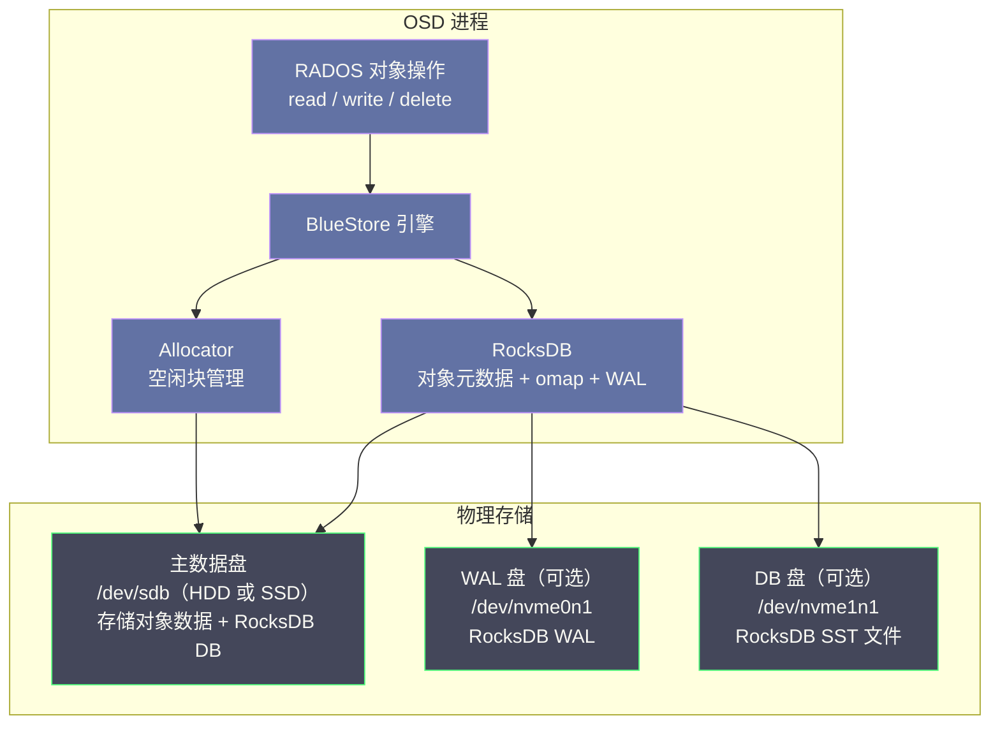
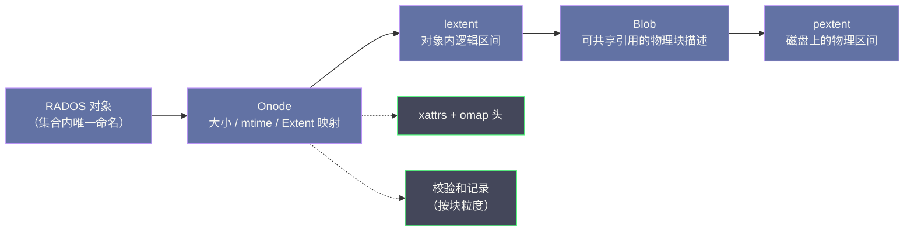
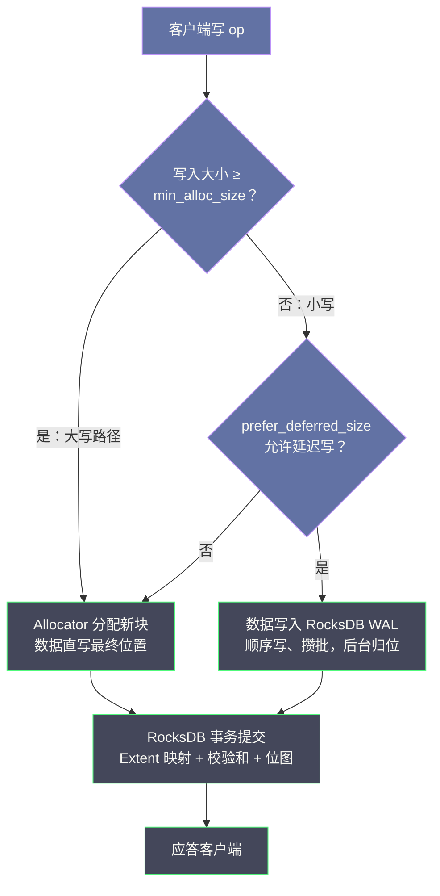
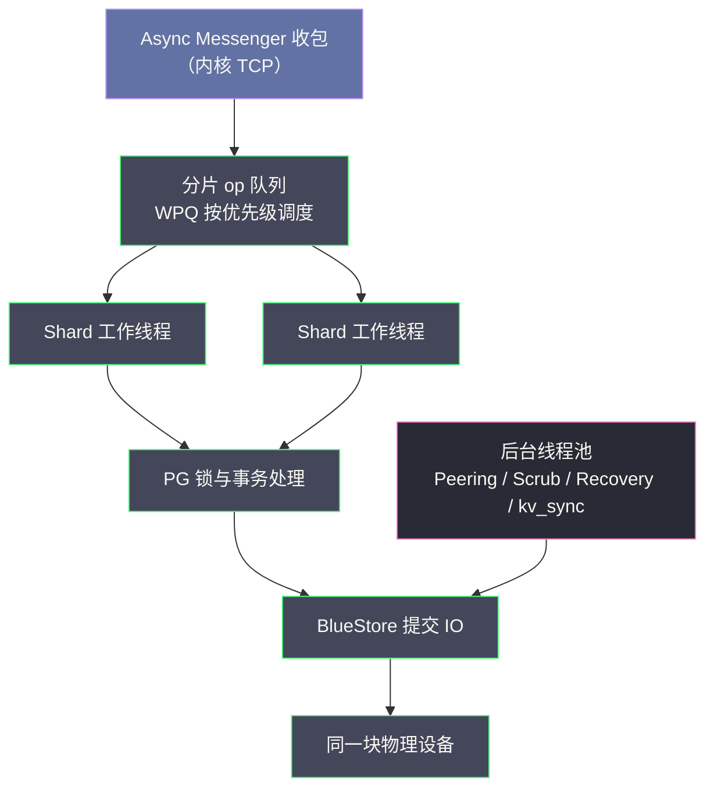
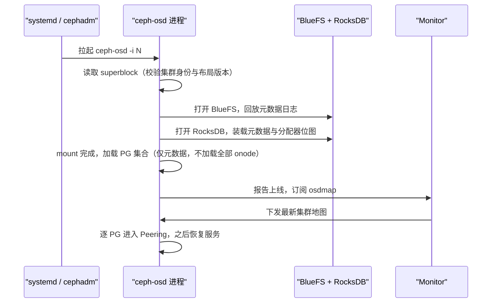

# 04 OSD 与 BlueStore——存储引擎深度解析

**摘要：**

BlueStore 是 Ceph 从 Luminous 版本（2017 年）开始替代 FileStore 的新一代本地存储引擎，其核心设计是**绕过本地文件系统，直接管理裸块设备**。这一看似激进的决定，源于 FileStore 在处理 COW 文件系统时的双写问题、对象元数据查询性能瓶颈、以及异步写带来的数据安全隐患。本文先剖析 FileStore 的历史局限，再沿三层展开 BlueStore 的全貌：其一是数据面，裸设备直管、空间分配与大小写路径；其二是元数据面，onode 为何放进 RocksDB、onode 缓存与 osd_memory_target 如何构成内存调优的主链路；其三是控制面，OSD 的线程模型、op 优先级与慢请求（Slow Ops）的成因分类。最后落到压缩、校验和、写放大分析与运维视角的日常操作，回答两个问题：BlueStore 凭什么把 OSD 写性能提升 1-2x，以及你在生产中应当盯住哪些参数与警告。

---

## 第 1 章 FileStore 的历史局限——为什么要重写存储引擎

### 1.1 FileStore 的设计思路

在 BlueStore 出现之前，Ceph OSD 使用 **FileStore** 作为本地存储引擎。FileStore 的思路非常直觉：**复用操作系统的本地文件系统**（ext4、XFS、btrfs）来存储 RADOS 对象。

每个 RADOS 对象在 FileStore 中对应本地文件系统上的一个或多个文件：
- 对象数据（data）存储为文件内容
- 对象的小元数据（xattrs）存储为文件的扩展属性（Linux xattr）
- 对象的 omap 数据存储在一个专用的 LevelDB/RocksDB 数据库中

这种设计的直觉是：文件系统已经是久经考验的软件，不需要重新实现，只需在其上构建 RADOS 语义。这个选择在 Ceph 早期是完全合理的——2006 年前后项目起步时，Sage Weil 的团队最需要的是尽快跑通 RADOS 的复制与恢复语义，至于底下用什么落盘，站在文件系统的肩膀上显然是最短路径。此后相当长的时间里，FileStore 一直伴随着 Ceph 从论文原型走向生产，直到 Luminous 之前，它都是唯一的选项。

但复用是有代价的，而且这笔账要等到集群规模上来之后才慢慢显形。譬如你租下一套精装修的房子，入住很快，可一旦发现承重墙的位置和你的生活习惯处处相悖，改造的代价就远超重新盖房——FileStore 的困境正是如此。

### 1.2 FileStore 的三大痛点

**痛点一：双写问题（Double Write）**

FileStore 使用一个**journal（日志）**实现事务语义——写操作先写 journal，journal 完成后再写数据文件。如果使用 XFS 等非 COW 文件系统，这个两步过程产生**双写**：数据被写两次（一次写 journal，一次写数据文件），实际写吞吐只有磁盘顺序写带宽的一半。

这个问题在机械硬盘时代就已存在，在 SSD 时代更加突出——SSD 的写寿命（P/E 次数）有限，双写显著缩短 SSD 使用寿命。打个比方，这就像每份文件都要先抄一遍草稿、再誊一遍正稿，誊写员（磁盘带宽）的时间有一半花在了重复劳动上。

历史上社区并非没有绕开双写的尝试：早期 FileStore 用户可以在 btrfs 这类 COW 文件系统上关闭 journal，让文件系统自身的写时复制承担事务语义，数据只写一次。但 btrfs 在生产环境中的稳定性始终不够成熟，这条路没有走通，journal + XFS 成为事实上的标准组合——也把双写问题固化了下来，直到 BlueStore 出现才被连根拔起。

**痛点二：文件系统元数据开销**

FileStore 存储的 RADOS 对象最终是文件系统上的文件。当一个 Pool 中有数百万个对象（小文件）时，文件系统的目录层级、inode 表、目录项等元数据开销非常显著。

XFS 在处理大量小文件时，`ls` 一个包含百万文件的目录需要数秒，删除文件需要更新多个元数据结构。这些文件系统级别的开销在对象存储场景下完全是不必要的——RADOS 对象的"目录结构"和命名规则与文件系统完全不同。更麻烦的是扩展属性的容量限制：ext4 上单个 xattr 的可用空间只有几 KB 量级，而 RADOS 对象需要携带的键值元数据往往远超这个尺寸，于是社区在 2014 年前后的 Firefly 版本引入了 omap，把这部分数据挪进外置的 LevelDB——等于在文件系统之外又挂了一个数据库，两套元数据体系并存，一致性维护的成本进一步上升。

**痛点三：校验和覆盖不完整**

FileStore 写数据时，先写 journal，journal 完成后异步（background）写数据文件。这个异步过程中：
1. 数据在 journal 中是正确的
2. journal 回放写数据文件时，如果发生磁盘故障或 bit rot，数据文件可能写入了损坏的数据
3. journal 写成功后就被认为"提交"，应用层看到的是成功

这意味着 FileStore 的数据校验只覆盖了写入 journal 这一步，journal → 数据文件的回放过程缺乏端到端的校验。

> [!note] 设计哲学
> FileStore 的这些问题，根源都在于**在已有的文件系统抽象之上构建另一个存储语义**。文件系统为通用场景设计，它的元数据结构（inode、目录、dentry）并不匹配 RADOS 的对象模型；它的可靠性机制（journal/WAL）不能完整覆盖 RADOS 的语义需求。
> BlueStore 的决策是：**不复用已有抽象，直接面向 RADOS 对象的需求设计**。付出的代价是实现复杂度大幅上升，但换来的是性能、可靠性、功能的全面提升。

### 1.3 重写的时机与代价

值得追问的是：为什么重写发生在 2016 年，而不是更早？答案与硬件演进有关。2010 年代中期，SSD 开始大规模进入存储服务器，双写问题从"浪费一半带宽"升级为"烧掉昂贵的写寿命"；与此同时，全闪存场景对元数据查询延迟的要求，也让"每次对象操作都穿过一层通用文件系统"变得难以接受。2016 年 Sage Weil 公开 BlueStore 设计，2017 年 8 月 Luminous 12.2 发布时它成为默认引擎，到 Octopus（2020 年）FileStore 正式被标记为弃用——整个替换过程花了大约四年，这在基础软件的演进节奏里算是相当果断的。

不妨做个反事实推演：如果 Ceph 当时选择继续修补 FileStore——譬如优化 journal 调度、给 XFS 打补丁——短期成本确实更低，但双写与元数据开销是抽象错配的产物，修补只能推迟而不能消除矛盾。后来者如 Ceph 的竞争对手们（以及各类自研存储）大多也走了"自管裸设备 + 内嵌 KV 引擎"的路线，这从侧面印证了这条路的必然性。当然，代价同样真实：BlueStore 的代码复杂度远超 FileStore，本文后续几章讨论的 Allocator、BlueFS、内存自治调优，都是这份复杂度的具体形态。

---

## 第 2 章 BlueStore 的整体架构——裸设备上的三驾马车

### 2.1 直接管理裸设备

BlueStore 直接操作**裸块设备**（`/dev/sdb`、`/dev/nvme0n1` 等），不通过任何文件系统（不 mkfs、不 mount）。它在块设备上自己管理：

- **数据空间**：存储 RADOS 对象的数据（data），用自定义的 Block Allocator 管理空闲空间
- **元数据**：存储在内嵌的 RocksDB 中（对象名、Extent 映射、对象属性、omap 等）
- **WAL（Write-Ahead Log）**：可选地存储在独立的 NVMe 设备上（与数据盘分离）

下图给出 OSD 进程内部与物理存储的对应关系，注意 RocksDB 的 SST 与 WAL 可以分别落在不同设备上：



### 2.2 三盘部署模式

BlueStore 将一个 OSD 的存储分为最多三个部分，可以分别放在不同的设备上：

**主数据盘（data）**：存储 RADOS 对象的实际数据（块数据）和 RocksDB 的 SST 文件（如果没有单独的 DB 盘）。通常使用 HDD 或 SATA SSD。

**DB 盘（可选）**：存储 RocksDB 的 SST 文件（元数据的冷数据）。如果不配置，SST 文件存储在主数据盘上。使用 NVMe SSD 可以大幅提升元数据查询性能（RocksDB 的 L0→L1 Compaction 也会受益）。

**WAL 盘（可选）**：存储 RocksDB 的 WAL（Write-Ahead Log）。WAL 是顺序写，对 IOPS 不敏感但对延迟敏感，用小容量 NVMe 即可。如果不配置，WAL 存储在 DB 盘或主数据盘上。

三盘如何取舍，本质是"元数据路径值多少钱"的问题。全 HDD 的容量型集群，数据路径本身就不快，RocksDB 与数据共置的惩罚相对可接受；一旦业务对小延迟敏感（虚拟机盘、数据库备份恢复），把 SST 挪到独立 NVMe 几乎是必选项，因为第 3 章将看到，每一次对象操作都要先过元数据这一关。WAL 独立盘的收益则集中在写延迟的尾部——顺序写对设备友好，但与 SST 共享设备时仍会互相干扰，预算充足时分开、预算紧张时与 DB 盘共用，是常见的折中。

**典型的高性能部署**：

```
主数据盘：1 × 8TB HDD（存储冷数据）
DB 盘：1 × 512GB NVMe SSD（存储 RocksDB SST，通常 1 个 NVMe 对应 4-8 个 HDD OSD）
WAL 盘：与 DB 盘共用，或使用更小的 Optane NVMe
```

### 2.3 空间管理：ONode、Extent 与 Bitmap Allocator

裸设备上没有文件系统替你记账，每一个字节放在哪、哪些字节空闲，都要 BlueStore 自己回答。这套账本由三层结构组成，理解它们是理解 BlueStore 行为的基础：

**ONode（对象元数据节点）**：每个 RADOS 对象对应一个 onode，它是对象在内存中的元数据表示，持久化形态是 RocksDB 里的一条记录。onode 里记着对象的大小、修改时间、xattrs、omap 头，以及最关键的**Extent 映射**——对象内每个逻辑区间（lextent）对应哪个物理 blob。

**Extent 与 Blob**：对象数据不要求连续存放。一个 4MB 的 RBD 对象可能由若干个 lextent 拼成，每个 lextent 指向一个 blob，blob 再映射到磁盘上一段或多段物理区间（pextent）。这种两级映射给了分配器极大的自由：写新数据永远分配新位置，旧位置留给快照引用，这正是写时复制（Copy-on-Write, COW）得以廉价实现的前提。

这里还有一个容易被忽略的细节：blob 可以被多个 lextent **共享引用**。快照场景下，对象的历史版本与当前版本指向同一个物理 blob，引用计数大于一；此时对任何一个版本做覆盖写，BlueStore 都会先拆分 blob（clone），让写者拿到私有副本，其余引用继续指向原块。这套共享与拆分机制是 RBD 快照与克隆近乎零成本的底层支撑，但也是碎片化的推手之一——每一次拆分都把连续空间切成更小的块。

**Bitmap Allocator**：空闲空间用位图管理，每一位对应一个分配粒度（由 `bluestore_min_alloc_size` 决定，HDD 默认 64KB、SSD 默认 4KB）。位图状态持久化在 RocksDB 中，OSD 重启时从 RocksDB 装载，不需要全盘扫描。Ceph 还提供 stupid、avl 等其他分配器实现，Pacific（16.2）起又为 HDD 引入了 hybrid 混合分配器——小块用首次适配、大块用 AVL 树，以缓解大容量 HDD 上长期运行后的空间碎片化。生产上选哪种，建议先用 `ceph-bluestore-tool` 观察碎片化评分再决定，而不是凭版本号想当然。

这套设计的好处是彻底摆脱了文件系统的元数据税，坏处是 BlueStore 必须自己处理碎片问题——文件系统几十年的成熟度，换成了几百行分配器代码的维护责任，这正是第 1 章所说"复杂度转移"的落点。

### 2.4 关键参数速览

BlueStore 的行为由一组参数控制，下表按"影响什么"归类，给出生产上最常被问到的条目。注意不同 Ceph 版本的默认值有差异，调优前请用 `ceph config get osd.N` 确认实际生效值：

| 参数 | 默认值（典型） | 作用 | 调优要点 |
| :--- | :--- | :--- | :--- |
| `bluestore_min_alloc_size_hdd` | 64KB | HDD 最小分配粒度 | 大对象顺序写友好；调小会加剧随机写放大 |
| `bluestore_min_alloc_size_ssd` | 4KB | SSD 最小分配粒度 | 一般不动 |
| `bluestore_prefer_deferred_size_hdd/ssd` | 按设备分别设定 | 小写是否走 RocksDB WAL 延迟写 | 权衡写延迟与读放大，见第 4 章 |
| `bluestore_csum_type` | crc32c | 数据校验和算法 | 关闭可省 CPU，但失去静默损坏防线 |
| `bluestore_compression_algorithm` | snappy | 默认压缩算法 | 可被 pool 级设置覆盖 |
| `bluefs_buffered_io` | true（Nautilus 起） | BlueFS 是否走缓冲 IO | 影响小读性能与 page cache 占用 |
| `bluefs_max_prefetch` | 若干 MB 量级 | BlueFS 读预取窗口 | 元数据密集负载可适当调大 |
| `osd_memory_target` | 4GiB | OSD 进程内存目标（含缓存自治） | 内存调优的核心旋钮，见第 3、7 章 |
| `bluestore_cache_size_hdd/ssd` | 1GiB / 3GiB | 关闭缓存自治时的缓存上限 | 仅在 `bluestore_cache_autotune=false` 时生效 |
| `bluestore_max_blob_size` | 按设备默认 | 单个 blob 上限 | 影响碎片化与映射表长度，一般不动 |

---

## 第 3 章 KV 分离与元数据组织——为什么是 RocksDB

### 3.1 onode 为什么放进 RocksDB

第一个要回答的问题是：对象元数据为什么非要塞进一个 KV 存储里，而不是像 FileStore 那样放在 xattr 和文件系统目录里？答案藏在三个工程约束的交集里。

**规模约束**：一个生产级 OSD 管理的对象数以百万到千万计，整个集群十亿级对象并不罕见。文件系统的目录树和 inode 表是为"文件数量有限、层级稳定"的场景设计的，十亿个对象的元数据查询会退化成灾难；而 KV 空间的键查找复杂度是稳定的对数级，天然适合这个规模。

**事务约束**：一次对象写操作要同时改三样东西——extent 映射、校验和记录、空间位图。这三样必须原子生效，否则崩溃恢复后会出现在分配器眼里"已占用"、在映射表里却"无人认领"的孤儿块。RocksDB 的 WriteBatch 恰好提供单键值空间内的原子批量提交，BlueStore 把所有元数据放进同一个 KV 空间、用前缀划分命名区（对象元数据、omap、分配器位图、统计信息各占一段前缀），一次事务一次提交，崩溃一致性由 LSM-Tree 的 WAL 保证。

**复用约束**：LSM-Tree 的写优化特性与存储引擎元数据的访问模式（写多读少、范围扫描少）高度契合。如果 Ceph 自己实现一个元数据引擎，等于重写一个 RocksDB；直接内嵌它，是典型的"不要重复造轮子"。这也是 BlueStore 有时被戏称为"RocksDB 之上的一层对象语义"的原因——数据走自研路径，元数据全权委托。

从对象名到物理块，这条账本的层级关系可以用一张图串起来，读路径与写路径都要沿它走一遍：



读一个对象，BlueStore 先取 onode（缓存命中则直达，未命中则查 RocksDB），沿 extent 映射定位 blob 与物理区间，读数据、验校验和；写一个对象则反向走一遍——分配新 pextent、更新映射、以一个 RocksDB 事务原子提交。第 8 章要看的 perf dump 计数器，绝大多数就挂在这条链的各个环节上。

### 3.2 onode 缓存与 osd_memory_target：内存调优的主链路

既然每次对象读写都要先拿到 onode，onode 的获取速度就成了元数据路径的咽喉。BlueStore 的对策是两级缓存，而这两级缓存的内存预算，最终都汇流到 `osd_memory_target` 这一个旋钮上——这是 BlueStore 内存调优最重要的一条链路：

**第一级是 onode 缓存（meta 缓存）**：最近使用的 onode 以完整对象形态驻留内存，命中则完全绕过 RocksDB。它像随身口袋里揣着的高频索引卡，翻找不必跑楼下档案室；onode 的内存开销不可忽略——一个带复杂 extent 映射的对象，其 onode 可能占用数 KB 到数十 KB 内存，缓存百万个活跃 onode 就意味着数 GB 量级的需求。

**第二级是 KV 缓存（RocksDB block cache）**：onode 未命中时需要查 RocksDB，此时 block cache 能把热点 SST 数据块留在内存里，把一次磁盘读变成一次内存拷贝。BlueStore 通过选项向 RocksDB 注入缓存预算，两极缓存的权重由 `bluestore_cache_kv_ratio`、`bluestore_cache_meta_ratio` 等参数控制。

**自治调优（autotune）**：从 Nautilus 起，BlueStore 默认开启 `bluestore_cache_autotune`，运行时按命中率动态调整三类缓存（KV、元数据、数据）的配比，而总预算由 `osd_memory_target`（默认 4GiB）约束。其实现依赖 tcmalloc 的堆采样与内存归还：OSD 周期性评估缓存价值，把低价值内存释放回操作系统，使进程 RSS 稳定在目标值附近波动。相关的两个下界参数是 `osd_memory_base`（进程基础开销）与 `osd_memory_cache_min`（缓存最低保障），它们保证自治算法不会把内存压缩到伤及基本功能。

这条链路为什么重要？因为它是**海量小对象场景内存告急的根因解释**。譬如一个 RGW 集群存了十亿个几 KB 的小对象，每个对象一条 onode 记录，即便缓存只覆盖 10% 的活跃对象，内存需求也是数十 GB 级——这不是"参数没调好"，而是工作负载的元数据规模决定的。理解了这一点，你才能在第 7 章的调优表里做出正确取舍：要么提高 `osd_memory_target`，要么在业务侧合并小对象，而不是反复重启 OSD 期待奇迹。

> [!info] 核心概念：onode 缓存未命中的代价
> 一次 onode 缓存未命中，意味着至少一次 RocksDB 点查；如果目标记录不在 MemTable 或 L0，还要穿过 SST 层级——最坏情况下一次点查放大为多次随机读。这就是为什么 DB 盘用 NVMe 能显著改善小对象性能：它缩短的不是数据路径，而是元数据路径。

### 3.3 shard 化与共享内存 arena

缓存本身也要面对并发。OSD 的客户端请求由多个工作线程并行处理，若所有线程争抢一把缓存大锁，锁等待会反过来成为新的慢请求来源。BlueStore 的做法是把 onode 缓存按 shard 划分，每个 shard 独立持锁、独立维护 LRU，线程按对象哈希归入对应 shard，冲突概率随 shard 数量摊薄。

更细的一个设计是：onode 本体从**共享内存 arena** 中分配，配合引用计数跨线程共享。这样做的动机有二：其一，同一个热点对象可能同时被多条请求引用，arena 分配让"谁负责释放"变成引用计数问题而非所有权问题；其二，缓存回收（trim）时可以按 shard 统一裁决，把最冷的 onode 连同其 arena 内存整体归还，避免内存碎片在进程堆里越积越多。RocksDB 侧的 block cache 同样按 shard 组织，以减少高并发下的缓存锁竞争。

这套机制对使用者的启示是：**不要用外部手段（譬如 cgroup 硬限）去"帮" OSD 控内存**。BlueStore 的内存自治是一个闭环——缓存价值评估、释放、再分配都在进程内完成，外部硬限只会打断闭环，让自治算法在错误的信息上决策。我们给足 `osd_memory_target`，剩下的交给它自己。

### 3.4 omap：目录树与海量元数据的落点

onode 之外，RocksDB 还承载着 omap——对象级键值空间的持久化形态。这个设计的影响远超 BlueStore 本身：CephFS 的目录项与 inode 属性、RGW 的 bucket 索引，最终都压在 omap 之上（参见 [[中间件/Ceph/08 CephFS——MDS、多活元数据与实践边界|08 CephFS 篇]]）。换句话说，**DB 盘的性能就是这些上层系统的元数据性能**：一个 bucket 里千万个对象索引、一个目录下百万个文件项，每一次列举与查找都是 RocksDB 的迭代器操作，而迭代器的代价与 SST 层数、key 疏密直接相关。这也是为什么海量小文件场景的容量规划，重点从来不是数据盘而是 DB 盘——位图、索引、omap 全在后者身上。

---

## 第 4 章 BlueStore 的写入路径——小写、大写与延迟写

### 4.1 小写与大写的区分

BlueStore 对小写（< min_alloc_size，通常 4KB 或 64KB）和大写（>= min_alloc_size）采用不同的写入路径，这是一个重要的性能优化。

**min_alloc_size** 是 BlueStore 的最小分配单元：
- HDD 默认 64KB（HDD 的 4KB 随机写代价极高，64KB 顺序写效率更好）
- SSD 默认 4KB（SSD 随机写性能好）

两条路径的分岔与汇合如下图所示，注意无论走哪条，元数据变更最终都以 RocksDB 事务的形式原子落位：



### 4.2 大写路径（New Write Path）

对于写入大小 >= min_alloc_size 的写操作：

1. **分配新块**：通过 Allocator 在数据盘上分配新的空闲块（不覆盖旧数据，而是分配新位置）
2. **写数据到新块**：将数据写入新分配的块（异步，非 WAL）
3. **写 RocksDB WAL**：将"新块地址 → 对象 Extent 映射的更新"写入 RocksDB WAL（同步，确保持久化）
4. **数据写完后更新 RocksDB 元数据**：RocksDB 的 WAL 回放，更新 Extent 映射

这个流程消除了 FileStore 的双写问题：对象数据只写一次（直接写到最终位置），RocksDB WAL 只记录元数据变更（而不是数据本身），WAL 写入量极小。

### 4.3 小写路径与延迟写（Deferred Write）

对于小于 min_alloc_size 的写操作，如果直接按大写路径处理，会产生写放大（Write Amplification）——4KB 的数据需要分配 64KB 的块，浪费 60KB 空间。

BlueStore 对小写使用 **WAL 写**路径：

1. 将小写数据**直接写入 RocksDB WAL**（RocksDB 本身是 append-only 的日志结构，WAL 写是顺序写，性能好）
2. WAL 在 RocksDB 的后台 Compaction 中最终合并到 SST 文件，或者在下次对同一块的大写时将 WAL 中的数据合并到数据块

这种方式对小写非常高效，但对读取有影响——读取时可能需要从 RocksDB 中读取 WAL 合并的数据，增加读路径的复杂度。围绕这条路径有两个值得记住的参数：`bluestore_prefer_deferred_size_hdd/ssd` 决定多小的写走延迟路径，`bluestore_deferred_batch_ops` 控制延迟写攒批的粒度。前者是 HDD 与 SSD 上表现分化最明显的参数之一——HDD 上延迟写省下的随机写代价远大于 SSD，但代价是后续读取可能要穿透 RocksDB，具体取舍必须结合读写比例实测，没有普适答案。

用仓储做比方：大写像整箱入库，直接送上货架（最终位置）；小写像零散包裹，先塞进前台抽屉（WAL），攒够一批再统一归位。归位省力了，但找一件还没归位的货，就得先翻抽屉——这就是延迟写的读惩罚。

### 4.4 压缩：zstd、snappy 与 lz4

BlueStore 在数据落盘前可做透明压缩，读取时解压，且支持 **per-pool 的压缩指纹**——同一个集群里，归档池开 zstd、数据库备份池开 snappy、时序池干脆不压，各走各的策略。pool 级设置会覆盖 store 级默认值，常用操作如 `ceph osd pool set <pool> compression_mode aggressive`。除模式外，还有三个参数值得了解：`compression_algorithm` 选算法，`compression_required_ratio`（默认 0.875 附近）规定压缩后与原大小的比值必须优于该阈值才真正落盘压缩块，`compression_min_blob_size` 避免对过小的块做无谓压缩。

| 算法 | 速度 | 压缩比 | 适用场景 |
| :--- | :---: | :---: | :--- |
| **none** | — | — | CPU 紧张或数据本身不可压（已加密、已压缩） |
| **snappy** | 快 | 中 | 默认选择，速度与比率的均衡点 |
| **lz4** | 最快 | 略低 | 延迟敏感、CPU 预算有限的在线业务 |
| **zstd** | 慢 | 最高 | 归档、备份等离线负载；CPU 开销与延迟抖动明显 |

选择的关键不是"哪个算法最好"，而是**压缩发生在哪条路径上**：压缩块在写路径上同步完成，CPU 开销直接加进写延迟；对在线交易类负载，一次 zstd 压缩引入的尾延迟可能比省下的空间值钱得多。另需注意压缩与校验和的叠加成本——压缩块落盘后，校验和记录的是压缩后的字节，读取时解压与校验的 CPU 开销相加，全闪高并发场景下不可忽略。笔者的建议是，在线池从 snappy 或 none 起步，把 zstd 留给对延迟不敏感的容量型 pool——这又是一次因地制宜。

### 4.5 校验和与静默损坏的防线

BlueStore 在**写入数据时计算校验和（Checksum）**，在读取时验证，实现端到端的数据完整性保护。这是 FileStore 不具备的能力。

Checksum 覆盖范围：
- 对象数据的每个 block（默认 4KB 或 64KB 粒度）
- Checksum 值存储在 RocksDB 中（与对象的 Extent 映射一起）

读取时，BlueStore 从磁盘读取数据，重新计算 Checksum，与 RocksDB 中存储的 Checksum 对比。如果不匹配，说明数据损坏（静默错误，磁盘未报告错误但数据实际已损坏），BlueStore 将尝试从其他副本读取正确数据。算法由 `bluestore_csum_type` 全局配置，另提供按块大小细分的变体（如 crc32c_16、crc32c_8），块越小检出粒度越细、元数据开销越大：

| 算法 | 计算速度 | 检测能力 | 适用场景 |
| :--- | :---: | :---: | :--- |
| **none** | 最快 | 无 | 不需要数据完整性检查 |
| **crc32c** | 快（硬件加速） | 好 | 默认，推荐 HDD |
| **crc32c_16 / crc32c_8** | 快 | 更细粒度 | 需要小粒度定位损坏块时 |
| **xxhash32** | 极快 | 好 | 推荐高速 SSD |
| **xxhash64** | 极快 | 更好 | 推荐 NVMe，高并发场景 |

> [!info] 核心概念：静默数据损坏（Silent Data Corruption）
> 磁盘（尤其是 HDD）存在一种故障模式：磁盘硬件不报告错误，但返回的数据实际上与写入时不同（bit rot、磁头错位等）。操作系统和上层应用无法感知，数据悄无声息地损坏。
> BlueStore 的端到端 Checksum 是检测这类问题的关键手段。配合 Scrub（定期扫描，详见 [[中间件/Ceph/06 Scrub 与数据校验——静默错误的防线|06 Scrub 篇]]），可以在数据被用户读到之前发现并自动修复静默损坏。

这里值得把两种防线的分工说透：**校验和是单副本的自证**——读一块数据，重算摘要与存储的摘要对比，能发现"这块数据自己坏了"；**Scrub 是副本间的互证**——比对 Primary 与 Replica 的同一对象，能发现"副本之间不一致"。前者不需要网络，后者不依赖校验和覆盖完整，两者互补才构成完整防线。Deep Scrub 读数据时会顺带验证校验和，所以校验和算法的选择也直接影响 Deep Scrub 的 CPU 成本。

---

## 第 5 章 RocksDB 与 BlueFS——元数据引擎的宿主

### 5.1 RocksDB 存储什么

BlueStore 内嵌一个 [[中间件/Leveldb/05 从 LevelDB 到 RocksDB——优化与演进|RocksDB]] 实例（不是独立进程，而是库形式内嵌），用于存储所有对象的元数据：

**对象 Extent 映射**：对象数据在磁盘上存储的物理位置（Extent 列表），格式类似：
```
object_key → [(offset_in_object, length, disk_offset), ...]
```

**对象属性（xattrs）**：RADOS 对象的扩展属性（键值对），如 Ceph 内部使用的 `_`（标准属性）、`snap`（快照信息）等。

**omap 数据**：对象的持久化 KV 映射（对象头部存储 omap 的 RocksDB key 前缀）。CephFS 的文件目录 inode 大量使用 omap。

**空间分配信息（Allocator 状态）**：记录数据盘上哪些块已使用、哪些块空闲。Ceph Nautilus 引入了基于 Bitmap 的 Allocator，状态直接存储在 RocksDB 中（不需要单独的文件）。

### 5.2 RocksDB 的性能是 BlueStore 的关键

由于几乎所有对象的读写都需要查询 RocksDB（获取 Extent 映射），RocksDB 的性能直接决定了 OSD 的 IO 性能。

**为什么 DB 盘（NVMe）能显著提升性能**：

RocksDB 是 LSM-Tree 结构（参见 [[中间件/Leveldb/01 LevelDB 全局架构——LSM-Tree 的写优化设计]]，Compaction 机制详见 [[中间件/Leveldb/04 Compaction——分层合并与版本管理|LevelDB Compaction 篇]]），写入数据时先写内存 MemTable，再刷新到磁盘 SST 文件。SST 文件在后台定期 Compaction（合并）。Compaction 会产生大量随机读 + 顺序写，如果 SST 文件在 HDD 上，Compaction 期间的 IO 竞争会导致对象读写延迟显著升高（因为 HDD 的随机 IO 能力有限）。

将 RocksDB 的 SST 文件（DB 盘）放在 NVMe SSD 上：
- Compaction 的 IO 发生在 NVMe 上，不干扰 HDD 上的对象数据 IO
- 元数据查询（Extent 查找）的延迟从 HDD 的 ms 级降至 NVMe 的 μs 级
- 整体 OSD 的 4KB 随机写延迟可以降低 30-50%

### 5.3 BlueFS——给 RocksDB 的轻量文件系统

一个有趣的细节：RocksDB 需要一个文件系统接口来管理它的 SST 文件和 WAL。但 BlueStore 直接管理裸块设备，没有文件系统。

为此，BlueStore 实现了一个极简的、专门给 RocksDB 使用的"文件系统"——**BlueFS**。BlueFS 不是通用文件系统，只支持 RocksDB 需要的操作（创建文件、顺序追加写、随机读），以最小化实现复杂度，同时避免 ext4/XFS 的元数据开销。它的元数据日志（BlueFS log）本身就是一条顺序追加的日志文件，目录结构与 inode 信息都记录在其中，重启时靠回放日志恢复文件系统状态。

BlueFS 管理 DB 盘和 WAL 盘（如果有），这些设备也是直接以裸块设备方式访问的。理解 BlueFS 的一个实用视角是：它是"按房客定制"的最小公寓——RocksDB 需要什么就提供什么，多一点都不给。它的元数据日志（BlueFS log）本身也会周期性压缩：把日志中重复的文件状态合并成一份快照再继续追加，防止日志无限增长——虽然体量很小，但同样是 LSM 思想的一次复用。至于为什么不干脆给 DB 盘格式化一个 ext4：多一层通用文件系统，就多一层元数据税与 fsync 语义的不确定性，BlueFS 用几百行代码换来对 RocksDB 写模式的完全可控，这笔交换在元数据路径上是划算的。

代价则是它绕过了通用文件系统积累多年的优化，于是引出一组 BlueFS 专属参数：`bluefs_buffered_io` 决定 BlueFS 的读写是否走内核缓冲（Nautilus 起默认开启，用 page cache 换小读性能），`bluefs_max_prefetch` 控制元数据读的预取窗口。这些参数在元数据密集负载（CephFS 大目录、RGW 海量 bucket）上的收益最为明显。

---

## 第 6 章 OSD 线程模型与慢请求——延迟从哪里来

### 6.1 从单队列到分片队列：OSD 的线程结构

理解了 BlueStore 内部，再把镜头拉远看 OSD 进程整体。一个客户端写请求到达 OSD 后的旅程是：Messenger 收包 → 进入 op 队列 → 工作线程取出并加 PG 锁 → 调用 BlueStore 提交 IO → 回调完成并应答。这条流水线的每个环节都可能是延迟来源，而 OSD 对它的改造有一条清晰的历史线索。

Luminous（2017）之前，OSD 的客户端操作走单一线程池，所有 PG 的请求在同一组线程上排队，一把大锁保护共享状态，多核扩展性很差。Luminous 引入**分片 op 队列（sharded op queues）**：队列按 PG 哈希拆成多个 shard，每个 shard 绑定独立线程（HDD 默认 5 个 shard、每 shard 1 线程；SSD 默认 8 个 shard、每 shard 2 线程），不同 PG 的请求互不干扰，锁粒度随分片摊薄。这次改造与 BlueStore 同年落地并非巧合——两者共同构成了 Luminous 性能跃升的基础。

顺带一提网络层：社区在 2016 年前后试验过基于 DPDK 的用户态网络栈（配合 async messenger），希望绕过内核协议栈降低延迟，但复杂的部署要求与有限的收益使它终究没有成为生产主流，主流路径至今仍是内核 TCP 之上的 async messenger。对多数使用者而言，网络调优的优先级远低于磁盘与内存——慢请求的大头从来不在网卡上。

除客户端 op 外，OSD 还有若干后台线程池各司其职：Peering 与日志回放、Scrub 与 Recovery 的后台扫描、BlueStore 内部的 kv_sync 线程（负责 RocksDB 事务提交与元数据落盘）等。它们与客户端 op 共享同一块磁盘，这正是下一节冲突的根源。把这条流水线画出来，各队列与线程的关系一目了然：



### 6.2 op 队列与优先级

队列不是先来先服务的。OSD 的 op 队列按**优先级（priority）**调度，默认使用加权优先级队列（WeightedPriorityQueue, WPQ）——Kraken 引入、Luminous 起成为默认——高优先级的 op 优先出队。优先级体系里有两个关键默认值：客户端操作 `osd_client_op_priority` 为 63，恢复操作 `osd_recovery_op_priority` 仅为 3，相差二十倍。这个悬殊的差距是刻意设计：**恢复流量必须给业务让路**，宁可恢复慢一点，也不能让在线请求在队列里饿死。

不过优先级只解决"谁先走"，不解决"队列归属"。`osd_op_queue_cut_off` 参数决定不同优先级的 op 进入哪一层队列（低优先级队列或高优先级队列），影响的是 Primary 与副本之间 op 的调度顺序；较新版本还引入了 mClock 调度器，试图用 QoS 模型为客户端、恢复、Scrub 分别预留带宽，是否默认启用随版本而异，升级前应查阅对应 release notes。这些机制的共同目标只有一个：让不同类型的 IO 在同一块磁盘上按业务价值分配带宽，而不是按到达顺序拼运气。

还有一个容易忽视的细节：副本 op 与客户端 op 走的是不同方向的队列。Primary 收到客户端写后转发给副本，副本侧的 op 从自己的队列进入处理——如果副本侧队列被恢复或 Scrub 占据，Primary 就要等所有副本应答，客户端延迟因此被最慢的副本决定。这也是为什么"某个副本 OSD 的后台负载"会拖慢整个 PG 的写延迟，排查写延迟问题时，三个副本的 OSD 都要看，不能只盯 Primary。

### 6.3 慢请求（Slow Ops）的成因分类

当客户端 op 的处理时间超过 `osd_op_complaint_time`（默认 30 秒），OSD 会在集群日志里抛出 slow request 告警。慢请求是症状，不是病因，诊断的第一步是归类。常见成因可分四类：

| 成因类别 | 典型表现 | 判别线索 |
| :--- | :--- | :--- |
| **磁盘饱和** | 慢请求集中在个别 OSD，持续整个高峰期 | 该 OSD 设备 util 长期 100%，`iostat` 写延迟抬升 |
| **恢复抢 IO** | 集群刚经历 OSD 故障/扩容后集中出现 | `ceph -s` 显示 recovery/backfill 活跃，恢复速率与慢请求此消彼长 |
| **锁等待** | op 卡在 PG 锁或 BlueStore 内部锁上 | `dump_ops_in_flight` 显示大量 op 停在锁等待阶段 |
| **Compaction 停顿** | 周期性尖刺，与 RocksDB 后台合并同步 | `perf dump rocksdb` 中 stall 指标增长，DB 盘延迟抖动 |

诊断的标准动作是两条命令：`ceph daemon osd.N dump_historic_ops` 看已完成请求的耗时分布，`ceph daemon osd.N dump_ops_in_flight` 看当前卡住的 op 停在哪个阶段。前者回答"慢了多少"，后者回答"慢在哪一步"——两者结合，四类成因基本可以当场分辨，笔者建议把这两条做成别名常备手边。此外，集群日志里的 slow request 行通常自带线索：op 停在 waiting for locks 附近多为锁等待，waiting for io 多为设备层排队，而成批出现且集中在恢复中的 PG 上，多半是恢复抢 IO。先读日志再跑工具，是最省力的诊断顺序。

> [!warning] 生产避坑：慢请求是症状，不是病因
> 看到 slow ops 告警就重启 OSD 是最常见的误操作——队列清空只是把症状藏起来，磁盘饱和与锁竞争的根因原封不动。正确顺序是：先分类（上表），再看是单 OSD 还是全局，单 OSD 查设备健康与碎片化，全局查恢复流量与业务峰值是否重叠。

### 6.4 throttling：主动排队的艺术

既然磁盘带宽是稀缺资源，与其让所有请求涌到设备层排队爆炸，不如在上游有序放行——这就是限流（Throttling）的设计意图。BlueStore 在提交路径上按字节数与"IO 代价"双重计费：`bluestore_throttle_bytes` 限制在途数据量，`bluestore_throttle_deferred_bytes` 单独约束走 WAL 延迟路径的量，`bluestore_throttle_cost_per_io_hdd/ssd` 把每个 op 折算成等效字节数参与计费，超过阈值的请求就地排队等待。代价参数按设备类型区分，正是因为 HDD 与 SSD 的"一个 IO 值多少带宽"完全不同。

恢复路径同样有限流：恢复 op 的优先级（前述的 3）决定它在队列中的地位，`osd_recovery_max_active` 等参数控制同时恢复的对象数，配合 `osd_recovery_sleep_*` 在恢复批次之间主动留白，把设备让给业务流量。这套机制的本质与景区限流异曲同工——**与其让游客在山道上堵死，不如在门口按容量放行**。队列有界，延迟才有上界；这也是为什么调大限流参数"看起来恢复更快了"，却常常以业务 P99 延迟恶化为代价。

> [!note] 设计哲学：延迟的可预测性比吞吐的峰值更重要
> 限流、优先级、恢复让路，三套机制共享同一个信念：分布式存储面向的是成千上万的并发客户端，一次失控的队列堆积会同时惩罚所有用户，而有序的排队只惩罚排在后面的那一部分。把队列留在可控的地方、把延迟的上界交给机制而不是运气，是存储引擎对上层应用最朴素的承诺。

---

## 第 7 章 运维视角的 BlueStore——从启动到扩容

### 7.1 ceph-osd 的启动流程：从挂载到 PG 加载

BlueStore 的日常问题大多发生在两个时刻：启动和扩容。先看启动。`ceph-osd` 进程拉起后并不需要 mount 任何文件系统，它的"挂载"是逻辑意义上的——把裸设备上的元数据区装载进内存，好比开店前的盘点：账本（位图与元数据）要从保险柜（RocksDB）里取出来对一遍，对完才敢开门营业。完整序列如下：



这个序列解释了两个常见的运维现象。其一，**大容量且碎片化严重的 OSD 启动慢**——分配器位图要从 RocksDB 装载，位图大小与磁盘容量、碎片程度正相关，几十 TB 的 HDD 冷启动花几分钟并不罕见。其二，**启动后 PG 短暂不可用是正常的**——Peering 需要时间，此时 `ceph -s` 里出现短暂 degraded 属于正常过程，不要急于干预（Peering 的细节在 [[中间件/Ceph/05 PG 状态机与数据一致性——Peering、Recovery 与 Backfill|05 PG 状态机篇]] 展开）。

### 7.2 bluefs-bdev：DB/WAL 盘的迁移与扩容

三盘模式带来的灵活性，也带来一类专属运维操作：DB/WAL 设备的调整。工具是 `ceph-bluestore-tool`，常见子命令有三类：

- **查看**：`bluefs-bdev-sizes` 列出 BlueFS 挂接的设备与容量，是排查"DB 盘快满"的第一步
- **扩容**：`bluefs-bdev-expand` 在 DB 盘本身扩容后（譬如云盘在线扩容）把新空间纳入 BlueFS，较新版本也可通过 OSD 的 admin socket 在线触发
- **迁移**：`bluefs-bdev-migrate`（配合 `bluefs-bdev-new-db`）把 RocksDB 从主数据盘迁到独立 NVMe，或从旧 NVMe 迁到新 NVMe——这是"当初没配 DB 盘、现在元数据成为瓶颈"场景的标准解法

迁移属于离线操作，必须先停 OSD 再执行，且执行前应确认目标设备容量充足。这里有个容易踩的坑：DB 盘空间不足时，BlueFS 会把溢出的数据写回主数据盘（spill over），此时主数据盘上的 RocksDB 段与 DB 盘并存，扩容 DB 盘后 BlueFS 会自动把数据搬回——但如果 DB 盘是"从共置改为独立"的迁移，务必用 migrate 而不是简单扩容，两者的语义完全不同。

### 7.3 常见健康警告与处置

BlueStore 相关的集群警告（HEALTH_WARN）有几类高频面孔，处置思路各不相同：

| 警告 | 含义 | 处置建议 |
| :--- | :--- | :--- |
| **BlueStore spurious read errors** | 读返回 EIO 但重试成功，多为瞬时介质错误 | 查 `dmesg` 与 SMART 确认介质状态；对相关 PG 触发 deep-scrub 验证；持续出现则准备换盘 |
| **BlueFS 碎片化偏高** | 分配器空闲空间零散，大对象写性能下降 | 用 `bluestore allocator score` 查看评分；扩容 DB 盘或规划数据重平衡 |
| **BlueFS 空间不足** | DB 盘接近写满，omap 增长超预期 | 先 `bluefs-bdev-expand`；根治靠业务侧清理（bucket 索引、目录项）或迁移到更大 DB 盘 |
| **slow ops 持续** | 请求延迟超阈值（默认 30s） | 按第 6 章四分类定位，勿盲目重启 |

另有一个离线工具值得记住：`ceph-bluestore-tool fsck`（可加 `--repair`）在 OSD 停机时做全量一致性检查，是怀疑元数据损坏时的最终手段。它很慢，但比"数据疑似损坏却无从验证"的焦虑好得多。

### 7.4 osd_memory_target 调优建议表

第 3 章讲过，onode 缓存与 KV 缓存的总量由 `osd_memory_target` 约束，这里给出按工作负载的取值建议。原则是**先测量后调整**：用 `ceph daemon osd.N dump_mempools` 看 bluestore_kv 与 bluestore_meta 的实际占用，再决定目标值：

| 工作负载 | 建议 target | 理由 |
| :--- | :--- | :--- |
| 大对象为主（RBD、备份） | 4GiB（默认即可） | 活跃 onode 少，默认缓存足够 |
| 混合负载（RBD + CephFS） | 4-6GiB | 目录元数据开始占用 KV 缓存 |
| 全闪 + 高并发小 IO | 6-8GiB | 更大缓存换更高的 onode 命中率 |
| RGW 海量小对象 / 大 bucket 索引 | 8GiB 或更高 | onode 数量是内存需求的决定项 |
| 内存紧张的超分环境 | 不低于 4GiB，宁减 OSD 密度 | 缓存不足的延迟代价大于机器成本 |

操作顺序也值得固定下来：先在业务低峰期记录基线（RSS、onode 命中率、slow ops 频次），再按表调整 target，观察一个完整的业务周期后对比结论。内存调优的反馈周期以天计，缓存替换与自治算法都需要时间收敛，指望改完立刻见效只会导致过度调整——这是新手最容易犯的节奏错误。

> [!warning] 生产避坑：内存不是越大越好
> `osd_memory_target` 调得过高会挤压 page cache 与其他进程，且自治算法只管辖 tcmalloc 堆内的部分，BlueFS 的缓冲 IO 与 RocksDB 后台线程的内存不在此列。观察指标是 RSS 是否稳定在目标附近、slow ops 是否随缓存命中率改善——而不是"设得越大越快"。

---

## 第 8 章 性能对比与写放大——代价的账本

### 8.1 BlueStore vs FileStore 的性能提升

官方基准测试数据（Ceph Luminous）：

| 场景 | FileStore | BlueStore | 提升 |
| :--- | :---: | :---: | :---: |
| 4KB 随机写 IOPS | 100 | 200 | 2× |
| 4MB 顺序写带宽 | 200 MB/s | 250 MB/s | 1.25× |
| 4KB 随机读 IOPS | 150 | 200 | 1.3× |
| 延迟（P99，4KB 写） | 15ms | 8ms | 降低 47% |

BlueStore 在写密集场景（小 IO 随机写）的提升最显著，主要得益于消除了双写。需要说明的是，具体数值随硬件、版本与负载特征差异很大，这张表的价值在于量级与相对关系，而非绝对数字——评估自己的集群时，请以同硬件的对照实测为准。

### 8.2 写放大的来源分析

BlueStore 的存储效率并非完美。由于 RocksDB 的 LSM-Tree 特性，元数据存在写放大（Write Amplification）：

- **RocksDB WAL**：每次对象写操作都有一次 RocksDB WAL 写入（记录 Extent 映射变更）
- **RocksDB Compaction**：LSM-Tree 的多层 Compaction 会将每条元数据记录重写多次

对于元数据密集型工作负载（如 RGW 的海量小对象），RocksDB 的写放大是需要关注的问题。Ceph 提供了 `bluestore_prefer_deferred_size` 等参数来调整小写的处理方式，平衡延迟和写放大。

把视野放宽，BlueStore 的写放大其实有三个来源，各有各的缓解手段：

| 来源 | 机制 | 缓解手段 |
| :--- | :--- | :--- |
| **RocksDB Compaction** | 元数据随 LSM 层级下沉被反复重写，写放大系数与层深相关 | DB 盘上 NVMe 吞吐换放大；控制 SST 大小与层深；参见 [[中间件/Leveldb/04 Compaction——分层合并与版本管理|LevelDB Compaction 篇]] |
| **COW 与分配粒度** | 小写按 min_alloc_size 分配新块，HDD 上 4KB 写实占 64KB；快照共享 blob 被写时拆分 | 调大 prefer_deferred_size 让小写走 WAL；按设备选 min_alloc_size；业务侧避免过度打快照 |
| **WAL 与校验和元数据** | 每次写附带 WAL 记录与 csum 记录，元数据流量与业务流量同量级增长 | deferred 批量合并 WAL 写；权衡 csum 块粒度；压缩减少落盘字节 |

值得强调的是，这三种来源**不能同时归零**：关掉 COW 换原地写，就要重新面对 FileStore 式的覆盖写问题；关掉校验和，就放弃静默损坏防线；压低 Compaction，就要接受读放大上升。写放大是这套设计买来的可靠性与其他收益的账单，运维能做的是把每一项调到与自身负载匹配的位置，而不是追求某个"零放大"的幻影。

### 8.3 观测：从 perf dump 读引擎状态

判断写放大是否失控，不靠感觉靠计数器。`ceph daemon osd.N perf dump` 下的 bluestore、bluefs、rocksdb 三个命名空间是主要入口，值得长期盯住的指标包括：onode 缓存命中率（bluestore 里的 onode hits/misses）、KV 事务字节数与 WAL 字节数（rocksdb 提交量与业务写入量的比值即元数据放大）、deferred 队列深度（延迟写积压）、以及 RocksDB 的 stall 计数（Compaction 停顿）。快速查看可以这样取：

```bash
# 元数据放大的直观读法：KV 提交量与业务写入量的比值
ceph daemon osd.3 perf dump bluestore | grep -E "onode|kv_transaction"
# Compaction 停顿与 WAL 流量：尖刺与 slow ops 的时间相关性
ceph daemon osd.3 perf dump rocksdb | grep -E "stall|wal"
```

这些数值配合第 6 章的 slow ops 分类，基本能覆盖日常性能问题的定位需求。计数器本身不贵，贵的是长期留存——把关键指标接进时序数据库（监控体系的搭建见 [[中间件/Ceph/00 专栏导览|专栏导览]] 所列的第 12 篇），才能在"变慢"发生之前看到趋势。

---

## 第 9 章 Scrub——主动数据完整性校验

### 9.1 Scrub 的作用

静默数据损坏（bit rot）是分布式存储系统面临的真实威胁，尤其在大规模机械硬盘集群中。一块 8TB HDD 的不可恢复读错误率（URE）约为 1 per 10^14 比特——对于 PB 级集群，统计上每年会有数十次不可恢复读错误。

Scrub 是 Ceph 的主动数据校验机制：OSD 定期扫描自己管理的 PG，比较所有副本的数据和 Checksum，发现并修复静默数据损坏。

**两种 Scrub 类型**：

**Scrub（轻量级）**：比较同一 PG 的 Primary OSD 和 Replica OSD 上的对象元数据（对象列表、大小、修改时间、xattrs），不读取对象完整数据。速度快，通常每天执行一次。

**Deep Scrub（深度）**：读取对象的完整数据，计算 Checksum 并与存储的 Checksum 对比。速度慢（需要读取全部数据），通常每周或每月执行一次，对 IO 影响较大，建议在业务低峰期进行。

调度上，Scrub 的优先级同样低于客户端 IO——它与 Recovery 共享"让路"的待遇，但比 Recovery 更容易与业务峰值撞车，因为它按时间窗口周期性触发，而 Recovery 只在故障后出现。`osd_scrub_load_threshold` 一类参数允许在集群负载过高时推迟 Scrub，配合时间窗口基本可以做到"业务无感"；不过推迟不等于取消，`osd_scrub_max_interval` 到期后集群会强制执行，这是防止 Scrub 被"永远推迟"的兜底——校验债和恢复债一样，迟早要还。

### 9.2 Scrub 的调度与限速

```bash
# 查看各 PG 的最后一次 Scrub 时间
ceph pg dump | grep -E "last_scrub|last_deep_scrub"

# 手动触发某个 PG 的 Deep Scrub
ceph pg deep-scrub 1.5a

# 临时暂停 Scrub（业务高峰或恢复窗口）
ceph osd set noscrub
ceph osd set nodeep-scrub

# 控制并发 Scrub 数量（默认每 OSD 同时 1 个）
ceph config set osd osd_max_scrubs 1
```

> [!warning] 生产避坑：Deep Scrub 的 IO 影响
> Deep Scrub 需要读取 PG 内所有对象的完整数据，在写入密集的集群中，一次 Deep Scrub 可能产生相当于该 PG 总容量的读 IO。对于每个 OSD 存储几 TB 数据的集群，Deep Scrub 期间可能导致该 OSD 的读写延迟升高 3-5 倍。
> 生产建议：将 `osd_scrub_begin_hour` 和 `osd_scrub_end_hour` 配置为业务低峰时段（如凌晨 2-6 点），`osd_deep_scrub_interval` 设置为 7 天，避免在业务高峰期执行。

### 9.3 与 BlueStore 防线的分工

Scrub 与第 4 章的校验和机制是同一道防线的两段：校验和负责**单副本自证**，Scrub 负责**副本互证**，Deep Scrub 在读取数据时把两者串起来——读数据、验校验和、比副本，一次扫描完成三重检查。发现损坏后的修复路径也依赖这套体系：轻则用副本覆盖坏块，重则触发 Recovery 补全（恢复机制见 [[中间件/Ceph/05 PG 状态机与数据一致性——Peering、Recovery 与 Backfill|05 PG 状态机篇]]）。Scrub 的调度策略、时间窗口与限速参数的完整讨论，本文不展开，请移步 [[中间件/Ceph/06 Scrub 与数据校验——静默错误的防线|06 Scrub 篇]]。

---

## 第 10 章 小结

BlueStore 的本质是一个**为 RADOS 对象语义量身定制的存储引擎**，通过以下核心设计超越了 FileStore：

1. **裸设备直管**：绕过本地文件系统，消除文件系统元数据开销和双写问题，写性能提升最高 2x
2. **RocksDB 内嵌**：将对象元数据（Extent 映射、xattrs、omap）统一存储在 RocksDB 中，元数据查询稳定高效，支持原子事务
3. **端到端 Checksum**：写入时计算、读取时验证，配合 Deep Scrub 实现静默数据损坏的主动检测和自动修复

在数据面之外，本文补充的三条线索同样值得带走。**元数据组织**上，onode 进 RocksDB 是规模、事务与复用三重约束下的必然选择，onode 缓存与 `osd_memory_target` 构成内存调优的主链路，海量小对象的内存压力是负载属性而非配置失误。**并发模型**上，分片 op 队列与 WPQ 优先级把不同类型的 IO 隔离开，慢请求是症状而非病因，四分类定位法（磁盘饱和、恢复抢 IO、锁等待、Compaction 停顿）应当成为条件反射。**运维侧**，`ceph-bluestore-tool` 的查看、扩容、迁移三件套与 `osd_memory_target` 的负载化取值，是 BlueStore 日常运维的主要抓手。

回望这一路的演进，BlueStore 的故事其实是第 1 章那条设计哲学的展开：复杂性不会消失，只会转移——从文件系统转移到存储引擎自身，从通用抽象转移到定制实现。它用更高的实现复杂度，换来了性能、可靠性与功能上的全面主动权，而这份复杂度最终以"参数与警告"的形式交到运维手上。理解每个参数背后的权衡，比记住任何"最佳值"都重要，毕竟，没有放之四海而皆准的配置，只有与你的硬件、负载和团队运维能力相匹配的选择。

---

## 参考资料

1. Ceph Documentation — BlueStore Storage Driver（docs.ceph.com，含参数与运维工具说明）
2. Sage Weil，*BlueStore: A New Storage Backend for Ceph*，Ceph 官方博客，2016
3. Mark Nelson，BlueStore 基准测试与性能分析系列，ceph.com/community，2016-2018
4. RocksDB Wiki（github.com/facebook/rocksdb/wiki）
5. Ceph 源码树 doc/dev 下的 BlueStore 设计文档
6. 站内相关：[[中间件/Ceph/00 专栏导览|专栏导览]] · [[中间件/Ceph/01 Ceph 全局架构——RADOS、CRUSH 与三大存储接口|01 架构篇]] · [[中间件/Ceph/02 CRUSH 算法——去中心化的数据放置|02 CRUSH 篇]] · [[中间件/Ceph/05 PG 状态机与数据一致性——Peering、Recovery 与 Backfill|05 PG 状态机篇]] · [[中间件/Ceph/06 Scrub 与数据校验——静默错误的防线|06 Scrub 篇]] · [[中间件/Ceph/08 CephFS——MDS、多活元数据与实践边界|08 CephFS 篇]] · [[中间件/Leveldb/05 从 LevelDB 到 RocksDB——优化与演进|RocksDB 演进篇]]

---

> [!note] 思考题
> 1. RBD（RADOS Block Device）将块设备抽象为 RADOS 对象集合（默认每个对象 4MB）。客户端读写 RBD 时，通过 CRUSH 算法直接定位到目标 OSD——不经过中心节点。这种去中心化设计的吞吐量天花板是什么？单个 RBD 卷的 IOPS 上限受什么因素限制？
> 2. RBD 支持快照和克隆——快照是 COW（Copy-on-Write）的。克隆基于快照创建新卷，初始不占用额外空间。在 OpenStack 中，从模板镜像创建 100 个虚拟机使用 RBD 克隆——所有 VM 共享基础镜像的数据块。当多个 VM 同时写入（触发 COW）时，父镜像的读取会成为热点吗？RBD 的 `flatten` 操作解决了什么问题？
> 3. Kubernetes 通过 CSI 驱动使用 RBD 作为 PersistentVolume。RBD 卷默认只能被一个节点挂载（ReadWriteOnce）。如果 Pod 漂移到新节点但旧节点未释放 RBD 卷（如节点故障），新节点挂载会失败。Kubernetes 的 `VolumeAttachment` 和 Ceph 的 `rbd lock` 如何协调？强制解锁有什么风险？
