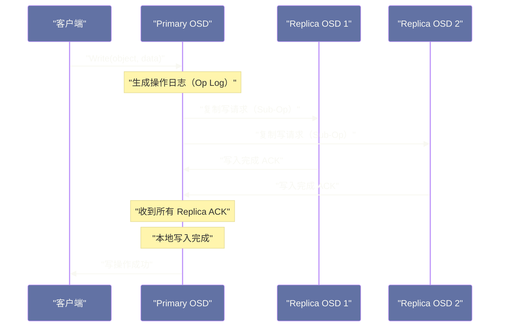

# 04 数据一致性——PG、副本策略与 Recovery

## 摘要

Placement Group（PG）是 Ceph 数据一致性和自愈能力的核心抽象单元。本文深入剖析 PG 的状态机——从正常的 active+clean 状态，到 OSD 故障触发的 Peering 过程、Backfill/Recovery 数据恢复流程，再到写操作的 Primary-Replica 两阶段提交协议。理解 PG 的工作机制，是理解"Ceph 为什么能在 OSD 故障时自动恢复数据、且不丢失任何已确认写入"的关键。

---

## 第 1 章 PG 的本质——分布式事务的管理单元

### 1.1 为什么需要 PG 这个抽象层

在 [[01 Ceph 全局架构——RADOS、CRUSH 与三大存储接口]] 中已经介绍过，PG 是 RADOS 的中间逻辑层：对象先映射到 PG，PG 再通过 CRUSH 映射到 OSD。

PG 的引入不仅是为了减少元数据量（将 N 亿对象映射问题降维为几千 PG 的管理问题），更重要的是：**PG 是数据一致性管理的最小单元**。

一个 PG 的所有对象，被分配到同一组 OSD 上（Primary + Replica）。一致性保证、故障检测、数据恢复，都以 PG 为粒度进行：

- 一次写操作的 Primary-Replica 复制，在 PG 层面完成
- OSD 故障后的 Peering（协商重新确定 PG 成员），以 PG 为单位触发
- Recovery（数据恢复），以 PG 为单位进行数据迁移

如果没有 PG，每次 OSD 变化都需要对集群中所有对象逐一检查一致性，对于 10 亿对象的集群，这是不可行的。有了 PG，每次只需要检查受影响的几千个 PG，每个 PG 内部再处理各自的对象。

### 1.2 PG 的三个核心状态

PG 在正常运行和故障恢复过程中，会经历多种状态，最重要的是理解这三个：

**active+clean**：PG 处于完全健康状态。
- `active`：PG 有一个 Primary OSD，能够处理读写请求
- `clean`：所有对象的所有副本都是最新的（没有 degraded 对象）

**degraded**：部分对象的副本数不足（某个 Replica OSD 故障或丢失）。PG 仍然可以读写（如果 Primary 还在），但数据处于"不安全"状态——此时如果 Primary 也故障，可能发生数据丢失。集群会立即触发 Recovery 流程补全副本。

**inactive**：PG 暂时无法处理请求，通常发生在 Peering 阶段（OSD 故障后，需要重新协商 PG 成员和数据版本）。

---

## 第 2 章 写操作的一致性协议

### 2.1 Primary-Replica 的两阶段提交

Ceph 的写操作通过 **Primary OSD** 协调完成，采用类似两阶段提交的流程：



**详细步骤**：

1. **客户端发送写请求到 Primary OSD**（Primary 由 CRUSH 计算，通常是 OSD 列表的第一个）
2. **Primary 并发转发写请求到所有 Replica OSD**（不串行，并行发送）
3. **Replica OSD 将数据写入本地 BlueStore，返回 ACK**
4. **Primary 等待所有 Replica 的 ACK**
5. **Primary 将数据写入本地**，同时更新 PG log（记录这次操作）
6. **Primary 返回写成功给客户端**

这个流程保证了**强一致性**：客户端收到成功响应时，数据已经写入所有副本（Primary + 所有 Replica）。如果任何一个 OSD 写入失败，Primary 不会返回成功，写操作对客户端不可见。

### 2.2 acks 参数控制一致性级别

RADOS 写操作支持两种 ACK 语义：

**Journal ACK（默认）**：数据写入 BlueStore 的 WAL（对 HDD 来说就是 journal）后即返回 ACK。数据此时持久化到磁盘（WAL），但可能还没有最终写到对象文件（BlueStore 的大写路径是异步的）。这是默认行为，提供持久化保证。

**Full Disk ACK**：数据完全写入 BlueStore 的数据区域后才返回 ACK。比 Journal ACK 延迟更高，但对应数据已经完全落盘。

对于大多数场景，Journal ACK 已经足够安全——数据在 WAL 中持久化，即使 OSD 崩溃重启，WAL 会在启动时自动回放。

### 2.3 写操作与 PG log

每次写操作都会在 PG 的 Op Log 中留下一条记录，格式大致为：

```
{version: 1.45, op: WRITE, object: "foo", offset: 0, length: 4096}
```

PG log 的作用是在 OSD 恢复时进行**增量同步**——如果一个 Replica OSD 短暂下线又恢复，它不需要从 Primary 全量拷贝数据，只需要从 PG log 中找到自己缺失的那部分操作，增量回放即可。

PG log 有长度限制（默认最多保留 3000 条），如果 Replica OSD 下线时间过长，PG log 已经轮转，此时就需要走更昂贵的 **Backfill** 流程（全量比对）而不是增量 Recovery。

---

## 第 3 章 Peering——OSD 故障后的重新协商

### 3.1 为什么需要 Peering

当一个 OSD 故障时，依赖这个 OSD 的所有 PG 都需要重新确定自己的状态：
- 新的 Acting Set 是哪些 OSD（原来的 3 个变成 2 个，或换入新 OSD）
- 各 OSD 上的数据版本是否一致
- 哪些对象需要 Recovery

这个"重新协商"的过程称为 **Peering**。Peering 期间，PG 进入 `inactive` 状态，暂时无法处理读写请求（通常持续几秒到数十秒）。

### 3.2 Peering 的流程

**Step 1：Monitor 通知**

当某个 OSD 故障（心跳超时），Monitor 将其标记为 `down`，更新 OSD Map，并通知所有相关 OSD 的 Primary。

**Step 2：Primary 选举**

如果 Primary OSD 本身故障，该 PG 没有 Primary 了。Monitor 根据新的 OSD Map，指定 Acting Set 中第一个存活的 OSD 作为新 Primary。

**Step 3：Primary 收集 PG Info**

新的 Primary 向 Acting Set 中的所有 Replica 发送 `Query` 请求，收集各 Replica 上的 PG 状态信息（最新版本号、PG log 范围等）。

**Step 4：确定权威历史（Authoritative History）**

Primary 基于收集到的信息，确定哪些写操作是"已提交"的（在多数 OSD 上都有记录），哪些是"未提交"的（只在少数 OSD 上）。

这个步骤是 Peering 最复杂的部分：它需要处理各种场景，如之前的 Primary 在写操作期间崩溃，导致部分 Replica 收到了写入而其他没有。

**Step 5：激活 PG**

确定权威历史后，Primary 向 Replica 发送 `Activate` 消息，PG 进入 `active` 状态，可以接受新的读写请求。此时 PG 可能还处于 `degraded` 状态（部分副本缺失），但读写已经可以进行，恢复在后台异步进行。

---

## 第 4 章 Recovery 与 Backfill——数据恢复的两种路径

### 4.1 Recovery（基于 PG log 的增量恢复）

Recovery 适用于 OSD 短暂下线又重新上线的场景（如 OSD 进程崩溃重启、短暂网络中断）。

前提条件：下线期间的所有写操作都在 PG log 中有记录（PG log 没有轮转）。

Recovery 流程：
1. Replica OSD 重新上线，连接 Primary
2. Primary 比较 Replica 的 PG log 版本与自己的最新版本
3. Primary 找出 Replica 缺失的操作列表
4. Primary 将缺失的对象数据推送给 Replica（或 Replica 从 Primary 拉取）
5. Replica 应用缺失的操作，追上 Primary 的状态
6. PG 进入 `active+clean`

Recovery 只传输缺失的增量数据，效率很高。

### 4.2 Backfill（全量比对与补全）

Backfill 适用于 OSD 下线时间过长（PG log 已轮转），或者添加全新 OSD 时（新 OSD 没有任何 PG 数据）。

由于没有 PG log 可以参考，Primary 只能通过**逐对象扫描**来确定 Replica 上缺少哪些对象：

1. Primary 枚举自己 PG 内所有对象的 OID 和版本号
2. 与 Replica 的对象列表对比（Backfill 扫描）
3. 将缺失或版本落后的对象推送给 Replica
4. PG 进入 `active+clean`

Backfill 的代价远高于 Recovery：需要枚举所有对象，并可能传输大量数据（相当于全量复制）。对于每个 PG 包含数万个对象的情况，一次 Backfill 可能需要数十分钟甚至数小时，期间对 OSD 产生显著的 IO 压力。

### 4.3 Recovery 限速——保护正常业务 IO

大规模数据恢复会消耗大量磁盘 IO 和网络带宽，影响正常业务。Ceph 提供了细粒度的 Recovery 限速参数：

```bash
# 限制每个 OSD 同时进行的 Recovery 操作数
ceph config set osd osd_max_backfills 1

# 限制 Recovery 的字节速率（每个 OSD，单位 bytes/s）
ceph config set osd osd_recovery_max_chunk 8388608  # 每次最多恢复 8MB

# 临时降低 Recovery 优先级（生产故障时紧急使用）
ceph osd set nobackfill   # 暂停 Backfill
ceph osd set norecover    # 暂停 Recovery
# 故障处理完毕后恢复
ceph osd unset nobackfill
ceph osd unset norecover
```

> [!warning] 生产避坑：Recovery 速率与业务 IO 的权衡
> 在大量 OSD 同时故障（如机架断电）后，集群会同时触发大量 PG 的 Recovery，可能导致整个集群的 IO 性能下降 50-80%，影响上层业务。
> 紧急情况下，可以通过 `ceph osd set norecover` 暂停 Recovery，优先保证业务 IO。等业务低峰期再恢复 Recovery。但注意：暂停 Recovery 期间，集群处于 `degraded` 状态，若再有 OSD 故障，数据丢失风险升高。

---

## 第 5 章 PG 状态速查表

| 状态 | 含义 | 是否影响读写 | 处理建议 |
| :--- | :--- | :---: | :--- |
| **active+clean** | 完全健康 | 否 | 正常 |
| **active+degraded** | 有对象副本不足，恢复中 | 读写正常 | 等待恢复，监控进度 |
| **active+undersized** | PG 的实际 OSD 数少于 size 配置 | 读写正常 | 检查 OSD 是否足够 |
| **active+remapped** | CRUSH 计算出新的 OSD 映射，迁移中 | 读写正常 | 等待 Backfill 完成 |
| **peering** | PG 正在协商状态，短暂不可用 | 暂时不可用 | 等待 Peering 完成（通常几秒） |
| **stale** | PG 的 Primary 长时间未上报状态 | 不可用 | 检查 Primary OSD 是否宕机 |
| **inconsistent** | Scrub 发现副本间数据不一致 | 读写正常（但数据有问题） | 立即执行 `ceph pg repair` |
| **incomplete** | PG 无法找到足够数量的 OSD 构成 quorum | 不可用 | 严重故障，可能需要从备份恢复 |

---

## 第 6 章 小结

PG 是 Ceph 数据一致性体系的枢纽：

- **写操作**通过 Primary-Replica 协议确保所有副本同步写入，强一致性
- **故障感知**由 Monitor 的 OSD Map 更新驱动，以 PG 为粒度触发 Peering
- **数据恢复**根据 PG log 是否完整，走 Recovery（增量高效）或 Backfill（全量）路径
- **Scrub/Deep Scrub** 主动检测数据损坏，配合 Checksum 实现端到端完整性保护

这套机制的设计目标是：**只要多数副本存活，写入已确认的数据就不会丢失，且系统能够在不需要人工干预的情况下自动恢复到健康状态**。

---

**延伸阅读**：
- [[02 CRUSH 算法——去中心化的数据放置]]
- [[03 OSD 与对象存储——BlueStore 引擎]]
- [[06 Ceph 运维——集群部署、PG 调优与故障处理]]

---

> [!note] 思考题
> 1. CephFS 的元数据由 MDS（Metadata Server）管理。MDS 将目录树的不同子树分配给不同的 MDS 进程——实现元数据的水平扩展。但目录树的访问模式通常是不均匀的（如某个热点目录被频繁访问）。MDS 的动态子树分区（Dynamic Subtree Partitioning）如何处理热点？当一个子树突然变热时，迁移子树的开销和延迟是多少？
> 2. CephFS 支持 POSIX 语义——包括文件锁、硬链接、`readdir` 一致性等。但严格的 POSIX 语义会限制性能（如 `readdir` 需要一致性快照）。CephFS 的 `client_cache_size` 和 `client_caps` 机制如何在一致性和性能之间取舍？
> 3. CephFS 适合什么工作负载？与 NFS（适合小规模共享）、HDFS（适合大数据批处理）和 JuiceFS（云原生场景）相比，CephFS 的定位是什么？在 HPC（高性能计算）和机器学习训练场景中，CephFS 的元数据性能是否是瓶颈？
