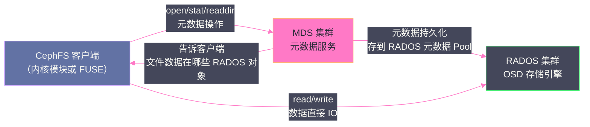

# 05 CephFS 分布式文件系统

## 摘要

CephFS 是构建在 RADOS 之上的 POSIX 兼容分布式文件系统，通过 MDS（Metadata Server）管理文件系统元数据，文件数据则直接存储在 RADOS 对象中。本文深入分析 CephFS 的架构设计——MDS 的元数据缓存机制、动态子树分区实现元数据水平扩展、POSIX 语义的实现边界，以及与 HDFS、[[JuiceFS]] 的定位差异。CephFS 是云原生和 HPC 场景中替代 NFS 的重要选择，理解其内部机制有助于合理规划 MDS 容量和排查元数据热点问题。

---

## 第 1 章 CephFS 的架构定位

### 1.1 为什么 RADOS 对象存储不够用

RADOS 是优秀的分布式对象存储，但它只提供扁平的 KV 语义（OID → 对象数据）。真实业务场景中，大量应用程序通过 POSIX 文件接口工作：`open`/`read`/`write`/`mkdir`/`stat` 等系统调用，期望看到一个层次化的目录树结构，支持原子重命名、文件锁等复杂语义。

要在 RADOS 之上提供 POSIX 文件接口，需要：
1. **目录树结构**：父子关系、路径解析（`/a/b/c.txt` → inode）
2. **文件元数据**：inode 信息（大小、权限、修改时间、扩展属性）
3. **POSIX 原子语义**：`rename` 必须是原子的（用于文件替换等操作）
4. **文件锁**：多客户端并发访问同一文件时的协调

这些功能不是 RADOS 对象模型天然具备的，需要一个专门的元数据服务——这就是 MDS 的存在意义。

### 1.2 CephFS 的数据流分离设计

CephFS 最重要的设计决策是**元数据路径与数据路径的完全分离**：

- **元数据操作**（`readdir`、`stat`、`chmod`、`mkdir` 等）→ 走 MDS
- **文件数据操作**（读写文件内容）→ 绕过 MDS，直接走 RADOS

这种分离设计的好处：
- **文件数据的吞吐不受 MDS 限制**，直接利用所有 OSD 的并行 IO 能力
- MDS 的职责清晰——只负责元数据，不需要处理数据流
- 文件系统的扩展性主要由 RADOS 决定，不受 MDS 单点制约

---

## 第 2 章 MDS 的元数据管理

### 2.1 元数据的存储结构

MDS 的元数据最终持久化在 RADOS 的**元数据 Pool**中，以 RADOS 对象的形式存储。每个 inode（文件或目录）对应一个或多个 RADOS 对象。

但 MDS 的核心是内存中的**元数据缓存（Metadata Cache）**：热点目录和文件的 inode 信息被缓存在 MDS 的内存中，绝大多数元数据操作在内存中完成，只有缓存未命中或需要持久化时才访问 RADOS。

MDS 内存中维护以下数据结构：

**CInode（Cached Inode）**：内存中的 inode 表示，包含 inode 号、文件大小、权限、时间戳、扩展属性等。一个文件系统中可能有数亿个 inode，但 MDS 只缓存热点 inode（由 LRU 策略管理）。

**CDentry（Cached Dentry）**：目录项缓存，记录目录到子文件/子目录的映射（`filename → inode`）。目录树的路径解析（将 `/a/b/c.txt` 解析为 inode 号）通过遍历 CDentry 完成。

**CDir（Cached Dir）**：目录缓存，一个目录的所有子项（Dentry）。当客户端执行 `readdir` 时，MDS 加载对应 CDir 并返回其所有 CDentry。

### 2.2 MDS 的 Journal——元数据的持久化

MDS 有自己的 Journal（元数据日志），记录所有元数据变更操作。Journal 存储在 RADOS 的元数据 Pool 中（本质是一段 RADOS 对象序列）。

**写元数据的流程**：
1. MDS 收到元数据变更请求（如 `mkdir /data/job-001`）
2. MDS 在内存中立即更新缓存（CInode、CDentry）
3. MDS 将操作追加写入 Journal（异步，批量）
4. Journal 积累到一定大小或超时后，触发 **Flush**：将 Journal 中记录的 inode 和目录数据正式写入 RADOS（形成持久化的 Checkpoint）
5. Checkpoint 完成后，Journal 中对应的部分可以安全删除（类似 WAL 的 truncate）

如果 MDS 崩溃重启，通过回放 Journal 恢复内存中的元数据缓存状态，通常在几秒到几十秒内完成。

### 2.3 MDS 内存是关键约束

MDS 的核心性能指标是**元数据缓存命中率**。如果所有热点目录和文件的 inode 都在内存中，元数据操作延迟极低（亚毫秒级）。如果缓存不足，需要频繁从 RADOS 加载 inode，延迟升高 10-100 倍（RADOS 读取需要几毫秒）。

**MDS 的内存规划**：

经验值：每个 inode 缓存在内存中约占 1-2KB（元数据 + 指针结构）。

| 文件数量 | MDS 元数据缓存大小 | 推荐 MDS 内存 |
| :---: | :---: | :---: |
| 100 万 | ~2 GB | 8 GB |
| 1000 万 | ~20 GB | 32 GB |
| 1 亿 | ~200 GB | 256 GB（需要多 Active MDS） |

这个约束说明：**CephFS 不适合存储海量小文件（>1 亿）的场景**——此时 MDS 内存成为系统瓶颈。这类场景更适合使用 [[JuiceFS]]（元数据存储在 Redis/TiKV 等专用 KV 数据库中，内存扩展能力更好）。

---

## 第 3 章 动态子树分区——多 Active MDS 的扩展性

### 3.1 为什么需要多 Active MDS

单个 MDS 的元数据处理能力有限（受 CPU、内存和内存带宽限制）。对于大规模文件系统，当元数据 QPS 超过单个 MDS 的处理能力时，需要多个 MDS 并行工作。

CephFS 通过**动态子树分区（Dynamic Subtree Partitioning）**实现多 Active MDS 的工作：将目录树分成多个子树（Subtree），每个子树由一个 MDS 负责管理。不同子树的元数据操作可以并行，没有互相阻塞。

### 3.2 子树分区的自动负载均衡

CephFS 的 MDS 集群持续监控各个目录子树的访问热度（元数据 QPS），根据负载动态调整子树与 MDS 的归属关系：

- 热点目录所在子树被分割成更小的子树，分配给不同的 MDS
- 冷数据子树被合并，减少 MDS 间协调开销
- 当某个 MDS 的负载过高，部分子树迁移给其他 MDS（在线迁移，对客户端透明）

这种动态调整是自动进行的，不需要管理员手动干预。

### 3.3 多 Active MDS 的跨 MDS 操作

当客户端的操作跨越多个 MDS 管辖的子树时（如 `rename /a/b.txt /c/d.txt`，`/a` 和 `/c` 分别由不同 MDS 管理），需要两个 MDS 协调完成原子操作。这通过**两阶段提交**实现，但会带来额外的延迟（跨 MDS 通信开销）。

这也是为什么多 Active MDS 主要提升并行度，而不是所有场景的延迟都会降低——频繁的跨 MDS 操作反而可能增加延迟。

---

## 第 4 章 POSIX 语义的实现与边界

### 4.1 CephFS 完整支持的 POSIX 语义

CephFS 支持大多数标准 POSIX 语义：

- **原子 rename**：`rename(src, dst)` 是原子的，不会出现中间状态
- **硬链接**：多个目录项指向同一 inode
- **符号链接**：标准的 symlink 支持
- **文件锁**：POSIX 文件锁（`fcntl`/`flock`）
- **扩展属性**：`setxattr`/`getxattr`
- **完整的权限模型**：POSIX ACL、用户/组权限

### 4.2 CephFS 的局限性与注意事项

**局限一：fsync 延迟**

对 CephFS 文件调用 `fsync` 时，需要确保：
1. 文件数据刷新到所有 RADOS OSD（同步写入）
2. 元数据变更提交到 MDS Journal

这个过程可能涉及多次网络往返，`fsync` 延迟比本地文件系统高出一个数量级（几毫秒到几十毫秒）。对于频繁 `fsync` 的应用（如数据库 WAL），CephFS 不是好选择。

**局限二：目录 readdir 的一致性**

在多客户端并发创建文件的场景下，不同客户端看到的目录内容可能存在短暂的不一致（缓存未及时失效）。CephFS 提供 `ceph.disable_readdir_caching` 选项，但会损失性能。

**局限三：文件系统扩展属性大小限制**

CephFS 的 xattr 存储在 MDS 的 omap 中，单个 xattr 大小和数量有限制（默认每个文件最多 64 个 xattr，单个 xattr 最大 64KB）。

> [!warning] 生产避坑：数据库不要放在 CephFS 上
> MySQL、PostgreSQL 等关系数据库不适合直接部署在 CephFS 上，原因是数据库对 `fsync` 性能要求极高，且使用文件锁进行并发控制（性能不如本地锁）。
> 数据库应当使用 **Ceph RBD** 提供块设备，在块设备上格式化本地文件系统（ext4/XFS），数据库运行在这个本地文件系统上——此时 `fsync` 的语义由本地文件系统和 RBD 的 Ceph Journal 联合保证，延迟比 CephFS 低得多。

---

## 第 5 章 CephFS 与 HDFS、JuiceFS 的对比

| 维度 | CephFS | HDFS | [[JuiceFS]] |
| :--- | :--- | :--- | :--- |
| **元数据存储** | MDS（内存+RADOS） | NameNode（全量内存） | Redis/TiKV/MySQL（专用 KV） |
| **数据存储** | RADOS（OSD 集群） | DataNode（本地文件系统） | 对象存储（S3/MinIO/CephRGW） |
| **POSIX 兼容性** | 完整 POSIX | 类 POSIX（不完整） | 完整 POSIX |
| **海量小文件** | 不适合（MDS 内存瓶颈） | 不适合（NameNode 内存瓶颈） | 适合（元数据独立扩展） |
| **大文件顺序 IO** | 好 | 极好（专门优化） | 好 |
| **随机小 IO** | 可以（通过 RBD 更优） | 差 | 好 |
| **Kubernetes 集成** | CSI Driver（cephfs） | 需要额外适配 | CSI Driver（juicefs） |
| **运维复杂度** | 高（MDS + RADOS） | 中（NameNode HA） | 低（无状态客户端+对象存储） |
| **存算分离** | 部分（数据在 RADOS，但需要 Ceph 集群） | 不支持（计算与数据耦合） | 完全支持（数据在独立对象存储） |

**选型建议**：

- **HPC 计算（MPI/科学计算）**，需要完整 POSIX + 高性能共享文件系统 → **CephFS**
- **Kubernetes 持久化存储**，需要 ReadWriteMany（多 Pod 共享挂载）→ **CephFS**
- **大数据 Spark/Hive 存算分离**，文件数量多但不是海量 → **CephFS 或 JuiceFS**
- **海量小文件**（亿级别以上）→ **JuiceFS**（元数据扩展能力更好）
- **替代 HDFS 的大数据存储层** → **JuiceFS**（运维更简单，对象存储后端灵活）

---

## 第 6 章 小结

CephFS 通过 MDS 的元数据管理层，在 RADOS 对象存储之上实现了完整的 POSIX 文件系统语义。其核心优势是"数据路径不经过 MDS"——文件数据直连 RADOS，吞吐不受 MDS 制约；多 Active MDS + 动态子树分区提供了元数据的水平扩展能力。

CephFS 的主要约束是：MDS 内存决定了能高效管理的文件数量上限，`fsync` 延迟高于本地文件系统，不适合数据库等对 fsync 延迟敏感的应用。

对于需要 POSIX 兼容、多客户端共享访问、且已有 Ceph 集群的场景，CephFS 是自然的选择。

---

**延伸阅读**：
- [[01 Ceph 全局架构——RADOS、CRUSH 与三大存储接口]]
- [[01 JuiceFS 全局架构——元数据引擎加对象存储的分离设计]]（对比参考）

---

> [!note] 思考题
> 1. Ceph OSD 的日志写入（BlueStore 的 WAL）放在 NVMe SSD 上可以显著降低写延迟。在混合存储部署（NVMe WAL + HDD 数据盘）中，NVMe 与 HDD 的比例应该如何规划？如果一块 NVMe 承担了太多 OSD 的 WAL，NVMe 本身的延迟会增加——如何避免？
> 2. Ceph 的网络带宽在大规模恢复（Recovery）和重平衡（Rebalance）时可能成为瓶颈。将 public network（客户端访问）和 cluster network（OSD 间复制和恢复）分离到不同的网络是最佳实践。如果两个网络共享同一物理链路（通过 VLAN 隔离），QoS 配置如何保证 public network 不被 recovery 流量淹没？
> 3. `osd_op_queue_cut_off` 和 `osd_op_queue_mclock_*` 参数控制 OSD 内部的请求调度。mClock 调度器（Ceph Pacific+）为客户端 IO、恢复 IO 和后台 IO 分配不同的权重。在白天（业务高峰）和夜间（恢复窗口）你会如何调整 mClock 的权重分配？
