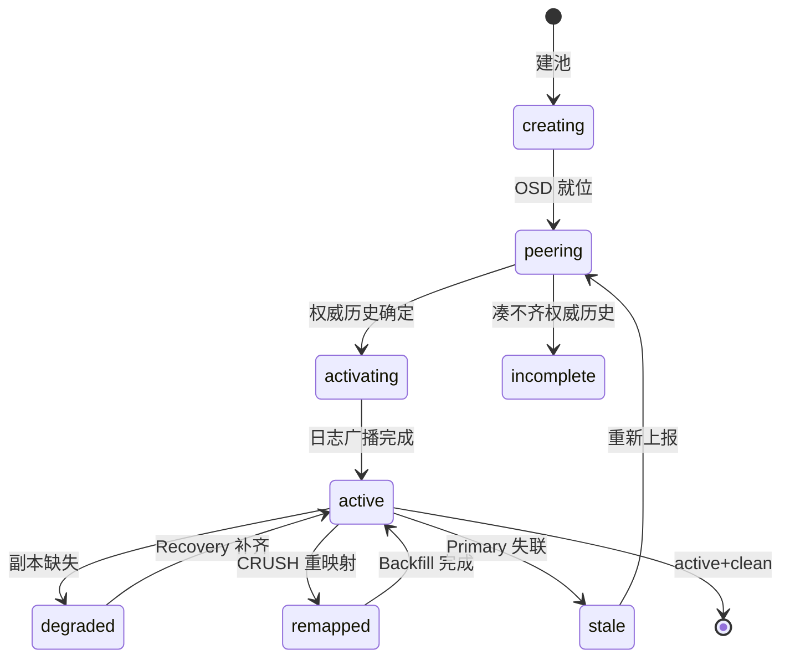
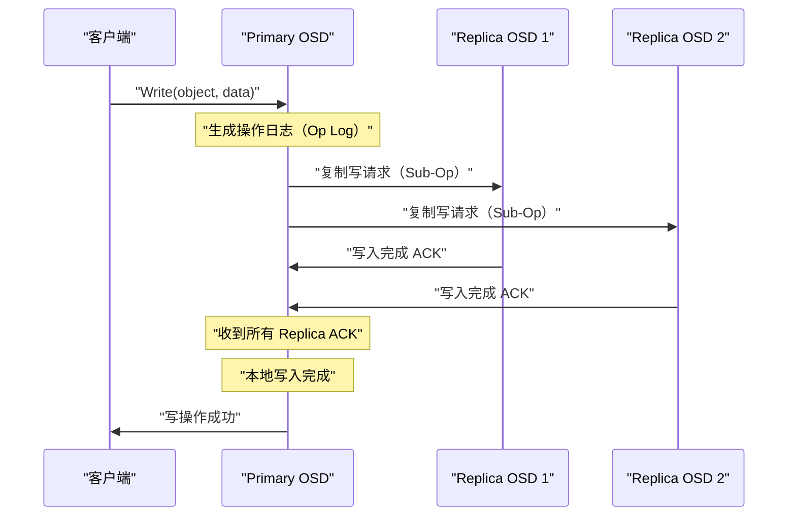
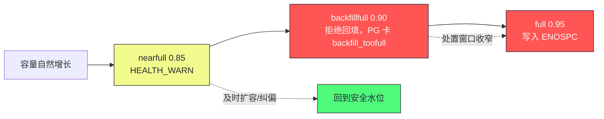

# 05 PG 状态机与数据一致性——Peering、Recovery 与 Backfill

**摘要：**

2007 年的 RADOS 论文（Weil 等人，PDSW 2007）把 Ceph 的可靠性承诺浓缩成一句话：只要多数副本存活，已确认的写入就不会丢失，而且恢复过程不需要人工介入。兑现这句话的载体，既不是 Monitor 也不是 OSD 进程本身，而是一个更小的抽象单元——归置组（Placement Group，下文简称 PG）。PG 是数据一致性管理的最小单元，也是集群健康报表的最小行：你在 `ceph health detail` 里看到的每一行告警，本质都是某个 PG 状态机的一次迁移。本文先从运维视角把 PG 状态词汇表一次讲全——每个状态的含义、成因与是否需要干预的判级；再沿三条主线深入协议内部：写操作如何经 Primary-Replica 两阶段提交达成强一致，OSD 故障后 Peering 如何重新协商出权威历史（Authoritative History），Recovery 与 Backfill 两条恢复路径如何在"尽快补齐副本"与"不压垮业务 IO"之间做权衡；最后落到 pg_autoscaler 与 pg_num 规划这个新手最常见的翻车点。全文回答两个问题：集群降级时，你看到的每个状态词到底在告诉你什么；以及哪些情况只需等待，哪些情况必须立即动手。

---

## 第 1 章 PG 的本质——分布式事务的管理单元

### 1.1 为什么需要 PG 这个抽象层

在 [[中间件/Ceph/01 Ceph 全局架构——RADOS、CRUSH 与三大存储接口|01 架构篇]] 中已经介绍过，PG 是 RADOS 的中间逻辑层：对象先映射到 PG，PG 再通过 CRUSH 映射到 OSD。

PG 的引入不仅是为了减少元数据量（将 N 亿对象映射问题降维为几千 PG 的管理问题），更重要的是：**PG 是数据一致性管理的最小单元**。

一个 PG 的所有对象，被分配到同一组 OSD 上（Primary + Replica）。一致性保证、故障检测、数据恢复，都以 PG 为粒度进行：

- 一次写操作的 Primary-Replica 复制，在 PG 层面完成
- OSD 故障后的 Peering（协商重新确定 PG 成员），以 PG 为单位触发
- Recovery（数据恢复），以 PG 为单位进行数据迁移

如果没有 PG，每次 OSD 变化都需要对集群中所有对象逐一检查一致性，对于 10 亿对象的集群，这是不可行的。有了 PG，每次只需要检查受影响的几千个 PG，每个 PG 内部再处理各自的对象。

这个设计思路在 2007 年的 RADOS 论文里已经成形：把"对象级一致性协商"的成本摊到"组"上，组内成员通过日志对齐达成一致，组与组之间彼此独立、互不牵连。十几年过去，RADOS 底下的存储引擎从 FileStore 换成了 BlueStore（见 [[中间件/Ceph/04 OSD 与 BlueStore——存储引擎深度解析|04 BlueStore 篇]]），PG 这层抽象却几乎原样保留——抽象层的寿命，往往比它脚下的实现长得多。

不妨把 PG 想象成图书馆的**书车**：管理员（OSD）不必为每一本书单独登记流转状态，而是按书车对账；一辆书车换了管理员，只需要交接这一车的账本，而不是盘点全馆藏书。技术上的对应关系是：对象到 PG 的映射由哈希决定、与对象大小无关，PG 到 OSD 的映射由 CRUSH 决定、可随集群拓扑变化重算——两级映射各自独立演化，这正是 [[中间件/Ceph/02 CRUSH 算法——去中心化的数据放置|02 CRUSH 篇]] 讨论过的去中心化放置的落点。

### 1.2 PG 的三个核心状态

PG 在正常运行和故障恢复过程中，会经历多种状态，最重要的是理解这三个：

**active+clean**：PG 处于完全健康状态。

- `active`：PG 有一个 Primary OSD，能够处理读写请求
- `clean`：所有对象的所有副本都是最新的（没有 degraded 对象）

**degraded**：部分对象的副本数不足（某个 Replica OSD 故障或丢失）。PG 仍然可以读写（如果 Primary 还在），但数据处于"不安全"状态——此时如果 Primary 也故障，可能发生数据丢失。集群会立即触发 Recovery 流程补全副本。

**inactive**：PG 暂时无法处理请求，通常发生在 Peering 阶段（OSD 故障后，需要重新协商 PG 成员和数据版本）。

这三个状态是理解全文的锚点：active 回答"能不能服务"，clean 回答"副本齐不齐"，inactive 回答"是不是正在协商"。不过真实的集群输出远比这三个词拥挤——状态之间是可以组合的，`active+undersized+degraded+remapped+backfill_wait` 这样的长串在生产里屡见不鲜。要把这些长串读成信息而不是噪音，需要一张完整的词汇表，这正是下一章的内容。

### 1.3 状态机是 Ceph 的体检报告单

为什么笔者建议把"PG 状态"当作 Ceph 运维的第一课，而不是把时间花在背参数上？原因在于，Ceph 把绝大多数内部故障都翻译成了 PG 状态的变化：盘坏了是 degraded，网络抖了是 peering 卡住，容量满了是 backfill_toofull，Monitor 失联是 stale。你未必总能第一时间知道根因，但状态串一定会先变化——它是集群的体检报告，各项指标的变化先于主诉出现。

反过来说，不认识这些状态词的运维，面对告警只有两种反应：要么慌乱地重启大法，要么视而不见直到小事拖成大祸。譬如 `backfill_toofull` 出现时，集群其实是在喊"我快没地方搬数据了"，此时正确的动作是查容量水位与 CRUSH 权重，而常见的错误动作是把它当成抖动忽略掉——直到某天写入直接报 `ENOSPC`。状态词汇表的价值就在这里：它把"集群现在缺什么"翻译成了人话。

---

## 第 2 章 PG 状态机全景——运维视角的状态词汇表

### 2.1 状态是可组合的标签，不是互斥的枚举

先纠正一个普遍的读法错误。很多人把 `active+undersized+degraded+remapped+backfill_wait` 当成一个"状态名"去文档里查，结果一无所获。正确的读法是把每个词当成一个独立的布尔位：

- `active` 说的是"能否服务读写"
- `undersized` 说的是"在岗 OSD 数量是否少于池的 size 配置"
- `degraded` 说的是"对象副本数是否少于配置值"
- `remapped` 说的是"数据是否正在从旧位置搬往新位置"
- `backfill_wait` 说的是"搬运是否还在排队"

五个位各自独立成立，组合起来才是这个 PG 的完整画像。严格地说，PG 状态机与教科书式的有限状态机不同：active、peering、inactive 这条主干是互斥的，其余的 degraded、remapped、recovering 等是叠加在主干上的修饰位。理解了这一点，`ceph health detail` 里再长的状态串都不再吓人——你只需要逐个位拆开读。

不妨拿一个真实感十足的长串练手：`active+undersized+degraded+remapped+backfill_toofull`。逐位拆开就是一句完整的话——这个 PG 能正常服务（active），但在岗 OSD 只有 2 个、少于 size=3（undersized），部分对象只有 2 个副本（degraded），CRUSH 已经算好了新家（remapped），只是搬家被目标盘的容量水位挡住了（backfill_toofull）。五个位连起来，故障的"是什么、为什么、卡在哪"一次读完，处置方向也自然浮现：查目标盘容量，而不是重启 OSD。

### 2.2 核心状态速查表

先给出最常用的八个状态，这张表值得贴在工位上：

| 状态 | 含义 | 是否影响读写 | 处理建议 |
| :--- | :--- | :---: | :--- |
| **active+clean** | 完全健康 | 否 | 正常 |
| **active+degraded** | 有对象副本不足，恢复中 | 读写正常 | 等待恢复，监控进度 |
| **active+undersized** | PG 的实际 OSD 数少于 size 配置 | 读写正常 | 检查 OSD 是否足够 |
| **active+remapped** | CRUSH 计算出新的 OSD 映射，迁移中 | 读写正常 | 等待 Backfill 完成 |
| **peering** | PG 正在协商状态，短暂不可用 | 暂时不可用 | 等待 Peering 完成（通常几秒） |
| **stale** | PG 的 Primary 长时间未上报状态 | 不可用 | 检查 Primary OSD 是否宕机 |
| **inconsistent** | Scrub 发现副本间数据不一致 | 读写正常（但数据有问题） | 立即执行 `ceph pg repair` |
| **incomplete** | PG 无法找到足够数量的 OSD 构成 quorum | 不可用 | 严重故障，可能需要从备份恢复 |

### 2.3 完整状态词汇表：含义、成因与判级

八个状态覆盖不了生产现场。下表把高频状态（含任务清单里的全部十五个）按"含义、常见成因、判级"整理成一张完整词汇表。这张表扮演的是急诊分诊台的角色——分诊护士不负责治病，但决定谁直接进抢救室、谁坐在候诊区观察；判级分四档：**正常**（无需处理）、**关注**（观察即可）、**告警**（需要介入排查）、**紧急**（数据可用性或安全性正在受损）。

| 状态 | 含义 | 常见成因 | 判级 |
| :--- | :--- | :--- | :--- |
| **active** | Peering 完成，Primary 可服务读写 | 正常运行 | 正常 |
| **clean** | 所有副本数达标且经过校验，无多余副本 | 正常运行 | 正常 |
| **degraded** | 部分对象副本数不足 size，但 PG 仍可服务 | OSD 故障、OSD 被 out、写入尚未复制完 | 关注（持续不收敛则告警） |
| **undersized** | acting set 成员数少于池 size | OSD down 未被替换、池 size 调大后未补齐 | 关注 |
| **remapped** | 数据正从旧 acting set 向 CRUSH 新算出的位置迁移 | 扩容、缩容、CRUSH map 变更、OSD 换盘 | 关注 |
| **recovering** | 正在基于 PG log 做增量恢复 | OSD 短暂 down 后回归 | 关注 |
| **recovery_wait** | 恢复任务已就绪，在排队等并发配额 | 恢复限速参数压得太低、恢复量太大 | 关注（长期不动则告警） |
| **backfill_wait** | 回填已排程，等待开始 | 回填并发受限、按优先级排队 | 关注 |
| **backfilling** | 回填正在进行 | 扩容、换盘、remapped 迁移 | 关注 |
| **backfill_toofull** | 回填目标盘接近 backfillfull 水位，拒绝写入 | 容量触顶、CRUSH 权重倾斜 | 告警 |
| **backfill_unfound** | 回填发现无法定位来源的对象 | 极端故障序列、快照克隆链断裂 | 告警（需人工裁决） |
| **peering** | 成员间正在对齐 PG log 与元数据 | OSD map 变更、OSD 重启 | 正常（秒级）；持续数分钟即告警 |
| **activating / activating+peered** | Peering 完成，正在广播日志、等待激活 | 大规模 Peering 后的收尾 | 关注 |
| **stale** | Primary 超过阈值未向 Monitor 上报 | Primary 宕机、网络分区、负载过高卡死 | 告警（大面积 stale 为紧急） |
| **down** | PG 当前没有 Primary 可用 | acting set 全部或关键成员 down | 紧急 |
| **incomplete** | 无法凑齐足够 OSD 重建权威历史 | 故障叠加、min_size 以下、log 断裂 | 紧急 |
| **scrubbing / deep-scrubbing** | 正在校验副本元数据或数据 | 周期性 Scrub 调度 | 正常 |
| **snaptrim / snaptrim_wait** | 正在修剪快照引用的废弃对象 | 快照删除后的后台清理 | 正常（堆积过多则关注） |
| **inconsistent** | Scrub 发现副本间不一致 | 静默损坏、历史写入缺陷 | 告警（`ceph pg repair`） |
| **unfound** | 存在无法定位来源的对象 | 与 backfill_unfound 同源 | 告警 |

读这张表的关键不是背，而是建立"判级→动作"的条件反射：正常与关注档交给自动化（监控采集、等待自愈），告警档才值得人介入，紧急档意味着数据正在裸奔。譬如同样是 degraded，恢复进度条在动就是关注档，卡在 `backfill_toofull` 一小时不动就是告警档——判级看的是趋势与组合，不是单个词。

> [!info] 判级表与监控体系的映射
> 这张四档判级表可以直接翻译成告警规则：ceph-mgr 的 Prometheus exporter 暴露了 `ceph_pg_active`、`ceph_pg_degraded`、`ceph_pg_clean` 等按状态计数的指标序列，关注档对应"出现即记录、不告警"的仪表盘项，告警档对应"状态持续 N 分钟不收敛才触发"的规则（卡住与否的判定阈值由 `mon_pg_stuck_threshold` 控制，默认 60 秒，告警规则里的 N 应远大于它），紧急档（inactive、incomplete、大面积 stale）则应配置为立即通知。把"判级"固化成"告警分级"，这张表才真正长在运维体系里，而不是躺在文档里。

### 2.4 状态转移全景图

下图把主干（能否服务）与恢复支线（如何补齐）画在一张图里，箭头上的标注是触发条件。注意恢复支线上的状态都是"active 之后的修饰位"，PG 在恢复期间始终可以服务读写：



图里省略了 scrubbing、snaptrim 等与故障无关的支线，它们与恢复状态共享同一个特征：都是后台任务的状态投影，不阻塞主干。真正的分水岭在 peering 与 incomplete——前者是主干上的短暂暂停，后者意味着这条 PG 的历史出现了无法自行弥合的断裂。

### 2.5 ceph health detail 逐段解读

词汇表背得再熟，也要落到真实输出上。下面是一个 12 OSD、单池 4096 PG、约 840 万对象的集群在 osd.7 宕机后的 `ceph health detail` 示意输出（数字取整，Luminous 之后的版本格式大致如此）：

```text
HEALTH_WARN 1 osds down; Degraded data redundancy: 2100000/25200000 objects
degraded (8.333%), 341 pgs degraded, 341 pgs undersized
[WRN] OSD_DOWN: 1 osds down
    osd.7 is down (weight 3.63, id 7 in)
[WRN] PG_DEGRADED: Degraded data redundancy: 2100000/25200000 objects
degraded (8.333%), 341 pgs unclean, 341 pgs degraded, 341 pgs undersized
    pg 2.1f is active+undersized+degraded, acting [3,5,9]
    pg 2.24 is active+undersized+degraded+remapped+backfill_wait, acting [3,5,11]
[WRN] PG_BACKFILL_FULL: 2 pgs backfill_toofull
    pg 2.3a is active+undersized+degraded+remapped+backfill_toofull, acting [3,5,11]
```

逐段拆解，这段输出分四层：

1. **首行健康等级与汇总**：`HEALTH_OK / HEALTH_WARN / HEALTH_ERR` 三级，WARN 表示可用性或冗余受损但未到错误级。首行分号隔开的短语是全文摘要，运维群里贴这一行就够定位问题类别。
2. **`[WRN]` 分类小节**：每个小节一个错误码（OSD_DOWN、PG_DEGRADED、PG_BACKFILL_FULL），错误码后跟同类条目计数。找根因时按错误码分组看，比逐行扫快得多。
3. **pg 行**：`pg 2.1f` 的 2 是池编号、1f 是十六进制的 PG 短号；状态串按 2.1 节的方法逐位拆读；`acting [3,5,9]` 是当前在岗的 OSD 名单，方括号里第一个就是 Primary。
4. **数字读法**：`2100000/25200000 objects degraded (8.333%)` 的分母是按副本数计的对象总量（840 万对象 × 3 副本），8.333% 恰好约等于 341/4096——一个 OSD 宕机影响的 PG 占比，与 4096 PG 均摊到 12 块盘的比例吻合。数字对得上，说明集群只是单盘故障；对不上，往往意味着 CRUSH 权重或拓扑有问题。

对可疑的 PG，用 `ceph pg map 2.1f` 拿到 up/acting 两套名单做对照，再用 `ceph pg dump_stuck inactive unclean stale undersized degraded` 一次性捞出所有卡住的 PG。健康输出的读法就这三板斧：先看等级，再按错误码分组，最后对单个 PG 深挖。

在 health detail 之前，多数人先看到的是 `ceph -s` 里的 PG 汇总行，它的读法同样值得交代。形如 `4096 pgs: 3755 active+clean, 341 active+undersized+degraded; 25 TiB data, ...` 的这一行，冒号前是 PG 总数，冒号后按状态组合分组计数——341 个 PG 处于同一组合，恰好对应一块 OSD 的承载量，这个"组合数与故障单元数对得上"的直觉，是快速判断故障范围的经验法则。分号之后的 data/used/avail 三段则是容量视角，当 avail 与 nearfull 水位线逼近时，5.5 节的滑坡链就该被提上日程。健康输出的两个视角——PG 状态视角与容量视角——在这行里交汇，这也是为什么排障时 `ceph -s` 永远是第一条命令。

---

## 第 3 章 写操作的一致性协议

### 3.1 Primary-Replica 的两阶段提交

Ceph 的写操作通过 **Primary OSD** 协调完成，采用类似两阶段提交的流程。Primary 在这里扮演的是施工现场总指挥的角色——所有工序由他派发、由他验收，出了问题只需要问一个人；Replica 只对总指挥负责，彼此之间互不通话。完整的消息时序如下图：



**详细步骤**：

1. **客户端发送写请求到 Primary OSD**（Primary 由 CRUSH 计算，通常是 OSD 列表的第一个）
2. **Primary 并发转发写请求到所有 Replica OSD**（不串行，并行发送）
3. **Replica OSD 将数据写入本地 BlueStore，返回 ACK**
4. **Primary 等待所有 Replica 的 ACK**
5. **Primary 将数据写入本地**，同时更新 PG log（记录这次操作）
6. **Primary 返回写成功给客户端**

这个流程保证了**强一致性**：客户端收到成功响应时，数据已经写入所有副本（Primary + 所有 Replica）。如果任何一个 OSD 写入失败，Primary 不会返回成功，写操作对客户端不可见。官方文档对此有一句精确的表述：Ceph 不会在 Acting Set 中每个 OSD 都持久化该写操作之前，向客户端确认写入——这正是 Peering 时能够重建权威历史的前提，第 4 章会回到这句话。

> [!note] 设计哲学：由 Primary 协调，而不是由客户端广播
> 写请求由 Primary 统一协调、Replica 只与 Primary 通信，这个安排看似多了一跳，实则是深思熟虑的取舍。Dynamo 一类的系统让客户端直接把副本写到多个节点，写路径更短，但版本协调的复杂性被推给了读路径与冲突解决；Ceph 把协调权收敛到 Primary，写路径多一跳，换来的是版本裁决有且只有一个仲裁者——Peering 时权威历史之所以能唯一确定，正是因为每条写都经过了同一个协调点。复杂性不会消失，只会转移：Ceph 选择把它转移到固定的位置，让恢复协议有据可依。

### 3.2 acks 参数控制一致性级别

RADOS 写操作支持两种 ACK 语义：

**Journal ACK（默认）**：数据写入 BlueStore 的 WAL（对 HDD 来说就是 journal）后即返回 ACK。数据此时持久化到磁盘（WAL），但可能还没有最终写到对象文件（BlueStore 的大写路径是异步的）。这是默认行为，提供持久化保证。

**Full Disk ACK**：数据完全写入 BlueStore 的数据区域后才返回 ACK。比 Journal ACK 延迟更高，但对应数据已经完全落盘。

对于大多数场景，Journal ACK 已经足够安全——数据在 WAL 中持久化，即使 OSD 崩溃重启，WAL 会在启动时自动回放。

### 3.3 写操作与 PG log

每次写操作都会在 PG 的 Op Log 中留下一条记录，格式大致为：

```text
{version: 1.45, op: WRITE, object: "foo", offset: 0, length: 4096}
```

PG log 的作用是在 OSD 恢复时进行**增量同步**——如果一个 Replica OSD 短暂下线又恢复，它不需要从 Primary 全量拷贝数据，只需要从 PG log 中找到自己缺失的那部分操作，增量回放即可。

PG log 的保留量由两个参数控制：`osd_min_pg_log_entries`（默认 3000 条）与 `osd_max_pg_log_entries`（默认 10000 条）——日志量低于下限不主动裁剪，超过上限则裁剪回下限附近。如果 Replica OSD 下线时间过长，缺失的操作已经超出日志覆盖范围，此时就需要走更昂贵的 **Backfill** 流程（全量比对）而不是增量 Recovery。这条"log 覆盖得住走增量、覆盖不住走全量"的分界线，是第 5 章两种恢复路径的判据。

### 3.4 Peering 期间 IO 的阻塞与放行

写协议讲完了正常路径，还差一半：故障发生时，客户端 IO 到底什么时候停、什么时候恢复？这个问题在生产故障时最容易被问起，值得单独说清。

**阻塞窗口**：OSD map 变更触发 Peering 后，受影响的 PG 进入 peering 状态，此期间 PG 无法服务，客户端的读写请求在 Primary 侧排队等待。客户端并不会立刻收到错误——librados 会把 op 挂起等待，直到 PG 恢复 active 或触及超时，而客户端侧的 `rados_osd_op_timeout` 默认为 0，即无限等待。这就是故障瞬间业务表现为"IO hang 几秒"而不是"立刻报错"的原因，也是 Kubernetes CSI 场景里 Pod 卡在 IO 上、容器却显示 Running 的原因——存储层没有返回错误，上层自然无从感知。Peering 通常几秒到数十秒完成，超过分钟级就该去查 OSD 日志而不是继续等。

**放行时机**：Primary 完成权威历史裁决、向所有 Replica 发出 Activate 之后，PG 立刻恢复服务——注意，此时副本往往还没补齐，PG 仍处于 degraded 甚至 remapped 状态。换句话说，**放行的条件是"协商一致"，而不是"数据齐全"**。这是 Ceph 可用性设计的关键一笔：先让业务继续跑，恢复在后台慢慢做。

**降级写的边界**：恢复期间的新写入能不能成功，取决于池的 min_size（默认为 `size - size/2`，size=3 时即 2）。只要在岗副本数不低于 min_size，写入照常确认；低于 min_size，写入会被拒绝，宁可让业务报错也不放松一致性。不过副本池与 EC 池在这条边界上的表现差异很大，下一节展开。

**remapped 的过渡期**：CRUSH 重算出新位置后，数据还没搬过去，此时旧 acting set 会继续顶班服务（老 Primary 临时上岗），直到 Backfill 完成才切换到新位置。客户端对此无感，只是请求路径多了一层转发。

### 3.5 副本池与 EC 池写路径差异

前面两节的协议描述以副本池（Replicated Pool）为默认语境。纠删码池（Erasure-Coded Pool，EC 池）的写路径从第一步就分岔了：Primary 收到写请求后不做简单转发，而是先把数据按条带切成 K 个数据分片，计算出 M 个校验分片，再把 K+M 个分片分发给 acting set 里的各个 OSD——每个 OSD 只持有自己那份分片，而不是完整对象。

| 维度 | 副本池（size=3） | EC 池（K=4, M=2） |
| :--- | :--- | :--- |
| 写入路径 | Primary 转发完整对象，3 份全落盘才 ACK | Primary 切分并编码，K+M 个分片全部落位才 ACK |
| 降级写 | 在岗副本 ≥ min_size 即可继续写 | 任一 OSD down，该 PG 写入即阻塞（分片缺一不可） |
| 降级读 | 直接读任一副本 | 缺分片对象需读 K 个存活分片在线重建 |
| 恢复成本 | 缺哪份补哪份，传输量等于缺失量 | 重建 1 个分片要读 K 个分片，网络与 IO 放大 K 倍 |
| 空间效率 | 1/x（x 为副本数） | K/(K+M)，如 4+2 为 2/3 |
| 功能限制 | 全功能 | 不支持 omap，元数据类池不可用；覆盖写需读改写整条条带 |

这张表里最值得展开的是**降级写的差异**。副本池坏一块盘，业务大概率无感——写入在剩余两个副本上照常确认，恢复在后台补第三份。EC 池坏一块盘，受影响 PG 的写入会直接停摆，直到该 OSD 回归或数据迁移完成，因为每一个新写入都必须落满 K+M 个分片才能确认，缺一个分片就无法算出完整的校验关系。这就是为什么生产上常用"副本池放元数据与热数据、EC 池放冷数据"的组合：EC 用空间效率换来的，是故障期间更窄的可用性边界。

参数语义上也要留意两处不同。其一，EC 池的 size 不再是"副本数"，而是 K+M 的总和（K=4、M=2 时 size=6），建池时由 EC profile 推导，不能像副本池那样随意调整；其二，EC 池的 min_size 语义对齐的是 K——在岗分片数低于 K 时，连读都无法完成重建，写入更是无从谈起，这与副本池"min_size 之上可降级写"的弹性完全不同。此外还有一个硬性功能约束：EC 池不支持 omap（对象级键值元数据），因此 CephFS 的 metadata pool、RGW 的 bucket index 池这类重度依赖 omap 的池必须使用副本池，这一点在架构设计阶段就要锁定，没有回旋余地。

覆盖写（overwrite）是第二个代价点。EC 池修改对象中间一段，无法像副本池那样原地改，必须读出整条条带的 K 个数据分片、重新计算校验分片、再写回变化的分片——一次 4KB 的随机写可能放大成整条带的读改写。追加写（append）没有这个问题，所以 RGW 的对象存储场景（以追加为主）与 EC 池是天生一对，而 RBD 的随机写场景则要谨慎得多。

---

## 第 4 章 Peering——OSD 故障后的重新协商

### 4.1 为什么需要 Peering

当一个 OSD 故障时，依赖这个 OSD 的所有 PG 都需要重新确定自己的状态：

- 新的 Acting Set 是哪些 OSD（原来的 3 个变成 2 个，或换入新 OSD）
- 各 OSD 上的数据版本是否一致
- 哪些对象需要 Recovery

这个"重新协商"的过程称为 **Peering**。Peering 期间，PG 进入 `inactive` 状态，暂时无法处理读写请求（通常持续几秒到数十秒）。

值得强调的是 Peering 与数据恢复的分工：Peering 只对齐"账本"（PG log 与元数据），不搬"货物"（对象数据）。账本对齐之后 PG 就能恢复服务，货物补齐交给后台的 Recovery/Backfill。把这两件事分开看，才能理解为什么故障恢复期间业务"先卡一下、然后恢复、但健康状态仍是 WARN"。

Peering 的触发频率，由 Monitor 侧的两个决策控制。其一是 OSD 何时被标记 out：一块盘 down 之后并不会立刻出局，Monitor 等待 `mon_osd_down_out_interval`（默认 600 秒）仍不见它回来，才将其标记 out 并触发 CRUSH 重映射——这十分钟是留给"进程崩溃重启"这类瞬时故障的宽限期，宽限期内回归只需增量 Recovery，超时未归则升级为 Backfill 级别的迁移。其二是批量故障时的比例保护：当 in 状态 OSD 的占比跌破 `mon_osd_min_in_ratio`（默认 0.75），Monitor 会暂停自动 out，防止一次网络抖动演变成全集群数据大迁徙。理解了这两个参数，你就明白为什么维护时要用 `noout` 旗标给计划内停机"挂免战牌"——不是怕数据丢，而是避免无谓的 remapped 迁移。

### 4.2 acting set 与 up set 之辨

讨论 Peering 细节前，必须先分清两个容易混淆的名词：

- **up set**：CRUSH 根据当前 OSDMap 为这个 PG 算出的名单，是"应然"——按算法，这些 OSD 应该负责这个 PG。
- **acting set**：当前实际负责这个 PG 的名单，是"实然"——客户端 IO 实际由这组 OSD 服务，Primary 按惯例取名单第一位。

两者在绝大多数时间完全一致。不一致的三种典型情形：其一，CRUSH 刚算出新名单、数据还在从旧名单向新名单搬运（remapped 状态）；其二，Monitor 通过 pg_temp 显式指定了临时名单（下一节展开）；其三，故障恢复的中间态。官方文档给出的判断口径很直接：up 与 acting 不一致，通常意味着集群正在自愈或迁移；若长期不一致且伴随 HEALTH_WARN，才是异常。

查询某个 PG 的两套名单，一条命令就够：

```bash
# 输出形如：osdmap e537 pg 2.1f (2.1f) -> up [3,5,9] acting [3,5,9]
ceph pg map 2.1f
```

### 4.3 primary 选举规则与 pg_temp

**Primary 的产生规则**朴素得出人意料：acting set 的第一个成员就是 Primary，由它协调 Peering、接受客户端写、向 Replica 转发子操作。CRUSH 在生成 up set 时会尽量把"适合当 Primary"的 OSD 排在首位（`primary affinity` 权重可以人工微调某 OSD 被选为 Primary 的概率），所以正常情况下 Primary 既确定又稳定。

但"应然"的 Primary 未必随时可用。譬如 CRUSH 算出的新 Primary 是一块刚加入集群的空盘，它既没有数据也没完成 Peering，此时若强行让它上岗，这个 PG 的 IO 就得干等。pg_temp 就是为这种时刻准备的机制：Monitor 在 OSDMap 里为该 PG 记录一份临时 acting set，让旧名单里状态最好的 OSD 继续担任 Primary，IO 不中断；等新 OSD 完成 Backfill、具备上岗条件后，临时名单作废，Primary 平滑切回 CRUSH 的"应然"人选。你在 `ceph pg map` 里看到 up 与 acting 不一致，多半就是 pg_temp 在起作用。

还有一个不起眼但关乎数据安全的细节：**up_thru**。Primary 完成 Peering 之前，必须先让 Monitor 在 OSDMap 里记下"我存活到了第 N 个 epoch"。这个登记是为了防一种刁钻的故障序列——acting set 依次经历 [A,B] → [A] → 短暂空缺 → [B]，如果 B 重启后直接以旧历史上岗，可能把一段从未完成 Peering 的写入历史当成权威。up_thru 登记让 Monitor 能够识别"哪些历史 epoch 的 acting set 从未真正完成过协商"，从而把它们排除在权威历史的候选之外。一句话总结：**Primary 不是自封的，要过 Monitor 的登记才算数**。

### 4.4 Peering 的完整流程

**Step 1：Monitor 通知**

当某个 OSD 故障（心跳超时），Monitor 将其标记为 `down`，更新 OSD Map，并通知所有相关 OSD 的 Primary。

**Step 2：Primary 选举**

如果 Primary OSD 本身故障，该 PG 没有 Primary 了。Monitor 根据新的 OSD Map，指定 Acting Set 中第一个存活的 OSD 作为新 Primary（必要时借助 pg_temp 过渡）。

**Step 3：Primary 收集 PG Info**

新的 Primary 向 Acting Set 中的所有 Replica 发送 `Query` 请求，收集各 Replica 上的 PG 状态信息（最新版本号、PG log 范围、last_epoch_started 等元数据）。任何 OSD 之间的 PG 通信都携带这份 PG Info，因此每个参与者对"这个 PG 至少进行到哪一步"都有下界认知。

**Step 4：确定权威历史（Authoritative History）**

Primary 基于收集到的信息，确定哪些写操作是"已提交"的（在多数 OSD 上都有记录），哪些是"未提交"的（只在少数 OSD 上），构造出一份完整且全序的操作历史——只要按序重放，就能把任何一份副本补齐到最新。这个步骤是 Peering 最复杂的部分：它需要处理各种场景，如之前的 Primary 在写操作期间崩溃，导致部分 Replica 收到了写入而其他没有；对收到"分叉写"（divergent write）的副本，未提交的操作会被回滚。3.1 节那句"所有在岗 OSD 持久化后才向客户端确认"在这里兑现了价值——正因为确认门槛足够高，权威历史才总能从至少一个存活副本的 log 里完整重建。

**Step 5：激活 PG**

确定权威历史后，Primary 向 Replica 发送 `Activate` 消息，PG 进入 `active` 状态，可以接受新的读写请求。此时 PG 可能还处于 `degraded` 状态（部分副本缺失），但读写已经可以进行，恢复在后台异步进行。Peering 到此结束，Recovery 接棒——这两阶段的衔接，就是故障现场"先卡几秒、随后恢复服务、健康状态仍 WARN"的完整解释。

> [!warning] 生产避坑：OSD 抖动（flapping）是 Peering 风暴的头号根因
> 一块盘反复 up/down（网络闪断、盘柜供电不稳、OSD 进程被 OOM 杀掉又拉起），每次状态翻转都推进一次 OSDMap epoch，受影响的 PG 就要重走一遍 Peering。epoch 推进过快时，Peering 的速度赶不上 map 变化的速度，PG 会长时间卡在 peering 或 stale，集群健康状态雪崩。处置口诀是先止血再查因：`ceph osd set noup`（或对单块盘 `ceph osd down` 后排查）让抖动源停止翻转，确认网络与硬件后再放行；`ceph -s` 里 "mon: N ms ago, epoch eXXXXX" 的 epoch 增速，是判断抖动的最直观指标。min_in_ratio 的比例保护能挡住"批量 out"，但挡不住"反复翻转"，后者只能靠人把抖动源摘出来。

---

## 第 5 章 Recovery 与 Backfill——数据恢复的两种路径

### 5.1 Recovery（基于 PG log 的增量恢复）

Recovery 适用于 OSD 短暂下线又重新上线的场景（如 OSD 进程崩溃重启、短暂网络中断）。

前提条件：下线期间的所有写操作都在 PG log 中有记录（PG log 没有轮转）。

Recovery 流程：

1. Replica OSD 重新上线，连接 Primary
2. Primary 比较 Replica 的 PG log 版本与自己的最新版本
3. Primary 找出 Replica 缺失的操作列表（Missing Set）
4. Primary 将缺失的对象数据推送给 Replica（或 Replica 从 Primary 拉取）
5. Replica 应用缺失的操作，追上 Primary 的状态
6. PG 进入 `active+clean`

Recovery 只传输缺失的增量数据，效率很高。这也是 BlueStore 时代 RADOS 仍坚持维护 PG log 的核心原因之一——账本记得够细，补账就只需补差额。

### 5.2 Backfill（全量比对与补全）

Backfill 适用于 OSD 下线时间过长（PG log 已轮转），或者添加全新 OSD 时（新 OSD 没有任何 PG 数据）。

由于没有 PG log 可以参考，Primary 只能通过**逐对象扫描**来确定 Replica 上缺少哪些对象：

1. Primary 枚举自己 PG 内所有对象的 OID 和版本号
2. 与 Replica 的对象列表对比（Backfill 扫描，每批对象数由 `osd_backfill_scan_min/max` 控制，默认 64 到 512）
3. 将缺失或版本落后的对象推送给 Replica
4. PG 进入 `active+clean`

Backfill 的代价远高于 Recovery：需要枚举所有对象，并可能传输大量数据（相当于全量复制）。对于每个 PG 包含数万个对象的情况，一次 Backfill 可能需要数十分钟甚至数小时，期间对 OSD 产生显著的 IO 压力。扩容场景下尤其如此——新盘加入后，成百上千个 PG 同时进入 `backfill_wait` 排队，这就是 5.3 节限速参数存在的原因。另外，恢复体系内部还有一条隐含的优先级排序：增量 Recovery 优先于 Backfill，刚被重映射的 PG 优先于排队已久的——调度器的意图很直白，先补最影响冗余的缺口，再慢慢搬匀数据。

### 5.3 Recovery 限速——保护正常业务 IO

大规模数据恢复会消耗大量磁盘 IO 和网络带宽，影响正常业务。Ceph 提供了细粒度的 Recovery 限速参数：

```bash
# 限制每个 OSD 同时进行的 Recovery 操作数
ceph config set osd osd_max_backfills 1

# 限制 Recovery 的字节速率（每个 OSD，单位 bytes/s）
ceph config set osd osd_recovery_max_chunk 8388608  # 每次最多恢复 8MB

# 临时降低 Recovery 优先级（生产故障时紧急使用）
ceph osd set nobackfill   # 暂停 Backfill
ceph osd set norecover    # 暂停 Recovery
# 故障处理完毕后恢复
ceph osd unset nobackfill
ceph osd unset norecover
```

> [!warning] 生产避坑：Recovery 速率与业务 IO 的权衡
> 在大量 OSD 同时故障（如机架断电）后，集群会同时触发大量 PG 的 Recovery，可能导致整个集群的 IO 性能下降 50-80%，影响上层业务。
> 紧急情况下，可以通过 `ceph osd set norecover` 暂停 Recovery，优先保证业务 IO。等业务低峰期再恢复 Recovery。但注意：暂停 Recovery 期间，集群处于 `degraded` 状态，若再有 OSD 故障，数据丢失风险升高。

### 5.4 限速参数完整调优表

5.3 节的三个参数只是冰山一角。Ceph 的恢复限速体系由"并发数、优先级、节奏、单笔大小"四类旋钮组成，下表给出完整的调优参考（默认值以 Quincy 及之后版本的官方文档为准，个别参数随版本有微调）：

| 参数 | 默认值 | 作用 | 调大场景 | 风险 |
| :--- | :--- | :--- | :--- | :--- |
| `osd_max_backfills` | 1 | 单 OSD 同时进行的回填数（读写方向各计一份） | 扩容窗口、夜间希望加速数据均衡 | 回填期间业务延迟明显上升，新盘可能被打满 |
| `osd_recovery_max_active` | 0（按介质取值） | 单 OSD 并发恢复请求数上限 | 硬件余量大的大规模恢复 | 过高导致寻址风暴，慢请求激增 |
| `osd_recovery_max_active_hdd` | 3 | HDD OSD 的并发恢复数 | 机械盘恢复慢、窗口紧时小幅上调 | HDD 随机 IO 能力弱，慎调 |
| `osd_recovery_max_active_ssd` | 3（新版本放宽至 10） | SSD OSD 的并发恢复数 | 全闪集群恢复提速 | 挤占前台 IO 带宽 |
| `osd_recovery_op_priority` | 3 | 恢复 op 相对客户端 op（默认 63）的优先级 | 降级窗口风险高、希望尽快恢复冗余 | 数值越接近 63，恢复越强势，业务延迟越差 |
| `osd_recovery_sleep` | 0 | 相邻恢复 op 之间的睡眠秒数 | HDD 集群业务敏感时设 0.1-1 | 恢复速度成比例下降 |
| `osd_recovery_sleep_hdd` | 0.1 | HDD 版睡眠秒数 | 机械盘混部场景微调 | 同上 |
| `osd_recovery_sleep_ssd` | 0 | SSD 版睡眠秒数 | — | — |
| `osd_recovery_max_chunk` | 8MiB | 单个恢复 op 携带的数据量上限 | 大对象、高带宽网络 | 单 op 过大造成延迟毛刺 |
| `osd_recovery_delay_start` | 0 | Peering 完成后延迟开始恢复的秒数 | OSD 重启风暴时先让业务稳住 | 恢复启动推迟 |
| `osd_recovery_max_single_start` | 1 | 恢复已活跃时新启动的 op 数 | — | — |
| `osd_backfill_scan_min/max` | 64 / 512 | 回填扫描的每批对象数上下限 | 海量小对象场景调大批次 | 扫描批次变大，瞬时 IO 更陡 |

调优的思路可以归纳成一句话：**用"节奏"换"体验"，用"窗口"换"安全"**。默认值是保守的——每 OSD 同时 1 个回填、恢复优先级 3 对客户端 63，等于明确宣告恢复给业务让路。如果你的集群在深夜扩容、业务无感是首要目标，可以临时把 `osd_max_backfills` 调到 2-4、`osd_recovery_op_priority` 调高，天亮前改回来；如果故障发生在业务高峰，则反过来，宁可让恢复慢一点。mClock 调度器启用时，这套参数大多被 mClock 配置接管（需 `osd_mclock_override_recovery_settings` 才能手动覆盖），调优前先确认自己用的是哪套调度器。

### 5.5 backfillfull 与 full ratio 的触发链

恢复类告警里最棘手的是 `backfill_toofull`，它的根源是三条水位线。Ceph 为每块 OSD 定义了三级容量阈值，默认值依次是：

| 水位线 | 参数 | 默认值 | 触发行为 |
| :--- | :--- | :--- | :--- |
| nearfull | `mon_osd_nearfull_ratio` | 0.85 | HEALTH_WARN 提示容量告急 |
| backfillfull | `mon_osd_backfillfull_ratio` | 0.90 | OSD 拒绝接收回填数据，相关 PG 卡在 backfill_toofull |
| full | `mon_osd_full_ratio` | 0.95 | OSD 拒绝写入，客户端收到 ENOSPC |

完整的触发链是一条滑坡：容量增长使某批 OSD 越过 0.85，集群开始喊话；继续增长越过 0.90，所有以这些 OSD 为目标的回填被拒，PG 长期停留在 `active+undersized+degraded+remapped+backfill_toofull`；若此时再坏一块盘，新副本无处可迁，冗余度持续下降；最终越过 0.95，写入直接失败。下图把这条滑坡画成一张图，箭头标注的是越过水位线后的直接后果：



值得注意的是，这三个比例在集群创建时写入 OSDMap，之后要用 `ceph osd set-nearfull-ratio`、`ceph osd set-backfillfull-ratio`、`ceph osd set-full-ratio` 修改——改配置文件里的同名参数是不生效的，这是新手常踩的暗坑。

处置顺序上，笔者的建议是先查倾斜再加容量：`ceph osd tree` 里常见某些盘权重配错导致局部先满，修正 CRUSH weight 就能释放空间；确属总量不足，则删数据、降副本、扩盘按序评估。直接调高 full ratio 是最不该先做的动作——那相当于把刹车垫拆了继续开，水位线告警的全部意义就在于留出处置窗口。

### 5.6 恢复期间客户端 IO 的影响路径

"恢复会拖慢业务"是共识，但拖慢的具体路径值得拆开，因为不同的路径对应不同的缓解手段：

1. **Peering 阻塞窗口**：故障瞬间受影响 PG 短暂 inactive，客户端 op 排队等待，表现为延迟毛刺。窗口通常几秒，缓解手段只有一条——别让 Peering 风暴发生（避免 OSD 反复 flapping，见 [[中间件/Ceph/03 Monitor 与集群地图——Paxos、Quorum 与 MON 运维|03 Monitor 篇]] 的抖动处理）。
2. **remapped 双跳**：pg_temp 过渡期间，请求先到旧 acting set 再转发，路径变长，延迟小幅上升，直到 Backfill 完成。
3. **资源争抢**：恢复的读盘、写盘、网络传输与业务 IO 共享同一批磁盘与网卡。WPQ 优先级默认偏向客户端 op（63 对 3），`osd_recovery_sleep` 再插入强制间隙，但 HDD 的物理带宽就那么多，恢复高峰期延迟翻倍是常态而非异常。
4. **EC 降级读放大**：EC 池缺分片期间，命中缺失对象的读请求要读 K 个分片在线重建，读延迟与带宽开销同步放大。
5. **backfill_toofull 停滞**：恢复卡死不推进，降级窗口拉长，期间任何一次二次故障都在消耗剩余冗余——这是最危险的一条路径，因为它不表现为"慢"，而表现为"风险在积累"。

观测这三条路径的入口都在 `ceph -s`：recovery io 行显示恢复速率，slow ops 与 `ceph daemon osd.N perf dump` 里的 op 队列暴露争抢程度，`ceph pg dump` 里各 PG 的状态串则告诉你恢复卡在哪一步。恢复调优没有免费午餐——调快恢复是拿业务延迟换冗余恢复时间，调慢恢复是拿冗余风险换业务体验，两个方向都有代价，取舍依据只能是你的冗余水位与业务敏感度。

给排查动作排个序：先看 `ceph -s` 的 recovery io 行确认恢复是否在推进（客户端 io 与 recovery io 的对比一目了然）；再按 2.5 节的方法看 PG 状态串，区分"在排队"（backfill_wait、recovery_wait）与"被卡住"（backfill_toofull、backfill_unfound）——前者是节奏问题，后者是障碍问题，处置方向完全不同；最后才深入单 OSD 的 perf 计数器与日志。多数"恢复拖慢业务"的工单，走到第二步就能定性：要么是节奏没调好，要么是水位线到了，真正需要动底层参数的场景远比想象中少。

---

## 第 6 章 PG 自动伸缩与 pg_num 规划

### 6.1 pg_num 为什么是 Ceph 运维的第一个大坑

在 autoscaler 出现之前，"这个池该建多少个 PG"几乎是每个 Ceph 新人的必考题，而且考砸的代价高昂。历史上有三个节点值得记住：Luminous（2017）之前，pg_num 在建池后不可修改，设错了只能新建池再迁移数据；Luminous 支持了在线修改 pg_num，拆分不再需要重建池；Nautilus（2019）引入 pg_autoscaler 与 PG 合并能力，官方建议从"精心计算 pg_num"转向"交给 autoscaler，你只需要描述预期"。

坑的两种形态对称出现。pg_num 设小了，每个 PG 承载过多对象，数据在 OSD 间分布倾斜，单个 PG 的恢复动辄几百 GB，恢复窗口被拉长；pg_num 设大了，每个 OSD 要为每个 PG 维护 PG Info、log 与缺失集等元数据，OSD 故障触发的 Peering 数量与 PG 总数成正比，MON 的 PG map 也随之膨胀。社区对此的防御是 Luminous 引入的 PG 过量保护（PG Overdose Protection）：单 OSD 承载的 PG 数接近上限（`mon_max_pg_per_osd`，Luminous 时代从 300 收紧到 200，Mimic 起放宽到 250）时，OSD 会拒绝创建新 PG——宁可让扩容失败，也不让集群滑进 Peering 风暴。

### 6.2 pg_autoscaler 的三种模式

每个池有一个 `pg_autoscale_mode` 属性，取值三档：

- **off**：完全手动，pg_num 由管理员负责，适合对 PG 数量有明确规划的老集群。
- **on**：autoscaler 自动调整 pg_num。新池从 1 个 PG 起步，随数据量增长自动拆分；被标记为 bulk 的池（创建时加 `--bulk`）则相反，一开始就给满配额，避免大池在低水位期性能受损。
- **warn**：只计算建议值，当前值与建议值差距超过因子 3 时给出 HEALTH_WARN，但不动手调整。

新池的默认模式由 `osd_pool_default_pg_autoscale_mode` 控制：Nautilus 与 Octopus 时代默认 warn，Quincy（2022）起默认改为 on。此外还有一个全局旗标 `noautoscale`，可以让 autoscaler 对所有池暂停工作——版本升级与维护窗口常用它来冻结自动重均衡，避免迁移流量与升级过程叠加。

三种模式怎么选？笔者的建议是：新集群直接用 on，让集群按数据增长自动拆分；保守的生产环境用 warn 跑一段时间，观察 `ceph osd pool autoscale-status` 的建议是否合理，再决定是否放开。唯一要警惕的是 off——它意味着 pg_num 从此冻结在创建值，而你的容量规划几乎必然与现实不符。

warn 模式下的建议长什么样？一条真实感十足的输出如下（字段节选）：

```text
POOL   SIZE   TARGET SIZE  RATE  RAW CAPACITY  RATIO    TARGET RATIO  PG_NUM  NEW PG_NUM  AUTOSCALE
rbd    6.1T                3.0   82T           0.223                  256     512         warn
.mgr   44M                 3.0   82T           0.0016                 1                   on
```

读法：RATE 是副本开销（3 副本即 3.0，EC 4+2 即 1.5），RATIO 是该池已用原始容量占集群的比例，NEW PG_NUM 是建议值——只有当前值与建议值差距超过因子 3 时才会出现这一列。譬如上面 rbd 池按 22% 的容量占比算出 512 更合适，而 `.mgr` 这类小池保持 1 个 PG 即可。warn 模式的价值正在于此：它把"该不该调"的判断题摆在你面前，把"怎么调"的执行题留给你。

### 6.3 target_ratio 与 pg_num 的计算

autoscaler 计算目标 PG 数，需要先知道"这个池预期占多少容量"，有两条输入路径：

- **target_size（绝对值）**：直接声明池的预期数据量，如 `ceph osd pool set foo target_size_bytes 100G`。
- **target_size_ratio（相对占比）**：声明这个池占集群总容量的预期比例，autoscaler 在所有设了 ratio 的池之间归一化（四个池都设 1.0，各自 effective ratio 就是 0.25）。两者同时设置时 ratio 优先。

以单池集群为例，计算过程就是 6.5 节公式的直接套用：200 块 OSD、副本数 3，目标 PG 数 = 200 × 100 / 3 ≈ 6667，向上取 2 的幂得 8192。autoscaler 的全局目标由 `mon_target_pg_per_osd`（默认 100）控制，按池的 target ratio 把总 PG 配额分摊到各池，且只在当前值与建议值差距超过因子 3 时才动手——这个保守系数避免了频繁拆分引发的反复迁移。`ceph osd pool autoscale-status` 的输出里，TARGET RATIO、EFFECTIVE RATIO、NEW PG_NUM 三列就是这条计算链路的直接投影，BIAS 列则留给你手工修正（譬如某个池的访问模式明显偏热，可以调高 bias 多分一些 PG）。

### 6.4 pg_num 与 pgp_num 的两步操作

手动调整 PG 数时，最容易忽略的是 pg_num 与 pgp_num 是两个参数、干两件事：

- **pg_num** 决定对象哈希空间的份数，加大它会把现有 PG 一分为二（拆分），对象到 PG 的映射立即变化；
- **pgp_num** 决定 CRUSH 放置计算时考虑的 PG 份数，只有加大它，新拆出的 PG 才会真正被放置到 OSD 上，数据才开始迁移。

所以正确的两步操作是：先 `ceph osd pool set <pool> pg_num <新值>`，等拆分完成，再 `ceph osd pool set <pool> pgp_num <同值>` 触发重均衡。只加 pg_num 不加 pgp_num，集群会出现大量空转的新 PG，数据纹丝不动；两步同时做，则会把拆分与迁移的冲击叠在一起。Nautilus 之后，若未启用 autoscaler，pgp_num 会自动分段跟随 pg_num，表现为一段时间的 remapping 与 backfill——这是预期行为，不必惊慌，但你要知道它正在发生，别在此时叠加扩容操作。

拿一个具体例子走一遍：把某池从 64 个 PG 扩到 256。第一步改 pg_num 后，`ceph -s` 会先出现大量 `active+clean+remapped` 之外的中间态——此时新 PG 已拆出但尚未承接数据，对象仍由旧 PG 服务，业务无感；等拆分稳定后再改 pgp_num，状态串里开始出现成片的 `remapped+backfill_wait`，随后逐个转入 `backfilling`，直到全部回到 `active+clean`。整个过程里，"拆分"是秒级的元数据操作，"迁移"才是以小时计的重活，两步分开的意义就在于把两次冲击拆开观察、分别控制。缩小 pg_num 则是反向的合并（merge），Nautilus 之后 pgp_num 自动跟随，同样以 remapping/backfill 的形式落地。

### 6.5 每 OSD 100-200 PG 经验公式的由来

官方文档给出的基线公式是：

```text
Total PGs = (OSD 数 × 100) / 池 size
```

其中 size 对副本池取副本数，对 EC 池取 K+M，结果向上取 2 的幂。这个"100"不是拍脑袋：autoscaler 的全局目标 `mon_target_pg_per_osd` 默认就是 100，官方文档对超过 50 OSD 的集群建议每 OSD 50-100 个 PG（启用 balancer 后 50 即可），社区实践则常放宽到 100-200。区间的两端各有一条硬约束：

**下限来自分布均匀性**。PG 是负载分摊的最小单位，数量太少时，哈希的随机性来不及抹平——部分 OSD 可能一个 PG 都分不到，部分 OSD 却身兼数十个；同时单 PG 承载的对象过多，恢复粒度变粗。官方文档对超过 50 OSD 的集群建议每 OSD 约 50-100 个 PG，配合 balancer 时取下限 50 即可。

**上限来自元数据与故障放大**。每 OSD 为每个 PG 保留元数据，PG 数翻倍意味着常驻内存与 Peering 工作量翻倍；一块 OSD 故障时，它承载的几百个 PG 要同时重新 Peering，这个"Peering 风暴"的规模正比于 PG 总数，也是 MON 负载的主要来源。这正是 6.1 节 overdose 保护把单 OSD 上限压在 200-250 区间的动机——超过硬上限后 OSD 拒绝创建新 PG，用报错阻止你继续加码。

把公式、区间与上限合起来看，"每 OSD 100-200 PG"的本质是一个三边权衡：**分布均匀性要求 PG 足够多，恢复与元数据开销要求 PG 足够少，100-200 是两者在常见硬件上的平衡带**。你的集群若以大容量 HDD 为主、单盘 TB 级，可以偏向区间下限；若 SSD 数量多、单盘容量小，偏向区间上限。EC 池代入公式时注意 size 取 K+M——同样是 200 块 OSD，4+2 的 EC 池算出来是 200 × 100 / 6 ≈ 3333，取 2 的幂为 4096，只有副本池的一半多，这正是 EC 节省的不只是空间，还有每 PG 的协商开销。最后提醒一句：autoscaler 按容量比例分摊 PG，但不知道你的负载热点——它算得对"容量"，算不了"热度"，热点池仍需要你用 target_size_ratio 或 bias 表达人工判断。

---

## 第 7 章 小结

PG 是 Ceph 数据一致性体系的枢纽：

- **写操作**通过 Primary-Replica 协议确保所有副本同步写入，强一致性
- **故障感知**由 Monitor 的 OSD Map 更新驱动，以 PG 为粒度触发 Peering
- **数据恢复**根据 PG log 是否完整，走 Recovery（增量高效）或 Backfill（全量）路径
- **Scrub/Deep Scrub** 主动检测数据损坏，配合 Checksum 实现端到端完整性保护

在原有四条主线之外，本文补齐了三块运维拼图。**状态词汇表**是读懂数据面的前提——状态是可组合的位，判级看组合与趋势，正常与关注档交给自动化，人才出手在告警与紧急档。**协议细节**上，Peering 只对齐账本、恢复只补货物，副本池与 EC 池在降级写与恢复成本上的差异，决定了"哪些池敢用 EC"这个选型问题的答案。**恢复限速**是一组四类旋钮的权衡题，`backfill_toofull` 的背后是 0.85/0.90/0.95 三条水位线的滑坡，处置要趁早、调阈值要慎重。**pg_num 规划**则是新手第一坑，autoscaler 把"算对"的问题自动化了，但"算好之后何时动、动多快"的分寸仍在运维手里。

这套机制的设计目标是：**只要多数副本存活，写入已确认的数据就不会丢失，且系统能够在不需要人工干预的情况下自动恢复到健康状态**。但"自动"不等于"免看"——恢复速度与业务影响之间的每一次取舍，冗余窗口的长短，pg_num 的规划偏差，最终都以 PG 状态串的形式呈现在你面前。复杂性不会消失，只会转移：Ceph 把一致性的复杂性从应用转移到了集群自身，而读懂状态机，就是接住这份复杂性的第一步。至于副本对齐之后如何主动发现静默损坏，那是校验体系的职责，我们下一篇再谈。

---

## 参考资料

1. Sage A. Weil, Scott A. Brandt, Ethan L. Miller, Darrell D. E. Long. RADOS: A Scalable, Reliable Storage Service for Petabyte-scale Storage Clusters. PDSW 2007.
2. Sage A. Weil. Ceph: Reliable, Scalable, and High-Performance Dynamic Storage. UC Santa Cruz 博士论文，2007.
3. Ceph Documentation — Monitoring OSDs and PGs（PG 状态词汇与排障入口）：https://docs.ceph.com/en/latest/rados/operations/monitoring-osd-pg/
4. Ceph Documentation — Placement Group Concepts（acting set、up_thru 与权威历史）：https://docs.ceph.com/en/latest/rados/operations/pg-concepts/
5. Ceph Documentation — OSD Config Reference（Recovery 与 Backfill 限速参数）：https://docs.ceph.com/en/latest/rados/configuration/osd-config-ref/
6. Ceph Documentation — Autoscaling placement groups（pg_autoscaler 与 pg_num 规划）：https://docs.ceph.com/en/latest/rados/operations/placement-groups/
7. Sage Weil, New in Nautilus: PG merging and autotuning, ceph.io 官方博客，2019
8. Ceph 社区博客, New in Luminous: PG Overdose Protection, 2017
9. 站内相关：[[中间件/Ceph/00 专栏导览|专栏导览]] · [[中间件/Ceph/01 Ceph 全局架构——RADOS、CRUSH 与三大存储接口|01 架构篇]] · [[中间件/Ceph/02 CRUSH 算法——去中心化的数据放置|02 CRUSH 篇]] · [[中间件/Ceph/03 Monitor 与集群地图——Paxos、Quorum 与 MON 运维|03 Monitor 篇]] · [[中间件/Ceph/04 OSD 与 BlueStore——存储引擎深度解析|04 BlueStore 篇]] · [[中间件/Ceph/08 CephFS——MDS、多活元数据与实践边界|08 CephFS 篇]]

---

> [!note] 思考题
> 1. 副本池 size=3、min_size=2 的集群中，一次写操作在 2 个副本落盘成功、第 3 个副本超时未确认，客户端会得到成功还是失败？随后 Primary 宕机触发 Peering，这条"两副本有、一副本没有"的写操作会被如何裁决？如果把 min_size 调成 1 换取故障期间的可用性，你在用什么换什么？
> 2. 你的集群有 200 块 OSD、单个副本池 size=3，按公式 pg_num 约为 8192。若运维同事把 pg_num 从 256 一步改到 8192 并同时改了 pgp_num，集群会发生什么？如果改在业务高峰期，你会先看到哪类告警？autoscaler 的 warn 模式为什么被认为比 off 更适合生产起步？
> 3. 机架断电导致 24 块 OSD 同时 down 又 up，集群进入大规模 remapped+backfill_wait，业务方投诉晚高峰延迟翻倍。你手上有三张牌：调大 `osd_max_backfills`、调大 `osd_recovery_sleep_hdd`、`ceph osd set nobackfill`——分别打出后集群行为与风险各是什么？你会按什么顺序打，依据是什么？
