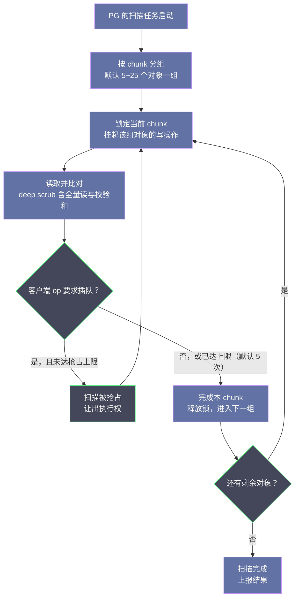
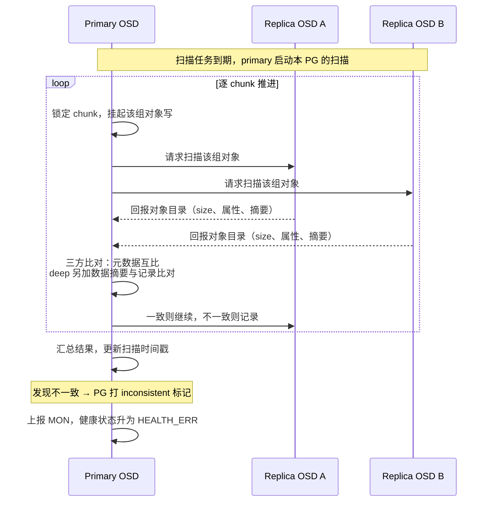
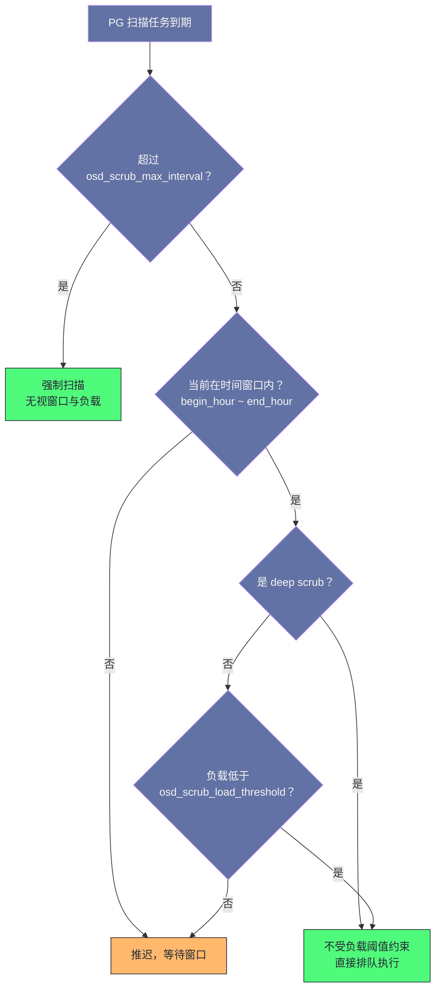
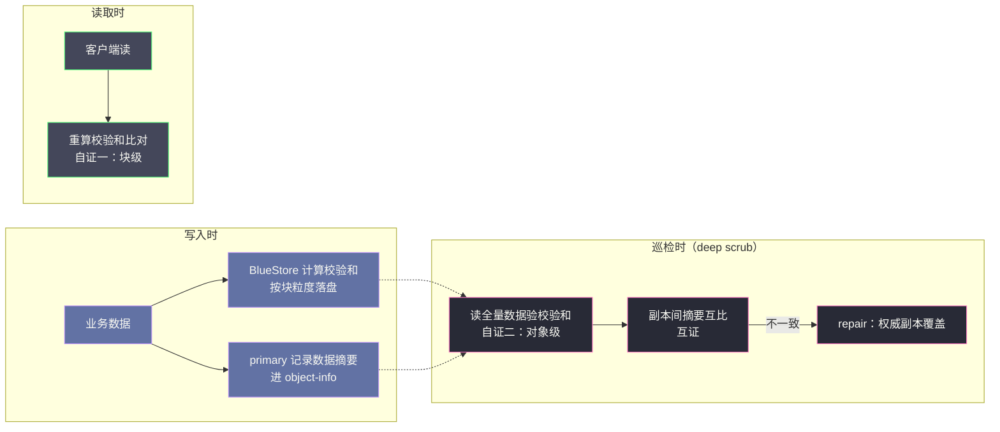

# 06 Scrub 与数据校验——静默错误的防线

**摘要：**

[[中间件/Ceph/05 PG 状态机与数据一致性——Peering、Recovery 与 Backfill|上一篇]]讲清了故障发生后的恢复机制，但那一整套 Peering、Recovery 与 Backfill 有一个共同前提：系统得先知道"谁坏了"。有一类损坏偏偏不满足这个前提——数据悄悄变了，盘不报错、OSD 不掉线、读请求照常返回，这就是静默数据损坏（Silent Data Corruption，SDC），社区里更常叫它位腐烂（bitrot）。本文回答两个问题：其一，三副本加校验和已经层层设防，为什么仍然需要一个"定期把数据读一遍"的巡检机制；其二，运维上如何给这道防线排班、限速、定级告警，让它在守住数据完整性的同时不把业务拖垮。行文从 bitrot 的真实威胁讲到轻量与深度两种扫描的差异，再深入调度限速的参数体系与发现不一致后的修复流程，最后落到与 BlueStore 校验和的双防线协同，以及一份可直接落地的运维实践清单。

---

## 第 1 章 静默数据错误——副本防不住的那种坏

### 1.1 五周、三千台服务器、五百次无声的篡改

2007 年，CERN 的存储团队做了一个朴素的实验：在一台服务器上写入一个约 2 GB、内容为特定位模式的文件，两小时后读回来逐字节比对，如此往复，并把这套程序铺到三千多台磁盘服务器、计算节点与数据库服务器上。五周之后，程序在一百台机器上捕获了五百次数据损坏——没有一次伴随磁盘报错，没有一次触发文件系统告警，数据就是在某个环节被悄悄改掉了。CERN 工程师 Bernd Panzer-Steindel 在当年的报告《Data Integrity》里给出了量级估计：错误率在 10^-7 水平，而且模式复杂——约 10% 是单个比特翻转，约 10% 是扇区或页大小的整块损坏，剩下约 80% 集中在 64 KB 的连续区域。

同一时期，威斯康星大学麦迪逊分校的 Bairavasundaram 等人拿到了更大的样本：NetApp 生产存储系统中 153 万块磁盘、41 个月的完整记录，其中校验和不匹配（checksum mismatch）的实例超过 40 万次。这项研究发表在 2008 年的 FAST 会议上，留下了两个对存储系统设计影响深远的结论：其一，近线盘（Nearline，大容量低成本的 SATA 盘）出现校验和不匹配的频率比企业级盘高出一个数量级；其二，损坏不是相互独立的事件——同一块盘上的损坏在空间与时间上高度聚集，同一存储系统内不同磁盘的损坏也彼此相关。换句话说，坏从来不是"雨露均沾"，而是"祸不单行"。

这两组数据指向同一个事实：**数据在写入之后的静态存放期里，会以系统完全无感的方式劣化**。社区给这类现象起了个形象的名字——位腐烂（bitrot），学术文献则称之为静默数据损坏（Silent Data Corruption，SDC）。它不是 Ceph 的特有问题，也不是某一批劣质硬盘的问题，而是整个行业在商用硬件上构建存储系统时必须直付的成本。Google 在 2021 年的 HotOS 会议上发表的《Cores that don't count》进一步把战线从存储扩展到了处理器：连 CPU 的执行单元都可能"无声地算错"，这类缺陷在出厂测试中查不出来，唯一症状就是错误的结果——在百万级服务器的规模下，它足以成为一类独立的故障类别。Google 的 Spanner 团队在 2022 年的 SELSE 会议上披露，这个 EB 级数据库每周都会捕获并拦截数次由硬件错误导致的静默损坏事件。

### 1.2 错误从哪来：盘、内存与固件

把静默错误的来源摊开看，主要有三类，每一类都有硬件层的防线，但每一类防线都有漏网之鱼：

| 来源 | 典型机制 | 硬件层防线 | 漏网之鱼 |
| :--- | :--- | :--- | :--- |
| 磁盘介质 | 坏扇区（Latent Sector Error）、磁介质劣化 | 盘内纠错码（ECC）、重读重试 | 超出纠错能力时成为不可恢复读错误（Unrecoverable Read Error，URE）；坏扇区在下次被读之前无人知晓 |
| 内存与传输路径 | 位翻转、链路误码 | ECC 内存、链路校验与重传 | ECC 只保证纠单比特错，多比特翻转可能漏检；校验通过的链路也可能把数据送错目的地 |
| 固件与软件缺陷 | 磁盘固件 bug、RAID 控制器误写、misdirected write（写入错位） | 厂商测试、回归验证 | 罕见路径上的 bug 无法穷举测试；写入错位时数据本身完好，只是"住错了门牌" |

磁盘介质这一类最值得展开。硬盘规格书里都会标注 URE 率：消费级盘的典型口径是每读取约 11 TiB 遇到一次（比特错误率 10^-14），企业级盘约 113 TiB 一次（10^-15）。这个数字平时无关痛痒，但全盘扫描时它会变成一笔绕不开的账——一块 8 TB 的盘从头到尾读一遍，按消费级口径粗算，期望撞上约 0.6 次 URE，这正是 RAID 阵列重建动辄失败的那笔账，也是深度扫描必须面对的现实：**巡检本身就会把盘上潜伏的坏扇区翻出来**，而这恰恰是巡检的目的之一——与其让坏扇区在重建时突然现身，不如在巡检里早早暴露。

内存这一类则更隐蔽：数据从网络进来、在内存里排队等待落盘的窗口期，一次没有被 ECC 兜住的位翻转，就会把错误"郑重其事"地写进所有副本。这个问题在 1.3 节还会回来，它是副本机制真正的盲区。

### 1.3 为什么三副本防不住它

你不妨先做一个思想实验：三个人各自抄同一本书，抄完分存三地。抄写时其中一人打了个喷嚏，把"甲"写成了"乙"——但他是照着同一份底稿错的，三份抄本从此错得一模一样。这就是**写入路径上的一致性错误**：primary 在把数据复制给副本之前，数据已经在内存或 CPU 里被改错了，三个副本收到的就是同一份错误数据。副本比对通过，BlueStore 的校验和也通过——因为校验和是对这份错误数据算的。对这类错误，存储层的一切互证机制集体失明，唯一的防线是端到端校验（end-to-end validation）：应用层自己算摘要、存摘要、读时验证。

不过思想实验还有下半场：三份抄本存进三个仓库之后，各仓库的白蚁各吃各的。三年后你打开第一份，某页缺了个字；打开第二份，另一页缺了个字；第三份完好。**静态存放期的劣化是每块盘独立演化的**，副本之间从此开始漂移——而这正是副本机制能兜住的部分：只要把三份抄本摆在一起逐页比对，总能发现至少两份对不上。

问题在于，"摆在一起比对"这个动作，存储系统平时是不做的。副本协议只在写入时保证一致，写完之后各过各的日子；读请求也兜不住——只有恰好读到坏对象的请求才会触发 BlueStore 的校验和报错（返回 EIO），而对象存储的现实是大量数据极冷：一个 RBD 卷里几年没人碰过的 4 MiB 对象，坏了三年也不会有任何告警。更微妙的是，即便读请求命中了坏对象，通常也只是收到一次 EIO——读路径不会自动改从副本取一份好的来救急，修复仍然是巡检与 Recovery 的职责。等坏数据终于被业务读到的那天，往往是你最不希望出事的那天——灾难恢复、数据迁移、审计取证，而那时它可能已经是仅存的副本。

> [!info] 核心概念：副本保证"写入一致"，不保证"存放一致"
> 副本协议的承诺边界在写入确认的那一刻：三个副本收到了同样的数据。至于这份数据在各自的盘上如何随时间演化，副本协议一概不问。静默错误恰好发生在承诺期之后——所以它防不住。发现静态期漂移只有两条路：要么靠校验和自证（读数据、重算摘要、与记录比对），要么靠副本互证（把几个副本摆在一起比对），两者都需要"主动去读"，这就是巡检存在的根本理由。

### 1.4 不这样会怎样——巡检的必要性

要讲透巡检的必要性，不妨做一次反事实推演：假如 Ceph 不做 scrub 会怎样？

短期看什么都不会发生——集群健康告警全绿，IO 照常，容量照涨。静默错误既不触发 down/out，也不影响 PG 状态机（见 [[中间件/Ceph/05 PG 状态机与数据一致性——Peering、Recovery 与 Backfill|05 PG 状态机篇]]），它在健康指标上完全隐形。长期看，坏数据在集群里安静地累积：某天一块 OSD 故障，Recovery 从幸存副本补数据——如果幸存的恰好是那份坏副本，错误就被正式"转正"，扩散到所有新副本，从此集群里再无正确版本。**没有巡检的冗余是假冗余：它防得住盘消失，防不住盘上的字变错。**

主动巡检并非 Ceph 的发明，而是一个悠久的家族传统，各家系统不约而同地演化出了同构的机制：

| 机制 | 所属系统 | 巡检对象 | 依据 |
| :--- | :--- | :--- | :--- |
| 巡读（Patrol Read）/ verify | RAID 控制器 | 盘面数据与 RAID 校验块 | 重算校验、修复坏块 |
| scrub 子命令 | ZFS / Btrfs | 池内全部数据块 | 端到端校验和 |
| Block Scanner | HDFS DataNode | 数据块抽样校验 | 块级校验和（crc） |
| fsck | 传统文件系统 | 文件系统元数据一致性 | 结构不变量 |
| Scrub | Ceph RADOS | PG 内对象元数据与数据 | 副本互证 + BlueStore 校验和 |

Ceph 官方文档对 scrub 的定义就一句话：它相当于对象存储层的 fsck。这些机制共享同一个朴素信念：**存储系统的正确性不能只靠"写的时候小心"，还要靠"定期回头检查"**。CERN 的研究还顺带揭示了这个家族的一个尴尬：RAID5 控制器平时读数据并不校验奇偶，要靠管理员手动触发 verify——四周内在 492 套系统上修复了约 300 个块问题，而这些坏块此前一直"健康地"存在着。巡检的价值不在机制本身，在于它真的被排进了日程。Ceph 把巡检做成了集群自治行为的一部分——不需要运维在 crontab 里排 ZFS 式的定时任务，OSD 自己按周期排班，MON 只负责把发现的问题升格为健康告警。

但巡检不是免费的：把全集群数据读一遍，等于把读带宽吃一遍，HDD 上还要付出磁头寻道的额外代价。于是工程问题从"要不要巡检"变成了"怎么巡检才不打架"——用什么深度扫、按什么节奏扫、扫的时候如何给业务让路。这正是接下来两章的主题。

---

## 第 2 章 两种深度的体检——light scrub 与 deep scrub

### 2.1 轻量扫描：核对台账

Ceph 的巡检分两档深度。第一档是轻量扫描（light scrub，新版文档也称 shallow scrub）：不读数据内容，只比对元数据——每个对象是否存在、各副本的 size 是否一致、对象信息（object-info：版本、mtime 等属性）是否一致。这些元数据大多驻留在 RocksDB 里，轻量扫描几乎不产生数据盘的大块读流量，成本低到可以每天对每个 PG 跑一遍。

轻量扫描能抓住的问题：对象丢失（副本少了一个对象）、副本间 size 不一致（同一对象在主副本是 4 MiB、在某副本是 3.9 MiB）、元数据属性漂移。它抓不住的问题同样明确：数据内容本身的损坏。三个副本 size 完全一致、内容各坏各的，轻量扫描一路绿灯——门卫核对了出入库登记单，账上有这箱货、数量也对，但箱子从头到尾没拆开过。

### 2.2 深度扫描：开箱验货

第二档是深度扫描（deep scrub）：把 PG 里所有对象的数据完整读一遍，逐段计算校验和，与写入时记录的数据摘要（digest）比对，再在副本之间互比。BlueStore 的读路径本身就会验证存储的校验和（见 [[中间件/Ceph/04 OSD 与 BlueStore——存储引擎深度解析|04 BlueStore 篇]]），所以深度扫描的每一次读取都自带一次自证；读出来的数据再算一层摘要与记录比对，是第二重自证；副本间互比，是互证。一次深度扫描，三重检查。

深度扫描的读取节奏由 osd_deep_scrub_stride（默认 512 KiB）控制——每次读一段、验一段；对象的 omap 键值对（BlueStore 存放对象属性与索引的地方）也按 osd_deep_scrub_keys（默认 1024 个键）分批校验 omap 摘要。它能发现轻量扫描的全部盲区：坏扇区、静默位翻转、副本内容漂移。代价也直白：全量读。一块 4 TiB 的 OSD，深度扫描一遍就是 4 TiB 的读流量，外加校验计算的 CPU——这笔账怎么摊平，是第 3 章的主题。

不过要给深度扫描的"全能"泼一盆冷水：它依然防不住 1.3 节说的写入路径一致性错误——三个副本收到的就是同一份错数据，摘要也是一致地错，深度扫描比了个寂寞。扫描深度的提升，扩大的是"静态期错误"的覆盖范围，不是全知全能。把这条边界记在心里，第 5 章讨论双盲区时会更通透。

两种深度的差异收拢成一张表：

| 维度 | 轻量扫描（light scrub） | 深度扫描（deep scrub） |
| :--- | :--- | :--- |
| 检查对象 | 元数据：对象存在性、size、object-info 属性 | 数据内容：全量读取 + 校验和 + 摘要比对 |
| 能发现 | 对象丢失、副本 size 不一致、属性漂移 | 坏扇区、位翻转、副本内容漂移（轻量扫描的全部盲区） |
| IO 代价 | 极低，以元数据读取为主 | 全量读：OSD 容量即读流量 |
| CPU 代价 | 可忽略 | 校验和计算，与 bluestore_csum_type 相关 |
| 默认周期 | 每 1~7 天一遍 | 每 7 天一遍 |
| 对业务影响 | 几乎无感 | HDD 上可感知，需要调度与限速 |

### 2.3 默认节奏：三个周期参数

巡检的节奏由一组参数控制，理解它们的分工是调优的前提：

| 参数 | 默认值 | 语义 |
| :--- | :--- | :--- |
| osd_scrub_min_interval | 1 天 | 负载允许时，PG 轻量扫描的理想间隔 |
| osd_scrub_max_interval | 7 天 | 轻量扫描的硬上限，超过即强制执行 |
| osd_deep_scrub_interval | 7 天 | 深度扫描的周期 |
| osd_scrub_interval_randomize_ratio | 0.5 | 在 min_interval 基础上叠加随机延迟，把扫描铺开在 1~1.5 倍区间内 |
| osd_scrub_begin_hour / end_hour | 0 / 0 | 每日允许扫描的时间窗口，0/0 表示全天 |
| osd_scrub_begin_week_day / end_week_day | 0 / 0 | 每周允许扫描的日期窗口，0/0 表示全周 |

三个细节值得点破。其一，轻量与深度是两条独立的计时线：PG 状态里分别记录最近一次轻量扫描与深度扫描的时间戳，各按各的周期到期，互不牵连——你可以让轻量保持每天、深度放宽到每月。其二，随机化是刻意的：全集群成百上千个 PG 若在同一时刻到期，读风暴会同时砸向所有 OSD，randomize_ratio 把每个 PG 的实际扫描时刻在 1~1.5 倍周期内随机铺开，天然错峰。其三，时间窗口只是"软约束"：窗口外的扫描会被推迟，但不会取消——这条规则的例外与后果，第 3 章展开。

还有一层灵活性值得知道：这些周期不仅能全局设置，还能按池覆盖——`ceph osd pool set <pool> scrub_min_interval`、`scrub_max_interval`、`deep_scrub_interval` 都接受池级取值。这正是第 6 章"按数据温度分层"策略的技术基础：同一个集群里，在线池与归档池可以各扫各的节奏，互不迁就。

### 2.4 与客户端 IO 的优先级协商

巡检最怕的不是慢，而是挡路。Ceph 的解法是一套"分块让路"的协商机制，值得完整拆开看：



这条流程里有四个关键设计。第一，分块：扫描以 chunk 为单位推进，默认每组 5~25 个对象（不同版本的默认上限略有差异），扫完一组释放一次，让客户端 IO 随时能插进来——巡检队不是封路施工，而是扫一段撤一段。第二，chunk 内的写阻塞：比对期间该组对象的写操作被挂起，保证比对时数据不动；读不受影响。第三，优先级：扫描操作在 OSD 工作队列里的默认优先级是 5（osd_scrub_priority），客户端 op 是 63（osd_client_op_priority），在加权优先级队列（Weighted Priority Queue，WPQ）里扫描永远排在业务后面；不过当扫描阻塞了客户端操作时，它的优先级会被临时提升到 63，尽快做完让路——这个细节出自官方参数说明，值得记住。第四，抢占与反抢占：客户端 op 可以打断深度扫描，但被打断的次数达到 osd_scrub_max_preemptions（默认 5）后，扫描会反过来阻塞客户端 IO 把当前 chunk 扫完——否则在持续高负载的集群上，巡检可能永远扫不完。

还有一个旋钮属于"主动放慢"：osd_scrub_sleep（默认 0）在每个 chunk 之间插入一段睡眠，把巡检的峰值功率压下来。要注意它在 mClock 调度器下会失效——mClock 的思路不同，它用预留（reservation）、权重（weight）、上限（limit）三个参数给各类操作划定资源份额，扫描被归入"后台尽力而为"（background best-effort）类，与 backfill、snaptrim 同类。两套机制是替代关系，不要叠加配置。

> [!note] 设计哲学：低优先级、分块让路、可抢占
> 扫描的调度设计可以概括为三句话：平时排最低优先级，忙时主动让路，让不动了再反客为主。这套"低优先级 + 分块让路 + 可抢占"的三件套，是后台任务与在线业务共存的标准范式——它承认巡检重要，但承认业务更重要；它愿意让路，但不接受被无限饿死。你在设计任何后台巡检、压缩、GC 任务时，都值得抄这套作业。

### 2.5 一次深度扫描的完整旅程

把前面的机制串起来，跟踪一个 PG 从到期到出结果的完整过程。扫描由 PG 的 primary OSD 主导，副本配合应答，全程不惊动 MON：



这个流程有三个值得注意的性质。其一，比对是"目录对目录、内容对内容"的两层结构：轻量扫描只交换对象目录（每个对象的存在性、size、属性），深度扫描额外交换逐对象的数据摘要——副本之间传输的是摘要而不是数据本身，互证的通信代价因此很低，重的是每块盘自己的读代价。其二，扫描期间 PG 照常服务读写，被锁住的只有正在比对的那个 chunk——这也是 2.4 节分块机制的意义：把"整 PG 一致性检查"切成无数个可以随时让路的碎片。其三，MON 不参与扫描本身，只在结果出来后收一条报告——巡检是数据面的自治职责，控制面只做登记与升格，这与 03 篇讲的"MON 不在数据路径上"一脉相承。

---

## 第 3 章 调度与限速——把巡检关进笼子

### 3.1 并发与节奏的旋钮

第 2 章讲的是单个 PG 扫描时如何让路，这一章讲集群层面如何控制"同时有多少巡检在跑、跑多快"。核心参数如下：

| 参数 | 默认值 | 语义 | 调整建议 |
| :--- | :--- | :--- | :--- |
| osd_max_scrubs | 社区版文档 3 / Red Hat 文档 1 | 单 OSD 并发扫描数 | 按保守值评估，HDD 集群建议按 1 规划 |
| osd_scrub_sleep | 0 | chunk 之间的睡眠（秒） | HDD 集群可给 0.1~1，压平延迟冲击 |
| osd_scrub_backoff_ratio | 0.66 | 调度退避比：66% 的调度 tick 不排新扫描 | 一般不动；巡检冲击大时调高 |
| osd_scrub_extended_sleep | 0 | 窗口外强制扫描时的注入延迟（秒） | 窗口收窄后建议设置，给强制扫描降速 |
| osd_scrub_during_recovery | false | 数据恢复期间是否排新扫描 | 保持默认，先恢复后巡检 |

osd_max_scrubs 值得一提：它控制一块盘上同时进行的扫描数，社区版 Reef 文档标注默认 3，Red Hat 的文档标注默认 1——版本与发行版口径不一，恰好说明这个参数的取值有多纠结：并发高，巡检欠账清得快，但 HDD 上多路随机读互相打架；并发低，冲击小，但大容量盘可能扫不完。笔者的建议是按 1 的心智做容量评估，再视实测放宽。

### 3.2 负载门槛与它的两个例外

osd_scrub_load_threshold（默认 0.5）是巡检的负载闸门：系统负载（以 getloadavg() 除以在线 CPU 核数归一化）超过阈值时，不再排新的轻量扫描。这个设计的意图很清楚——机器闲时多扫，忙时少扫。

但有两条例外，而且都是生产事故的常客。例外一：**深度扫描不受负载阈值约束**，官方文档在 osd_deep_scrub_interval 的说明里明确写了这一点。也就是说，负载闸门拦得住轻量扫描，拦不住深度扫描——不少运维者第一次见识 deep scrub 的威力，就是在业务高峰的下午：全集群延迟突然抬头，翻日志才发现是深度扫描开工了。例外二：osd_scrub_max_interval 到期后的强制扫描，既无视负载阈值，也无视时间窗口——PG 七天没扫过，系统就强行插队。

这两条例外共同指向同一个教训：**限速参数只能推迟巡检，不能取消巡检**。你把窗口收得太窄、把阈值压得太低，巡检不会消失，只会积累成强制扫描，在你不希望的时刻集中爆发。体检中心也是同样的逻辑：你预约不上，系统就按"过期必检"强行插队，而且插队的这批往往块头最大。

不妨把一个常见的翻车场景推演一遍：周五下午业务高峰前，你挂上 nodeep-scrub 图个清净，周一上午忘摘；deep 欠账两天，大量 PG 逼近强制线；周一中午摘牌，积压的深度扫描任务与白天业务高峰正面相撞——延迟告警、慢请求、巡检欠账告警同时炸响，看起来像集群出了新故障，实际是三天前那块牌子在还债。避免这类"时间差事故"的办法很朴素：挂牌时写下摘牌时间与摘牌后的观察动作，把巡检的账算在变更单里，而不是留给周一的你。



### 3.3 noscrub 与 nodeep-scrub：维护窗口的挂牌

集群级标志位提供了更粗但更可靠的闸门：`ceph osd set noscrub` 暂停轻量扫描，`ceph osd set nodeep-scrub` 暂停深度扫描。它们与 noout、norecover 等同属标志位体系（完整语义与挂牌纪律见 [[中间件/Ceph/03 Monitor 与集群地图——Paxos、Quorum 与 MON 运维|03 Monitor 篇]]），典型场景是大促、月末批处理这类"业务优先"窗口，以及滚动升级时减少并发干扰。

两个标志位不必捆绑使用。轻量扫描几乎无感，业务高峰期间完全可以只挂 nodeep-scrub、放轻量扫描继续跑——账要核对，箱子可以晚点拆；只有连元数据比对的代价都想省时（譬如滚动升级的最后阶段），才把 noscrub 一起挂上。挂牌的粒度越细，摘牌后的欠账越小，这个道理与 03 篇讲的"最小够用"一脉相承。

挂牌的代价是校验欠账，而且 MON 会替你记账：轻量扫描逾期超过周期的一半（mon_warn_pg_not_scrubbed_ratio，默认 0.5）时，健康状态升起 PG_NOT_SCRUBBED 告警；深度扫描逾期超过周期的 75%（mon_warn_pg_not_deep_scrubbed_ratio，默认 0.75）时，升起 PG_NOT_DEEP_SCRUBBED。这两个告警的存在本身就是一种提醒：**noscrub 是把发现静默错误的防线整体后移，不是把风险清零**。

> [!warning] 生产避坑：巡检欠账与恢复欠账会叠加
> 长期挂着 noscrub 与 nodeep-scrub 的集群，表面健康，实际在积累两笔债：校验欠账（静默错误无人发现）与摘牌后的补偿流量（积压的扫描任务集中执行）。若欠账期间还发生了 OSD 故障与数据恢复，摘牌后的流量洪峰会三线叠加——恢复、backfill、深度扫描同时抢盘。纪律与 03 篇的标志位一致：挂牌登记预期摘除时间，摘牌后观察扫描队列排空再离场；能分批摘就不要一次全摘。

### 3.4 深度扫描的延迟冲击与观测点

深度扫描对业务的影响，在 HDD 与 NVMe 上是两个世界。HDD 的痛点是寻道：深度扫描的读取按对象分布随机散落在盘面上，持续把磁头从业务 IO 的轨道上拽走，顺序带宽被打碎，客户端写延迟的尾部（P99、P999）肉眼可见地抬高；NVMe 没有磁头，随机读的代价低一个量级，冲击温和得多。这也是为什么同一个 deep scrub 周期参数，在全闪集群和 HDD 集群上的合理取值可能差好几倍——譬如 7 天的周期，全闪集群跑得轻松，纯 HDD 的大容量集群就可能天天处在"扫不完又不敢停"的尴尬里。

观测上有四个点位值得纳入日常：

| 观测点 | 取法 | 看什么 |
| :--- | :--- | :--- |
| 扫描耗时趋势 | ceph pg dump 中各 PG 的 scrub_duration 与 last_deep_scrub_stamp | 单 PG 扫描时长的斜率，陡增往往意味着盘性能劣化 |
| 延迟对比 | 扫描窗口内外的 OSD op 延迟（perf dump 的 op_r/op_w_latency） | 窗口内外的延迟差，就是巡检的真实代价 |
| 慢请求 | ceph -s 的 slow ops，或 OSD 日志的 slow request 记录 | 是否与扫描时段重合 |
| 欠账告警 | PG_NOT_SCRUBBED / PG_NOT_DEEP_SCRUBBED | 窗口容量是否够用 |

其中"窗口内外延迟对比"最值得做成常态图表：它把"巡检影响业务"从一句感觉变成一个可量化的数字，调窗口、调周期时有了依据。监控体系的具体搭建不在本篇展开，此处只立一条原则：**巡检的代价必须被观测，否则一切调优都是猜**。

---

## 第 4 章 发现不一致之后——从告警到修复

### 4.1 HEALTH_ERR：inconsistent 的表现

扫描发现某个 PG 的副本对不上时，该 PG 会被打上 inconsistent 标记，健康状态从 HEALTH_WARN 直接跳到 HEALTH_ERR：

```text
HEALTH_ERR 1 pgs inconsistent; 1 pgs damaged
    pg 2.3f is active+clean+inconsistent, acting [11,25,47]
```

注意这个状态的微妙之处：PG 仍是 active+clean——读写照常、副本齐全，系统"看起来健康"，只是主副本与某个副本在某个对象上说法不一。Ceph 把它定为 ERR 级而非 WARN 级，是因为这已经不是"冗余暂时不足"的机械性状态，而是"数据对不对"的语义问题——系统自己不敢拍板谁对，只能交给人。对应的健康检查有两项：PG_DAMAGED（发现不一致，或修复进行中）与 OSD_SCRUB_ERRORS（近期扫描发现了不一致），两者通常成对出现。

它与 degraded 的区别也值得辨析：degraded 是"副本数量不够"，系统知道该干什么——从幸存副本补齐即可（见 [[中间件/Ceph/05 PG 状态机与数据一致性——Peering、Recovery 与 Backfill|05 PG 状态机篇]]）；inconsistent 是"副本内容对不上"，数量齐全但说法矛盾，需要人来裁决修不修。前者是体力活，后者是判断题。

"读写照常"不等于"可以慢慢修"。inconsistent 悬而不决的日子里，风险在悄悄变形：其一，若此时同 PG 再坏一块盘，坏副本可能成为幸存副本，Recovery 会把它当权威扩散——不一致拖成了真损坏；其二，带着 inconsistent 状态做扩容、balance 之类的数据迁移，矛盾会被搬运到更多盘上，事后再清理的成本水涨船高；其三，inconsistent 的根源（那块正在劣化的盘）不会自己好转，拖一天，坏对象大概率多一个。所以 ERR 级的处置时限是"当天"，不是"这周"。

### 4.2 定位：从 PG 到对象

处理的第一原则是先看清再动手。我们不妨把诊断链路想象成一次逐级放大的取证：先圈定案发 PG，再调出每个嫌疑对象的全部"证词"，最后才轮到裁决。命令自上而下：

```bash
# 1. 哪些 PG 不一致、错误规模多大
ceph health detail

# 2. PG 详情：acting set、最近扫描时间
ceph pg dump --format=json-pretty

# 3. 池内不一致 PG 列表
rados list-inconsistent-pg <pool>

# 4. 逐对象细看：每个副本的 size、摘要、错误类型
rados list-inconsistent-obj <pgid> --format=json-pretty

# 5. 快照集类问题单独排查
rados list-inconsistent-snapset <pgid> --format=json-pretty
```

list-inconsistent-obj 的输出是修复决策的核心依据，它会列出每个不一致对象的全部副本（shards）与错误类型：

| 错误类型 | 含义 | 修复视角 |
| :--- | :--- | :--- |
| obj_size_info_mismatch | 副本间对象 size 或元信息不一致 | 多数派投票定权威 |
| data_digest_mismatch | 某副本数据算出的摘要与记录不符 | 摘要与记录自洽的副本可作权威 |
| read_error | 某副本读取时报错（坏扇区） | 该副本出局，从健康副本覆盖 |
| shard missing | 副本缺对象 | 从权威副本补齐 |
| data_digest_mismatch_oi（全副本） | 所有副本的摘要都与记录不符 | 不可自动修复，需人工介入 |

最后一行是关键分水岭：如果只有个别副本摘要对不上、其余副本与记录自洽，repair 有明确的权威可采；如果所有副本都与记录不符（记录本身坏了，或三个副本一致地错），系统拒绝自动修复——它不知道该信谁。

一条真实的输出（节选示意）长这样：

```json
{
    "inconsistents": [
        {
            "object": { "name": "rbd_data.3a1f2b.0000000000000a5c", "snap": "head" },
            "errors": [],
            "union_shard_errors": ["data_digest_mismatch", "read_error"],
            "shards": [
                { "osd": 11, "primary": true,  "errors": [] },
                { "osd": 25, "primary": false, "errors": ["data_digest_mismatch"] },
                { "osd": 47, "primary": false, "errors": ["read_error"] }
            ]
        }
    ]
}
```

读这份输出的方法是"先看副本、再看对象"：对象级 errors 为空，说明三个副本对"这个对象是什么"没有分歧；union_shard_errors 汇总了各副本的问题——osd.25 的内容与摘要记录不符，osd.47 干脆读不出来。两份"证词"里只有 osd.11 与记录自洽，权威归属一目了然，这种情况 repair 的把握很大。反过来，如果三个 shard 的 errors 里都挂着摘要不符、且对象级 errors 也非空，就要按上一段说的分水岭处理了。

### 4.3 repair 的原理与前提

`ceph pg repair <pgid>` 的原理，一句话说：它触发一次带修复标记的扫描，primary 在比对中选定权威副本（authoritative copy），把不一致的副本标记为 missing，随后的 Recovery 用权威副本的数据把它重建——修复动作与 05 篇讲的 Recovery 是同一条流水线，repair 只负责"裁决 + 标记"。

权威副本怎么选？依据是写入时记录的对象信息：每个对象写入时，primary 会把数据摘要记进 object-info；扫描时各副本重算摘要、与记录比对，**摘要与记录自洽的副本才有资格当权威**；元数据类不一致（size、属性）则按多数派投票。这套准则在绝大多数场景下可靠，但它有两个前提，也对应两条硬性边界。

其一，前提是 size 大于 1。repair 的全部逻辑建立在"存在其他副本可采信"之上；size=1 的池没有互证对象，扫描只能靠 BlueStore 校验和自证，发现坏了也没有第二份可抄——repair 无从谈起，只能从备份恢复。这也是笔者不建议生产池使用 size=1 的理由之一：它省下的冗余成本，会在静默错误面前连本带利还回去。

其二，自动修复默认关闭。osd_scrub_auto_repair 默认 false，开启后也只在错误数不超过 osd_scrub_auto_repair_num_errors（默认 5）时才自动修——错误一大堆反而拒绝动手，因为"错得多"往往意味着系统性问题（固件 bug、批量写入错误），此时自动修复等于用错误的权威批量覆盖好数据。纠删码（Erasure Code，EC）池加 BlueStore 的组合支持这种自动修复，因为 EC 的互证是数学性的——用 K+M 个分块重算校验即可定位坏块，权威的判定比副本池更确定。

### 4.4 repair 的风险与标准操作序列

repair 不是重置按钮，而是**一次以权威副本为准的覆盖写**——覆盖错了，没有撤销。它的风险集中在三种情形：

- 摘要记录缺失：老版本写入的数据、非顺序写导致校验和失效的对象，没有记录可依，repair 倾向采信 primary——primary 恰好是坏的那个时，好数据被坏数据覆盖。官方文档对此说得很直白：记录的摘要与算出的摘要一致，并不能证明某个副本就是权威的。
- 多数副本同坏：同一批盘的同一固件 bug、同一次写入路径错误，会让多数派投票投出错误结果——repair 忠实地把错误扩散到全副本。
- 修复期间的业务影响：被修复对象所在 chunk 的写操作被阻塞，大对象修复时业务可感。

标准操作序列如下，核心纪律是"先看清、再动手、逐个修"：

```bash
# 1. 确认不一致 PG 清单与错误规模
ceph health detail

# 2. 逐 PG 看清每个对象的错误类型与各副本状态
rados list-inconsistent-obj 2.3f --format=json-pretty

# 3. 判断可修性：
#    - 个别副本摘要不匹配、其余自洽 → 可放心 repair
#    - 全副本与记录不符、错误类型蹊跷 → 先人工分析
#      （ceph-objectstore-tool 导出各副本比对，必要时从备份恢复）

# 4. 逐个执行修复，不要一把梭全修
ceph pg repair 2.3f

# 5. 等待 PG 回到 active+clean，确认 HEALTH_ERR 清零
ceph -s

# 6. 复盘根因：盘的问题？固件？软件 bug？
#    repair 只恢复一致，不解释为什么不一致
```

第 3 步的"判断"是整个序列里最不能省的一步。把 list-inconsistent-obj 的输出读明白：哪个副本的摘要与记录自洽、哪个副本报读错误、错误是孤立的还是成片的——孤立的个别对象，大概率是介质级的 bitrot，repair 即可；成片的不一致，先停下来查根因，否则 repair 只是把同一个错误复制得更均匀。最后一步的复盘同样不可省：repair 治的是症状，根因（那块盘、那个固件、那个 bug）不除，下个周期扫描还会在同一个地方再抓一次。

---

## 第 5 章 双防线——校验和自证与 Scrub 互证

### 5.1 两种证明，各管一段

行文至此，可以把 Ceph 数据完整性防线的全貌拼出来了。它由两种性质不同的证明构成。

**校验和是单副本的自证**。BlueStore 在写入时按块粒度（默认 4 KiB 块）计算 CRC32C 校验和，与数据一起落盘；读取时重算比对，不符即返回 EIO。它回答的问题是："这块数据自己坏了没有？"——不需要网络，不需要其他副本，单块盘就能自证。

**Scrub 是副本间的互证**。轻量扫描比元数据，深度扫描比内容摘要，它回答的问题是："几个副本说的是不是同一件事？"——不依赖写入时的校验和覆盖是否完整，靠的是"多数副本一致"这个朴素事实。

深度扫描把两道防线串成一条流水线：读数据（触发 BlueStore 校验和验证，第一重自证）→ 算摘要与写入记录比对（第二重自证）→ 副本间互比（互证）。发现损坏后的修复路径也依赖这套体系：轻则用权威副本覆盖坏块，重则标记 missing 走 Recovery 重建。



打个比方：校验和像每件行李上的防伪封条——开箱即验，不问别人；scrub 像三件同款行李在三个仓库之间对质——不看封条，只比内容。封条可能被连着内容一起伪造（写入路径一致地错），对质可能三件各坏各的（静态期独立劣化）。封条能抓住"自己坏"，说不了"谁对"；对质能抓住"各自坏"，抓不住"一起错"。两者互补，才构成完整防线——当然，比喻到此为止：行李不会自己修复，而 Ceph 的两道防线在发现问题的同一套流程里就完成了裁决与修复，这是它比"人工对质"高明的地方。

### 5.2 双盲区与分工的边界

两道防线各有盲区，而且盲区恰好互补：

| 防线 | 能发现 | 发现后能做什么 | 盲区 |
| :--- | :--- | :--- | :--- |
| BlueStore 校验和（自证） | 单副本数据损坏 | 报 EIO，定位坏块 | 不知道哪份是对的；写入路径一致地错时自洽 |
| 轻量扫描（互证·元数据） | 对象丢失、size 与属性不一致 | 触发 repair | 数据内容损坏 |
| 深度扫描（自证 + 互证） | 内容级 bitrot、副本漂移 | 定位坏副本，支撑 repair | 写入路径一致地错（三副本同错） |
| 端到端校验（应用层） | 一切存储层错误，含"一致地错" | 拒绝使用、触发恢复 | 依赖应用配合，存储层无法代劳 |

这张表里最值得琢磨的是最后一行。存储层的一切互证机制——副本、校验和、scrub——都建立在"错误是独立的"这个前提上；当错误本身是系统性的（同批内存的同一缺陷、同一固件的同一 bug），错误就会"一致地"穿过所有防线。Ceph 对此没有银弹，它的边界就画在这里：存储层防线兜住独立错误，系统性错误要靠端到端校验与多副本之外的冗余（备份、异地容灾）兜底。

另一个实践层面的协同点是成本：bluestore_csum_type 的选择直接影响深度扫描的 CPU 账单——deep scrub 读全量数据，每一块都要过一遍校验算法，全闪高并发场景下 crc32c 与 none 的差距会在扫描窗口内集中体现（算法选择的权衡见 [[中间件/Ceph/04 OSD 与 BlueStore——存储引擎深度解析|04 BlueStore 篇]]）。**校验和的粒度与算法，决定自证的精度与成本；scrub 的周期与窗口，决定互证的及时性与代价**——两组参数要放在一起调，而不是各调各的。

### 5.3 从 FileStore 到 BlueStore：裁决依据的跃迁

把时间线拉回 BlueStore 之前，能更清楚地看到这套双防线是怎么长出来的。FileStore 时代（Luminous 之前），本地存储引擎没有写时校验和，对象的数据摘要要么缺失、要么只能在扫描时补算——互证机制还在，自证这一翼是残缺的。那一代的 repair 因此带着更多运气成分：摘要记录缺失时，系统只能倾向采信 primary，官方文档至今保留着一条针对 FileStore 的提醒——使用副本 FileStore 池的用户可能更倾向手工修复，必要时借助 ceph-objectstore-tool 逐副本导出比对。换句话说，在没有自证的时代，互证的裁决常常悬空。

BlueStore（Luminous，2017）把自证补齐了：写入即算校验和、读取即验证、摘要随 object-info 落盘。这一步改变的不仅是"能不能发现坏块"，更是"发现之后敢不敢自动裁决"——repair 的权威判定从"看运气、看 primary"变成了"看摘要与记录是否自洽"，4.3 节那套裁决准则才有了客观依据。**自证是互证的地基：没有写入时的摘要记录，副本互比就只能比出"不一样"，比不出"谁是错的"**。这也是为什么本篇反复强调两组参数要一起调——校验和关掉，深度扫描就退化成"比出矛盾但裁决不了"的半成品防线。

---

## 第 6 章 运维实践清单——把防线落到日程表上

### 6.1 scrub 窗口规划

默认配置下巡检全天可跑（begin_hour 0、end_hour 0），生产上通常收窄到业务低峰，譬如夜间 22 点到次日 6 点。收窄之前先算一笔容量账：全集群 PG 数 × 单 PG 平均扫描时长，与窗口时长比一比——扫得完，窗口才成立；扫不完，超过 max_interval 的 PG 会被强制扫描，在白天集中爆发，比不设窗口还伤业务。

算例不妨过一遍：一个 1000 个 PG 的池，深度扫描单个 PG 平均耗时 10 分钟（由 PG 内数据量与盘速决定），全部扫完需要约 167 个"PG·小时"的扫描容量；8 小时的夜间窗口若要求一周内轮完，每晚需要约 24 个 PG·小时，单 OSD 并发 1 时大约能提供"OSD 数 × 8 小时"的容量——两笔账一对，窗口够不够、deep 周期要不要放宽，答案就出来了。这笔账没有精确解，但**"窗口容量 ≥ 周期内的扫描需求"这条不等式必须成立**，否则强制扫描的反弹只是时间问题。

三个实践要点。其一，窗口跨午夜是合法且常用的（22 点到次日 6 点），不必拆成两段。其二，深度扫描的窗口可以比轻量更窄——轻量几乎无感，全天跑无妨，深度才需要躲着业务。其三，大集群把不同池的窗口错开，避免所有 OSD 同时进入巡检状态。周末窗口（begin_week_day/end_week_day）则是另一档选择，适合把深度扫描整体排到周末、工作日完全不跑的保守策略。

### 6.2 深度扫描频率的权衡

osd_deep_scrub_interval 默认 7 天，这个数字是"发现及时性"与"读带宽代价"的折中，不是圣旨。权衡的框架是把两笔账都摊开：

| 周期 | 发现窗口（最坏） | 读带宽代价 | 适用场景 |
| :--- | :--- | :--- | :--- |
| 7 天（默认） | 7 天 + 修复时间 | 集群全量容量的七分之一摊到每天 | 在线业务池，数据价值高 |
| 14~30 天 | 14~30 天 | 降至七分之一到十四分之一 | 容量型池，冷数据为主 |
| 30 天以上 | 更长 | 最低 | 归档池，配合抽样与备份 |

拉长周期的风险要算清楚：bitrot 从发生到发现的窗口拉长，意味着"坏数据裸奔"的时间变长；更糟的组合是，坏数据在暴露前遭遇同 PG 另一块盘故障——坏副本成为幸存副本，Recovery 会忠实地把它扩散成全副本。反过来，周期压得太短，读带宽与 CPU 的代价直接进业务延迟的账单。笔者的建议是按数据温度分层：热池守默认 7 天，温池放宽到 14~30 天，冷池拉长但必须保留，同时任何池都不建议关掉深度扫描——省下的那点带宽，买不回"静默错误裸奔一年"的风险。

纠删码池在这笔账里要单独列一行：EC 池的深度扫描要读全部分块（K 个数据块加 M 个校验块）才能完成互证，读放大比副本池高——同样 7 天周期，EC 池付出的读带宽约为副本池的 (K+M)/K 倍。容量型场景恰恰偏爱 EC 池，于是"最需要巡检的池"与"巡检最贵的池"重叠了。务实的解法不是关掉，而是给 EC 池单独放宽周期、把窗口排到最闲的时段，并接受更长的发现窗口——这又是一次按池取舍的权衡。

### 6.3 告警分级处置表

把前几章的处置动作收拢成一张分级表，告警响起时按级取用：

| 告警 | 级别 | 含义 | 第一动作 |
| :--- | :--- | :--- | :--- |
| PG_DAMAGED / OSD_SCRUB_ERRORS（HEALTH_ERR） | P1 | 扫描发现不一致 | 当天走诊断链路，看清后逐个 repair |
| PG_NOT_SCRUBBED | P2 | 轻量扫描欠账 | 查窗口容量与负载阈值，确认 noscrub 是否忘摘 |
| PG_NOT_DEEP_SCRUBBED | P2 | 深度扫描欠账 | 查 deep 周期与窗口容量，评估是否放宽窗口 |
| OSD_TOO_MANY_REPAIRS | P2 | 修复频次异常 | 频繁 repair 说明有系统性根因，停手查盘与固件 |
| 扫描窗口内 slow ops 抬升 | P3 | 巡检冲击业务 | 对比窗口内外延迟，调 sleep、窗口或周期 |

P1 与 P2 的分界值得强调：inconsistent 是 ERR 级，因为它意味着"数据对不对"已经存疑，而且拖得越久，坏副本被 Recovery 扩散、或好副本继续劣化的风险越大；欠账类告警是 WARN 级，它只是提醒你防线在变薄，当天排期处理即可。把 P1 拖成 P2 的心态，是数据完整性事故最常见的起点。

这张表还隐含一条使用纪律：告警分级要写进值班手册，而不是留在运维者的脑子里。P1 的处置路径（诊断命令、判断标准、repair 序列、复盘要求）应当是手册里的一页 runbook，任何一班值班员照着走都能走完——数据完整性这类低频高危的事件，最怕的就是"只有老张会处理"，而老张也有休假的那天。

### 6.4 一份可打勾的巡检清单

六章的要点可以收拢成一份上线与例行检查清单，逐项打勾：

1. 窗口已按业务低峰设置（begin_hour/end_hour），且"窗口容量 ≥ 周期内扫描需求"的不等式成立；
2. 深度扫描周期按数据温度分层设定，任何池都未关闭 deep scrub；
3. osd_scrub_sleep 与 osd_max_scrubs 按 HDD/全闪分别评估，未照抄默认值；
4. PG_NOT_SCRUBBED、PG_NOT_DEEP_SCRUBBED 纳入告警，且知晓其阈值比例（0.5 / 0.75）；
5. HEALTH_ERR 级 inconsistent 告警有明确的值班处置路径：诊断 → 看清 → 逐个 repair → 复盘；
6. noscrub / nodeep-scrub 挂牌登记在变更单里，active flags 纳入监控（与 03 篇纪律一致）；
7. 扫描窗口内外的 OSD 延迟对比做成常态图表，巡检代价可量化；
8. 生产池 size 均大于 1，repair 才有权威可采；
9. osd_scrub_auto_repair 保持默认关闭，除非你确认集群的系统性错误风险可控；
10. 关键池有备份——scrub 与 repair 兜得住独立错误，兜不住"一致地错"。

这份清单没有一条涉及高深技巧，全是朴素纪律——我们不妨在每次扩容、换盘、升级之后把它翻出来逐项打勾。巡检恰恰是那种"机制上已经替你想好了，日程上却总有人欠账"的防线：它平时安静得像不存在，出事时又慢得让人以为它没用；把纪律前置到窗口与告警里，是唯一划算的应对。

### 6.5 收束：一道用带宽换确定性的防线

六章讲下来，Scrub 的本质可以收拢成一句话：**它用可调度的读带宽，换静默错误的发现权**。副本协议管写入那一刻的一致，校验和管每一次读的自证，而写入之后、读取之前的漫长静态期，只有巡检在看守。它的所有参数——深度、周期、窗口、并发、优先级——都在回答同一个问题：你愿意花多少带宽与 CPU，把"坏数据暴露时长"压到多短。

这个问题没有标准答案。在线交易池与归档池的答案不同，HDD 集群与全闪集群的答案不同，数据值钱程度不同的业务答案也不同。但有一条底线是普适的：防线可以调慢，不能关掉——**巡检欠账不是省下的成本，是递延的风险，而递延的风险总会在你最不希望的时刻到期**。把窗口、周期、告警分级写进运维日程表，让这道防线按你自己的业务节奏运转，才是这套机制的正确打开方式。

---

## 参考资料

1. Ceph Documentation — OSD Config Reference（Scrubbing 节，各参数默认值）：https://docs.ceph.com/en/latest/rados/configuration/osd-config-ref/
2. Ceph Documentation — Health Checks（PG_DAMAGED、PG_NOT_SCRUBBED、PG_NOT_DEEP_SCRUBBED）：https://docs.ceph.com/en/latest/rados/operations/health-checks/
3. Ceph Documentation — Repairing PG Inconsistencies：https://docs.ceph.com/en/pacific/rados/operations/pg-repair/
4. Ceph Documentation — Troubleshooting PGs（权威副本选择与 Pool Size = 1）：https://docs.ceph.com/en/latest/rados/troubleshooting/troubleshooting-pg/
5. Ceph Documentation — mClock Config Reference（scrub 属 background best-effort 类）：https://docs.ceph.com/en/latest/rados/configuration/mclock-config-ref/
6. Ceph Documentation — 架构手册之可扩展性与高可用（Scrubbing 与 Deep Scrubbing 的定义）：https://docs.ceph.com/en/latest/architecture/scalability-high-availability/
7. Bernd Panzer-Steindel. Data Integrity. CERN/IT, 2007.
8. Péter Kelemen. Silent Corruptions. LCSC 2007.
9. Lakshmi N. Bairavasundaram et al. An Analysis of Data Corruption in the Storage Stack. USENIX FAST 2008.
10. Lakshmi N. Bairavasundaram et al. An Analysis of Latent Sector Errors in Disk Drives. ACM SIGMETRICS 2007.
11. Peter H. Hochschild, Paul Turner, Jeffrey C. Mogul et al. Cores that don't count. HotOS 2021.
12. Google. Detection and Prevention of Silent Data Corruption in an Exabyte-scale Database System. SELSE 2022.

---

> [!note] 思考题
> 1. 三副本池的深度扫描发现某对象的三个副本两两互异：副本 A 的数据摘要与写入记录自洽，副本 B 与 C 各自算出的摘要互不相同、也都与记录不符。repair 会选谁当权威？把场景反过来——三个副本的数据完全一致，但与写入时记录的摘要都不符（data_digest_mismatch_oi 打在所有副本上），repair 还能执行吗？由此说明为什么"先 list-inconsistent-obj 看清，再决定 repair"是纪律而不是流程装饰。
> 2. 你把 osd_deep_scrub_interval 从 7 天放宽到 30 天，读带宽的账立刻好看了。请在 SLA 的语境下回答：最坏情况下，一份静默损坏从发生到被发现要多久？若期间同 PG 恰好坏了一块盘，Recovery 会发生什么？把这条最坏时间线画出来，再反推你的业务能接受多长的"坏数据暴露窗口"。
> 3. 大促前你挂上了 noscrub 与 nodeep-scrub，原计划一周，实际拖了一个月。期间一块 OSD 故障被更换，数据恢复完成，健康全绿。摘牌后的第一个夜间窗口会发生什么？如果恢复期间写入的新数据恰好有副本不一致，它会在什么时候被发现？为什么说"校验欠账"与"恢复欠账"叠加的窗口最危险？
