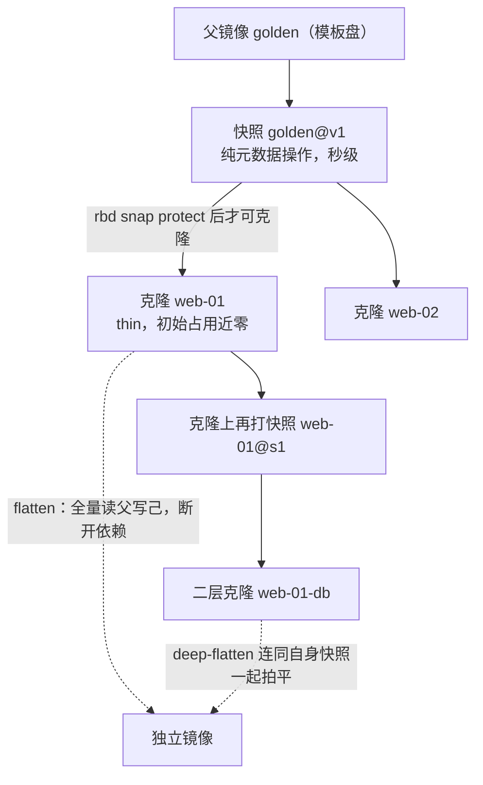
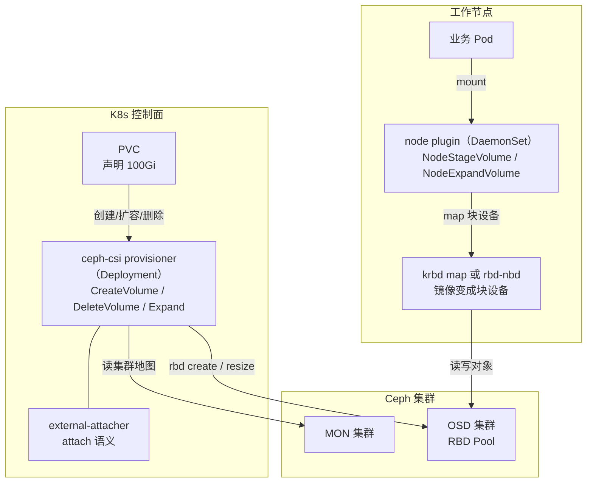
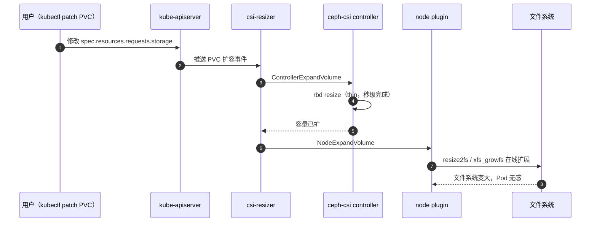

# 07 RBD 块存储——快照、克隆与 Kubernetes CSI

**摘要：**

RBD（RADOS Block Device）是 Ceph 三大存储接口中最先走向成熟、也至今用量最大的一条：它把 RADOS 的对象海洋封装成一块可以格式化、可以随机读写的"磁盘"，虚拟机的系统盘与 Kubernetes 容器的持久卷大多托付给它。本文从块设备语义与 2010 年 krbd 进入内核主线的历史出发，讲清一个 RBD 镜像如何被切成 4MB 的对象铺满集群，以及 krbd 内核栈与 librbd 用户态栈这两条访问路径的分野与选型；随后逐个拆解 layering、exclusive-lock、object-map、fast-diff、deep-flatten 五个特性位的语义、默认开启集与老客户端兼容问题；在快照与克隆一章，用对象级写时复制解释"秒级快照"从何而来，并给出从模板镜像到克隆链再到 flatten 的完整命令实战；性能一章讨论 librbd 缓存模式、对象大小、QEMU iothread 与 fio 压测方法；Kubernetes 一章拆解 ceph-csi 的 provisioner 与 node plugin 双组件架构、StorageClass 参数、PVC 与镜像的对应关系、快照类与在线扩容链路；最后从运维视角看镜像迁移、trash 延迟删除与常见故障的排查命令链。全文试图回答两个问题：块设备语义是如何"翻译"到对象存储之上的，以及在虚拟化与 Kubernetes 生产环境里如何把这块网络磁盘用好、用稳。

---

## 第 1 章 RBD 的定位——块设备抽象如何落在 RADOS 对象之上

### 1.1 为什么对象存储要假装自己是一块磁盘

块设备（Block Device）是操作系统与磁盘之间最古老的契约：存储被看成一条从 0 开始编号的扇区（Sector）序列，你可以读写任意偏移、任意长度，系统不问内容是什么，也不关心你拿它去建文件系统还是存数据库页。这份契约简单到近乎简陋，却是软件世界最底层的地基——文件系统、数据库的页管理、虚拟机的系统盘，全都直接踩在块语义之上。

2010 年 5 月，Linux 内核 2.6.34 发布，一个名为 rbd 的块设备驱动随主线亮相，把 Ceph 集群里的一组对象映射成 `/dev/rbdX` 设备，分布式存储第一次以"本地磁盘"的身份进入内核。此后两年，QEMU 集成了 librbd 驱动，虚拟机得以绕过内核块层直连集群；2012 年 OpenStack 把块存储服务从 Nova 中独立为 Cinder，Ceph RBD 迅速成为其最主流的后端之一。回头看这段历史，RBD 的走红并不意外：云计算的第一波大规模需求就是给虚拟机发磁盘，而块设备恰恰是虚拟机磁盘唯一认的形态。在它之前，"发磁盘"的主流方案是 SAN 加 iSCSI——存储阵列把逻辑单元号（Logical Unit Number, LUN）通过 iSCSI 协议映射给主机，主机把它当本地盘用。这条路径的中心是阵列控制器：所有 IO 都要过存储头，快照、克隆、扩容都是阵列的专有功能，价格随容量非线性上涨。2008 年 Amazon 推出 EBS（Elastic Block Store），把"发磁盘"变成了 API 调用，虚拟机磁盘第一次成为可以按需创建、按量计费的商品；开源世界对应的答案正是 RBD——用 CRUSH 把"存储头"的角色摊到所有 OSD 上，快照与克隆变成对象级的元数据操作。本章接下来讲的条带化与第 3 章的 COW，本质上都是对集中式阵列三个卖点（供盘、快照、克隆）的分布式替代。

| 维度 | iSCSI/SAN 阵列 | Ceph RBD |
| :--- | :--- | :--- |
| 数据路径 | 主机 → iSCSI 网关 → 控制器 → 磁盘 | 客户端 → CRUSH 计算 → OSD 直连 |
| 扩展瓶颈 | 控制器（存储头） | 数据路径上无中心节点 |
| 快照与克隆 | 阵列专有功能，常随 license 计价 | 对象级 COW，元数据操作 |
| 容量扩展 | 加盘、换控制器，成本非线性 | 加 OSD 近线性扩展 |
| 适用边界 | 低延迟专有硬件、传统数据库一体机 | 规模化云平台、虚拟机与容器供盘 |

不妨先问一个反直觉的问题：RADOS 只提供"存取带元数据的字节串"的原语，块设备的随机读写语义是从哪里来的？答案是翻译。RBD 的实现不是去模拟一块磁盘的磁道与寻道，而是做一层**地址翻译**——把"从第 N 扇区读 4KB"翻译成"读某个 4MB 对象的某一段"。翻译规则简单到可以用一行伪代码概括，而正是这层薄薄的翻译，让块语义得以架在对象存储之上。

### 1.2 4MB 条带化——一块磁盘如何铺满集群

创建一个 RBD 镜像（Image）时，你只声明一个逻辑大小，譬如 1TB，集群里并不会立刻出现 1TB 的数据。镜像在逻辑上被切成一串固定大小的对象，默认 4MB（由 `rbd_order` 决定，order=22 即 2 的 22 次方字节），每个对象的 OID 由镜像 ID 与序号拼接而成。读写某个偏移时，客户端先算出目标落在第几个对象、对象内偏移多少，然后走 [[中间件/Ceph/01 Ceph 全局架构——RADOS、CRUSH 与三大存储接口|01 全局架构]] 讲过的两步映射——哈希到放置组（Placement Group, PG）、CRUSH 算出 OSD——直奔目标。一个 40GB 的镜像切出上万个对象，被 CRUSH 均匀撒到全集群，吞吐因此随 OSD 数量近乎线性扩展。

不妨用集装箱来类比：一船货物（镜像）如果整体捆成一件，装卸只能靠一个码头慢慢来；按标准箱（4MB 对象）拆开之后，几千个码头工人（OSD）可以同时装卸，哪一箱坏了也只需补运那一箱。**条带化（Striping）不是锦上添花的优化，而是块语义能在分布式系统上成立的先决条件**——反事实很直观：若整个镜像是一个大对象，所有 IO 都会压在承载它的那组 OSD 上，镜像越大热点越重，恢复一个 1TB 镜像就意味着搬动 1TB 的连续数据。

精简配置是块语义的另一重红利：创建 1TB 镜像不占空间，只有写入到的对象才真正分配空间，这就是**精简配置（Thin Provisioning）**。它让"先划大盘、后按需用"成为可能，但同时也埋下了容量超卖的伏笔——账面分配 100TB、实际占用 30TB 的池子，一旦业务集中写入，超卖部分会以写满报错的方式突然现形。这个话题在第 6 章的 `rbd du` 一节会再回来算账。

对象数与 PG 的关系也值得一笔：镜像被切成的对象数是固定的（大小除以对象大小），而对象到 PG 的哈希分布是否均匀，取决于 Pool 的 PG 数量与对象数量级是否匹配。一个只有几十个对象的镜像落在 PG 数上千的池里，注定只有少数 PG 被用到——分布"看起来散"，实际仍集中在个别 OSD 组合上。反过来，海量镜像共享一个大池时，PG 数要按池内对象总量而非单个镜像来规划，这与 [[中间件/Ceph/02 CRUSH 算法——去中心化的数据放置|02 CRUSH 算法]] 讨论的分布均匀性是同一道题。

### 1.3 两条客户端栈——krbd 与 librbd 的分野

同一个镜像，有两条访问路径。krbd 是 Linux 内核模块，`rbd map` 之后镜像以块设备的形式挂进系统，走内核块层，页缓存、I/O 调度与文件系统生态全部现成；librbd 是用户态库，直接编译进应用进程——QEMU 用它为虚拟机供盘，ceph-csi 用它为容器供盘，数据路径不经过内核块层，缓存放进程自己的堆里。两者之间还有一个折中形态 rbd-nbd：数据面跑在用户态 librbd 上，通过 NBD（Network Block Device）协议在内核里映射出块设备，兼顾了特性完整与块接口通用。

打个比方，krbd 像市政公交：线路统一、与整座城市（内核）的基础设施无缝衔接，但班次表由公交公司（内核发行版）决定；librbd 像随叫随到的专车：跟着应用走、可以独立升级，但司机（进程内存与线程）要自己养。选哪条路，取决于内核版本、升级节奏与特性需求，而非笼统的性能高下。

rbd-nbd 的存在感在 Kubernetes 场景里格外强：ceph-csi 的 node plugin 默认走 krbd，但遇到老内核不支持特性位的镜像，或者想把 librbd 的缓存与特性位能力带进容器场景时，可以切换到 rbd-nbd 挂载——代价是节点上多驻留一个用户态进程，它的内存与 CPU 要计入 node plugin 的资源预算。换句话说，rbd-nbd 用一点资源开销，买回了"不跟内核版本走"的自由度，这在内核升级缓慢的企业环境里往往是决定性的。

### 1.4 选型对比

| 维度 | krbd（内核栈） | librbd（用户态栈） |
| :--- | :--- | :--- |
| 形态 | Linux 内核模块，map 出 `/dev/rbdX` | 用户态库，嵌在 QEMU、ceph-csi 等进程内 |
| 数据路径 | 应用 → 内核块层 → krbd → 网络 | 应用 → librbd → librados → 网络 |
| 缓存形态 | 复用内核页缓存（page cache） | 进程内 writeback/writethrough 缓存 |
| 特性位支持 | layering、exclusive-lock（内核 4.9+）、journaling（4.11+） | 全部特性位，含 object-map、fast-diff、deep-flatten |
| 版本耦合 | 跟随内核发行节奏，升级要动宿主机 | 跟随应用镜像，容器化环境可独立升级 |
| 典型场景 | 宿主机直接用块设备、老内核环境 | QEMU 虚拟机磁盘、Kubernetes PVC（主流路径） |

这张表里最值得划重点的是特性位一行：krbd 至今不支持 object-map、fast-diff 与 deep-flatten，启用了这些特性的镜像在内核侧会直接 map 失败。这就是为什么 ceph-csi 的 StorageClass 默认只开 layering——它必须照顾最广泛的内核版本。至于性能，内核栈吃页缓存与成熟调度器的红利，用户态栈省一次内核-用户态切换且随应用演进，两者在不同负载下互有胜负，建议以第 4 章的压测方法实测为准。

落到具体决策，不妨按这份清单过一遍：

- 宿主机要把镜像当裸盘用（譬如直接挂给数据库容器外的进程）→ krbd，注意内核版本与特性位交集。
- QEMU/KVM 虚拟机磁盘 → librbd（QEMU 原生驱动），快照、克隆与热迁移特性最完整。
- Kubernetes PVC → ceph-csi 默认路径（krbd map + librbd 能力），StorageClass 参数见第 5 章。
- 老内核且必须用新特性 → rbd-nbd 折中，把资源开销计入节点预算。
- 需要多节点共享读写 → RBD 之上架集群文件系统，或改用 CephFS（[[中间件/Ceph/08 CephFS——MDS、多活元数据与实践边界|08 CephFS]]）。
- 海量小文件、需要目录语义 → 这不是 RBD 的战场，CephFS 或对象存储更合适。

> [!info] 核心概念：4MB 是默认值，不是常数
> 4MB 这个数字是工程权衡的产物：太大则小写入浪费空间、恢复粒度变粗，太小则对象数暴涨、元数据开销上升。它可以通过 `rbd_order` 调整（第 4.2 节展开），但调整前请先想清楚自己的负载形态——**默认值是给"不知道自己负载形态的人"准备的，知道的人应该自己选**。

> [!note] 设计哲学
> RBD 的两条客户端栈是"复杂性放在哪里"的又一次落笔：krbd 把复杂性交给内核（换来零部署与生态兼容），librbd 把复杂性收进应用进程（换来特性完整与独立升级）。这与 [[中间件/Ceph/01 Ceph 全局架构——RADOS、CRUSH 与三大存储接口|01 全局架构]] 中"内核态与用户态的分野"是同一个判断在块存储层的具体化——**没有绝对优劣，只有与运维形态的匹配**。

---

## 第 2 章 镜像与特性位——五个开关的语义

### 2.1 特性位是能力协商的契约

用 `rbd info` 查看任意一个镜像，你会看到一行 `features: layering, exclusive-lock, object-map, fast-diff, deep-flatten`。这些就是**特性位（Feature Bits）**——记录在镜像元数据里的位掩码，每个二进制位代表一种可选能力。它的存在解决了一个分布式系统绕不开的问题：集群软件会持续演进，而客户端千差万别，如何让老内核客户端与新版本镜像共存？Ceph 的答案是刻意的"不兼容"：客户端遇到自己不认识的特性位，会拒绝打开镜像并明确报错，而不是硬着头皮读出错误的数据。

这就像老播放器遇到新编码的视频：负责任的播放器会提示"格式不支持"，而不是把画面放成雪花。特性位把"兼容性"从一个隐式的运气问题，变成了显式的协商问题——创建镜像时选装哪些特性，客户端 map 或挂载时就会检查这些位。理解了这一点，很多线上"怪现象"就有了答案：为什么同一个镜像 QEMU 能读而内核挂不上？为什么升级 ceph-csi 后要回头改 StorageClass 的 `imageFeatures`？根源都在这串位掩码上。

还要补一句特性位的另一面：它不只是防御机制，也是 Ceph 演进的发布通道。每个新特性（独占锁、位图、快速 diff）都以新的特性位落地，集群升级后旧镜像不受影响，新能力按需选装——这与数据库的"兼容级别"设定是同一种智慧：**演进的速度交给集群，采纳的速度交给你**。

### 2.2 五个特性位的语义

**layering（分层）**是克隆能力的前提：没有它，镜像就是一块实打实的盘，无法基于快照派生子镜像。它定义了"父镜像-快照-克隆"的谱系结构，第 3 章的整套克隆机制都建立在它之上。这个特性位出现得很早，2012 年前后的版本就已支持，是五个特性位中唯一在所有客户端上都可用的"元老"。

**exclusive-lock（独占锁）**在 Jewel（2016 年）引入，语义是同一时刻只允许一个客户端以写模式打开镜像。块设备语义默认假设"我是这块盘唯一的写者"——两个写者同时改一个文件系统，结果不是性能问题，而是文件系统元数据损坏。独占锁把这条约定变成集群强制：第二个写者要么等待、要么只读打开。现代客户端（QEMU、ceph-csi）默认开启自动独占锁：第一个以写模式打开的客户端自动持锁，断连后锁由集群回收，业务侧几乎无感；它同时是 RBD mirroring（跨集群异步复制）的前置条件，也是多写者问题的核心（第 4.5 节展开）。

**object-map（对象位图）**在镜像旁边维护一张位图，记录每个 4MB 对象"是否实际存在"。这块位图的价值在精简配置的世界里被放大：一个账面 1TB、实际只写了 50GB 的镜像，导出、删除、克隆时都要回答"哪些对象真的有数据"，没有位图就只能逐个对象去问 OSD，位图把这类操作从"全量探测"变成"查表"。它由 librbd 维护，krbd 不支持。

**fast-diff（快速差异）**依赖 object-map，在位图之上进一步记录"自某个快照以来哪些对象被改过"，让增量备份、快照间 diff 这类操作不必逐对象比对。它本身不加速 IO，加速的是备份与同步类工具的元数据判断。

**deep-flatten（深度拍平）**扩展了 flatten 的语义：普通 flatten 只处理克隆自身对父镜像的依赖，deep-flatten 会连同克隆自己的快照一起递归拍平。它的引入（Luminous，2017 年）解决的是"克隆的克隆"场景——克隆链上任何一层带着快照，父镜像就无法真正退役，deep-flatten 把这条链连同链上的快照一次拍平。

| 特性位 | 引入版本 | 核心语义 | krbd 支持 |
| :--- | :--- | :--- | :--- |
| layering | 2012 年前后 | 允许基于快照克隆，建立父子谱系 | 是 |
| exclusive-lock | Jewel（2016） | 同一时刻仅一个客户端持有写锁 | 是（内核 4.9+） |
| object-map | Jewel（2016） | 位图记录对象分配状态，加速导入导出与删除 | 否 |
| fast-diff | Jewel（2016） | 依赖 object-map，支持快照间快速 diff | 否 |
| deep-flatten | Luminous（2017） | 递归拍平整条克隆链，含克隆自身的快照 | 否 |

### 2.3 默认开启集与老客户端的坑

从 Jewel 起，`rbd_default_features` 的默认值是 61，即 layering、exclusive-lock、object-map、fast-diff、deep-flatten 五项全开。这个默认值对 librbd 侧毫无问题，但 krbd 侧会踩坑：老内核的 rbd 驱动不认识 object-map、fast-diff 与 deep-flatten，map 这样的镜像会报 `Unsupported image features`。生产中的处理无非两条路：要么创建镜像时用 `--image-feature` 显式裁剪，要么统一升级内核。ceph-csi 出于兼容考虑，StorageClass 的 `imageFeatures` 参数默认只写 layering，这正是上一张表的现实投影。

> [!warning] 生产避坑：特性位是"创建时"决定的
> 特性位在镜像创建时确定，事后只能用 `rbd feature enable/disable` 增删部分特性（object-map、fast-diff 可以后补，layering 一旦关闭无法重开）。混用 librbd 与 krbd 的环境，建议在运维规范里固定一份"最大公共特性集"，否则总有一天会出现"镜像在管理机上好好的，到计算节点上 map 不起来"的怪事。

### 2.4 特性位与运维操作的依赖关系

特性位不只是"能力开关"，它们之间还有依赖关系，并且直接决定哪些运维操作可用。把这张依赖表贴在运维手册里，很多"为什么这个命令报错"的问题就不用再猜：

| 运维操作 | 依赖的特性位 | 缺失时的表现 |
| :--- | :--- | :--- |
| `rbd clone` 从快照克隆 | layering | 直接报错，克隆无从谈起 |
| RBD mirroring 跨集群复制 | exclusive-lock + journaling | 无法启用镜像复制 |
| `rbd export-diff` 增量导出提速 | object-map + fast-diff | 退化为逐对象探测，耗时长 |
| 大镜像的删除与导入导出加速 | object-map | 全量探测对象，操作随镜像账面大小线性变慢 |
| 克隆链整体拍平（含克隆自身快照） | deep-flatten | 只能逐层 flatten，父镜像长期无法退役 |

这张表也解释了 ceph-csi 的一个默认行为：它创建的镜像默认只带 layering，因为 PVC 快照与克隆只需要 layering，而多开的特性位会把 krbd 路径上的节点排除在外。反过来，如果你的集群全部走 librbd（譬如统一用 rbd-nbd），不妨把 object-map 与 fast-diff 打开——增量备份工具与 `rbd du` 都会因此受益。**特性位的最优解不是"全开"也不是"全关"，而是按客户端栈的构成取交集**。

---

## 第 3 章 快照与 COW 克隆——对象级的写时复制

### 3.1 秒级快照从何而来

RBD 快照（Snapshot）的创建是纯元数据操作：给镜像当前的所有对象盖一个版本戳，不拷贝任何数据，因此无论镜像是 40GB 还是 4TB，`rbd snap create` 都在毫秒到秒级完成。真正的拷贝被推迟到写入时刻——这就是**写时复制（Copy-on-Write, COW）**。

复制发生在对象粒度。快照之后，镜像的每个对象都携带一份快照集（Snapset）：头对象（head object）代表当前版本，快照那一刻的对象内容作为快照版本被保留。当客户端第一次写某个 4MB 对象时，OSD 先把这个对象的快照版本克隆出去存好，再把新数据写进头对象；第二次写同一对象就不再复制，直接覆盖头对象。**COW 的粒度是 4MB 对象，不是整个镜像**——这是 RBD 快照"又快又省"的全部秘密。

不妨用图书馆来类比：珍本（快照时刻的数据）不外借，谁要批注（写入新数据），先复印对应的那一页（copy-up 那个 4MB 对象），在复印件上随意涂改，珍本永远保持原样。注意比喻的边界：复印按"页"进行而非按"本"，所以一本 40GB 的书打完快照后，只有被翻动过的那些页才产生真实拷贝——这也解释了为什么快照后的写入性能会先降后稳，前几次写都要付 copy-up 的税，付过之后同一对象就不再重复付。

快照的另一个常被忽略的属性是：**删除快照也不是免费的**。既然写入时为快照克隆过对象，删除快照时就要回收这些对象——回收动作本身是真实的删除 IO，快照越多、快照后写入越多的镜像，删除快照的代价越大。生产中"删一个老快照把池 IO 打满"的事故并不罕见，批量清理快照与 flatten 一样，都应该安排在低峰窗口、限速执行。

### 3.2 保护快照与克隆链

克隆（Clone）建立在快照之上：先对父镜像打快照，再 `rbd snap protect` 保护它（防止被删导致克隆断链），然后 `rbd clone` 从这个快照派生新镜像。克隆出来的镜像同样是精简的——它只记录"我引用了父镜像的哪些对象"，读数据时若对象不在本地，就沿父链向上回溯；写数据时 copy-up 到自己的对象里。这个结构可以继续套娃：克隆上再打快照、再保护、再克隆，形成一条克隆链（Clone Chain）。



这条谱系是虚拟机模板、Kubernetes 从快照恢复 PVC 等机制的共同底座。但它有一条隐藏的读放大代价：**克隆链每深一层，最坏情况下一次读就要多回溯一层父镜像**。读 web-01 的某个对象，本地没有，去 golden@v1 找；golden@v1 也没有（因为它自己也是克隆），再往上一层。链深为 N 时，一次读最坏要跨 N 层网络往返。object-map 在这里能救场——位图让客户端快速判断"这个对象在父镜像里根本不存在"，省掉无效回溯；但只要链还在，读放大的结构性代价就在。

### 3.3 flatten 的代价与场景

flatten 做的事情一句话可以说清：把克隆依赖的父镜像数据全部实拷贝进克隆自身，然后断开父子关系。打个比方，这就像把租的房子买下来——一次性付清（全量读父镜像、写克隆），从此不再交月供（不再依赖父镜像的任何对象）。代价也一目了然：一次全量读加全量写的 IO 风暴，期间克隆的空间占用从"近乎零"涨到与父镜像相当。

什么时候值得付这笔钱？笔者在生产中常见三类场景。其一是**模板退役**：模板镜像的快照被保护着，几十个克隆挂在下面，父镜像想删除或迁移都动不了——逐个 flatten 之后，快照解除保护、删除，模板即可下线。其二是**克隆链治理**：链深三四层之后，读路径的回溯与空间统计都开始劣化，把热点克隆拍平是标准治理手段。其三是跨池迁移前的准备：把克隆拍平成独立镜像，迁移工具才不必处理父子引用。要注意 deep-flatten 与 flatten 的分工：deep-flatten 作用于父镜像，把它下面整条克隆链连同克隆自己的快照递归拍平；flatten 作用于单个克隆，只解决它与父镜像的依赖。

把本章几个操作的代价放在一张表里对比，"哪些便宜、哪些昂贵"就一目了然：

| 操作 | 耗时量级 | 空间代价 | IO 代价 |
| :--- | :--- | :--- | :--- |
| `rbd snap create` | 毫秒到秒级（元数据） | 近零 | 近零 |
| 快照后首次写某对象 | 单次写略增 | 该对象翻倍（copy-up） | 一次额外的读加写 |
| `rbd clone` | 秒级（元数据） | 近零 | 近零，读时按需回溯父链 |
| `rbd flatten` | 与镜像实存成正比 | 克隆涨到父镜像实存 | 全量读父加写己，叠加副本写放大 |
| `rbd snap rm` | 元数据加后台回收 | 释放 COW 占用 | 回收被快照保留的对象 |

这张表也是排障时的直觉来源："删快照把池 IO 打满"、"flatten 期间业务变慢"都不是异常，而是表里那一列代价的如实兑现——安排窗口、限速执行，是使用这些工具的正确姿势。

### 3.4 命令实战——从模板到克隆链再到拍平

```bash
# 1. 创建模板镜像并写入基础数据（譬如预装系统的根盘）
rbd create --pool rbd-pool --size 40G golden

# 2. 对模板打快照：元数据操作，秒级
rbd snap create rbd-pool/golden@v1

# 3. 保护快照：未保护的快照不允许克隆，防止父数据被删导致克隆断链
rbd snap protect rbd-pool/golden@v1

# 4. 从快照克隆业务镜像
rbd clone rbd-pool/golden@v1 rbd-pool/web-01
rbd clone rbd-pool/golden@v1 rbd-pool/web-02

# 5. 查看克隆谱系与实际占用
rbd children rbd-pool/golden@v1
rbd du rbd-pool

# 6. 克隆链治理：把 web-01 拍平为独立镜像（低峰期执行，IO 代价大）
rbd flatten rbd-pool/web-01

# 7. 模板退役：解除保护、删快照、删父镜像
rbd snap unprotect rbd-pool/golden@v1
rbd snap rm rbd-pool/golden@v1
```

> [!info] 核心概念：克隆链的读放大
> 克隆链每深一层，最坏情况下一次读就要多回溯一层父镜像。object-map 能把"父镜像里没有这个对象"的判断变成查位图，省掉无效回溯，但只要链还在，跨层读的结构性代价就在。治理思路通常是把克隆链的深度当作一项容量指标来管：模板镜像定期滚动（打新快照、批量 flatten 旧克隆），避免单链无限加深。

### 3.5 克隆链的治理节奏

克隆链是"借来的性能"——创建时省下的空间与时间，都会在读放大与治理成本上慢慢还回去。把治理变成例行公事而非救火动作，通常有三条节奏。其一是**模板滚动**：模板镜像每隔一段时间打新快照、新业务从新快照克隆，旧快照下的克隆逐批 flatten 后退役，让任何时刻的链深都有上界。其二是**热点优先**：读 IO 最重的克隆优先拍平，它们从链上摘除后，父镜像的读压力与整条链的回溯概率同步下降。其三是**退役联动**：模板要下线时，用 `rbd children` 列出全部后代，flatten 到最后一层再用 deep-flatten 收尾，快照解除保护后父镜像即可安全退役。

这些动作的共同前提是把克隆链当作可观测的资产：链深、单链克隆数、父镜像被回溯读的占比，都值得进监控面板。克隆链本身不是坏东西——它是模板分发的效率来源——**问题从来不在"有没有链"，而在"链是否失控"**。

---

## 第 4 章 性能参数与实践——把块设备调到合身

### 4.1 librbd 缓存——书桌上的便签

librbd 自带用户态缓存，由 `rbd_cache` 开关控制，模式有三种：关闭（none）、写穿透（writethrough）与回写（writeback）。writethrough 每笔写都等集群确认，安全但慢；writeback 先落进程内存、攒批下刷，快但进程崩溃会丢掉已应答而未下刷的数据。现代版本的默认策略是 `rbd_cache_writethrough_until_flush = true`——在收到第一条 flush 之前按 writethrough 行事，确认上层（文件系统或数据库）会正确发下刷命令之后，才切换到 writeback。这个默认值值得记住：**它假设你的应用知道如何下刷，如果把裸缓存交给一个不懂下刷的应用，writeback 就是断电丢数据的敞口**。

缓存行为由一组参数刻画：`rbd_cache_size` 是缓存总预算，`rbd_cache_max_dirty` 是触发下刷的脏数据上限，`rbd_cache_target_dirty` 是后台下刷的目标水位，`rbd_cache_max_dirty_age` 让脏数据在内存里逗留超过时限后强制下刷。这些参数没有普适最优值：数据库类负载往往直接关掉 librbd 缓存，把一致性交给数据库自己的预写日志与页缓存；文件系统类负载则可以从 writeback 中拿到可观的聚合收益。krbd 没有这层缓存，它吃的是内核页缓存——这也是两条栈在内存账本上的分野：librbd 的缓存要计入 QEMU 或 node plugin 进程的内存配额，krbd 则复用内核统一的页缓存，不额外占用户态内存。

> [!warning] 生产避坑：writeback 缓存与崩溃一致性
> writeback 模式下，"已应答给应用"与"已持久化到集群"之间存在窗口，进程崩溃或宿主机断电都可能丢掉窗口内的写。对一致性敏感的负载（数据库、消息队列），要么保持 `rbd_cache_writethrough_until_flush = true` 的默认保护，要么干脆关闭 librbd 缓存、把缓存职责交给应用自己——**缓存省下的每一毫秒，都要用丢数据的风险来标价**。

### 4.2 对象大小——4MB 不是教条

`rbd_order` 决定对象大小（默认 order 22，即 4MB），创建时可用 `--object-size` 调整，创建后不可更改，只能通过迁移换新。它影响的是三件事的平衡：元数据开销、写放大与恢复粒度。

| 对象大小 | 收益 | 代价 | 适合 |
| :--- | :--- | :--- | :--- |
| 64KB–512KB | 随机小 IO 的写放大低；恢复粒度细；分布更散 | 对象数多，PG 与元数据压力大 | 高频随机小 IO |
| 4MB（默认） | 各项开销均衡，社区默认心智 | 中庸 | 通用负载 |
| 16MB–32MB | 顺序吞吐好；对象数少 | 部分写放大高；恢复要搬大对象 | 大文件顺序读写、备份盘 |

调小对象还有一个常被忽略的收益：恢复更快。一块 OSD 故障时，它承载的对象要被复制到别处，对象越小、越散，恢复流量就越容易摊到更多 OSD 上并行进行——这与 [[中间件/Ceph/05 PG 状态机与数据一致性——Peering、Recovery 与 Backfill|05 PG 状态机与数据一致性]] 讨论的恢复并行度是同一枚硬币的两面。

### 4.3 QEMU iothread——把 IO 从主循环里摘出来

QEMU 默认在 vCPU 的主循环里处理块设备 IO，虚拟机一忙，设备模拟与指令执行互相争抢，尾延迟随之抖动。iothread 把块设备的 IO 处理剥离到专用线程，virtio-blk 与 virtio-scsi 都支持为磁盘绑定独立 iothread，多队列（virtio-scsi 多队列）还能让多 vCPU 的负载并行提交 IO。对延迟敏感的数据库虚拟机，这是成本极低的一项调优；不过它的收益上限受限于后端 librbd 与集群本身，集群侧瓶颈不解除，前端怎么调都只是搬运排队。

配置上它也足够轻量：libvirt XML 里声明 iothread 数量、再在磁盘的 driver 上绑定即可，热调整也受支持。判断要不要做这条调优的标准很简单——在虚拟机内部压测时观察 P99 延迟是否随宿主机负载波动，波动明显且宿主机 CPU 打满时，iothread 大概率能还你一段稳定的尾延迟。

### 4.4 fio 压测——先考集群，再考镜像

压测 RBD 有两把尺子。轻量的是内置的 `rbd bench`，适合部署后冒烟：

```bash
# 冒烟测试：4k 随机写 1GB，确认链路通、延迟量级正常
rbd bench --io-type write --io-size 4k --io-threads 16 --io-total 1G rbd-pool/fio-vol
```

严肃的基准测试则用 fio 的 rbd 引擎，它从用户态直接打 librbd，测的是"应用视角"的真实路径：

```bash
# 4k 随机写：块存储最严苛的考卷，iodepth 与 numjobs 模拟并发
fio --name=randwrite --ioengine=rbd --pool=rbd-pool --rbdname=fio-vol \
    --rw=randwrite --bs=4k --iodepth=32 --numjobs=4 \
    --runtime=120 --time_based --group_reporting

# 1M 顺序读：衡量吞吐上限
fio --name=seqread --ioengine=rbd --pool=rbd-pool --rbdname=fio-vol \
    --rw=read --bs=1M --iodepth=16 --runtime=120 --time_based --group_reporting
```

压测纪律比参数更重要：先测空集群基线，再叠加业务模型；不要在生产池上压测，也不要只看平均值——块存储的体验由 P99 延迟决定，4k 随机写的尾延迟往往比平均值诚实得多。

拿到数字之后还有一步：把 fio 报告翻译成容量规格。一个粗略但实用的心算框架是，集群 4k 随机写 IOPS 的上限约等于"参与并行的 OSD 数 × 单盘 IOPS，再除以副本写放大"——三副本意味着每笔业务写要落三次盘，写放大就是三；1M 顺序读的吞吐上限则约等于"参与并行的磁盘带宽之和"与"网络带宽"的较小者。这两个估算当然粗糙（缓存、条带、PG 分布都会修正它），但足以回答"这个集群扛不扛得住我的数据库"这类第一轮问题，精确的答案交给实测。

### 4.5 独占锁与多写者——块语义的边界

块设备语义默认假设"我是唯一的写者"，两个客户端同时写一块盘、各自缓存各自下刷，结果不是数据共享而是元数据互踩。RBD 的默认模型因此是**单写多读**：exclusive-lock 特性位保证同一时刻只有一个客户端持有写锁，镜像 mirroring 也以此为前提。真实世界里确有"多节点共享读写一块盘"的需求（譬如集群文件系统的共享块设备），Ceph 文档给出的路径是在 RBD 之上架设集群感知文件系统（OCFS2、GFS2 之类），由它们负责分布式锁——RBD 自己不提供多写者语义，这条边界不要去试探。

### 4.6 两层缓存的语义对齐

QEMU 走 librbd 时，还有一层容易混淆的缓存语义要对齐：QEMU 自己的 `cache=` 参数与 librbd 的 `rbd_cache` 是两层东西。`cache=writeback` 会启用 librbd 的回写缓存，`cache=none` 与 `cache=writethrough` 则让 librbd 按写穿透行事——如果宿主机层面设了 `cache=none`，而你在 Ceph 配置里调大了 `rbd_cache_size`，那笔内存预算根本不会生效。**调优之前先确认哪一层缓存真正在干活**，这类"参数调了没反应"的问题，多数是两层配置打架。

对常见负载，笔者的经验性建议如下表，但请把它当作起点而非结论——最终数字永远来自你自己的 fio 报告：

| 负载形态 | librbd 缓存建议 | 理由 |
| :--- | :--- | :--- |
| 数据库（自管 WAL 与页缓存） | 关闭或 writethrough | 数据库的缓存与下刷语义更精细，双层缓存徒增丢数据窗口 |
| 虚拟机系统盘 / 通用应用 | writeback（保持 until_flush 默认） | 聚合小 IO，收益明显，flush 保护兜底 |
| 大文件顺序读写 | writeback，加大缓存水位 | 顺序下刷友好，攒批收益大 |
| 对崩溃一致性极敏感的队列类 | 关闭 | 宁可慢，不可丢 |

---

## 第 5 章 Kubernetes CSI 对接——从 kubelet 里拆出来的存储栈

### 5.1 CSI 的由来——为什么不在 kubelet 里写存储驱动

Kubernetes 早期把存储驱动直接写进核心代码（in-tree），Ceph RBD 也不例外。这个设计的代价随生态膨胀迅速显形：驱动代码与 Kubernetes 发版绑定，存储厂商的 bug 修复要等社区发版，核心仓库成了所有存储逻辑的集散地。**容器存储接口（Container Storage Interface, CSI）**就是为拆掉这个耦合而生——它定义一套 gRPC 标准，把"创建卷、挂载卷、扩容、快照"抽象成标准接口，驱动以独立容器（out-of-tree）交付，与 Kubernetes 版本解耦。CSI 规范 2017 年发布首个版本、2018 年 8 月发布 1.0；Kubernetes 自 1.9 引入、1.13 起 GA，此后 in-tree 的 RBD 插件逐步废弃，ceph-csi 成为官方与事实上的标准路径。

用插座来类比最贴切：CSI 是统一的插座标准，Kubernetes 只管插座长什么样，ceph-csi 这类驱动负责把自家电器的插头做成标准形状。插座标准稳定，插头可以随时换代——这正是 in-tree 时代不可想象的自由度。

### 5.2 ceph-csi 的双组件架构

ceph-csi 在 Kubernetes 侧分成两个角色。**controller plugin（常称 provisioner）**以 Deployment 部署，负责控制面：响应 PVC 创建请求，调用 Ceph 创建 RBD 镜像，处理删除、扩容与快照对象的编排；它身边挂着一组官方 sidecar——external-provisioner 监听 PVC、csi-resizer 处理扩容、csi-snapshotter 处理快照对象、external-attacher 处理块设备的 attach 语义。**node plugin** 则以 DaemonSet 铺满每个节点，负责数据面：NodeStageVolume 把 RBD 镜像 map 成节点上的块设备（走 krbd，或走用户态的 rbd-nbd），NodePublishVolume 再把它以 bind mount 的方式递进 Pod。

不妨把 provisioner 想象成物业前台：审批申请、开卡销卡、登记台账，但它从不上楼；node plugin 才是驻场电工，负责把电缆真正接进房间。前台可以集中部署、统一升级，电工必须每栋楼（每个节点）都驻一个——这个"集中与分布"的分工，正是 CSI 架构的全部骨架。

两个角色的部署形态也值得交代一句。provisioner 以多副本 Deployment 部署时靠 leader election 保证同一时刻只有一个实例干活，副本数给到 2-3 即可，它不在数据路径上，挂掉的影响是"新 PVC 暂时创建不出来"，存量卷的读写不受影响；node plugin 则是 DaemonSet，必须覆盖每一个会跑业务 Pod 的节点，它的资源开销（尤其走 rbd-nbd 时的用户态进程内存）要计入节点预算。排查"PVC 一直 Pending"时，先看 provisioner 的 leader 与日志，再看 node plugin 是否在目标节点就绪——这条二分法能省掉大半排障时间。



### 5.3 StorageClass——动态供给的参数面板

StorageClass 是 PVC 与 Ceph 之间的翻译层，核心参数不多但个个关键：

| 参数 | 作用 | 实务要点 |
| :--- | :--- | :--- |
| clusterID | 定位 ceph-csi 配置中的目标集群 | 通常取集群 fsid，经 ConfigMap 映射到 MON 地址 |
| pool | 镜像落在哪个 RBD Pool | 按业务与可靠性等级分池 |
| imageFeatures | 创建镜像时启用的特性位 | 默认 layering，兼容 krbd 路径 |
| encrypted / encryptionKMSID | 静态加密 | 支持 Kubernetes Secrets、Vault、KMIP 等 KMS |
| csi.storage.k8s.io/*-secret-* | 各环节认证凭据 | 建议用最小权限 caps 的专用 Ceph 用户 |

`clusterID` 值得一提：它是 ceph-csi 侧定义的集群标识，通常直接取集群 fsid，通过 ceph-csi 的 ConfigMap 映射到 MON 地址与认证方式——这让"同一个 Kubernetes 集群对接多个 Ceph 集群"成为一次配置而非一次改造。加密参数（`encrypted: "true"` 配合 `encryptionKMSID`）把密钥管理外置到 KMS（譬如 Vault），镜像数据在块层加密，密钥不落集群。凭据方面，provisioner 与 node plugin 使用的 Secret 背后是一个 caps 收窄的 Ceph 用户（`mon 'profile rbd'`、`osd 'profile rbd pool=xxx'`），不要图省事直接给 admin。

```yaml
apiVersion: storage.k8s.io/v1
kind: StorageClass
metadata:
  name: ceph-rbd
provisioner: rbd.csi.ceph.com
parameters:
  clusterID: <集群 fsid，经 ceph-csi ConfigMap 映射到 MON 地址>
  pool: rbd-pool
  imageFeatures: layering          # 默认只开 layering，兼容 krbd
  encrypted: "true"                # 静态加密，配合 encryptionKMSID 指定 KMS
  csi.storage.k8s.io/provisioner-secret-name: csi-rbd-secret
  csi.storage.k8s.io/provisioner-secret-namespace: ceph-csi
reclaimPolicy: Delete              # 删除 PVC 即删镜像，trash 可兜底
allowVolumeExpansion: true         # 允许在线扩容
```

### 5.4 PVC 与 RBD 镜像的对应关系

每创建一个 PVC，provisioner 就在指定 Pool 里创建一个名为 `csi-vol-<uuid>` 的 RBD 镜像，并把 PVC 的名字、命名空间、对应 PV 等信息写进镜像元数据（`csi.storage.k8s.io/pvc/name` 等键）。这层对应关系是运维排障的锚点：告警说某个镜像被锁，第一件事就是用镜像元数据反查它属于哪个 PVC、哪个命名空间。反过来，`kubectl get pvc` 与 `rbd ls` 的对账也是容量治理的基本功——StorageClass 的 `reclaimPolicy` 设为 Delete 时，删除 PVC 会连带删除镜像，此时 trash（第 6 章）就是唯一的后悔药。

`reclaimPolicy` 的 Delete 与 Retain 值得单独权衡：Delete 让"删 PVC 即回收空间"的体验顺滑，但误删的代价由 trash 兜底；Retain 则把删除变成两步（先删 PVC、再手动清理 PV 与镜像），适合财务、审计类"宁可麻烦不可误删"的数据。两者没有对错，按数据的价值密度分 StorageClass 即可——这也是"按业务分级建多个 StorageClass"这条通用建议在块存储上的具体化。

### 5.5 快照类与 PVC 快照

PVC 快照走 CSI 快照体系：VolumeSnapshot 对象绑定 VolumeSnapshotClass，由 csi-snapshotter 调 ceph-csi 在对应 RBD 镜像上创建快照（`csi-snap-<uuid>`），并在快照对象存活期间保持保护。从快照恢复则是第 3 章克隆机制的直接应用——新 PVC 声明 `dataSource` 指向快照，provisioner 执行的正是 `rbd clone`。这意味着 **K8s 语境下的"快照恢复"就是克隆**，克隆链的治理原则在这里同样适用；而把快照导出到集群之外（异地容灾、长期保留），则要走镜像 mirroring 或对象存储备份链路，那属于另外两套机制的故事。

还有一个容易忽略的运营细节：快照数量本身要设上限。每个 VolumeSnapshot 在 Ceph 侧都是一个真实的 RBD 快照，COW 空间随"快照年龄 × 快照后写入量"累积，K8s 侧的定时快照任务（譬如每小时一个、保留 48 个）在 Ceph 侧就是 48 份持续膨胀的 COW 数据。把保留份数、最老快照年龄纳入告警，是快照体系不失控的底线。

```yaml
apiVersion: snapshot.storage.k8s.io/v1
kind: VolumeSnapshotClass
metadata:
  name: csi-rbd-snapclass
driver: rbd.csi.ceph.com
deletionPolicy: Delete
parameters:
  clusterID: <集群 fsid>
  csi.storage.k8s.io/snapshotter-secret-name: csi-rbd-secret
  csi.storage.k8s.io/snapshotter-secret-namespace: ceph-csi
```

### 5.6 扩容链路——一次 PVC resize 的完整旅程



这条链路有两处值得留意。其一，RBD 侧的 `rbd resize` 因为精简配置而是秒级元数据操作，真正的耗时在文件系统在线扩展（ext4 与 xfs 都支持挂载状态下扩容）；其二，**扩容只增不减**——StorageClass 需要显式声明 `allowVolumeExpansion: true`，而缩容在 CSI 体系里不受支持，要缩小只能新建卷迁数据。把"只增不减"写进容量规划的习惯里，比事后补救便宜得多。

链路卡住时的排查也有章法：PVC 事件里出现 `FileSystemResizePending` 说明 Ceph 侧已经扩完、卡在节点侧的文件系统扩展，去看 node plugin 日志与文件系统类型（ext4/xfs 之外的支持有限）；事件里毫无动静则多半是 provisioner 侧的问题，检查 `allowVolumeExpansion` 是否声明、csi-resizer 是否就绪。扩容失败最常见的原因不是技术，而是流程——没人审批的大容量请求，或者自动化脚本里写死的单位错误（Gi 与 G 的差别）。

> [!warning] 生产避坑：扩容只增不减
> PVC 扩容不可逆，误填超大值后无法缩回。生产建议对 StorageClass 启用扩容审批流，或在自动化里对容量跳变设阈值告警——块存储的"弹性"只有单向阀门。

### 5.7 从 PVC 事件到 Ceph 侧日志的排障链

K8s 侧的存储故障，排查路径是一条从上往下的漏斗。第一层看对象状态：`kubectl describe pvc` 的 Events 会给出 CSI 侧的报错原文（创建失败、扩容卡住、attach 失败各有专属事件）；第二层看 CSI 组件日志：provisioner 的日志管控制面问题（认证、参数、配额），node plugin 的日志管数据面问题（map 失败、挂载失败）；第三层才落到 Ceph 侧：`rbd status` 看 watcher 与锁，`rbd info` 看镜像属性，集群健康看 [[中间件/Ceph/03 Monitor 与集群地图——Paxos、Quorum 与 MON 运维|03 Monitor 与集群地图]] 讲的 `ceph -s` 与健康告警。

这条漏斗的价值在于方向感：多数"存储坏了"的工单，问题其实出在第一层（StorageClass 参数写错、Secret 过期、命名空间不对）或第二层（node plugin 未就绪、内核特性位不匹配），真正到 Ceph 集群侧的故障占比并不高。**先看事件、再看驱动、最后看集群**——把排查顺序固化成团队习惯，比记住任何单条命令都值钱。

---

## 第 6 章 运维视角——迁移、回收与排障

### 6.1 镜像迁移——rbd migration 家族

把镜像从一个 Pool 挪到另一个 Pool（譬如从副本池迁往纠删码池、或做池级 rebalance），传统做法是 `rbd export` 加 `rbd import`，要准备一份全量副本与一个停写窗口。Nautilus（2019 年）引入的原生迁移机制把这件事变成了三步：`rbd migration prepare` 在源与目标之间建立链接、源镜像转为只读，此后目标镜像即可正常使用；`rbd migration execute` 在后台按对象搬运数据，期间业务 IO 不中断；完成后 `rbd migration commit` 清理源端。中途反悔，`rbd migration abort` 可以把链接拆回原状。它还支持跨集群导入（源写成 `file://` 指向的 qcow 或 raw 文件），把外部镜像收编进 Ceph 时不必经过中间落盘。

与 `rbd cp` 的区别值得辨析：cp 是"复制一份新镜像"，源与目标各自独立，代价是双倍空间与拷贝时长；migration 是"原地接管"，数据逐步搬到目标、客户端无感切换。做池级迁移、存储策略变更（副本改纠删码）时，migration 几乎总是更优解；做"给业务一份独立副本"时，cp 或克隆才是对的工具。

还有一条前置检查容易漏：带快照或克隆的镜像，迁移会受限——父子关系与快照引用让"原地接管"无从谈起，标准做法是先 flatten（必要时 deep-flatten）把镜像拍平成独立个体，再走 migration。把这条写进迁移预案，能避免"prepare 到一半发现源镜像带着一串克隆"的尴尬。

### 6.2 trash 机制——删除的缓冲带

`rbd rm` 是即时且不可逆的，而生产环境的误删从不预约。trash 机制把删除变成两段式：`rbd trash move` 把镜像移入回收站，可带 `--expires-at` 设定延迟；期间 `rbd trash restore` 随时捞回，到期后由 `rbd trash purge` 或自动调度清理。这个设计对三件事至关重要：误删后悔药、K8s `reclaimPolicy: Delete` 场景下的兜底（PVC 删除触发的镜像删除同样先进 trash）、以及被克隆引用的父快照的延迟清理。trash 还支持定期清理调度，配合监控把"回收站堆积"纳入容量视野。

打个比方，trash 就是删除操作的"后悔药货架"：药效有期限（expires-at），过期自动销毁（purge），期间随时可以拿回来（restore）。运维要做的不是取消这个机制，而是把货架容量纳入监控——回收站堆积本身也是容量，忘了它的存在，容量报表就会悄悄失真。

### 6.3 rbd du——账面与实存

精简配置的代价是账面与实存的分离：`rbd ls` 看到的 size 是分配上限，`rbd du` 才显示实际占用。容量规划必须同时盯两张表——账面超卖（所有镜像 size 之和远超池容量）与实存水位（`ceph df` 的池级占用），两者之间的差值就是"业务集中写入时可能爆掉的量"。譬如一个池账面分配 100TB、实存 30TB，差值 70TB 就是悬在头上的堰塞湖：业务不需要"用满"才出事，只要集中写入 20TB，池就可能触顶。治理手段是组合拳：Pool 配额（`ceph osd pool set-quota`）兜底、`rbd du` 定期盘点、对增长最快的镜像单独告警。**超卖本身不是错误，无感知的超卖才是**——把 provisioned 与 used 的比值做成趋势指标，比事后救火便宜得多。

### 6.4 常见故障的排查命令链

| 症状 | 排查命令链 | 处置 |
| :--- | :--- | :--- |
| 镜像被锁，无法写入或删除 | `rbd status` 看 watcher → `rbd lock list` 看锁持有者 | 确认持有者已死：`rbd lock remove`；或对失联客户端 blocklist |
| `rbd map` 失败 | `rbd info` 查特性位 → 核对内核版本 → `dmesg` 看报错 | 关闭 krbd 不支持的特性位，或改用 rbd-nbd |
| watcher 残留，镜像删不掉 | `rbd status` 列出残留 watcher | 确认客户端已消亡 → `ceph osd blocklist add`（旧版为 blacklist）→ 重试删除 |
| 容量告警但账面对不上 | `rbd du` 对 `ceph df` | 区分 provisioned 与 used，检查 trash 待回收与克隆链 |
| PVC 挂起 Pending | 查 provisioner 日志与 Secret caps | 核对 clusterID 映射、Pool 名、Ceph 用户 caps |

watcher 残留是块存储运维的经典场景：节点宕机或 ceph-csi 异常退出后，镜像上残留的 watcher 会阻止删除与独占加锁。标准链路是 `rbd status` 确认残留来源，确认客户端确已死亡后用 `ceph osd blocklist add`（旧版为 blacklist）将其拉黑，锁与 watcher 随之释放；若持有者还活着，先解决客户端侧的挂载泄漏再动手。镜像被锁的另一条路是 `rbd lock list` 加 `rbd lock remove`，用于清理陈旧的锁记录——动手前务必确认持有者状态，否则可能误伤活跃写入者。

> [!note] 排查心法
> RBD 的故障表象常在镜像层（锁不住、map 不上、删不掉），根因常在客户端侧（watcher 残留、caps 不足、内核特性位不匹配）。从 `rbd status` 与 `rbd info` 这两个只读命令起步，先看清"谁在用、开了什么特性"，再决定动哪把扳手——这与 [[中间件/Ceph/13 故障案例库——从告警到根因|13 故障案例库]] 的故障处理全景是同一条心法在块存储层的落地。

### 6.5 日常巡检清单

块存储的日常巡检不必复杂，但要有固定节奏。以下清单按频率组织，每一条都对应本章出现过的一个机制：

- **每日**：`ceph df` 看池级实存水位与增速；`rbd du` 抽查增长最快的镜像；trash 回收站堆积量。
- **每周**：克隆链深度与单链克隆数盘点；快照数量与最老快照年龄（过老的快照意味着 COW 空间持续累积）；`rbd status` 抽查异常 watcher。
- **每月**：provisioned/used 比值趋势复核；Pool 配额与实际增长的匹配度；镜像与 PVC 的对账（清理孤儿镜像）。
- **事件驱动**：节点宕机后检查该节点 node plugin 的挂载泄漏与 blocklist 残留；大促或批处理窗口前确认容量水位与扩容审批通道。

巡检的价值不在发现单次异常，而在积累趋势——容量超卖、克隆链加深、快照堆积都是缓慢发生的结构性问题，等它们变成告警时，处置窗口已经不多了。

---

## 第 7 章 小结

回望全文，RBD 的故事是一条"翻译与权衡"的主线：RADOS 只会存对象，RBD 把块设备的随机读写翻译成对象操作，4MB 条带化让一块磁盘摊到全集群并行；两条客户端栈把"内核生态"与"特性完整"的权衡摆在你面前；五个特性位是这套翻译协议的版本协商机制；快照与克隆用对象级 COW 把"复制一份"的代价压到近零，而 flatten 则是把月供一次性买断的治理手段；CSI 再把这套能力以标准插座的形式递给 Kubernetes。

落到选型，几条经验值得带走：krbd 与 librbd 的选择取决于内核版本与特性需求，而非笼统的性能信仰；克隆链是借来的性能，迟早要用 flatten 归还，链深要当作容量指标来管；精简配置的账面与实存之间的差值，就是容量规划的真正考题；CSI 把 Ceph 接进 Kubernetes 的同时，也把排障路径从"一个系统"变成了"两层系统"，先看事件、再看驱动、最后看集群的漏斗顺序值得固化成团队习惯。块存储没有银弹，**把快照、克隆、缓存的每一项收益与代价放进自己的负载形态里称量，因地制宜地配置，才是用好这块"网络磁盘"的唯一路径**。

---

## 参考资料

1. Ceph Documentation — Ceph Block Device（RBD 概念、快照、克隆与特性位）: https://docs.ceph.com/en/latest/rbd/
2. Ceph Documentation — librbd 配置参考（缓存参数、object size、exclusive-lock）: https://docs.ceph.com/en/latest/rbd/config/
3. Ceph Documentation — RBD 快照与克隆（layering、protect、clone、flatten）: https://docs.ceph.com/en/latest/rbd/rbd-snapshot/
4. Ceph Documentation — RBD live migration（Nautilus 引入的原生迁移机制）: https://docs.ceph.com/en/latest/rbd/rbd-live-migration/
5. Ceph Documentation — Ceph CSI（Kubernetes 对接架构与 StorageClass 参数）: https://docs.ceph.com/en/latest/rbd/ceph-csi/
6. Container Storage Interface (CSI) Specification: https://github.com/container-storage-interface/spec
7. 相关篇章：[[中间件/Ceph/00 专栏导览|专栏导览]] · [[中间件/Ceph/01 Ceph 全局架构——RADOS、CRUSH 与三大存储接口|01 全局架构]] · [[中间件/Ceph/02 CRUSH 算法——去中心化的数据放置|02 CRUSH 算法]] · [[中间件/Ceph/04 OSD 与 BlueStore——存储引擎深度解析|04 OSD 与 BlueStore]] · [[中间件/Ceph/05 PG 状态机与数据一致性——Peering、Recovery 与 Backfill|05 PG 状态机与数据一致性]] · [[中间件/Ceph/08 CephFS——MDS、多活元数据与实践边界|08 CephFS]]

---

> [!note] 思考题
> 1. 克隆链每深一层，读请求最坏情况就要多回溯一层父镜像。设想一个从模板镜像连续克隆三代、每代又带快照的虚拟机农场：读放大如何随链深与快照数量恶化？object-map 能缓解哪一部分、不能缓解哪一部分？如果你是平台负责人，会在哪个指标（链深、单链克隆数、父镜像读占比）达到什么阈值时触发 flatten 治理，又如何安排 flatten 的执行窗口以避免冲击业务 IO？
> 2. 在 Kubernetes 场景下，ceph-csi 的 node plugin 既可走 krbd（内核 map）也可走 rbd-nbd（用户态 librbd），StorageClass 的 `imageFeatures` 默认只开 layering。结合你的集群内核版本、是否需要 object-map/fast-diff、以及 node plugin 的内存预算，你会如何为数据库类负载与通用无状态负载分别设计 RBD 的访问路径与特性位？krbd 与 librbd 的选择在你的场景里真正的决定因素是什么？
> 3. 精简配置让"账面分配"与"实际占用"长期分离，trash 又让"已删除"的镜像继续占着空间。请设计一套容量治理方案：用 `rbd du`、`ceph df`、Pool 配额与 trash 清理调度，把 provisioned/used 比值、回收站堆积、克隆链深度纳入监控告警，并说明在业务集中写入导致超卖爆掉之前，你有哪些分层的保护手段（Pool 配额、镜像级告警、扩容审批）？
