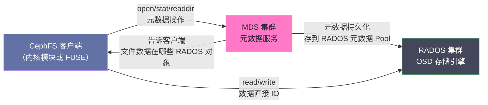
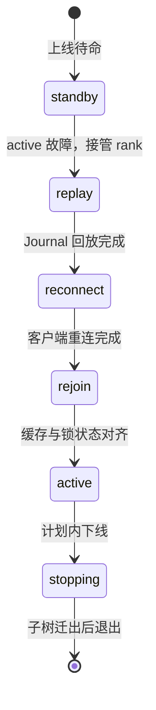
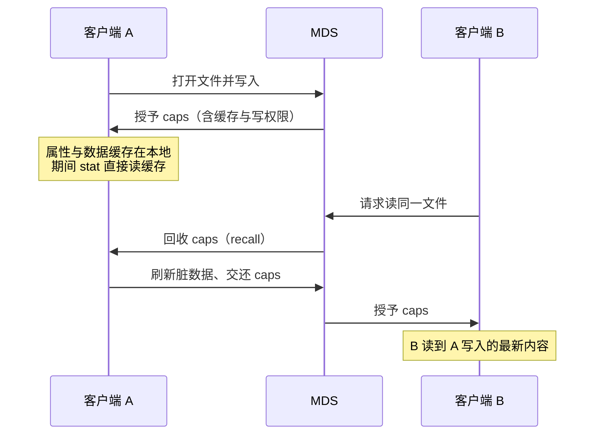
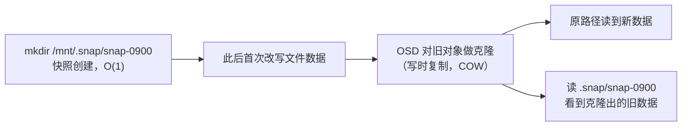
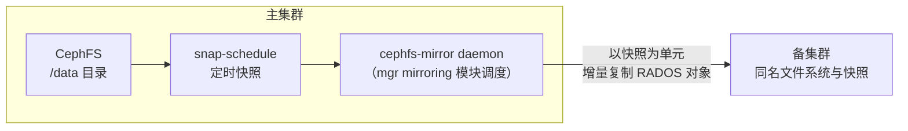

# 08 CephFS——MDS、多活元数据与实践边界

**摘要：**

Ceph 的三大存储接口中，RBD 与 RGW 都是后来者，唯独 CephFS 是这个项目最初的梦想——2006 年 Sage Weil 的论文标题里写的就是一个分布式文件系统，但颇具讽刺意味的是，三大接口中最晚达到生产可用的恰恰也是它（2016 年的 Jewel 才宣布 stable）。本文沿着这条"起个大早、赶个晚集"的线索展开：先讲清 CephFS 为什么必须在 RADOS 之上引入 MDS（Metadata Server，元数据服务器）这层服务，元数据路径与数据路径分离的设计如何让文件吞吐绕开元数据瓶颈；再深入 MDS 的内部——元数据缓存、Journal 与重放、状态机与故障接管、cap 授予与回收机制、内存调优与卡死排障；然后是动态子树分区如何支撑多 Active MDS 的水平扩展、failover 时客户端的 reconnect 行为与 standby 调度，以及内核客户端与 FUSE 客户端的取舍、NFS-Ganesha 与 SMB 网关两条借道路线、挂载与最小权限实践、多客户端缓存一致性的真实边界；最后补齐配额、快照与 mirroring 容灾三块生产必备能力，收拢一张常见运维故障速查表，并与 HDFS、[[中间件/JuiceFS/01 JuiceFS 全局架构——元数据引擎与对象存储的分离设计|JuiceFS]]、Lustre 做多维对比。读完你应当能回答两个问题：CephFS 适合什么样的工作负载，以及它的边界在哪里。

---

## 第 1 章 起个大早，赶个晚集——CephFS 的架构定位

### 1.1 一切从文件系统开始

2006 年，Sage Weil 在 OSDI 会议上发表的那篇论文，标题是《Ceph: Reliable, Scalable, and High-Performance Distributed Storage》，通篇讲的是一个分布式文件系统——彼时既没有 RBD，也没有 RGW，Ceph 的全部野心就是把 PB 级文件系统的元数据管理做对。更早的伏笔埋在 2004 年，Weil 在 SC 会议上发表《Dynamic Metadata Management for Petabyte-Scale File Systems》，提出了动态子树分区（Dynamic Subtree Partitioning）的元数据管理思路，这篇论文后来成为 CephFS 多 Active MDS 架构的理论底座。名字本身也带着这个愿景的印记——Ceph 取自章鱼（cephalopod），多只手臂各自为战、又由统一的神经系统协调，这个意象与后来 RADOS 的架构不谋而合。

但历史的走向颇有戏剧性。Ceph 真正被大规模使用，先是因为 RBD（OpenStack 块存储的事实标配），再是因为 RGW（S3 兼容的对象网关），而作为"初心"的 CephFS 却长期顶着 experimental 的帽子，直到 2016 年 4 月的 Jewel（10.2.x，Ceph 首个 LTS 版本）才被官方标注为生产可用（production-ready），比 RBD 晚了数年；2017 年的 Luminous（12.2）进一步稳定了多 Active MDS 与元数据缓存管理，此后 CephFS 才逐渐在 Kubernetes 共享存储与高性能计算（High Performance Computing，HPC）场景站稳脚跟。

为什么最核心的愿景反而最难落地？答案藏在 POSIX（Portable Operating System Interface）语义的完整性里。块存储只需要把一块磁盘"假装"出来，对象存储只需要一套 HTTP 语义，两者的接口都足够窄；而文件系统必须兑现整套 POSIX 承诺——原子重命名、硬链接、文件锁、目录遍历的一致性——每一个承诺放到分布式环境下都是一场硬仗。理解了这一点，你就理解了 CephFS 的一切设计，包括它的优势与它的边界。

### 1.2 为什么 RADOS 对象存储不够用

RADOS 是优秀的分布式对象存储，但它只提供扁平的 KV 语义（OID → 对象数据）。真实业务场景中，大量应用程序通过 POSIX 文件接口工作：`open`/`read`/`write`/`mkdir`/`stat` 等系统调用，期望看到一个层次化的目录树结构，支持原子重命名、文件锁等复杂语义。

要在 RADOS 之上提供 POSIX 文件接口，需要：
1. **目录树结构**：父子关系、路径解析（`/a/b/c.txt` → inode）
2. **文件元数据**：inode 信息（大小、权限、修改时间、扩展属性）
3. **POSIX 原子语义**：`rename` 必须是原子的（用于文件替换等操作）
4. **文件锁**：多客户端并发访问同一文件时的协调

这些功能不是 RADOS 对象模型天然具备的，需要一个专门的元数据服务——这就是 MDS 的存在意义。

### 1.3 元数据路径与数据路径的分离

CephFS 最重要的设计决策是**元数据路径与数据路径的完全分离**：

- **元数据操作**（`readdir`、`stat`、`chmod`、`mkdir` 等）→ 走 MDS
- **文件数据操作**（读写文件内容）→ 绕过 MDS，直接走 RADOS



这种分离设计的好处：
- **文件数据的吞吐不受 MDS 限制**，直接利用所有 OSD 的并行 IO 能力
- MDS 的职责清晰——只负责元数据，不需要处理数据流
- 文件系统的扩展性主要由 RADOS 决定，不受 MDS 单点制约

### 1.4 反事实：如果没有 MDS

不妨做一个思想实验：如果不在 RADOS 之上引入专门的元数据服务，我们还有哪些办法在对象存储上搭出目录树？办法一是把元数据摊给所有客户端，各自扫描对象拼出目录树——某些对象存储的"文件网关"就是这么做的，代价是每次列目录都要扫过全量对象，元数据操作的代价随对象数线性增长，而且原子重命名根本无从谈起。办法二是学 GFS 与 Lustre 的前辈，用一个（或按哈希静态切分的）元数据服务器——简单直接，但热点目录拆不开，负载倾斜只能靠人工搬运。CephFS 选了第三条路：一个集中式的元数据缓存集群，它会测量热度、在线搬家，本质上是一个**会自我重组的分布式元数据缓存**。

打个比方，MDS 像一座城市的不动产登记中心——房子（文件数据）散布在城市的各个仓库（OSD）里，但你要查某个地址的产权、办过户、做抵押，都得去登记中心；登记中心只动账本、不动货物，所以账本再忙也不影响你搬货。技术上要补一句限定：登记中心的账本本身也存放在仓库里（元数据持久化在 RADOS 的元数据池上），登记中心塌了换一个人接管，翻出流水账（Journal）就能把账本恢复出来。

---

## 第 2 章 MDS——元数据的"不动产登记中心"

### 2.1 元数据的存储结构

MDS 的元数据最终持久化在 RADOS 的**元数据 Pool**中，以 RADOS 对象的形式存储。每个 inode（文件或目录）对应一个或多个 RADOS 对象。

但 MDS 的核心是内存中的**元数据缓存（Metadata Cache）**：热点目录和文件的 inode 信息被缓存在 MDS 的内存中，绝大多数元数据操作在内存中完成，只有缓存未命中或需要持久化时才访问 RADOS。

MDS 内存中维护以下数据结构：

**CInode（Cached Inode）**：内存中的 inode 表示，包含 inode 号、文件大小、权限、时间戳、扩展属性等。一个文件系统中可能有数亿个 inode，但 MDS 只缓存热点 inode（由 LRU 策略管理）。

**CDentry（Cached Dentry）**：目录项缓存，记录目录到子文件/子目录的映射（`filename → inode`）。目录树的路径解析（将 `/a/b/c.txt` 解析为 inode 号）通过遍历 CDentry 完成。

**CDir（Cached Dir）**：目录缓存，一个目录的所有子项（Dentry）。当客户端执行 `readdir` 时，MDS 加载对应 CDir 并返回其所有 CDentry。

### 2.2 Journal——先记账，再誊写总账

MDS 有自己的 Journal（元数据日志），记录所有元数据变更操作。Journal 存储在 RADOS 的元数据 Pool 中（本质是一段 RADOS 对象序列）。它的工作方式像收银台的小票流水——每一笔先记在小票上（追加写，快），定期再誊写进总账（checkpoint，慢但结构化），查账时先翻小票、小票没了再翻总账。

**写元数据的流程**：
1. MDS 收到元数据变更请求（如 `mkdir /data/job-001`）
2. MDS 在内存中立即更新缓存（CInode、CDentry）
3. MDS 将操作追加写入 Journal（异步，批量）
4. Journal 积累到一定大小或超时后，触发 **Flush**：将 Journal 中记录的 inode 和目录数据正式写入 RADOS（形成持久化的 Checkpoint）
5. Checkpoint 完成后，Journal 中对应的部分可以安全删除（类似 WAL 的 truncate）

如果 MDS 崩溃重启，通过回放 Journal 恢复内存中的元数据缓存状态，通常在几秒到几十秒内完成。

回放（replay）的细节值得再展开一层，因为它直接决定了故障接管的时长。Journal 在元数据池中不是一个大对象，而是由 journaler 机制条带化成的一组 RADOS 对象，MDS 顺序追加、按段（segment）管理；回放时，新 MDS 从最后一个 checkpoint 之后的位置逐条读取日志事件，在内存中重建 CInode、CDentry 与会话状态——相当于把小票从头再打一遍账。所以回放时长近似取决于 checkpoint 之后的日志长度，这也解释了第 2.6 节参数表里 `mds_log_max_segments` 的用途：段数上限调小，checkpoint 打得越勤，接管时要翻的小票越短，但日常写入的合并机会也随之变少，这是一对直接的取舍。计划内重启前，还可以执行 `ceph tell mds.<名> flush journal` 强制把日志刷成 checkpoint，把接管时的回放窗口压缩到秒级。

而 standby-replay 把这套逻辑又推进一步：它实时跟随 active 的 Journal 逐条回放，等于一直在同步打小票，接管时几乎不需要补账。不过它也有一个重要的调度代价——这台进程被钉死在它跟随的那个 rank 上，别的 rank 故障时它帮不上忙，第 3.5 节会回到这个问题。

### 2.3 MDS 内存是关键约束

MDS 的核心性能指标是**元数据缓存命中率**。如果所有热点目录和文件的 inode 都在内存中，元数据操作延迟极低（亚毫秒级）。如果缓存不足，需要频繁从 RADOS 加载 inode，延迟升高 10-100 倍（RADOS 读取需要几毫秒）。

**MDS 的内存规划**：

经验值：每个 inode 缓存在内存中约占 1-2KB（元数据 + 指针结构）。

| 文件数量 | MDS 元数据缓存大小 | 推荐 MDS 内存 |
| :---: | :---: | :---: |
| 100 万 | ~2 GB | 8 GB |
| 1000 万 | ~20 GB | 32 GB |
| 1 亿 | ~200 GB | 256 GB（需要多 Active MDS） |

这个约束说明：**CephFS 不适合存储海量小文件（>1 亿）的场景**——此时 MDS 内存成为系统瓶颈。这类场景更适合使用 [[中间件/JuiceFS/01 JuiceFS 全局架构——元数据引擎与对象存储的分离设计|JuiceFS]]（元数据存储在 Redis/TiKV 等专用 KV 数据库中，内存扩展能力更好）。

### 2.4 MDS 状态机与故障接管

MDS 不是一个人在战斗——生产环境里它至少有三个角色：正在服务的 **active**、待命的 **standby**（冷备，不回放日志，接管慢一些），以及 **standby-replay**（热备，实时跟随 active 回放 Journal，接管最快）。理解 MDS 的状态机（state machine），是排障时看懂 `ceph fs status` 输出的前提。

当一个 active MDS 崩溃（或被 MON 判定失联）时，standby 接管 rank 的过程是一条固定的恢复链：



- **replay**：新 MDS 回放元数据 Journal，重建内存缓存，对应第 2.2 节的"翻小票"过程，通常几秒到几十秒
- **reconnect**：等待客户端重新连接——旧 active 失联时其客户端会话已失效，客户端需要重连并重新建立会话
- **rejoin**：与集群中的其他 MDS 交换缓存与锁状态（多 Active 场景下尤其重要），把子树归属、cap 状态重新对齐
- **clientreplay**：一个过渡态，MDS 在完成全部恢复前就提前放行客户端请求，以缩短不可用窗口
- **stopping**：计划内下线（如 `ceph mds deactivate`）时，MDS 把自己管辖的子树迁给同伴后再退出，属于体面的"交接班"

这套状态机就像医院的交接班：replay 是翻看交接记录，reconnect 是等病人重新挂号，rejoin 是和同事核对库存与在办事项，全部对齐后才正式接诊。排障时你看到的"卡在某个状态"，对应的正是某个环节出了问题——譬如长时间停在 reconnect，多半是大量客户端失联或网络分区；停在 rejoin，则常见于多 Active 之间的状态对齐受阻。

### 2.5 cap——客户端缓存一致性的根基

第 4.4 节会从客户端视角讨论一致性边界，这里先把机制的另一半讲完：MDS 如何签发与回收 cap。客户端每次 `open` 一个文件，都会向 MDS 申请一组权限位——读、写、缓存数据、缓存属性、排他访问等，MDS 按当前其他持有者的情况裁剪后签发，这就是 cap 的授予；持有期间，客户端可以放心把 inode 属性甚至文件数据页缓存在本地，因为 MDS 承诺在 cap 有效期内不会发出冲突授权。目录项还有一层更轻的 lease（租约）：`readdir` 返回的目录内容与 dentry 由短租约保护，到期或被回收即失效，这与 5.3 节的目录缓存直接相关。

回收是这套机制真正精巧、也真正麻烦的部分。MDS 在三种情况下必须收回已发出的 cap：另一个客户端申请冲突权限（譬如 A 持写、B 要读）、MDS 缓存压力上升需要客户端交还 inode、以及客户端会话超时。回收是一条协商消息而不是命令——MDS 发出 recall，客户端刷下脏数据与脏元数据、交还权限位，MDS 确认后才把 cap 转授他人；若客户端在 `mds_recall_state_timeout`（默认 60 秒）内不响应，MDS 便将其驱逐（evict）。驱逐默认伴随 blocklist（黑名单）：该客户端实例不仅失去 MDS 会话，连与 OSD 的数据通路也会被切断，必须重新挂载才能恢复——这个看似严厉的设计，是为了防止一个"失忆"的客户端拿着旧缓存继续写坏数据。

理解了授予与回收，你就明白了 CephFS 客户端与 MDS 之间最频繁的消息流不是数据本身，而是 cap 的申请、刷新与归还。内核客户端默认把用完的 cap 再持有 5 到 60 秒才归还（`caps_wanted_delay_min`/`caps_wanted_delay_max`），就是在"多缓存一会儿"与"少发消息"之间做交易；第 2.6 节的缓存调优与第 4.4 节的一致性窗口，根源都落在这一组机制上。

### 2.6 mds cache memory limit 调优

MDS 的缓存上限在 Luminous（12.2.1，2017 年）之前只能按 inode 个数（`mds_cache_size`）设置，之后引入了按字节数的 **mds_cache_memory_limit**，并成为官方推荐的主调参。需要特别注意的是，它是一个**软限制**：MDS 会尽力把缓存压到上限的 95%（保留 5% 的 reservation），但客户端如果不能及时释放能力（cap），MDS 允许暂时超限继续服务，超过上限的 1.5 倍时才发出集群健康告警。

| 参数 | 默认值 | 作用 |
| :--- | :--- | :--- |
| `mds_cache_memory_limit` | 1 GiB（Luminous 引入），新版本默认 4 GiB | MDS 缓存的软上限，主调参 |
| `mds_cache_reservation` | 0.05 | 缓存保留水位，缓存用到 95% 即开始回收 |
| `mds_health_cache_threshold` | 150% | 缓存达到软上限的 1.5 倍时触发 `MDS_CACHE_OVERSIZED` 告警 |
| `mds_recall_state_timeout` | 60 秒 | 客户端未响应 cap 回收请求的驱逐时限 |
| `mds_log_max_segments` | 30 | Journal 段数上限，调小可加快接管时的回放速度 |

调优的思路可以归纳为三句话。第一句，**按热点 inode 预估而不是按文件总数**：缓存的是热点元数据，1-2KB 每 inode 的经验值乘以你预估的热点规模，再留 30%-50% 余量，就是 `mds_cache_memory_limit` 的合理起点。第二句，**给 MDS 一台干净的机器**：MDS 是内存与 CPU 双敏感组件，与 OSD、MON 混部会在恢复期互相争抢资源，生产上值得为它单独规划节点。第三句，**缓存压力的根源往往在客户端**：MDS 内存吃紧时会向客户端发起 cap 回收（recall），要求客户端释放缓存与写权限，若客户端在 `mds_recall_state_timeout`（默认 60 秒）内没有响应，MDS 会直接驱逐（evict）该客户端——所以当你看到大量驱逐事件时，先去检查客户端版本与负载，而不是一味调大 MDS 内存。

### 2.7 MDS 卡死的诊断命令链

MDS 卡死（hang）或元数据操作变慢，是 CephFS 运维中最常见的故障形态。诊断要遵循一条从粗到细的命令链，先看全局再钻进程，避免一上来就翻日志大海捞针。

| 步骤 | 命令 | 看什么 |
| :--- | :--- | :--- |
| 1 | `ceph fs status` | 各 rank 的状态、客户端数、cache 大小、元数据请求速率 |
| 2 | `ceph fs dump` | 完整的 MDS map、会话列表、子树归属 |
| 3 | `ceph daemon mds.<名> status` | 该 MDS 当前状态、运行时长、会话数 |
| 4 | `ceph daemon mds.<名> perf dump` | `mds_mem`、`mds_cache` 等计数器，确认缓存与内存水位 |
| 5 | `ceph daemon mds.<名> config get mds_cache_memory_limit` | 确认运行时配置是否与预期一致 |
| 6 | 日志 `/var/log/ceph/ceph-mds-*.log` | 按关键字定位具体环节 |

日志里值得搜索的关键字，以及它们对应的处置方向：

| 日志关键字 | 含义 | 处置方向 |
| :--- | :--- | :--- |
| `cache pressure` / `failing to respond to cache pressure` | 缓存压力，某客户端未及时释放 caps | 定位该客户端（版本过旧或负载异常），必要时驱逐 |
| `MDS_CACHE_OVERSIZED` | 缓存超过软上限的 1.5 倍 | 调大 `mds_cache_memory_limit`，或削减热点目录规模 |
| `MDS_SLOW_METADATA_OPS` | 元数据操作缓慢 | 查 MDS 的 CPU 与底层元数据池 IO，检查是否混部争抢 |
| `damaged` | 元数据损坏，MDS 拒绝服务该子树 | 严重故障，按官方 damaged inode 流程处理，切勿盲目重启 |
| `evicting client` | 客户端被驱逐 | 检查客户端网络与版本，驱逐后客户端需重新挂载 |

最后一级手段是 `ceph tell mds.<rank> client evict <id>` 驱逐卡死的客户端，以及极端情况下的 `ceph fs fail` 强制文件系统下线再恢复——后者会中断所有客户端，务必在变更窗口内执行。笔者想强调的是，绝大多数"MDS 卡死"的根因不在 MDS 本身，而在某个行为异常的客户端（譬如内核过旧、或进程打开了数十万文件不放），顺着 cap 回收与驱逐的线索找客户端，往往比盯着 MDS 调参更快见效。

---

## 第 3 章 动态子树分区——多 Active MDS 的扩展性

### 3.1 为什么需要多 Active MDS

单个 MDS 的元数据处理能力有限（受 CPU、内存和内存带宽限制）。对于大规模文件系统，当元数据 QPS 超过单个 MDS 的处理能力时，需要多个 MDS 并行工作。

CephFS 通过**动态子树分区（Dynamic Subtree Partitioning）**实现多 Active MDS 的工作：将目录树分成多个子树（Subtree），每个子树由一个 MDS 负责管理。不同子树的元数据操作可以并行，没有互相阻塞。

### 3.2 从静态分区到动态子树

静态分区的教训值得先讲一遍。GFS 与 Lustre 这一代前辈的元数据服务器，要么干脆单点（GFS 的单一 Master），要么按哈希或路径静态切分（Lustre 早期的一个 MDT 管一段）——静态切分的问题在于，负载分布是随时间变化的，今天热门的项目目录明天可能就冷了，而一个无法再拆分的热点目录会把整台元数据服务器拖垮，人工迁移又慢又容易出错。2004 年那篇 SC 论文的洞察正在于此：与其静态切分，不如让元数据服务器集群自己测量热度、自己搬家。

CephFS 的 MDS 集群持续监控各个目录子树的访问热度（元数据 QPS），根据负载动态调整子树与 MDS 的归属关系：

- 热点目录所在子树被分割成更小的子树，分配给不同的 MDS
- 冷数据子树被合并，减少 MDS 间协调开销
- 当某个 MDS 的负载过高，部分子树迁移给其他 MDS（在线迁移，对客户端透明）

这种动态调整是自动进行的，不需要管理员手动干预。不过自动不等于不可干预——CephFS 留了一个人工口子：在目录上设置 `ceph.dir.pin` 扩展属性，可以把子树"钉"在指定的 rank 上，禁止自动迁移。对于负载模式可预期的业务（譬如按项目或按用户目录天然切分），钉住子树能避免自动均衡带来的迁移抖动；对于不可预期的负载，则交给动态分区自己折腾。

### 3.3 跨 MDS 操作与两阶段提交

当客户端的操作跨越多个 MDS 管辖的子树时（如 `rename /a/b.txt /c/d.txt`，`/a` 和 `/c` 分别由不同 MDS 管理），需要两个 MDS 协调完成原子操作。这通过**两阶段提交（Two-Phase Commit）**实现：两个 MDS 先各自在本地预留这次变更（prepare 阶段），双方都确认可以执行后再正式提交（commit 阶段），任何一方失败则整体回滚——原子性由此保住，但代价是额外的延迟（跨 MDS 通信开销，一次操作变成多轮往返）。

这也是为什么多 Active MDS 主要提升并行度，而不是所有场景的延迟都会降低——频繁的跨 MDS 操作反而可能增加延迟。你可以把两阶段提交理解为两个登记窗口之间的电话协商：过户一个跨辖区的房产，两个窗口各自核对台账、互相确认，流程严谨了，速度自然慢下来。

### 3.4 什么时候该开多 Active MDS

多 Active MDS 不是免费午餐，开与不开需要按负载特征权衡。适合开启的信号有三个：MDS 进程 CPU 持续高位（元数据吞吐成为瓶颈）、目录树天然按用户或项目切分（子树边界清晰）、负载以查找与遍历类操作为主（`lookup`/`readdir`，可并行度高）。不适合的场景同样有三个：所有客户端写同一个热点目录（动态分区拆不开一个 inode，开再多 rank 也没用）、大量跨目录 rename（两阶段提交的协调开销会吃掉并行收益）、小规模集群（协调开销大于收益，单 Active 加 standby 反而更稳）。

操作本身很简单——`ceph fs set myfs max_mds 2` 即可把活跃 rank 数提到 2——但要理解一点：max_mds 只是上限，实际怎么切分目录树由 MDS 根据热度自己决定，rank 数量翻倍并不等于元数据性能翻倍。笔者的建议是，先用单 Active MDS 跑出基线，确认元数据 CPU 确实是瓶颈、且目录树可切分，再逐步调高 max_mds，每一步都观察 `ceph fs status` 里的负载分布。

### 3.5 rank 与 standby 的调度——failover 的完整时序

第 2.4 节画的是单个 MDS 的状态机，这里把镜头拉远，看一次完整的故障切换（failover）对集群与业务意味着什么。切换的起点在 MON：每个 active MDS 每隔 `mds_beacon_interval`（默认 4 秒）向 MON 发送 beacon 心跳，超过 `mds_beacon_grace`（默认 15 秒）没有音讯，MON 便将其标记为 laggy，并从待命的 standby 中挑选一个接管 rank——这就是 `ceph health detail` 里 "mds xxx are laggy" 告警的由来。接管者走完 replay 与 reconnect 后重新服务，其中 reconnect 阶段会等待所有客户端重新连入，超时未连上的客户端按 `mds_reconnect_timeout`（默认 45 秒）被驱逐。

对客户端来说，这段窗口的体验是"元数据冻住，数据还在动"：新开文件、创建删除、`stat` 这类需要 MDS 的操作会阻塞，应用线程可能进入不可中断睡眠（D 状态）；但已经打开的文件，其数据读写多数情况下仍可继续——数据路径本来就不经过 MDS。所以 failover 的业务影响高度取决于负载形态：以元数据操作为主的负载（海量小文件扫描、目录遍历）会明显感知，纯数据吞吐型负载几乎无感。客户端会从 MON 拿到新的 MDS map 并自动重连，无需人工干预；被驱逐的客户端则因 blocklist 必须重新挂载。MON 判定失联的机制本身，见 [[中间件/Ceph/03 Monitor 与集群地图——Paxos、Quorum 与 MON 运维|03 Monitor 与集群地图]]。

standby 的调度规则也值得弄清，排障时"为什么是这个 MDS 接管"是经常被问到的问题。MON 挑选接管者的优先级是：优先选 `mds_join_fs` 指向本文件系统的 standby，其次是没有限定的一般 standby，最后才考虑其他文件系统的备机；standby-replay 则永远只跟随自己绑定的那个 rank，即使别的 rank 无兵可用也不会跨援——所以官方建议开启 standby-replay 时给每个 active 都配一个。文件系统层面还有 `standby_count_wanted` 设定期望的备机数量，低于阈值会触发 `MDS_INSUFFICIENT_STANDBY` 健康告警。你可以把这套调度理解为登记中心的排班表：普通 standby 是全院机动的替班窗口，standby-replay 是一对一跟岗的接班人——跟岗者接班最快，但绝不替别的窗口顶班。

最后补一句运维视角：`ceph mds fail <名>` 不只是故障时的被动动作，也是主动手段——MDS 进程僵死、或改完配置需要重载时，主动 fail 一次让 standby 接管，往往比反复重启进程更干净。切换期间元数据操作会阻塞数秒到数十秒（取决于日志长度与客户端数量，standby-replay 可显著缩短），但数据路径基本不受影响，这也是 CephFS 敢把 failover 当作常规运维动作的底气。

---

## 第 4 章 客户端与挂载实战

### 4.1 内核客户端与 FUSE 客户端

CephFS 的客户端有两套实现：内核客户端（kernel client，`ceph.ko`，2010 年进入 Linux 主线内核）与用户态的 FUSE 客户端（ceph-fuse，基于 Filesystem in Userspace，FUSE）。两者的协议行为一致，但工程特性差异不小，选错客户端是很多"CephFS 慢"或"CephFS 不稳"问题的根源。

| 维度 | 内核客户端（kernel client） | FUSE 客户端（ceph-fuse） |
| :--- | :--- | :--- |
| **运行位置** | 内核态（`ceph.ko`） | 用户态进程 |
| **性能** | 高——页缓存、回写与 VFS 深度集成，无额外拷贝 | 较低——系统调用穿越用户态，多一层拷贝与切换 |
| **版本耦合** | 随内核走，新特性依赖发行版内核版本 | 随 Ceph 包安装，可与集群版本对齐升级 |
| **功能跟进** | 慢，特性需进入内核主线并随发行版发布 | 快，新特性通常先在用户态落地 |
| **故障恢复** | 成熟，MDS 接管后自动恢复会话 | 历史上挂起（hang）风险更高，行为依赖版本 |
| **调试** | 内核态，问题定位困难 | 用户态，可 gdb 附加、日志详尽 |
| **典型用途** | 生产主力，Kubernetes CSI 的默认挂载方式 | 内核过旧、需要与集群同版本特性、排障复现 |

怎么选？笔者的经验法则：能用内核客户端就用内核客户端——性能与稳定性都更好，Kubernetes 的 ceph-csi 驱动默认也走内核挂载；但内核版本过旧（特性缺失或 bug 未修）、或者你需要与集群版本严格对齐的客户端行为时，ceph-fuse 是合理的回退选项。此外还有第三条路：通过 NFS-Ganesha 网关把 CephFS 以 NFS 协议导出，供那些既装不了内核模块、又不想跑 FUSE 的系统消费，代价是多一跳、性能与语义都有折损。

### 4.2 挂载命令实战

内核客户端的挂载语法有两代。新语法由 `mount.ceph` 助手解析，把用户、文件系统名与子路径写进设备串；旧语法在脚本与 fstab 里仍随处可见，两代都要认识：

```bash
# 新语法：用户@文件系统名=子路径，monitor 地址用 mon_addr 传入
mount -t ceph admin@.myfs=/ /mnt/cephfs \
  -o mon_addr=10.0.0.11:6789/10.0.0.12:6789

# 旧语法：monitor 地址直接写在设备串里，仍广泛存在
mount -t ceph 10.0.0.11:6789,10.0.0.12:6789:/ /mnt/cephfs \
  -o name=admin,secretfile=/etc/ceph/admin.secret
```

两个细节值得注意。其一，密钥用 `secretfile` 传入而不是 `secret`——后者会把密钥留在 shell 历史与进程列表里，属于典型的安全隐患。其二，fstab 里记得加 `_netdev`，让系统在网络就绪后再挂载：

```
# /etc/fstab
10.0.0.11:6789,10.0.0.12:6789:/  /mnt/cephfs  ceph  name=admin,secretfile=/etc/ceph/admin.secret,_netdev,noatime  0  0
```

FUSE 客户端的挂载方式如下，`-r` 可以直接把某个子目录挂为根，配合受限 caps 正好做租户隔离：

```bash
ceph-fuse -n client.data_rw \
  --keyring=/etc/ceph/client.data_rw.keyring \
  -r /data/project-a /mnt/project-a
```

### 4.3 client 配置与最小权限 caps 模板

CephX 的授权粒度足以支撑"每个业务一个账号、每个账号只见自己的子树"，但默认的 admin 账号不该出现在业务挂载里。生成受限客户端的标准入口是 `ceph fs authorize`：

```bash
# 生成一个只允许读写 /data 子树的客户端，keyring 输出到标准输出
ceph fs authorize myfs client.data_rw /data rw
```

它生成的 caps 遵循固定的模板，按场景对号入座即可：

| 场景 | caps 模板 | 说明 |
| :--- | :--- | :--- |
| 只读挂载 | `mds 'allow r path=/data'`，`mon 'allow r'`，`osd 'allow r tag cephfs data=myfs'` | 监控、备份、只读消费 |
| 读写挂载 | `mds 'allow rw path=/data'`，`mon 'allow r'`，`osd 'allow rw tag cephfs data=myfs'` | 常规业务客户端 |
| 允许快照 | `mds 'allow rws path=/data'` | `s` 位允许创建与删除快照 |
| 全库管理 | `mds 'allow rw'`，`osd 'allow rw tag cephfs data=myfs'` | 仅限运维账号，不进业务配置 |

客户端侧的常用配置（写在 `ceph.conf` 的 `[client.<名>]` 段，或作为挂载选项传入）：

- `client_quota = true`：客户端执行配额限制（默认开启）
- `client_quota_df = true`：让 `df` 反映根目录配额而非整个集群容量（默认开启）
- `client_cache_size`：FUSE 客户端的 inode 缓存条目数（默认 16384），小内存机器上可调低
- `caps_wanted_delay_min` / `caps_wanted_delay_max`：内核客户端用完 cap 后延迟归还的时间窗（默认 5/60 秒），见下一节

### 4.4 多客户端缓存一致性边界

CephFS 的多客户端一致性，建立在**能力（Capability，简称 cap）**机制上（授予与回收的机制细节见第 2.5 节）。MDS 给客户端签发的 cap 是一组针对某个 inode 的权限位（缓存、读、写等），持有期间客户端可以放心使用本地缓存——因为 MDS 承诺不会把冲突的权限发给别的客户端。这套机制好比电影院的检票：你手里的票根（cap）保证这个座位在你观影期间归你，但影院随时可以来收票根（recall），你把垃圾带走、交还座位，下一位观众才能入场。



由此推出 CephFS 的真实一致性边界，也就是所谓的 close-to-open 一致性：客户端 A 关闭文件时会刷下脏数据并交还写能力；客户端 B 打开文件时会向 MDS 重新申请能力，自然看到 A 的写入。所以"写完关闭、别人再打开"这条路径是强一致的。但边界也在这里——如果 B 不走 open，而是持续用 `stat` 轮询文件大小，MDS 没有理由回收 A 的能力，B 读到的就是自己缓存里的旧属性。内核客户端用完能力后并不立刻归还，默认再持有最长 60 秒（`caps_wanted_delay_max`，最小延迟 5 秒由 `caps_wanted_delay_min` 控制），这个窗口就是"两个节点 ls 看到的文件大小不一样"这类经典问题的来源。

缓解手段与各自的代价：

- **改访问模式**：让消费方用 open + read 而不是 stat 轮询——零配置成本，但要求应用配合
- **调小 `caps_wanted_delay_max`**：窗口变短，但能力归还更频繁，MDS 与客户端间的消息量上升
- **`wsync` 挂载选项**：命名空间操作同步完成（等 MDS 应答才返回），一致性更强，但创建删除类操作的延迟明显上升
- **接受最终一致**：对轮询类监控改用事件通知或放宽告警阈值——工程上最省事，语义上最弱

> [!warning] 生产避坑：不要把 CephFS 当成本地文件系统做进程间协调
> 多客户端并发下，"A 写完 B 立刻 stat"读不到新值是设计行为而非 bug。凡是依赖"实时可见的文件属性"做协调的逻辑（轮询文件大小判断任务完成、用文件存在性做分布式锁），都要么改成 close-to-open 语义下的访问模式，要么改用真正的协调服务。把缓存一致性窗口当成故障去"修"，是 CephFS 误用中最常见的一种。

### 4.5 NFS-Ganesha 与 SMB 网关——原生客户端装不了的时候

4.1 节末尾提到的"第三条路"值得单独展开，因为它在生产中出现的频率比想象中高。NFS-Ganesha 是一个用户态的 NFS 服务器（以 NFSv4 为主，可选开启 v3），它的可插拔后端框架 FSAL（File System Abstraction Layer，文件系统抽象层）里有一个 FSAL_CEPH 插件：Ganesha 进程通过 libcephfs——也就是 FUSE 客户端背后的那套用户态协议实现——直接访问集群，宿主机既不需要内核客户端模块，也不需要本地挂载点。Ceph 从 Pacific（16.2，2021 年）起把这件事产品化：nfs 管理器模块管理导出配置（存放在 RADOS 对象中），cephadm 负责拉起 Ganesha 容器：

```bash
# 创建一个 Ganesha 集群（可多实例，--ingress 可加 HA 入口）
ceph nfs cluster create mynfs "gw-1,gw-2"

# 把 myfs 的 /data 子树导出为 NFSv4 伪路径 /export/myfs
ceph nfs export create cephfs --cluster-id mynfs \
  --pseudo-path /export/myfs --fsname myfs --path=/data
```

什么时候需要这条路？典型场景有四类：客户端系统装不了内核模块也跑不了 FUSE（譬如某些精简容器镜像、嵌入式系统或商业 UNIX）；内核版本过旧且不允许升级；希望以标准 NFS 协议对接既有自动化（HPC 集群的 NFS 挂载习惯、NAS 替换）；以及多协议消费的混合环境。代价同样清楚：多了一跳网关，NFS 客户端享受不到内核客户端的页缓存与直连 OSD 的并行度，Ganesha 单实例的 CPU 与网卡成为吞吐上限；NFS 协议语义与 POSIX 也有缝隙（锁、委托、缓存语义的映射），close-to-open 一致性在 NFS 层面还要再打一次折扣。好在多实例部署时，导出配置与客户端恢复数据都存放在 RADOS 中，实例之间近乎无状态，配合 ingress（haproxy/keepalived）即可组成高可用。

SMB 导出是同一思想的变体：Samba 的 vfs_ceph 模块让 smbd 同样经由 libcephfs 访问 CephFS，供 Windows 客户端以 SMB2/SMB3 协议消费（cephadm 的 smb 服务基于官方 samba-container 镜像部署，不支持老旧的 SMB1/CIFS）。它的典型落点是替换老旧 Windows 文件服务器、或支撑 Windows/Linux 混合的共享目录。不过要清楚，网关方案解决的是"能不能接入"，不是"性能打平"——能用原生客户端的场景，永远优先原生客户端。

---

## 第 5 章 POSIX 语义的实现与边界

### 5.1 CephFS 完整支持的 POSIX 语义

CephFS 支持大多数标准 POSIX 语义：

- **原子 rename**：`rename(src, dst)` 是原子的，不会出现中间状态
- **硬链接**：多个目录项指向同一 inode
- **符号链接**：标准的 symlink 支持
- **文件锁**：POSIX 文件锁（`fcntl`/`flock`）
- **扩展属性**：`setxattr`/`getxattr`
- **完整的权限模型**：POSIX ACL、用户/组权限

这份清单是 CephFS 区别于大多数"类 POSIX"系统的底气——譬如 HDFS 就不提供硬链接与随机写，对象存储的文件网关更谈不上原子 rename。但承诺清单越长，兑现成本越高，下面三个边界值得每个使用者背下来。

### 5.2 局限一：fsync 延迟

对 CephFS 文件调用 `fsync` 时，需要确保：
1. 文件数据刷新到所有 RADOS OSD（同步写入）
2. 元数据变更提交到 MDS Journal

这个过程可能涉及多次网络往返，`fsync` 延迟比本地文件系统高出一个数量级（几毫秒到几十毫秒）。根因在于路径的叠加：本地文件系统的 fsync 只有一段落盘路径，而 CephFS 要走两段——数据段 flush 到 OSD 集群并等待确认，元数据段（size、mtime 的变更）提交给 MDS 记入 Journal，两段串行叠加。对于频繁 `fsync` 的应用（如数据库 WAL），CephFS 不是好选择。

### 5.3 局限二：目录 readdir 的一致性

在多客户端并发创建文件的场景下，不同客户端看到的目录内容可能存在短暂的不一致（缓存未及时失效）。CephFS 的目录缓存由 lease 与 cap 保证正确性——客户端只在持有有效 lease 时才使用缓存的目录内容，一旦 MDS 回收 lease，缓存立即失效；但 lease 的传递与回收本身有延迟窗口。对一致性要求极高的遍历场景，可以关闭目录缓存相关优化（内核客户端的 `noasyncreaddir`、FUSE 侧的 `fuse_disable_pagecache` 等），代价是 readdir 性能明显下降。

### 5.4 局限三：扩展属性的大小限制

CephFS 的 xattr 随 inode 一起存储在元数据池中，单个 xattr 的大小和数量有限制（默认每个文件最多 64 个 xattr，单个 xattr 最大 64KB）。把大量业务标签塞进 xattr 的设计（譬如给每个文件挂几十个监控标记）在这里会撞墙，这类数据更适合放进对象属性或独立的索引服务。

> [!warning] 生产避坑：数据库不要放在 CephFS 上
> MySQL、PostgreSQL 等关系数据库不适合直接部署在 CephFS 上，原因是数据库对 `fsync` 性能要求极高，且使用文件锁进行并发控制（性能不如本地锁）。
> 数据库应当使用 **Ceph RBD** 提供块设备，在块设备上格式化本地文件系统（ext4/XFS），数据库运行在这个本地文件系统上——此时 `fsync` 的语义由本地文件系统和 RBD 的 Ceph Journal 联合保证，延迟比 CephFS 低得多。

---

## 第 6 章 配额、快照与镜像

目录树给出来了，多客户端挂上来了，接下来生产环境必然追问三件事：怎么防止一个租户写爆整个文件系统（配额），怎么在误删之后找回来（快照），以及怎么把数据搬到另一个集群做容灾（mirroring）。这三件事在 CephFS 里都有原生答案，但每一个都有清晰的能力边界。

### 6.1 目录配额

CephFS 的配额（quota）以扩展属性的形式设置在任意目录上，限制该目录子树下的字节总量或文件总数：

```bash
# 限制 /data/project-a 最多 100GB、100 万个文件
setfattr -n ceph.quota.max_bytes -v 107374182400 /mnt/cephfs/data/project-a
setfattr -n ceph.quota.max_files -v 1000000 /mnt/cephfs/data/project-a

# 递归统计：不用 du 扫全树，直接读内核维护的聚合值
getfattr -n ceph.dir.rbytes /mnt/cephfs/data/project-a
getfattr -n ceph.dir.rfiles /mnt/cephfs/data/project-a
```

`ceph.dir.rbytes` 与 `ceph.dir.rfiles` 是两个经常被忽略的好东西——目录的递归大小与递归文件数由内核客户端聚合维护，排查"谁把空间吃光了"时不必再跑全量 `du`。配额生效的边界也要清楚：官方文档直言配额"依赖客户端的自觉"（relies on the cooperation of the client），一个被修改过的或对抗性的客户端可以无视配额继续写；路径受限挂载的客户端如果看不到带配额的祖先目录，配额也不会被执行。另外，当挂载根目录本身带配额时，`df` 报告的可用空间会按配额折算（由 `client_quota_df` 控制，默认开启）。

配额的典型落点是多租户子目录隔离——Kubernetes 场景下 ceph-csi 的 subvolume 机制，底层正是"子目录 + 配额"的组合。你可以把它理解为登记中心给每栋楼划定的容积率：楼还是那些楼，但每栋楼能装多少，账本上先划死。

### 6.2 CephFS 快照与 snap-schedule

CephFS 的快照（snapshot）机制相当优雅：在任意目录的隐藏快照目录下 `mkdir` 一个名字，快照就创建了——

```bash
# 创建快照：仅记录一个快照点，O(1) 完成
mkdir /mnt/cephfs/data/.snap/hourly-0900

# 读取快照内容：看到的是 09:00 那一刻的数据
ls /mnt/cephfs/data/.snap/hourly-0900/

# 删除快照：空间异步回收
rmdir /mnt/cephfs/data/.snap/hourly-0900
```

创建之所以是 O(1)，是因为快照只让 MDS 记录了一个时间点；真正的复制推迟到数据被修改时——OSD 对被快照引用的旧对象做克隆（写时复制，Copy-on-Write，COW），原路径写新数据，快照路径读旧数据。删除则是懒删除，空间由后台异步回收。两个命名限制来自内核文档：快照名不能以下划线开头（下划线保留给 MDS 内部使用），长度不超过 240 字符。



手动快照靠不住，定时快照交给 Pacific（16.2，2021 年）引入的 `snap_schedule` 管理器模块：

```bash
ceph mgr module enable snap_schedule

# /data 每小时一个快照
ceph fs snap-schedule add /data 1h

# 保留策略：最近 48 个小时级 + 14 个天级
ceph fs snap-schedule retention add /data 48h14d

# 查看调度状态
ceph fs snap-schedule status /data
```

快照的代价要算清楚：被快照引用的对象在快照存活期间不能释放，删除文件不会立刻腾出空间；快照数量多了，MDS 的元数据负担与删除路径的开销都会上升。所以保留策略不是越久越好，而是按恢复需求倒推——你能接受回到多久之前，就保留多久。

### 6.3 CephFS mirroring 容灾

单集群的快照防得住误删，防不住机房级故障。跨集群容灾走 Pacific 引入的 cephfs-mirror：以快照为单元，把主集群的目录数据异步复制到备集群。

```bash
# 主集群：启用 mirroring 模块并登记要复制的目录
ceph mgr module enable mirroring
ceph fs snapshot mirror enable myfs
ceph fs snapshot mirror add myfs /data

# cephadm 部署 mirror daemon（负责实际搬运数据）
ceph orch apply cephfs-mirror

# 备集群：需 Pacific 及以上版本，提前创建好同名文件系统
```



架构上有两点值得注意：mgr 的 mirroring 模块负责把目录分配给 mirror daemon，daemon 增减时自动重平衡（天然的高可用）；复制以快照为单元增量进行，备集群上会出现与主集群同名的快照点。

但 mirroring 的边界必须划清楚，它**不是备份，也不是实时同步**：

- **RPO（Recovery Point Objective，恢复点目标）等于快照间隔**——每 15 分钟同步一次，最多丢 15 分钟数据，这是设计承诺的上限
- **切换是手动的**——主集群故障后，需要人工把业务指向备集群，没有自动故障转移
- **误删会被忠实地复制过去**——主集群删了目录，备集群的下一次同步会跟着删；mirroring 的安全性完全依赖主集群侧的快照保留策略，快照里还有的数据才救得回来
- **它复制的是快照时刻的数据**——不承担主备之间的实时一致性，也不复制集群级的配置（譬如用户与 caps 需要在备集群另行准备）

> [!info] 快照、mirroring 与备份的关系
> 一句话分工：快照防误删（细粒度、短周期），mirroring 防机房故障（粗粒度、跨集群），真正的备份（导出到独立存储、独立凭证）防的是前两者都防不住的逻辑错误——譬如管理员同时拥有两个集群的权限时的误操作。三者叠加才是完整的容灾分层，任何一层单独拿出来都不够。

### 6.4 常见运维故障速查表

配额、快照与 mirroring 是预防手段，但故障总会发生。下面把 CephFS 日常运维中三类高频故障收拢成一张速查表，命令链从粗到细，与第 2.7 节的 MDS 诊断命令链配合使用：

| 故障 | 典型症状 | 定位命令链 | 处置 |
| :--- | :--- | :--- | :--- |
| MDS laggy | `ceph health detail` 报 "mds xxx are laggy"，元数据操作挂起 | `ceph fs status` 看 rank 状态与负载 → `ceph daemon mds.<名> perf dump` 看请求队列与缓存水位 → 上机查内存/swap/CPU 与元数据池 IO | 多为宿主机资源耗尽或网络分区；进程僵死则 `ceph mds fail <名>` 让 standby 接管，15 秒 beacon 超时后 MON 也会自动替换 |
| 客户端僵死、session 被驱逐 | 日志出现 "failing to respond to cache pressure" / "evicting client"，业务端 IO 卡死 | `ceph daemon mds.<名> sessions ls` 找 cap 数异常的会话 → `ceph tell mds.<名> client evict <id>` 驱逐 → 客户端重新挂载 | 驱逐默认伴随 blocklist，客户端连 OSD 也不通，必须重新挂载；根因常在客户端版本过旧或进程持有海量 cap |
| inode 数爆涨 | MDS 内存持续上涨、`MDS_CACHE_OVERSIZED` 告警，`ceph fs status` 的 cache 一路走高 | 用 `getfattr -n ceph.dir.rfiles` 逐层定位文件数异常的子树 → 对租户目录补 `ceph.quota.max_files` 配额 → 清理或迁移 | 短期靠配额止血；若业务本质是亿级小文件，按 2.3 节的结论评估换元数据可独立扩展的方案 |

驱逐相关的三个阈值值得记住：`mds_session_timeout`（60 秒，客户端不活跃时 cap 与 lease 超时）、`session_autoclose`（300 秒，失联客户端的会话自动关闭并驱逐）、`mds_reconnect_timeout`（45 秒，failover 时未按时重连即驱逐）。

三类故障有一条共同的暗线：**CephFS 的故障表象常在 MDS，根因常在客户端或底层 RADOS**。laggy 多半是宿主机或元数据池的问题，驱逐几乎总是客户端行为异常，inode 爆涨则是业务写入模式与元数据容量不匹配。速查表能帮你快速止血，但止血之后的容量规划与客户端治理（第 2.6 节的调优三句话）才是让故障不再复发的那一半工作；更系统的故障处理全景，见 [[中间件/Ceph/13 故障案例库——从告警到根因|13 故障案例库]]。

---

## 第 7 章 与 HDFS、JuiceFS、Lustre 的对比

### 7.1 三方案速览

| 维度 | CephFS | HDFS | [[中间件/JuiceFS/01 JuiceFS 全局架构——元数据引擎与对象存储的分离设计\|JuiceFS]] |
| :--- | :--- | :--- | :--- |
| **元数据存储** | MDS（内存+RADOS） | NameNode（全量内存） | Redis/TiKV/MySQL（专用 KV） |
| **数据存储** | RADOS（OSD 集群） | DataNode（本地文件系统） | 对象存储（S3/MinIO/CephRGW） |
| **POSIX 兼容性** | 完整 POSIX | 类 POSIX（不完整） | 完整 POSIX |
| **海量小文件** | 不适合（MDS 内存瓶颈） | 不适合（NameNode 内存瓶颈） | 适合（元数据独立扩展） |
| **大文件顺序 IO** | 好 | 极好（专门优化） | 好 |
| **随机小 IO** | 可以（通过 RBD 更优） | 差 | 好 |
| **Kubernetes 集成** | CSI Driver（cephfs） | 需要额外适配 | CSI Driver（juicefs） |
| **运维复杂度** | 高（MDS + RADOS） | 中（NameNode HA） | 低（无状态客户端+对象存储） |
| **存算分离** | 部分（数据在 RADOS，但需要 Ceph 集群） | 不支持（计算与数据耦合） | 完全支持（数据在独立对象存储） |

### 7.2 四方案多维对比

把 Lustre 拉进来之后，四条技术路线的分歧点会更清晰——它们的差异首先不在性能数字，而在**元数据放在哪里、由谁扩展**这个架构选择上：

| 维度 | CephFS | HDFS | JuiceFS | Lustre |
| :--- | :--- | :--- | :--- | :--- |
| **元数据架构** | 多 Active MDS + 动态子树分区，元数据存 RADOS 元数据池 | NameNode 全内存（HA + 联邦扩展） | 独立元数据引擎（Redis/TiKV/SQL），可整体更换 | MDS/MDT 架构，DNE 支持多 MDT 条带目录 |
| **POSIX 完整性** | 完整（原子 rename、硬链接、锁、xattr） | 部分（无随机写、无硬链接，追加为主） | 完整 | 完整（面向 HPC 语义） |
| **海量小文件** | 受 MDS 内存约束 | 受 NameNode 内存约束 | 取决于元数据引擎的扩展性 | MDT 压力大，需多 MDT 分摊 |
| **大文件并行吞吐** | 好（数据路径直连所有 OSD） | 好（DataNode 并行） | 好（受对象存储吞吐约束） | 极好（为并行 IO 而生） |
| **生态** | Kubernetes CSI、Hadoop 适配、NFS-Ganesha | 大数据事实标准 | 云原生 CSI、大数据、AI 训练 | HPC 事实标准 |
| **存算分离** | 天然支持（数据在 RADOS） | 不支持（计算与存储耦合） | 天然支持（数据在对象存储） | 不支持（客户端与存储紧耦合） |
| **运维复杂度** | 高（RADOS 与 MDS 一体两面） | 中（NameNode HA 成熟） | 低到中（元数据引擎自选） | 高（客户端与内核版本强耦合） |
| **典型场景** | K8s 共享存储、HPC、替代 NFS | 大数据本地计算 | 云原生、海量小文件、跨云 | 超算、大规模并行仿真 |

四条路线其实是四种元数据哲学：HDFS 把元数据全量压进 NameNode 内存，用简单换速度，用联邦与 HA 续命；CephFS 把元数据做成会自我重组的分布式缓存，用复杂性换弹性；JuiceFS 把元数据外包给成熟的 KV 数据库，用"不造轮子"换扩展性；Lustre 把元数据与数据都做成专用角色（MDS/MDT、OSS/OST），用专用化换极致的并行吞吐。

### 7.3 Lustre 的 HPC 场景——极致并行吞吐从何而来

对比表里 Lustre 那一列值得单独展开，因为它的设计目标与另外三者有一个本质区别：它从诞生起就是为上千个计算节点同时轰击同一个文件系统而生的。Lustre 的架构是彻底的专用化分工——MGS 保存集群配置，MDS 与 MDT 负责元数据，OSS 与 OST 负责文件数据，客户端是深度耦合内核的专用模块。它的杀手锏是**显式条带化**：`lfs setstripe` 可以把单个文件显式摊到指定数量的 OST 上，条带数就是并行服务器数，再配合分布式锁管理器（LDLM，Lustre Distributed Lock Manager）与锁预取，一个 GB 级的 checkpoint 文件可以被上千节点同时分段读写，聚合带宽随 OST 数量扩展——这正是超算场景最看重的能力，也是 7.2 表格里"大文件并行吞吐：极好"这一格的由来。

CephFS 并非不能并行——文件数据同样条带化到 RADOS 对象、由 [[中间件/Ceph/02 CRUSH 算法——去中心化的数据放置|CRUSH]] 摊到所有 OSD——但两者的并行哲学不同：CephFS 的并行度来自 RADOS 的均匀分布，面向"很多客户端各自读写很多文件"的云原生负载；Lustre 的并行度来自对单个文件的手工编排，面向"很多客户端共同读写同一个大文件"的 HPC 负载。此外，Lustre 没有内建的数据副本，可靠性依赖 OST 下层的 RAID/ZFS 与 Pacemaker 之类的外部 HA 方案，客户端与内核版本的强耦合也意味着每次系统升级都要掂量——这些在 7.2 的表格里已经体现为"存算分离：不支持"与"运维复杂度：高"。

选型建议因此可以更具体：如果你的场景是超算或大规模并行仿真的 scratch 空间（临时的高带宽工作区），且有专职存储团队维护内核耦合，Lustre 仍是默认答案；如果负载是"多客户端共享大量文件"（K8s 共享存储、AI 训练数据集、部门文件服务），或者你希望复用已有 Ceph 集群、开箱即得快照与配额，CephFS 更划算。实践中两者并存也很常见——Lustre 承担高带宽 scratch，CephFS 承担 home 与项目目录，各取所长。

### 7.4 选型决策

**选型建议**：

- **HPC 计算（MPI/科学计算）**，需要完整 POSIX + 高性能共享文件系统 → **CephFS**
- **Kubernetes 持久化存储**，需要 ReadWriteMany（多 Pod 共享挂载）→ **CephFS**
- **大数据 Spark/Hive 存算分离**，文件数量多但不是海量 → **CephFS 或 JuiceFS**
- **海量小文件**（亿级别以上）→ **JuiceFS**（元数据扩展能力更好）
- **替代 HDFS 的大数据存储层** → **JuiceFS**（运维更简单，对象存储后端灵活）
- **超算与大规模并行仿真**（上千计算节点并发读同一数据集，追求极致聚合带宽）→ **Lustre**（前提是团队有能力维护它与内核版本的耦合）
- **已有 Ceph 集群，还要给不支持原生客户端的系统供文件服务** → **CephFS + NFS-Ganesha 网关**（协议兼容优先于极致性能时，见 4.5 节）

如果这七条还不够对号入座，不妨按四个问题自查一遍。第一问，文件数量级是多少——千万级以内 CephFS 舒适，亿级以上优先考虑元数据可独立扩展的方案。第二问，IO 模式是什么——大文件顺序读写大家都能做，海量随机小 IO 与频繁 fsync 则要绕开 CephFS。第三问，共享语义要多强——需要原子 rename 与硬链接的（譬如训练任务 checkpoints、多 Pod 共享工作目录），只有 POSIX 完整的方案可选。第四问，已有设施与团队能力如何——已经有 Ceph 集群时 CephFS 是边际成本最低的选择，反之为了文件系统单独养一套 RADOS 就要慎重。

---

## 第 8 章 小结

CephFS 通过 MDS 的元数据管理层，在 RADOS 对象存储之上实现了完整的 POSIX 文件系统语义。其核心优势是"数据路径不经过 MDS"——文件数据直连 RADOS，吞吐不受 MDS 制约；多 Active MDS + 动态子树分区提供了元数据的水平扩展能力。

CephFS 的主要约束是：MDS 内存决定了能高效管理的文件数量上限，`fsync` 延迟高于本地文件系统，不适合数据库等对 fsync 延迟敏感的应用；多客户端的属性可见性受 cap 缓存窗口影响，依赖实时 stat 的协调逻辑需要重新设计。

围绕这套核心，生产化还需要三块拼图：配额划出租户边界（但要记住它依赖客户端自觉），快照提供细粒度回滚点（snap-schedule 让它可持续），mirroring 把数据带到另一个机房（但 RPO 等于快照间隔，且不能替代备份）。客户端侧，内核客户端是性能与稳定性的默认答案，FUSE 客户端是特性与灵活性的补充；最小权限的 caps 模板与 `secretfile` 习惯，则决定了这套系统在多租户环境下的安全下限。

回望整个设计，你会发现 CephFS 没有消灭 POSIX 语义在分布式环境下的复杂性，而是把这份复杂性**集中**到了 MDS 一层——集中带来了缓存命中与原子语义的好处，也带来了内存上限与故障域集中的代价。这正印证了那句话：复杂性不会消失，只会转移，好的架构是选择把复杂性放在代价最小的位置。对于需要 POSIX 兼容、多客户端共享访问、且已有 Ceph 集群的场景，CephFS 是自然的选择；超出这个边界的需求，则需要你在 JuiceFS、Lustre 与对象存储之间重新权衡。由此可见，没有普适的分布式文件系统，只有与工作负载的元数据规模、IO 模式和一致性需求相匹配的选择——因地制宜地选用合适的方案，才是唯一有效的做法。

---

> [!info] 专栏导航
> 本文是 [[中间件/Ceph/00 专栏导览|Ceph 专栏]] 的第 8 篇。三大存储接口的定位见 [[中间件/Ceph/01 Ceph 全局架构——RADOS、CRUSH 与三大存储接口|01 全局架构]]；文件数据直连的 OSD 与 BlueStore 见 [[中间件/Ceph/04 OSD 与 BlueStore——存储引擎深度解析|04 OSD 与 BlueStore]]；元数据池与数据池的可靠性基础（Peering、Recovery）见 [[中间件/Ceph/05 PG 状态机与数据一致性——Peering、Recovery 与 Backfill|05 PG 状态机与数据一致性]]。MDS 故障切换所依赖的 beacon 与 MON 判定机制见 [[中间件/Ceph/03 Monitor 与集群地图——Paxos、Quorum 与 MON 运维|03 Monitor 与集群地图]]；本文速查表涉及的部署与故障处理全景见 [[中间件/Ceph/11 日常运维手册——健康检查、扩缩容与版本升级|11 日常运维手册]]。对照阅读推荐 [[中间件/JuiceFS/01 JuiceFS 全局架构——元数据引擎与对象存储的分离设计|JuiceFS 全局架构]] 与 [[中间件/JuiceFS/02 JuiceFS 元数据引擎——Redis、TiKV 与 SQL 后端的对比|JuiceFS 元数据引擎]]——两者对"元数据放在哪里"给出了截然不同的答案。

---

## 参考资料

1. Sage A. Weil, Scott A. Brandt, Ethan L. Miller, Carlos Maltzahn，《Ceph: Reliable, Scalable, and High-Performance Distributed Storage》，OSDI 2006
2. Sage A. Weil, Kristal T. Pollack, Scott A. Brandt, Ethan L. Miller，《Dynamic Metadata Management for Petabyte-Scale File Systems》，SC 2004
3. Ceph 官方文档——CephFS 章节（MDS 配置参考、缓存配置、配额、快照、cephfs-mirroring），docs.ceph.com
4. Ceph 官方博客，《New in Luminous: CephFS metadata server memory limits》，2017（`mds_cache_memory_limit` 的引入背景与默认值）
5. Linux 内核文档，《Ceph Distributed File System》（内核客户端挂载语法与选项、快照与配额的用户态接口），docs.kernel.org/filesystems/ceph.html
6. Ceph Pacific 发行说明（16.2.0，2021）：`cephfs-mirror` 守护进程与 `snap_schedule` 管理器模块的引入
7. Ceph 官方文档——CephFS & RGW Exports over NFS（nfs 管理器模块、FSAL_CEPH 与 libcephfs 的关系、Ganesha 版本建议），docs.ceph.com
8. Ceph 官方文档——CephFS Terminology 与 Eviction（standby 与 standby-replay 的调度规则、客户端驱逐与 blocklist 机制、`mds_reconnect_timeout` 等阈值），docs.ceph.com
9. Lustre 官方文档与 Operations Manual（MGS/MDS/MDT/OSS/OST 架构、`lfs setstripe` 条带化与 LDLM），wiki.lustre.org

---

> [!note] 思考题
> 1. MDS 内存与文件规模：假设你的 CephFS 要承载 5000 万个文件，按每 inode 1-2KB 估算热点缓存，单个 MDS 大约需要多少内存？如果业务高峰集中在少数几个目录，把 max_mds 调到 4 能否解决问题？为什么动态子树分区拆不开一个热点 inode？
> 2. 缓存一致性边界：客户端 A 在 CephFS 上持续追加写日志，客户端 B 通过 stat 轮询文件大小做完成判断，B 可能长时间读不到新大小。请结合 cap 的授予与回收机制解释原因，并给出至少两种缓解手段及其各自的代价。
> 3. 快照与容灾：用 snap-schedule 对 /data 每小时做快照并保留 48 个，cephfs-mirror 每 15 分钟向备集群同步一次。这套方案的 RPO 是多少？为什么说 mirroring 不能替代备份——如果有人在主集群误删了整个 /data 且删除已被同步到备集群，你还能恢复出多少数据？
> 4. 网关与故障切换：一个不支持 Ceph 原生客户端的业务系统要通过 NFS-Ganesha 消费 CephFS，请说明这条路径上数据与元数据各自经过哪些组件，性能损失主要来自哪里。另外，若集群开启了 allow_standby_replay 且有 3 个 active rank，当其中两个 rank 的 active MDS 相继故障时，为什么 standby-replay 无法互相支援？运维上应如何配置才能避免这种窘境？
