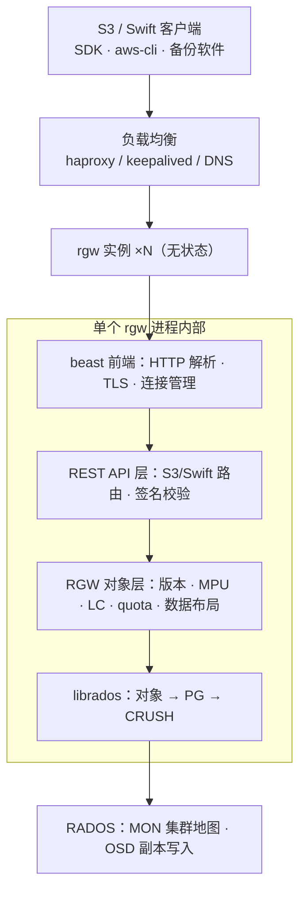
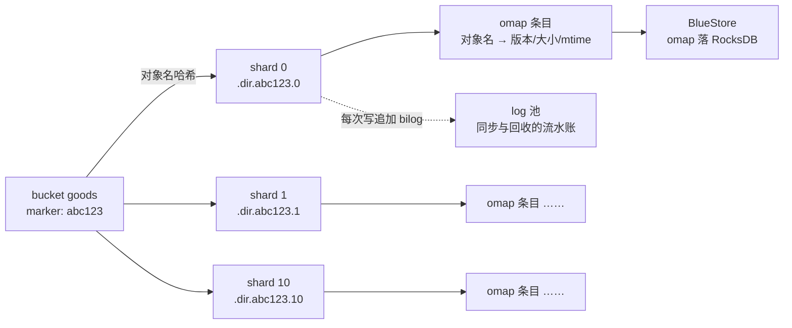
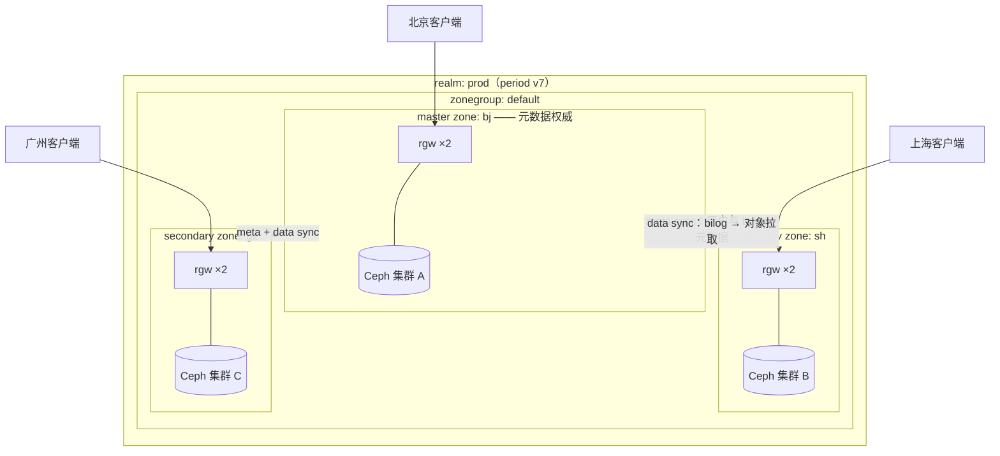

# 09 RGW 对象存储——S3 兼容网关与多租户

**摘要：**

RGW（RADOS Gateway）是 Ceph 三大存储接口中最"应用友好"的一条：它把 RADOS 的对象海洋翻译成 S3 与 Swift 两套 REST 语义，让任何会发 HTTP 请求的应用都能把数据存进集群，也因此成为备份归档、数据湖与云原生应用最常走的入口。本文从 2006 年 S3 上线与 2010 年 OpenStack 携 Swift 崛起的历史出发，讲清对象存储语义为什么要"长"在 RADOS 之上、RGW 进程的无状态设计与 beast 前端的线程模型，以及一次请求从 HTTP 到 librados 的完整处理链；随后逐层拆解 user/subuser/tenant 多租户体系与两级配额、bucket index 的 shard 分片与动态 resharding、生命周期规则、版本控制与 multipart upload 的临时对象；在多站点一章给出 zone/zonegroup/realm 三层模型与 meta log/data log 两条同步日志的机制，讨论 master/secondary 归属与故障切换的注意点；最后从运维视角整理前端并发参数、radosgw-admin 命令集与三类常见故障（bucket index 热点、LC 堆积、sync lag）的排查链。全文试图回答两个问题：S3 的对象语义是如何被"翻译"到 RADOS 之上的，以及在多租户与多站点的生产环境里，如何把这个网关用好、管好、容好。

---

## 第 1 章 对象存储接口的定位——RADOS 之上为什么要长一个 S3 网关

### 1.1 第三种语义——整租的房子、图书馆与快递柜

2006 年 3 月，Amazon S3 上线，"存储即服务"第一次变成一纸公开的 REST 契约：你不必挂载任何设备、不必理解任何文件系统，只要向一个 URL 发送 PUT 与 GET，数据就进了云端的仓库。四年之后的 2010 年 7 月，Rackspace 把自家 Cloud Files 的对象存储代码捐给新成立的 OpenStack 基金会，这个项目就是 Swift——对象存储从此有了第二个开源参照系。

Ceph 的回应并不算晚：2010 年前后，社区在 RADOS 之上补上了对象网关（最初就叫 radosgw），先实现对 S3 风格接口的兼容，2011 年前后又补齐了 Swift 接口；2012 年 OpenStack 把块存储独立为 Cinder 的同时，镜像服务 Glance 的后端也大量落在 Ceph 之上，RGW 就此搭上了私有云建设的第一班快车。

要理解 RGW 在 Ceph 里的位置，不妨先把三大接口放回生活经验里。块存储像整租的房子：整层租给你，怎么隔断、怎么装修随你，但水电物业（文件系统、数据库页管理）都得自己张罗，[[中间件/Ceph/07 RBD 块存储——快照、克隆与 Kubernetes CSI|07 RBD 块存储]] 讲的就是这套契约；文件存储像图书馆：有目录、有卡片、有借还规则，[[中间件/Ceph/08 CephFS——MDS、多活元数据与实践边界|08 CephFS]] 守着 POSIX 语义的边界；而对象存储像快递柜——你凭取件码（Key）存取包裹，柜子不关心里面装的是什么，也不允许你把包裹拆开改一半。这个比喻的边界同样要说清：快递柜的"包裹"是**不可变对象（Immutable Object）**，写入即定稿，修改只能整件替换，随机写与追加都不在语义之内。

对象语义的三要素由此浮现：扁平命名空间（bucket 加 object key 两级，没有真正的目录树）、不可变对象（整体读写，靠版本与分片上传补足灵活性）、REST over HTTP（请求天然穿透负载均衡、CDN 与防火墙，客户端零依赖）。互联网应用里最庞大的数据——图片、视频、备份、日志、数据湖的原始层——访问模式恰恰都是"一次写、多次读、按 key 取"，这与块和文件的语义格格不入，却与对象语义严丝合缝。RGW 存在的理由，就是把这第三种语义接到 RADOS 之上。

顺带补一段生态史，它解释了为什么 S3 接口成了必选项。S3 上线后，围绕它的客户端工具以年为单位累积——命令行工具、图形界面客户端、备份软件的存储后端、数据湖引擎的原生对接——到今天，"兼容 S3"已经不是什么卖点，而是任何对象存储的入场券。RGW 在 2010 年前后选择对齐 S3，等于把整个生态的工具箱直接搬到了 Ceph 的门口；反过来，这也意味着 RGW 的每一次 S3 特性跟进（policy、versioning、服务端加密），都是在追赶一个由 AWS 定义、全行业跟随的移动靶。

### 1.2 双协议——一张底牌、两套说辞

RGW 同时实现 S3 与 Swift 两套 API，同一份数据可以用两种客户端访问。这在 2010 年代初是务实的选择：彼时 OpenStack 生态说 Swift 方言，AWS 生态说 S3 方言，网关两头都说，才能两头都接客。但两套协议的语义并不完全等价——S3 的 bucket policy、版本控制、生命周期规则在 Swift 侧没有对应物，Swift 的大对象分段与自由的元数据标注也各有差异，同一个 bucket 用两种协议写入，读回来的语义要以各自 API 的文档为准。

| 维度 | S3 | Swift |
| :--- | :--- | :--- |
| 认证 | AWS 签名（access key + secret key） | token（X-Auth-Token，可对接 Keystone） |
| 命名空间 | zone 内全局唯一的 bucket 名 | tenant/account + container 两级 |
| 生态位 | 事实标准，工具链最庞大 | OpenStack 生态为主 |
| 特性侧重 | policy、versioning、LC、MPU | 大对象分段、自由 metadata |
| 典型场景 | 备份归档、数据湖、云原生应用 | OpenStack 存量、私有云文件分发 |

十几年过去，双协议的权重已经明显倾斜：S3 成了对象存储的"通用语"，rclone、aws-cli、各类备份软件与数据湖引擎都只认它，新项目几乎不会再为 Swift 写代码；Swift 接口在 RGW 里更多是存量兼容的角色。不过这并不意味 Swift 白做了——正是双协议的锤炼，逼着 RGW 把"协议层"与"对象层"解耦，这个分层在第 2 章会再看到它的好处。

选型建议因此可以落得很具体：新业务一律按 S3 客户端接入，把 Swift 留给 OpenStack 存量系统；如果部署形态上只需要 Swift（譬如给 OpenStack 专用的存储集群），前端配置也支持用 prefix 把不同协议挂在不同 URI 路径下，让网关按路径分流。双协议是历史包袱还是历史遗产，取决于你的机房里还剩多少 OpenStack——这个问题没有标准答案，只有存量结构给出的现实约束。

### 1.3 在对象存储版图中的位置

把 RGW 放回更大的版图里，它与 AWS S3、MinIO 各自站在什么位置，值得一张表说清：

| 维度 | AWS S3 | MinIO | Ceph RGW |
| :--- | :--- | :--- | :--- |
| 本质 | 公有云托管服务 | 单一用途的软件定义对象存储 | 统一存储集群之上的协议网关 |
| 数据底座 | AWS 自有基础设施 | 自研单用途引擎 | RADOS（与 RBD、CephFS 同底座） |
| 协议 | S3 全集 | S3（兼容度极高） | S3 子集 + Swift + NFS |
| 多租户 | IAM/STS 完整体系 | 内置 IAM，较轻量 | user/tenant/policy 子集 |
| 容灾 | 跨区域复制（托管） | 站点间复制 | 多站点 zone 同步 |
| 适用边界 | 数据在别人家可接受 | 纯对象存储负载、追求简单 | 一套集群同时供块、文件、对象 |

这张表里最值得琢磨的是"数据底座"一行。MinIO 的哲学是单打独斗——只为对象存储优化，部署简单、心智负担低；RGW 的哲学是统一存储——对象接口只是 RADOS 之上的一层皮，块、文件、对象共享同一组 OSD、同一套副本与纠删码策略、同一条扩容路径。如果你的机房只需要对象存储，MinIO 往往更轻；如果你的平台要同时喂饱虚拟机、容器与备份归档，一套 Ceph 供三种接口的边际成本就显出优势。**这不是性能高下之争，而是"专精"与"统一"的路线之争**——与 [[中间件/Ceph/01 Ceph 全局架构——RADOS、CRUSH 与三大存储接口|01 全局架构]] 讨论的三大接口定位是同一道题。

再补一句协议表之外的能力：RGW 还能通过 NFS 接口（借助 NFS-Ganesha 与 librgw）把 bucket 以目录的形式挂给传统主机，让不支持 S3 的老系统也能读到对象存储里的数据。这是"统一存储"哲学的又一处体现——同一份数据，块、文件、对象、NFS 四条路都能走到；代价则是每多一条协议路径，就多一层语义映射与一个排障面。

### 1.4 反事实——如果对象接口直接长在 OSD 上

不妨做个反事实推演：为什么不让客户端直连 RADOS，或者干脆让 OSD 直接听懂 HTTP？前者的代价是每个应用都要内嵌 librados、自己实现用户体系与配额，S3 生态里成千上万的现成工具一夜清零；后者则把协议解析、签名校验、多租户计费这些"应用层"的复杂度压进存储引擎，OSD 本就繁忙的数据路径还要分心处理 HTTP 事务，任何一处协议栈的 bug 都会波及数据完整性。

RGW 的角色因此更像口岸的海关：RADOS 是境内的物流系统，只认 PG 与对象编号，不问货物来自何方；RGW 守在口岸，把"PUT /bucket/key"翻译成对象写、把"GET /bucket/key"翻译成对象读，顺带完成验关（认证与授权）、征税（配额与统计）、登记（索引与日志）。翻译官站在集群边缘而非内部，意味着协议层可以整体替换、独立演进——第 2 章的前端更迭史会证明这一点。

> [!note] 设计哲学：网关模式
> RGW 是"复杂性转移"的又一次落笔：RADOS 保持纯粹（只管对象与 PG），协议语义、用户体系、租户隔离全部收编进网关层。好处是存储引擎不被应用语义污染，坏处是所有请求都要过网关这道独木桥——网关层的容量规划与横向扩展因此成为对象存储运维的第一课。

> [!warning] 生产避坑：对象存储不是文件系统
> 最常见的误用是把 RGW 当文件系统：随机改写已上传的对象、指望重命名原子生效、用对象 key 模拟深层目录再全量遍历。这些都不在对象语义之内，硬做只会得到糟糕的性能与意外的容量账单。需要文件语义走 CephFS，需要块语义走 RBD，需要随机修改的大文件则考虑分片设计或换接口——**选错接口的代价，任何调优都救不回来**。

---

## 第 2 章 架构与线程模型——一个无状态的翻译层

### 2.1 前端演进——从 FastCGI 到 beast

RGW 是一个内嵌 HTTP 服务器的独立进程（radosgw），它不依赖外部 Web 服务器，但"谁来听端口"这件事经历过三代更迭。最早的一代是 Apache 加 FastCGI：Web 服务器在外，RGW 通过 FastCGI 协议接活，部署繁琐、链路冗长；2014 年的 Firefly 引入了内嵌的 civetweb（Mongoose 的分支），进程自己听端口，此后逐步取代外挂 Apache 成为默认前端，部署一下子清爽了；但 civetweb 是一线程一连接的模型，高并发下线程数失控，2018 年的 Mimic 引入了基于 Boost.Beast 的新前端 beast——用 Boost.Beast 解析 HTTP、用 Boost.Asio 做异步网络 I/O——Nautilus（2019）起 beast 成为默认，civetweb 在 Pacific（2021）标记弃用、Quincy（2022）被彻底移除。

| 前端 | 时代 | 模型 | 结局 |
| :--- | :--- | :--- | :--- |
| Apache + FastCGI | 早期 | 外挂 Web 服务器，进程间转发 | 部署复杂，已淘汰 |
| civetweb | Firefly（2014）引入，后成默认 | 一线程一连接，线程数即连接数 | Pacific 弃用，Quincy 移除 |
| beast | Mimic（2018）引入，Nautilus 起默认 | Boost.Asio 异步网络 I/O | 现行标准 |

配置上前端通过 `rgw_frontends` 声明，端口、证书、超时都在这一行里：

```ini
[client.rgw.node1]
# beast 是现行默认前端；证书也可放入 MON 的 config-key 统一管理
rgw_frontends = "beast port=8080 ssl_port=8443 ssl_certificate=/etc/ceph/rgw.pem"
```

顺带一提，证书路径若写成 `config://` 前缀，RGW 会从 MON 的 config-key 数据库取证书，配合 `profile rgw` 的 MON 权限只能读取 `rgw/` 前缀下的键——证书集中下发这件事，[[中间件/Ceph/03 Monitor 与集群地图——Paxos、Quorum 与 MON 运维|03 Monitor 与集群地图]] 讲过的 MON 配置库正好派上用场。

### 2.2 无状态——连锁门店的生意经

RGW 进程不持有任何业务状态：用户、bucket、对象元数据全部放在 RADOS 的池子里，认证凭据随每个请求携带（S3 签名或 Swift token），任何实例都能服务任何请求。于是横向扩展退化成一件朴素的事——加实例、挂负载均衡：haproxy 加 keepalived 做四层分发、DNS 轮询做粗粒度分流，或者干脆交给 cephadm，一条 `ceph orch apply rgw` 声明副本数与主机列表，多实例就铺开了。

打个比方，rgw 实例像连锁门店：账本都在总部（RADOS），任何一家门店都能办理全部业务，门店本身只是柜台，多开几家并不需要"同步账本"，因为账本从来不在门店里。不过"无状态"要打个补丁：它指业务状态，进程内仍有用户信息与 bucket 元数据的缓存，元数据变更存在秒级的可见性延迟；多站点场景下各 zone 之间的元数据同步更是异步的——这些不一致窗口平时无感，但在排障与容灾演练时必须记在心上。

部署形态上还有两个实务细节。其一是健康检查：负载均衡对 rgw 的探活建议用真实的 S3 请求（譬如对一个小对象的 HEAD）而不是 TCP 探测，避免"进程僵死但端口仍开"的假活；其二是滚动升级：无状态让 rgw 成了 Ceph 家族里升级最从容的组件——逐台摘流量、升级、回归，业务几乎无感，这也是"网关层独立演进"的直接红利。

### 2.3 一次 PUT 的完整旅程

把一次对象上传拆开看，请求要穿过四层：



各层职责分明：beast 前端只管协议与连接；REST API 层识别这是 S3 还是 Swift 请求、把 URL 路由到对应的资源处理器、完成签名校验；RGW 对象层是语义的主战场——版本控制、多部分上传、生命周期、配额统计都在这里实现，较新版本把它抽象成 sal（Storage Abstraction Layer）接口，为将来替换存储驱动留了后门；最底下 librados 完成 [[中间件/Ceph/01 Ceph 全局架构——RADOS、CRUSH 与三大存储接口|01 全局架构]] 讲过的两步映射——哈希到 PG、CRUSH 算出 OSD——数据从此与网关无关。

值得注意的是整条链路的**同步阻塞模型**：请求线程从解析 HTTP 一路同步调用 librados 直到集群应答，期间线程被占满。这意味着单进程的并发上限约等于线程数，而不是连接数——beast 的网络 I/O 虽是异步的，一个线程可以同时伺候多条连接，但同一时刻每条连接只处理一个请求。并发怎么扩、线程怎么配，第 6 章的运维视角会回来算这笔账。

以一次带版本控制的 PUT 为例，对象层的动作清单大致是：校验配额与权限、为这次写入分配新版本号、把数据对象写进数据池、在 bucket index 对应分片里更新条目并追加 bilog 记录、最后更新桶级统计。数据池的写入走 librados 的原子操作，而 index 的更新与 bilog 的追加决定了 list、配额、同步三件事的准确性——这也是为什么第 4 章要专门用一章讲 index：它是网关层所有语义的记账本，账本一旦倾斜或积压，症状会同时出现在 list、统计与同步上。

### 2.4 bucket 与对象如何落到 RADOS

RGW 在 RADOS 上铺开一组专用池，各司其职：

| 池（典型命名） | 装什么 | 备注 |
| :--- | :--- | :--- |
| `.rgw.root` | realm、zonegroup、zone 元数据 | 多站点的"户口本" |
| `.rgw.meta` | 用户、bucket 实例元数据 | users.uid 等命名空间 |
| `.rgw.log` | meta log、data log、bilog、GC 队列 | 同步与回收的流水账 |
| `.rgw.buckets.index` | bucket index 分片对象 | 本节主角 |
| `.rgw.buckets.data` | 对象数据（旧称 `.rgw.buckets`） | 真正的字节 |

对象数据的落点并不神秘：对象 OID 由 bucket 标识与对象名派生，写进数据池，之后就是标准的 RADOS 对象，走 [[中间件/Ceph/02 CRUSH 算法——去中心化的数据放置|02 CRUSH 算法]] 的放置规则，与 RBD 的对象并无身份差别。真正需要专门设计的是**bucket index（桶索引）**——它是 bucket 的目录卡片柜，记录"这个桶里有哪些对象、各多大、何时修改"，list 请求、配额统计、生命周期处理全都要翻它。

index 的物理形态是索引池里的一组 RADOS 对象，每个分片（Shard）一个，命名形如 `.dir.<bucket标记>.<分片号>`；每个对象的条目放在 omap 里，而 BlueStore 把 omap 存进 RocksDB——[[中间件/Ceph/04 OSD 与 BlueStore——存储引擎深度解析|04 OSD 与 BlueStore]] 拆过的那套引擎在这里再次接手。分片数是 RGW 里最重要的一个权衡旋钮：分片太少，单个 index 对象成为写热点——RADOS 单对象写不可并行，所有对同一分片的索引更新都要排队；分片太多，一次 list 要碰的对象数变多，遍历成本水涨船高。新 bucket 默认 11 个分片，可在 zonegroup 的 `bucket_index_max_shards` 或全局的 `rgw_override_bucket_index_max_shards` 调整，而对象数涨到一定规模后的出路——动态 resharding——留到第 4 章展开。

list 的成本模型值得单独记一笔：S3 的 ListObjects 按字典序返回，客户端常用前缀（譬如日期目录）分页遍历；由于对象按名字哈希散到各分片，一次前缀遍历通常要在每个分片上各做一段有序扫描再归并，分片越多，单次 list 的固定开销越大。官方文档明确不建议把分片数设到上千，理由正在于此——写并行度与 list 成本是一对直接互为代价的量，第 4 章的 reshard 也绕不开它。

---

## 第 3 章 用户与多租户——user、subuser 与 tenant

### 3.1 user、subuser 与密钥体系

RGW 的身份体系围绕 user（用户）展开：`radosgw-admin user create` 创建的用户是管理单元，bucket 归属其名下，配额与统计也挂在它身上。S3 侧的凭证是 access key 与 secret key 组成的密钥对，一个 user 可以挂多组密钥，便于轮换而不中断业务；Swift 侧则是 subuser（子用户）加 swift key 的组合，subuser 挂在主用户之下，权限分为 read、write、full-control 等级别。管理 API 另有一套 caps（能力授权）体系，按 `users=*`、`buckets=*` 这样的粒度授予，运维工具与监控组件应该用带最小 caps 的专用账号，而不是人人拿着 admin。

| 概念 | S3 侧 | Swift 侧 | 语义 |
| :--- | :--- | :--- | :--- |
| user | access key + secret key | —— | 管理与计费单元，bucket 归属者 |
| subuser | —— | subuser + swift key | 同一 user 下的协议级子账号 |
| caps | admin API 授权 | 同左 | 管理接口的能力范围 |
| policy | bucket/user policy | —— | 资源级访问控制（3.4 节） |

打个比方，user 是业主，subuser 是同住的家人——每人拿一张权限不同的门禁卡，但水电费账单都记在业主名下；caps 则是物业授予的办事窗口权限，决定你能替业主办哪些手续。这套模型简单直接，但它的粒度天花板也很明显：没有原生的"组"、没有跨账号委托的完整语义，复杂的权限诉求要靠 policy 补足。

密钥管理上还有一条容易被忽视的实务：一个 user 可以挂多组 access key，这为**轮换（Rotation）**留了口子——先发新 key、应用切换、再吊销旧 key，全程不中断服务。反过来，生产上最忌讳的是"一个 key 用到天荒地老"：它散落在无数配置文件与同事的笔记本里，吊销成本随时间指数上涨。给每个应用发独立 user、按周期轮换、用 caps 把管理权限与数据权限分开，是这套体系里性价比最高的三条纪律。

### 3.2 tenant 隔离与外部认证

多租户的第一层隔离是命名空间级的：创建用户时带上 tenant 前缀（`radosgw-admin user create --tenant=tenant-a --uid=app1`），uid 就变成 `tenant-a$app1`，它创建的 bucket 也归属 `tenant-a` 的命名空间——两个 tenant 可以有同名 bucket 而互不干扰。不带 tenant 的 uid 落在遗留命名空间，这是老版本兼容的产物，新平台建议从一开始就带上 tenant。

tenant 的比喻是门牌号：同一栋楼里，两个单元可以有一样的房间号，快递单上写了单元号（tenant 前缀）才不会送错门。但请注意比喻的边界——**tenant 是命名空间隔离，不是安全边界**：跨 tenant 的访问控制要靠 policy 与 caps 实现，"不同 tenant"本身并不构成"互相看不见"的保证，把这两件事混为一谈是权限设计里最常见的想当然。

外部认证方面，RGW 提供了几条对接路径：OpenStack Keystone 集成（Swift 的 tenant 与 RGW 用户自动映射，OpenStack 存量环境的标准姿势）、LDAP 绑定（企业目录认证），以及 OIDC（OpenID Connect）配合 STS 换取临时凭证（Keycloak 已完成集成验证）。这些集成的共同思路是：身份的源头放在企业统一认证，RGW 只做凭证到权限的映射——把 RGW 当成身份源，是另一个常见的方向性错误。

### 3.3 两级 quota——user 与 bucket

配额（Quota）分两级：user 级限制一个用户的总容量与对象数，bucket 级限制单个桶的容量与对象数，另有每用户 bucket 数上限（`rgw_user_max_buckets`，默认 1000）。两级可以叠加使用——平台方用 user 级管租户总量，租户自己用 bucket 级管单项目水位。

| 层级 | 控制对象 | 典型用途 | 设置方式 |
| :--- | :--- | :--- | :--- |
| user 级 | 用户全部 bucket 之和 | 租户总量封顶 | `radosgw-admin quota set --uid=...` |
| bucket 级 | 单个 bucket | 单业务/单应用限额 | `--bucket=...` 配合 quota set |
| bucket 数 | 每用户 bucket 个数 | 防止元数据滥用 | `rgw_user_max_buckets` |

必须理解的是，quota 是**软限制（Soft Limit）**：统计异步刷新，瞬时写入存在短暂越过额度的窗口，超限后写入才被拒绝（报 QuotaExceeded）。它防的是"慢性失控"，不是"瞬时洪峰"——指望配额做精确的硬隔离，会失望。与 [[中间件/Ceph/07 RBD 块存储——快照、克隆与 Kubernetes CSI|07 RBD 块存储]] 讲过的 provisioned/used 治理思想同源：配额兜底、定期对账、对增速最快的 bucket 单独告警，三件事缺一不可。

> [!warning] 生产避坑：quota 是软限制
> 配额统计有延迟窗口，删除对象后空间也不会立刻"退回"（统计与 GC 都异步）。容量治理不能只靠配额：把用户级与 bucket 级的用量趋势做成监控，对"配额使用率长期贴顶"的租户主动沟通扩容，比等它撞墙后排查"为什么写不进去"便宜得多。

### 3.4 与 IAM/STS 的现状——能对齐 AWS 多少

S3 生态的权限体系远不止密钥对：bucket policy 把授权规则挂在桶上，IAM policy 把规则挂在身份上，STS（Security Token Service）签发临时凭证让第三方应用有限期、有限度地访问资源。RGW 对这套体系的跟进是渐进的：bucket policy 自 Luminous（2017）起支持，语法对齐 AWS S3 policy 的子集；用户级 IAM policy、Role 与 STS（AssumeRole、AssumeRoleWithWebIdentity）自 Nautilus（2019）起陆续落地，Keycloak 作为 OIDC 提供方已完成集成验证。

但要对齐 AWS 的完整 IAM 生态，目前仍然言之尚早：跨账号资源目录、策略版本管理、CloudTrail 式的细粒度审计、部分条件键的支持，都存在缺口。笔者的建议是把分工想清楚——企业统一身份放在网关之外（OIDC 提供方加 STS 换临时凭证，或在网关前架一层代理鉴权），RGW 内只做最小授权；把 RGW 当成 IAM 服务器来用，等于在存储系统里重建一套身份中枢，得不偿失。

| 能力 | AWS IAM/STS | RGW 现状 |
| :--- | :--- | :--- |
| bucket policy | 完整支持 | 子集（Luminous 起） |
| 用户级 IAM policy | 完整支持 | 子集（Nautilus 起） |
| STS 临时凭证 | AssumeRole 等全家桶 | AssumeRole、AssumeRoleWithWebIdentity |
| OIDC 联合登录 | 原生 | Keycloak 已验证集成 |
| 审计与策略治理 | CloudTrail、策略版本 | 需外建 |

这张表不是用来贬低 RGW 的——它的定位从来不是 IAM 服务器，而是"够用的授权"。真正要避免的是把企业级身份治理的期望压在网关上：临时凭证的下发、跨系统的联合认证，交给专门的 IdP 与代理层，RGW 里的 policy 只承担资源级的最小授权，这条边界划清了，权限体系才不会越长越乱。

---

## 第 4 章 数据组织与索引——bucket index 的分片之道

### 4.1 shard 分片——目录卡片柜为什么要分抽屉

第 2 章说过，bucket index 是目录卡片柜；这一章要回答的问题是：柜子为什么要分抽屉、分多少个才合适。答案藏在两堵墙里。第一堵墙是并行度——RADOS 单对象写不可并行，一个不分片的 index 就是一条单车道，亿级对象的 bucket 里每一次写都要在这条车道上排队；第二堵墙是 omap 的实用上限——单个 RADOS 对象的 omap 大约 10 万条目就会开始吃力，超过之后 list 与统计的性能断崖式下跌。

于是 index 按对象名哈希分散到多个分片对象上，写并行度等于分片数。新 bucket 默认 11 个分片，相关的旋钮集中在这几个参数上：

| 参数 | 默认值 | 语义 |
| :--- | :--- | :--- |
| `bucket_index_max_shards`（zonegroup） | 11 | 新建 bucket 的初始分片数 |
| `rgw_override_bucket_index_max_shards` | 0（不覆盖） | 全局覆盖 zone 的设置 |
| `rgw_max_objs_per_shard` | 100000 | 动态 reshard 的触发阈值（对象数/分片） |
| `rgw_max_dynamic_shards` | 1999 | 动态 reshard 的分片数上限（倾向取质数） |
| 缩减等待 | 5 天 | 对象数下降后延迟再缩，避免追着波动反复翻新 |

取质数是个耐人寻味的细节：质数个分片能让对象名到分片的哈希分布更均匀，减少某些命名模式下的倾斜。至于"每分片 10 万以内"这条经验线，它直接来自 omap 的实用上限——规划 shard 数时，拿预期对象总数除以 10 万再留余量，是第一轮估算的起点。



把规划经验收拢成三句话：其一，按"预期对象总数 ÷ 10 万"定初始分片，宁可略多不可贴线；其二，写密集的桶优先保证分片数，读密集（大量 list）的桶控制分片数；其三，分片数是 bucket 元数据的一部分，创建后靠 reshard 调整而非重建，但多站点环境要按第 4.2 节的限制来。

### 4.2 动态 resharding——半幅施工的公路翻新

分片数定小了怎么办？Luminous（2017）引入的动态 resharding 给了答案：当 bucket 的对象数超过"每分片 10 万"的阈值，RGW 自动把分片数扩大（通常翻倍并取质数），把既有条目重新分散。整个过程像公路的半幅施工翻新——新建一组目标分片对象，把旧分片的条目逐批拷贝过去，然后原子切换 bucket 的布局信息，旧分片随后回收；施工期间这条公路（bucket）限行，写入会被阻塞，阻塞时长与 bucket 的规模成正比，大 bucket 的 reshard 以分钟到小时计。

运维侧的抓手是 reshard 队列与三个子命令：`radosgw-admin reshard list` 看排队、`reshard status` 看进度、`reshard process` 手动推进。反向的缩减也有，但被刻意设计得迟钝——对象数下降后要等 5 天（可配）才真正缩分片，避免业务波动追着 reshard 反复翻新。多站点场景则要多一层谨慎：**Reef（2023）之前，动态 resharding 在多站点部署中不受支持**——元数据的权威在 master zone，secondary 侧 reshard 产生的 bucket 实例元数据无法回同步，会造成复制无法收敛的不一致；Reef 之前的做法是在 master zone 上手动 reshard，并把初始分片数一次规划到位。

反事实很直观：如果没有 reshard 机制，热点 bucket 的写延迟与 list 时延会随对象数线性恶化，唯一的解法是删桶重建——这在生产上等于让业务停摆。reshard 把"索引容量的弹性"变成了系统自愈能力，但它的代价（阻塞窗口、多站点的限制）也提醒我们：**初始分片数仍然值得认真规划，reshard 是保险，不是规划**。

实现层面还有一处细节值得交代：reshard 不是原地扩容，而是"另起炉灶"——按目标分片数新建一组 index 对象，把旧分片的条目逐批读出写入新分片，最后原子切换 bucket 元数据里的布局信息（BucketLayout），旧分片对象交给后台回收。施工期间写入被阻塞，正是为了杜绝新旧两本账分叉；而这份切换产生的元数据变更要参与多站点同步，正是 Reef 之前动态 resharding 在多站点受限的实现层原因之一——secondary 侧无法可靠回放这类变更。

> [!info] 核心概念：reshard 是在线手术
> 手术期间整条路限行：bucket 的写入在 reshard 完成前被阻塞，bucket 越大阻塞越久。把 reshard 队列纳入监控（`reshard list` 非空即值得关注），多站点环境在 Reef 之前坚持"master 上手动做、初始分片留足余量"两条纪律，能避开绝大多数索引事故。

### 4.3 生命周期（LC）——数据的退休制度

对象存储里的数据不会自己消失，过期数据靠生命周期（Lifecycle, LC）规则清理。规则有四类：按天数或日期的过期（Expiration）、非当前版本的过期（Noncurrent Version Expiration）、清理未完成的多部分上传（Abort Incomplete Multipart Upload）、以及基于对象标签的过滤。它们共同构成一套"退休制度"——谁到龄、谁离岗、谁补位，都写在 bucket 的规则里，由 RGW 定期执行。

执行节奏是每天一轮，默认窗口凌晨 0 点到 6 点（`rgw_lifecycle_work_time` 可调）；早期版本单线程逐桶处理，规则多、对象多的集群一轮跑不完，Nautilus（2019）起改为多线程并行——`rgw_lc_max_worker`（默认 3）管的是同时处理多少个 bucket，`rgw_lc_max_wp_worker`（默认 3）管的是单个 bucket 内的并行度，前者适合"桶多"的集群，后者适合"单桶对象多"的集群。

| 规则 | 触发条件 | 典型用途 |
| :--- | :--- | :--- |
| Expiration | 对象年龄/指定日期 | 日志保留 30 天、临时数据次日清理 |
| Noncurrent Expiration | 版本转为非当前后 N 天 | 版本化桶的旧版本回收 |
| Abort Incomplete MPU | 上传发起后 N 天未完成 | 清理半途而废的分片（4.5 节） |
| 标签过滤 | 对象带指定 tag | 同桶内差异化保留策略 |

LC 的经典故障是堆积：规则数量大、单桶对象数大时，一轮窗口内处理不完，过期对象持续占用空间，容量报表与实际老化速度对不上。观测与处置的路数在第 6 章排查链里展开，这里先记住原则——**LC 的处理能力要按"最坏一天的过期量"来规划，而不是按平均值**。

LC 的执行还有两个容易被忽略的脾气。其一，它以 index 分片为单位推进，处理进度记在分片里——一个存量巨大的桶可能连续多天都清不完自己的旧账，新加的规则只能排队；其二，LC 线程不必在所有实例上启用，但每个 zone 至少要有一个实例承担 LC 职责，实例数收缩或配置调整后要确认这一点，否则规则配了也无人执行。

> [!warning] 生产避坑：LC 堆积是慢性病
> LC 堆积的典型症状是"过期对象迟迟不消失、容量曲线压不下来"，而告警往往缺位——因为它不报错，只是变慢。把"最老未过期对象年龄"与"LC 一轮处理时长"纳入巡检，批量新增规则后主动观察一轮处理情况，比等容量报表失真后再排查便宜得多。

```json
{
  "Rules": [
    {
      "ID": "expire-logs-30d",
      "Status": "Enabled",
      "Filter": { "Prefix": "logs/" },
      "Expiration": { "Days": 30 }
    },
    {
      "ID": "abort-mpu-7d",
      "Status": "Enabled",
      "Filter": {},
      "AbortIncompleteMultipartUpload": { "DaysAfterInitiation": 7 }
    }
  ]
}
```

这份规则模板值得抄进平台规范：日志类前缀按天过期、全桶兜底清理未完成的 MPU——两条规则覆盖了对象存储最常见的两类"慢性失血"。

### 4.4 版本控制与软删除——delete marker 的语义

开启版本控制（Versioning）后，bucket 进入"只增不毁"的模式：每次写入产生一个新版本（带唯一 version id），删除操作并不真正删除，而是写入一个删除标记（Delete Marker）——对象从此"看起来没了"，但历史版本与标记都还在，list-versions 能把它们全部列出来。这就是对象存储的软删除：恢复 = 删掉删除标记，彻底删除 = 指定 version id 删除。版本控制还有个 suspended（挂起）态：不再产生新版本，但既有版本与标记保留。

它与 [[中间件/Ceph/07 RBD 块存储——快照、克隆与 Kubernetes CSI|07 RBD 块存储]] 的 trash 机制层次不同：trash 是运维侧的后悔药货架（删除先进回收站），versioning 是协议内的版本语义（应用可见、可编程）。两者可以并存，但空间代价是叠加的——旧版本与删除标记都实打实占着空间，回收全靠 LC 的 noncurrent 规则。"开了 versioning 忘配 LC"是容量缓慢失血的经典姿势：数据看起来删了，账单却月月涨。

算一笔空间账就能体会 versioning 与 LC 的绑定关系：一个每天全量覆盖写 1TB 的备份桶，开启 versioning 且保留 7 个非当前版本，稳态占用就在 8TB 上下；若忘了配 noncurrent 规则，占用随覆盖次数无限增长。删除标记同样占地方——它们是 index 里的真实条目，百万级 delete marker 的桶，list 与 LC 都会明显变慢。版本化是把双刃剑，**开 versioning 的同时配好 noncurrent 规则，是对象存储容量治理的基本功**。

### 4.5 multipart upload——大对象的分卷与临时对象

S3 语义下单次 PUT 上限 5GB（RGW 默认的单对象上限 `rgw_max_obj_size` 约 4.5GB，正好留出余量），更大的对象要走多部分上传（Multipart Upload, MPU）：initiate 拿到 upload id，分片并发上传（每片至少 5MB、最多 1 万片），complete 时组装成正式对象。值得说清的是组装的真相——complete 并不搬动数据，只是在头对象里写下一份清单（manifest），把各分片的偏移与底层对象的映射记下来，读取时按清单拼接。分片数据以 shadow 对象的形式先落在数据池，MPU 的记账条目挂在 bucket index 里。

这套设计的软肋在"半途而废"：客户端重试风暴、网络抖动、程序崩溃，都会留下传了一半的分片与 index 里的 MPU 条目——它们是看不见的容量泄漏，不 abort 就一直占着空间。防线有三道：客户端主动 abort、LC 规则的 Abort Incomplete Multipart Upload 兜底、以及定期用孤儿对象对账工具（Reef 起的 `rgw-orphan-list`，旧版本的 `radosgw-admin orphans find`）清点"数据池里有、index 里没有"的孤儿。备份与大数据场景的 MPU 流量大，这三道防线值得写进平台规范。

分片大小也有讲究：片太小，1 万片的上限会卡住单对象容量（1 万 × 5MB 只有 50GB），且 index 里每片一条记账，元数据开销上升；片太大，单片重传的代价高。常见做法是在 8MB 到 64MB 之间按网络质量取值。另外，manifest 式的组装意味着读取大对象时要按清单跨多个底层对象拼接——顺序读几乎无感，随机读的路径却变长了，这正是对象存储"大对象顺序写、顺序读"惯用法背后的实现层原因。

---

## 第 5 章 多站点容灾——zone、zonegroup 与 realm

### 5.1 三层层级模型

单集群的容灾半径止于副本与纠删码——机房断电时它们无能为力，跨站点容灾要靠 RGW 的多站点（Multisite）体系。这套体系在 2014 年前后的版本里重整为三层：realm（域）是最大的边界，定义一个全局命名空间，并携带一个叫 period 的配置版本号；zonegroup（域组）是 zone 的分组，决定路由与默认属性；zone（域）落在具体的 Ceph 集群上，是一组 rgw 实例与其数据池的集合。三层元数据都存在 `.rgw.root` 池里，period 则像配置的版本化快照——任何 zone/zonegroup 的修改都要通过 `period update --commit` 生成新版本，再分发到所有站点，这保证了"配置变更"本身是原子且可追溯的。

| 层级 | 职责 | 关键操作 |
| :--- | :--- | :--- |
| realm | 全局命名空间 + period 版本 | `realm create/pull` |
| zonegroup | zone 分组、路由与默认属性 | `zonegroup modify` + `period update --commit` |
| zone | 一个集群上的 rgw 集合与数据池 | `zone modify --master`、endpoints、read-only |

period 的存在让多站点的配置管理有了"版本"的概念：zone 与 zonegroup 的每次修改都产生新的 period，各 zone 通过 `realm pull` 拉取最新配置并对齐。这个设计解决的是多站点运维最阴险的问题——配置漂移：如果各站点的配置各自为政，同步引擎对"哪些 zone 该同步什么"的认知就会分叉，症状是同步莫名停滞或重复。period 把配置变更变成一次显式的、带版本号的提交，任何不一致都能从 period 版本号上直接看出来。

### 5.2 同步如何工作——meta log 与 data log

多站点在 Kraken（2016）迎来一次关键重构：同步逻辑内嵌进 rgw 进程，取代了早期需要单独部署的 radosgw-agent 同步代理，zone 间默认 active-active——secondary zone 也可以接受写入，数据双向流动。同步的原料是两条日志：**meta log（元数据日志）**记录用户与 bucket 元数据的变更，按分片组织，secondary 周期性拉取回放；**data log（数据日志）**在 bucket index 的分片里追加 bilog（bucket index log）条目，记录每个对象的增删改，同步线程据此逐条把对象数据从对端拉过来。日志池（`.rgw.log`）里那些 data log 分片（默认上百个）与 mdlog 分片，就是这套流水账的物理载体。



理解同步模型的关键是它的**异步最终一致**：写 master 成功即应答客户端，同步进度不阻塞业务；secondary 若配置为 read-only 则只承接读流量，若保持 active 则写入也会走同样的日志机制回流。观测同步健康的第一入口是 `radosgw-admin sync status`——它给出每个 data log 分片的落后程度，是第 6 章排查 sync lag 的起点。

> [!info] 核心概念：active-active 与 read-only 的取舍
> active-active 的体验最好——各地写各地读，本地写不受跨站延迟拖累——但对象数据在 zone 间是最终一致的：同一对象在两个 zone 同时被改，后写者覆盖先写者，没有冲突合并。read-only 的 secondary 则是经典主备：写路径收敛到 master，一致性心智简单，代价是异地写要绕路。**这不是技术题，是业务对"本地写体验"与"写冲突风险"的取舍**——备份归档类负载天然适合 active-active，强一致写场景则应收敛到单点写。

两条日志的分工也值得一张表说清：

| 日志 | 记什么 | 粒度 | 谁消费 |
| :--- | :--- | :--- | :--- |
| meta log（mdlog） | 用户、bucket 等元数据变更 | 按分片（默认数十个） | 各 secondary 的元数据同步线程 |
| data log（datalog） | bucket 级的对象增删改事件 | 按 data log 分片（默认上百个） | 各 secondary 的数据同步线程 |
| bilog | 单个 bucket index 分片内的对象级变更 | 挂在 index 分片上 | 数据同步拉取对象的依据 |

### 5.3 master 与 secondary——归属、failover 与 RPO

master zone 是元数据的权威：用户创建、bucket 创建这类元数据操作以它为准，secondary 的对应变更最终要向它收敛。数据面则灵活得多——active-active 模式下各地写各地读，跨 zone 只同步增量；read-only 模式则是经典的主备。failover 的标准动作是把 secondary 提升为 master（`zone modify --master` 加 `period update --commit`），再把客户端的接入点（DNS 或负载均衡）切过去；failback 不是原路返回——旧 master 降级为 secondary 后，它上面滞后的写入需要先对账清理，直接"切回去"可能造成分叉。

那么 RPO（Recovery Point Objective，恢复点目标）与同步的关系是什么？多站点同步是持续流式的，没有"每 N 分钟同步一次"的旋钮，因此 **RPO 约等于端到端的同步延迟（lag）**——而 lag 不是常数：它由跨 WAN 带宽、突发写入量与故障重试共同决定，夜间批处理洪峰时可能从秒级飙到分钟级。承诺 RPO 之前，先在 `sync status` 里看 shard lag 的分布与峰值，按最坏窗口（而不是平均值）说话；带宽规划则可以用一个朴素的账——日均新增数据量除以 86400 秒再乘一个洪峰系数，就是跨站同步的保底带宽。

failover 的完整动作值得写成一张步骤表，贴在 runbook 里：

| 步骤 | 动作 | 注意点 |
| :--- | :--- | :--- |
| 1 | 确认对端 sync lag 归零或可接受 | lag 就是切换时刻的数据损失量 |
| 2 | `zone modify --master` 提升 secondary | 单向操作，不可"试试再切回" |
| 3 | `period update --commit` 确立新权威 | 全网分发的原子提交 |
| 4 | 客户端切 DNS/负载均衡 | 注意客户端 DNS 缓存与重试风暴 |
| 5 | 旧 master 降级为 secondary 并对账 | 滞后写入以新权威为准收敛 |

这张表里最容易被跳过的是第 1 步与第 5 步：不看 lag 就切换，等于把同步延迟直接兑现成数据损失；不做第 5 步的对账，旧站点滞后的写入会在将来变成分叉的种子。演练时把这两步刻意走一遍，比背下命令重要得多。

> [!warning] 生产避坑：failover 不是回滚按钮
> 提升是单向的：新 master 通过 period commit 确立权威后，旧 master 必须降级为 secondary 并对账，不能"切过去试试，不行再切回来"。脑裂场景下两边都自认为是 master 时，以 period 版本新的一方为准，元数据分叉的部分要有重建预案。**没有演练过的容灾预案，只是一份乐观的文档**——定期把 failover 走一遍，包括客户端切换与 failback 对账，才算真的有多站点。

---

## 第 6 章 运维视角——参数、命令与排查链

### 6.1 前端线程与并发参数

第 2 章说过，RGW 是同步阻塞模型，单进程并发上限约等于线程数。这个线程数由 `rgw_thread_pool_size` 控制（默认 100），civetweb 时代它就是并发上限，beast 时代它仍是请求处理的线程池大小，只是一条线程不再绑定一条连接。

加线程有收益，但收益的上限在集群侧——librados 调用、OSD 的磁盘与网络才是真正的瓶颈，前端堆线程只会把排队从负载均衡挪到进程内，尾延迟反而更难看。**扩并发的正路是多实例加负载均衡，单进程线程数给到一两百再往上就要靠集群侧扩容**。

| 参数 | 默认值 | 作用与实务 |
| :--- | :--- | :--- |
| `rgw_thread_pool_size` | 100 | 请求处理线程池，单进程并发上限 |
| `request_timeout_ms`（beast） | 65000 | 前端收发超时，跨 WAN 客户端可酌情调大 |
| `tcp_nodelay` | 0 | 关闭 Nagle，小对象低延迟场景可开 |
| `so_reuseport` | 0 | 同机多实例共享端口，滚动重启更平滑 |
| `max_connection_backlog` | 系统默认 | accept 队列上限，突发连接洪峰时关注 |

过载的典型表现是 503 与长尾延迟：线程池打满后请求排队，客户端超时重试，重试又加剧拥塞——这是对象网关最经典的过载螺旋。防线在三层：负载均衡的健康检查把过载实例摘掉、客户端重试加退避（exponential backoff）、必要时在 LB 层限流。至于 RGW 自身，请求级的限流手段在较新版本里逐步补齐，但根本解仍是容量规划。

还有一条经验值得单独记：503 集中出现的时段，往往与集群侧的慢操作重合——恢复（recovery）、rebalance、scrub 高峰都会拖慢 librados 应答，进而占满前端线程。这时候该往 [[中间件/Ceph/05 PG 状态机与数据一致性——Peering、Recovery 与 Backfill|05 PG 状态机与数据一致性]] 与 [[中间件/Ceph/06 Scrub 与数据校验——静默错误的防线|06 Scrub 与数据校验]] 找根因，而不是继续调前端参数——**网关的过载常常是集群的感冒在打喷嚏**。

容量规划的最后一步是把 QPS 翻译成实例数。单实例的稳态吞吐取决于对象大小分布与集群侧表现，小对象场景往往几百到上千 QPS 就要考虑加实例；经验法则是让单实例的线程池水位长期低于七成，给故障转移留余量——一台实例宕机时，它的流量要由幸存者接住，这个余量就是过载螺旋的保险丝。

### 6.2 radosgw-admin 常用命令集

radosgw-admin 是 RGW 的管理入口，常用子命令按对象分类如下：

| 分类 | 常用命令 | 用途 |
| :--- | :--- | :--- |
| user | `user create/info/list/rm`、`subuser create`、`key create`、`caps add` | 租户与凭证管理 |
| bucket | `bucket list/stats/limit check/rm` | 容量盘点、分片水位、删除 |
| bucket 修复 | `bucket check --fix`、`bucket reshard` | index 统计修复、手动 reshard |
| quota | `quota set/enable/disable` | 两级配额 |
| reshard | `reshard list/process/status` | 索引分片治理 |
| lc | `lc list`、`lc process` | 生命周期规则与手动触发 |
| 同步 | `sync status`、`data sync status`、`mdlog/datalog status/trim` | 多站点观测与日志修剪 |
| period/realm | `period update --commit`、`realm pull` | 多站点配置变更与拉取 |
| 孤儿对账 | `rgw-orphan-list`（Reef 起） | 清点无主对象 |

几个高频片段值得直接背下来：

```bash
# 用户与密钥：创建、查看、轮换
radosgw-admin user create --uid=app1 --display-name="App 1"
radosgw-admin key create --uid=app1 --key-type=s3 --gen-access-key

# bucket 体检：分片数与对象数是索引健康的核心指标
radosgw-admin bucket stats --bucket=logs-2026 | grep -E "num_shards|objects"
radosgw-admin bucket limit check --bucket=logs-2026

# reshard 与 LC：索引扩容与生命周期的人工抓手
radosgw-admin reshard list
radosgw-admin lc process
```

### 6.3 常见故障的排查链

RGW 的故障表象大多在网关层——慢、超时、list 卡顿——根因却常在索引与同步。把三条最常见的排查链固化下来：

| 症状 | 排查链 | 处置 |
| :--- | :--- | :--- |
| list 变慢、写延迟抖动（index 热点） | `bucket stats` 看 num_shards 与 objects/shard → 接近每分片 10 万阈值 → 看 reshard 队列 | 单站点等动态 reshard 或手动触发；多站点（Reef 前）在 master 手动 reshard；长期方案是调大初始分片 |
| 过期对象不消失（LC 堆积） | `lc list` 看规则 → 观察一轮处理时长是否超出窗口 → 看 rgw 日志中 LC 线程活动 | 错峰调大 `rgw_lifecycle_work_time`；提高 `rgw_lc_max_worker`/`rgw_lc_max_wp_worker`；必要时 `lc process` 手动触发 |
| sync lag 告警 | `sync status` 总览 → `data sync status --shard-id=...` 定位卡住的分片 → `mdlog status`/`datalog status` 看日志积压 | 检查跨 WAN 带宽与对端 rgw 健康；单 bucket 卡住用 `bucket sync status` 深挖，必要时用较新版本的 `bucket sync init` 重建 bilog |
| 503 与超时激增 | rgw 日志看线程池水位 → LB 健康检查与重试风暴 → 集群侧慢请求 | 多实例扩容、客户端退避重试、集群侧排查（[[中间件/Ceph/05 PG 状态机与数据一致性——Peering、Recovery 与 Backfill|05 PG 状态机与数据一致性]]、[[中间件/Ceph/06 Scrub 与数据校验——静默错误的防线|06 Scrub 与数据校验]]） |

> [!note] 排查心法
> RGW 的故障表象常在网关层（list 慢、503、同步落后），根因常在索引与同步（shard 倾斜、LC 堆积、bilog 积压）。从 `bucket stats` 与 `sync status` 这两个只读命令起步，先看清"分片是否倾斜、同步落后多少"，再决定动哪把扳手——这与 [[中间件/Ceph/06 Scrub 与数据校验——静默错误的防线|06 Scrub 与数据校验]] 强调的"先观测后动手"是同一条心法：RGW 的数据完整性由 RADOS 的 scrub 兜底，网关层要操心的从来是索引与同步这两本账。

### 6.4 日常巡检清单

对象网关的巡检不必复杂，但要有固定节奏，每一条都对应正文出现过的一个机制：

- **每日**：`ceph df` 看数据池水位与增速；`bucket stats` 抽查对象数增长最快的 bucket；rgw 实例的 503 计数与 P99 延迟。
- **每周**：reshard 队列是否清空；LC 一轮处理时长与最老未过期对象年龄；MPU 残留条目（`__mpu` 前缀）计数。
- **每月**：quota 使用率与增速对账；孤儿对象抽检（`rgw-orphan-list`）；多站点 sync lag 的峰值复盘；用户 caps 与 bucket policy 的权限审计。

巡检的价值不在发现单次异常，而在积累趋势——索引倾斜、LC 堆积、同步滞后都是缓慢发生的结构性问题，等它们变成告警时，处置窗口已经不多了。

---

## 第 7 章 小结

回望全文，RGW 的故事仍是一条"翻译与权衡"的主线：RADOS 只会存对象，RGW 把 S3 与 Swift 的 REST 语义翻译成对象操作，无状态的进程模型把横向扩展简化成加实例挂均衡；bucket index 用 shard 分片换写并行度，动态 resharding 用在线手术换规模弹性，代价是阻塞窗口与多站点时代的额外谨慎；版本控制与软删除把"后悔药"写进协议，但空间要靠生命周期规则回收；多站点用异步同步换跨地域覆盖，代价是 RPO 随 lag 浮动与元数据权威的单点归属。

落到实践，几条经验值得带走：对象语义不是文件语义，选错接口的代价调优救不回来；tenant 是命名空间不是安全边界，权限要靠 policy 与 caps；配额是软限制，容量治理要配额、对账、告警三件套并行；初始分片数值得认真规划，reshard 是保险不是规划；多站点的 RPO 是测出来的，不是承诺出来的。对象存储没有银弹，**把双协议、多租户、索引分片、多站点每一项能力背后的代价放进自己的业务形态里称量，因地制宜地取舍，才是用好这个网关的唯一路径**。

至此，Ceph 三大存储接口的故事——RBD 的块语义、CephFS 的文件语义、RGW 的对象语义——都已讲完。它们共享同一个 RADOS 底座，却各自长出了完全不同的语义与运维形态；而把这套系统真正落到生产，还要过部署、运维、监控与故障处置四道关，那是接下来几篇的话题。

---

## 参考资料

1. Ceph Documentation — Ceph Object Gateway（RGW 概述与配置参考）: https://docs.ceph.com/en/latest/radosgw/
2. Ceph Documentation — HTTP Frontends（beast 与 civetweb 的更迭）: https://docs.ceph.com/en/latest/radosgw/frontends/
3. Ceph Documentation — Dynamic Bucket Index Resharding（动态 resharding 参数与多站点限制）: https://docs.ceph.com/en/latest/radosgw/dynamicresharding/
4. Ceph Documentation — Bucket Index（开发者文档：分片布局、omap 实用上限、默认 11 分片）: https://docs.ceph.com/en/latest/dev/radosgw/bucket_index/
5. Ceph Documentation — Multi-Site（realm/zonegroup/zone、Kraken 起的内嵌同步与 active-active）: https://docs.ceph.com/en/latest/radosgw/multisite/
6. Ceph Documentation — Bucket Policy 与 STS（IAM 子集、AssumeRole、Keycloak 集成）: https://docs.ceph.com/en/latest/radosgw/bucket-policy/ 、https://docs.ceph.com/en/latest/radosgw/STS/
7. Ceph Documentation — RGW Lifecycle 与 admin 手册（LC 窗口与 worker 参数）: https://docs.ceph.com/en/latest/radosgw/config-ref/
8. Amazon S3 API Reference（2006 年上线的对象存储事实标准）: https://docs.aws.amazon.com/AmazonS3/latest/API/Welcome.html
9. OpenStack Swift Object API v1 规范: https://docs.openstack.org/swift/latest/api/object_api_v1_overview.html
10. 相关篇章：[[中间件/Ceph/00 专栏导览|专栏导览]] · [[中间件/Ceph/01 Ceph 全局架构——RADOS、CRUSH 与三大存储接口|01 全局架构]] · [[中间件/Ceph/02 CRUSH 算法——去中心化的数据放置|02 CRUSH 算法]] · [[中间件/Ceph/03 Monitor 与集群地图——Paxos、Quorum 与 MON 运维|03 Monitor 与集群地图]] · [[中间件/Ceph/04 OSD 与 BlueStore——存储引擎深度解析|04 OSD 与 BlueStore]] · [[中间件/Ceph/05 PG 状态机与数据一致性——Peering、Recovery 与 Backfill|05 PG 状态机与数据一致性]] · [[中间件/Ceph/06 Scrub 与数据校验——静默错误的防线|06 Scrub 与数据校验]] · [[中间件/Ceph/07 RBD 块存储——快照、克隆与 Kubernetes CSI|07 RBD 块存储]] · [[中间件/Ceph/08 CephFS——MDS、多活元数据与实践边界|08 CephFS]]

---

> [!note] 思考题
> 1. bucket index 的 shard 数怎么定？设想一个预期写入十亿对象、list 以日期前缀为主的备份 bucket：初始分片数你会设多少，依据是每分片 10 万对象的动态 reshard 阈值、1999 的动态上限，还是 list 的遍历成本？如果这个集群部署了多站点同步且版本停留在 Reef 之前，动态 resharding 不可用，你的规划逻辑要如何调整——初始分片一次给足，还是安排低峰窗口的手动 reshard 演练？
> 2. 多站点的同步是持续流式的，没有"同步周期"这个旋钮，RPO 约等于端到端的 sync lag。请设计一套 RPO 的测量与承诺方案：用 `radosgw-admin sync status` 与 data log 分片的落后量建立 lag 的基线与峰值画像，识别夜间批处理洪峰对 lag 的影响，再回答——跨站带宽该按日均增量还是按洪峰增量规划？failover 演练时，如何用 lag 数据判断"切换窗口"是否安全？
> 3. 假设你要为一个内部云平台设计对象存储的租户模型：租户间需要命名空间隔离与配额封顶，应用需要临时授权访问他人 bucket，备份类负载会产生大量 multipart 残片。请给出完整设计——tenant 与 user 的划分、密钥轮换与 caps 最小化、user/bucket 两级 quota 的取值依据、bucket policy 与 STS 的授权边界、LC 规则（含 Abort Incomplete MPU）与孤儿对象对账的执行节奏，以及你认为最该进监控面板的五个指标。


