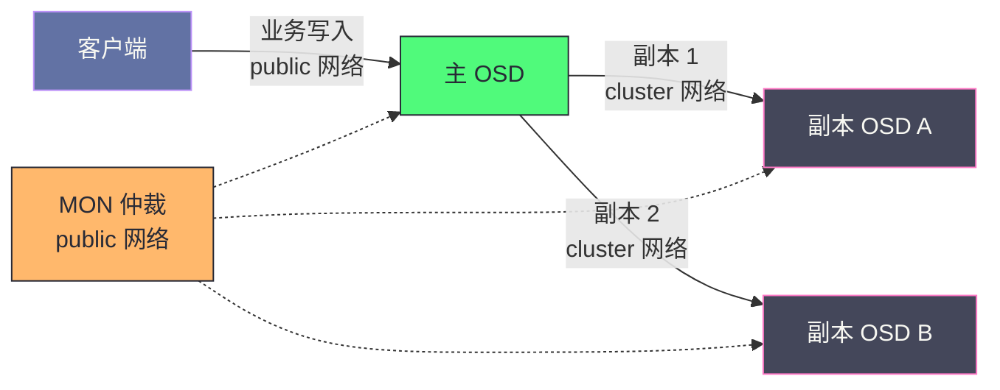
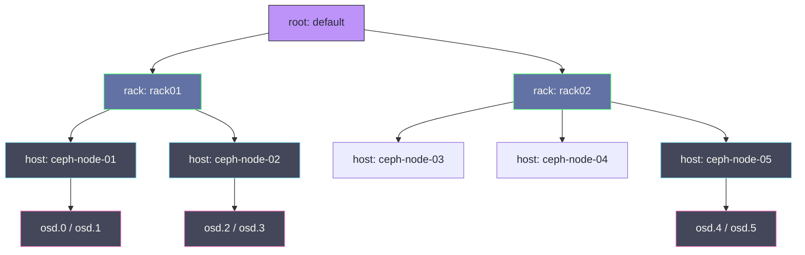

# 10 集群部署实战——cephadm 与生产规格设计

**摘要：**

部署一个 Ceph 集群，表面上是把软件装到一组机器上，实质是把一份架构决策书翻译到物理世界——cephadm 能替你收敛状态，但不能替你决定"状态应该是什么"。本文回答两个问题：其一，部署工具为何从 ceph-deploy、ceph-ansible 一路演进到 cephadm，容器化与声明式究竟买到了什么、又付出了什么；其二，在生产规格设计（硬件、网络、容量三本账）与部署落地（bootstrap、节点纳管、MON/MGR 放置、OSD 添加、CRUSH 拓扑、Pool 初始化与权限最小化）两条线上，每一个决策背后的权衡是什么。行文从部署工具的二十年更替史讲起，继而展开规格设计的账本，随后走完 cephadm 从引导到验收的完整流程，最后落到部署后基线——性能压测、健康存档与文档化，让集群在投产第一天就留下一张"健康的照片"，供日后每一次排障对照。

---

## 第 1 章 部署方式的演进——从菜谱到机器人厨师

在 Ceph 二十年的历史里，部署这件事换过至少四套做法，工具的更替史就是一部"运维知识如何被封装"的历史。要看懂 cephadm 为什么长成今天这个样子，得先回到它所取代的东西——每一种新工具都不是凭空发明的，而是对上一代工具痛点的直接回应。

### 1.1 脚本时代：ceph-deploy 与它的黄昏

2006 年，Sage Weil 在 OSDI 会议上发表 Ceph 论文时，这个系统离"好部署"还很远：早期的 mkcephfs 工具只能在一台机器上拉起一套演示集群，把 Ceph 铺到几十台服务器上，靠的是逐台登录、逐行改配置的手工活。分布式存储的部署难，难在它不是"装一个软件"，而是"组建一个会自己照顾自己的组织"——MON 要成环、OSD 要认盘、密钥要分发、拓扑要标注，任何一台机器的配置偏差，都会在未来的某一天以故障的形式讨还利息。

2012 年前后，社区拿出了 ceph-deploy：它通过 SSH 批量登录节点，推送软件包与配置文件，把"装一个集群"从数天的手工活压缩到半小时的命令序列。你不妨把它理解成一份菜谱——照着步骤做，确实能出锅，但火候全靠厨师自己掌握：ceph-deploy 只负责"装到位"，装完之后的配置漂移、守护进程崩溃、版本升级，它一概不管。**它是一个安装器，而不是一个管理者**，集群的生命周期一旦展开，它就退场了。

这份菜谱的黄昏来得并不突然。ceph-deploy 长期不管理守护进程的运行时状态，不支持复杂的生产拓扑，社区在文档里给它盖棺定论：不再积极维护、未在 Nautilus 之后的任何版本上测试、不支持 RHEL 8 与 CentOS 8 及更新的操作系统。2021 年，ceph-deploy 的代码仓库被 Ceph 指导委员会正式归档——一个曾经几乎人手一份的工具，就此退出历史舞台。

### 1.2 ceph-ansible：把经验固化成 Playbook

第二步演进发生在 2015 年前后：Red Hat 在 2014 年收购 Inktank 接手 Ceph 之后，主推 ceph-ansible 作为商业发行版（RHCS）的安装基线。它把社区多年积累的部署经验固化成 Ansible 的角色（Role）与任务（Task），带来了两个 ceph-deploy 不具备的性质：幂等性（同一份 Playbook 重复执行，结果收敛一致）与批量编排（滚动安装、滚动升级有了框架）。

不过 Playbook 路线的天花板也很明显。ceph-ansible 的变量矩阵庞杂，一个生产级 group_vars 动辄数百个变量，改一个参数要在文档里翻半天；它对最新 Ceph 版本的适配总是慢半拍，上游版本发布了，Playbook 的支持还在路上；更根本的是，它仍然只在"部署那一刻"介入——集群跑起来之后状态漂移了，Ansible 并不知情，除非你再跑一遍 Playbook，而那可能带来意料之外的重启。运维知识被固化进了 Playbook，但固化的是"怎么装"，而不是"应该是什么样"。

### 1.3 cephadm：声明式与容器化

转折点出现在 2020 年 3 月：Ceph Octopus（15.2.0）发布，cephadm 首次亮相；2021 年的 Pacific（16.2.0）起，官方文档把 cephadm 列为唯一推荐的安装方式，ceph-deploy 的文档随后被移除。cephadm 的设计思路与 Kubernetes 的 Operator 模式同构：你用一份 YAML 服务规格（Service Specification）声明期望状态——哪些主机、哪些角色、哪些磁盘——cephadm 通过 SSH 登录各节点，在容器（Podman 或 Docker）里拉起守护进程，并持续把实际状态收敛到期望状态。进程挂了，容器被重新拉起；规格改了，集群滚动地收敛过去。

延续上一节的厨房比喻：ceph-deploy 是菜谱，ceph-ansible 是预制菜料理包（步骤固化，但换口味要换整套料理包），cephadm 则是一台机器人厨师——你只下一张订单（spec），采购（拉取镜像）、烹饪（拉起容器）、补货（进程退出自动拉起）都由它完成，而且订单可以随时修改，它自己消化差异。三代工具的差异可以放进一张表里看：

| 维度 | ceph-deploy | ceph-ansible | cephadm |
| :--- | :--- | :--- | :--- |
| 出现时间 | 2012 年前后 | 2015 年前后 | 2020 年（Octopus） |
| 部署模型 | 命令式安装脚本 | 命令式 Playbook（幂等） | 声明式 spec + 控制器收敛 |
| 软件形态 | 裸软件包（apt/yum） | 裸软件包 | 容器（Podman/Docker） |
| 生命周期管理 | 仅安装 | 安装与升级 | 安装、扩缩容、升级、自愈 |
| 状态感知 | 无 | 无（重跑才有） | 持续比对期望与实际 |
| 现状 | 2021 年仓库归档 | 维护中，版本适配滞后 | 官方唯一推荐（Pacific 起） |


### 1.4 容器化的收益与代价

cephadm 的第二个支柱是容器化：每个 Ceph 守护进程运行在独立容器里，依赖库与宿主机完全隔离。这笔交易买到的东西很实在——升级从"换软件包"变成"换镜像标签"，cephadm 按守护进程逐个滚动替换；同一台宿主机可以并存多个版本的容器，为灰度与测试提供了便利；宿主机操作系统与 Ceph 的依赖彻底解耦，操作系统升级不再牵动存储栈。

但代价也要摆上桌面。其一，cephadm 依赖容器运行时（Podman 或 Docker）与 root 权限的 SSH 通道，这条通道既是管理面也是安全面，密钥的保管与审计要纳入规范；其二，气隙（Air-gapped）环境必须自建镜像仓库，把上游镜像同步进来，否则引导这一步都迈不出去；其三，排障多穿了一层容器——日志要看 `cephadm ls` 与 `journalctl` 的组合，老一代"直接翻 /var/log/ceph"的肌肉记忆需要更新。还要补一句边界：cephadm 并非唯一解，Kubernetes 环境里有 Rook 这样的 Operator 把 Ceph 跑进 K8s 集群，那是另一种运维形态的选择；工具没有高下，只有与团队运维形态的匹配。

> [!note] 设计哲学：部署工具的演进史，是运维知识的封装史
> ceph-deploy 把知识留在运维的脑子里，ceph-ansible 把知识固化进 Playbook，cephadm 把知识交还给集群自己——期望状态写在 spec 里，收敛机制长在控制器里。**每一次更替，都是把"人脑里的隐性知识"翻译成"系统里的显性机制"**。但翻译有边界：spec 能声明"装什么、装在哪"，声明不了"为什么是这些硬件、这几张网"——那是下一章的事。

### 1.5 不这样会怎样——没有收敛机制的集群会漂成什么样

不妨做个反事实推演：假设我们仍用 ceph-deploy 装一个 50 节点的集群，此后三年会发生什么。第一年风平浪静，配置与文档一致；第二年，某台机器换过一块盘、某个节点的配置文件被紧急处理时手工改过一行、某次扩容绕过了流程——集群开始"雪花化"，每台机器都长出自己的个性；第三年，一次版本升级前，你得先花两周盘点"到底哪些机器和文档不一样"，因为没有人再敢假设文档是对的。配置漂移（Configuration Drift）是运维的经典病灶，它的可怕之处在于无声：每一处偏差单看都情有可原，叠加起来却让集群变成一群无法预测的雪花节点。

声明式工具的解法是把期望状态存在集群里、由控制器持续对账——漂移要么被自动纠正，要么在 `ceph orch ps` 的输出里现形。这不是工具信仰，而是规模定律：50 台机器乘以 3 年，是数万次配置变更的累积，人脑对不了这个账。

> [!info] 核心概念：声明式的本质是"对账"
> 命令式工具回答"怎么装"，声明式工具回答"应该是什么样"并持续对账。前者把一致性寄托在人的纪律上，后者把一致性内置进系统。集群规模越大、生命周期越长，后者的优势越明显；反过来，三节点的小实验环境用命令式反而更轻快——工具的收益与规模成正比，这条规律贯穿本章。

---

## 第 2 章 生产规格设计——把架构决策翻译到物理世界

如果说部署工具解决的是"怎么装"，规格设计回答的则是"装成什么样"——这是任何自动化都无法代劳的部分。cephadm 的声明式 spec 只是一张表格，表格里每一格填什么数字：几块盘、什么介质、几张网、留多少水位，全部来自对自身负载与预算的判断。本章把规格设计拆成三本账：硬件账决定集群的性格，网络账决定流量的秩序，容量账决定恢复的余地。三本账的共同点是，它们都是权衡题而不是计算题——公式只提供起点，落点永远在业务形态与预算的夹缝里。

### 2.1 介质选型：跑车与重卡的分工

规格设计的第一本账是硬件。Ceph 生产集群的介质选择，不妨想象成组建一支车队：NVMe SSD 是跑车，响应快、单价高，适合虚拟机磁盘与数据库这类对延迟敏感的负载；SATA HDD 是重卡，容量大、单价低，适合对象存储归档、备份这类吞吐型负载；SATA SSD 介于两者之间，常在预算受限时充当全闪的替代。BlueStore 的"一盘一 OSD"模型（见 [[中间件/Ceph/04 OSD 与 BlueStore——存储引擎深度解析|04 BlueStore 篇]]）让介质的选择直接决定了集群的性格：**介质定，则延迟分布、恢复速度、故障域大小统统随之而定**。

| 负载场景 | 数据盘 | WAL/DB 布局 | 说明 |
| :--- | :--- | :--- | :--- |
| 虚拟机桌面云、K8s 持久卷 | NVMe SSD | 与数据盘共置分区 | 随机 IOPS 是第一指标 |
| 数据库、交易类负载 | 高端 NVMe | 共置 | P99 延迟敏感，宁缺毋滥 |
| 通用文件共享、视频流 | SATA HDD | 独立 NVMe 做 DB/WAL | 混闪性价比方案 |
| 对象存储归档、备份 | 大容量 SATA HDD | 独立 SSD 或共置 | 吞吐优先，延迟宽容 |
| 小规模起步（3-5 节点） | SATA SSD | 共置 | 平衡成本与体验 |

选型时还有一层容易被忽略的耦合：介质决定 CRUSH 设备类别（device class）。BlueStore 部署时会自动把盘归入 hdd、ssd、nvme 三类，后续的 CRUSH rule 可以按类别圈定数据落点——这意味着混闪集群可以在同一个集群里划出"全闪池"与"混闪池"，让不同业务各取所需。介质规划从第一天就要想清楚池的划分，事后把数据在池间搬迁，代价远高于开局定好。

反例值得记两个。其一，用全 NVMe 集群承接归档备份，IOPS 大量闲置、单位容量成本翻倍，是典型的"性能过剩"；其二，用纯 HDD 承接虚拟机桌面，随机写延迟在业务高峰突破两位数毫秒，DB/WAL 独立盘也救不回来——介质选错了，后面的调优都是在给错误买单。选型的起点永远是负载画像（读写比例、对象大小、延迟要求），而不是介质价格表。

### 2.2 WAL 与 DB 独立盘：给重卡配一辆摩托开道

BlueStore 的写路径里有两个角色值得在部署期就安排好位置：写前日志（Write-Ahead Log, WAL）负责把写操作的"保护性落盘"先做掉，RocksDB 承载对象元数据（原理详见 [[中间件/Ceph/04 OSD 与 BlueStore——存储引擎深度解析|04 BlueStore 篇]]）。两者默认与数据共用一块盘，此时 HDD 的随机写延迟就成了整条写路径的下限；把 WAL 与 DB 挪到一块独立的 NVMe 上，相当于给重卡配了一辆摩托开道——大宗货物仍走 HDD，但每一次"确认收到"的信号与元数据查询都由闪存代劳，随机写延迟的改善常常立竿见影。

配比是这门手艺的核心。社区经验里，DB 分区取数据盘容量的 1%-4%：顺序大 IO 为主、覆盖写少的负载取低值；小对象密集、写放大重的负载取高值。一块 16TiB 的 HDD，常见搭配是 128-256GiB 的 DB 分区；WAL 分区通常 1-4GiB 即可（默认值在 1GiB 量级，WAL 只暂存写路径的短暂数据，很快被整理进 DB 与数据盘）。一块 3.2TiB 的 NVMe 按 slots 拆分，可以伺候 8-12 块 HDD。

| 布局 | 适用场景 | 收益 | 代价 |
| :--- | :--- | :--- | :--- |
| 共置（单盘分区） | 全闪集群、小规模 | 无跨盘依赖，故障域干净 | HDD 上随机写弱 |
| DB/WAL 独立 NVMe | HDD 数据盘 | 随机写延迟大幅改善 | NVMe 故障殃及全部挂靠 OSD |
| WAL 再独立于 DB | 极端写密集 | 写路径再分流 | 收益边际递减，多数场景不必要 |

独立盘的代价同样要写进账本：一块 NVMe 一旦故障，挂靠在它上面的所有 OSD 同时失效，等于把故障域从"一块盘"放大到"一块 DB 盘及其全部租户"。因此 DB/WAL 盘必须选企业级 NVMe（带掉电保护电容、高耐用度 DWPD），挂载数量要克制，宁可多买一块 NVMe 少挂几块盘，也不要把十几个 OSD 的元数据押在同一块盘上。反例同样存在：全 NVMe 集群里，WAL/DB 与数据共盘分区即可，再买独立盘做 WAL 纯属浪费——介质相同时，分离只剩故障域耦合的坏处，没有性能的好处。

反事实地想一下共置布局下 HDD 的处境：一次 4K 随机写到达，BlueStore 要先写 WAL（一次随机写）、再更新 RocksDB 元数据（又一次随机写）、最后把数据落进主存储区（第三次随机写），磁头在盘片上来回寻道，单次操作延迟轻松突破 20 毫秒，虚拟机的磁盘队列瞬间堆积。独立 NVMe 把前两步挪到闪存上，HDD 只剩顺序化的数据落盘，延迟曲线立刻平稳。这就是"给重卡配摩托"的完整含义：不是让重卡跑得更快，而是让等待确认的信号不再堵在重卡的车道上。

### 2.3 内存预算：每块 OSD 的账单

第二本账是内存。BlueStore 的缓存是自适应的：`osd_memory_target`（默认 4GiB）给每个 OSD 划了一条内存预算线，BlueStore 在线内动态分配给 RocksDB 页缓存与对象数据缓存。部署期的账单公式很朴素：节点内存 ≈ OSD 数 × osd_memory_target + 混部角色（MON/MGR）的预算 + 系统余量（4-8GiB）。一台 24 盘 NVMe 节点，按 24 × 4GiB 起算就是 96GiB，加上系统余量，128GiB 是起步配置；HDD 集群可以把 target 下调到 3GiB 左右，全闪高并发场景则建议上调到 4-6GiB。

反方向的教训也值得记一笔：为了省内存把 target 压得过低，RocksDB 拿不到足够缓存，读元数据要反复落盘，写放大随之飙升——盘的寿命与延迟双双恶化，省下的内存钱会加倍还回去。内存预算宁可略宽，也不要贴着下限跑。

把账算一遍更直观。一台 24 盘 NVMe 节点，若 `osd_memory_target` 保持默认 4GiB，OSD 侧预算就是 96GiB；若该节点还混部一个 MON（8GiB）与 MGR（4GiB），加上系统余量 8GiB，总需求约 116GiB——128GiB 内存是及格线，256GiB 才算从容。反过来，一台 12 盘 HDD 节点，OSD 侧按 3GiB 计是 36GiB，混部 MON 后 56GiB 左右，64GiB 起步。内存是硬件账单里最不该省的一行：它的缺口不会立刻爆发，而是以写放大与延迟毛刺的形式慢性失血。

### 2.4 MON、MGR 与 MDS：控制面的规格

控制面角色的规格常被低估。MON 把整张集群地图常驻内存，PG 数量上到数十万时内存占用以 GiB 计，因此 MON 节点要配 SSD 系统盘、8GiB 以上内存，并且不与高 IO 的 OSD 节点混部——MON 卡顿会拖慢全集群的地图更新与心跳仲裁（详见 [[中间件/Ceph/03 Monitor 与集群地图——Paxos、Quorum 与 MON 运维|03 Monitor 篇]]）。MGR 是 MON 的影子搭档，负责承载 dashboard、prometheus 等模块，active/standby 成对部署，通常与 MON 混部，规格随 MON。MDS 是 CephFS 的元数据引擎，元数据缓存极吃内存，生产环境每个文件系统至少两个实例（一个 active、一个 standby），16GiB 内存起步。

| 角色 | 数量建议 | 规格建议 | 说明 |
| :--- | :--- | :--- | :--- |
| MON | 3 或 5（奇数） | 8GiB+ 内存 / SSD 系统盘 / 万兆网 | 跨故障域分布 |
| MGR | ≥2，与 MON 混部 | 同 MON | active/standby，跑管理模块 |
| MDS | ≥2/文件系统 | 16GiB+ 内存 / 4 核+ CPU | 元数据缓存吃内存 |
| RGW | 按并发横向扩展 | 8GiB+ / 万兆网 | 无状态，可加节点扩容 |

MDS 的规格还有一层特殊性：它的性能与内存强相关，元数据缓存命中率直接决定目录遍历与文件创建的延迟，因此 MDS 节点的内存宁大勿小；同时 MDS 是单 active 模型，一个文件系统同一时刻只有一个 MDS 在干活，CPU 规格要按峰值元数据负载给足，而不是按平均值摊。

MON 要不要与 OSD 节点混部，是小集群的经典问题。3-5 节点的集群，独立 MON 节点的成本占比过高，混部是现实选择，但要把 MON 的内存与 IO 预算从 OSD 的账单里扣出来，并尽量挑集群里 IO 最闲的节点；10 节点以上的集群，MON 独立成节点（或与跳板、监控等低 IO 角色同宿）更稳妥——MON 的延迟毛刺会传导给全集群的地图更新，不值得为省一台机器去赌。

### 2.5 网络设计：客运与货流分离

第三本账是网络。Ceph 默认只有一张 public network，客户端流量、MON 通信、OSD 间复制全挤在一起；生产集群应当把 OSD 之间的复制与恢复流量拆到独立的 cluster network。道理可以用高速公路的客货分流来讲：客运车道（public）保延迟，货运车道（cluster）保吞吐，混在一起，一辆抛锚的重卡就能把整条路堵死——一块盘故障引发的恢复洪峰，足以让同网的客户端请求集体变慢，slow ops 告警此起彼伏。

带宽要按"放大系数"来算。三副本下，客户端写一个单位的数据给主 OSD，主 OSD 还要向两个副本各转发一份，**cluster 网上的流量是客户端写入的两倍**；纠删码池的放大率反而低一些——8+3 的条带，主 OSD 收到数据后编码出 11 个分片、自己留 1 个、外发 10 个，每个分片是数据的八分之一，合计约 1.25 倍。但请注意，EC 省下的网络流量会以 CPU 编码开销与恢复时读 k 份数据的形式还回来。恢复（Recovery/Backfill）流量默认也走 cluster 网，与业务流量同池竞争，这是带宽估算里必须预留的余量。



| 节点类型 | public 网络 | cluster 网络 | 估算依据 |
| :--- | :--- | :--- | :--- |
| 全闪 OSD 节点 | 25GbE | 100GbE 或 2×50G bond | 写吞吐 × 2 倍放大 + 恢复余量 |
| 混闪 OSD 节点 | 10/25GbE | 25GbE | 盘是瓶颈，网留余量 |
| MON / MGR | 10GbE | — | 与 public 同网 |
| 客户端 / 网关节点 | 10-25GbE | — | 按业务带宽 |

举例来说：全闪节点若 public 配 25GbE、写吞吐按 3GB/s 计，cluster 网就要吃下约 6GB/s（48Gbps），单口 25GbE 已经不够，得上 100GbE 或双口 bond；HDD 节点的写吞吐瓶颈在盘（12 盘节点约 1-1.5GB/s），10GbE cluster 网够用，但恢复窗口会拉长，预算宽裕时同样建议 25GbE 起步。

反事实推演一下单网集群的一天：上午十点业务高峰，客户端流量吃掉万兆网的大半；十点半一块 HDD 故障，恢复流量涌入同一张网，客户端延迟从 5ms 爬到 200ms，slow ops 告警刷屏；你调低恢复限速，恢复窗口从 4 小时拉长到 12 小时，期间 PG 一直处于降级状态，再坏一块盘就可能丢数据。这张网的问题不在带宽绝对值不够，而在两类流量没有隔离——客货混行，谁慢都怪不得别人。

### 2.6 容量规划：raw、可用与水位

最后一本账是容量，也是最容易算错的一本。厂商标称的 raw 容量要经过三道折损才是业务真正可用的空间：第一道是冗余，三副本除以 3，纠删码 8+3 乘以 8/11（约 72.7%），4+2 乘以 4/6（约 66.7%）；第二道是文件系统与 BlueStore 自身的元数据开销（约几个百分点）；第三道是水位预留——Ceph 的空间阈值按每块 OSD 独立判定，85% 开始告警、90% 暂停回填、95% 拒绝写入，运营水位必须压在告警线之下。

| 水位 | 默认阈值 | 集群行为 | 运维动作 |
| :--- | :--- | :--- | :--- |
| 70%-75% | 运营启动线（自定） | 一切正常 | 启动扩容规划与采购 |
| 85% | nearfull | 告警，仍可读写 | 立即扩容或清理数据 |
| 90% | backfillfull | 暂停 Backfill | 恢复受阻，需人工介入 |
| 95% | full | 拒绝写入（只读） | 事故状态 |

为什么 85% 不是一条可以贴着走的线？因为恢复需要腾挪空间：一块 OSD 故障后，它承载的数据要迁往其他 OSD，若集群已经八成满，接收方自己都逼近 nearfull，恢复就推不动了；HDD 大集群的再均衡以天计，水位更要留足。反过来，全闪小集群恢复以小时计，水位可以适当收紧。**85% 是默认告警线，不是容量规划的终点线**——规划时应当以"故障一块盘甚至一个机架后，剩余空间仍够恢复"为约束反推运营水位。

把一个具体集群的账算一遍：12 台节点、每台 12 块 16TiB HDD，raw 容量 2304TiB。三副本方案冗余后约 768TiB，扣掉元数据开销与水位预留，业务可放心使用的大约 560TiB；换成 EC 8+3，冗余后约 1675TiB，扣完之后约 1220TiB——同样的硬件，可用容量差出一倍多，但代价是随机写不可用与恢复成本翻倍。容量规划的最后一步是把增长曲线放进来：按业务年增 30% 算，今天的 75% 水位就是两年后的满仓，扩容的采购周期（往往两三个月）必须压在曲线前面，而不是等告警响了才启动。

| 项目 | 三副本 | EC 8+3 |
| :--- | :--- | :--- |
| raw 容量 | 2304TiB | 2304TiB |
| 冗余折算后 | 约 768TiB | 约 1675TiB |
| 元数据开销后（约 3%） | 约 745TiB | 约 1625TiB |
| 85% 告警线内 | 约 635TiB | 约 1380TiB |
| 建议运营水位（75%）内 | 约 560TiB | 约 1220TiB |

| 冗余策略 | 可用比例（占 raw） | 恢复成本 | 适用场景 |
| :--- | :--- | :--- | :--- |
| 三副本 | 约 33% | 读 1 写 2，恢复快 | RBD、CephFS 等随机写负载 |
| EC 8+3 | 约 72.7% | 恢复读 8 份重编码 | RGW 归档、冷数据 |
| EC 4+2 | 约 66.7% | 同上，条带更小 | 中小规模 EC 场景 |

纠删码的隐藏代价要在选型时讲清：EC 池不支持随机覆盖写（改一个对象要重算整个条带），RBD 这类随机写负载需要"副本池承接写、EC 池做冷存"的分层结构；EC 恢复要读 k 份数据重新编码，恢复成本高于副本。EC 适合"写一次、读多次"的对象与归档场景，不适合当万能池。另外别忘了精简配置（Thin Provisioning，见 [[中间件/Ceph/07 RBD 块存储——快照、克隆与 Kubernetes CSI|07 RBD 篇]]）的账面陷阱：卷分配了 100TB 不代表用了 100TB，容量监控要看 `ceph df` 的实存与增速，而不是业务侧的账面分配。

还有一点常被忽略：容量账不是部署时算一次就完事的。快照、克隆、RGW 的版本控制，都会让实际占用偏离规划时的假设；每季度把 `ceph df` 的实存增速与当年的规划曲线对一次账，偏差超过一成就该重算水位与扩容时点——容量规划是持续的对账，不是一次性的填表。

> [!warning] 生产避坑：三本账要放在一起算
> 硬件、网络、容量不是三个独立的选择题：介质决定 IOPS 与延迟，网络要按介质能打出的吞吐乘以放大系数来配，水位要按最慢介质的恢复速度来留。任何一本单独优化都会失衡——全闪集群配 10GbE 单网，等于给跑车修了条乡道；HDD 大集群把水位拉到 90%，等于在悬崖边停车。

---

## 第 3 章 cephadm 部署实战——从 bootstrap 到验收

### 3.1 bootstrap：种下第一颗种子

规格定稿，进入落地。cephadm 的第一步是引导（bootstrap）：在选定为首 MON 的节点上执行一条命令，cephadm 会拉起第一个 MON 容器、生成集群配置与管理密钥、启用 Dashboard（默认 8443 端口，管理员密码在输出里给出），并把集群的 SSH 公钥写入本机的 `/etc/ceph/ceph.pub`。

```bash
# 在第一个 MON 节点上引导集群
# cluster-network 承载副本复制与恢复流量，务必与业务网分离
cephadm bootstrap \
  --mon-ip 10.0.0.11 \
  --cluster-network 10.0.1.0/24
```

此刻的集群像一颗刚入土的种子——能活，但经不起风雨：只有一个 MON，quorum 尚未成形，任何风吹草动都会让它失联。因此 bootstrap 之后的第一件事，就是把 MON 补成奇数个并分散到故障域里去。两个细节值得提前注意：主机名默认要求短主机名（不带域名），用 FQDN 需加 `--allow-fqdn-hostname`；`--cluster-network` 要在引导时就给对，事后改网络是伤筋动骨的大手术。

bootstrap 的产出物值得逐一点验：`/etc/ceph/ceph.conf`（最小化的集群配置）、`/etc/ceph/ceph.client.admin.keyring`（管理员密钥）、`/etc/ceph/ceph.pub`（待分发的 SSH 公钥），以及一个已经跑起来的 MON 容器与 Dashboard。验证只需两条命令：`cephadm ls` 看容器是否健康，`ceph -s` 看集群是否应答——此刻的输出里 MON 只有一个，health 大概率带着告警，这是正常的，骨架还没立起来。

顺带一提，bootstrap 还有一个 `--single-host-defaults` 选项，把全部守护进程收进一台主机，适合快速搭实验环境——但它让 MON 与 OSD 挤在同一台机器上，故障域完全重叠，生产环境严禁使用。

### 3.2 节点纳管：SSH 通道与标签

其余节点入伙分两步：先把公钥分发过去，再向编排器（Orchestrator）登记。

```bash
# 第一步：分发集群 SSH 公钥（cephadm 靠它登录各节点）
ssh-copy-id -f -i /etc/ceph/ceph.pub root@10.0.0.12
ssh-copy-id -f -i /etc/ceph/ceph.pub root@10.0.0.13

# 第二步：纳管节点并打标签
ceph orch host add ceph-node-02 10.0.0.12 --labels=_admin
ceph orch host add ceph-node-03 10.0.0.13 --labels=_admin
ceph orch host ls   # 确认全部节点在线
```

`_admin` 标签有特殊语义：cephadm 会向打了这个标签的节点维护 `/etc/ceph/ceph.conf` 与 `client.admin` 密钥的副本，通常只给运维跳板与 MON 节点打，别全集群乱打——admin 密钥撒得越广，误操作的面就越大。标签同时是服务放置的抓手：给节点打上 `mon` 标签后，`ceph orch apply mon --placement="label:mon"` 就会按标签调度 MON。节点多了以后，推荐用主机清单（host spec）统一纳管，`location` 字段还能顺带把 CRUSH 位置一起声明：

```yaml
service_type: host
hostname: ceph-node-01
addr: 10.0.0.11
labels:
  - _admin
location:
  root: default
  rack: rack01
```

节点多时逐台 `host add` 容易漏，把全部主机写进一份 host spec、一次 `ceph orch apply -i hosts.yaml` 纳管，清单本身也就成了拓扑文档的一部分——主机入树与机架标注（3.5 节的 location 字段）一次完成，日后扩容时照着改这份 YAML，比翻命令历史可靠得多。

### 3.3 MON 与 MGR 的放置：奇数与跨故障域

MON 用 Paxos 维护集群地图，写入需要过半数成员（quorum）同意，因此数量必须为奇数：3 个是标准答案，5 个用于跨机房或 MON 节点本身不甚稳定的场景。放置策略比数量更要紧：三个 MON 全放一个机架，机架电源一抖，全集群失联——**MON 应当跨机架（小集群至少跨供电）分布**。MGR 是管理模块的宿主，dashboard 与 prometheus 都跑在 active MGR 上，成对部署、与 MON 混部是通行做法。MON 数量也不是越多越好：成员越多，每次地图更新的协商成本越高，"更稳"与"更灵"之间，3 个是绝大多数集群的平衡点。

> [!info] 核心概念：quorum 丢一半，集群就"存疑"
> MON 过半数不可用时，集群地图无法更新，客户端拿不到新的 OSD map，整个集群进入事实上的冻结状态——数据都在盘上，但谁也不敢动。这正是 MON 跨故障域放置被列为部署硬性检查项的原因（MON 的 Paxos 机制与抖动处理见 [[中间件/Ceph/03 Monitor 与集群地图——Paxos、Quorum 与 MON 运维|03 Monitor 篇]]）。

不同规模的集群，MON 的放置策略可以收敛成一张小表：

| 集群规模 | MON 数量 | 放置建议 |
| :--- | :--- | :--- |
| 3-5 节点 | 3 | 与 OSD 混部，跨节点分布（至少跨供电） |
| 6-20 节点 | 3 | 独立节点或与低 IO 角色同宿，跨机架 |
| 20 节点以上 | 3 或 5 | 独立节点，跨机架，是否跨机房按 RPO 而定 |

MGR 的放置比 MON 宽松：它不参与 quorum，挂掉一个只是管理功能降级，因此与 MON 混部、每台 MON 节点各放一个 MGR 是通行做法。唯一要留意的是 active MGR 承载着 dashboard 与监控模块的内存开销，规格别按"空载守护进程"估算——监控面板卡顿事小，prometheus 模块吃内存拖累同宿的 MON 事大。

### 3.4 OSD 添加：精确清单与见盘就收

OSD 是集群的肌肉，添加方式的选择直接决定日后每一次扩容的秩序。cephadm 给了两条路：`--all-available-devices` 一句话把所有"可用设备"全部做成 OSD；或者用驱动组（Drive Group）spec，按过滤条件精确圈定哪些盘做数据、哪些做 DB/WAL。

```bash
# 查看各节点设备与"可用"判定
ceph orch device ls

# 方式一：自动吞掉所有可用盘（生产慎用）
ceph orch apply osd --all-available-devices

# 方式二：驱动组 spec 精确指定（生产推荐）
ceph orch apply -i osd-spec.yaml
```

```bash
$ ceph orch device ls
HOST          PATH         TYPE  SIZE  AVAILABLE  REFRESHED
ceph-node-01  /dev/sda     hdd   16T   False      12s ago
ceph-node-01  /dev/sdb     hdd   16T   True       12s ago
ceph-node-01  /dev/nvme0n1 ssd   3.2T  True       12s ago
```

AVAILABLE 一列是 cephadm 的判定结果：无分区、无文件系统、未挂载、未被 LVM 占用的盘才算"可用"。它防得住"误用已用盘"，防不住"误吞待用盘"——后者正是驱动组清单要堵的口子。

```yaml
# osd-spec.yaml：HDD 做数据、NVMe 做 DB/WAL 的混闪驱动组
service_type: osd
service_id: hdd-osds
placement:
  host_pattern: "ceph-node-*"
data_devices:
  rotational: 1        # 只选机械盘
  size: "14T:18T"      # 容量在 14-18TiB 之间
db_devices:
  rotational: 0        # DB/WAL 落在固态上
  size: "800G:"        # 800GiB 以上的 NVMe
```

`--all-available-devices` 的风险在于"自动"二字：它声明的是一条常驻规则，而非一次性动作——日后任何新插入的、被判定为"可用"的盘（无分区、无文件系统、未被占用），都会被自动做成 OSD。这既是便利也是隐患：你留给操作系统或日志的裸盘、准备挪作他用的测试盘，都可能在某个深夜被悄悄吞掉。过滤条件（vendor、model、size、rotational）与 `unmanaged` 标志（`ceph orch apply osd --all-available-devices --unmanaged=true`，声明后新盘不再自动纳管）可以把口子收紧，但笔者更建议生产集群从一开始就用驱动组写精确清单：哪些盘做数据、哪些做 DB、按什么规则匹配，白纸黑字落在 YAML 里，既防误吞，也让半年后的你看得懂当初的决策。

### 3.5 CRUSH 拓扑落地：把机架写进集群地图

cephadm 默认把主机挂到 `default` 根下，CRUSH 树只有 root > host > osd 三层，故障域是主机。生产集群要在灌数据之前把机架层补上——CRUSH 树是集群的通讯录地址，快递单上只写到门牌号、不写省市区，机架级故障就会让三副本同时失联（放置算法的原理见 [[中间件/Ceph/02 CRUSH 算法——去中心化的数据放置|02 CRUSH 篇]]）。



落地有两条路：其一，在 3.2 的 host spec 里用 `location` 字段声明初始位置，cephadm 纳管主机时会把主机桶直接建在对应机架之下——注意官方文档的明确提醒，`location` 只影响初始位置，后续修改该字段会被忽略；其二，对已入树的主机用 `ceph osd crush move` 手动调整。拓扑定好后，创建按机架隔离的 CRUSH rule 并绑定到池：

```bash
# 创建 rack 级故障域的副本 rule，并应用到池
ceph osd crush rule create-replicated replicated-rack default rack
ceph osd pool set my-rbd-pool crush_rule replicated-rack
```

混闪集群还要留意设备类别（device class）与 rule 的配合：创建 rule 时在末尾指定类别（譬如 `ceph osd crush rule create-replicated ssd-rule default host ssd`），数据就只会落在该类介质上，"全闪池"与"混闪池"由此在同一集群里各安其位。类别是 BlueStore 部署时自动归类的，但换盘时若介质类型变了，类别要手动校正，否则 rule 的圈定会悄悄出错。

拓扑写完要验证：`ceph osd tree` 看树形结构与机房实物是否一致，`ceph osd crush tree --show-shadow` 看各类介质的影子树，再用 crushtool 对编译后的 CRUSH map 做一次模拟（`--test`），抽样确认 PG 的映射确实跨机架分布——拓扑错误在空载时无声无息，等数据灌满再发现，代价就是一次全量再均衡。

时机是这一节的关键词：拓扑与 rule 要在灌数据之前定好。空载集群调整 CRUSH 几乎没有代价，而一旦数据落满，再移动主机桶就是全量再均衡——以 PB 计的数据搬迁会把集群拖进数天的恢复窗口，业务延迟与恢复流量互相踩踏。**拓扑是部署期的一次性决策，不是运维期的补救手段**。

### 3.6 部署验收清单

部署完成的标志不是"命令都跑完了"，而是集群通过一组可复核的检查。笔者把验收拆成四层：健康层（HEALTH_OK、quorum 成形、OSD 全部 up/in）、拓扑层（机架归属正确、rule 生效）、数据层（PG 全部 active+clean、分布偏差可接受）、管理面（Dashboard 可登录、监控指标可抓取）。

| 层 | 检查项 | 命令 | 期望 |
| :--- | :--- | :--- | :--- |
| 健康 | 整体状态 | `ceph -s` | HEALTH_OK |
| 健康 | MON quorum | `ceph quorum_status` | 3 或 5 个成员在位 |
| 健康 | OSD 状态 | `ceph osd tree` | 全部 up / in |
| 拓扑 | 故障域归属 | `ceph osd tree` | rack 归属与实物一致 |
| 拓扑 | rule 生效 | `ceph osd pool get <pool> crush_rule` | 指向新建 rule |
| 数据 | PG 状态 | `ceph pg stat` | 全部 active+clean |
| 数据 | 空间分布 | `ceph osd df` | 各 OSD 占用偏差极小 |
| 管理面 | Dashboard | 浏览器登录 8443 | 可登录、无告警项 |

跳过验收的代价不会立刻出现，但会在最不合适的时刻出现：拓扑标错的机架，要等到一次机架级断电才会现形——三副本同时失联，PG 全体降级；没验证的 rule 可能让副本全落在同一台主机上，单机故障直接丢数据；没跑过的冒烟压测，会把 WAL/DB 布局的错误藏到业务上线那天。验收清单的意义不在流程仪式，而在把"部署者的假设"逐条变成"集群的事实"。验收结果本身也要存档：`ceph -s`、`ceph osd tree`、`ceph osd df` 的输出连同冒烟压测数据一起归入部署档案——三个月后集群出问题时，这份"出厂记录"是排查的第一参照。

---

## 第 4 章 Pool 与服务初始化——从裸集群到可用平台

### 4.1 Pool 创建规范：autoscaler、rule 与配额

裸集群只是把地平整了，Pool 才是业务落脚的楼层。创建 Pool 的规范动作包含四件事：绑定 CRUSH rule（决定数据落在哪些故障域）、设置 pg_autoscale_mode、声明目标容量、按需挂配额。

```bash
# 创建池：pg_num 留小值，交给 autoscaler 成长；绑定 rack 级 rule
ceph osd pool create rbd-pool 64 64 replicated replicated-rack
ceph osd pool set rbd-pool pg_autoscale_mode warn
ceph osd pool set rbd-pool target_size_ratio 0.8
# 多租户池加配额，防止单一业务吃满集群
ceph osd pool set-quota rbd-pool max_bytes 50TiB
```

pg_autoscaler 有三档：`on` 自动增减 PG 数量，`warn` 只在偏离建议值时告警，`off` 完全手动。不同版本的出厂默认档位有过反复，生产上值得显式声明而不是依赖默认。生产实践的建议是：新池以 `warn` 起步，观察 `ceph osd pool autoscale-status` 的建议值，确认后再手动调整或切 `on`——因为 autoscaler 调整 `pg_num` 时会触发 PG 分裂与数据迁移，业务高峰期来一次大规模迁移，代价不小（PG 状态机与迁移代价的机理见 [[中间件/Ceph/05 PG 状态机与数据一致性——Peering、Recovery 与 Backfill|05 PG 状态机篇]]）。配套的手段是 `target_size_ratio` 或 `target_size_bytes`：提前告诉 autoscaler 这个池预期占集群多少份额，它就能按目标值预分配 PG，避免"先按小池建、数据灌满后再翻倍"的迁移账单。

还有两条硬规则值得写进建池规范。其一，`pg_num` 必须取 2 的幂（64、128、256……），非幂值会让 PG 在 OSD 间分布不均，autoscaler 会自动取整，手动设置时别写出 2000 这类数字（应取 2048）；其二，`pgp_num` 是实际参与 CRUSH 计算的 PG 数，通常与 `pg_num` 保持一致——只扩 `pg_num` 不扩 `pgp_num`，新 PG 只在账面上存在，数据并不迁移。这两条规则在 autoscaler 时代大多被自动处理，但排查分布不均的问题时，它们仍是第一检查项。

| 参数 | 作用 | 生产建议 |
| :--- | :--- | :--- |
| crush_rule | 决定故障域与介质类别 | 按池用途绑定 rack 级 rule |
| pg_autoscale_mode | PG 数量的自动调节 | warn 起步，确认后切 on |
| target_size_ratio | 声明池的容量占比 | 让 autoscaler 提前规划 |
| max_bytes / max_objects | 池级配额 | 多租户必配，防单池失控 |

纠删码池的创建多一步 profile：先声明 k+m 与故障域，再建池绑定。

```bash
# EC 8+3，故障域到机架
ceph osd erasure-code-profile set ec-83 \
  k=8 m=3 crush-failure-domain=rack
ceph osd pool create archive-pool 32 32 erasure ec-83
```

EC 池的参数账与副本池同构，但用途要分清：归档、备份、RGW 冷数据走 EC，随机写负载留在副本池——这条分界线在第 2 章的容量账里已经算过，这里落到的是创建动作本身。

### 4.2 RBD、CephFS 与 RGW 的初始化

三大存储接口的初始化在 cephadm 时代都被托管成了"声明服务"：RBD 是纯池级操作，CephFS 与 RGW 则由 cephadm 拉起对应的守护进程。

```bash
# RBD：初始化池（创建默认命名空间等元数据）
rbd pool init rbd-pool

# CephFS：一条命令拉起 MDS 并创建 meta/data 池
ceph fs volume create fs01

# RGW：按 placement 部署 rgw 容器组
ceph orch apply rgw my-rgw --placement="ceph-node-04,ceph-node-05"
```

三大接口的初始化路径已经高度对称：你声明"要什么"，cephadm 负责"拉起什么"。CephFS 的 `fs volume create` 会自动创建 `cephfs.<name>.meta` 与 `cephfs.<name>.data` 两个池并部署 MDS 守护进程（MDS 的多活与 standby 策略见 [[中间件/Ceph/08 CephFS——MDS、多活元数据与实践边界|08 CephFS 篇]]）；RGW 会在指定节点拉起 rgw 容器并自动创建所需的关联池，多站点场景则先建 realm 与 zone 再 apply。MDS 与 RGW 的生产规格（内存、数量、放置）已在第 2 章的账本里给出，这里不再重复。

| 接口 | 初始化命令 | cephadm 侧动作 |
| :--- | :--- | :--- |
| RBD | `rbd pool init <pool>` | 无守护进程，纯池操作 |
| CephFS | `ceph fs volume create <name>` | 自动部署 MDS + 建 meta/data 池 |
| RGW | `ceph orch apply rgw <name>` | 拉起 rgw 容器 + 建关联池 |

两个补充细节值得记录。CephFS 侧，`fs volume create` 默认部署一个 active MDS 与一个 standby，生产上建议开启 standby_replay 让热备预先重放元数据日志，主备切换能从十秒级压到秒级；RGW 侧，单集群用默认 zone 即可起步，多站点（realm/zonegroup/zone）的同步架构要在部署期规划好关联池的归属——RGW 的池一旦落错故障域，事后迁移的代价不小。

### 4.3 权限与 keyring 分发最小化：门禁卡只开需要的门

`client.admin` 是集群的万能钥匙，**绝不该出现在业务配置里**。每个客户端都该领一张只开自己那扇门的门禁卡：RBD 客户端用 `profile rbd` 限定到池，CephFS 客户端用 `ceph fs authorize` 限定到路径，RGW 用户由 `radosgw-admin` 签发 S3 密钥。密钥环（Keyring）的分发遵循最小化原则——只发到需要的节点，只授需要的池，定期用 `ceph auth ls` 审计一遍，看看有没有权限悄悄膨胀的旧卡。

```bash
# 为 Kubernetes CSI 创建最小权限用户：只碰 rbd-pool
ceph auth get-or-create client.k8s-csi \
  mon 'profile rbd' \
  osd 'profile rbd pool=rbd-pool' \
  mgr 'profile rbd pool=rbd-pool'
```

CephFS 与 RGW 的授权各有各的门禁语法：CephFS 用 `ceph fs authorize` 把权限限定到文件系统甚至子目录路径，输出直接重定向成 keyring 文件；RGW 用户由 `radosgw-admin user create` 签发，拿到的是 S3 的 access key 与 secret key，权限由用户所属的策略约束。审计之外，keyring 的轮换节奏也该在部署期定下来：`ceph auth caps` 可以在线调整权限，`ceph auth del` 删除后客户端立即失联，轮换窗口要避开业务高峰；密钥文件落盘的权限（600、属主收敛）与分发通道也值得写进规范——明文密钥躺在世界可读的路径上，是最常见的低级失误。

```bash
# CephFS：限定到子目录的客户端
ceph fs authorize fs01 client.webapp /webapp rw > keyring.webapp

# RGW：签发 S3 用户
radosgw-admin user create --uid=app01 --display-name="App 01"
```

> [!note] 设计哲学：权限体系是部署期的决策，不是上线后的补丁
> 集群第一天怎么发卡，决定了它此后三年的安全姿态。上线后再收权，要协调每一个使用方；开局就最小化，后续只需在扩容时追加授权。**权限的最小化不是安全团队的单方面要求，而是运维自身的止损机制——权限越小，误操作的爆炸半径越小**。

---

## 第 5 章 部署后基线——先拍照，再上路

### 5.1 性能基线：给集群拍一张"出厂照"

验收通过、业务未入，这个窗口期最适合做性能基线（Baseline）压测。基线的价值在于回答一个日后必然出现的问题：**"现在的慢，是本来就慢，还是变慢了？"**没有基线，故障时你只能凭感觉；有了基线，P99 延迟从 8ms 涨到 40ms 才能成为证据而不是感觉。

工具链从轻到重：`rados bench` 打裸池吞吐，`rbd bench` 打块设备，`fio` 配 rbd 引擎做精细的负载模拟。

```bash
# 裸池写吞吐：60 秒，测完清理测试对象
rados bench -p rbd-pool 60 write --no-cleanup
rados -p rbd-pool cleanup

# RBD 随机写：4K、32 并发
rbd create bench-img --pool rbd-pool --size 50G
rbd bench --io-type write --io-pattern rand \
  --io-size 4K --io-threads 32 --io-total 10G bench-img
```

fio 的 rbd 引擎可以构造更贴近业务的负载（混合读写、随机比例、队列深度），压测记录至少覆盖三个剖面：4K 随机读写（看 IOPS 与 P99 延迟）、1MiB 顺序读写（看吞吐）、70/30 混合负载（贴近真实业务）。压测环境本身也要记录在案——内核版本、客户端类型（krbd 还是 librbd）、并发数与队列深度，否则半年后翻出一张 IOPS 数字，却对不出当时的测试条件。冒烟压测还有一个附带收益：若 4K 随机写延迟明显偏离介质的理论水平，多半是 WAL/DB 布局或网络路径出了问题，趁业务未上线排查，成本最低。

基线记录建议固化成一张表，每次压测填一行，偏差一目了然：

| 剖面 | 负载参数 | 记录项 | 基线值（示例格式） |
| :--- | :--- | :--- | :--- |
| 4K 随机读 | 4K / randread / 32 并发 | IOPS、P50、P99 | 85K / 0.6ms / 1.8ms |
| 4K 随机写 | 4K / randwrite / 32 并发 | IOPS、P50、P99 | 32K / 1.5ms / 6ms |
| 1MiB 顺序写 | 1M / write / 16 并发 | 吞吐 MB/s | 2100 |
| 70/30 混合 | 4K / 70 读 30 写 | IOPS、P99 | 48K / 4ms |

最后要给压测本身划一条边界：基准数据回答的是"集群能力如何"，回答不了"业务体验如何"——fio 的合成负载与真实业务的访问模式（热点分布、读写交错、并发突刺）总有差距。基线的正确用途是横向对比（今天对昨天、扩容前对扩容后、升级前对升级后），而不是拿去对标厂商的营销数字；引用基线时要连测试条件一起引用，否则数字会骗人。

### 5.2 健康基线与文档化：把"健康的样子"存档

性能之外，还要给健康状态拍照存档：HEALTH_OK 时的 `ceph -s` 全文、`ceph osd df` 的分布偏差、scrub 的调度窗口、NTP 时钟偏差、节点间网络 RTT——这些"健康时的样子"，就是日后判断"生病了没有"的对照系。不知道健康长什么样的人，认不出疾病；没有基线记录的集群，告警来了也分不清"一直如此"与"新近异常"。

文档化清单是部署的收官动作，也是最常被跳过的一步：集群拓扑图（节点、机架、网络、MON/MGR/OSD 分布）、参数表（`osd_memory_target`、crush rule、池清单与配额、keyring 清单）、变更记录（每次变更的日期、操作、回滚方案）。**没有文档的集群，故障时只能靠考古**；而变更记录的价值在回滚——每一次操作都写清"怎么撤销"，才敢在深夜按下回车。

| 文档 | 内容 | 更新时机 |
| :--- | :--- | :--- |
| 拓扑图 | 节点、机架、网络、守护进程分布 | 每次扩容与迁移 |
| 参数表 | 全局与守护进程级参数、crush rule | 每次调参 |
| 池清单 | pool、配额、autoscale 模式、用途 | 每次建池改池 |
| 变更记录 | 日期、操作人、内容、回滚方案 | 每次变更 |

基线不是一次性的作业，而是有生命周期的对照系：每月复核一次性能剖面（与基线对比，偏差超过两成就要查原因），每次扩容后重测一遍（新 OSD 加入会改变分布与热点），每次版本升级后补拍一张健康快照。基线的价值随时间衰减，定期重拍才能让"健康的照片"不过期。

### 5.3 边界与反例——cephadm 不是万能解

cephadm 的适用边界值得摆在明面上。其一，它假设你能用 root SSH 登录每台主机、主机上有容器运行时——在强管控的气隙环境里，自建镜像仓库与 SSH 通道审批是前置工程；其二，它假设运维形态是"传统主机 + SSH"，Kubernetes 原生的团队更适合 Rook 这类把 Ceph 生命周期交给 K8s 控制器的方案，两者没有高下，只有运维形态的分野；其三，3 节点的小集群不必照搬大集群的全部仪式——机架故障域、独立 MON 节点、多 MGR 这些设计在小规模下收益有限，host 级故障域加三个混部 MON 就已经够用。

> [!warning] 生产避坑：小集群的过度设计与大集群的侥幸心理同样致命
> 5 个 MON、独立控制面节点、跨机房三副本，在百节点集群里是标配，在 3 节点集群里是负担——每多一个 MON 就多一份协商开销与一台机器的成本。反过来，3 节点集群为了省空间把副本数压到 2、把 min_size 降到 1，则是另一种极端：任何一次维护窗口都变成数据裸奔。**规格设计的落点不是"最大化的严谨"，而是与规模、团队和风险承受力匹配的"刚刚好"**。

---

## 第 6 章 小结

回望全文，部署的主线是一条"翻译"链：cephadm 把"怎么装"翻译成了声明式的 spec 与自动收敛的控制器，二十年工具更替史，本质是运维知识从人脑逐步封装进系统的历史；而规格设计的三本账——硬件、网络、容量——是任何工具都替你算不了的部分，它们决定了 spec 里该写什么。bootstrap 种下种子，节点纳管与 MON 放置立起骨架，驱动组与 CRUSH 拓扑把物理世界写进集群地图，Pool 与 keyring 划定租户的边界，基线压测与健康存档则给集群留下第一张"健康的照片"。

落到决策，几条权衡值得带走：部署工具的选择取决于运维形态，cephadm 适合传统主机运维团队，Kubernetes 环境另有 Rook 这样的原生方案，工具没有高下，只有匹配；介质与网络的规格要放在一起算，介质决定吞吐上限，网络按放大系数兜底；水位预留的本质是为恢复买空间，HDD 大集群要更松、全闪小集群可更紧；OSD 纳管宁可写精确的驱动组清单，也不贪 `--all-available-devices` 的省事——省下的是十分钟，押上的是未来某块被误吞的盘。由此可见，部署从来不是"跑完命令"的体力活，而是把架构决策逐条翻译到物理世界的工程，**工具负责收敛状态，但"状态应该是什么"，永远取决于你对自己的负载、预算与团队的判断**。

---

## 参考资料

1. Ceph Documentation — cephadm 安装与引导: https://docs.ceph.com/en/latest/cephadm/
2. Ceph Documentation — Host Management（主机纳管、标签与 location）: https://docs.ceph.com/en/latest/cephadm/host-management/
3. Ceph Documentation — OSD Service Specification（Drive Groups 与设备过滤器）: https://docs.ceph.com/en/latest/cephadm/services/osd/
4. Ceph Documentation — BlueStore 配置参考（WAL/DB 分区与 osd_memory_target）: https://docs.ceph.com/en/latest/rados/configuration/bluestore-config-ref/
5. Ceph Documentation — Placement Groups 与 pg_autoscaler: https://docs.ceph.com/en/latest/rados/operations/placement-groups/
6. Ceph Documentation — CRUSH Map 与 CRUSH Rule: https://docs.ceph.com/en/latest/rados/operations/crush-map/
7. Ceph Documentation — 安装文档（ceph-deploy 弃用声明）: https://docs.ceph.com/en/reef/install/
8. 相关篇章：[[中间件/Ceph/00 专栏导览|专栏导览]] · [[中间件/Ceph/01 Ceph 全局架构——RADOS、CRUSH 与三大存储接口|01 全局架构]] · [[中间件/Ceph/02 CRUSH 算法——去中心化的数据放置|02 CRUSH 算法]] · [[中间件/Ceph/03 Monitor 与集群地图——Paxos、Quorum 与 MON 运维|03 Monitor 篇]] · [[中间件/Ceph/04 OSD 与 BlueStore——存储引擎深度解析|04 BlueStore 篇]] · [[中间件/Ceph/05 PG 状态机与数据一致性——Peering、Recovery 与 Backfill|05 PG 状态机篇]] · [[中间件/Ceph/07 RBD 块存储——快照、克隆与 Kubernetes CSI|07 RBD 篇]] · [[中间件/Ceph/08 CephFS——MDS、多活元数据与实践边界|08 CephFS 篇]]

---

> [!note] 思考题
> 1. 预算固定时，"全闪少节点"与"混闪多节点"是一对经典取舍：前者 IOPS 高、延迟稳，但 raw 容量小、单位成本高；后者容量便宜、恢复慢、需要 DB/WAL 独立盘。假设你要为一个"虚拟机桌面为主、少量数据库"的平台建一个 500TB 可用容量的集群，你会如何分配介质与节点数？cluster 网络按多大的放大系数估算？把你的算式写出来，并说明哪个假设最脆弱。
> 2. `--all-available-devices` 与驱动组 spec 之争，本质是"自动化便利"与"变更可控"的权衡。请为你的团队设计一套磁盘纳管流程：新盘到货后的验收（SMART、burn-in）由谁做、入池走什么审批、`unmanaged` 与过滤器如何组合、换盘时如何避免新盘被错误分组——并把这套流程写成一份可以贴在工位上的检查单。
> 3. 一个 2PB raw 的集群，三副本与 EC 8+3 的可用容量分别约是多少？若一块 OSD 故障，两种冗余各自的恢复流量与时长量级差多少？结合你的业务读写形态（随机写占比、是否允许 EC 池承载），85% 的 nearfull 水位在你的场景里应该上移还是下移，扩容启动线又该设在哪里？
