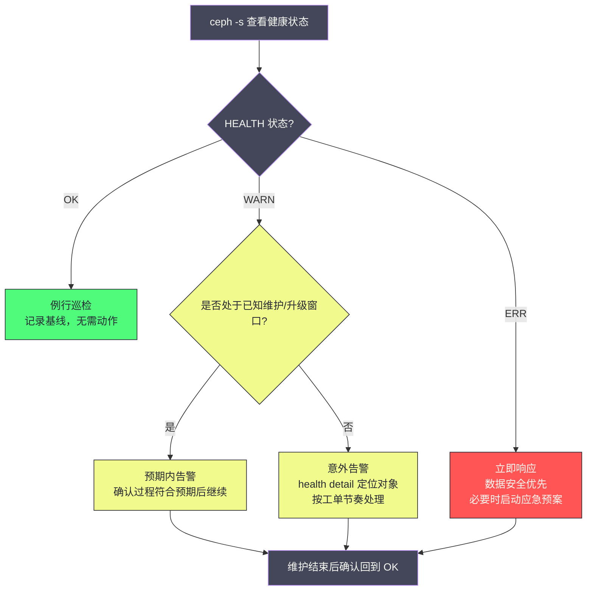
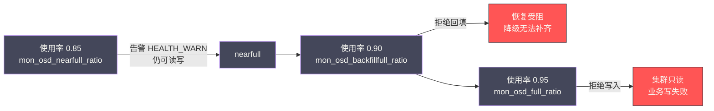

# 11 日常运维手册——健康检查、扩缩容与版本升级

**摘要：**

[[中间件/Ceph/10 集群部署实战——cephadm 与生产规格设计|上一篇]]把集群送上了生产轨道，但投产只是运维生涯的第一天。Ceph 集群的日常，说到底是三件事的循环：每天看一眼健康状态，隔一段日子扩一次容或换几块盘，隔上一年半载升一次版本。本文回答两个问题：其一，一个把自愈（self-healing）写进设计基因的系统，为什么还需要一本运维手册——答案是自愈负责"数据不丢"，而运维负责"过程可控"，恢复要抢业务带宽、扩容要触发数据迁移、升级要逐台重启，这些过程的节奏只能由人来掌舵；其二，巡检、扩容、缩容换盘、版本升级这四大场景的标准动作与背后的权衡是什么。行文先建立"管过程而非修数据"的心智模型与三档健康状态的处置节奏，再逐条拆解每日巡检的命令集，随后展开扩容的流量控制与均衡策略、缩容的安全序列与误操作补救，接着走完版本升级的顺序、观察点与回滚边界，最后落到按场景归类的参数速查表与"一次一参、可回滚、留记录"的变更方法论。

---

## 第 1 章 运维的心智模型——集群的自愈哲学

### 1.1 从"修数据"到"管过程"

2006 年，Sage Weil 在 OSDI 会议上发表 Ceph 论文时，在 RADOS 的设计目标里写下了一个此后二十年不断被验证的判断：在由商用硬件构成的规模化集群里，故障不是异常，而是常态。这份论文给出的方案不是"把故障率降到零"，而是让系统带着故障继续跑：副本机制兜住单点损坏，Peering 与 Recovery 把丢失的冗余自动补回来（机制详见 [[中间件/Ceph/05 PG 状态机与数据一致性——Peering、Recovery 与 Backfill|05 PG 状态机篇]]），CRUSH 让数据放置不依赖任何中心化的分配者（见 [[中间件/Ceph/02 CRUSH 算法——去中心化的数据放置|02 CRUSH 算法篇]]）。2017 年的 Luminous 把 BlueStore 与 balancer 变成默认配置，2020 年的 Octopus 交出 cephadm，这条演进线索始终指向同一个方向——**把"数据怎么修"从运维手册搬进系统内核**。

你不妨对比一下这份设计所要取代的旧世界。传统 RAID 阵列的运维剧本是这样的：盘坏了，机柜红灯亮起，运维赶到机房换盘，RAID 控制器开始重建数据，重建期间整个阵列性能暴跌，如果重建途中再坏一块盘，数据就此丢失。这套剧本里，人是修数据的主角，系统只是被修的对象。Ceph 把这套流程内化成了集群的自治行为：OSD 掉线，受影响的放置组（Placement Group，PG）进入降级（degraded）状态，恢复（Recovery）与回填（Backfill）自动从幸存副本补齐数据，全程不需要人碰一个字节。运维的职责因此发生了一次静默的转移——**你不再是修数据的人，而是管过程的人**。

但"管过程"三个字，分量比听起来重得多。自愈解决的是"数据不丢"，解决不了"过程无痛"：恢复要抢磁盘带宽，扩容要触发数据迁移，升级要逐个重启守护进程，这些动作发生在什么时机、以多大力度进行，系统并不知道业务此刻在忙什么。打个比方，Ceph 集群像一支自带维修班的物流仓库——货架塌了，维修班会自动补货、倒库，把缺的货补齐；但维修班干活要占通道，倒库要占电梯，什么时候让他们开工、开多快，仓库经理说了算。运维就是这位仓库经理：不搬货，但掌舵。本篇接下来的每一章，讲的都是这位经理的排班表。

### 1.2 三档健康状态：OK、WARN 与 ERR 的处置节奏

Ceph 把集群状态收敛成一个三档的健康状态（health status）：HEALTH_OK、HEALTH_WARN、HEALTH_ERR。这三档不是简单的"好/坏"二分，而是对应着三种完全不同的处置节奏，分诊错了节奏，要么小题大做耗尽人力，要么大题小做酿成事故。

| 状态 | 含义 | 处置节奏 | 典型触发 |
| :--- | :--- | :--- | :--- |
| HEALTH_OK | 一切干净：PG 全部 active+clean，无告警 | 例行巡检即可 | — |
| HEALTH_WARN | 集群可用，但存在需要关注的问题 | 按工单节奏：先判断预期内还是意外，再定位 | OSD 掉线、PG 降级、nearfull、慢请求 |
| HEALTH_ERR | 数据安全可能已受威胁 | 立即响应，优先级压倒一切 | 集群写满停写、PG incomplete、MON 失去法定人数 |

HEALTH_WARN 的微妙之处在于，它大多数时候是"自愈正在工作"的伴生现象而非故障本身：一块 OSD 掉线，PG 立刻降级，集群亮起 WARN，随后恢复机制把数据补齐，WARN 自动解除。换句话说，WARN 常常是系统在"正常地处理异常"。运维面对 WARN 的第一反应，不该是动手，而是判断——这是预期内的告警，还是意外？譬如你正在做主机维护，告警面板上出现 flags 生效的提示与若干 PG 降级，这是预期内的；但如果你什么都没做，告警却冒了出来，那就是集群在向你报告一件你不知道的事。



这里的关键纪律是：**维护前主动立标志（flag），让"预期内的 WARN"有据可查**。cephadm 的主机维护模式（`ceph orch host maintenance enter`）会自动设置 noout 标志，手工维护则要自己 `ceph osd set noout`。立了标志，集群会明确提示"维护标志生效中"，告警面板上的降级信息就能与你的操作对上号；不立标志就去动集群，WARN 照样响，而你分不清哪些是自己造成的、哪些是真正的新故障——告警系统的信噪比，就是这样被一点点破坏的。

### 1.3 noout 的语义边界：挂起的是迁移，不是降级

noout 大概是 Ceph 运维中被误解最多的标志，值得单独一节把它讲透。OSD 掉线后，集群的行为分两步：第一步，PG 立刻进入降级状态——副本数不足，数据处于"少一份保护"的境地；第二步，等待 `mon_osd_down_out_interval`（默认 600 秒）后，MON 把该 OSD 标记为 out（踢出数据放置），触发数据迁移到其余 OSD。noout 挂起的是第二步，不是第一步。

这个区分在事故现场至关重要。不少运维以为设了 noout 就"暂停了一切"，于是放心地一次性停掉半数 OSD 做维护——结果 PG 照样降级，若此时再坏一块盘，部分 PG 的所有副本可能同时离线，数据直接暴露在丢失风险下。noout 的正确用途，是防止"计划内的临时停机"被集群误判为永久故障而触发不必要的迁移；它从来不是降低风险的开关，只是推迟了迁移这一步。反过来说，如果一块盘真的永久故障了，你反而应该尽快让它 out，让冗余早点补齐——noout 拖得越久，数据裸奔的时间越长。

### 1.4 不这样会怎样——两种典型的运维失衡

反事实推演能帮你看清心智模型的价值。假如运维者没有"管过程"的意识，会走向两个极端。一端是惊弓之鸟：凌晨两点一块 OSD 掉线，WARN 响起，值班的把全组人拉起来排查，折腾两小时后 OSD 自己恢复了——其实集群在这 600 秒的观察窗里本来就会自行处理，人的介入反而打断了自愈节奏。另一端是温水煮青蛙：WARN 长期挂着不管，"反正集群还能用"，直到某天容量水位爬过 85%，nearfull 告警与降级告警叠加在一起，扩容窗口已经来不及了。这两种失衡的共同根源，是把健康状态当成了"要不要行动"的开关，而不是"该以什么节奏行动"的信号。

由此可见，Ceph 运维的第一课不是任何一条命令，而是建立分诊的意识：OK 时做记录，WARN 时做判断，ERR 时才动手术。接下来的章节，就是这套分诊逻辑在四个具体场景里的展开。

---

## 第 2 章 日常巡检命令集——三十秒读懂集群

### 2.1 ceph -s：总仪表盘

如果说运维每天只来得及跑一条命令，那一定是 `ceph -s`（即 `ceph status`）。它像驾驶舱的总仪表盘，三十秒内给你五类信息：健康档位、集群身份与容量、各服务组件的存活计数、PG 状态分布、客户端流量。逐段读懂它的输出，是巡检的基本功：

```bash
ceph -s
# 输出分五段：
#   cluster:   集群 id、总容量、raw 使用量与占比——容量账本
#   services:  mon/mgr/osd 各组件的数量与 up/out 计数——结构账本
#   data:      PG 状态分布（active+clean 多少、degraded 多少）——一致性账本
#   io:        客户端读写速率与吞吐——负载水位
#   health:    告警摘要——下一步深挖的入口
```

其中最值得盯的两个数字：一是 `osd: X up, Y in`——up 是活着的 OSD 数，in 是参与数据放置的 OSD 数，up 小于 in 说明有 OSD 掉线但还在 600 秒观察期内；二是 PG 行里 active+clean 之外的计数——任何非 clean 的 PG 都意味着有数据正处于恢复或降级过程中，数量小且在回落是自愈在干活，数量大且在增长就是恢复速度追不上故障速度。

### 2.2 ceph health detail：从结论到故障码

`ceph -s` 只给结论，`ceph health detail` 给逐条展开的故障码：哪块 OSD 掉了、哪些 PG 受影响、卡在什么状态。它是从"集群不舒服"到"具体哪里不舒服"之间的那座桥。生产中最常见的告警条目，值得逐条认识：

| 告警条目 | 含义 | 第一反应 |
| :--- | :--- | :--- |
| OSD_DOWN / OSD_HOST_DOWN | 单块 OSD 或整台主机的 OSD 掉线 | 查进程与日志，判断临时还是永久 |
| PG_DEGRADED / PG_DEGRADED_FULL | PG 副本不足；FULL 后缀意味着连降级副本都凑不齐 | 后者需立即处理，冗余已见底 |
| OSD_NEARFULL / OSD_BACKFILLFULL / OSD_FULL | 三档水位告警，见第 3 章 | NEARFULL 规划扩容，FULL 立即处置 |
| SLOW_OPS | OSD 请求延迟异常 | 结合 osd perf 找慢盘 |
| PG_DAMAGED / PG_INCONSISTENT | Scrub 发现不一致 | 走修复流程，见 [[中间件/Ceph/06 Scrub 与数据校验——静默错误的防线\|06 Scrub 篇]] |

告警条目之外，还有一块拼图值得补上：告警的应答（mute）机制。Ceph 长期以来只有两种处理告警的方式——修掉它，或者挂着它，中间没有"我知道了、这是预期内的"这个状态，维护窗口里降级告警响个不停，值班能做的只有在心里默念"这是我自己造成的"。Octopus（15.x，2020）起补上了这一环：`ceph health mute <告警码>` 把某条告警标记为已应答，被应答的检查不再影响总档位，`ceph health` 会显示 `HEALTH_OK (muted: OSD_DOWN)` 这样的字样，`ceph health detail` 里对应条目带上 (MUTED) 前缀——应答是留痕的，不是掩耳盗铃。用法上有两个关键参数：其一，生存时间（Time To Live，TTL），`ceph health mute OSD_DOWN 4h` 让应答四小时后自动过期；其二，`--sticky` 让应答在告警消失后依然保持，适合升级长期暂停、版本混布告警会一直挂着的场景。打个比方，mute 像给闹钟按下的贪睡键（snooze）而不是拔掉电源——**TTL 是这套机制的灵魂**：告警自愈（OSD 回来了）则应答自动解除，告警若反复出现则照常上报，带 TTL 的应答到期自动失效，三重保险之下，"静音三个月捂住真故障"的失控局面很难发生。它与 1.2 节的立 flag 纪律合成一套维护三件套：进维护前 `set noout` 挂迁移、`mute` 应答已知告警、出维护后逐一解除恢复默认态。

### 2.3 osd tree 与 osd df：结构、水位与偏差

`ceph osd tree` 打印 CRUSH 拓扑树——从 root 到机架到主机到 OSD，每行标注 up/out 状态。它回答的是"结构"问题：OSD 挂在哪个故障域下、掉线的是不是集中在同一台主机或同一个机架。掉线集中在单一故障域，风险远大于散布在多个域——前者可能让某些 PG 的全部副本同时离线，后者只是多点降级。

`ceph osd df tree` 则回答"水位"问题：每块 OSD 的使用量、使用率，以及最容易被忽视的 VAR 列——该 OSD 使用率相对集群均值的偏差百分比。VAR 长期偏大，说明数据分布不均：要么 PG 数量不足导致统计不均匀，要么 balancer 没开或没生效。**平均水位健康而个别 OSD 接近满，是 Ceph 集群最隐蔽的一类风险**，因为容量告警看的是均值，写失败却发生在最满的那块盘上。

VAR 列的读法值得单独交代，它太容易被误读：VAR 给出的是相对均值的比值（variance），1.00 表示与集群均值持平，1.17 意味着这块盘的使用率高出均值 17%，0.83 则是低了 17%——把它读成"偏差 1.17%"是新手最常见的误读。判读有一条经验带：**长期运行且 balancer 正常的集群，各 OSD 的 VAR 应当挤在 1.0 附近**（譬如 0.9 到 1.1 的带内）；出现 1.3 以上的长期偏离，说明均衡失守，要么 PG 总数偏少导致统计粒度太粗，要么 balancer 没开、没收敛。有两个场景容易误判，需要提前打预防针：其一，刚扩完容的集群，新 OSD 从零开始爬坡，VAR 远低于 1，旧 OSD 相应略高于 1，这是迁移进行中的正常形态，判据是"偏差在收敛"而非"偏差为零"；其二，`ceph osd df` 逐块罗列 OSD，`ceph osd df tree` 则多出主机与机架层的汇总行，排查"是不是整台主机偏满"时后者更直观。顺带一提，%USE 与 VAR 要配套看：%USE 回答"这块盘离满还有多远"，VAR 回答"这块盘比同伴满多少"——前者管当下安危，后者管分布健康，两项都健康才算真健康，就像体检报告里绝对值与相对偏离要一起看。

### 2.4 pg dump 与 osd perf：一致性与性能的两把尺

`ceph pg dump` 输出所有 PG 的完整状态，信息量大到不适合日常肉眼阅读，日常用 `ceph pg stat` 看汇总、用 `ceph pg dump_stuck inactive unclean stale` 只捞卡住的 PG 即可。stuck inactive 意味着 PG 凑不齐法定副本无法服务，stuck unclean 意味着恢复长期不收敛——这两类卡住超过半小时，就该按故障处理流程深挖了。

`ceph osd perf` 给出每块 OSD 的 commit 与 apply 延迟（毫秒级），是找慢盘的第一把尺：一排 OSD 里延迟显著高出同伴的那几块，要么盘本身在劣化，要么承载了热点。要进一步深挖某块 OSD 在等什么，可以用 `ceph daemon osd.<id> dump_ops_in_flight` 看在途请求。性能趋势的长期记录则交给监控系统，见 [[中间件/Ceph/12 监控告警体系——Prometheus exporter 与关键指标|12 监控告警篇]]。

commit 与 apply 两列的读法也值得交代：commit 延迟盯的是落盘确认那一段，BlueStore 的写前日志与盘的刷盘能力在这里说话；apply 延迟则是请求在 OSD 上走完全程的耗时。两列要配套看才能区分病因——commit 与 apply 一起走高，多半是盘本身在劣化或承载了写热点；apply 远高于 commit，则更可能是处理队列在排队，瓶颈在调度与并发而非介质。

`ceph pg dump` 还有一个工程化的精简用法值得写进巡检脚本：加 `--format json` 输出机器可读的 JSON，再用 jq 过滤出关心的字段。譬如只捞不在 active+clean 状态的 PG，一行命令就能把要看的信息从几万行原始输出里拎出来：

```bash
# 只列出非 active+clean 的 PG：编号与状态两列，TSV 格式
ceph pg dump --format json | jq -r '.pg_stats[] | select(.state != "active+clean") | [.pgid, .state] | @tsv'
```

这条思路的价值不在这一条命令本身，而在"把巡检从肉眼看变成脚本判"：健康标准写成 jq 的过滤条件，输出非空即告警，2.6 节清单里"PG 一致性"那一行就有了自动化的可能。同类思路也适用于 `ceph osd df --format json`（按 VAR 过滤偏满的 OSD）与 `ceph osd tree --format json`（按故障域聚合掉线 OSD），此处不再展开。

### 2.5 ceph versions：版本一致性检查

`ceph versions` 列出集群内所有守护进程的版本分布。它的日常价值有二：一是升级期间追踪版本收敛进度（见第 5 章）；二是平时发现"漏网之鱼"——譬如某台主机的 OSD 因为系统问题一直没跟上滚动重启，版本长期落后，这类混布状态是潜在的兼容性隐患。健康集群的 versions 输出应当是单一版本；出现多版本并存且长期不收敛，本身就是一条值得立单排查的线索。

### 2.6 每日巡检清单：必查项与关注项

把上面的命令组织成一张可持续执行的清单，比记住每条命令更重要。巡检的要义不在"看"，而在"对照"——对照基线，判断今天与昨天有没有不该出现的变化：

| 频率 | 级别 | 检查项 | 命令 | 健康标准 |
| :--- | :--- | :--- | :--- | :--- |
| 每日 | 必查 | 健康档位与告警摘要 | `ceph -s` | OK，或 WARN 且可解释 |
| 每日 | 必查 | OSD 存活与容量水位 | `ceph osd df tree` | 无 FULL/NEARFULL，VAR 偏差小 |
| 每日 | 必查 | PG 一致性 | `ceph pg stat` | 非 active+clean 计数为零或持续回落 |
| 每周 | 关注 | OSD 延迟 | `ceph osd perf` | 无显著偏离基线的慢盘 |
| 每周 | 关注 | 卡住的 PG | `ceph pg dump_stuck` | 为空 |
| 每周 | 关注 | 版本一致性 | `ceph versions` | 单一版本 |
| 每周 | 关注 | 磁盘硬件健康 | `smartctl -a` | 无快速增长的重映射/待定扇区 |
| 每周 | 关注 | balancer 与 scrub 状态 | `ceph balancer status` 等 | 运行中，无积压告警 |

> [!warning] 生产避坑：巡检清单的价值在于"对照基线"，不在于"执行命令"
> 同样是跑一遍 `ceph -s`，有基线的人看得出"PG 数怎么比昨天多了 3 个 degraded"，没基线的人看到的是"一切正常"。部署完成后留一份健康快照（见 [[中间件/Ceph/10 集群部署实战——cephadm 与生产规格设计|10 集群部署篇]] 的基线存档），巡检才有对照系；告警阈值与巡检项的联动设计，见 [[中间件/Ceph/12 监控告警体系——Prometheus exporter 与关键指标|12 监控告警篇]]。

---

## 第 3 章 扩容实战——给航行中的船加装货舱

Ceph 的扩容有个常被低估的性质：它不是"停机加盘"，而是给一艘不停航的货轮加装新货舱——舱位接进来，货物要重新分装，分装期间港口作业不能停。分装的速度、时机、范围，就是本章的全部主题。

### 3.1 加节点加盘的全流程

以 cephadm 部署的集群为例，加一台节点的完整序列如下，每一步都有它存在的理由：

```bash
# 1. 纳管主机：cephadm 通过 SSH 接管新节点
ceph orch host add ceph-node-05 192.168.1.14 --labels=_admin

# 2. 核对设备清单：确认新盘可见且"可用"
#    AVAILABLE 列为 Yes 才是裸盘；有分区/文件系统/已有 OSD 痕迹的盘不会出现在此列
ceph orch device ls

# 3. 添加 OSD：指定主机与设备路径（生产推荐驱动组 spec 批量纳管，见 10 篇）
ceph orch daemon add osd ceph-node-05:/dev/sdb

# 4. 观察再均衡：新 OSD 的使用率会逐步爬升，PG 状态短暂波动后回到 active+clean
ceph -s && ceph osd df tree
```

流程的验收标准有三条：集群回到 HEALTH_OK；`ceph osd df tree` 里新 OSD 的水位与集群均值收敛（VAR 偏差进入正常区间）；性能基线对比无明显劣化。三步都过了，这次扩容才算闭环，而不是"命令跑完了就算完"。

### 3.2 rebalance 的流量控制：慢车道与挂空挡

新 OSD 加入后，CRUSH 会把一部分 PG 重新计算到新 OSD 上，触发回填迁移。迁移的速度默认是克制的：`osd_max_backfills`（默认 1）限制每块 OSD 同时进行的回填数，恢复类操作的优先级（`osd_recovery_op_priority`，默认 3）也远低于客户端请求（63）——恢复走的是慢车道，为的是不抢业务的路。

这个默认值在多数场景下是对的，但有两类场景需要人工介入。其一是水位告急：集群已逼近 nearfull，扩容是在救火，慢车道反而危险，此时可以临时上调 `osd_max_backfills`（譬如 2 到 4）与 `osd_recovery_max_active`，让数据快点挪进新舱位，救火结束后改回默认——**临时提速永远要配一个"改回去"的动作**，否则下一次例行维护时，高速恢复会在你毫无防备时再次上演。其二是时机不对：业务高峰期盘到了货，但不希望立即触发迁移风暴，此时可以 `ceph osd set norebalance`，让新 OSD 先挂空挡——注意这个标志只挂起"重新均衡"类的迁移，降级数据的冗余修复不受影响，所以它挡得住分装、挡不住救火；低峰期 `ceph osd unset norebalance`，分装再开工。长期挂着 norebalance 的集群，新盘闲置、旧盘偏满，等于白扩。

### 3.3 三水位触发链：0.85、0.90 与 0.95

Ceph 对存储水位设了三道闸，默认值分别是 0.85、0.90、0.95，对应三个行为完全不同的阈值。理解这条触发链，是容量管理的核心：



三道闸门的语义各不相同：nearfull（默认 0.85）只是告警，读写照常，提醒你该规划扩容了；backfillfull（默认 0.90）不拦业务写、只拦回填迁移——这是最隐蔽的一道闸，恢复被暂停意味着降级状态无法收敛，你以为集群在自愈，其实自愈被卡住了；full（默认 0.95）则直接拒绝写入，集群变只读，业务写请求报错。三道闸的触发对象都是"单块 OSD"而非集群均值——**full 判定是按最满的那块盘算的**，这正是 2.3 节强调 VAR 列的原因。

> [!info] 核心概念：水位预留的本质，是为恢复买空间
> 三道闸门中最容易被轻视的是 backfillfull：它不拦业务写，只拦恢复迁移。于是一个反直觉的困境出现了——集群越满，一块盘故障后越难把数据迁走，降级状态持续越久，叠加故障的概率越高。水位预留（譬如把扩容启动线设在 70% 到 75%、把 nearfull 告警线下调到 75% 到 80%）本质上不是"留点余量"的洁癖，而是花钱买"故障发生时还有地方搬数据"的能力。全闪小集群可以紧一点，HDD 大集群必须松一点，这笔账在 [[中间件/Ceph/10 集群部署实战——cephadm 与生产规格设计|10 集群部署篇]] 的容量账本里算过，运维期要做的只是守住它。

### 3.4 reweight 微调与 balancer 模式选择

三水位之外，均衡本身是扩容后的长期课题。Ceph 提供了两层工具。第一层是手工微调：`ceph osd reweight <id> <0-1>` 把某块偏满 OSD 的有效权重下调，让 PG 向它少分一点——它动的是 osdmap 里的 reweight 字段，适合"个别 OSD 偏满"的局部修正；与之相对的 `ceph osd crush reweight` 改的是 CRUSH 地图里的标称权重，用于"这块盘的实际容量与记录不符"的场景（譬如盘坏了部分空间），两者一字之差，语义不同，用错会引发意料之外的迁移。第二层是自动化工具 balancer（MGR 模块），它持续计算分布偏差并小步调整，开起来之后基本可以忘掉。balancer 有两种工作模式，选择取决于你的版本约束与均衡诉求：

| 维度 | upmap | crush-compat |
| :--- | :--- | :--- |
| 出现时间 | Luminous（2017）引入 | 更早，兼容老版本 |
| 工作机制 | 对个别 PG 显式指定 acting set，绕过 CRUSH 的随机性 | 调整 OSD 的兼容权重，间接影响放置计算 |
| 均衡精度 | 高，可做到各 OSD 使用率几乎一致 | 低，权重调整是粗粒度的间接手段 |
| 迁移量 | 小，只挪需要挪的 PG | 大，收敛过程可能反复调整 |
| 对 CRUSH 的影响 | 不改权重，映射记录在 MON 的集群地图中 | 修改权重，影响后续所有放置计算 |
| 版本要求 | 全集群（含客户端）Luminous 及以上 | 几乎无要求 |
| MON 代价 | upmap 条目存于 osdmap，条目多时增加 MON 内存与地图体积 | 无额外负担 |
| 适用场景 | 现代集群的默认选择 | 存在无法升级的老客户端、或版本混布的过渡期 |

> [!note] 选型建议：默认 upmap，老环境才退而求其次
> 只要全集群（包括客户端）都在 Luminous 及以上，upmap 几乎在所有维度占优：更准、更省、不动 CRUSH 权重。它的代价是 MON 需要在集群地图里维护这些显式映射，PG 数量极大时地图体积与 MON 内存会有可观增长——但相比 crush-compat 的反复迁移，这笔开销通常划算。crush-compat 的存在意义，是那些客户端版本参差、无法整体升级到 Luminous 的存量环境。开启方式是 `ceph mgr module enable balancer` 后 `ceph balancer on`，模式用 `ceph balancer mode upmap` 指定，效果可用 `ceph balancer eval` 评估。

扩容的边界与反例也值得记一笔：扩容不是加得越多越快越好。一次性给 PB 级集群加一个机架的盘，等于同时给几百块 OSD 下达迁移任务，即便每块盘只跑一个回填，叠加起来的后台流量也足以拖垮前台延迟；分批添加（譬如每次一个主机）配合低峰窗口，才是可控的节奏。反过来，把扩容拖到 nearfull 之后才启动，则是另一端的失误——采购、上架、纳管、迁移每一环都要时间，水位不会等你走完流程。

### 3.5 一次完整扩容的实战序列

把 3.1 到 3.4 的零散动作串成一条完整的时间线，配上每一步的注释与验收点，就是一张可以直接贴进变更单的标准作业序列（runbook）。不妨设想一个贯穿全节的具体场景：给一个四节点集群加第五个节点（两块 16TB 盘），低峰窗口执行，全程一次只动一台主机：

```bash
# ===== 阶段 0：前置核对（T-1 天）=====
# 水位与健康是扩容的入场券：nearfull 之后再动手就晚了
ceph -s                    # 确认 HEALTH_OK，无未收敛的降级
ceph osd df tree           # 记录扩容前的水位与 VAR 基线，贴进变更单
ceph balancer status       # 确认 balancer 已开启，记录模式与偏差分数

# ===== 阶段 1：纳管主机（低峰窗口开始）=====
# 纳管动作本身不触发迁移，风险低；一次只纳管一台
ceph orch host add ceph-node-05 192.168.1.14 --labels=ceph-osd
ceph orch host ls          # 确认新主机状态在线

# ===== 阶段 2：确认设备并添加 OSD =====
# AVAILABLE=Yes 才是裸盘；有分区或旧 OSD 痕迹的盘不会出现在清单里
ceph orch device ls --host ceph-node-05
ceph orch daemon add osd ceph-node-05:/dev/sdb
ceph orch daemon add osd ceph-node-05:/dev/sdc
# 盘多时改用驱动组 spec 批量纳管（见 10 篇），逐条命令只适合少量盘

# ===== 阶段 3：观察回填收敛（数小时到数天）=====
# 两个观察面：非 clean PG 逐步回落、新 OSD 水位从 0 爬升
watch -n 60 'ceph pg stat && ceph osd df tree | grep ceph-node-05'

# ===== 阶段 4：balancer 收尾 =====
# 回填只保证"数据搬进来了"，均匀性要靠 balancer 小步微调收尾
ceph balancer status
ceph balancer mode upmap   # 若尚未指定模式
ceph balancer eval         # 输出均衡得分，越接近 0 越均匀

# ===== 阶段 5：验收 =====
# 三条标准：HEALTH_OK、VAR 收敛进正常带、性能基线无漂移
ceph -s && ceph osd df tree
```

扩容后的均匀性验收，落在 `ceph osd df tree` 的 VAR 与 PGS 两列上。刚加完盘时，新 OSD 的 VAR 远低于 1（它从零开始爬坡），旧 OSD 略高于 1，这是必经的过渡态而非故障；判读收敛看三个信号：新 OSD 的 %USE 爬到与集群均值相差一两个百分点以内、新 OSD 的 PGS 数与老 OSD 趋于一致、非 clean PG 归零且集群回到 HEALTH_OK。balancer（upmap 模式）开着时这套收敛是自动的，`ceph balancer status` 里能看到它逐台小步调整的记录；若 VAR 长期压不进正常带，回头查三件事——PG 总数是否偏少（pg_num 的取值逻辑见 [[中间件/Ceph/05 PG 状态机与数据一致性——Peering、Recovery 与 Backfill|05 PG 状态机篇]]）、balancer 是否真的在跑、有没有历史上手工 reweight 留下的旧权重在跟 balancer 打架。**验收看的是收敛趋势，不是某个时刻的绝对值**，把每个阶段的 `osd df tree` 输出贴进变更单，收敛与否一目了然。

---

## 第 4 章 缩容与踢盘——让一艘船安全离队

扩容的反向操作是缩容与换盘，而这两件事在运维事故统计里的出镜率远高于扩容——因为它们涉及"让数据离开一块盘"的不可逆动作。本章的标准序列、容量核算与补救窗口，都是围绕"如何让不可逆的操作可预期"展开的。

### 4.1 安全移除 OSD 的标准序列

下线一块 OSD 的标准序列是：设置 noout、停守护进程、destroy 摘除、purge 清册。逐步看每一步在防什么：

```bash
# 1. 挂起自动 out：防止停进程的瞬间被集群当作永久故障，触发大规模迁移
ceph osd set noout

# 2. 停止该 OSD 守护进程（cephadm 部署）
ceph orch daemon stop osd.<id>

# 3. destroy：从集群摘除该 OSD 的认证与 CRUSH 条目
#    （cephadm 语义；手工部署等价物是 ceph osd purge <id> --yes-i-really-mean-it，
#      它一条命令合并了 crush remove、auth del 与 osd rm 三步）
ceph orch osd destroy <id>

# 4. purge 完成后解除 noout，让集群开始把该 OSD 上的 PG 迁往其余 OSD
ceph osd unset noout

# 5. 观察恢复收敛，回到 HEALTH_OK
ceph -s
```

这套序列的节奏是"先摘除、后迁移"，摘除动作快，但迁移期间数据处于降级状态。cephadm 还提供另一条路径：`ceph orch osd remove <id>`，它把顺序反过来——先标记 out、等数据全部迁走、再停进程，全程数据不降级，代价是摘除前就要等迁移完成。两种节奏没有绝对优劣：维护式下线（盘还要还回来）适合先摘后迁，永久下线（盘退役）适合 remove 的先迁后摘，把降级窗口压到零。不过无论哪种节奏，都有一条铁律：**同一故障域内一次只动一块盘，等 HEALTH_OK 再动下一块**。MON 有个防呆机制（`mon_osd_min_in_ratio`，默认 0.75）：in 状态的 OSD 比例低于 75% 时拒绝继续标记 out，防止运维把整个集群踢残——但防呆是底线不是地板，别把它当操作依据。

### 4.2 缩容前的容量核算

缩容比扩容更需要算账，因为方向是反的：扩容时新空间是白来的，缩容时你是在把数据挤进更小的容器。核算公式很朴素：移除后的使用率等于当前数据量除以移除后的 raw 容量，而这条算式的结果必须同时满足两个约束——低于 full 水位，且给恢复留出空间。看两个例子：

| 场景 | 当前数据量 | 移除后 raw | 移除后使用率 | 判定 |
| :--- | :--- | :--- | :--- | :--- |
| 100 块 16TB、已用 60%，移除 10 块 | 960TB | 1440TB | 约 67% | 可行，余量充足 |
| 100 块 16TB、已用 85%，移除 10 块 | 1360TB | 1440TB | 约 94% | 危险：贴着 full 线，先扩后缩 |

第二行就是"先扩后缩"原则的由来：如果缩容的动机是淘汰旧盘，而集群水位已经很高，正确顺序是先加新盘、等数据迁过去、再摘旧盘，而不是反过来。此外算式之外还有三个修正项：纠删码（Erasure Coding，EC）池的存储开销与副本池不同，按 raw 容量折算时要分开算；CRUSH 的分布偏差意味着"平均 67%"不代表每块盘都是 67%，最满的那块才是约束；恢复期间的持续写入会进一步抬升水位。保守的做法是把算出来的结果再往下压一档。

### 4.4 之前，先看 4.3：SMART 预警与换盘流程

生产中比"主动缩容"更高频的场景，是硬盘发出预警后的计划性更换。现代硬盘的智能自检（Self-Monitoring, Analysis and Reporting Technology，SMART）数据里，有几个指标值得纳入每周巡检：

| 指标 | 含义 | 处置动作 |
| :--- | :--- | :--- |
| Reallocated_Sector_Ct | 已重映射的坏扇区数 | 持续增长即列入更换计划 |
| Current_Pending_Sector | 待定扇区（读写尚不确定好坏） | 非零即关注，复查趋势 |
| Offline_Uncorrectable | 离线扫描无法修复的扇区 | 非零即预警 |
| UDMA_CRC_Error_Count | 接口链路校验错误 | 先查线缆与背板，再怀疑盘 |
| SSD：Percentage Used / Available Spare | 磨损度与备块余量 | Available Spare 低于厂商阈值即更换 |

SMART 预警的换盘流程，与 4.1 的序列同构，但多了一条前置检查：确认集群当前没有其他降级。一块预警盘要下线，前提是它的数据此刻有完整冗余、且没有别的盘正在恢复——否则一次换盘就变成多重故障叠加。流程是：确认 HEALTH_OK、无其他降级，`ceph osd out <id>` 等数据迁走，停进程、拔盘、插新盘，`ceph orch daemon add osd` 重新纳管，观察回填收敛。整个过程一次只动一块盘；若预警盘所在的机架恰好有另一块盘正在恢复，先等那块完成。

### 4.4 误踢盘的补救窗口

踢盘操作的可怕之处在于不可逆，但不可逆也有层次，不同误操作的补救窗口完全不同。第一种是误 out 或误停：`ceph osd out` 误敲在一块健康盘上，数据开始迁移——此时 `ceph osd in` 把它拉回来，迁移随之中止，已经迁走的 PG 会陆续迁回，集群回到原状。类似的还有"误停进程但没设 noout"：你有 600 秒的窗口（`mon_osd_down_out_interval` 默认值），在 MON 把它标 out 之前重启进程，什么都不会发生。**这 10 分钟就是误操作的黄金补救窗口**，也是巡检发现"不该掉的 OSD 掉了"时要抢时间的原因。

第二种是误 purge，补救窗口窄得多。purge 删掉的是集群侧的记录（认证、CRUSH 条目），盘上的 BlueStore 数据此时还在，但前提条件苛刻：OSD 编号没有被新 OSD 复用、盘没有被 zap 或重写。所以误 purge 后的第一动作不是重启集群，而是停掉一切自动化——cephadm 的驱动组可能按 spec 把新 OSD 调度到这块盘上，一旦重写，数据就真的没了——然后手工评估恢复路径。这个窗口的现实意义不在"补救有多容易"，而在"防呆有多必要"：

> [!warning] 生产避坑：safe-to-destroy 是 purge 前的最后一道闸
> `ceph osd safe-to-destroy <id>` 会检查该 OSD 上的 PG 是否已全部迁走、是否仍被集群引用，返回 safe 才应执行 purge。跳过这道检查直接 purge，是"误踢盘"事故的头号来源。配套的防呆还有三件：高危命令走审批而非值班单人决策；shell 别名给 purge 类命令加二次确认参数；操作前用 `ceph osd tree` 与 `ceph osd df` 截图留档，确认目标 OSD 的编号与主机——OSD 编号在盘更换后会复用，凭记忆敲编号是事故的经典起点。

### 4.3 补一段：SMART 巡检的工程化

换盘流程要跑得顺，前提是预警足够早。SMART 数据的采集不该依赖人工登录逐台执行，而应纳入每周巡检脚本或节点代理：采集重映射扇区数、待定扇区数与 SSD 磨损指标，与上周值对比，增量异常即开工单。硬盘的故障规律（同一批次的盘往往在相近的服役期集中劣化）意味着预警常常成批出现，这也是"一次只换一块"纪律存在的原因——预警扎堆时，最忌讳的是图省事批量换。

### 4.5 destroy、purge 与 crush remove：三种摘除的语义边界

4.1 的序列里出现了 destroy 与 purge，加上更底层的 crush remove，Ceph 里"把一块 OSD 从集群记录上抹掉"其实有三个力度不同的动词，混用它们正是误操作的温床。打个比方，这像注销一名员工的三个层级：out 是停止给他派活，人还在花名册上；crush remove 是把他从组织架构图里摘掉，但门禁卡还没回收；destroy 是回收门禁卡与系统账号，但工号保留，方便同一个人回来复岗；purge 则是花名册、架构图、门禁、工号一次注销。逐项对照技术语义：

| 命令 | CRUSH 条目 | OSD map 记录 | 认证密钥 | OSD 编号 | 盘上数据 | 可逆性 |
| :--- | :--- | :--- | :--- | :--- | :--- | :--- |
| `ceph osd out <id>` | 保留 | 保留（标记 out，触发迁移） | 保留 | 保留 | 保留 | 完全可逆（`osd in`） |
| `ceph osd crush remove osd.<id>` | 删除 | 保留 | 保留 | 保留 | 保留 | 手工加回可恢复，但易留孤儿状态 |
| `ceph osd destroy <id> --yes-i-really-mean-it` | 保留 | 保留（打 destroyed 标记） | 删除 | 保留待复用 | 保留 | 不可逆，为同盘同号复用而设计 |
| `ceph osd purge <id> --yes-i-really-mean-it` | 删除 | 删除 | 删除 | 释放 | 保留 | 不可逆，等价于 destroy + rm + crush remove 三合一 |

这张表里最值得注意的反差是：**purge 与 destroy 都不擦除盘上的数据**——它们抹的是集群侧的记录，盘上的 BlueStore 数据要靠 zap（抹掉盘上的 LVM 与文件系统痕迹）或下一次部署覆盖才会真正消失。这正是 4.4 节"误 purge 后数据可能还在"的机制注脚，也是 destroy 存在的理由：换盘场景里编号与 CRUSH 条目原样保留，新盘插上按同号重建，PG 迁移量与 CRUSH 变动都最小。cephadm 的托管命令（`ceph orch osd rm` 及其 `--replace` 变体）正是把这些底层动词编排成"排空（drain）→ 摘除"的托管流水线，`ceph orch osd rm status` 能看到队列里每块盘处于 draining 还是 done 状态。

摘除之后还有一类残留容易被忽略：黑名单（blocklist，Pacific 16.x 之前的版本叫 blacklist）。OSD 崩溃或被摘除时，MON 会把它的地址写进黑名单，防止"僵尸"实例带着过期状态重新入集群搅局，这些条目大多会在 `mon_osd_blocklist_ttl`（默认 1 小时）后自动过期。但有两类残留不会自动消失：手工排障时用 `ceph osd blocklist add` 加过的条目，以及换盘复用网络地址时挡住新 OSD 的旧条目——症状是新 OSD 反复起不来或心跳被拒，日志里出现 blocked 字样。清理的动作是先看后摘：

```bash
ceph osd blocklist ls                        # 先看：哪些地址还在黑名单里
ceph osd blocklist rm 192.168.1.14:6800/3210 # 再摘：逐条移除已退役 OSD 的地址
```

**清理之前先确认对应的 OSD 确实已退役**——黑名单挡的本来就是不该回来的东西，误删等于把门禁黑名单清空。safe-to-destroy 的使用时机也值得明确：它不是"出事后才用"的补救工具，而是摘除前的例行前置，官方手册的换盘流程里它排在 destroy 之前一步。两个时机必须跑它：其一，任何绕开 cephadm 托管流程的手工摘除，purge 或 destroy 之前先 `ceph osd safe-to-destroy <id>` 拿到 safe 结论再动手；其二，托管移除卡住时，用它判断是数据没排空还是引用没清干净。它返回 unsafe 时会给出原因——哪些 PG 还落在这块盘上——这些 PG 编号就是下一步排查的起点，比盲目重试有效得多。

---

## 第 5 章 版本升级——给飞行中的飞机换引擎

Ceph 的在线升级常被比作给飞行中的飞机逐台换引擎：每次只停一台，其余引擎维持推力，落地时所有引擎都是新的。这个比喻贴切，但要补一个限定——换引擎换完就完，Ceph 升级换的不只是引擎，还有仪表盘与通信协议：新版本会启用新的集群地图特性与存储格式特性，一旦写下去，旧版本就再也读不懂了。这个不对称性，决定了升级的顺序、观察点与回滚边界。

### 5.1 cephadm 的升级流程

cephadm 把滚动升级做成了托管流程：你指定目标镜像，它负责逐个守护进程地推进，每一步等健康恢复再走下一步：

```bash
# 1. 升级前检查：健康状态、版本兼容性、逐级升级路径是否满足
ceph orch upgrade check --image <registry>/<image>:<tag>

# 2. 启动滚动升级：cephadm 自动按 MON → MGR → OSD → 网关的顺序逐个推进
ceph orch upgrade start --image <registry>/<image>:<tag>

# 3. 观察进度与状态
ceph orch upgrade status
ceph versions

# 4. 需要时可以暂停/恢复/停止推进（stop 只是停在当前状态，不是回滚）
ceph orch upgrade pause
ceph orch upgrade resume
ceph orch upgrade stop
```

`upgrade check` 的输出值得单独解读，因为它是升级开始前唯一一次"系统替你把关"的机会：它把目标镜像与集群内各服务的当前版本做对照，告诉你哪些服务需要升级、目标镜像是否可用；升级推进途中再跑一次，还能看到还剩哪些守护进程没升完，与 `ceph versions` 互为印证。习惯上，笔者会把这次检查的输出原文贴进变更单——它既是"升级前集群处于可升级状态"的凭据，也是事后复盘时"当时以为一切都好"的记录。顺带一提，cephadm 会在升级期间自动暂停 PG 自动扩缩器（PG autoscaler），避免 PG 拆分（split）与升级波动叠加拖慢推进，这类"系统替你踩住的刹车"知道有这回事即可，不需要手工干预。

升级是真正的滚动式：每次只重启一个守护进程，等它恢复健康、集群状态收敛，再动下一个。对业务而言，理想情况下整个过程只有轻微的延迟抖动；对运维而言，升级从"一次停机窗口的大手术"变成了"一段需要盯梢的长跑"——这既是 cephadm 买到的便利，也是新的纪律来源：升级期间集群处于"半新半旧"的过渡态，任何并行的手工操作都可能让升级器误判集群状态。

### 5.2 升级顺序：MON → MGR → OSD → 网关

cephadm 自动按 MON、MGR、OSD、网关（MDS、RGW 等）的顺序推进，这个顺序不是随意的，它由组件间的依赖方向决定：

| 顺序 | 组件 | 为何在此位置 | 完成后的观察点 |
| :--- | :--- | :--- | :--- |
| 1 | MON | 集群地图的载体，新 MON 能读懂旧组件的上报，反之则不然 | MON 法定人数恢复，versions 计数更新 |
| 2 | MGR | 各管理模块与 MON/OSD 的接口耦合，须先于 OSD 换代 | active MGR 存在，balancer 与 prometheus 模块正常 |
| 3 | OSD | 数据面滚动，新旧 OSD 混布期间协议向后兼容 | PG 短暂 peering 后回落，慢请求消失 |
| 4 | MDS / RGW 等网关 | 客户端面组件，依赖底层稳定后再动 | 各网关服务健康，客户端 IO 正常 |

MON 排第一的原因值得单独说透：MON 持有集群地图（osdmap），地图的编码格式随版本演进，新 MON 理解新特性也兼容旧上报，而旧 MON 读不懂新 OSD 报告的新特性——地图是全局共识的载体，必须先换代。MGR 次之，因为它承载的 balancer、prometheus 等模块要与 MON、OSD 的接口对齐；OSD 随后；RBD 走客户端库、CephFS 的 MDS 与 RGW 这类网关作为"客户端"最后升级。cephadm 把这个顺序固化在升级器里，你不需要手工排序——但你需要理解它，才能在升级卡住时判断卡在了哪一层。

### 5.3 升级中的健康观察点

升级期间的告警是预期内的：版本混布会触发告警，每台 OSD 重启时其上的 PG 会短暂经历 peering 与降级。这些波动是过程的伴生物，判断标准不是"有没有告警"，而是"波动是否按预期收敛"。升级期间值得持续盯的观察点有四个：`ceph versions` 的版本计数随推进逐步收敛，是进度最直接的度量；`ceph -s` 里非 clean PG 的数量在每台 OSD 重启后短暂抬升、随后回落，持续不回落才是异常；`ceph orch upgrade status` 显示当前推进到哪个守护进程、有无报错；客户端侧的延迟指标轻微抖动属预期，持续恶化就该 pause。升级期间还有一条纪律：**不要并行做任何其他变更**——不加盘、不调参、不设置 norebalance 之类的标志，升级器需要集群处于默认状态才能正确判断"健康"，并行变更会让"升级导致的波动"与"你导致的波动"混在一起，无法归因。

把"波动是否按预期收敛"落成一张可对照的表，值班时就不必靠感觉判断。官方文档明说，升级期间健康状态转为 HEALTH_WARN 是大概率事件，所以分诊的对象不是"要不要响告警"，而是"哪些波动属于过程伴生物、哪些是越界信号"：

| 告警与现象 | 预期内（继续观察） | 越界信号（pause 并介入） |
| :--- | :--- | :--- |
| PG 降级短暂抬升 | 每台 OSD 重启后出现，分钟级回落 | 只增不减、持续不回落：恢复被卡，查水位与慢请求 |
| OSD_DOWN 瞬时出现 | 重启窗口内出现随即自愈 | OSD 反复上下线（flapping）或起不来：查日志，必要时 pause |
| SLOW_OPS 抖动 | 重启瞬间出现，很快消失 | 持续恶化、客户端延迟抬升不回落：pause，等集群喘匀 |
| 版本混布告警（DAEMON_OLD_VERSION） | 推进数小时内通常不触发，告警自带一周的延迟窗 | 升级长期暂停后亮起：属预期，可 `ceph health mute DAEMON_OLD_VERSION --sticky`，升级完成后记得 unmute |
| UPGRADE_FAILED_PULL | 不应出现 | 目标镜像拉不下来（版本号写错或仓库不可达）：stop 后修正镜像重新 start |
| UPGRADE_NO_STANDBY_MGR | 不应出现 | 缺少 standby MGR：补齐 standby 再 resume，升级器需要它兜底 |

这张表的用法与 1.2 节的分诊逻辑同构：预期内的波动用"是否收敛"判断，越界信号用"收敛是否失败"判断。**pause 是升级期间的万能刹车**——它不回滚任何东西，只是让集群停在当前状态喘口气，把"升级引起的波动"与"真故障"区分开之后再做决策；但 pause 不是让时间停摆的沙漏，MON 换代之后的不可逆性（见 5.4 节）并不因为暂停而消失。

### 5.4 回滚边界：不可逆点在哪里

Ceph 官方对降级（downgrade）的态度是明确的：不支持。新版本会启用新的地图特性与存储格式特性，这些特性一旦写入，旧版本就读不懂了——这不是部署工具的限制，而是数据格式的不对称演进。所以升级的"回滚设计"必须前置，把不可逆点画清楚：

- 升级推进中：`ceph orch upgrade pause` 可暂停推进，修复问题后 resume；`upgrade stop` 只是停在当前状态（版本混布），不是回退。
- MON 全部换代之后：这是事实上的不可逆点。地图特性已由新 MON 写入，旧 MON 无法再接管。此后的"回滚"只剩理论意义。
- 升级完成且集群稳定运行后：没有回头路。数据安全不靠回滚兜底，靠的是副本与纠删码——这也是为什么升级前要确认 HEALTH_OK、冗余完整。

> [!warning] 生产避坑：回滚窗口在升级开始之前，不在升级失败之后
> 既然降级不可行，升级的"退路"就全部前置在准备阶段：先在测试集群走一遍同版本升级，记录每个守护进程的重启与收敛耗时；备份 `ceph config dump` 的输出与 cephadm 的服务规格（orch spec），确保配置可重建；确认集群 HEALTH_OK、无降级 PG。生产窗口里你能做的只有 pause、resume 与修复推进——把宝押在"失败就回滚"上，等于没有预案。

### 5.5 升级窗口的规划

把前面几节合起来，一次生产升级的规划清单是这样的。版本路线上，Ceph 的大版本必须逐级升，不能跳版——从 Quincy（2022，17.x）到 Reef（2023，18.x）再到 Squid（2024，19.x），跨两个大版本就要排两次升级窗口；升级检查（`ceph orch upgrade check`）会校验路径与前置条件，但窗口规划是你的责任。时间估算上，单守护进程的重启加收敛从分钟级到十分钟级不等，OSD 数量多的集群，OSD 阶段本身就是数小时到一天量级——staging 演练记录的耗时是唯一可信的估算依据。窗口选择上，业务低峰是底线，变更单与业务方通知是流程，"暂停与修复"预案（而非回滚预案）是技术兜底。升级后的验收则回到第 2 章的巡检清单：`ceph versions` 收敛到单一版本、HEALTH_OK、性能基线与升级前对比无异常漂移、随后观察一周。升级不是例行公事，但也不必如临大敌——它是一次被拉长的、有观察点的滚动维护，预案做在前面，窗口里就只有执行。

---

## 第 6 章 参数调优速查表——按体质开方

### 6.1 按场景的参数组合

Ceph 的参数有数百个，但运维真正需要随手可查的，是按场景归类的少数几组。调参像开方子：同一味药，对不同体质的剂量不同，且药效相互作用——所以方子要按"体质"（负载形态）来开，而不是按"药名"（参数名）来背。下面这张表按三个典型场景归组，取值给方向与理由，不给万能数字：

| 场景 | 参数 | 建议方向 | 理由 |
| :--- | :--- | :--- | :--- |
| HDD 冷存储 / 大容量 | `osd_max_backfills` | 保持默认 1 | HDD 寻道代价高，恢复必须让路 |
| | `osd_recovery_sleep_hdd` | 适当调大 | 拉大恢复操作的间隔，给前台 IO 喘息 |
| | scrub 时间窗 | 收窄到夜间低峰 | 巡检读流量对 HDD 的磁头干扰显著，见 06 Scrub 篇 |
| | `osd_memory_target` | 默认 4Gi 起步 | BlueStore 缓存预算，内存富余可上调 |
| SSD 高性能 | `osd_op_threads` | 按 CPU 核数上调 | 提高单 OSD 的并发处理能力 |
| | `osd_max_backfills` | 可放宽到 2-4 | 随机 IO 富余，恢复可以更快 |
| | `osd_recovery_max_active` | 上调 | 并发恢复请求更多，缩短降级窗口 |
| | `osd_memory_target` | 视内存余量上调 | 更大的缓存直接换读性能 |
| 恢复期（临时） | `osd_max_backfills` | 低峰临时上调 | 加速追赶，完成后必须改回 |
| | `osd_recovery_op_priority` | 临时上调 | 让恢复优先于客户端请求，缩短降级时间 |
| | `norecover` / `nobackfill` | 仅限应急 | 业务高峰给恢复踩刹车，用完立即解除 |
| | `norebalance` | 扩容错峰用 | 挂起均衡迁移、不影响冗余修复，见第 3 章 |

这张表的用法有两层。第一层是"抄方子"：新集群按场景套用，比从零摸索快。第二层更重要，是"懂药理"：恢复类参数的本质是恢复流量与业务流量的分配比例，HDD 与 SSD 的差异、低峰与高峰的差异，都是这条分配曲线上的不同取值点；而 `norecover`、`nobackfill` 这类"暂停自愈"的标志是双刃剑——它们让业务暂时顺畅，代价是降级状态持续，用它们买来的每一分钟，都是从数据安全账上预支的。

### 6.2 变更方法论：一次一参、可回滚、留记录

参数表解决"改什么"，方法论解决"怎么改"。三条纪律，缺一不可。其一，**一次一参**：同时调三个参数，性能变化无法归因，你既不知道哪个起了作用，也不知道哪个埋了雷。其二，**可回滚**：改动前用 `ceph config dump` 记录现状，改动用 `ceph config set`（多数参数可经 `ceph tell osd.* config set` 运行时生效，少数需重启守护进程，改前查文档确认生效方式），回滚就是把旧值 set 回去——没有回滚方案的调参，等于在生产做不可逆实验。其三，**留记录**：每次变更落一张变更单，这是集群运维从"手艺"变成"工程"的分界线：

| 字段 | 内容 | 示例 |
| :--- | :--- | :--- |
| 日期与操作人 | 变更发生的时间与执行者 | 2026-09-04 / 值班 A |
| 参数与作用域 | 改了什么、对谁生效 | `osd_max_backfills`，osd 级 |
| 旧值 → 新值 | 前后取值 | 1 → 3 |
| 动机 | 为什么要改 | 扩容窗口加速回填 |
| 观察结果 | 改后的指标变化 | 回填耗时减半，P99 延迟上升 8% |
| 回滚方式 | 如何撤销 | `ceph config set osd osd_max_backfills 1` |
| 复位计划 | 临时变更何时改回 | 扩容完成后 24 小时内 |

变更单的最后一栏"复位计划"值得强调：恢复期参数几乎都是临时方，救火时开的剂量，火灭了就要停——但"改回去"这件事没有告警提醒，全靠记录驱动。运维事故复盘里相当一部分的根因，是某次应急调整忘了复位，让"临时剂量"变成了"长期体质"。由此可见，Ceph 的参数调优没有放之四海皆准的数值，落点始终是三条：理解每个参数在权衡什么，按自己的负载与介质开方，用一次一参与变更记录守住每一步的可归因与可回滚。**参数是死的，权衡是活的，把权衡写进记录，集群的记忆才不依赖于任何一个人的记性**。

### 6.3 mon_osd_* 与 osd_* 常用参数速查表

6.1 按场景开方，这一节补一张按参数名归位的速查表，救火时按名查行，比翻文档快。默认值以 Quincy/Reef 为准，动手前先 `ceph config dump` 确认集群现状：

| 参数 | 默认值 | 调整场景 | 风险 |
| :--- | :--- | :--- | :--- |
| `mon_osd_down_out_interval` | 600 秒 | 网络抖动频繁的环境适当上调，减少瞬时断连被误判为永久故障 | 调太长：真故障的迁移被推迟，冗余缺口拉大 |
| `mon_osd_min_in_ratio` | 0.75 | 一般不动，它是 MON 的防呆底线 | 调低等于拆掉防呆，批量误 out 无人拦 |
| `mon_osd_nearfull_ratio` | 0.85 | 按扩容启动线下调告警线（譬如 0.75-0.80） | 设太高：告警响起时采购流程已来不及走 |
| `mon_osd_backfillfull_ratio` | 0.90 | 一般不动，与 nearfull 保持约 5 个点的间隔 | 贴着 nearfull 设：告警与恢复受阻几乎同时到达 |
| `mon_osd_full_ratio` | 0.95 | 一般不动 | 上调逼近物理满盘，写满即坏盘风险 |
| `mon_osd_blocklist_ttl` | 3600 秒 | 换盘复用 IP 时关注残留条目，见 4.5 节 | 手工加的条目不会自动过期，挡住新 OSD 入集群 |
| `osd_max_backfills` | 1 | 救火或 SSD 集群临时上调到 2-4 | 挤占业务带宽；忘复位变成常态高速恢复 |
| `osd_recovery_max_active_hdd` | 3 | HDD 集群恢复期临时上调 | 并发恢复请求放大 HDD 寻道压力 |
| `osd_recovery_op_priority` | 3 | 救火期临时上调，压过客户端请求（63） | 长期高位等于业务给恢复让路，延迟恶化 |
| `osd_recovery_sleep_hdd` | 0.1 秒 | HDD 恢复期适当调大，拉大恢复操作间隔 | 调太大恢复龟速，降级窗口反而拉长 |
| `osd_memory_target` | 4GiB | 内存富余时上调，换 BlueStore 缓存命中 | 逼近物理内存触发 OOM，OSD 反复重启 |

这张表与 6.1 的方子互补：方子回答"这类负载该怎么配"，速查表回答"这个参数动的是什么、动了会疼在哪"。两栏合看还有一个规律值得点破：**恢复类参数几乎都在"降级窗口长度"与"业务延迟"之间做交换，MON 类参数几乎都在"误判风险"与"迁移及时性"之间做交换**——记住这两条交换轴，比背下三十个默认值更管用，也正是 6.2 节"懂药理"的含义。

---

## 参考资料

1. Ceph Documentation — 健康检查与集群监控（health、versions 与告警条目）: https://docs.ceph.com/en/latest/rados/operations/monitoring/
2. Ceph Documentation — 添加与移除 OSD（out、destroy、purge 与 safe-to-destroy）: https://docs.ceph.com/en/latest/rados/operations/add-or-rm-osds/
3. Ceph Documentation — Balancer 模块（upmap 与 crush-compat 模式）: https://docs.ceph.com/en/latest/rados/operations/balancer/
4. Ceph Documentation — 恢复与回填限速参数（osd_max_backfills、recovery priority）: https://docs.ceph.com/en/latest/rados/configuration/recovery-priority/
5. Ceph Documentation — Monitor 配置参考（down_out_interval、三水位 ratio）: https://docs.ceph.com/en/latest/rados/configuration/mon-lookup-dns/
6. Ceph Documentation — cephadm 升级（orch upgrade start/check/pause）: https://docs.ceph.com/en/latest/cephadm/upgrade/
7. Ceph Documentation — ceph config 运行时配置体系: https://docs.ceph.com/en/latest/rados/configuration/
8. 相关篇章：[[中间件/Ceph/00 专栏导览|专栏导览]] · [[中间件/Ceph/03 Monitor 与集群地图——Paxos、Quorum 与 MON 运维|03 Monitor 篇]] · [[中间件/Ceph/04 OSD 与 BlueStore——存储引擎深度解析|04 BlueStore 篇]] · [[中间件/Ceph/05 PG 状态机与数据一致性——Peering、Recovery 与 Backfill|05 PG 状态机篇]] · [[中间件/Ceph/06 Scrub 与数据校验——静默错误的防线|06 Scrub 篇]] · [[中间件/Ceph/10 集群部署实战——cephadm 与生产规格设计|10 集群部署篇]] · [[中间件/Ceph/12 监控告警体系——Prometheus exporter 与关键指标|12 监控告警篇]]

---

> [!note] 思考题
> 1. 一个 2PB raw、已用 72% 的 HDD 集群要新增一个机架的 OSD（40 块 16TB）。请为这次扩容设计完整的执行计划：一次性加入还是分批加入？`osd_max_backfills` 与恢复优先级是否临时上调、何时复位？如果扩容窗口与月底业务高峰重叠，`norebalance` 应该在哪个环节介入、挂多久？把三水位（0.85/0.90/0.95）在扩容前后的变化也纳入推演——扩容完成前，哪一档水位最危险？
> 2. 凌晨三点，值班同事误将一块健康 OSD 执行了 purge，但盘还在机器里、尚未被任何自动化流程触碰。接下来的十分钟你会按什么顺序做什么？如果该 OSD 的编号在半小时后被新加的盘复用了，数据还能找回吗？以此为素材，为你的团队设计一套高危命令防呆机制：哪些命令要进审批流、shell 层面可以做什么封装、`safe-to-destroy` 应该固化在流程的哪一步？
> 3. 生产集群 120 块 OSD，计划从 Quincy 升级到 Reef。请规划升级窗口：staging 演练要记录哪些数据才能估算生产窗口？升级到一半（MON 已全部换代、OSD 还剩一半）时上游披露了一个严重缺陷，你有哪些选项，各选项的代价是什么？结合"MON 换代即不可逆"这一边界，你认为升级决策的"最后确认点"应该设在流程的哪一步、由谁签字？
