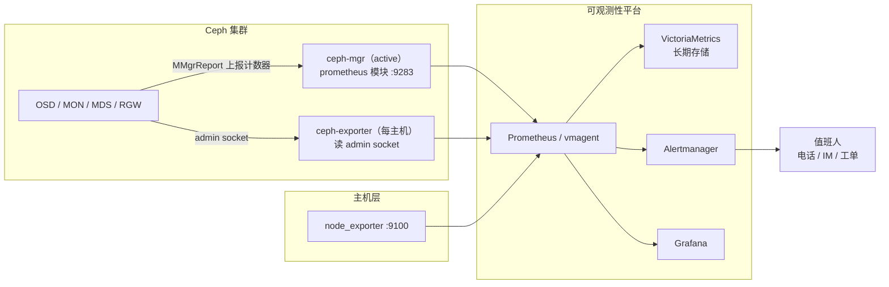
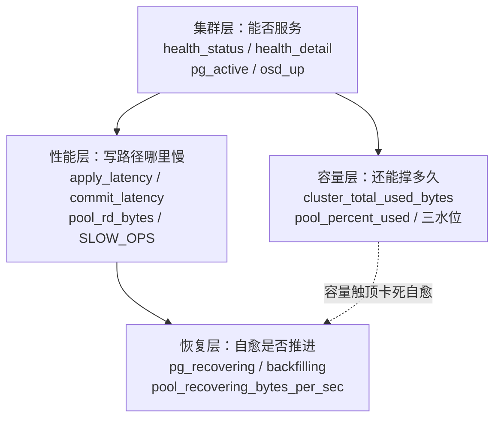
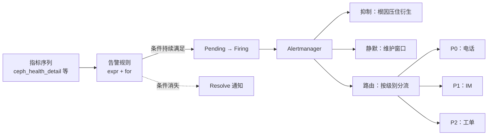

# 12 监控告警体系——Prometheus exporter 与关键指标

**摘要：**

2017 年 Luminous 发布时，Ceph 给运维送了两份礼物：一份是 BlueStore，另一份是 ceph-mgr 的 prometheus 模块——前者管好了数据怎么存，后者第一次让集群原生说出了 Prometheus 方言。在此之前，看住一个 Ceph 集群靠的是 cron 定时跑 `ceph -s` 再用脚本解析文本输出，告警滞后、噪音大、脚本还脆；在此之后，集群的每一次降级、每一块慢盘、每一分容量增长，都变成了 `/metrics` 端点上一行行可查询、可绘图、可触发电话的时间序列。本文沿「采集—指标—告警—存储—日志—巡检」的主线展开：先讲清 mgr prometheus 模块与 ceph-exporter 的分工从何而来，再逐层拆解集群、容量、性能、恢复四层核心指标的含义、健康区间与异常指纹，然后落到告警规则设计（分级、PromQL、去噪）与 Prometheus/VictoriaMetrics 生态的衔接，最后补齐日志事件与巡检自动化两块拼图。全文回答两个问题：`/metrics` 里几百个指标中，哪几十个值得你每天看；以及当告警响起时，如何让电话只在该响的时候响。

---

## 第 1 章 监控体系总览——指标从哪里来，到哪里去

### 1.1 采集点的三次搬家

Ceph 并非生来就有像样的监控。2012 年前后，看住一个集群的手段基本只有 `ceph -s` 加人肉经验，稍微成型的团队会用 Nagios 或 Zabbix 写自定义脚本，去解析 `ceph health` 的文本输出——文本格式一变，脚本就碎，而 Ceph 恰恰是一个输出格式随版本频繁演进的系统。更早的专用管理项目 Calamari 试图把监控与 Web 管理打包在一起，但它需要独立部署一套服务端，维护成本高，最终没有成为主流。

转折发生在 2016 年。Kraken 版本引入了 ceph-mgr 守护进程，把「汇总集群状态」的职责从 Monitor 剥离出来：MON 专心跑 Paxos 维护集群地图（见 [[中间件/Ceph/03 Monitor 与集群地图——Paxos、Quorum 与 MON 运维|03 Monitor 篇]]），mgr 负责聚合各守护进程上报的运行数据、执行 balancer 之类的后台决策，并对外提供 Dashboard、REST API 等管理面接口。这个搬家长远看是极划算的一步——因为 OSD 与 MON 本来就要定期向 mgr 上报性能计数器（perf counters），mgr 天然就是全集群运行数据的汇聚点。

2017 年 Luminous 发布，mgr 成为默认组件，同年 prometheus 模块随之落地。这个时间点选得巧：Prometheus 在 2016 年成为 CNCF 第二个项目，正是生态起飞的前夜，Ceph 等于直接搭上了可观测性（Observability）浪潮的头班车。此后演进一路加速：Nautilus（2019）让 Dashboard 内嵌 Grafana 面板；Octopus（2020）的 cephadm 把 Prometheus、Alertmanager、Grafana、node-exporter 整套监控栈纳入编排；Reef（2023）又把性能计数器的导出职责从 mgr 模块分给了新的 ceph-exporter 守护进程。十几年间采集点搬了三次家，但方向始终没变：**离数据更近，离数据面更远**。

不妨把 ceph-mgr 想象成集群的**统计局**：基层单位（OSD、MON、MDS、RGW）定期上报报表，统计局汇总归档，`/metrics` 端点就是统计局门口的公报窗口。记者（Prometheus）只需要按时来窗口取件，不必挨家挨户上门催表。这个比喻的技术对应是：mgr 通过 MMgrReport 消息收集所有 MgrClient 进程的计数器样本，缓存在环形缓冲区里，被抓取时从缓存取最新一份返回——数据面（客户端读写）与观测面（指标暴露）从此互不干扰。

反过来看，如果没有 mgr 这个集中采集点会怎样？Prometheus 要直接抓取几千个 OSD 的 admin socket，抓取风暴本身就是故障源；而文本解析脚本路线，则把集群版本升级变成了脚本维护者的噩梦。采集点的位置，是监控体系第一个值得权衡的架构决策。

### 1.2 prometheus 模块的工作方式

模块的启用是一条命令的事，但几个行为细节决定了它在生产里的表现：

```bash
# 启用后，active mgr 在 9283 端口暴露 /metrics
ceph mgr module enable prometheus

# 抓取间隔默认 15 秒，应与 Prometheus 侧的 scrape interval 对齐
# 官方不建议低于 10 秒——mgr 取数本身有成本
ceph config set mgr mgr/prometheus/scrape_interval 15
```

第一处细节是**缓存**。在超过千盘的大集群上，mgr 从全集群收集指标可能耗时超过抓取间隔，为此模块默认开启缓存，并提供了 `stale_cache_strategy` 旋钮：默认 `fail`，缓存过期就返回 503，让 Prometheus 明确知道这次抓取失败；改成 `return` 则容忍旧数据继续返回。选哪种取决于你要「诚实的空窗」还是「不中断的旧值」——对告警场景，503 更诚实，因为旧值可能掩盖正在发生的故障。

第二处细节是 **standby 行为**。mgr 是主备架构，只有 active 实例持有完整数据，standby 默认只返回一个简单的占位页面。生产环境建议把 `standby_behaviour` 设为 `error`（返回可配置的 4xx/5xx 状态码），让 Prometheus 把 standby 目标判定为 down，抓取自然全部落到 active 实例上；否则你会在面板里看到两份互相矛盾的「集群状态」。

第三处细节与健康检查有关。mgr 模块会跟踪集群健康检查的历史，把每一项检查暴露成一个离散指标——`ceph_health_detail{name="OSD_DOWN",severity="HEALTH_WARN"} 1.0` 这样的形式，0 表示未触发、1 表示触发中。历史默认保留 1000 条（`healthcheck_history_max_entries`），可用 `ceph healthcheck history ls` 回看、`ceph healthcheck history clear` 清空。这个设计是第 3 章全部告警规则的地基：**Ceph 自己先做了一层故障翻译，把内部状态机的变化翻译成有限的健康检查码，Prometheus 只需要盯这层码**。

> [!warning] 生产避坑：mgr 切主窗口是监控的天然盲区
> active mgr 发生故障切换时，新 active 的 `/metrics` 需要几秒到几十秒预热——它要等各守护进程的 MMgrReport 重新上报一轮，指标才完整。如果抓取配置里只写了一个 mgr 地址，切主瞬间就是监控黑洞，而那恰恰是集群最需要被观测的时刻。正确姿势是两条组合：把所有 mgr 实例都加入抓取目标，并把 `standby_behaviour` 设为 `error`，让故障切换由抓取失败自动接管；对监控自身再加一层兜底——对 `up{job=~"ceph.*"}` 连续失联做告警，监控失明本身也值得一声电话。

### 1.3 Reef 之后的分工——mgr 模块与 ceph-exporter

Reef 版本起，监控采集正式分成两摊：

| 组件 | 部署位置 | 职责 | 典型指标 |
| :--- | :--- | :--- | :--- |
| mgr prometheus 模块 | active mgr 上，端口 9283 | 集群级汇总指标、服务发现端点、RBD 镜像指标 | `ceph_health_*`、`ceph_pg_*`、`ceph_pool_*`、`ceph_cluster_*` |
| ceph-exporter | 每台主机一个 | 读本机各守护进程的 admin socket，导出性能计数器 | `ceph_osd_*`、`ceph_mon_*`、`ceph_mds_*`、`ceph_rgw_*` |
| node_exporter | 每台主机一个 | 主机层资源指标 | CPU、内存、网络、文件系统 |

分家的动机是性能：让单一 mgr 汇聚全集群所有守护进程的 perf 计数器，在大规模集群上会拖垮 mgr 本身，所以 Reef 之后 mgr 模块默认不再导出 perf 计数器（`exclude_perf_counters` 默认 `true`），改由跑在每台主机上的 ceph-exporter 就地采集。ceph-exporter 还提供了一个很有用的健康信号 `ceph_daemon_socket_up`——守护进程能否响应 admin socket，1 为健康、0 为异常，进程活着但接口僵死的情况靠它才能发现。

这里有一个升级路上的知名暗坑：从 Quincy 升级到 Reef 后，ceph-exporter 不会被自动部署（cephadm 刻意避免在升级过程中增删服务），如果运维没有手动 `ceph orch apply ceph-exporter`，所有 OSD 性能指标会凭空消失，Grafana 面板大面积变灰——这不是故障，是采集架构换代了。升级检查清单里应该有一条：确认 ceph-exporter 已在每台主机就位，再核对指标是否恢复。

### 1.4 node_exporter 与 Dashboard 的位置

node_exporter 与 Ceph 本身无关，但它提供的主机层指标是 Ceph 告警体系不可缺的另一半：官方规则里的 `CephNodeDiskspaceWarning` 用 `predict_linear(node_filesystem_free_bytes[2d], 5d) < 0` 预测根分区即将写满，`CephNodeNetworkPacketDrops` 盯网卡丢包——这些都不是 Ceph 指标能回答的问题。**Ceph 的故障有一类根源根本不在 Ceph 里**，网络抖动、磁盘坏道、时钟漂移，都要靠主机层指标先行发现。

Dashboard 的角色则常被误解。它消费 prometheus 模块的数据渲染状态页，内嵌 Grafana 面板做可视化，但它不产生告警——告警的出口是 Alertmanager。三者各司其职：exporter 管采集，Grafana 管展示，Alertmanager 管出口。很多团队误以为「装了 Dashboard 就有告警了」，结果故障发生时唯一的通知渠道是用户投诉，这个误会值得在架构设计阶段就澄清。下图把整条链路画在一起：



读这张图的要点是分清三段职责：集群内是「上报与聚合」，平台内是「存储、计算与出口」，而人只应该出现在链路的最末端。中间任何一段出问题——mgr 的缓存过期、抓取目标失联、Alertmanager 宕机——都会让整条链路失明，所以监控自身也需要被监控（譬如对 `up{job="ceph"}` 本身做告警），这是所有监控体系共同的元问题。

---

## 第 2 章 核心指标详解——读懂 /metrics 里的每一行

mgr prometheus 模块暴露的指标数以百计，但真正值得每天看的不过几十个。本章按「集群—容量—性能—恢复」四层展开，每层回答三个问题：这个指标在说什么、健康时长什么样、异常时它指向哪里。不妨把整章当作一份体检报告的解读手册——血常规、心电图、影像各查各的事，合起来才是全身的判断。四层的分工如下图所示，越往下越贴近硬件与负载，越往上越贴近「业务能不能用」：



读图的要点是右下那条虚线：容量与恢复不是两个独立的问题，水位触顶会先卡死自愈路径，这也是容量告警必须趁早的原因，2.3 节展开。

### 2.1 集群层——ceph_health_status 与 ceph_health_detail

`ceph_health_status` 是整个指标体系里最粗的一根：0 为 HEALTH_OK，1 为 HEALTH_WARN，2 为 HEALTH_ERR。它适合做「总闸」——一个数字判断集群整体是否健康，适合放在所有面板的左上角。但只有总闸是不够的：WARN 既可能是「一块盘 down 了」，也可能是「集群即将写满」，两者的紧急程度天差地别，用同一根电话线通知它们，要么打扰过度，要么反应不足。

细粒度由 `ceph_health_detail` 承担。mgr 模块把每项健康检查暴露成一个独立序列，name 标签是检查码，severity 标签是严重度：

```text
ceph_health_detail{name="OSDMAP_FLAGS",severity="HEALTH_WARN"} 0.0
ceph_health_detail{name="OSD_DOWN",severity="HEALTH_WARN"} 1.0
ceph_health_detail{name="PG_DEGRADED",severity="HEALTH_WARN"} 1.0
```

常用的检查码与它们的含义如下表，这张表与 [[中间件/Ceph/05 PG 状态机与数据一致性——Peering、Recovery 与 Backfill|05 PG 篇]] 的判级表一脉相承——健康检查码本质上就是 PG 状态机与集群旗标变化的对外投影：

| 检查码 | 含义 | 紧急程度 |
| :--- | :--- | :--- |
| `OSD_DOWN` | 有 OSD 被标记 down | 关注（大面积则紧急） |
| `OSD_NEARFULL` | 有 OSD 越过 nearfull 水位 | 关注，需容量动作 |
| `PG_AVAILABILITY` | 有 PG 无法服务读写 | 紧急（数据不可用） |
| `PG_DEGRADED` | 冗余度下降，恢复中 | 关注（不收敛则告警） |
| `PG_DAMAGED` | Scrub 发现数据损坏 | 告警（需 repair） |
| `PG_BACKFILL_FULL` / `PG_RECOVERY_FULL` | 容量卡死自愈路径 | 紧急 |
| `OSDMAP_FLAGS` | 集群旗标（noout 等）挂起 | 核对是否计划内 |
| `BLUESTORE_SPURIOUS_READ_ERRORS` | BlueStore 检测到伪读错误 | 告警，查介质 |

判读的关键在于理解这层翻译的**有损性**：`OSD_DOWN` 不区分「进程崩溃重启中」与「盘彻底坏了」，`PG_DEGRADED` 不区分「恢复正在推进」与「恢复已被卡死」。健康检查码是集群喊话的第一声，但喊完之后要判断严重程度，还得回到下一层指标。

### 2.2 集群层——PG 计数与 OSD 在岗

PG 状态计数是 mgr 模块导出的核心序列，按池（pool_id 标签）分组：`ceph_pg_active`、`ceph_pg_clean`、`ceph_pg_total`，以及 `ceph_pg_degraded`、`ceph_pg_recovering`、`ceph_pg_backfilling`、`ceph_pg_stale`、`ceph_pg_incomplete` 等按状态命名的计数。两个基本健康率是：

```promql
# 集群整体的服务能力与副本健康度，两者都应恒为 100%
sum(ceph_pg_active) / sum(ceph_pg_total) * 100
sum(ceph_pg_clean)  / sum(ceph_pg_total) * 100
```

active 率回答「能不能服务」，clean 率回答「副本齐不齐」，这与 05 篇对状态串的拆读完全一致。单看一个数字容易误判，组合起来才是完整指纹，譬如：

| 指标组合 | 指纹 | 判级 |
| :--- | :--- | :--- |
| `ceph_pg_degraded > 0` 且 `ceph_pg_recovering > 0` | 正在自愈，恢复推进中 | 关注 |
| `ceph_pg_degraded > 0` 且 `ceph_pg_recovering == 0` 持续 | 恢复被卡（限速、水位、旗标） | 告警 |
| `ceph_pg_stale > 0` | Primary 失联，IO 受损 | 紧急 |
| `ceph_pg_incomplete > 0` | 权威历史无法重建 | 紧急，数据风险 |
| `ceph_pg_backfill_wait` 大量堆积 | 恢复在排队（常见于扩容后） | 关注节奏 |

OSD 在岗率是另一个基本盘。`ceph_osd_up` 与 `ceph_osd_in` 是逐 OSD 的 0/1 序列（ceph_daemon 标签），`count(ceph_osd_up == 0)` 是 down 的盘数，`count(ceph_osd_in == 0)` 是被踢出集群的盘数。两者的差值有讲究：down 但尚未 out 的 OSD 处在 `mon_osd_down_out_interval`（默认 600 秒）的宽限期内，Monitor 在赌它只是进程崩溃重启；up 但 in 的盘则多半是被人为 out 的（维护操作或权重调整）。官方规则把「down 比例超过 10%」定为 critical（`CephOSDDownHigh`），因为批量故障意味着 Peering 风暴与冗余骤降叠加，性质完全不同于单盘故障。

还有一个容易被忽略的均衡指标 `ceph_osd_numpg`——每块 OSD 承载的 PG 数。它平时不响不叫，但 balancer 关闭或 CRUSH 权重配错时，个别 OSD 的 PG 数会显著偏离均值，故障时这些盘要重协商的 PG 也格外多。巡检时看一眼它的分布，比事后处理 Peering 风暴便宜得多。

### 2.3 容量层——三水位与 percent_used

容量指标分两个口径。集群层是 `ceph_cluster_total_bytes`、`ceph_cluster_total_used_bytes`、`ceph_cluster_total_avail_bytes`——注意这是**原始容量口径**，副本与 EC 开销都算在内；池层是 `ceph_pool_stored`（用户数据，不含保护开销）、`ceph_pool_stored_raw`（含保护开销）、`ceph_pool_max_avail` 与 `ceph_pool_percent_used`。逐盘口径则是 `ceph_osd_stat_bytes` 与 `ceph_osd_stat_bytes_used`，用来定位「哪几块盘先满」。

判读容量的框架，就是 05 篇 5.5 节讲过的三条水位线：nearfull（默认 0.85）触发 HEALTH_WARN，backfillfull（默认 0.90）让相关 PG 卡在 `backfill_toofull`，full（默认 0.95）直接拒绝写入。用水库来比喻最贴切——**nearfull 是汛限水位，到线就要启动泄洪准备；backfillfull 是禁止向库区引水，上游来水只能另寻出路；full 是坝顶，漫坝就是事故**。三条线之间的距离不是随便定的，它是留给人的处置窗口。

为什么容量告警要设在 85% 而不是 95%？算一笔账就清楚：从当前水位到 full 的缓冲时间，等于剩余空间除以增长速率。85% 触警时，你还有 10% 的容量缓冲，按一个日均增长 0.5% 的集群算，是 20 天的处置窗口——足够走完「发现倾斜、采购扩容、数据迁移」的完整流程。等到 95% 才告警，写入已经濒临 ENOSPC，而且 backfillfull 在 90% 就先卡死了自愈能力——坏一块盘，新副本无处可迁，冗余持续下降。**容量问题的可怕之处从来不只是「存不下」，而是「自愈先瘫痪」**：水位线告警的全部意义，就是在滑坡链的第一级就把你叫醒。

逐盘视角同样重要。集群总量健康不代表局部健康：CRUSH 权重配错、某台主机多插了几块大盘，都会让局部先触顶。`ceph osd df` 的 utilization 列配合 `ceph_osd_stat_bytes_used / ceph_osd_stat_bytes` 的逐盘比值，是发现倾斜的第一手材料；`OSD_NEARFULL` 检查码触发时，第一动作是 `ceph osd tree` 查权重，而不是急着扩容。

> [!info] 水位线与告警体系的映射
> 三条水位线可以直接翻译成三级信号：nearfull 触发的 `OSD_NEARFULL` 检查码适合映射为 P1 告警（IM 通知，工作时间处理）；backfillfull 触发的 `PG_BACKFILL_FULL` 是官方定级的 critical（P0，电话）——因为它意味着自愈路径已被卡死；full 水位则不该等告警，写入报错（ENOSPC）本身就是业务方递过来的通知。再配一条 P2 的 predict_linear 趋势告警（3.3 节），容量观测就形成了「预测—警戒—卡死—拒绝写入」四级完整的梯度，每一级都有明确的响应方式。

### 2.4 性能层——apply latency 与 commit latency

OSD 层最重要的两个延迟指标是 `ceph_osd_apply_latency_ms` 与 `ceph_osd_commit_latency_ms`（Reef 后由 ceph-exporter 导出）。它们的语义值得掰开讲清，因为这是思考题里最容易答错的一对：

- **commit latency**：一次写操作从开始到写入 WAL（Write-Ahead Log，写前日志）并完成 sync 的耗时。它是「账本落袋」的时间——数据进了日志，即使进程崩溃也不会丢。
- **apply latency**：同一次写操作被应用到后端数据存储（BlueStore 的数据盘）的耗时。它是「货上架」的时间——数据真正落到最终位置。

BlueStore 的写路径是先写 WAL、再异步 apply 到数据区，所以正常情况下 **apply latency 大于等于 commit latency**。两者异常的含义也不相同：commit 高而 apply 正常，指纹指向 WAL 设备本身——SSD 写放大、WAL 与 RocksDB 共享盘的争抢、WAL 盘劣化；apply 高而 commit 正常，指纹指向后端——数据盘碎片化、compaction 高峰挤占、恢复流量抢 IO、HDD 寻址风暴；两者同步走高且差距收窄，多半是整条写路径都慢了——盘整体劣化或负载过载。下表把判读收成一张速查：

| 现象 | 指纹 | 优先排查 |
| :--- | :--- | :--- |
| commit 高，apply 正常 | WAL 落盘慢 | WAL 盘健康度、共享盘争抢、写放大 |
| apply 高，commit 正常 | 后端应用积压 | 数据盘碎片、compaction、恢复抢 IO |
| 两者同步走高 | 整条写路径变慢 | 盘劣化、负载过载、网络（副本写） |

健康区间没有放之四海的数字：全闪集群的 commit latency 通常在毫秒以下，HDD 集群个位数到十几毫秒都属常见，EC 池与副本池、大对象与小对象的基线也各不相同。**真正有信号量的不是绝对值，而是与自身基线的偏离**——某块 OSD 的 apply latency 持续是同伴的两倍，比「绝对值 20ms」更能说明问题。把每块 OSD 的延迟画成热力图，离群的点会自己浮出来。

还要留意一个统计口径的坑：这两个值是 OSD perf 计数器的**长时均值**（long running average），对瞬时毛刺天然钝感。它们适合看趋势、找离群盘，不适合用来证明「刚才那一秒卡了一下」——后者要靠慢请求指标与 `ceph daemon osd.N dump_historic_ops` 的历史操作分布。

基线的建立没有捷径，只有积累。集群上线后的头几周，把每块 OSD 的 apply/commit latency 记录下来作为基线，之后的一切判读都以「偏离自身基线多少」为准绳——换盘、扩容、负载结构变化之后，基线要重新校准。这套笨功夫的价值在于：延迟告警的阈值从「拍一个绝对值」变成「偏离基线的百分比」，误报与漏报都会显著减少。监控做得久了你会发现，**基线是唯一不会过时的告警阈值**。

### 2.5 性能层——池吞吐、RBD 与多接口指标

池层吞吐是容量之外最常看的性能视图。`ceph_pool_rd` 与 `ceph_pool_wr` 是读写 IOPS 计数器，`ceph_pool_rd_bytes` 与 `ceph_pool_wr_bytes` 是字节吞吐，都是 counter 类型，用 `rate()` 取速率：

```promql
# 按池聚合的读写吞吐，定位热点池；join 元数据拿到池名
sum by (pool_id) (rate(ceph_pool_rd_bytes[5m]))
  * on (pool_id) group_left(name) ceph_pool_metadata
```

RBD 的镜像级指标默认不采集——官方的理由很直接：镜像数量可能极大，指标基数（Cardinality）会拖垮 mgr 模块。需要时用 `rbd_stats_pools` 指定池列表开启，之后 `ceph_rbd_read_bytes`、`ceph_rbd_write_bytes`、`ceph_rbd_read_ops`、`ceph_rbd_write_ops` 以及成对的 `ceph_rbd_read_latency_sum/count` 等序列会按镜像粒度出现（image、pool、namespace 标签）。这套指标是 [[中间件/Ceph/07 RBD 块存储——快照、克隆与 Kubernetes CSI|07 RBD 篇]] 讲的「吵闹邻居」定位与 QoS 治理的数据基础，但开启前务必估算基数：一万镜像乘以十几个序列，就是十几万活跃序列，采集端与存储端都要有准备。

RGW 与 MDS 的性能计数器在 Reef 后经 ceph-exporter 暴露：RGW 侧有请求计数、失败请求、按 bucket 与按 user 的操作序列，是对象存储多租户计量与限流的数据源；MDS 侧的会话与请求指标，则是 [[中间件/Ceph/08 CephFS——MDS、多活元数据与实践边界|08 CephFS 篇]] 讨论元数据负载时的观测入口。这些接口级指标共同构成一个规律：**越靠近业务语义的指标，基数越大、价值也越高，但采集与存储的代价同步上升**——这个权衡我们在 4.4 节还会回来算账。

### 2.6 恢复层——恢复是否在推进

恢复层的指标回答一个看似简单的问题：集群正在自愈吗，自愈在推进吗？核心序列有两组。一组是 PG 状态计数：`ceph_pg_recovering` 与 `ceph_pg_backfilling` 是正在恢复的 PG 数，`ceph_pg_recovery_wait` 与 `ceph_pg_backfill_wait` 是排队等待的 PG 数。另一组是池级恢复吞吐：`ceph_pool_recovering_bytes_per_sec` 与 `ceph_pool_recovering_objects_per_sec`，直接对应 `ceph -s` 里 recovery io 行的数字。

判读恢复的三个层次：

1. **在恢复吗**：`ceph_pg_recovering + ceph_pg_backfilling > 0` 说明自愈在进行。扩容、换盘后出现是预期行为，05 篇 5.3 节的限速参数决定了它对业务的影响节奏。
2. **在推进吗**：恢复计数大于零，但 `recovering_bytes_per_sec` 长时间为零，说明恢复被卡住了。最常见的两个卡点：目标盘越过 backfillfull 水位（`backfill_toofull`），或者 `norecover`/`nobackfill` 旗标忘了解除。前者查容量，后者查旗标，处置方向完全不同。
3. **恢复完了吗**：收敛的判据是 `ceph_pg_degraded` 归零、clean 率回到 100%。恢复期间业务延迟上升是预期代价（05 篇 5.6 节拆过五条影响路径），但「慢」与「风险积累」要分开告警——前者是 P2 的节奏问题，后者是 P1 的冗余问题。

恢复层指标还有一个容易被忽视的用途：**验证限速调优的效果**。调大 `osd_max_backfills` 或恢复优先级后，`recovering_bytes_per_sec` 的曲线是否如期抬升、业务延迟曲线是否仍在可接受区间，是检验调优是否值得的唯一标准。没有这组指标的对照，恢复调优就只是玄学。

---

## 第 3 章 告警规则设计——从指标到电话

指标是原料，告警才是产品。这一章讨论如何把前一章的指标翻译成「谁在什么时候被以什么方式打扰」的规则体系。告警设计的头号敌人不是漏报，而是疲劳——当电话响十次有九次是狼来了，第十次真狼来的时候，没有人再接电话。运维行业给这个现象起过一个精确的名字：告警疲劳（Alert Fatigue），它不声不响地杀死监控体系——规则还在跑，通知还在发，但人的信任已经耗尽。

### 3.1 分级——P0、P1 与 P2 的边界

分级不是给告警贴标签，而是对「响应承诺」的显式声明：P0 意味着有人必须立刻放下手里的事，P1 意味着工作时间尽快处理，P2 意味着进工单按节奏消化。Ceph 场景下的一个参考分级如下：

| 级别 | 定义 | 典型场景 | 通知方式 | 响应预期 |
| :--- | :--- | :--- | :--- | :--- |
| **P0** | 数据可用性或安全性正在受损 | PG 无法服务 IO、OSD down 超过 10%、MON 失去 quorum、容量触顶写入报错 | 电话 + IM | 15 分钟内响应 |
| **P1** | 冗余受损但集群可自愈 | 单盘 down、PG degraded 持续不收敛、OSD nearfull、慢请求持续 | IM 群通知 | 工作时间尽快 |
| **P2** | 趋势与卫生类 | 容量预测触顶、scrub 超期、PG 数量失衡、恢复吞吐长期为零 | 工单 + 周报 | 排期处理 |

分级的落点有几条经验。其一，**P0 要少而准**：P0 的数量直接决定值班体系能否长期运转，超过每周一单的 P0 频率，说明分级或阈值有问题。其二，P2 要多而全：趋势类的信号宁可先进工单，也不要为了「省事」把它们升成告警。其三，分级要与集群的冗余设计对齐——size=3、min_size=2 的池，单盘 down 只是冗余下降，业务无感，定 P1 是合理的；同样的故障发生在 EC 池上，受影响 PG 的写入会直接停摆（05 篇 3.5 节讲过这个差异），就该升 P0。**同样的盘故障，在不同的保护策略下是不同的故障**，分级规则必须体现这一点。

还有一条容易被忽略的工程要求：告警规则本身要可测试。上线一条新规则前，不妨用历史数据回放——把过去一个月的指标喂给规则，看它会在哪些时刻触发、触发的那些时刻事后看是否真的需要人。PromQL 的查询是幂等的，回放成本极低，而它换来的是规则上线前就能估算误报率。没有经过回放的规则，本质上是在拿值班人员的睡眠做实验。

### 3.2 官方规则拆解——ceph-mixin 的五个范本

Ceph 官方在源码仓库里维护了一套告警规则（`monitoring/ceph-mixin/prometheus_alerts.yml`），Rook 与 cephadm 生态都在使用，几乎全部建立在 `ceph_health_detail` 之上。拆解其中五条，比从零写规则学得快：

```yaml
# P0 范本：PG 无法服务，且不能归因于单盘 down
- alert: CephPGUnavailableBlockingIO
  expr: ((ceph_health_detail{name="PG_AVAILABILITY"} == 1)
         - scalar(ceph_health_detail{name="OSD_DOWN"})) == 1
  for: 1m
  labels:
    severity: critical

# P1 范本：单盘 down，给足自愈窗口再打扰人
- alert: CephOSDDown
  expr: ceph_health_detail{name="OSD_DOWN"} == 1
  for: 5m
  labels:
    severity: warning

# P1 范本：慢请求持续 5 分钟
- alert: CephSlowOps
  expr: sum(ceph_daemon_health_metrics{type="SLOW_OPS"}) > 0
  for: 5m
  labels:
    severity: warning

# P0 范本：容量卡死自愈（backfillfull / recovery full）
- alert: CephPGBackfillAtRisk
  expr: ceph_health_detail{name="PG_BACKFILL_FULL"} == 1
  for: 1m
  labels:
    severity: critical

# P2 范本：scrub 超期（校验卫生，见 06 Scrub 篇）
- alert: CephPGNotScrubbed
  expr: ceph_health_detail{name="PG_NOT_SCRUBBED"} == 1
  for: 5m
  labels:
    severity: warning
```

第一条规则最值得细品。`PG_AVAILABILITY` 触发只说明有 PG 不服务，但单盘 down 也会短暂触发它——而单盘 down 时，只要在岗副本不低于 min_size，PG 很快重新选主恢复服务，并不值得电话。官方的做法是在查询层做减法：`PG_AVAILABILITY` 减去 `OSD_DOWN`，只有「PG 不服务、且不能用单盘 down 解释」时才触发 P0。这其实是把**根因告警抑制衍生告警**的思路，用 PromQL 在查询层实现了——不依赖 Alertmanager 的抑制配置，规则本身就自带降噪。

第二条的 `for: 5m` 同样是深思熟虑：盘抖动 30 秒内自愈是常态，Monitor 还有 600 秒的 down_out 宽限期兜底，5 分钟的持续条件把「抖一下」与「真下线」分开，代价是真故障晚 5 分钟通知——这个交换是划算的，因为单盘 down 本身有自愈兜底。对比第一条的 `for: 1m`：IO 已经阻塞，每多等一分钟都是业务损失，持续条件就该短。**for 的长度应该与「不干预的后果严重度」成反比**，这是所有告警规则里最普适的一条设计原则。

### 3.3 容量预测——predict_linear 的用法与局限

容量告警的难点在于：水位告警（nearfull）触发时，往往已经来不及从容处置了。真正有用的是趋势告警——在触顶之前预告触顶。官方规则用的是 PromQL 的线性外推函数：

```promql
# 池层：按近 2 天的增长斜率外推，若 5 天内越过 95% 则触发
predict_linear(ceph_pool_percent_used[2d], 3600 * 24 * 5) >= 95

# 主机层：根分区按近 2 天斜率外推，5 天内写满则触发
predict_linear(node_filesystem_free_bytes{device=~"/.*"}[2d], 3600 * 24 * 5) < 0
```

`predict_linear` 对窗口内的样本做最小二乘（Least Squares）线性回归，再外推指定秒数后的值。它适合平稳增长的业务数据——数据库、对象存储的日常累积。但它本质是**天气预报，不是判决书**：批量导入会让斜率骤变，周末低谷会拉低斜率造成误报，删除大批数据后旧斜率还会惯性报警。所以官方把这类规则放在 warning 档，且建议配合较长的时间窗口（2 天）平滑噪声。笔者的实践建议是：预测告警定 P2、配 `for: 1h`，触发后进入人工容量评审，而不是直接驱动扩容动作——它报的是趋势，决策仍要回到容量规划。

主机层那条规则提醒我们另一件事：Ceph 的容量告警不能只看 Ceph 指标。OSD 的数据盘是 BlueStore 直管的块设备，但 WAL/DB 盘、`/var/log`、容器运行时的根分区都活在主机文件系统上，这些地方写满同样能打死 OSD。**Ceph 指标与 node_exporter 指标必须放在同一套规则体系里**，只盯 `ceph_cluster_*` 的容量面板是不完整的。

### 3.4 去噪——for、keep_firing_for 与抑制

告警去噪有四个层次，从规则内到规则外：

1. **触发侧防抖（for）**：前面已讲，持续时长条件过滤抖动。经验配置是 P0 用 1-5 分钟、P1 用 5-15 分钟，再长就会漏掉需要人介入的真故障。
2. **恢复侧防抖（keep_firing_for）**：Prometheus 2.42 引入的规则字段，让告警在条件消失后再保持触发状态一段时间，专治「恢复-复发」的乒乓告警——OSD 抖动场景下，没有它，一晚上能收到十几轮 down/resolve 通知。
3. **抑制（inhibition）**：在 Alertmanager 里配置根因告警抑制衍生告警——OSD 批量 down 时，抑制由此衍生的 PG degraded 告警，只让根因告警发声。3.2 节的减法规则是在查询层实现同一思路，两者可以配合使用。
4. **静默（silence）**：计划内维护（扩容、升级、换盘）提前设置静默窗口，配合 `noout` 之类的集群旗标，让维护期的预期告警不打扰值班，同时保留非预期告警的通路——静默要按检查码精确圈定范围，而不是整集群静音。



还有一条常被忽略的收尾：**恢复通知要配好**。告警触发时电话打过去了，恢复时值班却只能靠猜——下次同样的告警响起，他会本能地想「上次是不是自己好了」。resolve 通知与触发通知走同样的分级通路，值班才能建立「每声电话都有始有终」的信任，这份信任是告警体系最脆弱也最宝贵的资产。

> [!info] 去噪的本质是信息论问题
> 告警去噪的四个手段——for、keep_firing_for、抑制、静默——看似是四个独立开关，实则在做同一件事：提高每条通知的信息熵。一条告警的价值等于「它出现时你获得的新信息量」，重复触发、衍生告警、维护期预期告警的信息量都趋近于零，把它们过滤掉，剩下的每声电话才携带决策所需的信息。判断去噪是否到位有一个朴素标准：值班人员收到告警时，是先看内容还是先叹气。

---

## 第 4 章 与 Prometheus/VictoriaMetrics 生态的衔接

Ceph 的监控数据出口是标准的 Prometheus exposition 格式，这意味着它可以接入整个可观测性生态。这一章讨论两种主流落地：cephadm 自带的监控栈，与以 VictoriaMetrics 为核心的自建采集链路。

### 4.1 cephadm 监控栈与服务发现

cephadm 可以一键部署整套监控组件：`ceph orch apply prometheus`、`ceph orch apply alertmanager`、`ceph orch apply grafana`、`ceph orch apply node-exporter`、`ceph orch apply ceph-exporter`，组件间的抓取关系与告警规则自动配好，Dashboard 内嵌的 Grafana 面板也随之可用。对从零起步的团队，这是成本最低的路径。

对已有 Prometheus 的团队，cephadm 提供了服务发现（Service Discovery）端点：`https://<mgr地址>:8765/sd/`，返回标准 `http_sd_config` 格式的抓取目标，外部 Prometheus 直接对接即可：

```yaml
scrape_configs:
  - job_name: ceph-exporter
    http_sd_configs:
      - url: http://mgr-host:8765/sd/prometheus/sd-config?service=ceph-exporter
    honor_labels: true   # 保留 Ceph 自带的 instance 标签，避免被抓取端覆盖
```

`honor_labels` 这一行值得单独解释：Ceph 集群有多个 mgr 实例，指标里自带的 instance 标签标识了数据真正归属的节点；若不开启 honor_labels，Prometheus 会用「从哪里抓到」的地址覆盖它，多 mgr 场景下同一个 OSD 的指标会因抓取路径不同而带上不同的 instance 标签，序列被人为割裂。这类标签语义的细节，是自建采集时最容易踩的暗坑。

### 4.2 vmagent remote-write 采集实践

另一种流行架构是用 VictoriaMetrics 承接存储：vmagent 负责抓取（配置与 Prometheus 的 scrape_configs 兼容），通过远程写入（Remote Write）协议把数据推给 VictoriaMetrics，vmalert 按规则评估告警（可以直接复用 ceph-mixin 的规则文件，数据源指向 VM），Alertmanager 出口保持不变：

```bash
# vmagent：抓取 + 推送
vmagent -promscrape.config=/etc/vm/scrape.yml \
        -remoteWrite.url=http://vm-single:8428/api/v1/write

# vmalert：规则评估，复用官方 ceph-mixin 规则
vmalert -datasource.url=http://vm-single:8428 \
        -rule=/etc/vm/ceph-alerts.yml \
        -notifier.url=http://alertmanager:9093
```

为什么不少团队最终把 Ceph 指标搬进了 VictoriaMetrics？三个理由出现频率最高。其一是**长期保留的成本**：容量趋势分析需要至少一年的数据，Prometheus 本地存储在这个时间跨度上的磁盘占用与查询性能都不占优，VM 官方口径下的压缩率与内存占用显著更低。其二是**多集群汇入**：管理多套 Ceph 集群的团队，可以把所有集群的指标汇入同一个 VM，用 cluster 标签区分——ceph-mixin 的规则本就带着 cluster 标签设计，天然支持这种汇入。其三是**基数管理**：VM 提供活跃序列数上限等防护参数，配合预聚合，能挡住 2.5 节那种 RGW per-bucket 指标的基数风暴。

不过 VM 不是免费的午餐。它对 Prometheus 生态的兼容是高度兼容而非完全等价——个别行为细节（譬如 staleness 的处理时机）有差异，迁移前要对告警规则做回归验证；团队熟悉的两套 Prometheus 生态工具（譬如某些服务发现机制）未必都有 VM 对应物。笔者的建议是：小规模单集群，cephadm 自带栈最省心；多集群汇管、长周期容量分析、存储成本敏感的场景，VM 的收益才真正兑现。**采集层选型没有高下之分，只有与团队现状的匹配之分**。

> [!warning] 生产避坑：remote write 链路自身要有水位观测
> 推送式采集引入了一条新的故障域：vmagent 与 VM 之间的网络、VM 的写入压力、磁盘水位，任何一环堵塞都会让指标静默积压甚至丢失，而面板上看起来只是「曲线停在昨天」。落地时给这条链路配三个哨兵：vmagent 的发送队列积压量、remote write 的失败重试计数、VM 侧的写入速率——三者任一异常都应触发 P1 告警。监控链路自身失明，是所有监控事故里最难发现的一类，因为它不会在任何面板上留下「异常」的形状，只留下「没有形状」。

### 4.3 Grafana 面板——概览盘的分层设计

面板是指标的日常消费形态。cephadm 部署的 Grafana 自带官方面板集（源码仓库 `monitoring/ceph-grafana-dashboards`），与 Dashboard 模块内嵌集成；自建 Prometheus 的场景，社区面板（譬如 Grafana 面板库里的 Ceph Cluster 概览盘）也是成熟的起点。无论用哪套，概览盘的信息分层值得自己设计，因为它应该与排障路径一致：

| 层 | 回答的问题 | 代表图元 |
| :--- | :--- | :--- |
| 总览层 | 现在健康吗 | health_status、OSD up/in 计数、容量水位、PG 状态分布堆叠图 |
| 池层 | 哪个池异常 | 池吞吐速率、池延迟、percent_used 走势 |
| OSD 层 | 哪块盘不对劲 | apply/commit latency 热力图、逐盘利用率 |
| 恢复层 | 自愈在推进吗 | recovering/backfilling 计数、恢复吞吐速率 |

设计原则只有一条：**先回答「是否健康」，再回答「哪里不健康」，最后才是「为什么」**。总览层一眼扫过就该给出结论，下钻路径与第 2 章的指标分层严格对应——面板与排障路径脱节的代价，是故障时没人记得打开它。

面板的维护还有一个反直觉的经验：**少即是多**。概览盘上每多一个图元，关键图元的被看见概率就下降一分。判断一个图元是否该留在总览层，标准是「过去一个月它有没有改变过任何人的判断」——没有的话，挪到下钻层或删掉。面板和告警规则一样会腐化：集群扩了三轮、池加了两批之后，最初的面板设计多半已经跟不上现在的排障路径，季度性的面板复盘与告警复盘应该放在同一次会上。

### 4.4 指标基数——完备性与成本的权衡

最后算一笔成本账。Ceph 监控的指标基数大致是：OSD 数乘以每 OSD 序列数，加池数乘以池序列数，再加 RBD 镜像数与 RGW bucket 数乘以各自的序列数。千盘集群轻松产出数十万活跃序列，万级镜像的 RBD 池一开镜像指标就再添十几万。基数直接换算成采集端的内存、存储端的磁盘与查询时的延迟。

控制手段按层分布：采集侧，Reef 后的 `exclude_perf_counters` 默认把 perf 计数器从 mgr 模块卸载给 ceph-exporter，新版本社区还在推进按优先级（prio_level）裁剪低价值序列的机制；存储侧，VM 支持基数上限与预聚合；设计侧，最有效的其实是「按需开启」——RBD 镜像指标只对治理吵闹邻居的池开启，RGW 的 per-bucket 明细只保留头部租户。监控的完备性与监控系统的成本是一对永恒的权衡，**把基数预算花在回答过真实问题的指标上，才是可观测性的性价比之道**。

---

## 第 5 章 日志与事件——指标之外的另一半真相

指标回答「现在是否异常」，但「异常从几点开始、之前发生了什么、谁动过配置」，要靠日志与事件流回答。这一章补齐可观测性的另一半。

### 5.1 ceph -w 与集群日志通道

Ceph 维护着一份集群日志（cluster log）：由 MON 汇聚的高层事件流，记录健康检查的触发与恢复、OSD 的 up/down、scrub 的结果、MON 选举等全局事件，默认写在 MON 所在主机的 `/var/log/ceph/ceph.log`。命令行上，`ceph -w` 实时跟踪默认的 cluster 通道——先打印一份当前状态快照，然后滚动输出每条新事件；`ceph log last n` 回看最近 n 条；`ceph -W <通道>` 可以指定跟踪其他通道。

集群日志的价值与指标互补：**指标告诉你血压高了，日志告诉你几点开始高的、之前干了什么**。复盘一次故障时，指标曲线回答「什么时候坏的、坏了多久」，集群日志回答「坏之前发生过什么」——譬如 OSD down 之前有没有连续的心跳超时记录，PG degraded 之前有没有 scrub 报错。没有日志的指标排障，等于只看结果不看病史。

一条真实感十足的集群日志大致长这样（节选）：

```text
2026-08-12T22:14:03 mon.a [WRN] Health check update: 1 osds down (OSD_DOWN)
2026-08-12T22:14:05 mon.a osd.7 marked down
2026-08-12T22:15:41 mon.a [INF] Health check update: Degraded data redundancy: 2100000/25200000 objects degraded (8.333%) (PG_DEGRADED)
2026-08-12T22:24:05 mon.a osd.7 marked out (weight 3.63)
2026-08-12T23:02:17 mon.a [INF] Health check update: Degraded data redundancy cleared (PG_DEGRADED cleared)
```

读这份时间线，故障的完整叙事一目了然：22:14:03 健康检查先喊话，22:14:05 盘被标记 down，22:15:41 冗余下降的量化数字跟上；600 秒宽限期后（22:24:05）仍未回归，Monitor 将其标记 out，触发 CRUSH 重映射与数据迁移；23:02:17 冗余恢复、告警解除。指标曲线给出的是这条时间线的连续投影，日志给出的是离散的转折点——两者对齐之后，故障的「何时发生、如何演进、何时收敛」才真正闭合。

### 5.2 audit 与 cephadm 通道

cluster 之外还有两条专用通道。audit 通道记录经 REST 接口（Dashboard、restful 模块）下达的每一笔操作——谁在什么时候改了什么配置、动了哪个池。用 `ceph -W audit` 实时跟踪，落盘后是审计与复盘的关键材料：很多「集群怎么突然开始大规模迁移了」的悬案，最后都在 audit 日志里找到某次无人知晓的 CRUSH map 修改。生产集群建议把 audit 日志纳入统一采集与合规归档。

cephadm 通道记录编排器自身的事件：服务部署、升级进度、主机检查与配置检查（config-check）的结果。`ceph -W cephadm` 实时跟踪，`ceph log last cephadm` 回看；需要更细的日志时把 `mgr/cephadm/log_to_cluster_level` 调到 debug。升级窗口里这条通道就是进度条——扩缩容与版本升级流程的可观测性，主要就靠它。

至于守护进程自身日志，cephadm 时代默认进 journald（`journalctl -u ceph-osd@N`），老版本在 `/var/log/ceph/`。排障时把 `debug osd` 之类级别调高要克制——日志量本身就是 IO 负载，在已经出问题的 OSD 上开 debug 日志，常常是给病人加跑步机。

### 5.3 指标、日志与事件的互补

把三种观测手段放在一起，各自的生态位就清楚了：

| 维度 | 指标 | 集群日志/事件 | audit 日志 |
| :--- | :--- | :--- | :--- |
| 回答的问题 | 现在是否异常 | 何时开始、经过如何 | 谁改了什么 |
| 时效 | 秒级，可实时告警 | 事件驱动，实时或回看 | 事后审计为主 |
| 告警适用性 | 主力（规则驱动） | 辅助（关键字匹配） | 不适用 |
| 留存建议 | 监控库，长周期 | 统一采集（Loki/ELK） | 合规归档 |

落地上有一条实用建议：**告警通知里附上上下文链接**——触发时刻前后的集群日志检索链接、相关面板的截图链接。值班从「收到告警」到「看到上下文」的时间，是故障恢复时间线里最容易压缩的一段，而这段压缩只需要在 Alertmanager 的通知模板里加一行链接。

---

## 第 6 章 巡检自动化——把人从盯屏中解放出来

告警是被动触发，巡检是主动体检。这一章讨论如何让机器替人完成日常检查，把人的注意力留给真正的异常。

### 6.1 内置健康检查体系

巡检的第一层不是自己写脚本，而是读懂 Ceph 内置的健康检查。集群的健康检查由 MON 与 mgr 各功能模块持续产出：核心的 OSD/PG/容量检查之外，devicehealth 模块基于 SMART 数据做盘的寿命预测（`ceph device monitoring on` 开启后，预测到寿命将尽的盘会触发 `DEVICE_HEALTH` 系列检查，可用 `ceph device predict-life-expectancy` 查询具体预测）；cephadm 模块提供主机可达性与配置一致性检查（CEPHADM 系列，含 MTU 一致性、网卡链路速率、内核安全策略、网络成员等 config-check 项）；pg_autoscaler 的 warn 模式会在 PG 数量与建议值偏离过大时给出 HEALTH_WARN（05 篇 6.2 节）。

这套内置体系的覆盖面比很多人以为的宽：盘要坏了、主机配置漂移了、PG 数量失衡了、scrub 超期了，官方都已经替你想好。两个配套命令值得记住：`ceph health mute <检查码>` 可以静音单项检查（维护场景比全局静默精确得多）；prometheus 模块维护的健康检查历史（`ceph healthcheck history ls`）能回答「这个检查码最近一个月触发过几次」——巡检报告里，历史触发频率比单次快照更有信息量。

devicehealth 模块值得多说两句，因为它把「被动等盘坏」变成了「主动预测盘坏」。开启设备监控后，mgr 会汇总各主机的 SMART 数据，对每块盘做寿命预期（life expectancy）预测，预测剩余寿命低于阈值的盘会触发健康检查，提醒你在盘真正下线之前安排更换。对大盘阵列来说，这是一条从「救火」转向「计划性维护」的通道——盘的故障率随服役年限上升是存储工程的常识，与其等 RAID 式的惊叫，不如按预测名单分批换盘，把每次一块的故障节奏变成计划内的更换节奏。

### 6.2 自定义巡检脚本——JSON 输出解析

内置检查覆盖不了的，用脚本补齐。思路是固定的三段式：ceph 命令加 `--format json` 拿结构化数据，jq 或 Python 解析并计算阈值，结果输出到 IM 或工单。几个常用命令的取数清单：

| 命令 | 拿什么 | 注意什么 |
| :--- | :--- | :--- |
| `ceph status --format json` | 总体健康、容量、客户端 IO、恢复速率 | 单次调用即可覆盖大半巡检面 |
| `ceph osd df --format json` | 逐盘容量与利用率 | 定位局部触顶与倾斜 |
| `ceph osd tree --format json` | CRUSH 拓扑与权重 | 校验故障域结构与权重错误 |
| `ceph health detail --format json` | 全部健康检查明细 | checks 字段逐项解析 |
| `ceph versions` | 版本分布一致性 | 升级后确认无残留旧版本 |
| `ceph pg dump --format json` | 逐 PG 状态 | 大集群开销大，优先用指标替代 |

一个最小可用的脚本骨架如下，重点不在功能而在结构——每段只做一件事，输出人话：

```bash
#!/usr/bin/env bash
# 巡检骨架：只取 JSON、只算阈值、只输出异常项
set -euo pipefail

# 逐盘利用率：一次调用拿全量，避免循环逐盘查询
ceph osd df --format json | jq -r '
  .nodes[] | select(.type == "osd")
  | "\(.name) \(.utilization)"' |
while read -r osd util; do
  # 与其记阈值，不如与集群中位数比：离群的盘才是问题
  echo "$osd $util"
done

# 健康检查明细：checks 字段逐项展开，跳过 OK 项
ceph health detail --format json | jq -r '
  .checks | to_entries[]
  | "\(.key) [\(.value.severity)] \(.value.summary.message)"'
```

三条工程经验。其一，频率克制：巡检走 mgr 与 MON 的管理通道，`pg dump` 在大集群上并不便宜，分钟级的全量巡检反而制造风险；高频检查交给指标告警，巡检做低频的深度核对。其二，结果要留存：巡检的价值一半在当次、一半在趋势——池增速、PG 数量偏差、延迟基线的逐周对比，是容量评审与升级决策的原始材料。其三，输出到人真正看的地方：巡检报告发进没人看的群，等于没有巡检；接进工单系统或值班晨报，才有闭环。

> [!note] 设计哲学：巡检与告警是同一张网的两层
> 巡检脚本与告警规则检查的常常是同一批数据，区别只在时效与深度：告警是高频、浅层、面向「是否越线」，巡检是低频、深层、面向「是否合理」。PG 数量与建议值的偏离，告警可以盯「是否触发 HEALTH_WARN」，巡检则回答「偏离了多久、趋势朝哪边」。两层各司其职的标志是：告警漏掉的缓慢劣化，巡检能兜住；巡检发现的突发异常，告警早已先一步叫人。如果你的巡检总能发现告警没报的新问题，说明告警规则该更新了；反过来，如果巡检天天报的都是告警早已覆盖的内容，巡检清单该精简了。

### 6.3 巡检项分级表

把前两节的内容收拢成一张按频率分级的巡检清单，作为本章的落点：

| 频率 | 巡检项 | 数据来源 | 异常动作 |
| :--- | :--- | :--- | :--- |
| 实时（告警承担） | health 状态、OSD down、PG inactive、容量水位 | `ceph_health_detail` 等指标 | 分级告警 |
| 每日 | 恢复收敛情况、慢请求趋势、scrub 覆盖率、池增速 | 指标曲线 + `ceph -s` | 趋势异常进工单 |
| 每周 | CRUSH 权重与均衡度、PG 数量建议、容量预测复核、版本一致性 | `osd df`、autoscale-status、`versions` | 出巡检周报 |
| 每月 | SMART 寿命预测、告警规则有效性复盘、容量规划评审 | devicehealth、告警历史 | 采购与规则修订 |

这张表里最值得强调的是最后一行的「告警规则有效性复盘」：统计过去一个月每条规则触发的次数与其中可行动（actionable）的比例，可行动比例低于一半的规则，要么调阈值、要么降级、要么删除。**巡检不只检集群，也检监控体系自身**——告警规则和集群一样，会随着规模与负载的变化而腐化。

---

## 第 7 章 小结

Ceph 的监控告警体系可以收拢成一条主线：**集群自己先翻译故障，监控体系再翻译重要性，人只处理最后剩下的那一点**。

- **采集层**：mgr prometheus 模块管集群级汇总指标，ceph-exporter（Reef 起）管守护进程性能计数器，node_exporter 管主机层——三者分工的动机是让观测面远离数据面。
- **指标层**：四层各有关键问题——集群层问「能否服务」（active 率、OSD 在岗），容量层问「还能撑多久」（三水位与增长斜率），性能层问「写路径哪里慢」（apply 与 commit latency 的分野），恢复层问「自愈是否推进」（恢复计数与吞吐的组合判读）。
- **告警层**：分级是对响应承诺的显式声明，for 的长度与不干预的后果严重度成反比，去噪靠触发侧防抖、恢复侧防抖、抑制与静默四件套。
- **出口层**：cephadm 自带栈是最低成本路径，VictoriaMetrics 在多集群汇管与长周期分析上兑现收益，选型落点是与团队现状的匹配。
- **补充层**：集群日志回答「何时开始」，audit 回答「谁改了什么」，巡检把低频深度核对自动化——指标之外的这两块拼图，常常在复盘时比曲线更有价值。

行文至此，本专栏从 RADOS 与 CRUSH 的设计原点出发，途经 MON、OSD、PG、Scrub 的内部机制，走过 RBD、CephFS、RGW 三大接口，最后落在部署、运维与监控的工程实践上。回头看会发现一条贯穿始终的线索：**复杂性不会消失，只会转移**——Ceph 把数据一致性与故障自愈的复杂性收进了集群自身，而这份复杂性的出口，就是你在监控面板与告警电话里看到的一切。监控体系做得好不好，本质上是在回答：集群转移出来的复杂性，你的团队能否用可承受的成本接住。至于告警响起之后如何一步步走到根因，那是故障案例的领地，我们下一篇再谈。

---

## 参考资料

1. Ceph Documentation — Prometheus Module（模块配置、缓存与 standby 行为、健康检查指标）：https://docs.ceph.com/en/latest/mgr/prometheus/
2. Ceph Documentation — Monitoring overview（监控栈总览、ceph-exporter、池与 RBD 指标）：https://docs.ceph.com/en/latest/monitoring/
3. Ceph Documentation — Monitoring a Cluster（`ceph -w` 与集群日志、健康检查静音）：https://docs.ceph.com/en/latest/rados/operations/monitoring/
4. Ceph Documentation — Health checks（健康检查码清单）：https://docs.ceph.com/en/latest/rados/operations/health-checks/
5. Ceph Documentation — cephadm services: monitoring（监控栈部署与服务发现端点）：https://docs.ceph.com/en/latest/cephadm/services/monitoring/
6. ceph/ceph 仓库 — monitoring/ceph-mixin/prometheus_alerts.yml（官方告警规则集）：https://github.com/ceph/ceph/blob/main/monitoring/ceph-mixin/prometheus_alerts.yml
7. Ceph Reef Release Notes（ceph-exporter 引入与 perf 计数器分家）：https://docs.ceph.com/en/latest/releases/reef/
8. VictoriaMetrics Documentation（vmagent、vmalert 与单机版部署）：https://docs.victoriametrics.com/
9. 站内相关：[[中间件/Ceph/00 专栏导览|专栏导览]] · [[中间件/Ceph/01 Ceph 全局架构——RADOS、CRUSH 与三大存储接口|01 架构篇]] · [[中间件/Ceph/03 Monitor 与集群地图——Paxos、Quorum 与 MON 运维|03 Monitor 篇]] · [[中间件/Ceph/04 OSD 与 BlueStore——存储引擎深度解析|04 BlueStore 篇]] · [[中间件/Ceph/05 PG 状态机与数据一致性——Peering、Recovery 与 Backfill|05 PG 篇]] · [[中间件/Ceph/06 Scrub 与数据校验——静默错误的防线|06 Scrub 篇]] · [[中间件/Ceph/07 RBD 块存储——快照、克隆与 Kubernetes CSI|07 RBD 篇]] · [[中间件/Ceph/08 CephFS——MDS、多活元数据与实践边界|08 CephFS 篇]]

---

> [!note] 思考题
> 1. `ceph_osd_apply_latency_ms` 与 `ceph_osd_commit_latency_ms` 分别度量写路径的哪一段？BlueStore 的写路径决定了两者正常时谁大谁小？如果某块 OSD 的 commit latency 稳定在毫秒级、apply latency 却持续是同伴的三倍，你会优先排查数据盘还是 WAL 盘？反过来，如果两者同步走高且差距收窄，指纹又指向什么？
> 2. 容量告警为什么要在 85%（nearfull）而不是 95%（full）触发？请用「处置窗口 = 剩余空间 ÷ 增长速率」估算你的集群从 85% 到 95% 有几天缓冲，再考虑 backfillfull（0.90）先卡死自愈能力这一层——如果告警阈值定在 95%，坏一块盘时集群会发生什么？你会把 predict_linear 的预测告警定在哪个水位、配多长的 for？
> 3. 深夜网络抖动导致 20 块 OSD 反复 up/down，Alertmanager 半小时里推了 40 条告警，值班电话被打爆，而集群实际已自愈。你会用哪些手段重构这套规则——触发侧的 for、恢复侧的 keep_firing_for、Alertmanager 的抑制与静默、还是把部分告警降级到 P2？其中「OSD down ≥ 10% 才升 P0」这类比例条件，为什么比「有 OSD down 就告警」更适合作为电话线的门槛？
