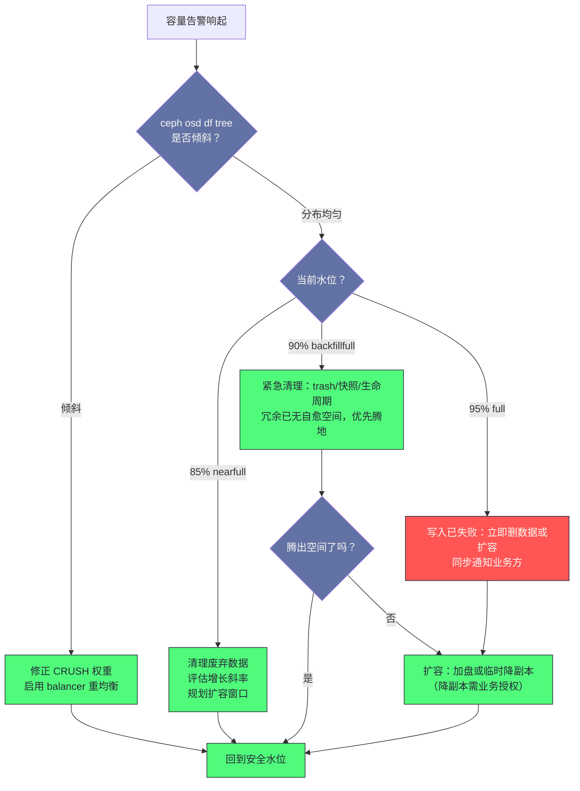

# 13 故障案例库——从告警到根因

**摘要：**

前十二篇把 Ceph 的机制逐一拆开讲过：CRUSH 如何放置数据、PG 状态机如何自愈、Monitor 如何维护集群地图、Scrub 如何揪出静默错误。但机制知识只有在故障现场才真正兑现价值——凌晨三点告警响起，你面前只有一行 HEALTH_WARN 与一串状态码，从这行字到根因之间隔着一条必须走对的路。本文先给出一套通用的排查方法论：用 `ceph health detail` 定位组件、逐层缩小范围、用命令验证假设，以及贯穿始终的「先保护后修复」原则；随后用六个典型案例把这条路径完整走一遍——OSD down 风暴、PG inactive/stale、慢请求（slow ops）、容量告警三级跳、MON quorum 丢失、CephFS 客户端僵死，每个案例都按现象、诊断命令链、根因分析、处置、预防五段展开，命令与示例输出可以直接照着敲；最后讨论如何把单次故障的教训沉淀为 runbook 与告警-预案映射表，让下一次响应从临场发挥变成按图施工。全文回答两个问题：告警响起之后，第一步该敲什么命令；以及如何让每一次故障都变成集群免疫力的来源。

---

## 第 1 章 故障排查方法论——从告警到根因的通用路径

### 1.1 排障是一场有序的收敛

不妨先设想一个场景：凌晨两点十七分，值班手机响了，告警内容只有一行——`HEALTH_WARN 6 osds down, 213 pgs degraded`。此刻你面对的不是一个问题，而是一个巨大的可能性空间：可能是盘坏了，可能是网络抖了，可能是某次变更引入的，甚至可能是监控自己出了问题。故障排查的本质，就是把这个巨大的可能性空间**有序地收敛**到一个可验证的根因上，而收敛的效率，取决于你有没有一条固定的路径。

打个比方，这就像城市里排查一处水管漏水：你不会挨家挨户撬开地板，而是先看水表确定漏没漏，再关闸分段试压，把范围从小区收敛到楼栋、从楼栋收敛到户内。Ceph 的排障也是同样的二分游戏，只是它比大多数系统友好——集群自己会把故障翻译成健康报表，你手里的每一条命令都在替你缩小搜索空间。整条通用路径可以收拢成四步：

| 阶段 | 入口命令 | 回答的问题 | 产出 |
| :--- | :--- | :--- | :--- |
| 全景确认 | `ceph -s`、`ceph health detail` | 集群现在缺什么 | 错误码清单与影响面 |
| 定位组件 | 错误码前缀（OSD_/PG_/MON_/MDS_） | 故障落在哪个子系统 | MON、OSD、PG 或 MDS 之一 |
| 缩小范围 | `osd tree`、`pg dump_stuck`、`osd perf` | 是哪块盘、哪个 PG、哪个网段 | 可验证的具体假设 |
| 验证假设 | 日志、perf 计数器、主机侧工具 | 假设是否与证据吻合 | 根因结论与处置方案 |

这四步的顺序不能乱。跳过全景直接钻进单块盘的日志，是新手最常见的弯路——你可能在排查一块确实很慢的盘，但真正让业务超时的却是另一台主机上的恢复流量。先看地图，再走进巷子，这是排查效率的第一道分水岭。

### 1.2 先保护后修复——止血旗标的优先级

排查路径之外，还有一条原则必须先立起来：**先保护，后修复**。消防队员到场后的第一动作是控制火势，而不是查找起火点；集群故障时同理，先让损失不再扩大，再去追根因。Ceph 为此准备了一组集群级旗标（flag），它们扮演的是止血带的角色——不治病，但防止失血：

```bash
ceph osd set noout        # 阻止 Monitor 将 down 的 OSD 标记 out，冻结数据迁移
ceph osd set norecover    # 暂停增量 Recovery
ceph osd set nobackfill   # 暂停 Backfill 迁移
ceph osd set noscrub      # 暂停轻量校验
ceph osd set nodeep-scrub # 暂停深度校验
ceph osd set norebalance  # 暂停数据重均衡
```

这些旗标的共同点是：它们都不停止业务读写，只暂停后台的数据搬运与校验。故障现场的混乱往往来自两股流量叠加——业务 IO 与恢复 IO 在同一批磁盘上争抢，值班人员分不清哪条延迟曲线是哪个原因造成的。先把后台任务挂起，故障现场就安静下来，剩下的信号才可读。

不过止血带不能一直绑着。每一个旗标都有代价：`noout` 挂得越久，降级窗口越长，期间任何一次二次故障都在消耗剩余冗余；`norecover` 期间集群的冗余度不再回升，相当于裸奔。所以止血动作必须与修复计划绑定——旗标打上的那一刻，就该写下「什么条件满足后解除」，否则止血带会从保护措施变成新的风险源。[[中间件/Ceph/05 PG 状态机与数据一致性——Peering、Recovery 与 Backfill|05 PG 篇]] 讨论过的恢复限速参数，与这些旗标是同一套权衡的两个刻度：旗标是开关，参数是旋钮。

### 1.3 变更记录——被低估的第一证据

排障时有一个问题永远值得先问：最近改了什么。绝大多数「莫名其妙」的故障，往前翻二十四小时的变更记录都能找到相关性——升级了版本、换了交换机板卡、调了某个参数、扩了一批盘。变更与故障的相关性不等于因果，但它是假设排序的第一优先级。

Ceph 自己保留了几份「变更台账」，排查时应当先翻：

```bash
# 查看最近的配置变更（谁在何时改了什么参数）
ceph config log

# 查看集群日志最近 100 行（健康状态翻转、告警、人工操作都有记录）
ceph log last 100

# 查看各节点运行的 Ceph 版本（排查混版本与升级中断）
ceph versions

# cephadm 部署下查看守护进程清单与运行状态
ceph orch ps
```

`ceph config log` 值得单独说明：它记录了集群配置的近期变更历史，包括修改时间、修改者与新旧值。生产环境里「有人调过参数但没人记得」是常态，这条命令能把口头的「我没动过」变成可查的证据。此外，Luminous 之后的版本还提供了健康检查的历史记录，`ceph healthcheck history ls` 可以回答「这个告警历史上触发过几次、最近一次是什么时候」——它经常能把「偶发抖动」和「慢性病」区分开。

> [!info] 没有变更记录的集群，故障排查成本翻倍
> 变更记录的价值不只在故障时追溯，更在于建立「变更—故障」的因果直觉。一个坚持记录变更的团队，半年后可以从历史里统计出哪类变更最容易触发告警，从而把变更窗口、灰度策略、回滚方案都建立在数据上；而没有记录的团队，每次故障都要从零开始猜。变更记录的成本极低——一条工单、一行日志——但它购买的，是故障现场最稀缺的资源：时间。

---

## 第 2 章 案例：OSD down 风暴——一次「集体掉线」的深夜

### 2.1 现象：监护仪上的成片报警

第一个案例从最常见的告警开始。某生产集群 60 块 OSD，凌晨两点值班群收到告警，20 余块 OSD 反复 up/down，`ceph -s` 的健康摘要如下（节选）：

```text
health: HEALTH_WARN
        22 osds down
        1 host down
        Degraded data redundancy: 1870000/25200000 objects degraded (7.42%),
        402 pgs unclean, 402 pgs degraded, 402 pgs undersized
  services:
    osd: 60 osds: 38 up, 60 in; 118 remapped pgs
```

半小时后告警自行恢复，OSD 全部回到 up 状态；再过一小时，同样的告警第三次响起。业务侧的表现是周期性的延迟毛刺——每次抖动持续十几秒，写入吞吐没有损失，但监控曲线上每隔半小时出现一道「锯齿」。这种「自己好了又反复发作」的故障最磨人：它不致命，但没人敢说它无害。

OSD 的心跳（heartbeat）机制值得在这里先交代一句：OSD 之间每 `osd_heartbeat_interval`（默认 6 秒）互发一次探测，连续 `osd_heartbeat_grace`（默认 20 秒）收不到回应，对端就会被上报给 Monitor 标记 down。这个设计好比宿舍楼里的点名——室友之间每隔几秒互相喊一声，谁没应答，大家就去告诉宿管（Monitor）。它假设的是「不回应等于人不在」，但网络抖动会制造另一种情形：人在，只是走廊里的声音传不过去。

### 2.2 诊断链：从 osd tree 到交换机端口

诊断的第一步不是看日志，而是看故障的空间分布。`ceph osd tree` 会把 down 的 OSD 按拓扑树排列，这一眼往往就能把范围缩小一个数量级：

```bash
# 看 down 的 OSD 是否集中在同一主机或同一机架
ceph osd tree | grep -B2 down
```

```text
-5         14.54263      host node03
 20   hdd  3.62790          osd.20   down  1.00000  1.00000
 21   hdd  3.62790          osd.21   down  1.00000  1.00000
 22   hdd  3.62790          osd.22   down  1.00000  1.00000
 23   hdd  3.62790          osd.23   down  1.00000  1.00000
```

本例中所有 down 的 OSD 都挂在 node03 下——故障不是「盘级」而是「主机级」，嫌疑立刻集中到这台主机的网卡、网线或上联交换机端口。如果 down 的 OSD 分散在多台主机但同属一个机架，则要怀疑机架级交换机；如果毫无拓扑规律，才需要考虑存储自身的问题（譬如 OOM 杀掉了 OSD 进程）。

第二步看抖动的直接证据。OSD 被误判 down 后重新收到集群地图，会在自己的日志里留下一句著名的话：

```bash
# "wrongly marked me down" 是网络抖动的指纹：OSD 认为自己活着，却被标记了 down
grep -c "wrongly marked me down" /var/log/ceph/ceph-osd.7.log
```

```text
14
```

一小时里出现 14 次，抖动的定性基本成立。第三步量化心跳质量——在可疑 OSD 的管理套接字（admin socket）上，`dump_osd_network` 会列出它与各对端的心跳往返延迟：

```bash
# 参数 0 表示列出全部对端；输出为 JSON，关注 ping_latency 字段
ceph daemon osd.7 dump_osd_network 0
```

```json
{
    "entries": [
        {
            "osd": 3,
            "last_ping_sent": "2026-09-04T02:17:29.101388+0800",
            "ping_latency": {"avgcount": 4120, "sum": 138.52},
            "life_expectancy": [{"min": 1, "max": 2}]
        }
    ]
}
```

`sum/avgcount` 约等于平均心跳延迟——38 毫秒的均值对内网来说明显偏高，正常应当在 1 毫秒以内。最后一步把范围收敛到物理层：在主机上用 `ping -i 0.2` 打到同交换机的对端，观察丢包与延迟抖动；用 `ethtool -S <网卡>` 查看错误计数是否增长；再登录交换机查看该端口的 CRC 错误与光模块收发光功率。本例最终在交换机侧确认：上联端口的光模块老化，误码率间歇性飙升——每次飙升持续几十秒，恰好对应一轮「集体掉线又回来」。

### 2.3 根因：心跳超时的连锁反应

把证据串起来，故障链是一条清晰的连锁反应：光模块误码升高，node03 与外界的心跳包开始丢失；对端 OSD 连续 20 秒收不到回应，按 `osd_heartbeat_grace` 的规则把它上报给 Monitor；Monitor 将这批 OSD 标记 down，OSDMap epoch 推进，受影响的 PG 立刻进入 Peering；十几秒后误码恢复，OSD 重新上报，又被标记 up，PG 再次 Peering。如此往复，每一次翻转都是一次 Peering 风暴的引信。

这里有一个值得专门指出的保护机制的边界。Monitor 侧的 `mon_osd_min_in_ratio`（默认 0.75）会阻止「批量 out」——当 in 状态的 OSD 占比跌破 75%，Monitor 不再自动把它们标记 out，防止一次网络故障演变成全集群数据大迁徙。本例 60 块盘 down 了 22 块，占比 63%，已经触发这个保护，所以没有发生迁移雪崩。**但这个保护只挡得住「批量 out」，挡不住「反复翻转」**——OSD 反复 up/down 时，每一次翻转都推进一次 epoch，Peering 的速度赶不上地图变化的速度，PG 就会长时间卡在 peering 或 stale。这也是为什么抖动（flapping）被公认为比单纯宕机更危险的故障形态：它不消耗磁盘，消耗的是集群的协商能力。

顺带补一个容易被忽略的细节：OSD 被标记 down 有两条路径——对端 OSD 心跳超时后主动上报，以及 Monitor 等待 `mon_osd_report_timeout`（默认 900 秒）仍收不到该 OSD 的自报。前者快，后者慢，这也是网络抖动时 down 状态会「先由邻居报告、再由本人申辩」的原因，而 `wrongly marked me down` 正是申辩环节留下的痕迹。理解这两条路径，你就能解释一个常见现象：抖动期间告警里的 down 名单每次都不完全一样——谁先超时、谁先申辩，取决于心跳包丢失的时序，而不是盘的健康状况。

### 2.4 处置：先止血，再修路，后放行

处置按三步走，顺序不能颠倒。第一步止血，给抖动源挂上免战牌：

```bash
# 冻结数据迁移：抖动期间最危险的是 down/out 反复触发 remapped 迁移
ceph osd set noout
```

第二步修网络。把 node03 的上联端口隔离，换光模块、换线或切换到备用端口，期间这批 OSD 保持 down 状态即可——`noout` 在手，Monitor 不会触发迁移，PG 只是降级运行，业务读写不受影响。修好端口后逐块拉起 OSD，用 `ceph osd stat` 观察 epoch 是否稳定（连续几分钟不再跳变）。

第三步才是放行：

```bash
# 确认网络稳定、OSD 全部 up 后，解除冻结，让恢复流程接管
ceph osd unset noout
# 观察 recovery io 行，确认恢复速率与业务延迟都在可接受范围
ceph -s
```

有一个细节值得强调：`noout` 只阻止「标记 out」，不阻止「标记 down」。也就是说挂上 `noout` 之后，抖动的 OSD 依然会被反复标 down、触发 Peering——止血带挡住的是数据迁徙，不是心跳风暴。真正的止血是把抖动源从网络里摘出去，这也是为什么修网络必须排在 `unset noout` 之前。

### 2.5 预防：把抖动挡在集群之外

这个案例的预防清单有四条。其一，网络层冗余：MON 与 OSD 的内网值得做双上联（bond）或双交换机，光模块与网线纳入定期更换计划——它们是集群里最便宜、也最容易被忽略的部件。其二，把交换机端口的错误计数接入监控，CRC 错误的斜率往往比心跳告警早几天暴露问题。其三，告警去噪——本例半小时推了 40 条告警，值班电话被打爆反而掩盖了重点，[[中间件/Ceph/12 监控告警体系——Prometheus exporter 与关键指标|12 监控篇]] 讨论过的触发侧防抖与比例条件（譬如「down 的 OSD 超过 10% 才升级为电话告警」）正是为这种场景准备的。其四，把「网络抖动到 OSD 风暴」的处置流程写进 runbook，让值班同学在告警响起的第一分钟就知道先打 `noout`，而不是先去重启 OSD。

---

## 第 3 章 案例：PG inactive/stale——当 PG 凑不齐开会的人

### 3.1 现象：可用性告警与两串状态词

第二个案例的告警级别比 down 风暴高一级。某集群在一次计划外断电后，健康摘要出现：

```text
HEALTH_WARN 41 pgs degraded; 6 pgs stuck inactive; 2 pgs incomplete
[WRN] PG_AVAILABILITY: Reduced data availability: 6 pgs inactive, 2 pgs incomplete
    pg 4.1f is stuck inactive for 2h, current state incomplete, last acting [3,5]
    pg 4.24 is stuck inactive for 2h, current state peering, last acting [3,5,9]
```

与上一章的 degraded 不同，inactive 意味着这些 PG 当前无法服务读写——落在这些 PG 上的业务请求会挂起等待。[[中间件/Ceph/05 PG 状态机与数据一致性——Peering、Recovery 与 Backfill|05 PG 篇]] 讲过，PG 的主干状态里 active 回答「能否服务」，而 inactive/stale/incomplete 这一支，回答的是「为什么不能」。stale 的含义是 Primary 长时间没有向 Monitor 上报状态，inactive 的含义是 PG 还没完成 Peering、没有可用的 Primary——两者经常成对出现，因为一个卡死的 PG 既开不了会，也就没人来签到。

### 3.2 诊断链：顺着 acting set 往下挖

诊断的第一条命令，把所有卡住的 PG 一次性捞出来：

```bash
# 列出卡在 inactive/stale 状态超过阈值（默认 60 秒）的 PG
ceph pg dump_stuck inactive stale
```

```text
ok
pg_stat   state       up      up_primary   acting   acting_primary
4.1f      incomplete  [3,5]   3            [3,5]    3
4.24      peering     [3,5,9] 3            [3,5,9]  3
```

读这张小表的关键是 acting 列——`4.1f` 的 acting set 只剩 `[3,5]` 两个成员，如果这个池的 min_size 是 2，两个成员恰好踩线；但注意它的状态是 incomplete 而不是 active+degraded，说明协商没有完成。对可疑 PG 做一次深度查询，`ceph pg` 支持对单个 PG 发起 query，返回 JSON 格式的协商现场：

```bash
# 对单个 PG 查询 Peering 现场，重点看 recovery_state 与 acting
ceph pg 4.1f query
```

```json
{
    "state": "incomplete",
    "acting": [3, 5],
    "recovery_state": [
        {
            "name": "Started/Primary/Peering",
            "enter_time": "2026-09-04T00:41:02.113488+0800",
            "probe_osds": [3, 5],
            "prior_set": {"probes": [9], "down": [9]}
        }
    ]
}
```

这段输出就是确诊书：`prior_set` 显示 OSD.9 处于 down 状态，而它正是这个 PG 历史上的关键成员——没有它的 PG log，剩下的 `[3,5]` 无法拼出完整的权威历史（Authoritative History），Peering 因此停在半路。再核对成员状态，`ceph osd tree` 确认 osd.9 所在主机整夜没有起来（该主机断电后带外管理电源异常），诊断链闭合：**PG 卡住的直接原因是 acting set 缺员，缺员的根因是一台主机没能恢复**。

### 3.3 根因分类：缺员与卡壳

生产中的 PG inactive 大体可以归成几类，处置方向完全不同，值得用一张表分清楚：

| 根因类别 | 特征指纹 | 验证方法 | 处置方向 |
| :--- | :--- | :--- | :--- |
| **min_size 不满足** | acting set 成员数低于池 min_size，状态含 incomplete | `ceph osd pool get <pool> min_size` 对照 acting 数量 | 让成员回归；确认数据安全前不轻易调低 min_size |
| **Peering 卡住** | 成员齐但状态长期停在 peering/activating | `ceph pg <id> query` 看 enter_time 是否久远 | 查 OSD 日志与 epoch 增速，必要时重启 Primary |
| **Primary 失联** | 成员在岗但状态 stale | `ceph pg map <id>` 对照 up/acting 两套名单 | 检查 Primary OSD 进程与网络 |
| **历史断裂** | 状态 incomplete 且 prior_set 含永久丢失的 OSD | 结合故障序列评估 | 最后手段，见下文 |

第一类是设计使然的保护行为。min_size 的语义是「低于这个副本数，宁可拒绝服务也不放松一致性」——副本池 size=3、min_size=2 时，两个成员在岗本可继续服务；但 EC 池的 min_size 对齐的是数据分片数 K，K=4 的池缺一个分片就连读都无法重建，表现会苛刻得多。第二类则是故障本身：Peering 需要 acting set 里的成员互相交换 PG log，任何一方失联或响应过慢，协商就停在原地。区分两类的方法很简单——看 acting set 的成员数量是否达标，达标还卡着是协商问题，不达标是缺员问题。

### 3.4 处置与预防：让成员回来，而不是让门槛降低

处置的优先级排序是：先让缺员成员回来，再考虑调整参数。本例的处置就是恢复那台主机的供电，OSD 起来后 Peering 在几十秒内自动完成，PG 回到 active+clean——多数 inactive 案例的结局都是如此，**缺员是常态，断裂才是事故**。

不过有两类参数动作需要单独交代边界。其一是临时调低 min_size（`ceph osd pool set <pool> min_size 1`）：它能让 PG 立刻恢复服务，但代价是单副本承载写入，此时再坏一块盘就是真丢数据，所以这个动作只应在「业务可用性优先于数据安全」的明确授权下使用，并且用完即改回。其二是最后手段——当缺员 OSD 确认永久丢失（盘已物理损毁且无备份可迁），Peering 永远凑不齐权威历史，此时 `ceph osd lost <id>` 与 `ceph pg force-create-pg <pgid>` 可以强制集群放弃这段历史、就地重建 PG。这两条命令的语义是「承认这块盘上的数据不再可恢复」，执行前的确认环节必须拉上数据owner，而不是值班同学单方面拍板。

预防上，这个案例的教训大多落在架构层。min_size 与 size 的规格设计要在建池时想清楚（[[中间件/Ceph/10 集群部署实战——cephadm 与生产规格设计|10 部署篇]] 有专章讨论），EC 池尤其要意识到 min_size 对齐 K 的苛刻语义；带外管理（IPMI/电源）要纳入巡检，本例的主机之所以整夜起不来，正是带外管理通道失效导致无人能远程开机；最后，`PG_AVAILABILITY` 这类可用性告警应当配置为立即通知而非工作时间处理——inactive 的每一分钟，都是业务在替存储扛。

---

## 第 4 章 案例：慢请求（slow ops）——后厨为什么出菜慢了

### 4.1 现象：延迟毛刺与 slow ops 计数

第三个案例没有「坏」，只有「慢」。业务方投诉晚高峰写入延迟从 5 毫秒涨到 200 毫秒，偶发超时；`ceph -s` 的输出里多了一行平时没有的内容：

```text
health: HEALTH_WARN
        1 slow ops, oldest one blocked for 42 sec, daemons [osd.17] have slow ops.
```

慢请求（slow ops）是 Ceph 对「操作在 OSD 侧排队过久」的统称——Monitor 发现某些 OSD 的操作队列里存在超过阈值（默认 30 秒）仍未完成的请求，就在健康摘要里点名。它是一个症状而不是病因：请求慢的原因可能在磁盘、可能在恢复流量、可能在校验任务、也可能在锁等待，诊断的工作就是把症状拆成病因。[[中间件/Ceph/12 监控告警体系——Prometheus exporter 与关键指标|12 监控篇]] 讲过，性能层的告警要区分「写路径哪里慢」，本章给出的正是从症状到病因的完整走法。

### 4.2 诊断链：先找离群者，再看它在忙什么

第一步用 `ceph osd perf` 做一次全员体检，找出延迟离群的 OSD：

```bash
# commit/apply 延迟单位为毫秒，重点看是否有 OSD 显著高于同伴
ceph osd perf
```

```text
 osid  commit_latency(ms)  apply_latency(ms)
    0                 1.8                 1.7
    1                 2.1                 2.0
   17               318.4               316.9
   42                 2.1                 2.0
```

osd.17 的延迟是同伴的百倍以上，嫌疑锁定。第二步看它在忙什么——`dump_ops_in_flight` 会列出该 OSD 当前所有在飞操作（ops in flight）及其耗时分解：

```bash
# 查看在飞操作：description 是操作内容，events 里是各阶段的耗时
ceph daemon osd.17 dump_ops_in_flight
```

```json
{
    "num_ops": 214,
    "ops": [
        {
            "description": "osd_op(client.4160.0:88421 2.1f:bar [write] ...)",
            "age": 41.7,
            "flag_point": "queued for pg",
            "events": [
                {"event": "header_read", "duration": 0.000012},
                {"event": "throttled", "duration": 38.9},
                {"event": "waiting_for_pg"}
            ]
        }
    ]
}
```

`flag_point` 与 `events` 是这段输出的灵魂：`queued for pg` 加上 38 秒的排队时长，说明请求不是「处理慢」而是「排不上队」——OSD 的处理队列被什么东西占满了。第三步确认占用者是谁，两个命令分别回答「谁在排队」与「盘有多慢」：

```bash
# 查看被阻塞的操作与阻塞点
ceph daemon osd.17 dump_blocked_ops

# BlueStore 的 commit_lat 反映事务落盘耗时，是判断「盘慢」的直接证据
ceph daemon osd.17 perf dump bluestore
```

```json
{
    "bluestore": {
        "commit_lat": {"avgcount": 51234, "sum": 1982.7},
        "submit_lat": {"avgcount": 51234, "sum": 12.3}
    }
}
```

`commit_lat` 的均值约 38 毫秒（sum/avgcount），而 `submit_lat` 只有 0.2 毫秒——请求提交很快、落盘极慢，指纹直指磁盘本身。最后在主机侧用 `iostat -x 1` 复核：若 `%util` 长期贴着 100%、`await` 高达几十毫秒，磁盘饱和的结论就可以落笔了。

### 4.3 根因分类：后厨的四种拥堵

慢请求像餐厅出菜慢——客人（客户端）只觉得等得久，但后厨拥堵的原因至少有四种，对应四种完全不同的处置。用一张表把指纹与处方列清楚：

| 根因 | 特征指纹 | 验证命令 | 处置方向 |
| :--- | :--- | :--- | :--- |
| **磁盘饱和** | 单盘 commit latency 离群，iostat util 接近 100% | `ceph osd perf`、`iostat -x 1` | 限流、迁移负载或换盘 |
| **恢复抢 IO** | `ceph -s` 的 recovery io 行有速率，PG 大量 degraded/remapped | `ceph -s` 对比客户端 io 与 recovery io | 恢复限速或临时 `norecover`（见 05 篇） |
| **Scrub 争抢** | PG 状态串含 scrubbing/deep-scrubbing，时间点与 scrub 窗口吻合 | `ceph pg dump pgs_brief` 过滤 scrubbing | `noscrub` 止血，调整 scrub 时间窗（见 06 篇） |
| **锁等待** | ops 卡在 `waiting_for_lock` / `waiting for readable` | `dump_ops_in_flight` 看 flag_point | 定位持锁 PG 的热点对象与业务模式 |

四类拥堵对应后厨的四种病因：采购口堵了（磁盘物理能力到顶）、后厨在赶员工餐（恢复流量抢占了灶台）、月度盘点占了操作台（scrub 与业务争抢）、传菜口排起了长队（锁等待）。它们的缓解手段完全不同，所以诊断必须走到「哪一类」这一步才能动手——笼统地「重启 OSD」对前两类或许侥幸有效，对锁等待则完全无效。

### 4.4 处置：对症下药，而不是一针激素

磁盘饱和型：先确认是「这一块盘慢」还是「这一批盘都慢」。单盘离群通常是盘体劣化，计划内更换（`ceph osd out osd.17` 让数据迁走后换盘）是根治方案；一批盘同时高负载，则要查业务侧是不是有新的批量任务。恢复抢 IO 的处置在 [[中间件/Ceph/05 PG 状态机与数据一致性——Peering、Recovery 与 Backfill|05 PG 篇]] 已经展开：调低 `osd_max_backfills`、调高 `osd_recovery_sleep`，或业务高峰期临时 `norecover`。Scrub 争抢的止血是 `ceph osd set noscrub`（或只停深度校验 `nodeep-scrub`），长期方案是把 scrub 窗口约束到业务低峰（`osd_scrub_begin_hour`/`osd_scrub_end_hour`），并给 deep scrub 设置 `osd_scrub_sleep` 让出磁盘间隙——校验策略的系统讨论见 [[中间件/Ceph/06 Scrub 与数据校验——静默错误的防线|06 Scrub 篇]]。

锁等待是最特殊的一类：它不消耗磁盘，表现为个别 PG 的请求长时间 `waiting for lock`，而同盘其他请求正常。典型场景是某个热点对象被高频覆写（譬如计数器、热点小文件），或快照修剪（snaptrim）与写入在同一 PG 上互等。处置方向不在 Ceph 参数，而在业务侧——拆散热点、加缓冲，或者把该对象挪到更分散的命名空间。这也是慢请求排查的一条经验：**四类根因里，三类靠运维手段解决，一类要靠架构沟通解决**。

处置之外，还有一层「调度器」的背景值得交代。OSD 内部操作队列的调度器由 `osd_op_queue` 控制：老一代的 wpq（Weighted Priority Queue）按优先级权重排队，客户端 op 的默认优先级（63）远高于恢复与 scrub，这正是「恢复给业务让路」在队列层面的实现；新一代的 mClock 调度器则把份额分配显式化，按 profile 给客户端、恢复与后台任务各划一块配额。两套调度器对同一组限速参数的响应并不相同——mClock 启用时会接管大部分恢复限速参数——所以处置慢请求之前，先确认自己的集群跑在哪套调度器上，否则调参可能南辕北辙。

### 4.5 预防：让慢请求在告警之前被看见

慢请求的预防核心是「别让后台任务与业务抢同一块盘」。恢复限速参数保持默认的保守值（恢复给业务让路），scrub 用时间窗口约束，扩容与深 scrub 错峰安排。监控侧则要把 `ceph_osd_commit_latency_ms` 的离群检测做成规则——单盘延迟超过同伴中位数三倍且持续五分钟即告警，这比 slow ops 告警更早一步，因为 Monitor 的 slow ops 阈值（默认 30 秒）对业务来说已经太慢了。最后，给慢请求类工单建立「先看 osd perf、再看 ops in flight、最后看主机 iostat」的标准动作，把本章的诊断链固化成值班手册的一页。

---

## 第 5 章 案例：容量告警三级跳——85%、90%、95% 是三道不同的题

### 5.1 现象：同一条曲线上的三种警报

容量告警最容易被人当成同一种问题，但它实际上是三个水位线上的三道不同的题。某集群的容量曲线在三个月里先后触发了三次告警：85% 时 HEALTH_WARN 提示 nearfull，90% 时 PG 开始卡在 backfill_toofull，95% 时写入直接失败。三级水位的参数与行为，[[中间件/Ceph/05 PG 状态机与数据一致性——Peering、Recovery 与 Backfill|05 PG 篇]] 的 5.5 节已经给出过触发链，这里从处置视角重新排一遍：

| 水位 | 参数与默认值 | 集群行为 | 处置性质 |
| :--- | :--- | :--- | :--- |
| nearfull（85%） | `mon_osd_nearfull_ratio` | 仅告警，读写与自愈均正常 | 常规处置窗口，从容规划 |
| backfillfull（90%） | `mon_osd_backfillfull_ratio` | OSD 拒绝接收回填数据，自愈能力被卡死 | 紧急窗口，恢复冗余优先 |
| full（95%） | `mon_osd_full_ratio` | OSD 拒绝写入，客户端收到 ENOSPC | 事故状态，写入已受损 |

三级水位的行为差异，决定了处置的紧迫度完全不同。85% 时你拥有完整的处置手段：清理、迁移、扩容都可以从容进行；90% 时最危险的不是空间本身，而是**自愈能力先于容量耗尽**——此时坏一块盘，新副本无处可迁，降级窗口无限拉长；95% 时写入直接失败，业务已经受伤，处置动作变成抢救。打个比方：nearfull 是银行发来的额度使用提醒短信，backfillfull 是信用卡被冻结（还能消费但不能转账），full 则是刷卡被拒——三种状态对应三种心情，也对应三套动作。

### 5.2 诊断：先分清「倾斜」与「真缺」

容量告警的第一道分诊，是判断空间到底缺在哪里。总量够而分布不均（倾斜）与总量真缺，处置路径完全不同：

```bash
# 池视角：各池已用与 %USED
ceph df detail

# OSD 视角：按拓扑树看每块盘的水位，VAR 列偏离 1.0 越多越倾斜
ceph osd df tree
```

```text
ID  CLASS  WEIGHT   REWEIGHT  SIZE    RAW USE  DATA   AVAIL   %USE  VAR  PGS
 5    hdd  3.62790   1.00000   3.6T     3.5T    3.4T   130G   96.4  1.07  342
 9    hdd  3.62790   1.00000   3.6T     3.0T    3.0T   640G   82.5  0.92  298
```

上例中 osd.5 已用 96.4% 而 osd.9 只有 82.5%，VAR 一列暴露了分布不均。倾斜的常见来源有三类：CRUSH 权重配错（新盘权重没按实际容量设置，[[中间件/Ceph/02 CRUSH 算法——去中心化的数据放置|02 CRUSH 篇]] 讲过权重即容量声明）、历史扩容后未做重均衡、以及 balancer 未启用。真缺则表现为所有 OSD 水位齐头并进地上涨——那是业务数据在真实增长，任何调度技巧都无济于事。

### 5.3 处置决策树：三级水位，三套动作

把两个维度的判断（倾斜还是真缺、处于哪级水位）组合起来，处置就是一棵决策树。下图把决策路径画成一张图，菱形是判断节点，圆角框是动作：



沿着这棵树走几个典型分支。85% 且倾斜：修正权重加 balancer 就能解决，不需要买盘。85% 且真缺：先清理——RBD 的废弃镜像与快照（`rbd trash list`、`rbd trash purge`）、CephFS 的回收站与旧快照、RGW 的生命周期规则（`radosgw-admin lc`），再按「剩余空间除以增长速率」估算处置窗口，把扩容排进变更日历。90%：性质变了，backfillfull 卡住的不只是新写入的均衡，还有坏盘后的恢复迁移——冗余度只降不升，此时清理动作要升级为紧急，扩容决策要当场做。95%：写入已经报错，任何「再观察一下」都是延误，能删的立刻删，删不动的立刻扩。

### 5.4 边界与禁忌：为什么调水位线是最后一张牌

有三个动作在这棵树上是「最后一张牌」，值得单独交代为什么。其一，调高 full ratio（`ceph osd set-full-ratio`）：它能让写入立刻恢复，但相当于把刹车垫拆了继续开——水位线告警的全部意义就是留出处置窗口，调高它等于宣布放弃窗口。BlueStore 的元数据与 RocksDB 需要预留空间，盘写到 98% 以上时性能劣化与写放大都会加剧，恢复迁移也可能因空间不足而失败。其二，临时降副本（`ceph osd pool set <pool> size 2`）：它确实能立刻释放约三分之一的容量，但冗余度从三降为一，任何一块盘的故障都直接威胁数据——这个动作必须拿到业务方的书面授权，并且写明恢复时间表。其三，删除数据前的确认：RBD 的 trash、CephFS 的快照、RGW 的桶，删之前都要过一遍「谁在用」的核对，容量事故演变成数据丢失事故，几乎都发生在这三张牌被仓促打出的时刻。

> [!warning] 容量处置的窗口意识
> 容量问题的特殊性在于它是**确定性风险**——增长曲线摆在那里，95% 的时刻可以精确预测。[[中间件/Ceph/12 监控告警体系——Prometheus exporter 与关键指标|12 监控篇]] 介绍过的 `predict_linear` 预测告警，应当把「按当前增速 N 天后触达 85%」做成独立告警项，让容量问题在 85% 之前就进入视野。容量处置的最好结果，是永远不需要走到 90% 那一行。

### 5.5 预防：把三级跳变成一条平缓的斜线

容量管理的预防动作可以归纳为「一表一线一机制」。一表是容量台账：记录各池的增长速率与预测触顶日期，每月更新。一表之外是两条硬规则：nearfull 告警必须配置（85% 而非 95% 触发，理由见 [[中间件/Ceph/12 监控告警体系——Prometheus exporter 与关键指标|12 监控篇]] 的思考题二），balancer 保持开启并定期检查 `ceph balancer status`。最后一条是流程性的：把「85% 触发容量评审」写进运维制度，让扩容决策发生在有得选的时候——容量问题的处置窗口是用提前量买来的，不是用加班换来的。

---

## 第 6 章 案例：MON quorum 丢失与 clock skew——控制面停摆的时候

### 6.1 现象：车间照常生产，董事会开不了会

前几个案例都发生在数据面，这一章的故障在控制面。某集群的 `ceph -s` 输出如下：

```text
health: HEALTH_WARN
        mon.b (rank 1) addr 10.0.0.12:6789/0 is down (out of quorum)
  services:
    mon: 2 daemons, quorum mon-a,mon-c (age 13s)
```

三台 MON 掉了一台，quorum 从三变二。此时集群的行为很有迷惑性：业务读写照常进行，OSD 照常上报，看起来一切正常——但任何需要 Monitor 决策的操作都会失败：新建池、扩容、OSD 替换、甚至 `ceph osd set noout` 这样的运维命令。用董事会的比喻来说：车间（OSD）照常生产，但董事会（MON）凑不齐法定人数（quorum），所有需要董事会签字的决策全部停摆。这个阶段如果再坏一块 OSD，集群无法为受影响的 PG 指定新 Primary，可用性开始真实受损——所以 MON 告警的处置优先级，永远比它表面上的「数据面无影响」要高。

### 6.2 诊断链：从 quorum_status 到时钟源

诊断的第一步是确认每个 MON 各自的视角。集群级命令在 quorum 不完整时可能无响应，此时要直接问每一个 MON 守护进程：

```bash
# 集群级视角：谁在 quorum 里
ceph mon stat

# 逐台查看掉队 MON 的自我认知（在掉队节点上执行）
ceph daemon mon.b mon_status
```

```json
{
    "name": "b",
    "rank": 1,
    "state": "probing",
    "quorum": [],
    "monmap": {"epoch": 3, "num_mons": 3}
}
```

`state` 字段是关键证据：`probing` 表示它还在寻找同伴，`electing` 表示选举反复失败，`synchronizing` 表示它承认自己落后、正在从同伴同步数据。如果状态长期停在 probing，通常只有两种可能——网络不通，或者时钟不对。第二步查时钟，MON 之间的 Paxos 协议对时钟一致性有硬性要求，时钟偏移（clock skew）超过 `mon_clock_drift_allowed`（默认 0.05 秒）就会触发告警甚至选举异常：

```bash
# Luminous 起可用此命令查看各 MON 的时钟偏差（相对 lead mon）
ceph time-sync-status
```

```text
mon.a health HEALTH_OK
mon.b health HEALTH_WARN
    detail: clock skew 0.08235s > max 0.05s (latency 0.0045s)
mon.c health HEALTH_OK
```

`clock skew 0.08235s > max 0.05s` 这一行就是 clock skew 的确诊书。MON 之间的时钟偏差会直接干扰 Paxos 的租约（lease）判定——MON 之间靠时间戳协商谁是 leader，钟表对不上的节点会被反复踢出选举，表现就是 quorum 忽多忽少、election epoch 不停跳变。第三步查时钟源本身：在掉队节点上 `chronyc tracking` 看本机与 NTP 源的偏差，`chronyc sources -v` 看上游是否可达。常见根因有三类：chrony/ntpd 没配或没启动、指向了不可达的外部 NTP 服务器、以及防火墙拦掉了 NTP 端口——第三种在新建集群里出现频率远超想象。

顺带解释一个时间上的细节：一台 MON 掉线后，其余成员要等租约超时才会确认它失联，而把它从 quorum 名单里正式摘除、触发告警，还涉及选举与租约的完整流程——所以 MON 告警到达你手里时，故障往往已经持续了几十秒到几分钟。这段时间里数据面照常运转，容易让人产生「不急」的错觉；正确的读法恰恰相反：quorum 冗余从 N 变成 N-1 的那一刻，集群对下一次故障的容忍度就已经下降了一档。

### 6.3 恢复路径：从最轻到最重的三档

MON 故障的恢复路径按严重程度分三档，与 [[中间件/Ceph/03 Monitor 与集群地图——Paxos、Quorum 与 MON 运维|03 Monitor 篇]] 的运维章节互为补充。最轻的一档是时钟漂移：修好 chrony/ntpd，偏差回到阈值内，`MON_CLOCK_SKEW` 告警自动消除，无需重启任何进程。第二档是单个 MON 掉队（store 落后太多或进程反复重启）：先看它的 `ceph daemon mon.b sync_status`——若长期停在 synchronizing，说明它追不上 quorum 的进度，处置是让它重新加入：cephadm 部署下移除该 MON 守护进程（`ceph orch daemon rm mon.<host>`）后重新部署，让它从同伴处完整同步一份 store。第三档是 MON store 损坏（日志出现 `Corruption: error in middle of record` 之类）：先尝试压缩（`ceph tell mon.b compact`），无效则重建该 MON（清空其数据目录后重新加入），最后的最后才是用 `ceph-monstore-tool` 从 OSD 侧重建 monstore——那是官方故障排查文档里专门章节的领地，本文只提醒一句：走到这一档之前，先把其余 MON 的数据备份好。

还有一个容易被误判的情形值得提醒：quorum 全丢（三台 MON 全部失联）时，数据面并不会立刻停摆——OSD 会继续用最后一份 OSDMap 服务读写，客户端已建立的连接照常工作。但此时集群丧失了一切自愈能力：坏盘不会触发迁移、新客户端可能拿不到地图、任何配置变更都无法生效。恢复的路径只有一条：尽快让多数派 MON 回来，哪怕先恢复一台。这也是 MON 部署规格要求奇数台的数学根源——三台坏两台就停摆，五台则能容忍两台，[[中间件/Ceph/03 Monitor 与集群地图——Paxos、Quorum 与 MON 运维|03 Monitor 篇]] 对这套选举与租约机制有完整展开。

### 6.4 预防：时钟是集群的第四种冗余

这个案例的预防清单比处置清单更长，因为 MON 故障的预防几乎全部是低成本动作。其一，所有 MON 节点配置 chrony 并指向可靠的内部时钟源，`chronyc tracking` 纳入巡检；时钟偏差是 MON 故障里占比最高、又最容易修复的一类。其二，MON 数量保持奇数（3 或 5），分散在不同故障域（不同机架甚至不同机房），这是 quorum 语义的物理前提。其三，开启 `mon_compact_on_start` 类选项并定期关注 MON store 体积——store 膨胀到几十 GB 的 MON，重启时同步缓慢，容易在故障时变成最后一个凑不齐的成员。其四，MON 的磁盘空间与内存单独告警：MON store 膨胀（PG 数过多、集群日志过大）是另一类经典的 MON 故障，它的征兆是「MON 越来越慢」，而预防手段只是定期关注 `ceph daemon mon.b` 的 store 大小。

> [!warning] MON 故障的处置红线
> MON store 是集群的「账本正本」，任何对 MON store 的直接操作（删库重建、`ceph-monstore-tool` 重建）都必须先备份、先在测试环境演练。生产上因 MON 故障慌乱中重建 MON store、导致集群地图与真实拓扑脱节的案例，比 MON 故障本身造成的损失更大。MON 问题九成以上是时钟与网络，先把这两件事查完，再考虑动 store。

---

## 第 7 章 案例：CephFS 客户端僵死——MDS laggy、驱逐与黑名单

### 7.1 现象：MDS 的两种「慢」

案例六换到文件系统侧。某 CephFS 集群的告警如下：

```text
HEALTH_WARN 1 clients failing to respond to capability release
[WRN] MDS_CLIENT_LATE_RELEASE: 1 clients failing to respond to capability release
    client.4305: failing to respond to capability release, evicting later
[WRN] MDS_SLOW_REQUEST: 1 MDSs report slow requests
    mds.myfs-a: 12 slow requests, oldest blocked for 95 sec
```

同时业务侧的现象是：某台挂载 CephFS 的应用主机上，`ls` 与写入全部卡死，进程停在不可中断的 IO 等待（D 状态）；而其他客户端的元数据操作也变慢了——一台客户端的僵死，拖慢了整个文件系统的元数据服务。

理解这个故障，需要先补一块 [[中间件/Ceph/08 CephFS——MDS、多活元数据与实践边界|08 CephFS 篇]] 的背景知识——能力（Capability，下文简称 cap）。MDS 给客户端发放 cap，如同图书馆把书借给读者——读者（客户端）拿着书可以自由阅读，但管理员（MDS）随时可能喊「这本书别人要用，请还回来」（recall）。多数读者会及时还书，但一台内核panic、网络分区或虚拟机被暂停（VM pause）的客户端，会拿着书毫无反应。MDS 等待 `session_timeout`（默认 60 秒）仍不见回应，就在集群日志里挂出 `MDS_CLIENT_LATE_RELEASE` 告警；被拖住的元数据无法释放，MDS 的内存与日志压力随之上升，严重时整个文件系统的元数据操作都会被拖慢——这就是 MDS laggy 的完整机理。

### 7.2 诊断链：找出拿书不还的读者

诊断从确认「谁在僵着」开始。`ceph fs status` 先看 MDS 的整体状态与客户端数量，然后列出所有客户端会话，找出异常者：

```bash
# 文件系统总览：MDS 状态、客户端数、元数据池水位
ceph fs status

# 列出该 MDS 上所有客户端会话（守护进程名以 ceph fs status 显示为准）
ceph tell mds.myfs-a client ls
```

```json
[
    {
        "id": 4305,
        "num_caps": 18234,
        "state": "open",
        "inst": "client.4305 10.0.8.34:0/422650892",
        "client_metadata": {
            "hostname": "app-node-07",
            "mount_point": "/mnt/cephfs",
            "ceph_version": "ceph version 17.2.7"
        }
    }
]
```

输出里的 `id` 与 `inst`（含 IP）是后续处置的钥匙，`client_metadata` 则直接告诉你客户端是谁、从哪里挂载、跑的什么版本。如果告警同时提示 laggy（`MDS_CLIENTS_LAGGY`），还要注意一个设计细节：默认参数 `defer_client_eviction_on_laggy_osds` 为 true，当客户端僵死的根源是 OSD 侧失联时，MDS 会推迟驱逐——因为客户端可能只是暂时无法刷数据，此时驱逐反而会丢它的未落盘数据。诊断时要先分清「客户端自己僵了」与「OSD 拖垮了客户端」这两种情形，处置动作不同。

### 7.3 处置：驱逐（eviction）与黑名单（blocklist）

确认客户端僵死且无法自行恢复后，处置动作是驱逐。驱逐会同时切断该客户端与 MDS、OSD 的通信，未刷盘的缓冲数据会丢失——这一句要提前说给业务方听：

```bash
# 按客户端 id 驱逐（先与业务方确认该主机可以断开）
ceph tell mds.myfs-a client evict id=4305
```

驱逐的底层机制是 OSD 的黑名单（blocklist，Pacific 之前的版本称 blacklist）：客户端地址被写入黑名单后，MON 在 OSDMap 里传播这条记录，所有 OSD 与 MDS 拒绝它的请求。查看与解除黑名单的命令如下：

```bash
# 查看黑名单
ceph osd blocklist ls
# 解除黑名单（允许该地址重新连接——通常配合客户端重新挂载使用）
ceph osd blocklist rm 10.0.8.34:0/422650892
```

有一个容易踩的坑值得专门写出来：**被驱逐的客户端不能简单重连，必须重新挂载**。黑名单解除后，旧客户端进程的状态（缓存的 cap、未完成的请求）已经与集群脱节，直接恢复通信可能造成数据不一致；正确动作是在客户端主机上卸载后全新挂载。另外，驱逐是全局生效的（黑名单随 OSDMap 传播到所有 MDS 与 OSD），不需要对多活 MDS 逐一执行——这是黑名单机制比「逐个 MDS 踢会话」更彻底的地方。

### 7.4 预防：让客户端僵死少发生、早发现

预防分三层。客户端层：保持客户端 Ceph 版本与服务端兼容（混版本是僵死的高发原因），FUSE 客户端可以设置 `client_reconnect_stale = true` 让失联后自动重连；内核挂载的主机要避免在 IO hang 时直接重启——先尝试网络侧恢复。监控层：`MDS_CLIENT_LATE_RELEASE`（客户端超过 `session_timeout` 默认 60 秒未响应 cap 回收）应当作为早期告警对待，它出现后通常还有几分钟到几小时的窗口去联系业务方处理，等到自动驱逐（`session_autoclose` 默认 300 秒）触发时，选择权就不在你手里了。架构层：给 MDS 配置 standby 守护进程并保持客户端数量在 MDS 承载范围内，[[中间件/Ceph/08 CephFS——MDS、多活元数据与实践边界|08 CephFS 篇]] 对 MDS 的多活与容量边界有完整讨论。常见告警码的速查如下表：

| 告警码 | 含义 | 处置方向 |
| :--- | :--- | :--- |
| MDS_CLIENT_LATE_RELEASE | 客户端超 60 秒未响应 cap 回收 | 联系业务方，评估驱逐 |
| MDS_CLIENTS_LAGGY | 客户端僵死，但因 OSD 失联暂缓驱逐 | 先修 OSD 侧问题 |
| MDS_CLIENTS_RECALL | 客户端未响应缓存压力回收 | 检查客户端版本与负载 |
| MDS_TRIM | MDS 元数据日志修剪滞后 | 通常伴随客户端僵死，处置根因 |

---

## 第 8 章 故障复盘方法论——从案例到预案

### 8.1 把五段式写成 runbook

回头看本文的六个案例，它们共享同一个骨架：现象、诊断链、根因、处置、预防。这个骨架不是行文的巧合，而是复盘（postmortem）的天然结构——每一次故障处理完毕，把这五段填实，就得到一份可直接执行的运行手册（runbook）。runbook 与故障报告的区别在于**可执行性**：报告回答「发生了什么」，runbook 回答「下一次告警响起，第一分钟做什么、第一小时做什么、什么条件下升级」。一份合格的 Ceph 故障 runbook 至少包含六个字段：

| 字段 | 内容 | 反例 |
| :--- | :--- | :--- |
| 触发条件 | 哪条告警或哪个现象触发本预案 | 「集群异常时」 |
| 止血动作 | 第一分钟执行的命令与预期输出 | 「尽快恢复业务」 |
| 诊断链 | 按序排列的命令清单与判读标准 | 「检查日志」 |
| 处置矩阵 | 根因分类与对应动作 | 「视情况处理」 |
| 回滚/解除条件 | 旗标何时解除、参数何时改回 | 无 |
| 升级路径 | 何时、向谁、带什么信息升级 | 无 |

第 2 章的 down 风暴案例转成 runbook 后长这样：触发条件是「OSD down 告警且 `osd tree` 显示 down 的 OSD 集中于同一主机」；止血动作是 `ceph osd set noout` 并记录打旗标的时间与原因；诊断链是 `osd tree` → `wrongly marked me down` 计数 → `dump_osd_network` → 主机侧 ping/ethtool → 交换机端口；处置矩阵区分「网络抖动」「盘体故障」「OOM」三支；解除条件是「网络稳定、OSD 全部 up、epoch 连续 10 分钟不跳变」；升级路径是「预计降级超过 4 小时或冗余度跌破单副本，通知存储负责人」。你看，runbook 的每个字段都是本章某个案例的直接沉淀——**预案不是写出来的，是从故障里长出来的**。

### 8.2 告警-预案映射表：让每条告警都有出口

runbook 之上还有一层索引：告警-预案映射表。它的作用是把「告警名」到「预案」的映射固化下来，值班同学收到告警后按表索骥，不需要凭记忆判断该翻哪份文档。模板如下（前三行用本文案例填充示例）：

| 告警 | 级别 | 首查命令 | 初判 | 对应预案 | 升级条件 |
| :--- | :--- | :--- | :--- | :--- | :--- |
| OSD_DOWN 多发 | P1 | `ceph osd tree` | down 集中于同一主机则疑似网络 | 02 章 down 风暴 runbook | 降级超 4 小时 |
| PG_AVAILABILITY | P0 | `ceph pg dump_stuck inactive` | 看 acting set 是否缺员 | 03 章 inactive runbook | 立即电话 |
| CephMonClockSkew | P2 | `ceph time-sync-status` | 确认偏差节点与偏差量 | 06 章 MON runbook | quorum 低于半数 |
| OSD_NEARFULL | P2 | `ceph osd df tree` | 区分倾斜与真缺 | 05 章容量决策树 | 触达 90% |
| MDS_CLIENT_LATE_RELEASE | P2 | `ceph tell mds.<名> client ls` | 定位僵死客户端 | 07 章 CephFS runbook | 触发自动驱逐 |
| SLOW_OPS 持续 | P2 | `ceph osd perf` | 找延迟离群 OSD | 04 章慢请求 runbook | 业务方投诉 |

这张表的价值在故障之外：**它同时是一份告警体系的审计表**。逐行检查时你会发现哪些告警没有预案（要么补预案，要么删告警）、哪些预案没有告警入口（预案写了却永远不会被触发）、哪些升级条件含糊不清。[[中间件/Ceph/12 监控告警体系——Prometheus exporter 与关键指标|12 监控篇]] 讨论过告警分级是对响应承诺的显式声明，而这张映射表，就是承诺与执行之间的那座桥。

### 8.3 复盘的四问与演练的闭环

单次故障的复盘，值得用四个问题收尾：发生了什么（时间线与根因）、为什么发生（直接原因与深层原因）、为什么没有更早发现（监控与告警的盲区）、如何防止再发或降低影响（预案与架构改进）。第四问的产出里，有一类特别值得投入：**演练**。预案写完不演练，等于没写——旗标命令的拼写、`ceph pg query` 的真实输出、驱逐客户端的实际流程，都只有在演练里才能暴露「文档与现实的偏差」。把演练做成闭环，故障管理的完整循环如下图：


演练的尺度需要拿捏。从「计划内摘除一块 OSD 观察恢复」这类低风险动作开始，逐步过渡到「模拟 MON 单点失联」「模拟客户端僵死后驱逐」这类涉及控制面的场景；每次演练都要有回滚方案与观察指标，演练后修订 runbook。混沌工程（Chaos Engineering）在 Ceph 上的落点不必追求花哨——分布式存储的故障模式相对收敛，本文六个案例覆盖的场景，已经足够支撑一套年度演练计划。

复盘的最后一个原则与人有关：对事不对人。SRE 文化里的无指责复盘（blameless postmortem）在存储运维中尤其重要——Ceph 的故障链条往往很长，光模块老化、变更未记录、告警阈值失当，每一环都是流程的漏洞而非个人的失误；把复盘开成追责会，得到的下一份故障报告只会更「干净」也更失真。值班同学敢于在 runbook 里写下「我当时先重启了 OSD，这是错误动作」，这份预案对后来者才有真实的价值。

行文至此，本专栏的最后一篇走到了终点。回头看这六个案例会发现一条贯穿的主线：**故障排查的效率，取决于机制知识、固定路径与历史预案三者的乘积**——缺了机制知识，你看不懂 `prior_set` 在说什么；缺了固定路径，你会在可能性空间里打转；缺了预案沉淀，同一个坑会以不同的名字反复出现。Ceph 把数据一致性与自愈的复杂性收进了集群自身，而故障排查，就是接住这份复杂性的最后一环：集群自愈的是数据，人要治愈的是流程。但预案永远追不上故障的全部形态，因地制宜地沉淀自己的案例库、定期演练并保持对告警的敬畏，才是这套方法论真正的落点。

---

## 参考资料

1. Ceph Documentation — Troubleshooting a Ceph Cluster（OSD/PG/MON 排障官方手册）：https://docs.ceph.com/en/latest/rados/troubleshooting/troubleshooting-osd/
2. Ceph Documentation — Health checks（健康检查码清单与成因）：https://docs.ceph.com/en/latest/rados/operations/health-checks/
3. Ceph Documentation — Monitoring OSDs and PGs（`ceph pg dump_stuck` 与 PG 查询命令）：https://docs.ceph.com/en/latest/rados/operations/monitoring-osd-pg/
4. Ceph Documentation — Control commands（`ceph tell` 与 `ceph daemon` 的管理套接字命令）：https://docs.ceph.com/en/latest/rados/operations/control/
5. Ceph Documentation — Troubleshooting Monitors（quorum 丢失、clock skew 与 MON store 恢复）：https://docs.ceph.com/en/latest/rados/troubleshooting/troubleshooting-mon/
6. Ceph Documentation — CephFS health messages（MDS_CLIENT_LATE_RELEASE、MDS_CLIENTS_LAGGY 等告警码）：https://docs.ceph.com/en/latest/cephfs/health-messages/
7. Ceph Documentation — Ceph file system client eviction（客户端驱逐与 blocklist 机制）：https://docs.ceph.com/en/latest/cephfs/eviction/
8. Ceph Documentation — OSD Config Reference（心跳与超时参数：`osd_heartbeat_interval`、`osd_heartbeat_grace` 等）：https://docs.ceph.com/en/latest/rados/configuration/osd-config-ref/
9. Betsy Beyer 等. Site Reliability Engineering. O'Reilly, 2016.（Postmortem Culture 与 Emergency Response 章节）：https://sre.google/sre-book/postmortem-culture/
10. 站内相关：[[中间件/Ceph/00 专栏导览|专栏导览]] · [[中间件/Ceph/01 Ceph 全局架构——RADOS、CRUSH 与三大存储接口|01 架构篇]] · [[中间件/Ceph/02 CRUSH 算法——去中心化的数据放置|02 CRUSH 篇]] · [[中间件/Ceph/03 Monitor 与集群地图——Paxos、Quorum 与 MON 运维|03 Monitor 篇]] · [[中间件/Ceph/04 OSD 与 BlueStore——存储引擎深度解析|04 BlueStore 篇]] · [[中间件/Ceph/05 PG 状态机与数据一致性——Peering、Recovery 与 Backfill|05 PG 篇]] · [[中间件/Ceph/06 Scrub 与数据校验——静默错误的防线|06 Scrub 篇]] · [[中间件/Ceph/08 CephFS——MDS、多活元数据与实践边界|08 CephFS 篇]] · [[中间件/Ceph/10 集群部署实战——cephadm 与生产规格设计|10 部署篇]] · [[中间件/Ceph/11 日常运维手册——健康检查、扩缩容与版本升级|11 运维篇]] · [[中间件/Ceph/12 监控告警体系——Prometheus exporter 与关键指标|12 监控篇]]

---

> [!note] 思考题
> 1. 深夜交换机抖动导致 20 块 OSD 反复 up/down，你第一动作打了 `ceph osd set noout`。请回答三个递进的问题：`noout` 挂上之后，这批 OSD 再次翻转时集群还会发生 Peering 吗？如果抖动持续期间又有一块无关的盘真坏了，集群的冗余度与数据安全性会发生什么？`noout` 与 `norecover` 的止血范围有什么本质区别，你会把哪一张牌打在前面、依据是什么？
> 2. 你的集群容量已到 91%，部分 PG 卡在 `backfill_toofull`，业务方要求「先把写入速度恢复」。你手上有三张牌：调高 `backfillfull` 水位线、清理废弃镜像与快照、临时把某副本池 size 从 3 降到 2。请按你实际的执行顺序排列这三张牌，说明每一张的收益与代价；并解释为什么「调高水位线」在多数公司的事故复盘里会被认定为错误决策——它掩盖了什么、又放大了什么？
> 3. 某台 CephFS 客户端主机内核异常，MDS 报出 `MDS_CLIENT_LATE_RELEASE`，业务方说「这台机器上的任务不能断，能不能等等看」。请推演：如果等下去，`session_autoclose`（默认 300 秒）触发自动驱逐时会发生什么？如果你手动 `client evict`，该客户端未刷盘的缓冲数据命运如何？为什么 `ceph osd blocklist rm` 解除黑名单之后，仍然必须重新挂载而不能让旧客户端直接重连？
