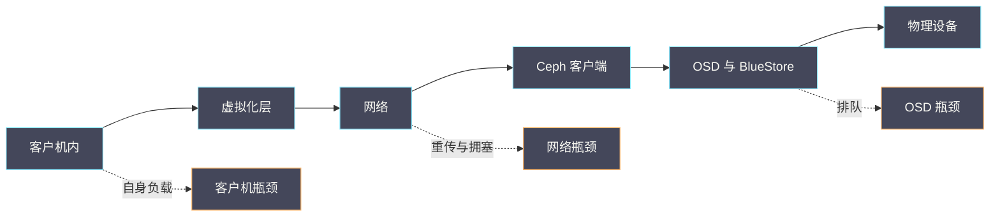

# 14 面向 CVM 的 RBD 读写链路与延迟分析

**摘要：**

虚机云盘的一次写请求，要经过客户机、虚拟化层、网络、Ceph 客户端、OSD 与磁盘六段。任何一段变慢都会表现为「云盘慢」，但各段的表现与排查入口完全不同。本文以「面向 CVM 的视角」拆解这条链路，讲清每段的延迟构成与观测方法、三类典型延迟形态（全程慢、尖峰、间歇慢）的判据、以及如何用「分段计时」把「云盘慢」拆成「哪一段慢」。全文回答两个问题：云盘慢该从哪里查起，以及为什么「集群指标正常但业务仍慢」。文中的方法与命令取自 2026 年 9 月的现场记录，涉及具体数值处标注口径；RBD 的接口与特性见 [[中间件/Ceph/07 RBD 块存储——快照、克隆与 Kubernetes CSI|07 RBD 块存储]]，OSD 与 BlueStore 内部机制见 [[中间件/Ceph/04 OSD 与 BlueStore——存储引擎深度解析|04 OSD 与 BlueStore]]。

---

## 第 1 章 为什么要从 CVM 视角看 RBD

Ceph 的运维视角与虚机业务视角不同，两者的「慢」不是同一件事。

### 1.1 两个视角的差异

**集群视角关注「集群是否健康」**：**指标包括 OSD 延迟、PG 状态、恢复进度、容量水位**。

**业务视角关注「我的盘快不快」**：**指标包括一次读写耗时、吞吐、以及是否卡顿**。

**两者的错位在于**：**集群指标是「平均值」或「聚合值」**，**而业务体验取决于「单次请求的延迟」**。

**因此「集群指标正常但业务慢」是可能的**：**因为平均值掩盖了尾部延迟**——**这与 03 篇 CVM 专栏「延迟分布」是同一关切**。

### 1.2 为什么要单独讲链路

**因为「云盘慢」是一个笼统结论**：**它无法指导处置**。

**只有把它拆成「哪一段慢」**，**才能决定「改什么」**：**是调虚机参数、优化网络、还是调整集群**。

**这与 03 篇 CVM 专栏「Guest/QEMU/网络/Ceph 四层」是同一方法**，**本篇把「Ceph 这一段」进一步展开**。

### 1.3 本篇定位

**本篇补强既有 Ceph 专栏**：**07 篇讲 RBD 的接口与特性，本篇讲「从虚机到 OSD 的延迟链路」**。

**读完本篇应当能回答**：云盘慢该从哪一段查起、三类延迟形态如何区分、以及如何用分段计时定位。

### 1.4 一张链路示意图



**图里三条虚线是三个常见瓶颈段**：**客户机、网络与 OSD**。**排查的顺序是「从客户机向设备逐段确认」**——**因为前一段正常才能说明问题在后一段**。

### 1.5 一个类比与它的边界

可以用「快递」来类比这条链路。

**客户机是「发件人」**：**它决定发什么、发多少**。**虚拟化层与网络是「揽收与运输」**。**OSD 是「分拣中心」**。**设备是「最终存放的货架」**。

**类比的价值在于「它解释了为什么『整体慢』要分段查」**：**可能是发件人慢、运输慢、分拣慢或上架慢**。

**类比的边界在于「快递是串行的人工流程，而存储是并发的自动流程」**：**存储里同一时刻有大量请求在流动**，**因此「排队」是主要问题**。**这一点在快递类比中不明显，但它是存储延迟的主要来源**——**它对应 3.2 节「尖峰」与 5.2 节的「OSD 排队」**。

### 1.6 两个视角的对照

两个视角的对照可以用一张表概括。

| 维度 | 集群视角 | 业务视角 |
| :--- | :--- | :--- |
| 关注指标 | 平均延迟、PG 状态 | 单次延迟、卡顿 |
| 判断依据 | 阈值与趋势 | 用户体验 |
| 盲区 | 尾部延迟 | 集群整体风险 |

**三行的对照说明「两个视角各有盲区」**：**集群视角看不到尾部，业务视角看不到全局风险**。

**因此「运维需要同时具备两个视角」**：**用集群视角判断风险，用业务视角判断体验**——**这与 03 篇 CVM 专栏「四层延迟模型」是同一要求**。

### 1.7 一个延迟的观测原则

观测延迟有三条原则。

**原则一是「看分布不看平均」**：**平均值会把尖峰抹平**。**因此应当看分位数或直方图**。

**原则二是「看单次不看总量」**：**总量（如总 IOPS）无法反映单次体验**。**因此应当看单次延迟**。

**原则三是「看尾部不看头部」**：**最快的那部分请求没有诊断价值**。**因此应当关注最慢的那部分**。

**三条原则的共同点是「关注最差体验」**：**因为用户感知的是「最慢的那一次」，而不是「平均的那一次」**——**这与 03 篇 CVM 专栏「延迟分位数」是同一要求**。

**这也解释了为什么「集群指标正常」与「业务慢」可以同时成立**。

### 1.8 一个能力要求

排查存储延迟需要三项能力。

**第一项是「分段观测能力」**：**能在各段采集延迟指标**。**它需要工具与权限**。

**第二项是「分布分析能力」**：**能看懂延迟分布而不是只看平均值**。**它需要概念理解**。

**第三项是「对应关系能力」**：**能把「形态与段位」映射到「处置方向」**。**它需要经验积累**。

**三项能力的获得顺序是「先有观测，再有分析，最后有对应」**：**没有观测就无法分析**——**因此「补齐观测能力」应当优先**。

**这与 08 篇 CVM 专栏「能力可用才是验收标准」是同一要求**：**工具存在不等于能力具备，需要实际能采集到数据**。

### 1.9 一个延迟与吞吐的关系

延迟与吞吐的关系常被误解。

**两者的关系是「非线性」的**：**在低负载时，增加并发能提高吞吐且延迟变化不大**；**在接近饱和时，增加并发几乎不提高吞吐，但延迟急剧上升**。

**这个关系解释了「为什么提高并发反而更慢」**：**因为系统已接近饱和，额外的请求只是在排队**。

**因此「提高并发」只在「未饱和时」有效**：**判断是否饱和的依据是「该段的利用率」**。

**这个关系与 02 篇 CVM 专栏「队列深度与延迟」是同一机制**：**队列深度是延迟与吞吐之间的旋钮**。

## 第 2 章 六段链路

把一次写请求的路径拆成六段。

### 2.1 客户机内

**第一段是「客户机内的文件系统与块设备层」**：**应用发起写，经过文件系统与页缓存，最终到达虚拟磁盘设备**。

**这一段的延迟来源是「客户机自身的负载」**：**如 CPU 竞争、页缓存回写压力、或文件系统碎片**。

**观测入口是客户机内的指标**：**如 IO 等待时间、块设备的队列深度**——**这一段的排查不需要接触 Ceph**。

### 2.2 虚拟化层

**第二段是「虚拟化层的设备模型」**：**请求经过虚拟设备（如 virtio）与后端处理**。

**这一段的延迟来源是「队列深度、通知机制与后端形态」**：**与虚拟化专栏 04 篇的讨论一致**。

**观测入口是宿主机上的虚拟设备指标**：**如队列长度、后端进程的 CPU 占用**。

### 2.3 网络

**第三段是「宿主机到 Ceph 集群的网络」**：**请求通过存储网络到达 Ceph 客户端与 OSD**。

**这一段的延迟来源是「网络拥塞、丢包、或链路饱和」**。

**观测入口是网络指标**：**如重传率、带宽利用率、以及 ping 的延迟分布**。

### 2.4 Ceph 客户端

**第四段是「Ceph 客户端的处理」**：**客户端把请求映射到 PG、选择 OSD、并处理一致性协议**。

**这一段的延迟来源是「客户端 CPU、请求排队、以及 OSD 选择」**。

**观测入口是客户端侧指标**：**如请求队列长度、客户端 CPU 占用**。

### 2.5 OSD 与 BlueStore

**第五段是「OSD 的处理」**：**包括消息处理、事务提交、以及 BlueStore 的写入路径**。

**这一段的延迟来源是「OSD 排队、BlueStore 的元数据操作、以及设备本身的延迟」**。

**观测入口是 OSD 指标**：**如提交延迟、应用延迟、以及设备的等待队列**——**这是最常见的瓶颈所在**。

### 2.6 磁盘

**第六段是「物理设备的响应」**：**包括介质本身的延迟与设备队列的排队**。

**这一段的延迟来源是「介质特性（HDD 与 SSD 差异极大）与队列深度」**。

**观测入口是设备指标**：**如设备的利用率、等待时间与队列长度**。

**六段的顺序与请求流向一致**：**因此「从客户机向磁盘逐段确认」是最自然的排查顺序**。

### 2.7 一个链路实例

设想一次「某虚机云盘写延迟高」的问题。

**第一步，确认客户机侧**：**看客户机内的 IO 等待时间**。**如果等待时间已高，说明瓶颈在客户机之后**。

**第二步，确认虚拟化层**：**看宿主机上后端进程的 CPU 占用**。**如果 CPU 饱和，说明后端处理是瓶颈**。

**第三步，确认网络**：**看存储网络的重传率与带宽利用率**。

**第四步，确认 OSD**：**看 OSD 的提交与应用延迟**。

**第五步，确认设备**：**看设备的利用率与队列长度**。

**五步的顺序是「客户机、虚拟化层、网络、OSD、设备」**。**它是链路顺序的逐段确认**——**每一段的结论都是「问题是否在此段」**。

### 2.8 一个各段职责对照

| 段位 | 主要职责 | 典型瓶颈 |
| :--- | :--- | :--- |
| 客户机内 | 文件系统与页缓存 | CPU 竞争、回写压力 |
| 虚拟化层 | 设备模型与后端 | 队列深度、后端 CPU |
| 网络 | 传输与重传 | 拥塞、丢包、带宽 |
| Ceph 客户端 | 映射与一致性 | 客户端 CPU、请求排队 |
| OSD | 事务与 BlueStore | OSD 排队、元数据操作 |
| 设备 | 介质响应 | 介质特性、队列深度 |

**六行的对照说明「每段有各自的典型瓶颈」**。**排查时应当先看「该段的典型瓶颈指标」**，而不是泛泛地看所有指标。

**「OSD 与设备」两段最常见**：**因为它们直接承受并发压力**——**这与 2.5 节「最常见的瓶颈所在」是同一结论**。

### 2.9 一个延迟构成

端到端延迟可以按「构成类型」分类，而不是只按段位。

**第一类是「处理延迟」**：**各段实际处理请求的时间**。**它由 CPU 与算法决定**。

**第二类是「排队延迟」**：**请求在队列中等待的时间**。**它由并发与处理能力决定**。

**第三类是「传输延迟」**：**数据在网络中传输的时间**。**它由距离与带宽决定**。

**三类的区别在于「优化手段不同」**：**处理延迟靠提性能，排队延迟靠降并发，传输延迟靠加带宽**。

**因此「先判断延迟类型，再选优化手段」**：**它比「按段位优化」更精确**——**这与 4.4 节「按段位选择处置」是互补的两种视角**。

### 2.10 一个 OSD 延迟指标说明

OSD 的延迟指标有两个，含义不同。

**「提交延迟」表示「请求从接收到事务提交的时间」**：**它反映 OSD 处理与事务开销**。

**「应用延迟」表示「请求从接收到实际写入设备的时间」**：**它反映包括设备在内的完整耗时**。

**两个指标的差值反映「设备段的贡献」**：**如果应用延迟远大于提交延迟，说明设备是瓶颈**。

**因此「看两个指标的差值」是一个有效的段位判据**：**它不需要额外的追踪工具**——**这与 4.6 节「先用低成本工具」是同一原则**。

### 2.11 一个客户端段说明

Ceph 客户端段容易被忽略，但它是常见瓶颈。

**客户端的职责是「把请求映射到 PG 并选择 OSD」**：**它需要维护集群地图、计算映射、并处理重试**。

**因此客户端段的风险点是「CPU 与地图更新」**：**高并发小 IO 场景下，客户端的 CPU 消耗可能成为瓶颈**。

**另一个风险点是「地图更新时的暂停」**：**集群地图更新时，客户端可能需要等待新地图**。

**观测入口是「客户端进程的 CPU 占用」**：**如果客户端 CPU 接近饱和，说明瓶颈在客户端**。

**这与 02 篇 CVM 专栏「控制面与数据面」是同一区分**：**客户端的处理是数据面的一部分，但它的瓶颈表现与 OSD 不同**。

### 2.12 一个段位与判据的对应

每一段有各自的判据，明确对应关系能加速排查。

| 段位 | 判据 | 观测项 |
| :--- | :--- | :--- |
| 客户机内 | 客户机等待时间是否高 | IO 等待与队列 |
| 虚拟化层 | 后端进程是否饱和 | 进程 CPU 占用 |
| 网络 | 是否重传或带宽饱和 | 重传率与利用率 |
| 客户端 | 客户端 CPU 是否饱和 | 客户端进程 CPU |
| OSD | 提交与应用延迟是否高 | 两个延迟指标 |
| 设备 | 利用率与队列是否高 | 利用率与队列长度 |

**六行的判据都是「该段的饱和度指标」**。**因此「看哪一段饱和」是段位判断的统一方法**。

**「饱和」的判据因段而异**：**CPU 段看占用率，网络段看重传与带宽，设备段看利用率与队列**——**这与 2.8 节「每段有各自的典型瓶颈」是同一结论**。

### 2.13 一个链路与故障的对应

链路各段对应的典型故障不同。

| 段位 | 典型故障 |
| :--- | :--- |
| 客户机内 | 页缓存回写压力、文件系统碎片 |
| 虚拟化层 | 队列深度配置不当、后端线程不足 |
| 网络 | 链路拥塞、MTU 不一致（见云网络 03 篇） |
| 客户端 | CPU 饱和、地图更新频繁 |
| OSD | OSD 数量不足、恢复流量竞争（见 15 篇） |
| 设备 | 介质性能不足、队列配置不当 |

**六行的对照说明「不同段的故障性质不同」**：**前两段偏「配置与资源」，中间两段偏「传输与处理」，后两段偏「容量与竞争」**。

**这个对照的用途是「按段位预判可能的故障类型」**：**定位到段位后，可以直接检查该段的典型故障项**。

## 第 3 章 三类延迟形态

把延迟问题归为三类，判据不同。

### 3.1 全程慢

**特征是「持续慢，且各段都慢」**：**延迟的基线整体抬高**。

**常见原因是「资源不足」**：**如设备饱和、网络带宽不足、或 OSD 数量与负载不匹配**。

**排查方向是「找最饱和的一段」**：**它通常是瓶颈所在**。

### 3.2 尖峰

**特征是「多数时候正常，偶尔出现极高的单次延迟」**：**平均延迟正常但尾部延迟很高**。

**常见原因是「排队与争用」**：**如队列瞬时打满、或某个操作阻塞了队列**。

**这类问题最容易被集群指标掩盖**：**因为平均值正常**——**因此需要看「延迟分布的尾部」**。

### 3.3 间歇慢

**特征是「成段时间的慢，之后恢复」**：**慢的时间窗口与某个事件相关**。

**常见原因是「后台任务」**：**如恢复、迁移、Scrub、或备份任务占用资源**。

**排查方向是「找时间窗口的对应事件」**：**这与 15 篇「资源竞争」是同一主题**。

### 3.4 三类形态的对照

| 形态 | 特征 | 常见原因 | 观测重点 |
| :--- | :--- | :--- | :--- |
| 全程慢 | 持续、各段都慢 | 资源不足 | 最饱和的一段 |
| 尖峰 | 平均正常、尾部高 | 排队与争用 | 延迟分布的尾部 |
| 间歇慢 | 成段时间慢 | 后台任务 | 时间窗口对应事件 |

**三行的判据是「时间分布」**：**持续、随机、成段**——**这与 04 篇「用时间分布区分容量与超时」是同一方法**。

**判对形态能直接缩小范围**：**全程慢查容量，尖峰查排队，间歇慢查后台任务**。

### 3.5 一个形态识别实例

设想识别一次「云盘偶尔卡顿」的形态。

**第一步，收集延迟的时间序列**：**记录一段时间内的单次延迟**。**第二步，看分布**：**多数正常但少数极高，属于「尖峰」**。

**第三步，看时间相关性**：**如果尖峰集中出现，可能属于「间歇慢」**。

**第四步，看各段是否同时升高**：**如果各段同时升高，属于「全程慢」**。

**四步的判据依次是「分布、相关性、同步性」**。**三者组合能确定形态**——**这与 04 篇「多判据组合」是同一方法**。

**形态确定后，排查方向就明确了**：**尖峰查排队，间歇查后台任务，全程查容量**。

### 3.6 一个与 15 篇的连接

本篇与 15 篇（资源竞争）有直接连接。

**连接点是「间歇慢往往由后台任务引起」**：**恢复、迁移、Scrub 等任务会占用 OSD 与设备资源**。

**因此「间歇慢的排查」需要看「该时间窗口有哪些后台任务」**。

**这属于 15 篇的主题**：**本篇给出「间歇慢」这个形态与判据，15 篇展开「资源竞争」的机制**。

**两篇的关系是「形态与方法（本篇）到机制（15 篇）」**——**这也是本专栏的组织方式：先给判据，再给机制**。

### 3.7 一个判据的可信度

三类形态的判据可信度不同。

**「时间分布」最可信**：**它是直接观测，难以失真**。

**「各段是否同时升高」较可信**：**它需要多点观测，但结论明确**。

**「时间窗口对应事件」中等**：**它依赖「事件记录是否完整」**。

**因此排查顺序是「先看分布，再看同步性，最后看事件对应」**：**由可信度高的判据开始**——**这与 06 篇 CVM 专栏「证据可信度排序」是同一方法**。

### 3.8 一个形态与处置的对应

三类形态对应三类处置，对应关系明确。

**全程慢对应「容量类处置」**：**如扩容、增加 OSD、提升网络带宽**。

**尖峰对应「并发类处置」**：**如降低队列深度、限制并发、或调整调度**。

**间歇慢对应「时间窗类处置」**：**如把后台任务安排到业务低谷、或限制后台任务的资源占用**。

**三类处置的成本不同**：**容量类成本最高（需要资源），并发类成本中等（需要调参），时间窗类成本最低（只需调度）**。

**因此「按成本从低到高尝试」是一个务实的顺序**：**先试时间窗调整，再试并发调整，最后考虑扩容**——**这与 03 篇 CVM 专栏「最小有效干预点」是同一原则**。

### 3.9 一个形态的误判

三类形态之间可能被误判，需要注意。

**「间歇慢」可能被误判为「尖峰」**：**如果采样粒度太粗，成段的慢会看起来像零散的尖峰**。

**「尖峰」可能被误判为「全程慢」**：**如果只看平均值且平均值偏高，会误以为全程都慢**。

**因此「形态判断依赖采样粒度」**：**粒度太粗会丢失形态特征**。

**实践建议是「用足够细的粒度采集」**：**至少能分辨「持续、随机、成段」三种模式**——**这与 1.7 节「看分布」是同一要求**。

### 3.10 一个与业务的对应

三类形态对业务的影响不同，这决定了处置的紧迫性。

**全程慢影响「所有请求」**：**因此对业务影响最大，处置最紧迫**。

**尖峰影响「部分请求」**：**因此影响取决于「尖峰的比例与幅度」**。**少量极端尖峰可能只影响少数用户**。

**间歇慢影响「特定时间段」**：**因此影响取决于「该时段是否有业务高峰」**。

**三者的紧迫性排序是「全程慢最紧迫，间歇慢取决于时段，尖峰取决于比例」**：**因此「判断紧迫性」需要结合业务特征**。

**这与 06 篇 CVM 专栏「影响半径」是同一思路**：**技术指标相同但业务影响可能不同**。

### 3.11 一个形态判断的流程

形态判断可以按一个流程执行。

**第一步，采集延迟时间序列**：**粒度要足够细**。**第二步，计算分布**：**看分位数与直方图**。

**第三步，判断模式**：**持续高（全程慢）、随机高（尖峰）、成段高（间歇慢）**。

**第四步，交叉验证**：**看各段是否同时升高，以及是否有事件对应**。

**四步的顺序是「采集、分布、模式、验证」**。**前两步是基础，第三步给形态，第四步提高可信度**——**这与 3.7 节「判据可信度」是同一顺序**。

## 第 4 章 分段计时的观测方法

这一章给出具体的观测入口。

### 4.1 客户机侧

```bash
# 查看块设备的 IO 统计
iostat -x 1 5

# 查看 IO 等待与队列
cat /proc/diskstats

# 查看延迟分布（若支持）
# 通常可通过 eBPF 或 blktrace 获取
```

**观测重点是「等待时间与队列深度」**：**如果客户机侧的等待时间已经很高，说明瓶颈在客户机之后**。

### 4.2 宿主机与网络侧

```bash
# 查看虚拟设备与后端进程
ps -eo pid,pcpu,cmd | grep -E "qemu|rbd" | head

# 查看存储网络的重传与带宽
ip -s link show <iface>
sar -n DEV 1 5
```

**观测重点是「后端进程 CPU 与网络重传」**：**重传率高说明网络有问题**。

### 4.3 集群侧

```bash
# 查看集群状态与延迟
ceph status
ceph osd perf
ceph osd df

# 查看 PG 状态
ceph pg stat
```

**观测重点是「OSD 的提交与应用延迟」**：**这两个指标直接反映 OSD 的处理能力**——**这是最常用的入口**。

### 4.4 设备侧

```bash
# 查看设备利用率与等待
iostat -x 1 5

# 查看设备队列长度
cat /sys/block/<dev>/queue/nr_requests
```

**观测重点是「利用率是否接近饱和」**：**利用率持续接近 100% 说明设备是瓶颈**。

### 4.5 一个分段计时实例

设想一次分段计时的实际执行。

**第一步，在客户机侧记录请求的起止时间**：**得到「端到端延迟」**。

**第二步，在宿主机侧记录请求进入与离开的时间**：**得到「虚拟化层与网络段」的耗时**。

**第三步，在 OSD 侧记录请求处理时间**：**得到「OSD 段」的耗时**。

**第四步，在设备侧记录实际响应时间**：**得到「设备段」的耗时**。

**四步的差值即为各段耗时**。**它把「端到端延迟」分解成了四段**——**这与 04 篇「端到端时间分解」是同一方法**。

**分段计时的难点在于「时间戳对齐」**：**不同节点的时间可能有偏差**，**因此需要先确认时钟同步**。

### 4.6 一个工具选择

分段计时需要工具支持，不同工具的能力不同。

**客户机侧**：**系统自带的 IO 统计足够**（如 IO 等待与队列）。**成本低，但粒度粗**。

**宿主机侧**：**进程级 CPU 与队列统计足够**。**成本低**。

**集群侧**：**Ceph 自带的状态与性能命令足够**。**成本低，且是主要入口**。

**精细分段**：**需要追踪工具（如 eBPF 或块层追踪）**。**成本高，但在难以定位时必要**。

**四类工具的使用顺序是「先用低成本工具，再用精细追踪」**。**这与 01 篇「工具使用顺序」是同一原则**。

### 4.7 一个设备段说明

设备段是最后一个环节，也是最常见的瓶颈。

**设备段的两个指标是「利用率」与「队列长度」**：**利用率反映「设备有多忙」，队列长度反映「有多少请求在等」**。

**两种组合的含义不同**：**利用率高且队列长，说明设备饱和**；**利用率高但队列短，说明设备已接近极限但尚未排队**。

**因此「利用率高但队列短」是一个预警信号**：**它说明余量不多，应当提前规划**。

**这与 08 篇 CVM 专栏「趋势告警早于阻塞告警」是同一思路**：**「接近极限」比「已经排队」更早，更有处置价值**。

### 4.8 一个观测的注意点

观测时有三个注意点。

**注意点一是「同时刻采集」**：**各段的指标必须在同一时间窗口采集**，**否则无法对照**。

**注意点二是「同口径比较」**：**不同工具的统计口径可能不同**（如是否含排队时间）。**因此应当确认口径一致**。

**注意点三是「包含尾部」**：**平均值不够，应当包含分位数**。

**三个注意点与 06 篇 CVM 专栏「同时刻、同口径」是同一要求**：**它们是「跨段对照」有效性的前提**。

### 4.9 一个采样的建议

采样设置影响判断质量。

**采样间隔**：**应当足够细以分辨形态**。**建议不粗于「预期的慢时段长度」的一半**。

**采样时长**：**应当覆盖「完整的一个业务周期」**，**以捕捉间歇慢**。

**采样维度**：**应当按段位分别采集**，**以便交叉验证**。

**三项建议的目的是「不漏掉形态特征」**：**间隔太粗会漏掉尖峰，时长太短会漏掉间歇，维度不足无法交叉验证**——**这与 3.9 节「形态判断依赖采样粒度」是同一要求**。

## 第 5 章 一次延迟定位

把前面的方法串起来。

### 5.1 现象

某虚机的云盘出现明显卡顿，但集群状态显示健康。

### 5.2 分层定位

**第一步，确认形态**：**看延迟的时间分布**。**如果是尖峰，进入第二步**。

**第二步，确认客户机侧**：**看客户机内的等待时间**。**如果客户机侧正常，说明瓶颈在客户机之后**。

**第三步，确认 OSD 侧**：**看 OSD 的延迟分布**（不只是平均值）。**如果尾部延迟高，说明 OSD 侧有排队**。

**第四步，确认设备侧**：**看设备利用率与队列长度**。**如果利用率高且队列长，说明设备是瓶颈**。

### 5.3 结论与处置

**结论可能是「设备队列瞬时打满导致尖峰」**。

**处置方向是「降低瞬时并发」或「增加设备带宽」**。

**关键点是「不要因为集群指标正常就排除集群」**：**集群的平均指标正常，不代表尾部延迟正常**。

### 5.4 一个判据清单

- 延迟的时间分布（持续、随机、成段）。
- 客户机侧的等待时间。
- 宿主机后端进程的 CPU 占用。
- 存储网络的重传与带宽。
- OSD 的提交与应用延迟（含尾部）。
- 设备的利用率与队列长度。

**六项按链路顺序排列**。**第一项决定形态，后五项逐段确认**。

**第五项的「含尾部」是关键**：**只看平均值会漏掉尖峰问题**——**这与 1.1 节「平均值掩盖尾部」是同一要求**。

### 5.5 一个反例

一个常见的反例：云盘慢，运维直接调整了虚机的 IO 参数（如队列深度），结果毫无改善。

**问题在于「未确认瓶颈在哪一段」**：**如果瓶颈在 OSD 或设备，调整虚机参数无效**。

**更糟的是「调整可能加剧问题」**：**增大队列深度会提高并发**，**在 OSD 已经排队的情况下会进一步加剧排队**。

**正确的做法是「先定位段，再调参数」**：**定位段的依据是「哪一段的等待时间高」**。

**这个反例的启示是：参数调整必须针对瓶颈段**。**否则不仅无效，还可能加剧**——**这与 04 篇 CVM 专栏「先定位再优化」是同一纪律**。

### 5.6 一个处置顺序

延迟问题的处置应当按顺序推进。

**第一步，恢复业务**：**如果影响严重，先通过「降低负载」或「迁移虚机」恢复**。

**第二步，定位段位**：**按分段计时确认瓶颈在哪一段**。

**第三步，针对瓶颈处置**：**容量问题扩容，排队问题降并发，后台任务问题调时间窗**。

**第四步，验证改善**：**确认延迟分布是否改善**（不只看平均值）。

**四步的顺序是「止血、定位、处置、验证」**。**它把「先止血后治本」原则应用到延迟问题上**——**这与 03 篇 CVM 专栏「最小有效干预点」是同一方法**。

### 5.7 一个定位记录模板

延迟定位的记录应当包含：**形态**（三类之一）、**段位**（瓶颈所在）、**延迟类型**（处理、排队或传输）、**关键证据**、以及**处置与验证**。

**五项里，「段位」与「延迟类型」是核心**：**前者说明「改哪里」，后者说明「怎么改」**。

**记录的价值在于「它让同类问题可以快速复用」**：**同类形态与段位的问题，处置方向是相同的**——**这与 02 篇 CVM 专栏「排查记录模板」是同一思路**。

### 5.8 一个处置清单

- 确认延迟的时间分布形态。
- 确认客户机侧的等待时间。
- 确认虚拟化层后端进程的资源占用。
- 确认存储网络的重传与带宽。
- 确认 OSD 的提交与应用延迟（含尾部）。
- 确认设备的利用率与队列长度。
- 按形态与段位选择处置并验证。

**七项覆盖了从形态判断到处置验证的完整流程**。**最后一项强调「按形态与段位选择」，而不是「凭经验调参」**。

**这与 4.6 节「工具选择」配合使用**：**前者给出检查项，后者给出工具**。

### 5.9 一个与网络的对照

存储延迟排查与网络排查共享同一方法。

**共同点是「分段」**：**网络排查分「六段报文路径」，存储排查分「六段延迟链路」**。

**共同点是「对比」**：**网络用「有与无」定位断点，存储用「饱和与不饱和」定位瓶颈**。

**共同点是「先粗后细」**：**网络先用计数器后用抓包，存储先用统计后用追踪**。

**差异点是「对象」**：**网络的对象是「报文是否到达」，存储的对象是「延迟有多高」**。

**这个对照说明「方法论可以跨领域迁移」**——**这也是本知识库的价值所在：方法比知识更持久**。

### 5.10 一个处置的验证要点

处置后的验证有三个要点。

**要点一是「看分布」**：**确认分位数是否改善，而不只看平均值**。

**要点二是「看持续时间」**：**确认改善是否稳定，而不只是「刚处置完的那一会儿」**。

**要点三是「看其他段」**：**确认处置是否把瓶颈转移到了其他段**。

**第三点最容易被忽略**：**处置一段可能让另一段成为新瓶颈**（如降低 OSD 并发后，设备利用率下降但网络成为瓶颈）。

**这与 05 篇 CVM 专栏「处置可能引入新问题」是同一关切**：**任何处置都应当观察它的副作用**。

## 第 6 章 误判与反例

第一，**把集群指标正常当成「集群没问题」**。平均值会掩盖尾部延迟。

第二，**只看平均延迟**。尖峰问题的判据在尾部。

第三，**把「云盘慢」当成单一问题**。它可能来自六段中的任意一段。

第四，**只查集群不查客户机**。客户机自身的负载也会导致慢。

第五，**忽略网络段**。存储网络的问题表现为「集群正常但客户端慢」。

第六，**把间歇慢当成随机问题**。它往往与后台任务的时间窗口对应。

第七，**忽略设备队列长度**。利用率高但队列短与队列长是两种不同的瓶颈。

第八，**把「IOPS 高」当成「性能好」**。IOPS 与延迟是两件事，高 IOPS 可能伴随高延迟。

第九，**在客户机侧优化以解决集群侧瓶颈**。方向错误。

第十，**忽略虚拟化层**。队列深度与后端形态会显著影响延迟。

第十一，**忽略客户端段**。客户端 CPU 与地图更新也可能成为瓶颈。

第十二，**用太粗的采样粒度判断形态**。粒度太粗会把「间歇慢」看成「尖峰」。

第十三，**只采集一段的指标**。跨段对照才能定位瓶颈，单段观测无法判断。

第十四，**用不同口径的指标对照**。口径不一致会导致错误结论。

### 6.1 四类误判对照

把本篇的误判归为四类，便于自查。

| 误判类别 | 具体表现 | 正确做法 |
| :--- | :--- | :--- |
| 视角错 | 用集群指标判断业务体验 | 看单次延迟与尾部 |
| 形态错 | 只看平均值 | 看时间分布与尾部 |
| 段位错 | 未定位就调参数 | 先分段计时 |
| 方向错 | 在客户机侧解决集群瓶颈 | 按段位选择处置 |

**四行的共同点是「跳过了『定位段位』这一步」**。**因此自查的方法是「问自己：瓶颈在哪一段」**。

## 第 7 章 边界与反例

第一，**六段划分是「逻辑划分」**。实际路径可能因部署方式而不同。

第二，**各段延迟的占比随负载与配置变化**。不能给出通用的占比结论。

第三，**设备特性差异极大**。HDD 与 SSD 的延迟量级不同。

第四，**观测工具随版本变化**。命令与字段需要按现场确认。

第五，**结论绑定集群规模与网络形态**。小规模结论不能外推。

第六，**忽略客户端 CPU**。高并发小 IO 场景下客户端 CPU 可能成为瓶颈。

第七，**用粗粒度采样判断延迟形态**。粒度不足会导致形态误判。

### 7.1 三类边界说明

本篇的边界可以归为三类。

**第一类是「部署边界」**：**六段划分是逻辑划分**，**实际路径随部署方式变化**（如客户端可能在宿主机、也可能在虚机内）。

**第二类是「硬件边界」**：**设备特性差异极大**，**HDD 与 SSD 的延迟量级不同**。

**第三类是「规模边界」**：**结论绑定集群规模与网络形态**，**小规模结论不能外推**。

**三类边界的共同含义是「分段方法通用，具体数值不通用」**——**方法可以复用，数值必须实测**。

行文至此，把本篇落点收在两条原则上。其一，架构即权衡——Ceph 用「分布式复制」换来了可靠性，代价是「一次写要经过六段且受一致性协议影响」。其二，复杂性不会消失只会转移——把「本地磁盘的简单路径」转移成了「跨网络的分布式路径」，因此「云盘慢」的排查也必须分段进行。相邻的 RBD 接口与特性见 [[中间件/Ceph/07 RBD 块存储——快照、克隆与 Kubernetes CSI|07 RBD 块存储]]，OSD 内部机制见 [[中间件/Ceph/04 OSD 与 BlueStore——存储引擎深度解析|04 OSD 与 BlueStore]]。

---

## 速查卡：云盘慢的定位

这张表把云盘慢的常见现象与优先怀疑的对象对应起来，用于快速定向。使用时的顺序是「先判形态，再定段位，最后选处置」。

三条纪律值得写在表前：**第一，集群指标正常不等于业务正常**（平均值会掩盖尾部延迟）；**第二，先判形态再查段位**（形态决定排查方向）；**第三，参数调整必须针对瓶颈段**（否则无效甚至加剧）。

最后一点：**「云盘慢」是一个笼统结论**，它无法指导处置。**只有把它拆成「哪一段慢、属于哪类延迟」，才能决定改什么**。

补充一句关于工具的提醒：**先用低成本工具（系统统计与集群命令）缩小范围，再用精细追踪（块层追踪）确认细节**。顺序颠倒会浪费大量时间。

再补一句关于处置的提醒：**如果影响严重，先恢复业务再定位**。恢复手段可以是降低负载或迁移虚机，**但要注意「迁移会引入新的资源竞争」**（见 15 篇）。

再补一句关于验证的提醒：**处置后应当确认「延迟分布是否改善」，而不只看平均值**。平均值改善但尾部未改善，说明问题未解决。

最后补一句关于部署差异的提醒：**六段划分是逻辑划分**，实际路径随部署方式变化，排查前先确认「客户端在哪里」。

| 现象 | 优先怀疑 | 关键证据 |
| :--- | :--- | :--- |
| 持续慢、各段都慢 | 资源不足 | 最饱和的一段 |
| 平均正常但偶有卡顿 | 排队与争用 | 延迟分布的尾部 |
| 成段时间慢 | 后台任务 | 时间窗口对应事件 |
| 客户机侧等待已高 | 客户机之后 | 客户机与宿主机指标对比 |
| 集群正常但客户端慢 | 网络或客户端 | 重传率与客户端 CPU |
| 设备利用率接近饱和 | 设备瓶颈 | 利用率与队列长度 |

## 口径与事实说明

- 方法与命令取自 2026 年 9 月的现场记录，属某时点实践，不构成唯一正确用法。
- 机制描述（六段链路、三类延迟形态、OSD 延迟指标含义）属于相关组件的稳定行为。
- 各段延迟占比随负载、配置与硬件变化，本文不给通用数值。
- 文中命令均为只读观测类操作，参数与配置变更须走审批并回读。
- 集群指标是平均值或聚合值，业务体验取决于单次请求延迟，两者可能错位。
- 「集群指标正常但业务慢」是可能的，原因是平均值掩盖了尾部延迟。
- 六段链路的顺序是「客户机、虚拟化层、网络、客户端、OSD、设备」。
- 排查顺序应当与链路顺序一致，从客户机向设备逐段确认。
- 客户机侧的等待时间高，说明瓶颈在客户机之后，而不是客户机内。
- OSD 与设备两段最常成为瓶颈，因为它们直接承受并发压力。
- 延迟可以按构成分为「处理、排队、传输」三类，优化手段各不相同。
- 处理延迟靠提升性能，排队延迟靠降低并发，传输延迟靠增加带宽。
- 三类形态的判据是「时间分布」：持续、随机、成段。
- 全程慢查容量，尖峰查排队，间歇慢查后台任务。
- 尖峰问题最容易被集群指标掩盖，因为平均值正常。
- 判据的可信度排序是「时间分布、同步性、事件对应」，应当由高到低使用。
- OSD 的提交延迟与应用延迟差值反映设备段的贡献。
- 应用延迟远大于提交延迟，说明设备是瓶颈。
- 分段计时需要确认时钟同步，否则时间戳差值无意义。
- 工具使用顺序是「先低成本统计，再精细追踪」，避免直接上重工具。
- 参数调整必须针对瓶颈段，否则不仅无效还可能加剧排队。
- 三类形态对应三类处置：容量类、并发类、时间窗类。
- 三类处置的成本由高到低是「容量、并发、时间窗」，应当按低到高尝试。
- 延迟问题的处置顺序是「止血、定位、处置、验证」。
- 处置后验证应当看延迟分布，而不只看平均值。
- 迁移虚机可以恢复业务，但会引入新的资源竞争。
- 间歇慢的排查需要看「该时间窗口有哪些后台任务」，这属于 15 篇主题。
- 六段划分是逻辑划分，实际路径随部署方式变化。
- 设备特性差异极大，HDD 与 SSD 的延迟量级不同，不能通用结论。
- 各段延迟占比随负载与配置变化，本文不给通用数值。
- 定位记录应当包含「形态、段位、延迟类型、证据、处置与验证」五项。
- 「段位」说明改哪里，「延迟类型」说明怎么改，两者缺一不可。
- 本文与本专栏其余篇目共享同一套观察方法与口径纪律，相邻篇目已展开的机制不在此重复推导。
- 本文的判据与顺序可直接用于同类分布式存储的延迟排查，具体命令需按现场版本调整。
- 小规模集群的结论不能外推到大规模，因为并发压力与网络形态不同。
- 观测工具随版本变化，命令与字段需要按现场确认。
- 延迟排查的核心是「分段」，而不是「看一个总的数字」。
- 同类形态与段位的问题处置方向相同，因此记录模板能加速后续排查。
- 云盘慢的排查应当避免「凭经验调参」，必须先定位段位。
- 存储网络的丢包会表现为「客户端慢而集群正常」，容易被误判。
- 客户端 CPU 饱和也是常见原因，尤其在高并发小 IO 场景。
- 虚拟化层的队列深度与后端形态会显著影响延迟，不可忽略。
- 延迟与 IOPS 是两个维度，高 IOPS 可能伴随高延迟。
- 「设备利用率高」与「设备队列长」是两种不同的瓶颈形态。
- 排查应当先收集「延迟的时间序列」，再判断形态。
- 形态判断需要至少三个判据：分布、相关性、同步性。
- 处置前的定位成本远低于处置后的返工成本。
- 延迟问题的根因常在「排队」而非「处理」，因此降并发往往比提性能有效。
- 分段计时的产出是「各段耗时」，它是选择处置方向的直接依据。
- 延迟排查能力应当沉淀为清单与模板，避免依赖个人经验。
- 云盘慢的排查与网络排查共享同一方法：分段、对比、定位断点。
- 延迟与吞吐的关系是非线性的，接近饱和时增加并发只增加排队。
- 提高并发只在未饱和时有效，判断依据是该段的利用率。
- 链路各段的典型故障性质不同，可按段位预判可能的故障类型。
- 形态判断的流程是「采集、分布、模式、验证」四步，前两步是基础。
- 采样间隔应当足够细，建议不粗于预期慢时段长度的一半。
- 采样时长应当覆盖完整业务周期，以捕捉间歇慢的形态。
- 采样维度应当按段位分别采集，以便交叉验证。
- 处置后的验证要点是「看分布、看持续时间、看其他段」。
- 处置可能把瓶颈转移到其他段，验证时应当覆盖各段。
- 延迟观测的三条原则是「看分布、看单次、看尾部」。
- 用户感知的是最慢的那一次，而不是平均的那一次。
- 排查存储延迟需要三项能力：分段观测、分布分析、对应关系。
- 能力获得顺序是「先观测、再分析、最后对应」，观测能力应当优先补齐。
- 客户端段的瓶颈表现与 OSD 不同，容易被忽略。
- 客户端的地图更新会导致短暂暂停，属于正常机制而非故障。
- 设备「利用率高但队列短」是预警信号，比「已经排队」更早。
- 形态之间可能被误判，采样粒度是关键影响因素。
- 三类形态对业务的紧迫性不同，需结合业务特征判断。
- 观测必须同时刻、同口径并包含尾部，否则跨段对照无效。
- 存储延迟排查与网络排查共享「分段、对比、先粗后细」的方法。
- 方法论可以跨领域迁移，这是知识库的核心价值所在。
- 各段延迟占比随负载与配置变化，不能给出通用占比结论。
- 延迟问题的根因常在排队而非处理，降并发往往比提性能更有效。
- 处置前的定位成本远低于处置后的返工成本。
- 分段观测需要工具与权限，观测能力不足是排查的第一障碍。
- 分布分析需要概念理解，只懂平均值无法发现尖峰问题。
- 对应关系需要经验积累，它决定「定位后能否正确处置」。
- 延迟排查应当避免「一步到位」的期望，分段收敛更可靠。
- 延迟指标的口径差异（是否含排队时间）是常见误判来源。
- 处理延迟与排队延迟的区分决定优化手段的选择。
- 传输延迟通常不是主要瓶颈，除非链路带宽不足或物理距离很远。
- 排队延迟通常是最主要的延迟来源，尤其在饱和状态下。
- 设备段的利用率是容量规划的核心指标，应当长期监控。
- 客户端段的 CPU 占用应当纳入监控，尤其在高并发小 IO 场景。
- 网络段的重传率是排查「客户端慢而集群正常」的关键指标。
- 虚拟化层的队列深度应当与后端能力匹配，过深会导致排队加剧。
- 延迟问题的处置应当先试低成本手段，再考虑资源投入。
- 分段计时的价值在于「把总延迟变成各段耗时」，它是决策依据。
- 延迟排查的记录应当包含形态与段位，便于后续同类问题复用。
- 云盘慢的排查方法可以迁移到其他分布式存储，只需替换段位定义。
- 延迟排查与容量规划相互依赖：容量不足表现为延迟，延迟数据支撑容量决策。
- 观测数据的保留期应当覆盖「问题复现周期」，否则无法回溯分析。
- 延迟问题的定位应当形成清单，避免每次重新摸索方法。
- 存储延迟的改善通常需要「降低并发或增加容量」，而非单纯调参。
- 延迟问题的排查应当避免「只看一个指标」，多指标交叉才可靠。
- 存储延迟的基线应当长期记录，用于判断「当前是否异常」。
- 延迟问题的复盘应当记录「形态、段位、处置、效果」，形成案例库。
- 分段方法的价值在于「它适用于任何分布式系统的延迟排查」。
- 云盘慢的排查起点应当是「收集延迟时间序列」，而不是「查集群状态」。
- 集群状态是「必要条件」而非「充分条件」，它不能证明业务体验正常。
- 分段方法的核心是「每段都有独立的判据」，而不是「一个总指标」。
- 延迟问题的处置效果应当以「业务体验改善」为最终标准。
- 存储延迟排查应当与虚拟化、网络排查联动，因为瓶颈可能在任意段。
- 延迟问题的记录应当纳入知识库，避免同类问题重复摸索。
- 延迟指标的口径应当统一，跨工具比较前先确认统计范围。
- 延迟问题的排查顺序应当「由外向内」，从业务侧向设备侧推进。
- 分段观测的能力建设应当优先于「优化参数」，因为没有观测就无法验证优化。
- 延迟问题的根本改善依赖容量与架构，参数调整只能缓解而不能根治。
- 延迟问题的排查能力应当通过实际案例积累，而不是只靠理论学习。
- 分段方法应当在实践中反复验证，才能形成可依赖的排查直觉。
- 延迟问题的处置应当有明确的验证标准，避免「感觉好了」就结束。
- 延迟排查与容量规划应当共享同一套观测数据，避免重复采集。
- 分段方法的通用性使它成为跨领域排查的基础工具。
- 延迟排查的顺序应当是「先确认现象、再定位段位、最后选择处置」，跳过任一步都会降低效率。
- 延迟问题的处置应当以「业务体验改善」为验收标准，而不是以「指标数字好看」为标准。

---

## 参考资料

1. Ceph 官方文档，性能与延迟排查：<https://docs.ceph.com/en/latest/rados/troubleshooting/>
2. Ceph 官方文档，RBD 与块存储：<https://docs.ceph.com/en/latest/rbd/>
3. Linux 内核文档，块设备与 IO 调度：<https://www.kernel.org/doc/html/latest/block/index.html>
4. Ceph 官方文档，OSD 与 BlueStore：<https://docs.ceph.com/en/latest/rados/configuration/>
5. 内部现场素材：CVM 集群存储运维记录（2026-09，脱敏）

---

> [!note] 思考题
> 1. 为什么「集群指标正常但业务慢」是可能的，平均值与尾部延迟有何区别。
> 2. 三类延迟形态的判据是什么，为什么判对形态能直接缩小范围。
> 3. 六段链路中哪一段最常成为瓶颈，为什么。
> 4. 为什么「IOPS 高」不等于「延迟低」。
> 5. 为什么在客户机侧优化无法解决集群侧瓶颈。
