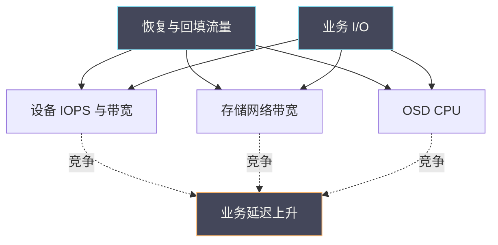

# 15 业务 IO 与恢复流量的资源竞争

**摘要：**

Ceph 的恢复流量与业务 I/O 共享同一批设备、网络与 CPU。恢复是「必须做」的工作，但它的资源消耗会直接压低业务体验。更麻烦的是，恢复本身会放大这种竞争——恢复越快，业务越慢；限制恢复，又可能拉长不健康状态。本文讲清恢复流量的来源与三种形态、竞争发生在哪三层、五类竞争表现、以及「恢复限速」与「业务优先」之间的取舍方法。全文回答两个问题：为什么「集群一切正常但业务慢」，以及恢复期间该如何平衡两种流量。文中的方法与命令取自 2026 年 9 月的现场记录，涉及具体数值处标注口径；PG 状态机与恢复机制见 [[中间件/Ceph/05 PG 状态机与数据一致性——Peering、Recovery 与 Backfill|05 PG 状态机]]，RBD 延迟链路见本篇相邻的 [[中间件/Ceph/14 面向 CVM 的 RBD 读写链路与延迟分析|14 RBD 链路]]。

---

## 第 1 章 两种流量的关系

先明确一件事：恢复流量与业务 I/O 是「竞争」关系，不是「并行」关系。

### 1.1 为什么是竞争

**两者共享三类资源**：**同一批设备的 IOPS 与带宽、同一张存储网络、以及同一批 OSD 的 CPU**。

**共享意味着「零和」**：**在资源总量固定的前提下，恢复占用越多，业务可用越少**。

**这个关系的直接推论是**：**「恢复期间业务慢」不是故障，而是资源分配的必然结果**。

**因此「恢复期间业务慢」的处置方向不是「修故障」，而是「调分配」**——**这与 14 篇「处置按形态选择」是同一思路**。

### 1.2 恢复的两种模式

**第一种是「恢复」**：**补齐副本中缺失的数据**。**它通常涉及整块数据的传输**。

**第二种是「回填」**：**把数据迁移到新的位置**（如新增 OSD 后）。**它的数据量可能更大**。

**两者的共同点是「都要传输数据」**：**因此都消耗网络与设备资源**。

**差异在于「优先级与触发条件」**：**恢复通常更紧急（副本不足），回填可以更从容**。

### 1.3 竞争的三种形态

**形态一是「恢复期间持续慢」**：**只要恢复在进行，业务就慢**。**这是最直接的表现**。

**形态二是「恢复触发时的尖峰」**：**恢复开始时业务出现明显卡顿**，之后趋于平稳。

**形态三是「恢复结束后的残留慢」**：**恢复完成后业务仍未恢复**。**它通常指向「恢复带来的其他影响」**（如缓存被挤占）。

**三种形态的判据是「与恢复时间的相关性」**：**完全相关是形态一，起始相关是形态二，结束后仍相关是形态三**。

### 1.4 本篇定位

**本篇补强既有 Ceph 专栏**：**05 篇讲恢复机制与 PG 状态，本篇讲「恢复与业务的资源竞争」**。

**读完本篇应当能回答**：为什么恢复期间业务慢、竞争发生在哪三层、以及如何平衡两种流量。

### 1.5 一张竞争示意图



**图里三条虚线对应三层竞争**：**设备、网络与 CPU**。**三层是串联关系，因此瓶颈可能在任意一层**——**这正是「只限制一层可能无效」的原因**。

### 1.6 一个类比与它的边界

可以用「修路」来类比资源竞争。

**恢复像「修补损坏的路面」**：**它是必须做的工作**。**业务流量像「日常通行」**。

**类比的价值在于「它解释了为什么修路期间会堵车」**：**修路占用了车道，通行能力下降**。

**类比的边界在于「修路可以完全封闭一条车道，而存储不能完全暂停恢复」**：**因为恢复的延迟会延长数据不健康状态**。**因此存储场景下必须「共享资源」而不是「隔离资源」**——**这也是「限速」而非「暂停」的原因**。

### 1.7 一个恢复的代价模型

恢复的代价可以量化，这有助于决策。

**代价由三部分构成**：**设备资源占用**（影响业务 IOPS）、**网络带宽占用**（影响业务传输）、**CPU 占用**（影响 OSD 处理延迟）。

**三部分的占比取决于恢复类型**：**恢复偏重设备与网络，回填偏重网络**。

**量化的方法是「测量恢复期间三层的额外占用」**：**它等于「恢复期间的占用减基线占用」**。

**有了这个量化，就能回答「限速到多少合适」**：**上限等于「总资源减业务峰值」**——**这与 4.2 节「业务优先」是同一方法**。

### 1.8 一个恢复类型对照

恢复与回填在多个维度上不同。

| 维度 | 恢复 | 回填 |
| :--- | :--- | :--- |
| 触发条件 | 副本不足 | 数据迁移 |
| 紧急程度 | 较高 | 较低 |
| 数据量 | 通常较小 | 可能很大 |
| 主要竞争层 | 设备与网络 | 网络为主 |
| 可延迟性 | 较难延迟 | 较易延迟 |

**五行的对照说明「两者的处置空间不同」**：**恢复的可延迟性低，回填的可延迟性高**。

**因此「回填更适合限速」**：**它可以更从容地与业务共存**——**而恢复可能需要更激进地占用资源**。

### 1.9 一个竞争的必然性

资源竞争是分布式存储的固有特征，理解它的必然性有助于心态调整。

**必然性来自三个前提**：**资源有限、恢复必须进行、业务必须可用**。

**三者同时成立时，竞争无法消除**：**只能通过「分配」来管理**。

**因此「消除竞争」不是目标**：**目标是「把竞争控制在可接受范围内」**。

**这个认识的实践含义是「不要追求零影响」**：**而应当明确「可接受的降级幅度」**——**这与 06 篇 CVM 专栏「SLO 与容量」是同一思路**。

### 1.10 一个竞争与恢复速度的关系

竞争强度与恢复速度正相关。

**恢复越快，竞争越强**：**因为单位时间内的资源需求更高**。

**这是一个「此消彼长」的关系**：**恢复快则业务慢，恢复慢则业务好**。

**因此「恢复速度」是一个需要选择的参数**：**而不是「越快越好」**。

**选择的依据是「业务可接受的降级幅度」**：**在可接受范围内尽快恢复**——**这与 06 篇 CVM 专栏「容量与业务可用性」是同一取舍**。

### 1.11 一个与 SLO 的关系

竞争与 SLO 直接相关。

**SLO 定义「可接受的服务水平」**：**它给出了「降级到什么程度仍可接受」的边界**。

**因此「竞争期的资源分配」应当以 SLO 为依据**：**而不是以「最优性能」为依据**。

**这个依据的价值在于「它让取舍有标准」**：**不必在「恢复快」与「业务快」之间凭感觉选择**。

**实践含义是「SLO 应当包含降级条款」**：**明确「维护与恢复期间的允许降级幅度」**——**这与 08 篇 CVM 专栏「SLO 与故障取证」是同一要求**。

## 第 2 章 竞争的三层

竞争发生在三个层面，每层的机制与手段不同。

### 2.1 设备层

**设备层是最直接的竞争**：**恢复读取与业务读写共享设备的 IOPS 与队列**。

**设备层的竞争表现是「利用率上升、队列变长」**：**业务请求在队列中等待恢复请求**。

**这一层的调控手段是「限制恢复的并发与速率」**：**通过降低恢复的请求量，给业务留出设备带宽**。

### 2.2 网络层

**网络层的竞争是「恢复流量与业务流量的带宽竞争」**：**尤其在副本跨机传输时**。

**网络层的竞争表现是「带宽饱和、业务请求排队」**：**它与设备层的表现类似，但入口不同**。

**这一层的调控手段是「限制恢复带宽」**：**把恢复的传输速率限制在带宽余量之内**。

### 2.3 CPU 层

**CPU 层的竞争是「恢复的校验与处理消耗 OSD 的 CPU」**：**尤其在校验与元数据处理环节**。

**CPU 层的竞争表现是「OSD 的处理延迟上升」**：**即使设备与网络有余量，CPU 也可能成为瓶颈**。

**这一层的调控手段是「限制恢复的并行度」**：**减少同时进行的恢复任务数**。

### 2.4 三层的关系

**三层是「串联」关系**：**恢复任务需要 CPU 处理、网络传输、设备读写**。**因此瓶颈可能在任意一层**。

**这意味着「只限制一层可能无效」**：**如果瓶颈在网络，限制设备并发没有帮助**。

**因此「先确认瓶颈层，再限制该层」是正确顺序**——**这与 14 篇「先定位段位」是同一方法**。

### 2.5 观测入口

```bash
# 查看恢复进度与状态
ceph -s
ceph pg stat

# 查看恢复速率与待恢复对象数
ceph -s | grep -A5 "recovery"

# 查看 OSD 延迟与设备利用率
ceph osd perf
iostat -x 1 5

# 查看网络带宽使用
sar -n DEV 1 5
```

**观测的要点是「同时看恢复进度与业务延迟」**。**只看恢复进度无法判断业务影响，只看业务延迟无法解释原因**——**这与 14 篇「跨段对照」是同一要求**。

### 2.6 一个三层实例

设想一次「限制恢复并发后业务仍未改善」的问题。

**现象**：运维降低了恢复的设备并发，但业务延迟没有改善。

**可能原因**：**瓶颈不在设备层，而在网络层或 CPU 层**。

**验证方法**：**查看三层的饱和度**。**如果网络带宽饱和而设备未饱和，说明瓶颈在网络**。

**处置**：**改为限制恢复带宽**。**这说明「限制必须针对瓶颈层」**。

**这个实例的价值在于「它演示了限制错层的后果」**：**浪费了调整成本，且未解决问题**——**这与 14 篇「参数调整必须针对瓶颈段」是同一纪律**。

### 2.7 一个瓶颈层判断

判断瓶颈层有一个直接方法。

**方法是「看三层的饱和度指标」**：**设备看利用率与队列，网络看带宽与重传，CPU 看 OSD 进程占用**。

**判断规则是「哪一层的饱和度最高，瓶颈就在哪一层」**：**因为瓶颈层的资源最先耗尽**。

**注意点是「饱和度要用同一时间窗口」**：**否则无法比较**——**这与 14 篇「同时刻采集」是同一要求**。

**这个方法的优点是「不需要额外的追踪工具」**：**三层都有现成的饱和度指标**。

### 2.8 一个观测的注意点

观测竞争有两个注意点。

**注意点一是「基线要先测」**：**没有恢复时的资源占用是基线**，**没有基线就无法判断「恢复占用了多少」**。

**注意点二是「恢复进度也要看」**：**只看资源占用不知道「恢复是否有进展」**，**因此两者必须同时观测**。

**两个注意点与 14 篇「跨段对照」是同一要求**：**「资源占用」与「恢复进度」是一对必须同时看的指标**。

### 2.9 一个三层与手段的对应

三层竞争对应三类调控手段。

| 层 | 饱和度指标 | 调控手段 |
| :--- | :--- | :--- |
| 设备 | 利用率与队列 | 限制恢复并发 |
| 网络 | 带宽与重传 | 限制恢复带宽 |
| CPU | OSD 进程占用 | 限制恢复并行度 |

**三行的对应关系是「一层一手段」**。**因此「先定位层，再选手段」是最经济的顺序**。

**这个对应关系的价值在于「它把『限速』这个笼统动作拆成了三个具体配置项」**：**定位到层后，配置项就确定了**——**这与 14 篇「按段位选择处置」是同一方法**。

### 2.10 一个观测的层次

竞争观测可以分三个层次。

**层次一是「现象层」**：**看业务延迟是否上升**。**它回答「有没有影响」**。

**层次二是「资源层」**：**看三层资源的饱和度**。**它回答「影响来自哪一层」**。

**层次三是「任务层」**：**看恢复任务的数量与进度**。**它回答「影响来自哪个任务」**。

**三个层次的观测顺序是「现象、资源、任务」**：**由外向内逐层收窄**——**这与 14 篇「由外向内」是同一顺序**。

**任务层的观测最容易被省略**：**但它能定位到「哪个 PG 或哪个任务」，对精确处置有用**。

### 2.11 一个与 14 篇段位的对应

本篇的三层与 14 篇的六段存在对应关系。

| 本篇层 | 14 篇对应段 |
| :--- | :--- |
| 设备 | 设备段 |
| 网络 | 网络段 |
| CPU | OSD 段（部分） |

**三行的对应说明「两篇的观测可以复用」**：**14 篇的段位观测指标，在本篇的层判断中同样可用**。

**这降低了排查成本**：**不必为「恢复竞争」建立一套新的观测体系**——**只需在原有观测上增加「恢复进度」这一维度**。

## 第 3 章 五类竞争表现

把竞争表现归为五类，便于识别。

### 3.1 持续慢

**特征是「恢复期间业务延迟整体抬高」**：**与恢复进度同步**。

**原因是「三层同时受压」**：**恢复占用了设备、网络与 CPU**。

**处置方向是「限制恢复的整体资源占用」**。

### 3.2 尖峰

**特征是「恢复开始时业务出现卡顿，之后趋稳」**：**恢复启动的瞬间资源需求最大**。

**原因是「恢复任务的启动开销」**：**如打开文件、加载元数据、建立连接**。

**处置方向是「错开恢复的启动时间」**或**「降低启动并发」**。

### 3.3 局部慢

**特征是「只有部分虚机或部分操作变慢」**：**受影响的虚机与恢复涉及的 PG 相关**。

**原因是「恢复集中在部分 OSD」**：**这些 OSD 上的业务受影响，其他不受影响**。

**处置方向是「平衡恢复的分布」**：**避免恢复集中在少数 OSD 上**。

### 3.4 写慢读不慢

**特征是「写操作明显变慢，读操作影响较小」**：**两者的资源需求不同**。

**原因是「写需要更多资源」**：**写涉及副本同步与一致性协议，恢复也在做类似的写操作**。

**处置方向是「限制恢复的写入并发」**。

### 3.5 恢复完成后仍慢

**特征是「恢复结束但业务未恢复」**：**延迟仍高于恢复前**。

**原因是「恢复带来的副作用」**：**如缓存被恢复数据挤占、或设备状态未恢复**。

**处置方向是「检查缓存与设备状态」**，**而不是「等待自然恢复」**。

### 3.6 五类表现的对照表

| 表现 | 特征 | 原因 | 处置方向 |
| :--- | :--- | :--- | :--- |
| 持续慢 | 与恢复进度同步 | 三层同时受压 | 限制整体占用 |
| 尖峰 | 恢复开始时卡顿 | 启动开销 | 错开启动或降并发 |
| 局部慢 | 部分虚机受影响 | 竞争集中 | 平衡恢复分布 |
| 写慢读不慢 | 写延迟明显升高 | 写入并发竞争 | 限制写入并发 |
| 恢复后仍慢 | 延迟未回落 | 副作用 | 检查缓存与设备 |

**五行的判据是「时间相关性与影响范围」**。**时间相关性区分前两类，影响范围区分第三类，操作类型区分第四类，恢复后状态区分第五类**。

**这张表的用途是「由表现反查原因与处置」**——**这与 14 篇「速查卡」是同一形态**。

### 3.7 一个与 14 篇的连接

本篇与 14 篇（RBD 延迟链路）有直接连接。

**连接点是「恢复竞争是 14 篇『间歇慢』的主要成因」**：**14 篇把「间歇慢」归因于「后台任务」，本篇展开「后台任务中的恢复与回填」**。

**因此「14 篇的间歇慢排查应当继续看本篇」**：**确认是否有恢复或回填在进行**。

**两篇的关系是「形态（14 篇）到机制（本篇）」**——**这也是本专栏的组织方式**。

**实践含义是「排查顺序」**：**先按 14 篇判断形态，若为间歇慢，再按本篇确认是否恢复竞争**。

### 3.8 一个识别顺序

识别五类表现可以按一个顺序。

**第一步，看时间相关性**：**与恢复进度完全相关是「持续慢」，仅起始相关是「尖峰」**。

**第二步，看影响范围**：**部分受影响是「局部慢」**。

**第三步，看操作类型**：**写慢读不慢是「写入竞争」**。

**第四步，看恢复后状态**：**恢复后仍慢是「副作用」**。

**四步的顺序是「时间、范围、类型、后续」**。**前三步在恢复期间即可判断，第四步需要恢复后观察**——**这与 14 篇「形态判断流程」是同一方法**。

### 3.9 一个与业务的对照

竞争表现与业务类型相关。

**对延迟敏感的业务**：**受影响最明显**（如交互式应用）。**表现为「响应变慢」**。

**对吞吐敏感的业务**：**受影响较明显**（如批处理）。**表现为「处理时间变长」**。

**对延迟不敏感的业务**：**受影响较小**（如离线备份）。**可能感觉不到**。

**三类的差异说明「同一竞争对不同业务的影响不同」**：**因此「判断影响」需要结合业务类型**。

**这与 06 篇 CVM 专栏「影响半径」是同一思路**：**技术指标相同，业务影响不同**。

### 3.10 一个与 16 篇的连接

本篇与 16 篇（RBD 快照与备份）有连接。

**连接点是「备份任务也是后台任务」**：**备份会读取大量数据，产生与恢复类似的资源竞争**。

**因此「备份期间业务慢」与「恢复期间业务慢」的机制相同**：**都属于「后台任务竞争」**。

**差异在于「备份的可调度性更高」**：**备份可以安排在任意时间，恢复的时间约束更强**。

**这个连接说明「后台任务的竞争是通用问题」**：**本篇的方法（定位层、限速、分时段）同样适用于备份**。

### 3.11 一个处置优先级

竞争处置有优先级顺序。

**第一优先级是「确认数据风险」**：**风险高时不应限速，此时处置是「接受业务降级」**。

**第二优先级是「定位瓶颈层」**：**它决定调控手段**。

**第三优先级是「设定限速并双向验证」**：**确认业务与恢复的平衡**。

**第四优先级是「分时段优化」**：**在有低谷期时进一步减少影响**。

**四级的顺序是「风险、层、限速、优化」**：**前两级是决策，后两级是执行**——**跳过前两级直接限速，可能选错方向**。

## 第 4 章 平衡两种流量的方法

这一章给出可操作的方法。

### 4.1 三层限速

**限速有三个层次**：**设备层限制并发、网络层限制带宽、CPU 层限制并行度**。

**三者的关系是「限制任一层都可能有效，但只有限制瓶颈层才有效」**。

**因此限速的第一步是「确认瓶颈层」**：**依据是 2.5 节的观测**。

### 4.2 业务优先

**「业务优先」的含义是「给业务留出资源余量」**：**即恢复只能使用「业务不用」的那部分资源**。

**实现方式是「先测业务峰值资源占用，再设定恢复的上限」**：**上限等于「总资源减业务峰值」**。

**这个方法的依据是「业务是目标，恢复是手段」**：**恢复的目的是让业务可用，如果恢复本身让业务不可用，就本末倒置了**。

### 4.3 恢复优先

**在特定情况下应当「恢复优先」**：**如副本数不足导致数据风险高时**。

**判断依据是「数据风险」**：**如果副本不足且继续下去可能导致数据丢失，恢复应当优先**。

**因此「业务优先还是恢复优先」取决于「数据风险」**：**风险高时恢复优先，风险低时业务优先**——**这与 04 篇 CVM 专栏「恢复决策」是同一方法**。

### 4.4 分时段策略

**第三种策略是「分时段」**：**业务低谷时放宽恢复限制，业务高峰时收紧**。

**实现方式是「按时间切换限速配置」**：**低谷用高限速，高峰用低限速**。

**这个策略的收益是「兼顾两者」**：**既不让恢复拖太久，也不让业务受影响**。

**它的前提是「业务有明确的低谷期」**：**如果业务 24 小时高峰，这个策略不适用**。

### 4.5 一个决策顺序

- 确认恢复的类型与紧急程度（恢复或回填）。
- 确认数据风险（副本是否充足）。
- 确认业务的时间特征（是否有低谷）。
- 确认竞争的瓶颈层。
- 选择策略（业务优先、恢复优先或分时段）。
- 设定限速并验证效果。

**六项的顺序是「判断紧急、判断风险、判断时段、定位瓶颈、选策略、验证」**。

**前两项决定「是否应当限速」**：**如果数据风险高，限速可能不合适**——**这与 4.3 节「恢复优先」是同一要求**。

### 4.6 一个限速实例

设想一次限速的实际执行。

**背景**：扩容后回填导致业务延迟上升。**瓶颈层是设备**。

**第一步，测业务峰值资源占用**：**在回填开始前测量业务的设备利用率峰值**。

**第二步，设定回填上限**：**上限等于「总容量减业务峰值」，再留余量**。

**第三步，执行限速并观察**：**确认业务延迟回落且回填仍在推进**。

**第四步，分时段调整**：**业务低谷时放宽，高峰时收紧**。

**四步的顺序是「测峰值、设上限、执行观察、分时段调整」**。**第一步是关键**：**没有业务峰值数据，上限只能凭猜**。

### 4.7 一个策略对照

| 策略 | 适用条件 | 代价 |
| :--- | :--- | :--- |
| 业务优先 | 副本充足、风险低 | 恢复时间延长 |
| 恢复优先 | 副本不足、风险高 | 业务体验下降 |
| 分时段 | 业务有明显低谷 | 需要配置切换机制 |

**三行的选择依据是「数据风险与业务特征」**。**风险高选恢复优先，风险低且有低谷选分时段，风险低且无低谷选业务优先**。

**这张表的用途是「把策略选择变成条件判断」**：**而不是凭感觉选择**——**这与 04 篇 CVM 专栏「恢复决策」是同一方法**。

### 4.8 一个限速的注意点

限速有三个注意点。

**注意点一是「配置值不等于实际效果」**：**限速是「上限」，实际速率可能低于上限**（因为其他瓶颈）。

**注意点二是「限速可能延长恢复时间」**：**需要评估「延长的时长是否可接受」**。

**注意点三是「限速需要双向验证」**：**既要业务改善，也要恢复推进**。

**三个注意点与 14 篇「处置的验证要点」是同一要求**：**处置的效果需要实测确认，不能假设**。

### 4.9 一个与副本数的关系

副本数直接影响恢复的数据量与频率。

**副本数越多，恢复数据量越大**：**因为每次故障需要重建的副本更多**。

**副本数越少，数据风险越高**：**因为同时故障的容忍度更低**。

**因此「副本数是风险与代价的旋钮」**：**增加副本降低风险但增加恢复代价**。

**这个取舍与「故障域划分」相关**：**如果故障域划分合理，较少副本也能提供足够保护**——**这与 05 篇「PG 与数据一致性」是同一主题**。

### 4.10 一个与容量的关系

竞争与容量规划直接相关。

**容量余量越大，竞争越弱**：**因为恢复可以在余量中进行，不必挤占业务资源**。

**因此「为恢复预留容量」是一种缓解竞争的手段**：**它与 06 篇 CVM 专栏「故障预留」是同一思路**。

**预留容量的代价是「资源利用率下降」**：**这是一个明确的取舍**。

**取舍的依据是「业务对延迟的敏感度」**：**敏感度高则应当预留更多**——**这与 1.10 节「可接受的降级幅度」是同一要求**。

### 4.11 一个沟通建议

竞争处置需要与业务方沟通。

**沟通内容有三**：**当前的数据风险**、**预计的业务降级幅度**、**以及恢复的预计时长**。

**三项的关系是「风险决定是否限速，降级幅度决定限速程度，时长决定影响窗口」**。

**沟通的价值在于「把技术取舍变成共同决策」**：**业务方对「可接受降级」的判断比运维更准确**——**这与 06 篇 CVM 专栏「业务影响是最终标准」是同一要求**。

## 第 5 章 一次竞争定位

把前面的方法串起来。

### 5.1 现象

某业务在「集群扩容后」出现明显延迟上升，持续数小时。

### 5.2 分层定位

**第一步，确认相关性**：**延迟上升的时间与扩容后的回填时间是否重合**。**如果重合，指向回填竞争**。

**第二步，确认瓶颈层**：**看设备利用率、网络带宽与 OSD CPU**。**哪一层饱和，瓶颈就在哪一层**。

**第三步，确认影响范围**：**是所有虚机还是部分**。**部分说明竞争集中在部分 OSD**。

### 5.3 结论与处置

**结论可能是「回填占用了设备带宽，且集中在部分 OSD」**。

**处置方向是「限制回填并发并平衡分布」**。

**关键点是「不要把回填当成故障」**：**它是扩容的正常代价**，**处置方向是「调分配」而不是「查故障」**。

### 5.4 一个判据清单

- 延迟上升是否与恢复或回填时间重合。
- 哪一层（设备、网络、CPU）饱和。
- 受影响的是全部还是部分虚机。
- 受影响虚机与恢复涉及的 PG 是否相关。
- 恢复完成后延迟是否恢复。
- 当前副本数是否充足（数据风险）。

**六项覆盖了「相关性、瓶颈层、影响范围、关联性、恢复性、风险」**。

**第六项决定策略选择**：**副本充足则业务优先，不足则恢复优先**——**这与 4.5 节「决策顺序」是同一要求**。

### 5.5 一个反例

一个常见的反例：扩容后业务变慢，运维直接回滚扩容，结果业务恢复正常，但扩容目标未达成。

**问题在于「把正常的资源竞争当成故障」**：**回填是扩容的必然代价，不是故障**。

**正确的做法是「限速而不是回滚」**：**限制回填的资源占用，让它与业务共存**。

**回滚的代价是「扩容目标未达成且需要重新开始」**：**而且下一次扩容还会遇到同样问题**。

**这个反例的启示是：区分「故障」与「代价」**。**代价需要管理，故障需要修复**——**这与 05 篇 CVM 专栏「恢复的顺序与代价」是同一思路**。

### 5.6 一个处置清单

- 确认延迟上升与恢复或回填的时间相关性。
- 确认三层的饱和度并定位瓶颈层。
- 确认受影响范围（全部或部分）。
- 确认当前副本数与数据风险。
- 按风险与业务特征选择策略。
- 设定限速并验证业务与恢复的双向效果。

**六项覆盖了从定位到验证的完整流程**。**第六项强调「双向效果」**：**既要业务改善，也要恢复仍在推进**——**只改善业务而恢复停滞，说明限速过严**。

### 5.7 一个定位记录模板

竞争定位的记录应当包含：**表现类型**（五类之一）、**瓶颈层**、**恢复类型**（恢复或回填）、**数据风险**、以及**策略与验证结果**。

**五项里，「瓶颈层」与「数据风险」是核心**：**前者决定手段，后者决定策略方向**。

**记录的价值在于「它让同类场景可以快速决策」**：**有了「瓶颈层到手段」与「风险到策略」的对应，决策不必重新推导**。

### 5.8 一个反例

一个常见的反例：为了「尽快恢复」，运维把恢复速率调到最高，结果业务严重降级，被迫回退限速。

**问题在于「未评估业务可接受的降级幅度」**：**最高速率意味着最强竞争**。

**后果是「恢复了但业务不可用」**：**这违背了恢复的目的**。

**正确的做法是「先确定可接受的降级幅度，再据此设定速率」**：**在幅度内尽快恢复**。

**这个反例的启示是：恢复速度是手段，业务可用是目的**。**把手段当目的会导致本末倒置**——**这与 1.9 节「恢复是手段」是同一原则**。

## 第 6 章 误判与反例

第一，**把恢复期间业务慢当成故障**。它是资源竞争的必然结果。

第二，**只限制一层而不查瓶颈层**。限制非瓶颈层无效。

第三，**忽略网络层**。跨机恢复时网络常是瓶颈。

第四，**忽略 CPU 层**。校验与元数据处理会消耗 OSD CPU。

第五，**把「局部慢」当成全局问题**。它说明竞争集中在部分 OSD。

第六，**恢复完成后不做检查**。缓存或设备状态可能未恢复。

第七，**在数据风险高时限速**。限速会延长不健康状态，增加风险。

第八，**不区分恢复与回填**。两者的紧急程度与数据量不同。

第九，**把扩容后的回填当成异常**。它是扩容的正常代价。

第十，**只看恢复进度不看业务延迟**。无法判断业务影响。

第十一，**忽略业务类型差异**。同一竞争对延迟敏感与吞吐敏感业务的影响不同。

第十二，**把恢复期的业务慢当成实现缺陷**。它是分布式存储的固有特征。

### 6.1 四类误判对照

把本篇的误判归为四类，便于自查。

| 误判类别 | 具体表现 | 正确做法 |
| :--- | :--- | :--- |
| 性质错 | 把资源竞争当成故障 | 按代价管理 |
| 层位错 | 限制非瓶颈层 | 先确认瓶颈层 |
| 时机错 | 恢复后不做检查 | 检查缓存与设备 |
| 风险错 | 数据风险高时限速 | 风险高时恢复优先 |

**四行的共同点是「未判断前提就行动」**。**因此自查的方法是「问自己：前提确认了吗」**。

## 第 7 章 边界与反例

第一，**恢复策略的默认值随版本变化**。配置项与默认行为需要按现场确认。

第二，**竞争程度与硬件比例相关**。设备性能与 OSD 数量的比例决定竞争强度。

第三，**业务的时间特征因场景而异**。分时段策略不适用于全天高峰的业务。

第四，**限速的效果需要实测**。配置限速值不等于实际效果。

第五，**数据风险的判断需要结合副本与故障域**。仅看副本数不够。

第六，**忽略副本数与故障域的联合影响**。副本数不是唯一变量。

第七，**把「限速」当成「暂停」**。限速是共享资源，暂停会延长不健康状态。

### 7.1 三类边界说明

本篇的边界可以归为三类。

**第一类是「版本边界」**：**恢复策略的默认值与配置项随版本变化**。

**第二类是「硬件边界」**：**竞争程度与设备性能、OSD 数量的比例相关**。

**第三类是「场景边界」**：**分时段策略依赖业务有低谷期**，**全天高峰的业务不适用**。

**三类边界的共同含义是「策略必须结合现场」**——**照搬他人的限速值可能不适用**。

行文至此，把本篇落点收在两条原则上。其一，架构即权衡——用多副本换来了可靠性，代价是「恢复流量与业务流量共享资源」。其二，复杂性不会消失只会转移——把「单机故障的风险」转移成了「恢复期的资源竞争」，因此恢复策略必须与业务特征一起设计。相邻的 PG 状态机与恢复机制见 [[中间件/Ceph/05 PG 状态机与数据一致性——Peering、Recovery 与 Backfill|05 PG 状态机]]，RBD 延迟链路见 [[中间件/Ceph/14 面向 CVM 的 RBD 读写链路与延迟分析|14 RBD 链路]]。

---

## 速查卡：恢复期业务慢的定位

这张表把恢复期业务慢的常见现象与优先怀疑的对象对应起来，用于快速定向。使用时的顺序是「先确认相关性，再定位瓶颈层，最后选策略」。

三条纪律值得写在表前：**第一，资源竞争不是故障**（它是资源分配的必然结果，处置方向是「调分配」而非「修故障」）；**第二，限制必须针对瓶颈层**（限制非瓶颈层无效）；**第三，数据风险高时不应限速**（限速会延长不健康状态）。

最后一点：**恢复是「手段」而不是「目标」**。恢复的目的是让业务可用，如果恢复本身让业务不可用，就本末倒置了。**因此「限速」不是妥协，而是正确的资源分配**。

补充一句关于基线的提醒：**「恢复占用了多少资源」需要基线才能判断**。因此应当在恢复开始前测量业务的正常资源占用。

再补一句关于双向验证的提醒：**限速后既要看业务是否改善，也要看恢复是否仍在推进**。只改善业务而恢复停滞，说明限速过严。

再补一句关于扩容的提醒：**扩容后的回填是正常代价**，不应回滚扩容，而应限速让其与业务共存。

最后补一句关于风险的提醒：**副本不足时应当恢复优先**。此时业务的短期体验下降，好过数据风险的持续存在。

| 现象 | 优先怀疑 | 关键证据 |
| :--- | :--- | :--- |
| 恢复期间持续慢 | 三层同时受压 | 设备、网络与 CPU 指标 |
| 恢复开始时卡顿 | 启动开销 | 恢复启动时间与延迟曲线 |
| 只有部分虚机慢 | 竞争集中 | 受影响虚机与 PG 的关联 |
| 写慢读不慢 | 写入并发竞争 | 读写延迟对比 |
| 恢复后仍慢 | 副作用 | 缓存与设备状态 |
| 扩容后持续慢 | 回填竞争 | 回填进度与延迟相关性 |

## 口径与事实说明

- 方法与命令取自 2026 年 9 月的现场记录，属某时点实践，不构成唯一正确用法。
- 机制描述（恢复与回填的区别、三层竞争、限速层次）属于 Ceph 的稳定设计。
- 限速配置项与默认值随版本变化，调整前先确认现场版本。
- 文中命令均为只读观测类操作，限速与配置变更须走审批并回读。
- 恢复流量与业务 I/O 是竞争关系，共享设备、网络与 CPU 三类资源。
- 「恢复期间业务慢」不是故障，而是资源分配的必然结果。
- 恢复与回填的区别在于紧急程度与数据量，回填的可延迟性更高。
- 竞争的三种形态由「与恢复时间的相关性」区分。
- 竞争发生在设备、网络与 CPU 三层，三层是串联关系。
- 只限制一层可能无效，必须先确认瓶颈层。
- 瓶颈层的判断依据是「三层的饱和度指标，哪层最高即瓶颈」。
- 饱和度指标必须在同一时间窗口采集，否则无法比较。
- 观测竞争必须先测基线，否则无法判断恢复占用了多少。
- 恢复进度与资源占用必须同时观测，缺一会得出片面结论。
- 五类竞争表现的判据是「时间相关性、影响范围、操作类型、恢复后状态」。
- 「恢复完成后仍慢」需要主动检查缓存与设备状态，而不是等待。
- 限速有三个层次：设备并发、网络带宽、CPU 并行度。
- 业务优先的实现是「先测业务峰值，再设定恢复上限」。
- 恢复优先的适用条件是「副本不足、数据风险高」。
- 分时段策略适用于业务有明显低谷期的场景。
- 策略选择依据是「数据风险与业务特征」，不是凭感觉。
- 扩容后的回填是正常代价，不应回滚扩容而应限速。
- 限速的效果需要双向验证：业务改善且恢复仍推进。
- 只改善业务而恢复停滞，说明限速过严。
- 限速配置值是「上限」，实际速率可能因其他瓶颈而更低。
- 限速会延长恢复时间，需要评估延长时长是否可接受。
- 恢复竞争是 14 篇「间歇慢」的主要成因，两篇应当连起来读。
- 数据风险的判断需要结合副本数与故障域，仅看副本数不够。
- 竞争程度与设备性能、OSD 数量的比例相关。
- 恢复策略的默认值与配置项随版本变化，调整前先确认现场版本。
- 分时段策略需要配置切换机制，不是自动生效的。
- 业务 24 小时高峰的场景不适合分时段策略。
- 恢复的代价可以量化：测量恢复期间三层的额外占用。
- 代价量化后可以回答「限速到多少合适」这个问题。
- 恢复偏重设备与网络竞争，回填偏重网络竞争。
- 竞争问题应当与业务方共同决策，因为它涉及体验与风险的取舍。
- 恢复期的资源分配应当纳入变更管理，而不是临时决定。
- 限速策略应当有回退方案，避免限速过严导致恢复停滞。
- 恢复期的观测数据应当保留，用于后续同类场景参考。
- 「恢复优先还是业务优先」是一个需要预先约定的决策，不应临场拍板。
- 恢复期的业务慢应当提前告知相关方，避免误判为故障。
- 恢复与业务的资源竞争是分布式存储的固有特征，不是实现缺陷。
- 缓解竞争的根本手段是「提升资源总量」或「减少恢复数据量」。
- 减少恢复数据量的手段包括「合理设置副本数」与「优化故障域划分」。
- 恢复策略的设计应当与「副本数、故障域、业务特征」三者一起考虑。
- 恢复期的业务慢应当纳入 SLO 讨论，明确「可接受的降级幅度」。
- 竞争问题的处置经验应当沉淀为「策略选择表」，避免重复决策。
- 本文与本专栏其余篇目共享同一套观察方法与口径纪律，相邻篇目已展开的机制不在此重复推导。
- 本文的判据与顺序可直接用于同类分布式存储的恢复场景，具体配置需按现场版本调整。
- 恢复与业务的平衡是「运行期决策」的典型案例，判据与取舍同样重要。
- 竞争强度与恢复速度正相关，恢复越快竞争越强。
- 恢复速度是需要选择的参数，而不是越快越好。
- 选择依据是业务可接受的降级幅度，而不是理论最优。
- 竞争观测分现象层、资源层、任务层三个层次，由外向内收窄。
- 任务层观测能定位到具体任务，对精确处置有用但容易被省略。
- 备份任务也会产生类似恢复的资源竞争，机制相同。
- 备份的可调度性高于恢复，因此更容易安排到低谷期。
- 容量余量越大竞争越弱，为恢复预留容量是缓解手段。
- 预留容量的代价是资源利用率下降，这是明确的取舍。
- 竞争处置的优先级是「风险、层、限速、优化」。
- 跳过「确认风险」直接限速，可能选错方向。
- SLO 应当包含降级条款，明确恢复期允许的降级幅度。
- 竞争期的资源分配应当以 SLO 为依据，而非以最优性能为依据。
- 本篇的三层与 14 篇的六段存在对应，观测可以复用。
- 不必为恢复竞争建立新观测体系，只需增加恢复进度维度。
- 竞争处置需要与业务方沟通风险、降级幅度与恢复时长。
- 业务方对「可接受降级」的判断比运维更准确。
- 恢复是手段，业务可用是目的，不应把手段当目的。
- 最高恢复速率意味着最强竞争，可能违背恢复目的。
- 恢复期的业务慢应当提前告知相关方，避免误判为故障。
- 恢复与业务的资源竞争是固有特征，不是实现缺陷。
- 消除竞争不是目标，把竞争控制在可接受范围才是目标。
- 副本数是风险与代价的旋钮，增加副本增加恢复代价。
- 故障域划分合理时，较少副本也能提供足够保护。
- 数据风险判断需要结合副本数与故障域，不能只看副本数。
- 恢复与回填的可延迟性不同，回填更适合限速。
- 恢复偏重设备与网络竞争，回填偏重网络竞争。
- 竞争问题的处置经验应当沉淀为策略选择表。
- 策略选择表应当包含「条件、策略、代价」三列。
- 恢复期的资源分配应当纳入变更管理，而不是临时决定。
- 限速策略应当有回退方案，避免恢复停滞。
- 恢复期的观测数据应当保留，用于后续同类场景参考。
- 竞争程度与设备性能、OSD 数量的比例相关。
- 竞争对不同业务类型的影响不同，延迟敏感业务受影响最大。
- 同一竞争对吞吐敏感业务表现为处理时间变长。
- 对延迟不敏感的业务可能感觉不到竞争影响。
- 缓解竞争的根本手段是提升资源总量或减少恢复数据量。
- 减少恢复数据量的手段包括合理设置副本数与优化故障域划分。
- 恢复策略的设计应当与副本数、故障域、业务特征一起考虑。
- 「恢复优先还是业务优先」应当预先约定，不应临场拍板。
- 竞争问题的定位记录应当包含表现类型、瓶颈层、恢复类型、数据风险、策略与验证。
- 竞争问题的处置应当双向验证：业务改善且恢复仍推进。
- 只改善业务而恢复停滞，说明限速过严。
- 竞争问题的根本改善依赖容量与架构，限速只能缓解而不能根治。
- 竞争问题的排查应当先确认「是否在恢复或回填」，这是判断前提。
- 恢复进度的观测应当包含「待恢复对象数」与「恢复速率」两项。
- 恢复速率的观测应当与业务延迟的观测同窗口，才能判断相关性。
- 竞争问题的「局部慢」说明恢复集中在部分 OSD，可通过调整分布缓解。
- 「写慢读不慢」的处置方向是限制恢复的写入并发。
- 「恢复后仍慢」的处置方向是检查缓存与设备状态，而非被动等待。
- 竞争问题的定位顺序是「表现类型、瓶颈层、策略」，不可颠倒。
- 竞争问题的记录应当保留，用于形成可复用的策略选择表。
- 竞争问题的处置应当有「回退条件」，明确何时应当放宽限速。
- 竞争问题的根本解决需要架构层面的资源隔离，如专用存储网络。
- 专用存储网络可以减少网络层竞争，但设备与 CPU 层仍会竞争。
- 竞争问题的处置应当与变更管理结合，避免与升级窗口冲突。
- 竞争问题的观测数据应当纳入容量规划的输入。
- 竞争问题的处置效果应当以「业务 SLO 达成率」为最终判据。
- 竞争问题的观测应当覆盖「恢复前后」两个阶段，以便对照。
- 竞争问题的排查应当避免「只看集群状态」，它无法反映业务影响。
- 竞争问题的处置应当先试「低成本手段」，如错开任务时间。
- 竞争问题的「限速值」应当有实测依据，而不是凭经验设定。
- 竞争问题的处置应当记录「限速前后的双向指标」，形成基线。
- 竞争问题的分析应当区分「恢复」与「回填」，两者的处置空间不同。
- 竞争问题的处置应当考虑「后续恢复需求」，避免反复调整。
- 竞争问题的经验应当纳入「恢复策略模板」，减少临场决策。
- 竞争问题的处置应当与业务方共同验证效果，而不只由运维判断。
- 竞争问题的长期改善依赖「架构冗余度」与「业务特征」的匹配。
- 竞争问题的处置应当避免「一刀切」，不同业务可能需要不同策略。
- 竞争问题的观测应当区分「平均延迟」与「尾部延迟」，后者更反映业务体验。
- 竞争问题的处置效果验证应当覆盖「一个完整的业务周期」。
- 竞争问题的分析应当记录「恢复任务的触发原因」，用于预防同类问题。
- 竞争问题的处置应当避免「同时调整多项参数」，否则无法归因。
- 竞争问题的长期观测应当形成「恢复期业务延迟」的专项指标。
- 竞争问题的处置应当明确「责任人」与「决策人」，避免临场犹豫。
- 竞争问题的经验应当在新集群建设时应用，如容量预留与网络隔离。
- 竞争问题的处置应当与「备份窗口」协调，避免叠加影响。
- 竞争问题的观测应当包含「恢复对读与写的差异化影响」。
- 竞争问题的处置应当记录「恢复完成后的业务恢复时间」。
- 竞争问题的分析应当纳入故障复盘，作为架构改进的输入。
- 竞争问题的处置能力应当通过演练建立，包括限速与回退。
- 竞争问题的处置应当以「业务可接受」为终点，而非「恢复完成」。
- 竞争问题的处置应当保留「调整记录」，用于后续同类场景参考。
- 竞争问题的分析应当包含「恢复任务的数量与分布」。
- 竞争问题的处置应当避免在业务高峰开始限速调整。
- 竞争问题的观测应当覆盖「不同恢复阶段」的表现差异。
- 竞争问题的处置应当明确「限速的持续时间」与「恢复时间」。
- 竞争问题的经验应当形成「恢复期资源分配规范」。
- 竞争问题的处置应当与容量扩容计划联动，从根本减少竞争。
- 竞争问题的处置应当有明确的效果验收标准，例如「业务延迟回落到基线区间」。
- 竞争问题的观测应当保留足够的历史数据，用于判断「是否属于异常波动」。
- 竞争问题的处置应当避免「过度限速」，过度限速会显著延长数据不健康状态。
- 竞争问题的分析结论应当写入复盘文档，作为后续同类场景的判断依据。
- 竞争问题的处置能力是运维成熟度的体现，它要求「理解权衡」而不只是「执行操作」。

---

## 参考资料

1. Ceph 官方文档，恢复与回填：<https://docs.ceph.com/en/latest/rados/configuration/>
2. Ceph 官方文档，OSD 与 PG 状态：<https://docs.ceph.com/en/latest/rados/operations/>
3. Ceph 官方文档，性能调优：<https://docs.ceph.com/en/latest/rados/configuration/osd-config-ref/>
4. Linux 内核文档，块设备与 IO 调度：<https://www.kernel.org/doc/html/latest/block/index.html>
5. 内部现场素材：CVM 集群存储运维记录（2026-09，脱敏）

---

> [!note] 思考题
> 1. 为什么「恢复期间业务慢」不是故障而是必然结果。
> 2. 三层竞争中哪一层最常成为瓶颈，为什么。
> 3. 为什么「只限制一层可能无效」。
> 4. 「业务优先」与「恢复优先」的选择依据是什么。
> 5. 为什么「恢复完成后仍慢」需要主动检查而不是等待。
