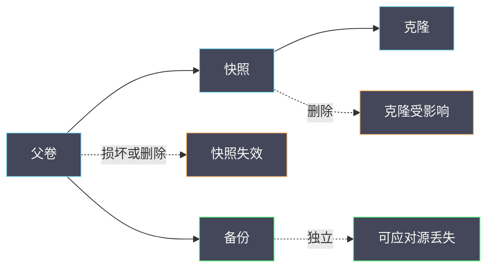

# 16 RBD 快照、克隆、备份及恢复验证

**摘要：**

快照与克隆常被当作「低成本的数据保护手段」，但它们的语义与限制直接决定了「保护是否有效」。快照是「某一时刻的视图」，它依赖父卷存在；克隆是「基于快照的新卷」，它依赖快照存在；备份是「独立的数据副本」，它不依赖前两者但成本最高。本文讲清三者的语义差异与依赖关系、备份的三种形态与校验方法、恢复验证的五个层次、以及「备份成功」与「可恢复」之间的距离。全文回答两个问题：快照能否替代备份，以及如何验证备份真的可用。文中的方法与命令取自 2026 年 9 月的现场记录，涉及具体数值处标注口径；RBD 的接口与特性见 [[中间件/Ceph/07 RBD 块存储——快照、克隆与 Kubernetes CSI|07 RBD 块存储]]，备份恢复演练见 [[SRE/CVM集群可靠性工程/07 备份恢复演练——RPO、RTO、数据校验与应用可用性|07 备份恢复演练]]。

---

## 第 1 章 三者的语义差异

快照、克隆与备份常被混为一谈，但语义完全不同。

### 1.1 快照：某一时刻的视图

**快照记录「某一时刻的数据视图」**：**它不复制数据，只记录「从此刻起哪些块被修改」**。

**因此快照的成本很低**：**创建时几乎不占空间，之后随修改量增长**。

**快照的关键限制是「它依赖父卷」**：**父卷损坏或被删除，快照即失效**。

**这个限制决定了「快照不是备份」**：**它与源数据共享同一份底层数据**——**这与 16 篇 CVM 专栏「备份的判据是可恢复」是同一前提**。

### 1.2 克隆：基于快照的新卷

**克隆创建「一个基于某快照的新卷」**：**新卷初始与快照内容相同，之后独立演化**。

**克隆的价值是「快速批量创建」**：**例如基于一个模板卷快速创建多台虚机的系统盘**。

**克隆的关键限制是「它依赖快照」**：**快照被删除后，克隆可能无法继续正常工作**（取决于实现方式）。

**因此「克隆不是备份」**：**它与快照、父卷形成依赖链**。

### 1.3 备份：独立的数据副本

**备份创建「一份独立的数据副本」**：**它不与源数据共享底层存储**。

**因此备份的成本最高**：**它需要完整的存储空间与传输时间**。

**备份的关键特性是「它独立于源」**：**源被删除或损坏后，备份仍可用**。

**这个特性决定了「只有备份能应对「源丢失」场景」**：**快照与克隆都无法应对**。

### 1.4 三者的对照

| 维度 | 快照 | 克隆 | 备份 |
| :--- | :--- | :--- | :--- |
| 是否复制数据 | 否 | 初始否 | 是 |
| 成本 | 低 | 低（写时复制） | 高 |
| 依赖关系 | 依赖父卷 | 依赖快照 | 独立 |
| 能否应对源丢失 | 否 | 否 | 是 |
| 典型用途 | 回滚点 | 批量创建 | 灾难恢复 |

**五行的对照说明「三者的能力递进」**：**快照最轻但最脆弱，备份最重但最可靠**。

**因此「三者的用途不同」**：**快照用于「短期回滚」，克隆用于「批量创建」，备份用于「灾难恢复」**——**混用会导致保护缺口**。

### 1.5 本篇定位

**本篇补强既有 Ceph 专栏**：**07 篇讲 RBD 的快照与克隆接口，本篇讲「备份与恢复验证」**。

**读完本篇应当能回答**：快照能否替代备份、备份的形态与校验、以及恢复验证的五个层次。

### 1.6 一张依赖关系示意图

**图里关键的一点是「备份与源是并列的，而快照与克隆是从属的」**：**因此只有备份能应对「源丢失」**——**这是本篇最核心的判据**。

### 1.7 一个类比与它的边界

可以用「照片与底片」来类比。

**快照像「在底片上做标记」**：**它记录「从此刻起哪些地方被改动」**，**底片本身只有一份**。

**备份像「翻拍一份新底片」**：**它是一份独立的副本**。

**类比的价值在于「它解释了为什么快照不能应对源丢失」**：**底片丢了，标记也就没意义了**。

**类比的边界在于「快照的标记可以独立导出为备份」**：**即「从快照导出」是常见做法**。**这个做法兼顾了「一致性」与「独立性」**——**它对应 2.3 节「快照式备份」**。

### 1.8 一个保护策略的设计

保护策略应当按「要防什么」设计。

**要防「误操作」**：**快照足够**（短期回滚）。

**要防「源卷损坏」**：**需要备份**。

**要防「站点故障」**：**需要异地备份**。

**要防「合规留存」**：**需要长期备份与不可变存储**。

**四类风险的防护手段递增**：**因此策略应当覆盖「实际存在的风险」，而不是「最便宜的手段」**——**这与 05 篇 CVM 专栏「故障域与保护」是同一思路**。

### 1.9 一个成本与保护的对照

成本与保护强度相关，理解它有助于取舍。

**成本从低到高是「快照、克隆、全量备份、异地备份」**。

**保护强度从低到高也是同一顺序**：**成本与保护正相关**。

**因此「选择」不是「选最便宜的」，而是「按风险选足够的」**：**过度保护浪费成本，保护不足留下风险**。

**这个取舍与 06 篇 CVM 专栏「容量与预留」是同一思路**：**都是「成本与风险」的平衡**。

### 1.10 一个与快照数量的关系

快照数量影响性能与空间。

**快照数量越多，读路径越长**：**因为读取需要「回溯」多个快照层以确定数据位置**。

**快照数量越多，空间占用越大**：**因为每层快照都记录差异，且被引用的旧数据不能回收**。

**因此「快照应当有数量上限与清理策略」**：**长期堆积会同时影响性能与容量**。

**这与 05 篇「PG 与对象管理」是同一关切**：**未清理的中间状态会累积成问题**。

### 1.11 一个与容量的关系

快照与备份都占用容量，需要规划。

**快照的容量增长取决于「修改量」**：**修改越多，快照占用越大**。

**备份的容量增长取决于「频率与形态」**：**高频全量的增长最快**。

**因此「容量规划应当包含快照与备份的增长」**：**否则会在某一天突然发现容量不足**。

**这与 06 篇 CVM 专栏「容量与缩容」是同一要求**：**保护手段的容量也应当纳入规划**。

### 1.12 一个与恢复演练的关系

保护手段的价值只在「演练」中才能被验证。

**演练是「唯一能验证全流程的手段」**：**它覆盖备份可用、恢复流程、应用启动与性能**。

**因此「保护方案必须包含演练计划」**：**否则方案的可用性是假设**。

**演练的产出应当形成文档与改进项**：**形成闭环**——**这与 07 篇 CVM 专栏「演练与改进」是同一要求**。

### 1.13 一个与业务连续性的关系

保护手段是「业务连续性」的一部分，但不是全部。

**业务连续性需要「高可用加保护加预案」三者**：**高可用应对单点故障，保护应对数据丢失，预案应对重大事件**。

**只做保护不做高可用**：**单点故障仍会导致中断**（恢复需要时间）。

**只做高可用不做保护**：**数据丢失无法挽回**（如误删除会同步到所有副本）。

**三者的关系是「互补」**：**它们应对不同的风险类型**——**这与 05 篇 CVM 专栏「故障域与恢复」是同一框架**。

### 1.14 一个与成本的分层

保护成本可以分层设计。

**第一层是「快照」**：**成本极低，覆盖「误操作」**。

**第二层是「本地备份」**：**成本中等，覆盖「源损坏」**。

**第三层是「异地备份」**：**成本较高，覆盖「站点故障」**。

**第四层是「长期留存」**：**成本最高，覆盖「合规与历史追溯」**。

**四层的设计原则是「按风险分层，按重要度选择层级」**：**不是所有数据都需要全部四层**——**这与 06 篇 CVM 专栏「分级保护」是同一思路**。

## 第 2 章 备份的三种形态

备份有三种实现形态，各有取舍。

### 2.1 全量备份

**全量备份复制「全部数据」**：**它是独立的完整副本**。

**优点是「恢复简单」**：**只需恢复一份**。**缺点是「成本高、耗时长」**。

**适用场景是「关键数据」**：**恢复速度要求高且数据量可控**。

### 2.2 增量备份

**增量备份复制「自上次备份以来的变化」**：**它依赖上一次备份**。

**优点是「成本低、频次高」**。**缺点是「恢复需要链式拼接」**：**任何一环损坏都会导致恢复失败**。

**因此「增量备份的链完整性」是关键**：**它需要额外的校验机制**。

### 2.3 快照式备份

**快照式备份「先创建快照，再从快照导出」**：**它保证了「导出的数据是一致的时间点」**。

**优点是「一致性好、对业务影响小」**。**缺点是「需要快照能力与额外空间」**。

**这一形态在实践中常见**：**它兼顾了一致性与成本**。

### 2.4 三种形态的对照

| 形态 | 成本 | 恢复复杂度 | 一致性 |
| :--- | :--- | :--- | :--- |
| 全量 | 高 | 低 | 高 |
| 增量 | 低 | 高（需链） | 取决于实现 |
| 快照式 | 中 | 中 | 高 |

**三行的取舍是「成本与恢复复杂度成反比」**：**全量成本高但恢复简单，增量成本低但恢复复杂**。

**选择依据是「RTO 与 RPO 的要求」**：**RTO 紧则倾向全量，RPO 紧则需要更高频次**——**这与 07 篇 CVM 专栏「RPO 与 RTO」是同一框架**。

### 2.5 一个备份实例

设想为一批虚机设计备份方案。

**需求是「误删文件可恢复、源卷损坏可重建、RTO 两小时」**。

**方案是「快照加备份的组合」**：**快照用于「短期回滚」（如误删文件），备份用于「灾难恢复」**。

**快照的频率可以是「小时级」**：**因为它成本低**。**备份的频率可以是「天级」**：**因为它成本高**。

**RTO 两小时的约束决定了「备份形态」**：**如果全量恢复需要超过两小时，就应当考虑「全量加增量」或「更高频的备份」**。

**这个实例说明「方案由需求决定」**：**需求中的「防什么」与「多快」直接决定手段与频率**。

### 2.6 一个与 RPO 的关系

备份形态与 RPO 直接相关。

**RPO 定义「可容忍的数据丢失量」**：**它决定了「备份频率」**。

**RPO 越紧，备份频率越高**：**因此增量或快照式备份更合适**（因为高频全量成本过高）。

**因此「RPO 决定频率，成本决定形态」**：**两者共同决定方案**。

**这个关系与 07 篇 CVM 专栏「RPO 与 RTO」是同一框架**：**RPO 管数据丢失，RTO 管恢复时间**。

### 2.7 一个异地的考虑

异地备份是「站点级保护」的必要条件。

**同一站点内的备份无法应对站点级故障**：**如机房断电、网络中断**。

**因此「关键数据应当有异地副本」**：**它属于「要防站点故障」的范畴**。

**异地的代价是「传输成本与延迟」**：**因此通常采用「增量传输」**。

**这个考虑与 1.8 节「按风险设计」是同一要求**：**如果业务不要求站点级保护，异地可以不建**。

### 2.8 一个保留策略

保留策略决定「备份保留多久、保留几份」。

**保留时长应当覆盖「问题被发现的时间窗口」**：**如果误删在一周后才被发现，保留三天就不够**。

**保留份数应当覆盖「连续多次损坏」的可能**：**只保留一份，一旦该份损坏就无法恢复**。

**因此「保留策略应当按『发现窗口』与『损坏容忍度』设计」**：**而不是按「存储空间」设计**。

**这个设计原则与 08 篇 CVM 专栏「数据保留与合规」是同一思路**。

### 2.9 一个与成本的权衡

备份成本与频率、形态、保留期三者相关。

**频率越高成本越高**：**因为备份次数增加**。

**形态越「全」成本越高**：**全量高于增量**。

**保留期越长成本越高**：**因为需要长期占用存储**。

**因此「成本优化」是三个参数的联合调整**：**例如「降低频率但提高保留期」，总成本可能不变而保护特征改变**。

**这个权衡与 06 篇 CVM 专栏「容量与预留」是同一思路**：**多参数联合优化，而不是单参数调整**。

### 2.10 一个备份的验证链

备份的可用性依赖一条「验证链」。

**链路是「备份生成、文件校验、内容校验、恢复验证」**。

**任何一环缺失都会导致「不可靠的可用性判断」**：**例如只有文件校验，则「文件存在但损坏」无法被发现**。

**因此「备份方案应当明确验证链的覆盖范围」**：**并说明「未覆盖的环节存在什么风险」**。

**这个思路与 05 篇 CVM 专栏「依赖链」是同一结构**：**串联环节中任一环缺失都会导致整体不可靠**。

### 2.11 一个与工具生态的关系

备份工具的选择影响方案能力。

**部分工具与存储深度集成**：**支持增量、快照式备份与自动校验**。

**部分工具是通用型**：**需要自行组合「快照与导出」**。

**集成度越高，方案实现越简单**：**但可能受限于该存储的能力**。

**因此「工具选择应当结合『存储能力』与『运维习惯』」**：**而不是只看功能列表**——**这与 04 篇 CVM 专栏「工具选择要匹配能力」是同一要求**。

### 2.12 一个与恢复顺序的关系

多卷备份的恢复顺序需要设计。

**顺序依据是「依赖关系」**：**被依赖的卷应当先恢复**（如数据库卷先于应用卷）。

**顺序还应当考虑「一致性」**：**同一时刻的备份应当一起恢复**（否则数据可能不一致）。

**因此「恢复方案应当包含『顺序与分组』」**：**而不是「全部一起恢复」**。

**这个考虑与 05 篇 CVM 专栏「恢复顺序」是同一要求**：**顺序错误会导致恢复后系统不可用**。

## 第 3 章 备份的校验

备份的价值取决于「能否恢复」，因此校验是核心环节。

### 3.1 三个校验层次

**层次一是「文件级校验」**：**确认备份文件存在且完整**（如大小、校验和）。

**层次二是「内容级校验」**：**确认备份内容可读**（如能挂载、能列出文件）。

**层次三是「恢复级校验」**：**实际恢复并验证数据正确性**。

**三个层次的强度递增**：**文件级最弱（可能损坏但大小正常），恢复级最强（直接验证可用性）**。

**多数实现只做第一层**：**这正是「备份存在但恢复失败」的根源**。

### 3.2 恢复级校验的方法

**方法一是「恢复到测试环境」**：**在隔离环境恢复并验证**。**它最接近真实场景**。

**方法二是「挂载并抽样校验」**：**挂载备份并抽样比对数据**。**它成本较低但覆盖有限**。

**方法三是「校验和比对」**：**比对源与备份的校验和**。**它适合大文件但需要源可用**。

**三种方法的适用性不同**：**灾难恢复场景应当用方法一，日常验证可以用方法二或三**。

### 3.3 校验的频率

**频率应当与「变更频率」匹配**：**数据频繁变化则校验应当更频繁**。

**频率还应当与「RTO 要求」匹配**：**RTO 紧则校验应当更频繁**（因为不能容忍恢复时才发现问题）。

**校验的成本应当计入运维预算**：**把它当作「必要投入」而不是「可选工作」**。

### 3.4 一个校验清单

- 备份文件是否存在且大小合理。
- 备份的校验和是否与记录一致。
- 备份能否成功挂载或导入。
- 抽样数据是否与源一致。
- 恢复流程是否可执行（含依赖项）。
- 恢复耗时是否满足 RTO。
- 恢复后应用是否可用。

**七项覆盖了从文件到应用的完整链路**。**最后一项最容易被忽略**：**「数据恢复了」不等于「应用可用了」**——**这与 07 篇 CVM 专栏「恢复的终点是业务可用」是同一要求**。

### 3.5 一个校验实例

设想一次「备份校验发现不可恢复」的问题。

**现象**：备份文件存在且大小正常，但恢复时报错。

**原因可能是「备份过程未完成」**：**如中途中断导致文件不完整**。

**验证方法**：**执行「内容级校验」**（如尝试挂载或导入）。**如果失败，说明备份不可用**。

**处置**：**重新执行备份，并在备份流程中增加「内容级校验」**。

**这个实例说明「文件级校验不够」**：**它无法发现「文件存在但内容不完整」**——**因此校验层次必须包含内容级**。

### 3.6 一个与工具的关系

校验能力受工具限制。

**部分工具提供「校验和比对」**：**它属于文件级或内容级之间**。

**部分工具提供「备份验证」功能**：**它在备份完成后自动验证**。

**部分工具需要「手动恢复验证」**：**成本最高但最可靠**。

**因此「选择工具时应当关注校验能力」**：**而不是只关注「备份速度」**——**这与 04 篇 CVM 专栏「工具选择要匹配需求」是同一要求**。

### 3.7 一个校验的注意点

校验有两个注意点。

**注意点一是「校验要覆盖依赖项」**：**备份可能依赖「元数据、配置或凭据」**，**只校验数据卷不够**。

**注意点二是「校验要在恢复前做」**：**在需要恢复时才发现备份不可用，代价最大**。

**两个注意点与 4.4 节「应用可用」是同一要求**：**校验的范围应当覆盖「恢复后应用可用」所需的全部要素**。

### 3.8 一个校验的频率设计

校验频率的设计有三个依据。

**依据一是「变更频率」**：**数据频繁变化则校验应当更频繁**。

**依据二是「RTO 要求」**：**RTO 紧则不能容忍「恢复时才发现问题」**。

**依据三是「校验成本」**：**全量校验成本高，可以采用「轮转抽样」**。

**三个依据共同决定频率**：**「高变更、紧 RTO、低校验成本」意味着高频校验**。

**轮转抽样的价值在于「用可接受的成本覆盖全部数据」**：**例如每天校验一部分，一周覆盖一轮**——**这与 08 篇 CVM 专栏「巡检分片」是同一方法**。

### 3.9 一个与合规的关系

合规要求会改变备份设计。

**合规可能要求「保留期限」**：**如保留若干年**。**这会显著增加容量成本**。

**合规可能要求「不可变存储」**：**即备份在保留期内不可删除**。**这排除了「被勒索软件删除」的风险**。

**合规可能要求「异地留存」**：**即副本必须在不同地理位置**。

**三项要求都会提高成本**：**因此合规需求应当尽早明确**，**避免在事后重构方案**——**这与 08 篇 CVM 专栏「合规与运维」是同一要求**。

### 3.10 一个与安全的考虑

备份的安全性是常被忽略的一环。

**风险一是「备份被未授权访问」**：**备份包含完整数据，泄露后果严重**。**因此备份应当加密**。

**风险二是「备份被删除」**：**如勒索软件或误操作**。**因此关键备份应当「不可变」**。

**风险三是「凭据泄露」**：**备份流程使用的凭据应当最小权限**。

**三项风险与 04 篇 CVM 专栏「凭据与权限」是同一关切**：**备份是数据的副本，安全要求应当与源数据同级**。

### 3.11 一个校验的组织

校验需要组织保障。

**需要「明确的负责人」**：**校验不是「有空就做」的工作**。

**需要「明确的频率与范围」**：**避免「想起来才做」**。

**需要「明确的记录与跟踪」**：**校验结果应当被记录，问题应当被跟踪**。

**三项与 08 篇 CVM 专栏「职责与流程」是同一要求**：**技术方案需要组织落实，否则会在时间中失效**。

## 第 4 章 恢复验证的五个层次

恢复验证应当分层进行。

### 4.1 层次一：数据存在

**验证「恢复后数据存在」**：**如卷已创建、文件已出现**。

**这是最低要求**：**它只说明「恢复动作完成了」**。

### 4.2 层次二：数据完整

**验证「恢复后数据完整」**：**如校验和一致、文件数量一致**。

**它排除了「部分恢复」的情况**：**部分恢复是常见问题**（尤其在使用增量备份时）。

### 4.3 层次三：数据可用

**验证「恢复后数据可用」**：**如卷可挂载、文件可读、数据库可启动**。

**它排除了「数据完整但不可用」的情况**：**如格式不兼容、权限错误**。

### 4.4 层次四：应用可用

**验证「依赖该数据的应用可用」**：**如虚机可启动、服务可响应**。

**它排除了「数据可用但应用配置缺失」的情况**：**如网络配置、凭据未恢复**。

### 4.5 层次五：性能达标

**验证「恢复后的性能达标」**：**如延迟与吞吐在预期范围**。

**它排除了「恢复后性能退化」的情况**：**如缓存未预热、副本未补齐**。

**五个层次的顺序是「存在、完整、可用、应用、性能」**：**由数据到业务逐层递进**——**只验证前两层是常见的不足**。

### 4.6 五个层次的对照

| 层次 | 验证内容 | 常见遗漏 |
| :--- | :--- | :--- |
| 一 | 数据存在 | — |
| 二 | 数据完整 | 部分恢复 |
| 三 | 数据可用 | 格式与权限 |
| 四 | 应用可用 | 配置与凭据 |
| 五 | 性能达标 | 缓存与副本 |

**五行的对照说明「越往后越容易被忽略」**：**第一层几乎总会被验证，第五层很少被验证**。

**但业务影响恰恰在最后两层**：**因为用户感知的是「应用是否可用、快不快」**——**这与 06 篇 CVM 专栏「业务影响是最终标准」是同一要求**。

### 4.7 一个验证实例

设想一次「恢复后应用不可用」的问题。

**现象**：数据已恢复、卷已挂载、文件可读，但应用启动失败。

**原因可能是「配置或凭据未恢复」**：**应用依赖的配置不在数据卷里**，**或在恢复时被跳过**。

**验证方法**：**按「五个层次」逐层检查**。**如果前三层通过而第四层失败，说明问题在应用配置**。

**处置**：**补齐配置与凭据，并把它们纳入恢复流程**。

**这个实例说明「验证层次的价值」**：**如果只验证前三层，就会认为「恢复成功」**——**而实际业务不可用**。

### 4.8 一个与演练的关系

恢复验证应当纳入演练。

**演练的价值是「验证全流程」**：**包括备份可用、恢复流程、应用启动与性能达标**。

**演练的频率应当与「RTO 要求」匹配**：**RTO 紧则更频繁**。

**演练的产出应当形成文档**：**包含步骤、耗时与问题**。

**这与 07 篇 CVM 专栏「备份恢复演练」是同一要求**：**未演练的恢复流程，其可用性是假设**。

### 4.9 一个验证的成本

五个层次的验证成本递增。

**层次一到二成本最低**：**只需文件操作**。

**层次三成本中等**：**需要挂载与读取**。

**层次四成本较高**：**需要启动应用**。

**层次五成本最高**：**需要业务流量或模拟流量**。

**因此「日常验证做到层次三，定期演练做到层次五」**：**是一个务实的组合**——**这与 3.3 节「校验频率」是同一思路**。

### 4.10 一个与业务的关系

验证层次的选择应当结合业务特征。

**对「数据正确性」敏感的业务**：**应当重点验证层次二与三**（完整与可用）。

**对「服务连续性」敏感的业务**：**应当重点验证层次四**（应用可用）。

**对「性能」敏感的业务**：**应当重点验证层次五**（性能达标）。

**三类业务的验证重点不同**：**因此「验证方案」应当按业务定制**——**这与 06 篇 CVM 专栏「业务影响是最终标准」是同一要求**。

### 4.11 一个验证的自动化

验证可以部分自动化。

**可自动化的部分**：**文件校验、校验和比对、以及「恢复到测试环境」的流程**。

**难以自动化的部分**：**应用可用性与性能验证**（需要业务判断）。

**因此「自动化负责前两层与部分第三层，人工负责第四与第五层」**：**这是一个务实的分工**。

**这个分工与 08 篇 CVM 专栏「机器执行检查、人负责判断」是同一分工**。

### 4.12 一个验证记录模板

验证记录应当包含：**验证层次**（五层之一）、**验证方法**、**验证结果**、**发现的问题**、以及**改进项**。

**五项里，「验证层次」是核心**：**它明确了「验证覆盖到哪里」**。

**记录的价值在于「它让覆盖范围可追溯」**：**避免「以为验证了但实际没有」**——**这与 08 篇 CVM 专栏「取证与记录」是同一要求**。

### 4.13 一个与 SLO 的关系

恢复验证与 SLO 相关。

**SLO 中的「可用性」目标隐含「恢复能力」**：**如果恢复不可用，可用性目标无法达成**。

**因此「恢复能力应当纳入 SLO 的支撑项」**：**明确「恢复时间与数据丢失的允许范围」**。

**这个关系与 07 篇 CVM 专栏「RPO 与 RTO」是同一框架**：**SLO 是目标，RPO 与 RTO 是约束**。

## 第 5 章 一次恢复验证

把前面的方法串起来。

### 5.1 场景

某虚机的系统盘需要从备份恢复，业务要求在两小时内可用。

### 5.2 验证过程

**第一步，确认备份可用**：**文件存在、校验和一致**。

**第二步，执行恢复**：**恢复卷并挂载**。**第三步，验证数据**：**校验关键文件与配置**。

**第四步，启动虚机**：**确认虚机能启动并进入系统**。**第五步，验证服务**：**确认应用服务能正常响应**。

**第六步，验证性能**：**确认延迟与吞吐在预期范围**。

### 5.3 结论与改进

**如果第六步不达标**：**说明恢复后需要「预热」**（如副本补齐、缓存预热）。

**因此「恢复流程」应当包含「预热阶段」**：**并把预热时间计入 RTO**。

**这个实例说明「RTO 的估算必须包含预热」**：**否则会出现「按时恢复了但性能不达标」**——**这与 07 篇 CVM 专栏「恢复时间要算状态重建」是同一关切**。

### 5.4 一个判据清单

- 备份文件与校验和是否正常。
- 恢复动作是否完成且无报错。
- 数据校验是否通过。
- 应用是否可启动与响应。
- 性能是否达标。
- 恢复总耗时是否满足 RTO。

**六项覆盖了从备份到性能的完整验证**。**第六项是最终的可行性判据**——**它把「技术验证」与「业务要求」连起来**。

### 5.5 一个反例

一个常见的反例：用快照作为「唯一的数据保护手段」，结果父卷损坏后无法恢复。

**问题在于「快照依赖父卷」**：**父卷损坏则快照失效**。

**后果是「数据全部丢失」**：**因为快照与父卷共享底层数据**。

**正确的做法是「快照加备份」**：**快照用于短期回滚，备份用于灾难恢复**。

**这个反例的启示是：保护手段必须与「要防的风险」匹配**。**快照防不了「源丢失」**——**这是它的语义限制，不是实现缺陷**。

### 5.6 一个处置清单

- 确认备份的可用性（含内容级校验）。
- 执行恢复并记录耗时。
- 按五个层次逐层验证。
- 确认应用可用且性能达标。
- 记录恢复流程中的问题。
- 更新恢复文档与 RTO 估算。

**六项覆盖了从恢复到改进的完整闭环**。**最后一项是「持续改进」**：**每次恢复都应当更新文档与估算**——**这与 08 篇 CVM 专栏「运维工程化」是同一思路**。

### 5.7 一个与 15 篇的连接

本篇与 15 篇（资源竞争）有连接。

**连接点是「备份任务会产生资源竞争」**：**备份读取大量数据，与业务 I/O 竞争**。

**因此「备份应当安排在业务低谷」**：**或者限制备份的资源占用**。

**15 篇的方法（定位层、限速、分时段）同样适用于备份**：**两篇的关系是「通用方法到具体场景」**。

**这个连接说明「后台任务的治理是统一的」**：**恢复、回填、备份、Scrub 都适用同一套方法**。

### 5.8 一个反例

一个常见的反例：备份策略只做「文件级校验」，某天需要恢复时发现备份不可用。

**问题在于「验证链不完整」**：**只覆盖了第一环**。

**后果是「保护承诺未兑现」**：**而且是在最需要的时候才发现**。

**正确的做法是「明确验证链覆盖范围，并补齐内容级校验」**：**至少要能回答「备份是否可读」**。

**这个反例的启示是：验证链的每一环都应当有明确的责任与手段**——**不能假设「备份工具会做完所有校验」**。

### 5.9 一个改进闭环

恢复验证应当形成改进闭环。

**闭环是「验证、发现问题、改进方案、再验证」**。

**「改进」包括**：**补齐校验层次、修复恢复流程缺陷、更新 RTO 估算**。

**「再验证」是关键**：**改进后需要重新验证，否则改进的效果是假设**。

**这个闭环与 08 篇 CVM 专栏「持续改进」是同一要求**：**运维能力通过闭环逐步提升，而不是靠一次性建设**。

## 第 6 章 误判与反例

第一，**把快照当成备份**。快照依赖父卷，无法应对源丢失。

第二，**把克隆当成备份**。克隆依赖快照，形成依赖链。

第三，**只做文件级校验**。它无法发现内容损坏。

第四，**只验证「数据存在」**。它不说明数据可用。

第五，**验证数据但不验证应用**。应用可能因配置缺失而不可用。

第六，**忽略性能验证**。恢复后性能可能退化。

第七，**把 RTO 估算为「恢复动作耗时」**。它还应包含预热与验证时间。

第八，**增量备份不做链完整性校验**。任何一环损坏都会导致恢复失败。

第九，**把「备份成功」当成「可恢复」**。两者的判据不同。

第十，**恢复验证不做记录**。无法判断「验证是否覆盖了全部层次」。

第十一，**忽略快照数量对性能与空间的影响**。快照堆积会同时影响两者。

第十二，**按单一参数优化备份成本**。频率、形态与保留期需要联合调整。

### 6.1 四类误判对照

把本篇的误判归为四类，便于自查。

| 误判类别 | 具体表现 | 正确做法 |
| :--- | :--- | :--- |
| 手段错 | 用快照替代备份 | 按风险选手段 |
| 校验错 | 只做文件级校验 | 做到内容级或恢复级 |
| 层次错 | 只验证数据存在 | 验证到应用可用 |
| 时间错 | RTO 只算恢复动作 | 计入预热与验证 |

**四行的共同点是「把『部分』当成『全部』」**。**因此自查的方法是「问自己：这覆盖了全部风险吗」**。

## 第 7 章 边界与反例

第一，**快照与克隆的实现细节随版本变化**。依赖关系与限制需要按现场确认。

第二，**备份工具的能力差异较大**。校验能力与恢复流程需要按工具确认。

第三，**RTO 与 RPO 的要求因业务而异**。校验频率与形态选择应当结合要求。

第四，**恢复验证的成本与数据量相关**。全量恢复验证成本高，需要权衡频率。

第五，**预热需求取决于数据与访问模式**。并非所有场景都需要预热。

第六，**忽略快照数量对读路径的影响**。快照越多读路径越长。

第七，**把校验做成「一次性」任务**。校验应当有频率设计，且可采用轮转抽样。

### 7.1 三类边界说明

本篇的边界可以归为三类。

**第一类是「实现边界」**：**快照与克隆的依赖关系随实现变化**，**使用前需要按现场确认**。

**第二类是「工具边界」**：**备份工具的校验能力差异较大**，**部分工具只提供文件级校验**。

**第三类是「成本边界」**：**恢复验证的成本与数据量相关**，**全量验证需要权衡频率**。

**三类边界的共同含义是「方案需要按现场能力设计」**——**不能假设「工具会提供全部校验能力」**。

行文至此，把本篇落点收在两条原则上。其一，架构即权衡——快照与克隆用「共享底层数据」换来了低成本，代价是「无法应对源丢失」。其二，复杂性不会消失只会转移——把「复制数据的成本」转移成了「依赖链的脆弱性」，因此保护策略必须按「要防什么」来设计，而不是按「哪个手段便宜」来设计。相邻的 RBD 接口与特性见 [[中间件/Ceph/07 RBD 块存储——快照、克隆与 Kubernetes CSI|07 RBD 块存储]]，备份恢复演练见 [[SRE/CVM集群可靠性工程/07 备份恢复演练——RPO、RTO、数据校验与应用可用性|07 备份恢复演练]]。

---

## 速查卡：备份与恢复验证

这张表把常见场景与「快照是否够用」对应起来，用于快速判断保护手段。使用时的顺序是「先确认要防什么，再选手段」。

三条纪律值得写在表前：**第一，快照与克隆依赖源，不能应对源丢失**；**第二，校验要做到内容级或恢复级**（文件级不够）；**第三，恢复验证要做到「应用可用」**（数据可用不等于业务可用）。

最后一点：**保护策略应当按「要防什么」设计，而不是按「哪个手段便宜」设计**。快照便宜但防不了源丢失，把它当备份用会留下保护缺口。

补充一句关于 RTO 的提醒：**RTO 的估算应当包含「预热与验证时间」**，而不只是「恢复动作耗时」。否则会出现「按时恢复了但性能不达标」。

再补一句关于演练的提醒：**未演练的恢复流程，其可用性是假设**。演练是唯一能验证「全流程可用」的手段。

再补一句关于增量的提醒：**增量备份需要做「链完整性校验」**。任何一环损坏都会导致恢复失败。

最后补一句关于异地的提醒：**站点级保护需要异地副本**。同站点内的备份无法应对站点级故障。

| 场景 | 快照是否够用 | 需要的形态 |
| :--- | :--- | :--- |
| 升级前回滚点 | 够用 | 快照 |
| 批量创建虚机 | 不适用 | 克隆 |
| 误删文件恢复 | 可能够用 | 快照或备份 |
| 源卷损坏 | 不够用 | 备份 |
| 灾难恢复 | 不够用 | 备份（异地） |
| 合规留存 | 不够用 | 备份（长期） |

## 口径与事实说明

- 方法与命令取自 2026 年 9 月的现场记录，属某时点实践，不构成唯一正确用法。
- 机制描述（快照的写时复制语义、克隆的依赖关系、备份形态、验证层次）属于 RBD 的稳定设计。
- 快照与克隆的实现细节随版本变化，使用前先确认现场版本。
- 文中命令均为只读观测类操作，快照与备份的创建与删除须走审批并回读。
- 快照记录「某一时刻的视图」，不复制数据，因此依赖父卷。
- 克隆基于快照创建，因此依赖快照，形成「父卷到快照到克隆」的依赖链。
- 备份是独立副本，不与源共享底层存储，因此能应对源丢失。
- 三者的成本递增是「快照、克隆、备份」，保护强度也递增。
- 快照用于短期回滚，克隆用于批量创建，备份用于灾难恢复，混用会产生缺口。
- 备份形态有全量、增量与快照式三种，取舍在成本与恢复复杂度之间。
- 全量备份恢复简单但成本高，增量备份成本低但恢复需要链式拼接。
- 快照式备份兼顾一致性与成本，实践中常见。
- RPO 决定备份频率，成本决定备份形态，两者共同决定方案。
- 增量备份必须做链完整性校验，任何一环损坏都会导致恢复失败。
- 异地备份是站点级保护的必要条件，同站点备份无法应对站点故障。
- 校验有三个层次：文件级、内容级与恢复级，强度递增。
- 多数实现只做文件级校验，这正是「备份存在但恢复失败」的根源。
- 恢复级校验最可靠，方法包括恢复到测试环境、挂载抽样与校验和比对。
- 校验频率应当与变更频率和 RTO 要求匹配。
- 校验应当覆盖依赖项（元数据、配置、凭据），只校验数据卷不够。
- 校验应当在恢复前完成，等到需要恢复时才发现不可用代价最大。
- 恢复验证有五个层次：存在、完整、可用、应用、性能。
- 五个层次越往后越容易被忽略，但业务影响恰在最后两层。
- 「数据恢复了」不等于「应用可用了」，配置与凭据需要一并恢复。
- 性能验证排除「恢复后性能退化」，如缓存未预热、副本未补齐。
- RTO 的估算必须包含预热与验证时间，否则会出现「按时恢复但性能不达标」。
- 恢复流程应当包含「预热阶段」，并把预热时间计入 RTO。
- 保护策略应当按「要防什么」设计，而不是按「哪个手段便宜」设计。
- 四类风险对应的手段是「误操作用快照、源损坏用备份、站点故障用异地、合规用长期留存」。
- 保留时长应当覆盖「问题被发现的时间窗口」。
- 保留份数应当覆盖「连续多次损坏」的可能，只留一份风险高。
- 恢复验证的成本与数据量相关，日常验证到层次三、定期演练到层次五。
- 恢复验证应当纳入演练，演练频率与 RTO 要求匹配。
- 演练产出应当形成文档，包含步骤、耗时与问题。
- 每次恢复都应当更新恢复文档与 RTO 估算，形成持续改进闭环。
- 快照与克隆的实现细节随版本变化，使用前需要按现场确认。
- 备份工具的校验能力差异较大，选型时应当关注校验能力而非仅关注速度。
- 部分工具提供自动备份验证，部分需要手动恢复验证。
- 本文与本专栏其余篇目共享同一套观察方法与口径纪律，相邻篇目已展开的机制不在此重复推导。
- 本文的判据与流程可直接用于同类块存储的备份场景，具体命令需按现场版本调整。
- 「备份成功」与「可恢复」是两个判据，前者只说明动作完成。
- 恢复验证不做记录，无法判断验证是否覆盖了全部层次。
- 把克隆当备份使用，会形成「依赖快照、快照依赖父卷」的双重脆弱点。
- 恢复验证的层次应当写入恢复文档，作为验证的检查项。
- 备份的频率、形态与保留策略应当作为一组参数一起设计。
- 保护策略的评审应当包含「要防什么、用什么防、如何验证」三个问题。
- 未演练的恢复流程，其可用性是假设而不是事实。
- 恢复验证的最终判据是「业务可用」，而不是「技术动作完成」。
- 备份与恢复是「承诺」与「兑现」的关系，只有验证过的才算兑现。
- 保护策略的成本应当计入预算，把它当作必要投入而非可选工作。
- 保护手段的价值只在演练中才能被验证。
- 保护方案必须包含演练计划，否则可用性是假设。
- 备份工具与存储的集成度影响方案实现复杂度。
- 工具选择应当结合存储能力与运维习惯，而不是只看功能列表。
- 备份的安全要求应当与源数据同级，包括加密与访问控制。
- 关键备份应当不可变，以应对勒索软件与误删除。
- 备份流程使用的凭据应当遵循最小权限原则。
- 验证记录应当明确「验证层次」，避免覆盖范围含糊。
- 保护方案的评审应当包含安全维度的检查。
- 业务连续性需要高可用、保护与预案三者互补。
- 只做保护不做高可用，单点故障仍会导致中断。
- 只做高可用不做保护，数据丢失无法挽回。
- 校验需要明确的负责人、频率与范围，避免「想起来才做」。
- 校验结果应当被记录，问题应当被跟踪。
- 恢复能力应当纳入 SLO 的支撑项，明确恢复时间与数据丢失范围。
- 保护手段应对的风险类型不同，方案应当覆盖实际存在的风险。
- 保护方案的成熟度体现在「演练常态化」而不是「文档齐全」。
- 多卷恢复的顺序依据依赖关系，被依赖的卷应当先恢复。
- 同一时刻的备份应当一起恢复，否则可能出现数据不一致。
- 恢复方案应当包含顺序与分组，而不是全部一起恢复。
- 恢复验证应当形成「验证、发现、改进、再验证」的闭环。
- 改进后需要重新验证，否则改进的效果是假设。
- 保护方案的改进项应当被跟踪到关闭。
- 恢复流程的缺陷应当反馈到方案设计，而不只是修复当次问题。
- 保护能力的建设是持续过程，而不是一次性项目。
- 保护成本可以分四层：快照、本地备份、异地备份、长期留存。
- 四层覆盖的风险不同，应当按数据重要度选择层级。
- 不是所有数据都需要全部四层保护，分级设计更经济。
- 数据分级应当有明确标准，避免「都按最高级保护」。
- 分级标准应当包含「恢复时间要求」与「数据丢失容忍度」。
- 分级结果应当定期复核，因为业务重要度会变化。
- 保护方案的成本应当与数据价值匹配，避免过度或不足。
- 保护方案的评审应当由业务与运维共同参与。
- 快照与克隆的依赖关系应当在方案文档中显式说明，避免使用者误判其能力边界。
- 备份的「成功」应当以「可恢复」为准，工具提示成功只说明动作完成。
- 恢复验证的五个层次应当写入恢复文档，作为每次恢复的检查项。
- 保护方案应当明确「不覆盖哪些风险」，让决策者对剩余风险有清晰认识。
- 备份与快照的清理策略应当与保留策略一起设计，避免清理掉仍需要的副本。
- 恢复流程中的「预热阶段」应当单独成节，并给出预热完成的判据。
- 保护方案的变更（如调整频率或保留期）应当走变更流程，并重新验证。
- 恢复验证应当覆盖「单卷恢复」与「多卷一致恢复」两种场景。
- 备份的加密与访问控制应当与源数据同级，不能因为「是副本」而降低要求。
- 保护方案的成本应当按「数据价值」分级，而不是按「技术便利」分级。
- 保护能力的验证应当有明确的时间表，避免「计划了但从未执行」。
- 恢复演练应当包含「非预期场景」，例如备份部分损坏、恢复中途失败。
- 保护方案的文档应当包含「常见问题与处置」，减少临场摸索。
- 备份与恢复的职责应当明确到人，避免出现「都以为别人在做」。
- 保护方案应当与「业务连续性计划」对齐，而不是独立存在。
- 恢复验证的结论应当有明确的判定标准，例如「五个层次全部通过」。
- 保护方案的生命周期管理应当包含「定期复核」与「随业务变化调整」。
- 备份工具的版本升级应当纳入变更管理，因为它可能影响恢复流程。
- 保护方案的最终目标是「在需要时真的能用」，而不是「看起来完备」。
- 备份与恢复的验证应当有「通过标准」，避免结论含糊导致争议。
- 快照的清理应当与「依赖它的克隆」一起评估，避免误删导致克隆异常。
- 备份的存储位置应当与源数据分离，避免同一故障同时影响两者。
- 恢复流程中的依赖项（网络、凭据、配置）应当列成清单，逐项确认。
- 保护方案的演练应当记录「未通过项」，并跟踪到关闭。
- 备份的失败告警应当有，避免「备份静默失败而无人知晓」。
- 保护方案的文档应当说明「谁在什么情况下可以发起恢复」。
- 恢复验证的结果应当归档，作为合规与审计的证据。
- 保护方案的容量增长应当有监控，避免因增长而触发容量告警。
- 快照与备份的命名应当有规范，便于快速识别「何时、哪份、什么用途」。
- 保护方案应当定期与业务确认「数据重要度是否变化」，并据此调整分级。
- 备份的校验结果应当有记录，避免「校验过但无据可查」。
- 恢复流程的每一步应当有明确的「完成判据」，避免凭感觉推进。
- 保护方案的成本优化应当在不降低覆盖范围的前提下进行。
- 备份的保留策略应当与「合规要求」和「恢复需求」同时匹配。
- 保护方案的年度评审应当包含「演练结果」与「风险变化」两项输入。
- 恢复流程应当有「中止与回退」的说明，避免恢复本身引入新的数据风险。
- 备份的完整性应当有自动检查，人工检查容易遗漏与拖延。
- 保护方案的落地需要「工具、流程、职责」三者齐备，缺一会导致方案停留在纸面。

---

## 参考资料

1. Ceph 官方文档，RBD 快照与克隆：<https://docs.ceph.com/en/latest/rbd/rbd-snapshot/>
2. Ceph 官方文档，RBD 镜像与备份：<https://docs.ceph.com/en/latest/rbd/rbd-mirroring/>
3. Ceph 官方文档，RBD 导出与导入：<https://docs.ceph.com/en/latest/rbd/rados-rbd-cmds/>
4. OpenStack 官方文档，卷备份与恢复：<https://docs.openstack.org/cinder/latest/admin/>
5. 内部现场素材：CVM 集群备份恢复演练记录（2026-09，脱敏）

---

> [!note] 思考题
> 1. 为什么「快照不是备份」，这个结论的关键依据是什么。
> 2. 克隆与快照、父卷形成什么样的依赖链，这个链条的脆弱点在哪里。
> 3. 三个校验层次中哪一层最容易被省略，后果是什么。
> 4. 恢复验证的五个层次为什么越往后越容易被忽略。
> 5. 为什么 RTO 的估算必须包含预热时间。
