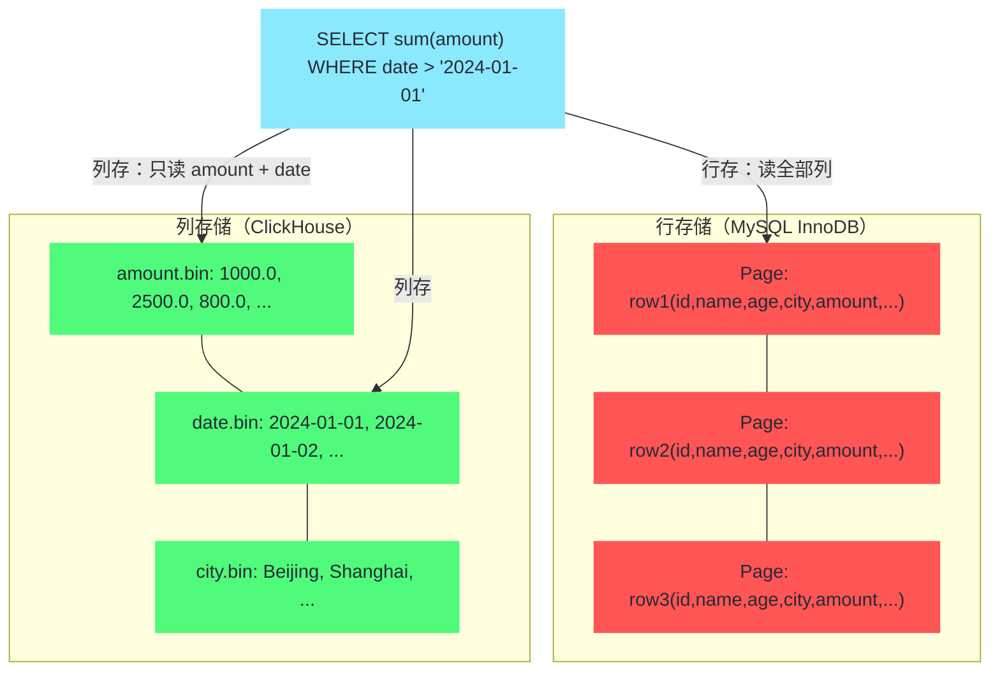
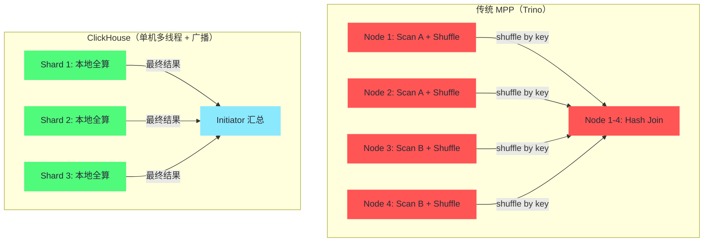
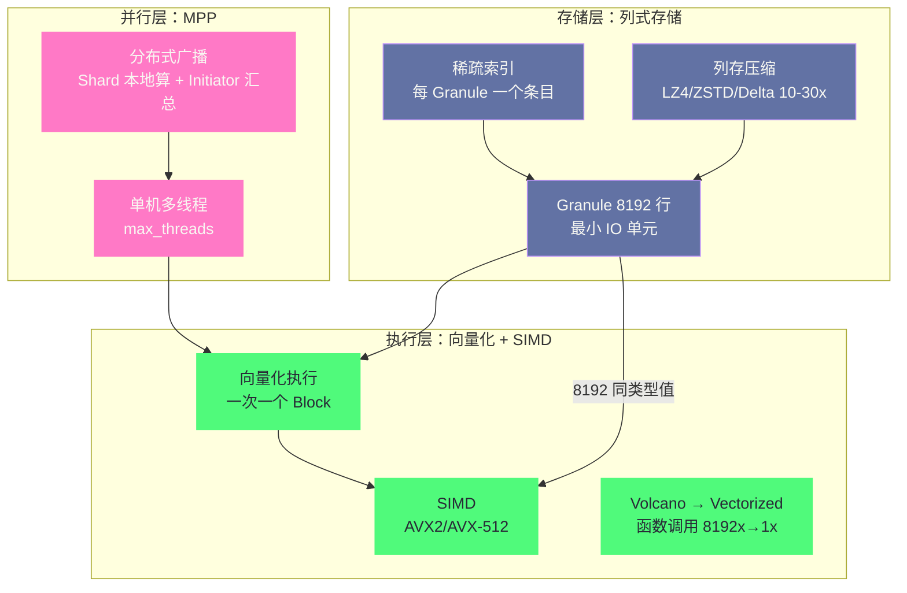

# 01 ClickHouse 全局架构——列式存储与 MPP 执行引擎

**摘要：**
ClickHouse 是 Yandex 为日志分析场景从零自研的列式 OLAP 引擎，2016 年开源后迅速成为实时分析领域的性能标杆。本文从 OLAP 场景与 OLTP 的根本差异切入，沿"为什么通用数据库做不好分析查询 → 列式存储如何从根本上改变 IO 模型 → 向量化执行如何榨干 CPU → MPP 如何把多核与多节点都用起来"这条主线，拆解 ClickHouse 三层协同设计的工程逻辑，并厘清它与 [[Doris]]、[[Trino]]、Hive 在定位上的本质差异，为后续篇章的存储引擎、查询执行、分布式表等深入话题奠定全局视角。

---

## 第 1 章 为什么需要一种新的数据库——OLAP 场景的特殊性

### 1.1 从 Yandex Metrica 说起

2008 年前后，Yandex 的网站流量分析产品 Metrica 面临一个工程困境。Metrica 的业务模式是追踪互联网用户的点击行为，为网站运营者提供流量来源、访客画像、转化漏斗等分析报表——这本质上是一个超大规模的点击流分析系统。彼时 Metrica 每天接收数十亿次点击事件，累积的数据量很快达到百亿行级别，而产品要求的分析查询必须在秒级内返回结果，因为报表是面向终端用户实时展示的，不是跑批后隔天才能看的。

Yandex 的工程师最初尝试了当时能想到的所有方案：传统行存关系数据库（MySQL/PostgreSQL）在亿级数据量下做全表聚合，查询动辄几十秒到几分钟；Hadoop MapReduce 虽然能处理这个数据量，但每个查询的分钟级延迟完全无法满足"实时报表"的需求；即便是当时新兴的列存数据库，也在写入吞吐和查询延迟之间难以兼顾。问题的核心不在于某个引擎做得不够好，而在于**OLAP 场景的查询特征与通用数据库的设计假设根本不匹配**——通用数据库为"按主键找一行"优化了几十年，而分析查询要的是"扫几十亿行的三列做聚合"，两种 workload 的物理布局、执行模型、资源分配策略完全不同。

Yandex 从 2009 年开始自研专门针对这个场景的存储引擎，内部代号就叫"Click House"——点击流的数据仓库。2016 年 7 月，Yandex 将这个项目以 Apache 2.0 许可开源，ClickHouse 这个名字沿用至今。开源之后，ClickHouse 很快在俄罗斯的 IT 圈流行，随后蔓延到全球——它的性能数字太过醒目，百亿行单表聚合秒级响应的案例比比皆是，而开源列存 OLAP 引擎在当时的选择极少，ClickHouse 填补了一个巨大的空白。

这段历史值得展开，因为它解释了 ClickHouse 后来所有设计决策的出发点。ClickHouse 不是一群数据库专家坐在一起"设计"出来的通用 OLAP 引擎——它是 Yandex 的工程师被一个极其具体的业务场景（点击流实时分析）逼出来的专用工具。**专用工具的特征是：在目标场景内极致优化，在目标场景外可能比通用工具更差**。ClickHouse 不支持事务、不擅长高频更新、高并发点查不如 MySQL——这些"缺陷"不是疏忽，而是专注的代价。理解了这一点，才能理解后续每一章的设计取舍。

### 1.2 为什么不是 Hadoop

一个自然的疑问是：2009 年 Hadoop 已经兴起，MapReduce 能处理 PB 级数据，Yandex 为什么不直接用 Hadoop？这个问题恰好能帮我们看清 ClickHouse 与 Hadoop 系生态（包括 Hive、Spark SQL）的根本分野。

Hadoop MapReduce 的设计目标是**超大规模离线批处理**——吞吐量优先，延迟可以到分钟甚至小时级。一个 MapReduce job 的启动开销（JVM 启动、任务调度、shuffle 落盘）就有几十秒——这对"跑一个离线 ETL 跑几小时"的场景无所谓，但对"用户点开报表等 3 秒看结果"的实时分析场景是致命的。Hive on MapReduce 的查询延迟通常在分钟级——即使后来换成了 Spark SQL（内存计算 + DAG 调度），延迟也在秒到十秒级，仍然无法满足 Metrica "秒级响应"的要求。

更深层的原因是**执行模型的差异**。Hadoop 生态的执行模型本质上是"分区 + shuffle + 聚合"的三阶段——Map 阶段在各节点扫描本地数据，shuffle 阶段按 key 重分布数据，Reduce 阶段做聚合。这个模型对"大表 JOIN + 复杂聚合"的批处理查询很合适，但对"单表扫描 + 简单聚合"的实时查询过于笨重——明明本地扫一下就能算出来，非要走一遍 Map → shuffle → Reduce 的全流程。ClickHouse 的设计直接砍掉了 shuffle——单表聚合在本地扫完算完，只把结果发给 Initiator——**省掉的不是一步操作，是一整个阶段的协议开销**。

这个分野至今仍然清晰：Hadoop 系（Hive、Spark SQL）适合"大规模离线批处理 + 复杂多表关联"，ClickHouse 适合"实时单表聚合分析"——两者的目标场景不同，不是替代关系。很多公司的数据栈里两者并存——Hive/Spark 跑离线 ETL 生成宽表，ClickHouse 加载宽表做实时查询。

值得一提的是，ClickHouse 与 Hadoop 系的边界近年来在模糊化——Spark SQL 的向量化执行（Photon 引擎）和 ClickHouse 的联邦查询能力（通过外部表引擎访问 Hive）都在向对方的领域渗透。但底层的取舍仍然清晰：Spark 的向量化是在"批处理框架"上叠的优化，ClickHouse 的联邦查询是在"实时引擎"上开的窗口——**两者的地基不同，上层建筑再怎么扩展，地基的取向不会变**。选型时看地基，不看上层建筑的宣传。

### 1.2 OLTP 与 OLAP 的根本差异

讨论 ClickHouse 为什么长成这样，必须先厘清它所针对的 OLAP 场景与大家熟悉的 OLTP 场景有什么根本差异。这两类 workload 的区别不在于"数据量大小"或"查询复杂度"——这些只是表象——真正的区别在于**查询的数据访问模式**。

**OLTP（Online Transaction Processing，在线事务处理）** 是 MySQL、PostgreSQL 这类传统关系数据库的主战场。典型查询是"按主键找一行"或"按二级索引找少量行"，每次查询读取的行数极少（通常 1 到 100 行），但并发量高（每秒数千甚至数万个事务）。OLTP 的核心诉求是**低延迟的点查 + 事务一致性**——用户下单、转账、改密码，每个操作都必须快、必须准、必须可回滚。行存储对这类查询非常高效：一行的所有列紧邻存储在同一个物理页面里，取一行只需一次磁盘寻址，B+ 树索引能在 O(log N) 时间内定位到目标行。

**OLAP（Online Analytical Processing，在线分析处理）** 是数据仓库、实时报表、用户行为分析的主战场。典型查询是"对过去 30 天的销售数据按地区分组求和"——需要扫描数十亿行，但每次查询只涉及表的少数几列（譬如 `date`、`region`、`amount` 三列），并发量低（每秒几个到几十个查询）。OLAP 的核心诉求是**高吞吐的批量扫描 + 聚合计算**——不需要事务、不需要点查、不需要低延迟到毫秒级，但必须能在秒级内扫完百亿行数据并算出结果。

这两类 workload 对存储布局的要求是矛盾的。行存储把一行的所有列放在一起——取一行快，但取一列慢（必须把整行都读进来再挑出需要的列）。列存储把一列的所有值放在一起——取一列快，但取一行慢（要从 N 个列文件里各取一个值再拼起来）。**行存为 OLTP 优化，列存为 OLAP 优化**——这不是谁更好的问题，是数据访问模式决定的物理布局选择。

OLTP 与 OLAP 的差异不只在查询模式，还体现在写入模式上。OLTP 的写入是"高频单行写"——每秒数千个 INSERT/UPDATE/DELETE，每个操作只动一两行；OLAP 的写入是"低频批量写"——每分钟或每小时一批数据导入，一次几万到几百万行。ClickHouse 的写入路径就是为批量写优化的——单行 INSERT 的代价其实不低（每次写入生成一个 Part，Part 太多会触发合并压力），但批量 INSERT 的吞吐极高。**把 OLTP 的高频单行写模式套到 ClickHouse 上，会触发 "Too many parts" 错误**——这是 ClickHouse 最常见的误用坑之一，第 03 篇会详细展开。

用一个具体的数字来感受这个差距。对于一张 100 列、1 亿行的用户行为表，一个典型的分析查询可能只需要读取其中 3 列（`event_date`、`region`、`amount`）。行存储需要把 100 列全部读进来——97% 的 IO 是浪费的。列存储只读 3 列——IO 量减少 97%。这不是"优化了 3%"，是**数量级的差距**——行存储做多少层缓存、多少级索引都弥补不了物理布局上的劣势，因为无用数据从一开始就被加载了。

### 1.3 通用数据库做不好 OLAP 的深层原因

有人可能会问：MySQL 加个列存索引、PostgreSQL 装个列存扩展，不也能做 OLAP 吗？为什么非要一个专门的引擎？这个问题在工程界争论了很多年，答案藏在"执行模型"而不仅仅是"存储布局"里。

通用关系数据库的查询执行普遍采用 **Volcano Model（火山模型）**——每个算子（过滤、聚合、JOIN）每次调用 `next()` 返回一行数据，算子之间通过函数调用层层传递。这个模型对 OLTP 的点查很合适——本来就只有几行数据，逐行处理的开销可以忽略。但在 OLAP 场景下，一个查询要处理数十亿行，每行一次函数调用的开销就变成了天文数字——数十亿次函数调用意味着数十亿次栈帧分配、数十亿次分支预测失败、数十亿次 CPU 流水线打断。更关键的是，逐行处理无法利用 CPU 的 **SIMD（Single Instruction Multiple Data，单指令多数据）指令**——SIMD 要求连续的同类型数据批量送入 CPU，而火山模型的"一行一次"恰好破坏了这个前提。

这就引出了 ClickHouse 的第二个核心设计：**向量化执行（Vectorized Execution）**——不是逐行处理，而是一次处理一批（一个 Granule，默认 8192 行），让 CPU 能用 SIMD 指令并行计算。向量化执行的前提是数据连续且类型相同——列存储天然满足这个前提，行存储则不行。**列存储 + 向量化执行是一个不可分割的组合**——只做列存储不做向量化，只省了 IO 但没榨干 CPU；只做向量化不做列存储，CPU 拿不到连续同类型的数据，SIMD 无用武之地。

### 1.4 ClickHouse 的设计哲学

行文至此，可以总结 ClickHouse 的设计哲学了——这条哲学贯穿后续每一章：

> [!info] 设计哲学：为分析查询极致优化，而非做通用数据库
> ClickHouse 的所有设计决策都服从于一个目标——**在"扫描大量数据做聚合计算"这个特定场景内做到极致性能**。这个目标决定了列存储 + 向量化 + MPP 三层协同的技术路线，也决定了它放弃事务、放弃高频更新、放弃高并发点查。了解 ClickHouse 的边界，比了解它的功能更重要——**它的极致性能来自专注，它的局限同样来自专注**。

这条哲学的深层含义是：ClickHouse 从来不试图成为"更好的 MySQL"或"更快的 PostgreSQL"——它是一个**不同品类的数据库**。把它用在它擅长的场景（大表聚合分析），它能给出令人震惊的性能；把它用在它不擅长的场景（高频更新、高并发点查、复杂多表 JOIN），它可能比通用数据库更差。**选型的核心不是"ClickHouse 好不好"，而是"你的场景是不是它的目标场景"**——后续第 5 章会详细展开这个选型框架。

---

## 第 2 章 列式存储——物理布局的根本转换

### 2.1 行存与列存的物理布局对比

理解列存储的优势，最直接的方式是看两种存储布局在磁盘上的物理形态。

行存储的物理布局——以 MySQL 的 InnoDB 页面为例，一个 16KB 的数据页里，行的所有列紧邻排列：

```
Page (16KB):
┌─────────────────────────────────────────────────────────┐
│ row1: id=1, name="Alice", age=28, city="Beijing",  amount=1000.0, ... │
│ row2: id=2, name="Bob",   age=35, city="Shanghai", amount=2500.0, ... │
│ row3: id=3, name="Carol", age=22, city="Shenzhen", amount=800.0,  ... │
│ ...                                                                   │
└─────────────────────────────────────────────────────────┘
```

这种布局的好处是"取一行快"——一次寻址就能拿到一行的所有列。坏处是"取一列慢"——想读 `amount` 列，必须把 `id`、`name`、`age`、`city` 等所有其他列也读进来，因为它们在物理上和 `amount` 混在同一个页面里。

列存储的物理布局——ClickHouse 的每个列文件独立存储：

```
amount.bin:  [1000.0, 2500.0, 800.0, 3200.0, ...]   ← 只有 amount 列
age.bin:     [28, 35, 22, 41, ...]                    ← 只有 age 列
city.bin:    ["Beijing", "Shanghai", "Shenzhen", ...] ← 只有 city 列
```

查询 `SELECT sum(amount) FROM events WHERE date > '2024-01-01'` 只需要读取 `amount.bin` 和 `date.bin` 两个文件——完全不碰其他列文件。对于 100 列的宽表只查 3 列的场景，IO 量直接减少 97%。

这两种布局的差异可以用一个生活化的比喻来理解：行存储像一本**按时间排列的日记本**——每页记一天的天气、心情、行程、开销，想统计"全年的开销总和"就得翻遍整本日记把每页的开销挑出来；列存储像一本**按科目分册的账本**——开销单独一本、天气单独一本，想统计开销总和只需翻开"开销"那一本从头加到尾。**日记本适合回顾某一天的全貌，账本适合统计某一科目的汇总**——OLTP 要的是"某一天的全貌"（取一行），OLAP 要的是"某一科目的汇总"（扫一列）。

### 2.2 列存储对压缩的天然优势

列存储的第二个巨大优势是**压缩率远高于行存储**——这个优势常被忽略，但在实际生产中它对性能的影响不亚于 IO 减少本身。

压缩的本质是"找到数据中的重复模式，用更短的编码替代重复部分"。行存储的一个数据页面里，整数、字符串、浮点数、时间戳交替出现——不同类型的数据混在一起，压缩算法很难找到跨类型的规律，压缩率通常只有 2-5 倍。列存储的同一个文件里只有一种类型的数据——同类型数据的重复模式远比混合数据丰富，压缩算法能找到更多规律。

ClickHouse 利用了列存储的这个特性，针对不同类型的列提供多种压缩编码（compression codec），让用户按列的特征选择最优编码：

| 编码方式 | 适用场景 | 压缩效果 | 说明 |
| :--- | :--- | :--- | :--- |
| **LZ4**（默认） | 通用场景 | 3-10 倍 | 压缩/解压速度极快，几乎不消耗 CPU |
| **ZSTD** | 需要更高压缩率 | 5-20 倍 | CPU 开销略高，适合冷数据 |
| **Delta** | 单调递增数值 | 配合 LZ4 效果极佳 | 存相邻值的差而非原值 |
| **DoubleDelta** | 缓慢变化的数值 | 极佳 | 存差值的差，适合传感器定时采集 |
| **T64** | 小范围整数 | 好 | 把数值"塞进"更少的 bit 位 |
| **Gorilla** | 浮点数时序 | 好 | 来自 Gorilla 论文的 XOR 编码 |

几种编码可以叠加使用——譬如 `Delta, LZ4` 表示先做 Delta 编码再 LZ4 压缩，对时间戳列的效果极好（相邻时间戳的差值通常很小，LZ4 能进一步压缩）。实际生产中，ClickHouse 的整体压缩率通常在 10-30 倍——意味着 1TB 原始数据在 ClickHouse 中可能只占 30-100GB 磁盘空间。

编码的选择有一个简单的经验法则：**先看列的值域特征，再看访问频率**。值域单调递增的列（时间戳、自增 ID）用 Delta 系列编码；值域有限的低基数列（枚举、状态码）用字典编码——ClickHouse 的 `LowCardinality` 类型已经把字典编码内置了；访问频率低的冷数据列可以换用 ZSTD 牺牲一点 CPU 换更高压缩率；访问频率高的热数据列保持默认 LZ4 即可。**编码不是越强越好——ZSTD 的解压速度比 LZ4 慢约 3 倍，对热数据来说，省下的 IO 可能被多花的 CPU 解压时间抵消**。第 06 篇性能调优会给出更细致的编码选型建议。

压缩率对查询性能的影响是双重的：第一，磁盘 IO 读取的是压缩后的数据，实际读取的字节数大幅减少；第二，解压在内存中进行，LZ4 的解压速度极快（GB/s 级），不会成为瓶颈。**压缩不只是省存储，更是省 IO、省内存带宽**——在 IO 密集的 OLAP 查询里，这个收益非常可观。

### 2.3 Granule——ClickHouse 最小的 IO 单元

列存储的物理布局解决了"只读需要的列"的问题，但还有一个工程问题要回答：**列文件是逐行随机访问的，还是按块批量读取的？** 答案是后者——ClickHouse 以 **Granule（颗粒）** 为最小的 IO 单元，一个 Granule 默认包含 8192 行（由 `index_granularity` 参数控制）。

Granule 的设计有两个深远的意义。

**第一，稀疏索引的基础**。ClickHouse 的主键索引不是传统 B+ 树那种"每行一个索引条目"的稠密索引，而是**稀疏索引（Sparse Index）**——每 8192 行（一个 Granule）才有一个索引条目，记录这个 Granule 起始行的主键值。对于一张 10 亿行的表，索引条目数量是 10 亿 / 8192 ≈ 12 万——整个索引可以完全放在内存中，查询时无需磁盘 IO 就能定位数据范围。这与 B+ 树形成鲜明对比——B+ 树的索引条目数等于行数，10 亿行的索引本身就有几十 GB，无法全放内存，查询时需要多次磁盘 IO 在索引树里逐层下降。**稀疏索引用"粒度换内存"**——牺牲"定位到具体行"的能力（只能定位到 8192 行的 Granule），换取"整个索引在内存里"的速度（无需磁盘 IO）。对 OLAP 来说，定位到 8192 行的粒度已经足够——反正后续要扫描整个 Granule 做聚合。

**第二，向量化执行的天然载体**。每次从磁盘读取一个 Granule 的一列，就是 8192 个同类型的值——这恰好是一个向量（vector），天然匹配 CPU 的 SIMD 指令宽度。后续的所有计算（过滤、聚合、函数运算）都以这个向量为单位进行，不需要再切分或拼装。**Granule 既是 IO 单元又是计算单元**——这个统一设计让"从磁盘读到 CPU 算"的链路没有格式转换的开销。

Granule 的大小（8192 行）不是随意选的。太小（譬如 1024 行）会让稀疏索引的条目数增多、索引内存占用变大，且单次 IO 的数据量太小、IO 效率下降；太大（譬如 65536 行）会让稀疏索引的定位精度下降——一个 Granule 里有 6 万行，即使主键能定位到这个 Granule，也还要在这 6 万行里扫描，对点查不友好。8192 是一个在"索引内存占用"和"定位精度"之间取的平衡值——这个值从 ClickHouse 早期一直沿用至今，绝大多数场景不需要调整。

Granule 还有一个与压缩的协同效应值得点出：因为一个 Granule 内的 8192 个值是连续同类型的，压缩算法在这个范围内能找到很好的局部模式——譬如时序数据中相邻行的 `event_date` 差 0 或 1，Delta 编码在这个 Granule 内能把 8192 个日期压缩成 8192 个 0/1 的小整数，再经 LZ4 压缩后可能只占几十字节。**Granule 不只是 IO 和计算的单元，也是压缩的单元**——三个角色统一在同一个 8192 行的块上，这是 ClickHouse 设计中一个容易被忽略的简洁性。



---

## 第 3 章 向量化执行——把 CPU 的并行算力榨干

### 3.1 火山模型的局限

上一章讲了列存储解决了 IO 层面的效率问题，但 OLAP 查询的性能瓶颈不只在 IO——**CPU 的计算效率同样关键**。当 IO 已经因为列存 + 压缩而大幅减少后，CPU 能不能快速处理读进来的数据，就成了查询延迟的决定因素。

传统数据库的查询执行普遍采用 **Volcano Model（火山模型）**——这个模型由 Goetz Graefe 在 1994 年的论文《Volcano, an Extensible and Parallel Query Evaluation System》中提出，此后三十年里几乎是所有关系数据库的执行模型标准。火山模型的核心是"拉模式（pull model）"——查询计划组织成一棵算子树，树顶的算子调用子算子的 `next()` 方法获取一行数据，子算子再调用更下层算子的 `next()`，逐层向下直到叶子节点（表扫描）返回一行，再逐层向上处理。

火山模型对 OLTP 的点查很合适——本来就只有几行数据，逐行处理的开销可以忽略，而 `next()` 接口的抽象让算子实现简洁、可组合。但在 OLAP 场景下，一个查询要处理数十亿行，火山模型的三个隐含代价就暴露了：

**函数调用开销**。每处理一行数据，从叶子到根的每个算子都要调用一次 `next()`——数十亿行意味着数十亿次函数调用。每次函数调用涉及栈帧分配、寄存器保存恢复、返回地址压栈——单次开销不大，但乘以数十亿次就变成了不可忽视的 CPU 消耗。

**分支预测失败**。CPU 的流水线依赖分支预测——如果分支预测成功，流水线满载运行；如果预测失败，流水线要清空重填，代价是十几个周期。火山模型的 `next()` 返回一行后，算子要判断"还有没有下一行"——这个判断的分支方向取决于数据是否扫完，对 CPU 来说几乎不可预测（数据什么时候扫完取决于磁盘 IO，与 CPU 的分支历史无关）。逐行处理意味着每行都有一次不可预测的分支——数十亿次的分支预测失败，累积起来是巨大的 CPU 浪费。

**无法利用 SIMD**。SIMD（单指令多数据）指令要求一条指令同时处理多个数据元素——譬如 AVX2 的 `vaddpd` 可以一条指令加 4 个 double。但 SIMD 的前提是**连续的同类型数据批量送入 CPU**——火山模型每次只送一行的一个值，SIMD 指令的并行能力完全闲置。

### 3.2 向量化执行的核心思想

向量化执行的思想最早由 MonetDB 的团队在 2005 年前后系统化提出——核心改动只有一句话：**把"每次一行"改成"每次一批"**。但这句话的连锁影响很深。

在向量化模型下，每个算子每次调用 `next()` 返回的不是一行，而是一个 **Block（数据块）**——ClickHouse 里一个 Block 默认就是一个 Granule 的数据，即 8192 行的一列或多列。算子拿到一个 Block 后，对整批数据做同样的操作，再向上游返回一个 Block。

```cpp
// 伪代码：向量化的 SUM 计算
// column_data 是 8192 个 Float64 值的连续内存
double vectorized_sum(const double* column_data, size_t size) {
    double sum = 0.0;
    // 编译器可以自动向量化这个循环，利用 AVX2 一次处理 4 个 double
    for (size_t i = 0; i < size; ++i) {
        sum += column_data[i];
    }
    return sum;
}
```

这段代码看起来和标量版本没什么区别——区别在编译器能对它做什么。因为 `column_data` 是 8192 个连续的 double，编译器可以把这个循环自动向量化——用 AVX2 的 `vaddpd` 指令一次加 4 个 double，循环次数从 8192 次降到 2048 次。如果用 AVX-512，一次加 8 个 double，循环次数降到 1024 次。**同样的逻辑，向量化后 CPU 执行的指令数减少 4-8 倍**。

向量化的三个优势可以对应火山模型的三个局限来看：

**函数调用开销消失**。一个 Block 8192 行，算子之间的 `next()` 调用从 8192 次降到 1 次——函数调用开销几乎归零。

**分支预测友好**。处理一个 Block 时，过滤条件（WHERE）可以提前对整批数据求值，生成一个位图（bitmask）标记哪些行满足条件——这个位图计算是连续的 SIMD 操作，没有不可预测的分支。后续算子根据位图取数据，也是连续的内存访问。

**SIMD 充分利用**。8192 个同类型值连续存储在内存中，SIMD 指令可以满载运行——AVX2 一次 4 个、AVX-512 一次 8 个，计算吞吐量成倍提升。

### 3.3 SIMD 指令的实际效果

ClickHouse 的核心计算函数——哈希、过滤、聚合、字符串操作——都针对 SSE4.2、AVX2、AVX-512 进行了手工优化。以最常见的 `COUNT(DISTINCT user_id)` 为例，ClickHouse 使用 **HyperLogLog** 算法估算基数（允许约 1% 的误差），底层的哈希计算用 SIMD 指令并行处理：

- 标量版本：每次处理 1 个 64-bit 值，1 个 CPU 周期计算 1 个哈希
- SSE4.2 版本：利用 CRC32 指令，同等周期处理 2 个 64-bit 哈希
- AVX2 版本：每次处理 4 个 64-bit 值

对于百亿行数据的 `COUNT(DISTINCT)` 查询，SIMD 优化带来 3-4 倍的吞吐提升——这不是"快了一点"，是"从 10 秒变 3 秒"的体验差异。

> [!info] 核心概念：SIMD（Single Instruction Multiple Data）
> SIMD 是现代 CPU 提供的并行计算能力——一条指令可以同时对多个数据元素执行相同操作。
> - **SSE2/SSE4.2**：128-bit 宽，同时处理 2 个 64-bit 或 4 个 32-bit 元素
> - **AVX2**：256-bit 宽，同时处理 4 个 64-bit 或 8 个 32-bit 元素
> - **AVX-512**：512-bit 宽，同时处理 8 个 64-bit 元素
>
> SIMD 的前提是数据必须**连续存储且类型相同**——这正是列存储的天然优势。行存储中不同列的类型不同、数据不连续，无法批量 SIMD 处理。**列存储是向量化执行的前提，向量化执行是 SIMD 的前提**——三层递进，缺一不可。

### 3.4 向量化不是免费的

向量化执行的优势已经讲了很多，但它不是没有代价——这些代价解释了为什么 OLTP 数据库不采用向量化（火山模型对点查反而更合适）。

**内存占用更大**。向量化要一次性把 8192 行的一列读进内存——对宽表来说，如果查询涉及 50 列，一个 Block 就是 50 × 8192 个值，内存占用远大于火山模型的"一行 50 个值"。OLAP 查询的内存预算通常充足（几个 GB 不算多），但 OLTP 的高并发场景下，每个查询只给几 MB 内存，向量化的大 Block 反而放不下。

**点查不友好**。如果查询只返回 1 行（`WHERE id = 123`），向量化还是要读一个 Granule（8192 行）进来——绝大多数行是浪费的。火山模型可以精确到"读一行返回一行"，对点查更高效。

**算子实现复杂度上升**。火山模型的 `next()` 接口简洁——每个算子只处理一行，逻辑清晰。向量化的算子要处理一个 Block，内部要考虑 SIMD 对齐、位图生成、列类型分发——实现复杂度显著高于火山模型。

这三个代价恰好对应了 OLAP 与 OLTP 的差异——OLAP 查询内存预算大、扫描行数多、算子复杂度可以接受；OLTP 查询内存预算小、只取几行、算子越简单越好。**向量化是 OLAP 场景的正确选择，但不是所有场景的正确选择**——这也是 ClickHouse 不适合做 OLTP 的原因之一。

### 3.5 向量化与代码生成的路线之争

向量化执行并不是"让 CPU 跑得更快"的唯一路线——还有另一条路线叫**代码生成（Codegen / Compilation）**，以 HyPer 和 Apache Impala 为代表。两条路线的哲学不同，值得对比理解。

**向量化**的思路是"把数据打包成向量，让编译器的自动向量化和 SIMD 指令发挥作用"——算子仍然是预编译的通用函数，只是输入从"一行"变成了"一批"。优势是实现简单、调试方便、编译时间零开销（算子是提前编译好的）；劣势是算子之间仍然有函数调用（虽然从"每行一次"降到了"每批一次"），且编译器的自动向量化不一定总能成功（依赖数据对齐、循环形态等条件）。

**代码生成**的思路是"把整个查询计划编译成一段专门的机器码"——针对每个查询，生成一段从叶子到根的紧凑循环，消除所有算子间的函数调用，让 CPU 执行的就是一段"从头到尾的直线代码"。优势是零函数调用开销、分支预测极度友好；劣势是每个查询都要 JIT 编译（编译本身有几百毫秒到秒级开销），且调试困难（生成的代码不是人类可读的源码）。

ClickHouse 选择了向量化路线——原因很务实：向量化在绝大多数分析查询上的性能已经足够好，且实现和调试的成本远低于代码生成。代码生成的 JIT 编译开销在"秒级查询"的场景里是不可忽视的——如果查询本身只跑 2 秒，JIT 编译花 500 毫秒，等于多了 25% 的延迟。**向量化是"足够好且足够简单"的选择，代码生成是"极致但复杂"的选择**——ClickHouse 选了前者，HyPer 选了后者，两条路都能到达"高性能 OLAP"的目的地，只是工程代价不同。

---

## 第 4 章 MPP 执行——单机多线程与分布式广播

### 4.1 ClickHouse 的"MPP"与传统 MPP 的区别

ClickHouse 常被描述为 MPP（Massively Parallel Processing，大规模并行处理）架构，但这个说法需要精确化——ClickHouse 的并行模型与 Trino、Greenplum 那种传统 MPP 有重要区别，理解这个区别对选型和调优都很关键。

**传统 MPP**（以 [[Trino]]/Presto、Greenplum 为代表）的核心特征是**跨节点的分布式执行**——查询计划被拆分成多个 stage，每个 stage 在不同节点上执行，stage 之间通过网络交换（shuffle/exchange）中间结果。譬如表 A 在节点 1-4 上各有 1/4 数据，表 B 在节点 1-4 上各有 1/4 数据，做 `A JOIN B` 时，传统 MPP 会按 JOIN key 对两张表的数据做 shuffle——把 A 和 B 中 JOIN key 相同的行送到同一个节点上做 Hash Join。这种 shuffle 是 MPP 的灵魂——它让大表 JOIN 可以跨节点并行，不受单机内存限制。

**ClickHouse 的并行模型**首先要强调的是**单机内的多线程并行**——同一台服务器上，一个查询会并发启动多个线程（`max_threads` 控制，默认等于 CPU 核心数），每个线程处理一部分 Granule，最后合并结果。这种单机多线程并行是 ClickHouse 性能的基础——在单机场景下，一个查询就能把几十个 CPU 核心全部跑满。

在分布式部署时，ClickHouse 也支持跨节点并行——查询广播到所有 Shard，每个 Shard 内部再多线程执行，最后由发起查询的节点（Initiator）汇总。但 ClickHouse 的跨节点并行**默认不做 shuffle**——每个 Shard 在本地完成全部计算，只把最终结果发给 Initiator 汇总。这意味着：

- **聚合查询**（`GROUP BY + SUM/COUNT`）：每个 Shard 本地聚合后发结果给 Initiator 做二次聚合——Shard 间只传少量聚合结果，网络开销极小，效率极高
- **大表 JOIN**：如果两张表都在同一个 Shard 上（通过分布式表写入时按 sharding key 分配），JOIN 在本地完成，无需 shuffle；但如果两张表不在同一个 Shard 上，ClickHouse 的分布式 JOIN 要么把右表广播到所有 Shard（数据放大 N 倍），要么把右表拉到 Initiator 单点 JOIN（单点瓶颈）——两种方式都不如 Trino 的 shuffle Hash Join 高效

**ClickHouse 的并行模型更接近"单机 SMP + 分布式广播"，而非 Trino 那种完全对等的 MPP**。这个定位的差异可以用一个比喻来理解：Trino 像一支分工明确的施工队——每个工人负责一段，材料在工人之间流转（shuffle）；ClickHouse 像一群各自独立的施工队——每个队独立干完自己的全部工作，最后把成果汇总给项目经理（broadcast + local aggregate）。**前者适合需要大量协作的复杂任务（多表 JOIN），后者适合各自独立的简单任务（单表聚合）**。



### 4.2 单机并行度的配置

ClickHouse 对并行度的控制非常细粒度——用户可以在 session 级别或 user profile 级别设置查询使用的线程数：

```sql
-- 查询使用的线程数（默认等于 CPU 核心数）
SET max_threads = 16;

-- 一次读取的 Granule 数量（影响预读效率）
SET max_read_buffer_size = 10485760;  -- 10MB
```

`max_threads` 是 ClickHouse 调优中最关键的参数之一。默认值等于 CPU 核心数——让一个查询跑满整台机器。这在"低并发 + 大查询"的场景下是正确的——反正同时只有几个查询，让每个查询跑得越快越好。但在"较高并发 + 中小查询"的场景下，默认值会导致问题——如果 10 个查询同时跑，每个都用 32 个线程，总共 320 个线程在 32 核机器上竞争——线程上下文切换的开销可能吃掉一半的 CPU 时间。这种场景下应该调低 `max_threads`（譬如 4-8），让每个查询用较少的线程，但更多查询能并行——**总吞吐量反而更高**。

`max_threads` 的设置有一个反直觉的效应值得记住：**调大不一定更快，调小不一定更慢**。当 `max_threads` 超过数据能切分的并行度时（譬如一个查询只扫 4 个 Granule，但 `max_threads=32`），多出来的线程没有数据可处理，纯粹浪费调度开销。ClickHouse 内部会按"可用 Granule 数 / `max_threads`"来分配工作，当 Granule 数不足时，实际并行度自动下降——但线程创建的开销已经付出了。**`max_threads` 的合理上限是"数据量能喂饱的线程数"，不是"CPU 核心数"**——对小查询来说，调小 `max_threads` 反而能减少启动开销。

ClickHouse 还提供了 user profile 级别的资源配额——可以给不同用户设置不同的 `max_threads`、`max_memory_usage`、`max_concurrent_queries`——防止单个用户的大查询耗尽集群资源。这个机制在第 06 篇性能调优中会详细展开。

### 4.3 "不 shuffle"的代价与收益

ClickHouse "默认不 shuffle"的选择是一个典型的工程权衡——它用"大表 JOIN 不如 Trino"的代价，换来了"单表聚合极快"的收益。

**收益**：单表聚合是 OLAP 最常见的查询模式（报表、看板、行为分析 90% 以上是单表聚合）。这类查询在 ClickHouse 上不需要任何网络传输——Shard 在本地扫数据、本地聚合、只发结果给 Initiator——网络开销几乎为零，延迟极低。Trino 做同样的查询，即使数据在本地，也要走 shuffle 协议（虽然 shuffle 的数据量可能很小），协议本身的开销不可忽略。

**代价**：当查询涉及大表 JOIN，且两张表不在同一个 Shard 上时，ClickHouse 的表现不如 Trino。ClickHouse 的 `GLOBAL JOIN` 会把右表拉到 Initiator 单点做 JOIN——如果右表很大，Initiator 的内存和网络都扛不住。Trino 的 shuffle Hash Join 则把 JOIN 分散到所有节点——每个节点只处理一部分数据，内存和网络都分摊了。

**这个权衡背后的认知是**：OLAP 场景里，单表聚合的频率远高于大表 JOIN——为高频场景优化、为低频场景接受次优表现，是正确的取舍。如果业务里大表 JOIN 是主流，那 ClickHouse 可能不是最佳选择——Trino 或 [[Doris]] 更合适。**没有银弹，架构即权衡**——ClickHouse 的权衡是"单表聚合优先"，理解了这个前提，才能理解它后续所有的设计决策。

### 4.4 工程上如何缓解 ClickHouse 的 JOIN 短板

既然 ClickHouse 在大表 JOIN 上做了取舍，实际工程中如果遇到 JOIN 需求怎么办？常见的缓解手段有几种，各自的适用条件不同。

**宽表预 JOIN**——在 ETL 阶段就把需要 JOIN 的字段合并进同一张宽表，查询时直接扫宽表，不做运行时 JOIN。这是 ClickHouse 生态里最常见的做法——ClickHouse 的高压缩率让宽表的存储成本可接受（100 列的宽表压缩后可能只占原始数据的 5%），而查询时只读需要的列，宽表的"宽"不会带来 IO 放大。**宽表预 JOIN 是用"ETL 复杂度"换"查询性能"的经典空间换时间**。

**物化视图（Materialized View）**——对高频 JOIN 查询预聚合，把 JOIN 结果存为物化视图，查询时直接命中物化视图。适合"JOIN 模式固定且查询频繁"的场景——第 06 篇会详细展开物化视图的设计。

**字典（Dictionary）**——对"大表 JOIN 小维度表"的场景，把小维度表加载为 Dictionary（常驻内存的哈希表），查询时用 `dictGet()` 函数做 lookup，不做真正的 JOIN。这是 ClickHouse 独有的机制——对"事实表 JOIN 维度表"的星型查询非常高效。

**GLOBAL JOIN**——分布式表上的 `GLOBAL JOIN` 会把右表拉到 Initiator 再广播到所有 Shard——适合右表不太大的场景。如果右表很大，GLOBAL JOIN 的 Initiator 内存会成为瓶颈。

四种手段的共同思路是**把运行时 JOIN 转成预计算或内存 lookup**——本质上是承认 ClickHouse 不擅长运行时 shuffle JOIN，用工程手段绕开它。这与 Trino 的哲学不同——Trino 的 shuffle Hash Join 是"在运行时高效处理任意 JOIN"，ClickHouse 的思路是"在 ETL 阶段把 JOIN 做掉，运行时只扫不 JOIN"。**两种哲学各有适用场景，没有高下之分**——如果你的 JOIN 模式固定且可预计算，ClickHouse 的方案更快；如果你的 JOIN 模式多变且无法预计算，Trino 的方案更灵活。

---

## 第 5 章 ClickHouse 的能力边界——不擅长什么

### 5.1 强项与弱项的对偶

讲了这么多 ClickHouse 的设计优势，这一章要反过来讲它的弱项——**了解一个系统的边界，比了解它的功能更重要**。ClickHouse 的强项和弱项是同一枚硬币的两面——它的强项来自"为分析查询极致优化"，它的弱项来自"不为其他场景付出代价"。

**ClickHouse 的强项**：

- **高吞吐扫描聚合**：百亿行单表聚合查询，秒级响应（依赖列存剪枝 + 向量化 + SIMD）
- **实时写入 + 近实时查询**：数据批量写入后，秒级到分钟级即可查询（Part 合并后）
- **高压缩率**：列存 + 编码，10-30 倍压缩，存储成本极低
- **SQL 友好**：标准 SQL + 丰富的分析函数（窗口函数、数组函数、JSON 函数等）
- **生态丰富**：Kafka Connector、Flink Connector、各种 BI 工具对接

**ClickHouse 的弱项**（选型时必须知道）：

- **不支持事务**：没有 ACID 保证，不适合需要事务一致性的场景
- **更新/删除代价高**：`ALTER TABLE UPDATE/DELETE` 是异步 Mutation，会重写整个 Part——不适合高频更新
- **高并发点查差**：同时执行数百个点查 SQL 时，每个 SQL 占用多个线程，CPU 竞争严重——行存 + B+ 树索引的 MySQL 在点查场景完胜
- **大表 JOIN 不强**：跨 Shard 的大表 JOIN 不如 Trino 的 shuffle Hash Join
- **没有真正的二级索引**：稀疏索引只适合范围扫描，不适合等值点查（虽然有跳数索引，但能力远不如 B+ 树）

### 5.2 与同类系统的定位对比

ClickHouse 不是唯一的 OLAP 引擎——市场上还有 [[Doris]]（含 StarRocks）、[[Trino]]、Hive、Druid 等。它们各有定位，不是简单的"谁更好"的关系。

| 维度 | ClickHouse | [[Doris]]/StarRocks | [[Trino]] | Hive | Druid |
| :--- | :--- | :--- | :--- | :--- | :--- |
| **架构** | 列存 + 单机多线程 + 广播 | 列存 + MPP（FE/BE 分离） | 内存计算 + MPP（shuffle） | 列存 + MapReduce/Spark | 列存 + 时序索引 |
| **查询延迟** | 亚秒到秒级 | 亚秒到秒级 | 秒到分钟级 | 分钟级 | 亚秒级 |
| **实时写入** | 好（批量 Insert） | 好（Stream Load） | 不支持写入 | 差 | 好（实时摄入） |
| **大表 JOIN** | 一般（本地优先） | 好（Shuffle JOIN） | 好（完整 Shuffle） | 好（MapReduce） | 差（不支持复杂 JOIN） |
| **并发查询** | 中（多线程消耗大） | 好 | 好 | 一般 | 好 |
| **更新/删除** | 差（Mutation 重写） | 好（Unique 模型） | 不适合 | 差 | 差 |
| **时序场景** | 好 | 一般 | 一般 | 差 | 极好 |
| **适用场景** | 单表大数据量聚合 | 多表关联 OLAP | 跨数据源联邦查询 | 大规模离线批处理 | 实时时序监控 |

这张表的关键不是"谁在哪个维度更强"，而是**每个系统的设计取舍指向了不同的目标场景**：

- **ClickHouse** 取舍了"JOIN 和并发"换"单表聚合极致性能"——适合"宽表 + 单表聚合"的实时分析
- **Doris/StarRocks** 取舍了"极致单表性能"换"JOIN 和并发更均衡"——适合"多表关联 + 高并发"的通用 OLAP
- **Trino** 取舍了"存储"换"联邦查询能力"——适合"跨数据源（MySQL + Hive + Kafka）的即时查询"
- **Hive** 取舍了"延迟"换"吞吐和稳定性"——适合"超大规模离线批处理"
- **Druid** 取舍了"JOIN 和灵活性"换"时序摄入和查询"——适合"实时时序监控看板"

### 5.3 选型决策框架

面对一个具体的 OLAP 需求，怎么选？笔者建议按以下顺序做排除法：

**第一步：查询模式是单表聚合还是多表 JOIN？** 如果 90% 以上是单表聚合（报表、看板、行为分析），ClickHouse 是首选——它的单表性能远超其他方案。如果多表 JOIN 是主流，Doris/StarRocks 或 Trino 更合适。

**第二步：有没有高频更新需求？** 如果数据写入后需要频繁更新（譬如订单状态变化），ClickHouse 的 Mutation 代价太高——Doris 的 Unique 模型或 MySQL + OLAP 加速层更合适。如果数据是"写一次读多次"（日志、事件流），ClickHouse 完美匹配。

**第三步：并发量有多大？** 如果同时只有几十个查询，ClickHouse 没问题。如果需要支撑数百到上千的并发查询，Doris/StarRocks 的并发能力更强。

**第四步：数据源是否多元？** 如果查询要跨 MySQL、Hive、Kafka 等多个数据源，Trino 的联邦查询能力无可替代。如果数据都在一个存储里，Trino 的联邦优势用不上。

这个框架的落点是：**没有"最好的 OLAP 引擎"，只有"最适合你场景的 OLAP 引擎"**——选型的核心是搞清楚自己的查询模式、更新频率、并发量、数据源分布，然后找匹配的引擎，而不是反过来"选了一个引擎再让业务去适应它"。

### 5.4 常见选型误区

选型框架之外，还有几个常见误区值得澄清——它们在实际项目中反复出现，造成的代价不小。

**误区一："ClickHouse 比MySQL 快，所以用 ClickHouse 替换 MySQL"**。这是最危险的误区——ClickHouse 和 MySQL 不是同品类的数据库。MySQL 是 OLTP，擅长事务、点查、高频更新；ClickHouse 是 OLAP，擅长批量扫描、聚合分析。用 ClickHouse 替换 MySQL 做用户库、订单库，会在"按主键查一行""更新订单状态""高并发事务"这些场景上遭遇灾难性的性能退化。**"快"是有范围的——在目标场景外，ClickHouse 可能比 MySQL 慢得多**——这个误区的根源是把"某个特定场景下的快"错误地泛化成了"所有场景下的快"，而 OLTP 与 OLAP 的性能优化方向恰恰是相反的。

**误区二："数据量大就该用 ClickHouse"**。数据量不是选 ClickHouse 的充分条件——关键看查询模式。如果查询是"按 ID 查单条记录"，即使数据量到百亿，用 MySQL + 分库分表或 Elasticsearch 也比 ClickHouse 合适。ClickHouse 的优势在"扫一列做聚合"，不在"大数据量"本身——把"大数据量"等同于"该用 ClickHouse"是混淆了数据规模与查询模式这两个完全独立的维度。

**误区三："ClickHouse 支持SQL，所以业务迁移很容易"**。ClickHouse 的 SQL 方言与 MySQL/PostgreSQL 有不少差异——譬如 `JOIN` 的语义、`ARRAY` 类型、`groupUniqArray` 等专有函数，还有 `FINAL` 关键字、`PREWHERE` 优化等 ClickHouse 独有概念。更重要的是，ClickHouse 的性能依赖"按主键排序的数据布局"——如果迁移时没有重新设计主键/排序键，直接把 MySQL 的表结构搬过来，查询性能可能远不如预期。**迁移 ClickHouse 不是"换一个 SQL 方言"，是"重新设计数据模型"**——主键/排序键的设计直接决定了数据在磁盘上的物理布局，进而决定了查询能剪枝多少数据、能命中多少索引，这个话题在第 02 篇 MergeTree 中会深入展开。

**误区四："ClickHouse 是开源的，所以没有成本"**。ClickHouse 本身开源免费，但生产部署的运维成本不低——集群监控、Part 合并调优、版本升级（ClickHouse 的向后兼容性历史上不够好）、ZooKeeper/Keeper 运维（Replicated 表依赖）——这些都需要专职的 DBA 或 SRE 投入。对小团队来说，如果数据量不到 TB 级，用云厂商的托管 OLAP 服务（譬如 ClickHouse Cloud、阿里云 ClickHouse）可能比自建更经济。**"开源免费"指的是软件许可费，不等于"总拥有成本为零"**——运维投入、硬件成本、学习曲线都是隐性支出，选型时要算总账。

---

## 第 6 章 全局架构总览与下一篇导读

### 6.1 三层协同的架构全景

把前三章的设计要点收拢成一张全景图，看清 ClickHouse 的三层协同：



三层之间的关系不是并列的，而是**层层依赖**的：列存储的 Granule 是向量化执行的天然载体（8192 个同类型值就是一个向量）；向量化执行的连续数据是 SIMD 的前提（SIMD 要求连续同类型）；单机多线程把多个 Granule 分给不同线程并行处理；分布式广播把多个 Shard 的本地结果汇总。**拆掉任何一层，其他两层的效率都会塌方**——只做列存不做向量化，CPU 榨不干；只做向量化不做列存，SIMD 无数据可用；只做单机多线程不做分布式，单机数据量上限受限。这个"不可拆分"的特性，正是 ClickHouse 设计的核心——三层是一个整体，不是三个独立优化。

这个"不可拆分"还可以从另一个角度验证——如果尝试只借用其中一层，效果会怎样？有些系统在行存上叠了一层"列存索引"（譬如 Oracle 的 In-Memory Column Store、SQL Server 的 Columnstore Index），试图在不改变行存主存储的前提下获得列存的扫描优势。这种方案能改善扫描查询的 IO 效率，但因为底层主存储仍然是行存，向量化执行和 SIMD 的收益大打折扣——列存索引的数据是"行存的投影"而非"原生列存"，数据布局的连续性和对齐都不如原生列存。**列存索引是"在行存世界里打列存的补丁"，能改善但不能追平原生列存**——ClickHouse 选择的是"从地基开始就是列存"，没有这个补丁的妥协。这也是为什么 ClickHouse 在"纯扫描聚合"场景上的性能，至今很少有"行存 + 列存索引"方案能追上——地基决定了上限。

### 6.2 ClickHouse 的组件全景

除了存储/执行/并行三层核心设计，ClickHouse 的完整架构还包含以下组件——这些组件在后续篇章中会逐一展开：

| 组件 | 职责 | 详解篇章 |
| :--- | :--- | :--- |
| **MergeTree 引擎家族** | 列存数据的物理组织（主键排序、稀疏索引、Part 合并） | 第 02 篇 |
| **写入与 Part 合并** | 数据写入流程、后台 Merge、Mutation、TTL | 第 03 篇 |
| **查询执行 Pipeline** | 查询解析 → 优化 → Pipeline 调度 → 向量化执行 | 第 04 篇 |
| **Distributed 表引擎** | 分布式表的查询路由、分片键设计、副本协调 | 第 05 篇 |
| **性能调优** | 主键设计、物化视图、跳数索引、资源配额 | 第 06 篇 |
| **运维与监控** | 集群部署、system 表监控、版本升级 | 第 07 篇 |

### 6.3 下一篇导读

下一篇 [[02 MergeTree 引擎家族——主键索引与数据排序]] 将深入 ClickHouse 的存储引擎核心——MergeTree 家族。MergeTree 是 ClickHouse 最常用的表引擎，它决定了数据在磁盘上的物理组织方式——主键排序、稀疏索引、Mark 文件、Granule 定位、Part 合并——这些机制是 ClickHouse 查询性能的存储层基础。理解了 MergeTree，才能理解为什么 ClickHouse 的主键设计与 MySQL 完全不同，为什么"排序键"比"索引"更重要，以及 ReplacingMergeTree、AggregatingMergeTree、CollapsingMergeTree 等变体各自解决什么问题。

---

## 参考资料

1. ClickHouse 官方文档. https://clickhouse.com/docs
2. ClickHouse GitHub 仓库. https://github.com/ClickHouse/ClickHouse
3. Alexey Milovidov, "ClickHouse: Open Source Distributed Column-Oriented DBMS", HighLoad++ 2017
4. Goetz Graefe, "Volcano, an Extensible and Parallel Query Evaluation System", IEEE TKDE 1994
5. Peter Boncz, Marcin Zukowski, "Vectorized Execution", CWI/TR 2005（MonetDB/X100 向量化执行论文）
6. Flajolet et al., "HyperLogLog: the analysis of a near-optimal cardinality estimation algorithm", 2007

---

> [!note] 思考题
> 1. ClickHouse 的列式存储将同一列的数据连续存放在磁盘上。对于分析查询（如 `SELECT avg(amount) FROM orders WHERE date > '2024-01-01'`），只需要读取 `amount` 和 `date` 两列——而非整行数据。在什么查询模式下列式存储的优势最大？如果查询需要返回所有列（`SELECT *`），列式存储是否比行式存储更慢？为什么？
> 2. 向量化执行引擎一次处理一批数据（一个 Granule，默认 8192 行）而非逐行处理。这使得 CPU 可以利用 SIMD 指令和流水线并行。在一个 `WHERE amount > 100` 的过滤操作中，向量化执行如何利用 AVX2 指令一次比较多个值？列式存储为什么是向量化执行的前提条件——如果数据是行存的，向量化还能用 SIMD 吗？
> 3. ClickHouse 的并行模型是"单机多线程 + 分布式广播"，而非 Trino 那种"跨节点 shuffle"的完全 MPP。这个选择让 ClickHouse 的单表聚合极快，但大表 JOIN 不如 Trino。如果你有一个业务场景需要频繁做两张 10 亿行大表的 JOIN，应该选 ClickHouse 还是 Trino？如果选 ClickHouse，有什么工程手段可以缓解 JOIN 性能问题？（提示：考虑宽表预 JOIN、物化视图）
