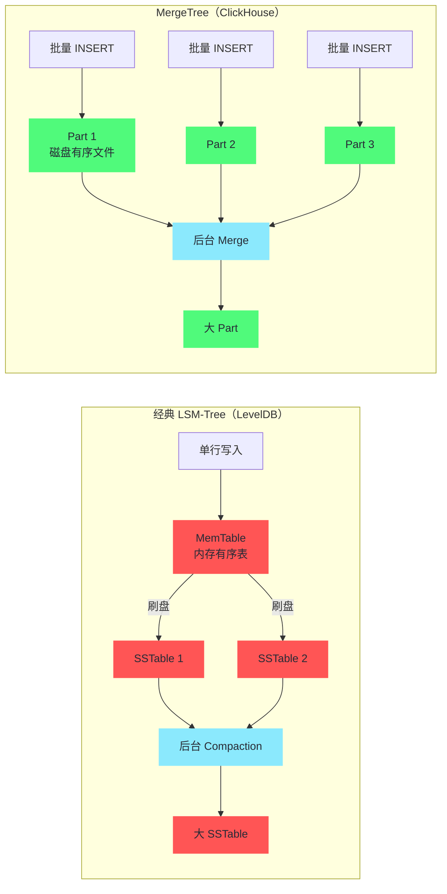
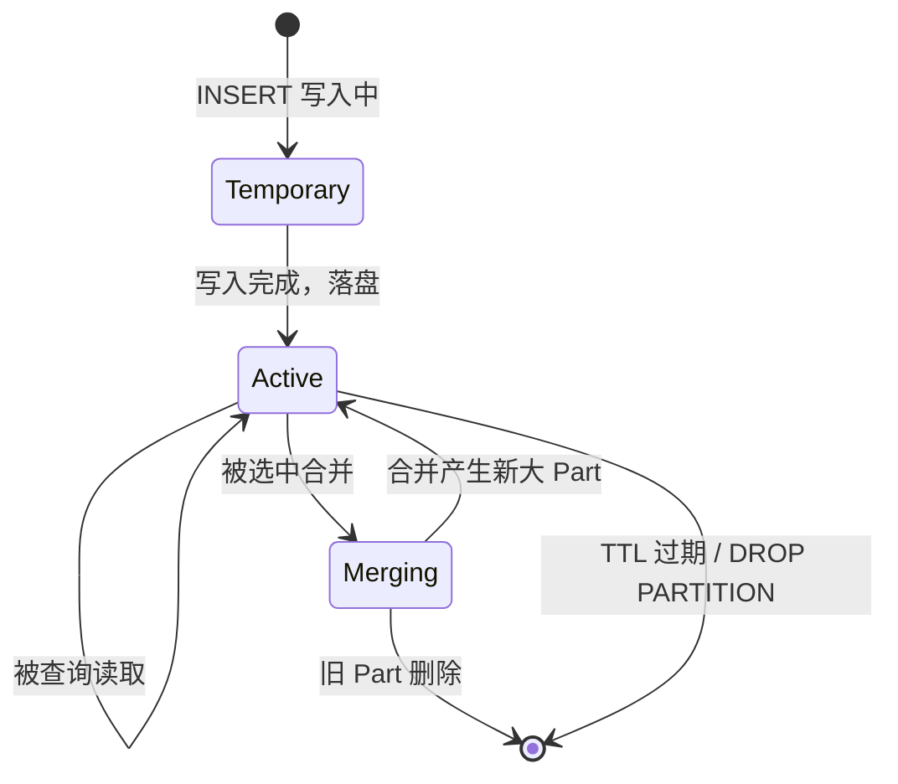
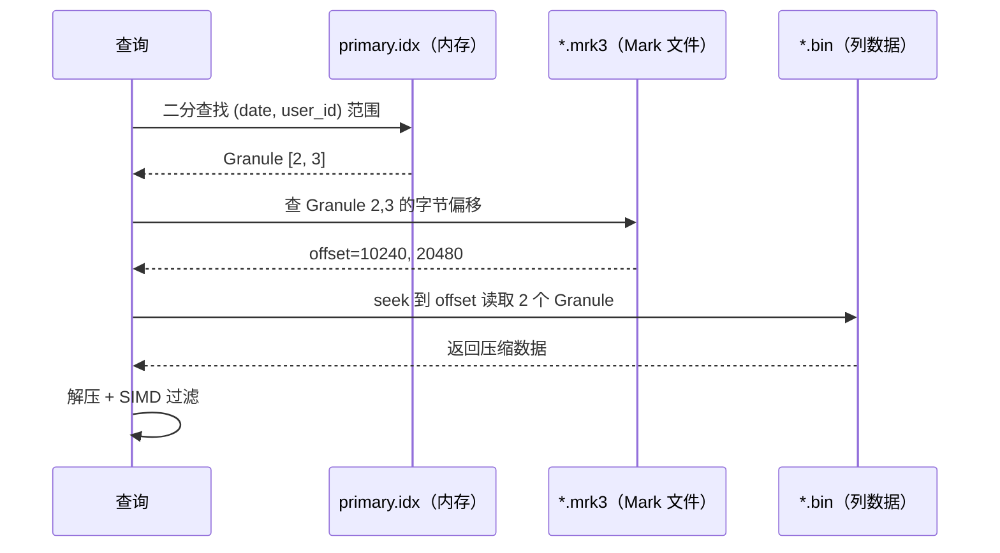

# 02 MergeTree 引擎家族——主键索引与数据排序

**摘要：**
MergeTree 是 ClickHouse 生产表中使用率最高的存储引擎家族，几乎所有面向查询的 ClickHouse 表都以它为基础。本文从 LSM-Tree 的写优化思想切入，剖析 MergeTree 如何用"写入时创建有序 Part + 后台异步合并"的方式兼顾写入吞吐与查询性能；然后深入稀疏主键索引的定位机制——为什么它选择"每 8192 行一个索引条目"而非 B+ 树的"每行一个条目"，Mark 文件如何把逻辑 Granule 映射到物理字节偏移，ORDER BY 与 PRIMARY KEY 的微妙区别；接着展开 ReplacingMergeTree、AggregatingMergeTree、SummingMergeTree、CollapsingMergeTree 四种变体引擎各自解决什么问题、各自的局限在哪里；最后讨论分区（Partition）作为粗粒度数据管理单元的设计原则与常见误区。

---

## 第 1 章 MergeTree 的设计起点——LSM-Tree 的 OLAP 变体

### 1.1 写入吞吐与查询性能的两难

理解 MergeTree 的设计，首先要理解它要解决的核心矛盾：**如何在保证高写入吞吐的同时，实现高效的范围查询**。这个矛盾在数据库领域由来已久——传统 B+ 树选择了"查询优先"，用维护全局有序的索引结构换取点查和范围查的效率，代价是每次插入都要在已有数据中"找位置"并维护树结构，写入吞吐受随机 IO 限制。对于 OLTP 场景（写入量不大、查询以点查为主），这个取舍是合理的。但对于 ClickHouse 面对的 OLAP 场景（每秒千万行级别的批量写入、查询以范围扫描为主），B+ 树的写入代价成了瓶颈。

2010 年前后，LSM-Tree（Log-Structured Merge-Tree）的写优化思想开始在工业界流行——Google 的 Bigtable、Facebook 的 RocksDB、[[Leveldb|LevelDB]] 都采用了这个思路。LSM-Tree 的核心改动是**把"写入时找位置插入"变成"写入时追加 + 后台合并"**——新数据先写入内存表（MemTable），积累到一定大小后刷盘成一个有序的不可变文件（SSTable），后台再异步把多个小 SSTable 合并成大 SSTable。写入变成了顺序追加，吞吐大幅提升；查询时需要扫描多个 SSTable，但通过布隆过滤器和索引可以快速跳过不相关的文件。

ClickHouse 的 MergeTree 借鉴了 LSM-Tree 的这个核心思路，但做了针对 OLAP 场景的重要改造——**没有 MemTable**。ClickHouse 的写入模式是批量 INSERT（每批几万到几十万行），不是单行 PUT。每次批量 INSERT 直接在磁盘上创建一个新的有序 **Part**（数据片段）——跳过了 LSM-Tree 的"内存表 → 刷盘"阶段，直接从批量写入落到有序文件。这个改造的合理性在于：ClickHouse 的用户本来就习惯批量写入（从 Kafka 消费一批、从文件导入一批），单行写入不是它的目标场景——省掉 MemTable 反而减少了内存管理复杂度和刷盘的随机性。

但省掉 MemTable 也带来一个副作用——**ClickHouse 没有"写入后立即可查"的语义保证**。LSM-Tree 的写入路径是"写 MemTable → MemTable 可查 → 刷盘成 SSTable"，数据写入 MemTable 后就能查到（虽然还没刷盘）。ClickHouse 的写入路径是"批量 INSERT → 生成 Part → Part 落盘后可查"——在 Part 完全落盘之前，查询看不到这批数据。这个延迟通常很短（秒级），但对"写入后立即查询验证"的场景需要注意——ClickHouse 的写入可见性是"Part 级"而非"行级"的。

### 1.3 MergeTree 与经典 LSM-Tree 的差异详解

上一节提到 MergeTree 借鉴了 LSM-Tree 但做了改造，这里把两者的差异系统对比一下——理解这些差异能帮你看清 ClickHouse 为什么在某些行为上与 LevelDB/RocksDB 不同。

| 维度 | 经典 LSM-Tree（LevelDB/RocksDB） | MergeTree（ClickHouse） |
| :--- | :--- | :--- |
| **写入入口** | 单行 PUT，写 MemTable | 批量 INSERT，直接生成 Part |
| **内存表** | 有 MemTable，写入即可查 | 无 MemTable，Part 落盘后才可查 |
| **文件组织** | 多层 SSTable（L0, L1, L2...） | 单层 Part，无层级概念 |
| **合并策略** | 分层合并（Leveled Compaction） | 选 Part 合并（类似 Tiered Compaction） |
| **重叠处理** | L0 允许重叠，L1+ 不允许 | Part 间允许重叠，Merge 后消除 |
| **查询合并** | 多版本并发控制（MVCC） | 查询时扫所有相关 Part |
| **典型数据量** | GB 到 TB 级 | TB 到 PB 级 |

这张表的关键差异是**文件组织**——LevelDB 有 L0/L1/L2 多层 SSTable，每层大小递增、合并时把上层的文件往下层合并；ClickHouse 的 Part 没有层级概念，所有 Part 平铺，Merge 时选若干个大小相近的 Part 合并成一个大 Part。这个差异的根源是 workload 不同——LevelDB 面向"点查 + 范围扫"，需要多层结构来控制读放大；ClickHouse 面向"批量扫描"，读放大不是主要矛盾，Part 平铺反而让 Merge 策略更灵活。

另一个值得注意的差异是**查询合并**——LevelDB 用 MVCC 让读写并发，查询在某个快照上扫所有层级的 SSTable；ClickHouse 查询时直接扫所有相关 Part，没有快照隔离的概念（一个查询看到的是"查询开始时所有已落盘的 Part"）。这个简化对 OLAP 场景是合理的——OLAP 查询通常跑几秒到几十秒，期间数据写入很少，不需要复杂的 MVCC 来保证一致性。



> [!info] 核心概念：Part 与 SSTable 的同构
> ClickHouse 的 Part 与 [[Elasticsearch]] 的 Segment、LevelDB 的 SSTable 是同类概念——都是"不可变的、内部有序的数据文件"，通过后台合并来优化查询性能和存储空间。这是 LSM-Tree 思想在不同系统中的实例化，区别只在于"有没有 MemTable"和"合并策略的细节"。

### 1.2 Part 的物理文件结构

一个 Part 对应磁盘上的一个目录，目录名编码了分区、块号、层级等元信息。典型结构如下：

```
20240305_1_100_3/          # {partition}_{min_block}_{max_block}_{level}
├── date.bin               # date 列的压缩数据
├── date.mrk3              # date 列的 Mark 文件
├── user_id.bin            # user_id 列的压缩数据
├── user_id.mrk3
├── amount.bin             # amount 列的压缩数据
├── amount.mrk3
├── primary.idx            # 稀疏主键索引
├── minmax_date.idx        # date 列的 min/max 索引
├── checksums.txt          # 所有文件的校验和
└── columns.txt            # 列定义（列名和类型）
```

每个文件各司其职：

- **`*.bin`**——列数据文件，存储某一列所有行的压缩值。数据按主键排序后写入，同一列的所有值连续存储。这是第 01 篇讲的"列存物理布局"在 Part 层面的具体落地。
- **`*.mrk3`**——Mark 文件，是稀疏索引的"导航数据"。每个 Mark 条目记录一个 Granule（8192 行）在 `*.bin` 文件中的起始字节偏移和解压偏移。如果说 `primary.idx` 是"Granule 编号到主键值"的映射，那么 `*.mrk3` 是"Granule 编号到物理位置"的映射——两者配合才能从"主键值范围"定位到"磁盘字节位置"。
- **`primary.idx`**——稀疏主键索引，每隔 8192 行存储一个主键值，文件极小，通常完全驻留内存。
- **`minmax_*.idx`**——分区键/排序键列的最小最大值索引，用于分区剪枝——当整个 Part 的 min/max 不符合查询条件时，可以直接跳过这个 Part。

这个文件结构的设计有一个贯穿始终的原则：**逻辑定位靠索引，物理定位靠 Mark，数据读取靠 bin**——三层各司其职，互不越界。`primary.idx` 只存"Granule 编号 → 主键值"，不存物理位置；`*.mrk3` 只存"Granule 编号 → 字节偏移"，不存主键值；`*.bin` 只存压缩数据，不存索引信息。**职责分离让每一层都可以独立优化**——索引可以全放内存（因为它很小），Mark 文件可以按需读取（因为它比索引大但比数据小），bin 文件可以按 Granule 粒度 seek（因为 Mark 给了精确偏移）。

这个职责分离还有一个工程上的好处——**三层文件可以独立缓存**。OS 的 page cache 会自动缓存最近访问的文件块——`primary.idx` 因为小且频繁访问，几乎 100% 在 cache 里；`*.mrk3` 因为比数据文件小且查询时必读，大部分也在 cache 里；`*.bin` 因为大，只有热部分的 Granule 在 cache 里。**三层文件的访问频率从高到低、大小从小到大——恰好匹配 page cache 的"热数据小且频繁"的缓存效率曲线**。这是 MergeTree 文件设计的一个隐含优化——不是刻意为 cache 设计的，但自然契合了操作系统的缓存行为。

### 1.3 "Part 间可能重叠"的查询影响

MergeTree 的 Part 之间可能有重叠的主键范围——譬如 Part 1 包含 `date=2024-01-01` 到 `2024-01-03` 的数据，Part 2 也包含 `date=2024-01-02` 的数据（因为两次 INSERT 写入了同一天的数据，Merge 还没发生）。这意味着查询时，同一个主键范围的数据可能分散在多个 Part 里。

对查询的影响是：**ClickHouse 查询时需要扫描所有相关 Part，不能假设"一个主键范围只在一个 Part 里"**。这与 B+ 树不同——B+ 树的全局有序保证了一个 key 只在一个位置，查询时二分查找就能定位。MergeTree 的查询要在每个 Part 的 `primary.idx` 里分别二分查找，找到每个 Part 中符合条件的 Granule 范围，然后合并结果。

这个"多 Part 扫描"的开销是 Merge 的主要动机——后台 Merge 把多个小 Part 合并成大 Part，减少 Part 数量，让查询扫描的 Part 更少、每个 Part 的数据更连续。**Merge 不是为了"整理数据"——它是为了"减少查询时的 Part 扫描开销"**。第 03 篇会详细展开 Merge 的触发策略和调度机制。

从查询性能的角度看，Part 数量是影响延迟的关键因素之一——查询要扫的 Part 越多，每个 Part 的索引查找、文件打开、Mark 读取等固定开销就累积得越多。一个分区里只有 1 个大 Part 时，查询只需打开 1 套文件；如果有 50 个小 Part，查询要打开 50 套文件——光是文件打开和索引加载的开销就可能占掉查询总延迟的相当比例。这就是为什么 Merge 的效率直接影响查询性能——**Merge 把"50 个小 Part 的 50 次固定开销"变成"1 个大 Part 的 1 次固定开销"**，这个开销的减少对延迟敏感的查询尤为关键。

### 1.4 Part 的生命周期

一个 Part 从创建到消亡，经历的状态转换值得梳理——这能帮你看清 Part 在磁盘上的"一生"：



**Temporary**——INSERT 写入中的 Part，文件还在落盘，查询看不到。如果写入失败，Temporary Part 会被清理。

**Active**——写入完成、可被查询的 Part。这是 Part 的主要状态，绝大多数时间在这个状态。

**Merging**——被 Merge 选中，正在与其它 Part 合并成大 Part。合并完成后，旧 Part 删除，新大 Part 进入 Active。

**删除**——TTL 过期、DROP PARTITION、或合并后被清理。

这个生命周期里有一个生产中常遇到的问题——**Temporary Part 堆积**。如果写入速度超过磁盘 IO 能力，Temporary Part 来不及落盘，新的 INSERT 又创建更多 Temporary Part——写入延迟越来越大，最终触发 "Too many parts" 错误。这个问题的根因是磁盘 IO 瓶颈，解法是降低写入频率（攒批）、升级磁盘（SSD 替换 HDD）、或增加分区让写入分散到多个目录。第 03 篇会详细展开这个问题的诊断和调优。

---

## 第 2 章 稀疏主键索引——用粒度换内存

### 2.1 为什么不用 B+ 树的稠密索引

第 01 篇已经提到 ClickHouse 用稀疏索引而非 B+ 树的稠密索引，这里要深入回答的是：**稀疏索引的"稀疏"到底意味着什么，它放弃了什么，换来了什么**。

传统 B+ 树是**稠密索引（Dense Index）**——每行数据都有一个索引条目，通过索引可以精确定位任意一行。这对 OLTP 的点查非常高效：`WHERE id = 12345` 在 B+ 树里走一次根到叶的查找（O(log N) 次比较），就能定位到 `id=12345` 那一行的物理位置。但稠密索引在海量数据的 OLAP 场景有两个问题：

**索引大小与行数成正比**。10 亿行的 B+ 树索引，即使每个条目只有 16 字节，索引本身也有 16GB——无法完全驻留内存。查询时需要在索引树里逐层下降，每下降一层可能要读一次磁盘（索引的中间节点不在内存时），10 亿行的 B+ 树大约 3-4 层，意味着 3-4 次磁盘 IO 才能定位到叶子节点。对 OLTP 的点查来说，这个开销可以接受（毕竟每次查询只定位一次）；但对 OLAP 的范围扫描来说，如果每次查询都要先在索引里走一遍，开销就不可忽视了。

**维护索引的代价高**。B+ 树的插入需要在叶子节点找位置、可能触发节点分裂、可能更新中间节点——每次插入都是 O(log N) 的随机 IO。对于 ClickHouse 每秒千万行的写入吞吐，B+ 树的维护开销是灾难性的。

**稀疏索引（Sparse Index）** 的思路完全不同——**不为每行建立索引，而是每隔固定行数（`index_granularity`，默认 8192）才存储一个索引条目**。ClickHouse 的 `primary.idx` 内容示意如下：

```
Granule 0  → 主键值 (2024-01-01, 1001)     ← 前 8192 行中最小的主键
Granule 1  → 主键值 (2024-01-01, 9998)
Granule 2  → 主键值 (2024-01-02, 502)
Granule 3  → 主键值 (2024-01-02, 8801)
Granule 4  → 主键值 (2024-01-03, 123)
...
```

稀疏索引的大小 = 总行数 / 8192 × 每条索引的大小。对于 10 亿行、16 字节主键的表：索引大小 ≈ `1,000,000,000 / 8192 × 16 ≈ 2MB`。整个索引完全放在内存中，查询时不需要磁盘 IO 就能定位 Granule 范围。

**稀疏索引放弃了什么**：精确定位单行的能力。稀疏索引只能定位到 Granule 粒度（8192 行），不能定位到具体某一行。`WHERE id = 12345` 在稀疏索引里只能找到 `id=12345` 所在的 Granule，然后要把这个 Granule 的 8192 行都读进来在内存里过滤。对 OLTP 的点查来说，这个"多读 8191 行"的代价是不可接受的；但对 OLAP 的范围扫描来说，反正要扫描大量行，定位到 Granule 粒度已经足够——**稀疏索引用"点查精度"换"索引全在内存"**，这个取舍对 OLAP 是正确的，对 OLTP 是错误的。

用一个数字来感受这个取舍的量级。假设一张 10 亿行的表，主键是 16 字节的 `(date, user_id)`：

- **B+ 树稠密索引**：10 亿个条目 × 16 字节 = 16GB 索引。无法全放内存，查询时需要 3-4 次磁盘 IO 在索引树里逐层下降。每次点查约 3-4 次磁盘 IO（索引）+ 1 次磁盘 IO（数据页）= 4-5 次 IO。
- **ClickHouse 稀疏索引**：10 亿 / 8192 ≈ 12 万个条目 × 16 字节 = 2MB 索引。全放内存，查询时零磁盘 IO 定位 Granule。每次范围查询的索引开销为零，只需读取目标 Granule 的数据。

**2MB vs 16GB——稀疏索引的内存占用是稠密索引的 1/8000**。这个差距让 ClickHouse 的索引可以"永远在内存里"，而 B+ 树的索引只能"热部分在内存里"。对 OLAP 的范围扫描来说，"索引永远在内存"比"能精确定位单行"更重要——反正要扫一批数据，定位到 8192 行的粒度已经足够开始扫描了。

### 2.2 稀疏索引的查询定位流程

用一个具体查询来走一遍稀疏索引的定位流程。对于 `WHERE date = '2024-01-02' AND user_id BETWEEN 500 AND 9000`：

**第一步：二分查找索引**。在 `primary.idx` 中二分查找，找到满足条件的 Granule 范围——下界是第一个 `(date, user_id) >= (2024-01-02, 500)` 的 Granule（Granule 2），上界是最后一个 `(date, user_id) <= (2024-01-02, 9000)` 的 Granule（Granule 3）。需要读取的 Granule 范围是 [2, 3]，共 2 个 Granule，即 16384 行。这一步完全在内存中进行（`primary.idx` 常驻内存），零磁盘 IO。

**第二步：通过 Mark 文件定位字节偏移**。查找 `date.mrk3` 和 `user_id.mrk3` 中 Granule 2 和 Granule 3 的字节偏移——Mark 文件给出"Granule 2 的 date 列数据在 `date.bin` 的第 X 字节开始，解压后的第 Y 字节开始"。直接 seek 到对应位置读取数据。这一步需要读 Mark 文件（通常也在 OS page cache 里，磁盘 IO 很少）。

**第三步：解压并过滤**。读取 2 个 Granule 的 `date` 和 `user_id` 列数据，在内存中用 SIMD 向量化过滤，找到满足条件的行，再读取这些行对应的其他列（`amount` 等）。



三步流程的分工清晰：索引负责"逻辑定位"（哪个 Granule），Mark 负责"物理定位"（哪个字节），bin 负责"数据读取"（解压过滤）。**三层各做一件事，串起来就是从"主键值范围"到"过滤后的行"的完整链路**。

这个三层架构可以用一个图书馆的比喻来理解：`primary.idx` 是图书馆的"楼层索引卡"——告诉你"2024 年 1 月的书在 3 楼 A 区"，精度到"区"不到"本"；`*.mrk3` 是"书架编号到物理位置的对照表"——告诉你"A 区的书架 2 在走廊左转第 3 个"，精度到"书架"不到"页"；`*.bin` 是书架上的书本身——你走到书架 2，翻找 2024 年 1 月 2 日的书，在书里找你需要的页。**三层各有精度边界，上一层的结果是下一层的输入**——楼层索引卡给你"区"，书架对照表用"区"给你"书架"，书架上的书用"书架"给你"页"。ClickHouse 的查询定位就是这个层层递进的过程。

### 2.3 Mark 文件为什么是"两列偏移"

Mark 文件（`*.mrk3`）的每个条目存的是两个偏移——`offset_in_compressed_file`（在压缩 bin 文件中的字节偏移）和 `offset_in_decompressed_block`（在解压块内的偏移）。为什么要两个偏移，而不是一个？

原因是 ClickHouse 的列数据文件不是整文件压缩，而是**按块压缩（block-wise compression）**——每 64KB-256KB 的未压缩数据压缩成一个 block，多个 block 顺序拼接成 bin 文件。这种"分块压缩"让随机读取更高效——要读某个 Granule，只需解压它所在的那个 block，不需要解压整个文件。

但分块压缩带来了一个定位问题：一个 Granule 的数据可能跨越两个压缩 block——Granule 的前半段在 block 5 的末尾，后半段在 block 6 的开头。此时 Mark 条目需要两个信息才能定位——`offset_in_compressed_file` 告诉你"从 bin 文件的第 X 字节开始读压缩数据"（定位到 block 5），`offset_in_decompressed_block` 告诉你"解压后从第 Y 字节开始才是这个 Granule 的数据"（在 block 5 的解压结果里跳过前面的数据）。**两个偏移分别对应"压缩空间"和"解压空间"——缺一不可**。

这个设计虽然让 Mark 文件稍大（每个条目两个 8 字节偏移），但让随机读取的效率大幅提升——不需要解压整个 bin 文件，只解压目标 block。对于 10 亿行的表，bin 文件可能几十 GB，但一个 Granule 只需要解压它所在的 64KB-256KB 的 block——**解压的粒度从"整个文件"降到"单个 block"，这是 ClickHouse 随机读取高效的关键之一**。

### 2.3 ORDER BY 与 PRIMARY KEY 的微妙区别

ClickHouse 建表时有两个相关但不同的概念，初学者常混淆——厘清它们的区别对表设计至关重要。

**`ORDER BY`（排序键）**——决定数据在 Part 内的物理排序顺序。所有写入的数据在 Part 内按 `ORDER BY` 键的顺序存储。这也是稀疏索引构建的依据——`primary.idx` 存储的就是每个 Granule 起始行的 `ORDER BY` 键值。

**`PRIMARY KEY`（主键索引键）**——稀疏索引使用的键。如果不显式指定，默认等于 `ORDER BY`。但可以将 `PRIMARY KEY` 设置为 `ORDER BY` 键的前缀（前几列），使主键索引更短、更小、更容易驻留内存。

```sql
-- 数据按 (date, user_id, event_type) 排序存储
-- 但索引只使用 (date, user_id) 前两列
CREATE TABLE events (
    date       Date,
    user_id    UInt64,
    event_type String,
    amount     Float64
) ENGINE = MergeTree()
ORDER BY (date, user_id, event_type)
PRIMARY KEY (date, user_id);  -- 索引前缀，比完整排序键更紧凑
```

这个设计的精妙之处在于：**物理排序用完整键（更细粒度的排序让 Granule 内的数据更聚集），索引用前缀键（更短的索引让内存占用更小）**。两者各取所需——排序键负责"数据物理布局的聚集度"，主键负责"索引的内存效率"。

什么时候应该把 `PRIMARY KEY` 设为 `ORDER BY` 的前缀？当排序键的列数较多、但查询通常只用前几列过滤时。譬如排序键是 `(date, user_id, event_type)`，但 90% 的查询只按 `date` 和 `user_id` 过滤——把 `PRIMARY KEY` 设为 `(date, user_id)` 让索引更紧凑，而 `event_type` 仍然在排序键里，让同一 `(date, user_id)` 的数据按 `event_type` 聚集（Granule 内过滤更高效）。

什么时候不应该分设？当查询经常用到排序键的全部列时——此时把 `PRIMARY KEY` 设为前缀反而让索引无法覆盖高频查询的过滤条件，剪枝效果变差。**分设的前提是"高频查询只用到前缀"——如果高频查询用到全部列，分设就是自找麻烦**。

> [!warning] 生产避坑：主键基数与查询模式要匹配
> 稀疏索引的剪枝效果依赖于查询条件与主键前缀的匹配程度。如果查询经常按 `user_id` 过滤，但主键是 `(date, user_id)`，当查询只有 `WHERE user_id = 12345`（没有 `date` 条件）时，稀疏索引无法剪枝——`user_id` 在 `date` 的不同值范围内都可能出现，每个 Granule 都可能包含 `user_id=12345` 的数据，索引帮不上忙。
>
> 这种情况需要引入**跳数索引（Data Skipping Index）**（第 06 篇详细展开），或者为不同查询模式创建不同的物化视图——按 `user_id` 排序的物化视图覆盖 `user_id` 查询，按 `date` 排序的主表覆盖 `date` 查询。

### 2.4 稀疏索引的"前缀匹配"规则

稀疏索引的剪枝遵循**最左前缀匹配**规则——与 MySQL 的联合索引类似。主键 `(date, user_id, event_type)` 的稀疏索引，能高效剪枝的查询条件是：

| 查询条件 | 能否剪枝 | 原因 |
| :--- | :--- | :--- |
| `WHERE date = '2024-01-02'` | 能 | 命中主键第一列 |
| `WHERE date = '2024-01-02' AND user_id = 500` | 能 | 命中主键前两列 |
| `WHERE date = '2024-01-02' AND user_id > 500` | 能 | 命中主键前两列，范围扫描 |
| `WHERE user_id = 500` | **不能** | 缺少主键第一列 `date` |
| `WHERE event_type = 'click'` | **不能** | 缺少主键前两列 |
| `WHERE date = '2024-01-02' AND event_type = 'click'` | **部分能** | `date` 能剪枝，`event_type` 跳过了 `user_id`，只能在 `date` 范围内全扫 |

这张表的关键洞察是：**主键列的顺序比主键列的选择更重要**——一个 `(date, user_id)` 的主键对"按 date 查"的查询高效，对"按 user_id 查"的查询无效；反过来 `(user_id, date)` 的主键对"按 user_id 查"高效，对"按 date 查"无效。**主键设计本质上是"为哪些查询模式优化"的决策**——你选择了什么主键顺序，就决定了哪些查询能走索引、哪些查询只能全扫。第 06 篇会详细展开主键设计的实践方法论。

---

## 第 3 章 MergeTree 变体家族——在 append-only 约束下模拟"更新"

### 3.1 为什么需要变体引擎

MergeTree 本身是**追加写入（append-only）**的——新数据总是写入新的 Part，不修改已有数据。这个设计让写入吞吐极高（没有"找位置更新"的随机 IO），但对很多业务需求来说不够用：

- **数据去重**——同一个事件可能因为网络重试被写入多次，需要保留最新一条
- **数据修正**——历史数据需要修改（譬如账单金额更正），但直接 UPDATE 代价高
- **预聚合**——实时查询太多导致 CPU 压力大，希望写入时就做部分聚合

这些需求在传统数据库里用 UPDATE/DELETE 或物化视图解决，但 ClickHouse 的 append-only 约束让 UPDATE/DELETE 代价极高（异步 Mutation 重写整个 Part，第 03 篇展开）。变体引擎的思路是**在 Merge 阶段添加数据语义处理**——不改变 append-only 的写入模型，而是在后台合并 Part 时，按业务规则对相同主键的行做去重、聚合或抵消。**变体引擎不是"让 ClickHouse 支持更新"——它是"在 append-only 约束下，用 Merge 的时机模拟更新的效果"**。

### 3.2 ReplacingMergeTree——按主键去重

**ReplacingMergeTree** 在 Merge 时，对于具有相同主键（`ORDER BY` 键）的行，只保留版本最高（或写入最晚）的一行，删除旧版本。

```sql
CREATE TABLE user_profiles (
    user_id    UInt64,
    name       String,
    email      String,
    updated_at DateTime
) ENGINE = ReplacingMergeTree(updated_at)  -- updated_at 作为版本列
ORDER BY user_id;

-- 写入初始数据
INSERT INTO user_profiles VALUES (1, 'Alice', 'alice@old.com', now());

-- 更新 Email（写入新 Part，不修改旧行）
INSERT INTO user_profiles VALUES (1, 'Alice', 'alice@new.com', now() + 1);

-- 查询时可能返回两行（Merge 尚未发生）
SELECT * FROM user_profiles WHERE user_id = 1;
-- 返回：
-- (1, 'Alice', 'alice@old.com', ...)
-- (1, 'Alice', 'alice@new.com', ...)

-- 强制去重（生产中不推荐，有性能问题）
SELECT * FROM user_profiles FINAL WHERE user_id = 1;
-- 返回（去重后）：
-- (1, 'Alice', 'alice@new.com', ...)
```

ReplacingMergeTree 有一个关键限制必须记住：**去重不是即时的，而是发生在 Merge 期间**。在 Merge 完成之前，查询可能返回重复行——因为还没合并的 Part 里各自有一份 `user_id=1` 的数据。这个"最终一致性"的语义对很多业务来说不够用——如果查询必须精确去重，要么用 `FINAL` 关键字，要么在 SQL 里自己做去重。

`SELECT ... FINAL` 可以在查询时强制去重，但 FINAL 会禁用并行查询，性能大幅下降（通常比普通查询慢 5-10 倍）——它本质上是在查询时做 Merge 的工作。生产中不推荐用 FINAL，推荐的做法是在 SQL 里用 `argMax` 函数做去重：

```sql
-- 使用 argMax 获取每个 user_id 的最新 email（无需 FINAL，利用索引高效执行）
SELECT 
    user_id,
    argMax(email, updated_at) AS latest_email
FROM user_profiles
GROUP BY user_id;
```

`argMax(email, updated_at)` 的语义是"返回 `updated_at` 最大的那行对应的 `email`"——在 GROUP BY 的框架下，它不需要 FINAL 的全表排序，只需要在聚合时跟踪每个 `user_id` 的最大 `updated_at` 和对应的 `email`，性能远优于 FINAL。**`argMax` 是 ReplacingMergeTree 场景下的标准查询模式**——理解了它，就不需要依赖 FINAL 的强制去重。

`argMax` 比 `FINAL` 快的根本原因在于**工作量的差异**。`FINAL` 要在查询时模拟 Merge 的全过程——对所有 Part 按主键排序、合并相同主键的行、按版本列去重——这相当于在查询的几秒内做完后台 Merge 几分钟做的事。`argMax` 只需要在聚合时维护"每个主键的最大版本和对应值"——这是一个 O(N) 的单遍扫描，不需要排序，不需要跨 Part 合并。**`FINAL` 做的是"全局去重"，`argMax` 做的是"聚合时取最新"——后者的计算量小一个数量级**。

生产中还有第三种做法——**确保 Merge 及时完成，让查询不需要做任何去重**。这通过调优 Merge 策略（增加后台 Merge 线程、降低触发阈值）来实现。但 Merge 的速度有物理上限（受磁盘 IO 和 CPU 限制），写入速度持续高于 Merge 速度时，"靠 Merge 及时完成"就不可靠了。**最稳妥的做法是 `argMax` 兜底 + Merge 调优双保险**——查询用 `argMax` 保证正确性，Merge 调优保证大多数情况下数据已经去重（`argMax` 的工作量更小）。

### 3.3 AggregatingMergeTree——写入时预聚合

**AggregatingMergeTree** 在 Merge 时对相同主键的行进行聚合，将多行合并成一行（存储聚合状态），而不是简单保留一行。这个引擎通常与**物化视图**配合使用，实现写入时的增量预聚合：

```sql
-- 原始事件表
CREATE TABLE events_raw (
    date     Date,
    region   String,
    amount   Float64
) ENGINE = MergeTree() ORDER BY (date, region);

-- 按 (date, region) 预聚合的物化视图
CREATE MATERIALIZED VIEW events_daily
ENGINE = AggregatingMergeTree()
ORDER BY (date, region)
AS SELECT
    date,
    region,
    sumState(amount) AS amount_sum,      -- sumState 存储聚合中间状态
    countState()     AS event_count
FROM events_raw
GROUP BY date, region;

-- 查询预聚合结果（用 sumMerge 合并聚合状态）
SELECT
    date,
    region,
    sumMerge(amount_sum) AS total_amount,
    countMerge(event_count) AS total_events
FROM events_daily
GROUP BY date, region;
```

这段代码里有一个 ClickHouse 独有的概念需要解释——**`sumState()` 与 `sumMerge()` 的分离**。`sumState(amount)` 不直接存储最终的 sum 值，而是存储聚合的**中间状态**——对于 `sum` 来说，中间状态就是"当前的累加和"，看起来和最终结果一样；但对于 `count(DISTINCT)`、`quantile`、`HLL` 等复杂聚合函数，中间状态比最终结果复杂得多（HLL 的中间状态是一个寄存器数组，不是单个数字）。`sumMerge()` 的作用是把多个 Part 里的中间状态合并成最终结果。

为什么要分 `State` 和 `Merge` 两步？因为**预聚合需要在多个 Part 之间可合并**——Part 1 的 `amount_sum` 是 1000，Part 2 的 `amount_sum` 是 2000，合并时 `sumMerge` 把它们加起来得到 3000。如果直接存最终结果（1000 和 2000），合并时不知道该怎么组合（加起来？取最大？取平均？）——存中间状态 + 用 Merge 函数组合，让聚合语义显式化。**`State` 存的是"可合并的中间态"，`Merge` 定义的是"怎么合并"**——这个分离让预聚合可以跨 Part、跨节点合并。

**AggregatingMergeTree 的价值**可以用一个数字来感受：对于每秒百万行写入的实时系统，如果每次查询都做全量聚合，CPU 压力极大。通过 AggregatingMergeTree 物化视图，写入时就完成部分聚合（每秒百万行聚合成每秒几千行的预聚合结果），查询时只需合并预聚合结果——查询延迟从秒级降到毫秒级，CPU 消耗降低两个数量级。

但 AggregatingMergeTree 也有一个容易踩的坑——**物化视图的触发时机是"INSERT 时"，不是"实时"**。每次向原始表 INSERT 数据，物化视图自动把这批数据聚合并写入预聚合表。但如果同一批 INSERT 里有多个相同 `(date, region)` 的行，物化视图会在这一批内先做一次 GROUP BY 聚合，再写入预聚合表。这意味着预聚合表里的数据是"每批 INSERT 的聚合结果"——跨批的聚合仍然要靠 Merge 或查询时的 `sumMerge` 来完成。**AggregatingMergeTree 不是"全局预聚合"——它是"每批预聚合 + 跨批靠 Merge/查询合并"**。理解了这个粒度，才能理解为什么查询预聚合表仍然需要 `GROUP BY + sumMerge`——因为预聚合表里可能有多个未合并的 Part，每个 Part 是某批 INSERT 的聚合结果。

### 3.4 SummingMergeTree——数值列累加

**SummingMergeTree** 是 AggregatingMergeTree 的简化版——对相同主键的行，直接对指定的数值列求和合并，不需要 `sumState`/`sumMerge` 的复杂状态机制。

```sql
CREATE TABLE daily_revenue (
    date     Date,
    region   String,
    revenue  Float64,
    orders   UInt64
) ENGINE = SummingMergeTree((revenue, orders))  -- 对这两列求和
ORDER BY (date, region);
```

SummingMergeTree 的语义更简单——Merge 时相同主键的行的 `revenue` 和 `orders` 直接相加。但简单也意味着局限——它只支持求和，不支持 `count(DISTINCT)`、`quantile` 等复杂聚合；而且查询时仍然需要 `GROUP BY + SUM` 来处理"还没合并的 Part"（因为 SummingMergeTree 的合并也是异步的，查询时可能遇到未合并的 Part）。

**什么时候用 SummingMergeTree，什么时候用 AggregatingMergeTree？** 经验法则是：如果只需要简单求和（收入、订单数、点击数），SummingMergeTree 更简洁；如果需要复杂聚合（去重计数、分位数、HLL），必须用 AggregatingMergeTree。**SummingMergeTree 是 AggregatingMergeTree 的"快捷方式"——能用快捷方式的场景用它更省心，用不了的场景必须回到完整版**。

还有一个选择维度值得点出——**SummingMergeTree 对非数值列的处理**。当 SummingMergeTree 合并相同主键的行时，数值列会求和，但非数值列（字符串、枚举）会保留"任意一行的值"（实际是 Merge 时遇到的第一行的值）。这意味着非数值列的值在合并后是不可预测的——如果两行的 `region` 不同但 `user_id` 相同，合并后 `region` 保留哪个取决于 Merge 的顺序。**SummingMergeTree 假设"相同主键的行的非数值列也相同"**——如果这个假设不成立（譬如主键是 `user_id` 但 `region` 可能变化），SummingMergeTree 会丢失 `region` 的信息。这种场景应该把 `region` 加进主键，或者用 AggregatingMergeTree + `anyState` 来显式处理非数值列。

### 3.5 CollapsingMergeTree——用 sign 标记模拟删除

**CollapsingMergeTree** 通过"标记消除"实现逻辑删除。每行有一个 `sign` 列（值为 +1 或 -1），Merge 时相同主键的 sign 互相抵消——`+1` 和 `-1` 抵消后两行都删除，只留下净效果。

```sql
CREATE TABLE orders (
    order_id   UInt64,
    amount     Float64,
    status     String,
    sign       Int8  -- +1 表示插入，-1 表示删除
) ENGINE = CollapsingMergeTree(sign)
ORDER BY order_id;

-- 插入订单
INSERT INTO orders VALUES (1001, 500.0, 'paid', 1);

-- 修改订单金额（先写 -1 消除旧行，再写 +1 写入新行）
INSERT INTO orders VALUES (1001, 500.0, 'paid', -1);  -- 取消旧行
INSERT INTO orders VALUES (1001, 600.0, 'paid', 1);   -- 写入新行
```

Merge 时，`sign=+1` 和 `sign=-1` 的相同 `order_id` 行互相抵消，只保留净效果——上面的例子中，旧行的 `+1` 被新写入的 `-1` 抵消，只剩下 `600.0` 那行。

CollapsingMergeTree 的应用场景是**实现类似于 [[Doris]] Unique Key 模型的数据更新语义**——用"写入增量变化"的方式模拟更新，不修改已有数据。但它的局限比 ReplacingMergeTree 更多：

**要求成对写入**——每次"更新"都要先写一条 `-1` 的旧行、再写一条 `+1` 的新行。如果 `-1` 丢失（譬如写入失败），数据就会不一致——`+1` 没有被抵消，旧行和新行都保留。这个"成对写入"的约束让上游 ETL 必须很小心。

**查询时仍需处理未合并状态**——在 Merge 之前，`+1` 和 `-1` 的行都在，查询时如果直接 `SUM(amount)` 会把 `-1` 的金额也加进去（变成负数），必须 `WHERE sign = 1` 或 `GROUP BY` + `sumIf` 来过滤。

**不适合并发写入同一主键**——如果多个线程同时更新同一个 `order_id`，`+1` 和 `-1` 的顺序可能错乱，抵消结果不可预测。ClickHouse 官方文档明确指出 CollapsingMergeTree 不适合并发写入同一主键的场景。

这些局限让 CollapsingMergeTree 在新版本中逐渐被 **VersionedCollapsingMergeTree** 取代——后者用额外的 `version` 列保证即使 `+1` 和 `-1` 乱序到达也能正确抵消。如果你的场景需要"用 sign 模拟更新"，优先考虑 VersionedCollapsingMergeTree。

### 3.6 变体引擎的选型对照

四种变体引擎的适用场景和局限用一张表收拢：

| 引擎 | Merge 时做什么 | 适用场景 | 关键局限 |
| :--- | :--- | :--- | :--- |
| **ReplacingMergeTree** | 保留版本最高的行 | 数据去重（用户画像、状态表） | 去重异步，查询需 `argMax` 或 `FINAL` |
| **AggregatingMergeTree** | 聚合相同主键的行 | 预聚合（物化视图） | 需要 `State`/`Merge` 函数，学习成本高 |
| **SummingMergeTree** | 数值列求和 | 简单累加（收入、计数） | 只支持求和，查询仍需 `GROUP BY` |
| **CollapsingMergeTree** | sign 标记抵消 | 逻辑删除/更新模拟 | 要求成对写入，不适合并发 |

这张表的落点是：**变体引擎不是"选一个最好的"——它们各自解决不同问题，选错引擎比不用变体更糟**。譬如用 SummingMergeTree 存用户画像（需要去重而非求和），会把多个版本的同一用户加起来——`amount` 变成两倍，数据直接错。**变体引擎的选择必须匹配业务语义——去重用 Replacing，聚合用 Aggregating，累加用 Summing，删除模拟用 Collapsing**，没有"万能变体"。

### 3.7 变体引擎的 Merge 时机

所有变体引擎的去重/聚合/抵消都发生在 Merge 期间——这意味着变体引擎的"效果生效时间"取决于 Merge 何时发生。理解 Merge 的触发时机，才能理解变体引擎的"最终一致性"到底有多"最终"。

Merge 的触发由后台线程 `ReplicatedMergeTreeCleanupThread` / `MergeSelector` 控制——它定期扫描各分区的 Part 列表，按"合并收益"选择要合并的 Part。合并收益的评估因素包括：Part 数量（越多越该合并）、Part 大小（小 Part 优先合并）、Part 年龄（老 Part 优先合并）。默认策略下，一个分区的 Part 数量超过 10 个时，Merge 就会被触发；Part 太大（超过 `max_bytes_to_merge_at_max_space_in_pool`，默认 150GB）时不再合并。

这意味着变体引擎的去重/聚合/抵消**最快在 Part 合并时生效（几秒到几分钟），最慢可能要等到 Part 数量触发 Merge 阈值（几小时）**。在 Merge 发生之前，查询看到的是"未去重/未聚合/未抵消"的原始数据。这就是为什么生产中推荐用 `argMax`/`sumMerge` 等函数在查询时做"兜底"——不依赖 Merge 的时机，保证查询结果的正确性。

**变体引擎的"最终一致"不是"很快一致"——它是"Merge 后一致"**。如果你的业务对"生效时间"敏感（譬如"写入后 1 秒内必须看到去重结果"），变体引擎做不到——要么用 `FINAL`（慢），要么在查询时用函数兜底（推荐），要么换一个支持即时去重的引擎。

---

## 第 4 章 Partition——数据管理的粗粒度单元

### 4.1 分区的作用

MergeTree 支持按某个键进行**分区（Partition）**。分区是粗粒度的数据组织单元——同一个 Part 只属于一个分区，不同分区的 Part 不会被合并在一起。

```sql
CREATE TABLE events (
    date     Date,
    user_id  UInt64,
    amount   Float64
) ENGINE = MergeTree()
PARTITION BY toYYYYMM(date)  -- 按月分区
ORDER BY (date, user_id);
```

分区带来三个好处，每一个都对应一个实际运维需求：

**分区剪枝**——查询中如果有分区键的过滤条件（如 `WHERE date BETWEEN '2024-01-01' AND '2024-01-31'`），ClickHouse 直接跳过不相关的分区目录，不扫描任何文件。对于按时间分区的表，时间范围查询效率极高——查一个月的数据只扫一个月的分区，其余 11 个月的分区完全不碰。分区剪枝的粒度比稀疏索引更粗——稀疏索引在 Part 内部剪枝 Granule，分区剪枝在 Part 之外跳过整个分区。**分区剪枝是"第一道过滤"，稀疏索引是"第二道过滤"**——查询先靠分区跳过不相关的数据块，再靠稀疏索引在相关数据块里定位 Granule。

**分区 DROP**——数据过期时，直接 `ALTER TABLE DROP PARTITION '202312'` 瞬间删除整个分区目录，比逐行 DELETE 快数个量级。本质上是删除目录而非删除行——1 亿行的分区 DROP 是毫秒级操作，而 `DELETE WHERE date < '2024-01-01'` 是异步 Mutation，要重写所有受影响的 Part，可能跑几分钟到几小时。**TTL（Time To Live）机制就是基于分区 DROP 实现的**——设置 `TTL date + INTERVAL 90 DAY`，ClickHouse 后台自动 DROP 过期分区，比 Mutation 式的逐行删除高效得多。

**分区 Attach/Detach**——可以将一个表的分区"移动"到另一个表（秒级完成，不拷贝数据，只改文件系统的硬链接），用于数据归档或跨表迁移。譬如把冷数据分区 Detach 后 Attach 到归档表——归档表查不到热数据，热表查不到冷数据，但物理上数据还在同一个磁盘上，只是逻辑归属变了。

### 4.2 分区设计的原则与误区

分区粒度的选择直接影响性能，选错了比不分区更糟。

**分区太粗**（如按年分区）——单个分区内数据量过大，分区剪枝效果差。查一个月的数据，如果按年分区，要扫整个年的分区（12 倍数据量）；如果按月分区，只扫一个月的分区。分区太粗等于"分区剪枝退化成全表扫"。

**分区太细**（如按天分区，但写入频繁）——每个分区内的 Part 数量多但每个 Part 很小，导致 "Too many parts" 问题。ClickHouse 有 Part 数量上限保护（默认 300 个，可调），超限后写入直接报错——这是 ClickHouse 最常见的生产事故之一。按天分区 + 每天写入 100 批 = 每天产生 100 个 Part，如果 Merge 跟不上，Part 累积到 300 就报错。

分区粒度的经验建议：

| 数据特征 | 推荐分区粒度 | 理由 |
| :--- | :--- | :--- |
| 日志/事件类（每天数亿行） | 按天 `PARTITION BY toDate(date)` | 每天一个分区，分区 DROP 过期数据高效 |
| 用户行为/订单类（每月十亿行） | 按月 `PARTITION BY toYYYYMM(date)` | 按天分区 Part 太多，按月平衡 |
| 固定维表（几百万行，很少增长） | 不分区 | 数据量小，分区反而增加管理开销 |
| 超大表（每天百亿行） | 按天或按小时 | 按月单分区太大，Merge 压力高 |

这张表的隐含逻辑是：**分区粒度应该让"单个分区的数据量"在 1-10GB 量级**——太小则 Part 碎片化，太大则分区剪枝效果差、Merge 压力高。1-10GB 是一个经验性的"甜区"——足够大让 Part 合并有效率，足够小让分区剪枝和 DROP 都很快。

### 4.3 TTL——基于分区的自动过期

分区 DROP 的毫秒级效率让 TTL（Time To Live）机制成为可能——TTL 本质上是"ClickHouse 后台自动 DROP 过期分区"。设置方式：

```sql
CREATE TABLE events (
    date     Date,
    user_id  UInt64,
    amount   Float64
) ENGINE = MergeTree()
PARTITION BY toYYYYMM(date)
ORDER BY (date, user_id)
TTL date + INTERVAL 90 DAY;  -- 90 天后自动过期
```

TTL 的执行机制是：后台 TTL 线程定期检查各分区的最大 `date`，如果某个分区的所有数据都超过了 `date + 90 DAY`，就 DROP 这个分区。因为 DROP 分区是删目录，TTL 的清理效率极高——不需要逐行删除、不需要 Mutation 重写，直接删目录。

TTL 与 Mutation 式的 `DELETE WHERE date < '2024-01-01'` 有本质区别——Mutation 要重写所有受影响的 Part（把没过期的行挑出来写到新 Part，删掉旧 Part），代价高；TTL 直接删整个分区，代价低。**但 TTL 的前提是"按分区粒度过期"——如果过期边界不在分区边界上（譬如 TTL 90 天，但分区按月，某个月的部分数据过期、部分没过期），TTL 仍要等整个分区的所有数据都过期才能 DROP**。这就是为什么 TTL 通常配合按天或按月分区——让过期边界与分区边界对齐，TTL 才能高效执行。

TTL 还可以指定 `DELETE` 或 `RECOMPRESS` 操作——除了删数据，还可以把冷数据从 LZ4 重压缩为 ZSTD（更高压缩率），节省冷存储空间：

```sql
TTL date + INTERVAL 30 DAY RECOMPRESS CODEC(ZSTD(9)),
    date + INTERVAL 90 DAY DELETE;
```

这段配置的语义是：数据写入 30 天后重压缩为 ZSTD（冷数据省空间），90 天后删除。**TTL 把"冷热分层"的存储策略直接内置到表定义里**——不需要外部脚本，不需要人工干预，ClickHouse 后台自动执行。

### 4.3 分区与排序键的协同

分区和排序键是两个独立但协同的设计决策——分区决定"数据按什么粗粒度分块"，排序键决定"分块内的数据按什么顺序排"。一个好的表设计需要两者配合：

**协同好的例子**：分区 `PARTITION BY toYYYYMM(date)` + 排序键 `ORDER BY (date, user_id)`——查询 `WHERE date = '2024-01-15'` 先靠分区剪枝跳过其他月份，再靠排序键在 1 月分区内定位 `2024-01-15` 的 Granule。两层过滤层层递进，效率极高。

**协同差的例子**：分区 `PARTITION BY toYYYYMM(date)` + 排序键 `ORDER BY (user_id)`——查询 `WHERE date = '2024-01-15'` 靠分区剪枝跳到 1 月分区，但 1 月分区内数据按 `user_id` 排序，`date` 不是排序键前缀，稀疏索引帮不上忙——只能在 1 月分区内全扫。**分区帮你跳到了对的分区，但排序键没帮你在分区内定位**——两层过滤的第一层有效，第二层失效。

这个协同的落点是：**分区键和排序键的第一列通常应该一致**（譬如都是 `date`）——让分区剪枝和稀疏索引剪枝能接力。如果分区键和排序键完全无关（譬如按 `region` 分区、按 `user_id` 排序），两层过滤就各管各的，效率打折。

### 4.5 分区设计的常见误区

分区设计有几个反复出现的误区，每一个都对应一类生产事故：

**误区一：分区粒度与写入频率不匹配**。最典型的是"按天分区 + 每秒一批写入"——每天 86400 秒，每秒一批，一天产生 86400 个 Part。即使每个分区（每天）的 Part 数量在 ClickHouse 的 Merge 努力下会减少，但写入高峰期 Part 累积速度可能超过 Merge 速度，触发 "Too many parts" 错误。正确做法是降低写入频率（譬如攒 30 秒一批）或加大分区粒度（按月分区）。**分区粒度、写入频率、Merge 速度三者必须匹配**——这是 ClickHouse 表设计的动态平衡。

**误区二：用高基数列做分区键**。譬如 `PARTITION BY user_id`——每个用户一个分区，百万用户就是百万个分区。ClickHouse 的分区元数据是常驻内存的，百万分区的元数据占用几 GB 内存，且每次查询要遍历所有分区判断剪枝——分区反而成了负担。**分区键应该是低基数列**（时间、地区、业务线），不应该用高基数列（user_id、order_id）。经验值是分区总数控制在几百到几千以内——超过这个量级，分区元数据的管理开销就开始显著。

**误区三：分区键与查询条件无关**。譬如业务查询都是 `WHERE user_id = 123`，但分区按 `date` 分——分区剪枝帮不上忙，每次查询都要扫所有分区的 `user_id` 索引。这种场景应该考虑物化视图——按 `user_id` 排序的物化视图覆盖 `user_id` 查询，主表按 `date` 排序覆盖 `date` 查询。**分区键的选择应该与高频查询的过滤条件对齐**——如果高频查询的过滤条件与分区键无关，分区就退化成了"只是把数据分成几堆"，剪枝价值为零。

**误区四：不设分区**。对于持续增长的时序表，不设分区意味着数据全在一个分区里——TTL 无法高效执行（没有分区可 DROP，只能用 Mutation 逐行删）、分区剪枝无效（每次查询全扫）、DROP PARTITION 归档不可用。**时序表必须设分区**——这是 ClickHouse 表设计的硬性建议。

### 4.6 分区与副本的协同

在 ReplicatedMergeTree（带副本的 MergeTree）场景下，分区还有一个与副本相关的协同效应——**分区是副本同步的最小单元**。ClickHouse 的副本机制通过 [[Zookeeper]] / Keeper 协调，每个分区的 Part 变化（新增、合并、删除）都会记录到 ZooKeeper 的副本队列里，其他副本从队列拉取变化并在本地执行。

这个"分区为同步单元"的设计有两个影响。第一，**跨分区的操作是独立的**——分区 A 的 Part 合并不会阻塞分区 B 的查询，不同分区的 Merge 可以并行执行。第二，**单个分区的 Part 变化是串行同步的**——如果一个分区频繁写入产生大量 Part 变化，ZooKeeper 的同步队列会堆积，副本延迟增大。这也是为什么"分区太细 + 写入频繁"的问题在副本场景下更严重——不仅本地 Part 碎片化，ZooKeeper 同步也跟不上。

第 05 篇会详细展开 ReplicatedMergeTree 的副本机制和 ZooKeeper 协调原理，这里只需记住：**分区设计不仅影响本地查询和 Merge，还影响副本同步的效率**——分区太细在副本场景下的代价更高。

---

## 第 5 章 MergeTree 的边界与下一篇导读

### 5.1 MergeTree 不擅长什么

讲了这么多 MergeTree 的设计优势，这一节要反过来讲它的边界——这些边界决定了什么场景不该用 MergeTree，或者用了需要额外工程手段。

**不擅长高频单行更新**。MergeTree 的写入是"批量 INSERT 生成新 Part"——单行 INSERT 也会生成一个 Part，代价与批量 INSERT 差不多（都要创建目录、写索引、写列文件）。如果每秒写 1000 个单行 INSERT，每秒生成 1000 个 Part，Merge 根本跟不上——很快触发 "Too many parts" 错误。**MergeTree 的写入模型要求"批量"——单行写不是它的使用方式**。如果业务必须高频单行写，需要在 ClickHouse 前面加一个缓冲层（譬如 Kafka + 批量消费，或 Buffer 表引擎）。

**不擅长点查**。稀疏索引的粒度是 8192 行——`WHERE id = 12345` 要读整个 Granule（8192 行）进来过滤。对偶尔的点查可以接受，对高并发的点查（每秒数千次）就是灾难——每次点查都读 8192 行，IO 和 CPU 都浪费在"不需要的 8191 行"上。**点查应该用 MySQL/Elasticsearch，不应该用 ClickHouse**——这是第 01 篇选型框架的具体落地，也是 ClickHouse 与 OLTP 数据库最清晰的分界线。

**不擅长强一致性的去重/更新**。ReplacingMergeTree 的去重是异步的（Merge 时才发生），CollapsingMergeTree 的抵消也是异步的——查询时可能看到"还没去重/抵消"的中间状态。如果业务要求"写入后立即可见去重结果"，MergeTree 系列都做不到——要么用 `FINAL`（性能差），要么在 SQL 里自己做（`argMax`/`sumIf`），要么换一个支持强一致更新的引擎（譬如 [[Doris]] Unique 模型）。**ClickHouse 的数据一致性模型是"最终一致"——这是 append-only + 异步 Merge 的必然结果，不是 bug**。理解了这个一致性模型，才能理解为什么 ClickHouse 不适合做"状态表"（订单状态、库存状态）——状态表要求"写入后立即可见最新状态"，ClickHouse 做不到。

**不擅长小 Part 的频繁写入**。每次 INSERT 生成一个 Part，Part 太多会触发 "Too many parts" 错误。如果业务必须高频写入（譬如每秒 100 批），需要在 ClickHouse 前面加缓冲——Kafka 消费攒批、Buffer 表引擎、或异步写入中间件。**ClickHouse 的写入模型要求"少批大量"——每批几万到几十万行，每分钟几批到几十批**，这是它的舒适区。第 03 篇会详细展开写入频率与 Part 数量的平衡关系。

### 5.2 MergeTree 与其他存储引擎的定位对比

ClickHouse 除了 MergeTree 家族，还有其他几种表引擎，各有定位：

| 引擎族 | 定位 | 与 MergeTree 的关系 |
| :--- | :--- | :--- |
| **MergeTree 家族** | 生产主力，列存 + 稀疏索引 + 后台 Merge | — |
| **Distributed** | 分布式表，路由查询到各 Shard 的本地表 | 包装在 MergeTree 之上，第 05 篇展开 |
| **View / MaterializedView** | 视图/物化视图，逻辑表或预聚合表 | 常与 AggregatingMergeTree 配合 |
| **Kafka** | 消费 Kafka 消息的引擎 | 数据落地到 MergeTree 的中间层 |
| **Null** | 写入丢弃、查询返回空 | 测试用 |
| **Buffer** | 内存缓冲写入，批量刷到目标表 | 缓解单行写入的 Part 压力 |
| **外部表引擎**（MySQL/HDFS/S3） | 访问外部数据源 | 联邦查询用，不做本地存储 |

这张表的关键洞察是：**MergeTree 家族是 ClickHouse 的"主存储"——几乎所有需要持久化的数据都存在 MergeTree 系列表里**。其他引擎要么是 MergeTree 的包装层（Distributed、MaterializedView），要么是数据通道（Kafka、Buffer），要么是外部访问（MySQL/HDFS/S3 引擎）。**理解 MergeTree 就理解了 ClickHouse 存储的 90%**——这是为什么本篇花了最大篇幅讲 MergeTree 的物理结构和变体家族。

### 5.3 下一篇导读

下一篇 [[03 数据写入与 Part 合并]] 将从 MergeTree 的静态结构转向动态过程——数据写入的完整流程（INSERT → 生成 Part → 写列文件/索引文件）、后台 Merge 的触发策略与调度机制（什么时候合并、合并哪些 Part、合并到多大）、Mutation 操作的异步执行（`ALTER TABLE UPDATE/DELETE` 为什么慢）、TTL 数据过期与自动清理。理解了这些动态过程，才能理解生产中常见的 "Too many parts" 错误怎么来的、Merge 跟不上怎么调优、Mutation 为什么不能高频用。

---

## 参考资料

1. ClickHouse MergeTree 文档. https://clickhouse.com/docs/engines/table-engines/mergetree-family/mergetree
2. ClickHouse ReplacingMergeTree 文档. https://clickhouse.com/docs/engines/table-engines/mergetree-family/replacingmergetree
3. ClickHouse AggregatingMergeTree 文档. https://clickhouse.com/docs/engines/table-engines/mergetree-family/aggregatingmergetree
4. Patrick O'Neil et al., "The Log-Structured Merge-Tree (LSM-Tree)", Acta Informatica 1996
5. ClickHouse 稀疏索引设计. https://clickhouse.com/docs/engines/table-engines/mergetree-family/mergetree#primary-key-and-index-in-queries

---

> [!note] 思考题
> 1. MergeTree 的排序键（ORDER BY）定义了数据在磁盘上的排列顺序。查询如果使用了排序键的前缀作为过滤条件，可以利用稀疏索引快速定位数据。但如果查询过滤的列不在排序键中（如对非排序列做精确匹配），就需要扫描所有 Granule。Data Skipping Index（如 `minmax`、`set`、`bloom_filter`）如何在这种场景下减少扫描量？它和 B+ 树的二级索引在定位精度上有什么区别？
> 2. ReplacingMergeTree 的去重是"Merge 时才发生"的最终一致性语义。如果你有一个用户画像表，上游每隔 10 秒推送一次全量用户数据（同一用户会被重复写入），查询时必须返回每个用户的最新画像——你会怎么设计这个表和查询？用 `FINAL`、用 `argMax`、还是用其他方案？各自的性能代价是什么？
> 3. 分区键（PARTITION BY）将数据按时间分割到不同分区。分区裁剪使得查询 `WHERE date = '2024-01-15'` 只扫描对应分区。但分区过多（如按小时分区）会导致每个分区的 Part 过小——合并效率低且文件数过多。假设你有一张每天 50 亿行的日志表，写入频率是每 30 秒一批——你会选按天分区还是按小时分区？为什么？如果选按天分区，单个分区一天 50 亿行会不会太大？
