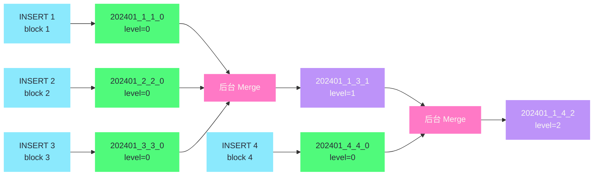
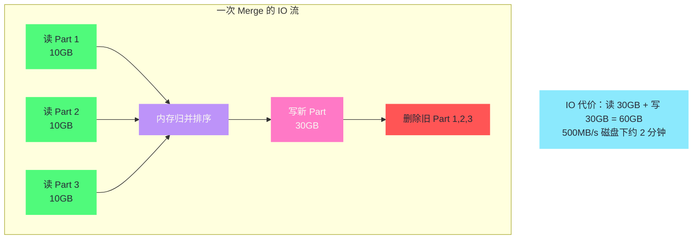

# 03 数据写入与 Part 合并

**摘要：**
ClickHouse 的写入模型是"每次 INSERT 生成一个新 Part，后台异步合并小 Part 为大 Part"——这个看似简单的设计背后，隐藏着精巧的合并调度策略、Mutation 的异步重写机制、以及 TTL 数据过期的自动清理。本文从一次 INSERT 的完整链路切入，剖析 Part 从内存排序到原子落盘的十一步流程；然后深入后台 Merge 的触发逻辑、调度策略与代价模型，讲清生产中最常见的 "Too many parts" 问题从何而来、怎么根治；接着展开 Mutation 为什么必须重写整个 Part、轻量化删除做了哪些改进；最后讨论 TTL 与分层存储如何让数据生命周期管理从"人工运维"变成"表定义里的一行配置"。

---

## 第 1 章 一次 INSERT 的完整链路

### 1.1 没有 WAL 的写入设计

ClickHouse 的写入流程与传统关系数据库有一个根本差异——**本地 MergeTree 没有 WAL（Write-Ahead Log，预写日志）**。MySQL 的 InnoDB 在写入数据页之前先写 redo log，PostgreSQL 先写 WAL 日志，目的是"崩溃后能恢复未落盘的事务"。ClickHouse 的本地 MergeTree 跳过了这一步——数据直接写入磁盘上的 Part 目录，靠"原子 rename"保证写入的可见性，靠"临时目录"保证崩溃恢复的一致性。

这个设计的大胆之处在于：它放弃了"未落盘事务的崩溃恢复"，换取了写入路径的极简——没有 WAL 的顺序写、没有 redo log 的 fsync、没有 checkpoint 的协调。代价是：如果写入过程中宕机，这批数据丢失（临时目录被清理），不能像 MySQL 那样从 redo log 恢复。对 ClickHouse 的目标场景（日志、事件流）来说，这个代价是可接受的——丢失一批日志事件通常可以重放（从 Kafka 重新消费），而 WAL 的开销对每秒千万行的写入吞吐是显著的拖累。

这个取舍的深层逻辑是**"数据来源的可重放性"决定了"是否需要 WAL"**。MySQL 的数据来源是用户的事务——用户提交了一个转账事务，如果数据库崩溃丢了，用户不可能"重新提交"——所以必须有 WAL 保证不丢。ClickHouse 的数据来源通常是上游系统的日志流（Kafka、应用日志、埋点数据）——这些数据来源本身就有持久化和重放能力，ClickHouse 崩溃丢了未落盘的批次，可以从 Kafka 的 offset 重新消费。**WAL 是"数据来源不可重放"时的必需品，"数据来源可重放"时是奢侈品**——ClickHouse 选择了不要这个奢侈品。

但这个选择有一个前提必须记住——**上游必须支持重放**。如果上游是"一次性推送、不存储"的数据源（譬如某些 IoT 设备的实时上报），ClickHouse 崩溃丢数据就真的丢了——没有地方可以重放。这种场景下，要么换一个有 WAL 的存储，要么在 ClickHouse 前面加一层有 WAL 的缓冲（譬如 Kafka）。**"无 WAL"不是"不丢数据"——它是"丢数据后能从上游恢复"，前提是上游能恢复**。

这个前提在实际选型时必须显式验证——不能假设"上游总是能重放"。以下是几种常见的上游可重放性评估：

| 上游类型 | 可重放性 | 崩溃恢复方式 |
| :--- | :--- | :--- |
| Kafka（有 offset） | 强 | 从上次 commit 的 offset 重新消费 |
| 文件（CSV/Parquet） | 强 | 重新导入文件 |
| 应用日志（本地文件） | 中 | 取决于日志保留策略 |
| IoT 设备实时上报 | 弱 | 设备可能不存储历史，丢了就丢了 |
| 用户提交的事务 | 无 | 用户不会重新提交（这就是 MySQL 要 WAL 的原因） |

这张表的落点是：**选 ClickHouse 前，先问"上游能重放吗"**——能重放，无 WAL 可接受；不能重放，要么换有 WAL 的存储，要么前面加缓冲层。把这个前提搞清楚，能避免"ClickHouse 崩溃后数据丢失"的生产事故。

> [!info] Replicated 表的 ZooKeeper Log
> 需要区分的是：**本地 MergeTree 没有 WAL，但 ReplicatedMergeTree 有 ZooKeeper Log**——用于副本间的数据同步。这个 Log 不是为崩溃恢复设计的，而是为"把写入复制到其他副本"设计的。第 05 篇会详细展开 Replicated 表的副本机制。

### 1.2 写入的十一步流程

一次 `INSERT INTO events VALUES (...), (...), ...` 在 ClickHouse 内部的完整流程：

```
INSERT INTO events VALUES (...), (...), ...
         ↓
1.  解析 SQL，验证数据类型和约束
         ↓
2.  在内存中按 ORDER BY 键排序这批数据
         ↓
3.  构建列式数据块（每列独立）
         ↓
4.  按 PARTITION BY 键拆分为多个分区组
         ↓
5.  为每个分区组创建一个临时 Part 目录（tmp_xxx）
6.  将每列数据压缩后写入 *.bin 文件
7.  构建稀疏索引，写入 primary.idx
8.  构建 Mark 文件，写入 *.mrk3
9.  写入 checksums.txt 和 columns.txt
         ↓
10. 原子性地将 tmp_xxx 重命名为正式 Part 目录
         ↓
11. 写入完成，数据立即可查询（Part 可见）
```

每一步都值得展开看它的设计意图：

**第 2 步：内存排序**。这批数据在写入磁盘前，在内存中按主键排序——这是 MergeTree 保证每个 Part 内部有序的方式。如果这批数据量太大（超过 `max_insert_block_size`，默认 1048576 行），会被拆分成多个内存块分别处理，每个块生成一个 Part。**内存排序是写入路径上 CPU 消耗最大的步骤**——对百万行的批量插入，排序的 CPU 开销不可忽视，这也是为什么 ClickHouse 推荐"大批量写入"——一次排序百万行比十次排序十万行的总 CPU 开销更低（排序是 O(N log N)，10 × 10万 × log(10万) > 1 × 100万 × log(100万)）。

这个"大批量更省 CPU"的结论有一个数学基础值得展开。排序的时间复杂度是 O(N log N)——N 越大，log N 也越大，但 N log N 的增长速度比 N 慢（因为 log N 是亚线性的）。所以"一次排 100 万行"的代价是 100万 × 20（log2(100万) ≈ 20）= 2000 万次比较；"十次排 10 万行"的代价是 10 × 10万 × 17（log2(10万) ≈ 17）= 1700 万次比较。看起来十次更省？但还要算上"每次排序的固定开销"——每次排序都要初始化数据结构、分配内存、写 Part 文件，这些固定开销 × 10 远大于省下的那 300 万次比较。**"大批量"省的不只是比较次数，更是固定开销的摊薄**——这才是 ClickHouse 推荐"大批量写入"的完整理由。

**第 6-9 步：写文件**。列数据、索引、Mark、校验和、列定义按顺序写入临时目录。这些文件的格式在第 02 篇已经详细展开——`.bin` 是压缩列数据，`primary.idx` 是稀疏索引，`*.mrk3` 是 Mark 文件。写入顺序有讲究——先写数据文件（`.bin`），再写索引文件（`primary.idx`、`*.mrk3`），最后写校验和（`checksums.txt`）。**校验和最后写，作为"Part 完整性"的标记**——如果校验和文件存在，说明所有文件都写完了；如果校验和文件不存在（写入中断），整个临时目录会被清理。

校验和的作用不仅在于"写入中断时的完整性判断"——它还用于"运行时的数据校验"。每次读取 Part 的列数据时，ClickHouse 会重新计算校验和并与 `checksums.txt` 里记录的对比——如果不一致，说明数据损坏（磁盘坏道、位翻转等），查询会报错而非返回错误数据。**校验和是"静默数据损坏"的防线**——磁盘的静默错误（数据在磁盘上慢慢腐烂，磁盘控制器不报错）是生产中真实存在的问题，没有校验和的数据库可能返回错误数据而不自知，ClickHouse 的校验和机制让这种错误能被发现。

**第 4 步：按分区拆分**。如果表有 `PARTITION BY`，这批数据按分区键拆分成多个组，每个分区组生成一个独立的 Part。譬如 `PARTITION BY toYYYYMM(date)`，一批数据跨 1 月和 2 月，会生成两个 Part——`202401_x_x_0` 和 `202402_x_x_0`。**分区拆分发生在内存排序之后**——先全局排序，再按分区切分，保证每个 Part 内部仍然有序。

分区拆分有一个工程细节值得注意——**如果一个 INSERT 跨越多个分区，每个分区都会生成一个 Part**。譬如表按月分区，一次 INSERT 写入了 1 月和 2 月的数据，会生成 `202401_x_x_0` 和 `202402_x_x_0` 两个 Part。这意味着"一次 INSERT 产生的 Part 数 = 涉及的分区数"——如果一次 INSERT 涉及 12 个月，就生成 12 个 Part。**对于按天分区、写入跨多天的场景，一次 INSERT 可能产生几十个 Part**——这会加速 Part 数量增长，增加 Merge 压力。生产中建议"按分区粒度对齐写入批次"——如果按天分区，尽量让每次 INSERT 只写一天的数据，避免跨天。

**第 10 步：原子 rename**。通过操作系统的 `rename` 系统调用（POSIX 保证在同一文件系统内 rename 是原子的），将临时 Part 目录重命名为正式名称。这保证了写入的原子性——要么整个 Part 对外可见，要么完全不可见。如果写入过程中宕机，临时目录在重启后被清理，不会有部分写入的脏数据。**原子 rename 是 ClickHouse 无 WAL 设计的基石**——它用文件系统的原子操作替代了 WAL 的崩溃恢复，简洁且可靠。

原子 rename 的可靠性依赖于文件系统的两个保证：第一，`rename` 在同一文件系统内是原子的（POSIX 标准）；第二，`rename` 后的数据在磁盘上是持久的（需要 `fsync` 父目录）。ClickHouse 在 rename 后会对父目录做 `fsync`，保证即使整机断电，rename 的结果也不会丢失。**这个 `fsync` 父目录是"无 WAL 设计下唯一的持久化保证"**——如果跳过它，断电后 rename 可能丢失（文件系统的元数据未持久化），Part 目录消失，数据丢失。

生产中有一个相关的调优点——`fsync_metadata` 设置（默认 true）。它控制是否对 Part 的元数据文件做 `fsync`。设为 false 可以提升写入吞吐（减少 fsync 次数），但断电时可能丢失 Part 元数据——**这是"用可靠性换性能"的调优，生产环境不建议关闭**。除非你的数据来源完全可重放（Kafka 有 offset），且能接受断电后重新消费的成本，才可以考虑关闭。

### 1.3 Part 的命名规则

Part 目录名格式：`{partition}_{min_block}_{max_block}_{level}`

- **partition**——分区值（如 `202401` 表示 2024 年 1 月的数据）
- **min_block、max_block**——这个 Part 的 block 编号范围（全局递增的计数器，每次写入分配新的 block 号）
- **level**——合并层级，新写入的 Part 为 level=0，每次被合并后 level 加 1

示例：`202401_1_1_0` 表示分区 202401、block 范围 [1,1]、level 0（刚写入的原始 Part）。合并后：`202401_1_50_1` 表示 block 范围 [1,50] 内的 50 个 Part 被合并成一个，level=1。

**通过目录名可以直观判断一个表的数据整理状况**——**如果有大量 level=0 的 Part，说明 Merge 跟不上写入速度**。这是生产巡检时看 `system.parts` 表的第一个指标：`SELECT count(), level FROM system.parts WHERE table='events' AND active GROUP BY level`——如果 level=0 的 Part 数量持续增长，就是 "Too many parts" 的前兆。

Part 命名规则里还藏着一个有用的运维信息——**block 编号的连续性**。`min_block` 和 `max_block` 表示这个 Part 包含的原始 block 编号范围。譬如 `202401_1_50_1` 包含 block 1 到 50——这意味着 block 1 到 50 的 50 个原始 Part 已经被合并成 1 个。如果看到 `202401_1_1_0`、`202401_2_2_0`、`202401_3_3_0`...`202401_100_100_0`（100 个 level=0 的 Part，block 编号连续），说明这 100 个 Part 还没被合并——Merge 落后了 100 个 Part。如果看到 `202401_1_100_2`（一个 level=2 的 Part，block 1-100），说明这 100 个原始 Part 已经被合并成 1 个——Merge 赶上了。**block 编号的连续性是"Merge 进度"的直观指标**——连续的 level=0 Part 越多，Merge 落后越严重。



---

## 第 2 章 后台 Merge——ClickHouse 的"清洁工"

### 2.1 为什么需要后台 Merge

每次 INSERT 生成一个新 Part，如果写入频繁，磁盘上会积累大量小 Part。大量小 Part 带来两个问题：

**查询性能下降**。查询时 ClickHouse 需要扫描所有相关 Part——Part 越多，需要打开的文件越多，每个 Part 的索引查找、Mark 读取等固定开销就累积得越多。理论上，同样的数据合并成 1 个大 Part 的查询性能远好于分散在 1000 个小 Part 中。用一个数字来感受：1000 个 Part × 100 列 = 10 万个 `.bin` 文件——光是 `open()` 这 10 万个文件就可能花掉几秒，而合并成 1 个大 Part 后只需打开 100 个文件。

**文件描述符消耗**。每个 Part 包含多个文件（每列一个 `.bin` + 一个 `.mrk3`），1000 个 Part × 100 列 = 数十万个文件描述符。操作系统对单个进程的文件描述符数量有限制（默认 1024，生产环境通常调到百万级），超限会导致写入失败。

后台 Merge 持续地将小 Part 合并成大 Part，减少 Part 数量，优化查询性能。**Merge 是 ClickHouse 写入模型的"清洁工"——写入产生垃圾（小 Part），Merge 打扫垃圾（合并成大 Part）**。如果清洁工跟不上垃圾产生速度，系统就会崩溃（Too many parts）。

Merge 的"清洁工"角色可以用一个城市环卫的比喻来理解——居民每天扔垃圾（INSERT 生成 Part），环卫车每天收垃圾合并运到垃圾站（Merge 合并 Part）。如果居民扔垃圾的速度超过环卫车的处理速度，垃圾就会堆积（Part 数量增长），最终垃圾桶满溢（Too many parts 报错）。解法要么"让居民少扔垃圾"（攒批，减少 INSERT 频率），要么"增加环卫车"（调大 `background_pool_size`，增加 Merge 并发），要么"从源头减少垃圾量"（预聚合，减少数据行数）。**三种解法各有适用条件——攒批是"调整扔垃圾的节奏"，增并发是"增加环卫力量"，预聚合是"减少垃圾产生"**。生产中通常三种并用——攒批做基础保障，增并发应对高峰，预聚合从源头减压。

### 2.2 Merge 的触发策略

ClickHouse 的 Merge 调度器运行在后台，持续选择合适的 Part 组合进行合并。选择的三个基本原则：

**同分区内合并**。不同分区的 Part 永远不会合并——因为它们的数据按分区键有序，合并会破坏分区边界。譬如分区 `202401` 和 `202402` 的 Part 不能合并——合并后的 Part 跨两个月，分区剪枝就失效了。**Merge 的调度是"按分区独立"的**——每个分区有自己的 Merge 队列，互不干扰。

"按分区独立调度"有一个重要的副作用——**分区数量影响 Merge 的总并发需求**。如果表有 100 个分区，每个分区都有几个待合并的 Part，Merge 调度器需要从 100 个队列里选任务——而 `background_pool_size` 默认只有 16 个线程。这意味着 100 个分区里只有 16 个能同时合并，其余 84 个排队等待。**分区太多会让 Merge 的"并发覆盖面"下降**——每个分区的 Merge 等待时间变长。这是"分区太细"问题的另一个维度——不仅 Part 碎片化，Merge 的调度也碎片化。

**按大小选择**。默认使用 `Simple` 合并策略——优先合并大小相近的 Part。这个策略的目的是防止两种极端：一种是"一个巨大的 Part 被反复合并"（代价太高，每次合并都要重写这个大 Part），另一种是"小 Part 无法被合并"（因为大 Part 太重导致队列一直被占用）。**大小相近的 Part 合并，让 Part 的增长是"均衡的"——每次合并让 Part 大致翻倍，而不是某个 Part 无限膨胀**。

ClickHouse 还支持几种可选的合并策略，适用于不同场景：

**Simple 策略**（默认）——优先合并大小相近的 Part，目标是让 Part 大小均衡增长。适用于绝大多数场景。

**Aggressive 策略**——更积极地合并，即使 Part 大小不完全相近也合并。适用于"写入频繁、Part 增长快"的场景，但 IO 开销更大。

**Tiered 策略**——按"层级"合并，小 Part 合并成中 Part，中 Part 合并成大 Part，类似 LSM-Tree 的 Leveled Compaction。适用于"数据量极大、需要严格控制 Part 数量"的场景。

绝大多数生产环境用默认的 Simple 策略即可——只有在默认策略跟不上写入时才考虑换策略。**换策略是"调优的最后手段"——不是"第一手段"**，因为换策略通常意味着更多 IO 开销，可能让查询性能下降。

**合并限制**。单次合并的 Part 总大小上限是 `max_bytes_to_merge_at_max_space_in_pool`（默认 150GB）——超过这个大小的 Part 不再参与合并，避免单次 Merge 的 IO 代价过高。同时进行的 Merge 任务数由 `background_pool_size` 控制（默认 16）——即最多 16 个并发合并任务。

### 2.3 Merge 的代价模型

Merge 操作的本质是：读取多个小 Part 的列数据，排序合并（归并排序），写入一个大 Part，然后删除旧的小 Part。

**IO 代价**：读 + 写 = 2 × 被合并 Part 的总大小。对于 150GB 的合并，需要读写 300GB 数据，在 500MB/s 的磁盘吞吐下需要约 10 分钟。**Merge 是磁盘 IO 密集型操作**——它会与正常查询竞争磁盘带宽。

**CPU 代价**：归并排序本身是 O(N) 的（因为每个 Part 内部已有序，只需多路归并），但重新压缩数据消耗 CPU——解压旧 Part 的压缩块、归并、重新压缩成新 Part 的压缩块。对 LZ4 压缩，CPU 开销可接受；对 ZSTD，CPU 开销更显著。

**对查询的影响**：Merge 期间，旧 Part 仍然可查（直到新 Part 完成且旧 Part 被删除），所以查询不会阻塞。但 Merge 的 IO 会挤占查询的 IO 带宽——ClickHouse 通过后台 IO 限速（`background_merges_mutations_disk_read_write_max_bytes`）避免 Merge 完全饿死查询 IO。**这个限速是生产调优的关键参数**——设得太低，Merge 跟不上写入；设得太高，查询被 Merge 的 IO 拖慢。

Merge 代价还有一个容易被忽略的维度——**磁盘空间放大**。Merge 期间，旧 Part 还在（查询要用），新 Part 正在写入——这意味着 Merge 期间，这部分数据占用的磁盘空间是"旧 + 新 = 2 倍"。对于 150GB 的 Merge，期间需要额外 150GB 的磁盘空间。如果磁盘空间不足，Merge 会失败——这是生产中 Merge 失败的常见原因之一。**磁盘容量规划必须预留 Merge 的空间**——经验值是磁盘使用率不超过 70%，留 30% 给 Merge 的临时空间。如果磁盘使用率已经 80% 以上，Merge 的大合并可能因为空间不足而失败，Part 数量开始累积，最终触发 Too many parts——这是一个"磁盘满 → Merge 失败 → Part 堆积 → 写入报错"的连锁反应。



### 2.4 "Too many parts"——生产头号事故

> [!warning] 生产避坑：Too many parts
> ClickHouse 对每个分区内的 Part 数量有保护上限（默认 300 个），当 Part 数量超过这个阈值时，新的 INSERT 会报错：`Too many parts (xxx). Merges are processing significantly slower than inserts.`
>
> **根因**：写入速度（生成 Part 的速度）超过了 Merge 速度（合并 Part 的速度）。
>
> **解决方案**：
> 1. 短期——增加 `parts_to_delay_insert` 阈值（推迟而不是报错），或临时暂停写入让 Merge 追赶
> 2. 长期——降低写入频率（增大批次大小），或增加 `background_pool_size` 提升 Merge 并发
> 3. 根本——每次 INSERT 的批次大小应 ≥ 10 万行，避免每秒多次小批写入
>
> **最佳实践**：通过 Kafka + ClickHouse Kafka Engine 或批量导入工具，保证每次写入至少 10 万行。

这个事故值得深入分析，因为它是 ClickHouse 生产环境最常见的故障——几乎没有一个 ClickHouse 用户没遇到过 "Too many parts"。

**为什么会触发**。ClickHouse 的设计假设是"批量写入"——每次 INSERT 至少几万行，每分钟几批到几十批。如果业务用"每秒一批、每批 100 行"的方式写入，每秒生成 1 个 Part，一天生成 86400 个 Part。即使 Merge 持续工作，它的速度有物理上限（受磁盘 IO 限制）——当 Part 产生速度超过 Merge 合并速度时，Part 数量持续增长，最终触发 300 的上限。

**为什么会"报错"而不是"等待"**。ClickHouse 选择报错而不是无限等待，是为了保护系统——如果让写入无限排队，内存会被队列耗尽，整个节点崩溃。报错是"牺牲新写入、保护已有数据"的防御机制。`parts_to_delay_insert`（默认 150）是"开始延迟写入"的阈值——Part 数量超过 150 时，INSERT 被人为延迟（sleep 几秒），给 Merge 追赶的机会；`parts_to_throw_insert`（默认 300）是"直接报错"的阈值——Part 数量超过 300 时，INSERT 直接失败。**延迟是"软保护"，报错是"硬保护"**——两层保护让系统在压力下优雅降级而非直接崩溃。

"优雅降级"的设计在 ClickHouse 的多处都有体现，值得作为一个模式来理解。除了 `parts_to_delay_insert` / `parts_to_throw_insert`，还有：

- `max_concurrent_queries`——超过并发限制时，新查询排队等待而非立即报错
- `max_memory_usage`——查询内存超限时，查询被 kill 而非 OOM 整个节点
- `max_execution_time`——查询超时时被中断而非无限跑

这些设计的共同思路是**"在资源耗尽前主动限制，而非在资源耗尽后被动崩溃"**——让系统在压力下保持部分可用，而非全盘崩溃。这是生产级系统的重要品质——**"能优雅降级"比"能满载运行"更重要**，因为满载运行是理想状态，降级是现实常态。

**根治方案**。短期方案是暂停写入让 Merge 追赶——但这只是应急。长期方案是调整写入模式——**攒批**。如果业务数据源是 Kafka，用 ClickHouse 的 Kafka Engine 消费时设置 `max_block_size = 100000`，让消费端攒到 10 万行再写入；如果业务数据源是应用日志，用 Buffer 表引擎或本地文件缓冲，攒批后批量导入。根本方案是让"每次 INSERT 的行数"与"Merge 的速度"匹配——ClickHouse 的经验值是每次 INSERT ≥ 10 万行，每小时不超过几百次 INSERT。

### 2.5 Merge 策略的调优

除了"攒批"这个根本方案，Merge 策略本身的调优也能缓解 Part 压力：

**增加 `background_pool_size`**。默认 16，调到 32 或 64 可以让更多 Merge 并发执行——但前提是磁盘 IO 能支撑更多并发（SSD 通常可以，HDD 不行，因为磁头寻道是瓶颈）。**调大 `background_pool_size` 对 SSD 集群有效，对 HDD 集群无效**——HDD 的随机 IO 能力太弱，更多并发 Merge 只会让磁头更忙乱。

**调整 `merge_max_block_size`**。这个参数控制 Merge 时一次处理的数据块大小（默认 8192，与 Granule 大小一致）。调大可以减少 Merge 的循环次数，但增加内存占用——通常不需要调。

**使用 `AggregatingMergeTree` 预聚合减少数据量**。如果业务允许，用物化视图 + AggregatingMergeTree 在写入时预聚合——预聚合后的数据量大幅减少，Part 更小、更少，Merge 压力自然降低。**预聚合是"从源头减少数据量"的方案**——比调优 Merge 策略更治本。

### 2.6 Merge 的监控与诊断

生产中 Merge 的监控是 ClickHouse 运维的核心任务之一——Merge 跟不上是 Too many parts 的根因，而 Too many parts 是写入失败的最常见原因。几个关键的监控查询：

**查看各表的 Part 数量分布**：
```sql
SELECT 
    database, table, 
    count() AS total_parts,
    sumIf(1, level = 0) AS level_0_parts,
    max(level) AS max_level
FROM system.parts 
WHERE active 
GROUP BY database, table 
ORDER BY level_0_parts DESC
```
这个查询按 `level_0_parts` 降序排列——排在前面的表是"Merge 压力最大"的表，需要优先关注。

**查看正在执行的 Merge 任务**：
```sql
SELECT 
    database, table, 
    elapsed, 
    progress,
    num_parts,
    total_size_bytes
FROM system.merges 
ORDER BY elapsed DESC
```
`elapsed` 很长且 `progress` 很低的 Merge 任务是"卡住"的——可能是磁盘 IO 瓶颈，也可能是某个 Part 特别大。

**查看 Merge 的历史吞吐**：
```sql
SELECT 
    start_time, end_time,
    duration_ms,
    total_size_bytes / duration_ms AS throughput_bytes_per_ms
FROM system.merges 
WHERE end_time > now() - INTERVAL 1 DAY
ORDER BY start_time
```
这个查询能看出 Merge 的吞吐趋势——如果吞吐持续下降，可能是磁盘老化或 IO 竞争加剧。

这些监控查询应该集成到 ClickHouse 的运维看板里，配合告警——**Merge 健康是 ClickHouse 写入健康的基础**，Merge 出问题，写入必然出问题。第 07 篇运维篇章会详细展开监控体系的搭建。

---

## 第 3 章 Mutation——重写式更新的代价与改进

### 3.1 为什么更新/删除在 ClickHouse 中代价高

传统行存数据库的 UPDATE/DELETE 代价低——找到对应行，修改该行数据或标记删除，只需要修改少量数据页（B+ 树的特点是"按页管理"，修改一行只动一个页）。即使修改 1000 行，也只动 1000 个页，IO 代价与修改行数成正比。

ClickHouse 的 Part 是**不可变的（immutable）**——一旦写入，列数据文件不能被修改。不可变的原因有两层：第一，压缩格式不支持随机修改——数据是按块压缩的，修改一行要解压整个块、改一行、重新压缩整个块，代价不比重写低；第二，稀疏索引和 Mark 文件是按"行数偏移"构建的，修改一行导致行数变化，整个索引和 Mark 都要重建。因此，更新/删除必须通过**重写整个 Part**来实现——读出 Part 的所有数据，修改目标行，压缩后写入新 Part，删除旧 Part。

这个操作称为 **Mutation**，是异步执行的：

```sql
-- 删除某个用户的所有数据
ALTER TABLE events DELETE WHERE user_id = 12345;

-- 更新某些行的 amount 列
ALTER TABLE events UPDATE amount = amount * 1.1 WHERE date = '2024-01-01';

-- 查看 Mutation 状态
SELECT * FROM system.mutations WHERE table = 'events';
-- is_done = 1 表示完成，否则还在后台执行
```

### 3.2 Mutation 的执行流程

Mutation 的执行分为六步：

1. Mutation 命令写入 `system.mutations` 表，生成一个 Mutation 记录（包含 Mutation ID、WHERE 条件、UPDATE 表达式）
2. 后台 Mutation 线程读取待处理的 Mutation 列表
3. 对每个 Part，读取所有列数据，应用 Mutation 条件（过滤 DELETE，或计算新值 UPDATE）
4. 将处理后的数据写入新 Part，名称中包含 Mutation ID 标记（如 `_0_100_0_mut_123`）
5. 所有 Part 处理完毕后，Mutation 标记为完成（`is_done = 1`）
6. 旧 Part 在后续的定期清理中被删除

**Mutation 的代价**：每次 Mutation 需要重写整个表（所有分区的所有 Part），即使只修改了一行。对于 TB 级别的大表，一次 `ALTER TABLE DELETE WHERE user_id = 12345` 可能需要数小时——因为它要扫完所有 Part，把不含 `user_id=12345` 的行原样写入新 Part，把含 `user_id=12345` 的行丢弃。

这就是为什么 ClickHouse 不适合高频更新的场景——每次更新都是"重写整张表"。**Mutation 的代价与"修改的行数"无关，与"表的总数据量"成正比**——这是它与 B+ 树更新最根本的区别。

用一个数字来感受这个差距。假设一张 10TB 的表，需要更新 100 行数据：

- **MySQL（B+ 树）**：100 行分布在 100 个数据页里，更新这 100 个页，IO 代价约 100 × 16KB = 1.6MB。毫秒级完成。
- **ClickHouse（Mutation）**：重写整个表，10TB 数据全部读出、过滤、重写。即使 500MB/s 的磁盘吞吐，也需要 10TB / 500MB/s × 2（读写）≈ 11 小时。

**100 行的更新，MySQL 毫秒级，ClickHouse 11 小时**——这不是"ClickHouse 慢"，是"ClickHouse 的更新模型与 B+ 树完全不同"。ClickHouse 的更新是"批量重写"，B+ 树的更新是"精确修改"——两种模型各有适用场景，没有高下之分，但混用会出大问题。**把 MySQL 的"高频小更新"模式套到 ClickHouse 上，是 ClickHouse 生产事故的最常见根因之一**。

### 3.3 Mutation 的轻量化改进

ClickHouse 在较新版本（22.x+）引入了几项对 Mutation 的优化，值得了解：

**分区级 Mutation 短路**。如果 `DELETE` 的 WHERE 条件覆盖整个分区（譬如 `DELETE WHERE date = '2024-01-01'`，且表按天分区），ClickHouse 直接 DROP 对应分区，不做 Mutation 重写——性能从"小时级"降到"毫秒级"。**这是分区设计影响 Mutation 性能的典型例子**——按天分区的表，按天删除是毫秒级；按月分区的表，按天删除仍要 Mutation 重写整个月。

**Lightweight Delete（轻量级删除）**。使用一个隐藏的删除标记列而不是立即重写 Part——`DELETE FROM events WHERE user_id = 12345` 只在标记列里标记"这些行已删除"，查询时过滤掉标记的行，Part 本身不重写。后续 Merge 时，标记的行自然不会写入新 Part。**Lightweight Delete 把"删除的即时代价"从"重写 Part"降到"写标记列"**——类似 [[Doris]] 的 Delete Bitmap 机制。但它的查询代价上升了——每次查询都要过滤标记列，即使大部分行没被删除。

Lightweight Delete 的实现机制值得多看一层——它在 Part 的列数据里加一个隐藏的 `_row_exists` 列（或类似机制），`DELETE` 时把对应行的 `_row_exists` 标记为 false，查询时默认带 `WHERE _row_exists = true` 过滤。**这个标记列是"行级"的，不是"Part 级"的**——一个 Part 里可能只有少数行被标记删除，大部分行仍然有效。这与"DROP PARTITION"的"整块删除"不同——Lightweight Delete 的粒度更细，但代价是每次查询都要扫描标记列。

Lightweight Delete 与传统 Mutation DELETE 的对比值得展开：

| 维度 | 传统 Mutation DELETE | Lightweight Delete |
| :--- | :--- | :--- |
| **即时代价** | 重写整个 Part | 写标记列（极快） |
| **查询代价** | 无（重写后数据已干净） | 有（每次查询过滤标记列） |
| **最终清理** | 立即（重写时删除） | Merge 时（标记行不写入新 Part） |
| **适用场景** | 删除量大、查询敏感 | 删除量小、对即时性要求高 |

这张表的洞察是：**Lightweight Delete 是"用查询代价换即时性"**——删除操作本身极快，但查询时要持续付出"过滤标记列"的代价，直到 Merge 把标记行真正清理掉。如果删除频繁但 Merge 跟不上，标记列会越积越多，查询代价持续上升。**Lightweight Delete 适合"偶尔删几行"的场景，不适合"频繁大量删除"的场景**——后者仍然应该用传统 Mutation 或分区 DROP。

**Mutation 的并行度**。多个 Mutation 可以并行执行（受 `background_pool_size` 限制），且单个 Mutation 的多个 Part 可以并行重写——这让 Mutation 的总时间从"串行重写所有 Part"变成"并行重写多个 Part"，对大表的 Mutation 时间有显著改善。

这些改进让 Mutation 的"可用性"提升了，但**没有改变"Mutation 是重写操作"的本质**——高频 Mutation 仍然不可取。正确的做法是：能用分区 DROP 的不要用 Mutation（按分区键删除），能用 ReplacingMergeTree + `argMax` 的不要用 UPDATE（按主键更新），能用 TTL 的不要用 DELETE（按时间过期）。**Mutation 是 ClickHouse 更新能力的"最后手段"——能用其他方案就别用 Mutation**。

### 3.5 Mutation 的替代方案矩阵

既然 Mutation 代价高，生产中应该优先用哪些替代方案？这里用一个矩阵收拢：

| 业务需求 | 替代方案 | 代价 | 适用条件 |
| :--- | :--- | :--- | :--- |
| **按时间删除旧数据** | TTL | 零（Merge 时免费） | 按时间过期 |
| **按分区删除整块数据** | DROP PARTITION | 毫秒级（删目录） | 删除条件匹配分区键 |
| **按主键去重（保留最新）** | ReplacingMergeTree + `argMax` | 查询时聚合 | 主键能标识唯一行 |
| **按主键更新（状态变化）** | CollapsingMergeTree + sign | 写入成对 +1/-1 | 更新模式固定 |
| **按主键聚合（预计算）** | AggregatingMergeTree 物化视图 | 写入时预聚合 | 聚合模式固定 |
| **按任意条件删除** | Mutation | 重写整表 | 无替代，最后手段 |
| **按任意条件更新** | Mutation | 重写整表 | 无替代，最后手段 |

这张表的洞察是：**前五种替代方案覆盖了 90% 的"数据修改"需求**——只有"按任意条件删除/更新"这种无法用分区键、主键、时间表达的需求，才必须用 Mutation。如果你的业务里 Mutation 频繁，通常说明**表设计或引擎选择不匹配业务**——应该重新设计表（用 ReplacingMergeTree 替代频繁 UPDATE）或换引擎（用 [[Doris]] Unique 模型替代高频更新）。**Mutation 频繁是"设计问题"的信号，不是"ClickHouse 性能问题"**。

### 3.6 Mutation 的生产运维实践

既然 Mutation 不可避免（偶尔的批量修正仍需要），生产中如何安全地执行 Mutation？

**低峰期执行**。Mutation 的 IO 开销大，与查询竞争磁盘带宽——在业务低峰期（譬如凌晨 2-4 点）执行，对在线查询的影响最小。可以用定时任务在低峰期触发 Mutation。

**分批 Mutation**。如果 Mutation 的 WHERE 条件可以按分区拆分（譬如 `DELETE WHERE date BETWEEN '2024-01-01' AND '2024-01-31'`，表按天分区），改成按天分批执行——每天一个 `ALTER TABLE DELETE WHERE date = '2024-01-01'`，每次只重写一个分区的 Part。**分批 Mutation 把"重写整表"变成"重写一个分区"**——代价从"小时级"降到"分钟级"。

**监控 Mutation 进度**。执行 Mutation 后，持续监控 `system.mutations` 的 `progress` 和 `is_done`——如果进度长期停滞，可能是 Merge 线程被占用（Mutation 和 Merge 共享 `background_pool_size`）。必要时可以暂停其他 Merge 任务，让 Mutation 优先完成。

**避免并发 Mutation**。多个 Mutation 同时执行会互相竞争 `background_pool_size` 的线程——如果池子满了，Mutation 和 Merge 都会排队。生产中建议串行执行 Mutation——一个完成后再发下一个。

### 3.4 Mutation 与 Merge 的关系

Mutation 和 Merge 都是"重写 Part"的操作，它们之间的关系值得厘清：

**Merge 是自动的、持续的**——后台线程定期触发，目的是减少 Part 数量。Merge 时可以顺便应用变体引擎的语义（去重、聚合、抵消）和 TTL 过滤。

**Mutation 是手动的、一次性的**——用户发起 `ALTER TABLE ... DELETE/UPDATE` 后触发，目的是修改数据。Mutation 重写 Part 时，会在新 Part 的名称里加 `mut_N` 标记，表示"这个 Part 经历过 Mutation"。

**两者可能竞争资源**。Merge 和 Mutation 都在 `background_pool_size` 控制的线程池里执行——如果 Mutation 很多，会占用 Merge 的线程，导致 Merge 跟不上写入。生产中如果必须做 Mutation，建议在低峰期执行，并监控 `system.merges` 和 `system.mutations` 的进度。

---

## 第 4 章 TTL——数据生命周期的自动化

### 4.1 行级 TTL

ClickHouse 的 TTL（Time To Live）功能支持自动过期删除数据，无需手动 DROP PARTITION 或执行 DELETE：

```sql
-- 创建表时定义 TTL（数据保留 30 天）
CREATE TABLE events (
    date     DateTime,
    user_id  UInt64,
    amount   Float64
) ENGINE = MergeTree()
ORDER BY (date, user_id)
TTL date + INTERVAL 30 DAY;  -- 数据在 date 的值 + 30 天后过期

-- 也可以对单独的列设置 TTL（过期后清零）
CREATE TABLE user_events (
    date      DateTime,
    user_id   UInt64,
    pii_email String TTL date + INTERVAL 90 DAY  -- 90 天后 email 自动清空
) ENGINE = MergeTree() ORDER BY (date, user_id);
```

TTL 的执行机制是在后台 Merge 时完成的——当一个 Part 被合并时，ClickHouse 检查每行的 TTL 值，过期的行不会被写入新 Part（相当于在合并时自动过滤）。**TTL 不是"定时删除"——它是"Merge 时过滤"**。这意味着 TTL 的生效时间取决于 Merge 何时发生——如果某个分区一直没触发 Merge，过期数据可能"赖着不走"。ClickHouse 有专门的 TTL 检查线程，定期触发过期数据的 Merge，保证 TTL 最终会生效。

TTL 的"Merge 时过滤"机制有一个隐含的优化——**TTL 过滤是"免费的"**。正常 Merge 要读出旧 Part 的所有数据、归并、写入新 Part；TTL Merge 做同样的事，只是写入新 Part 时跳过过期行——跳过的代价几乎为零（只是判断一下 TTL 表达式）。**TTL 删除不需要"额外的 IO"——它搭了 Merge 的便车**。这是 TTL 比 Mutation DELETE 便宜的根本原因——Mutation DELETE 要专门发起一次重写，TTL 删除在正常 Merge 时顺便完成。

TTL 与 Merge 的协同还有一个细节——**TTL 的检查粒度是"行级"还是"分区级"取决于 TTL 表达式**。如果 TTL 表达式是 `date + INTERVAL 30 DAY`，且表按 `toYYYYMM(date)` 分区，那么一个分区（譬如 202401）的所有行的 `date` 值都在 2024-01-01 到 2024-01-31 之间——当当前时间超过 2024-01-31 + 30 = 2024-03-02 时，整个分区的所有行都过期了。此时 ClickHouse 可以直接 DROP 整个分区，不需要 Merge 过滤——这是"分区级 TTL"，效率最高。如果 TTL 表达式不能按分区粒度对齐（譬如 `event_time + INTERVAL 30 DAY`，但 `event_time` 不是分区键），则必须逐行检查——这是"行级 TTL"，效率较低（要 Merge 过滤）。**TTL 表达式与分区键对齐，能让 TTL 从"行级"升级到"分区级"，效率提升几个数量级**——这是 TTL 设计的重要优化点。

### 4.2 列级 TTL 的隐私保护用途

列级 TTL（`pii_email String TTL date + INTERVAL 90 DAY`）有一个特殊用途——**隐私数据的自动清理**。譬如用户行为表里有 `pii_email`（个人身份信息邮箱），合规要求"90 天后必须删除"。用列级 TTL，90 天后 `pii_email` 自动清空（变成空字符串或 NULL），其他列保留——既满足合规要求，又不丢失分析价值（其他列的聚合统计仍然可用）。

**列级 TTL 是"部分删除"——只删敏感列，保留其他列**。这比行级 TTL（整行删除）更精细——对隐私合规场景，"删敏感字段"比"删整行"更符合"最小化数据保留"的原则。

列级 TTL 还有一个进阶用法——**渐进式数据降级**。譬如一张用户行为表，30 天内需要完整的列（包括 `user_agent`、`ip`、`device_id` 等高基数列）做精细化分析；30 天后只需要核心指标（`user_id`、`event_type`、`amount`）做趋势分析。可以用列级 TTL 让高基数列 30 天后清空，核心列保留 90 天：

```sql
CREATE TABLE user_events (
    date         DateTime,
    user_id      UInt64,
    event_type   String,
    amount       Float64,
    user_agent   String TTL date + INTERVAL 30 DAY,  -- 30 天后清空
    ip           String TTL date + INTERVAL 30 DAY,
    device_id    String TTL date + INTERVAL 30 DAY
) ENGINE = MergeTree()
ORDER BY (date, user_id)
TTL date + INTERVAL 90 DAY;  -- 90 天后整行删除
```

这种"渐进式降级"让存储成本与分析价值匹配——近期数据全列保留支持精细分析，中期数据删高基数列节省存储，远期数据全部删除。**列级 TTL 把"数据保留策略"从"一刀切"变成了"分列分阶段"**——这是 ClickHouse 在数据生命周期管理上的一个精细设计。

### 4.3 分层存储——热冷数据自动迁移

ClickHouse 支持将过期数据移动到"冷存储"而不是直接删除，实现**热冷数据分层**：

```xml
<!-- 定义存储策略：热存储 NVMe SSD，冷存储 HDD -->
<storage_configuration>
    <disks>
        <hot>
            <path>/data/nvme/</path>
        </hot>
        <cold>
            <path>/data/hdd/</path>
        </cold>
    </disks>
    <policies>
        <hot_cold>
            <volumes>
                <hot_volume>
                    <disk>hot</disk>
                    <max_data_part_size_bytes>10737418240</max_data_part_size_bytes>  <!-- 10GB 内的 Part 留在热存储 -->
                </hot_volume>
                <cold_volume>
                    <disk>cold</disk>
                </cold_volume>
            </volumes>
            <move_factor>0.2</move_factor>  <!-- 热存储使用率超过 80% 时，最旧 Part 移到冷存储 -->
        </hot_cold>
    </policies>
</storage_configuration>
```

```sql
-- 建表时指定存储策略 + 数据移动 TTL
CREATE TABLE events (
    date DateTime,
    amount Float64
) ENGINE = MergeTree()
ORDER BY date
SETTINGS storage_policy = 'hot_cold'
TTL date + INTERVAL 7 DAY TO VOLUME 'cold_volume';  -- 7 天后移动到冷存储
```

这种"热 NVMe + 冷 HDD"的分层存储策略，可以在控制成本的同时保持近期数据的查询性能——7 天内的热数据在 NVMe 上查询快，7 天前的冷数据在 HDD 上查询慢但存储便宜。**分层存储把"冷热数据分离"从"人工运维"变成了"表定义里的一行 TTL"**——不需要外部脚本搬数据，ClickHouse 后台自动迁移。

分层存储的迁移粒度是**Part 级**——一个 Part 要么在热存储、要么在冷存储，不能"半个 Part 在热、半个在冷"。这意味着 Part 的大小影响迁移效率——如果 Part 太小（几 MB），迁移的元数据开销大于数据搬移开销；如果 Part 太大（几十 GB），一次迁移占用大量 IO。**分层存储与 Merge 的协同在于——Merge 把小 Part 合并成大 Part 后，TTL 再把大 Part 迁移到冷存储**——先合并再迁移，效率最高。

### 4.5 分层存储的容量规划

分层存储的容量规划有一个容易忽略的点——**热存储的容量必须能容纳"热数据量 + Merge 的临时空间"**。Merge 在热存储上生成新 Part，如果热存储满了，Merge 会失败。经验值是热存储的使用率不超过 70%——留 30% 给 Merge 的临时空间和突发写入。

`move_factor`（默认 0.2）控制"何时开始往冷存储搬"——当热存储使用率超过 `1 - move_factor = 0.8`（80%）时，ClickHouse 开始把最旧的 Part 移到冷存储。这个参数的调优逻辑是：`move_factor` 太小（譬如 0.05），热存储几乎满了才搬，Merge 可能因为空间不足失败；`move_factor` 太大（譬如 0.5），热存储只用了一半就开始搬，热数据过早变冷，查询性能下降。**0.2 是一个"留足 Merge 空间又不过早搬冷"的平衡值**——大多数场景不需要调。

冷存储的容量规划相对简单——冷数据量大、查询频率低，用大容量 HDD 即可。冷存储的 IO 性能不影响写入（写入在热存储），只影响冷数据的查询——如果冷数据查询频率很低（譬如只是合规存档、几乎不查），用最便宜的 HDD；如果冷数据偶尔要查（譬如月报、季报），用稍快的 HDD 或 NVMe。

### 4.4 TTL 与 Mutation 的对比

TTL 和 Mutation 都能"删除数据"，但机制和代价完全不同：

| 维度 | TTL | Mutation（DELETE） |
| :--- | :--- | :--- |
| **触发方式** | 后台自动，按 TTL 表达式 | 手动 `ALTER TABLE DELETE` |
| **删除粒度** | 行级（Merge 时过滤）或分区级（DROP PARTITION） | 行级（重写 Part 过滤） |
| **执行时机** | Merge 时顺便执行 | 独立的后台任务 |
| **代价** | 零额外代价（Merge 本来就要做） | 重写整个 Part |
| **适用场景** | 按时间过期（日志、事件） | 按任意条件删除（user_id、订单状态） |
| **生效时间** | 取决于 Merge 时机 | 取决于 Mutation 队列 |

这张表的关键洞察是：**TTL 是"免费的删除"，Mutation 是"昂贵的删除"**——能用 TTL 就别用 Mutation。如果你的数据是时序的（日志、事件、指标），按时间过期，TTL 是完美匹配；如果你的删除条件是"按 user_id 删""按订单状态删"，TTL 帮不上忙，只能用 Mutation——但这通常意味着你的场景不适合 ClickHouse，应该考虑 [[Doris]] Unique 模型或 MySQL。

---

## 第 5 章 写入调优的实践方法论

### 5.1 写入频率与批次大小的平衡

ClickHouse 写入调优的核心是"写入频率与批次大小的平衡"——这个平衡的物理约束是"Merge 速度有上限"。

假设一个集群的 Merge 速度是"每秒合并 1GB 数据"——如果写入速度是"每秒 1GB"，Part 数量稳定（Merge 刚好跟上）；如果写入速度是"每秒 2GB"，Part 数量持续增长（Merge 跟不上），最终触发 Too many parts。**写入速度不能长期超过 Merge 速度**——这是 ClickHouse 写入调优的第一定律。

这一定律有一个推论值得记住——**"瞬时超过"可以，"长期超过"不行**。业务高峰期写入速度短暂超过 Merge 速度是可接受的——Part 数量短暂上升，高峰期后 Merge 追赶，Part 数量回落。只要"高峰期的 Part 增量"在"低谷期的 Merge 能力"范围内，系统就能自我恢复。真正危险的是"长期超过"——如果 24 小时的写入速度都超过 Merge 速度，Part 数量单调增长，没有回落的机会，最终必然触发 Too many parts。**写入调优的目标不是"写入速度永远不超过 Merge 速度"，而是"24 小时的总写入量不超过 24 小时的总 Merge 能力"**——这是一个"总量平衡"而非"瞬时平衡"的要求。

如何判断"写入速度是否超过 Merge 速度"？监控 `system.parts` 表的 `level=0` 的 Part 数量——如果这个数量在持续增长，说明 Merge 跟不上。也可以监控 `system.merges` 表的 `is_done` 字段——如果 Merge 任务总是排队，说明 Merge 资源不足。

**批次大小的经验值**：每次 INSERT ≥ 10 万行，或每批数据 ≥ 100MB（压缩前）。这个值不是绝对的——取决于 Merge 速度和写入频率。如果写入频率低（每分钟几批），每批可以小一点（几万行）；如果写入频率高（每秒几批），每批必须大（几十万行）。

批次大小的选择还有一个与查询相关的维度——**写入期间的查询可见性**。ClickHouse 的写入是"Part 落盘即可见"——一次 INSERT 生成的 Part 在 rename 完成后立即可查。如果批次很大（譬如 1000 万行），写入期间（几秒到几十秒）这批数据不可见——查询看不到"正在写入的数据"。如果业务要求"写入后立即查询到这批数据"，批次不能太大——否则"写入完成"到"数据可见"的延迟可能影响业务。**批次大小的选择是"Merge 压力"与"数据可见性延迟"的权衡**——大批次减 Merge 压力但增可见性延迟，小批次反之。

### 5.2 写入路径的工程实践

生产中常见的写入路径有几种，各有适用场景：

**Kafka → ClickHouse Kafka Engine**。最推荐的实时写入路径——Kafka Engine 消费 Kafka 消息，攒批后写入 MergeTree。配置 `max_block_size = 100000` 让消费端攒到 10 万行再写入，`poll_interval = 30` 让消费间隔 30 秒。**这是"实时 + 攒批"的平衡——数据延迟 30 秒可接受，但 Part 数量可控**。

Kafka Engine 的攒批有两个参数需要配合调优——`max_block_size`（每批最大行数，默认 1048576）和 `poll_interval`（消费间隔秒数，默认 0）。实际攒批的行数是"先到 `max_block_size` 还是先到 `poll_interval`，哪个先触发就按哪个写入"。譬 `max_block_size = 100000`、`poll_interval = 30`——如果 30 秒内攒到 10 万行，立即写入；如果 30 秒只攒到 3 万行，也按 3 万行写入（不等到 10 万）。**`poll_interval` 是"数据可见性延迟"的上限**——设得太大，数据延迟高；设得太小，攒批不充分。30 秒是一个常用的平衡值——对大多数实时分析场景，30 秒延迟可接受。

**Kafka → Flink → ClickHouse**。如果数据需要预处理（过滤、转换、聚合），用 Flink 消费 Kafka 处理后批量写入 ClickHouse。Flink 的 `JdbcSink` 支持批量写入，配置 batch size 控制每次写入的行数。**这条路比 Kafka Engine 灵活（能做复杂处理），但链路更长（多了一个 Flink 集群）**。

Flink → ClickHouse 的写入有一个工程细节值得注意——**Flink 的 Checkpoint 与 ClickHouse 写入的幂等性**。Flink 的 Exactly-Once 语义依赖 Checkpoint 机制——Checkpoint 时 Flink 记录当前的处理进度（包括 Kafka offset）。如果 Flink → ClickHouse 的写入不是幂等的，Checkpoint 恢复后可能重复写入。解决方案是在数据里带一个"写入 ID"（譬如 Flink 的 Checkpoint ID + subtask ID + sequence ID），用 ReplacingMergeTree 按写入 ID 去重——这样即使重复写入，Merge 后也只保留一份。**Flink + ClickHouse 的 Exactly-Once 需要"ReplacingMergeTree 兜底"**——这是生产中常见的组合模式。

**文件批量导入**。对于离线数据（CSV、Parquet 文件），用 `clickhouse-client` 的 `--input_format` 批量导入——一次导入一个文件，天然是大批量。**离线导入不需要攒批——文件本身就是大批量**。

文件批量导入有一个性能优化点——**并行导入多个文件**。ClickHouse 支持同时从多个文件导入（`INSERT FROM INFILE 'file1.csv', 'file2.csv'`），每个文件的导入可以并行执行。对于有几十个 CSV 文件的大规模导入，并行导入能成倍缩短总时间。但要注意并行度不能太高——每个导入会生成一个 Part，并行度太高会让 Part 数量瞬间暴涨，触发 Too many parts。**并行导入的并发度应该与 `background_pool_size` 匹配**——让 Merge 能跟上导入产生的 Part。

**应用直写**。最不推荐的方式——应用直接 `INSERT INTO events VALUES (...)` 单行写入。如果必须这样做，用 Buffer 表引擎做缓冲——写入 Buffer 表（内存），Buffer 表攒到阈值后自动批量写入 MergeTree。**Buffer 表是"用内存换 Part 数量"的方案——牺牲一点内存和写入延迟，换取 Part 数量的可控**。

### 5.3 写入幂等性与重复写入

生产中写入还有一个容易踩的坑——**重复写入**。如果上游因为网络重试发了同一批数据两次，ClickHouse 不会去重（MergeTree 是 append-only），数据会重复。这个问题在"Exactly-Once 语义"的讨论中反复出现。

ClickHouse 本身不提供写入幂等性保证——它接受所有 INSERT，不检查"这批数据是否已经写过"。幂等性必须由上游保证：

**Kafka 的 offset 管理**——如果用 Kafka Engine 消费，ClickHouse 记录消费 offset，崩溃后从上次 offset 继续消费，不会重复。但如果 Kafka 的 ack 机制配置不当（譬如生产者重试导致 Kafka 里同一批消息存了两份），ClickHouse 仍然会重复写入。

**应用层的去重 ID**——在数据里加一个唯一 ID 列（譬如 `event_id`），用 ReplacingMergeTree + `event_id` 做主键，重复写入的相同 `event_id` 会在 Merge 时去重。**这是"用 ReplacingMergeTree 兜底幂等性"的常见做法**——上游不保证 Exactly-Once，下游用去重引擎兜底。

**分布式表的写入幂等**——分布式表的 INSERT 可能因为网络问题部分 Shard 写入成功、部分失败。重试时，成功的 Shard 会重复写入。这个问题更难解——通常用"幂等写入键"（INSERT 的一个唯一标识，配合 ReplacingMergeTree）来兜底。第 05 篇会详细展开分布式表写入的幂等性问题。

### 5.3 写入监控的关键指标

生产中应该监控以下几个写入相关指标：

| 指标 | 查询 | 含义 |
| :--- | :--- | :--- |
| **Part 数量** | `SELECT count() FROM system.parts WHERE active AND table='events'` | 总 Part 数，持续增长说明 Merge 跟不上 |
| **level=0 Part 数量** | `SELECT count() FROM system.parts WHERE active AND level=0 AND table='events'` | 未合并的 Part 数，是 Too many parts 的前兆 |
| **Merge 任务数** | `SELECT count() FROM system.merges WHERE table='events'` | 正在执行的 Merge 数 |
| **Mutation 任务数** | `SELECT count() FROM system.mutations WHERE table='events' AND NOT is_done` | 未完成的 Mutation 数 |
| **写入延迟** | `SELECT avg(delay) FROM system.inserts` | INSERT 被延迟的时间（parts_to_delay_insert 触发） |

**level=0 Part 数量是最关键的预警指标**——如果它持续增长逼近 300，Too many parts 就要发生了。建议设置告警阈值：level=0 Part 数量 > 200 时告警，> 250 时紧急。

除了 Part 数量，还有几个写入健康指标值得纳入监控：

**Merge 吞吐量**——`system.merges` 表的 `total_size_bytes / elapsed` 可以算出当前 Merge 的吞吐量。如果吞吐量持续下降（譬如从 500MB/s 降到 100MB/s），可能是磁盘老化或 IO 竞争加剧——Merge 能力下降，Too many parts 的风险上升。

**INSERT 延迟**——`system.inserts` 表的 `delay` 字段记录 INSERT 被 `parts_to_delay_insert` 延迟的时间。如果延迟频繁出现，说明 Part 数量已经接近告警线——即使还没报错，也是"快要出事"的信号。

**磁盘使用率**——`system.disks` 表的 `free_space` 和 `total_space`。磁盘使用率超过 70% 时，Merge 的大合并可能因空间不足失败——这是"磁盘满 → Merge 失败 → Part 堆积"连锁反应的起点。

这些指标应该集成到 ClickHouse 的运维看板（Grafana + Prometheus 采集 `system.*` 表），配合告警规则——**写入健康是 ClickHouse 稳定的基础，监控不到位等于裸奔**。第 07 篇运维篇章会详细展开监控体系的搭建。

---

## 第 6 章 小结与下一篇导读

### 6.1 写入模型的设计哲学

ClickHouse 的写入和合并机制体现了"写入简单、合并优化"的设计哲学——这个哲学的底层逻辑是"把复杂性推迟到后台"：

- **写入**——直接创建有序 Part，无 WAL 开销，写入延迟极低。写入路径的简洁让高吞吐成为可能。
- **合并**——后台持续合并小 Part，优化查询性能，用 IO 换查询速度。合并的复杂性对用户透明。
- **Mutation**——通过重写 Part 实现更新/删除，代价高但功能可用。Mutation 是"不得已的手段"。
- **TTL**——在合并时自动清理过期数据或迁移到冷存储，无需业务层管理。TTL 是"免费的删除"。

这个哲学的代价是"写入和查询的延迟不对称"——写入后数据立即可查（Part 落盘即可见），但"最优查询性能"要等 Merge 完成（Part 数量减少后查询才快）。对实时分析场景，这个延迟可接受；对"写入后立即要求最优查询性能"的场景，需要调优 Merge 策略让它更快追赶。

### 6.2 下一篇导读

下一篇 [[04 查询执行引擎——向量化与 Pipeline]] 将从写入侧转向查询侧——查询从 SQL 文本到结果返回的完整链路：SQL 解析 → 语法树 → 查询优化 → Pipeline 构建 → 向量化执行 → 结果合并。重点展开 Pipeline 执行器的多线程调度模型（如何把一个查询拆分成多个 Pipeline Stage，如何调度 Stage 之间的数据流转）、Prewhere 优化（为什么先过滤再读其他列能大幅减少 IO）、以及查询优化的关键开关（`max_threads`、`max_memory_usage` 等）。

---

## 参考资料

1. ClickHouse INSERT 文档. https://clickhouse.com/docs/sql-reference/statements/insert-into
2. ClickHouse Mutation 文档. https://clickhouse.com/docs/sql-reference/statements/alter
3. ClickHouse TTL 文档. https://clickhouse.com/docs/engines/table-engines/mergetree-family/mergetree#table_engine-mergetree-ttl
4. ClickHouse Storage Policy 文档. https://clickhouse.com/docs/operations/storage-policies
5. "Too many parts" 错误说明. https://clickhouse.com/docs/operations/troubleshooting#too-many-parts

---

> [!note] 思考题
> 1. ClickHouse 的写入模型是"每次 INSERT 生成一个新 Part，后台异步合并"。如果你的业务每秒产生 1000 行数据，你会选择"每秒一次 INSERT、每次 1000 行"还是"每分钟一次 INSERT、每次 6 万行"？两种方案对 Part 数量、查询延迟、数据可见性的影响分别是什么？
> 2. Mutation 的代价与"修改的行数"无关，与"表的总数据量"成正比——即使只删一行，也要重写整个表。如果你有一张 10TB 的表，需要删除某个 user_id 的所有数据（约 100 万行，分布在所有分区），你会怎么做？（提示：考虑表是否按 user_id 分区、能否用 ReplacingMergeTree + sign 标记、能否用 Lightweight Delete）
> 3. TTL 的执行依赖 Merge——如果某个分区一直没触发 Merge，过期数据可能"赖着不走"。ClickHouse 有什么机制保证 TTL 最终会生效？如果你的业务要求"过期数据必须在 1 小时内删除"，TTL 能保证吗？如果不能，有什么替代方案？
