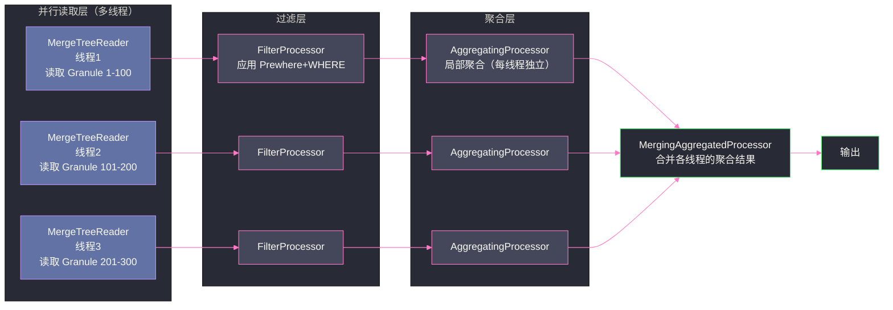

# 04 查询执行引擎——向量化与 Pipeline

## 摘要

ClickHouse 的查询执行引擎是其极致性能的另一半来源——物理存储层（列式布局、压缩）减少了 IO 量，执行引擎层（向量化 + Pipeline）则充分利用了读取到的数据。本文详解 ClickHouse 从 SQL 解析到结果返回的完整执行链路：查询解析与优化、Prewhere 优化如何提前过滤数据减少解压量、Pipeline 执行模型如何将计算并行化、以及向量化函数计算的核心原理。理解执行引擎，是优化复杂查询性能的理论基础。

---

## 第 1 章 查询执行的完整链路

### 1.1 从 SQL 到结果的五个阶段

```
SQL 字符串
    ↓ 词法分析 + 语法分析
AST（抽象语法树）
    ↓ 语义分析（列名解析、类型检查）
带类型的 AST
    ↓ 查询优化（谓词下推、常量折叠、Prewhere 提取）
优化后的查询计划（LogicalPlan）
    ↓ 物理计划生成（选择执行算法、并行度决策）
QueryPipeline（可执行的 Pipeline 图）
    ↓ 多线程执行
最终结果
```

每个阶段都有对性能关键的优化发生，理解各阶段的工作，才能针对性地进行查询调优。

### 1.2 查询优化：SQL → 逻辑计划的关键变换

ClickHouse 的查询优化器（Query Optimizer）相比 Spark 的 Catalyst 或 Trino 的 CBO 优化器要简单得多——它主要依赖**基于规则（Rule-Based）的启发式优化**，而不是完整的代价模型（CBO）。

主要的优化规则：

**谓词下推（Predicate Pushdown）**：将 WHERE 条件尽量下推到数据读取层。对于 MergeTree 表，WHERE 条件中的主键范围过滤（如 `date BETWEEN ...`）会被转化为 Part/Granule 剪枝，减少实际读取的数据量。

**常量折叠（Constant Folding）**：`WHERE date > now() - INTERVAL 7 DAY` 中的 `now() - INTERVAL 7 DAY` 在优化阶段就计算出具体值，后续直接用常量比较。

**子查询提升（Subquery Lifting）**：IN 子查询 `WHERE user_id IN (SELECT user_id FROM ...)` 在某些情况下会被提升为 JOIN 操作（效率更高）。

**列裁剪（Column Pruning）**：只读取 SELECT、WHERE、JOIN、GROUP BY 中实际用到的列，未引用的列一律不读取（这是列存储的基础优化，ClickHouse 自动完成）。

---

## 第 2 章 Prewhere——提前过滤，减少解压量

### 2.1 WHERE 的问题：解压了不需要的行

在 [[02 MergeTree 引擎家族——主键索引与数据排序]] 中已经介绍，稀疏索引帮助定位 Granule 范围，但在范围内的 Granule 中，仍然有部分行不满足 WHERE 条件（稀疏索引精度是 Granule 粒度，8192 行里可能只有几百行真正满足条件）。

普通 WHERE 执行流程：
1. 读取需要的所有列（包括过滤列和 SELECT 列）
2. 解压所有列的数据
3. 对每行应用 WHERE 条件过滤
4. 返回满足条件的行

如果一个 Granule 里只有 5% 的行满足条件，却解压了 100% 的列数据，这 95% 的解压工作完全是浪费。

### 2.2 Prewhere 的工作原理

**Prewhere** 是 ClickHouse 特有的优化：将 WHERE 条件拆分成两个阶段：

**Prewhere 阶段**：只读取 Prewhere 列（通常是过滤性最强的条件列），解压并检查每行是否满足条件，生成一个**行位图（Row Bitmask）**，标记哪些行需要保留。

**WHERE 阶段**：根据 Prewhere 阶段生成的位图，只读取和解压满足条件的行对应的其他列数据，跳过不满足条件的行。

```sql
-- 示例：1 亿行表，只有 1% 满足 user_id = 12345
SELECT date, amount, event_type
FROM events
PREWHERE user_id = 12345   -- 第一阶段：只读 user_id 列，生成位图（1% 行满足）
WHERE date >= '2024-01-01' -- 第二阶段：只对满足 Prewhere 的行读取 date/amount/event_type
```

Prewhere 的好处：对于 `date`、`amount`、`event_type` 列，**只需要解压 1% 的行数据**（而不是全部 8192 行），IO 和 CPU 开销大幅下降。

### 2.3 自动 Prewhere 优化

大多数情况下，不需要手动写 `PREWHERE`——ClickHouse 的优化器会自动将 WHERE 条件中**选择性最高**（过滤后保留比例最低）的简单条件提取为 Prewhere 条件。

决策规则（`optimize_move_to_prewhere` 设置控制）：
- 只有读取单列（不涉及多列计算）的简单过滤条件才能提升为 Prewhere
- 通过 `system.columns` 中的列统计信息估算选择性（选择性越低越适合 Prewhere）
- 如果没有统计信息，默认使用列的数据类型大小（小类型如 UInt32 优先 Prewhere，大类型如 String 优先 WHERE）

```sql
-- 查看查询是否使用了 Prewhere（EXPLAIN 中查看）
EXPLAIN SELECT * FROM events WHERE user_id = 12345 AND date >= '2024-01-01';
-- 输出中会显示 Prewhere 和 WHERE 的拆分结果
```

> [!warning] 生产避坑：Prewhere 列必须在 MergeTree 中存在
> Prewhere 只对 MergeTree 系列引擎有效，对于 Distributed 表，Prewhere 在每个 Shard 的本地 MergeTree 上执行。如果表引擎不是 MergeTree 系列（如 Memory、Log 等），Prewhere 退化为普通 WHERE，不会产生额外的性能提升，但也不会有额外开销。

---

## 第 3 章 Pipeline 执行模型——多线程并行的基础

### 3.1 从 Volcano 模型到 Pipeline 模型

传统数据库使用 **Volcano（火山）模型**：每个算子（Scan、Filter、Aggregate）实现一个 `next()` 方法，上层算子调用下层算子的 `next()` 获取一行数据，逐行处理。这种模型简单易懂，但：
- 每次 `next()` 调用有函数调用开销
- 无法利用批量 SIMD 计算
- 难以实现多线程并行（上下游算子之间是同步调用）

**Pipeline 模型**：将查询计划分解为一系列 **Processor（处理器）**，每个 Processor 有输入端口和输出端口，Processor 之间通过**数据管道（Pipe）**连接。每个 Processor 每次处理一个 **Chunk**（包含 8192 行的列式数据块，即一个 Granule 大小）。



Pipeline 模型的优势：

**并行**：多个读取 Processor 并行扫描不同的 Granule 范围，互不阻塞。

**流水线**：Processor 之间异步推送数据，读取 Processor 在生产数据的同时，过滤 Processor 在消费数据，CPU 利用率更高。

**批量处理**：每个 Processor 处理 8192 行的 Chunk，计算函数可以用 SIMD 批量处理，发挥向量化优势。

### 3.2 聚合的两阶段执行

GROUP BY 等聚合操作在 Pipeline 中分为两阶段：

**局部聚合（Local Aggregation）**：每个线程独立维护一个局部 HashTable，对自己处理的 Chunk 做聚合。不同线程的聚合互不干扰。

**全局合并（Global Merge）**：所有线程的局部 HashTable 被合并到一个全局结果中，处理跨线程的 Group Key 合并。

```
SELECT region, SUM(amount), COUNT(*)
FROM events
GROUP BY region

执行：
  线程1：扫描 Granule 1-100，局部 HashTable: {Beijing: 500k, Shanghai: 300k}
  线程2：扫描 Granule 101-200，局部 HashTable: {Beijing: 600k, Guangzhou: 200k}
  合并：{Beijing: 1100k, Shanghai: 300k, Guangzhou: 200k}
```

这种两阶段聚合的 Shuffle 只发生在线程间（内存 Shuffle，比 Trino 的网络 Shuffle 快得多），是 ClickHouse 在单机多核场景下聚合性能极高的原因。

### 3.3 向量化函数的实现

ClickHouse 的所有内置函数（数学函数、字符串函数、日期函数）都有向量化实现——接受一个 Column（8192 个值的数组）作为输入，返回一个 Column 作为输出，内部使用 SIMD 批量计算。

以 `plus(a, b)` 函数（两列相加）为例：

```cpp
// ClickHouse 内部的向量化加法（伪代码）
void addVectors(const Float64* a, const Float64* b, Float64* result, size_t n) {
    // 编译器自动向量化，或使用 AVX intrinsics
    for (size_t i = 0; i < n; i += 4) {
        // 一次处理 4 个 double（AVX2：256-bit / 64-bit = 4个）
        __m256d va = _mm256_loadu_pd(a + i);
        __m256d vb = _mm256_loadu_pd(b + i);
        __m256d vc = _mm256_add_pd(va, vb);
        _mm256_storeu_pd(result + i, vc);
    }
}
```

对于用户自定义的表达式（如 `amount * 1.1 + tax`），ClickHouse 会将其编译成 **JIT 代码**（LLVM JIT，Ceph Pacific+ 默认启用）——在运行时将 SQL 表达式编译为机器码，避免虚函数调用开销，进一步提升 10-20% 的计算性能。

---

## 第 4 章 并发查询的挑战

### 4.1 ClickHouse 的多核消耗模型

ClickHouse 的高性能查询是以**高 CPU 和内存消耗**为代价的。一个复杂的聚合查询可能：
- 启动 16-32 个线程（等于 CPU 核心数）
- 每个线程维护独立的 HashTable（聚合 GROUP BY 的哈希表）
- 总内存消耗 = 线程数 × HashTable 大小（GROUP BY 基数高时，HashTable 可能达到数 GB）

这意味着：当多个查询同时执行时，CPU 和内存竞争会导致所有查询都变慢。

### 4.2 通过用户配置文件（User Profile）限制资源

ClickHouse 提供细粒度的每用户资源限制，防止单个查询耗尽所有资源：

```xml
<!-- users.xml 或 SQL 定义 -->
<profiles>
    <analytics>
        <max_threads>8</max_threads>              <!-- 最多使用 8 个线程 -->
        <max_memory_usage>10737418240</max_memory_usage>  <!-- 10GB 内存限制 -->
        <max_execution_time>30</max_execution_time>       <!-- 30 秒超时 -->
        <max_result_rows>1000000</max_result_rows>        <!-- 结果行数上限 -->
    </analytics>
    <reports>
        <max_threads>4</max_threads>
        <max_memory_usage>5368709120</max_memory_usage>   <!-- 5GB -->
    </reports>
</profiles>
```

通过将不同类型的用户（分析师/报表用户/监控 Grafana）分配到不同的 Profile，实现查询资源隔离，防止某个大查询影响其他查询的响应时间。

---

## 第 5 章 查询分析工具

### 5.1 EXPLAIN 分析执行计划

```sql
-- 查看逻辑执行计划
EXPLAIN SELECT region, sum(amount) FROM events WHERE date > '2024-01-01' GROUP BY region;

-- 查看 Pipeline 执行图（更详细）
EXPLAIN PIPELINE SELECT region, sum(amount) FROM events WHERE date > '2024-01-01' GROUP BY region;

-- 查看数据读取估算（行数、字节数、Granule 数）
EXPLAIN ESTIMATE SELECT region, sum(amount) FROM events WHERE date > '2024-01-01' GROUP BY region;
```

`EXPLAIN ESTIMATE` 是日常优化最常用的工具——它显示：
- `rows`：预计读取的行数（基于稀疏索引剪枝后的估算）
- `marks`：预计读取的 Granule 数
- `bytes`：预计读取的字节数（压缩后）

如果估算的行数远大于期望（如明明只查一天数据却要扫描全表），说明索引未被利用，需要检查主键设计。

### 5.2 system.query_log——历史查询分析

```sql
-- 查看最近耗时最长的 10 个查询
SELECT
    query_start_time,
    query_duration_ms,
    read_rows,
    read_bytes,
    memory_usage,
    query
FROM system.query_log
WHERE type = 'QueryFinish'
    AND query_start_time >= now() - INTERVAL 1 HOUR
ORDER BY query_duration_ms DESC
LIMIT 10;
```

`system.query_log` 是 ClickHouse 最重要的监控表，记录每个查询的：
- 执行时间（`query_duration_ms`）
- 读取行数/字节数（评估索引剪枝效果）
- 内存消耗（`memory_usage`）
- 使用的线程数

---

## 第 6 章 小结

ClickHouse 查询执行引擎的性能来自多个层次的协同优化：

1. **Prewhere 过滤**：提前用低代价列过滤，减少解压量，核心 IO 减少可达 90%+
2. **Pipeline 并行**：多线程并行扫描 Granule，CPU 多核充分利用
3. **向量化计算**：8192 行的 Chunk 批量计算，SIMD 指令并行，函数计算吞吐是标量的 4-8 倍
4. **JIT 编译**：SQL 表达式运行时编译为机器码，消除虚函数调用开销

理解这四个层次，能帮助工程师在查询优化时做出正确决策——例如，当 Prewhere 没有触发时（WHERE 条件涉及多列计算），或者 GROUP BY 基数过高导致 HashTable 内存溢出时，该如何调整查询写法或表结构。

---

**延伸阅读**：
- [[01 ClickHouse 全局架构——列式存储与 MPP 执行引擎]]
- [[02 MergeTree 引擎家族——主键索引与数据排序]]
- [[06 ClickHouse 性能调优——表设计、查询优化与资源管理]]

---

> [!note] 思考题
> 1. 物化视图（Materialized View）在数据写入时自动触发聚合计算并存储结果。例如 `CREATE MATERIALIZED VIEW hourly_stats ... SELECT toStartOfHour(timestamp), count(), sum(amount) FROM events GROUP BY toStartOfHour(timestamp)`。查询小时级聚合直接读物化视图而非原始表——性能提升数十倍。但物化视图的维护有什么代价？如果原始数据需要修改（如迟到数据补写），物化视图如何更新？
> 2. `EXPLAIN PIPELINE` 显示了 ClickHouse 查询的执行计划和并行度。`max_threads`（默认等于 CPU 核数）控制单个查询的并行线程数。在一个 64 核的服务器上，如果有 10 个并发查询各使用 64 线程，CPU 会被严重过载。你如何设置 `max_threads` 和 `max_concurrent_queries` 来平衡单查询性能和并发能力？
> 3. ClickHouse 的 `LowCardinality` 数据类型对低基数列（如 country、status）使用字典编码——用整数索引替代重复字符串。这可以将存储大小减少 10 倍以上，同时加速过滤和 GROUP BY。但对高基数列（如 UUID）使用 `LowCardinality` 反而增加开销——字典大小超过内存缓存时性能退化。如何判断一个列是否适合 `LowCardinality`？
