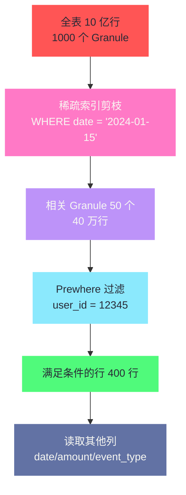
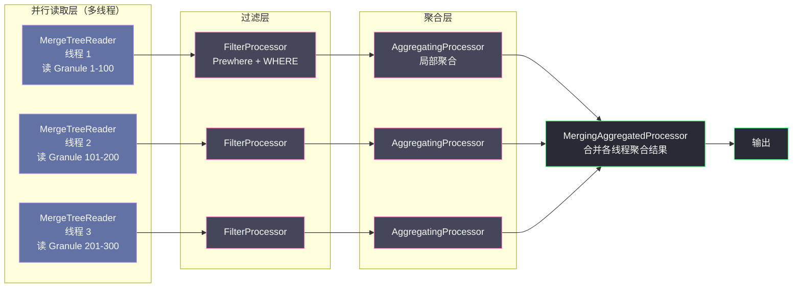

# 04 查询执行引擎——向量化与 Pipeline

**摘要：**
ClickHouse 的查询性能来自存储层与执行层的协同——第 01-03 篇讲了存储层如何减少 IO 量（列存、压缩、稀疏索引、Part 合并），本文转向执行层，剖析从 SQL 文本到结果返回的完整链路：查询解析与基于规则的优化、Prewhere 如何用"先过滤再读列"的策略把解压量减少 90% 以上、Pipeline 执行模型如何用 Processor + Chunk 的推拉结合替代 Volcano 火山模型的逐行调用、向量化函数如何用 SIMD 指令批量计算、JIT 编译如何消除表达式求值的虚函数开销。理解执行引擎的这四个层次，是优化复杂查询性能的理论基础——也是看懂 `EXPLAIN` 输出和 `system.query_log` 指标的前提。

---

## 第 1 章 查询执行的完整链路

### 1.1 从 SQL 到结果的五个阶段

一条 SQL 从提交到返回结果，在 ClickHouse 内部经历五个阶段：

```
SQL 字符串
    ↓ 词法分析 + 语法分析
AST（抽象语法树）
    ↓ 语义分析（列名解析、类型检查）
带类型的 AST
    ↓ 查询优化（谓词下推、常量折叠、Prewhere 提取）
优化后的查询计划（LogicalPlan）
    ↓ 物理计划生成（选择执行算法、并行度决策）
QueryPipeline（可执行的 Pipeline 图）
    ↓ 多线程执行
最终结果
```

每个阶段都有对性能关键的优化发生，理解各阶段的工作，才能针对性地进行查询调优。

**词法与语法分析**——ClickHouse 用手写的递归下降解析器（而非 yacc/lex 生成的解析器）把 SQL 字符串解析成 AST。手写解析器的好处是错误信息更友好、解析速度更快——ClickHouse 的 SQL 解析通常在毫秒级完成，不构成查询延迟的显著部分。

手写解析器还有一个好处——**支持 ClickHouse 的 SQL 方言扩展**。ClickHouse 的 SQL 不是标准 SQL——它有很多专有语法（譬如 `ARRAY JOIN`、`groupUniqArray`、`dictGet`、`PREWHERE`）。如果用标准 SQL 解析器（譬如 ANSI SQL 的 yacc 语法），这些扩展很难加；手写解析器让 ClickHouse 能灵活扩展语法。**手写解析器是"灵活性优先于标准性"的选择**——ClickHouse 选择了"自己的 SQL 方言 + 手写解析器"，而非"标准 SQL + 生成器解析器"。这让 ClickHouse 的 SQL 与 MySQL/PostgreSQL 有不少差异——迁移时需要注意（第 01 篇的选型误区里提到过）。

**语义分析**——解析列名（把 `SELECT amount` 解析成 `SELECT events.amount`）、检查类型（`WHERE amount > 'abc'` 报类型错误）、展开别名和星号。这一步会校验"查询涉及的列是否存在"——如果列名拼错，在这一步报错而非执行时才发现。

语义分析还有一个与性能相关的优化——**常量表达式预计算**。譬如 `WHERE amount > 100 * 1.1`，语义分析阶段就把 `100 * 1.1` 算成 `110`，后续执行时直接用 `110` 比较——不需要每行都算一次乘法。这与后面讲的"常量折叠"是同一个思路，只是发生在语义分析阶段（更早）而非优化阶段。

**查询优化**——这是对性能最关键的一步，下一节详细展开。

**物理计划生成**——把逻辑计划转成可执行的 Pipeline 图，决定每个算子的执行算法（Hash Aggregation vs Sort Aggregation）、并行度（`max_threads`）、数据流转方式。

物理计划生成有一个关键决策——**聚合算法的选择**。ClickHouse 支持两种聚合算法：

**Hash Aggregation**（默认）——用 HashTable 做 GROUP BY，每个 Group Key 在 HashTable 里有一个条目。适合"GROUP BY 基数中等"的场景——HashTable 在内存里，查找 O(1)。但当 GROUP BY 基数极高（譬如 `GROUP BY user_id`，百万用户），HashTable 可能占满内存——此时需要溢写或切换到 Sort Aggregation。

**Sort Aggregation**——先按 GROUP BY 键排序，再扫描排序后的数据做"相邻相同 Key 聚合"。适合"GROUP BY 基数极高"或"内存不足"的场景——排序可以分块做（外部排序），内存占用可控。但排序的代价是 O(N log N)，比 Hash 的 O(N) 高。

ClickHouse 默认用 Hash Aggregation，只在内存不足时自动切换到 Sort Aggregation（配合溢写）。**这个"自动切换"是 ClickHouse 聚合引擎的鲁棒性保障**——用户不需要手动选算法，ClickHouse 根据运行时内存状况自动调整。

这个"自动切换"的触发点是 `max_bytes_before_external_group_by`——当局部 HashTable 的大小超过这个值时，ClickHouse 开始溢写部分 HashTable 到磁盘。溢写的过程是——把当前 HashTable 按哈希分桶，每个桶写到单独的临时文件；后续读回每个桶重新聚合。这个"分桶 + 临时文件"的机制让溢写的内存占用可控（每次只处理一个桶），但代价是磁盘 IO——读回桶文件需要随机读，比内存聚合慢几个数量级。**溢写是"兜底机制"——正常不触发，触发就意味着查询已经慢了**。生产中应该通过"预聚合"或"限制 GROUP BY 基数"来避免溢写，而不是依赖溢写兜底。

**多线程执行**——Pipeline 执行器调度多个 Processor 并行处理 Chunk，最终合并结果返回给客户端。

### 1.2 查询优化：基于规则的启发式变换

ClickHouse 的查询优化器相比 Spark 的 Catalyst 或 Trino 的 CBO 优化器要简单得多——它主要依赖**基于规则（Rule-Based）的启发式优化**，而不是完整的代价模型（CBO）。这个选择有其历史原因——ClickHouse 的目标场景是"单表聚合"，单表聚合的查询计划相对简单，规则优化已经能覆盖大部分优化点；而完整的 CBO 需要维护统计信息（列的 NDV、直方图、数据分布），对写入频繁的 ClickHouse 来说，统计信息的维护成本不低。**ClickHouse 选择了"简单但够用"的规则优化，而非"复杂但精确"的 CBO**——这是它在"查询优化复杂度"与"写入性能"之间的取舍。

这个取舍的深层逻辑值得展开。CBO 需要统计信息——列的 NDV（不同值的数量）、数据分布直方图、列间相关性。这些统计信息在写入时需要维护——每次 INSERT 后更新统计，或者定期采样重建。对 ClickHouse 的写入吞吐（每秒千万行），"每次 INSERT 后更新统计"的开销不可接受；"定期采样重建"又会让统计信息滞后（最近写入的数据没有统计）。**ClickHouse 的"批量写入 + 异步 Merge"模型与"实时统计维护"天然冲突**——这是它选择规则优化而非 CBO 的技术原因。

但这不意味着 ClickHouse 完全不做统计——`system.columns` 表里有简单的列统计（譬如 `compression_codec`、`data_compressed_bytes`），优化器用这些粗略信息做 Prewhere 选择。只是这些统计不够精确到支持完整的 CBO——譬如没有 NDV、没有直方图。**ClickHouse 的优化器是"粗略统计 + 规则优化"的混合体**——在统计够用的地方用统计，在统计不够的地方用规则。

主要的优化规则有四条：

**谓词下推（Predicate Pushdown）**——将 WHERE 条件尽量下推到数据读取层。对于 MergeTree 表，WHERE 条件中的主键范围过滤（如 `date BETWEEN '2024-01-01' AND '2024-01-31'`）会被转化为 Part/Granule 剪枝——稀疏索引定位到符合条件的 Granule 范围，只读这些 Granule，不读不相关的数据。**谓词下推是 ClickHouse 查询优化中收益最大的一条规则**——对按主键过滤的查询，剪枝能把扫描量从"全表"降到"一个分区的一个 Granule 范围"。

**常量折叠（Constant Folding）**——`WHERE date > now() - INTERVAL 7 DAY` 中的 `now() - INTERVAL 7 DAY` 在优化阶段就计算出具体值（譬如 `2024-02-25 00:00:00`），后续直接用常量比较。这避免了"每行都计算一次 `now() - INTERVAL 7 DAY`"的开销——常量折叠把"每行一次的计算"变成"查询一次的计算"。

**子查询提升（Subquery Lifting）**——`IN` 子查询 `WHERE user_id IN (SELECT user_id FROM vip_users)` 在某些情况下会被提升为 JOIN 操作（效率更高）。ClickHouse 的 `IN` 子查询有两种执行方式——"物化子查询结果到内存 Set"和"提升为 JOIN"，优化器根据子查询结果集大小选择——结果集小用 Set（内存查找快），结果集大用 JOIN（避免 Set 内存爆炸）。

**列裁剪（Column Pruning）**——只读取 SELECT、WHERE、JOIN、GROUP BY 中实际用到的列，未引用的列一律不读取。这是列存储的基础优化，ClickHouse 自动完成——`SELECT sum(amount) FROM events WHERE date > '2024-01-01'` 只读 `amount` 和 `date` 两列，不读其他 98 列。**列裁剪是列存储相对于行存储的核心优势在第 01 篇讲过——这里看到它在查询优化阶段的具体落地**。

列裁剪的收益可以用一个简单计算来感受——一张 100 列的宽表，查询 `SELECT sum(amount) FROM events WHERE date > '2024-01-01'` 只涉及 `amount` 和 `date` 两列。列裁剪让 ClickHouse 只读这两列的 `.bin` 文件，不读其他 98 列的文件——IO 量减少 98%。如果没用列裁剪（譬如行存储），这 98% 的 IO 是必须付出的——这就是列存储"只读需要的列"在查询优化阶段的体现。

### 1.4 优化器的演进与未来

ClickHouse 的规则优化器在近年来有一个重要的演进方向——**引入 CBO（Cost-Based Optimizer）的元素**。从 23.x 版本开始，ClickHouse 逐步引入了基于统计信息的优化——譬如 `ANALYZE TABLE` 命令可以收集列的 NDV 和数据分布，优化器在 Prewhere 选择和 JOIN 顺序时参考这些统计信息。这个演进的方向是"从纯规则优化走向规则 + 代价混合优化"——但截至 2024 年，CBO 的覆盖仍然有限，大多数优化仍然是规则驱动的。

这个演进的方向与 ClickHouse 的定位变化有关——早期 ClickHouse 专注"单表聚合"，查询计划简单，规则优化够用；近年来 ClickHouse 开始支持更复杂的查询（多表 JOIN、子查询、窗口函数），查询计划的复杂度上升，规则优化的局限开始显现，CBO 的价值增大。**ClickHouse 的优化器正在"从简单到复杂"演进——这是它从"专用 OLAP"向"通用 OLAP"扩展的必然要求**。但这个演进是渐进的——不会一夜之间变成完整的 CBO，而是在规则优化的基础上逐步叠加代价估算。

对用户来说，这意味着**短期内仍然需要人工优化查询**——不能完全依赖优化器。理解执行引擎的工作原理（Prewhere、Pipeline、向量化、JIT），仍然是写出高效 SQL 的前提。

这个"人工优化"的要求是 ClickHouse 与 MySQL/PostgreSQL 的一个重要差异——后两者的优化器更成熟，大多数查询不需要人工调优；ClickHouse 的优化器较简单，复杂查询需要人工介入。**这是 ClickHouse"高性能但高门槛"的体现**——它把性能潜力交给了用户，但也把优化的责任交给了用户。团队在引入 ClickHouse 时，需要培训工程师理解执行引擎——否则"用 MySQL 的思维用 ClickHouse"，性能可能反而更差。

### 1.3 优化器的局限与手动调优

ClickHouse 的规则优化器有一个重要局限——**不做 JOIN 重排**。如果查询 `A JOIN B JOIN C`，ClickHouse 按 SQL 书写顺序执行 JOIN，不会自动重排成更优的顺序（譬如 `B JOIN A JOIN C`）。这意味着 SQL 编写者需要自己注意 JOIN 顺序——把小表放前面、大表放后面，让 ClickHouse 的"右表广播"策略更高效。

另一个局限——**不做 CBO 代价估算**。ClickHouse 不维护列的 NDV（Number of Distinct Values）和直方图，无法精确估算"某个过滤条件的选择性"——它只能用"列的数据类型大小"做粗略估算（小类型列优先 Prewhere）。这导致 Prewhere 的自动选择不一定最优——有时需要手动指定 `PREWHERE` 来覆盖优化器的选择。

这些局限意味着 ClickHouse 的查询优化仍然需要人工介入——SQL 写法、JOIN 顺序、Prewhere 选择、主键设计，都需要工程师理解执行引擎的工作原理。**ClickHouse 的"自动优化"比 MySQL 强（列裁剪、谓词下推是自动的），但比 Trino/Spark 弱（没有 CBO、没有 JOIN 重排）**——它把优化的责任部分交给了用户。这是"简单优化器"的代价——用户需要更懂执行引擎才能写出高效的 SQL。

---

## 第 2 章 Prewhere——提前过滤，减少解压量

### 2.1 WHERE 的问题：解压了不需要的行

在 [[02 MergeTree 引擎家族——主键索引与数据排序]] 中已经介绍，稀疏索引帮助定位 Granule 范围，但在范围内的 Granule 中，仍然有部分行不满足 WHERE 条件——稀疏索引精度是 Granule 粒度，8192 行里可能只有几百行真正满足条件。

普通 WHERE 的执行流程是：

1. 读取需要的所有列（包括过滤列和 SELECT 列）
2. 解压所有列的数据
3. 对每行应用 WHERE 条件过滤
4. 返回满足条件的行

如果一个 Granule 里只有 5% 的行满足条件，却解压了 100% 的列数据——这 95% 的解压工作完全是浪费。对于宽表（100 列），如果查询 `SELECT col1, col2 FROM events WHERE user_id = 12345`，普通 WHERE 要解压 `user_id`、`col1`、`col2` 三列的 8192 行——但只有 5% 的行（约 400 行）的 `col1`、`col2` 是有用的，其余 95% 的 `col1`、`col2` 解压了又被丢弃。

### 2.2 Prewhere 的两阶段过滤

**Prewhere** 是 ClickHouse 特有的优化——将 WHERE 条件拆分成两个阶段：

**Prewhere 阶段**——只读取 Prewhere 列（通常是过滤性最强的条件列），解压并检查每行是否满足条件，生成一个**行位图（Row Bitmask）**，标记哪些行需要保留。

**WHERE 阶段**——根据 Prewhere 阶段生成的位图，只读取和解压满足条件的行对应的其他列数据，跳过不满足条件的行。

```sql
-- 示例：1 亿行表，只有 1% 满足 user_id = 12345
SELECT date, amount, event_type
FROM events
PREWHERE user_id = 12345   -- 第一阶段：只读 user_id 列，生成位图（1% 行满足）
WHERE date >= '2024-01-01' -- 第二阶段：只对满足 Prewhere 的行读取 date/amount/event_type
```

Prewhere 的收益可以用一个数字来量化——对于上面的查询，`date`、`amount`、`event_type` 三列，**只需要解压 1% 的行数据**（而不是全部 8192 行），IO 和 CPU 开销下降 99%。这是 Prewhere 对宽表查询的巨大价值——宽表的列多，Prewhere 节省的解压量按"列数 × 行数"放大。

### 2.3 Prewhere 的自动选择

大多数情况下不需要手动写 `PREWHERE`——ClickHouse 的优化器会自动将 WHERE 条件中**选择性最高**（过滤后保留比例最低）的简单条件提取为 Prewhere 条件。决策规则由 `optimize_move_to_prewhere` 设置控制：

- 只有读取单列（不涉及多列计算）的简单过滤条件才能提升为 Prewhere——`WHERE user_id = 12345` 可以，`WHERE user_id + 1 = 12346` 不行（涉及计算）
- 通过 `system.columns` 中的列统计信息估算选择性——选择性越低（过滤掉的行越多）越适合 Prewhere
- 如果没有统计信息，默认使用列的数据类型大小——小类型（UInt32）优先 Prewhere，大类型（String）优先 WHERE

```sql
-- 查看查询是否使用了 Prewhere
EXPLAIN SELECT * FROM events WHERE user_id = 12345 AND date >= '2024-01-01';
-- 输出中会显示 Prewhere 和 WHERE 的拆分结果
```

自动 Prewhere 的选择有一个常见的不优场景——**当 WHERE 有多个条件时，优化器可能选错"哪个条件做 Prewhere"**。譬如 `WHERE user_id = 12345 AND date >= '2024-01-01'`，如果 `user_id` 的选择性是 1%（100 万用户里选 1 个），`date` 的选择性是 10%（100 天里选 10 天），优化器会选 `user_id` 做 Prewhere——这是对的。但如果 `user_id` 的选择性是 50%（譬如只有 2 个用户），`date` 的选择性是 1%，优化器可能仍然选 `user_id`（因为没有精确的 NDV 统计）——这就选错了。**手动 PREWHERE 可以覆盖优化器的选择**——`PREWHERE date >= '2024-01-01' WHERE user_id = 12345` 强制 `date` 做 Prewhere。

手动 PREWHERE 的使用有一个经验法则——**"过滤性最强的条件做 Prewhere"**。怎么判断"过滤性最强"？看 `EXPLAIN ESTIMATE` 的 `rows` 估算——分别用单个条件查询，看哪个条件的 `rows` 最小，那个条件就是过滤性最强的。譬 `WHERE user_id = 12345` 估算 100 万行，`WHERE date >= '2024-01-01'` 估算 5000 万行——`user_id` 的过滤性更强（保留的行更少），应该做 Prewhere。如果优化器自动选了 `date`（因为没统计信息），手动改成 `PREWHERE user_id = 12345` 能大幅提升性能。

手动 PREWHERE 还有一个进阶用法——**多列 Prewhere**。ClickHouse 支持在 PREWHERE 里放多个条件（`PREWHERE user_id = 12345 AND status = 'active'`），让多个过滤条件一起生成位图。但多列 Prewhere 的收益取决于"这些列的联合选择性"——如果两个条件高度相关（譬如 `user_id` 已经筛选到 100 行，`status` 在这 100 行里再筛掉 10 行），多列 Prewhere 的额外收益有限；如果两个条件独立（`user_id` 筛 1%，`status` 筛 10%，联合筛 0.1%），多列 Prewhere 的收益显著。**多列 Prewhere 适合"多个独立高选择性条件"的场景**——这是宽表多维分析的常见模式。

Prewhere 还有一个与压缩相关的细节——**Prewhere 列的压缩方式影响 Prewhere 的代价**。如果 Prewhere 列用了高压缩比编码（譬如 `user_id` 用了 Delta 编码），解压代价高，Prewhere 的"先解压过滤列"这一步本身就消耗 CPU。反之，如果 Prewhere 列是低压缩比（譬如 `user_id` 用了 LZ4 但值很随机，压缩比接近 1:1），解压代价低，Prewhere 更划算。**Prewhere 的净收益 = "节省的非 Prewhere 列解压量" - "Prewhere 列的解压代价"**——只有净收益为正时 Prewhere 才值得。对"Prewhere 列压缩比高 + 非 Prewhere 列少"的查询，Prewhere 可能反而更慢——这种情况下应该关闭 Prewhere（`SET optimize_move_to_prewhere = 0`）。

> [!warning] 生产避坑：Prewhere 的适用条件
> Prewhere 只对 MergeTree 系列引擎有效——对于 Distributed 表，Prewhere 在每个 Shard 的本地 MergeTree 上执行。如果表引擎不是 MergeTree 系列（如 Memory、Log 等），Prewhere 退化为普通 WHERE，不会产生额外的性能提升，但也不会有额外开销。
>
> Prewhere 的收益取决于"Prewhere 列的过滤性"——如果 Prewhere 列的过滤性弱（譬如 `WHERE status = 'active'`，90% 的行都是 active），Prewhere 几乎没有收益（只省了 10% 的解压）。**Prewhere 适合"高选择性过滤"——过滤后保留的行越少，Prewhere 的收益越大**。

Prewhere 的收益量化有一个经验公式——**收益 ≈ (1 - Prewhere 选择性) × 非 Prewhere 列数 / 总列数**。譬如 `user_id` 选择性 1%（保留 1% 行），宽表 50 列中 Prewhere 只读 1 列（`user_id`），其余 49 列只解压 1% 的行——收益 ≈ (1 - 0.01) × 49 / 50 ≈ 97%。这意味着 97% 的非 Prewhere 列解压工作被节省了。如果 Prewhere 选择性 50%（保留一半行），收益 ≈ (1 - 0.5) × 49 / 50 ≈ 49%——仍然有收益，但小得多。**Prewhere 的收益与"过滤性"和"宽表程度"正相关**——宽表 + 高选择性过滤是 Prewhere 的最佳场景。

### 2.4 Prewhere 与索引剪枝的关系

Prewhere 和稀疏索引剪枝是两个不同层次的过滤，容易混淆——这里厘清它们的关系：

**稀疏索引剪枝**——在"Granule 粒度"上过滤，跳过不相关的 Granule。譬如 `WHERE date = '2024-01-15'`，稀疏索引定位到 `date=2024-01-15` 的 Granule 范围，只读这些 Granule，不读其他 Granule。剪枝的精度是"8192 行的 Granule"——一个 Granule 要么全读、要么全不读。

**Prewhere**——在"行粒度"上过滤，在剪枝后的 Granule 内部进一步跳过不满足条件的行。譬如 `WHERE user_id = 12345`（`user_id` 不在主键里，稀疏索引帮不上忙），Prewhere 读 `user_id` 列生成位图，只对满足条件的行读其他列。过滤的精度是"单行"——每一行都可以单独保留或跳过。

**两者的关系是"粗过滤 + 细过滤"**——稀疏索引剪枝先跳过不相关的 Granule（粗），Prewhere 再在相关 Granule 内跳过不相关的行（细）。两者叠加，让 ClickHouse 的查询只读取"真正需要的行"——从"全表"到"相关 Granule"到"相关行"，层层递进。

这两层过滤还有一个协同效应值得点出——**Prewhere 的成本受稀疏索引剪枝影响**。如果稀疏索引剪枝已经把范围缩到很小（譬如只读 10 个 Granule），Prewhere 只需在这 10 个 Granule 上做行级过滤——成本很低。如果稀疏索引没剪枝（譬如 WHERE 条件不命中主键，全表扫），Prewhere 要在所有 Granule 上做行级过滤——成本很高（虽然仍然比普通 WHERE 省非 Prewhere 列的解压，但 Prewhere 列的解压是全量的）。**Prewhere 与稀疏索引是"互相成就"的关系——索引剪枝让 Prewhere 的范围更小，Prewhere 让索引剪枝后的行级过滤更高效**。这也是为什么"主键设计 + Prewhere 选择"是 ClickHouse 查询优化的两大核心——两者协同才能达到最优。



---

## 第 3 章 Pipeline 执行模型——多线程并行的基础

### 3.1 从 Volcano 模型到 Pipeline 模型

第 01 篇已经讲过 Volcano 火山模型的局限——逐行处理、函数调用开销大、无法利用 SIMD。ClickHouse 的 Pipeline 模型是对火山模型的彻底重构——把"逐行拉"变成"批量推拉结合"。

传统数据库使用 **Volcano（火山）模型**——每个算子（Scan、Filter、Aggregate）实现一个 `next()` 方法，上层算子调用下层算子的 `next()` 获取一行数据，逐行处理。这种模型简单易懂，但每次 `next()` 调用有函数调用开销、无法利用批量 SIMD 计算、难以实现多线程并行（上下游算子之间是同步调用）。

**Pipeline 模型**——将查询计划分解为一系列 **Processor（处理器）**，每个 Processor 有输入端口和输出端口，Processor 之间通过**数据管道（Pipe）**连接。每个 Processor 每次处理一个 **Chunk**（包含 8192 行的列式数据块，即一个 Granule 大小）。



Pipeline 模型的三个核心优势：

**并行**——多个读取 Processor 并行扫描不同的 Granule 范围，互不阻塞。每个 Processor 是独立的线程，各自处理各自的 Chunk，无需全局锁。

**流水线**——Processor 之间异步推送数据。读取 Processor 在生产数据的同时，过滤 Processor 在消费数据——上下游可以同时工作，CPU 利用率更高。这就像工厂的流水线——上游工序和下游工序同时进行，不需要"上游做完所有产品，下游才开始"。

**批量处理**——每个 Processor 处理 8192 行的 Chunk，计算函数可以用 SIMD 批量处理，发挥向量化优势。这是 Pipeline 模型与向量化的天然契合——Chunk 的大小等于 Granule 的大小，从磁盘读到的数据直接就是一个 Chunk，无需切分或拼装。

Pipeline 模型与 Volcano 模型的对比可以用一个工厂比喻来理解——Volcano 模型像"单件流水线"：每个工人（算子）每次取一个零件（一行），加工后传给下一个工人，下一个工人再取一个加工——每次传递一个零件，工人之间同步等待。Pipeline 模型像"批量流水线"：每个工人（Processor）每次取一箱零件（一个 Chunk，8192 个），批量加工后传给下一个工人——每次传递一箱，工人之间异步推送。**批量流水线的效率远高于单件流水线**——传递次数少（8192 行一次 vs 8192 次）、工人不空等（异步推送 vs 同步等待）、加工可批量优化（SIMD vs 标量）。这就是 ClickHouse 选择 Pipeline 模型而非 Volcano 模型的根本原因。

### 3.2 Pipeline 的调度模型

Pipeline 的调度有一个值得展开的细节——**Processor 的工作状态是动态的**。一个 Processor 可能在"等待输入"（上游还没生产出 Chunk）、"工作中"（正在处理 Chunk）、"等待输出"（下游还没消费完上一个 Chunk）三种状态间切换。Pipeline 执行器（Executor）负责调度——它维护一个就绪队列，把"有输入且输出端口空闲"的 Processor 放入队列，由线程池取出执行。

这个调度模型有一个关键特性——**背压（Backpressure）**。如果下游 Processor 消费慢（譬如聚合的 HashTable 满了要做溢写），上游 Processor 的输出端口会被占满，上游进入"等待输出"状态，停止读取新数据。这种"下游慢了上游自动减速"的机制防止了"上游疯狂生产、下游消费不动、内存被撑爆"的情况。**背压是 Pipeline 模型对内存安全的保护**——它让数据流速自动匹配最慢的 Processor，而不是让最快的 Processor 把内存填满。

背压机制可以用一个水管比喻来理解——上游是水龙头（读取 Processor），下游是水桶（聚合 Processor），中间的管道是 Pipe。如果水桶满了（下游消费不动），水龙头不能继续放水（上游被背压停止）——否则水会溢出（内存溢出）。背压让"水龙头的水量"自动匹配"水桶的消耗量"，保持系统稳定。**没有背压的系统（譬如纯推模型）会因为"上游生产快、下游消费慢"而内存溢出；没有背压的系统（譬如纯拉模型）会因为"下游等上游"而 CPU 空转**——Pipeline 的推拉结合 + 背压是两者的平衡。

背压机制在 ClickHouse 的一个典型场景是"大表 JOIN 小表"——读取大表的 Processor 生产快，JOIN 的 Processor 要等小表广播完成才能消费，此时背压让大表读取暂停，避免大表数据把内存撑爆。等小表广播完成，JOIN Processor 开始消费，背压解除，大表读取继续。**这种"自动暂停 + 自动恢复"让 Pipeline 在不均匀的算子速度下仍然稳定**——是 Pipeline 模型相比 Volcano 模型的另一个工程优势。

### 3.3 聚合的两阶段执行

GROUP BY 等聚合操作在 Pipeline 中分为两阶段：

**局部聚合（Local Aggregation）**——每个线程独立维护一个局部 HashTable，对自己处理的 Chunk 做聚合。不同线程的聚合互不干扰——线程 1 的 HashTable 里只有线程 1 扫到的行的聚合结果，线程 2 的 HashTable 里只有线程 2 扫到的行的聚合结果。

**全局合并（Global Merge）**——所有线程的局部 HashTable 被合并到一个全局结果中，处理跨线程的 Group Key 合并。譬如线程 1 的 HashTable 里有 `{Beijing: 500k}`，线程 2 的 HashTable 里有 `{Beijing: 600k}`，合并后全局结果是 `{Beijing: 1100k}`。

```
SELECT region, SUM(amount), COUNT(*)
FROM events
GROUP BY region

执行：
  线程1：扫描 Granule 1-100，局部 HashTable: {Beijing: 500k, Shanghai: 300k}
  线程2：扫描 Granule 101-200，局部 HashTable: {Beijing: 600k, Guangzhou: 200k}
  合并：{Beijing: 1100k, Shanghai: 300k, Guangzhou: 200k}
```

这种两阶段聚合的 Shuffle 只发生在线程间（内存 Shuffle，比 Trino 的网络 Shuffle 快得多），是 ClickHouse 在单机多核场景下聚合性能极高的原因。**Trino 的两阶段聚合是"跨节点 Shuffle"，ClickHouse 的两阶段聚合是"跨线程 Shuffle"**——前者走网络，后者走内存，速度差几个数量级。

这个差异是 ClickHouse 与 Trino 在"聚合查询"上性能差距的重要来源。Trino 的两阶段聚合必须走网络——因为数据分布在多个节点上，要合并不同节点的聚合结果，必须通过网络传输。ClickHouse 的两阶段聚合在单机内完成——数据在同一个节点的多个线程间，合并通过共享内存完成，不走网络。**网络的延迟（毫秒级）比内存的延迟（纳秒级）慢百万倍**——这是 ClickHouse 单机聚合比 Trino 分布式聚合快的根本原因。但这个优势只在"单机内存够放 HashTable"时成立——当 GROUP BY 基数太高、单机内存放不下时，ClickHouse 也要溢写到磁盘，优势缩小。

两阶段聚合还有一个优化值得点出——**局部聚合的 HashTable 可以用"两阶段聚合状态"而非"完整聚合值"**。譬如 `count(DISTINCT user_id)`，局部聚合不存所有 `user_id` 的集合（内存爆炸），而是存 HLL 的寄存器数组（固定大小）——合并时把多个 HLL 寄存器数组合并。这让 `count(DISTINCT)` 的内存占用与 GROUP BY 的基数无关，只与 HLL 的精度配置有关。**"聚合状态"而非"聚合值"是 ClickHouse 聚合引擎的核心抽象**——第 02 篇讲的 `sumState`/`sumMerge` 就是这个抽象在 SQL 层的暴露。

两阶段聚合还有一个与内存相关的优化——**溢写（Spill to Disk）**。当局部聚合的 HashTable 太大（超过 `max_memory_usage`）时，ClickHouse 可以把部分 HashTable 溢写到磁盘——把一部分 Group Key 的聚合状态存到临时文件，后续再从磁盘读回来合并。溢写让"大基数的 GROUP BY"不至于因为内存不足而失败——代价是磁盘 IO 的额外开销。**溢写是"用磁盘换内存"的兜底机制**——正常情况下不触发（HashTable 在内存里），只在内存不够时才溢写。开启溢写需要设置 `max_bytes_before_external_group_by`（默认 0 表示不溢写）——对大基数 GROUP BY 的查询，建议设置为 `max_memory_usage` 的 50% 左右。

### 3.4 向量化函数的实现

ClickHouse 的所有内置函数（数学函数、字符串函数、日期函数）都有向量化实现——接受一个 Column（8192 个值的数组）作为输入，返回一个 Column 作为输出，内部使用 SIMD 批量计算。

以 `plus(a, b)` 函数（两列相加）为例：

```cpp
// ClickHouse 内部的向量化加法（伪代码）
void addVectors(const Float64* a, const Float64* b, Float64* result, size_t n) {
    // 编译器自动向量化，或使用 AVX intrinsics
    for (size_t i = 0; i < n; i += 4) {
        // 一次处理 4 个 double（AVX2：256-bit / 64-bit = 4 个）
        __m256d va = _mm256_loadu_pd(a + i);
        __m256d vb = _mm256_loadu_pd(b + i);
        __m256d vc = _mm256_add_pd(va, vb);
        _mm256_storeu_pd(result + i, vc);
    }
}
```

这段代码用 AVX2 的 intrinsic 函数一次处理 4 个 double——8192 个值的循环从 8192 次降到 2048 次。如果用 AVX-512（512-bit），一次处理 8 个 double，循环降到 1024 次。**向量化函数是 ClickHouse CPU 效率的微观基础**——每一个内置函数都经过这样的手工或编译器向量化，累积起来就是数倍的吞吐提升。

向量化函数的实现有一个工程上的挑战——**类型分派（Type Dispatch）**。ClickHouse 的列有几十种类型（UInt8/UInt16/.../String/Array/Map/...），同一个函数（譬如 `plus`）要对每种类型有对应的实现。如果用虚函数分派（vtable），每次调用都有间接寻址开销；如果用模板生成（每个类型编译一份代码），二进制体积膨胀。ClickHouse 选择了"模板生成 + JIT"的混合方案——常用类型组合预编译（模板生成），非常用类型组合用 JIT 在运行时编译。**这个"预编译 + JIT"的混合方案平衡了"启动体积"和"运行性能"**——常用路径快（预编译），非常用路径不膨胀（JIT 按需编译）。

### 3.5 JIT 编译——消除表达式开销

对于用户自定义的表达式（如 `amount * 1.1 + tax`），ClickHouse 会将其编译成 **JIT 代码**（LLVM JIT，从 21.x 版本开始默认启用）——在运行时将 SQL 表达式编译为机器码，避免虚函数调用开销，进一步提升 10-20% 的计算性能。

为什么 JIT 能提升性能？在没有 JIT 时，表达式 `amount * 1.1 + tax` 的执行是"解释执行"——ClickHouse 把它解析成一棵表达式树（`Add(Multiply(amount, 1.1), tax)`），每个节点是一个 `IFunction` 对象，执行时逐节点调用 `execute()` 方法。这种"解释执行"有两个开销：第一，每个节点的 `execute()` 是虚函数调用（通过 vtable 间接寻址）；第二，中间结果要在节点之间传递（`Multiply` 的结果存到一个临时 Column，再传给 `Add`）。

JIT 把整棵表达式树编译成一段直线机器码——`amount * 1.1 + tax` 变成几条 SIMD 指令，没有虚函数调用、没有中间 Column 传递。**JIT 把"解释执行"变成"编译执行"**——对复杂表达式的提升尤其明显（表达式越复杂，JIT 省的虚函数调用越多）。

JIT 的代价是"编译时间"——LLVM JIT 编译一个表达式需要几十到几百毫秒。如果查询本身只跑 1 秒，JIT 编译占 100 毫秒就是 10% 的额外延迟。ClickHouse 的策略是"只对足够复杂的表达式做 JIT"——简单表达式（单列过滤）不 JIT，复杂表达式（多列计算 + 嵌套函数）才 JIT。**JIT 是"用编译时间换执行时间"的优化**——表达式越复杂、查询跑得越久，JIT 的收益越大。

JIT 的启用和调优有几个值得注意的点：

**`compile_aggregate_expressions`**——控制是否对聚合表达式做 JIT（默认 true）。如果聚合表达式很简单（譬如 `sum(amount)`），JIT 的收益有限，编译时间的开销可能不划算——可以关闭。如果聚合表达式复杂（譬如 `sum(amount * price * discount_factor)`），JIT 的收益显著，应该开启。

**`compile_expressions`**——控制是否对普通表达式做 JIT（默认 true）。与上面类似，简单表达式可以关闭，复杂表达式应该开启。

**`min_count_to_compile_aggregate_expression`**——触发 JIT 编译的表达式执行次数阈值（默认 3）。ClickHouse 不会对"只执行一次"的表达式做 JIT——因为编译时间可能超过节省的执行时间。只有表达式被多次执行（譬如在循环里），JIT 才值得。**这个"延迟 JIT"的策略让 JIT 只在"确认能回本"时触发**——避免对一次性查询浪费编译时间。

JIT 还有一个与缓存相关的优化——**编译结果缓存**。ClickHouse 会缓存"表达式 → 编译后机器码"的映射，相同的表达式（譬如多个查询都用 `amount * 1.1`）只编译一次，后续查询直接用缓存的机器码。这个缓存让"频繁执行的相同表达式"的 JIT 编译开销摊薄到几乎为零——第一次编译几百毫秒，后续执行零编译开销。**编译结果缓存是 JIT 在"高频小查询"场景下仍然划算的关键**——没有它，每次查询都编译，JIT 的编译开销会拖慢高频查询。

生产中通常保持 JIT 默认开启即可——ClickHouse 的 JIT 策略已经足够智能（延迟编译、只对复杂表达式编译），不需要手动调。只有在"查询延迟突然增加且怀疑是 JIT 编译时间"时，才需要尝试关闭 JIT 排查。

---

## 第 4 章 并发查询的资源管理

### 4.1 ClickHouse 的多核消耗模型

ClickHouse 的高性能查询是以**高 CPU 和内存消耗**为代价的。一个复杂的聚合查询可能：

- 启动 16-32 个线程（等于 CPU 核心数）
- 每个线程维护独立的 HashTable（聚合 GROUP BY 的哈希表）
- 总内存消耗 = 线程数 × HashTable 大小（GROUP BY 基数高时，HashTable 可能达到数 GB）

这意味着当多个查询同时执行时，CPU 和内存竞争会导致所有查询都变慢。用一个具体场景来感受——一台 32 核机器，`max_threads` 默认 32，如果 10 个查询同时跑，每个用 32 线程，总共 320 个线程在 32 核上竞争——线程上下文切换的开销可能吃掉一半的 CPU 时间，所有查询都比单独跑时慢 5-10 倍。**ClickHouse 的"单查询高性能"与"高并发"是矛盾的**——单查询用满所有核让它最快，但多查询同时用满所有核会导致互相拖慢。

这个矛盾是 ClickHouse "不适合高并发"的执行层根源——第 01 篇讲选型时提到"ClickHouse 高并发点查差"，这里看到它的具体机制。ClickHouse 的设计假设是"低并发 + 大查询"——同时只有几个到几十个查询，每个查询用满所有核跑得最快。如果把它当 MySQL 用（每秒数千个点查），每个点查都用 32 线程，CPU 上下文切换的开销会让所有查询都慢——这是"用错了场景"而非"ClickHouse 性能差"。

解决这个矛盾的思路有三种：

**降低单查询的 `max_threads`**——让每个查询用较少的线程（譬如 4-8），更多查询能并行。这是"用单查询性能换并发能力"——单个查询慢一点，但总吞吐量更高。

**限制并发查询数**——`max_concurrent_queries` 限制同时执行的查询数，超过的排队等待。这是"用延迟换稳定性"——排队的查询延迟变高，但正在执行的查询不受影响。

**用 Workload Groups 做资源池化**——较新版本的功能，把查询分到不同的资源池，每个池有独立的 CPU/内存配额。这是"用隔离换公平"——大查询不挤占小查询的资源。

### 4.2 通过 User Profile 限制资源

ClickHouse 提供细粒度的每用户资源限制，防止单个查询耗尽所有资源：

```xml
<!-- users.xml 或 SQL 定义 -->
<profiles>
    <analytics>
        <max_threads>8</max_threads>              <!-- 最多使用 8 个线程 -->
        <max_memory_usage>10737418240</max_memory_usage>  <!-- 10GB 内存限制 -->
        <max_execution_time>30</max_execution_time>       <!-- 30 秒超时 -->
        <max_result_rows>1000000</max_result_rows>        <!-- 结果行数上限 -->
    </analytics>
    <reports>
        <max_threads>4</max_threads>
        <max_memory_usage>5368709120</max_memory_usage>   <!-- 5GB -->
    </reports>
</profiles>
```

通过将不同类型的用户（分析师、报表用户、Grafana 监控）分配到不同的 Profile，实现查询资源隔离——分析师的大查询用 `analytics` profile（8 线程、10GB 内存），报表的小查询用 `reports` profile（4 线程、5GB 内存），防止某个大查询影响其他查询的响应时间。

**User Profile 的资源隔离是"软隔离"**——它限制单个查询的资源上限，但不保证"每个 profile 的总资源份额"。譬如 `analytics` profile 限制了每个查询 8 线程，但如果 10 个 `analytics` 查询同时跑，总共还是 80 线程——仍然可能过载。要实现"硬隔离"（每个 profile 保证一定的资源份额），需要用 `max_concurrent_queries` 限制并发数，或用 ClickHouse 的 Workload Groups（较新版本的功能）做更精细的资源调度。第 06 篇性能调优会详细展开 Workload Groups 的使用。

User Profile 的设计有一个实践原则——**"按业务类型分组，按资源需求分级"**。常见的 Profile 分组：

| Profile | 适用用户 | max_threads | max_memory | max_execution_time | 设计意图 |
| :--- | :--- | :--- | :--- | :--- | :--- |
| `analytics` | 数据分析师 | 8-16 | 10-20GB | 60s | 大查询，允许跑久 |
| `reports` | 报表系统 | 4-8 | 5-10GB | 30s | 中等查询，保证响应 |
| `dashboard` | Grafana 看板 | 2-4 | 1-2GB | 10s | 小查询，快速响应 |
| `adhoc` | 临时查询 | 4 | 2GB | 120s | 允许探索但限制资源 |

这张表的设计逻辑是——**"看板查询"要快（小 max_execution_time）但不能大（小 max_memory），"分析查询"可以大（大 max_memory）但不能太久（有 max_execution_time 兜底）**。通过把不同业务分到不同 Profile，防止单个业务的低效查询拖累其他业务。

### 4.3 查询超时与自动 kill

`max_execution_time` 设置查询的超时时间——超过这个时间，查询被自动 kill，返回错误。这是防止"失控查询"的保护机制——譬如有人写了一个低效的笛卡尔积 JOIN，跑了 10 分钟还没完，超时机制让它自动终止，不占用集群资源。

但 `max_execution_time` 有一个局限——它只算"CPU 时间"不算"IO 等待时间"。如果一个查询大部分时间在等磁盘 IO（譬如扫大量数据但 CPU 计算简单），`max_execution_time` 可能不触发——因为 CPU 时间没超限。对这种"IO 密集型慢查询"，需要用 `max_execution_time` 配合 `max_bytes_to_read`（读取字节数上限）来限制——读取量超限也 kill。

ClickHouse 还有一个更精细的超时控制——`max_execution_time` 是"总 CPU 时间"，`max_elapsed_time` 是"总墙钟时间"（包括 IO 等待）。如果希望"无论 CPU 还是 IO，超过 N 秒就 kill"，用 `max_elapsed_time`。**`max_execution_time` 适合"限制 CPU 消耗"，`max_elapsed_time` 适合"限制用户体验"**——前者保护集群资源，后者保护用户响应时间。生产中通常两个都设——`max_execution_time` 设大一点（允许 CPU 密集型查询跑久），`max_elapsed_time` 设小一点（保证用户不等待太久）。

除了超时，ClickHouse 还有几个"查询保护"设置值得了解：

**`max_bytes_to_read`**——限制查询读取的字节数。超过时查询被 kill。这是"防止全表扫"的硬保护——譬如设为 10GB，任何读取超过 10GB 的查询都会被终止，强制用户优化查询条件。

**`max_rows_to_read`**——限制查询读取的行数。与 `max_bytes_to_read` 类似，但按行数限制。对"行数大但字节数小"的表（譬如很多列是 LowCardinality），`max_rows_to_read` 比 `max_bytes_to_read` 更精确。

**`max_result_rows`**——限制查询返回的行数。与上面两个"读取限制"不同，这是"输出限制"——防止用户 `SELECT *` 拉走几亿行结果把网络打爆。

**`max_subquery_depth`**——限制子查询嵌套深度。防止"无限嵌套子查询"的恶意或低效 SQL。

这些保护设置应该在 User Profile 里按业务类型配置——`analytics` profile 允许大读取（`max_bytes_to_read = 100GB`），`dashboard` profile 限制小读取（`max_bytes_to_read = 1GB`）。**这些保护是"防呆设计"——防止低效查询拖垮集群**，是生产 ClickHouse 必须配置的。

---

## 第 5 章 查询分析工具

### 5.1 EXPLAIN 分析执行计划

```sql
-- 查看逻辑执行计划
EXPLAIN SELECT region, sum(amount) FROM events WHERE date > '2024-01-01' GROUP BY region;

-- 查看 Pipeline 执行图（更详细）
EXPLAIN PIPELINE SELECT region, sum(amount) FROM events WHERE date > '2024-01-01' GROUP BY region;

-- 查看数据读取估算（行数、字节数、Granule 数）
EXPLAIN ESTIMATE SELECT region, sum(amount) FROM events WHERE date > '2024-01-01' GROUP BY region;
```

三种 EXPLAIN 各有用途：

**`EXPLAIN`**——显示逻辑执行计划（算子树）。用于确认"谓词是否下推""Prewhere 是否触发""JOIN 顺序是否合理"。如果看到 `Filter` 在 `Aggregating` 之后，说明谓词没有下推（应该在下推之前）；如果看到 `PrewhereFilter`，说明 Prewhere 触发了。

`EXPLAIN` 的输出是一棵缩进的算子树，从上到下是"从根到叶"的执行顺序——根是输出（`Limit`、`Project`），叶是数据源（`ReadFromMergeTree`）。读 `EXPLAIN` 输出的技巧是**"从最深的缩进开始看"**——最深的缩进是最先执行的算子（数据源），浅缩进是后执行的算子（输出）。如果最深处是 `ReadFromMergeTree` 且没有 `Filter` 在它上面，说明谓词下推到了数据源层（好）；如果 `Filter` 在 `Aggregating` 上面，说明过滤在聚合之后（坏——应该先过滤再聚合）。

**`EXPLAIN PIPELINE`**——显示物理 Pipeline 图（Processor 和 Pipe 的连接）。用于确认"并行度是否合理""Processor 数量是否匹配 `max_threads`"。如果看到只有 1 个 `MergeTreeReader`，说明并行度没起来——可能是 `max_threads` 太小或数据量太小（只有 1 个 Granule 可读）。

`EXPLAIN PIPELINE` 的输出比 `EXPLAIN` 更详细——它显示每个 Processor 的实例数（譬如 `MergeTreeReader × 8` 表示 8 个并行读取 Processor）。这个"实例数"是判断并行度是否充分的关键——如果 `max_threads = 32` 但 `MergeTreeReader × 4`，说明只有 4 个线程在读取（可能因为数据只有 4 个 Part，每个 Part 一个 Reader），其余 28 个线程在等待。**这种"并行度不充分"的情况通常发生在"Part 数量 < max_threads"时**——解决方法是让 Merge 把小 Part 合并成大 Part，或调小 `max_threads` 避免线程空等。

**`EXPLAIN ESTIMATE`**——显示数据读取估算（`rows`、`marks`、`bytes`）。这是日常优化最常用的工具——它显示预计读取的行数、Granule 数、字节数。如果估算的行数远大于期望（譬如明明只查一天数据却要扫描全表），说明索引未被利用，需要检查主键设计或查询条件。

`EXPLAIN ESTIMATE` 的三个字段各有用途：

- **`rows`**——预计读取的行数。与表总行数对比，看剪枝效果——譬如表 10 亿行，`rows` = 100 万，说明剪枝到 0.1%。
- **`marks`**——预计读取的 Granule 数。`marks` × 8192 ≈ `rows`（如果 `marks` × 8192 远大于 `rows`，说明很多 Granule 里只有少量行满足条件——Prewhere 能进一步省）。
- **`bytes`**——预计读取的字节数（压缩后）。与磁盘吞吐对比，估算 IO 时间——譬如 `bytes` = 1GB，500MB/s 磁盘下 IO 时间约 2 秒。

这三个字段让"查询会扫多少数据"在执行前就可见——**`EXPLAIN ESTIMATE` 是 ClickHouse 查询优化的"望远镜"**，让你在跑查询前就知道它的代价。

### 5.2 system.query_log——历史查询分析

```sql
-- 查看最近耗时最长的 10 个查询
SELECT
    query_start_time,
    query_duration_ms,
    read_rows,
    read_bytes,
    memory_usage,
    query
FROM system.query_log
WHERE type = 'QueryFinish'
    AND query_start_time >= now() - INTERVAL 1 HOUR
ORDER BY query_duration_ms DESC
LIMIT 10;
```

`system.query_log` 是 ClickHouse 最重要的监控表，记录每个查询的执行时间、读取行数/字节数、内存消耗、使用的线程数。它是查询性能调优的"数据基础"——所有"慢查询分析"都从 `system.query_log` 开始。

几个常用的分析查询：

**慢查询 Top 10**——按 `query_duration_ms` 降序，找出最慢的查询，针对性优化。

**高内存查询**——按 `memory_usage` 降序，找出内存消耗大的查询——通常是 GROUP BY 基数高的聚合，考虑用预聚合或 `max_memory_usage` 限制。

**全表扫描查询**——`read_rows` 接近表总行数的查询，说明索引剪枝没生效——检查 WHERE 条件是否命中主键前缀。

**频繁查询**——按 `query` 分组 count，找出执行次数最多的查询——这些是优化的高价值目标（优化一次，收益乘以执行次数）。

`system.query_log` 默认开启，但会占用一些写入开销（每次查询都记一条日志）。对超高并发场景，可以调低 `log_queries` 的采样率或关闭非关键日志类型。第 07 篇运维篇章会详细展开 `system.query_log` 的配置和采样策略。

### 5.3 查询优化的实践方法论

基于前面讲的执行引擎原理，这里总结一套查询优化的实践方法论——按"收益从大到小"排序：

**第一步：检查索引剪枝是否生效**。用 `EXPLAIN ESTIMATE` 看预计读取的 `marks` 数——如果接近全表的 marks 数，说明索引没剪枝。检查 WHERE 条件是否命中主键前缀——如果没有，考虑改查询条件或建物化视图（按新主键排序）。

**第二步：检查 Prewhere 是否触发**。用 `EXPLAIN` 看是否有 `PrewhereFilter`——如果没有，检查 WHERE 条件是否是"单列简单过滤"。如果优化器选错了 Prewhere 列，手动用 `PREWHERE` 覆盖。

**第三步：检查 GROUP BY 的内存使用**。用 `system.query_log` 看 `memory_usage`——如果接近 `max_memory_usage`，考虑开启溢写（`max_bytes_before_external_group_by`）或用预聚合（AggregatingMergeTree 物化视图）。

**第四步：检查 JOIN 的效率**。用 `EXPLAIN` 看 JOIN 顺序——大表是否在右表位置（ClickHouse 广播右表）。如果是大表 JOIN 大表，考虑用字典（Dictionary）或宽表预 JOIN 替代。

**第五步：检查并行度**。用 `EXPLAIN PIPELINE` 看 Processor 数量——如果只有 1-2 个 `MergeTreeReader`，说明数据量太小或 `max_threads` 太小。对大查询调大 `max_threads`，对小查询调小 `max_threads`。

这五步按"收益从大到小"排序——索引剪枝的收益最大（从全表扫到范围扫，数量级差异），Prewhere 次之（解压量减少 90%+），GROUP BY 内存再次（避免溢写），JOIN 和并行度的收益相对较小。**优化时从第一步开始，前一步解决了再考虑后一步**——不要一上来就调并行度，那通常是收益最小的优化点。

### 5.4 常见查询反模式

除了"怎么优化"，了解"什么写法会拖慢查询"同样重要——以下是几个常见的查询反模式：

**反模式一：`SELECT *`**。`SELECT *` 让列裁剪失效——所有列都要读，IO 量是"只读需要的列"的几十倍。生产中应该显式列出需要的列——`SELECT date, amount FROM events` 而非 `SELECT * FROM events`。**`SELECT *` 是列存储最大的敌人**——它把列存储的"只读需要的列"优势完全浪费了。

**反模式二：`WHERE` 条件不命中主键**。譬如主键是 `(date, user_id)`，查询 `WHERE user_id = 123`（没有 `date`）——稀疏索引无法剪枝，全表扫。这种场景应该建一个按 `user_id` 排序的物化视图，或者改查询条件加上 `date` 范围。

**反模式三：大表 JOIN 大表**。ClickHouse 的 JOIN 不做 shuffle——大表 JOIN 大表要么广播右表（内存爆炸），要么拉到 Initiator 单点（单点瓶颈）。这种场景应该用宽表预 JOIN 或换 Trino/Doris。

**反模式四：`GROUP BY` 高基数列**。`GROUP BY user_id`（百万用户）的 HashTable 占用大——可能触发溢写或 OOM。这种场景应该用预聚合（AggregatingMergeTree 物化视图按 `user_id` 预聚合）或用 `count(DISTINCT)` 的 HLL 估算替代精确 GROUP BY。

**反模式五：子查询未提升为 JOIN**。`WHERE user_id IN (SELECT user_id FROM ...)` 如果子查询结果集大，ClickHouse 可能物化到内存 Set——内存爆炸。用 `EXPLAIN` 确认子查询是否提升为 JOIN——如果没有，手动改写成 JOIN。

这些反模式的共同特征是**"让 ClickHouse 的优势失效"**——`SELECT *` 让列裁剪失效，`WHERE` 不命中主键让索引剪枝失效，大表 JOIN 大表让单机内存优势失效，高基数 GROUP BY 让 HashTable 内存优势失效。**ClickHouse 的性能不是"无条件的快"——它是在"列裁剪 + 索引剪枝 + 单机内存 + 适度基数"这些前提下的快**。违背这些前提，ClickHouse 可能比 MySQL 还慢——因为它没有 B+ 树的精确查找能力，全表扫的代价更高。理解这些前提，是"用好 ClickHouse"与"用坏 ClickHouse"的分水岭。

---

## 第 6 章 小结与下一篇导读

### 6.1 执行引擎的四层协同

ClickHouse 查询执行引擎的性能来自四个层次的协同优化：

1. **Prewhere 过滤**——提前用低代价列过滤，减少解压量，核心 IO 减少可达 90% 以上
2. **Pipeline 并行**——多线程并行扫描 Granule，CPU 多核充分利用，背压机制保护内存
3. **向量化计算**——8192 行的 Chunk 批量计算，SIMD 指令并行，函数计算吞吐是标量的 4-8 倍
4. **JIT 编译**——SQL 表达式运行时编译为机器码，消除虚函数调用开销，复杂表达式再提升 10-20%

这四层不是并列的，而是**层层递进**的——Prewhere 减少了"要处理的数据量"，Pipeline 让"剩下的数据"被多核并行处理，向量化让"每个核的处理"用 SIMD 加速，JIT 让"SIMD 之外的解释开销"也消除。**四层叠加，让 ClickHouse 的查询从"逐行解释执行"变成"批量编译执行"**——这是它性能优势的执行层根源。

这四层之间的关系值得再强调一次——它们不是"四个独立的优化"，而是"一条数据从磁盘到结果的流水线上的四个环节"。Prewhere 在"读磁盘"环节减少数据量，Pipeline 在"调度"环节让数据被多核并行处理，向量化在"计算"环节让每个核用 SIMD 加速，JIT 在"表达式"环节消除解释开销。**任何一个环节缺失，其他环节的收益都会被打折**——譬如没有 Prewhere，Pipeline 要处理的数据量翻几十倍，向量化和 JIT 再快也补不回来 IO 的差距。这就是为什么 ClickHouse 的性能优化是"系统工程"——四个层次都要到位，缺一不可。

### 6.2 下一篇导读

下一篇 [[05 分布式表与数据分片]] 将从单机执行转向分布式执行——Distributed 表引擎如何把查询路由到各 Shard、分片键（Sharding Key）如何设计让查询能做分片裁枝、ReplicatedMergeTree 如何通过 [[Zookeeper]] / Keeper 协调副本间的数据同步、分布式 JOIN 的性能考量与 `GLOBAL JOIN` 的适用场景。理解了分布式表，才能理解 ClickHouse 集群的扩缩容、副本高可用、以及"分布式查询"与"单机查询"的性能差异根源。

从单机执行到分布式执行的跨越，有一个性能拐点值得预告——**单机 ClickHouse 在"数据量 < 单机内存"时，聚合性能比分布式 ClickHouse 高**（因为没有网络 Shuffle）；当"数据量 > 单机内存"时，单机的 HashTable 要溢写，性能下降，此时分布式的多机并行才有优势。这个拐点通常在"单机内存能放下的 GROUP BY 基数"附近——譬如单机 64GB 内存，GROUP BY 基数 < 1 亿时单机更快，> 1 亿时分布式更快。**"什么时候用分布式集群"的答案不是"数据量大就分布式"，而是"GROUP BY 基数超单机内存时才分布式"**——这个判断标准在下一篇会详细展开。

---

## 参考资料

1. ClickHouse Query Pipeline 文档. https://clickhouse.com/docs/operations/pipeline
2. ClickHouse Prewhere 文档. https://clickhouse.com/docs/sql-reference/statements/select/prewhere
3. ClickHouse EXPLAIN 文档. https://clickhouse.com/docs/sql-reference/statements/explain
4. ClickHouse system.query_log 文档. https://clickhouse.com/docs/operations/system-tables/query_log
5. Goetz Graefe, "Volcano, an Extensible and Parallel Query Evaluation System", IEEE TKDE 1994
6. Peter Boncz, Marcin Zukowski, "Vectorized Execution", CWI/TR 2005（MonetDB/X100 向量化执行论文）

---

> [!note] 思考题
> 1. Prewhere 是 ClickHouse 特有的优化——把 WHERE 条件拆成"先读过滤列生成位图、再按位图读其他列"两阶段。对于查询 `SELECT col1, col2, ..., col50 FROM wide_table WHERE user_id = 12345`（50 列宽表，user_id 选择性 1%），Prewhere 相比普通 WHERE 能节省多少解压量？如果 user_id 的选择性是 50%（只有一半行满足），Prewhere 还有收益吗？
> 2. `EXPLAIN PIPELINE` 显示了 ClickHouse 查询的 Processor 图和并行度。`max_threads`（默认等于 CPU 核心数）控制单个查询的并行线程数。在一个 64 核的服务器上，如果有 10 个并发查询各使用 64 线程，CPU 会被严重过载。你会如何设置 `max_threads` 和 `max_concurrent_queries` 来平衡"单查询性能"与"并发能力"？如果 10 个查询里有 2 个大查询和 8 个小查询，你会用同一个 User Profile 还是分开？
> 3. ClickHouse 的 `LowCardinality` 数据类型对低基数列（如 country、status）使用字典编码——用整数索引替代重复字符串。这可以将存储大小减少 10 倍以上，同时加速过滤和 GROUP BY。但对高基数列（如 UUID）使用 `LowCardinality` 反而增加开销——字典大小超过内存缓存时性能退化。如何判断一个列是否适合 `LowCardinality`？经验阈值是多少？
