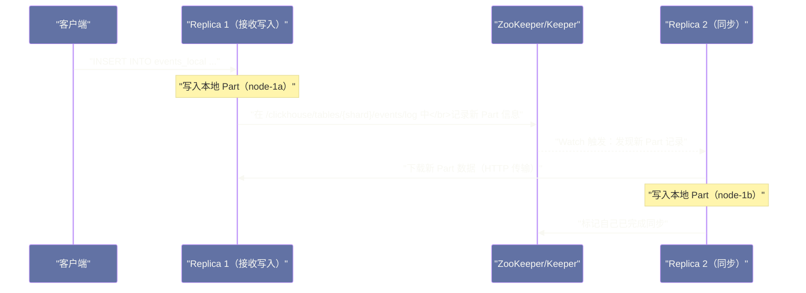

# 05 分布式表与数据分片

## 摘要

ClickHouse 的分布式能力通过 **Distributed 表引擎** 和 **ReplicatedMergeTree** 两个层次实现：前者负责查询路由和分片写入，后者负责同一分片内多副本之间的数据同步。本文深入剖析 Distributed 表的查询转发与结果合并机制、分片键设计对查询性能的影响、ReplicatedMergeTree 通过 [[Zookeeper]] 协调副本同步的内部流程，以及分布式 JOIN 在 ClickHouse 中的实现代价与优化策略。

---

## 第 1 章 ClickHouse 集群的拓扑结构

### 1.1 Shard 与 Replica 的概念区分

ClickHouse 的集群拓扑有两个维度：

**Shard（分片）**：水平分割数据的单元。一张表的数据按分片键（Sharding Key）分布在多个 Shard 上，每个 Shard 只存储部分数据。增加 Shard 数量可以线性扩展存储容量和查询并行度。

**Replica（副本）**：同一 Shard 数据的冗余副本，存储在不同机器上，提供高可用（一台机器宕机时，另一台 Replica 继续服务）。Replica 之间的数据通过 ReplicatedMergeTree + ZooKeeper 自动同步。

一个典型的 ClickHouse 集群（3 Shard × 2 Replica = 6 台机器）：

```
Shard 1: node-1a（主）, node-1b（副本）
Shard 2: node-2a（主）, node-2b（副本）
Shard 3: node-3a（主）, node-3b（副本）
```

每台机器存储约 1/3 的数据（Shard 分割），每份数据有 2 个副本（高可用保障）。

### 1.2 集群配置（config.xml）

ClickHouse 的集群拓扑在 `config.xml` 中定义：

```xml
<remote_servers>
    <my_cluster>
        <!-- Shard 1 -->
        <shard>
            <internal_replication>true</internal_replication>
            <replica>
                <host>node-1a</host>
                <port>9000</port>
            </replica>
            <replica>
                <host>node-1b</host>
                <port>9000</port>
            </replica>
        </shard>
        <!-- Shard 2 -->
        <shard>
            <internal_replication>true</internal_replication>
            <replica>
                <host>node-2a</host>
                <port>9000</port>
            </replica>
            <replica>
                <host>node-2b</host>
                <port>9000</port>
            </replica>
        </shard>
        <!-- Shard 3 -->
        <shard>
            <internal_replication>true</internal_replication>
            <replica>...</replica>
            <replica>...</replica>
        </shard>
    </my_cluster>
</remote_servers>
```

`internal_replication=true` 表示写入 Distributed 表时只写一个 Replica（由 ReplicatedMergeTree 负责同步到其他 Replica），而不是 Distributed 表自己写所有 Replica（这会导致数据重复或不一致）。

---

## 第 2 章 Distributed 表引擎——查询路由的核心

### 2.1 Distributed 表的本质

Distributed 表本身**不存储任何数据**，它是一个**虚拟表**，作为集群查询的统一入口：

```sql
-- 在每个节点上创建本地 MergeTree 表（实际存储数据）
CREATE TABLE events_local ON CLUSTER my_cluster (
    date     Date,
    user_id  UInt64,
    region   String,
    amount   Float64
) ENGINE = ReplicatedMergeTree('/clickhouse/tables/{shard}/events', '{replica}')
PARTITION BY toYYYYMM(date)
ORDER BY (date, user_id);

-- 创建 Distributed 表（虚拟层，查询入口）
CREATE TABLE events ON CLUSTER my_cluster (
    date     Date,
    user_id  UInt64,
    region   String,
    amount   Float64
) ENGINE = Distributed(
    'my_cluster',     -- 集群名
    'default',        -- 本地表所在的数据库
    'events_local',   -- 本地表名
    cityHash64(user_id)  -- 分片键：按 user_id 的哈希值决定写入哪个 Shard
);
```

### 2.2 Distributed 查询的执行流程

当对 Distributed 表发起 SELECT 查询时：

```
SELECT region, sum(amount) FROM events WHERE date > '2024-01-01' GROUP BY region
         ↓
Distributed 表接收查询（由发起节点，称为 Initiator 处理）
         ↓
将查询广播到所有 Shard（每个 Shard 只发给一个 Replica）
         ↓
每个 Shard 执行本地查询（本地 MergeTree 聚合）
  Shard 1：{Beijing: 500k, Shanghai: 300k}
  Shard 2：{Beijing: 600k, Guangzhou: 200k}
  Shard 3：{Shanghai: 400k, Shenzhen: 100k}
         ↓
Initiator 接收各 Shard 的局部聚合结果，做全局合并
  全局：{Beijing: 1100k, Shanghai: 700k, Guangzhou: 200k, Shenzhen: 100k}
         ↓
返回最终结果
```

这个流程对于**可并行的聚合查询**非常高效——各 Shard 并行计算局部聚合，Initiator 只需做轻量的最终合并，网络传输量是聚合后的 GROUP BY 结果（通常远小于原始数据）。

### 2.3 分片键设计——影响数据分布均匀性

分片键决定每行数据写入哪个 Shard，好的分片键应满足：

**均匀分布**：各 Shard 的数据量接近，避免数据倾斜（某个 Shard 存储了 80% 的数据）。

**查询亲和性**：如果大量查询按某个维度过滤（如 `WHERE user_id = X`），将该维度作为分片键，可以使查询只路由到一个 Shard（不需要广播所有 Shard），大幅减少网络开销。

常见分片键选择：

| 场景 | 推荐分片键 | 原因 |
| :--- | :--- | :--- |
| 用户行为分析（按用户查询） | `cityHash64(user_id)` | 均匀分布 + 按 user_id 查询可路由到单 Shard |
| 时序数据（按时间范围查询） | `toYYYYMMDD(date)` | 时间范围查询可路由到少数 Shard |
| 随机分析（不固定过滤维度） | `rand()` 或哈希 | 均匀分布，接受全 Shard 扫描 |

> [!warning] 生产避坑：分片键基数过低
> 如果集群有 10 个 Shard，但分片键只有 5 个不同值（如 `country` 只有 5 个国家），那么至少 5 个 Shard 不会存储任何数据——数据完全倾斜。
> 分片键的基数必须远大于 Shard 数量。如果维度基数有限，可以组合多个维度：`cityHash64(user_id, date)` 保证更均匀的哈希分布。

---

## 第 3 章 ReplicatedMergeTree——副本同步机制

### 3.1 为什么需要 ZooKeeper（或 ClickHouse Keeper）

**ReplicatedMergeTree** 实现同一 Shard 内多个 Replica 之间的数据同步。这个同步需要一个**协调服务**：

- 哪个 Replica 是 Leader（负责协调写操作）
- 记录每个 Replica 已经完成了哪些 Part 的写入
- 当一个 Replica 落后时，从其他 Replica 下载缺失的 Part

ClickHouse 历史上使用 [[Zookeeper]] 作为协调服务，从 21.4 版本开始引入了内置的 **ClickHouse Keeper**（基于 Raft 协议实现，兼容 ZooKeeper 协议），逐步替代外部 ZooKeeper 依赖。

### 3.2 ReplicatedMergeTree 的写入流程

当通过 Distributed 表写入数据时（以 2 Replica 为例）：



关键：写入 Replica 1 后**立即返回成功**，不等待 Replica 2 同步完成。Replica 2 的同步是**异步**的，通过 ZooKeeper/Keeper 的 Watch 机制触发。

这意味着在 Replica 同步完成之前，如果从 Replica 2 查询，可能读不到刚写入的数据（弱一致性读）。对于强一致性读的需求，需要配置 `select_sequential_consistency = 1`，但会增加读取延迟。

### 3.3 副本落后（Replication Lag）的监控

```sql
-- 查看各 Replica 的同步状态
SELECT
    database,
    table,
    replica_name,
    queue_size,             -- 等待同步的 Part 数量
    inserts_in_queue,       -- 待同步的 INSERT 操作数
    merges_in_queue,        -- 待同步的 Merge 操作数
    log_max_index,          -- ZooKeeper 中最新的日志索引
    log_pointer,            -- 该 Replica 已处理的日志索引
    (log_max_index - log_pointer) AS replication_lag  -- 落后的日志条数
FROM system.replicas
WHERE replication_lag > 0;
```

`replication_lag` 持续增大说明 Replica 同步速度跟不上写入速度，可能需要增大 `background_fetches_pool_size`（负责下载 Part 的后台线程数）。

---

## 第 4 章 分布式 JOIN 的代价与优化

### 4.1 分布式 JOIN 的基本挑战

在单机 ClickHouse 中，JOIN 在本地内存中完成（Build HashTable + Probe），非常高效。但在分布式场景下，JOIN 的两张表数据分布在不同 Shard，完成 JOIN 需要数据跨节点传输（Shuffle）。

ClickHouse 对分布式 JOIN 的处理远不如 [[Trino]] 成熟——Trino 有完整的 Distributed Hash Join（将大表按 JOIN Key 的哈希重新分片，小表广播），而 ClickHouse 主要支持**广播 JOIN（Broadcast JOIN）**——将小表完整发送到每个 Shard，每个 Shard 本地做 JOIN。

```sql
-- 分布式 JOIN 示例（大表 JOIN 小维表）
SELECT e.user_id, e.amount, u.user_name
FROM events e  -- 大表（分布在多个 Shard）
GLOBAL JOIN users u  -- 小维表（GLOBAL 关键字触发广播 JOIN）
ON e.user_id = u.user_id
WHERE e.date > '2024-01-01';
```

**`GLOBAL JOIN`** 的执行流程：
1. 将 `users` 表的查询结果在 Initiator 节点上物化（全量数据加载到内存）
2. 将这份全量数据序列化后发送到所有 Shard
3. 每个 Shard 用本地 `events` 数据与广播来的 `users` 数据做本地 JOIN
4. Initiator 收集各 Shard 的 JOIN 结果并合并

**不加 GLOBAL** 的 `JOIN`（本地 JOIN）：每个 Shard 直接对本地 `events` 和本地 `users` 做 JOIN，但不同 Shard 的 `users` 数据可能不完整（如果 `users` 也是 Distributed 表且分片键不同），导致 JOIN 结果错误。

### 4.2 分布式 JOIN 的性能指导

| JOIN 模式 | 适用场景 | 注意事项 |
| :--- | :--- | :--- |
| **GLOBAL JOIN** | 小表（< 几百 MB） | 小表全量传输到所有 Shard，内存开销 = Shard数 × 小表大小 |
| **本地 JOIN** | 两表按相同分片键分片 | 只在本地 Shard 做 JOIN，无网络开销，结果正确 |
| **子查询 + IN** | 小集合过滤 | `IN (SELECT id FROM dim_table LIMIT 1000)` 比 JOIN 轻量 |

最佳实践：**将大表与维表按同一个 JOIN Key 分片**，消除分布式 JOIN 的网络开销：

```sql
-- 大表 events 按 user_id 分片
-- 维表 users 也按 user_id 分片
-- 两表在同一 user_id 的数据必然在同一 Shard
-- JOIN 时无需 GLOBAL，直接本地 JOIN
SELECT e.user_id, e.amount, u.user_name
FROM events e
JOIN users u ON e.user_id = u.user_id
WHERE e.date > '2024-01-01';
```

---

## 第 5 章 小结

ClickHouse 的分布式架构是在"单机极致性能"基础上的自然延伸，而非从零设计的分布式系统：

- **Distributed 表**：轻量的查询路由层，将 SQL 广播到各 Shard 并合并结果，本身不存储数据
- **ReplicatedMergeTree**：通过 ZooKeeper/Keeper 异步同步 Part，提供高可用，但写入强一致性需要额外配置
- **分布式 JOIN**：主要依赖广播 JOIN（小表广播），大表 JOIN 场景需要按 JOIN Key 预先分片

ClickHouse 的分布式能力对"单表大数据量聚合"场景非常高效，但对于需要多表频繁 JOIN 的复杂报表场景，其分布式 JOIN 能力不如 [[Trino]] 成熟，应结合场景选型。

---

**延伸阅读**：
- [[02 MergeTree 引擎家族——主键索引与数据排序]]
- [[07 ClickHouse 运维——集群部署、监控与版本升级]]

---

> [!note] 思考题
> 1. ClickHouse 常作为实时分析的查询层——Kafka → ClickHouse（通过 Kafka Engine 或 Kafka Connect）→ Grafana/BI 工具。Kafka Engine 直接在 ClickHouse 中消费 Kafka 消息。但 Kafka Engine 的消费语义是 at-least-once——可能有重复数据。你如何在 ClickHouse 中处理重复数据？ReplacingMergeTree 的去重机制是实时的还是最终一致的？
> 2. 在用户行为分析场景中，需要计算 DAU（日活跃用户数）、留存率等指标。ClickHouse 的 `uniq`（基于 HyperLogLog 的近似去重）和 `uniqExact`（精确去重）在性能上差距有多大？在 10 亿行数据上 `uniqExact(user_id)` 需要多少内存？在什么精度要求下你会选择近似去重？
> 3. ClickHouse 与 Elasticsearch 经常被拿来比较。ES 擅长全文搜索和实时索引，ClickHouse 擅长聚合分析和列存压缩。在日志分析场景中（既需要关键词搜索又需要统计分析），两者如何配合？有些团队选择用 ClickHouse 完全替代 ES——ClickHouse 的 `tokenbf_v1` 索引能否满足基本的文本搜索需求？
