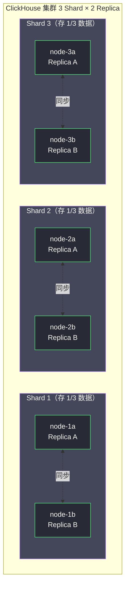
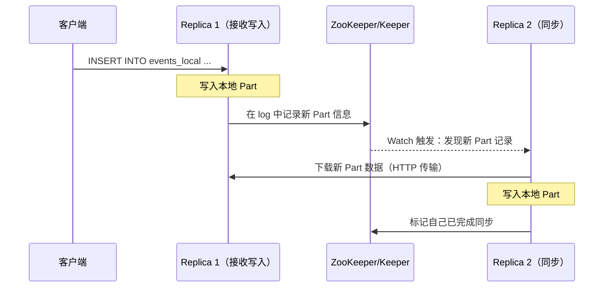

# 05 分布式表与数据分片

**摘要：**
ClickHouse 的分布式能力通过 **Distributed 表引擎**和 **ReplicatedMergeTree** 两个层次实现——前者负责查询路由和分片写入，后者负责同一分片内多副本之间的数据同步。本文从集群拓扑的 Shard/Replica 二维结构切入，剖析 Distributed 表的查询转发与结果合并机制、分片键设计对数据分布均匀性与查询裁枝的影响；然后深入 ReplicatedMergeTree 通过 [[Zookeeper]] / ClickHouse Keeper 协调副本同步的内部流程，讲清"写入立即返回、副本异步追赶"的最终一致性模型与 `insert_quorum` 的持久性保障；接着展开分布式 JOIN 的代价——ClickHouse 的广播 JOIN 与 Trino 的 Shuffle JOIN 有何本质差异、`GLOBAL JOIN` 何时该用何时该避、按 JOIN Key 预分片如何消除网络开销；最后讨论分布式写入的幂等性、副本落后的监控与扩缩容的数据迁移。

---

## 第 1 章 ClickHouse 集群的拓扑结构

### 1.1 Shard 与 Replica 的二维结构

ClickHouse 的集群拓扑有两个正交的维度——**Shard（分片）**和 **Replica（副本）**。理解这两个维度的区别是理解 ClickHouse 分布式架构的基础。

**Shard（分片）**——水平分割数据的单元。一张表的数据按分片键（Sharding Key）分布在多个 Shard 上，每个 Shard 只存储部分数据。增加 Shard 数量可以线性扩展存储容量和查询并行度——这是"水平扩展"的维度。譬如 10TB 数据分到 10 个 Shard，每个 Shard 存 1TB——加 Shard 就能存更多数据。

**Replica（副本）**——同一 Shard 数据的冗余副本，存储在不同机器上，提供高可用（一台机器宕机时，另一台 Replica 继续服务）。Replica 之间的数据通过 ReplicatedMergeTree + ZooKeeper/Keeper 自动同步——这是"可靠性"的维度。譬如每个 Shard 有 2 个 Replica，一台机器宕机，另一个 Replica 接管，服务不中断。

一个典型的 ClickHouse 集群（3 Shard × 2 Replica = 6 台机器）：

```
Shard 1: node-1a（主）, node-1b（副本）
Shard 2: node-2a（主）, node-2b（副本）
Shard 3: node-3a（主）, node-3b（副本）
```

每台机器存储约 1/3 的数据（Shard 分割），每份数据有 2 个副本（高可用保障）。**Shard 数决定"容量和并行度"，Replica 数决定"可靠性"**——这是两个独立可调的参数。生产中常见的配置是"Shard 数 = 数据量 / 单机容量"，"Replica 数 = 2（主 + 副本）或 3（跨机房高可用）"。

Shard 数和 Replica 数的乘积就是集群的总机器数——3 Shard × 2 Replica = 6 台机器。这两个维度的扩展策略不同——**"容量不够加 Shard，可靠性不够加 Replica"**。譬如数据量从 10TB 涨到 30TB，加 Shard 从 3 到 10（每 Shard 3TB）；如果觉得 2 副本不够可靠（譬如单机房故障），加 Replica 从 2 到 3（跨 3 机房）。**Shard 扩展是"水平扩展"，Replica 扩展是"冗余扩展"**——前者提升性能，后者提升可靠性，各有用途。

Shard 和 Replica 的扩展决策可以用一个矩阵来理解：

| 需求 | 扩展方式 | 代价 |
| :--- | :--- | :--- |
| 数据量增长，存储不够 | 加 Shard | 数据迁移（重新分布） |
| 查询慢，需要更多并行度 | 加 Shard | 数据迁移 + 网络开销上升 |
| 节点宕机风险，要高可用 | 加 Replica | 多存一份副本（存储翻倍） |
| 跨机房容灾 | 加 Replica（跨机房） | 跨机房同步延迟 |
| 写入吞吐不够 | 加 Shard | 写入均匀分摊到更多 Shard |

这张表的洞察是——**"性能问题加 Shard，可靠性问题加 Replica"**。但加 Shard 的代价（数据迁移）远高于加 Replica（只需同步一份新副本）——所以"频繁扩容"的场景应该考虑支持动态重分片的引擎（Doris、TiDB），而非 ClickHouse。

Replica 数的选择还有一个与"写入性能"相关的细节——**Replica 数越多，写入的同步开销越大**。虽然写入只写一个 Replica（`internal_replication=true`），但那个 Replica 要同步到其他 Replica——Replica 越多，同步的份数越多，源 Replica 的网络发送开销越大。譬如 2 副本，源 Replica 同步 1 份；3 副本，同步 2 份；5 副本，同步 4 份。**Replica 数与写入吞吐近似反相关**——Replica 越多，写入吞吐越低。生产中通常 2-3 副本够用——2 副本应对单机故障，3 副本应对跨机房故障，更多副本的收益递减而开销递增。

Shard 数的选择还有一个与查询性能相关的考量——**Shard 数应该与"典型查询的并行度需求"匹配**。如果典型查询需要 32 路并行才能跑出可接受的延迟，单机 8 核的话需要 4 个 Shard（4 × 8 = 32 路）。Shard 太少，单查询并行度不够；Shard 太多，分布式查询的网络开销和 Initiator 合并开销上升（每个 Shard 都要传输结果到 Initiator）。**Shard 数不是越多越好——通常 3-20 个 Shard 能覆盖大多数场景**。

Shard 数的选择还有一个与"可用性"相关的考量——**Shard 数越多，单 Shard 故障的影响越小**。譬如 3 Shard 集群，1 个 Shard 故障，损失 1/3 的数据（查询报错或结果不完整）；10 Shard 集群，1 个 Shard 故障，只损失 1/10。但 Shard 数越多，集群的运维复杂度越高（更多节点要管理、更多副本要同步）。**Shard 数是"可用性"与"运维复杂度"的权衡**——通常 5-10 个 Shard 是生产中的常见选择，既保证单 Shard 故障影响可控，又不过度增加运维负担。



### 1.2 集群配置与 internal_replication

ClickHouse 的集群拓扑在 `config.xml` 的 `<remote_servers>` 中定义：

```xml
<remote_servers>
    <my_cluster>
        <!-- Shard 1 -->
        <shard>
            <internal_replication>true</internal_replication>
            <replica>
                <host>node-1a</host>
                <port>9000</port>
            </replica>
            <replica>
                <host>node-1b</host>
                <port>9000</port>
            </replica>
        </shard>
        <!-- Shard 2、Shard 3 类似 -->
    </my_cluster>
</remote_servers>
```

`internal_replication=true` 是一个关键设置——它表示"写入 Distributed 表时只写一个 Replica，由 ReplicatedMergeTree 负责同步到其他 Replica"。如果设为 false，Distributed 表会自己写所有 Replica——这会导致每个 Replica 都收到一份写入，但 ReplicatedMergeTree 又会同步一份，最终数据重复。**`internal_replication=true` 是"职责分离"的体现——Distributed 表负责选 Replica，ReplicatedMergeTree 负责同步**，两者各司其职，不重复劳动。

`internal_replication` 的反面是 `false`——Distributed 表自己写所有 Replica。这种模式在"没有 ReplicatedMergeTree"时使用（譬如本地 MergeTree 想要多副本）。但它的代价是——Distributed 表要维护"哪些 Replica 写成功了"的状态，写入失败时要做重试或回滚，复杂性高。**生产中几乎总是用 `internal_replication=true` + ReplicatedMergeTree**——让专业的同步层（ReplicatedMergeTree）做同步，Distributed 表只做路由。

### 1.3 本地表与 Distributed 表的配合

ClickHouse 的分布式表使用模式是"本地表 + Distributed 表"双层结构：

```sql
-- 在每个节点上创建本地表（实际存储数据）
CREATE TABLE events_local ON CLUSTER my_cluster (
    date     Date,
    user_id  UInt64,
    region   String,
    amount   Float64
) ENGINE = ReplicatedMergeTree('/clickhouse/tables/{shard}/events', '{replica}')
PARTITION BY toYYYYMM(date)
ORDER BY (date, user_id);

-- 创建 Distributed 表（虚拟层，查询入口）
CREATE TABLE events ON CLUSTER my_cluster (
    date     Date,
    user_id  UInt64,
    region   String,
    amount   Float64
) ENGINE = Distributed(
    'my_cluster',        -- 集群名
    'default',           -- 本地表所在的数据库
    'events_local',      -- 本地表名
    cityHash64(user_id)  -- 分片键：按 user_id 的哈希值决定写入哪个 Shard
);
```

这个双层结构的设计意图是——**本地表是"物理存储"，Distributed 表是"逻辑视图"**。写入时，用户写 Distributed 表，Distributed 表按分片键决定写哪个 Shard 的本地表；查询时，用户查 Distributed 表，Distributed 表把查询转发到所有 Shard 的本地表，合并结果返回。**用户只与 Distributed 表交互，不直接操作本地表**——这是"位置透明性"的体现，用户不需要知道数据在哪个 Shard。

这种"位置透明性"有一个例外——**写入时可以直接写本地表**。有些生产场景为了降低写入延迟，绕过 Distributed 表直接写本地表——应用按分片键计算目标 Shard，直接连那个 Shard 的本地表写入。这种"直写本地表"的方式省去了 Distributed 表的转发开销（Distributed 表要把数据从 Initiator 转发到目标 Shard，多一跳网络），写入延迟更低。但代价是——应用需要知道分片逻辑，失去了"位置透明性"。**"直写本地表"是"用透明性换延迟"的优化**——对写入延迟敏感的场景（譬如实时埋点）可以考虑，但要确保应用的分片逻辑与 Distributed 表的分片键一致，否则查询时数据分布会错乱。

直写本地表还有一个工程细节——**写入哪个 Replica**。本地表是 ReplicatedMergeTree，有多个 Replica——直写时选哪个？通常选"本地 Replica"（与应用同机房的 Replica，网络延迟最低）。如果本地 Replica 宕机，选同 Shard 的其他 Replica。这个"选 Replica"的逻辑可以由应用层做（配置多个 Replica 地址，失败重试下一个），也可以由负载均衡做（HAProxy 健康检查自动摘除宕机节点）。**直写本地表把"选 Replica"的责任从 Distributed 表转移到了应用层**——这是"用透明性换延迟"的另一个代价。

`{shard}` 和 `{replica}` 是 ClickHouse 的宏替换——建表时自动替换为当前节点的 Shard 名和 Replica 名。这让同一条 `CREATE TABLE` 语句能在所有节点上执行（`ON CLUSTER`），每个节点自动获得正确的 ReplicatedMergeTree 路径——譬如 node-1a 的路径是 `/clickhouse/tables/shard1/events/replica_a`，node-1b 是 `/clickhouse/tables/shard1/events/replica_b`。

---

## 第 2 章 Distributed 表引擎——查询路由的核心

### 2.1 Distributed 表的本质

Distributed 表本身**不存储任何数据**——它是一个**虚拟表**，作为集群查询的统一入口。它的元数据只有三样东西：集群名、本地表名、分片键。查询时，Distributed 表根据集群配置找到所有 Shard，把查询转发过去；写入时，Distributed 表根据分片键计算每行应该去哪个 Shard，转发到对应 Shard 的本地表。

这种"虚拟表 + 转发"的设计让 ClickHouse 的分布式层极轻——Distributed 表不需要维护数据、不需要 WAL、不需要索引，它只是一个"路由器"。**对比 HBase 的 RegionServer 或 Cassandra 的 Coordinator，ClickHouse 的 Distributed 表更像一个"视图"而非"服务"**——它没有独立的进程，只是 ClickHouse Server 内部的一个表引擎。

这个"虚拟表"设计有一个重要后果——**Distributed 表的 Initiator 是"接收到查询的那个节点"**，而不是一个独立的 Coordinator 服务。譬如用户连 node-1a 发起查询，node-1a 就是 Initiator——它负责把查询转发到其他 Shard，合并结果返回。这意味着**任何节点都可以是 Initiator**——客户端连哪个节点，哪个节点就是 Initiator。这是 ClickHouse 的"对等架构"——没有 Master/Worker 之分，所有节点平等。对比 Trino 的 Coordinator/Worker 分离架构，ClickHouse 的对等架构更简单（没有单点 Coordinator），但 Initiator 的负载不可控（某个节点可能因为接了很多大查询成为瓶颈）。**生产中通常在 ClickHouse 前面加负载均衡（HAProxy/Nginx）**，把查询均匀分发到各节点，避免单节点成为 Initiator 瓶颈。

### 2.2 Distributed 查询的两阶段执行

当对 Distributed 表发起 SELECT 查询时，执行流程是两阶段的：

```
SELECT region, sum(amount) FROM events WHERE date > '2024-01-01' GROUP BY region
         ↓
Distributed 表接收查询（由发起节点，称为 Initiator 处理）
         ↓
将查询广播到所有 Shard（每个 Shard 只发给一个 Replica）
         ↓
每个 Shard 执行本地查询（本地 MergeTree 聚合）
  Shard 1：{Beijing: 500k, Shanghai: 300k}
  Shard 2：{Beijing: 600k, Guangzhou: 200k}
  Shard 3：{Shanghai: 400k, Shenzhen: 100k}
         ↓
Initiator 接收各 Shard 的局部聚合结果，做全局合并
  全局：{Beijing: 1100k, Shanghai: 700k, Guangzhou: 200k, Shenzhen: 100k}
         ↓
返回最终结果
```

这个两阶段执行与第 04 篇讲的"单机两阶段聚合"是同一个思路——局部聚合（各 Shard）+ 全局合并（Initiator）。区别在于——单机的局部聚合在"线程间"做，全局合并在"内存"里；分布式的局部聚合在"节点间"做，全局合并要"跨网络"传输。**网络传输量 = 各 Shard 的局部聚合结果大小**——如果 GROUP BY 基数低（譬如按 region 聚合，只有几个 region），局部聚合结果很小，网络传输量很小，分布式查询几乎与单机查询一样快。如果 GROUP BY 基数高（譬如按 user_id 聚合，百万用户），局部聚合结果很大，网络传输量大，分布式查询的"网络 Shuffle"成为瓶颈。

这个特性决定了 ClickHouse 分布式查询的最佳场景——**"低基数 GROUP BY + 大数据量扫描"**。譬如"10 亿行数据按 region 聚合"——各 Shard 扫几亿行做局部聚合，结果只有几行，网络传输几行，全局合并瞬间完成。这种场景下分布式 ClickHouse 的性能极高——多 Shard 并行扫描，网络开销几乎为零。

反过来，**"高基数 GROUP BY + 大数据量扫描"是分布式 ClickHouse 的弱项**。譬如"10 亿行数据按 user_id 聚合"——各 Shard 扫几亿行做局部聚合，局部结果有百万行（每个 user_id 一行），网络传输百万行到 Initiator 做全局合并——网络传输量大，Initiator 的合并也慢。这种场景下，ClickHouse 的分布式查询可能比单机还慢（单机的合并在内存里，分布式的合并要跨网络）。**"高基数 GROUP BY"应该用预聚合（AggregatingMergeTree 物化视图）降低基数**，而不是硬扛分布式 Shuffle。

分布式查询的"Initiator 合并"还有一个瓶颈值得点出——**Initiator 是单点**。所有 Shard 的局部结果都发到 Initiator 做全局合并——如果局部结果很大，Initiator 的网络接收和 CPU 合并都成为瓶颈。譬如 10 个 Shard 各发 100 万行局部结果到 Initiator，Initiator 要接收 1000 万行、合并成最终结果——这个"单点合并"在结果集大时是瓶颈。

缓解这个瓶颈的方法是**增加聚合的层次**——譬如 3 级聚合：Shard 内局部聚合 → Shard 间中间合并（几个 Shard 合并到中间节点）→ Initiator 最终合并。这种"多级聚合"能分散 Initiator 的压力，但 ClickHouse 默认不做（只有两级聚合）。对"高基数 GROUP BY + 大结果集"的场景，可能需要手动拆分查询（譬如按时间分多次查询，每次查一段，应用层合并）。

### 2.3 分片裁剪——分片键的查询优化价值

分片键除了决定数据分布，还有一个查询优化价值——**分片裁剪（Shard Pruning）**。如果查询的 WHERE 条件命中分片键，Distributed 表可以只把查询转发到包含相关数据的 Shard，不转发到所有 Shard——减少参与查询的节点数，降低网络开销和计算开销。

譬如分片键是 `cityHash64(user_id)`，查询 `WHERE user_id = 12345`——Distributed 表计算 `cityHash64(12345) % shard_count`，得到目标 Shard（譬如 Shard 2），只把查询转发到 Shard 2，不转发到 Shard 1 和 Shard 3。**分片裁剪把"全 Shard 扫描"变成"单 Shard 扫描"**——查询延迟降低到 1/Shard 数。

但分片裁剪有一个前提——**WHERE 条件必须是"分片键的精确匹配"**。`WHERE user_id = 12345` 可以裁剪（精确匹配分片键）；`WHERE user_id IN (12345, 67890)` 可以裁剪（计算每个值的哈希，转发到对应的几个 Shard）；`WHERE user_id > 10000` 不能裁剪（范围查询无法确定哪些 Shard 包含符合条件的行，必须广播所有 Shard）。**分片裁剪只对"等值查询"和"IN 查询"有效，对"范围查询"无效**——这是分片键选择时需要考虑的查询模式。

这个限制的根源是哈希分片的特性——`cityHash64(user_id) % shard_count` 是一个哈希函数，它把"连续的 user_id"打散到不同 Shard。`user_id = 12345` 能算出唯一的目标 Shard；`user_id > 10000` 无法算出"哪些 Shard 包含 user_id > 10000 的行"——因为哈希后分布是均匀的，每个 Shard 都可能有符合条件的行。**哈希分片天然不支持范围裁剪**——这是它与"范围分片"（譬如按 date 范围分片）的根本差异。

范围分片（譬如 `toYYYYMMDD(date) % shard_count`）能支持范围裁剪——`WHERE date >= '2024-01-01' AND date < '2024-02-01'` 能算出涉及的 Shard。但范围分片的缺点是"写入热点"——同一天的数据写入同一个 Shard，如果某天写入量特别大（譬如双十一），那个 Shard 成为热点。**哈希分片牺牲范围裁剪换写入均匀，范围分片牺牲写入均匀换范围裁剪**——这是分片键设计的核心取舍。

### 2.4 分片键设计的三个维度

分片键决定每行数据写入哪个 Shard，好的分片键应满足三个维度：

**均匀分布**——各 Shard 的数据量接近，避免数据倾斜（某个 Shard 存储了 80% 的数据）。数据倾斜会导致"存储不均"（某个 Shard 磁盘满）和"计算不均"（某个 Shard 查询慢，拖慢整个分布式查询）。

**查询亲和性**——如果大量查询按某个维度过滤（如 `WHERE user_id = X`），将该维度作为分片键，可以使查询只路由到一个 Shard（分片裁剪），大幅减少网络开销。

**写入均匀**——写入压力均匀分摊到各 Shard，避免某个 Shard 成为写入热点。譬如分片键是 `toYYYYMMDD(date)`，同一天的数据都写入同一个 Shard——如果每天写入几亿行，那个 Shard 承受全部写入压力，其他 Shard 空闲。

常见分片键选择：

| 场景 | 推荐分片键 | 原因 |
| :--- | :--- | :--- |
| 用户行为分析（按用户查询） | `cityHash64(user_id)` | 均匀分布 + 按 user_id 查询可路由到单 Shard |
| 时序数据（按时间范围查询） | `cityHash64(toYYYYMMDD(date))` | 时间哈希后均匀分布，避免按天写入热点 |
| 多维分析（不固定过滤维度） | `rand()` 或 `cityHash64(所有列)` | 均匀分布，接受全 Shard 扫描 |
| 按租户隔离的 SaaS | `cityHash64(tenant_id)` | 按 tenant 查询可裁剪，租户数据隔离 |

> [!warning] 生产避坑：分片键基数过低
> 如果集群有 10 个 Shard，但分片键只有 5 个不同值（如 `country` 只有 5 个国家），那么至少 5 个 Shard 不会存储任何数据——数据完全倾斜。
> 分片键的基数必须远大于 Shard 数量。如果维度基数有限，可以组合多个维度：`cityHash64(user_id, date)` 保证更均匀的哈希分布。

### 2.5 分片键的不可变性

分片键一旦建表就不能改——这是 ClickHouse 分布式表的一个重要约束。如果业务变化需要换分片键（譬如从 `user_id` 换成 `tenant_id`），只能新建一张表，把数据从旧表迁移到新表。这个迁移代价很高——要把全表数据读出来，按新分片键重新分布到各 Shard。

**分片键的不可变性是 ClickHouse 分布式架构的一个设计代价**——它换取了"写入路径的简洁"（Distributed 表只需计算一次哈希就能决定目标 Shard）。对比 Doris 的动态分区或 TiDB 的 Region 分裂，ClickHouse 的分片是"静态"的——建表时定好，不可变。**这让 ClickHouse 的分布式层不适合"分片键需要频繁调整"的场景**——如果业务维度变化频繁，应该考虑 Doris（动态分区）或 TiDB（自动 Region 分裂）。

分片键不可变还有一个工程影响——**建表前必须慎重选择分片键**。一旦上线，改分片键的代价是"全表数据迁移"——对 TB 级表，这可能需要几天的停机迁移。生产中选分片键的经验是——**选"业务最稳定的查询维度"作为分片键**。譬如用户行为分析，`user_id` 是最稳定的查询维度（永远会按用户查），选 `cityHash64(user_id)` 比较安全；如果选了一个可能变化的维度（譬如 `product_id`，未来可能按 `category_id` 查更多），未来改分片键的代价很高。**"分片键的稳定性"比"分片键的查询性能"更重要**——一个"性能不是最优但稳定"的分片键，比一个"性能最优但可能要改"的分片键更值得选。

分片键不可变还有一个与"副本"相关的细节——**改分片键意味着新建表 + 迁移数据，但新表和旧表的 ReplicatedMergeTree 路径不同**。旧表的 ZooKeeper 路径是 `/clickhouse/tables/{shard}/events_old`，新表是 `/clickhouse/tables/{shard}/events_new`——两者独立同步。迁移期间，旧表和新表并存，查询要切换到新表（譬如改 Distributed 表的 `events_local` 指向）。这个切换通常用"双写 + 双读"的方式平滑过渡——新表写入新数据，旧表保留旧数据，查询先查新表再查旧表，逐步把旧数据迁移到新表后下线旧表。**分片键迁移是一个"大型运维项目"——不是改个配置那么简单**。

---

## 第 3 章 ReplicatedMergeTree——副本同步机制

### 3.1 为什么需要 ZooKeeper / ClickHouse Keeper

**ReplicatedMergeTree** 实现同一 Shard 内多个 Replica 之间的数据同步。这个同步需要一个**协调服务**来回答三个问题：

- 哪个 Replica 是 Leader（负责协调写操作）
- 记录每个 Replica 已经完成了哪些 Part 的写入
- 当一个 Replica 落后时，从其他 Replica 下载缺失的 Part

ClickHouse 历史上使用 [[Zookeeper]] 作为协调服务，从 21.4 版本开始引入了内置的 **ClickHouse Keeper**（基于 Raft 协议实现，兼容 ZooKeeper 协议），逐步替代外部 ZooKeeper 依赖。

ClickHouse Keeper 相比 ZooKeeper 的优势在于——**部署简化**（不需要单独的 ZooKeeper 集群，与 ClickHouse 同进程部署）和**性能提升**（Raft 协议比 ZooKeeper 的 ZAB 协议在写入吞吐上更优）。但两者在协议层面兼容——ClickHouse 的 ReplicatedMergeTree 代码不区分 ZooKeeper 和 Keeper，统一通过 ZooKeeper 客户端协议交互。**从 ZooKeeper 迁移到 Keeper 是平滑的——只需要改配置，不需要改表结构**。

ZooKeeper/Keeper 在 ReplicatedMergeTree 中的角色值得多看一层——它不只是"协调服务"，还是"复制日志的存储"。每次 INSERT 产生的 Part 信息都记录在 ZooKeeper 的 `log` znode 里，各 Replica 通过 Watch 这个 znode 得知新 Part，然后从源 Replica 下载。**ZooKeeper 存的是"Part 的元数据"（Part 名、大小、校验和），不是"Part 的数据"**——Part 数据通过 Replica 之间的 HTTP 直连传输，不走 ZooKeeper。这个分工让 ZooKeeper 的负载可控——只存元数据（小），不存数据（大）。

但即使只存元数据，ZooKeeper 的负载在大规模集群下也不可忽视——一个有几百个表、每秒几千次 INSERT 的集群，ZooKeeper 的 znode 数和 Watch 通知数可能达到百万级。**ZooKeeper 的性能是 ClickHouse 集群规模的瓶颈之一**——这是 ClickHouse Keeper（Raft 协议，写入吞吐更高）逐步替代 ZooKeeper 的动机。生产中新建集群建议直接用 ClickHouse Keeper，老集群可以择机迁移。

ZooKeeper/Keeper 的部署模式有两种——**嵌入式**（与 ClickHouse 同进程，适合小集群）和**独立式**（单独的 Keeper 集群，适合大集群）。嵌入式部署简单（不需要额外机器），但 Keeper 的负载与 ClickHouse 的负载竞争资源（CPU、内存、磁盘）。独立式部署隔离性好，但需要额外的 3-5 台机器（Raft 多数派需要奇数节点）。**生产中通常用独立式 Keeper**——把协调服务的负载与 ClickHouse 的负载隔离，避免互相影响。

Keeper 的部署规模有一个经验值——**3 节点 Keeper 集群能支撑约 50 个 ClickHouse 节点**。如果 ClickHouse 集群超过 50 节点，考虑 5 节点 Keeper（更高的吞吐和容错）。Keeper 节点数必须是奇数（Raft 多数派要求）——3 节点容忍 1 故障，5 节点容忍 2 故障。**Keeper 的节点数取决于"ClickHouse 集群规模"和"容忍故障数"**——小集群 3 节点够，大集群 5 节点更稳。

Keeper 的硬件配置有一个值得注意的点——**Keeper 的磁盘要用 SSD**。Keeper 的写操作要 fsync 到磁盘（Raft 协议要求持久化），HDD 的 fsync 延迟（毫秒级）会让 Keeper 的写入吞吐严重下降。SSD 的 fsync 延迟在亚毫秒级，能让 Keeper 发挥正常性能。**用 HDD 部署 Keeper 是 ClickHouse 集群性能的隐形杀手**——很多团队用 HDD 省 成本，结果 Keeper 写入慢导致副本同步延迟高，整个集群的写入吞吐下降。

### 3.2 ReplicatedMergeTree 的写入与同步流程

当通过 Distributed 表写入数据时（以 2 Replica 为例）：



关键点——**写入 Replica 1 后立即返回成功，不等待 Replica 2 同步完成**。Replica 2 的同步是**异步**的，通过 ZooKeeper/Keeper 的 Watch 机制触发。这是"写入低延迟"与"副本一致性"的取舍——ClickHouse 选择了"写入低延迟"，代价是"副本最终一致"。

这意味着在 Replica 同步完成之前，如果从 Replica 2 查询，可能读不到刚写入的数据——这是**弱一致性读**。对于强一致性读的需求，需要配置 `select_sequential_consistency = 1`——它保证"查询只返回已经同步到所有 Replica 的数据"，但会增加读取延迟（要等同步完成或从 Leader 读）。**大多数分析场景接受弱一致性读**——日志分析、指标统计对"最近几秒的数据"不敏感；对"账户余额"这种强一致性场景，ClickHouse 本来就不适合（应该用 MySQL）。

弱一致性读有一个生产中容易踩的坑——**"写入后立即查询"可能读不到刚写的数据**。譬如应用写入一条事件后立即查询 `SELECT count() FROM events WHERE user_id = X`——如果查询路由到的 Replica 还没同步完这条事件，count 不包含新写入的行。应用以为"写入失败了"（因为查不到），重试写入——导致数据重复。

解决这个坑的方案有几种：

**写入和查询走同一个 Replica**——通过 `prefer_localhost_replica = 1` 让查询优先走本地 Replica。如果写入和查询都连同一个节点，写入的 Replica 就是查询的 Replica，能读到刚写的数据。但这个方案在"写入和查询连不同节点"时失效（譬如写入走负载均衡的节点 A，查询走负载均衡的节点 B）。

**`select_sequential_consistency = 1`**——保证查询只返回已同步到所有 Replica 的数据。代价是读取延迟增加（要等同步完成）。对"写入后立即查询"的场景，这个配置能保证"写入成功的数据一定能查到"。

**应用层不依赖"写入后立即查询"**——譬如写入后不立即查询，而是等几秒（让副本同步）再查。这是"用时间换一致性"的简单方案——对实时性要求不高的场景可以接受。

### 3.3 insert_quorum——写入持久性保障

"写入立即返回、副本异步同步"的模型有一个风险——**写入的 Replica 在同步完成前宕机，数据丢失**。譬如写入 Replica 1 后，Replica 1 还没来得及同步到 Replica 2 就宕机了——数据只在 Replica 1 上，如果 Replica 1 的磁盘也坏了，数据就真丢了。

`insert_quorum` 参数解决这个问题——它要求"写入至少成功同步到 N 个 Replica 才返回成功"。譬如 `insert_quorum = 2`，写入 Replica 1 后，ClickHouse 等待 Replica 2 同步完成才返回成功——如果 Replica 2 在超时时间内没同步完，写入报错。**`insert_quorum` 把"写入成功"的定义从"写入一个 Replica"升级到"写入 N 个 Replica"**——代价是写入延迟增加（要等同步完成）。

`insert_quorum` 的使用场景是"对数据持久性要求高于写入延迟"的场景——譬如金融交易日志，宁可写入慢一点，也不能丢。配合 `select_sequential_consistency = 1`，还能保证"读到的数据一定在多数 Replica 上"——这是"线性一致性"的近似。**`insert_quorum + select_sequential_consistency` 是 ClickHouse 在"写入性能"与"数据一致性"之间的"强一致性档位"**——默认不用（用弱一致性换性能），需要时开启。

`insert_quorum` 有一个配合参数——`quorum_read`。设为 1 时，查询也走 quorum——从"多数 Replica"读，保证读到最新数据。这是"读 quorum + 写 quorum"的经典一致性方案——只要读和写的 quorum 有交集（譬如 2 副本写 quorum=2，读 quorum=1，交集是 1），就能保证线性一致性。**`insert_quorum + quorum_read` 是 ClickHouse 最强的一致性保障**——接近传统关系数据库的线性一致性，但代价是写入和读取延迟都增加。

生产中 `insert_quorum` 的典型配置是——2 副本时设 `insert_quorum = 2`（两副本都写成功才算成功），3 副本时设 `insert_quorum = 2`（多数派写成功即可）。后者是"多数派写入"——即使一个副本宕机，只要另外两个写成功，写入就成功，可用性更高。**`insert_quorum` 的值通常设为"副本数 - 1"**——允许一个副本故障，其余副本写成功即可。

`insert_quorum` 有一个与可用性的冲突值得注意——**如果设 `insert_quorum = 2`（2 副本都写成功），一个副本宕机时写入会失败**（因为只有 1 个副本能写成功，达不到 quorum=2）。这是"强持久性"与"可用性"的矛盾——quorum 越高，持久性越好，但可用性越差（能容忍的副本故障越少）。3 副本设 `insert_quorum = 2` 是一个较好的平衡——允许 1 副本故障，仍能达到 quorum。**2 副本设 `insert_quorum = 2` 是"全写"——任何一个副本故障都会导致写入失败**，可用性很低，生产中慎用。

`insert_quorum` 还有一个超时参数——`quorum_timeout`（默认 10 秒）。如果 quorum 在超时时间内没达到，写入报错。这个超时防止"写入无限等待副本同步"——如果某个副本同步特别慢，写入不会一直挂着。**`quorum_timeout` 应该根据"典型副本同步延迟"设置**——同步通常几秒内完成，设 10 秒够用；如果集群负载高、同步慢，可以调到 30 秒。

### 3.4 副本落后（Replication Lag）的监控

副本同步是异步的，如果同步速度跟不上写入速度，Replica 会落后——落后的 Replica 上的数据不是最新的，查询可能读到旧数据。监控副本落后是 ClickHouse 运维的重要任务：

```sql
-- 查看各 Replica 的同步状态
SELECT
    database,
    table,
    replica_name,
    queue_size,             -- 等待同步的 Part 数量
    inserts_in_queue,       -- 待同步的 INSERT 操作数
    merges_in_queue,        -- 待同步的 Merge 操作数
    log_max_index,          -- ZooKeeper 中最新的日志索引
    log_pointer,            -- 该 Replica 已处理的日志索引
    (log_max_index - log_pointer) AS replication_lag  -- 落后的日志条数
FROM system.replicas
WHERE replication_lag > 0;
```

`replication_lag` 持续增大说明 Replica 同步速度跟不上写入速度——可能的原因有：网络带宽不足（Part 下载慢）、磁盘 IO 瓶颈（写入新 Part 慢）、`background_fetches_pool_size` 太小（下载线程不够）。解法是增大 `background_fetches_pool_size`（默认 32，调到 64 或 128）或排查网络/磁盘瓶颈。

副本落后还有一个隐含风险——**如果落后的 Replica 被选为查询目标，查询结果可能不完整**。ClickHouse 默认的负载均衡是"随机选一个 Replica"——如果选到落后的 Replica，查询读到的数据少于其他 Replica。`select_sequential_consistency = 1` 可以避免这个问题（只从"已同步完所有 log 的 Replica"读），但代价是读取延迟增加。生产中通常的实践是——**监控 `replication_lag`，落后的 Replica 自动从负载均衡里摘除**（通过健康检查脚本或 ClickHouse 的 `max_replication_lag` 设置）。

`max_replication_lag` 设置一个阈值——Distributed 表查询时跳过 `replication_lag` 超过这个阈值的 Replica。譬如 `max_replication_lag = 300`（落后超过 300 条 log 的 Replica 不参与查询）。这是"自动摘除落后副本"的内置机制——不需要外部脚本。但它的局限是——如果所有 Replica 都落后（譬如整个 Shard 的写入压力都大），Distributed 表可能无 Replica 可选——此时要么报错，要么忽略 `max_replication_lag`（`fallback_to_stale_replicas_for_distributed_queries = 1`）。**"宁可读旧数据也不报错"还是"宁可报错也不读旧数据"是业务选择**——对实时性要求高的场景设 `fallback_to_stale_replicas_for_distributed_queries = 0`（报错），对实时性要求低的设 `= 1`（读旧数据）。

副本健康还有一个与"写入"相关的维度——**写入时选哪个 Replica**。Distributed 表写入时，默认选 Shard 的第一个 Replica（配置顺序的第一个）。如果第一个 Replica 宕机，选第二个。这个"顺序选择"的策略简单但不均衡——第一个 Replica 总是承受写入压力，第二个只在第一个故障时才用。生产中可以用 `load_balancing = 'round_robin'` 或 `'in_order'` 让写入在 Replica 间轮询——分散写入压力。**写入的 Replica 负载均衡是 ClickHouse 分布式写入调优的一个细节**——默认不均衡，需要手动配置。

查询的 Replica 负载均衡也有类似设置——`load_balancing` 控制查询时选哪个 Replica。`'random'`（默认）随机选，`'in_order'` 按配置顺序选，`'first_or_random'` 优先选第一个，故障时随机选其他。`'random'` 适合"各 Replica 性能相近"的场景，`'in_order'` 适合"第一个 Replica 是热 SSD、第二个是冷 HDD"的分层存储场景。**查询的负载均衡策略应该与存储策略匹配**——热数据在 SSD Replica 上，查询优先选 SSD Replica。

---

## 第 4 章 分布式 JOIN 的代价与优化

### 4.1 分布式 JOIN 的基本挑战

在单机 ClickHouse 中，JOIN 在本地内存中完成（Build HashTable + Probe），非常高效——第 04 篇讲过，单机 JOIN 的 Shuffle 在线程间走内存，速度极快。但在分布式场景下，JOIN 的两张表数据分布在不同 Shard，完成 JOIN 需要数据跨节点传输（Shuffle）——网络传输成为瓶颈。

ClickHouse 对分布式 JOIN 的处理远不如 [[Trino]] 成熟——Trino 有完整的 Distributed Hash Join（将大表按 JOIN Key 的哈希重新分片，小表广播），支持大表 JOIN 大表的 Shuffle；而 ClickHouse 主要支持**广播 JOIN（Broadcast JOIN）**——将小表完整发送到每个 Shard，每个 Shard 本地做 JOIN。**ClickHouse 没有"大表 Shuffle JOIN"**——这是它在分布式 JOIN 上的主要短板。

为什么 ClickHouse 不支持 Shuffle JOIN？这是"简单但够用"哲学的又一个体现。Shuffle JOIN 需要复杂的分布式协调——按 JOIN Key 哈希重新分片两张表、跨节点传输数据、在重新分片后的数据上做本地 JOIN。这需要 Coordinator 调度多个 Stage 的 Shuffle，类似 Spark/Trino 的 DAG 执行引擎。ClickHouse 的 Pipeline 执行器是"单机多线程"设计，没有"跨节点 Shuffle"的能力——加这个能力意味着重写执行引擎，复杂度大增。**ClickHouse 选择了"不做 Shuffle JOIN，让用户用预分片或 GLOBAL JOIN 替代"**——这是"简单但不够灵活"的取舍，与它的"规则优化器而非 CBO"取舍一脉相承。

这个取舍的适用边界是——如果你的业务 JOIN 模式固定（譬如总是 `events JOIN users ON user_id`），预分片能解决；如果 JOIN 模式多变（譬如 ad-hoc 多表关联），ClickHouse 的分布式 JOIN 会很吃力——应该考虑 Trino 或 Doris。

### 4.2 GLOBAL JOIN——广播 JOIN 的实现

```sql
-- 分布式 JOIN 示例（大表 JOIN 小维表）
SELECT e.user_id, e.amount, u.user_name
FROM events e  -- 大表（分布在多个 Shard）
GLOBAL JOIN users u  -- 小维表（GLOBAL 关键字触发广播 JOIN）
ON e.user_id = u.user_id
WHERE e.date > '2024-01-01';
```

**`GLOBAL JOIN`** 的执行流程是四步：

1. 将 `users` 表的查询结果在 Initiator 节点上物化（全量数据加载到内存）
2. 将这份全量数据序列化后发送到所有 Shard
3. 每个 Shard 用本地 `events` 数据与广播来的 `users` 数据做本地 JOIN
4. Initiator 收集各 Shard 的 JOIN 结果并合并

**不加 GLOBAL** 的 `JOIN`（本地 JOIN）——每个 Shard 直接对本地 `events` 和本地 `users` 做 JOIN，但不同 Shard 的 `users` 数据可能不完整（如果 `users` 也是 Distributed 表且分片键不同），导致 JOIN 结果错误。**`GLOBAL JOIN` 是"用网络换正确性"**——把小表广播到所有 Shard，保证每个 Shard 都有完整的 `users` 数据，JOIN 结果正确。

GLOBAL JOIN 的代价是——**小表传输到所有 Shard，内存开销 = Shard 数 × 小表大小**。譬如 `users` 表 1GB，10 个 Shard，每个 Shard 要存 1GB 的 `users` 数据——总共 10GB 内存。如果 `users` 表 10GB，10 个 Shard 总共 100GB 内存——可能 OOM。**GLOBAL JOIN 只适合"小表（< 几百 MB）"**——大表 GLOBAL JOIN 会内存爆炸。

GLOBAL JOIN 还有一个隐藏代价——**Initiator 的内存压力**。Initiator 要把小表全量加载到内存（物化），然后序列化发送到所有 Shard——这个"物化 + 发送"的过程，Initiator 的内存占用 = 小表大小 + 序列化缓冲区。如果小表 1GB，Initiator 至少要 2GB 内存。如果多个 GLOBAL JOIN 同时执行，Initiator 的内存可能被多个小表的物化数据占满。**GLOBAL JOIN 的 Initiator 是单点瓶颈**——这是它除了"小表限制"之外的另一个局限。

规避这个瓶颈的方法是**用字典替代 GLOBAL JOIN**——字典在每个节点本地加载，不需要 Initiator 物化。对"维表小且更新不频繁"的场景，字典是比 GLOBAL JOIN 更优的选择。

### 4.3 按 JOIN Key 预分片——消除网络开销

GLOBAL JOIN 的"小表广播"对大表 JOIN 大表无能为力——如果两张表都是大表，广播任何一个都内存爆炸。ClickHouse 对这种场景的解决方案是——**按 JOIN Key 预分片**，让两张表在同一 JOIN Key 的数据在同一 Shard，JOIN 时无需网络传输。

```sql
-- 大表 events 按 user_id 分片
-- 维表 users 也按 user_id 分片
-- 两表在同一 user_id 的数据必然在同一 Shard
-- JOIN 时无需 GLOBAL，直接本地 JOIN
SELECT e.user_id, e.amount, u.user_name
FROM events e
JOIN users u ON e.user_id = u.user_id
WHERE e.date > '2024-01-01';
```

这种"按 JOIN Key 预分片"的方案是 ClickHouse 处理大表 JOIN 的最佳实践——但它有一个前提——**两张表必须用相同的分片键和相同的 Shard 数**。如果 `events` 按 `cityHash64(user_id)` 分 10 个 Shard，`users` 也必须按 `cityHash64(user_id)` 分 10 个 Shard——这样 `user_id=12345` 的数据在两张表里都在同一个 Shard（譬如 Shard 2），JOIN 时 Shard 2 本地就能完成。

**预分片的代价是"分片键被 JOIN Key 绑定"**——如果业务有多个 JOIN Key（譬如 `events` 有时按 `user_id` JOIN `users`，有时按 `product_id` JOIN `products`），分片键只能选一个，另一个 JOIN 仍然需要 GLOBAL。**ClickHouse 的分布式 JOIN 不如 Trino 灵活——Trino 能动态 Shuffle，ClickHouse 需要预分片**。这是 ClickHouse "简单但不够灵活"的分布式 JOIN 设计的代价。

预分片的"按 JOIN Key 分片"还有一个进阶用法——**多分片表**。如果业务有多个 JOIN Key（譬如 `events` 有时按 `user_id` JOIN `users`，有时按 `product_id` JOIN `products`），可以为每个 JOIN Key 建一张分片表——`events_by_user`（按 `user_id` 分片）和 `events_by_product`（按 `product_id` 分片）。写入时同时写两张表（双写），查询时按 JOIN Key 选对应的表。**多分片表是"用存储换 JOIN 灵活性"**——存储翻倍（同一份数据按两个 Key 分片存两份），但两种 JOIN 都能本地化。对"JOIN 模式有限且固定"的场景，多分片表是可行的；对"JOIN 模式多变"的场景，存储成本和写入复杂度不可接受——应该换 Trino。

### 4.4 分布式 JOIN 的性能指导

| JOIN 模式 | 适用场景 | 注意事项 |
| :--- | :--- | :--- |
| **GLOBAL JOIN** | 小表（< 几百 MB） | 小表全量传输到所有 Shard，内存开销 = Shard 数 × 小表大小 |
| **本地 JOIN（预分片）** | 两表按相同分片键分片 | 只在本地 Shard 做 JOIN，无网络开销，结果正确 |
| **子查询 + IN** | 小集合过滤 | `IN (SELECT id FROM dim_table LIMIT 1000)` 比 JOIN 轻量 |
| **字典 JOIN** | 维表小且更新不频繁 | `dictGet` 在每个节点本地查字典，无网络开销 |

**字典 JOIN** 值得多说一句——ClickHouse 的 Dictionary（字典）功能可以把维表加载到每个节点的内存里（或 SSD 缓存），查询时用 `dictGet('users', 'user_name', user_id)` 本地查字典，无网络开销。字典适合"维表小（< 几 GB）且更新不频繁（每天或每小时更新一次）"的场景——譬如 `users` 表、`products` 表、`regions` 表。**字典 JOIN 是 ClickHouse 处理"大表 JOIN 小维表"的最佳方案**——比 GLOBAL JOIN 更快（无网络传输），比预分片更灵活（维表不需要分片）。

字典的加载方式有几种——`CACHE`（按需加载到内存缓存，LRU 淘汰）、`FLAT`（全量加载到内存数组，适合主键是整数的维表）、`HASHED`（全量加载到内存哈希表，适合主键是任意类型的维表）、`SSD_CACHE`（缓存到 SSD，适合大维表）。选择哪种取决于维表大小和查询频率——小维表用 `FLAT` 或 `HASHED`（全内存，查询最快），大维表用 `SSD_CACHE`（SSD 缓存，查询稍慢但内存可控）。

字典的更新方式也有几种——`LIFETIME`（定时重新加载）、`LIFETIME(MIN 300 MAX 3600)`（300-3600 秒随机重新加载，避免所有字典同时刷新）、`WATCH`（监听源表变化增量更新）。生产中常用 `LIFETIME` 定时刷新——维表更新不频繁，每几分钟刷新一次够用。**字典的"定时刷新"意味着字典数据有延迟**——维表改了一条记录，字典要等下次刷新才生效。对"维表更新后立即要 JOIN 到新值"的场景，字典不合适——应该用 GLOBAL JOIN（每次查询都读最新维表）。

字典还有一个与内存相关的限制——**字典的总内存占用要控制**。每个节点的字典都加载到内存，如果字典太多太大，节点内存可能被字典占满，影响查询的 HashTable。生产中建议"字典总内存 < 节点内存的 20%"——譬如 64GB 内存的节点，字典总内存不超过 12GB。超过这个比例，考虑用 `SSD_CACHE` 字典（缓存到 SSD，内存只放索引）或减少字典数量。

---

## 第 5 章 分布式写入的幂等性与扩缩容

### 5.1 分布式写入的幂等性

第 03 篇讲过 ClickHouse 本身不保证写入幂等性——重复 INSERT 会导致数据重复。分布式场景下这个问题更严重——Distributed 表的写入可能因为网络问题部分 Shard 写入成功、部分失败，重试时成功的 Shard 会重复写入。

分布式写入的幂等性方案有几种：

**ReplacingMergeTree + 写入 ID**——在数据里带一个唯一写入 ID（譬如 `event_id`），用 ReplacingMergeTree + `event_id` 做主键，重复写入的相同 `event_id` 会在 Merge 时去重。这是"用引擎兜底幂等性"的方案——上游不保证 Exactly-Once，下游用去重引擎兜底。

**insert_quorum + 幂等键**——`insert_quorum` 保证写入至少到 N 个 Replica，配合幂等键（`event_id`）可以做到"写入成功的数据不丢、重复写入的数据去重"。这是"强持久性 + 去重"的组合方案。

**Kafka Engine 的 offset 管理**——如果用 Kafka Engine 消费，ClickHouse 记录消费 offset，崩溃后从上次 offset 继续——不会重复消费。但如果 Kafka 生产者重试导致 Kafka 里同一批消息存了两份，ClickHouse 仍然会重复写入——需要 ReplacingMergeTree 兜底。

**分布式写入幂等性是 ClickHouse 的一个弱项**——它不像 Kafka 那样有"事务性生产者"，也不像 MySQL 那样有"事务幂等"。生产中通常用"ReplacingMergeTree + 写入 ID"兜底——接受"可能重复写入，但 Merge 后去重"的最终一致性。

分布式写入幂等性的另一个维度是**"跨 Shard 的原子性"**。Distributed 表写入时，按分片键把数据拆分到各 Shard——如果某个 Shard 写入失败，其他 Shard 已经写成功了——这是一个"部分成功"的状态。Distributed 表不提供"跨 Shard 事务"——没有"要么所有 Shard 写成功，要么全部回滚"的机制。**这意味着分布式写入是"部分成功"语义——失败重试时，已成功的 Shard 会重复写入**。

这个"部分成功"语义对业务的影响是——业务必须能处理"部分写入成功"的情况。譬如应用写入 100 万行，分到 10 个 Shard 各 10 万行——9 个 Shard 写成功，1 个 Shard 失败。应用重试时，要么"只重试失败的 Shard"（需要知道哪些行失败了），要么"全部重试"（成功的 9 个 Shard 会重复）。前者需要应用记录"哪些行写到哪个 Shard"的映射，复杂；后者简单但产生重复数据。**大多数生产场景选"全部重试 + ReplacingMergeTree 去重"**——简单且最终一致。

ReplacingMergeTree 的去重机制值得在这里再强调一次——它是"最终去重"而非"实时去重"。重复写入的相同主键行，在 Merge 之前仍然并存（查询会看到两行），Merge 之后才合并成一行。如果查询要求"实时去重"，需要在查询时加 `FINAL` 关键字——`SELECT ... FROM events FINAL`——它强制在查询时做去重。但 `FINAL` 的代价是查询变慢（要做合并），且不能并行（合并是串行的）。**`FINAL` 是"用查询性能换实时去重"**——生产中尽量避免用 `FINAL`，而是接受"最终去重"——大部分分析场景对"几行重复"不敏感。

### 5.2 扩容——加 Shard 的数据迁移

当集群存储容量或查询性能不够时，需要加 Shard 扩容。但 ClickHouse 的分片是静态的——加 Shard 后，已有数据不会自动迁移到新 Shard，新 Shard 只接收新写入的数据。这导致"旧 Shard 数据多、新 Shard 数据少"的不均衡。

解决方法是**手动迁移数据**——把旧 Shard 的数据按新分片键重新分布。具体步骤：

1. 加新 Shard 到集群配置
2. 在新 Shard 上创建本地表
3. 从旧 Shard 读出数据，按新分片键计算目标 Shard，写入新 Shard
4. 旧 Shard 删除已迁移的数据

这个过程通常用 `INSERT INTO ... SELECT ... FROM` 配合分片键重算来实现——但代价很高（全表数据要读出、重算分片、重新写入）。**ClickHouse 的扩容不是"平滑"的——有明显的数据迁移开销**。对比 Doris 的动态分区再平衡或 TiDB 的自动 Region 迁移，ClickHouse 的扩容更"手动"。

这个"手动扩容"的代价在大集群下尤为明显——一个 50 Shard 的集群扩到 100 Shard，要把 50 个 Shard 的数据重新分布到 100 个 Shard——几乎等于"全表数据读写一遍"。对 PB 级集群，这可能需要几天的迁移时间。**ClickHouse 的扩容适合"低频大批量"——譬如半年扩一次，每次停机迁移**；不适合"高频小量"——譬如每周扩容，每次迁移成本太高。如果你的业务增长需要频繁扩容，Doris（动态分区）或 TiDB（自动 Region）更合适。

扩容的另一种思路是**"新集群 + 双写"**——不扩旧集群，而是建一个新集群（更多 Shard），双写期间新旧集群并行写入，逐步把查询切到新集群，最后下线旧集群。这种"新集群替代"的扩容方式避免了"旧集群数据迁移"的开销——但代价是双写期间的存储成本翻倍。**"新集群 + 双写"适合"数据保留期短"的场景**——譬如只保留 30 天的数据，双写 30 天后旧集群的数据自然过期，下线旧集群无损失。

对"数据保留期长"的场景（譬如保留 1 年），双写 1 年的存储成本太高——此时只能用"数据迁移"扩容。数据迁移的工具通常是 `INSERT INTO new_cluster.events SELECT * FROM old_cluster.events`——跨集群的 SELECT 把旧集群数据读出，按新分片键写入新集群。这个过程的吞吐受"旧集群读取速度"和"新集群写入速度"的双重限制——对 TB 级数据，可能需要几小时到几天。**迁移期间要暂停旧数据的写入**（或双写新旧集群），否则迁移的数据与新增的数据可能重叠或遗漏。

迁移的验证也是一个重要步骤——迁移完成后，要对比新旧集群的行数、校验和，确保数据完整。`SELECT count(), sum(cityHash64(*)) FROM events` 是常用的对比查询——行数和全行哈希都一致，说明数据完整。如果发现不一致，要定位差异的分区或 Part，重新迁移那部分。**迁移验证不能省——"迁移完了就下线旧集群"是高风险操作**，一旦新集群数据不完整，旧集群已下线，数据就真丢了。

### 5.3 缩容与下线 Shard

缩容（减少 Shard 数）比扩容更复杂——要把要下线的 Shard 的数据迁移到剩余 Shard，然后才能下线。如果直接下线 Shard 而不迁移数据，那部分数据就丢了。

缩容的步骤与扩容类似——读出要下线 Shard 的数据，按新分片键写入剩余 Shard，确认数据完整后下线 Shard。**缩容的风险比扩容高——如果迁移过程中有新写入，可能漏数据**。生产中缩容通常在"写入暂停"的维护窗口进行——先停写入，迁移数据，验证完整性，再下线 Shard。

副本的下线相对简单——副本是数据的冗余拷贝，下线一个 Replica 不影响数据完整性（另一个 Replica 还有数据）。但下线前要确认"其他 Replica 的同步已完成"——否则可能丢未同步的数据。`system.replicas` 的 `replication_lag` 是下线前的必查指标——`replication_lag > 0` 的 Replica 不能下线。

副本下线还有一个与 ZooKeeper 相关的清理步骤——**删除 ZooKeeper 里的 Replica 路径**。每个 Replica 在 ZooKeeper 有一个路径（`/clickhouse/tables/{shard}/events/replica_x`），下线 Replica 后要删除这个路径，否则 ZooKeeper 里留下"幽灵 Replica"的元数据。这个清理通常用 `SYSTEM DROP REPLICA` 命令——它删除 ZooKeeper 里的 Replica 路径和相关的 log 队列。**忘记清理 ZooKeeper 路径是 ClickHouse 运维的常见疏漏**——会导致 ZooKeeper 里积累无用的 znode，影响 Keeper 性能。

---

## 第 6 章 小结与下一篇导读

### 6.1 分布式架构的设计取舍

ClickHouse 的分布式架构是在"单机极致性能"基础上的自然延伸，而非从零设计的分布式系统——这个定位决定了它的分布式能力有明显的"单机基因"：

- **Distributed 表**——轻量的查询路由层，将 SQL 广播到各 Shard 并合并结果，本身不存储数据。设计简洁，但缺乏动态重分片能力。
- **ReplicatedMergeTree**——通过 ZooKeeper/Keeper 异步同步 Part，提供高可用，但写入强一致性需要 `insert_quorum` 额外配置。
- **分布式 JOIN**——主要依赖广播 JOIN（小表广播）和预分片（按 JOIN Key 分片），大表 Shuffle JOIN 不如 Trino 成熟。

这些特征的落点是——**ClickHouse 的分布式能力对"单表大数据量聚合"场景非常高效**（各 Shard 并行扫描、局部聚合、网络传输量小），**但对于需要多表频繁 JOIN 的复杂报表场景，其分布式 JOIN 能力不如 Trino 成熟**——应结合场景选型。如果你的业务是"日志分析 + 指标统计"，ClickHouse 的分布式层够用；如果是"多源数据关联 + 复杂报表"，Trino + 数据湖可能更合适。

这个选型边界可以用一个简单的判断标准——**"JOIN 的频率和复杂度"**。如果业务 90% 的查询是单表聚合，10% 是大表 JOIN 小维表——ClickHouse 够用（单表聚合强，小维表用字典 JOIN）。如果业务 50% 的查询是多表 JOIN，且 JOIN Key 多变——ClickHouse 吃力（预分片覆盖不了所有 JOIN Key，GLOBAL JOIN 内存爆炸），Trino 更合适（动态 Shuffle JOIN 灵活）。**"JOIN 占比"是 ClickHouse vs Trino 选型的关键指标**——不是"数据量大不大"，而是"JOIN 多不多"。

这个选型边界还有一个与"团队技能"相关的维度——ClickHouse 的分布式层需要工程师理解"分片键、预分片、GLOBAL JOIN、字典"等概念，调优门槛较高；Trino 的分布式 JOIN 对用户透明（自动 Shuffle），用户不需要关心分片。**如果团队没有专门的 ClickHouse DBA，Trino 的"自动优化"可能比 ClickHouse 的"手动优化"更省心**——虽然 Trino 的单查询性能可能不如 ClickHouse，但"不用调优"本身就是一种生产力。技术选型不只是"性能对比"，还包括"运维成本"和"团队适配"——这是第 01 篇选型误区里提到的"技术选型是工程决策而非性能测试"的又一次体现。

### 6.2 下一篇导读

下一篇 [[06 ClickHouse 性能调优——表设计、查询优化与资源管理]] 将从"理解原理"转向"实战调优"——表设计的最佳实践（主键怎么选、分区键怎么选、用哪个 MergeTree 变体）、查询优化的常见手法（Prewhere、物化视图、字典、LowCardinality）、资源管理的配置（User Profile、Workload Groups、内存限制）。理解了前 5 篇的原理，第 06 篇的调优手法才能"知其然且知其所以然"——而不是机械地抄配置。

---

## 参考资料

1. ClickHouse Distributed 表引擎文档. https://clickhouse.com/docs/engines/table-engines/special/distributed
2. ClickHouse ReplicatedMergeTree 文档. https://clickhouse.com/docs/engines/table-engines/mergetree-family/replication
3. ClickHouse Keeper 文档. https://clickhouse.com/docs/operations/clickhouse-keeper
4. ClickHouse 集群配置文档. https://clickhouse.com/docs/operations/configuration
5. ClickHouse 分布式 JOIN 文档. https://clickhouse.com/docs/sql-reference/statements/select/join
6. Apache ZooKeeper 文档. https://zookeeper.apache.org/doc/current/

---

> [!note] 思考题
> 1. ClickHouse 的 ReplicatedMergeTree 通过 ZooKeeper/Keeper 异步同步 Part——写入 Replica 1 后立即返回成功，Replica 2 异步追赶。如果 Replica 1 在同步完成前宕机且磁盘损坏，数据是否丢失？`insert_quorum = 2` 能否避免这种情况？它对写入延迟的影响有多大？在"日志分析"和"金融交易"两种场景下，你会分别怎么配置 `insert_quorum`？
> 2. 分片键的选择影响数据分布和查询裁剪。如果业务有"按 user_id 查询"和"按 date 范围查询"两种主要模式，你会选 `cityHash64(user_id)` 还是 `cityHash64(toYYYYMMDD(date))` 作为分片键？两种选择下，"按 user_id 查询"和"按 date 范围查询"分别能做分片裁剪吗？有没有"两全其美"的分片键方案？
> 3. ClickHouse 与 Elasticsearch 经常被拿来比较。ES 擅长全文搜索和实时索引，ClickHouse 擅长聚合分析和列存压缩。在日志分析场景中（既需要关键词搜索又需要统计分析），两者如何配合？有些团队选择用 ClickHouse 完全替代 ES——ClickHouse 的 `tokenbf_v1` 索引能否满足基本的文本搜索需求？什么场景下 ClickHouse 替代 ES 不合适？
