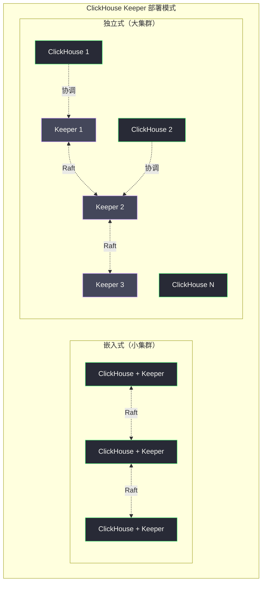

# 07 ClickHouse 运维——集群部署、监控与版本升级

**摘要：**
ClickHouse 的运维复杂度介于 MySQL 和 Ceph 之间——比单节点数据库复杂（需要管理 Shard/Replica 拓扑、ZooKeeper/Keeper 协调层），但比 Ceph 简单（守护进程种类少，故障模式相对可预期）。本文从 SRE 视角梳理 ClickHouse 的生产运维体系：硬件选型与 Shard/Replica 拓扑规划、ClickHouse Keeper 的部署、`system.*` 表的内置监控体系、Prometheus 指标与告警规则、备份与恢复（`FREEZE PARTITION` + `clickhouse-backup`）、版本升级的滚动重启策略与 Breaking Changes 检查，最后给出 ClickHouse vs Doris vs StarRocks 的选型决策框架。理解了前 6 篇的存储与执行原理，本文的运维手法才能"知其然且知其所以然"——而不是机械地抄配置。

---

## 第 1 章 集群部署拓扑规划

### 1.1 硬件选型原则

ClickHouse 是 IO 密集型 + 计算密集型的混合负载，硬件配置直接决定了查询性能上限——第 01 篇讲过，ClickHouse 的向量化执行充分利用多核 SIMD，第 03 篇讲过，Merge 和查询竞争磁盘带宽。硬件选型要匹配这两个特性。

**CPU**——ClickHouse 的向量化执行充分利用多核，建议 32-96 核的高核数服务器。支持 AVX2 或 AVX-512 的 CPU 能显著提升 SIMD 计算性能（在购买服务器时需确认 CPU 型号支持的指令集）。第 04 篇讲过，SIMD 指令让"一条指令处理多个数据"——AVX-512 一次处理 512 位（16 个 32 位 Float），比标量计算快 16 倍。**CPU 的 SIMD 指令集是 ClickHouse 性能的"硬件加速器"**——同样的向量化代码，有 AVX-512 的 CPU 比没有的快几倍。

**内存**——内存大小决定了可以缓存的数据量和 GROUP BY 聚合的规模。经验值：每 TB SSD 存储配置 8-16GB 内存；对于高并发场景（同时执行几十个查询），需要更多内存（每个查询可能占用数 GB HashTable）。第 04 篇讲过，GROUP BY 的内存占用 = `max_threads` × 单线程 HashTable 大小——32 线程 × 1GB HashTable = 32GB，一个查询就要 32GB 内存。**内存是 ClickHouse 的"聚合工作区"**——内存不够，聚合要么溢写（慢 5-10 倍），要么 OOM（查询失败）。

**磁盘**——
- **热数据（近 3 个月）**：NVMe SSD，提供低延迟随机读（稀疏索引查找需要随机 seek）
- **冷数据（3 个月以上）**：SATA SSD 或 HDD（通过 Storage Policy 将旧分区自动迁移）
- **RAID**：ClickHouse 通过副本（ReplicatedMergeTree）提供可靠性，不需要硬件 RAID。单块磁盘的 RAID-0 性能最好；如果需要比副本更强的本地保护，可用 RAID-10

第 03 篇讲过，ClickHouse 的稀疏索引查找是"随机读 mark 文件 + 顺序读 bin 文件"——mark 文件的随机读对延迟敏感（NVMe 100μs vs HDD 10ms，差 100 倍），bin 文件的顺序读对吞吐敏感（NVMe 3GB/s vs HDD 200MB/s，差 15 倍）。**热数据用 NVMe 让随机读快，冷数据用 HDD 让存储省**——这是存储分层的硬件基础。

**网络**——节点间数据传输（副本同步、Distributed 查询结果合并）需要低延迟网络，建议 25GbE 或 100GbE。第 05 篇讲过，副本同步要传 Part 数据（GB 级），Distributed 查询要传局部聚合结果（MB 到 GB 级）——网络带宽不够会成为瓶颈。**网络是 ClickHouse 分布式的"血管"**——带宽不够，副本同步慢、分布式查询慢。

硬件选型还有一个与"成本"相关的考量——**ClickHouse 对硬件的要求比 MySQL 高，但比 Hadoop 低**。MySQL 单机就能跑（2 核 4GB 的虚拟机），ClickHouse 单机至少要 16 核 64GB + NVMe SSD（否则向量化优势发挥不出来），Hadoop 集群通常要几十台机器。**ClickHouse 的"硬件门槛"让它不适合"小数据量 + 低预算"的场景**——如果数据只有几 GB，用 MySQL 或 PostgreSQL 更经济；数据到 TB 级才值得上 ClickHouse。这个"TB 级门槛"是 ClickHouse 选型的隐性条件——第 01 篇讲过，ClickHouse 的设计目标是"大数据量分析"，小数据量用它是"杀鸡用牛刀"。

### 1.2 Shard 与 Replica 数量规划

**Shard 数量**决定了存储容量的水平扩展上限和查询的最大并行度：

```
Shard 数量 = ceil(总数据量 / 单 Shard 目标存储量)

单 Shard 目标存储量经验值：
  - 热数据：NVMe SSD 容量 × 70%（留 30% 空余用于 Merge 操作）
  - 全量：单节点 SSD+HDD 总容量 × 70%
```

查询并行度最大值 = Shard 数量 × 每 Shard 的 CPU 线程数。譬如 10 Shard × 32 线程 = 320 路并行——对"10 亿行聚合"这种大查询，320 路并行能让延迟降到秒级。第 05 篇讲过，Shard 数应该与"典型查询的并行度需求"匹配——Shard 太少单查询慢，Shard 太多网络开销和 Initiator 合并开销上升。**3-20 个 Shard 能覆盖大多数场景**。

**Replica 数量**决定了可用性级别——
- **1 Replica（无副本）**：单点故障时数据不可用，适用于可以接受短暂中断的非关键业务
- **2 Replica**：最常见配置，单节点故障时自动切换，无数据丢失
- **3 Replica**：最高可用性，支持两个节点同时故障，适用于关键生产系统

第 05 篇讲过，Replica 数与写入吞吐近似反相关——Replica 越多，同步的份数越多，源 Replica 的网络发送开销越大。**2-3 副本是生产中的常见选择**——2 副本应对单机故障，3 副本应对跨机房故障。

Shard 和 Replica 的组合规划可以用一个具体例子来感受——假设 30TB 数据，单机能存 5TB（NVMe 7TB × 70%），需要 6 个 Shard（30 / 5 = 6）。每个 Shard 配 2 副本（高可用），总共 12 台机器。如果数据涨到 60TB，加 Shard 到 12（60 / 5 = 12），配 2 副本就是 24 台机器。**"数据量 / 单机容量 = Shard 数"是容量规划的核心公式**——根据数据增长预测提前规划 Shard 数，避免"磁盘满了才扩容"的被动局面。

容量规划还有一个与"增长率"相关的维度——**预留扩容空间**。如果当前 30TB 数据，年增长 50%，1 年后就是 45TB——按 5TB/Shard 算需要 9 个 Shard。如果建 6 个 Shard（当前够用），1 年后要扩到 9 个 Shard——扩容要迁移数据（第 05 篇讲过），代价高。如果一开始建 9 个 Shard（每 Shard 3.3TB，利用率 66%），1 年后每 Shard 5TB，刚好够用——不需要扩容。**"预留 30-50% 的扩容空间"是容量规划的经验值**——宁可初期利用率低，也不要频繁扩容。

### 1.3 ClickHouse Keeper 的部署

ClickHouse 22.x+ 推荐使用内置的 **ClickHouse Keeper** 替代外部 ZooKeeper，简化运维——第 05 篇讲过，Keeper 基于 Raft 协议，兼容 ZooKeeper 协议，但部署更简单（与 ClickHouse 同进程或独立部署）且性能更好（Raft 比 ZAB 写入吞吐高）。

```xml
<!-- 在独立节点或 ClickHouse 节点上启用 Keeper -->
<keeper_server>
    <tcp_port>9181</tcp_port>
    <server_id>1</server_id>  <!-- 每个 Keeper 节点唯一 ID -->
    <log_storage_path>/var/lib/clickhouse/coordination/log</log_storage_path>
    <snapshot_storage_path>/var/lib/clickhouse/coordination/snapshots</snapshot_storage_path>
    <coordination_settings>
        <operation_timeout_ms>10000</operation_timeout_ms>
        <session_timeout_ms>30000</session_timeout_ms>
    </coordination_settings>
    <raft_configuration>
        <server>
            <id>1</id>
            <hostname>keeper-1</hostname>
            <port>9234</port>
        </server>
        <server>
            <id>2</id>
            <hostname>keeper-2</hostname>
            <port>9234</port>
        </server>
        <server>
            <id>3</id>
            <hostname>keeper-3</hostname>
            <port>9234</port>
        </server>
    </raft_configuration>
</keeper_server>
```

Keeper 采用 Raft 共识协议，建议部署 3 或 5 个节点（奇数），可以与 ClickHouse 节点共存（小集群）或独立部署（大集群）。第 05 篇讲过，3 节点 Keeper 能支撑约 50 个 ClickHouse 节点；超过 50 节点考虑 5 节点 Keeper。**Keeper 的磁盘要用 SSD**——Raft 协议要求 fsync 到磁盘，HDD 的 fsync 延迟（毫秒级）会让 Keeper 写入吞吐严重下降。

Keeper 的部署有一个与"升级"相关的细节——**Keeper 的版本要与 ClickHouse 版本匹配**。ClickHouse 升级时，如果新版本依赖 Keeper 的新特性（譬如新版本的 Raft 协议变更），Keeper 也要同步升级。通常的升级顺序是——**先升级 Keeper，再升级 ClickHouse**——Keeper 向后兼容（新版本 Keeper 能服务旧版本 ClickHouse），但向前不兼容（旧版本 Keeper 可能不支持新版本 ClickHouse 的请求）。**"Keeper 先升，ClickHouse 后升"是升级的顺序原则**。

Keeper 的运维还有一个与"数据清理"相关的任务——**定期清理 ZooKeeper 里的旧数据**。ReplicatedMergeTree 在 ZooKeeper 里存了大量 znode（Part 元数据、log 队列、副本信息），下线的表或副本如果不清理，znode 会越积越多，影响 Keeper 性能。`SYSTEM DROP REPLICA` 清理下线副本的 znode，`SYSTEM CLEANUP REPLICA` 清理孤立的 znode。**"ZooKeeper 数据清理"是 ClickHouse 运维的隐形任务**——不清理不会立即出问题，但积累几个月后 Keeper 性能下降，排查起来困难。

ZooKeeper 数据清理还有一个与"表删除"相关的场景——**删表后清理 ZooKeeper 路径**。`DROP TABLE` 删除了 ClickHouse 里的表，但 ZooKeeper 里的 `/clickhouse/tables/{shard}/table_name` 路径不会自动删除——需要手动 `SYSTEM DROP REPLICA` 或用 `zkcli` 删除。如果删了很多表但不清理 ZooKeeper，znode 越积越多——这是"删表不彻底"的常见疏漏。**"删表后清理 ZooKeeper"是表生命周期管理的最后一步**——容易忘，但忘了会积累技术债。



---

## 第 2 章 system.* 表——内置监控体系

ClickHouse 的 `system` 数据库包含数十张只读系统表，是最直接的运维和诊断工具，不需要外部监控工具即可完成大多数日常诊断。第 06 篇已经从调优角度介绍了几张核心系统表，这里从运维角度系统梳理。

### 2.1 核心系统表速查

**`system.parts`**——Part 状态监控：

```sql
-- 查看各表的 Part 数量和总大小
SELECT
    database,
    table,
    partition,
    count()              AS parts_count,
    sum(rows)            AS total_rows,
    formatReadableSize(sum(bytes_on_disk)) AS disk_size,
    max(modification_time) AS last_modified
FROM system.parts
WHERE active = 1  -- 只看活跃 Part（未被合并的）
GROUP BY database, table, partition
ORDER BY parts_count DESC
LIMIT 20;
```

`parts_count` 过高（> 100 per partition）说明 Merge 跟不上写入速度，需要降低写入频率或增加 Merge 线程数。第 03 篇讲过，`too many parts` 是 ClickHouse 的"写入保护机制"——Part 数超过阈值时拒绝新写入。**`system.parts` 的 `parts_count` 是 `too many parts` 的预警指标**——在它触发保护之前就发现并处理。

`system.parts` 还有一个与"磁盘空间"相关的用法——**按表统计磁盘占用**：

```sql
SELECT
    database,
    table,
    formatReadableSize(sum(bytes_on_disk)) AS total_size,
    sum(rows) AS total_rows
FROM system.parts
WHERE active = 1
GROUP BY database, table
ORDER BY sum(bytes_on_disk) DESC
LIMIT 20;
```

这个查询能快速定位"哪些表占磁盘最多"——对"磁盘满了要清理"的场景，先找最大的表，再决定清理哪些分区。**"按表统计磁盘占用"是磁盘容量管理的起点**——知道哪张表占最多，才能针对性清理。

`system.parts` 还有一个与"Part 大小分布"相关的用法——**发现"异常小的 Part"**：

```sql
SELECT
    database,
    table,
    partition,
    countIf(rows < 1000) AS tiny_parts,
    count() AS total_parts
FROM system.parts
WHERE active = 1
GROUP BY database, table, partition
HAVING tiny_parts > 10
ORDER BY tiny_parts DESC;
```

`tiny_parts`（行数 < 1000 的 Part）过多说明"写入批次太小"——每次 INSERT 只写几百行，产生几百行的小 Part。小 Part 太多会让 Merge 负担重（要合并很多小 Part）且查询效率低（要打开很多小文件）。第 03 篇讲过，"写入批次至少几万行"是 ClickHouse 写入的最佳实践——`tiny_parts` 过多就是违反了这个实践的信号。**"异常小的 Part"是写入批次太小的预警**——发现后要调整写入端的批次大小。

`system.parts` 还有一个与"分区大小"相关的用法——**发现"过大分区"**：

```sql
SELECT
    database,
    table,
    partition,
    formatReadableSize(sum(bytes_on_disk)) AS partition_size,
    sum(rows) AS partition_rows
FROM system.parts
WHERE active = 1
GROUP BY database, table, partition
ORDER BY sum(bytes_on_disk) DESC
LIMIT 10;
```

过大分区（> 50GB）的 DROP PARTITION 代价高（删 50GB 要几十秒），且单分区的 Merge 任务重。如果发现某张表有 100GB 的分区，说明分区粒度太粗——譬如按月分区但每月 100GB，应该改成按天分区（每天 3GB）。**"过大分区"是分区粒度太粗的信号**——与"异常小 Part"相反，一个是批次太小，一个是分区太粗。

`system.parts` 的运维查询还有一个与"分区删除"相关的用法——**安全删除旧分区**。数据保留期到了（譬如只保留 90 天），要删除 90 天前的分区。先查 `system.parts` 确认要删的分区：

```sql
SELECT DISTINCT partition
FROM system.parts
WHERE active = 1 AND database = 'default' AND table = 'events'
ORDER BY partition;
```

确认后用 `ALTER TABLE events DROP PARTITION '20231001'` 删除——这个操作比 `DELETE WHERE date < '...'` 快得多（DROP PARTITION 是删文件，DELETE 是 Mutation 重写）。**"按分区删除"是 TTL 数据清理的最佳实践**——配合 `TTL date + INTERVAL 90 DAY` 自动删除，无需手动操作。

**`system.merges`**——后台合并监控：

```sql
-- 查看正在进行的 Merge
SELECT
    table,
    partition,
    elapsed,
    progress,
    formatReadableSize(total_size_bytes_compressed) AS size,
    num_parts,
    result_part_name
FROM system.merges
ORDER BY elapsed DESC;
```

`elapsed` 过长（> 1 小时）说明 Merge 任务太大或磁盘 IO 瓶颈——第 03 篇讲过，Merge 几十 GB 的 Part 要几分钟到几十分钟，如果经常超过 1 小时，说明磁盘带宽不够或 Merge 线程太少。

**`system.query_log`**——历史查询分析：

```sql
-- 慢查询分析（过去 1 小时）
SELECT
    user,
    query_duration_ms,
    read_rows,
    formatReadableSize(read_bytes) AS read_bytes,
    formatReadableSize(memory_usage) AS memory,
    query
FROM system.query_log
WHERE type = 'QueryFinish'
    AND query_start_time >= now() - INTERVAL 1 HOUR
    AND query_duration_ms > 5000
ORDER BY query_duration_ms DESC
LIMIT 20;
```

第 04 篇讲过，`system.query_log` 记录每次查询的 `read_rows`、`read_bytes`、`memory_usage`、`query_duration_ms`——这些字段是慢查询分析的"现场证据"。**`system.query_log` 是 ClickHouse 运维的"黑匣子"**——它记录了每条查询的完整执行信息，是事后分析的依据。

`system.query_log` 的配置有一个与"性能开销"相关的考量——**`log_queries` 默认开启，但会占用一些写入开销**（每次查询都记一条日志）。对超高并发场景（每秒几千查询），可以调低 `log_queries` 的采样率或关闭非关键日志类型。`log_query_duration_ms`（默认 0，记所有查询）可以设为 1000——只记超过 1 秒的查询，减少日志量。**"记所有查询"还是"只记慢查询"是 `system.query_log` 的配置权衡**——全记便于分析但开销大，只记慢查询省开销但漏了快查询的信息。生产中通常"全记"（开销可接受），只在超高并发场景才"只记慢查询"。

`system.query_log` 还有一个与"保留期"相关的设置——`query_log_max_size`（日志表最大行数）和 `query_log_flush_interval_milliseconds`（刷盘间隔）。日志表会越来越大，需要定期清理——`SYSTEM FLUSH LOGS` 强制刷盘，`TRUNCATE TABLE system.query_log` 清空历史。**`system.query_log` 的保留期通常设为 7-30 天**——足够分析近期慢查询，又不占太多磁盘。

`system.query_log` 的分析还有一个进阶用法——**按"查询模式"聚合慢查询**。譬如发现"同一类查询"反复出现在慢查询列表——`SELECT count() FROM events WHERE user_id = X` 有 100 个不同 `X` 的版本都慢。这说明"这个查询模式本身有问题"（譬如 `user_id` 不是主键前缀，无法剪枝），而不是"某个特定查询有问题"。按"查询模式"聚合（把 `user_id = 12345` 归一为 `user_id = ?`）能发现"模式性问题"——修一次，100 个查询都受益。**"按模式聚合"是慢查询分析的"从个体到模式"升级**——不局限于"修某个慢查询"，而是"修一类慢查询"。

按模式聚合的实现有一个技巧——**用 `normalizeQuery` 函数**。ClickHouse 的 `system.query_log` 有一个 `normalized_query` 字段，它是"把常量替换为 `?` 后的查询"——譬如 `WHERE user_id = 12345` 被归一为 `WHERE user_id = ?`。按 `normalized_query` 聚合能自动把"同一模式的不同常量"归到一起：

```sql
SELECT
    normalized_query,
    count() AS query_count,
    avg(query_duration_ms) AS avg_duration,
    max(query_duration_ms) AS max_duration
FROM system.query_log
WHERE type = 'QueryFinish' AND query_duration_ms > 5000
GROUP BY normalized_query
ORDER BY query_count DESC
LIMIT 20;
```

这个查询直接列出"最频繁的慢查询模式"——`query_count` 高的 `normalized_query` 就是"反复出现的慢查询模式"。**`normalizeQuery` 是 ClickHouse 内置的"模式聚合"工具**——不需要手动写正则归一，用现成函数即可。

慢查询分析还有一个与"用户维度"相关的视角——**按用户聚合慢查询**。譬如发现"分析师 A 的慢查询占 80%"——说明 A 的查询模式有问题（譬如总是写 `SELECT *`），或 A 的 Settings Profile 太宽松（譬如 `max_threads` 没限制）。按用户聚合能定位"问题用户"，针对性优化（譬如给 A 设更严格的 Profile）。**"按用户聚合"是慢查询治理的"责任到人"视角**——不局限于"修查询"，而是"修用户的查询习惯"。

按用户聚合的发现有一个后续动作——**与用户沟通，优化其查询习惯**。譬如发现分析师 A 总是写 `SELECT *`——告诉 A "只 SELECT 需要的列，能快 10 倍"。发现分析师 B 总是不加 `WHERE date` 条件——告诉 B "加时间范围能让查询用上分区裁剪"。这种"查询习惯优化"比"调配置"更治本——它让用户写出更好的 SQL，从源头减少慢查询。**"查询习惯优化"是慢查询治理的"授人以渔"**——不局限于"帮用户改 SQL"，而是"教用户写好 SQL"。

**`system.replicas`**——副本同步状态：

```sql
-- 检查副本同步延迟
SELECT
    database, table, replica_name,
    is_leader,
    inserts_in_queue,
    merges_in_queue,
    log_max_index - log_pointer AS replication_lag
FROM system.replicas
WHERE replication_lag > 0 OR inserts_in_queue > 0
ORDER BY replication_lag DESC;
```

第 05 篇讲过，`replication_lag` 持续增大说明副本同步速度跟不上写入速度——可能的原因有网络带宽不足、磁盘 IO 瓶颈、`background_fetches_pool_size` 太小。**`replication_lag` 是副本健康的"心跳"**——持续监控它，落后的 Replica 自动从负载均衡摘除。

`system.replicas` 还有一个与"Leader 选举"相关的字段——`is_leader`。ReplicatedMergeTree 的每个 Shard 有一个 Leader Replica，负责协调某些操作（譬如 Merge 的 Part 命名）。`is_leader = 1` 的 Replica 是当前 Leader。Leader 故障时，其他 Replica 通过 ZooKeeper 选举新 Leader——这个过程通常几秒到几十秒。**监控 `is_leader` 的变化能发现"Leader 频繁切换"的问题**——如果 Leader 每天切换几次，说明 Replica 之间的 ZooKeeper 会话不稳定，需要排查 Keeper 健康。

Leader 频繁切换的一个常见原因是——**ZooKeeper 会话超时**。Replica 与 ZooKeeper 维持一个会话（session），会话超时（默认 30 秒）后 Replica 被认为宕机，Leader 选举新 Replica。如果网络抖动导致会话频繁超时（譬如网络延迟偶尔超过 30 秒），Leader 就频繁切换。解法是增大 `session_timeout_ms`（譬如从 30 秒调到 60 秒），让会话更耐抖动。**"会话超时"是 Leader 切换的常见诱因**——调大超时能减少误切换，但代价是"真宕机时切换慢"——这是"误切换"与"切换延迟"的权衡。

Leader 选举还有一个与"脑裂"相关的风险——**网络分区导致双 Leader**。如果 ZooKeeper 集群本身发生网络分区（譬如 3 节点 Keeper，1 个节点与另外 2 个断开），少数派节点（1 个）可能误认为多数派（2 个）宕机，自己选举为 Leader——此时出现"两个 Leader"（脑裂）。Raft 协议通过"多数票"防止脑裂——少数派节点得不到多数票，不会成为 Leader。但 ZooKeeper 的 ZAB 协议在极端情况下（譬如会话超时与网络分区同时发生）可能脑裂——这是 ClickHouse Keeper（Raft）比 ZooKeeper（ZAB）更安全的一个原因。**"脑裂"是分布式协调的极端风险**——ClickHouse Keeper 的 Raft 协议比 ZooKeeper 的 ZAB 更能防脑裂。

**`system.mutations`**——Mutation 进度：

```sql
-- 查看未完成的 Mutation
SELECT
    database, table, mutation_id,
    command,
    create_time,
    parts_to_do,
    is_done
FROM system.mutations
WHERE is_done = 0
ORDER BY create_time;
```

第 03 篇讲过，Mutation 是"异步重写所有 Part"——`parts_to_do` 显示还有多少 Part 没重写完。Mutation 长时间不完成（`is_done = 0` 持续几小时）说明重写速度慢——可能是磁盘 IO 瓶颈或 Part 太多。**Mutation 是 ClickHouse 的"长事务"**——它不阻塞查询，但占用后台 IO，需要监控不要积压太多。

**`system.processes`**——当前正在运行的查询：

```sql
-- 查看正在运行的查询及资源消耗
SELECT
    query_id,
    user,
    elapsed,
    read_rows,
    formatReadableSize(memory_usage) AS memory,
    formatReadableSize(peak_memory_usage) AS peak_memory,
    query
FROM system.processes
ORDER BY memory_usage DESC;

-- 终止长时间运行的查询
KILL QUERY WHERE query_id = 'xxx-yyy-zzz';
```

`system.processes` 是"实时快照"——它显示当前正在执行的查询，而 `system.query_log` 是"历史记录"——查询完成后才记录。**`system.processes` 用于"实时干预"（KILL 慢查询），`system.query_log` 用于"事后分析"（找慢查询根因）**——两者互补。

`system.processes` 还有一个与"死锁"相关的用法——**发现"卡住的查询"**。有些查询不消耗 CPU（`CPU_usage` 接近 0）但也不结束（`elapsed` 很长）——这通常是"等锁"或"等网络"。譬如分布式查询等某个 Shard 响应，那个 Shard 又卡住了——整个查询挂在 `system.processes` 里。`KILL QUERY` 能终止这种查询，但治标不治本——要排查"为什么那个 Shard 卡住"。**"卡住的查询"是分布式系统的常见问题**——`system.processes` 的 `elapsed` + `CPU_usage` 是发现它们的入口。

`system.processes` 还有一个与"内存监控"相关的用法——**发现"内存大户"查询**。`ORDER BY memory_usage DESC` 能列出当前内存占用最大的查询——这些查询最可能触发 OOM。提前 `KILL` 内存大户能防止 OOM——比"等 OOM 后重启 ClickHouse"主动得多。**"内存大户监控"是 OOM 预防的入口**——在 OOM 之前发现并处理内存大户，比 OOM 后救火好。

内存大户的处理有一个与"自动 KILL"相关的进阶实践——**配置 `max_memory_usage` 自动终止内存超限的查询**。第 06 篇讲过，`max_memory_usage` 是 Settings Profile 的参数——查询内存超过这个值时自动终止。配合 `max_memory_usage_for_user`（单用户的总内存限制）和 `max_server_memory_usage`（服务器总内存限制），形成"单查询 / 单用户 / 全服务器"的三层内存保护。**三层内存保护是 OOM 预防的"自动防线"**——单查询超限先终止查询，单用户超限再限流用户，全服务器超限最后拒绝新查询——逐层保护，避免 OOM。

这三层保护的触发顺序值得理解——**从细到粗，逐层升级**。单查询超限（`max_memory_usage`）只终止那一个查询，其他查询不受影响——这是"最小影响"的保护。单用户超限（`max_memory_usage_for_user`）限流该用户的新查询（排队等待），已运行的查询继续——这是"中等影响"的保护。全服务器超限（`max_server_memory_usage`）拒绝所有新查询，已运行的继续——这是"最大影响"的保护。**"三层保护从细到粗"让"内存超限的影响最小化"**——能用单查询解决的不影响用户，能用用户解决的不影响全服务器。

### 2.2 系统表的运维集成

这些系统表不应该靠人工查询——应该集成到运维工具链：

**Grafana 看板**——把 `system.parts`、`system.merges`、`system.replicas`、`system.mutations` 的关键指标做成 Grafana 面板，让运维工程师一眼看到集群健康。

**告警规则**——`parts_count > 100`、`replication_lag > 100`、`mutation is_done = 0 超过 1 小时`等条件触发告警，让问题在"用户感知之前"被发现。

**自动巡检脚本**——定时跑 `system.*` 查询，把异常结果（Part 堆积、副本落后、Mutation 积压）发到运维群，让运维工程师每天上班就能看到集群的"健康报告"。

**成熟的 ClickHouse 运维团队会把这些系统表固化成"运维仪表盘"**——不是等出问题才手动查，而是持续监控，提前预警。这是从"被动救火"到"主动预防"的运维升级。

"主动预防"的运维升级有一个工程上的体现——**Runbook（运维手册）**。每条告警都应该有对应的 Runbook——"告警触发后，第一步查什么，第二步查什么，第三步怎么处理"。譬如"Part 数量过多"告警的 Runbook 是——1. 查 `system.parts` 确认是哪张表；2. 查 `system.merges` 看 Merge 是否在进行；3. 如果 Merge 没在进行，查 `background_pool_size` 是否太小；4. 如果 Merge 在进行但慢，查磁盘 IO 是否瓶颈。**Runbook 让"新人也能处理告警"**——不需要"老员工凭经验判断"，按手册执行即可。成熟的 ClickHouse 运维团队会为每条告警写 Runbook，让运维知识"可传承"而非"靠人脑"。

---

## 第 3 章 Prometheus 监控体系

### 3.1 启用 Prometheus Exporter

ClickHouse 内置了 Prometheus 格式的指标暴露端口，在 `config.xml` 中启用：

```xml
<prometheus>
    <endpoint>/metrics</endpoint>
    <port>9363</port>
    <metrics>true</metrics>
    <events>true</events>
    <asynchronous_metrics>true</asynchronous_metrics>
</prometheus>
```

启用后，Prometheus 可以从 `http://clickhouse-node:9363/metrics` 采集指标。`metrics` 暴露实时指标（查询数、Part 数），`events` 暴露累计事件（总查询数、总 Merge 数），`asynchronous_metrics` 暴露异步采集的指标（磁盘使用率、内存使用率）。**三类指标覆盖了"实时、累计、异步"三个维度**——让 Prometheus 能全面监控 ClickHouse。

Prometheus Exporter 的启用有一个与"安全"相关的细节——**`/metrics` 端点默认不鉴权**，暴露在内网可能泄露敏感信息（譬如查询文本）。生产中应该用防火墙限制 `/metrics` 端口的访问（只允许 Prometheus 服务器访问），或在 Nginx 反代层加鉴权。**"监控端点的访问控制"是 ClickHouse 安全的常见疏漏**——运维忙着加监控，却忘了监控端点本身也是攻击面。

Prometheus Exporter 还有一个与"指标粒度"相关的考量——**`asynchronous_metrics` 的采集间隔**。异步指标（磁盘使用率、内存使用率）默认每 60 秒采集一次——这个间隔对"趋势监控"够用，但对"瞬时告警"太慢（磁盘满的告警可能延迟 60 秒）。如果需要更快告警，可以调小 `asynchronous_metrics_update_period_s`（譬如 15 秒）——但代价是 ClickHouse 的 CPU 开销增加（更频繁地采集指标）。**"异步指标采集间隔"是"告警延迟"与"采集开销"的权衡**——通常 60 秒够用，只有对"秒级告警"有需求时才调小。

Prometheus 监控还有一个与"长期存储"相关的考量——**Prometheus 本身的保留期**。Prometheus 默认保留 15 天指标——超过后自动删除。对"长期趋势分析"（譬如对比今年和去年的查询延迟），15 天不够——需要更长的保留期。解法是——把 Prometheus 的指标远程写到长期存储（VictoriaMetrics、Thanos、Cortex），保留几年。**"Prometheus 短期 + 长期存储长期"是监控数据的分层存储**——与 ClickHouse 的"热数据 NVMe + 冷数据 HDD"同理，都是"近期高频访问快存储，历史低频访问省存储"。

长期存储的选型有一个与"ClickHouse 本身"相关的有趣用法——**用 ClickHouse 存 Prometheus 指标**。ClickHouse 的 `PrometheusExporter` 表函数可以直接读 Prometheus 的 `/metrics` 端点，把指标存到 ClickHouse 表里。这样"用 ClickHouse 监控 ClickHouse"——指标存到 ClickHouse，用 SQL 查询分析。**"用 ClickHouse 存监控指标"是"吃自己的狗粮"**——既验证了 ClickHouse 的时序数据能力，又省了单独的长期存储（VictoriaMetrics/Thanos）。很多 ClickHouse 团队用这种方式——ClickHouse 的列存压缩让监控指标的存储成本远低于 Prometheus 原生存储。

### 3.2 关键监控指标

**集群整体健康**：

```promql
# 正在运行的查询数（应保持在合理范围内，通常 < 20）
ClickHouseMetrics_Query

# 后台 Merge 任务数
ClickHouseMetrics_BackgroundPoolTask

# 副本同步队列大小（应保持接近 0）
ClickHouseMetrics_ReplicatedChecks
```

**存储健康**：

```promql
# 磁盘使用率（按表、磁盘分类）
ClickHouseDiskDataBytes / ClickHouseDiskTotalBytes

# Part 数量告警（分区内 Part 过多）
ClickHouseMetrics_PartsActive
```

**查询性能**：

```promql
# 查询执行时间 P99（ms）
histogram_quantile(0.99, rate(ClickHouseProfileEvents_QueryTimeMicroseconds_bucket[5m])) / 1000

# 每秒读取行数
rate(ClickHouseProfileEvents_SelectedRows[1m])

# 每秒 Merge 的字节数（后台 Merge 压力）
rate(ClickHouseProfileEvents_MergedRows[1m])
```

这些指标的命名规律是——`ClickHouseMetrics_*` 是实时状态（查询数、Part 数），`ClickHouseProfileEvents_*` 是累计事件（查询时间、读取行数），`ClickHouseDisk*` 是磁盘信息。**理解命名规律能快速找到需要的指标**——譬如要监控"内存使用"，找 `ClickHouseMetrics_MemoryTracking`；要监控"查询延迟"，找 `ClickHouseProfileEvents_QueryTimeMicroseconds`。

### 3.3 告警规则示例

```yaml
groups:
  - name: clickhouse
    rules:
      # 查询延迟过高
      - alert: ClickHouseSlowQueries
        expr: histogram_quantile(0.99, rate(ClickHouseProfileEvents_QueryTimeMicroseconds_bucket[5m])) / 1e6 > 30
        for: 5m
        labels:
          severity: warning
        annotations:
          summary: "ClickHouse P99 查询延迟超过 30 秒"

      # Part 数量过多（可能导致 too many parts）
      - alert: ClickHouseTooManyParts
        expr: ClickHouseMetrics_PartsActive > 10000
        for: 5m
        labels:
          severity: warning
        annotations:
          summary: "ClickHouse Part 总数超过 10000，可能发生 too many parts"

      # 副本同步积压
      - alert: ClickHouseReplicationLag
        expr: ClickHouseMetrics_ReplicatedChecks > 100
        for: 10m
        labels:
          severity: warning
        annotations:
          summary: "ClickHouse 副本同步积压，超过 100 个待同步操作"

      # 磁盘空间告警
      - alert: ClickHouseDiskUsageHigh
        expr: ClickHouseDiskDataBytes / ClickHouseDiskTotalBytes > 0.8
        for: 5m
        labels:
          severity: critical
        annotations:
          summary: "ClickHouse 磁盘使用率超过 80%"
```

这四条告警规则覆盖了 ClickHouse 运维的四大风险——**慢查询、Part 堆积、副本落后、磁盘满**。每条规则都有 `for` 持续时间（避免瞬时波动误报）和 `severity` 级别（warning / critical）。**告警规则的设计原则是"宁可少报不可误报"**——误报多了会让运维工程师"狼来了"麻木，漏报才是真正的风险。

告警规则还有一个与"分级"相关的设计——**warning 和 critical 两级**。warning 是"需要关注但不紧急"（譬如 Part 数 5000，离 10000 的阈值还有距离），critical 是"必须立即处理"（譬如磁盘 85%，快满了）。warning 发到运维群，critical 打电话给值班工程师。**分级让"紧急程度"与"响应速度"匹配**——不分级的话，所有告警都打电话，运维会被打爆；都不打电话，真正的紧急被忽略。第 06 篇讲的"软保护/硬保护"思路在告警分级里同样适用——warning 是软保护（提醒），critical 是硬保护（强制响应）。

---

## 第 4 章 备份与恢复

### 4.1 FREEZE PARTITION——内置快照备份

ClickHouse 内置了 `ALTER TABLE ... FREEZE PARTITION` 命令，通过硬链接创建 Part 的快照：

```sql
-- 备份 2024 年 1 月的分区
ALTER TABLE events FREEZE PARTITION '202401';

-- 备份所有分区
ALTER TABLE events FREEZE PARTITION '';
```

`FREEZE PARTITION` 的原理是——把指定分区的所有 Part 文件做硬链接到 `/var/lib/clickhouse/shadow/` 目录。硬链接不复制数据（只是 inode 引用），瞬间完成，不占额外磁盘空间。备份后可以把 `shadow/` 目录的内容拷贝到外部存储（S3、NFS）。

**FREEZE PARTITION 的优点是"快"**——硬链接瞬间完成，不影响查询和写入。**缺点是"本地快照"**——硬链接在同一磁盘上，磁盘坏了快照也坏了。要真正防磁盘故障，需要把 `shadow/` 拷到外部存储——这一步通常用 `rsync` 或 `clickhouse-backup` 工具完成。

`FREEZE PARTITION` 有一个与"增量备份"配合的用法——**按分区逐个 FREEZE**。譬如每天凌晨 FREEZE 当天的分区——`ALTER TABLE events FREEZE PARTITION '2024-01-15'`——只备份当天新增的数据。这种"按天 FREEZE"的方式实现了"增量备份"——每天只备份新分区，不重复备份历史分区。配合 `rsync --ignore-existing`（只传新文件），能把每天的增量备份同步到 S3，带宽开销小。**"按分区 FREEZE + rsync 增量同步"是 ClickHouse 内置的增量备份方案**——不需要额外工具，用 SQL + rsync 就能实现。

`FREEZE PARTITION` 有一个与"并发写入"相关的限制——**FREEZE 期间不能写入该分区**。FREEZE 做硬链接时，如果该分区有新 Part 写入，新 Part 不会被硬链接（FREEZE 只链接当时的 Part）。这意味着 FREEZE 期间的写入不在备份里——备份不完整。解法是——FREEZE 前暂停该分区的写入（譬如暂停 Kafka 消费），FREEZE 后恢复。**"FREEZE 时暂停写入"是备份完整性的保障**——与"恢复时暂停写入"同理，都是"避免备份/恢复与写入冲突"。

### 4.2 clickhouse-backup——增量备份到 S3

`clickhouse-backup` 是社区开源的 ClickHouse 备份工具，支持增量备份到 S3：

```bash
# 创建备份
clickhouse-backup create backup_20240101

# 上传到 S3
clickhouse-backup upload backup_20240101

# 从 S3 恢复
clickhouse-backup download backup_20240101
clickhouse-backup restore backup_20240101
```

`clickhouse-backup` 的优势在于——**增量备份**（只备份变化的 Part）和**远程存储**（S3/GCS/Azure Blob）。增量备份让"全量备份"只在首次做，后续只备份变化部分——备份窗口从几小时缩短到几分钟。远程存储让备份与集群物理隔离——集群所在机房坏了，备份还在 S3 上。

`clickhouse-backup` 的恢复流程有一个与"数据一致性"相关的细节——**恢复时要暂停写入**。恢复过程中，`clickhouse-backup` 把备份的 Part 文件下载到本地，然后 `RESTORE` 命令把它们注册到 ClickHouse。如果恢复期间有新写入，新写入的 Part 与恢复的 Part 可能冲突（譬如同名）。**"恢复时暂停写入"是备份恢复的安全前提**——与第 05 篇讲的"缩容时暂停写入"同理，都是"避免数据冲突"。

`clickhouse-backup` 还有一个与"跨集群恢复"的用法——**把 A 集群的备份恢复到 B 集群**。譬如生产集群的数据要复制到测试集群——`clickhouse-backup upload` 从 A 上传到 S3，`clickhouse-backup download` 从 S3 下载到 B，`clickhouse-backup restore` 在 B 上恢复。这种"跨集群恢复"是"数据迁移"和"环境同步"的便捷工具——不需要写复杂的迁移脚本，用备份工具就能完成。

**备份策略的经验值是**——首次全量备份 + 每日增量备份 + 每周全量备份（防止增量链过长）。备份保留策略通常是"近 7 天每日备份 + 近 4 周每周备份 + 近 12 月每月备份"——覆盖短期恢复（误删数据）和长期归档（合规要求）。

### 4.3 副本冗余不是备份

一个常见的误区是——"我有 2 副本，不需要备份"。这是错的——副本冗余防"单机故障"，不防"人为误操作"。譬如运维误执行 `DROP TABLE events`——两个副本的表都删了（DDL 在所有副本上执行），副本冗余救不回来。**副本冗余是"高可用"，备份是"可恢复"**——两者覆盖不同的风险场景，不能互相替代。

备份的真正价值是"防人为误操作"——误删表、误删分区、误改数据（譬如 UPDATE 写错 WHERE 条件）。这些操作在所有副本上同步执行，副本冗余无效，只有备份能恢复。**"有副本也要备份"是 ClickHouse 运维的铁律**——副本保可用性，备份保可恢复性，缺一不可。

备份的频率有一个与"RPO（Recovery Point Objective）"相关的考量——**备份间隔决定"最多丢多少数据"**。每天备份一次，最多丢 1 天的数据；每小时备份一次，最多丢 1 小时。RPO 越小，备份频率越高，备份开销越大。**"RPO 与备份频率成正比"是备份策略的核心权衡**——对"日志分析"场景（RPO 1 天可接受），每天备份够；对"交易日志"场景（RPO 几分钟），需要小时级备份或连续复制。

备份的恢复测试也是一个常被忽略的环节——**"备份了不等于能恢复"**。很多团队定期备份，但从不测试恢复——等到真要恢复时才发现备份损坏或恢复流程有问题。成熟的运维团队会定期做"恢复演练"——每季度选一个备份，在测试环境恢复，验证数据完整。**"恢复演练"是备份策略的"验收测试"**——不演练的备份等于没备份。

恢复演练的频率有一个经验值——**每季度一次**。这个频率足够让"备份流程"保持熟练（不会"一年才演练一次，人都忘了怎么恢复"），又不至于太频繁占用太多资源。演练时选一个最近的备份，在测试环境恢复，跑 `SELECT count(), sum(cityHash64(*)) FROM table` 验证数据完整（与第 05 篇讲的"迁移验证"同方法）。**"季度恢复演练"是备份策略的"例行体检"**——定期验证"备份能恢复"，而非"备份了就万事大吉"。

---

## 第 5 章 版本升级——滚动重启策略

### 5.1 ClickHouse 的版本管理

ClickHouse 的版本号格式：`YY.M.PATCH`（如 `24.3.2.23`）。每年 3 月和 8 月发布 **LTS（Long-Term Support）版本**，维护周期 1 年；其他月份发布常规版本，只维护 3-6 个月。

**生产建议**：生产集群使用 LTS 版本（如 23.8、24.3），避免频繁跟进非 LTS 版本带来的兼容性风险。LTS 版本经过更长时间的测试和修复，稳定性更高；非 LTS 版本只维护 3-6 个月，到期后不再修 Bug——生产用非 LTS 等于"用不修 Bug 的版本"。**LTS 是 ClickHouse 的"生产档"**——生产集群只跟 LTS，测试集群可以试非 LTS。

LTS 的选择有一个与"ClickHouse 发版节奏"相关的背景——ClickHouse 是"快速迭代"的开源项目，几乎每周都有新版本（非 LTS）。这种快速迭代让功能快速演进，但也带来"Bug 多"和"兼容性差"的风险。LTS 是"在快速迭代中选出的稳定点"——经过几个月的测试和修复，标记为"生产可用"。**"用 LTS 是用'经过验证的稳定点'，而非'最新功能'"**——生产要稳定，测试要新功能，这是 LTS 与非 LTS 的分工。

LTS 的升级节奏有一个经验值——**每半年跟一次 LTS**（3 月和 8 月各一次）。不跟太频繁（每次 LTS 都跟）——升级有风险，频繁升级增加风险暴露面；也不跟太懒（几年不升级）——老版本的 Bug 不修，新功能用不上。**"半年跟一次 LTS"是生产集群的升级节奏**——既享受稳定性，又跟上功能演进。这个节奏也与 ClickHouse 的 LTS 发版周期（半年一次）匹配——每次 LTS 发布后等几个月（让早期采用者踩坑），再升级到那个 LTS。

升级的时机选择有一个与"业务低峰"相关的考量——**在业务低峰期升级**。譬如凌晨 2-4 点是查询最少的时候——此时升级，即使出问题影响也小。避免在"大促日"或"报表截止日"升级——那些时间查询多，出问题影响大。**"业务低峰升级"是运维的时间窗口策略**——与"扩容在低峰做"同理，都是"把风险高的操作放在影响小的时间"。

升级的沟通也有一个工程实践——**升级前通知业务方**。即使是滚动升级（不停机），也可能出现"短暂的查询变慢"（升级中的 Replica 不参与查询，剩余 Replica 负载增加）。提前通知业务方"今晚 2-4 点升级，可能有短暂查询变慢"，让业务方有心理预期——避免"突然变慢"被当成故障报修。**"升级前通知"是运维与业务的协作礼仪**——不搞"偷偷升级"，让业务方"知情且配合"。

升级的回滚预案也要提前准备——**升级前确认"回滚包"就绪**。回滚包是旧版本的 deb/rpm 包，放在所有节点上可访问的位置。如果升级后出问题，能立刻 `dpkg -i clickhouse-server_旧版本.deb` 回滚——不需要临时下载（网络可能不通或旧版本已下架）。**"回滚包就绪"是升级前的"安全检查"**——与"备份就绪"同理，都是"做最坏打算的准备"。

升级还有一个与"配置文件"相关的准备——**备份 `config.xml` 和 `users.xml`**。新版本可能引入新的配置项或废弃旧配置项——升级后如果配置文件不兼容，ClickHouse 启动失败。提前备份配置文件，升级后如果启动失败，能快速恢复旧配置。**"配置文件备份"是升级准备的细节**——容易忘，但忘了会让"启动失败"变成"无法恢复"。

升级前的准备清单可以总结为四项——**回滚包就绪、配置文件备份、业务方通知、选择低峰窗口**。这四项是"升级前的安全检查清单"——每项都对应一个"升级失败时的应对能力"（回滚包对应"能回退版本"，配置备份对应"能恢复配置"，业务通知对应"业务方有预期"，低峰窗口对应"影响最小"）。**"四项准备"是升级风险的"四道防线"**——缺一项都可能让"升级失败"升级为"生产事故"。

升级是 ClickHouse 运维中"风险最高但频率最低"的操作——一年只做一两次，但做不好就是生产事故。把升级流程固化成"检查清单 + 自动化脚本"能降低人为失误——譬如写一个 `upgrade.sh` 脚本，自动执行"备份配置 → 停服务 → 装新包 → 启服务 → 验证"五步，运维只需跑脚本 + 看结果。**"升级自动化"是运维成熟度的标志**——从"手动逐步操作"到"脚本一键执行"，降低人为失误风险。这也是 SRE "消除 Toil"（重复性手工劳动）理念在 ClickHouse 运维中的体现。

### 5.2 滚动升级流程

ClickHouse 支持在线滚动升级（不需要停机），但需要按 Replica 逐个升级，确保集群高可用：

```bash
# Step 1：检查集群当前状态，确保无副本同步积压
clickhouse-client --query "SELECT database, table, replica_name, replication_lag FROM system.replicas WHERE replication_lag > 0;"

# Step 2：在一个节点上升级（以节点 node-1b 为例）
# 先停止 ClickHouse 服务
systemctl stop clickhouse-server

# 安装新版本（deb 包）
dpkg -i clickhouse-server_24.3.2.23_amd64.deb
dpkg -i clickhouse-client_24.3.2.23_amd64.deb

# 启动新版本
systemctl start clickhouse-server

# Step 3：等待该节点的副本同步完成（replication_lag 归零）
clickhouse-client --query "SELECT replication_lag FROM system.replicas LIMIT 5;"

# Step 4：验证该节点查询正常
clickhouse-client --query "SELECT count() FROM system.tables;"

# Step 5：重复 Step 2-4，升级集群内所有其他节点
```

**滚动升级的核心是"逐节点升级，每升一个验证一个"**——不要批量升级所有节点，否则一旦新版本有 Bug，所有节点同时挂。逐节点升级让"Bug 影响范围控制在单节点"——一个节点升级后出问题，其他节点还是旧版本，集群仍能服务。

**升级注意事项**：
- 每次只升级一个节点，等前一个节点完全恢复后再升级下一个
- ClickHouse 版本跨度不宜太大（最好逐个次版本升级，不要跳版本），防止数据格式不兼容
- 升级前备份 `config.xml` 和 `users.xml`，新版本可能有配置项变更
- 注意 ZooKeeper/Keeper 的路径格式变化（部分版本升级需要迁移 ZooKeeper 数据）

> [!warning] 生产避坑：升级前检查 Breaking Changes
> ClickHouse 每个版本都有 Changelog，其中标注了 Breaking Changes（不向后兼容的变更）。升级前必须阅读目标版本的 Changelog，重点关注：
> - 函数行为变化（如某些 SQL 函数在新版本返回不同类型）
> - 配置项重命名或废弃
> - 存储格式变化（通常有向后兼容，但某些极少数情况不兼容）
> 建议在测试环境充分验证后再在生产集群升级。

### 5.3 升级回滚

升级后如果发现新版本有严重 Bug，需要回滚到旧版本。ClickHouse 的回滚有一个限制——**新版本写入的数据格式可能旧版本不认**。譬如 24.3 引入了新的 Part 格式，24.3 写入的 Part 在 24.2 上无法读取。**回滚前要确认"新版本运行期间没有写入新格式的 Part"**——如果已经有新格式 Part，回滚后那些 Part 无法读取，数据丢失。

规避这个风险的方法是——**升级后先观察一段时间（譬如 1 小时），确认无 Bug 再允许写入**。观察期间只读不写，即使回滚也没有新格式 Part。**"升级后观察期"是 ClickHouse 升级的"安全垫"**——让 Bug 在观察期暴露，而非在写入后暴露。

观察期的长度有一个经验值——**1-2 小时**。这个时间足够让"常见 Bug"暴露（譬如启动失败、查询报错、副本同步异常），又不至于太长影响业务。观察期内可以跑一些"只读验证查询"——譬如 `SELECT count() FROM events`、`SELECT * FROM events LIMIT 10`——验证新版本能正常读取数据。**"只读验证"是观察期的核心动作**——不写入但有读取，让"读 Bug"暴露，不引入"写 Bug"的风险。

观察期还有一个与"副本同步"相关的验证——**确认副本同步正常**。升级一个 Replica 后，查 `system.replicas` 确认它的 `replication_lag` 归零——说明新版本能正常与旧版本的 Replica 同步。如果 `replication_lag` 持续增大，说明新版本的副本同步协议有 Bug——此时应该回滚，不要继续升级其他节点。**"副本同步验证"是滚动升级的"节点间兼容性测试"**——确认新旧版本能协同工作，再继续升级。

滚动升级的节奏有一个经验值——**每升一个节点，观察 10-30 分钟再升下一个**。这个观察时间足够让"常见问题"暴露（譬如副本同步失败、查询报错），又不至于太慢（整个集群升完要几小时）。10 节点集群，每节点观察 20 分钟，总共约 3 小时——在维护窗口内能完成。**"逐节点观察"是滚动升级的安全节奏**——不要"批量升级 + 一次性观察"，那会让"Bug 影响多个节点"。

如果已经有新格式 Part 必须回滚，解法是——用新版本把新格式 Part 转成旧格式（`ALTER TABLE ... MODIFY SETTING ...`），再回滚到旧版本。这个过程复杂且有风险——**"能不回滚就不回滚"是 ClickHouse 升级的原则**——升级前充分测试，避免回滚。

---

## 第 6 章 ClickHouse vs Doris vs StarRocks——选型决策框架

在 OLAP 系统选型中，ClickHouse、[[Doris]]、StarRocks 三者功能重叠度高，如何选择是工程团队常见的困惑。第 01 篇讲过 ClickHouse 与 Doris/Trino 的初步对比，这里从运维和选型角度系统展开。

### 6.1 核心差异分析

| 维度 | ClickHouse | Doris | StarRocks |
| :--- | :--- | :--- | :--- |
| **单表大数据量聚合** | 极佳（稀疏索引+向量化） | 好 | 好 |
| **多表关联查询** | 一般（分布式 JOIN 能力弱） | 好（完整 CBO + Shuffle JOIN） | 极佳（全向量化 CBO） |
| **实时数据写入** | 好（批量写入高吞吐） | 极好（Stream Load、Routine Load） | 极好（Primary Key 实时更新） |
| **数据更新/删除** | 差（Mutation 异步重写） | 好（Unique Key 模型） | 好（Primary Key 实时更新） |
| **运维复杂度** | 中（ZooKeeper/Keeper + 手动 DDL） | 中（FE/BE 两种进程） | 中（FE/BE 两种进程） |
| **SQL 兼容性** | 良（大量方言，与标准 SQL 有差异） | 好（兼容 MySQL 语法） | 好（兼容 MySQL 语法） |
| **生态成熟度** | 很高（早期开源，社区大） | 高（Apache 项目） | 中（较新，快速发展） |
| **云原生支持** | 一般（存算不分离） | 好（存算分离版 Doris 3.0） | 好（存算分离 Shared-Nothing/Shared-Data） |

这张表的洞察是——**ClickHouse 的优势在"单表聚合"，Doris/StarRocks 的优势在"多表 JOIN 和实时更新"**。ClickHouse 的分布式 JOIN 能力弱（第 05 篇讲过，只有广播 JOIN 和预分片），数据更新差（第 03 篇讲过，Mutation 是异步重写）——这两个短板正是 Doris/StarRocks 的强项。**"单表 vs 多表"、"批量 vs 实时"是选型的核心分界线**。

这个分界线可以用一个决策树来概括——

1. **主要查询是单表聚合吗？** 是 → 考虑 ClickHouse；否（多表 JOIN 为主） → 考虑 Doris/StarRocks。
2. **数据需要频繁更新删除吗？** 是 → 考虑 Doris/StarRocks（Unique Key / Primary Key 模型）；否（追加写入为主） → ClickHouse 够用。
3. **需要实时（秒级）数据可见性吗？** 是 → 考虑 Doris/StarRocks（Stream Load / Primary Key 实时更新）；否（分钟级批量写入可接受） → ClickHouse 够用。
4. **团队有专门的 OLAP DBA 吗？** 有 → ClickHouse 的手动调优能发挥极致；没有 → Doris/StarRocks 的自动优化更省心。

**这个决策树不是"非此即彼"**——有些场景可能混合用——譬如 ClickHouse 做日志分析（单表聚合强），Doris 做业务报表（多表 JOIN 强），两者各取所长。**"多引擎共存"是大型数据平台的常态**——没有"一个引擎打天下"的银弹，每个引擎在自己擅长的场景发挥。

多引擎共存有一个与"数据同步"相关的工程挑战——**同一份数据要在多个引擎之间同步**。譬如原始数据在 ClickHouse（日志分析），聚合结果要同步到 Doris（业务报表），实时指标要同步到 Redis（高并发点查）。这种"多引擎数据同步"通常用 CDC（Change Data Capture）工具——譬如 Flink CDC 从 ClickHouse 读变更，写到 Doris 和 Redis。**"多引擎共存"的代价是"数据同步复杂度"**——要维护多条同步链路，每条链路都有延迟和一致性问题。生产中要权衡"多引擎的收益"与"同步的复杂度"——如果同步复杂度超过收益，不如"用一个引擎 + 接受它的短板"。

### 6.2 选型建议

**选 ClickHouse 的场景**：
- **日志分析、监控指标存储**：时序单表查询为主，高吞吐写入，不需要频繁更新删除（如 [[Elasticsearch]] 的替代方案）
- **事件追踪、点击流分析**：用户行为数据，超大数据量单表聚合（按 user_id/date 分组统计）
- **已有 ClickHouse 积累**：团队有 ClickHouse 运维经验，不需要迁移

**选 Doris 的场景**：
- **多维数据分析**：宽表模型 + 复杂多表 JOIN，如数据仓库中的业务报表
- **实时数据对接**：Flink CDC 实时同步 MySQL 变更数据（Doris 的 Unique Key 模型天然支持 UPSERT）
- **替代 Hive 做 OLAP 加速**：通过 Hive Catalog 直接查询 Hive 数据，零迁移成本

**选 StarRocks 的场景**：
- **高并发点查 + OLAP 混合**：StarRocks 对并发查询的优化更好（Primary Key 表的点查接近 Redis 量级）
- **超大规模集群**：StarRocks 的存算分离架构对 Kubernetes 原生支持更好，弹性扩缩容更容易
- **极致的复杂查询性能**：StarRocks 的 CBO 和全向量化执行在多表关联场景接近或超越 ClickHouse 的单表查询性能

### 6.3 选型的工程视角

选型不只是"功能对比"——还有几个工程视角的考量：

**团队技能**——ClickHouse 的调优门槛高（主键设计、跳数索引、物化视图都要懂），Doris/StarRocks 的调优门槛低（CBO 自动优化，用户不用关心分片）。**如果团队没有专门的 ClickHouse DBA，Doris/StarRocks 的"自动优化"可能更省心**。

**迁移成本**——如果已有 MySQL/Hive 生态，Doris/StarRocks 兼容 MySQL 语法，迁移成本低；ClickHouse 有大量方言（譬如 `arrayJoin`、`dictGet`），从 MySQL 迁移要改 SQL。**"SQL 兼容性"影响迁移成本**——Doris/StarRocks 的 MySQL 兼容让它们在"替换 MySQL 慢查询"场景更顺手。

**社区与支持**——ClickHouse 社区最大（早期开源，用户多），Doris 是 Apache 项目（社区活跃），StarRocks 较新但快速发展。**社区大小影响"遇到问题能否找到答案"**——ClickHouse 的 Stack Overflow 答案最多，Doris/StarRocks 的中文社区更活跃（都是国产开源）。

**云原生**——ClickHouse 的存算不分离（每个副本存完整数据），弹性扩缩容难；Doris 3.0 和 StarRocks 都有存算分离版本，计算节点无状态，Kubernetes 弹性扩缩容更容易。**"云原生"是 ClickHouse 的短板**——ClickHouse Cloud（商业版）用 SharedMergeTree 实现存算分离，但社区版没有这个能力。如果你的基础设施是 Kubernetes + 对象存储，Doris/StarRocks 的存算分离更契合。

云原生的短板有一个与"成本"相关的延伸——ClickHouse 社区版的"存算不分离"意味着每个副本都存完整数据——3 副本就是 3 份数据，存储成本是"1 份数据"的 3 倍。而存算分离架构（Doris 3.0 / StarRocks Shared-Data）的数据存在共享存储（S3/HDFS）上，计算节点无状态——3 个计算节点共享 1 份数据，存储成本是"1 份数据"。**"存算分离 vs 存算一体"在存储成本上差 N 倍（N = 副本数）**——对大数据量场景，这个成本差异很可观。这也是 ClickHouse Cloud 推 SharedMergeTree 的商业动机——存算分离让云上的 ClickHouse 更省钱。

---

## 第 7 章 小结与专栏结语

### 7.1 运维重点

ClickHouse 的运维重点是：

1. **Part 健康监控**——通过 `system.parts` 持续监控 Part 数量，防止 too many parts 问题
2. **副本同步监控**——通过 `system.replicas` 监控 `replication_lag`，及时发现副本落后
3. **慢查询治理**——定期分析 `system.query_log`，发现并优化慢查询
4. **磁盘空间预警**——在达到 80% 之前启动扩容或清理流程
5. **备份与恢复**——副本冗余不是备份，定期 `FREEZE PARTITION` 或 `clickhouse-backup` 到外部存储
6. **版本升级**——用 LTS 版本，滚动升级，升级前检查 Breaking Changes

版本升级采用滚动重启策略，逐节点升级，充分利用 ReplicatedMergeTree 的高可用能力实现零停机升级。

### 7.2 专栏结语

至此，ClickHouse 系列七篇完结——从全局架构（第 01 篇）到 MergeTree 引擎（第 02 篇）、数据写入与合并（第 03 篇）、查询执行引擎（第 04 篇）、分布式表与分片（第 05 篇）、性能调优（第 06 篇）、运维与升级（第 07 篇），覆盖了 ClickHouse 从"理解原理"到"生产落地"的完整链路。

ClickHouse 的设计哲学是"简单但极致"——存储引擎只有 MergeTree 家族（而非 InnoDB/MyISAM 多种），执行引擎只有 Pipeline（而非 Volcano/向量化多模式），分布式层只有 Distributed 表（而非 Region/Partition 多层）。这种"少即是多"的哲学让 ClickHouse 在"单表大数据量聚合"场景做到了极致——稀疏索引 + 向量化 + 列存压缩 + MPP 并行，四重加速叠加，单表聚合性能领先同类产品几倍。

但"简单但极致"的代价是"不够灵活"——分布式 JOIN 弱（只有广播和预分片）、数据更新差（Mutation 异步重写）、分片不可变（改分片键要全表迁移）。这些短板在"多表关联 + 实时更新"场景暴露——Doris/StarRocks 在这些场景更合适。**ClickHouse 不是"万能 OLAP"——它是"单表聚合 OLAP 的极致"**，选型时认清它的边界，才能用好它的长处。

在 OLAP 系统选型时，ClickHouse 是单表大数据量聚合的最优选择，Doris/StarRocks 在多表 JOIN 和实时数据更新场景更具优势——三者互补而非完全竞争。理解了 ClickHouse 的原理和边界，才能在选型时做出正确的判断——而不是"哪个火用哪个"。

---

## 参考资料

1. ClickHouse 运维文档. https://clickhouse.com/docs/operations
2. ClickHouse Keeper 文档. https://clickhouse.com/docs/operations/clickhouse-keeper
3. ClickHouse system 表文档. https://clickhouse.com/docs/operations/system-tables
4. ClickHouse Prometheus 监控文档. https://clickhouse.com/docs/operations/monitoring
5. clickhouse-backup 工具. https://github.com/Altinity/clickhouse-backup
6. ClickHouse 版本发布说明. https://clickhouse.com/docs/whats-new
7. Apache Doris 文档. https://doris.apache.org/docs/
8. StarRocks 文档. https://docs.starrocks.io/

---

> [!note] 思考题
> 1. SharedMergeTree 是 ClickHouse Cloud 的核心引擎——数据存储在对象存储（S3）上，计算节点无状态。这实现了计算与存储分离——计算节点可以弹性扩缩容。与传统的 ReplicatedMergeTree（每个副本存储完整数据）相比，SharedMergeTree 的存储成本降低了多少？但对象存储的延迟（~10ms）比本地 NVMe（~100μs）高 100 倍——SharedMergeTree 如何通过本地缓存弥补这个差距？
> 2. 计算存储分离后，多个计算节点共享同一份数据。并发写入（INSERT）时，不同节点可能同时创建新 part——需要协调避免冲突。SharedMergeTree 使用什么机制来协调并发写入？与 Delta Lake/Iceberg 的乐观并发控制相比有什么异同？
> 3. ClickHouse 正在从单机数据库演进为云原生数据平台。这种演进对开源社区版本意味着什么？社区版是否能使用 SharedMergeTree？开源版本与商业云版本的功能差异如何影响用户的选型决策？
