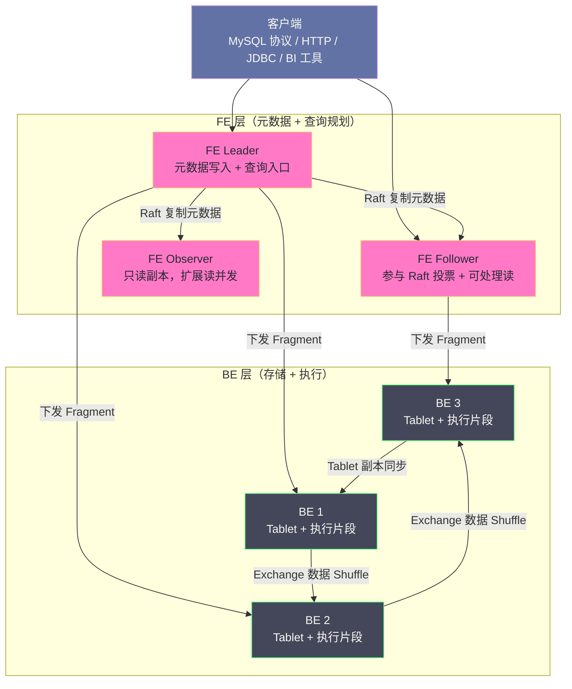
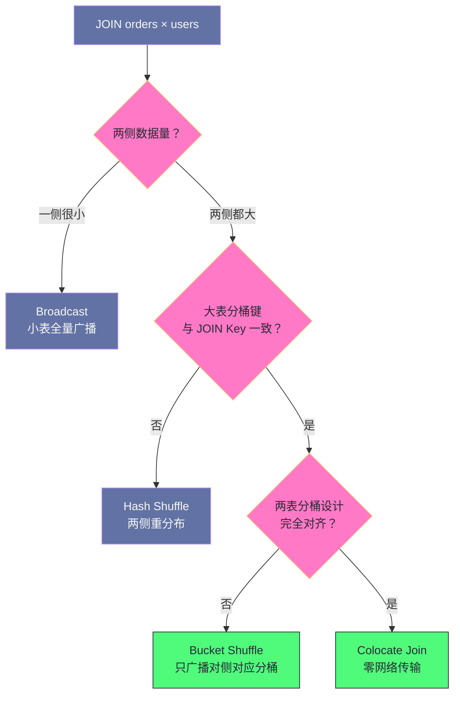

# 01 Doris 全局架构——FE BE 分离与 MPP 执行

**摘要：**

本文从实时分析场景的三条历史路线讲起——预计算（Kylin 式的 Cube）、同质 MPP 节点（ClickHouse 式的无规划层架构）、以及搜索引擎兼做分析（Elasticsearch）——说明它们各自的代价，进而引出 Apache Doris 的定位：用**严格的两层架构**把"查询规划"与"存储执行"分开，在单表极致性能与全场景均衡能力之间选一个不同的平衡点。文章随后逐层拆解 FE 的元数据职责（BDB JE 持久化与 Raft 复制、Fragment 图生成、查询协调）与 BE 的存储执行职责（Tablet 与列式 Segment、副本自愈），讲清 MPP 执行模型中的 Fragment 与三种 Exchange 模式如何决定分布式 JOIN 的代价，以及 Pipeline 执行引擎如何消除阻塞算子。最后给出与 ClickHouse、Trino、StarRocks 的架构对照、Doris 3.0 存算分离的演进方向，以及这套架构不擅长的场景。全文回答两个问题：Doris 为什么要把规划与执行分成两种进程，以及这个选择在哪些负载上占了便宜、在哪些负载上吃了亏。

---

## 第 1 章 实时分析的三条历史路线

### 1.1 三条路线各自的代价

在 Doris 出现之前，企业的实时分析需求通常由三类方案承接，而这三类方案各自都带着一个难以回避的代价。

**路线一：预计算。** 以 Kylin 为代表，把常见查询的结果提前算好存进 OLAP Cube，查询时直接命中预计算结果，延迟极低。它的代价是**维度组合的指数爆炸**：N 个维度最多有 2^N 种组合，不可能全部预计算；更麻烦的是维度一旦变更（新增一个分析维度），历史 Cube 需要全量重算，成本极高。这条路线的本质是"用空间与写入成本换查询延迟"，而它与"业务随时提出新分析角度"这件事天然冲突。

**路线二：同质 MPP 节点。** 以 ClickHouse 为代表，每个节点地位相同，既能接受查询也能存储数据，没有专门的规划层。它把单表聚合的性能推到了极致，代价是三处：**分布式 JOIN 能力弱**（大表与大表关联时缺少成熟的 Shuffle 实现）、**数据更新代价高**（`Mutation` 是异步重写整个数据分区）、以及**副本拓扑需要人工维护**。换句话说，它把复杂度从"查询规划"转移到了"运维与建模约束"上。

**路线三：搜索引擎兼做分析。** 以 Elasticsearch 为代表，凭借倒排索引与分布式聚合能力承接一部分分析查询。它的代价是**存储效率低**（行存加倒排索引的双份开销）与**聚合性能不如专业列式引擎**——在动辄几十亿行的明细聚合上，它与列式存储的差距是数量级的。

### 1.2 为什么会出现 Doris

Doris 的出发点，是承认上述三条路线各自都解决了一部分问题，但都不愿意接受对方的代价，于是尝试在中间找一个平衡点。

它的前身是百度内部的 Palo，2013 年前后立项，用于承接内部报表与实时分析需求；后来开源并进入 Apache 基金会，成为 Apache 顶级项目。它给自己设定的目标可以概括成五条：**兼容 MySQL 协议**（降低迁移与 BI 接入成本）、**支持标准 SQL 与复杂多表 JOIN**（不只是单表聚合）、**支持实时写入与近实时查询**（不是 T+1）、**支持高效的数据更新**（唯一键模型的 UPSERT）、以及**运维简单**（不依赖 ZooKeeper、HDFS 这类外部组件）。

这五条目标里，最值得注意的是最后一条。**Doris 是一个"自带全部依赖"的系统**：它不需要 ZooKeeper 做协调（元数据一致性由 FE 自己用 Raft 解决），不需要 HDFS 做存储（数据落在 BE 的本地盘上），也不需要额外的元数据服务。这一点在落地成本上的价值极高——一套生产集群只有两种进程，没有"外围依赖清单"。

### 1.3 这个平衡点的性质

需要先说明一个容易被误解的地方：Doris 的定位不是"比 ClickHouse 更快"，而是**"在单表极致性能上略逊，在多表关联、数据更新、运维复杂度、SQL 兼容性上全面占优"**。

用一句更准确的话表述：**ClickHouse 优化的是"一条复杂聚合查询能跑多快"，Doris 优化的是"一套分析平台能覆盖多少种查询、需要多少人维护"。** 这两者是不同的目标函数，把它们放在同一个坐标系里比较"谁快"，只会得到误导性的结论。选型的正确问法不是"哪个更快"，而是"我的查询形态与团队规模更接近哪一侧"。

### 1.4 分析型系统的四个能力维度

为了让后文的对比有统一的坐标系，先把分析型系统的能力拆成四个相对独立的维度。

| 维度 | 含义 | 典型指标 |
|---|---|---|
| 单表聚合性能 | 一条大范围扫描加聚合的查询能跑多快 | 扫描吞吐、聚合延迟 |
| 多表关联能力 | 大表与大表关联时的可行性与效率 | 是否支持 Shuffle JOIN、JOIN 延迟 |
| 数据更新能力 | 修改已有数据的代价 | 更新延迟、是否阻塞查询 |
| 运维复杂度 | 维持系统可用所需的人力与外围组件 | 依赖组件数、人工干预频率 |

这四个维度之间存在真实的冲突：**把单表聚合性能推到极致的手段（同质节点、稀疏索引、向量化）往往与多表关联能力冲突**（缺少全局规划层）；**把数据更新做快的手段（原地修改）往往与列式存储的不可变假设冲突**；**把运维做简单的手段（自研共识、内化依赖）需要更多的实现投入**。Doris 的选择是在后三个维度上取较好水平，把第一个维度让给 ClickHouse 一类专精系统。理解这四个维度，就能理解它后续每一个设计决策的动机。

---

## 第 2 章 是什么：FE 与 BE 的两层架构

### 2.1 职责边界

Doris 采用严格的两层架构，两种进程的职责没有重叠。

**FE（Frontend）** 负责三件事：元数据管理（库、表、分区、Tablet 分布、权限、事务状态）、查询规划（解析、语义分析、逻辑优化、基于代价的物理优化，产出分布式执行计划）、以及查询协调（把执行计划分发到 BE、汇总结果返回客户端）。

**BE（Backend）** 负责两件事：数据存储（管理本地磁盘上的 Tablet，以列式 Segment 格式落盘）、以及查询执行（执行 FE 下发的执行片段，做本地扫描、过滤、聚合，并通过 Exchange 与其他 BE 交换数据）。

关键在于：**FE 不碰数据，BE 不做规划。** FE 上没有任何一行业务数据，BE 上没有任何一份元数据（除本地缓存）。这条边界划得很干净，也正是"两种进程、两类扩缩容"这个运维特征的来源。

### 2.2 架构总览



图中有两处需要留意：**FE 与 BE 之间是"下发执行计划"的关系，不是"转发查询"的关系**——BE 拿到的是编译后的执行片段，而不是原始 SQL；**BE 之间有两条独立的数据通路**——一条是 Tablet 副本之间的数据同步（保证存储可靠性），另一条是 Exchange 的数据 Shuffle（服务于单次查询的 JOIN 与聚合）。

### 2.3 FE：元数据的大脑

FE 的元数据管理有一个演进过程，值得单独说明，因为它决定了 FE 的可用性模型。

早期 FE 用 **BDB JE（Berkeley DB Java Edition）** 持久化元数据日志，并借助 BDB JE 自带的复制组能力在多个 FE 之间同步。这套方案的优点是实现简单、久经验证；缺点是它与"共识算法"的语义并不完全对齐，故障场景下的行为不如标准 Raft 那样容易推理。较新的版本逐步用**内置的 Raft 实现**替换了这套方案，使元数据一致性建立在更标准的共识语义之上。

FE 的角色分工如下：

| 角色 | 数量 | 是否参与投票 | 是否可写元数据 | 主要用途 |
|---|---|---|---|---|
| Leader | 1 | 是 | 是 | 承接全部元数据写操作与 DDL |
| Follower | 1 个以上（总数取奇数） | 是 | 否（转发给 Leader） | 参与选举，可处理读查询 |
| Observer | 任意 | 否 | 否 | 只读扩展，不参与选举 |

这套分工带来一个实用结论：**读查询可以通过增加 Follower 或 Observer 来扩展，但元数据写入能力无法扩展**——所有 DDL、所有导入事务的提交都汇聚到单个 Leader 上。这是 FE 侧最常见的瓶颈位置，也是"为什么大批量导入前要合并小批次"这类运维建议的根源。

### 2.4 BE：存储与计算的一体化

BE 是"存储节点"与"计算节点"的合一。每个 BE 管理本地磁盘上的一批 Tablet，每个 Tablet 内部以列式 Segment 格式存储数据（列数据、索引、ZoneMap、BloomFilter 等，细节见 [[02 Doris 存储引擎——Tablet、Rowset 与 Compaction]]）。

副本机制上，每个 Tablet 默认有 3 个副本分布在不同 BE 上。某个 BE 故障时，FE 感知后把该 Tablet 的查询路由到存活副本，同时触发副本补全——在其他 BE 上重建缺失的副本。这个"自动补全"能力是 Doris 运维简单的重要来源：**BE 故障后不需要人工干预副本恢复**，也不存在 ClickHouse 那种"手动维护副本拓扑"的负担。

需要指出的是，存算一体带来了一个结构性的取舍：**扩容时必须同时扩展存储与计算**。当业务需要更多 CPU 来加速查询、但存储已经够用时，仍然要加一整台机器（连同它的磁盘）。这个取舍在 Doris 3.0 的存算分离架构中被专门处理，见第 7 章。

### 2.5 FE 与 BE 之间的接口

FE 与 BE 之间通过两条通路交互，它们的性质完全不同，混淆会导致排查方向出错。

**第一条是"控制通路"**：FE 向 BE 下发执行片段、收集执行状态、管理 Tablet 的元数据变更（如 Compaction 指令）。这条通路的流量很小但延迟敏感——一次查询的启动时间取决于它。

**第二条是"数据通路"**：BE 之间通过 Exchange 交换查询中间结果，以及 Tablet 副本之间的数据同步。这条通路流量可能极大（一次大表 JOIN 的 Shuffle 可能搬运数百 GB），是网络带宽的主要消耗者。

由此得到一条排查原则：**当"查询启动慢"时看控制通路（FE 到 BE 的连接、FE 的规划耗时）；当"查询执行慢"时看数据通路（Exchange 的数据量、BE 之间的网络带宽）。** 两者的问题表现相似（都是查询变慢），但处置方向完全不同。

还有一处细节值得留意：**BE 之间的 Exchange 流量与 Tablet 副本同步流量会争抢同一块网卡**。当一个 BE 正在做大规模副本补全（数据均衡或故障恢复）时，同一节点上正在执行的查询的 Shuffle 速度会受影响。这就是为什么"扩缩容与数据均衡应当限速"——它们虽然不直接服务查询，却会通过共享网络影响查询。

### 2.6 对外协议与接入方式

Doris 对外暴露多个端口与协议，理解它们的分工有助于排查"连不上"这类问题。

| 协议 | 典型用途 | 特征 |
|---|---|---|
| MySQL 协议 | 客户端查询、JDBC/ODBC、BI 工具接入 | 兼容 MySQL 语法与驱动，无需专用客户端 |
| HTTP 协议 | Stream Load 导入、Web UI、管理接口 | 用于数据导入与运维操作 |
| 内部 RPC | FE 与 BE、BE 与 BE 之间 | 不对外暴露，用于执行计划下发与数据交换 |

MySQL 协议兼容这一点的价值容易被低估。它意味着**绝大多数已有的 BI 工具、SQL 客户端、ORM 框架都能零改造接入**，不需要为 Doris 单独开发连接器。这直接降低了"把 Doris 接进现有分析链路"的成本——而这恰恰是很多团队选择它的现实原因之一：技术能力的对比往往不是决定因素，接入成本才是。

同时也要注意这个兼容的边界：**兼容 MySQL 协议不等于兼容 MySQL 的全部语义**。事务隔离级别、部分函数行为、以及锁语义都与 MySQL 有差异。把依赖 MySQL 特定语义的 SQL 直接搬到 Doris 上，可能得到不同的结果，这一点在迁移阶段需要逐条核对。

---

## 第 3 章 为什么这样设计：规划与执行分离

### 3.1 无状态查询与有状态元数据

FE 的角色可以概括为"**无状态的查询处理 + 有状态的元数据管理**"这样一个混合体。

查询处理是无状态的：任何一个 FE（无论 Leader、Follower 还是 Observer）都能完整地解析 SQL、生成执行计划、协调 BE 执行。因此读查询可以在 FE 之间任意分发，天然具备水平扩展能力。

元数据管理是有状态的：库表结构、分区信息、Tablet 分布、事务状态这些内容必须在多个 FE 之间保持一致。因此它被收敛到 Leader 单点写入，通过共识协议复制到其他 FE。

这个混合体的好处是**两类负载可以分别扩展**：读查询压力大就加 Observer，元数据写入压力大就只能优化写入模式（合并批次）或升级 Leader 的硬件。这个区分很重要——很多团队在 FE 性能不足时第一反应是"加 FE"，而如果瓶颈在元数据写入上，加 FE 是无效的。

### 3.2 反事实：如果 Doris 也是同质节点架构

设想 Doris 也采用 ClickHouse 那样的同质节点架构——每个节点既做规划又做存储，会怎样？

**第一，复杂 JOIN 会变得难以实现。** 分布式 JOIN 的关键是"在正确的节点上汇聚正确的数据"，这需要一个全局视角来决定谁做 Build 侧、谁做 Probe 侧、用 Broadcast 还是 Shuffle。在没有规划层的情况下，每个节点只能基于局部信息决策，要么退化为全量广播（网络放大），要么退化为两阶段本地聚合（结果可能不正确）。这就是为什么 ClickHouse 长期以来在大表 JOIN 上能力受限。

**第二，查询计划的全局最优性无法保证。** 基于代价的优化需要统计信息（行数、NDV、直方图），而统计信息天然是全局的。没有中心规划层，就无法用全局统计去选择 JOIN 顺序与 JOIN 策略。

**第三，DDL 与元数据变更的协调会变成分布式难题。** 建表、加列、改分桶这些操作需要所有节点达成一致，而"所有节点地位相同"意味着要么引入外部协调服务（ZooKeeper），要么自己实现一套共识——两条路都比"由 FE 统一管理元数据"更复杂。

因此，FE/BE 分离这个设计选择，本质上是**把"全局决策"收敛到一个专门的组件上，用它的单点换取决策质量**。代价就是第 3.3 节要讲的那些。

### 3.3 代价：两种进程、两类扩缩容

这个设计不是免费的，代价落在三处。

**代价一：FE 成为元数据写入的单点。** 所有 DDL 与导入事务都汇聚到 Leader，写入能力无法水平扩展。这直接决定了 Doris 的写入模式必须"攒批"而不是"高频小批"。

**代价二：两种进程、两套运维。** FE 关注的是元数据一致性、JVM 堆内存、事务积压；BE 关注的是磁盘容量、Compaction、Tablet 均衡。运维人员需要同时掌握两套知识，这与"单一类型节点"的系统相比门槛更高。

**代价三：多一次网络跳转。** 查询先到 FE 做规划，再下发到 BE 执行。对于"极简单、极高频"的点查而言，这次规划跳转的相对开销不可忽略。Doris 通过 FE 端的计划缓存与执行计划复用部分缓解了这个问题，但它的定位始终是分析型而非点查型。

> [!note] 设计哲学
> Doris 的架构选择可以概括为"**用中心化的规划换取全局最优的执行**"。它承认"每个节点都聪明"这条路走不通——因为分布式 JOIN 与代价优化需要全局信息；因此它专门划出一个组件负责"想"，让其余组件专心负责"做"。这与很多分布式系统的思路正好相反（那些系统倾向于把决策下放到节点以避免中心瓶颈），而 Doris 用"元数据写入不可扩展"这个明确的代价，换来了"查询规划可以做得足够好"这个更重要的能力。

### 3.4 分层带来的三个工程收益

除了"能做更好的查询规划"这个直接收益，分层架构还带来了三个容易被忽略的工程收益。

**收益一：故障隔离。** FE 出问题不影响已存储的数据（数据在 BE 上完好），BE 出问题不影响元数据（元数据在 FE 上完好）。这意味着两类故障的恢复手段完全不同，也意味着"元数据损坏"与"数据丢失"是两件需要分别设计防护的事。

**收益二：升级与变更可以分步。** FE 与 BE 可以分别升级、分别重启，不必"整个集群同时停机"。实践中通常是先滚动升级 BE（数据面），再升级 FE（控制面），每一步都可以验证后再推进。

**收益三：扩容决策有明确的依据。** 当查询慢时，可以先判断是"FE 规划慢"还是"BE 执行慢"，再决定是加 FE 还是加 BE。同质架构下这个判断要困难得多——因为同一个节点既做规划又做执行，指标混在一起。

这三个收益的共同点是**它们都不体现在性能数字上，而体现在"运维的可操作性"上**。这也是为什么评估一套分析系统时，不能只看基准测试的吞吐与延迟——分层清晰带来的可维护性，在系统的第二年、第三年会体现为明显的成本差异。

---

## 第 4 章 MPP 执行模型

### 4.1 Fragment 与 Exchange

Doris 把一条 SQL 的执行计划分解为若干 **Fragment（执行片段）**，每个 Fragment 在一个 BE 上执行，Fragment 之间通过 **Exchange 节点**交换数据。

以一个典型的关联聚合查询为例：

```sql
SELECT u.region, SUM(o.amount)
FROM orders o JOIN users u ON o.user_id = u.user_id
WHERE o.date >= '2026-01-01'
GROUP BY u.region
ORDER BY SUM(o.amount) DESC
LIMIT 100;
```

它会被拆成如下几个片段：

```text
Fragment 0（Scan orders）：所有 BE 并行扫描 orders 的 Tablet
  ├── 本地过滤 date >= '2026-01-01'
  └── Exchange（按 user_id 做 Hash Shuffle）→ Fragment 2

Fragment 1（Scan users）：所有 BE 并行扫描 users
  └── Exchange（Broadcast 或按 user_id Shuffle）→ Fragment 2

Fragment 2（Join + 局部聚合）：按 user_id 完成 Hash JOIN
  ├── 本地按 region 做局部 SUM
  └── Exchange（按 region 做 Hash Shuffle）→ Fragment 3

Fragment 3（全局聚合 + 排序）：合并各 Fragment 2 的局部聚合
  └── 全局 GROUP BY region + ORDER BY + LIMIT → 返回 FE
```

这里有两处关键设计值得点出。**第一，聚合被拆成"局部聚合 + 全局聚合"两阶段**，这是 MPP 系统的标准做法——先在数据所在节点做局部归约，再把归约结果做一次小规模 Shuffle，避免把明细数据全量搬到一起。**第二，两次 Exchange 使用的分发策略不同**（第一次按 JOIN Key、第二次按 GROUP BY Key），分发策略的选择直接决定了网络传输量，这正是 FE 的 CBO 要解决的问题。

### 4.2 三种 Exchange 模式

Exchange 的数据分发有几种模式，它们的取舍决定了分布式 JOIN 的代价。

| 模式 | 机制 | 适用条件 | 主要代价 |
|---|---|---|---|
| Broadcast | 把小表全量广播到所有参与大表扫描的 BE | 一侧明显很小 | 网络传输量 = BE 数 × 小表大小 |
| Hash Shuffle | 两侧按 JOIN Key 哈希重分布，同 Key 落到同一 BE | 两侧都较大 | 两侧都要走网络 |
| Bucket Shuffle | 大表按分桶键分布，只把另一侧的对应分桶广播过去 | 大表分桶键与 JOIN Key 一致 | 依赖建表时的分桶设计 |
| Colocate | 两侧都按同一分桶键与分桶数分布，无需网络 | 建表时规划为同一 colocate group | 依赖建表时的联合规划 |

四种模式按"网络代价"从高到低排列，而它们对"建表设计"的依赖恰好相反：**Broadcast 与 Hash Shuffle 是运行时可自由选择的，Bucket Shuffle 要求大表的分桶键与 JOIN Key 一致，Colocate 要求两张表的分桶设计完全对齐。** 换句话说，网络代价越低，对建表设计的前置要求越高——这是"用设计换性能"的典型形态。



### 4.3 Pipeline 执行引擎

Fragment 内部还存在一层优化空间。早期的执行模型是"算子逐个串起来"：一个算子处理完一批数据交给下一个，而某些算子天生是**阻塞的**——比如 Hash JOIN 的 Build 阶段必须先把一侧数据全部读入内存建表，才能开始 Probe；Sort-based Aggregation 必须等全部数据才能输出结果。

阻塞算子的问题在于"等待期间线程闲置"。在传统的"一线程一算子"模型下，一个线程卡在阻塞算子上时，它对应的 CPU 核心就是空的。

Pipeline 执行引擎的思路是把阻塞算子拆成可异步推进的多个阶段：Build 阶段分批写入 HashTable（非阻塞），一旦 HashTable 就绪就立刻启动 Probe 阶段；阶段之间用**有界缓冲队列**传递数据批次，队列满则生产者暂停、队列空则消费者等待——这种背压机制让整个流水线自动调节速率。**这样做的直接收益是 CPU 利用率：线程不再因为等待而闲置，而是切换到其他可推进的任务上。**

在这之上，向量化执行进一步把"每次处理一行"改为"每次处理一批（通常数千行）"：批内的列数据在内存中连续存放，编译器与 SIMD 指令可以批量处理，同时减少了函数调用次数与缓存失效。向量化与 Pipeline 是配套的——**Pipeline 提供的是"什么时候执行"，向量化提供的是"每次执行多少"**，两者共同构成了 Doris 2.0 之后查询性能提升的主要来源（细节见 [[03 Doris 查询引擎——向量化执行与 Pipeline]]）。

### 4.4 Fragment 的并行度与资源分配

Fragment 的划分决定了"有多少个执行单元可以并行"，而并行度又决定了资源能否被用满。这里有三层并行度需要区分。

**第一层是 Fragment 内的并行度。** 一个 Fragment 内部可以拆成多个 Pipeline 实例（通常对应 CPU 核心数），每个实例处理一部分数据。这一层决定了单节点内的 CPU 利用率。

**第二层是 Fragment 之间的并行度。** 扫描 Fragment 会在所有持有相关 Tablet 的 BE 上并行执行，因此扫描并行度等于 Tablet 数（受 BE 数约束）。这一层决定了集群范围内的 IO 与 CPU 利用。

**第三层是查询之间的并发。** 多个查询同时执行时，它们会争抢同一批 BE 的 CPU 与内存。Doris 通过查询队列与内存上限来控制这一层的冲突——当并发查询的内存需求超过 BE 的上限时，部分查询会排队等待或被拒绝。

三层并行度的调优方向不同：第一层受 CPU 核数与算子实现影响，第二层受 Tablet 数与分桶设计影响，第三层受 BE 的内存容量与查询队列配置影响。**把"查询慢"一律归因到"并行度不够"是常见的误判**——如果是第三层（并发争抢）导致的慢，提高并行度只会让争抢更激烈。

还有一处与资源相关的机制值得提及：**Runtime Filter**。它在运行时把小表的过滤结果（如 Bloom Filter 或最小最大值范围）下推到大表的扫描端，让大表在扫描阶段就跳过不可能命中的行。它的价值在于"用一点点运行时开销换掉大量无效 IO"，而它的前提是 JOIN 的选择性足够高——如果 JOIN 结果几乎包含全部行，Runtime Filter 的收益就不足以覆盖它的生成与传输成本。

### 4.5 MPP 执行的两类失败形态

MPP 执行模型有两个典型的失败形态，识别它们能避免大量无效调优。

**形态一：数据倾斜导致的"长尾"。** 表现为整个查询的耗时由某一个执行实例决定，其余实例早已完成。根因是 Shuffle 之后某个 Key 的数据量远超其他 Key（如按"地区"分组时某个地区占了绝大多数数据）。**它的特征是"加机器无效"**——因为瓶颈在单个实例上，而不是整体算力不足。解法是识别倾斜 Key 并在 SQL 层面做特殊处理（如把倾斜值单独拆分），或改用两阶段聚合把倾斜摊薄。

**形态二：Exchange 成为瓶颈。** 表现为网络流量远高于数据量，或查询卡在 Shuffle 阶段。根因是 JOIN 策略选择不当——该用 Bucket Shuffle 或 Colocate 的场景用了 Hash Shuffle，导致两侧数据全量重分布。**它的特征是"CPU 与磁盘都不忙，但网络打满"**，这也是判断它与其他瓶颈的关键依据。

这两类形态的共同点是：**它们都不是"算力不足"，因此不能通过加资源解决。** MPP 系统最容易被误判的地方就在这里——看到查询慢就去加 BE，而实际上问题出在数据分布或 JOIN 策略上。正确的排查顺序是"先看 Profile 里哪个算子耗时最长，再看那个算子的数据量是否符合预期"，而不是先看集群资源水位。

---

## 第 5 章 元数据一致性与 FE 的可用性

### 5.1 元数据写入路径

一次 DDL（譬如建表）在 FE 内部的路径大致如下：请求到达任意 FE，如果是非 Leader 节点则转发给 Leader；Leader 生成一条元数据编辑日志（Edit Log），持久化到本地并复制给其他 FE；多数派确认后该编辑日志被应用到内存中的元数据镜像；随后 Leader 向客户端返回成功。

这条路径有三个特征值得注意。**第一，元数据变更需要多数派确认**，因此 FE 的写入延迟取决于 FE 之间的网络往返；把 FE 部署在跨机房的节点上，会让所有 DDL 与导入事务的提交都变慢。**第二，编辑日志是追加写的**，因此它本身也存在"日志增长—回放—检查点"的周期，检查点（Checkpoint）负责把内存镜像落盘以缩短重启时的回放时间。**第三，内存镜像的大小直接决定 FE 的堆内存压力**——表越多、分区越多、Tablet 越多，FE 的内存占用越大。这就是"Tablet 数量不能过多"这条建议的根本原因：它不是磁盘问题，而是 FE 堆内存问题。

### 5.2 FE 高可用与选举

FE 集群通常部署奇数个参与投票的节点（1 个 Leader 加 1 到 2 个 Follower）。Leader 故障时，剩余节点通过共识协议选举出新 Leader，选举期间的元数据写操作会失败或阻塞。

这里有一处需要与业务方对齐的语义：**选举期间不是"查询不可用"，而是"写入与 DDL 不可用"**。读查询仍然可以由 Follower 或 Observer 承接（取决于元数据可见性的具体实现），因此业务侧的观感通常是"查询正常但导入报错"。应用层应当把"导入失败"设计为可重试——因为选举通常只持续很短的时间，重试往往就能成功。

### 5.3 为什么"无外部依赖"值得单独强调

Doris 不依赖 ZooKeeper、不依赖 HDFS、不依赖外部元数据服务，这件事的工程价值值得单独说一句。

有外部依赖的系统，其可用性上限被**依赖链上最弱的一环**决定。引入 ZooKeeper 做协调，就意味着 ZK 集群的故障会传导到整个分析系统；引入 HDFS 做存储，就意味着 HDFS 的 NameNode 故障会影响数据读写。Doris 把这两类依赖都内化了：协调由 FE 自己的共识协议解决，存储由 BE 的本地盘加副本机制解决。

代价是 Doris 必须自己把这两件事做对——FE 的共识实现必须足够可靠，BE 的副本机制必须足够健壮。**这是一个"用实现复杂度换部署与运维简洁"的取舍**，也是它相对那些"依赖一堆外部组件"的方案最容易被低估的优势：在中小规模场景下，少三个外围集群意味着少三套监控、少三类故障、少三个需要值班的系统。

### 5.4 元数据的规模约束

FE 的元数据全部常驻内存，这带来一条容易被忽略的容量约束：**系统的规模上限不只由数据量决定，还由"对象数量"决定。**

具体来说，FE 内存中需要维护的对象包括：库、表、分区、Tablet、副本、事务、以及各类统计信息。其中**分区数与 Tablet 数**是增长最快的两项，因为它们由"分区粒度 × 分桶数"决定，而这个乘积很容易在设计阶段被低估。

举一个具体的量级：一张按天分区、每天 32 个桶、保留两年的表，会产生 730 × 32 个 Tablet，即两万三千多个；如果有几十张这样的表，Tablet 总数就会达到几十万级，每个 Tablet 还要乘以副本数。**这些对象的元数据都要占用 FE 的堆内存**，于是"FE 内存不足"往往不是因为它处理了太多查询，而是因为元数据对象太多。

由此推出的两条设计纪律是：**分区粒度不要过细**（能用月分区就不要用天分区，除非单分区数据量确实过大）；**分桶数不要过大**（够用即可，因为它会被分区数放大）。这两条纪律的本质是同一个：**在 FE 的内存容量与查询并行度之间找平衡点。**

---

## 第 6 章 数据分布：分区、分桶与 Tablet

### 6.1 两层分片

Doris 用两层机制把一张表的数据映射到具体的存储位置。

**第一层是分区（Partition）**：按时间或业务维度把表切分为若干独立的数据范围。分区的主要价值有两条——**查询剪枝**（只扫描相关分区）与**生命周期管理**（按分区做 TTL 删除，而不是逐行删数据）。

**第二层是分桶（Bucket）**：在每个分区内，按分桶键的哈希值把数据分成 N 个桶，每个桶对应一个 **Tablet**。分桶决定了数据在 BE 之间的分布，因此它直接决定了查询的并行度与 JOIN 的代价。

```text
表 orders
 ├── 分区 p202601
 │    ├── Bucket 0 → Tablet 10001（3 副本，分布在不同 BE）
 │    ├── Bucket 1 → Tablet 10002
 │    └── ...（共 N 个 Bucket）
 └── 分区 p202602
      ├── Bucket 0 → Tablet 20001
      └── ...
```

### 6.2 Tablet 与并行度

Tablet 是 Doris 中**并行扫描的基本单元**：同一个 Tablet 的数据只能由一个 BE 扫描，不能跨 BE 并行扫描同一个 Tablet。由此推出两条直接结论。

**结论一：Tablet 数量决定并行度上限。** 如果 Tablet 数少于 BE 数，就会有 BE 无事可做；如果 Tablet 数远多于 BE 数，则可以做到负载均衡，但代价是元数据开销。

**结论二：Tablet 大小需要落在一个合理区间。** 太小则每个 Tablet 的文件数多、打开文件的固定开销占比高；太大则单个 BE 处理一个 Tablet 的耗时长，并行度不足。生产经验通常把单 Tablet 的数据量控制在百 MB 到 GB 之间。

这两条结论共同决定了"分桶数怎么算"这个问题：**分桶数 = 分区预期数据量 ÷ 单 Tablet 目标大小**。需要强调的是，这里应当用"预期最大数据量"而不是"当前数据量"——因为**分桶数在建表后无法直接修改**，改分桶需要重建表并重新导入数据（细节见 [[06 Doris 运维与调优——分区分桶设计、慢查询与扩缩容]]）。

### 6.3 副本与自愈

每个 Tablet 默认三副本，分布在不同的 BE 上。副本的维护由 FE 的调度逻辑负责：BE 故障后，FE 标记受影响的副本为不可用，并把查询路由到存活副本，同时在健康的 BE 上重建缺失副本。

这套机制带来一个重要的运维性质：**副本恢复是自动的，且不需要人工判断"该在哪台机器上补副本"**。运维人员的职责被压缩为"保证集群里始终有足够的健康 BE 可供调度"，而不是"手工编排副本布局"。这与需要人工干预副本拓扑的系统相比，是运维体验上的实质差别。

### 6.4 数据倾斜：分布设计的隐藏代价

分桶设计的另一个隐含假设是"分桶键的哈希值分布均匀"。当这个假设不成立时，就会出现**数据倾斜**：某个 Tablet 的数据量远大于其他 Tablet，导致扫描它的那个 BE 成为整个查询的瓶颈。

倾斜有两种来源。

**第一种是分桶键本身分布不均。** 如果分桶键是"地区"这类低基数列，或者某个值的出现频率远超其他值（如"未知"占了一半），哈希分布就会明显倾斜。这类问题的解法是**选择基数足够高且分布相对均匀的列做分桶键**，或者把分桶键改为复合键。

**第二种是查询条件命中少数分桶。** 即使数据分布均匀，如果查询总是带 `WHERE user_id = 固定值`，那么它只会命中一个 Tablet，其他 BE 完全空闲。这类"查询模式导致的倾斜"无法靠分桶设计解决，只能靠改变查询模式（改成范围查询）或接受低并行度。

识别倾斜的方法是比较各 Tablet 的数据量与各 BE 的扫描行数：如果某个 BE 的扫描量显著高于其他 BE，就说明存在倾斜。**倾斜最典型的症状是"加了机器但查询没变快"**——因为瓶颈集中在少数分桶上，增加 BE 数量并不能摊薄它。

这一点也解释了为什么"分桶键的选择"比"分桶数的计算"更重要：分桶数只影响粒度，分桶键才决定分布是否均匀。

归纳成一份分布设计的检查清单，建表前应当逐条确认：**分区粒度是否与数据生命周期匹配**（能用粗粒度就不用细粒度，因为它会被分桶数放大）；**分桶键是否高频出现在 WHERE 或 JOIN 条件中**（否则分桶无法服务于查询）；**分桶键的基数是否足够高且分布相对均匀**（否则会产生倾斜）；**需要频繁关联的两张表能否对齐分桶设计**（对齐则可享 Bucket Shuffle 或 Colocate）；**分桶数是否按预期最大数据量计算**（因为它事后不可修改）。五条里有任何一条答不上来，都应当先补齐再建表——**因为这几项决策的共同特征是"事后修改的代价远高于事前想清楚"。**

---

## 第 7 章 存算分离：Doris 3.0 的演进方向

### 7.1 存算一体的三个困境

存算一体的架构在数据本地性上有优势——计算尽量发生在数据所在的 BE 上，减少网络传输。但它在弹性上有三个困境。

**困境一：扩缩容粒度粗。** 需要更多计算能力时，必须加整台机器（连同磁盘）；需要更多存储时，也必须加整台机器（连同 CPU）。资源利用率因此难以最优。

**困境二：资源互相争抢。** 密集的 Ad-hoc 查询（计算密集）与大批量数据导入（IO 密集）跑在同一批 BE 上时，会互相干扰——导入的 Compaction 会占用查询所需的 IO。

**困境三：成本结构僵硬。** 存储成本与计算成本被绑在一起，无法按各自的规模独立优化。

### 7.2 Doris 3.0 的分离方案

Doris 3.0 引入存算分离架构，核心变化是**把数据从 BE 本地盘搬到共享存储**（对象存储或 HDFS 之类的远端存储），BE 本地磁盘退化为**缓存层**。

这带来三个直接能力：**计算节点可以独立弹性扩缩**（查询高峰加 BE、低谷减 BE，存储不动）；**计算与存储可以独立选型**（存储用低成本对象存储，计算用高性价比实例）；**多集群可以共享同一份存储**（不需要复制数据）。

代价同样明确：**读取路径多了一跳**——原本从本地盘读，现在要从远端存储读（命中缓存时除外）。因此存算分离架构下，本地缓存的管理与命中率变成了性能的核心变量，这与 [[01 JuiceFS 全局架构——元数据引擎与对象存储的分离设计|JuiceFS]] 那类"缓存本地性"方案面对的是同一个问题。

### 7.3 与 Snowflake 的类比

Doris 3.0 的架构与 Snowflake 的"云服务 + 虚拟仓库"模式在思路上高度相似：都把元数据/规划层与计算层分离，都把存储下沉到共享的对象存储，都靠"计算层可弹性伸缩"来获得成本优势。

这个类比的价值在于提示了同一个取舍：**存算分离换来了弹性与成本结构，代价是"必须自己把缓存做好"。** 在这条路线上，缓存命中率不是一个优化项，而是架构能否成立的前提——这也是为什么存算分离架构几乎都配套了本地缓存、缓存预热与缓存亲和调度这些机制。

### 7.4 存算分离的适用判断

存算分离不是"更先进的架构"，它是一个针对特定条件的优化。判断是否值得采用，可以看三个条件。

**条件一：负载波动明显。** 如果查询压力有明显的波峰波谷（白天报表密集、夜间批量导入），存算分离的弹性伸缩能显著降低成本；如果负载长期平稳，分离带来的收益有限，而缓存未命中带来的性能损失却是持续的。

**条件二：存储规模远大于计算需求。** 如果数据量巨大但日常查询只涉及其中一小部分（典型的历史数据归档加近期热点分析），把存储下沉到低成本介质、只对热点做缓存的收益最大。

**条件三：多集群共享同一份数据的需求真实存在。** 如果同一份数据需要被多个分析集群访问，存算分离可以避免数据复制；如果只有一个集群使用，这个收益为零。

反过来，如果三个条件都不成立（负载平稳、数据规模适中、单一集群使用），那么存算一体的架构在"简单"与"延迟可预测"上反而更优。**判断的依据始终是负载形态与成本结构，而不是"新架构是否更先进"。**

---

## 第 8 章 与同类系统的架构对照

| 维度 | Doris | ClickHouse | Trino | StarRocks |
|---|---|---|---|---|
| 是否有独立规划层 | 有（FE） | 无（节点同质） | 有（Coordinator） | 有（FE） |
| 存储方式 | 自有列式存储（BE 本地盘） | 自有列式存储（MergeTree） | 无自有存储，连接器读外部 | 自有列式存储 |
| 数据更新 | 唯一键模型（Delete Bitmap） | Mutation 异步重写 | 取决于底层数据源 | 主键模型 |
| 分布式 JOIN | 完整 Shuffle / Colocate | 以广播为主 | 完整，但依赖数据源 | 完整 Shuffle / Colocate |
| 外部依赖 | 无 | 无（集群模式需 ZooKeeper） | 需要 Hive Metastore 等 | 无 |
| 定位 | 实时分析 + 均衡能力 | 单表极致聚合 | 联邦查询 | 实时分析（性能取向更强） |
| 与 Doris 的关系 | — | 同类竞品 | 互补（联邦查询） | 同源（早期 fork 自 Doris） |

这张表里有两处需要特别说明。**其一，Trino 与 Doris 不是竞争关系而是互补关系**：Trino 自身不存储数据，它擅长的是"把多个数据源联合起来查询"；Doris 擅长的是"对一份数据做高性能分析"。两者常常一起出现在湖仓架构里——Trino 做跨源联邦查询，Doris 做热点数据的高性能分析。**其二，StarRocks 早期 fork 自 Doris**，两者在架构上同源，后续在查询引擎与存储引擎上各自演化，因此它们的差异更多体现在实现细节与工程取向上，而不是架构范式上。

需要补充一点关于"同类对照"的方法论：**架构维度的对照只能回答"谁更适合什么形态"，不能回答"谁更快"。** 同一份数据、同一条查询，在两种系统上的耗时差异可能来自索引设计、统计信息质量、并行度配置等大量实现细节，而这些细节与架构范式无关。因此这张表的正确用法是"先按架构筛掉明显不匹配的选项，再在剩下的选项上做实测"——而不是把架构对照当成选型的最终依据。

---

## 第 9 章 边界与反例

### 9.1 反例一：把 Doris 当 OLTP 用

Doris 的唯一键模型支持 UPSERT，这让一些团队产生"它可以替代 MySQL"的错觉。但它的写入路径是"追加 Rowset + 标记删除"，每次写入都涉及元数据事务与后续的 Compaction，与行式数据库的原地更新有本质差别。**高频点更新（每秒十万级）在 Doris 上会导致元数据事务压力与 Compaction 积压**，此时正确的选择是把它交给 OLTP 数据库。

### 9.2 反例二：把 Doris 当缓存数据库用

有些架构把 Doris 作为"MySQL 的只读副本"来加速报表，这是合理的；但如果把它作为"MySQL 前面的缓存层"（写入先到 Doris 再异步回写 MySQL），则违背了它的定位——Doris 不提供事务性的跨表写入语义，也不适合作为写路径的权威存储。

### 9.3 反例三：期待"高频小批写入"有良好表现

Doris 的写入模型决定了"攒批"是必须遵守的纪律。每次导入都会产生新的 Rowset 并触发元数据事务，写入频率越高，元数据事务越频繁、Compaction 压力越大。**把"每秒一次的 Stream Load"当作常规写入模式，会在运行一段时间后表现为查询变慢**——而根因在 Compaction 积压，不在查询本身。

### 9.4 反例四：忽略分桶设计的一次性

分桶数不可直接修改，这意味着建表设计是"一次性决策"。很多团队按"当前数据量"设分桶数，结果数据增长后单 Tablet 越来越大、并行度不足，只能重建表迁移数据。**分桶设计应当按预期最大数据量计算，并预留增长空间。**

### 9.5 反例五：把 FE 当成可以随意水平扩展的组件

FE 的读能力可以靠加 Follower/Observer 扩展，但元数据写入能力不行。当导入频繁、DDL 频繁时，加 FE 不会提升写入吞吐，只会增加元数据复制的网络开销。此时正确的动作是**优化写入模式（合并批次）而不是加节点**。

### 9.6 反例六：按"当前数据量"设计分桶

分桶数不可直接修改，因此按当前数据量设计分桶数会在数据增长后失效。更隐蔽的问题是"当前数据量小、看起来分桶数很充足"，于是团队把它当作已验证的设计，等数据涨了十倍才发现单 Tablet 过大、并行度不足。**分桶设计必须按预期最大数据量计算，并留出增长余量。**

### 9.7 反例七：用"加机器"解决倾斜问题

数据倾斜的表现是"查询慢"，而直觉的反应是"加 BE 提升并行度"。但倾斜意味着瓶颈集中在少数分桶上，增加 BE 只会让空闲的机器更多，查询耗时几乎不变。**倾斜问题的唯一解法是改分布设计（换分桶键、加复合键、或调整查询模式），而不是加资源。**

---

## 第 10 章 落点

回到开头的问题：Doris 为什么要把规划与执行分成两种进程？

答案是：**因为分布式 JOIN 与基于代价的优化需要全局信息，而全局信息需要一个中心化的组件来持有。** 这个选择让它在大表关联、数据更新、SQL 兼容性上获得了明显的能力优势，代价是"元数据写入无法水平扩展"与"两套进程两套运维"。用一句话概括这个平衡点：**它把复杂性从"用户必须遵守的建模约束"（同质架构的代价）转移到了"系统内部的两种进程协同"（分层架构的代价）上。**

理解了这条主线，后面几篇的每一个机制都能找到位置：存储引擎的 Tablet 与 Compaction 是"数据怎么组织"、查询引擎的向量化与 Runtime Filter 是"计算怎么加速"、数据模型是"写入语义怎么定义"、导入方式是"数据怎么进来"、运维是"这套系统怎么长期保持可用"。它们共同服务的，是同一个目标——**在保持"简单运维"这个前提的同时，把分析能力做全**。

架构即权衡：Doris 的每一个设计都在某个维度上做了让步，而它之所以能在实时分析领域占住位置，是因为它选择让步的那些维度，恰好是多数团队最不敏感的那些。

最后补一条判断框架，用于回答"这套系统是否适合我"。把前文的分析收敛成四个问题：**第一，我的查询里有没有大量多表关联？**（有则 FE 的分层规划是加分项）**第二，我的数据需不需要高频更新？**（需要则唯一键模型是加分项）**第三，我的团队有多少人力投入分析平台的运维？**（人力有限则"无外部依赖"是加分项）**第四，我的瓶颈是否已经明确落在单表极致聚合上？**（是则应当考虑 ClickHouse 一类专精系统）。四个问题的答案组合起来，就能得出一个比"谁更快"可靠得多的结论。

这也是技术选型的一般规律：**选型不是比较产品的绝对优劣，而是匹配"我的约束条件"与"产品的取舍方向"。** 一个在所有维度上都均衡的系统，往往意味着它在任何一个维度上都不是最优——而"均衡"恰恰是 Doris 主动选择的定位。

---

## 专栏导航

- 下一篇：[[02 Doris 存储引擎——Tablet、Rowset 与 Compaction]]。
- 查询引擎：[[03 Doris 查询引擎——向量化执行与 Pipeline]]。
- 数据模型：[[04 Doris 数据模型——Duplicate、Aggregate 与 Unique]]。
- 实时导入：[[05 Doris 实时数据导入——Stream Load、Routine Load 与 Flink Connector]]。
- 运维与调优：[[06 Doris 运维与调优——分区分桶设计、慢查询与扩缩容]]。
- 返回专栏首页：[[00 专栏导览]]。

---

## 参考资料

1. Apache Doris. 官方文档：架构与核心概念. https://doris.apache.org/zh-CN/docs/gettingStarted/what-is-apache-doris
2. Apache Doris. 官方文档：FE 与 BE 的部署与扩缩容. https://doris.apache.org/zh-CN/docs/admin-manual/cluster-management/expand-and-shrink
3. Apache Doris. 官方文档：存算分离架构（Compute-Storage Separation）. https://doris.apache.org/zh-CN/docs/compute-storage-decoupled/overview
4. Oracle. Berkeley DB Java Edition 文档. https://docs.oracle.com/cd/E17277_02/html/index.html
5. Ongaro D, Ousterhout J. In Search of an Understandable Consensus Algorithm (Raft). USENIX ATC, 2014.
6. Armbrust M, Ghodsi A, Xin R, Zaharia M. Lakehouse: A New Generation of Open Platforms that Unify Data Warehousing and Advanced Analytics. CIDR, 2021.
7. Raasveldt M, Mühleisen H. DuckDB: An Embeddable Analytical Database. ACM SIGMOD, 2019.
8. Dageville B, et al. The Snowflake Elastic Data Warehouse. ACM SIGMOD, 2016.

---

> [!note] 思考题
> 1. Doris 把查询规划收敛到 FE 上，代价是元数据写入不可水平扩展。这个取舍在什么样的业务形态下会变成真正的瓶颈？
> 2. FE 的读能力可以靠加 Observer 扩展，写能力不行。如果业务同时面临"查询压力大"与"导入压力大"，应当如何分别处置？
> 3. Colocate Join 要求建表时就规划好两表的分桶设计。为什么网络代价越低的 JOIN 模式，对建表设计的前置要求越高？
> 4. 存算分离把 BE 本地盘变成缓存层，这与 JuiceFS 的"缓存本地性"面对的是同一个问题吗？
> 5. 如果把 Doris 与 Trino 放进同一个湖仓架构，各自应当承担哪一部分查询？划分依据是什么？
